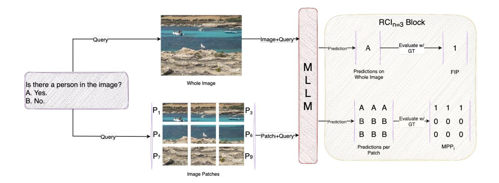
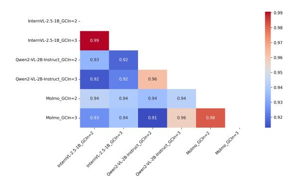
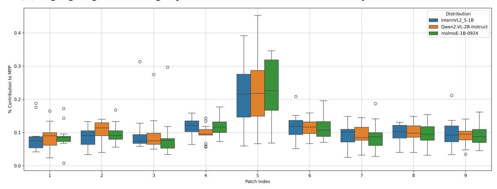
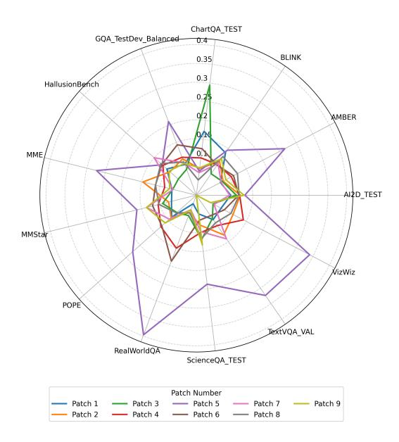
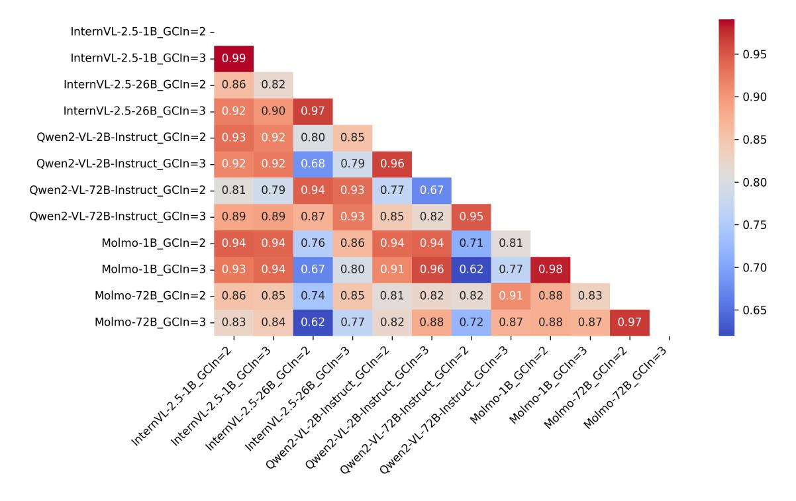
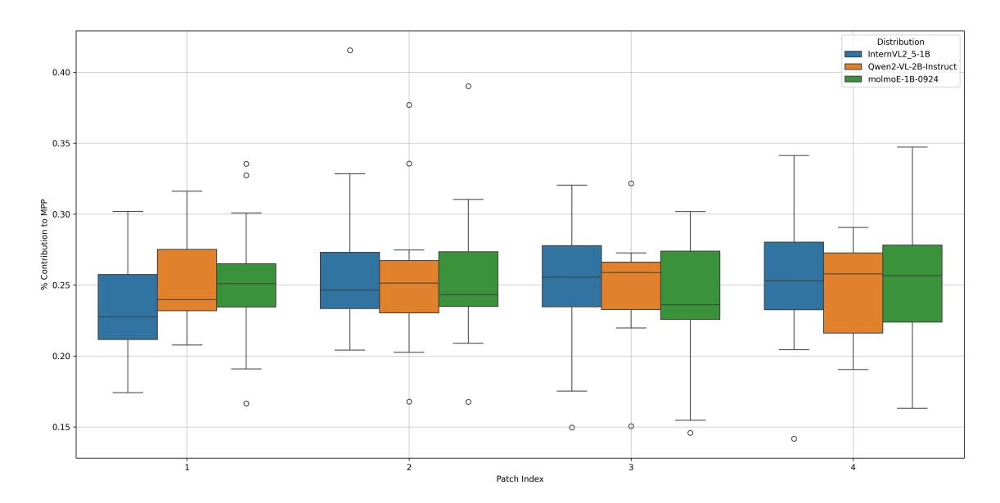
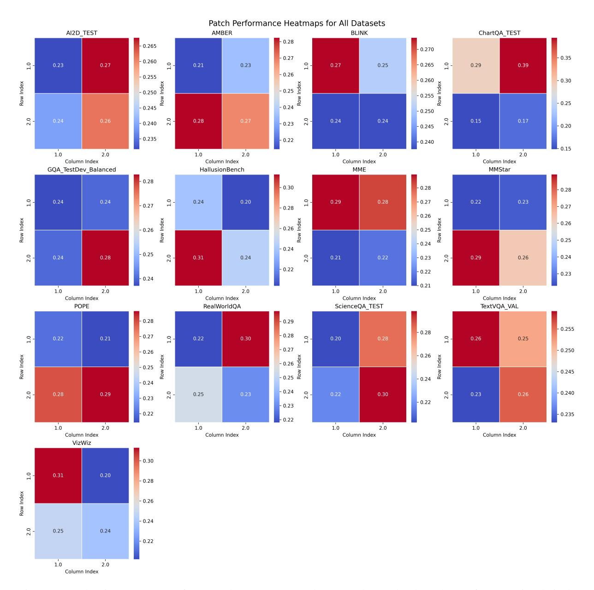
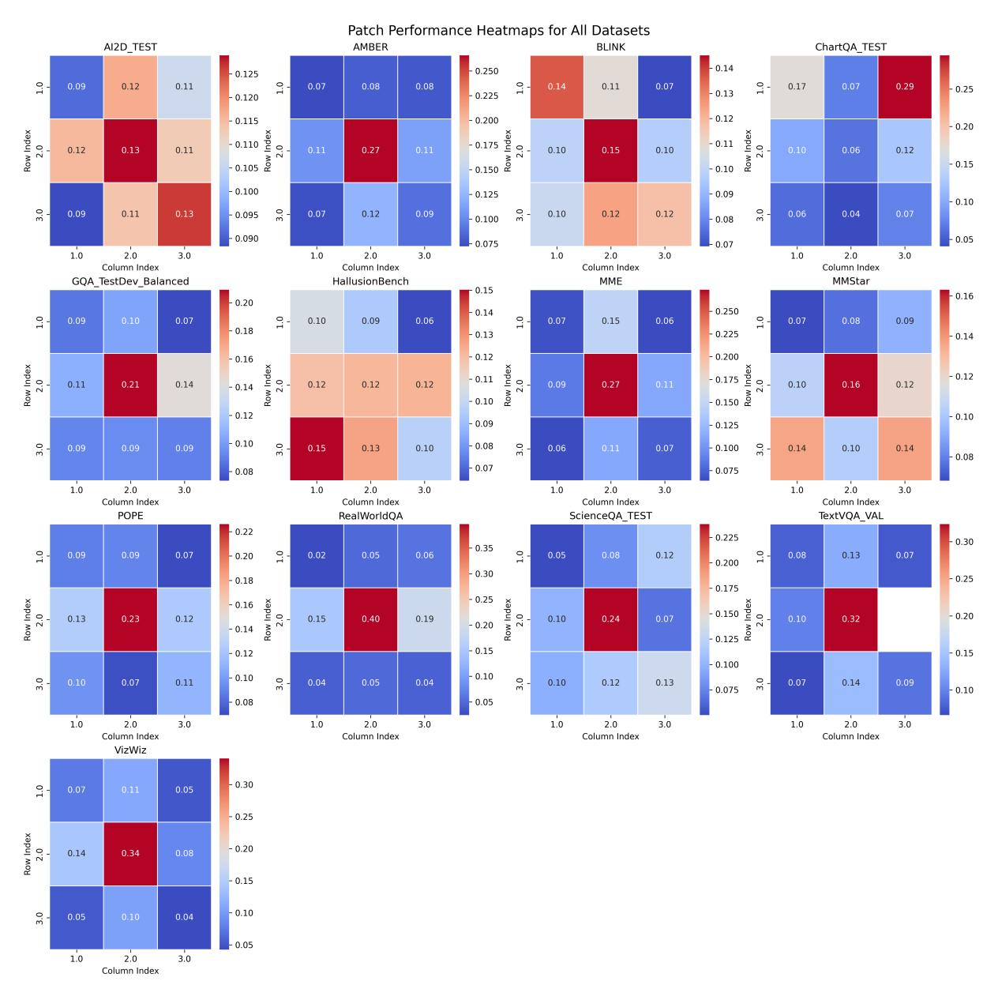

# RCI: A Score for Evaluating Global and Local Reasoning in Multimodal Benchmarks

Amit Agarwal, Hitesh Laxmichand Patel, Srikant Panda, Hansa Meghwani, Jyotika Singh, Karan Dua, Paul Li, Tao Sheng, Sujith Ravi, Dan Roth

## Oracle AI

Correspondence: [amit.h.agarwal@oracle.com](mailto:amit.h.agarwal@oracle.com)

### Abstract

Multimodal Large Language Models (MLLMs) have achieved impressive results on visionlanguage benchmarks, yet it remains unclear whether these benchmarks assess genuine global reasoning or allow success via localized visual cues. Existing evaluation methods do not explicitly measure this distinction, hindering effective dataset curation and real-world focused model development.

We introduce Region Comprehension Index (RCI), the first model-based score to directly quantify a dataset's reliance on global versus local visual information. RCI systematically compares reference-model performance on image patches versus full images, revealing if tasks require holistic image understanding or can be solved with partial or localized visual cues.

When applying RCI to 13 widely used multimodal benchmarks, we observed that most of them favor localized reasoning and exhibit significant spatial biases, indicating potential risks in real-world applications. RCI equips researchers & practitioners with an actionable tool for diagnosing & mitigating these biases, enabling the construction of datasets and benchmarks to foster the development of robust, enterprise-ready multimodal systems.

### 1 Introduction

MLLMs have driven dramatic progress in visionlanguage tasks such as visual question answering [\(Pattnayak et al.,](#page-8-0) [2024,](#page-8-0) [2025a\)](#page-8-1), image captioning, and data generation [\(Agarwal et al.,](#page-7-0) [2024a,](#page-7-0)[b;](#page-7-1) [Pa](#page-8-2)[tel et al.,](#page-8-2) [2024,](#page-8-2) [2025\)](#page-8-3), enabled by advances in model architectures and the availability of largescale datasets and standardized benchmarks. Yet, as these models transition from academic labs to real-world applications [\(Singh,](#page-9-0) [2021,](#page-9-0) [2023\)](#page-9-1), a critical question arises: *Do current benchmarks truly reflect the reasoning demands of practical,* *deployment-oriented systems, or do they enable models to succeed via narrow, localized cues?*

Recent studies [\(Woh et al.,](#page-9-2) [2022;](#page-9-2) [Huang et al.,](#page-8-4) [2024\)](#page-8-4) reveal that many popular benchmarks allow high performance through exploitation of limited or localized visual context, without requiring genuine integration of global visual information across the image. This often results in models that appear robust on paper, but fail to generalize or perform reliably when deployed in real-world settings.

In industrial and mission-critical applications, such as autonomous driving, remote sensing, medical imaging, document intelligence, and large-scale content moderation, models must demonstrate robust *global reasoning*: correlating information distributed across an entire image or scene. Conversely, some practical tasks (e.g., facial recognition, fine-grained inspection, anomaly detection) require only highly *localized reasoning*: analyzing localized visual cues. A persistent challenge is that existing benchmarks rarely make these reasoning dependencies explicit, leading to costly misalignment between evaluation metrics and real-world system requirements.

This ambiguity stems from the design of current benchmarks, many of which can be solved by models leveraging local visual features or cues, creating an illusion of general visual reasoning. This misalignment risks wasted effort and, more importantly, unreliable deployed systems.

In this work, we propose the *Region Comprehension Index* (RCI), a practical, model-based score for auditing and guiding the development of multimodal benchmarks and datasets. RCI systematically compares a reference-model performance on individual image patches versus full images, across different granularities, to quantify whether a dataset requires global (holistic) or local reasoning to succeed. In contrast to traditional evaluation metrics (e.g., FID [\(Yu et al.,](#page-9-3) [2021\)](#page-9-3), CLIPScore [\(Hessel](#page-8-5) [et al.,](#page-8-5) [2021\)](#page-8-5), CIDEr [\(Vedantam et al.,](#page-9-4) [2015\)](#page-9-4)), which

primarily focus on alignment or diversity, RCI provides an actionable signal for both researchers and industry practitioners to diagnose, compare, and curate benchmarks that better match real-world deployment needs. Our key contributions are:

- Introducing RCI, the first score to explicitly quantify global vs. local reasoning requirements in multimodal benchmarks.
- Presenting a structured, patch-based evaluation framework to reveal and analyze spatial reasoning biases in vision-language datasets.
- Applying RCI to 13 widely-used benchmarks, providing insights for data & system designers in both research & industry contexts.

By enabling practitioners to audit and align benchmarks with actual application demands, RCI helps bridge the gap between academic evaluation and real-world deployment, supporting the development of robust, generalizable multimodal systems.

## 2 Related Work

#### 2.1 Vision-Language Benchmarks

Vision-language benchmarks such as MS COCO [\(Chen et al.,](#page-7-2) [2015\)](#page-7-2), GQA [\(Hudson and](#page-8-6) [Manning,](#page-8-6) [2019\)](#page-8-6), TextVQA & VizWiz have significantly advanced multimodal model development. However, recent works [\(Geirhos et al.,](#page-8-7) [2020;](#page-8-7) [Guan](#page-8-8) [et al.,](#page-8-8) [2024;](#page-8-8) [Woh et al.,](#page-9-2) [2022;](#page-9-2) [Huang et al.,](#page-8-4) [2024;](#page-8-4) [Kamath et al.,](#page-8-9) [2023\)](#page-8-9) reveal critical limitations: many tasks can be effectively addressed by exploiting localized visual information, creating an *illusion of progress*. For instance, models often leverage minimal contextual clues & biased spatial distributions to achieve deceptively high benchmark scores [\(Woh et al.,](#page-9-2) [2022;](#page-9-2) [Kamath](#page-8-9) [et al.,](#page-8-9) [2023\)](#page-8-9). Benchmarks like SPEC [\(Peng](#page-9-5) [et al.,](#page-9-5) [2024\)](#page-9-5), AMBER, BLINK, MVTamperBench [\(Agarwal et al.,](#page-7-3) [2025b\)](#page-7-3), & What's Up [\(Kamath](#page-8-9) [et al.,](#page-8-9) [2023\)](#page-8-9) explicitly highlight these issues by isolating fine-grained spatial-temporal & semantic reasoning tasks, uncovering significant model limitations. Such localized shortcuts undermine robustness, interpretability, & generalization, impacting real-world applications like medical analysis [\(Pattnayak et al.,](#page-8-10) [2025b\)](#page-8-10), document analysis [\(Meghwani et al.,](#page-8-11) [2025;](#page-8-11) [Agarwal et al.,](#page-7-4) [2025a,](#page-7-4)[c\)](#page-7-5), accessibility for visually impaired users [\(Panda et al.,](#page-8-12) [2025a,](#page-8-12)[b](#page-8-13)[,c\)](#page-8-14), & autonomous

navigation, where comprehensive visual and audio reasoning is essential [\(Singh,](#page-9-6) [2022\)](#page-9-6).

## 2.2 Spatial Reasoning and Dataset Quality Assessment

Spatial reasoning remains a challenging yet essential capability for vision-language models [\(Wu](#page-9-7) [et al.,](#page-9-7) [2024;](#page-9-7) [Kamath et al.,](#page-8-9) [2023\)](#page-8-9). Recent research demonstrates widespread deficiencies in spatial relation comprehension, even among advanced models [\(Kamath et al.,](#page-8-9) [2023\)](#page-8-9). For example, SPEC explicitly diagnoses model comprehension of spatial attributes, demonstrating near-random performance even for state-of-the-art MLLMs [\(Peng](#page-9-5) [et al.,](#page-9-5) [2024\)](#page-9-5). Similarly, [Zhao et al.](#page-9-8) [\(2023\)](#page-9-8) highlight the importance of dataset quality, revealing substantial annotation issues that exacerbate spatial reasoning deficiencies. To address these shortcomings, some researchers have proposed visual prompting techniques, guiding model's attention explicitly through visual cues [\(Yu et al.,](#page-9-9) [2024\)](#page-9-9).

### 2.3 Metrics for Vision-Language Tasks

Traditional metrics like CIDEr, BLEU [\(Papineni](#page-8-15) [et al.,](#page-8-15) [2002\)](#page-8-15), and METEOR [\(Banerjee and Lavie,](#page-7-6) [2005\)](#page-7-6) primarily assess linguistic properties such as caption similarity and diversity, but fail to explicitly capture deeper reasoning capabilities or spatial dependencies. Metrics like CLIPScore and FID evaluate cross-modal alignment and image realism.

Recently, [Tao et al.](#page-9-10) [\(2024\)](#page-9-10) probed multimodal models for global and local semantic representations, highlighting discrepancies in representation across model layers. Although insightful, this work does not quantify how datasets themselves structure or promote spatial reasoning explicitly.

Our Contribution Our research explicitly addresses these critical gaps by introducing RCI. Unlike previous approaches that focus on isolated evaluation dimensions or linguistic alignment, RCI systematically measures and reveals whether a dataset's tasks fundamentally depend on integrating information across the entire image, or can be addressed using isolated regions.

### 3 Methodology

To assess whether a benchmark truly evaluates global versus local reasoning, we propose a patchbased evaluation framework. RCI is designed as a practical, model-based score for dataset auditing and curation, not for optimizing model perfor-

Figure 1: Computation of Full Image Performance (FIP) and Maximum Patch Performance (MPP) on a sample from the POPE benchmark. FIP (top) evaluates model performance on the full image, while MPP (bottom) identifies the highest-performing patch. These are aggregated across the dataset to compute RCI.

mance. We emphasize that RCI is a descriptive, not prescriptive, metric. It does not label a benchmark as "invalid" because many items can be solved with localized visual cues. Instead, RCI quantifies the type of visual information a benchmark rewards, helping dataset designers align benchmarks with the intended reasoning requirements of their applications. This framing underscores our focus on aiding dataset curation and benchmark evaluation, rather than optimizing specific model performance.

Below, we detail our evaluation framework and formalize RCI.

### 3.1 Patch-Based Evaluation Framework

In our framework (Figure [1\)](#page-2-0), each image is systematically divided into n×n non-overlapping, equally sized patches, where n controls spatial granularity. For each patch, we independently evaluate the reference-model's performance, thereby isolating the contribution of localized visual information. This approach reveals whether a benchmark can be solved by focusing on specific regions or genuinely requires holistic image understanding.

We adopt a regular grid partitioning to ensure that patch selection is systematic, unbiased, and easy to interpret. This approach avoids the confusion and implementation overhead of object-centric or saliency-based patching, making results more reproducible and conclusions more comparable across benchmarks. Specifically, we study:

• n = 1 (full image): Baseline for RCI

• n = 2 (four patches): Coarse-level for RCI

• n = 3 (nine patches): Fine-level for RCI

We explored higher n, in selected experiments (see Appendix [A.5.3\)](#page-13-0), finding diminishing gains & substantially increased computational cost (n 2 ).

### 3.2 Region Comprehension Index (RCI)

RCI quantifies the extent to which solving a dataset's tasks requires global versus localized visual information. For patch granularity n, RCI is defined as:

$$RCI_n = 1 - \frac{MPP_n}{FIP}$$
 (1)

where:

- MPPn (Maximum Patch Performance): The aggregated model performance on the bestperforming individual patch (per sample) is used, at granularity n.
- FIP (Full Image Performance): The aggregated model performance over full-image for each sample.

RCI does not require patch-level annotations. Instead, it reuses existing item labels and selects the best-performing patch per item using the benchmark's native scorer, ensuring no new annotations are necessary. This makes RCI a model-based audit tool that evaluates dataset reasoning requirement without altering the dataset itself. See Appendix [A.1](#page-10-0) for detailed definitions & intuition.

Validity Domain & Chance. We interpret RCI only when the full-image performance (FIP) exceeds a dataset-specific chance threshold by a

small margin (Appendix [A.2\)](#page-10-1). Formally, a (dataset, model) pair (d, m) is considered valid if

$$FIP(d, m) \ge chance(d) + \Delta_{min},$$

where ∆min = δ = 1.0 percentage point by default, or max{δ, 2 SE} when confidence intervals (CIs) are reported. All dataset-model pairs in our study satisfy this criterion.

Interpretation: RCI can be interpreted as shown in Table [1.](#page-3-0) RCI is not a metric in the geometric sense, nor is it a normalized score between 0 and 1, but rather a comparative score. As with other model-based evaluation scores (e.g., CLIPScore), its absolute value may vary across datasets and the reference-models used. However, in our experiments, we observe that RCI trends are robust across a variety of reference-model architectures, underscoring its practical utility for both academic and industrial benchmarking.

| RCI Value | Interpretation                                    |  |  |  |
|-----------|---------------------------------------------------|--|--|--|
| RCI ≫ 0   | requires strong Task global reasoning    |  |  |  |
| RCI ≈ 0   | Balanced global and local reasoning            |  |  |  |
| RCI ≪ 0   | Task can be solved with lo calized visual cues |  |  |  |

Table 1: Interpretation of RCI values in terms of task reasoning requirements.

Guidance for RCI. To facilitate interpretation of RCI values, we introduce qualitative bands based on the dataset's requirement for local vs. global visual information:

- Strong local (RCI ≤ −0.30): The dataset heavily rewards local visual features, with limited global reasoning required for high model performance.
- Moderate local (−0.30 < RCI ≤ −0.10): The dataset relies on local features but still requires some degree of global reasoning.
- Balanced (−0.10 < RCI ≤ +0.10): The dataset requires a balance of local and global reasoning, with no clear preference for one over the other.
- Moderate global (+0.10 < RCI ≤ +0.30): The dataset favors global reasoning but still has elements where local features are important.

• Strong global (RCI ≥ +0.30): The dataset predominantly rewards global visual information, with little reliance on local features.

These bands provide a clear mapping of the RCI value to an intuitive understanding of the dataset's requirements for local vs. global visual reasoning. We also recommend percentile-based calibration, especially when applying RCI to larger datasets, where adjustments may be needed depending on the dataset's inherent structure.

### 3.3 Spatial Bias Analysis

To diagnose whether certain image regions disproportionately affect performance on benchmark , we analyze the contribution of each patch across the dataset. Specifically, for every patch position, we compute the fraction of total correct predictions (or score) resulting from that patch when used in isolation. This reveals if particular regions, such as the image center: dominate task success, indicating potential spatial shortcuts or artifacts in the benchmark design. Identifying such biases helps dataset creators diversify content placement and mitigate unintended model shortcuts.

### 4 Experiments and Results

We apply our RCI-based evaluation on a comprehensive range of benchmarks, ensuring our evaluation captures variations across task types, visual context granularities and reference-models.

#### 4.1 Experimental Setup

Reference Models for RCI To comprehensively understand dataset designs and the dependency on global versus localized reasoning, we selected models based on the following key criteria: (1) Architectural Diversity, (2) Reasoning Capabilities, (3) Grounding and Localization Sensitivity, and (4) Scalability and Efficiency. Based on these we, shortlisted InternVl-2.5-1B, Qwen2-VL-2B, and Molmo-1B models for RCI computation.

Datasets & Benchmarks We evaluate RCI across the following vision-language benchmarks:

- Multiple-Choice QA (MCQ): AI2D, BLINK, MMStar, ScienceQA, RealWorldQA.
- Yes/No Classification: AMBER, MME, POPE, HallusionBench.
- Visual Question Answering (VQA): GQA, ChartQA, TextVQA, VizWiz.

Evaluation Protocol. We evaluate using patch granularities n ∈ {2, 3}, balancing computational efficiency with the dataset's reasoning requirements. While finer granularities offer more detail, they incur diminishing returns and increased computational cost. The evaluation is performed using InternVL-2.5-1B, Qwen2-VL-2B, and Molmo-1B models, ensuring robustness across different model types. The smaller models align closely with larger models (r > 0.9) in terms of performance, providing an efficient yet reliable evaluation.

We recommend using these values for efficient yet robust audits. For further details on evaluation protocol, model selection and granularity, refer to Appendix [A.3.](#page-10-2) The benchmark datasets are further elaborated in Appendix [A.4.](#page-11-0)

### 4.2 Results and Discussion

We organize our analysis around core research questions central to evaluating RCI's validity and utility. Each subsection directly addresses one of these questions.

Figure 2: Cross-model correlation of RCI at n=2, 3. High correlations indicates RCI is inherent to dataset rather than specific model behaviors.

## 4.2.1 Does the Choice of Reference-Model Affect RCI?

We assess the robustness of RCI across diverse reference models and scales, including InternVL-2.5, Qwen2-VL, and Molmo. As shown in Figure [2,](#page-4-0) RCI values are highly correlated across architectures (r ≥ 0.91), demonstrating that the global versus local reasoning dependencies measured by RCI are intrinsic to the datasets, rather than artifacts of specific model choices. Comparing small and large model variants (e.g., Qwen2-VL-2B vs. Qwen2-VL-72B) yields similarly high intra-family correlations (r ≥ 0.86), supporting the use of efficient, smaller models for RCI-based dataset audits without loss of diagnostic power. Detailed correla-

tion matrices and further analysis are provided in Appendix [A.5.1,](#page-12-0) confirming RCI's reliability for both research and industry applications.

## 4.2.2 Does RCI Reflect Human Reasoning in Vision-Language Tasks?

To further validate RCI, we conducted a smallscale human study in which annotators solved representative benchmark tasks using individual image patches versus full images. Human performance exhibited similar trends as model-based RCI: tasks with high RCI values were consistently more difficult for humans when restricted to local patches, while tasks with low RCI could often be solved from partial information. This alignment suggests RCI not only diagnoses dataset biases for models, but also reflects human reasoning expectations. Further details are in Appendix [A.5.2.](#page-12-1)

## 4.2.3 What Reasoning Biases Does RCI Reveal?

Table [2](#page-5-0) summarizes RCI results across 13 multimodal benchmarks at patch granularities n = 2, 3. We identify distinct patterns in terms of dependency on global reasoning versus localized reasoning.

Benchmarks in Favor of Localized Reasoning. Benchmarks like BLINK, HallusionBench, MM-Star, RealWorldQA, GQA, and AI2D, consistently exhibit strong negative RCI values. Negative RCI indicates models achieve superior performance using smaller image patches than full images, clearly highlighting substantial dependence on localized reasoning. Such benchmarks thus permit solving the tasks using localized visual cues rather than enforcing global reasoning.

Benchmarks in Favor of Global Reasoning. Benchmarks like ChartQA, ScienceQA, and TextVQA consistently yield positive or near-neutral RCI values, explicitly indicating their reliance on comprehensive global reasoning. For instance, ChartQA tasks require interpreting multiple visual elements like axes, legends, & graphical data simultaneously, enforcing integration of distributed visual information rather than localized cues alone.

Influence of Patch Granularity. Decrease in RCI values observed at finer granularity (n = 3) further exposes localized reasoning biases. For example, MMStar RCI drops notably from -0.235 (n = 2) to -0.286 (n = 3) for RCI with InternVL-2.5, and more drastically for RCI with Molmo from

| Dataset              | InternVL-2.5-1B |        | Qwen2-VL-2B-Instruct |        | Molmo-1B |        |
|----------------------|-----------------|--------|----------------------|--------|----------|--------|
|                      | RCIn=2          | RCIn=3 | RCIn=2               | RCIn=3 | RCIn=2   | RCIn=3 |
| AI2D_TEST            | -0.171          | -0.215 | -0.112               | -0.159 | -0.224   | -0.324 |
| AMBER                | -0.010          | -0.028 | -0.013               | -0.027 | -0.015   | -0.038 |
| BLINK                | -0.231          | -0.294 | -0.204               | -0.367 | -0.383   | -0.516 |
| ChartQA_TEST         | 0.202           | 0.290  | 0.243                | 0.290  | 0.198    | 0.237  |
| GQA_TestDev_Balanced | -0.207          | -0.266 | -0.189               | -0.265 | -0.235   | -0.310 |
| HallusionBench       | -0.267          | -0.346 | -0.223               | -0.353 | -0.216   | -0.355 |
| MME                  | -0.064          | -0.097 | -0.107               | -0.117 | -0.134   | -0.171 |
| MMStar               | -0.235          | -0.286 | -0.262               | -0.389 | -0.296   | -0.458 |
| POPE                 | -0.054          | -0.055 | -0.055               | -0.068 | -0.044   | -0.051 |
| RealWorldQA          | -0.210          | -0.307 | -0.170               | -0.272 | -0.222   | -0.315 |
| ScienceQA_TEST       | 0.037           | 0.060  | 0.071                | 0.124  | 0.044    | 0.080  |
| TextVQA_VAL          | 0.063           | 0.112  | 0.075                | 0.119  | 0.093    | 0.136  |
| VizWiz               | -0.099          | -0.122 | -0.030               | -0.036 | -0.083   | -0.092 |

Table 2: RCI scores for 13 multimodal benchmarks across three reference MLLMs and two patch granularities (n = 2, 3), highlighting the reasoning requirements of each dataset as measured by RCI.

Figure 3: Avg. contribution of each patch to MPPn=3 across all datasets. Central patches (Patch 5) dominate, highlighting localized biases, whereas peripheral patches contribute minimally.

-0.296 to -0.458. This confirms that finer granularity patches accentuate dataset biases toward localized reasoning, highlighting the inadequacy of existing benchmarks to robustly assess global reasoning. We discuss higher values of n, modelspecific trends & illustrative examples in Appendix [A.5.3,](#page-13-0) & [B.3.](#page-18-0)

## 4.2.4 Do Benchmarks Exhibit Systematic Spatial Biases?

We further analyze spatial biases, highlighting how visual information is disproportionately distributed across image patches within benchmarks.

Central Spatial Bias (Patch 5). Figure [3](#page-5-1) and [4](#page-6-0) clearly indicates a strong central bias across benchmarks, with the center patch (Patch 5) consistently contributing the highest to model performance. This confirms a pervasive dataset design flaw where

central visual information disproportionately influences performance, promoting localized reasoning rather than holistic image understanding.

Peripheral Underrepresentation. Peripheral patches (like 1, 3, 7, and 8) consistently exhibit minimal contributions, suggesting benchmarks rarely include significant information in these areas. Such biases hinder the assessment of comprehensive spatial reasoning, potentially compromising model robustness.

Dataset-specific Variability. Certain benchmarks exhibit notable variance in patch contributions. For instance, ChartQA demonstrates substantial reliance on Patch 3 (top-right) (Figure [4\)](#page-6-0), reflecting dataset-specific layouts such as chart legends or annotations. This emphasizes the importance of explicitly understanding dataset structures

Figure 4: Distribution of each patch patch contribution for MPPn=3. Patch 5 consistently dominates, reinforcing strong central spatial biases.

to avoid inadvertent biases.

Patch Granularity Sensitivity. Comparing results at n = 2 and n = 3 granularities (Figure [8,](#page-16-0) [7\)](#page-15-0) we observe finer patches (n = 3) clearly expose spatial biases more prominently than coarser patches (n = 2). Larger patches naturally cover critical regions more evenly, masking biases, while smaller patches reveal precise localization biases. Despite computational constraints, the choice of n = 3 strikes a balance between detailed analysis and computational efficiency, effectively capturing meaningful spatial biases.

All reported results fall within the validity domain: for every dataset–model pair, FIP exceeds the dataset-specific chance floor by at least ∆min (Appendix [A.2\)](#page-10-1).

## 5 Practical Implications for Industry and Deployment

RCI provides an actionable lens for aligning multimodal datasets and benchmarks with the specific reasoning needs of real-world applications. By quantifying the dependency on global versus local visual information, RCI enables practitioners to:

- Audit and select datasets based on the reasoning requirements of target deployment scenarios (e.g., favoring high-RCI datasets for applications needing holistic understanding).
- Detect and address spatial biases during dataset development, supporting the creation

of more balanced and robust benchmarks.

• Continuously monitor and maintain the alignment between production data, benchmark tasks, and application demands as systems evolve.

For detailed practitioner guidance and application examples, see Appendix [B.](#page-14-0) Further discussion of limitations and future directions is provided in Appendix [C.](#page-18-1)

### 6 Conclusion

We introduced the Region Comprehension Index (RCI), the first model-based score to explicitly quantify whether multimodal benchmarks are suitable for global or local visual reasoning to solve tasks. By providing a transparent measure of spatial reasoning dependency, RCI empowers researchers and practitioners to curate and evaluate datasets that are better aligned with real-world application needs, supporting the development of robust MLLMs for deployed systems.

Through systematic evaluation on 13 widelyused benchmarks, we found that most current datasets favor localized reasoning and often contain significant spatial biases and shortcuts, potentially undermining model robustness and generalization in practical settings.

RCI is already integrated into enterprise workflows to guide dataset construction and evaluation to train production-grade multimodal models. Looking forward, we will extend RCI to sequential and broader multimodal domains such as video and audio, further enabling reliable, production-ready AI systems.

### Limitations

While RCI is model-based, our experiments show that its trends are robust across diverse opensource architectures and scales. Nevertheless, absolute RCI values may still reflect reference model choices, and future work could explore ensembles or standardized model sets for evaluation. Our analysis is limited to visual benchmarks and does not address temporal or audio modalities, which present new challenges for reasoning assessment.

Additionally, RCI computation requires multiple model inferences per image (for n = 2, 3 patch granularities), leading to increased cost on large datasets; efficient sampling or approximation methods are a promising area for further research. Our

study focuses on open-source models due to cost and reproducibility; extending RCI to proprietary or closed-source systems remains an open question.

Expanded discussion of these points and further future directions can be found in Appendix [C.](#page-18-1)

## References

- Amit Agarwal, Hansa Meghwani, Hitesh Laxmichand Patel, Tao Sheng, Sujith Ravi, and Dan Roth. 2025a. [Aligning llms for multilingual consistency in enter](https://arxiv.org/abs/2509.23659)[prise applications.](https://arxiv.org/abs/2509.23659) *Preprint*, arXiv:2509.23659.
- Amit Agarwal, Srikant Panda, Angeline Charles, Hitesh Laxmichand Patel, Bhargava Kumar, Priyaranjan Pattnayak, Taki Hasan Rafi, Tejaswini Kumar, Hansa Meghwani, Karan Gupta, and Dong-Kyu Chae. 2025b. [MVTamperBench: Evaluating robustness of](https://doi.org/10.18653/v1/2025.findings-acl.963) [vision-language models.](https://doi.org/10.18653/v1/2025.findings-acl.963) In *Findings of the Association for Computational Linguistics: ACL 2025*, pages 18804–18828, Vienna, Austria. Association for Computational Linguistics.
- Amit Agarwal, Srikant Panda, and Kulbhushan Pachauri. 2024a. Synthetic document generation pipeline for training artificial intelligence models. US Patent App. 17/994,712.
- Amit Agarwal, Srikant Panda, and Kulbhushan Pachauri. 2025c. [FS-DAG: Few shot domain adapting graph](https://aclanthology.org/2025.coling-industry.9/) [networks for visually rich document understanding.](https://aclanthology.org/2025.coling-industry.9/) In *Proceedings of the 31st International Conference on Computational Linguistics: Industry Track*, pages 100–114, Abu Dhabi, UAE. Association for Computational Linguistics.
- Amit Agarwal, Hitesh Patel, Priyaranjan Pattnayak, Srikant Panda, Bhargava Kumar, and Tejaswini Kumar. 2024b. Enhancing document ai data generation through graph-based synthetic layouts. *arXiv preprint arXiv:2412.03590*.
- Satanjeev Banerjee and Alon Lavie. 2005. Meteor: An automatic metric for mt evaluation with improved correlation with human judgments. In *Proceedings of the acl workshop on intrinsic and extrinsic evaluation measures for machine translation and/or summarization*, pages 65–72.
- Lin Chen, Jinsong Li, Xiaoyi Dong, Pan Zhang, Yuhang Zang, Zehui Chen, Haodong Duan, Jiaqi Wang, Yu Qiao, Dahua Lin, and Feng Zhao. 2024a. [Are we](https://arxiv.org/abs/2403.20330) [on the right way for evaluating large vision-language](https://arxiv.org/abs/2403.20330) [models?](https://arxiv.org/abs/2403.20330) *Preprint*, arXiv:2403.20330.
- Xinlei Chen, Hao Fang, Tsung-Yi Lin, Ramakrishna Vedantam, Saurabh Gupta, Piotr Dollár, and C Lawrence Zitnick. 2015. Microsoft coco captions: Data collection and evaluation server. *arXiv preprint arXiv:1504.00325*.
- Zhe Chen, Weiyun Wang, Yue Cao, Yangzhou Liu, Zhangwei Gao, Erfei Cui, Jinguo Zhu, Shenglong Ye, Hao Tian, Zhaoyang Liu, et al. 2024b. Expanding

- performance boundaries of open-source multimodal models with model, data, and test-time scaling. *arXiv preprint arXiv:2412.05271*.
- Zhe Chen, Weiyun Wang, Hao Tian, Shenglong Ye, Zhangwei Gao, Erfei Cui, Wenwen Tong, Kongzhi Hu, Jiapeng Luo, Zheng Ma, et al. 2024c. How far are we to gpt-4v? closing the gap to commercial multimodal models with open-source suites. *arXiv preprint arXiv:2404.16821*.
- Zhe Chen, Jiannan Wu, Wenhai Wang, Weijie Su, Guo Chen, Sen Xing, Muyan Zhong, Qinglong Zhang, Xizhou Zhu, Lewei Lu, et al. 2024d. Internvl: Scaling up vision foundation models and aligning for generic visual-linguistic tasks. In *Proceedings of the IEEE/CVF Conference on Computer Vision and Pattern Recognition*, pages 24185–24198.
- Matt Deitke, Christopher Clark, Sangho Lee, Rohun Tripathi, Yue Yang, Jae Sung Park, Mohammadreza Salehi, Niklas Muennighoff, Kyle Lo, Luca Soldaini, Jiasen Lu, Taira Anderson, Erin Bransom, Kiana Ehsani, Huong Ngo, YenSung Chen, Ajay Patel, Mark Yatskar, Chris Callison-Burch, Andrew Head, Rose Hendrix, Favyen Bastani, Eli VanderBilt, Nathan Lambert, Yvonne Chou, Arnavi Chheda, Jenna Sparks, Sam Skjonsberg, Michael Schmitz, Aaron Sarnat, Byron Bischoff, Pete Walsh, Chris Newell, Piper Wolters, Tanmay Gupta, Kuo-Hao Zeng, Jon Borchardt, Dirk Groeneveld, Crystal Nam, Sophie Lebrecht, Caitlin Wittlif, Carissa Schoenick, Oscar Michel, Ranjay Krishna, Luca Weihs, Noah A. Smith, Hannaneh Hajishirzi, Ross Girshick, Ali Farhadi, and Aniruddha Kembhavi. 2024. [Molmo and pixmo: Open weights and](https://arxiv.org/abs/2409.17146) [open data for state-of-the-art vision-language models.](https://arxiv.org/abs/2409.17146) *Preprint*, arXiv:2409.17146.
- Haodong Duan, Junming Yang, Yuxuan Qiao, Xinyu Fang, Lin Chen, Yuan Liu, Xiaoyi Dong, Yuhang Zang, Pan Zhang, Jiaqi Wang, et al. 2024. Vlmevalkit: An open-source toolkit for evaluating large multi-modality models. In *Proceedings of the 32nd ACM international conference on multimedia*, pages 11198–11201.
- Chaoyou Fu, Peixian Chen, Yunhang Shen, Yulei Qin, Mengdan Zhang, Xu Lin, Jinrui Yang, Xiawu Zheng, Ke Li, Xing Sun, Yunsheng Wu, and Rongrong Ji. 2024a. [Mme: A comprehensive evaluation](https://arxiv.org/abs/2306.13394) [benchmark for multimodal large language models.](https://arxiv.org/abs/2306.13394) *Preprint*, arXiv:2306.13394.
- Xingyu Fu, Yushi Hu, Bangzheng Li, Yu Feng, Haoyu Wang, Xudong Lin, Dan Roth, Noah A. Smith, Wei-Chiu Ma, and Ranjay Krishna. 2024b. [Blink: Multi](https://arxiv.org/abs/2404.12390)[modal large language models can see but not perceive.](https://arxiv.org/abs/2404.12390) *Preprint*, arXiv:2404.12390.
- Zhangwei Gao, Zhe Chen, Erfei Cui, Yiming Ren, Weiyun Wang, Jinguo Zhu, Hao Tian, Shenglong Ye, Junjun He, Xizhou Zhu, et al. 2024. Mini-internvl: A flexible-transfer pocket multimodal model with 5% parameters and 90% performance. *arXiv preprint arXiv:2410.16261*.

- Robert Geirhos, Jörn-Henrik Jacobsen, Claudio Michaelis, Richard Zemel, Wieland Brendel, Matthias Bethge, and Felix A Wichmann. 2020. Shortcut learning in deep neural networks. *Nature Machine Intelligence*, 2(11):665–673.
- Tianrui Guan, Fuxiao Liu, Xiyang Wu, Ruiqi Xian, Zongxia Li, Xiaoyu Liu, Xijun Wang, Lichang Chen, Furong Huang, Yaser Yacoob, Dinesh Manocha, and Tianyi Zhou. 2024. [Hallusionbench: An advanced](https://arxiv.org/abs/2310.14566) [diagnostic suite for entangled language hallucination](https://arxiv.org/abs/2310.14566) [and visual illusion in large vision-language models.](https://arxiv.org/abs/2310.14566) *Preprint*, arXiv:2310.14566.
- Danna Gurari, Qing Li, Abigale J. Stangl, Anhong Guo, Chi Lin, Kristen Grauman, Jiebo Luo, and Jeffrey P. Bigham. 2018. [Vizwiz grand challenge: Answer](https://arxiv.org/abs/1802.08218)[ing visual questions from blind people.](https://arxiv.org/abs/1802.08218) *Preprint*, arXiv:1802.08218.
- Jack Hessel, Ari Holtzman, Maxwell Forbes, Ronan Le Bras, and Yejin Choi. 2021. Clipscore: A referencefree evaluation metric for image captioning. *arXiv preprint arXiv:2104.08718*.
- Zhipeng Huang, Zhizheng Zhang, Zheng-Jun Zha, Yan Lu, and Baining Guo. 2024. [Relationvlm: Making](https://doi.org/10.48550/arXiv.2403.12801) [large vision-language models understand visual rela](https://doi.org/10.48550/arXiv.2403.12801)[tions.](https://doi.org/10.48550/arXiv.2403.12801)
- Drew A. Hudson and Christopher D. Manning. 2019. [Gqa: A new dataset for real-world visual reason](https://arxiv.org/abs/1902.09506)[ing and compositional question answering.](https://arxiv.org/abs/1902.09506) *Preprint*, arXiv:1902.09506.
- Amita Kamath, Jack Hessel, and Kai-Wei Chang. 2023. What's" up" with vision-language models? investigating their struggle with spatial reasoning. *arXiv preprint arXiv:2310.19785*.
- Aniruddha Kembhavi, Mike Salvato, Eric Kolve, Minjoon Seo, Hannaneh Hajishirzi, and Ali Farhadi. 2016. [A diagram is worth a dozen images.](https://arxiv.org/abs/1603.07396) *Preprint*, arXiv:1603.07396.
- Yifan Li, Yifan Du, Kun Zhou, Jinpeng Wang, Wayne Xin Zhao, and Ji-Rong Wen. 2023. [Eval](https://arxiv.org/abs/2305.10355)[uating object hallucination in large vision-language](https://arxiv.org/abs/2305.10355) [models.](https://arxiv.org/abs/2305.10355) *Preprint*, arXiv:2305.10355.
- Pan Lu, Swaroop Mishra, Tony Xia, Liang Qiu, Kai-Wei Chang, Song-Chun Zhu, Oyvind Tafjord, Peter Clark, and Ashwin Kalyan. 2022. [Learn to explain:](https://arxiv.org/abs/2209.09513) [Multimodal reasoning via thought chains for science](https://arxiv.org/abs/2209.09513) [question answering.](https://arxiv.org/abs/2209.09513) *Preprint*, arXiv:2209.09513.
- Ahmed Masry, Do Xuan Long, Jia Qing Tan, Shafiq Joty, and Enamul Hoque. 2022. [Chartqa: A benchmark](https://arxiv.org/abs/2203.10244) [for question answering about charts with visual and](https://arxiv.org/abs/2203.10244) [logical reasoning.](https://arxiv.org/abs/2203.10244) *Preprint*, arXiv:2203.10244.
- Hansa Meghwani, Amit Agarwal, Priyaranjan Pattnayak, Hitesh Laxmichand Patel, and Srikant Panda. 2025. [Hard negative mining for domain-specific re](https://doi.org/10.18653/v1/2025.acl-industry.72)[trieval in enterprise systems.](https://doi.org/10.18653/v1/2025.acl-industry.72) In *Proceedings of the*

- *63rd Annual Meeting of the Association for Computational Linguistics (Volume 6: Industry Track)*, pages 1013–1026, Vienna, Austria. Association for Computational Linguistics.
- Srikant Panda, Amit Agarwal, and Hitesh Laxmichand Patel. 2025a. [Accesseval: Benchmarking dis](https://arxiv.org/abs/2509.22703)[ability bias in large language models.](https://arxiv.org/abs/2509.22703) *Preprint*, arXiv:2509.22703.
- Srikant Panda, Vishnu Hari, Kalpana Panda, Amit Agarwal, and Hitesh Laxmichand Patel. 2025b. [Who's asking? investigating bias through the lens](https://arxiv.org/abs/2508.15831) [of disability framed queries in llms.](https://arxiv.org/abs/2508.15831) *Preprint*, arXiv:2508.15831.
- Srikant Panda, Hitesh Laxmichand Patel, Shahad Al-Khalifa, Amit Agarwal, Hend Al-Khalifa, and Sharefah Al-Ghamdi. 2025c. [Daiq: Auditing demographic](https://arxiv.org/abs/2508.15830) [attribute inference from question in llms.](https://arxiv.org/abs/2508.15830) *Preprint*, arXiv:2508.15830.
- Kishore Papineni, Salim Roukos, Todd Ward, and Wei-Jing Zhu. 2002. Bleu: a method for automatic evaluation of machine translation. In *Proceedings of the 40th annual meeting of the Association for Computational Linguistics*, pages 311–318.
- Hitesh Laxmichand Patel, Amit Agarwal, Arion Das, Bhargava Kumar, Srikant Panda, Priyaranjan Pattnayak, Taki Hasan Rafi, Tejaswini Kumar, and Dong-Kyu Chae. 2025. Sweeval: Do llms really swear? a safety benchmark for testing limits for enterprise use. In *Proceedings of the 2025 Conference of the Nations of the Americas Chapter of the Association for Computational Linguistics: Human Language Technologies (Volume 3: Industry Track)*, pages 558– 582.
- Hitesh Laxmichand Patel, Amit Agarwal, Bhargava Kumar, Karan Gupta, and Priyaranjan Pattnayak. 2024. Llm for barcodes: Generating diverse synthetic data for identity documents. *arXiv preprint arXiv:2411.14962*.
- Priyaranjan Pattnayak, Amit Agarwal, Hansa Meghwani, Hitesh Laxmichand Patel, and Srikant Panda. 2025a. Hybrid ai for responsive multi-turn online conversations with novel dynamic routing and feedback adaptation. In *Proceedings of the 4th International Workshop on Knowledge-Augmented Methods for Natural Language Processing*, pages 215–229.
- Priyaranjan Pattnayak, Hitesh Laxmichand Patel, Amit Agarwal, Bhargava Kumar, Srikant Panda, and Tejaswini Kumar. 2025b. [Clinical qa 2.0: Multi-task](https://arxiv.org/abs/2502.13108) [learning for answer extraction and categorization.](https://arxiv.org/abs/2502.13108) *Preprint*, arXiv:2502.13108.
- Priyaranjan Pattnayak, Hitesh Laxmichand Patel, Bhargava Kumar, Amit Agarwal, Ishan Banerjee, Srikant Panda, and Tejaswini Kumar. 2024. Survey of large multimodal model datasets, application categories and taxonomy. *arXiv preprint arXiv:2412.17759*.

- Wujian Peng, Sicheng Xie, Zuyao You, Shiyi Lan, and Zuxuan Wu. 2024. Synthesize diagnose and optimize: Towards fine-grained vision-language understanding. In *Proceedings of the IEEE/CVF Conference on Computer Vision and Pattern Recognition*, pages 13279–13288.
- Amanpreet Singh, Vivek Natarajan, Meet Shah, Yu Jiang, Xinlei Chen, Dhruv Batra, Devi Parikh, and Marcus Rohrbach. 2019. [Towards vqa models](https://arxiv.org/abs/1904.08920) [that can read.](https://arxiv.org/abs/1904.08920) *Preprint*, arXiv:1904.08920.
- Jyotika Singh. 2021. [Social media analysis using natu](https://doi.org/10.25080/majora-1b6fd038-009)[ral language processing techniques.](https://doi.org/10.25080/majora-1b6fd038-009) In *Proceedings of the 20th Python in Science Conference*, SciPy, page 74–80. SciPy.
- Jyotika Singh. 2022. [pyaudioprocessing: Audio pro](https://doi.org/10.25080/majora-212e5952-017)[cessing, feature extraction, and machine learning](https://doi.org/10.25080/majora-212e5952-017) [modeling.](https://doi.org/10.25080/majora-212e5952-017) In *Proceedings of the 21st Python in Science Conference*, SciPy, page 152–158. SciPy.
- Jyotika Singh. 2023. *[Natural Language Processing](https://doi.org/10.1201/9781003264774) [in the Real World: Text Processing, Analytics, and](https://doi.org/10.1201/9781003264774) [Classification](https://doi.org/10.1201/9781003264774)*. Chapman and Hall/CRC.
- Mingxu Tao, Quzhe Huang, Kun Xu, Liwei Chen, Yansong Feng, and Dongyan Zhao. 2024. [Probing multi](https://arxiv.org/abs/2402.17304)[modal large language models for global and local se](https://arxiv.org/abs/2402.17304)[mantic representations.](https://arxiv.org/abs/2402.17304) *Preprint*, arXiv:2402.17304.
- Ramakrishna Vedantam, C. Lawrence Zitnick, and Devi Parikh. 2015. [Cider: Consensus-based image de](https://arxiv.org/abs/1411.5726)[scription evaluation.](https://arxiv.org/abs/1411.5726) *Preprint*, arXiv:1411.5726.
- Junyang Wang, Yuhang Wang, Guohai Xu, Jing Zhang, Yukai Gu, Haitao Jia, Jiaqi Wang, Haiyang Xu, Ming Yan, Ji Zhang, and Jitao Sang. 2024a. [Amber: An](https://arxiv.org/abs/2311.07397) [llm-free multi-dimensional benchmark for mllms hal](https://arxiv.org/abs/2311.07397)[lucination evaluation.](https://arxiv.org/abs/2311.07397) *Preprint*, arXiv:2311.07397.
- Peng Wang, Shuai Bai, Sinan Tan, Shijie Wang, Zhihao Fan, Jinze Bai, Keqin Chen, Xuejing Liu, Jialin Wang, Wenbin Ge, Yang Fan, Kai Dang, Mengfei Du, Xuancheng Ren, Rui Men, Dayiheng Liu, Chang Zhou, Jingren Zhou, and Junyang Lin. 2024b. [Qwen2-vl: Enhancing vision-language model's per](https://arxiv.org/abs/2409.12191)[ception of the world at any resolution.](https://arxiv.org/abs/2409.12191) *Preprint*, arXiv:2409.12191.
- Sangmyeong Woh, Jaemin Lee, Ho joong Kim, and Jinsuk Lee. 2022. [Towards the human global context:](https://doi.org/10.48550/arXiv.2207.08333) [Does the vision-language model really judge like a](https://doi.org/10.48550/arXiv.2207.08333) [human being?](https://doi.org/10.48550/arXiv.2207.08333)
- Qiucheng Wu, Handong Zhao, Michael Saxon, Trung Bui, William Yang Wang, Yang Zhang, and Shiyu Chang. 2024. [Vsp: Assessing the dual challenges of](https://arxiv.org/abs/2407.01863) [perception and reasoning in spatial planning tasks for](https://arxiv.org/abs/2407.01863) [vlms.](https://arxiv.org/abs/2407.01863) *Preprint*, arXiv:2407.01863.
- XAI-Org. 2024. Realworldqa dataset. [https:](https://huggingface.co/datasets/xai-org/RealworldQA) [//huggingface.co/datasets/xai-org/](https://huggingface.co/datasets/xai-org/RealworldQA) [RealworldQA](https://huggingface.co/datasets/xai-org/RealworldQA). Accessed: 2024-03-15.

- Runpeng Yu, Weihao Yu, and Xinchao Wang. 2024. Attention prompting on image for large vision-language models. In *European Conference on Computer Vision*, pages 251–268. Springer.
- Yu Yu, Weibin Zhang, and Yun Deng. 2021. Frechet inception distance (fid) for evaluating gans. *China University of Mining Technology Beijing Graduate School*, 3(11).
- Ruibin Zhao, Zhiwei Xie, Yipeng Zhuang, and Philip Yu. 2023. [Automated quality evaluation of large](https://doi.org/10.1142/S0129065724500096)[scale benchmark datasets for vision-language tasks.](https://doi.org/10.1142/S0129065724500096) *International Journal of Neural Systems*.

#### A Appendix

#### A.1 Expanded Definitions: MPP and FIP

RCI is based on two key quantities, each computed using the native evaluation metric (e.g., accuracy, CIDEr, VQA score) of the benchmark:

**Maximum Patch Performance (MPP**n): For patch granularity n, each image is divided into  $n \times n$  non-overlapping patches. For each image-question pair, we compute the model's prediction on each patch and select the highest-performing patch as the prediction for that sample. The set of all such "best-patch" predictions is then used to compute the official benchmark metric to yield MPPn:

$$\mathrm{MPP}_n = \mathcal{M}\big(\{\max_{p \in \mathcal{P}_i^{(n)}} F(p, q_i)\}_{i=1}^N\big)$$

where  $\mathcal{M}$  is the benchmark's evaluation metric (e.g., accuracy),  $\mathcal{P}_i^{(n)}$  is the set of  $n \times n$  patches for image i,  $q_i$  is the question or prompt, F is the reference model's prediction for patch p and query  $q_i$ , and N is the dataset size.

**Full Image Performance (FIP):** For the same dataset, FIP is the model's performance when using the full image for each input:

$$FIP = \mathcal{M}(\{F(img_i, q_i)\}_{i=1}^N)$$

where  $img_i$  is the original image.

**Key Property:** Since both  $MPP_n$  and FIP use the same data and evaluation metric, RCI is invariant to metric choice and directly comparable across benchmarks.

#### **Intuitive Explanation:**

- MPPn: "What is the best the model can do if it only sees one patch of the image?"
- FIP: "How well does the model do with the whole image?"
- If  $MPP_n$  is much less than FIP, the tasks in the dataset needs information from multiple regions (global reasoning).
- If MPP $_n$  is close or more to FIP, the tasks in the dataset can be solved well with individual patches (localized reasoning).

#### A.2 Chance Floors & Validity Domain

**Chance floors.** We define a dataset-specific chance baseline, consistent with each dataset's official scorer:

• Multiple-choice QA: uniform guess 1/|C| over options.

- *Yes/No*: 0.5; if label skew is material, we also compute the majority-class baseline and use max(0.5, majority).
- *Open-ended VQA / short-answer*: the majority-answer baseline evaluated with the official scorer (for VQA-style consensus metrics this is typically near zero).

**Validity rule.** We interpret RCI only in non-degenerate regimes where full-image performance (FIP) exceeds the dataset's chance floor by a small absolute margin. A (dataset, model) cell (d, m) is deemed *valid* if

$$FIP(d, m) \ge chance(d) + \Delta_{min},$$
 (2)

with  $\Delta_{\rm min}=\delta$  and  $\delta=1.0$  percentage point by default. When confidence intervals are reported, we adopt a more conservative threshold  $\Delta_{\rm min}=\max\{\delta,\,2\,{\rm SE}\}$ , where SE is the standard error estimated over items (nonparametric bootstrap by default).

**Outcome.** All dataset–model pairs in this paper satisfy (2); consequently, no pairs are suppressed and all reported RCI values are interpreted. The datasets categorization are provided in Table 3.

#### A.3 Extended Experimental Setup

**Benchmark Evaluation Procedure.** To systematically quantify reasoning dependencies within benchmarks, we follow a structured evaluation procedure:

- 1. Obtain model predictions for each image patch independently.
- 2. Identify the patch achieving the highest accuracy relative to ground-truth labels.
- 3. Compute the Maximum Patch Performance  $MPP_n$ , representing the best achievable performance using a single patch at granularity n.
- 4. Calculate the Full Image Performance FIP by evaluating models on full, unaltered images.
- 5. Derive RCI using MPP $_n$  and FIP for the specified granularity.

Each evaluation is executed three times, and we report the averaged results, observing negligible variance across runs. For consistency and reproducibility, evaluations are conducted using VLMEvalKit (Duan et al., 2024).

Model Selection Criteria To comprehensively evaluate dataset biases and the dependency on global versus localized reasoning, we selected models based on the following key criteria:

- Architectural Diversity: We include models with varied architectures, ensuring that our findings are not specific to a single model design but instead generalized across different model families.
- Reasoning Capabilities: Models are chosen to represent a balance between fine-grained local reasoning and global reasoning. This allows us to assess whether benchmarks promote or hinder global reasoning.
- Grounding and Localization Sensitivity: Since RCI specifically analyzes spatial bias, models that excel in object grounding, pointing, and spatial reasoning tasks provide deeper insights into patch-level performance.
- Scalability and Efficiency: We include models optimized for both efficiency and performance while reducing compute requirements for stable RCI.

Models Used Based on these criteria, we selected the following MLLMs for evaluation:

InternVL 2.5-1B [\(Chen et al.,](#page-7-8) [2024c;](#page-7-8) [Gao et al.,](#page-7-9) [2024;](#page-7-9) [Chen et al.,](#page-7-10) [2024b,](#page-7-10)[d\)](#page-7-11) is a large-scale, opensource MLLM that has demonstrated strong performance across diverse multimodal reasoning tasks, including document understanding, commonsense reasoning, and hallucination detection. Its robustness on vision-language benchmarks, including MMMU, makes it particularly suitable for analyzing dataset biases related to local versus global reasoning.

Qwen2-VL-2B [\(Wang et al.,](#page-9-11) [2024b\)](#page-9-11) is a lightweight yet powerful MLLM designed for efficient deployment without sacrificing reasoning capabilities. Notably, it exhibits strong performance in multi-image understanding and long-context reasoning, making it an essential candidate for evaluating RCI, particularly for tasks that require extensive global context comprehension.

Molmo-1B [\(Deitke et al.,](#page-7-12) [2024\)](#page-7-12) is an MLLM specifically designed with an emphasis on finegrained image-text reasoning, grounding, and pointing tasks. Built from scratch using open

datasets such as PixMo, Molmo's architecture is inherently sensitive to spatial biases. Its ability to highlight localized versus global attention patterns makes it a valuable model for our patch-based evaluation and heatmap analyses.

### A.4 Dataset & Benchmarks

We evaluate our approach across 13 widely-used vision-language benchmarks, covering a diverse range of tasks. These datasets were selected to represent a balanced mix of localized perception tasks (e.g., object recognition) and global contextual reasoning challenges (e.g., complex multiple choice question answering).

- Visual Question Answering (VQA): Benchmarks such as GQA [\(Lu et al.,](#page-8-16) [2022\)](#page-8-16), ChartQA [\(Masry et al.,](#page-8-17) [2022\)](#page-8-17), TextVQA [\(Singh et al.,](#page-9-12) [2019\)](#page-9-12), and VizWiz [\(Gurari](#page-8-18) [et al.,](#page-8-18) [2018\)](#page-8-18) are open-ended VQA tasks where MLLMs must generate responses without restricted answer choices. These benchmarks assess a model's ability to infer answers based on both localized and global scene information.
- Multiple-Choice Question Answering (MCQ): Benchmarks including BLINK [\(Fu](#page-7-13) [et al.,](#page-7-13) [2024b\)](#page-7-13), RealWorldQA [\(XAI-Org,](#page-9-13) [2024\)](#page-9-13), AI2D [\(Kembhavi et al.,](#page-8-19) [2016\)](#page-8-19), ScienceQA [\(Lu et al.,](#page-8-16) [2022\)](#page-8-16), and MMStar [\(Chen et al.,](#page-7-14) [2024a\)](#page-7-14) provide multiple answer choices, requiring MLLMs to differentiate between options and select the most accurate response. These tasks evaluate multimodal reasoning and answer disambiguation, offering insights into whether datasets support global contextual reasoning.
- Yes/No Questions (Binary Classification): Datasets such as POPE [\(Li et al.,](#page-8-20) [2023\)](#page-8-20), HallusionBench [\(Guan et al.,](#page-8-8) [2024\)](#page-8-8), AMBER [\(Wang et al.,](#page-9-14) [2024a\)](#page-9-14), and MME [\(Fu et al.,](#page-7-15) [2024a\)](#page-7-15) focus on binary (yes/no) questions. AMBER, in particular, tests the ability of the model to capture fine-grained spatial relationships, making it useful for evaluating whether a dataset enforces strict spatial comprehension.

Our dataset selection ensures a diverse evaluation landscape, encompassing tasks that test both localized visual understanding and complex multi-step reasoning.

| Task type  | Datasets (examples)              | Chance(d) definition                   |
|------------|----------------------------------|----------------------------------------|
| MCQ        | AI2D, BLINK, ScienceQA           | 1/ C  (uniform over options)           |
| Yes/No     | AMBER, MME, POPE, HallusionBench | 0.5 (or majority, whichever is larger) |
| Open-ended | GQA, ChartQA, TextVQA, VizWiz    | Majority-answer under official scorer  |

Table 3: Task-aware chance definitions used for validity checks. All cells in our study pass F IP ≥ chance + δ.

Figure 5: Correlation heatmap comparing RCI for n=2,3; between smaller models and their larger-scale counterparts. The results show consistently high intra-model correlations (≥ 0.86). While larger models show slightly lower crossmodel correlation, the findings reinforce that dataset-induced biases persist even in state-of-the-art architectures, validating the use of smaller models for RCI evaluation.

| Dataset      | Full Img Perf. (%) | Patch Perf. (%) | Perf. Change (%) | RCIn=3 w/ Molmo-1B |
|--------------|--------------------|-----------------|------------------|-----------------------|
| ChartQA_TEST | 93.0               | 66.0            | -27.0            | 0.237                 |
| AMBER        | 80.0               | 82.0            | +2.0             | -0.038                |
| BLINK        | 46.0               | 73.0            | +48.0            | -0.516                |

Table 4: Human accuracy with full images vs. best patch on three benchmarks with varying RCI.

#### A.5 Extended Result & Discussion

#### A.5.1 Reference Model and Scale Comparison

To ensure the generalizability of RCI trends, we compare its behavior across both model architectures and scales. As visualized in Figure [5,](#page-12-3) high intra-model and intra-family correlations (r ≥ 0.86) persist even as model size increases (e.g., Qwen2-VL-2B vs. Qwen2-VL-72B). Notably, even larger models remain highly correlated, their crossmodel correlations are slightly lower. Molmo-72B shows strong alignment with InternVL-2.5-26B

and Qwen2-72B, reinforcing that even the largest models, remain highly sensitive to dataset-induced spatial biases, underlining that benchmark improvements must focus on data construction rather than model architecture and scaling alone.

#### A.5.2 Human Study: Protocol and Findings

Protocol. To assess the alignment between RCI and human reasoning, we selected three representative benchmarks: ChartQA\_TEST (high RCI), AMBER (balanced RCI), and BLINK (low RCI). For each, we sampled approximately 20% of the

dataset (ChartQA\_TEST, AMBER and BLINK). Three annotators (authors of the paper) answered benchmark questions under two conditions: (1) seeing only the best-performing patch, and (2) seeing the full image. Annotators were not shown model outputs or dataset labels and could consult task instructions as needed. We measured performance in both conditions and collected qualitative feedback on difficulty and task confidence.

Findings. Table [4](#page-12-4) summarizes the results. For ChartQA\_TEST (high RCI), human- performance dropped sharply from 93% (full image) to 66% (patch only), closely mirroring the RCI score of 0.29. For AMBER (balanced RCI), the performance increase was modest (80% to 82%), consistent with near-zero RCI. For BLINK (low RCI), humans performed well with the patch-only input, consistent with strong localized cues indicated by negative RCI.

Qualitative feedback further supports these trends: annotators reported greater uncertainty and frustration for high-RCI tasks when restricted to patches, noting that key information was often missing. For low-RCI tasks, patch-based answers felt easier and more "guessable," consistent with shortcut cues.

Conclusion. These results demonstrate strong alignment between human performance drops and RCI scores across benchmarks. Thus, RCI not only reveals model-dependent spatial biases, but also aligns with human reasoning demands, supporting its use as a diagnostic tool for dataset and benchmark development.

## A.5.3 Effect of Higher Patch Granularity (n = 4, 5)

| Dataset      | RCIn=3 | RCIn=4 | RCIn=5 |
|--------------|--------|--------|--------|
| ChartQA_TEST | 0.237  | 0.30   | 1.00   |
| AMBER        | -0.038 | -0.030 | 0.55   |
| BLINK        | -0.516 | -0.558 | 0.38   |

Table 5: RCI values (w/ Molmo-1B) at increasing patch granularity (n = 3, 4, 5) for representative benchmarks. Higher n does not yield new trends and can fragment meaningful visual content.

To evaluate the effect of finer spatial partitioning, we computed RCI values at higher patch granularities (n = 4 and n = 5) for three representative benchmarks (ChartQA\_TEST, AMBER, BLINK)

using Molmo-1B as the reference model. Results are shown in Table [5.](#page-13-1)

We observe that RCI remains relatively stable from n = 3 to n = 4, but increases sharply for n = 5 across all datasets—most notably, RCIn=5 for ChartQA\_TEST rises to 1.00, and for AMBER and BLINK to 0.55 and 0.38, respectively. This sharp increase is not indicative of greater global reasoning requirements, but rather reflects an *artificial inflation* caused by excessive patch fragmentation: when each patch contains as little as 4% of the original image, essential visual context required to solve the task is often lost, dramatically reducing maximum patch performance (MPP) while leaving full-image performance unchanged. This, in turn, inflates the RCI score and obscures the meaningful distinction between local and global reasoning.

These findings highlight a fundamental limitation of overly fine partitioning: as n increases, patches may no longer retain enough semantic information to meaningfully assess reasoning dependencies. Thus, although moderate changes in n (from 2 to 3 or 4) provide some additional insight, further partitioning risks distorting the interpretability and utility of RCI. Based on this analysis, we recommend using n = 2 or n = 3 as a practical and meaningful range for spatial bias assessment in most vision-language benchmarks.

### A.6 Spatial Bias Visualizations and Interpretation

To complement the quantitative spatial bias analysis in the main text, we present detailed visualizations of patch-wise contributions for all benchmarks and model variants. These analyses provide an interpretable diagnostic for identifying spatial shortcuts, dataset artifacts, and potential weaknesses in benchmark design.

Patch Contribution Distributions (n = 2). Figure [6](#page-14-1) (box plot) summarizes the distribution of each patch's contribution (as a percentage of Maximum Patch Performance, MPP) across all datasets for n = 2 patch granularity and three different model architectures. Uniform distributions would indicate no spatial bias, while skewed contributions signal over-reliance on certain regions. We observe that, on average, central and lower-right patches contribute more, suggesting that many datasets embed critical information non-uniformly.

Patch Performance Heatmaps (n = 2 and n = 3). Figures [7](#page-15-0) and [8](#page-16-0) show heatmaps for patch-wise

Figure 6: Patch-wise MPPn=2 distributions across all datasets. Due to larger patches compared to MPPn=3, it is harder to isolate localized reasoning dependencies and spatial biases. Patch 2 exhibits slightly higher variance, suggesting dataset-dependent reliance.

MPP contributions at both n = 2 (2x2) and n = 3 (3x3) granularities, for each benchmark. Color intensity indicates the relative importance of each patch position, averaged across all samples. Across most benchmarks, a pronounced central bias is evident at n = 3, where the center patch (patch 5) accounts for a disproportionately large fraction of performance. In contrast, peripheral patches (e.g., corners and edges) are consistently underutilized, reinforcing the claim that current datasets often fail to require models to attend to the full spatial context.

Dataset-Specific and Granularity Insights. Certain benchmarks (e.g., ChartQA\_TEST, MM-Star) display task-specific spatial dependencies, such as top-right or lower-left patches dominating due to consistent layout of legends or labels. Comparing n = 2 with n = 3, finer granularity reveals sharper biases that are masked at coarser levels, confirming that spatial artifacts are best diagnosed with higher patch resolution (balanced against computational feasibility).

Interpretation and Takeaways. These visualizations concretely demonstrate the prevalence of spatial shortcuts in widely used benchmarks and highlight how RCI and patch-based analysis enable dataset creators to detect and correct these biases. Practitioners should leverage such analyses during dataset development and choosing benchmarks to evaluate models, to ensure that benchmarks reflects

the usecase requirements , thereby supporting the construction of more robust and generalizable multimodal models.

## B Practical Implications for Industry and Deployment

The Region Comprehension Index (RCI) offers a concrete, actionable tool for practitioners designing, auditing, and maintaining multimodal benchmarks and datasets for real-world applications. Integrating RCI into data and system workflows can provide the following practical benefits:

1. Application-Driven Dataset Selection: RCI enables practitioners to select or curate datasets according to the actual reasoning requirements of their target use cases. For example, high-RCI datasets are best suited for tasks requiring holistic scene understanding (e.g., autonomous driving, document analysis, complex visual QA), while low-RCI datasets are appropriate for local cue-driven applications (e.g., facial authentication, manufacturing defect detection).

## 2. Benchmark Auditing and Dataset Quality

Control: By systematically quantifying spatial reasoning dependencies, RCI helps identify central or localized biases that may undermine generalization. This allows dataset creators to remediate these issues—by diversifying spatial placement of task-relevant

Figure 7: Patch-wise MPPn=2 performance heatmaps across datasets. The results show that performance is relatively uniform across patches, but models still prioritize certain patches, reinforcing a reliance on localized rather than global contextual reasoning.

content or augmenting underrepresented regions—before system deployment.

- 3. Guided Dataset Construction and Improvement: During iterative dataset development, RCI can be used as a continuous feedback signal: practitioners can set RCI targets for new benchmarks and use the metric to monitor and correct emergent biases as more data is collected or annotated.
- 4. Deployment Robustness and Continuous Monitoring: For deployed systems, RCI can inform post-deployment auditing. If system

failures or unexpected behaviors are observed in production, re-evaluating datasets with RCI can reveal whether unintentional local/global biases have crept in over time, prompting corrective data interventions.

#### 5. Actionable Workflow for Practitioners:

- Step 1: Apply RCI to candidate datasets or benchmarks to measure their dependency on local vs. global reasoning.
- Step 2: Compare RCI profiles to the reasoning needs of your application (see Table [6](#page-17-0) for guidance).

Figure 8: Patch-wise MPPn=3 performance heatmaps across datasets. The results highlight that central and middlerow patches consistently dominating performance. Peripheral patches contribute significantly less, confirming that benchmarks favor spatial regions and localized reasoning, potentially leading to shortcut learning in multimodal models.

- Step 3: If mismatches are found, use RCI as a feedback signal for data augmentation, sample selection, or benchmark redesign.
- Step 4: Re-evaluate after each major update to ensure continued alignment with application requirements.

RCI thus empowers both researchers and industrial teams to build, evaluate, and maintain datasets and benchmarks that more accurately reflect and anticipate real-world demands. This enables the development of robust, generalizable multimodal

systems that perform reliably outside controlled lab settings.

## B.1 A New Paradigm for Benchmark Evaluation

The adoption of RCI introduces a new paradigm for quantifying multimodal dataset biases. Unlike traditional dataset metrics, which focus on linguistic alignment or classification accuracy, RCI explicitly measures spatial reasoning dependencies, providing a more interpretable framework for evaluating dataset structure.

| Application Domain Recommended RCI                                               |                    | Reasoning Requirement / Rationale                                                                                           |  |  |
|----------------------------------------------------------------------------------------|--------------------|-----------------------------------------------------------------------------------------------------------------------------|--|--|
| Autonomous Driving, Remote Sensing, Medi cal Diagnostics                      | High (≫ 0)         | Requires holistic/global understanding of the full scene; critical information is distributed across image regions.   |  |  |
| Document Intelligence, Medium to Chart QA, Visual Ana High (≳ 0) lytics |                    | Relies on integrating spatially dispersed or multi-element content; benefits from enforcing global context reasoning. |  |  |
| Facial Recognition, Fine-Grained Visual Inspection, Defect Detection | Low (≲ 0)          | Performance is determined by local visual cues; global scene often irrelevant or distracting.                            |  |  |
| Multi-Purpose, General VQA, Open-World Tasks                                  | Medium (near 0) | Mixed reasoning needs; desirable to avoid strong local or global bias for broad applica bility and generalization. |  |  |

Table 6: Application scenarios and recommended RCI ranges. RCI helps practitioners select or design datasets best suited to the real-world reasoning demands of their use case.

| Question                                  | Original | 2×2 Split | 3×3 Split | Answerable with                                                            |
|-------------------------------------------|----------|-----------|-----------|----------------------------------------------------------------------------|
| Which direction is the arrow pointing? |          |           |           | Full image, 2×2 split (row 2, column 1), 3×3 split (row 3, column 1) |
| How many stamps are in this photo?     |          |           |           | Full image, 3×3 split (row 2, column 2)                                 |
| Where is the toy relative to the dog?  |          |           |           | Full image, 2×2 split (row 1, column 2)                                 |
| Which cat is smaller?                     |          |           |           | Full image                                                                 |

Table 7: Illustrative examples from the RealWorldQA dataset demonstrating how context granularity (full image vs. 2×2 and 3×3 splits) affects answerability. For each question, the answerable regions are highlighted, showing which image segments provide sufficient context for accurate answering. Green boundaries denote sufficient context; Red boundaries indicate insufficiency.

This paradigm shift has three major implications:

- Researchers can use RCI to systematically quantify reasoning requirements, revealing dataset biases that traditional metrics overlook.
- Benchmark designers can apply RCI to ensure datasets enforce distributed visual reasoning rather than localized shortcut learning.

• Practitioners can leverage RCI to identify which datasets to train, benchmarks and models are best suited for real-world multimodal applications.

By setting a higher standard for training and benchmarking datasets, this work aims to drive progress toward more interpretable, robust, and generalizable vision-language models.

## B.2 Real-World Relevance

The biases revealed by RCI have significant implications for real-world applications of visionlanguage models:

- Complex Environments. Applications such as autonomous driving, medical imaging, and robotics require global reasoning across distributed visual information. Models trained on biased datasets may struggle to generalize to these contexts.
- Robustness and Interpretability. Models that rely on localized cues are less robust to unseen scenarios and harder to interpret. Incorporating benchmarks with higher RCI's can lead to more reliable and interpretable systems.
- Region Comprehension in Real-Time Systems. Tasks such as disaster response and surveillance demand real-time processing of spatially distributed information. Evaluating and improving region comprehension is critical for such high-stakes scenarios.

#### B.3 Illustrative Examples

To qualitatively demonstrate how RCI reflects visual reasoning dependencies in vision-language tasks, Table [7](#page-17-1) presents representative examples from the RealWorldQA benchmark. Each row shows a question along with the original image, its 2×2 and 3×3 patch splits, and visual context needed to answer the question. These examples highlight varying degrees of reliance on local versus global visual information.

These examples demonstrate how RCI serves as a fine-grained diagnostic tool to assess the extent of visual context needed for accurate question answering, helping uncover local vs. global reasoning biases in multimodal datasets

# C Limitations and Future Work

While RCI provides a novel framework for evaluating dataset biases and spatial reasoning requirements, several limitations remain. Addressing these challenges will be essential for expanding its applicability and ensuring comprehensive benchmark evaluation.

## C.1 Current Limitations

Model Dependency. Since RCI is computed using model-based evaluations, its results may be influenced by model architecture and training biases. Future work should explore the use of model ensembles or develop a standardized reference model set to ensure consistency across evaluations.

Single-Image Focus. Our evaluation is primarily suited for single-image benchmarks, limiting its applicability to datasets requiring multi-image context or video-based reasoning. Extending RCI to sequential data would enable an understanding of temporal biases and multi-frame dependencies.

Task-Specific Sensitivity. Certain tasks, such as single-object detection, inherently rely on localized information rather than distributed reasoning. Future adaptations of RCI should account for taskspecific dependencies, ensuring fair evaluations across different types of multimodal tasks.

#### C.2 Future Research Directions

Expanding to Multi-Image and Video Understanding. To evaluate spatial biases in multiframe reasoning, we propose extending RCI to video datasets and multi-image benchmarks. This would allow for analyzing how dataset biases evolve over time, particularly in tasks requiring temporal consistency.

RCI for Dataset Optimization. Beyond evaluating existing benchmarks, RCI can be leveraged for training dataset construction and filtering. By computing RCI at the dataset level, we can:

- Filter out samples where models can succeed using only localized information, ensuring a dataset composition that requires global contextual reasoning.
- Design adversarial datasets that distribute taskrelevant information across multiple regions, preventing models from relying on shortcuts.
- Implement automated dataset rebalancing, where training data selection is adjusted dynamically based on RCI.

Adversarial Benchmarking. To prevent models from exploiting dataset biases, we propose designing adversarial dataset variants. These datasets would include:

• Randomized spatial layouts to test whether models generalize beyond static object placements.

- Occlusion-based modifications to analyze how models adapt when key visual cues are hidden.
- Cross-domain shifts to evaluate model robustness in unseen distributions.

By addressing these challenges, RCI can evolve into a comprehensive framework across different modalities not only for dataset evaluation but also for dataset and model optimization. Future research can explore integrating RCI directly into the training pipeline to improve dataset fairness, balance spatial reasoning, and enhance multimodal model generalization, ensuring more robust and interpretable benchmarking across multimodal AI research.