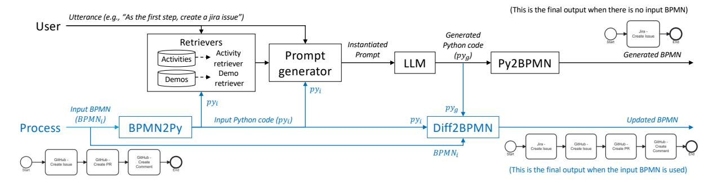
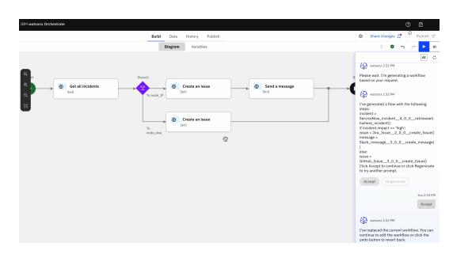
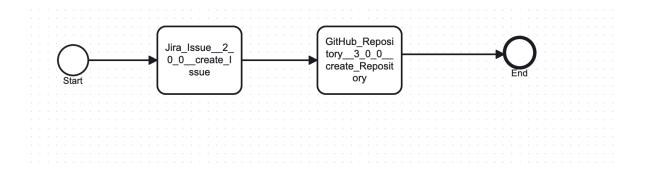

# FLOW-BENCH: Towards Conversational Generation of Enterprise Workflows

Evelyn Duesterwald, Siyu Huo, Vatche Isahagian, K.R. Jayaram, Ritesh Kumar, Vinod Muthusamy, Punleuk Oum, Debashish Saha, Gegi Thomas, Praveen Venkateswaran

### IBM Research AI,

duester@us.ibm.com, siyu.huo@ibm.com,vatchei@ibm.com, jayaramkr@us.ibm.com, kumar.ritesh@ibm.com vmuthus@us.ibm.com, debashish.saha1@ibm.com, gegi@us.ibm.com, Praveen.Venkateswaran@ibm.com

#### Abstract

Large Language Models (LLMs) can be used to convert natural language (NL) instructions into structured business process automation (BPA) process artifacts. This paper contributes (i) FLOW-BENCH, a high quality dataset of paired NL instructions and business process definitions to evaluate NL-based BPA tools, and support research in this area, and (ii) FLOW-GEN, our approach to utilize LLMs to translate NL into an intermediate Python representation that facilitates final conversion into widely adopted business process definition languages, such as BPMN and DMN. We bootstrap FLOW-BENCH by demonstrating how it can be used to evaluate the components of FLOW-GEN across eight LLMs. We hope that FLOW-GEN and FLOW-BENCH catalyze further research in BPA.

#### 1 Introduction

With many enterprises relying on BPA to standardize their work, enhance their operational efficiency and reduce human error, BPA tools grew to a \$11.84B industry and are projected to grow to \$26B in 2028 [\(Marketwatch,](#page-7-0) [2022\)](#page-7-0). In contemporary BPA tools, users use visual drag-anddrop interfaces and reusable templates to construct workflows, decision models, and document process logic, adhering to standard notations such as BPMN [\(Grosskopf et al.,](#page-7-1) [2009;](#page-7-1) [Chinosi and Trom](#page-7-2)[betta,](#page-7-2) [2012\)](#page-7-2) and DMN [\(Biard et al.,](#page-7-3) [2015\)](#page-7-3).

However, even sophisticated low-code BPA platforms frequently necessitate intervention from software engineers to ensure robustness, handle intricate integrations, and implement customized logic not covered by generic templates. The complexity inherent in configuring detailed integration tasks and writing low-level transformation logic remains daunting for novice programmers and tedious even for seasoned developers.

Recent efforts have explored leveraging natural language interfaces to simplify BPA authoring. LLMs have demonstrated substantial potential for automating code generation tasks by translating high-level user intents into executable artifacts. However, in our experience, even state-of-the-art LLMs are not effective at generating BPA workflows, both due to the lack of BPMN training data and the extensive boilerplate notations that need to be generated. Section [A.1](#page-8-0) showcases a flow and its corresponding BPMN code.

To the best of our knowledge, there is a lack of well-established benchmarks to evaluate NLdriven workflow generation. With this paper, we contribute FLOW-BENCH, a high quality dataset designed specifically to support research in natural language-driven business process automation, that consists of realistic utterances and their corresponding BPMN representations[1](#page-0-0) . The availability of this dataset is intended to catalyze model improvements, benchmarking, and development of NLP techniques tailored to the BPA domain.

We also contribute FLOW-GEN, an approach that leverages LLMs to first translate natural language into an intermediate representation (IR) with Python syntax to precisely capture the logic of the intended business process. The Python IR provides several advantages. It takes advantage of the innate Python code generation capabilities of LLMs and it bridges the gap between unstructured natural language and formalized business process definition languages, facilitating easier verification and refinement of the generated logic. Subsequently, our approach translates this IR into specific target process definition languages, such as BPMNcompliant XML or DMN decision tables, ensuring compatibility with existing BPA solutions and tools. Further, the use of an IR makes it easy to catch errors early and to support multiple target BPA languages. We include the Python IR in the

<span id="page-0-0"></span><sup>1</sup> FLOW-BENCH dataset can be accessed at https://github.com/IBM/Flow-Bench

FLOW-BENCH dataset, along with the BPMN.

### 2 FLOW-BENCH dataset

Workflows in FLOW-BENCH consist of sequences of API invocations, including conditionals and loops, similar to those found in commercial workflow automation platforms like IBM App Connect [\(IBM App Connect,](#page-7-4) [2025\)](#page-7-4) and Zapier [\(Zapier](#page-7-5) [Apps](#page-7-5) , [2025\)](#page-7-5). In addition to API calls, workflows may incorporate manual interventions, termed *user tasks*. These user tasks typically involve steps within a business process that require human action, such as managerial approvals, and thus, do not have corresponding APIs.

To construct FLOW-BENCH we initially sourced realistic business workflows from pre-existing templates provided by commercial workflow automation platforms (specifically IBM App Connect and Zapier). These templates cover common enterprise use cases, including support ticket creation, task management, and marketing campaign automation.

We carried out three high level steps to arrive at the final FLOW-BENCH dataset: (1) quality control, (2) manual labeling, and (3) data augmentation.

Quality Control: First, we collected and manually examined workflows sourced from the automation platforms. We discarded or truncated workflows that were overly complex with multiple levels of nested conditions, in order to start with relatively small workflows that a user can reasonably describe in a few sentences. We removed event triggers from workflows and discarded workflows that consisted of only a single API call. We also discarded workflows that involved APIs without publicly available OpenAPI spec.

Manual Labeling: We manually added or corrected user utterance to workflows. In some cases, we rephrased existing workflow descriptions to reflect an active user command to constructing the workflow as opposed to a passive description of the workflow. The workflows often only had a proprietary representation in the respective automation tool, so we manually crafted Python IR snippets and generated the corresponding BPMN specification. We also retrieved the OpenAPI specs for all activities in the workflows and established a common naming convention for API-based worfklow activities. In addition, we added clear descriptions for each API, tweaking the descriptions in the OpenAPI specs (if available).

Data Augmentation: Once we had a set of high quality samples, we expanded the dataset in two ways. First we incorporated user tasks by either adding a new activity in the workflow, or by removing the corresponding API from the catalog. Then we added samples to reflect how users may incrementally build a workflow, by adding, deleting, or replacing activities in the workflow. For each new sample, we defined the workflow before and after the edit, and the corresponding user utterance. To mimic actual software development the incremental edits may apply anywhere in the current workflow, not always editing left to right.

The final complete workflows in FLOW-BENCH are generated through incremental build steps categorized as *add*, *delete*, or *replace*.

Build steps in FLOW-BENCH are kept as selfcontained tests by including three elements: (1) *Prior Sequence*, representing the current state of the workflow before applying changes[2](#page-1-0) ; (2) *Utterance*, describing the modification to be performed in natural language (e.g, "Retrieve all issues from the Jira board."); and (3) *Expected Sequence*, indicating the resulting workflow after implementing the command specified by the utterance. Note that a single utterance can express a sequence of multiple activities, establishing a one-to-many mapping between utterances and activities. For instance, an utterance like "Create a GitHub issue and then notify the team on Slack" maps to two distinct activities (GitHub issue creation and Slack notification) with an explicit sequential ordering.

<span id="page-1-1"></span>

| Build step type | Tests | Avg. #APIs<br>Prior | Avg. #APIs<br>Expected |
|-----------------|-------|---------------------|------------------------|
| linear:generate | 34    | -                   | 2.26                   |
| linear:add      | 11    | 2.27                | 3.45                   |
| linear:delete   | 5     | 3.2                 | 2.2                    |
| linear:replace  | 6     | 3.5                 | 3.5                    |
| cond:generate   | 19    | -                   | 2.94                   |
| cond:add        | 10    | 2.4                 | 3.5                    |
| cond:delete     | 9     | 3.88                | 2.33                   |
| cond:replace    | 7     | 3.0                 | 3.0                    |
| Total           | 101   | 3.04                | 2.89                   |

Table 1: FLOW-BENCH composition of 101 incremental build tests with linear and conditional (cond) prior and expected sequences

FLOW-BENCH comprises 101 high-quality, manually curated incremental build step tests structured according to this methodology. Figure [1](#page-2-0) illustrates

<span id="page-1-0"></span><sup>2</sup>This may be empty in the initial generation step.

```
_metadata:
  tags:
    - conditional_update
  uid: 97
input:
  utterance: |-
    Instead of retrieving all the issues
    just create a new issue in each repo
  prior_sequence:
    - |-
    repositories = GitHub_Repository__3_0_0__retrievewithwhere_Repository()
      for repo in repositories:
        new_issue = GitHub_Issue__3_0_0__retrievewithwhere_Issue()
  prior_context: []
  bpmn:
    $ref: "context/uid_97_context.bpmn"
expected_output:
  sequence:
    - |-
    repositories = GitHub_Repository__3_0_0__retrievewithwhere_Repository()
      for repo in repositories:
        updated_issue = GitHub_Issue__3_0_0__create_Issue()
  bpmn:
    $ref: "output/uid_97_output.bpmn"
```

Figure 1: Example of FLOW-BENCH test case

an example test case from FLOW-BENCH. Each build step is uniquely identified and provides a selfcontained test scenario, including explicit BPMN representations of both the *Prior Sequence* and *Expected Sequence*. Additionally, each test is annotated with metadata describing the build step type (add, delete, replace), the control flow structure (linear or conditional, where conditional encompasses both if-statements and loops), and the inclusion of user task steps (denoted by user\_task). The BPMN representation of Figure [1](#page-2-0) is shown in [A.2.](#page-8-1)

Table [1](#page-1-1) shows the break-down of the FLOW-BENCH by build step type along with the average test size in terms of the number of APIs included. Conditional tests include between 1 and 4 control flow statements with an average and maximum nesting depths of 1.64 and 4, respectively.

To ensure compact and clear representations of prior and expected workflows, FLOW-BENCH adopts a constrained subset of Python syntax. This subset includes assignment statements, conditional statements (if-statements), loops (for and while), and function calls. These representations are explicitly provided within the *Prior Sequence* and *Expected Sequence* elements of each test.

Generating accurate pythonic function calls in a FLOW-BENCH test by an LLM requires knowledge of existing APIs and their descriptions. Thus, we also provide a separate file containing a catalog of APIs along with their descriptions. The catalog used in our experiments contains 546 API endpoints from diverse enterprise applications including GitHub, Jira, Slack, Salesforce, and other common business automation platforms. An example of an API and its description is shown below.

```
{
  "id": "Jira_Issue__2_0_0__retrievewithwhere_Issue",
  "description": "Retrieve all Jira issues"
}
```

## 3 FLOW-GEN

This section presents FLOW-GEN, an approach that applies pre-trained LLMs to solve the workflow generation tasks in the FLOW-BENCH dataset.

#### 3.1 Python Intermediate Representation

Our initial observations suggest that while some LLMs can generate BPMN directly, these models have not been extensively trained or evaluated specifically on BPMN data. In contrast, many pre-trained LLMs have been extensively trained on Python code and have demonstrated significant proficiency in generating Python scripts accurately [\(Tong and Zhang,](#page-7-6) [2024\)](#page-7-6).

Moreover, BPMN representations are inherently verbose, which introduces complexity and increases the likelihood of syntactic and semantic errors when generated by LLMs. Longer BPMN outputs also increase computational cost and slow down generation, negatively impacting interactive user experiences. To illustrate this, consider the straightforward linear BPMN flow depicted in the bottom left of Figure [2.](#page-3-0) Its BPMN representation requires 3,151 characters, whereas the equivalent logic can be succinctly expressed in only 148 characters of Python code:

```
issue = GitHub_Issue__3_0_0__create_Issue()
pr = GitHub_Pullrequest__3_0_0__create_Pullrequest()
comment = GitHub_Comment__3_0_0__create_Comment()
```

In FLOW-BENCH, the BPMN representation is on average 25 times longer than the Python equivalent. While there are BPMN-specific concepts such as swimlanes and roles that do not translate directly into Python, these are out of scope of the FLOW-BENCH dataset. FLOW-GEN also accommodates the concept of user tasks—activities performed by humans that are not linked to predefined workflows or APIs. These tasks represent ad-hoc activities specified by the user.

## 3.2 Initial Flow Generation

Consider the scenario where a user wants to create a new workflow based solely on an NL description. This initial flow generation process, outlined in the upper part of Figure [2,](#page-3-0) involves several steps.

Initially, the user's NL utterance is analyzed to retrieve a relevant subset of predefined activities. These activities typically correspond to APIs, decision rules, or other processes from a comprehensive

<span id="page-3-0"></span>

Figure 2: FLOW-GEN overview. The top part (in black) depicts the steps to generate a new workflow based on a user utterance. The bottom part (in blue) are the additional steps to update an existing workflow based on an utterance.

activity catalog. Including this subset in the LLM prompt is essential, especially when the entire catalog cannot fit within the LLM's context window. The different approaches to retrieving relevant activities are detailed in Section [3.4.](#page-3-1)

Concurrently, the utterance is used to select the most relevant demonstrations from the dataset. Each demonstration comprises an NL utterance paired with a Python code snippet. These examples, provided as few-shot demonstrations in the LLM prompt, guide the LLM to generate accurate Python code snippets, illustrating correct invocation patterns of predefined activities as Python functions. Section [3.5](#page-4-0) further elaborates on the methods evaluated for demonstration retrieval.

Next, an LLM generates a Python code snippet based on a dynamically assembled prompt that includes the user's NL utterance, retrieved activity descriptions, and selected few-shot demonstrations. This generated snippet captures the workflow described by the user, incorporating user tasks where necessary for activities not in the catalog.

Finally, the deterministic PY2BPMN module converts the generated Python code into standard BPMN, completing the translation from NL to executable workflow definition.

#### 3.3 Incremental Flow Updates

Let us now consider the case where there is already an existing workflow, and the user issues an utterance to incrementally edit the workflow. The bottom portion of Figure [2](#page-3-0) show the additional steps in FLOW-GEN to support this case.

First, the original BPMN workflow (BPMNi) is transformed into a Python code snippet (py<sup>i</sup> ). This is done using deterministic code in the BPMN2PY module.

The code py<sup>i</sup> is used as additional information for the retrievers. For example, the activity retriever

should select not only activities mentioned in the utterance, but also those referenced in the input workflow. Similarly, if py<sup>i</sup> contains conditional or looping constructs, the demonstration retriever will more likely select few-shot samples that include such constructs. The code snippet py<sup>i</sup> is coupled with the user query to serve as input to the LLM code generation step.

The DIFF2BPMN module computes the difference between the input (py<sup>i</sup> ) and generated (py<sup>g</sup> ) Python and internally generates a set of update operations. These update operations are applied to the input workflow (BPMNi) to arrive at the final updated BPMN workflow.

#### <span id="page-3-1"></span>3.4 Activity Retrievers

Given the user's NL utterance, the generated code is expected to reference activities from the provided catalog (grounding) and avoid hallucinations. However, as catalogs may contain thousands of activities, it becomes infeasible to include the entire catalog within the limited context window of the LLM. Thus we need to retrieve and include only the top-k most relevant subset. We outline three types of activity retrievers.

ED\_Retriever: Compares the user utterance against the description of each activity from the catalog to quantify how dissimilar (or similar) the two are based on edit distance. Given that edit distance computation only compares the raw strings without incorporating any semantic meaning, the performance of this retriever is limited in scope.

Embeddings\_Retriever: A Bi-Encoder based retrieval that generates the embedding vectors for the user utterance and all the activities, followed by computing the cosine similarity between each pair. Embeddings capture the semantic meaning and thus, boost the performance significantly as compared to the Edit Distance based approaches. We used the *all-MiniLM-L6-v2* model to generate the embeddings and ChromaDB to store, index, and retrieve top-K activities. Since the catalog is relatively stable, the embeddings can be generated once and stored to improve runtime latency.

**Activities\_Search**: This retriever works like Embeddings\_Retriever, but we use a custom model fine-tuned to generate better embeddings for the activity retrieval task.

#### <span id="page-4-0"></span>3.5 Demonstration Retrievers

Demonstrations refer to the few shot in-context examples that are incorporated in the prompt. We explored two retrieval approaches.

**TopKRetriever**: A Bi-Encoder based retrieval similar to Embeddings\_Retriever.

CE\_Retriever: A cross-encoder based retrieval, where two strings are passed simultaneously to the model that outputs similarity score ranging between 0 and 1. Cross-encoder based retrieval is more accurate since the model is trained on a large dataset to generate the similarity score. Since the user utterance is only available at runtime, the similarity computation against the demos can only be performed at runtime which introduces latency. To reduce the latency, we shortlist the demonstration catalog based on the provided context before passing it to cross-encoder. For example, if the user is updating an existing workflow, only the demos containing a prior sequence are selected. We use the stsb-distilroberta-base model as the cross-encoder.

#### 4 Evaluation

In this section, we evaluate FLOW-GEN on the FLOW-BENCH dataset. All experiments evaluate the generation of Python intermediate representation (IR) from natural language utterances, followed by deterministic conversion to BPMN. The IR-based approach is central to our methodology, and all reported metrics measure the quality of the generated Python IR. We begin by providing an evaluation of the retrievers. All experiments were conducted over the 101 FLOW-BENCH test cases.

#### 4.1 Activity Retrievers

Table 2 summarizes the results of the three activity retrievers: ED\_Retriever, Embeddings\_Retriever, and Activities\_Search. **TopK** refers to the number of retrieved activities. **Activities Recall** is computed based on the overlap between the retrieved activities and those in the ground truth. **Exact** 

<span id="page-4-1"></span>

| Retriever                 | TopK | Activities Recall | Exact Match | Hallucination Rate |
|---------------------------|------|-------------------|-------------|--------------------|
| ED_Retriever              | 10   | 0.7327            | 0.495       | 0.0469             |
|                           | 50   | 0.7913            | 0.604       | 0.0621             |
|                           | 100  | 0.8086            | 0.6139      | 0.0586             |
| Embed-<br>dings_Retriever | 10   | 0.9307            | 0.6733      | 0.0207             |
|                           | 50   | 0.9794            | 0.7525      | 0.0205             |
|                           | 100  | 0.9851            | 0.7129      | 0.0236             |
| Activities_Search         | 10   | 0.9703            | 0.6931      | 0.0069             |
|                           | 50   | 0.9926            | 0.7723      | 0.0102             |
|                           | 100  | 0.9926            | 0.7525      | 0.0102             |

Table 2: Evaluation of different retrievers with different TopK.

Match highlights the accuracy of the generated IR to the ground truth syntactically and semantically. Hallucination Rate computes the fraction of activities in the generated workflows that are not in the catalog.

Table 2 shows that Activities\_Search with TopK=50 has the best recall and best exact match score with the least hallucination rate, followed by Embeddings\_Retriever. This validates that embedding similarity is more effective than edit distance. We also see that larger TopK improves recall but reduces the exact match since it increases LLM's probability of selecting the incorrect Activity.

<span id="page-4-2"></span>

| Model                        | DemoSelector  | TopK | Exact Match |
|------------------------------|---------------|------|-------------|
| Granite-20b-code-instruct-v2 | TopKRetriever | 2    | 0.5842      |
|                              |               | 3    | 0.5941      |
|                              |               | 5    | 0.6734      |
|                              |               | 7    | 0.6634      |
|                              | CE_Retriever  | 2    | 0.5842      |
|                              |               | 3    | 0.6436      |
|                              |               | 5    | 0.6931      |
|                              |               | 7    | 0.6733      |
| codellama-34b-instruct-hf    | TopKRetriever | 2    | 0.7029      |
|                              |               | 3    | 0.7131      |
|                              |               | 5    | 0.7228      |
|                              |               | 7    | 0.7228      |
|                              | CE_Retriever  | 2    | 0.703       |
|                              |               | 3    | 0.7228      |
|                              |               | 5    | 0.7624      |
|                              |               | 7    | 0.7624      |

Table 3: Evaluation of demonstration retrievers with different number of demos (TopK) while using Activities\_Search with TopK=50 for Activities selection.

#### 4.2 Demonstration Retriever

Table 3 compares *TopKRetriever* and *CE\_Retriever* for different values of TopK using Granite-20b-code-instruct-v2 and codellama-34b-instruct-hf models. TopK here refers to the number of demonstrations not activities.

The cross-encoder based retriever boosts the exact match by 4 points irrespective of model choice. Increasing the number of demonstrations retrieved beyond five degrades the overall performance. For the remainder of these experiments we consider retrieving five demonstrations using CE\_Retriever.

<span id="page-5-0"></span>

| Model                        | Activities Domain | Exact Match | Syntax F1 |
|------------------------------|-------------------|-------------|-----------|
| mixtral-8x7b-instruct-v01    | in-domain         | 0.66        | 0.87      |
|                              | cross-domain      | 0.63        | 0.85      |
| granite-8b-code-instruct     | in-domain         | 0.59        | 0.86      |
|                              | cross-domain      | 0.60        | 0.84      |
| llama-3-1-8b-instruct        | in-domain         | 0.19        | 0.57      |
|                              | cross-domain      | 0.19        | 0.56      |
| Granite-20b-code-instruct-v2 | in-domain         | 0.67        | 0.91      |
|                              | cross-domain      | 0.59        | 0.89      |
| Codellama-34b-instruct-hf    | in-domain         | 0.76        | 0.93      |
|                              | cross-domain      | 0.72        | 0.91      |
| llama-3-3-70b-instruct       | in-domain         | 0.53        | 0.74      |
|                              | cross-domain      | 0.49        | 0.71      |
| Mistral-large                | in-domain         | 0.83        | 0.90      |
|                              | cross-domain      | 0.79        | 0.86      |
| llama-3-405b-instruct        | in-domain         | 0.60        | 0.82      |
|                              | cross-domain      | 0.55        | 0.80      |

Table 4: Evaluation of different models using Activities\_Search (TopK=50) as and CE\_Retriever(TopK=5) as Activities and demos retrievers respectively.

## 4.3 Overall Evaluation

In Table [4,](#page-5-0) we provide an extensive evaluation of FLOW-GENWe use Activities\_Search as the activ- ˙ ity retriever with TopK=50 and CE\_Retriever as the demonstration retriever with TopK=5. Table [4](#page-5-0) compares the performance of several models varying in size. Recall that Exact Match highlights the accuracy of the generated IR to the ground truth syntactically and semantically, and Activities Recall is the overlap between the retrieved activities and those in the ground truth. Syntax F1 evaluates correctness of the generated IR code syntactically.

To evaluate the impact of interference between the activities catalog and activities present in the demonstrations we provide both cross-domain and in-domain evaluations. By cross-domain we make sure that demos are selected such that the activities present in the ground-truth are not used by any of the selected demonstrations and for in-domain, activities present in ground-truth may be present in selected demos.

Mistral-large model preformed best with exact match of 0.83 and 0.79 for both in-domain and cross-domain scenarios respectively. High Syntax F1 highlights the ability of Mistral-large to generate syntactically correct Python IRs. The llama-3-1- 8b-instruct small model performs the worst.

## 5 Deployment

Our approach has been deployed as a technical preview (c.f. Figure [3\)](#page-5-1) as part of the Unified Automation Builder (UAB) of IBM's Watsonx Orchestrate [\(2025\)](#page-7-7). UAB provides an intuitive graphical interface for the creation, evaluation and deployment of automation flows. The UAB tooling is deployed as a scalable cloud solution, with numerous containers deployed in a cluster. Our approach has been to deploy FLOW-GEN as a first-class compo-

nent, in the cluster, enabling secure access to the API catalog, as well as LLM inference capabilities available from Watsonx.ai. Additionally, Watsonx Assistant is leveraged as the user-facing interface, where utterances are input by the user, and routed to FLOW-GEN via internal proxy services which facilitate the returning responses.

<span id="page-5-1"></span>

Figure 3: Deployment in WxO production environment

## 6 Related Work

Leveraging LLMs to automate the creation and improvement of BPM flows is an active area of research. AutoFlow [\(Li et al.,](#page-7-8) [2024\)](#page-7-8) is a framework that automatically generates workflows enabling agents to tackle complex tasks. It adopts the CoRE language [\(Xu et al.,](#page-7-9) [2024\)](#page-7-9) for workflow representation, requiring fine-tuning of LLMs to master the specific grammar and workflow generation protocols associated with CoRE. However, this finetuning requirement limits flexibility, preventing the integration of off-the-shelf LLMs.

Agentic Process Automation (APA) [\(Ye et al.,](#page-7-10) [2023\)](#page-7-10) formulates workflow creation as a Python code-generation task, where actions within the workflows are represented by Python function calls executed by specialized agents. Nonetheless, APA does not ground the APIs explicitly within the business process, creating potential for hallucination where the LLM might reference incorrect or nonexistent APIs. Our research avoids hallucination by embedding API grounding directly within the LLM prompts, thus enabling the LLM to accurately interpret, select, and utilize APIs as practical tools for workflow generation [\(Liu et al.,](#page-7-11) [2024;](#page-7-11) [Yan et al.,](#page-7-12) [2024;](#page-7-12) [Qin et al.,](#page-7-13) [2023\)](#page-7-13). This also facilitates the LLM's comprehension APIs, resulting in Pythongenerated workflows that reflect the intended business process control flow.

Recently, [\(Fan et al.,](#page-7-14) [2024\)](#page-7-14) also used a Pythonic IR for workflow processes and collected grounded APIs specifically for workflow construction. Their workflow generation strategy depends on training specialized data annotators based on data collected, which is constrained by the domains of data collection (Apple Shortcuts and RoutineHub), limiting its broader applicability handling out-of-domain APIs and queries. In contrast, our method leverages incontext learning combined with API retrieval techniques, both of which inherently support greater flexibility and ease of generalization across diverse domains.

Our dataset and approach have the unique combination of reflecting incremental multi-turn workflow construction where users can switch between updating the workflow manually and conversationally, and supporting workflows with dynamically constructed user tasks rather than being restricted to a pre-defined set of activities.

More broadly, our work builds upon the significant advances in LLM-based code generation [\(Zheng et al.,](#page-7-15) [2023;](#page-7-15) [Tong and Zhang,](#page-7-6) [2024\)](#page-7-6), particularly Python code generation where models have demonstrated strong capabilities. However, business process generation poses unique challenges beyond general-purpose code generation: workflows must be grounded in specific API catalogs to avoid hallucination, support incremental multi-turn construction, and ultimately translate to standardized notations like BPMN for integration with existing enterprise tooling.

Direct quantitative comparison with the aforementioned related work is challenging for several reasons. First, many approaches such as AutoFlow [\(Li et al.,](#page-7-8) [2024\)](#page-7-8) require domain-specific fine-tuning of models, while our method uses offthe-shelf LLMs with in-context learning, representing fundamentally different evaluation paradigms. Second, existing work either targets specific domains (e.g., Apple Shortcuts in [\(Fan et al.,](#page-7-14) [2024\)](#page-7-14)) or uses proprietary representations (e.g., CoRE language) that are not directly comparable to our BPMN-based workflows. Most importantly, none of the related work addresses incremental, multiturn workflow updates—a core contribution of our approach—making like-for-like baseline comparisons infeasible. Our evaluation instead focuses on demonstrating the efficacy of our IR-based approach across multiple LLMs and retrieval strategies on the FLOW-BENCH dataset.

## 7 Conclusions

In this paper, our contributions include both the FLOW-BENCH dataset and the FLOW-GEN methodology, aiming to significantly lower barriers for both expert and citizen developers to construct automated business processes. FLOW-BENCH is a novel dataset specifically curated to facilitate research on automating workflows using LLMs. FLOW-GEN is a technique that translates natural language instructions into structured BPMN artifacts, leveraging an IR. By grounding workflow construction in contextually relevant API documentation and utilizing in-context learning, we address common issues such as hallucination and limited domain adaptability present in previous methods. Future work includes expanding dataset coverage, further refining API grounding methods, and evaluating our proposed methods in more complex business scenarios.

## Limitations

While FLOW-GEN and FLOW-BENCH advance the state of natural language-driven business process automation, several limitations warrant discussion.

Intermediate Representation Expressiveness: Our Python-based IR deliberately focuses on capturing core BPMN control flow and data flow constructs (sequences, conditionals, loops, and API invocations). However, BPMN includes domainspecific concepts such as swimlanes, roles, and message flows that do not translate directly into our IR. This is a conscious design trade-off: the IR enables compact representation and leverages LLMs' strong Python generation capabilities, but sacrifices some BPMN expressiveness. Importantly, our solution is designed to augment existing BPMN editors rather than replace them. Users can leverage FLOW-GEN to rapidly generate the core workflow logic, then use traditional BPMN tooling to configure additional attributes like swimlanes, roles, and visual layout. This hybrid approach balances automation with the flexibility needed for enterprise-grade process modeling.

Hallucination and Activity Grounding: Despite our activity retrieval mechanisms, LLMs may occasionally generate hallucinated activity names not present in the catalog. We address this challenge by modeling hallucinated activities as *user tasks*—manual intervention points in the workflow. This approach transforms a limitation into a feature: users can express activities for which no API exists, and the system gracefully handles them as human tasks. However, this requires users to review generated workflows to distinguish between intentional

user tasks and unintended hallucinations.

Dataset Scale and Domain Coverage: FLOW-BENCH contains 101 high-quality manually curated test cases. While these tests cover diverse patterns (linear/conditional flows, add/delete/replace operations, user tasks), they represent a limited sample of real-world business process complexity. The 546 activities in our catalog span common enterprise domains (GitHub, Jira, Slack, Salesforce), but expanding coverage to additional domains and more complex nested workflows remains important future work.

Evaluation Scope: Our evaluation focuses on the technical accuracy of generated Python IR and its syntactic/semantic correctness. We do not evaluate end-user usability, the quality of natural language utterances that real users would provide, or the long-term maintainability of conversationallyconstructed workflows in production settings. User studies would provide valuable insights into the practical utility of our approach.

#### References

- <span id="page-7-3"></span>Thierry Biard, Alexandre Le Mauff, Michel Bigand, and Jean-Pierre Bourey. 2015. Separation of decision modeling from business process modeling using new "decision model and notation"(dmn) for automating operational decision-making. In *Risks and Resilience of Collaborative Networks: 16th IFIP WG 5.5 Working Conference on Virtual Enterprises, PRO-VE 2015, Albi, France" October 5-7, 2015, Proceedings 16*, pages 489–496. Springer.
- <span id="page-7-2"></span>Michele Chinosi and Alberto Trombetta. 2012. Bpmn: An introduction to the standard. *Computer Standards & Interfaces*, 34(1):124–134.
- <span id="page-7-14"></span>Shengda Fan, Xin Cong, Yuepeng Fu, Zhong Zhang, Shuyan Zhang, Yuanwei Liu, Yesai Wu, Yankai Lin, Zhiyuan Liu, and Maosong Sun. 2024. [Workflowllm:](https://api.semanticscholar.org/CorpusID:273950328) [Enhancing workflow orchestration capability of large](https://api.semanticscholar.org/CorpusID:273950328) [language models.](https://api.semanticscholar.org/CorpusID:273950328) *ArXiv*, abs/2411.05451.
- <span id="page-7-1"></span>Alexander Grosskopf, Gero Decker, and Mathias Weske. 2009. *The process: business process modeling using BPMN*. Meghan-Kiffer Press.
- <span id="page-7-4"></span>IBM App Connect. 2025. IBM Automation Explorer. [https://explorer.automation.ibm.](https://explorer.automation.ibm.com/?type=template) [com/?type=template](https://explorer.automation.ibm.com/?type=template). Online; accessed 2025.
- <span id="page-7-8"></span>Zelong Li, Shuyuan Xu, Kai Mei, Wenyue Hua, Balaji Rama, Om Raheja, Hao Wang, He Zhu, and Yongfeng Zhang. 2024. [Autoflow: Automated work](https://api.semanticscholar.org/CorpusID:271270428)[flow generation for large language model agents.](https://api.semanticscholar.org/CorpusID:271270428) *ArXiv*, abs/2407.12821.
- <span id="page-7-11"></span>Weiwen Liu, Xu Huang, Xingshan Zeng, Xinlong Hao, Shuai Yu, Dexun Li, Shuai Wang, Weinan Gan,

- Zhengying Liu, Yuanqing Yu, Zezhong Wang, Yuxian Wang, Wu Ning, Yutai Hou, Bin Wang, Chuhan Wu, Xinzhi Wang, Yong Liu, Yasheng Wang, and 8 others. 2024. [Toolace: Winning the points of llm](https://api.semanticscholar.org/CorpusID:272368347) [function calling.](https://api.semanticscholar.org/CorpusID:272368347) *ArXiv*, abs/2409.00920.
- <span id="page-7-0"></span>Marketwatch. 2022. Business process management growth. [https://www.](https://www.marketwatch.com/press-release/business-process- management-market-size\-growth-with-top-leading-players-growth-\key- factors-global-trends-industry-share\-and-forecast-2022-2031-2022-08-18) [marketwatch.com/press-release/](https://www.marketwatch.com/press-release/business-process- management-market-size\-growth-with-top-leading-players-growth-\key- factors-global-trends-industry-share\-and-forecast-2022-2031-2022-08-18) [business-process-management-market-size\](https://www.marketwatch.com/press-release/business-process- management-market-size\-growth-with-top-leading-players-growth-\key- factors-global-trends-industry-share\-and-forecast-2022-2031-2022-08-18) [-growth-with-top-leading-players-growth-\](https://www.marketwatch.com/press-release/business-process- management-market-size\-growth-with-top-leading-players-growth-\key- factors-global-trends-industry-share\-and-forecast-2022-2031-2022-08-18) [key-factors-global-trends-industry-share\](https://www.marketwatch.com/press-release/business-process- management-market-size\-growth-with-top-leading-players-growth-\key- factors-global-trends-industry-share\-and-forecast-2022-2031-2022-08-18) [-and-forecast-2022-2031-2022-08-18](https://www.marketwatch.com/press-release/business-process- management-market-size\-growth-with-top-leading-players-growth-\key- factors-global-trends-industry-share\-and-forecast-2022-2031-2022-08-18). Online; accessed 2022.
- <span id="page-7-13"></span>Yujia Qin, Shi Liang, Yining Ye, Kunlun Zhu, Lan Yan, Ya-Ting Lu, Yankai Lin, Xin Cong, Xiangru Tang, Bill Qian, Sihan Zhao, Runchu Tian, Ruobing Xie, Jie Zhou, Marc H. Gerstein, Dahai Li, Zhiyuan Liu, and Maosong Sun. 2023. [Toolllm: Facilitating large](https://api.semanticscholar.org/CorpusID:260334759) [language models to master 16000+ real-world apis.](https://api.semanticscholar.org/CorpusID:260334759) *ArXiv*, abs/2307.16789.
- <span id="page-7-6"></span>Weixi Tong and Tianyi Zhang. 2024. [CodeJudge: Eval](https://doi.org/10.18653/v1/2024.emnlp-main.1118)[uating code generation with large language models.](https://doi.org/10.18653/v1/2024.emnlp-main.1118) In *Proceedings of the 2024 Conference on Empirical Methods in Natural Language Processing*, pages 20032–20051, Miami, Florida, USA. Association for Computational Linguistics.
- <span id="page-7-7"></span>watsonx Orchestrate. 2025. watsonx Orchestrate: AI for business productivity. [https://www.ibm.com/](https://www.ibm.com/products/watsonx-orchestrate) [products/watsonx-orchestrate](https://www.ibm.com/products/watsonx-orchestrate). Online; accessed 2025.
- <span id="page-7-9"></span>Shuyuan Xu, Zelong Li, Kai Mei, and Yongfeng Zhang. 2024. Core: Llm as interpreter for natural language programming, pseudo-code programming, and flow programming of ai agents. *arXiv e-prints*, pages arXiv–2405.
- <span id="page-7-12"></span>Fanjia Yan, Huanzhi Mao, Charlie Cheng-Jie Ji, Tianjun Zhang, Shishir G. Patil, Ion Stoica, and Joseph E. Gonzalez. 2024. Berkeley function calling leaderboard. [https://gorilla.cs.berkeley.](https://gorilla.cs.berkeley.edu/blogs/8_berkeley_function_calling_leaderboard.html) [edu/blogs/8\\_berkeley\\_function\\_calling\\_](https://gorilla.cs.berkeley.edu/blogs/8_berkeley_function_calling_leaderboard.html) [leaderboard.html](https://gorilla.cs.berkeley.edu/blogs/8_berkeley_function_calling_leaderboard.html).
- <span id="page-7-10"></span>Yining Ye, Xin Cong, Shizuo Tian, Jian Cao, Hao Wang, Yujia Qin, Ya-Ting Lu, Heyang Yu, Huadong Wang, Yankai Lin, Zhiyuan Liu, and Maosong Sun. 2023. [Proagent: From robotic process automation to agen](https://api.semanticscholar.org/CorpusID:265295561)[tic process automation.](https://api.semanticscholar.org/CorpusID:265295561) *ArXiv*, abs/2311.10751.
- <span id="page-7-5"></span>Zapier Apps . 2025. Find ways for Zapier to handle repetitive tasks in the apps you use every day. [https:](https://zapier.com/explore) [//zapier.com/explore](https://zapier.com/explore). Online; accessed 2025.
- <span id="page-7-15"></span>Zibin Zheng, Kaiwen Ning, Yanlin Wang, Jingwen Zhang, Dewu Zheng, Mingxi Ye, and Jiachi Chen. 2023. [A survey of large language models for code:](https://api.semanticscholar.org/CorpusID:265281389) [Evolution, benchmarking, and future trends.](https://api.semanticscholar.org/CorpusID:265281389) *ArXiv*, abs/2311.10372.

### A Appendix

#### <span id="page-8-0"></span>A.1 BPMN diagram and code

Figure [4](#page-8-2) shows an example of a flow expressed as a BPMN diagram along with the corresponding BPMN code shown in Figure [5.](#page-8-3)

<span id="page-8-2"></span>

Figure 4: Simple flow example

```
<?xml version="1.0" encoding="UTF-8"?>
<definitions xmlns="http://www.omg.org/spec/BPMN/20100524/MODEL"
xmlns:bpmndi="http://www.omg.org/spec/BPMN/20100524/DI"
xmlns:dc="http://www.omg.org/spec/DD/20100524/DC"
xmlns:di="http://www.omg.org/spec/DD/20100524/DI" exporter="bpmn-js
(https://demo.bpmn.io)" exporterVersion="18.3.1">
  <process id="Process_1" isExecutable="false">
    <startEvent id="startEvent_1" name="Start" />
    <task id="task_2" name="Jira_Issue__2_0_0__create_Issue" />
    <sequenceFlow id="flow_startEvent_1_task_2"
    sourceRef="startEvent_1" targetRef="task_2" />
  <task id="task_3" name="GitHub_Repository__3_0_0__create_Repository" />
    <sequenceFlow id="flow_task_2_task_3"
    sourceRef="task_2" targetRef="task_3" />
    <endEvent id="endEvent_4" name="End" />
    <sequenceFlow id="flow_task_3_endEvent_4"
    sourceRef="task_3" targetRef="endEvent_4" />
  </process>
  <bpmndi:BPMNDiagram id="BPMNDiagram_1">
    <bpmndi:BPMNPlane id="BPMNPlane_1" bpmnElement="Process_1">
      <bpmndi:BPMNShape id="BPMNShape_task_3" bpmnElement="task_3">
        <dc:Bounds x="460" y="80" width="100" height="80" />
      </bpmndi:BPMNShape>
      <bpmndi:BPMNShape id="BPMNShape_endEvent_4"
      bpmnElement="endEvent_4">
        <dc:Bounds x="682" y="93" width="36" height="36" />
        <bpmndi:BPMNLabel>
          <dc:Bounds x="690" y="129" width="20" height="14" />
        </bpmndi:BPMNLabel>
      </bpmndi:BPMNShape>
      <bpmndi:BPMNShape id="BPMNShape_task_2" bpmnElement="task_2">
        <dc:Bounds x="270" y="80" width="100" height="80" />
      </bpmndi:BPMNShape>
      <bpmndi:BPMNShape id="BPMNShape_startEvent_1"
      bpmnElement="startEvent_1">
        <dc:Bounds x="152" y="102" width="36" height="36" />
        <bpmndi:BPMNLabel>
          <dc:Bounds x="158" y="138" width="24" height="14" />
        </bpmndi:BPMNLabel>
      </bpmndi:BPMNShape>
      <bpmndi:BPMNEdge id="BPMNEdge_flow_startEvent_1_task_2"
      bpmnElement="flow_startEvent_1_task_2">
        <di:waypoint x="188" y="120" />
        <di:waypoint x="270" y="120" />
      </bpmndi:BPMNEdge>
      <bpmndi:BPMNEdge id="BPMNEdge_flow_task_2_task_3"
      bpmnElement="flow_task_2_task_3">
        <di:waypoint x="370" y="120" />
        <di:waypoint x="460" y="120" />
      </bpmndi:BPMNEdge>
      <bpmndi:BPMNEdge id="BPMNEdge_flow_task_3_endEvent_4"
      bpmnElement="flow_task_3_endEvent_4">
        <di:waypoint x="560" y="113" />
        <di:waypoint x="682" y="113" />
      </bpmndi:BPMNEdge>
    </bpmndi:BPMNPlane>
  </bpmndi:BPMNDiagram>
</definitions>
```

Figure 5: BPMN code corresponding to example in Figure [4](#page-8-2)

### <span id="page-8-1"></span>A.2 BPMN Representation of FLOW-BENCH test case

Figures [6](#page-9-0) and [7](#page-10-0) show the BPMN code for FLOW-BENCHtest case shown in Figure [1.](#page-2-0)

```
<?xml version="1.0" encoding="UTF-8"?>
<bpmn:definitions xmlns:xsi="http://www.w3.org/2001/XMLSchema-instance" xmlns:bpmn="http://www.omg.org/spec/BPMN/20100524/MODEL"
xmlns:bpmndi="http://www.omg.org/spec/BPMN/20100524/DI" xmlns:dc="http://www.omg.org/spec/DD/20100524/DC"
xmlns:di="http://www.omg.org/spec/DD/20100524/DI" exporter="Camunda Modeler"
exporterVersion="5.32.0">
  <bpmn:process id="Process_1j6betq" isExecutable="false">
    <bpmn:startEvent id="StartEvent_1twgfyv">
      <bpmn:outgoing>Flow_040uk43</bpmn:outgoing>
    </bpmn:startEvent>
    <bpmn:subProcess id="Activity_0n3dkn6">
      <bpmn:incoming>Flow_0fmvfja</bpmn:incoming>
      <bpmn:outgoing>Flow_03o4pmp</bpmn:outgoing>
      <bpmn:multiInstanceLoopCharacteristics isSequential="true" />
      <bpmn:startEvent id="Event_1g6k28n">
        <bpmn:outgoing>Flow_0ez4w93</bpmn:outgoing>
      </bpmn:startEvent>
      <bpmn:endEvent id="Event_0lbdydr">
        <bpmn:incoming>Flow_05t21yg</bpmn:incoming>
      </bpmn:endEvent>
      <bpmn:sequenceFlow id="Flow_0ez4w93" sourceRef="Event_1g6k28n" targetRef="Activity_0sj4qjl" />
      <bpmn:task id="Activity_0sj4qjl" name="GitHub_Issue__3_0_0__retrievewithwhere_Issue">
        <bpmn:incoming>Flow_0ez4w93</bpmn:incoming>
        <bpmn:outgoing>Flow_05t21yg</bpmn:outgoing>
      </bpmn:task>
      <bpmn:sequenceFlow id="Flow_05t21yg" sourceRef="Activity_0sj4qjl" targetRef="Event_0lbdydr" />
    </bpmn:subProcess>
    <bpmn:endEvent id="Event_1ycwwda">
      <bpmn:incoming>Flow_03o4pmp</bpmn:incoming>
    </bpmn:endEvent>
    <bpmn:sequenceFlow id="Flow_03o4pmp" sourceRef="Activity_0n3dkn6" targetRef="Event_1ycwwda" />
    <bpmn:task id="Activity_0cwpd7f" name="GitHub_Repository__3_0_0__retrievewithwhere_Repository">
      <bpmn:incoming>Flow_040uk43</bpmn:incoming>
      <bpmn:outgoing>Flow_0fmvfja</bpmn:outgoing>
    </bpmn:task>
    <bpmn:sequenceFlow id="Flow_040uk43" sourceRef="StartEvent_1twgfyv" targetRef="Activity_0cwpd7f" />
    <bpmn:sequenceFlow id="Flow_0fmvfja" sourceRef="Activity_0cwpd7f" targetRef="Activity_0n3dkn6" />
    <bpmn:textAnnotation id="TextAnnotation_1q9vfnx">
      <bpmn:text>for repo in repositories</bpmn:text>
    </bpmn:textAnnotation>
    <bpmn:association id="Association_0c0ii8c" associationDirection="None" sourceRef="Activity_0n3dkn6" targetRef="TextAnnotation_1q9vfnx" />
  </bpmn:process>
  <bpmndi:BPMNDiagram id="BPMNDiagram_1">
    <bpmndi:BPMNPlane id="BPMNPlane_1" bpmnElement="Process_1j6betq">
      <bpmndi:BPMNShape id="_BPMNShape_StartEvent_2" bpmnElement="StartEvent_1twgfyv">
        <dc:Bounds x="152" y="177" width="36" height="36" />
      </bpmndi:BPMNShape>
      <bpmndi:BPMNShape id="Activity_0cwpd7f_di" bpmnElement="Activity_0cwpd7f">
        <dc:Bounds x="250" y="155" width="100" height="80" />
        <bpmndi:BPMNLabel />
      </bpmndi:BPMNShape>
      <bpmndi:BPMNShape id="Event_1ycwwda_di" bpmnElement="Event_1ycwwda">
        <dc:Bounds x="1102" y="177" width="36" height="36" />
      </bpmndi:BPMNShape>
      <bpmndi:BPMNShape id="Activity_0dishkm_di" bpmnElement="Activity_0n3dkn6" isExpanded="true">
        <dc:Bounds x="440" y="130" width="500" height="150" />
      </bpmndi:BPMNShape>
      <bpmndi:BPMNShape id="Event_1g6k28n_di" bpmnElement="Event_1g6k28n">
        <dc:Bounds x="472" y="182" width="36" height="36" />
      </bpmndi:BPMNShape>
      <bpmndi:BPMNShape id="Activity_0sj4qjl_di" bpmnElement="Activity_0sj4qjl">
        <dc:Bounds x="650" y="160" width="100" height="80" />
        <bpmndi:BPMNLabel />
      </bpmndi:BPMNShape>
      <bpmndi:BPMNShape id="Event_0lbdydr_di" bpmnElement="Event_0lbdydr">
        <dc:Bounds x="842" y="182" width="36" height="36" />
      </bpmndi:BPMNShape>
      <bpmndi:BPMNEdge id="Flow_05t21yg_di" bpmnElement="Flow_05t21yg">
        <di:waypoint x="750" y="200" />
        <di:waypoint x="842" y="200" />
      </bpmndi:BPMNEdge>
      <bpmndi:BPMNEdge id="Flow_0ez4w93_di" bpmnElement="Flow_0ez4w93">
        <di:waypoint x="508" y="200" />
        <di:waypoint x="650" y="200" />
      </bpmndi:BPMNEdge>
      <bpmndi:BPMNEdge id="Association_0c0ii8c_di" bpmnElement="Association_0c0ii8c">
        <di:waypoint x="839" y="130" />
        <di:waypoint x="853" y="81" />
      </bpmndi:BPMNEdge>
      <bpmndi:BPMNShape id="TextAnnotation_1q9vfnx_di" bpmnElement="TextAnnotation_1q9vfnx">
        <dc:Bounds x="810" y="40" width="100" height="41" />
        <bpmndi:BPMNLabel />
      </bpmndi:BPMNShape>
      <bpmndi:BPMNEdge id="Flow_03o4pmp_di" bpmnElement="Flow_03o4pmp">
        <di:waypoint x="940" y="195" />
        <di:waypoint x="1102" y="195" />
      </bpmndi:BPMNEdge>
      <bpmndi:BPMNEdge id="Flow_040uk43_di" bpmnElement="Flow_040uk43">
        <di:waypoint x="188" y="195" />
        <di:waypoint x="250" y="195" />
      </bpmndi:BPMNEdge>
      <bpmndi:BPMNEdge id="Flow_0fmvfja_di" bpmnElement="Flow_0fmvfja">
        <di:waypoint x="350" y="195" />
        <di:waypoint x="440" y="195" />
      </bpmndi:BPMNEdge>
    </bpmndi:BPMNPlane>
  </bpmndi:BPMNDiagram>
</bpmn:definitions>
```

Figure 6: BPMN code corresponding to the prior sequence of Figure [1](#page-2-0)

```
<?xml version="1.0" encoding="UTF-8"?>
<bpmn:definitions xmlns:xsi="http://www.w3.org/2001/XMLSchema-instance" xmlns:bpmn="http://www.omg.org/spec/BPMN/20100524/MODEL"
xmlns:bpmndi="http://www.omg.org/spec/BPMN/20100524/DI"
xmlns:dc="http://www.omg.org/spec/DD/20100524/DC" xmlns:di="http://www.omg.org/spec/DD/20100524/DI" exporter="Camunda Modeler" exporterVersion="5.32.0">
  <bpmn:process id="Process_1j6betq" isExecutable="false">
    <bpmn:startEvent id="StartEvent_1twgfyv">
      <bpmn:outgoing>Flow_040uk43</bpmn:outgoing>
    </bpmn:startEvent>
    <bpmn:subProcess id="Activity_0n3dkn6">
      <bpmn:incoming>Flow_0fmvfja</bpmn:incoming>
      <bpmn:outgoing>Flow_03o4pmp</bpmn:outgoing>
      <bpmn:multiInstanceLoopCharacteristics isSequential="true" />
      <bpmn:startEvent id="Event_1g6k28n">
        <bpmn:outgoing>Flow_0ez4w93</bpmn:outgoing>
      </bpmn:startEvent>
      <bpmn:endEvent id="Event_0lbdydr">
        <bpmn:incoming>Flow_05t21yg</bpmn:incoming>
      </bpmn:endEvent>
      <bpmn:sequenceFlow id="Flow_0ez4w93" sourceRef="Event_1g6k28n" targetRef="Activity_0sj4qjl" />
      <bpmn:task id="Activity_0sj4qjl" name="GitHub_Issue__3_0_0__create_Issue">
        <bpmn:incoming>Flow_0ez4w93</bpmn:incoming>
        <bpmn:outgoing>Flow_05t21yg</bpmn:outgoing>
      </bpmn:task>
      <bpmn:sequenceFlow id="Flow_05t21yg" sourceRef="Activity_0sj4qjl" targetRef="Event_0lbdydr" />
    </bpmn:subProcess>
    <bpmn:endEvent id="Event_1ycwwda">
      <bpmn:incoming>Flow_03o4pmp</bpmn:incoming>
    </bpmn:endEvent>
    <bpmn:sequenceFlow id="Flow_03o4pmp" sourceRef="Activity_0n3dkn6" targetRef="Event_1ycwwda" />
    <bpmn:task id="Activity_0cwpd7f" name="GitHub_Repository__3_0_0__retrievewithwhere_Repository">
      <bpmn:incoming>Flow_040uk43</bpmn:incoming>
      <bpmn:outgoing>Flow_0fmvfja</bpmn:outgoing>
    </bpmn:task>
    <bpmn:sequenceFlow id="Flow_040uk43" sourceRef="StartEvent_1twgfyv" targetRef="Activity_0cwpd7f" />
    <bpmn:sequenceFlow id="Flow_0fmvfja" sourceRef="Activity_0cwpd7f" targetRef="Activity_0n3dkn6" />
    <bpmn:textAnnotation id="TextAnnotation_1q9vfnx">
      <bpmn:text>for repo in repositories</bpmn:text>
    </bpmn:textAnnotation>
    <bpmn:association id="Association_0c0ii8c" associationDirection="None" sourceRef="Activity_0n3dkn6" targetRef="TextAnnotation_1q9vfnx" />
  </bpmn:process>
  <bpmndi:BPMNDiagram id="BPMNDiagram_1">
    <bpmndi:BPMNPlane id="BPMNPlane_1" bpmnElement="Process_1j6betq">
      <bpmndi:BPMNShape id="_BPMNShape_StartEvent_2" bpmnElement="StartEvent_1twgfyv">
        <dc:Bounds x="152" y="177" width="36" height="36" />
      </bpmndi:BPMNShape>
      <bpmndi:BPMNShape id="Activity_0cwpd7f_di" bpmnElement="Activity_0cwpd7f">
        <dc:Bounds x="250" y="155" width="100" height="80" />
        <bpmndi:BPMNLabel />
      </bpmndi:BPMNShape>
      <bpmndi:BPMNShape id="Event_1ycwwda_di" bpmnElement="Event_1ycwwda">
        <dc:Bounds x="1102" y="177" width="36" height="36" />
      </bpmndi:BPMNShape>
      <bpmndi:BPMNShape id="Activity_0dishkm_di" bpmnElement="Activity_0n3dkn6" isExpanded="true">
        <dc:Bounds x="440" y="130" width="500" height="150" />
      </bpmndi:BPMNShape>
      <bpmndi:BPMNShape id="Event_1g6k28n_di" bpmnElement="Event_1g6k28n">
        <dc:Bounds x="472" y="182" width="36" height="36" />
      </bpmndi:BPMNShape>
      <bpmndi:BPMNShape id="Activity_0sj4qjl_di" bpmnElement="Activity_0sj4qjl">
        <dc:Bounds x="650" y="160" width="100" height="80" />
        <bpmndi:BPMNLabel />
      </bpmndi:BPMNShape>
      <bpmndi:BPMNShape id="Event_0lbdydr_di" bpmnElement="Event_0lbdydr">
        <dc:Bounds x="842" y="182" width="36" height="36" />
      </bpmndi:BPMNShape>
      <bpmndi:BPMNEdge id="Flow_05t21yg_di" bpmnElement="Flow_05t21yg">
        <di:waypoint x="750" y="200" />
        <di:waypoint x="842" y="200" />
      </bpmndi:BPMNEdge>
      <bpmndi:BPMNEdge id="Flow_0ez4w93_di" bpmnElement="Flow_0ez4w93">
        <di:waypoint x="508" y="200" />
        <di:waypoint x="650" y="200" />
      </bpmndi:BPMNEdge>
      <bpmndi:BPMNEdge id="Association_0c0ii8c_di" bpmnElement="Association_0c0ii8c">
        <di:waypoint x="839" y="130" />
        <di:waypoint x="853" y="81" />
      </bpmndi:BPMNEdge>
      <bpmndi:BPMNShape id="TextAnnotation_1q9vfnx_di" bpmnElement="TextAnnotation_1q9vfnx">
        <dc:Bounds x="810" y="40" width="100" height="41" />
        <bpmndi:BPMNLabel />
      </bpmndi:BPMNShape>
      <bpmndi:BPMNEdge id="Flow_03o4pmp_di" bpmnElement="Flow_03o4pmp">
        <di:waypoint x="940" y="195" />
        <di:waypoint x="1102" y="195" />
      </bpmndi:BPMNEdge>
      <bpmndi:BPMNEdge id="Flow_040uk43_di" bpmnElement="Flow_040uk43">
        <di:waypoint x="188" y="195" />
        <di:waypoint x="250" y="195" />
      </bpmndi:BPMNEdge>
      <bpmndi:BPMNEdge id="Flow_0fmvfja_di" bpmnElement="Flow_0fmvfja">
        <di:waypoint x="350" y="195" />
        <di:waypoint x="440" y="195" />
      </bpmndi:BPMNEdge>
    </bpmndi:BPMNPlane>
  </bpmndi:BPMNDiagram>
</bpmn:definitions>
```

Figure 7: BPMN code corresponding to the final output of Figure [1](#page-2-0)