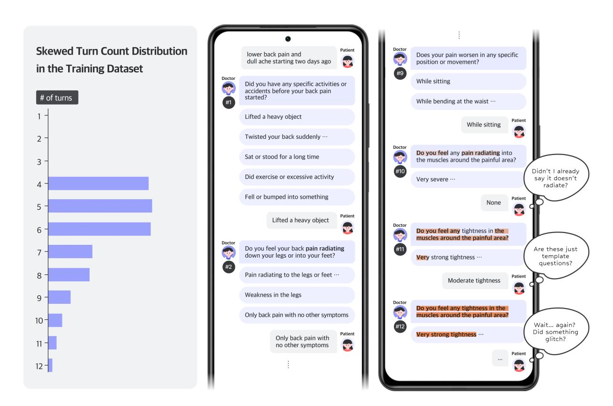
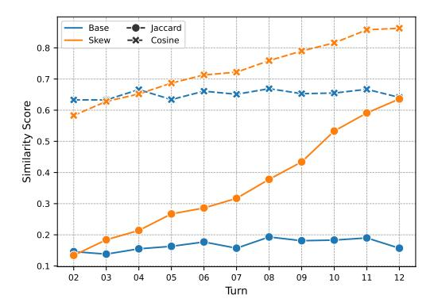
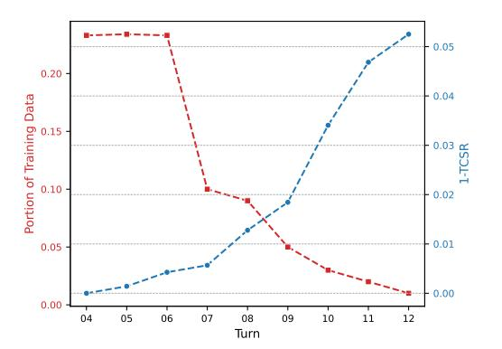
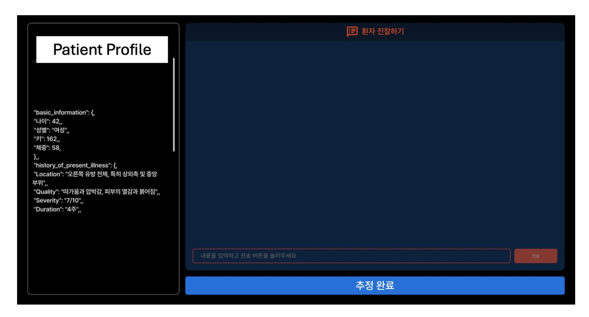

# Format Inertia: A Failure Mechanism of LLMs in Medical Pre-Consultation

Seungseop Lim1 , Gibaeg Kim1 , Wooseok Han1 , Jean Seo1 , Hyunkyung Lee1 , Jaehyo Yoo1 , Eunho Yang1,[2](#page-0-0)∗ 1AITRICS 2KAIST {ss.lim, eunhoy}@aitrics.com, eunhoy@kaist.ac.kr

# Abstract

Recent advances in Large Language Models (LLMs) have brought significant improvements to various service domains, including chatbots and medical pre-consultation applications. In the healthcare domain, the most common approach for adapting LLMs to multi-turn dialogue generation is Supervised Fine-Tuning (SFT). However, datasets for SFT in tasks like medical pre-consultation typically exhibit a skewed turn-count distribution. Training on such data induces a novel failure mechanism we term *Format Inertia*, where models tend to generate repetitive, format-correct, but diagnostically uninformative questions in long medical dialogues. To mitigate this observed failure mechanism, we adopt a simple, datacentric method that rebalances the turn-count distribution of the training dataset. Experimental results show that our approach substantially alleviates Format Inertia in medical preconsultation.

# 1 Introduction

The rapid advancement of Large Language Models (LLMs) has revolutionized the field of conversational artificial intelligence, significantly enhancing user experiences across various domains [\(Achiam](#page-6-0) [et al.,](#page-6-0) [2023;](#page-6-0) [Touvron et al.,](#page-7-0) [2023\)](#page-7-0). However, the majority of these successes have predominantly focused on single-turn interactions. In contrast, realworld industrial applications, particularly in healthcare domains such as medical pre-consultation, demand robust multi-turn dialogues between patients and doctors [\(Tu et al.,](#page-7-1) [2024;](#page-7-1) [Saab et al.,](#page-7-2) [2025;](#page-7-2) [Hu et al.,](#page-6-1) [2024;](#page-6-1) [Winston et al.,](#page-7-3) [2024\)](#page-7-3). These complex multi-turn environments require the model to effectively maintain and utilize long-range conversational context, which remains a challenging problem [\(Laban et al.,](#page-6-2) [2025\)](#page-6-2).

The predominant approach to adapting LLMs for multi-turn dialogue generation in healthcare domains is Supervised Fine-Tuning (SFT) [\(Wang](#page-7-4) [et al.,](#page-7-4) [2023;](#page-7-4) [Yu et al.,](#page-7-5) [2025;](#page-7-5) [Christophe et al.,](#page-6-3) [2024\)](#page-6-3). Despite its widespread use, prior work has largely overlooked the effects of skewed turn-count distribution in training data, particularly their influence on an LLM's ability to maintain longrange conversational context and the specific failure mechanisms that emerge in long medical dialogues. While fine-tuning on high-quality medical datasets is widely recognized as critical for improving accuracy, consistency, and reliability, the role of turn-count distribution in training data in shaping long medical dialogue competence remains insufficiently understood.

This paper aims to fill this gap by hypothesizing and empirically validating that the skewed turn-count distribution in the training datasets impairs LLMs' adherence to task constraints in medical pre-consultation multi-turn dialogues. Specifically, models trained predominantly on dialogues with short turn lengths—reflecting real-world production data distribution—lack sufficient exposure to the complex contextual dependencies present in longer interviews. Consequently, these models struggle to generate follow-up questions that acquire novel diagnostic information during long medical dialogues.

To better understand this failure, we introduce a novel failure mechanism termed *Format Inertia*, which we define and empirically observe in this study. Analogous to physical inertia, where an object maintains its current state absent external force, Format Inertia describes LLMs' tendency to overly rely on previously generated question patterns when confronted with uncertainty in rarely seen long medical dialogues. This results in repetitive and unproductive questioning that preserves superficial format but fails to contribute new diagnostic information, as illustrated in Figure [1,](#page-1-0) where models trained on skewed turn-count distribution repeat previous questions in the latter turns of long

∗Corresponding author.

Figure 1: Example of Format Inertia in Medical Pre-Consultation. When trained on skewed turn-count distribution, the model overly relies on previously generated question patterns—preserving superficial format but failing to contribute new diagnostic information (#2→#10) and repeating identical questions (#11→#12). Format Inertia not only stalls clinical progress but also leaves the patient feeling confused, thereby undermining the overall user experience.

dialogues.

To address this issue, we adopt a data-centric strategy that constructs a Uniform Turn-Count Dataset by sampling an equal number of dialogues across max turn-count bins, thereby ensuring balanced exposure to diverse dialogue lengths. This approach significantly mitigates Format Inertia in long medical pre-consultations. Our main contributions are summarized as follows:

- Analysis of Turn-Count Distribution Impact: We systematically identify and quantitatively analyze the causal relationship between skewed turn-count distribution in the training dataset and degraded task constraint adherence in LLMs. This clarifies a core reason for performance degradation when training medical pre-consultation models under realistic conditions.
- Definition of Format Inertia: We propose and empirically observe *Format Inertia*, a novel phenomenon where models trained on skewed turn-count distribution generate repet-

itive and unproductive medical questions by over-relying on existing question formats when faced with uncertainty in long medical dialogues. To our knowledge, this study is the first to specifically explain the failure of LLMs to maintain context when trained with a skewed turn-count distribution.

• Practical Data-Centric Solution: We adopt a data-centric approach that rebalances the turncount distribution in the training dataset by constructing a Uniform Turn-Count Dataset. This simple adjustment significantly improves the model's ability to maintain long-range conversational context and adhere to task constraints in long medical dialogues.

# 2 Background

Challenges in Multi-turn Conversational AI Multi-turn dialogue systems must maintain context across long dialogues while satisfying various constraints. Recent benchmarks evaluate these capabilities: FollowBench [\(Jiang et al.,](#page-6-4) [2023\)](#page-6-4) assesses

format and content constraints, CFBench [\(Zhang](#page-7-6) [et al.,](#page-7-6) [2024\)](#page-7-6) provides a comprehensive evaluation, and [Wen et al.](#page-7-7) [\(2024\)](#page-7-7) considers constraint combinations. These studies highlight the complexity of real-world instruction-following requirements.

To address these challenges, methodologies like Parrot [\(Sun et al.,](#page-7-8) [2024\)](#page-7-8) enhance multi-turn capabilities, while [Ren et al.](#page-7-9) [\(2025\)](#page-7-9) focus on soft constraints requiring contextual judgment. However, existing research primarily concentrates on model architectures or training paradigms, overlooking how statistical characteristics of training data affect long dialogue performance.

Conversational Information Seeking in Medical Domain Medical pre-consultation systematically collects patients' History of Present Illness (HPI) for diagnostic decisions. Systems must actively seek diagnostically valuable information beyond scripted questions [\(Tu et al.,](#page-7-1) [2024;](#page-7-1) [Saab](#page-7-2) [et al.,](#page-7-2) [2025\)](#page-7-2). Evaluation frameworks like CRAFT-MD [\(Johri et al.,](#page-6-5) [2025\)](#page-6-5) and planning methods like Uncertainty of Thoughts [\(Hu et al.,](#page-6-1) [2024\)](#page-6-1) support meaningful information seeking in uncertain medical contexts.

While Supervised Fine-Tuning (SFT) using online medical consultation records or synthetic medical data has achieved high performance [\(Wang](#page-7-4) [et al.,](#page-7-4) [2023;](#page-7-4) [Yu et al.,](#page-7-5) [2025\)](#page-7-5), real medical data naturally exhibits a distribution skewed toward shorter dialogues. The impact of such skewed turn-count distribution on long dialogue performance remains unexplored.

# 3 Methodology

In this section, we investigate how the turn-count distribution in the training dataset affects Large Language Models (LLMs) engaged in medical preconsultation. We first formalize the task, then describe a failure mechanism triggered by skewed turn-count distribution, and finally present a datacentric mitigation strategy.

## 3.1 Task Definition

The objective of this task is to generate contextually appropriate questions in a multi-turn dialogue setting, specifically within the domain of medical pre-consultation scenarios between patients and doctors. In this scenario, the LLM acts as a doctor who iteratively interacts with a patient. Beyond producing formally correct questions, the model must maintain and use the accumulated conversational

history to ask contextually appropriate follow-up questions that diagnostically informative.

These requirements can be grouped into two sets of constraints: (i) format constraints, which govern structural aspects such as response format, response language, and the absence of forbidden terms; and (ii) task constraints, which ensure that each generated question is clinically meaningful and advances the diagnostic goal.

# 3.2 Format Inertia: A Failure Mechanism Induced by Skewed Turn-Count Distribution

As in most real-world datasets, medical dialogues exhibit a skewed turn-count distribution: short conversations dominate, while long medical dialogues are scarce. When an LLM is fine-tuned on such data, its exposure to long dialogues is limited. We hypothesise that this imbalance leads to a failure mechanism we call *Format Inertia*. Faced with these under-represented cases, the model tends to safe, repetitive question templates that satisfy superficial format constraints but fail to acquire new diagnostic information.

Format Inertia manifests as an over-reliance on previously generated patterns. The model preserves surface form—e.g., a fixed question pattern—yet produces redundant or low-utility questions because it cannot integrate long-range context effectively. We validate this hypothesis empirically in Section [4.3.](#page-5-0)

# 3.3 Uniform Turn-Count Dataset: Mitigating Format Inertia

To counteract Format Inertia, we adopt a simple data-centric remedy: constructing a Uniform Turn-Count Dataset. This approach rebalances the training data by ensuring equal representation for dialogues of varying lengths. By exposing the model to a balanced mix of short and long conversations, we mitigate its tendency to follow repetitive patterns when faced with less familiar, long dialogues. The dataset construction process is as follows:

- 1. Turn-Based Binning: All N dialogues from the source dataset are grouped into B bins based on their maximum turn-count.
- 2. Quota Determination: A sampling quota, q, is set to the number of dialogues in the smallest bin.

- 3. Uniform Sampling: We select all bins that meet a minimum turn threshold, Tmin. Let B′ be the number of selected bins. From each of these B′ bins, we randomly sample q dialogues.
- 4. Dataset Assembly: The sampled dialogues are aggregated to form the final Uniform Turn-Count Dataset, containing a total of q × B′ dialogues.

Equalizing turn-counts naturally broadens the spectrum of clinical scenarios encountered during training. Shorter dialogues often correspond to consultations with patients having relatively minor conditions, while longer dialogues are typically associated with patients who require more in-depth medical reasoning, involving complex history-taking. This balanced exposure ensures the model develops robust strategies for a wide range of consultation lengths, enhancing its ability to handle the diverse patient interactions found in real-world clinical settings.

# 4 Experiments

In this section, we present experiments evaluating our central hypothesis and method in our medical pre-consultation service scenarios.

## 4.1 Experimental Setting

Real-World Data Source To test our hypothesis, we gathered a corpus of approximately 8,000 medical pre-consultation dialogues generated by 40 doctors interacting with a patient model. This dataset naturally exhibits a skewed turn-count distribution, with a majority of short conversations and a minority of long ones, reflecting typical realworld scenarios. Further details on data collection are available in Appendix [A.](#page-8-0)

Training Datasets To systematically analyze the effect of turn-count distribution, we constructed three training datasets sampled from the real-world corpus: (i) a Skewed Turn 1k subset (1,000 dialogues), (ii) the full Skewed Turn 8k set (8,000 dialogues), and (iii) a Uniform Turn 1k subset (1,000 dialogues).

• Skewed Turn-Count Dataset: This dataset mirrors the natural skewed turn-count distribution of the real-world data source, and we evaluate it at two different scales (1,000 and 8,000) to investigate the effect of data volume under the same distribution.

• Uniform Turn-Count Dataset: This dataset is constructed using our data-centric strategy, which alleviates distributional bias by uniformly sampling dialogues across the entire spectrum of turn lengths observed in the realworld dataset. This approach ensures balanced exposure to both short and long interactions during training.

Evaluation Datasets To enable consistent and rigorous evaluation of long-form dialogue capabilities, we constructed a dedicated evaluation set. This set comprises 100 patient profiles curated by medical professionals. During evaluation, each model engages in a simulated multi-turn dialogue with a patient model instantiated from these profiles.

Doctor Model Our experiments included both open-source and proprietary models. For the opensource group, we selected Gemma-3-4B[\(Team](#page-7-10) [et al.,](#page-7-10) [2025\)](#page-7-10) and Qwen2.5-3B[\(Yang et al.,](#page-7-11) [2025\)](#page-7-11), based on their strong performance and reliable multilingual language support, including Korean, which is the target service language.

As a representative proprietary model, we employed GPT-4.1-mini[1](#page-3-0) , chosen for its balance between state-of-the-art capability and computational efficiency. All doctor models were provided with a simplified version of the patient's condition to simulate limited prior knowledge typically available during medical pre-consultation. (see Appendix [C](#page-8-1) for details).

Patient Model To ensure consistent and reproducible evaluation across different doctor models, we used o4-mini[2](#page-3-1) as the patient model throughout all inference-time interactions. The patient model was equipped with full knowledge of each clinical case, including detailed medical history and contextual information. This setup emulates a realistic pre-consultation scenario, where the patient provides accurate and consistent responses, thereby allowing fair comparisons across doctor model outputs.

Evaluation Metrics To evaluate the output quality of LLMs in the context of medical preconsultation under production settings, we assess two critical aspects: adherence to service-specific format constraints and the clinical utility of the generated questions. To measure adherence to structural requirements, we use the *Format-Constraint*

1 gpt-4.1-mini-2025-04-14

2 o4-mini-2025-04-16

| Constraint                                                                                     | Description                                                                                                                                                                                                                                                                                                         |
|------------------------------------------------------------------------------------------------|---------------------------------------------------------------------------------------------------------------------------------------------------------------------------------------------------------------------------------------------------------------------------------------------------------------------|
| Format Constraints                                                                             |                                                                                                                                                                                                                                                                                                                     |
| response_format response_language forbidden_words number_options sentence_startend | Output adheres to the required format.  Response is consistently written in the designated language.  Prohibited terms are entirely excluded from the response.  Presents the correct number of options as specified.  Each sentence begins and ends with the appropriate grammatical form, such as polite endings. |
| Task Constraints                                                                               |                                                                                                                                                                                                                                                                                                                     |
| clinical_utility                                                                               | The response effectively elicits additional clinical information relevant to diagnosis.                                                                                                                                                                                                                             |

Table 1: Definitions of Format and Task Constraints used for model evaluation. Specific examples for each constraint category are provided in Appendix F.

| Model        | Type    | Samples | FCSR  | TCSR  |
|--------------|---------|---------|-------|-------|
|              | base    | -       | 0.361 | 0.872 |
| Gemma-3 (4B) | skew    | 1k      | 0.960 | 0.824 |
|              | skew    | 8k      | 0.966 | 0.811 |
|              | uniform | 1k      | 0.967 | 0.891 |
|              | base    | -       | 0.363 | 0.783 |
| Qwen2.5 (3B) | skew    | 1k      | 0.922 | 0.746 |
|              | skew    | 8k      | 0.914 | 0.737 |
|              | uniform | 1k      | 0.927 | 0.812 |
| GPT-4.1-mini | base    | -       | 0.906 | 0.880 |

Table 2: Comparison of Format-Constraint Satisfaction Rate (FCSR) and Task-Constraint Satisfaction Rate (TCSR) across models trained on datasets with varying turn-count distribution. The 'base' denotes the original model before fine-tuning. 'Samples' refers to the number of dialogues used for fine-tuning.

Satisfaction Rate (FCSR). This metric evaluates the model's compliance with five predefined formatting rule categories, based on a modified version of the benchmark proposed in (Zhou et al., 2023), as listed in Table 1. We implement a strictly coded validator to automatically and consistently check each dialogue turn against all constraint categories. FCSR is computed as the proportion of dialogue turns that fully satisfy all format constraints out of the total number of evaluated turns:

$$FCSR = \frac{\text{\# of Turns Satisfying All Format Constraints}}{\text{\# of Turns in Total}}$$

To assess the contextual appropriateness and diagnostic utility of the model's outputs, we define the *Task-Constraint Satisfaction Rate (TCSR)*. This metric evaluates whether the model adheres to qualitative task constraints that ensure the generation of clinically meaningful questions, as detailed in Table 1. TCSR is computed as the fraction of turns that fulfill task-specific criteria:

To verify the diagnostic utility of the generated questions, we adopt an LLM-as-a-Judge ap-

proach (Zheng et al., 2023) as our evaluation framework (see Appendix E for details).

To ensure the reliability of our evaluation framework, we conducted a human verification study on a subset of 240 samples from the evaluation data. Two medical experts independently assessed these samples using the same criteria as our LLM judge. The inter-rater agreement analysis revealed:

- Cohen's Kappa: 0.8091, indicating "almost perfect" agreement according to Landis and Koch's interpretation scale.
- Spearman's Rank Correlation: 0.8129 (p < 0.0001), confirming a strong positive correlation between human and LLM assessments.</li>

This high level of agreement validates that our LLM-based evaluation provides reliable and scalable assessment for this specific, constrained task.

#### 4.2 Results

Our experiments reveal that while SFT improves format adherence, the turn-count distribution of the training data critically impacts task performance. As shown in Table 2, models fine-tuned on the skewed turn-count dataset with 1,000 samples achieve a high FCSR but suffer a TCSR drop—for example, from 0.872 to 0.824 in Gemma-3 and from 0.783 to 0.746 in Qwen2.5—demonstrating Format Inertia. Furthermore, increasing the volume of skewed data to 8,000 samples can exacerbate this degradation, leading to an even lower TCSR.

In contrast, fine-tuning on the Uniform turn-count dataset with 1,000 samples effectively mitigates this trade-off. Specifically, uniform sampling recovers TCSR to 0.891 while slightly improving FCSR to 0.967 for Gemma-3, enabling the model to generate responses that are both formally correct and clinically meaningful. This finding underscores that for medical pre-consultation tasks, data quality

Figure 2: Models trained on skewed turn-count data show a progressive increase in Jaccard and Cosine similarity across dialogue turns, indicating an intensifying pattern of repetitive questioning driven by Format Inertia, in contrast to the base model.

Figure 3: Impact of Skewed turn-count data on TCSR. Inverse relationship between the frequency of turns in the Skewed Turn training data (left y-axis) and the Task-Constraint failure rate (1-TCSR) in evaluation (right y-axis), highlighting performance degradation on underrepresented long turns.

and distributional balance are paramount over sheer quantity, as the model trained on 1,000 uniform samples significantly outperforms the one trained on 8,000 skewed samples.

### 4.3 Analysis

Our analysis identifies the root cause of performance degradation as *Format Inertia*. This phenomenon describes the model's tendency to follow familiar, repetitive questioning patterns when faced with the uncertainty of long medical dialogue contexts, which are under-represented in skewed training data. In such cases, the model successfully maintains surface-level format constraints but neglects the more cognitively demanding task of generating novel, contextually relevant questions.

We quantify this failure mechanism by analyz-

| Model   | Size | Туре            | FCSR                  | TCSR                  |
|---------|------|-----------------|-----------------------|-----------------------|
| Gemma-3 | 4B   | base            | 0.361                 | 0.872                 |
|         |      | skew uniform | 0.960 <b>0.967</b> | 0.824 <b>0.891</b> |
|         | 12B  | base            | 0.577                 | 0.880                 |
|         |      | skew uniform | 0.972 <b>0.976</b> | 0.843 <b>0.896</b> |
|         | 27B  | base            | 0.863                 | 0.884                 |
|         |      | skew uniform | 0.963 <b>0.964</b> | 0.853 <b>0.901</b> |

Table 3: Performance variation by model size, illustrating the impact of Uniform Turn-Count Dataset on the Gemma-3 model across its different scales.

ing question similarity throughout the dialogue. To probe this, we measure both lexical and semantic similarity of model-generated questions during medical pre-consultation. Specifically, we use Jaccard Similarity for lexical comparison and Cosine Similarity for semantic similarity, computing each question's maximum similarity against all preceding ones. As illustrated in Figure 2, models trained on skewed turn-count data show a progressive increase in both metrics, confirming that they produce increasingly redundant questions in both form and meaning. In contrast, the base model without fine-tuning shows no such trend. This behavior strongly indicates that Format Inertia is a direct consequence of the training data's skewed dialogue structure, causing the model to repeat surface-level patterns that are grammatically sound but semantically unproductive. Figure 3 demonstrates a clear inverse relationship: a given turn length's rarity in the training data correlates with a higher taskconstraint failure rate (1-TCSR) during evaluation. This confirms that Format Inertia is a direct consequence of the model's limited exposure to long medical dialogues, forcing it to fall back on formally correct but functionally redundant patterns.

The issue is particularly critical for efficiency-oriented models commonly used in real-world deployments. As shown in Table 3, although the benefits of a uniform turn-count distribution are observed across all model sizes, TCSR consistently declines when models are trained on skewed data but recovers under the uniform setting. These results confirm that Format Inertia is a persistent challenge regardless of scale, underscoring the importance of addressing it to ensure the reliability and practicality of conversational AI systems.

# 5 Conclusion

In this study, we identify Format Inertia as a failure mechanism in LLM-based medical preconsultation, caused by skewed turn-count distribution in the training data. Limited exposure to long dialogues leads models to tend to familiar question patterns, resulting in repetitive, low-utility outputs that meet format requirements but fail to elicit new diagnostic information. To address this, we construct a Uniform Turn-Count Dataset, which rebalances turn distribution. Our experiments show this approach effectively mitigates Format Inertia in long medical dialogues. These findings underscore the critical role of data distribution, especially the turn-count distribution, in multi-turn robustness.

# Limitations

Our study has several limitations that also point to directions for future work. First, our experiments are concentrated on the specific domain of medical pre-consultation. A valuable direction for future research would be to investigate whether the *Format Inertia* phenomenon we identified generalizes to other conversational domains, such as legal counseling or technical support, which would broaden the implications of our findings. Second, our evaluation of question quality relied on an LLM-as-a-Judge approach. While this method ensures consistency, it may not fully capture the nuanced judgments of human medical experts. Future work could strengthen the validity of our evaluation framework by systematically analyzing the correlation between LLM-based assessments and human expert judgments. Finally, while we identify the skewed turn-count distribution as a key driver of Format Inertia, other factors—such as the diversity of dialogue scenarios or specific model architectures—could also contribute to this phenomenon. Exploring these additional factors represents an important avenue for developing a more comprehensive understanding of this failure mode.

# Ethics Statement

This study was conducted with a strong commitment to ethical principles. The dataset used for training and evaluation was sourced from a controlled patient simulation platform, where medical professionals generated dialogue data. Crucially, this process did not involve any real patient data, thereby avoiding risks related to patient privacy

and data confidentiality. All data was carefully processed to ensure no personally identifiable information was included. We emphasize that the models developed in this research are intended as assistive tools for pre-consultation and are not a substitute for professional medical diagnosis or advice. Any real-world deployment of such technology would require rigorous safety testing, regulatory approval, and a human-in-the-loop system to ensure patient safety and well-being.

# References

Josh Achiam, Steven Adler, Sandhini Agarwal, Lama Ahmad, Ilge Akkaya, Florencia Leoni Aleman, Diogo Almeida, Janko Altenschmidt, Sam Altman, Shyamal Anadkat, et al. 2023. Gpt-4 technical report. *arXiv preprint arXiv:2303.08774*.

Clément Christophe, Tathagata Raha, Svetlana Maslenkova, Muhammad Umar Salman, Praveen K Kanithi, Marco AF Pimentel, and Shadab Khan. 2024. Beyond fine-tuning: Unleashing the potential of continuous pretraining for clinical llms. *arXiv preprint arXiv:2409.14988*.

Tim Dettmers, Artidoro Pagnoni, Ari Holtzman, and Luke Zettlemoyer. 2023. Qlora: Efficient finetuning of quantized llms. *Advances in neural information processing systems*, 36:10088–10115.

Zhiyuan Hu, Chumin Liu, Xidong Feng, Yilun Zhao, See-Kiong Ng, Anh Tuan Luu, Junxian He, Pang Wei W Koh, and Bryan Hooi. 2024. Uncertainty of thoughts: Uncertainty-aware planning enhances information seeking in llms. *Advances in Neural Information Processing Systems*, 37:24181–24215.

Yuxin Jiang, Yufei Wang, Xingshan Zeng, Wanjun Zhong, Liangyou Li, Fei Mi, Lifeng Shang, Xin Jiang, Qun Liu, and Wei Wang. 2023. Followbench: A multi-level fine-grained constraints following benchmark for large language models. *arXiv preprint arXiv:2310.20410*.

Shreya Johri, Jaehwan Jeong, Benjamin A Tran, Daniel I Schlessinger, Shannon Wongvibulsin, Leandra A Barnes, Hong-Yu Zhou, Zhuo Ran Cai, Eliezer M Van Allen, David Kim, et al. 2025. An evaluation framework for clinical use of large language models in patient interaction tasks. *Nature medicine*, 31(1):77–86.

Sunjun Kweon, Byungjin Choi, Gyouk Chu, Junyeong Song, Daeun Hyeon, Sujin Gan, Jueon Kim, Minkyu Kim, Rae Woong Park, and Edward Choi. 2024. Kormedmcqa: Multi-choice question answering benchmark for korean healthcare professional licensing examinations. *arXiv preprint arXiv:2403.01469*.

Philippe Laban, Hiroaki Hayashi, Yingbo Zhou, and Jennifer Neville. 2025. Llms get lost in multi-turn conversation. *arXiv preprint arXiv:2505.06120*.

- Qingyu Ren, Jie Zeng, Qianyu He, Jiaqing Liang, Yanghua Xiao, Weikang Zhou, Zeye Sun, and Fei Yu. 2025. Step-by-step mastery: Enhancing soft constraint following ability of large language models. *arXiv preprint arXiv:2501.04945*.
- Khaled Saab, Jan Freyberg, Chunjong Park, Tim Strother, Yong Cheng, Wei-Hung Weng, David GT Barrett, David Stutz, Nenad Tomasev, Anil Palepu, et al. 2025. Advancing conversational diagnostic ai with multimodal reasoning. *arXiv preprint arXiv:2505.04653*.
- Yuchong Sun, Che Liu, Kun Zhou, Jinwen Huang, Ruihua Song, Wayne Xin Zhao, Fuzheng Zhang, Di Zhang, and Kun Gai. 2024. Parrot: Enhancing multi-turn instruction following for large language models. In *Proceedings of the 62nd Annual Meeting of the Association for Computational Linguistics (Volume 1: Long Papers)*, pages 9729–9750.
- Gemma Team, Aishwarya Kamath, Johan Ferret, Shreya Pathak, Nino Vieillard, Ramona Merhej, Sarah Perrin, Tatiana Matejovicova, Alexandre Ramé, Morgane Rivière, et al. 2025. Gemma 3 technical report. *arXiv preprint arXiv:2503.19786*.
- Hugo Touvron, Thibaut Lavril, Gautier Izacard, Xavier Martinet, Marie-Anne Lachaux, Timothée Lacroix, Baptiste Rozière, Naman Goyal, Eric Hambro, Faisal Azhar, et al. 2023. Llama: Open and efficient foundation language models. *arXiv preprint arXiv:2302.13971*.
- Tao Tu, Anil Palepu, Mike Schaekermann, Khaled Saab, Jan Freyberg, Ryutaro Tanno, Amy Wang, Brenna Li, Mohamed Amin, Nenad Tomasev, et al. 2024. Towards conversational diagnostic ai. *arXiv preprint arXiv:2401.05654*.
- Wen Wang, Zhenyue Zhao, and Tianshu Sun. 2023. Customizing large language models for business context: framework and experiments. *arXiv preprint arXiv:2312.10225*.
- Bosi Wen, Pei Ke, Xiaotao Gu, Lindong Wu, Hao Huang, Jinfeng Zhou, Wenchuang Li, Binxin Hu, Wendy Gao, Jiaxing Xu, et al. 2024. Benchmarking complex instruction-following with multiple constraints composition. *Advances in Neural Information Processing Systems*, 37:137610–137645.
- Caleb Winston, Cleah Winston, Claris Winston, and Chloe Winston. 2024. [Medical question-generation](https://openreview.net/forum?id=du26Irf5kE) [for pre-consultation with LLM in-context learning.](https://openreview.net/forum?id=du26Irf5kE) In *GenAI for Health: Potential, Trust and Policy Compliance*.
- An Yang, Anfeng Li, Baosong Yang, Beichen Zhang, Binyuan Hui, Bo Zheng, Bowen Yu, Chang Gao, Chengen Huang, Chenxu Lv, et al. 2025. Qwen3 technical report. *arXiv preprint arXiv:2505.09388*.
- Hongzhou Yu, Tianhao Cheng, Ying Cheng, and Rui Feng. 2025. Finemedlm-o1: Enhancing the medical reasoning ability of llm from supervised

- fine-tuning to test-time training. *arXiv preprint arXiv:2501.09213*.
- Tao Zhang, Chenglin Zhu, Yanjun Shen, Wenjing Luo, Yan Zhang, Hao Liang, Fan Yang, Mingan Lin, Yujing Qiao, Weipeng Chen, et al. 2024. Cfbench: A comprehensive constraints-following benchmark for llms. *arXiv preprint arXiv:2408.01122*.
- Lianmin Zheng, Wei-Lin Chiang, Ying Sheng, Siyuan Zhuang, Zhanghao Wu, Yonghao Zhuang, Zi Lin, Zhuohan Li, Dacheng Li, Eric Xing, et al. 2023. Judging llm-as-a-judge with mt-bench and chatbot arena. *Advances in neural information processing systems*, 36:46595–46623.
- Jeffrey Zhou, Tianjian Lu, Swaroop Mishra, Siddhartha Brahma, Sujoy Basu, Yi Luan, Denny Zhou, and Le Hou. 2023. Instruction-following evaluation for large language models. *arXiv preprint arXiv:2311.07911*.

# A Dataset Details

Data Source and Scale Our real-world dataset was collected from a medical pre-consultation platform, where 40 licensed doctors conducted preconsultations with patient models (see Figure [4\)](#page-9-0). In total, we collected 8,000 dialogues.

Real-World Distribution The dataset naturally exhibits a heavily skewed turn-count distribution, where most dialogues are short (see Table [4\)](#page-8-2). This inherent imbalance motivated our investigation into how turn-count distribution affects model behavior, especially in long medical dialogues.

Skewed Turn-Count Dataset To reflect the realworld data distribution, we constructed a Skewed Turn-Count Dataset by sampling 1,000 dialogues probabilistically from a pool of 8,000, preserving the original skewed turn-count distribution.

Uniform Turn-Count Dataset To address the Format Inertia phenomenon caused by the skewed turn-count distribution, we constructed a Uniform Turn-Count Dataset that equalizes the representation of dialogues across different lengths. The dataset creation procedure is outlined below:

- 1. Turn-Based Binning: We first divided all 8,000 dialogues from the original dataset into 12 bins according to their maximum turncount (from 1 to 12).
- 2. Quota Determination: To ensure uniformity, we used the bin with the smallest number of dialogues as the reference for sampling. As shown in Table [4,](#page-8-2) the bin for 12-turn dialogues contains only 111 examples, which we set as the sampling quota.
- 3. Uniform Sampling: We then randomly sampled 111 dialogues without replacement from each of the nine bins, ranging from 4 to 12 turns (excluding bins with fewer than 4 turns, which contained no dialogues).
- 4. Dataset Assembly: The sampled dialogues were merged to form the final Uniform Turn-Count Dataset, consisting of 999 dialogues (111 dialogues × 9 bins), i.e., almost 1,000 in total. This construction ensures that the model is trained on a balanced distribution of short and long multi-turn interactions.

| Turn | Count |
|------|-------|
| 1    | 0     |
| 2    | 0     |
| 3    | 0     |
| 4    | 1835  |
| 5    | 1890  |
| 6    | 1825  |
| 7    | 820   |
| 8    | 705   |
| 9    | 395   |
| 10   | 260   |
| 11   | 165   |
| 12   | 111   |
|      |       |

Table 4: Real-World Turn-Count Distribution in Medical Pre-Consultation.

# B Training Details

Models We employed a set of Large Language Models (LLMs) as doctor models in our experiments. Specifically, we used the instruction-tuned versions of the following models: google/gemma-3-4b-it, google/gemma-3-12b-it, google/gemma-3- 27b-it, and Qwen/Qwen2.5-3B-Instruct.

Fine-Tuning Procedure Supervised Fine-Tuning (SFT) was performed using the training datasets described in Appendix [A.](#page-8-0) We utilized the Unsloth framework[3](#page-8-3) to streamline the fine-tuning process.

Hyperparameters We fine-tuned the models with the following hyperparameter configuration: a learning rate of 1 × 10−4 , batch size of 32, and 3 training epochs. We used QLoRA [\(Dettmers et al.,](#page-6-6) [2023\)](#page-6-6) with a rank of 32, lora alpha = 64, lora dropout = 0.1, a cosine learning rate scheduler, and a weight decay of 0.005.

Hardware Environment All fine-tuning experiments were conducted on NVIDIA A100 GPUs, each equipped with 80GB of memory.

# C Patient Information Provided to Models

During evaluation, different sets of patient information were provided to the doctor and patient models to simulate realistic consultation dynamics.

Doctor Model Input As illustrated in Table [5,](#page-11-0) the doctor model received a concise summary of the patient's profile. This summary includes essential information such as age, gender, chief complaint,

3 <https://github.com/unslothai/unsloth>

Figure 4: Interface of the medical pre-consultation platform where doctor and patient models engage in interactive pre-consultation dialogues.

and a brief description of symptoms. This limited view encourages the doctor model to ask clarifying questions to gather more detailed clinical information.

Patient Model Input Table [6](#page-11-1) shows the full patient context that was provided to the patient model. This includes comprehensive clinical data such as detailed symptom descriptions, medical history, and other contextual information. The patient model responds to the doctor's questions based on this full input, ensuring informative and contextually accurate answers.

This asymmetric information setup mimics realworld patient-doctor interactions and helps evaluate the models' ability to engage in effective diagnostic dialogue.

# D System Prompts

## D.1 Doctor System Prompt

The following prompt was used for the doctor model to generate medically relevant follow-up questions:

## Doctor System Prompt

You are a physician with professional medical knowledge. Your task is to generate the optimal follow-up question that helps with differential diagnosis based on the given patient information and previous consultation history.

### Instructions

- 1. You must use only Korean.
- 2. Generate only questions that effectively collect medically useful information required for diagnosis.
- 3. Provide 2 to 5 options.
- 4. Do not include "Other" as an option.
- 5. Output in YAML format.
- 6. The question must end with "요?" (appropriate polite phrase in Korean).

### Output format Question: Options: ...

## D.2 Patient System Prompt

The patient model received the following prompt along with specific patient profile information:

# Patient System Prompt You are a patient with the following profile: {patient\_information}

You should faithfully answer the doctor's inquiries for an appropriate diagnosis. Choose one of the questions provided by the doctor and respond.

Output format: Answer:

# E Evaluation Details

Judge LLM We employed GPT-4.1-mini [4](#page-10-2) as the evaluation judge. The model was prompted with a rubric to assess each turn based on format and task satisfaction. We selected this model based on its strong performance on Korean medical QA benchmarks, particularly KorMedMCQA [\(Kweon et al.,](#page-6-7) [2024\)](#page-6-7), which served as a key reference for evaluating its judgment capabilities. The evaluation prompt used for the judge model is shown in Figure [5.](#page-11-2)

# F Constraint Examples

The examples provided are based on actual data used in our evaluation or similar scenarios.

Format Constraint Examples Figures [6–](#page-12-0)[10](#page-13-0) illustrate how a model's response can satisfy or violate each format constraint. Each figure shows a side-by-side comparison within a hypothetical dialogue turn where the model acts as a doctor.

Task Constraint Examples Figure [11](#page-13-1) provides an example for the clinical\_utility constraint. It shows whether the model's (doctor's) question effectively elicits new information necessary for patient diagnosis.

# G Real-world Case Study

Beyond our controlled experimental setting, we applied this model to VDoc[5](#page-10-3) , a medical preconsultation service deployed in South Korea, where we directly observed Format Inertia in realworld production settings. In one notable case, a patient consultation extended to 15 turns due to complex symptoms. After turn 8, the model began repeating variations of previously asked questions about symptom onset and pain location, despite having already received comprehensive answers. This real-world instance confirmed that Format Inertia is not merely an experimental artifact but a critical production issue that impacts user experience and diagnostic efficiency.

# H Distinction Between Format Inertia and Context Rot

While Format Inertia may appear related to the concept of "Context Rot"—a general performance degradation over long contexts—we argue that Format Inertia represents a more specific and actionable failure mode:

- A Specious Failure Mode: Context Rot describes broad degradation across all metrics. In contrast, Format Inertia identifies a deceptive scenario where models maintain high Format-Constraint Satisfaction Rate (FCSR) while experiencing sharp drops in Task-Constraint Satisfaction Rate (TCSR). The model appears functional but fails at its core diagnostic purpose.
- Specific Pattern Recognition: Format Inertia manifests as repetitive questioning patterns that are formally correct but diagnostically useless. This specific behavioral pattern makes it identifiable and addressable through targeted interventions like our uniform sampling approach.
- Production Impact: Unlike general context degradation, Format Inertia creates a particularly problematic user experience where patients receive seemingly valid but redundant questions, leading to frustration and abandonment of the consultation process.

4 gpt-4.1-mini-2025-04-14

5 <https://www.vdoc.kr/en>

| Age              | 45                                          |
|------------------|---------------------------------------------|
| Gender           | Male                                        |
| Chief Complaint  | Persistent cough and unintended weight loss |
| Symptom Duration | Within 3 months                             |
| Symptom Location | Right pectoral region and sternal area      |

Table 5: Example of information provided to the doctor model during evaluation, representing a simplified summary of the patient's profile.

| Disease             | Pulmonary tuberculosis                                   |
|---------------------|----------------------------------------------------------|
| Department          | Undetermined                                             |
| Typicality          | Typical                                                  |
| Age                 | 45                                                       |
| Gender              | Male                                                     |
| Height              | 172 cm                                                   |
| Weight              | 68 kg                                                    |
| Symptom Location    | Central chest and occipital region                       |
| Symptom Quality     | Intermittent dry cough and chest tightness               |
| Symptom Severity    | 5/10                                                     |
| Symptom Duration    | 2 months                                                 |
| Timing              | Severe coughing in the morning, intermittent during day  |
| Context             | Worsened after outdoor work and fatigue                  |
| Modifying Factors   | Warm tea and rest help; worsens with activity            |
| Associated Symptoms | Weight loss, night sweats, low-grade fever, mild dyspnea |
| Pain Area           | Right chest (pectoral), Sternal region                   |
| Past History        | No prior TB or chronic respiratory illness               |
| Social History      | Construction worker, past smoker, high-density living    |
| Additional Info     | Dust exposure, smoking history, persistent fatigue       |

Table 6: Example of information accessible to the patient model during evaluation, including comprehensive clinical and contextual details.

### [System]

Please act as an impartial judge and evaluate the quality of the response provided by an AI assistant acting as a doctor in a medical pre-consultation scenario. Your evaluation should consider the criterion defined below.

### Evaluation Criterion:

Effective Elicitation of New Information for Diagnosis: Evaluate whether the generated question effectively elicits new information necessary for patient diagnosis. Your answer must be either True or False.

Begin your evaluation by providing a short explanation for your decision. Be as objective as possible. After providing your explanation, please state your decision as either True or False. Strictly follow this format: "[[True]]" or "[[False]]".

Here is the conversation history: {conversation\_history}

Here is the question and options generated by the assistant:

Question: {question} Options: {options}

Figure 5: The Evaluation Prompt.

Constraint: **response\_format** – Whether the model's response adheres to the specified output format.

#### Satisfying Example

question: "Where is the pain located?" options:

- "Entire head"
- "Forehead"
- "Back of the neck"
- "Temples"

Explanation: The response correctly follows the YAML structure.

### Violating Example

Where is the pain? The options are 1. Entire head, 2. Forehead, 3. Back of the neck, 4. Temples.

Explanation: The response does not follow the specified YAML format and consists only of plain text.

Figure 6: Examples for the response\_format constraint.

Constraint: **response\_language** – Whether the model's response is composed exclusively in the specified language (e.g., English).

#### Satisfying Example

question: "When did the symptoms start?" options:

- "Today"
- "Yesterday"
- "A few days ago"
- "More than a week ago"

#### Violating Example

question: "Quand les symptômes ont-ils commencé ?" options:

- "Aujourd'hui"
- "Hier"

Explanation: The response is written in French, violating the English-only requirement.

Explanation: All content in the response is written in English.

Figure 7: Examples for the response\_language constraint.

Constraint: **forbidden\_words** – Whether the response uses any forbidden words specified by the service (e.g., a forbidden word: "Other").

### Satisfying Example

question: "What type of painkiller did you take?" options:

- "Ibuprofen"
- "Acetaminophen"
- "Aspirin"
- "None"

Explanation: The model avoids the forbidden word "Other" by listing only specific options.

### Violating Example

question: "What type of painkiller did you take?" options:

- "Ibuprofen"
- "Acetaminophen"
- "Other"
- "None"

Explanation: The model includes the forbidden word "Other" in the options, violating the constraint.

Figure 8: Examples for the forbidden\_words constraint where "Other" is a forbidden term.

Constraint: **number\_options** – Whether the number of options provided with the question is correct (e.g., a rule: must be between 2 and 5 options).

#### Satisfying Example

question: "What is the nature of the pain?" options:

- "Throbbing" - "Stabbing"
- "Squeezing"

Explanation: It provides 3 options, which adhere to the rule.

#### Violating Example

question: "Where is the pain located?" options:

- "Forehead"
- "Temples"
- "Back of the head"
- "Neck"
- "Jaw"
- "Behind the eyes"
- "Left side"
- "Right side"

Explanation: It provides 8 options, exceeding the maximum allowed number.

Figure 9: Examples for the number\_options constraint.

Constraint: **sentence\_startend** – Whether the question ends with the appropriate polite phrase (e.g., must end with "요?").

### Satisfying Example

question: "통증이 가장 심한 시간대가 언제인가요?" options:

- "아침"
- "오후"
- "밤" - "특정 시간 없음"

Explanation: The question ends with a polite expression (" 요?"), conforming to the expected sentence structure.

#### Violating Example

question: "통증이 가장 심한 시간대?" options:

- "아침"
- "오후"
- "밤"
- "없음"

Explanation: The question ends with a fragment, not a polite sentence ending with "요?", violating the constraint.

Figure 10: Examples for the sentence\_startend constraint requiring questions to end with "요?".

Constraint: **clinical\_utility** – Whether the generated question effectively elicits new information required for patient diagnosis.

Satisfying Example: (Dialogue Turn 5) Previous conversation summary: The patient has mentioned having a headache, located in the forehead, which started a few days ago.

question: "Were there any specific activities or changes (e.g., stress, lack of sleep, dietary changes) before the headache occurred?" options:

- "Yes, there were"
- "No, there were not"

Explanation: This is a question that explores new information about the background of the patient's symptoms, attempting to obtain crucial information for diagnosis. It asks about a new aspect not covered in the previous conversation.

Violating Example (Format Inertia Case): (Dialogue Turn 10) Previous conversation summary: The patient has already provided a lot of information, including the headache, its location, onset, nature of the pain, and accompanying symptoms (no nausea, sensitivity to light/sound). The model had also asked "When did you start feeling sick?" in turn 4.

question: "When did the symptoms start?" options:

- "Today"
- "Yesterday"
- "A few days ago"
- "More than a week ago"

Explanation: The model is asking a question that has already been answered or can be inferred from a previous turn. Although it is formally a question, it is an unproductive one that fails to elicit any new diagnostic information.

Figure 11: Example for the clinical\_utility constraint.