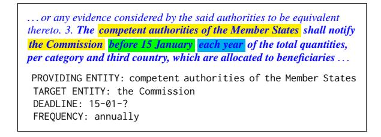
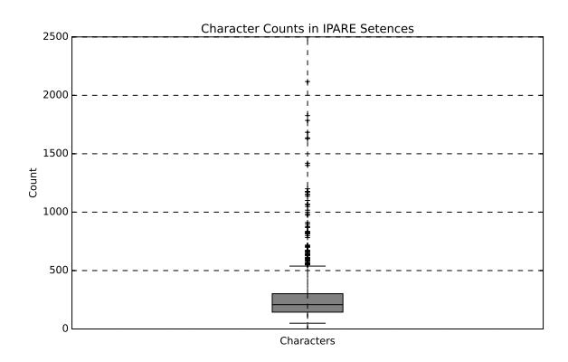
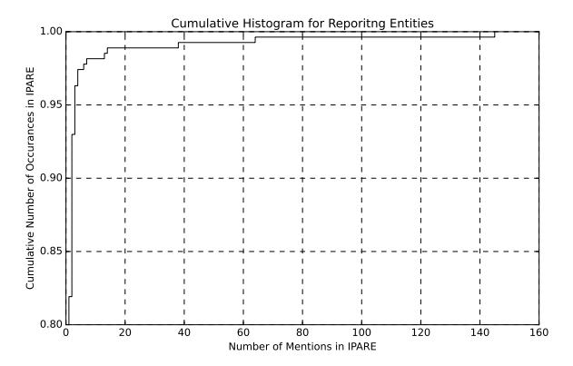
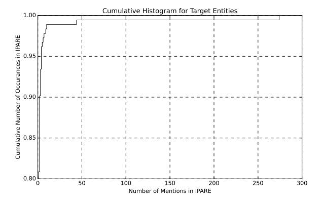
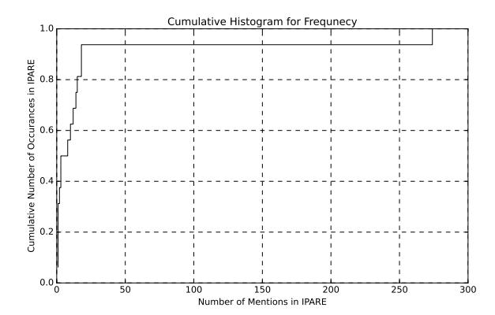
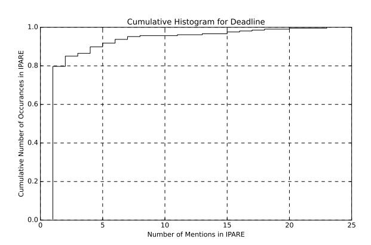
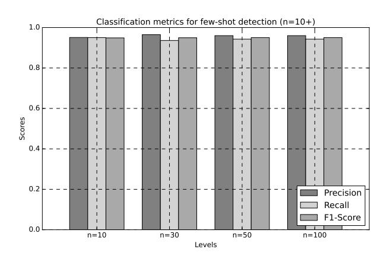

# Extraction of Information Provision Activity Requirements from EU Acquis

### Jakub Piskorski

Publications Office of the European Union Jakub.Piskorski@ec.europa.eu

# Dominik Skotarczak

Publications Office of the European Union Dominik.Skotarczak@ec.europa.eu

### Abstract

We report on experiments in information extraction (IE) from *EU acquis*, the European Union law. We introduce a new IE task of *Information Provision Activity Requirement Extraction*. This task comprises the identification of text fragments that introduce an obligation to provide information, and the extraction of structured information about the key entities involved along with the temporal modalities. We compare various technologies for this task, i.e. knowledge-, classical ML-, transformer-, and generative AI-based approaches, on a new benchmark corpus.

# 1 Introduction

We observe a growing interest of legal professionals, governments, and international organizations in exploiting NLP-enabled tools to facilitate the analysis and extraction of structured information from legal texts. Although this interest is reflected in the work of the research community [\(Ariai and](#page-8-0) [Demartini,](#page-8-0) [2024\)](#page-8-0), it has focused mainly on case law. It has barely covered higher-level Information Extraction (IE) tasks, such as relation extraction and template filling [\(Piskorski and Yangarber,](#page-9-0) [2013\)](#page-9-0).

In this paper, we report on experiments that revolve around the extraction of structured information from *European Union acquis* (*EU acquis*), i.e., the collection of common rights and obligations that constitute the body of EU law[1](#page-0-0) that are incorporated into the legal systems of EU Member States. We introduce a new IE task of *Information Provision Activity Requirement Extraction* that comprises (1) the identification of text fragments that introduce an obligation or a possibility of information provision activities in *EU acquis* legislation and (2) the extraction of structured information therefrom, including providing entities, target entities, respective deadlines, and frequencies of such

<span id="page-0-0"></span>1 [https://eur-lex.europa.eu/legal-content/EN/](https://eur-lex.europa.eu/legal-content/EN/TXT/?uri=legissum:acquis) [TXT/?uri=legissum:acquis](https://eur-lex.europa.eu/legal-content/EN/TXT/?uri=legissum:acquis)

provisions. Conceptually, extraction of information provision activities includes (but is not limited to) reporting, certification, notification and authorization obligations, data retention, monitoring, record keeping, compliance confirmations, etc. Accomplishing the IE task at hand is needed for rationalisation and simplification of various information provision requirements for companies and administrations, as outlined in the Communication of the European Commission on the long-term competitiveness of the EU [\(Commission,](#page-8-1) [2023\)](#page-8-1).

All EU legal acts within the *EU acquis* are digitally stored and published via *Cellar*[2](#page-0-1) in a machinereadable format and are accompanied with metadata. This allows for querying *EU acquis* documents using various criteria[3](#page-0-2) , e.g., time period, type of the legislation document, business identifiers, mentions of specific EU corporate bodies and other organizations, topics covered using *Eurovoc* taxonomy[4](#page-0-3) , etc. That said, as of today, there is no metadata that would allow to extract structured information on *information provision activity requirements* from *EU acquis* in a straightforward manner. In particular, the existing *Cellar* metadata used to index *EU acquis* documents does not contain any positional information for related text fragments (e.g., with evidence of a mention or supporting context). Hence, the usability thereof for the IE task at hand is of limited use. Once a solution for the IE task at hand is developed, it could be used to create additional metadata to embrace information provision activities.

The main drive behind our work is the need to explore practical solutions for this real-world IE task. Knowledge- and classical ML-based approaches in industrial settings have been proven to have advan-

<span id="page-0-2"></span><span id="page-0-1"></span><sup>2</sup> <https://op.europa.eu/en/web/cellar>

<sup>3</sup> [https://op.europa.eu/en/web/cellar/](https://op.europa.eu/en/web/cellar/cellar-data/metadata/knowledge-graph) [cellar-data/metadata/knowledge-graph](https://op.europa.eu/en/web/cellar/cellar-data/metadata/knowledge-graph)

<span id="page-0-3"></span><sup>4</sup> [https://eur-lex.europa.eu/browse/eurovoc.](https://eur-lex.europa.eu/browse/eurovoc.html) [html](https://eur-lex.europa.eu/browse/eurovoc.html)

tages in terms of time efficiency, fast development cycle and high level of explainability [\(Dahlmeier,](#page-8-2) [2017\)](#page-8-2). In contrast, generative AI may offer improved quality and easier implementation. This raises the question of which technology is the most appropriate to deploy for IE in the legal domain.

Most of the prior work in NLP in the legal domain focused on case law, but there is little research reported for legislation such as *EU acquis* (mainly covering text classification), and it is non-existent as regards IE. Thus, our contribution can be summarized as follows, (1) we introduce a new task on the extraction of structured information on information provision activity requirements from legal texts, (2) we release a benchmark corpus for this task, focusing on *EU acquis*, and (3) we report on comparative evaluation of knowledge-, ML-, and generative AI-based approaches for this task.

# 2 Related Work

The rapid growth of applications of NLP techniques in the legal domain has been reflected in various workshops. For example, NLLP [\(Preot](#page-9-1), iuc-[Pietro et al.,](#page-9-1) [2023;](#page-9-1) [Aletras et al.,](#page-8-3) [2024\)](#page-8-3) and MLLD [\(Makrehchi et al.,](#page-9-2) [2023\)](#page-9-2). [Solihin et al.](#page-9-3) [\(2021\)](#page-9-3) presented a survey on the advancements in IE for the legal domain.

Most prominent work in IE for the legal domain focused on Named Entity Recognition (NER), covering predominantly the subdomain of case law, contracts, and partially national legislation. Various NER approaches have been reported, including hand-crafted rules [\(Glaser et al.,](#page-8-4) [2018\)](#page-8-4), classical ML [\(Chalkidis et al.,](#page-8-5) [2017\)](#page-8-5), transformer-based approaches [\(Cabrera-Diego and Gheewala,](#page-8-6) [2023\)](#page-8-6). The *SemEval 2023* campaign included *LegalEval2023*, a shared task on NER for the legal domain [\(Modi et al.,](#page-9-4) [2023\)](#page-9-4).

In contrast, work on legal Relation Extraction (RE) is less represented. [Andrew](#page-8-7) [\(2018\)](#page-8-7) explored rule/ML-based approaches for RE from legal documents on investments in Luxemburg. [Kwak et al.](#page-8-8) [\(2023\)](#page-8-8) presented a dataset for RE from legal wills and explored the performance of GPT 4o. [Thimm](#page-9-5) [and Schneider](#page-9-5) [\(2022\)](#page-9-5) reported on a rule-based NLP pipeline for RE from environmental law. [Kurant](#page-8-9) [\(2023\)](#page-8-9) explored LSTMs for extracting 'cause-andeffect' in Polish court judgements, whereas [Schraa](#page-9-6)[gen and Bex](#page-9-6) [\(2019\)](#page-9-6) compared LSTMs and SVMs for RE from Dutch police reports.

[Pennisi et al.](#page-9-7) [\(2023\)](#page-9-7) explored ML approaches for

detecting sentences with obligations in legislation texts originating from different countries. Work on detecting obligations in Italian legislation was presented by [\(Iacono et al.,](#page-8-10) [2022\)](#page-8-10), and [Minkova et al.](#page-9-8) [\(2023\)](#page-9-8) reported on the classification of *EU acquis* documents into: obligations, permissions, prohibitions, rights, and powers. Although partially similar to ours, those efforts did not cover the IE aspect. Similar IE efforts to ours, for deploying classical and transformer-based ML for extracting information on legal events (i.e., extracting event type, actors involved and the date of the event) from court judgements were reported in [\(Filtz et al.,](#page-8-11) [2020\)](#page-8-11) and [\(Navas-Loro and Rodríguez-Doncel,](#page-9-9) [2022\)](#page-9-9). To our knowledge, we are the first to report on the exploration of IE focusing on information provision activities from *EU acquis* and also exploit LLMs for this purpose.

### 3 Task Definition

The task of *Information Provision Activity Requirement Extraction* (*IPARE*) focuses on identifying in the text of *EU acquis* text fragments which introduce an obligation or a possibility (based on some prerequisites) of information provision activities and extracting structured key information therefrom. Information provision activity is the process by which a *providing entity* communicates or provides information to a *target entity*. The providing entity is (or may be) obliged to perform an information providing activity, which involves systematic or one-time actions such as reporting, disclosing, notifying, providing, certifying or transferring information. Monitoring and publishing activities imply a transfer of information, hence they are included as well. In the context of information provision activity requirement, we also distinguish between *primary* and *secondary* information, where the former includes information on the key actors involved, information/activity type, and activity-related deadlines and frequencies, whereas the latter encompasses details such as language, format, technicalities related to information process, or other detailed descriptions of the information to be provided going beyond primary information. In *IPARE* task we focus solely on the extraction of primary information, i.e., detecting the text fragments that introduce the information provision activity requirements and contain all or some partial related primary information. Formally, given a text fragment T, we distinguish two subtasks in *IPARE*.

<span id="page-2-0"></span>

Figure 1: An example of a text snippet with mention of an information provision activity requirement with key elements to extract highlighted in text: entities (yellow), deadline (green), and frequency (blue), and a corresponding template with extracted information.

Subtask 1 (detection): Determine whether T contains mention of an information provision activity requirement containing some primary information.

Subtask 2 (extraction): If T contains mention of an information provision activity requirement with some primary information extract from T structured information on: (a) *providing entity*, (b) *target entitity(ies)*, (c) any related *deadline(s)*, and (d) *frequency* of provision of information.

Subtask 1 is a binary classification task, whereas Subtask 2 is a template filling task. An example of a text snippet with mention of an information provision activity and a corresponding template with extracted information is provided in Figure [1.](#page-2-0) Noteworthy, the values of the *deadline* and *frequency* slots are to be normalized (whenever possible) as part of the extraction process (see [A.4](#page-10-0) for details). Mentions of events resulting/triggered by information provision activity requirements (that on their end do not cover transfer of data), and requirements not to disclose information are not in the scope of IPARE. Annotation guidelines and additional examples are provided in Annex [A.4](#page-10-0) and [A.5](#page-13-0) resp.

### 4 Dataset

We have created a new benchmark datasaset since we were not aware of any resource with *IPARE*-like annotations. We have chunked the entire set of ca. 110K *EU acquis* documents into short text fragments (mainly sentences). Based on some empirical observations that information provision activity requirements are expressed in *EU acquis* through the use of specific verbs and corresponding nominalizations (e.g., '*report*', '*submit*', '*notify*', etc., see [A.1](#page-9-10) for full list) we have randomly sampled: (a) 500 sentences which contain any of the predetermined keywords or their morphological variants or derived words (e.g., '*notification*'), and (b) 500 sen-

tences which apart from the keywords, also contain at least one temporal expression, including dates, deadlines and frequencies. Noteworthy, no two sentences are part of the same *EU acquis* document. After ignoring excessively long texts the final pool of sentences consists of 973 instances.

In order to make our dataset as representative as possible we have exploited a sample of the dataset presented in [\(Daudaravicius and Friis-Christensen,](#page-8-12) [2024\)](#page-8-12) (referred to with JRC-RO), which contains *EU acquis* documents being in force and include mentions of reporting obligations, thus being in the scope of *IPARE*. In particular, all sentences that include information related to reporting obligations are annotated in JRC-RO separately, and no distinction is made whether they contain primary or secondary information (using the nomenclature of the *IPARE* task). We have extracted approx. 12K sentences from JRC-RO corpus which do not contain any keywords from the set specified in [A.1](#page-9-10). We further inspected a random sample of ca. 500 sentences therefrom and found that only about 1% of them fall under information provision activity requirements, which, to some extent, confirmed our assumption of relatively low lexical variability in terms of key terms being used when referring to information provision activity requirements. Finally, 239 additional sentences from JRC-RO were added to our corpus. Each of the text fragments were then annotated by two annotators with a boolean label indicating the inclusion in the information provision activity requirement class, and they filled in the 4 slots for *providing entity*, *target entity*, *deadline* and *frequency*, using the annotation guidelines in [A.4.](#page-10-0) Having accounted for the types of disagreements in labeling, we found *Cohen's* κ to be 0.81.

The resulting dataset, intended to represent the *IPARE* task within the *EU-Acuqis*-like legislation, not the *EU acquis* itself, consists of 1212 text snippets (mainly single sentences with an average length of 262 characters), out of which ca. 55% (662) are instances of information provision activities. The fraction of these positive instances which contain providing entities, target entities, deadlines and frequencies amounts to 91.8%, 86.9%, 67.2% and 57.7% resp. We have observed relatively low degree of lexical diversity of slot fillers for all 4 slots, about which we report in detail in [A.3.](#page-10-1) Thus, we reason that experiments on a dataset of this size (although suboptimal) might still provide meaningful insights on IE from *EU acquis*. Further details related to the creation of the dataset, annotation

guidelines and statistics, are provided in Annex [A.](#page-9-11)

# 5 Models

#### 5.1 Subtask 1: detection

We divided the benchmark corpus into 5 folds. All models were trained/fine-tuned/instructed using 80% of the benchmark and evaluated on the remaining 20%, for each of the 5 folds. We have compared the following approaches:

BASELINE-K: considers a piece of text as a information provision activity if one of the keywords used to create the dataset appears in the text.

BASELINE-KD: extends BASELINE-K: by introducing an additional constraint requiring the text to contain also at least one temporal expression[5](#page-3-0) , e.g., date, duration, period, deadline, frequency.

LR: L2-regularized Logistic Regression with binary 3-8 character n-grams as features[6](#page-3-1) ,

SVM: L2-regularized linear SVM, with binary 3- 10 character n-grams as features,

Transformers: including, XLMRoBERTa [\(Con](#page-8-13)[neau et al.,](#page-8-13) [2020\)](#page-8-13), and two models tailored to the legal domain: Legal-RoBERTa [\(Chalkidis et al.,](#page-8-14) [2023\)](#page-8-14) and EU-BERT[7](#page-3-2) . A classification head was appended to each model, and the original layers had been frozen before fine-tuning for the detection.

LLMs: six models of different size: LLama-3.2- 3B[8](#page-3-3) [\(Grattafiori et al.,](#page-8-15) [2024\)](#page-8-15), Mistral-7B [\(Jiang](#page-8-16) [et al.,](#page-8-16) [2023\)](#page-8-16), Mistral-24B[9](#page-3-4) , Mistral-Large (24.02) [\(team,](#page-9-12) [2024\)](#page-9-12), GPT 4o [\(OpenAI et al.,](#page-9-13) [2024\)](#page-9-13) and Claude-3.5-Sonnet [\(Anthropic,](#page-8-17) [2024\)](#page-8-17). We explored zero- and few-shot (n=10) scenarios. For the latter, we instructed each model with examples sampled at random from the train folds. See Annex [B](#page-13-1) for hyperparameters and detailed prompts.

# 5.2 Subtask 2: extraction

#### 5.2.1 Knowledge-based Approach

Our knowledge-based (KB) approach exploits a certain level of lexical and syntactic repetitiveness exhibited in the *EU acquis*. Based on word n-gram frequency analysis of the entire *EU acquis* consisting of ca. 110K documents (excluding the ca. 1K

- <span id="page-3-5"></span>(1) DEADLINE? FREQUENCY? PROVIDER <provide-to> TARGET+
- (2) PROVIDER <reports-to> TARGET+ DEADLINE? FREQUENCY?
- (3) DEADLINE? FREQUENCY? <reported-by> PROVIDER "to" TARGET (4) PROVIDER <obliged> DEADLINE? FREQUENCY? <provide-to> TARGET

Figure 2: Examples of IE patterns, where <provideto>, <reports-to>, <reported-by> represent different classes of information provision trigger phrases, backed up by lexical resources, and <obliged> covers verb

groups triggering an obligation.

documents used for the creation of the evaluation dataset), we have created a pool of ca. 2500 labeled lexical resources which cover: trigger phrases for the recognition of information provision activity requirements (e.g., '*shall submit to*'), relevant entities or trigger words for detecting entities (e.g., '*competent authorities of the Member States*'), and keywords for the detection of relevant temporal expressions (e.g., '*annually*'). More detailed statistics on these lexical resources are provided in [B.1.](#page-13-2) Moreover, a 3-level cascade of lexico-syntactic patterns was manually built using *ExPRESS* formalism [\(Piskorski,](#page-9-14) [2007\)](#page-9-14). The first two levels thereof contain patterns for the detection of the small-scale structures, e.g., temporal expressions, whereas the third level consists of ca. 45 high-level patterns which fuse the smaller structures together to fill in information provision activity requirement templates. Some examples of such high-level extraction patterns (in a simplified form) are shown in Figure [2.](#page-3-5) Overall, benefiting from the high degree of "linguistic" repetitiveness in *EU acquis* the size of the underlying linguistic resources sketched above make the knowledge-based approach relatively easy to maintain and extend if needed.

Given that sentences in legal texts might be extremely long and complex, we have implemented a version of the KB approach (referred to with KB+). It allows the extraction patterns to match longer sequences of tokens between the searched elements, in the hope of boosting the recall.

#### 5.2.2 LLM-based Approaches

We presented LLMs with the definition of *IPARE* along with a few examples of correctly extracted information and created few-shot and Chain-of-Thought (CoT) prompts. We used the hyperparameters from subtask 1. All models were tasked to generate a JSON dictionary containing the filled out template. For both prompting techniques, we used additional 13 annotated examples that were

<span id="page-3-1"></span><span id="page-3-0"></span><sup>5</sup>we use regular patterns to capture temporal expressions <sup>6</sup>with minimum 3 occurrences

<span id="page-3-2"></span><sup>7</sup> [https://huggingface.co/EuropeanParliament/]( https://huggingface.co/EuropeanParliament/EUBERT) [EUBERT]( https://huggingface.co/EuropeanParliament/EUBERT)

<span id="page-3-3"></span><sup>8</sup> [https://huggingface.co/meta-llama/Llama-3.](https://huggingface.co/meta-llama/Llama-3.2-3B) [2-3B](https://huggingface.co/meta-llama/Llama-3.2-3B)

<span id="page-3-4"></span><sup>9</sup> [https://huggingface.co/mistralai/](https://huggingface.co/mistralai/Mistral-Small-24B-Instruct-2501) [Mistral-Small-24B-Instruct-2501](https://huggingface.co/mistralai/Mistral-Small-24B-Instruct-2501)

not included in the corpus. The CoT prompts consisted of an additional question for each of the slots to be filled before displaying the final JSON. See Annex [B.4.1](#page-15-0) for prompt templates.

For Claude, we used its function calling ability to enforce the JSON format better and pass more detailed information about the format of each field. The model generated the input for the function calling tool, but no additional function was called. See Annex [B.4](#page-14-0) for the tool configuration.

Assuming the KB was to achieve high precision we have also explored a hybrid approach, ie., first KB is applied, and whenever a slot could not be filled, an LLM is triggered to try to fill in the value.

### 6 Evaluation

Detection: We evaluate this task using *precision*, *recall*, F1, and *accuracy* metrics. We provide the evaluation results in Table [1.](#page-5-0)

We observe that even the baseline methods achieve fair results with F<sup>1</sup> oscillating around .80, indicating the complexity of the detection task. Classical ML paradigms obtain surprisingly good results, e.g., SVM exploiting character n-gram features obtains .927 F<sup>1</sup> score. The transformer-based models, including the ones tuned to the legal domain did not perform better (best Legal-RoBERTa with .90 F1) than the classical ML approaches, probably due to the small size of the training data. Similar observations were made in the context of related experiments on classification of legal texts in [\(Lin et al.,](#page-8-18) [2023\)](#page-8-18), were linear classifiers exhibited competitive or in some cases even better performance than more advanced models, which highlights the importance of inclusion of classical ML approaches in comparative evaluations. In the zeroshot scenario, the largest LLM, i.e., Claude-3.5- Sonnet obtains the best F<sup>1</sup> score (.92), while the best overall results with LLMs were obtained in the few-shot scenario with the same LLM (.949 F1). The SD across folds ranged between 0.006 and 0.047 (see Table [3](#page-16-0) in Appendix [C\)](#page-15-1).

Extraction: We evaluate this task using *precision*, *recall* and F1, in two modes: (a) exact: a system response is considered correct if it exactly corresponds to the ground truth annotation, and (b) fuzzy: a system response is considered correct if the string similarity thereof with the ground truth is higher than .75[10](#page-4-0), where the string similarity is

computed with *Longest Common Substrings* measure [\(Navarro,](#page-9-15) [2001\)](#page-9-15)

We provide the evaluation results for the extraction task in Table [1.](#page-5-0) Given that the expected values for the *deadline* and *frequency* slots are to be normalized, they were only evaluated in terms of exact matching, whereas *providing entity* and *target entity* slots were evaluated in terms of fuzzy matching in order not to penalize the inclusion of 1-2 extra tokens (e.g. articles, etc.) in the response.

Overall, Claude-Sonnet-3.5 achieved the highest level of performance, i.e., highest F<sup>1</sup> scores on providing and target entities, and deadline slot. The tool functionalities (only available for Claude) were effective in defining and enforcing a correct JSON schema. Other LLMs would benefit from a similar JSON tool when prompted to provide a structured output, such as extraction by template filling. Despite no extra tool available, Mistral-Large scored nearly as high for the two entities, but it underperformed in the deadline extraction.

Interestingly, the knowledge-based approaches are highly competitive vis-a-vis LLMs, and at times outperform smaller LLMs in terms of F1, and, not surprisingly, outperform all LLMs in terms of precision for the extraction of all four slots by .003, .009, .05 and .21 points, respectively for *providing entity*, *target entity*, *deadline*, and *frequency*. Both *deadline* and *frequency* slots required additional normalization. In fact, this could be the reason why the KB and KB+ obtained best scores for the frequency slot. Apart from deadline extraction, we observed much lower recall compared to the other approaches, which indicates LLMs the preferred approach for recall maximization, irrespective of the size. Noteworthy, KB+ improves the recall vis-a-vis KB by .014-.025 points.

The performance of the LLMs increased with the size of the model and instruction complexity. The upward size-to-performance trend was most observable with CoT. However, not all LLMs benefited from adding additional questions that targeted the slots. The results for Llama-3.2-3B show the most ambiguity about the effectiveness of the CoT prompts. Apart from deadline extraction, applying the CoT prompt actually decreased model performance. We hypothesize this could have been due to the size of the model. Larger models, especially Claude, benefited more from CoT prompt, however, only for some slots. The few-shot prompt with the JSON tool helped Claude achieve better scores in deadline extraction, while the other LLMs

<span id="page-4-0"></span><sup>10</sup>This treshold was set based on empirical observations

<span id="page-5-0"></span>

| Model             | precision recall |      | F1   | accuracy |  |  |  |  |  |  |
|-------------------|------------------|------|------|----------|--|--|--|--|--|--|
| Baseline-K        | .671             | .968 | .799 | .729     |  |  |  |  |  |  |
| Baseline-KD       | .873             | .714 | .786 | .787     |  |  |  |  |  |  |
| LG                | .908             | .919 | .913 | .906     |  |  |  |  |  |  |
| SVM               | .937             | .917 | .927 | .920     |  |  |  |  |  |  |
| BERT-derived      |                  |      |      |          |  |  |  |  |  |  |
| EU-BERT           | .881             | .898 | .889 | .878     |  |  |  |  |  |  |
| Legal-RoBERTa     | .871             | .924 | .900 | .882     |  |  |  |  |  |  |
| XLM-RoBERTa       | .821             | .848 | .833 | .814     |  |  |  |  |  |  |
| Zero-shot         |                  |      |      |          |  |  |  |  |  |  |
| Claude-3.5-Sonnet | .889             | .953 | .920 | .909     |  |  |  |  |  |  |
| Mistral-Large     | .793             | .970 | .872 | .845     |  |  |  |  |  |  |
| Mistral-24B       | .949             | .926 | .937 | .932     |  |  |  |  |  |  |
| Mistral-7B        | .811             | .902 | .854 | .832     |  |  |  |  |  |  |
| GPT-4o            | .932             | .935 | .934 | .927     |  |  |  |  |  |  |
| Llama-3.2-3B      | .966             | .811 | .882 | .881     |  |  |  |  |  |  |
| Few-shot (n=10)   |                  |      |      |          |  |  |  |  |  |  |
| Claude-3.5-Sonnet | .951             | .950 | .949 | .944     |  |  |  |  |  |  |
| Mistral-Large     | .941             | .938 | .939 | .933     |  |  |  |  |  |  |
| Mistral-24B       | .949             | .952 | .950 | .946     |  |  |  |  |  |  |
| Mistral-7B        | .918             | .940 | .927 | .919     |  |  |  |  |  |  |
| GPT-4o            | .993             | .855 | .918 | .918     |  |  |  |  |  |  |
| Llama-3.2-3B      | .850             | .955 | .899 | .883     |  |  |  |  |  |  |
|                   |                  |      |      |          |  |  |  |  |  |  |

| Model                                                                              | providing entity<br>R<br>P        |  |    | target entity<br>R<br>P<br>F1                               |  |  | deadline<br>R | F1 | frequency<br>R<br>P<br>F1 |  |  |  |  |  |
|------------------------------------------------------------------------------------|-----------------------------------|--|----|-------------------------------------------------------------|--|--|---------------|----|---------------------------|--|--|--|--|--|
|                                                                                    |                                   |  | F1 |                                                             |  |  | P             |    |                           |  |  |  |  |  |
| KB                                                                                 |                                   |  |    | .996 .667 .806 .998 .814 .897 .998 .829 .906 1.00 .923 .960 |  |  |               |    |                           |  |  |  |  |  |
| KB+                                                                                |                                   |  |    | .996 .697 .820 .995 .832 .906 .998 .853 .920 .998 .949 .973 |  |  |               |    |                           |  |  |  |  |  |
|                                                                                    | Few-shot (n=13)                   |  |    |                                                             |  |  |               |    |                           |  |  |  |  |  |
| Claude-3.5-Sonnet                                                                  |                                   |  |    | .919 .905 .912 .982 .939 .960 .922 .942 .932 .963 .912 .937 |  |  |               |    |                           |  |  |  |  |  |
| Mistral-Large                                                                      |                                   |  |    | .967 .910 .937 .979 .941 .960 .923 .794 .854 .974 .873 .921 |  |  |               |    |                           |  |  |  |  |  |
| Mistral-24B                                                                        |                                   |  |    | .993 .907 .948 .981 .938 .959 .942 .895 .918 .958 .886 .920 |  |  |               |    |                           |  |  |  |  |  |
| Mistral-7B                                                                         |                                   |  |    | .917 .842 .878 .964 .841 .899 .733 .491 .588 .900 .839 .868 |  |  |               |    |                           |  |  |  |  |  |
| GPT-4o                                                                             |                                   |  |    | .992 .922 .956 .984 .956 .970 .932 .844 .886 .977 .887 .930 |  |  |               |    |                           |  |  |  |  |  |
| Llama-3.2-3B                                                                       |                                   |  |    | .934 .869 .900 .941 .892 .916 .772 .496 .604 .856 .766 .809 |  |  |               |    |                           |  |  |  |  |  |
|                                                                                    | Chain-of-Thought (with few-shots) |  |    |                                                             |  |  |               |    |                           |  |  |  |  |  |
| Claude-3.5-Sonnet                                                                  |                                   |  |    | .993 .909 .949 .989 .949 .967 .948 .904 .925 .979 .917 .947 |  |  |               |    |                           |  |  |  |  |  |
| Mistral-Large                                                                      |                                   |  |    | .976 .890 .931 .982 .925 .953 .934 .673 .782 .987 .894 .938 |  |  |               |    |                           |  |  |  |  |  |
| Mistral-24B                                                                        |                                   |  |    | .975 .903 .937 .985 .934 .959 .951 .921 .935 .977 .920 .948 |  |  |               |    |                           |  |  |  |  |  |
| Mistral-7B                                                                         |                                   |  |    | .938 .877 .907 .965 .897 .930 .879 .649 .746 .927 .861 .893 |  |  |               |    |                           |  |  |  |  |  |
| GPT-4o                                                                             |                                   |  |    | .992 .916 .953 .981 .943 .962 .931 .845 .886 .982 .916 .948 |  |  |               |    |                           |  |  |  |  |  |
| Llama-3.2-3B                                                                       |                                   |  |    | .918 .854 .885 .984 .847 .910 .870 .607 .715 .722 .854 .782 |  |  |               |    |                           |  |  |  |  |  |
|                                                                                    | Hybrid                            |  |    |                                                             |  |  |               |    |                           |  |  |  |  |  |
| KB + Claude-3.5-Sonnet .991 .881 .933 .989 .924 .955 .954 .904 .928 .982 .982 .982 |                                   |  |    |                                                             |  |  |               |    |                           |  |  |  |  |  |

Table 1: Evaluation results: (a) Detection (LEFT): in terms of precision, recall, F<sup>1</sup> and accuracy, (b) Extraction (RIGHT): per slot type in terms of precision (P), recall (R) and F<sup>1</sup> in *exact matching* for *deadline* and *frequency* slots, and *fuzzy matching* for *providing entity* and *target entity* slots. The best results are provided in bold.

struggled with the extraction thereof due to more complex normalization rules for this slot.

The hybrids consisting of KB boosted by an LLM to fill in missing slots did not outperform the best LLM in terms of F<sup>1</sup> apart from the *deadline* slot, however, gain in precision is observable, and the F<sup>1</sup> results were not lagging far behind the resp. LLMs, which make such a hybrid approach attractive in terms of time efficiency.

#### 6.0.1 Error Analysis

Detection: BERT-derived models misclassified between 11.8 and 18.6% of the instances, and approx. 30% of the misclassified instances were shared across the 3 tested models. Most of the false negative instances used either passive voice or nominalizations to express information provision requirements, whereas most false positives were sentences reporting facts or actions triggered by requirements (not in the scope of *IPARE*).

The top-ranking LLMs, i.e., Claude and Mistral Large, prompted with a few examples produced 68 and 81 incorrect responses, respectively, and shared 43 instances with errors. Most common false negatives featured application, publication, and certification activities, whereas most represented group among false positives constituted instances with complex syntactic structure and ones with entities scattered across the sentences. To alleviate this problem we run some follow-up experiments with an increased number of examples (see Annex [C\)](#page-15-1), but it did not boost the performance.

Extraction: Mistral-Large, the best LLM in extraction of providing entity, made most errors in this context by extracting too long text fragments, e.g., instead of extracting only the entity an adjacent reference to a regulation was included in the response. Other typical errors were omissions of entities in longer syntactically complex sentences. We also observed some errors (<1%) of not capturing entities from sentences introducing information provision activities using passive voice.

Claude and Mistral-Large, the top-ranking models using CoT in extracting target entity, struggled with texts containing multiple target entities, e.g., *'the European Parliament, the Council, and the Commission'*. The models also did not respect the rules for extracting continuous text without breaking it into a sequence of target entities, but this (somewhat) undesired effect was not penalized by the fuzzy evaluation metric.

As for the KB approach, the majority of the errors (185) related to providing entity resulted from not detecting such entities from more syntacticallycomplex sentences. We reasoned that this was due to the difficulty in capturing long-distance dependencies or extracting incomplete entities by this approach. For target entity, the knowledge-based approach made most errors by not detecting an entity (87 sentences). That said, this was less prominent vis-a-vis the omissions of providing entities.

Claude achieved the highest F<sup>1</sup> scores (for LLMs) on frequency extraction with both prompting techniques. Nearly half of the incorrect extrac-

tions (37 out of 78) were expressions referring to *biannual* and *semiannual* frequencies, which the model failed to normalize. Claude also assumed periodicity when exposed to text fragments such as *'shall monitor'*, *'shall keep informed'*, etc. In other words, it made associations related to frequency that were actually not present in the text. Claude achieved a good balance between high precision and high recall with a slightly better F<sup>1</sup> score with the few-shot prompt. We reason this was likely thanks to the function calling tool.

We infer from the error analysis that LLMs lack a comprehension of the syntax. It hinders them to perform subtask 2 correctly. Meanwhile, the patterns used by KB can detect the role of the entities (target/reporting) much more precisely due to the more local nature of these patterns and linguistic awareness encoded in them.

# 7 Discussion

Detection Classical ML, such as SVMs, may be the preferred solution for subtask 1, despite not achieving the highest performance. The magnitude of the performance gap to the best performing LLM is relatively narrow, but the infrastructural resources required to detect information provision activity requirements by LLMs are incomparably higher, considering in particular the length of the legislation document. SVMs are a computationally lightweight solution that can achieve good results with a moderate amount of annotated data. It strikes a good balance between performance, speed, and resource intensity. There is also room for improvement, given that we report on exploiting relatively primitive type of features, i.e., character n-grams.

Extraction Despite LLMs' superior results (recall, F1), a hybrid solution that combines knowledge- and LLM-based approaches may be better for deployment, given the time efficiency of KB. KB may also be a more suitable solution when precision is favored over recall. The results of the error analysis hint at the necessity to use a knowledge-based solution for the extraction of the temporal slots whose expected values have to be normalized, or use of an additional knowledgebased postprocessing component to facilitate normalization of temporal expressions. Whether more sophisticated prompting strategy for LLMs could alleviate the issue of proper normalization of temporal expressions and better understanding of the link between syntactic structure and entity role assignment is yet to be explored.

Based on the work on *IPARE*, our general recipe for a hybrid solution (also for similar IE tasks) would be as follows: (1) build a generic KB component to detect key named entities, whose recognition does not require contextual information (e.g., temporal expressions, majority of the organizations/actors), (2) create a set of local lexicosyntactic IE patterns that exploit sure-shot trigger phrases for the specific IE task, (3) develop fewshot prompts for filling the slots in the IE template(s). Then, (1)+(2) would be applied first, and in case of missing or incomplete information (3) would be deployed on demand to complement the extractions. Such a solution might be specifically advantageous in a scenario where time complexity is a critical factor and high amount of textual data needs to be processed. Moreover, the integration of a KB component allows for a straightforward extension of extraction of easy-to-capture local phenomena instead of relying on more timeconsuming tuning of prompts, not to mention the non-deterministic behavior related with that.

### 8 Conclusions

We reported on experiments on extracting information from legal acts in the EU law, on information provision activity requirements, which encompasses involved actors and related temporal aspects. We carried out a comparative evaluation of knowledge-, ML-, and generative AI-based approaches for this task on a new benchmark corpus[11](#page-6-0). While our study is not exhaustive, it provides a good approximation of the capabilities of the different technologies and their suitability for deployment in an industrial setting. We believe the findings reported in this paper will constitute useful knowledge for NLP practitioners working on analytical applications for the legal domain.

In future we intend to: (a) extend the benchmark corpus, (b) explore inclusion of broader context in which the sentences appear to boost extraction performance, (c) use LLMs as a "judge" for a more nuanced assessment of semantic similarity in fuzzy evaluation, (d) extend the IE task to document level, (e) explore other family of ML models, and (f) extend the task to the extraction of additional aspects, e.g., information type, modalities.

<span id="page-6-0"></span><sup>11</sup><https://github.com/jpiskorski/IPARE>

# Ethics Policy

Intended Use and Misuse Potential The benchmark dataset created in the context of the presented work was specifically designed to advance research on automated information extraction from legal texts. However, it should not be seen as representative in terms of any kind of information provision obligation, specific organization or geopolitical entity, nor should it be seen as perfectly balanced in any particular way. Therefore, we advise responsible use thereof.

Environmental Impact The deployment of LLMs might have a large carbon footprint, especially when training new models. We have exploited LLMs in our experiments, however, we did not train them, but only used existing trained models, which has a relatively low impact in terms of computing.

Fairness The creation of the benchmark dataset for our study involved annotation of documents, which was done by the staff of the institution of the authors of this manuscript. They were fairly remunerated as part of their job.

# Limitations

Dataset Representativeness The selection of the documents and text snippets for the creation of the benchmark dataset exploited in our study was done solely using *EU acquis*, the EU legislation. Hence it might be considered as representative for this specific subdomain of legal texts only. It is of paramount importance to emphasize though that this dataset should not be considered as representative in terms of any type of information provision obligation, specific organization or geopolitical entity, nor should it be seen as perfectly balanced in any particular way.

While the size of the dataset is small, we have observed and report on low lexical and syntactic variability of the texts in the *EU acquis*, and, consequently, we reason that carrying out experiments on a dataset of this size (although suboptimal) and characteristics still provides meaningful insights on IE from *EU acquis*.

Biases Although a very detailed annotation guidelines were used for the sake of creating the benchmark corpus and multiple rounds of curating the annotations were carried out we are aware that some

degree of intrinsic subjectivity might be present in this dataset.

Models While our study covers a wide range of approaches for the task at hand, namely, knowledge-, classical and transformer machine learning-, and generative AI-based approaches it should not be considered as exhaustive, but rather as an approximation. We did not explore certain models for the extraction task due to the fact that the size of required annotated data might have been prohibitive. For instance, classical and transformer machine learning-based models are known to obtain superior performance in IE tasks in a fully supervised (full-shot) scenario [\(Keraghel et al.,](#page-8-19) [2024;](#page-8-19) [Wang et al.,](#page-9-16) [2025\)](#page-9-16) with training data of appropriate size. Furthermore, the error analysis is only provided for a subset of all models explored for the detection and extraction tasks.

Knowledge-based approach scalability While the results of the experiments presented in this manuscript revealed that KB approach for *IPARE* is a viable, competitive and even recommended option in a hybrid set-up, one can only speculate about the utility of such an approach for tackling more sophisticated IE tasks, i.e., inclusion of other types of slots to be extracted (e.g., modalities of information provision, type of information to be provided, subject matter, other domain-specific details, etc.), and whose extraction might require a more sophistication. However, we do believe that a KB approach to detect key entities, e.g., main actors (organizations) and temporal expressions could constitute a generic IE component that could serve to build solutions for any IE task for the *EU acquis* domain.

### Disclaimer

The information and views set out in this publication are those of the authors and do not necessarily reflect the official opinion of the European Commission. The Commission does not guarantee the accuracy of the data included in this study. Neither the Commission nor any person on the Commission's behalf may be held responsible for the use that may be made of the information contained therein. This document should not be considered as representative of the European Commission's official position.

# References

- <span id="page-8-3"></span>Nikolaos Aletras, Ilias Chalkidis, Leslie Barrett, Cat˘ alina Goan ˘ t,a, Daniel Preo ˘ t, iuc-Pietro, and Gerasimos Spanakis, editors. 2024. *[Proceedings of the](https://doi.org/10.18653/v1/2024.nllp-1.0) [Natural Legal Language Processing Workshop 2024](https://doi.org/10.18653/v1/2024.nllp-1.0)*. Association for Computational Linguistics, Miami, FL, USA.
- <span id="page-8-7"></span>Judith Jeyafreeda Andrew. 2018. [Automatic extraction](https://doi.org/10.18653/v1/W18-2401) [of entities and relation from legal documents.](https://doi.org/10.18653/v1/W18-2401) In *Proceedings of the Seventh Named Entities Workshop*, pages 1–8, Melbourne, Australia. Association for Computational Linguistics.
- <span id="page-8-17"></span>Anthropic. 2024. [Claude 3.5 sonnet.](https://www.anthropic.com/news/claude-3-5-sonnet)
- <span id="page-8-0"></span>Farid Ariai and Gianluca Demartini. 2024. [Natural](https://arxiv.org/abs/2410.21306) [language processing for the legal domain: A survey](https://arxiv.org/abs/2410.21306) [of tasks, datasets, models, and challenges.](https://arxiv.org/abs/2410.21306) *Preprint*, arXiv:2410.21306.
- <span id="page-8-6"></span>Luis Adrián Cabrera-Diego and Akshita Gheewala. 2023. [Jus mundi at SemEval-2023 task 6: Using a](https://doi.org/10.18653/v1/2023.semeval-1.247) [frustratingly easy domain adaption for a legal named](https://doi.org/10.18653/v1/2023.semeval-1.247) [entity recognition system.](https://doi.org/10.18653/v1/2023.semeval-1.247) In *Proceedings of the 17th International Workshop on Semantic Evaluation (SemEval-2023)*, pages 1783–1790, Toronto, Canada. Association for Computational Linguistics.
- <span id="page-8-5"></span>Ilias Chalkidis, Ion Androutsopoulos, and Achilleas Michos. 2017. [Extracting contract elements.](https://doi.org/10.1145/3086512.3086515) In *Proceedings of the 16th Edition of the International Conference on Articial Intelligence and Law*, ICAIL '17, page 19–28, New York, NY, USA. Association for Computing Machinery.
- <span id="page-8-14"></span>Ilias Chalkidis, Nicolas Garneau, Catalina Goanta, Daniel Katz, and Anders Søgaard. 2023. [LeXFiles](https://doi.org/10.18653/v1/2023.acl-long.865) [and LegalLAMA: Facilitating English multinational](https://doi.org/10.18653/v1/2023.acl-long.865) [legal language model development.](https://doi.org/10.18653/v1/2023.acl-long.865) In *Proceedings of the 61st Annual Meeting of the Association for Computational Linguistics (Volume 1: Long Papers)*, pages 15513–15535, Toronto, Canada. Association for Computational Linguistics.
- <span id="page-8-1"></span>European Commission. 2023. [Communication from the](https://commission.europa.eu/system/files/2023-03/Communication_Long-term-competitiveness.pdf) [commission to the european parliament, the council,](https://commission.europa.eu/system/files/2023-03/Communication_Long-term-competitiveness.pdf) [the european economic and social committee and the](https://commission.europa.eu/system/files/2023-03/Communication_Long-term-competitiveness.pdf) [committee of the regions.](https://commission.europa.eu/system/files/2023-03/Communication_Long-term-competitiveness.pdf)
- <span id="page-8-13"></span>Alexis Conneau, Kartikay Khandelwal, Naman Goyal, Vishrav Chaudhary, Guillaume Wenzek, Francisco Guzmán, Edouard Grave, Myle Ott, Luke Zettlemoyer, and Veselin Stoyanov. 2020. [Unsupervised](https://doi.org/10.18653/v1/2020.acl-main.747) [cross-lingual representation learning at scale.](https://doi.org/10.18653/v1/2020.acl-main.747) In *Proceedings of the 58th Annual Meeting of the Association for Computational Linguistics*, pages 8440– 8451, Online. Association for Computational Linguistics.
- <span id="page-8-2"></span>Daniel Dahlmeier. 2017. [On the challenges of trans](https://doi.org/10.18653/v1/P17-2015)[lating NLP research into commercial products.](https://doi.org/10.18653/v1/P17-2015) In *Proceedings of the 55th Annual Meeting of the Association for Computational Linguistics (Volume 2: Short Papers)*, pages 92–96, Vancouver, Canada. Association for Computational Linguistics.

- <span id="page-8-12"></span>Vidas Daudaravicius and Anders Friis-Christensen. 2024. Annotation of reporting obligations in eu legislation dataset.
- <span id="page-8-11"></span>Erwin Filtz, María Navas-Loro, Cristiana Santos, Axel Polleres, and Sabrina Kirrane. 2020. *[Events Matter:](https://doi.org/10.3233/FAIA200847) [Extraction of Events from Court Decisions](https://doi.org/10.3233/FAIA200847)*.
- <span id="page-8-4"></span>Ingo Glaser, Bernhard Waltl, and Florian Matthes. 2018. Named entity recognition, extraction, and linking in german legal contracts. In *IRIS: InternationalesRechtsinformatik Symposium*.
- <span id="page-8-15"></span>Aaron Grattafiori, Abhimanyu Dubey, Abhinav Jauhri, Abhinav Pandey, Abhishek Kadian, Ahmad Al-Dahle, Aiesha Letman, Akhil Mathur, Alan Schelten, Alex Vaughan, Amy Yang, Angela Fan, Anirudh Goyal, Anthony Hartshorn, Aobo Yang, Archi Mitra, Archie Sravankumar, Artem Korenev, Arthur Hinsvark, and 542 others. 2024. [The llama 3 herd of](https://arxiv.org/abs/2407.21783) [models.](https://arxiv.org/abs/2407.21783) *Preprint*, arXiv:2407.21783.
- <span id="page-8-10"></span>Maria Iacono, Laura Rossi, Paolo Dangelo, Andrea Tesei, and Lorenzo De Mattei. 2022. *[An Obligations](https://doi.org/10.4000/books.aaccademia.10932) [Extraction System for Heterogeneous Legal Docu](https://doi.org/10.4000/books.aaccademia.10932)[ments: Building and Evaluating Data and Model](https://doi.org/10.4000/books.aaccademia.10932)*, pages 381–386.
- <span id="page-8-16"></span>Albert Q. Jiang, Alexandre Sablayrolles, Arthur Mensch, Chris Bamford, Devendra Singh Chaplot, Diego de Las Casas, Florian Bressand, Gianna Lengyel, Guillaume Lample, Lucile Saulnier, Lélio Renard Lavaud, Marie-Anne Lachaux, Pierre Stock, Teven Le Scao, Thibaut Lavril, Thomas Wang, Timothée Lacroix, and William El Sayed. 2023. [Mistral](https://doi.org/10.48550/ARXIV.2310.06825) [7b.](https://doi.org/10.48550/ARXIV.2310.06825) *CoRR*, abs/2310.06825.
- <span id="page-8-19"></span>Imed Keraghel, Stanislas Morbieu, and Mohamed Nadif. 2024. [Recent advances in named entity recogni](https://arxiv.org/abs/2401.10825)[tion: A comprehensive survey and comparative study.](https://arxiv.org/abs/2401.10825) *Preprint*, arXiv:2401.10825.
- <span id="page-8-9"></span>Lukasz Kurant. 2023. Mechanism for detecting causeand-effect relationships in court judgments. In *Proceedings of the 18th Conference on Computer Science and Intelligence Systems*, pages 1041–1046. AC-SIS.
- <span id="page-8-8"></span>Alice Kwak, Cheonkam Jeong, Gaetano Forte, Derek Bambauer, Clayton Morrison, and Mihai Surdeanu. 2023. [Information extraction from legal wills: How](https://doi.org/10.18653/v1/2023.findings-emnlp.287) [well does GPT-4 do?](https://doi.org/10.18653/v1/2023.findings-emnlp.287) In *Findings of the Association for Computational Linguistics: EMNLP 2023*, pages 4336–4353, Singapore. Association for Computational Linguistics.
- <span id="page-8-18"></span>Yu-Chen Lin, Si-An Chen, Jie-Jyun Liu, and Chih-Jen Lin. 2023. [Linear classifier: An often-forgotten base](https://doi.org/10.18653/v1/2023.acl-short.160)[line for text classification.](https://doi.org/10.18653/v1/2023.acl-short.160) In *Proceedings of the 61st Annual Meeting of the Association for Computational Linguistics (Volume 2: Short Papers)*, pages 1876–1888, Toronto, Canada. Association for Computational Linguistics.
- <span id="page-8-20"></span>Yinhan Liu, Myle Ott, Naman Goyal, Jingfei Du, Mandar Joshi, Danqi Chen, Omer Levy, Mike Lewis,

Luke Zettlemoyer, and Veselin Stoyanov. 2019. [Roberta: A robustly optimized bert pretraining ap](https://arxiv.org/abs/1907.11692)[proach.](https://arxiv.org/abs/1907.11692) *Preprint*, arXiv:1907.11692.

<span id="page-9-2"></span>Masoud Makrehchi, Dell Zhang, Alina Petrova, and John Armour. 2023. [The 3rd international workshop](https://doi.org/10.1145/3583780.3615308) [on mining and learning in the legal domain.](https://doi.org/10.1145/3583780.3615308) In *Proceedings of the 32nd ACM International Conference on Information and Knowledge Management*, CIKM '23, page 5277–5280, New York, NY, USA. Association for Computing Machinery.

<span id="page-9-8"></span>Kristina Minkova, Shashank Chakravarthy, and Gijs Dijck. 2023. [Low-resource deontic modality classifica](https://doi.org/10.18653/v1/2023.nllp-1.15)[tion in EU legislation.](https://doi.org/10.18653/v1/2023.nllp-1.15) In *Proceedings of the Natural Legal Language Processing Workshop 2023*, pages 149–158, Singapore. Association for Computational Linguistics.

<span id="page-9-4"></span>Ashutosh Modi, Prathamesh Kalamkar, Saurabh Karn, Aman Tiwari, Abhinav Joshi, Sai Kiran Tanikella, Shouvik Kumar Guha, Sachin Malhan, and Vivek Raghavan. 2023. [SemEval-2023 task 6: LegalEval](https://doi.org/10.18653/v1/2023.semeval-1.318) [- understanding legal texts.](https://doi.org/10.18653/v1/2023.semeval-1.318) In *Proceedings of the 17th International Workshop on Semantic Evaluation (SemEval-2023)*, pages 2362–2374, Toronto, Canada. Association for Computational Linguistics.

<span id="page-9-15"></span>Gonzalo Navarro. 2001. [A guided tour to approximate](https://doi.org/10.1145/375360.375365) [string matching.](https://doi.org/10.1145/375360.375365) *ACM Comput. Surv.*, 33(1):31–88.

<span id="page-9-9"></span>María Navas-Loro and Víctor Rodríguez-Doncel. 2022. *[WhenTheFact: Extracting Events from European Le](https://doi.org/10.3233/FAIA220470)[gal Decisions](https://doi.org/10.3233/FAIA220470)*.

<span id="page-9-13"></span>OpenAI, :, Aaron Hurst, Adam Lerer, Adam P. Goucher, Adam Perelman, Aditya Ramesh, Aidan Clark, AJ Ostrow, Akila Welihinda, Alan Hayes, Alec Radford, Aleksander M ˛adry, Alex Baker-Whitcomb, Alex Beutel, Alex Borzunov, Alex Carney, Alex Chow, Alex Kirillov, and 401 others. 2024. [Gpt-4o](https://arxiv.org/abs/2410.21276) [system card.](https://arxiv.org/abs/2410.21276) *Preprint*, arXiv:2410.21276.

<span id="page-9-7"></span>Andrea Pennisi, Elvira González Hernández, and Nina Koivula. 2023. [NOMOS: Navigating obligation min](https://doi.org/10.18653/v1/2023.nllp-1.2)[ing in official statutes.](https://doi.org/10.18653/v1/2023.nllp-1.2) In *Proceedings of the Natural Legal Language Processing Workshop 2023*, pages 8–16, Singapore. Association for Computational Linguistics.

<span id="page-9-14"></span>Jakub Piskorski. 2007. [ExPRESS - Extraction Pattern](http://www.ling.uni-potsdam.de/fsmnlp2007/Program.pdf?PHPSESSID=afe40cd76765570d52252f4b6a59ad3c) [Recognition Engine and Specification Suite.](http://www.ling.uni-potsdam.de/fsmnlp2007/Program.pdf?PHPSESSID=afe40cd76765570d52252f4b6a59ad3c) In *Proceedings of the 6th International Workshop Finite-State Methods and Natural Language Processing 2007 (FSMNLP 2007)*, pages 7–24, Potsdam (Germany). University of Potsdam.

<span id="page-9-0"></span>Jakub Piskorski and Roman Yangarber. 2013. *[Infor](https://doi.org/10.1007/978-3-642-28569-1_2)[mation Extraction: Past, Present and Future](https://doi.org/10.1007/978-3-642-28569-1_2)*, pages 23–49. Springer Berlin Heidelberg, Berlin, Heidelberg.

<span id="page-9-1"></span>Daniel Preot, iuc-Pietro, Catalina Goanta, Ilias Chalkidis, Leslie Barrett, Gerasimos Spanakis, and Nikolaos Aletras, editors. 2023. *[Proceedings of the Natural](https://aclanthology.org/2023.nllp-1.0/) [Legal Language Processing Workshop 2023](https://aclanthology.org/2023.nllp-1.0/)*. Association for Computational Linguistics, Singapore.

<span id="page-9-17"></span>Matthew Renze. 2024. [The effect of sampling temper](https://doi.org/10.18653/v1/2024.findings-emnlp.432)[ature on problem solving in large language models.](https://doi.org/10.18653/v1/2024.findings-emnlp.432) In *Findings of the Association for Computational Linguistics: EMNLP 2024*, pages 7346–7356, Miami, Florida, USA. Association for Computational Linguistics.

<span id="page-9-6"></span>Marijn Schraagen and Floris Bex. 2019. [Extraction of](https://doi.org/10.1109/ICSC.2019.00020) [semantic relations in noisy user-generated law en](https://doi.org/10.1109/ICSC.2019.00020)[forcement data.](https://doi.org/10.1109/ICSC.2019.00020) In *13th International Conference on Semantic Computing (ICSC)*, pages 79–86.

<span id="page-9-3"></span>Firdaus Solihin, Indra Budi, Rizal Aji, and Edmon Makarim. 2021. [Advancement of information extrac](https://doi.org/10.1080/13600869.2021.1964225)[tion use in legal documents.](https://doi.org/10.1080/13600869.2021.1964225) *International Review of Law, Computers & Technology*, 35:1–30.

<span id="page-9-12"></span>Mistral AI team. 2024. [Au large.](https://mistral.ai/news/mistral-large)

<span id="page-9-5"></span>Heiko Thimm and Phil Schneider. 2022. Relation extraction from environmental law text using natural language understanding. In *EnviroInfo 2022*, page 43. Gesellschaft für Informatik e.V., Bonn.

<span id="page-9-16"></span>Shuhe Wang, Xiaofei Sun, Xiaoya Li, Rongbin Ouyang, Fei Wu, Tianwei Zhang, Jiwei Li, Guoyin Wang, and Chen Guo. 2025. [GPT-NER: Named entity recogni](https://doi.org/10.18653/v1/2025.findings-naacl.239)[tion via large language models.](https://doi.org/10.18653/v1/2025.findings-naacl.239) In *Findings of the Association for Computational Linguistics: NAACL 2025*, pages 4257–4275, Albuquerque, New Mexico. Association for Computational Linguistics.

# <span id="page-9-11"></span>A Dataset Creation

This section provides some more details related to the creation of the dataset, including: keywords used to collect documents, annotation guidelines, examples, and some corpus statistics.

#### <span id="page-9-10"></span>A.1 Keywords

For selecting candidate text fragments for the inclusion in the evaluation dataset we have used the following keywords/keyphrases and their respective morphological variants and derived forms: *report, transmit, provide, communicate, notify, passed on, inform, share information, share data, submit, publish, send, update, keep a register, monitor, present, send copy, forward, grant access, make available, collect information, collect data*.

# A.2 Annotation

Two annotators were tasked to annotate each of the instances with a boolean label indicating the inclusion in the information provision activity requirement class, and they filled in the 4 slots for providing entity, target entity, deadline and frequency, using the annotation guidelines provided in [A.4.](#page-10-0) The annotators had prior experience in annotating

textual corpora. In total for approx. 10% of instances there were some disagreements in labeling, which were resolved through some discussions.

#### <span id="page-10-1"></span>A.3 Dataset Characteristics

The final dataset consists of 1212 items, out of which ca. 55% (662) are instances of information provision activity requirements. The fraction of these positive instances which contain providing entities, target entities, deadlines and frequencies amounts to 91.8%, 86.9%, 67.2% and 57.7% resp. Ca. 43.2% of all items contain both a keyword and either an explicit deadline or frequency mention. Analogously, this figure for the positive instances only amounts to 79%. Approx. 19.6% of all instances do not contain any of the predetermined keywords. The average length of the text is 262 characters.

Figure 3 shows that most sentences in *IPARE* are shorter than 500 characters. The average sentence length in the *IPARE* benchmark is 262 characters (or approx. 42 words). The longest sentence has 5252 characters and has been excluded from Figure 3.

<span id="page-10-2"></span>

Figure 3: IPARE Sentence Length (in characters)

Figures 4, 5, 6, and 7 report on the cumulative number of occurrences of providing entity, target entity, frequency, and deadline mentions in the *IPARE* benchmark. Over 80% of providing entities are mentioned only once, and over 95% are mentioned at most 5 times. After accounting for small variations in mentions of those entities, at least 172 (out of 662) reporting entities are 'Member States'. The 'Commission' is required to provide information in at least 102 out of 662 sentences in the *IPARE* benchmark. As for the target entity, the cumulative histogram in 5 shows that over 90% of target entities are only mentioned once, and around 97% of them are mentioned at most 10

times. In fact, the 'Commission' is the recipient of information in at least 283 out of 662 sentences in the IPARE benchmark. The 'European Parliament' and 'the Council' are also often mentioned together as the recipients of information.

As regards frequency, the top 5 (out of 15) most frequent expressions account for approx. 88% of the instances. The requirement for annual provision of information alone accounts for 274 out of the 382 (or 71%) positive instances.

Mentions of deadlines are the most diverse with 80% of deadlines being mentioned only once in the *IPARE* benchmark. Relative deadlines, such as 31-01-?, 30-06-?, within 3 months, occur most frequently. Among them, the most frequent deadline (31-01-?) is mentioned only 23 times.

<span id="page-10-3"></span>

Figure 4: Cumulative Distribution of Reporting Entity Mentions in *IPARE* 

<span id="page-10-4"></span>

Figure 5: Cumulative Distribution of Target Entity Mentions in *IPARE* 

#### <span id="page-10-0"></span>A.4 Annotation Guidelines

The annotation of the textual data consists of: (a) deciding whether a given text fragment embraces a mention of reporting requirements, and if affirmative, (b) filling in the four slots related to *primary* 

*information: reporting entity, target entity, dead-line,* and *frequency* using the following rules:

#### • General Rules:

- for filling in the slots (unless specified differently for specific slots below) one should exclusively use the strings found in the text fragments,
- if specific type of information is not included in the text fragment a hyphen should be used to indicate this fact in the respective slot,
- in case of any doubts whether the information contained in the text fragment should be used as a slot filler or not a conservative approach should be applied, i.e., no annotation is to be made in case of uncertainty,

#### • Entities

- in case the strings that are related to filling in a given slot (for related entities) do not constitute a consecutive sequence of characters (e.g., more than one mention of relevant entities that are spread over the text fragment), one should simply cut and paste the relevant strings and delimit them by a semicolon, e.g., from the text fragment 'The operator or aircraft operator' the entity slot should be filled in with 'The operator; aircraft operator' as a value,
- both named (e.g., 'European Commission') and nominal mentions (e.g., 'competent fiscal authorities') of entities are considered as candidate slot fillers.
- the articles, whether definite or indefinite, constitute part of the string to be used as a slot filler for entities (e.g. *The European Commission*),
- in case pronominal references to entities (e.g., 'they') are used, and there is no corresponding named mention of such an entity, then the pronominal mention should be used as a slot filler.
- one should annotate 'minimal' mentions of entities and disregard any relative clauses that provide further details of the entities, e.g., in the text fragment 'The custom authorities, which were tasked with carrying out the exercise ....' only

<span id="page-11-0"></span>

Figure 6: Cumulative Distribution of Frequency Mentions in *IPARE* 

<span id="page-11-1"></span>

Figure 7: Cumulative Distribution of Deadline Mentions in *IPARE* 

'*The custom authorities*' should be considered for filling in the entity-related slot.

# • Dates

- in case of precise date references only the date information in a canonical form DD-MM-YYYY format should be provided, e.g., for *1 June 2023* the corresponding slot value should be 01-06-2022+ (in case of incomplete date references, i.e., with missing day/month/year a "?" should be used accordingly, e.g. *June 2023* corresponds to ?-06-2023)
- phrases triggering deadlines that precede or follow concrete dates are not to be annotated, e.g. *not later than*, *before*, etc.,
- analogously, for deadlines using a duration a canonical form should be used as well using the following format DD-MM-YYYY:DD-MM-YYYY format, e.g., for the text fragment '*from 1 to 10 January 2023*' the corresponding slot filler would be 01-01-2023:10-01-2023,
- in case of strictly relative (e.g., '*next year*' or imprecise temporal expression (e.g., '*without any delay*', etc.) used in the text, the surface form in the text constitutes the respective slot value,
- references to specific hours are not to be annotated as part of the date annotations,
- references to dates of specific periods in time from which information is to be collected and provided/reported are not considered as dates that need to be annotated since they do not refer to the deadline of reporting or provision of information/data, e.g., for the text fragment '*The required data for March to April in 2023 is to be provided not later then by January 2024*' the deadline slot is to be filled in with ?-01-2024.
- in case of relative or imprecise temporal references that can not be anchored on a time scale only a minimal 'phrase' that conveys the main time constraint and discards potential event dependencies embraced in text should be used as a slot filler, e.g., from the text fragment '*The*

- *report has to be submitted as soon as possible after the approval of the Committee and receiption of the authorisation from ....*' only the phrase '*as soon as possible*' should be used as a slot filler.
- in case the text fragment contains references to more than one deadline, e.g., reporting is to be carried out twice a year with two different dates, then the corresponding slot should contain both dates, delimitated by a semicolon.

### • Frequencies

- for filling in the *frequency* slot one should use one of the following values: *daily*, *weekly*, *biweekly monthly*, *bimonthly*, *quarterly*, *semiannually*, *annually*, *biannually*, *every X years*, *every X months*, *every X days*, *periodically* (in cases it is not clear what the actual period is, e.g., *at regular intervals*), provided that the information contained in the text corresponds to any of the aforementioned values,
- if the frequency information can not be expressed using any of the values listed before, the relevant string from the text fragment should be used instead as a value,
- analogously to dates, minimal 'phrases' that embrace the key information on frequency should be picked up as slot fillers

### Scope

The cases not considered to be in the scope of information provision activity requirement extraction (i.e., not to be detected as information provision activity requirement mention) are listed below:

- mentions of events such as announcements, publication and other actions resulting from information provision activity requirements (e.g., *By letter of 28 June 1996 the Member State submitted the requested reports to the European Commission*),
- mentions of only specific details (secondary information) that go beyond the provision of the primary information on who is required to provide what information to whom, by when and with what frequency, for instance, mention of a language in which the information

is to be provided, e.g. *Notifications shall be submitted in one of the official languages of the Union.*,

- mentions of requirements not to disseminate or provide certain type of information (e.g., *Member States should not disclose the statistical data ...*),
- mentions of actions and events triggered by the obligation to provide certain information (that on their end do not cover transferring information or data), e.g., *Once the Member State submits the yearly report a workshop should be organized.*,
- mentions of actions and decisions to be taken if the information is not provided (e.g., *Where the Commission does not provide observations within that deadline, the reports shall be deemed to be accepted.*

#### <span id="page-13-0"></span>A.5 Examples

```
(3) The Commission decision to initiate the procedure
was published in the Official Journal of the European
Communities(5).
---------------------------------------------
ESMA shall determine whether the class of derivatives
or relevant subset thereof is only sufficiently liquid
in transactions below a certain size.
---------------------------------------------
If agreed in the framework contract, the payment
service provider may charge the payment service
user for recovery.
```

Figure 8: Negative examples from the *IPARE* benchmark

# <span id="page-13-1"></span>B Models details

This section provides more details on the models used in our experiments, in particular, details related to their tuning, etc.

#### <span id="page-13-2"></span>B.1 Knowledge-based approach

In Table [2](#page-14-1) we provide the breakdown of the lexical resources, such as deadline triggers (e.g., *not later than*) used in the knowledge-based approach to information extraction. The item indicated as *false-positive information provision triggers* in this Table refers to phrases that were used to eliminate frequent mentions of information provision activities that are false positives.

```
Such information shall be forwarded to the Bulgarian
authorities by the end of the period following the
month to which the statistics relate.
PROVIDING ENTITY: -
TARGET ENTITY: the Bulgarian authorities
FREQUENCY: -
DEADLINE: -
---------------------------------------------
Member States shall, if necessary, provide the
Commission by 30 June every two years with an
update of the information described in paragraph
2.
PROVIDING ENTITY: Member States
TARGET ENTITY: the Commission
FREQUENCY: biannually
DEADLINE: 30-06-?
---------------------------------------------
The feedback shall be reciprocal: the JST
coordinators shall provide feedback to the NCA
sub-coordinators and the NCA sub-coordinators
shall provide feedback to the JST coordinators,
in accordance with the principles set out in
Annex I.
PROVIDING ENTITY: JST coordinators;NCA sub-coordinators
TARGET ENTITY: NCA sub-coordinators;JST coordinators
FREQUENCY: -
DEADLINE: -
```

Figure 9: Positive examples from the *IPARE* benchmark

An example of an IE rule for the extraction of information provision activity encoded in *ExPRESS* syntax (in a simplified form) is provided in Figure [10.](#page-14-2) The rule consists of left-hand-side (LHS) part (the pattern) which specifies what needs to be matched in text, and a right-hand-side (RHS) part (the action), which specifies the output structure to return, i.e., a template with slots describing the information provision activity identified in the text. The pattern on the LHS matches a sequence consisting of: an optional structure of type deadline, followed by an optional structure representing frequency, followed by a mention of an actor (e.g., organization or a person), followed by a phrase triggering information provision activity (i.e., the structure referred to with provide-to-phrase), followed by one to a maximum of five actors (i.e., a sequence of actor structures separated by commas and a conjunction), being the target of the information provision activity. The symbol & links a type name of a structure with a list of feature-value pairs representing the constraints which have to be fulfilled and/or information that needs to be 'collected' to create the output. The symbols #provider, #target, #date, #freuqency, #interval, etc., establish variable

<span id="page-14-1"></span>

| Resource type                                         | Number |
|-------------------------------------------------------|--------|
| organization/actor names and related trigger keywords | 921    |
| information provision trigger phrases                 | 769    |
| false-positive information provision triggers         | 188    |
| frequency-related keywords                            | 435    |
| deadline-related keywords                             | 103    |
| date-related keywords                                 | 19     |
| numerical keywords                                    | 37     |
| other                                                 | 18     |

Table 2: Breakdown of the lexical resources.

```
sample-pattern :> ((deadline & [DATE: #date])?
                   (frequency & [SURFACE: #interval])?
                   actor & [SURAFCE: #provider]
                   provide-to-phrase & [TYPE: #type,
                                         PRODUCT: #product]
                   actor & [SURFACE: #target]
                   (token & [SURFACE: "," #target]
                    actor & [SURFACE: #target])<0,3>
                   (token & [SURFACE: "and" #target]
                    actor & [SURFACE: #target])?
                  ):match
-> match: INFO-PROVISION & [TYPE: #type,
                             PROVIDER: #provider,
                             TARGET: #target,
                             DEADLINE: #date,
                             FREQUENCY: #frequency,
                             PRODUCT: #product],
  & #frequency := NormalizeFrequency(#interval).
```

Figure 10: An example of a pattern for the extraction of information provision activity in EXPRESS syntax.

bindings to the surface forms of the matched text fragments and/or information associated with the structures that were matched (i.e., deadlines, frequencies, etc.). Furthermore, the label match on the LHS specifies the start/end position of the action defined on the RHS of the rule. This action produces a structure of type INFO-PROVISION, where the value of the slots: TYPE, PROVIDER, TARGET, DEADLINE, and PRODUCT is created via accessing the respective variables, i.e., #type, #provider, and so on, while the value of the FREQUENCY slot is computed via a call to a functional operator NormalizeFrequency which maps a surface form referring to a frequency (i.e., the value of the variable interval) to a canonical form. The rule would match the following text fragment '*From 1 February to 30 April, every year, competent authorities of the Member States shall submit an interim report on the progress to the European Commission, European Parliament and the Council*' and following structure would be extracted.

```
TYPE: "reporting"
PROVIDER: "competent authorities of the Member States"
TARGET: "the European Commission, European Parliament
         and the Council"
DEADLINE: "From 1 February to 30 April"
FREQUENCY: "annually"
PRODUCT: "interim report"
```

### B.2 Classical ML approaches

We used the original LIBLINEAR library[12](#page-14-3) to run the experiments with the LR and SVM. For both we used vector normalization and c = 1.0 resulting from parameter optimization.

### B.3 BERT-derived models

The three models employ the RoBERTa architecture proposed by [\(Liu et al.,](#page-8-20) [2019\)](#page-8-20), but they differ in size and training data. XLMRoBERTa and Legal-RoBERTa use 16 attention heads and 24 hidden layers to generate 1024-dimensional embeddings, whereas EU-BERT has only 12 attention heads and 6 hidden layers that produce 768 dimensional embeddings. XLMRoBERTa was pre-trained on 2.5TB of filtered, multilingual CommonCrawl [\(Conneau et al.,](#page-8-13) [2020\)](#page-8-13). Legal-Roberta continued training the original RoBERTa model on the LeXFiles corpus. The training data comprised of approx. 6 million legal English documents including 11 sub-corpora that cover legislation and case law from 6 primarily English-speaking legal systems (EU, CoE, Canada, US, UK, India). Finally, EU-BERT was pre-trained on a corpus[13](#page-14-4) of documents from the European Publications Office consisting of nearly 4 million documents in 39 languages.

For each model, we optimized learning rate (ranging between 7e-5 and 5e-3), batch size (ranging between 32 and 128) and training epochs (ranging between 1 and 10). Then, the most accurate model was loaded from a checkpoint for assessment for each fold.

# <span id="page-14-0"></span>B.4 Large Language Models

While Claude-3.5-Sonnet and Mistral-Large (24.02) are closed-source models, we can reason about their large size by comparing them to the other flagship LLMs with more detailed information. Mistral-Large (24.02) was created to compete with older versions of the largest Claude and Llama models. Shortly after that, the version of Mistral-Large from July 2024 was released as open source and included 133B parameters. Mistral-Large (24.07)[14](#page-14-5) competed with Claude-3.5-Sonnet and Llama-3.1-70B. We can deduce Claude-3.5-Sonnet and Mistral-Large (24.02) are

<span id="page-14-4"></span><span id="page-14-3"></span><sup>12</sup><https://www.csie.ntu.edu.tw/~cjlin/liblinear/> <sup>13</sup>[https://huggingface.co/datasets/]( https://huggingface.co/datasets/EuropeanParliament/Eurovoc)

[EuropeanParliament/Eurovoc]( https://huggingface.co/datasets/EuropeanParliament/Eurovoc)

<span id="page-14-5"></span><sup>14</sup><https://mistral.ai/news/mistral-large-2407>

large LLMs, presumably with more than 70B parameters.

As observed in [\(Renze,](#page-9-17) [2024\)](#page-9-17), temperature had no significant effect on model accuracy when applied to MCQA problems, but lower temperature maximized reproducibility. For all the tested LLM scenarios, we set the temperature hyperparameter to 0 (at top\_p=0.95) to achieve a high level of determinism. The prompt comprised of the task definition along with a more detailed description of the information provision requirement.

# <span id="page-15-0"></span>B.4.1 Prompts

In Figure [11](#page-16-1) and [12](#page-16-2) we provide the prompts used for the detection subtask in the zero- and few-shot scenario resp. In Figure [13](#page-17-0) and [14](#page-18-0) we provide the prompts used for the extraction subtask in the single-instruction few-shot and chain-of-thought scenarios resp. Finally, Figure [15](#page-19-0) shows the JSON Tool template passed with the prompts for Claude-Sonnet-3.5 in few-shot scenario.

# <span id="page-15-1"></span>C Additional results

Table [3](#page-16-0) includes (apart from the complete evaluation results) the standard deviation (SD) for transformers and few-shot LLM approaches for subtask 1.

Figure [16](#page-20-0) shows the results of Claude-Sonnet-3.5 in the few-shot scenario for the detection task with different number of examples (selected randomly) used. One can observe that adding more examples to the prompt does not change the overall performance. When including between 10 and 100 examples in the few-shot prompt, the classification metrics oscillate around 0.95, as observed earlier for n=10. One can observe some gains in precision, and simultaneous loss in recall.

```
Assess if the example includes an information provision activity requirement, given the task description.
Respond with '1' if there is a reporting obligation or '0' if there is no infromation provision activity requirement. Do not justify your answer.

Task Description: The task is to identify and extract primary information from EU legal texts that specify information provision activity. This includes determining whether a text imposes or suggests a reporting duty, identifying the key actors, the type of information or activity reported, and any related deadlines or frequencies.

The focus is on examples that mandate or enable entities to report, disclose, notify, provide, certify, or transfer information systematically or as a one-time action.

Monitoring and publishing are considered information provision activities. Secondary information like language, format, or technical process details are not the focus of this task.

Those examples including only secondary information should be classified as '0'.

Example: {sentence}
```

Figure 11: Prompt template for zero-shot detection

```
Assess if the example includes an information provision activity requirement, given the task description. Respond with '1' if there is a reporting obligation or '0' if there is no information provision
activity requirement. Do not justify your answer.
Task Description: The task is to identify and extract primary information from
EU legal texts that specify reporting obligations. This includes determining whether
a text imposes or suggests a reporting duty, identifying the key actors, the type
of information or activity reported, and any related deadlines or frequencies.

The focus is on examples that mandate or enable entities to report, disclose, notify,
provide, certify, or transfer information systematically or as a one-time action.
Monitoring and publishing are considered information provision activities. Secondary information
like language, format, or technical process details are not the focus of this task.
Those examples including only secondary information should be classified as '0'
Here are a few examples of how to respond in a standard interaction:
<example> <sentence> These are the technical provisions for general liability
insurance and proportional reinsurance, without risk margin after deduction
of the amounts recoverable from reinsurance contracts and SPVs,
with a floor equal to zero.</sentence>
Assistant: <response> 0 </response> </example>
<example> <sentence> [...] </sentence>
Assistant: <response> [...] </response> </example>
Here is the sentance: <sentence>{sentence}</sentence>
Put your response in <response></responses> Assistant: <response>
```

Figure 12: Prompt template for few-shot detection

Model

<span id="page-16-0"></span>

| Model             | precision   | recall      | $F_1$       | accuracy    |                        |                                   |      |       |      |      |       |        |      |           |      |      |       |
|-------------------|-------------|-------------|-------------|-------------|------------------------|-----------------------------------|------|-------|------|------|-------|--------|------|-----------|------|------|-------|
| Baseline-K        | .671        | .968        | .799        | .729        | Model                  | providing entity                  |      |       |      |      |       |        |      | frequency |      |      |       |
| Baseline-KD       | .873        | .714        | .786        | .787        |                        | P                                 | R    | $F_1$ | P    | R    | $F_1$ | P      | R    | $F_1$     | P    | R    | $F_1$ |
| LG                | .908        | .919        | .913        | .906        | KB                     | .996                              | .667 | .806  | .998 | .814 | .897  | .998   | .829 | .906      | 1.00 | .923 | .960  |
| SVM               | .937        | .917        | .927        | .920        | KB+                    | .996                              | .697 | .820  | .995 | .832 | .906  | .998   | .853 | .920      | .998 | .949 | .973  |
| BERT-derived      |             |             |             |             | Few-shot (n=13)        |                                   |      |       |      |      |       |        |      |           | —    |      |       |
| EU-BERT           | .881 (.029) | .898 (.023) | .889 (.013) | .878 (.012) | Claude-3.5-Sonnet      | .919                              | .905 | .912  | .982 | .939 | .960  | .922   | .942 | .932      | .963 | .912 | .937  |
| Legal-RoBERTa     | .871 (.038) | .924 (.028) | .900 (.009) | .882 (.014) | Mistral-Large          | .967                              | .910 | .937  | .979 | .941 | .960  | .923   | .794 | .854      | .974 | .873 | .921  |
| XLM-RoBERTa       | .821 (.044) | .848 (.025) | .833 (.021) | .814 (.023) | Mistral-24B            | .993                              | .907 | .948  | .981 | .938 | .959  | .942   | .895 | .918      | .958 | .886 | .920  |
|                   |             |             |             |             | Mistral-7B             | .917                              | .842 | .878  | .964 | .841 | .899  | .733   | .491 | .588      | .900 | .839 | .868  |
|                   | Ze          | ro-shot     |             |             | GPT-40                 | .992                              | .922 | .956  | .984 | .956 | .970  | .932   | .844 | .886      | .977 | .887 | .930  |
| Claude-3.5-Sonnet | .889        | .953        | .920        | .909        | Llama-3.2-3B           | .934                              | .869 | .900  | .941 | .892 | .916  | .772   | .496 | .604      | .856 | .766 | .809  |
| Mistral-Large     | .793        | .933        | .872        | .845        | Liama-3.2-3B           | .934                              | .809 | .900  | .941 | .892 | .910  | .112   | .490 | .004      | .830 | ./00 | .809  |
| Mistral-24B       | .949        | .926        | .937        | .932        |                        | Chain-of-Thought (with few-shots) |      |       |      |      |       |        |      |           |      |      |       |
| Mistral-7B        | .811        | .902        | .854        | .832        |                        |                                   |      |       |      |      |       |        |      |           |      |      |       |
| GPT-40            | .932        | .935        | .934        | .927        | Claude-3.5-Sonnet      | .993                              | .909 | .949  | .989 | .949 | .967  | .948   | .904 | .925      | .979 | .917 | .947  |
| Llama-3.2-3B      | .966        | .811        | .882        | .881        | Mistral-Large          | .976                              | .890 | .931  | .982 | .925 | .953  | .934   | .673 | .782      | .987 | .894 | .938  |
| - Dama-5.2-5B     | .700        | .011        | .002        | .001        | Mistral-24B            | .975                              | .903 | .937  | .985 | .934 | .959  | .951   | .921 | .935      | .977 | .920 | .948  |
| Few-shot (n=10)   |             |             | Mistral-7B  | .938        | .877                   | .907                              | .965 | .897  | .930 | .879 | .649  | .746   | .927 | .861      | .893 |      |       |
|                   |             |             |             |             | GPT-4o                 | .992                              | .916 | .953  | .981 | .943 | .962  | .931   | .845 | .886      | .982 | .916 | .948  |
| Claude-3.5-Sonnet | .951 (.045) | .950 (.037) | .949 (.011) | .944 (.013) | Llama-3.2-3B           | .918                              | .854 | .885  | .984 | .847 | .910  | .870   | .607 | .715      | .722 | .854 | .782  |
| Mistral-Large     | .941 (.029) | .938 (.023) | .939 (.010) | .933 (.012) |                        |                                   |      |       |      |      | 77.1  |        |      |           |      |      |       |
| Mistral-24B       | .949 (.023) | .952 (.020) | .950 (.010) | .946 (.012) |                        |                                   |      |       |      |      | Hyl   | orid   |      |           |      |      |       |
| Mistral-7B        | .918 (.047) | .940 (.036) | .927 (.010) | .919 (.012) | KB + Claude-3.5-Sonnet | .991                              | .881 | .933  | .989 | .924 | .955  | .954   | .904 | .928      | .982 | .982 | .982  |
| GPT-40            | .993 (.006) | .855 (.036) | .918 (.022) | .918 (.021) | RD   Chade-3.3-Somet   | . , , , 1                         | .001 | .,,,, | .,0, | .,24 | .,,,, | .,,,,, | .704 | .,20      | .762 | .702 | .702  |
| Llama-3.2-3B      | .850 (.030) | .955 (.024) | .899 (.018) | .883 (.020) |                        |                                   |      |       |      |      |       |        |      |           |      |      |       |

Table 3: Evaluation results: (a) Detection (LEFT): in terms of precision, recall,  $F_1$  and accuracy with SD in brackets, (b) Extraction (RIGHT): per slot type in terms of precision (P), recall (R) and  $F_1$  in exact matching for deadline and frequency slots, and fuzzy matching for providing entity and target entity slots. The best results are provided in bold.

```
Extract primary information from the sentence, given the task description.
Format your response as a json. Do not justify your answer. Do not alter the
original phrasing of the sentence.
Task Description: If the sentence mentions an information provision
activity requirement with some primary information extract from the sentence:
"reporting entity", "target entitity", "frequency", and "deadline" of provision of
information. The focus is on examples that mandate or enable entities to report,
disclose, notify, provide, certify, or transfer information systematically or
as a one-time action. Monitoring and publishing are considered information provision
activities. Secondary information like language, format, or technical process
details are not the focus of this task.
Here are a few examples of how to respond in a standard interaction:
<example> <sentence> Every three years, and for the first time on 5 June 2004,
 the Commission shall publish a summary based on the reports
referred to in paragraph 2.. . </sentence>
Assistant: <json> {'reporting_entity': 'the Commission', 'target_entity': '-',
'frequency': 'every three years', 'deadline': '05-06-2004'} </json> </example>
[...]
<example> <sentence> [...] </sentence>
Assistant: <json> [...] </json> </example>
Here is the sentence: <sentence>{sentence}</sentence>
Extract "reporting entity", "target entitity", "frequency", and "deadline"
from the sentence. Format your response as json. Multiple answers should be seperated
by a ';' if they are not mentioned consecutively. If the extrated entity is not
present, insert '-'. Put your response in a single <json></json>.
```

Figure 13: Prompt template for few-shot extraction

```
Extract primary information from the sentence, given the task description.
Format your response as a json. Do not justify your answer. Do not alter the
original phrasing of the sentence.
Task Description: If the sentence mentions an information provision
activity requirement with some primary information extract from the sentence:
"reporting entity", "target entitity", "frequency", and "deadline" of provision of
information. The focus is on examples that mandate or enable entities to report,
disclose, notify, provide, certify, or transfer information systematically or
as a one-time action. Monitoring and publishing are considered information provision
activities. Secondary information like language, format, or technical process
details are not the focus of this task.
Answer the 4 questions below and extract "reporting entity", "target entitity",
"frequency", and "deadline" from the sentence. Multiple answers should seperated
by a ';' if they are not mentioned consecutively. If the extrated entity is not
present, insert '-'. Do not justify your final answer. Do not alter the original
phrasing of the sentence. Put your response in a single <json></json>.
1. Does the sentence specify who provides primary information? If so, who is it?
2. Does the sentence specify who receives primary information? If so, who is it?
3. Does the sentence specify the frequency at which primary information
  is provisoned? If so, which one of the following values is it, daily, weekly,
  biweekly, monthly, bimonthly, quarterly, semiannually, annually, biannually,
  every X years, every X months, every X days, periodically?
4. Does the sentence specify the deadline by which primary information is provisoned?
  If so, what is it?
Here are a few examples of how to respond in a standard interaction:
<example> Here is the sentence: <sentence> Every three years, and for the first time
on 5 June 2004, the Commission shall publish a summary based on the reports
referred to in paragraph 2.. . </sentence>
Assistant: 1. the Commission
2. -
3. every three years
4. 05-06-2004
<json> {'reporting_entity': 'the Commission', 'target_entity': '-',
'frequency': 'every three years', 'deadline': '05-06-2004'} </json> </example>
[...]
<example> <sentence> [...] </sentence>
Assistant: <json> [...] </json> </example>
Here is the sentence: <sentence>{sentence}</sentence>
```

Figure 14: Prompt template for Chain-of-Thought extraction

```
{
    "toolSpec": {
        "name": "extract_entities",
        "description": "Extract entities",
        "inputSchema": {
            "json": {
                "type": "object",
                "properties": {
                    "reporting_entity": {
                        "type": "string",
                        "description": "entity reporting, disclosing, notifing,
                        providing, certifing, or transferring, monitoring
                        information systematically or as a one-time action"
                    },
                    "target_entity": {
                        "type": "string",
                        "description": "entity receving information
                        systematically or as a one-time action"
                    },
                    "frequency": {
                        "type": "string",
                        "description": "the frequency slot one should use one of
                        the following values: daily, weekly,
                        biweekly, monthly, bimonthly,
                        quarterly, semiannually, annually, biannually,
                        every X years, every X months,
                        every X days, periodically, -",
                    },
                    "deadline": {
                        "type": "string",
                        "description": "in case of precise date references only
                        the date information in a canonical form
                        verb and DD-MM-YYYY, format should be provided, e.g.,
                        for 1 June 2023 the corresponding slot value should
                        be 01-06-2022, (in case of incomplete date
                        references, i.e., with missing day/month/year a '?'
                        should be used accordingly, e.g. June 2023
                        corresponds to ?-06-2023. In case of strictly
                        relative (e.g., 'next year' or imprecise temporal
                        expression (e.g., 'without any delay', etc.) used in
                        the text, the surface form in the text constitutes
                        the respective slot value."
                },
                "required" : ["reporting_entity",
                               "target_entity",
                               "frequency",
                               "deadline"
                               ]
            }
        }
    }
```

Figure 15: Tool template for Claude-Sonnet-3.5 This JSON tool was passed along with the prompt in the few-shot extraction.

<span id="page-20-0"></span>

Figure 16: Classification metrics for few-shot LLM detection with n=10, 30, 50, 100 for Claude-Sonnet-3.5