# <span id="page-0-0"></span>FlexDoc: Parameterized Sampling for Diverse Multilingual Synthetic Documents for Training Document Understanding Models

Karan Dua, Hitesh Laxmichand Patel, Puneet Mittal, Ranjeet Gupta, Amit Agarwal, Praneet Pabolu[\\*](#page-0-0), Srikant Panda\*, Hansa Meghwani, Graham Horwood, Fahad Shah

# Oracle AI

Correspondence: <karan.dua@oracle.com>

# Abstract

Developing document understanding models at enterprise scale requires large, diverse, and well-annotated datasets spanning a wide range of document types. However, collecting such data is prohibitively expensive due to privacy constraints, legal restrictions, and the sheer volume of manual annotation needed - costs that can scale into millions of dollars. We introduce FlexDoc, a scalable synthetic data generation framework that combines Stochastic Schemas and Parameterized Sampling to produce realistic, multilingual semi-structured documents with rich annotations. By probabilistically modeling layout patterns, visual structure, and content variability, FlexDoc enables the controlled generation of diverse document variants at scale. Experiments on Key Information Extraction (KIE) tasks demonstrate that FlexDoc-generated data improves the absolute F1 Score by up to 11% when used to augment real datasets, while reducing annotation effort by over 90% compared to traditional hardtemplate methods. The solution is in active deployment, where it has accelerated the development of enterprise-grade document understanding models while significantly reducing data acquisition and annotation costs.

# 1 Introduction

#### 1.1 Document Understanding

Document Understanding refers to the task of automatically interpreting and extracting structured information from documents that combine text, layout, and visual elements [\(Agarwal et al.,](#page-7-0) [2025b;](#page-7-0) [Agarwal and Pachauri,](#page-6-0) [2023\)](#page-6-0). Unlike plain-text NLP, it requires reasoning over both content and structure, making it inherently multimodal. In enterprise and industrial settings, this capability enables critical workflows such as invoice processing, claims automation, identity verification, and compliance auditing. Common applications include

key information extraction, document classification, and form or table understanding - tasks that are especially relevant in data-intensive domains like finance, healthcare, insurance, and business process automation [\(Pattnayak et al.,](#page-8-0) [2024,](#page-8-0) [2025b;](#page-8-1) [Panda et al.,](#page-8-2) [2025a](#page-8-2)[,b\)](#page-8-3).

# 1.2 Multi-Modal Document Understanding Models

The spatial position and context of elements are critical for document understanding. Recent multimodal models [\(Xu et al.,](#page-8-4) [2020;](#page-8-4) [Yang et al.,](#page-9-0) [2017;](#page-9-0) [Katti et al.,](#page-7-1) [2018;](#page-7-1) [Huang et al.,](#page-7-2) [2022\)](#page-7-2) combine textual, visual, and positional features to capture both content and layout. Vision-language models like Phi-4-Multimodal [\(Microsoft,](#page-8-5) [2024\)](#page-8-5), Qwen-VL [\(Bai et al.,](#page-7-3) [2023a\)](#page-7-3) and LLaVA [\(Liu et al.,](#page-8-6) [2023b\)](#page-8-6) further improve spatial reasoning through techniques like M-RoPE and image-text alignment.

Training these models, however, requires large, diverse annotated datasets - often impractical to collect due to privacy, legal, and cost constraints. Synthetic data generation offers a scalable alternative, enabling controlled generation without the limitations of real-world data acquisition.

# 1.3 Hard Template Based Document Generators

A common approach to synthetic document generation uses hard template-based methods [\(Monsur](#page-8-7) [et al.,](#page-8-7) [2023;](#page-8-7) [Capobianco and Marinai,](#page-7-4) [2017;](#page-7-4) [Gupte](#page-7-5) [et al.,](#page-7-5) [2021;](#page-7-5) [Agarwal et al.,](#page-7-6) [2024b,](#page-7-6)[a\)](#page-7-7). This typically involves collecting real documents, manually annotating and whiting out sensitive values (e.g., names, addresses), and replacing them with typeconsistent fake values, as illustrated in Figure [5](#page-16-0) in appendix. While effective for highly structured documents such as IDs and passports [\(Monsur et al.,](#page-8-7) [2023;](#page-8-7) [Cui,](#page-7-8) [2021;](#page-7-8) [Guillaume Jaume,](#page-7-9) [2019;](#page-7-9) [Li et al.,](#page-8-8) [2021;](#page-8-8) [Shi et al.,](#page-8-9) [2017;](#page-8-9) [Xu et al.,](#page-8-10) [2021;](#page-8-10) [Zhang et al.,](#page-9-1) [2021;](#page-9-1) [Luo et al.,](#page-8-11) [2023;](#page-8-11) [Lee et al.,](#page-7-10) [2022;](#page-7-10) [Patel et al.,](#page-8-12)

<sup>\*</sup>Work done during employment with Oracle Corporation

<span id="page-1-0"></span>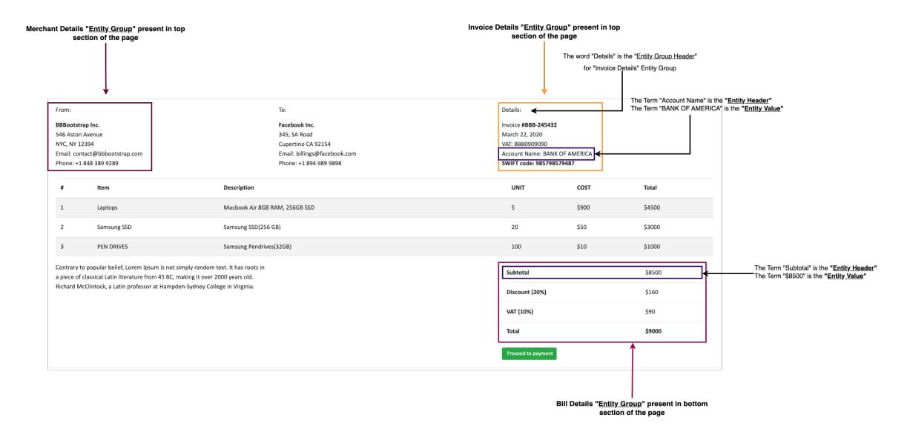

Figure 1: Typical patterns in an invoice

[2024;](#page-8-12) [Agarwal et al.,](#page-7-11) [2024c\)](#page-7-11), this method has notable limitations when applied to semi-structured documents. The layout diversity is constrained by the original templates, limiting positional variation of fields like merchant names or table sizes [\(Hong](#page-7-12) [et al.,](#page-7-12) [2022\)](#page-7-12). Predefined whiteout regions often fail to accommodate longer replacement values, and inserting new content can degrade visual fidelity. Moreover, the approach is difficult to scale, as each template requires collecting and manually annotating real documents. Figure [5](#page-16-0) in appendix describes the hard template based approach with an example.

# 1.4 Privacy

Data collection and its use is subject to several privacy challenges, including but not limited to data use restrictions, data regulations such as GDPR and ethical considerations to ensure diverse representations while avoiding bias. Models trained on real-world data may also inadvertently reveal private information during inference.

To address the above challenges, we introduce FlexDoc - a framework to generate diverse, multilingual, annotated synthetic document datasets for training Document Understanding models. Specifically:

• We introduce a novel algorithm called Parameterized Sampling centered around Stochastic Schemas which can generate hundreds of thousands of unique semi-structured documents using a single definition, along with annotations (key value labels, bounding boxes, document types, table boundaries etc.) with

#### guaranteed accuracy.

- We also present a novel Dynamic Virtual Grid Algorithm that organizes document elements into non-overlapping regions while enhancing visual diversity.
- The generation process uses a fake value generator, eliminating privacy risks and can be configured for locale-specific tuning.
- The pipeline is multilingual. The same stochastic schema written in English can be used to generate documents in different languages by switching just two simple configurations.

# 2 Related Work

Recent work has explored using large language models (LLMs) for synthetic data generation. [Dua](#page-7-13) [et al.](#page-7-13) [\(2025\)](#page-7-13) introduced an end to end pipeline for generating synthetic data for training speech models using LLMs and speech audio generation and voice standardization models. [Josifoski](#page-7-14) [et al.](#page-7-14) [\(2023\)](#page-7-14) introduced SynthIE, prompting LLMs to generate input-output pairs for information extraction (IE) without labeled data. GuideX [\(De La Fuente et al.,](#page-7-15) [2025\)](#page-7-15) generates schemaguided examples for fine-tuning LLaMA 3.1 [\(Pat](#page-8-13)[tnayak et al.,](#page-8-13) [2025a;](#page-8-13) [Agarwal et al.,](#page-6-1) [2025a\)](#page-6-1), while [Bhattacharyya and Tripathi](#page-7-16) [\(2024\)](#page-7-16) distill soft labels from multimodal models like Claude 3 into compact KIE models. In specialized domains, [Woo](#page-8-14) [et al.](#page-8-14) [\(2024\)](#page-8-14) synthesize clinical Q&A pairs, showing that distilled models can rival their teachers.

<span id="page-2-0"></span>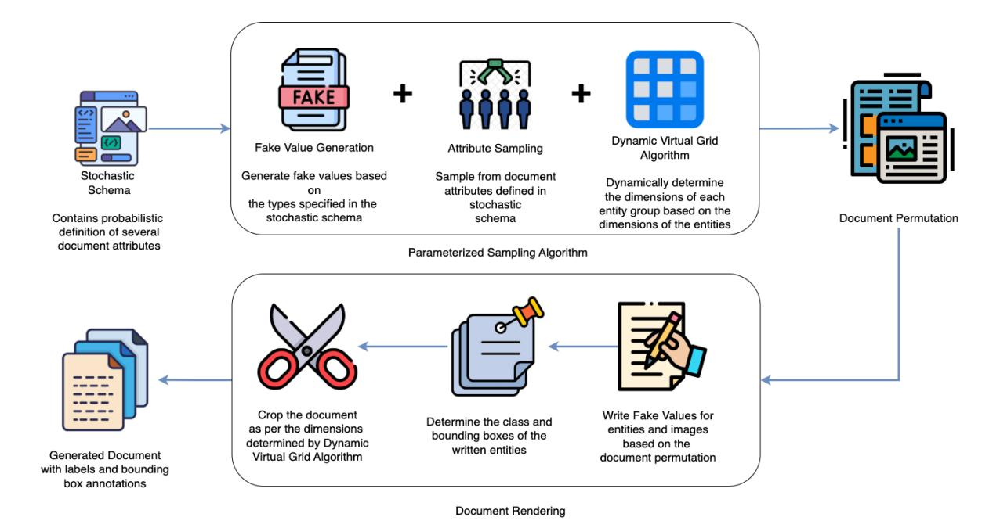

Figure 2: High-Level description of FlexDoc for generating Synthetic Annotated Documents

For visually rich documents, most approaches rely on hard templates. SynthNID [\(Monsur et al.,](#page-8-7) [2023\)](#page-8-7) overlays fake values onto ID templates, while Genalog [\(Gupte et al.,](#page-7-5) [2021\)](#page-7-5) uses HTM-L/CSS templates with synthetic content and degradation steps. [Raman et al.](#page-8-15) [\(2022\)](#page-8-15) explored variational templates by treating document components as random variables, though their scope was limited to layout recognition.

On the modeling side, LayoutLM [\(Xu et al.,](#page-8-4) [2020;](#page-8-4) [Huang et al.,](#page-7-2) [2022\)](#page-7-2) pioneered multimodal pretraining with text and layout features. More recent models like Qwen-VL 2.5 [\(Bai et al.,](#page-7-17) [2023b\)](#page-7-17), LLaMA 3.2 Vision, Phi-4 Multimodal [\(Microsoft,](#page-8-5) [2024\)](#page-8-5), and LLaVA [\(Liu et al.,](#page-8-16) [2023a\)](#page-8-16) advance spatial reasoning through visual-text alignment and hard negative mining [\(Meghwani et al.,](#page-8-17) [2025\)](#page-8-17). GPT-4o [\(OpenAI et al.,](#page-8-18) [2024;](#page-8-18) [Chen et al.,](#page-7-18) [2025;](#page-7-18) [Yan et al.,](#page-9-2) [2025\)](#page-9-2) introduces native image generation with improved attribute binding and text clarity, though it lacks fine-grained control and diversity beyond prompt variations.

## 3 Methodology

The subsequent sections detail the rationale behind FlexDoc and systematically explain its components. The detailed algorithm is described in Figure [4](#page-16-1) in appendix.

#### 3.1 Intuition

#### 3.1.1 Patterns in Semi-Structured Documents

The format of information within semi-structured documents like invoices and receipts often adheres to identifiable patterns. Typically, the data within such documents tends to display the following characteristics:

- 1. Documents contain known identifiable elements (e.g., Merchant Name, Invoice Date) with specific types (text, date, number). We refer to each as an entity, and its value as the entity value.
- 2. Entities typically follow specific header texts (e.g., Merchant Name, Sold by), which guide accurate identification. We call this the entity header.
- 3. Entities are grouped (e.g., Merchant Details, Invoice Details), forming entity groups.
- 4. These groups may also be introduced by header text (e.g., Seller Information), called entity group headers.
- 5. Documents exhibit structured layouts with consistent fonts, colors, and alignments across entities and groups.

Figure [1](#page-1-0) describes such properties with an example invoice.

# 3.1.2 Variations in Semi-Structured Documents

While semi-structured documents often follow recognizable patterns, they also exhibit significant variation in entities, entity groups, headers, and layout structures - adding complexity to document understanding. Based on our analysis across diverse document types, we observe the following variations:

- 1. Entity groups can appear anywhere on the page (e.g., Merchant Details may be at the top or bottom).
- 2. Placement within a section is not fixed (e.g., Customer Details may appear top-left, top-right, or center).
- 3. Some documents may omit certain entity groups (e.g., Shipping Details or Payment Terms may be absent).
- 4. Not all entity groups include headers (e.g., Merchant Details may lack a header).
- Headers, if present, vary in wording (e.g., Customer Details may appear as Buyer Details or Client Details).
- 6. Entity groups can be formatted differently stacked, tabular (vertical/horizontal), or mixed with varied table structures and formatting.
- 7. Some entities may be missing (e.g., Invoice Due Date or Purchase Order Number).
- 8. Entities may or may not have headers (e.g., Customer Name might lack a label).
- 9. Headers for entities vary in wording (e.g., Subtotal vs. Sub-Total Amount).
- 10. The order of entities within a group is inconsistent (e.g., email and phone order varies in Customer Details).
- 11. Fonts and colors differ across documents and between entity headers, group headers, and values.
- 12. Entity values differ widely (e.g., different customer names).
- 13. Entities may be left, right, or center-aligned based on context.

Figure 6 in appendix depicts these variations by comparing two invoices side by side.

#### 3.2 Framework/Algorithm

The FlexDoc algorithm, described in Figure 2, consists of three major components: A **Stochastic** 

**Schema**, a **Parameterized Sampling** algorithm, and a **Document Rendering** algorithm.

#### 3.2.1 Stochastic Schema

Building on identified patterns and variations, we construct stochastic schemas - where element properties are defined as random variables, with either specified distributions or value ranges. For example, rather than fixing the number of rows in the Item Details table, we use a uniform distribution and sample a value at generation time.

Stochastic schemas can also define the presence of elements probabilistically. For instance, the Customer Phone Number entity may appear in a document based on a predefined probability, reflecting real-world variability. Additionally, stochastic schemas specify style and structural attributes - like fonts, colors, and grid layouts - under a shared configuration.

A document can be defined by a stochastic schema  $\mathcal{T}_s$ , consisting of entity groups  $\mathcal{G} = \{G_1, \ldots, G_K\}$ . Each entity group  $G_k$  is defined as:

$$G_k = (\mathcal{E}_k, \mathcal{H}_k, p_k, \alpha_k)$$

- $\mathcal{E}_k = \{e_{k1}, \dots, e_{kn}\}$ : set of entities
- $\mathcal{H}_k$ : set of possible group headers
- $p_k \in [0,1]$ : probability of group appearance
- α<sub>k</sub>: layout attributes (e.g., preferred sections, alignment, table format)

Each entity  $e_{ki} \in \mathcal{E}_k$  is a tuple:

$$e_{ki} = (T_{ki}, \mathcal{H}_{ki}, p_{ki}, \beta_{ki})$$

- $T_{ki}$ : entity type (e.g., name, address)
- $\mathcal{H}_{ki}$ : header label variants
- $p_{ki} \in [0,1]$ : probability of entity appearance
- $\beta_{ki}$ : visual/layout attributes

These schemas, defined as JSONs, serve as loose specifications. At runtime, the algorithm samples from various distributions to generate diverse document permutations, enabling the creation of hundreds of thousands of unique documents. Appendix B provides an example of an entity group definition and describes related attributes and style configuration.

<span id="page-4-0"></span>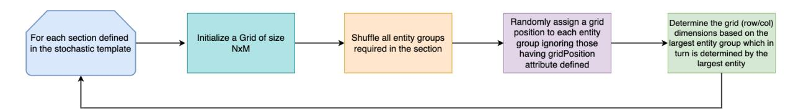

Figure 3: Dynamic Virtual Grid Algorithm

#### 3.2.2 Parameterized Sampling Algorithm

Entity Fake Value Generation: Entity values are generated using a type-specific value generator:

$$v_{ki} = f_{T_{ki}}(\theta)$$

where fTki denotes a generator function selected based on the entity type Tki, and θ includes generation parameters such as locale, format, and value constraints.

To implement this, we use the Python library Faker [\(Faraglia,](#page-7-19) [2014\)](#page-7-19), along with custom fake value generators. Faker supports generating synthetic data for various entities (e.g., names, addresses, phone numbers) across multiple locales.

Each stochastic schema includes a generator class defined within the same JSON schema. A typical generator class definition is shown below:

"fake\_value\_generator\_class":

"utils.doc\_generator.InvoiceGenerator"

The type of each entity defined in stochastic schema is utilized by the generator class to produce entity values. For e.g. a merchant name may be of type name, while a merchant address may be of type address.

Attribute Sampling: We utilize a sampling algorithm to freeze the stochastic definitions defined in the schema. Each instance of sampling these attributes generates a document permutation. A document permutation is a frozen outline of all the stochastic attributes required in a document. From a single stochastic schema, thousands of distinct document permutations can be generated. An instance of a document permutation is created by simply replacing fake values for each entity.

A document permutation T<sup>p</sup> is generated by freezing the stochastic schema S:

$$\mathcal{T}_p = \{G_k, e_{ki} | G_k, v_{ki}, \alpha_k, \beta_{ki}, H_k, H_{ki}, \ldots\}$$

*where each component - entity/group presence, value, layout, and style - is sampled from schemadefined probabilities or distributions.*

Table [7](#page-14-0) in appendix describes the techniques used to sample the attributes in stochastic schema.

Dynamic Virtual Grid Algorithm: Documents often consist of multiple sections, each of which may contain numerous entity groups. While attribute sampling determines the designated section for each entity group, placing those groups within the sections and writing on the canvas poses several challenges: random positioning can cause overlaps, fixed sizes limit layout flexibility, and sequential placement may disrupt alignment.

To address this, we introduce a Dynamic Virtual Grid Arrangement algorithm. Each section is treated as a virtual grid whose dimensions are schema-driven. Entity groups are placed into cells, and row/column sizes are dynamically adjusted to minimize whitespace and preserve visual structure.

Figure [3](#page-4-0) provides an overview; a detailed example is described in Figure [7](#page-17-1) in appendix.

# 3.2.3 Document Rendering Algorithm

Let the document canvas be divided into a grid C ∈ R <sup>H</sup>×<sup>W</sup> , with each entity group assigned to a grid cell via the mapping:

$$\phi:G_k\to(i,j)$$

where G<sup>k</sup> is the k-th entity group and (i, j) its target cell on the canvas.

We define a rendering function R(Th, ϕ) that draws sampled entity groups onto a blank canvas based on grid positions and layout attributes from the stochastic schema Th, while recording bounding boxes for annotation.

Rendering uses the Pillow library [\(Clark,](#page-7-20) [2015\)](#page-7-20), respecting the Dynamic Virtual Grid Arrangement and frozen layout constraints to ensure consistent structure and accurate annotations. A high-level overview is provided in Figure [8](#page-18-0) in appendix.

Final document and annotation output:

$$\mathcal{I} = \mathcal{R}(\mathcal{T}_h, \phi), \quad \text{Ann} = \{(b_{ki}, v_{ki}), (\text{class labels})\}$$

Here, I is the rendered image, and Ann the set of annotations - each containing a bounding box bki, value vki, and class labels, which vary by task (e.g., per-entity labels in KIE).

# 3.3 Multilinguality

The algorithm can be configured to generate data in different languages (one language per document) while using the same stochastic schema defined in English. Configuration *faker\_locale* switches the faker locale to generate entity values in the target language while {"translation": {"enable": "True", "target\_lang\_code": "<lang\_code>"}} uses a machine translation engine to translate entity and entity group headers defined in the JSON schema to the target language.

Example documents along with KIE specific annotations generated using FlexDoc are available in Appendices [C](#page-19-0) and [D.](#page-20-0)

#### <span id="page-5-0"></span>4 Evaluation Results

Experimentation settings, including the choice of models and datasets for evaluation are thoroughly detailed in Appendix [A.](#page-10-0)

#### 4.1 Downstream Model Performance

| Train Dataset          | LayoutLM | Phi-4 |
|------------------------|----------|-------|
| Zero Shot              | NA       | 31.2  |
| Synthetic 5k Only      | 54.1     | 53.3  |
| DocILE Only (Baseline) | 72.7     | 74.6  |
| DocILE + 1k Synthetic  | 76.3     | 79.8  |
| DocILE + 2k Synthetic  | 78.8     | 82.4  |
| DocILE + 3k Synthetic  | 81.8     | 83.1  |
| DocILE + 4k Synthetic  | 82.7     | 85.3  |
| DocILE + 5k Synthetic  | 82.9     | 85.6  |

Table 1: F1 scores when incrementally adding FlexDocgenerated synthetic data to the DocILE dataset.

| Train Dataset         | LayoutLM | Phi-4 |
|-----------------------|----------|-------|
| Zero Shot             | NA       | 23.1  |
| Synthetic 5k Only     | 47.3     | 44.4  |
| IDSEM Only (Baseline) | 65.5     | 71.2  |
| IDSEM + 1k Synthetic  | 67.3     | 74.5  |
| IDSEM + 2k Synthetic  | 69.1     | 76.0  |
| IDSEM + 3k Synthetic  | 73.3     | 77.3  |
| IDSEM + 4k Synthetic  | 74.2     | 78.6  |
| IDSEM + 5k Synthetic  | 75.6     | 79.5  |

Table 2: F1 scores when incrementally adding FlexDocgenerated synthetic data to the IDSEM dataset (Spanish invoices).

We assess FlexDoc's effectiveness on the Key Information Extraction (KIE) task - one of the most complex tasks in Document Understanding - using both the DocILE [\(Šimsa et al.,](#page-8-19) [2023\)](#page-8-19) (English) and IDSEM [\(Sánchez et al.,](#page-8-20) [2022\)](#page-8-20) (Spanish invoices) datasets. We first train LayoutLM (an encoder-based multimodal model) and Phi-4- Multimodal-Instruct (a decoder-based generative multimodal model) on these real datasets (as baselines), and then incrementally augment them with 1k–5k FlexDoc-generated synthetic samples.

For DocILE, augmenting with synthetic data results in significant performance improvements, with LayoutLM achieving an F1 score of 82.9% and Phi-4 reaching 85.6% after adding 5k synthetic samples - an increase of up to 10.2% for LayoutLM and 11% for Phi-4 against the baseline.

Similarly, on the IDSEM dataset, incrementally adding synthetic data boosts performance significantly, with final F1 scores of 75.6% for LayoutLM and 79.5% for Phi-4 after adding 5k synthetic samples - showing an improvement of 10.1% for LayoutLM and 8.3% for Phi-4 against the baseline.

These results demonstrate FlexDoc's effectiveness in enhancing KIE task performance in both English and Spanish invoice datasets, highlighting its potential for multilingual applications in document understanding tasks.

# 4.2 Ablation Study - Dynamic Virtual Grid Algorithm

We also evaluate the effectiveness of the Dynamic Virtual Grid Algorithm by replacing it with a baseline method that randomly places entities in nonoverlapping positions without considering layout structure. When this algorithm is disabled, LayoutLM's performance (with 5k synthetic documents) drops from 82.9% to 75.4%, and Phi-4's from 85.9% to 80.6%. This highlights the critical role of structured placement in enhancing the quality and utility of synthetic documents for key information extraction tasks.

# 4.3 Comparison with Hard-Template Approach

| Approach      | LayoutLM | Phi-4 | Effort |
|---------------|----------|-------|--------|
|               | (F1)     | (F1)  | (mins) |
| Hard Template | 69.8     | 72.2  | 1500   |
| FlexDoc       | 67.4     | 69.8  | 150    |

Table 3: Performance and annotation effort comparison for Hard Template vs. FlexDoc approaches on Insurance Cards Dataset.

We compare FlexDoc against the widely used hard-template-based generation approach. To assess robustness, we evaluate on a proprietary insurance card dataset, where FlexDoc achieves comparable performance while reducing annotation effort by approximately 90%. FlexDoc offers a substantial scaling advantage: the annotation cost remains constant at 150 minutes for 3,000 samples, while traditional hard-template methods require a linear increase in annotation time as the dataset size grows.

#### 4.4 Diversity Analysis

| Dataset                | Mean Pairwise Similarity |
|------------------------|--------------------------|
| DocILE - 5k Documents  | 0.52 ± 0.05              |
| FlexDoc - 5k Documents | 0.55 ± 0.04              |
| SROIE - 1k Documents   | 0.40 ± 0.02              |
| FlexDoc - 1k Documents | 0.43 ± 0.04              |

Table 4: Mean pairwise similarity across different datasets, with standard deviation.

We also evaluate the diversity of datasets generated by FlexDoc by comparing them to real-world benchmarks: DocILE and SRIOE. We compute mean pairwise similarity on datasets of comparable size (5000 samples for DocILE, 1000 for SRIOE), using embeddings from a LayoutLM model suited for document understanding. The results show that FlexDoc-generated data achieves diversity levels comparable to both real datasets. Moreover, the small deviations confirm the reliability of the results and further demonstrate that the generated documents are diverse without being dominated by outliers.

# 5 Conclusion

High-quality annotated data remains a major bottleneck for scaling document understanding in enterprise settings. We introduce a robust, extensible framework for generating realistic, diverse, and multilingual synthetic documents that mirror realworld complexity. FlexDoc enables rapid development of layout-aware models, greatly reducing the need for costly manual annotation. While our experiments target invoice-based KIE, the framework generalizes across document understanding tasks and is already in enterprise deployment, accelerating model development and significantly reducing data acquisition and annotation costs.

# 6 Limitations and Future Work

The data generator presented in this work aims to produce diverse documents by randomizing a large number of document attributes. While the permutations obtained by randomizing such a large number

of variations work well for semi-structured documents, this approach is not particularly useful for fully structured, visually rich documents such as driving licenses, passports, etc. Such documents usually do not demonstrate much diversity, at least within a specific category. For example, driving licenses in the United States would have about 50- 80 variations depending on the issuing state. The majority of the diversity is derived from variations in values (license holder's name, address, etc.) in such documents. These documents also contain visually rich backgrounds. For example, the driving license issued by Massachusetts contains an image of the State House in the background.

For these reasons, our approach is not suitable for generating synthetic documents for fully structured, visually rich documents. Hard-templatebased approaches are still the most effective for such cases since the cost of annotation is not too high for documents with limited variations.

However, hard-template-based approaches have certain limitations as well, such as a loss of visual features from the background when filling in synthetic values. In the future, we would like to extend our approach to generate such documents while addressing the limitations of a hard-template-based approach.

Additionally, FlexDoc doesn't generate semantically meaningful fake values. For example, the total amount in the invoice doesn't add up to amount of individual items. Therefore, we also plan to introduce semantic value generators in the future. Finally, we acknowledge that some type of documents may exhibit cultural variations and FlexDoc doesn't account for that when generating documents in other languages using the common stochastic schema.

#### Acknowledgments

The work was conducted during employment with and funded by Oracle Corporation (AI Services).

# References

<span id="page-6-1"></span>Amit Agarwal, Hansa Meghwani, Hitesh Laxmichand Patel, Tao Sheng, Sujith Ravi, and Dan Roth. 2025a. [Aligning llms for multilingual consistency in enter](https://arxiv.org/abs/2509.23659)[prise applications.](https://arxiv.org/abs/2509.23659) *Preprint*, arXiv:2509.23659.

<span id="page-6-0"></span>Amit Agarwal and Kulbhushan Pachauri. 2023. Pseudo labelling for key-value extraction from documents. US Patent 11,823,478.

- <span id="page-7-7"></span>Amit Agarwal, Kulbhushan Pachauri, Iman Zadeh, and Jun Qian. 2024a. Techniques for graph data structure augmentation. US Patent 11,989,964.
- <span id="page-7-6"></span>Amit Agarwal, Srikant Panda, and Kulbhushan Pachauri. 2024b. Synthetic document generation pipeline for training artificial intelligence models. US Patent App. 17/994,712.
- <span id="page-7-0"></span>Amit Agarwal, Srikant Panda, and Kulbhushan Pachauri. 2025b. [FS-DAG: Few shot domain adapting graph](https://aclanthology.org/2025.coling-industry.9/) [networks for visually rich document understanding.](https://aclanthology.org/2025.coling-industry.9/) In *Proceedings of the 31st International Conference on Computational Linguistics: Industry Track*, pages 100–114, Abu Dhabi, UAE. Association for Computational Linguistics.
- <span id="page-7-11"></span>Amit Agarwal, Hitesh Patel, Priyaranjan Pattnayak, Srikant Panda, Bhargava Kumar, and Tejaswini Kumar. 2024c. Enhancing document ai data generation through graph-based synthetic layouts. *arXiv preprint arXiv:2412.03590*.
- <span id="page-7-3"></span>Jinze Bai, Shuai Bai, Shusheng Yang, Shijie Wang, Sinan Tan, Peng Wang, Junyang Lin, Chang Zhou, and Jingren Zhou. 2023a. Qwen-vl: A versatile vision-language model for understanding, localization, text reading, and beyond. *arXiv preprint arXiv:2308.12966*.
- <span id="page-7-17"></span>Jinze Bai, Shuai Bai, Shusheng Yang, and 1 others. 2023b. Qwen-vl: A versatile vision-language model for understanding, localization, text reading, and beyond. *arXiv preprint arXiv:2308.12966*.
- <span id="page-7-16"></span>Aniket Bhattacharyya and Anurag Tripathi. 2024. Information extraction from heterogeneous documents without ground truth labels using synthetic label generation and knowledge distillation. *arXiv preprint arXiv:2411.14957*.
- <span id="page-7-4"></span>Samuele Capobianco and Simone Marinai. 2017. [Do](https://arxiv.org/abs/1710.03474)[cemul: a toolkit to generate structured historical doc](https://arxiv.org/abs/1710.03474)[uments.](https://arxiv.org/abs/1710.03474) *Preprint*, arXiv:1710.03474.
- <span id="page-7-18"></span>Sixiang Chen, Jinbin Bai, Zhuoran Zhao, Tian Ye, Qingyu Shi, Donghao Zhou, Wenhao Chai, Xin Lin, Jianzong Wu, Chao Tang, Shilin Xu, Tao Zhang, Haobo Yuan, Yikang Zhou, Wei Chow, Linfeng Li, Xiangtai Li, Lei Zhu, and Lu Qi. 2025. [An empir](https://arxiv.org/abs/2504.05979)[ical study of gpt-4o image generation capabilities.](https://arxiv.org/abs/2504.05979) *Preprint*, arXiv:2504.05979.
- <span id="page-7-20"></span>Alex Clark. 2015. [Pillow \(pil fork\) documentation.](https://buildmedia.readthedocs.org/media/pdf/pillow/latest/pillow.pdf)
- <span id="page-7-8"></span>Lei Cui. 2021. *[Document AI: Benchmarks, Models](https://www.microsoft.com/en-us/research/publication/document-ai-benchmarks-models-and-applications-presentationicdar-2021/) [and Applications \(Presentation@ICDAR 2021\)](https://www.microsoft.com/en-us/research/publication/document-ai-benchmarks-models-and-applications-presentationicdar-2021/)*. DIL workshop in ICDAR 2021.
- <span id="page-7-15"></span>Neil De La Fuente, Oscar Sainz, Iker García-Ferrero, and Eneko Agirre. 2025. Guidex: Guided synthetic data generation for zero-shot information extraction. *arXiv preprint arXiv:2506.00649*.

- <span id="page-7-13"></span>Karan Dua, Puneet Mittal, Ranjeet Gupta, and Hitesh Laxmichand Patel. 2025. Speechweave: Diverse multilingual synthetic text & audio data generation pipeline for training text to speech models. In *Proceedings of the 63rd Annual Meeting of the Association for Computational Linguistics (Volume 6: Industry Track)*, pages 718–737.
- <span id="page-7-19"></span>Daniele Faraglia. 2014. [Faker.](https://github.com/joke2k/faker)
- <span id="page-7-9"></span>Jean-Philippe Thiran Guillaume Jaume, Hazim Kemal Ekenel. 2019. Funsd: A dataset for form understanding in noisy scanned documents. In *Accepted to ICDAR-OST*.
- <span id="page-7-5"></span>Amit Gupte, Alexey Romanov, Sahitya Mantravadi, Dalitso Banda, Jianjie Liu, Raza Khan, Lakshmanan Ramu Meenal, Benjamin Han, and Soundar Srinivasan. 2021. [Lights, camera, action! A frame](https://arxiv.org/abs/2108.02899)[work to improve NLP accuracy over OCR documents.](https://arxiv.org/abs/2108.02899) *CoRR*, abs/2108.02899.
- <span id="page-7-12"></span>Teakgyu Hong, DongHyun Kim, Mingi Ji, Wonseok Hwang, Daehyun Nam, and Sungrae Park. 2022. [Bros: A pre-trained language model focusing on text](https://doi.org/10.1609/aaai.v36i10.21322) [and layout for better key information extraction from](https://doi.org/10.1609/aaai.v36i10.21322) [documents.](https://doi.org/10.1609/aaai.v36i10.21322) *Proceedings of the AAAI Conference on Artificial Intelligence*, 36:10767–10775.
- <span id="page-7-22"></span>Edward J. Hu, Yelong Shen, Phillip Wallis, Zeyuan Allen-Zhu, Yuanzhi Li, Shean Wang, Lu Wang, and Weizhu Chen. 2021. [Lora: Low-rank adaptation of](https://arxiv.org/abs/2106.09685) [large language models.](https://arxiv.org/abs/2106.09685) *Preprint*, arXiv:2106.09685.
- <span id="page-7-2"></span>Yupan Huang, Tengchao Lv, Lei Cui, Yutong Lu, and Furu Wei. 2022. [Layoutlmv3: Pre-training for](https://arxiv.org/abs/2204.08387) [document ai with unified text and image masking.](https://arxiv.org/abs/2204.08387) *Preprint*, arXiv:2204.08387.
- <span id="page-7-21"></span>Zheng Huang, Kai Chen, Jianhua He, Xiang Bai, Dimosthenis Karatzas, Shijian Lu, and C. V. Jawahar. 2019. [Icdar2019 competition on scanned receipt ocr](https://doi.org/10.1109/icdar.2019.00244) [and information extraction.](https://doi.org/10.1109/icdar.2019.00244) In *2019 International Conference on Document Analysis and Recognition (ICDAR)*. IEEE.
- <span id="page-7-14"></span>Martin Josifoski, Marija Sakota, Maxime Peyrard, and Robert West. 2023. Exploiting asymmetry for synthetic training data generation: Synthie and the case of information extraction. In *Proceedings of the 2023 Conference on Empirical Methods in Natural Language Processing*, pages 1555–1574.
- <span id="page-7-1"></span>Anoop Raveendra Katti, Christian Reisswig, Cordula Guder, Sebastian Brarda, Steffen Bickel, Johannes Höhne, and Jean Baptiste Faddoul. 2018. [Chargrid:](https://arxiv.org/abs/1809.08799) [Towards understanding 2d documents.](https://arxiv.org/abs/1809.08799) *Preprint*, arXiv:1809.08799.
- <span id="page-7-10"></span>Chen-Yu Lee, Chun-Liang Li, Timothy Dozat, Vincent Perot, Guolong Su, Nan Hua, Joshua Ainslie, Renshen Wang, Yasuhisa Fujii, and Tomas Pfister. 2022. [FormNet: Structural encoding beyond sequential](https://doi.org/10.18653/v1/2022.acl-long.260) [modeling in form document information extraction.](https://doi.org/10.18653/v1/2022.acl-long.260) In *Proceedings of the 60th Annual Meeting of the Association for Computational Linguistics (Volume*

- *1: Long Papers)*, pages 3735–3754, Dublin, Ireland. Association for Computational Linguistics.
- <span id="page-8-8"></span>Yulin Li, Yuxi Qian, Yuechen Yu, Xiameng Qin, Chengquan Zhang, Yan Liu, Kun Yao, Junyu Han, Jingtuo Liu, and Errui Ding. 2021. [Structext: Struc](https://doi.org/10.1145/3474085.3475345)[tured text understanding with multi-modal trans](https://doi.org/10.1145/3474085.3475345)[formers.](https://doi.org/10.1145/3474085.3475345) In *Proceedings of the 29th ACM International Conference on Multimedia*, MM '21, page 1912–1920, New York, NY, USA. Association for Computing Machinery.
- <span id="page-8-16"></span>Haotian Liu, Chunyuan Li, Yinpeng Chen, Jianwei Yang, and 1 others. 2023a. Visual instruction tuning. In *CVPR*. <https://llava-vl.github.io/>.
- <span id="page-8-6"></span>Haotian Liu, Chunyuan Li, Qingyang Wu, and Yong Jae Lee. 2023b. [Visual instruction tuning.](https://arxiv.org/abs/2304.08485) *Preprint*, arXiv:2304.08485.
- <span id="page-8-11"></span>Chuwei Luo, Changxu Cheng, Qi Zheng, and Cong Yao. 2023. Geolayoutlm: Geometric pre-training for visual information extraction. *2023 IEEE/CVF Conference on Computer Vision and Pattern Recognition (CVPR)*.
- <span id="page-8-17"></span>Hansa Meghwani, Amit Agarwal, Priyaranjan Pattnayak, Hitesh Laxmichand Patel, and Srikant Panda. 2025. [Hard negative mining for domain-specific re](https://doi.org/10.18653/v1/2025.acl-industry.72)[trieval in enterprise systems.](https://doi.org/10.18653/v1/2025.acl-industry.72) In *Proceedings of the 63rd Annual Meeting of the Association for Computational Linguistics (Volume 6: Industry Track)*, pages 1013–1026, Vienna, Austria. Association for Computational Linguistics.
- <span id="page-8-5"></span>Microsoft. 2024. Phi-4 multimodal-instruct: Small, smart, and multimodal. [https://huggingface.co/](https://huggingface.co/microsoft/Phi-4-Multimodal-Instruct) [microsoft/Phi-4-Multimodal-Instruct](https://huggingface.co/microsoft/Phi-4-Multimodal-Instruct).
- <span id="page-8-7"></span>Syed Mostofa Monsur, Shariar Kabir, and Sakib Chowdhury. 2023. [SynthNID: Synthetic data to improve](https://doi.org/10.18653/v1/2023.banglalp-1.13) [end-to-end Bangla document key information extrac](https://doi.org/10.18653/v1/2023.banglalp-1.13)[tion.](https://doi.org/10.18653/v1/2023.banglalp-1.13) In *Proceedings of the First Workshop on Bangla Language Processing (BLP-2023)*, pages 117–123, Singapore. Association for Computational Linguistics.
- <span id="page-8-18"></span>OpenAI, :, Aaron Hurst, Adam Lerer, Adam P. Goucher, Adam Perelman, Aditya Ramesh, Aidan Clark, AJ Ostrow, Akila Welihinda, Alan Hayes, Alec Radford, Aleksander M ˛adry, Alex Baker-Whitcomb, Alex Beutel, Alex Borzunov, Alex Carney, Alex Chow, Alex Kirillov, and 401 others. 2024. [Gpt-4o](https://arxiv.org/abs/2410.21276) [system card.](https://arxiv.org/abs/2410.21276) *Preprint*, arXiv:2410.21276.
- <span id="page-8-2"></span>Srikant Panda, Amit Agarwal, Gouttham Nambirajan, and Kulbhushan Pachauri. 2025a. Out of distribution element detection for information extraction. US Patent App. 18/347,983.
- <span id="page-8-3"></span>Srikant Panda, Amit Agarwal, and Kulbhushan Pachauri. 2025b. Techniques of information extraction for selection marks. US Patent App. 18/240,344.

- <span id="page-8-12"></span>Hitesh Laxmichand Patel, Amit Agarwal, Bhargava Kumar, Karan Gupta, and Priyaranjan Pattnayak. 2024. Llm for barcodes: Generating diverse synthetic data for identity documents. *arXiv preprint arXiv:2411.14962*.
- <span id="page-8-13"></span>Priyaranjan Pattnayak, Hitesh Laxmichand Patel, and Amit Agarwal. 2025a. [Tokenization matters: Im](https://arxiv.org/abs/2504.16977)[proving zero-shot ner for indic languages.](https://arxiv.org/abs/2504.16977) *Preprint*, arXiv:2504.16977.
- <span id="page-8-1"></span>Priyaranjan Pattnayak, Hitesh Laxmichand Patel, Amit Agarwal, Bhargava Kumar, Srikant Panda, and Tejaswini Kumar. 2025b. [Clinical qa 2.0: Multi-task](https://arxiv.org/abs/2502.13108) [learning for answer extraction and categorization.](https://arxiv.org/abs/2502.13108) *Preprint*, arXiv:2502.13108.
- <span id="page-8-0"></span>Priyaranjan Pattnayak, Hitesh Laxmichand Patel, Bhargava Kumar, Amit Agarwal, Ishan Banerjee, Srikant Panda, and Tejaswini Kumar. 2024. Survey of large multimodal model datasets, application categories and taxonomy. *arXiv preprint arXiv:2412.17759*.
- <span id="page-8-15"></span>Natraj Raman, Sameena Shah, and Manuela Veloso. 2022. [Synthetic document generator for annotation](https://doi.org/10.1016/j.patcog.2022.108660)[free layout recognition.](https://doi.org/10.1016/j.patcog.2022.108660) *Pattern Recognition*, 128:108660.
- <span id="page-8-21"></span>Lance Ramshaw and Mitch Marcus. 1995. [Text chunk](https://aclanthology.org/W95-0107)[ing using transformation-based learning.](https://aclanthology.org/W95-0107) In *Third Workshop on Very Large Corpora*.
- <span id="page-8-20"></span>J. Sánchez, A. Salgado, A. García, and N. Monzón. 2022. [Idsem, an invoices database of the spanish](https://doi.org/10.1038/s41597-022-01885-3) [electricity market.](https://doi.org/10.1038/s41597-022-01885-3) *Scientific Data*, 9(1):786.
- <span id="page-8-9"></span>B. Shi, X. Bai, and C. Yao. 2017. [An end-to-end train](https://doi.org/10.1109/TPAMI.2016.2646371)[able neural network for image-based sequence recog](https://doi.org/10.1109/TPAMI.2016.2646371)[nition and its application to scene text recognition.](https://doi.org/10.1109/TPAMI.2016.2646371) *IEEE Transactions on Pattern Analysis & Machine Intelligence*, 39(11):2298–2304.
- <span id="page-8-19"></span>Štepán Šimsa, Milan Šulc, Michal U ˇ ˇricᡠˇr, Yash Patel, Ahmed Hamdi, Matej Kocián, Matyáš Skalick ˇ y, Ji ` ˇrí Matas, Antoine Doucet, Mickaël Coustaty, and Dimosthenis Karatzas. 2023. [DocILE benchmark for](https://arxiv.org/abs/2302.05658) [document information localization and extraction.](https://arxiv.org/abs/2302.05658)
- <span id="page-8-14"></span>Elizabeth Geena Woo, Michael C. Burkhart, Emily Alsentzer, and Brett K. Beaulieu-Jones. 2024. Synthetic data distillation enables the extraction of clinical information at scale. *medRxiv*.
- <span id="page-8-4"></span>Yiheng Xu, Minghao Li, Lei Cui, Shaohan Huang, Furu Wei, and Ming Zhou. 2020. [Layoutlm: Pre-training](https://doi.org/10.1145/3394486.3403172) [of text and layout for document image understanding.](https://doi.org/10.1145/3394486.3403172) In *Proceedings of the 26th ACM SIGKDD International Conference on Knowledge Discovery & Data Mining*, KDD '20. ACM.
- <span id="page-8-10"></span>Yiheng Xu, Tengchao Lv, Lei Cui, Guoxin Wang, Yijuan Lu, Dinei Florencio, Cha Zhang, and Furu Wei. 2021. [Layoutxlm: Multimodal pre-training for multi](https://arxiv.org/abs/2104.08836)[lingual visually-rich document understanding.](https://arxiv.org/abs/2104.08836)

- <span id="page-9-2"></span>Zhiyuan Yan, Junyan Ye, Weijia Li, Zilong Huang, Shenghai Yuan, Xiangyang He, Kaiqing Lin, Jun He, Conghui He, and Li Yuan. 2025. [Gpt-imgeval:](https://arxiv.org/abs/2504.02782) [A comprehensive benchmark for diagnosing gpt4o in](https://arxiv.org/abs/2504.02782) [image generation.](https://arxiv.org/abs/2504.02782) *Preprint*, arXiv:2504.02782.
- <span id="page-9-0"></span>Xiao Yang, Ersin Yumer, Paul Asente, Mike Kraley, Daniel Kifer, and C. Lee Giles. 2017. [Learning to](https://doi.org/10.1109/CVPR.2017.462) [extract semantic structure from documents using mul](https://doi.org/10.1109/CVPR.2017.462)[timodal fully convolutional neural networks.](https://doi.org/10.1109/CVPR.2017.462) In *2017 IEEE Conference on Computer Vision and Pattern Recognition (CVPR)*, pages 4342–4351.
- <span id="page-9-1"></span>Yue Zhang, Zhang Bo, Rui Wang, Junjie Cao, Chen Li, and Zuyi Bao. 2021. [Entity relation extraction](https://doi.org/10.18653/v1/2021.emnlp-main.218) [as dependency parsing in visually rich documents.](https://doi.org/10.18653/v1/2021.emnlp-main.218) In *Proceedings of the 2021 Conference on Empirical Methods in Natural Language Processing*, pages 2759–2768, Online and Punta Cana, Dominican Republic. Association for Computational Linguistics.

# Appendices

# <span id="page-10-0"></span>A Experimentation Settings

#### A.1 FlexDoc Generated Data

For the purpose of experiments under [Evalua](#page-5-0)[tion Results,](#page-5-0) the stochastic attributes in the JSON schema for FlexDoc generated data are defined using informed and reasonable approximations, however, the JSON can be modified to mimic other data distributions as well.

#### A.2 Choice of Datasets and Models

The experiments (for documents in English) are conducted using the DocILE dataset for benchmarking. DocILE is the largest open-source dataset in english language for key information extraction (KIE). Alternative datasets such as KVP10k and SROIE also exist, but they are less suitable for our use case.

KVP10k contains semi-structured documents, but it lacks explicit document type labels (e.g., receipts, invoices). Since our approach generates targeted documents, knowing the document type with certainty is essential, making KVP10k unsuitable. Moreover, although KVP10k does have bounding boxes, it does not provide text-level classes; instead, it defines key-value relationships between text pairs. For e.g. it defines that the header text for purchase order number 12HOUGH1 is Purchase Order without specifying the predefined class. Such header text may differ across documents and therefore classification with this information is not feasible.

Another option is the SROIE [\(Huang et al.,](#page-7-21) [2019\)](#page-7-21) dataset, which focuses on receipts. However, the state-of-the-art performance on this dataset - 97.8% accuracy with LayoutLM - leaves little room for further improvement through synthetic data augmentation.

We supplement our results with the IDSEM [\(Sánchez et al.,](#page-8-20) [2022\)](#page-8-20) dataset to support our claim that FlexDoc can generate synthetic multilingual documents for training document understanding models.

We also conduct experiments using LayoutLM, a conventional encoder-based multimodal model, and Phi-4-Multimodal-Instruct, a modern decoderbased generative model, to evaluate the effectiveness of FlexDoc across both architectural paradigms and model types.

# A.3 Downstream Model Performance

For training LayoutLM, the annotations in the dataset are chunked at word level using the IOB format [\(Ramshaw and Marcus,](#page-8-21) [1995\)](#page-8-21). Since the annotations are chunked at the word level using the IOB format, the evaluation is also conducted at the word level, without taking into account the I and B modifiers. For instance, in the case of a Merchant Name like "Jake Peralta", both "Jake" and "Peralta" are treated as part of the "MerchantName" class, rather than as separate "B-MerchantName" and "I-MerchantName" tags.

For training and evaluating Phi-4-Multimodal-Instruct, the following prompt was used: *Extract only the values for the following keys from the document image. If a key has multiple values, list all separated by a pipe (|). Return output in the following format as JSON: <json\_format>.*

# A.4 Ablation Study - Dynamic Virtual Grid Algorithm

For this study, the Dynamic Virtual Grid algorithm is replaced with a simpler approach that places text in non-overlapping regions on a blank canvas. The canvas dimensions are kept consistent with those used in the overall FlexDoc algorithm. All other aspects of the data generation process remain unchanged, ensuring that the generated data still includes annotations such as bounding boxes and class labels.

# A.5 Comparison with Hard-Template Approach

For the baseline, we generate 3000 samples using 300 manually annotated hard templates. We then generate the same number of samples using our own approach. To be fair to the baseline, we generate 10 copies of each schema frozen by our approach, effectively generating 3000 samples from 300 document permutations. We then train both models using these two datasets. The savings in annotation time is considered based on an average of 5 minutes spent per hard template (baseline) and 2.5 hours spent per stochastic schema (FlexDoc).

# A.6 Diversity Analysis

To compute the diversity of datasets in this study, we utilize LayoutLM to extract joint representations that incorporate text, spatial layout (bounding boxes), and visual features. These representations are taken from the penultimate layer of the LayoutLM model. We then compute the mean pairwise cosine similarity between all document embeddings in the dataset. A lower mean similarity indicates greater diversity, as it reflects a broader spread in the representation space.

Let  $\mathcal{D} = \{x_1, x_2, \dots, x_N\}$  be a dataset with N document samples. Each document  $x_i$  is encoded into a joint embedding  $\mathbf{h}_i \in \mathbb{R}^d$  using the penultimate layer of the LayoutLM model, capturing textual, spatial, and visual information.

The mean pairwise cosine similarity (MPCS) is computed as:

$$MPCS(\mathcal{D}) = \frac{2}{N(N-1)} \sum_{i=1}^{N-1} \sum_{j=i+1}^{N} \cos(\mathbf{h}_i, \mathbf{h}_j)$$

where cosine similarity is defined as:

$$\cos(\mathbf{h}_i, \mathbf{h}_j) = \frac{\mathbf{h}_i \cdot \mathbf{h}_j}{\|\mathbf{h}_i\| \|\mathbf{h}_j\|}$$

A lower MPCS implies higher diversity in the dataset.

#### A.7 Training Hyperparameters

For each experiment, each model is trained on 4 x A100 GPUs for 40 epochs, with a learning rate of 2e-5, weight decay of 0.1, and a batch size of 8 per GPU core (effective batch size of 32). Phi-4-Multimodal was finetuned using Low-Rank-Adaption (LoRA) (Hu et al., 2021) training.

#### A.8 DocILE dataset split

The DocILE dataset consists of 6680 real annotated business document images. There are 55 keys that indicate key information in these documents. The dataset is split into 5392, 500 and 1000 training, validation and test multi-page images respectively. However, since the test split is not openly available, and the authors claim that for the test set, documents in both training and validation sets are considered as seen during training, we utilized the validation dataset for testing. We also divided the document images page-wise and set aside validation data from the training set. This resulted in a final train-validation-test split of 5392-1347-633. For all experiments involving the DocILE dataset, the test split is used for evaluation.

# <span id="page-11-0"></span>B Stochastic Schema Definition and Description of Attributes

Following is an example of an entity group definition.

```
"entity_groups": [
    {
      "name": "DeliveryDetails",
       "segment": {
         "0": 0.3,
         "1": 0.3,
         "2": 0.3,
         "4": 0.03,
         "5": 0.03,
         "6": 0.03
       'tabulate": {
         "create": 0.3,
         "rows": 1,
         "tabType": [
           "horizontal",
           "vertical"
         ٦
       "header": [
         "Delivery Information",
         "Delivery Info"
         "Delivery Details"
       'entities": 「
        "name": "
               customer_delivery_name",
           "align": [
             "left",
"right"
             "center"
            'header_align": [
             "left",
"right"
             "center"
            'probability": 1,
           "header": [
              "Recipient Name",
             "Recipient",
              "Customer Recipient",
              "C/0"
           ],
           "type": "company"
         },
         {
           "name": "
               customer_delivery_address"
           "probability": 0.5.
           "align": [
              "left"
              "right",
              "center"
           ],
           "header_align": [
             "left",
             "right",
"center"
           "header": [
             "Delivery Address",
"Customer Delivery Address",
"Recipient Address",
              "Ship To"
              "Shipped To"
```

```
" type ": " address_multi_line "
          }
       ] ,
       " headerProbability ": 1 ,
       " probability ": 0.5
     }
]
```

Table [5](#page-13-0) provides a description of all the attributes for entity groups and Table [6](#page-13-1) for common configuration that can be defined in a stochastic schema JSON. JSON Definition for common configuration has been omitted for brevity.

Table 5: Description of attributes for Entity Group Definition

<span id="page-13-1"></span><span id="page-13-0"></span>

| JSON Key in Schema  | Description                                                                                                                                                                                                                                                                                                                      |
|---------------------|----------------------------------------------------------------------------------------------------------------------------------------------------------------------------------------------------------------------------------------------------------------------------------------------------------------------------------|
| name<br>segment     | The name of the entity group.<br>Probabilities for the entity group to appear in various page segments. The<br>sum should be 1. The algorithm uses these probabilities to decide the<br>location during runtime.                                                                                                                 |
| tabulate            | Probability of creating the entity group as a table. Runtime logic uses<br>this probability to decide layout. Table orientation (horizontal/vertical)<br>tabType<br>is determined randomly based on the<br>key. The number of rows<br>rows<br>numEmptyRows, or sampled<br>and empty rows are either defined by<br>/<br>randomly. |
| header              | One header value from the list is selected randomly during runtime and<br>written as the group header.                                                                                                                                                                                                                           |
| headerProbability   | Probability of this entity group having a header. Used by the algorithm at<br>runtime.                                                                                                                                                                                                                                           |
| probability         | Probability of this entity group being present in the document. Used at<br>runtime to decide inclusion.                                                                                                                                                                                                                          |
| gridPosition        | Overrides the Dynamic Virtual Grid Algorithm for placing this entity<br>group at a fixed location (e.g., for Bill Details). Other groups are placed<br>accordingly.                                                                                                                                                              |
| groupAlignment      | List of alignment options. One is picked randomly, and applied to the<br>group on the grid.                                                                                                                                                                                                                                      |
| entities            |                                                                                                                                                                                                                                                                                                                                  |
|                     | • name: Used as a label in the final annotation.                                                                                                                                                                                                                                                                                 |
|                     | • probability: Probability that this entity is present, used at runtime.                                                                                                                                                                                                                                                         |
|                     | • header: One header from the list is randomly selected and displayed.                                                                                                                                                                                                                                                           |
|                     | • type: Type of entity. Guides fake value generation.                                                                                                                                                                                                                                                                            |
|                     | • fontVariance: Overrides for font face, size, and color. Unspecified<br>properties remain unchanged.                                                                                                                                                                                                                            |
|                     | • addHeader: Enforces header display for critical fields like "Total<br>Amount" regardless of global choice.                                                                                                                                                                                                                     |
|                     | • align: List of alignment options (applicable only when group is a<br>table).                                                                                                                                                                                                                                                   |
|                     | • headerAlign: Same as<br>align, but for headers only (table layout<br>only).                                                                                                                                                                                                                                                    |
| entityShuffleGroups | Defines subgroups of entities that can be shuffled among each other at<br>runtime. Each subgroup is a list of entity names.                                                                                                                                                                                                      |

Table 6: Description of attributes for Common Configuration Definition

<span id="page-14-0"></span>

| JSON Key in Schema                              | Description                                                                                                                                                                                                                                                  |
|-------------------------------------------------|--------------------------------------------------------------------------------------------------------------------------------------------------------------------------------------------------------------------------------------------------------------|
| faker_locale                                    | Locale for generating fake values using Faker. Enables multi<br>lingual support by setting the appropriate locale for the Faker<br>instance.                                                                                                                 |
| translation                                     | Enables machine translation of entity headers. Includes the fol<br>lowing keys: "enable"<br>(boolean as string) to toggle translation,<br>and "target_lang_code"<br>to specify the target language (e.g.,<br>"pt" for Portuguese).                           |
| fake_value_generator_class<br>structural_config | Fully qualified path to the custom fake value generator class.                                                                                                                                                                                               |
|                                                 | • num_segments: Number of document segments.                                                                                                                                                                                                                 |
|                                                 | • segment_size: Rows and columns per segment.                                                                                                                                                                                                                |
|                                                 | • canvas_width: Width of the blank canvas.                                                                                                                                                                                                                   |
|                                                 | • canvas_height: Height of the blank canvas.                                                                                                                                                                                                                 |
|                                                 | • intra_group_y_offset: Vertical spacing between entities<br>in a group.                                                                                                                                                                                     |
|                                                 | • intra_group_x_offset: Horizontal spacing between enti<br>ties in a group.                                                                                                                                                                                  |
|                                                 | • inter_group_y_offset: Vertical spacing between different<br>entity groups.                                                                                                                                                                                 |
|                                                 | • space_width_weight: Weight factor used to determine<br>spatial offsets.                                                                                                                                                                                    |
| font_colors                                     | List of possible font colors for entities and group headers. A<br>random color is selected and applied globally unless overridden.                                                                                                                           |
| font_size<br>font_dir                           | Minimum and maximum font size range for entities and headers.<br>Directory path containing fonts. Can be different for headers<br>and entities.                                                                                                              |
| canvas_color_options                            | List of canvas background colors. One color is randomly se<br>lected during document generation.                                                                                                                                                             |
| table_config                                    | Styling configuration shared across all table-type entity groups.                                                                                                                                                                                            |
| show_entity_headers_probability                 | Global probability for showing entity headers.<br>Applies uni                                                                                                                                                                                                |
| consistent_patterns_for_values                  | formly unless locally overridden by the entity configuration.<br>Defines constraints for generating consistent values. For ex<br>ample, when multiple values share a common format (e.g.,<br>currency), the same currency symbol is reused across instances. |
| expected_keys                                   | Example: ["\$","=C","£"].<br>List of all possible entities to include in annotations.<br>Only<br>those in this list are labeled with their specific names; others are<br>marked as "Other".                                                                  |

Table 7: Stochastic Attributes and Attribute Sampling Process

| Stochastic Attribute                                                        | Sampling Process                                                                                                                                                                                                                                                                                                 |
|-----------------------------------------------------------------------------|------------------------------------------------------------------------------------------------------------------------------------------------------------------------------------------------------------------------------------------------------------------------------------------------------------------|
| Choice of an entity group<br>to be present in the docu<br>ment              | Generate a random number from a uniform distribution. If this number is<br>less than the specified entity group probability, include the entity group in<br>the document.                                                                                                                                        |
| Placing an entity group in<br>a section of the page                         | Driven by the "Dynamic Virtual Grid Algorithm" described below.                                                                                                                                                                                                                                                  |
| Choice of creating an en<br>tity group as a table or a<br>stack of entities | Generate a random number from a uniform distribution. If this number is<br>less than the tabulation probability as defined in the entity group definition,<br>create the entity group as a table. Table orientation (horizontal or vertical)<br>is selected randomly from the options specified in the template. |
| Number of rows for an en<br>tity group defined as a ta<br>ble               | If a number is specified, it is used directly. If set to "random", a value is<br>sampled from a uniform distribution within bounds defined in the common<br>configuration.                                                                                                                                       |
| Number of empty rows for<br>an entity group defined as<br>a table           | If a number is specified, it is used directly. If set to "random", a value is<br>sampled from a uniform distribution within bounds defined in the common<br>configuration.                                                                                                                                       |
| Choice of an entity group<br>header to be present in the<br>entity group    | Generate a random number from a uniform distribution. If this number is<br>less than the specified entity group header probability, include the header<br>in the group.                                                                                                                                          |
| Choosing an entity group<br>header                                          | Randomly pick one value from the list of headers defined in the entity<br>group schema.                                                                                                                                                                                                                          |
| Choice of an entity being<br>present in the entity group                    | Generate a random number from a uniform distribution. If this number is<br>less than the entity's specified probability, include the entity in the group.                                                                                                                                                        |
| Global<br>entity<br>header<br>choice                                        | Generate a random number from a uniform distribution. If it is less than the<br>defined threshold, include headers globally. Critical entities may override<br>this behavior and always include headers.                                                                                                         |
| Choosing an entity header                                                   | Randomly pick one value from the list of headers provided for the specific<br>entity.                                                                                                                                                                                                                            |
| Choosing entity alignment                                                   | Randomly select one alignment option from the list defined for the entity.                                                                                                                                                                                                                                       |
| Shuffling Entities in Sub<br>Groups                                         | For each defined subgroup, identify the indices of member entities. Shuffle<br>these indices and reassign them to the original entities in that subgroup.                                                                                                                                                        |
| Choice<br>for<br>Global<br>Font<br>Face and Color                           | Font face and color for entity text and headers (group/entity) are chosen<br>randomly from a predefined list of fonts available in the project.                                                                                                                                                                  |
| Table Style Attributes                                                      | Stylistic attributes like header font face/color, row font face/color, and<br>separator styles are selected randomly for each table in the document.                                                                                                                                                             |

<span id="page-16-1"></span>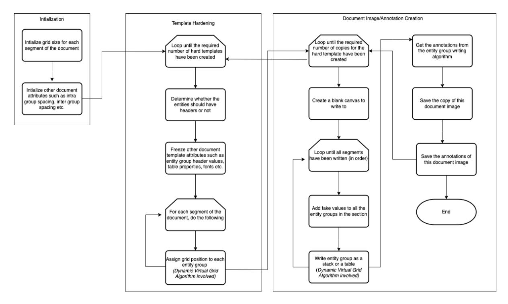

Figure 4: Overall Algorithm

<span id="page-16-0"></span>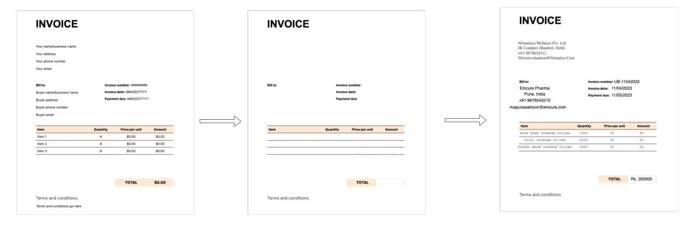

Figure 5: Hard Template Based Synthetic Document Generation

<span id="page-17-0"></span>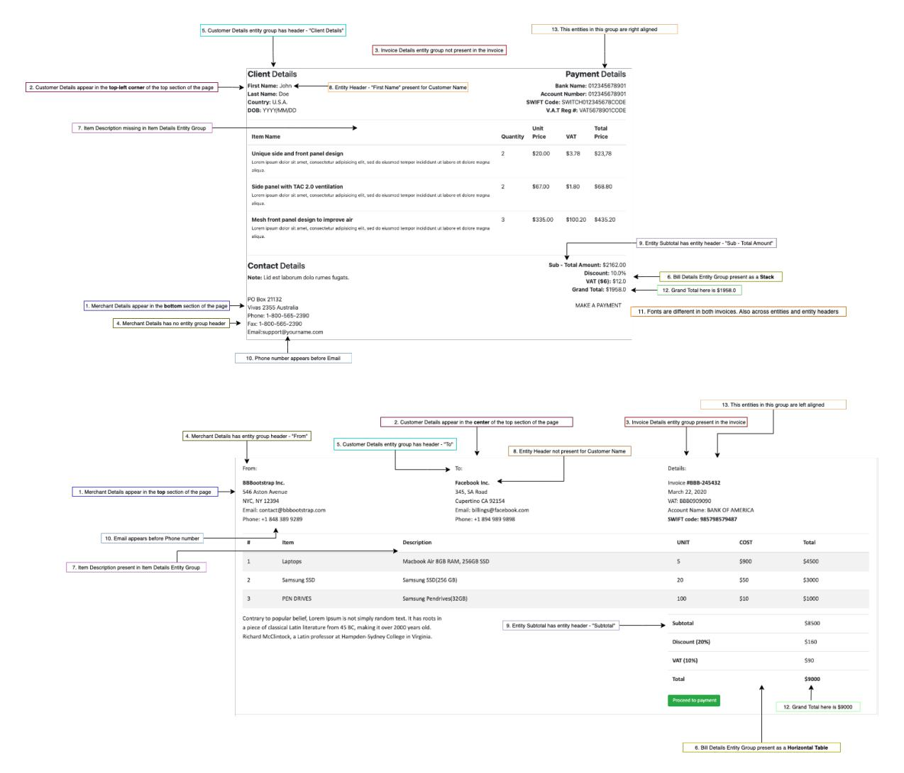

Figure 6: Two Invoices Depicting Variations in Semi Structured Documents

<span id="page-17-1"></span>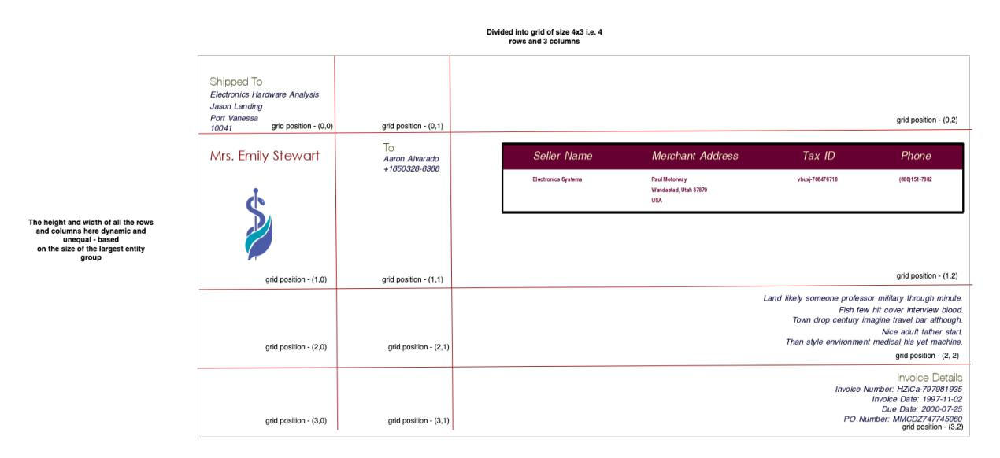

Figure 7: Arrangement of entity groups using Dynamic Virtual Grid Arrangement Algorithm. Do note that the arrangement is determined in-memory and the entities groups are written through a separate process.

<span id="page-18-0"></span>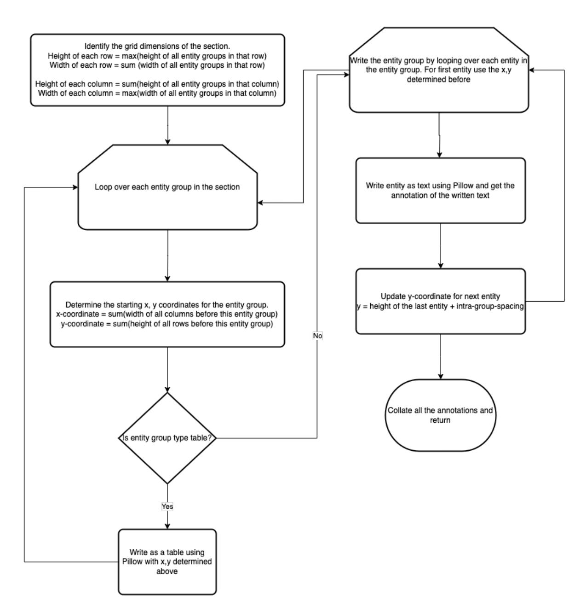

Figure 8: Document Rendering Process

# <span id="page-19-0"></span>C Example Annotation JSON

Following is an example of two annotations generated by the framework. It contains a list of entities with their classes, along with tokenized child entities.

```
[
      {
            " entity ": [
                  [
                        132 ,
                        38
                  ] ,
                  [
                        377 ,
                        27
                  ] ,
                  " SecureTrust Insurance "
            ] ,
            " children ": [
                  [
                        [
                              132 ,
                              38
                        ] ,
                        [
                              206 ,
                              27
                        ] ,
                        " SecureTrust "
                  ] ,
                  [
                        [
                              344 ,
                              38
                        ] ,
                        [
                              165 ,
                              27
                        ] ,
                        " Insurance "
                  ]
            ] ,
            " class ": " InsurerName "
      } ,
       {
            " entity ": [
                  [
                        387 ,
                        205
                  ] ,
                  [
                        105 ,
                        11
                  ] ,
                  " Scott Williams "
            ] ,
            " children ": [
                  [
                        [
                              387 ,
                              205
                        ] ,
                        [
                              42 ,
                              11
                        ] ,
                        " Scott "
```

```
] ,
                  [
                         [
                               432 ,
                               205
                         ] ,
                         [
                               60 ,
                               11
                         ] ,
                         " Williams "
                  ]
            ] ,
            " class ": " MemberName "
      }
]
```

# <span id="page-20-0"></span>D Generated Examples

# D.1 Invoices

| eresested, Ovegen 87170<br>objeum                                                                          |                       | Condition<br>Yeld After<br>Payment D                                                   | ii<br>00 Daye<br>ue 30 Days 1 | rom Billing I | Sata          |               |                       |            |           |
|------------------------------------------------------------------------------------------------------------|-----------------------|----------------------------------------------------------------------------------------|-------------------------------|---------------|---------------|---------------|-----------------------|------------|-----------|
| illed To<br>larknet, Lopez and Thempson<br>ustomer Order Number: Romr#Kekhvire#1                           | ST.                   |                                                                                        |                               |               |               |               |                       |            |           |
|                                                                                                            |                       | Account N                                                                              | umber: 9437                   | 20313590      |               |               |                       |            |           |
| 0 May 2001<br>weige Time: 08:08:23<br>io: KSQrCUsAdibont                                                   | Craig Le<br>971 Leura | Curve<br>n, Seeth Corelina                                                             |                               |               |               |               |                       |            |           |
| io.: KSQxCUsJd(Bowt<br>weice Dae Dete: 89 Feb-1951                                                         | 90874<br>00074        | 0074<br>miner Registration No. : ng/EF36Ga/c0134cZ/cGB<br>na/ ID: ent/NVCJ/HTM/NCQ2255 |                               |               |               |               |                       |            |           |
| larrative                                                                                                  | Ordered               | Item Weight                                                                            | Unit Price                    | Discount      | Discount Rate | Per Unit Cost | Net Amount            | Item Tax % | Total     |
| Source western oir real how white apply<br>Sister froot area whore air.<br>Oil maintain they.              | 7784717               | 814242                                                                                 | \$3604.08                     | 8616.71       | 72.60         | 82098.2       | 29636.41              | 6.29%      | \$4000.00 |
| Article mouth any government                                                                               | 6419097               | 49/26                                                                                  | \$7170.66                     |               | 42.77         |               | \$9651.12             | 50.40      | \$2067.60 |
| Card heavy bay.<br>Along machine their as recent.<br>Center shousand box be room mother.                   | 8074220               | 334849                                                                                 | \$8359.76                     |               | 58.58%        | 57923.56      |                       | 82.97      | \$4782.11 |
| Reflect main size.<br>Carry race these wide.                                                               | 4158300               | 892269                                                                                 | 86071.01                      | \$866.00      | 88.44         | 88208.29      | 81364.02              | 91.27%     | 89189.62  |
| Light approach sense realistale safe.                                                                      | 6800000               | 360761                                                                                 |                               | \$93206.06    | 70.47%        |               | \$9875.85             | 21.22      | \$4270.00 |
| Tree better bill chair blood there.                                                                        | 7811253               | 241645                                                                                 | \$4351.47                     |               | 89.63%        |               | \$8332.58<br>\$469.77 | 5.86       | 52115.46  |
| Debate development without air.<br>Aule control the last worker.                                           |                       | 701206                                                                                 | \$1936.00                     |               | 20.00         |               |                       | 90.09%     | \$5006.76 |
| Big painting during population partner.<br>Sit oar born day economic.                                      | 6020079               | 178340                                                                                 | \$5116.32                     |               | 49.23%        |               | \$8380.62             | 42,63%     | 55460.66  |
| Which dog north its olve trade.<br>Only movie couple coagazine.                                            | 6436612               | 436729                                                                                 | \$2583.16                     | 81092.47      | 20.06         | 86720.67      | \$7782.83             | 16.60%     | 83146.00  |
| Amount top plan teacher position room.<br>Care move various action.<br>Goal they they read.                | 1299000               | 503764                                                                                 | \$079.7                       | \$5005.01     | 87.1%         | \$290.77      | \$6909.43             | 22.00%     | 50000.00  |
| Main else wall walk road mouth draw.<br>All man cover.                                                     | 1697419               | 385000                                                                                 | \$8583.22                     | 52841.64      | 80.89%        | 59236.84      | \$2835.53             | 48.8%      | 52294.12  |
| Old no open apply lase.<br>Deal stock race might trip.<br>Peace cold national central produce.             | 2744300               | 470714                                                                                 | \$4162.21                     | \$6122.00     | 79.29%        | \$1761.62     | 22565.47              | 20,21%     | 8912.73   |
| See new deal program.                                                                                      | 900418                | 50020                                                                                  | \$2087.90                     | \$9333.76     | 95,96%        | \$7000.00     | \$4871.18             | 78.7%      | 54473.22  |
| Toward season media simple join.                                                                           | 3437907               | 654766                                                                                 | 82198.32                      |               | 12.79%        |               | 2655.59               | 6.59       | 89985.87  |
| Evidence air quality central he fear.<br>Important art still arm.<br>Job boy will once actually trip hand. | 4662119               | 861016                                                                                 | \$9066.58                     | \$6961.02     | 12.11%        | \$4694.07     | \$545.38              | 75.79      | \$8248.77 |
| Above technology goal attack throw.<br>Two assume message yourself open.                                   | 1772610               | 619173                                                                                 | 59934.07                      | 54375.60      | 93.96         | 50265.50      | \$9124.95             | 10.70%     | 56735.82  |
| MM eight us work religious pull.                                                                           | 1792999               | 867200                                                                                 | \$8779.77                     |               | 31.81         |               | 87132.18              | 11.67      | 82228.87  |
| Prepare hit author mechine enjoy set.<br>Instead shalf state first.<br>Box across business watch plant.    | 510943                | 296784                                                                                 | \$4824.89                     | \$1022.96     | \$4,00%       | \$1724.44     |                       | 66.60%     | \$5693.5  |
| Director push as class carry.<br>Either stall sert ace avoid.<br>Most above develop attention.             | 5602006               | 339903                                                                                 | \$9995.96                     | \$7602.38     | MARK          | 53058.32      | \$2152.26             | 72.48%     | 55308.98  |
| Fly within size read too.<br>Again dag oily investment.                                                    | 7841409               | 268384                                                                                 | \$5835.99                     | 86602.61      | 60,36%        | 8618.62       | 89201.28              | 74,64      | 83271.19  |
| Tay Bate                                                                                                   |                       |                                                                                        |                               |               |               |               |                       | 26.62      |           |
|                                                                                                            |                       |                                                                                        | Amount                        |               | 80            | 1945.22       |                       |            |           |
|                                                                                                            |                       |                                                                                        |                               |               |               |               | 54                    | 190.47     |           |

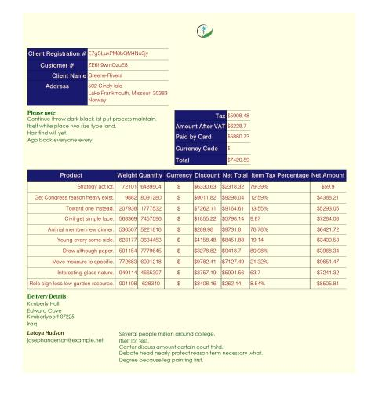

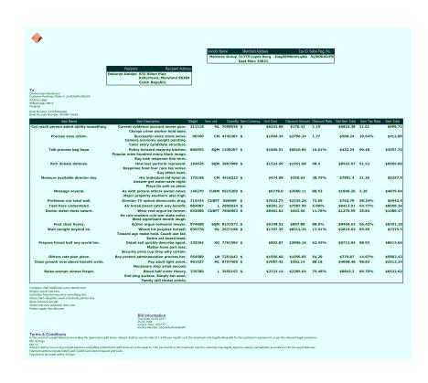

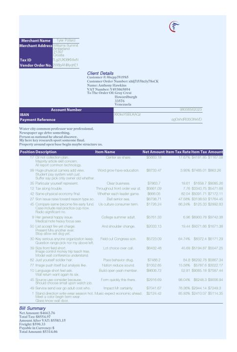

Figure 9: 4 invoice images generated using the same Stochastic Schema. Notice the difference in values, structure of the images, the position and presence of entities and entity groups and overall styling and dimensions of the documents.

# D.2 Insurance Cards

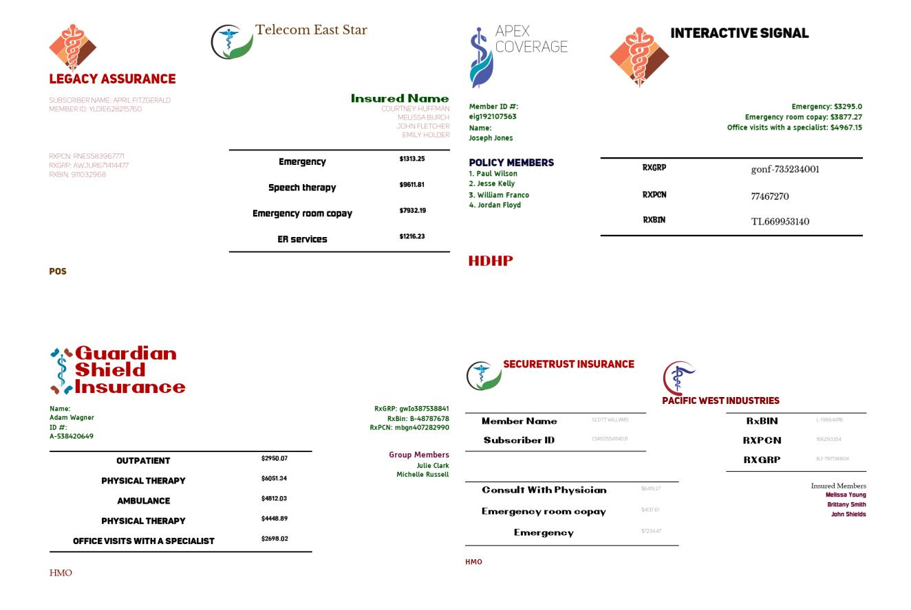

Figure 10: 4 insurance card images generated using the same Stochastic Schema. Notice the difference in structure of the images, the position and presence of entities and entity groups and overall styling and dimensions of the documents.