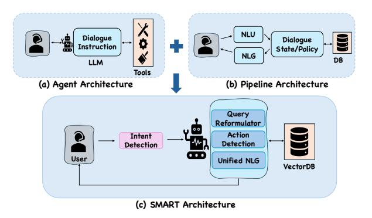
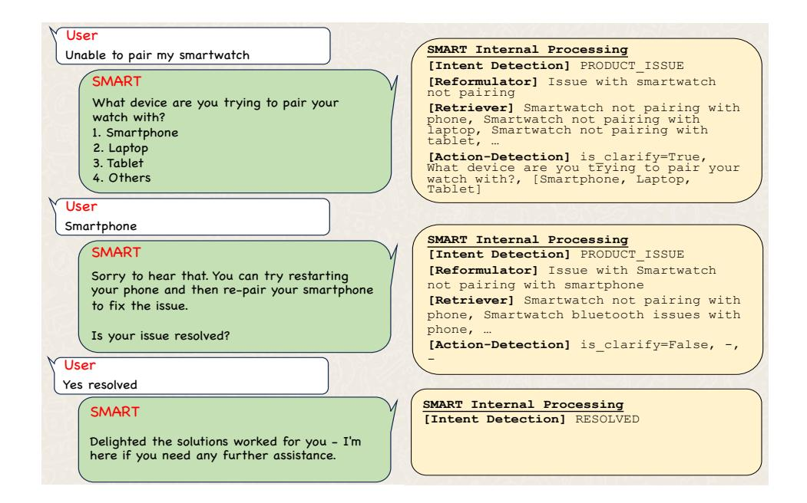

# SMART: Scalable Multilingual Approach for a Robust TOD System

#### Karan Malhotra\* , Arihant Jain\* , Purav Aggarwal, Anoop Saladi Amazon

{kamlhtra, arihanta, aggap, saladias}@amazon.com

# Abstract

Task-Oriented Dialogue (TOD) systems have become increasingly important for real-world applications, yet existing frameworks face significant challenges in handling unstructured information, providing multilingual support, and engaging proactively. We propose SMART (Scalable Multilingual Approach for a Robust TOD System), a novel TOD framework that effectively addresses these limitations. SMART combines traditional pipeline elements with modern agent-based approaches, featuring a simplified dialogue state, intelligent clarification mechanisms, and a unified natural language generation component that eliminates response redundancy. Through comprehensive evaluation on troubleshooting and medical domains, we demonstrate that SMART outperforms baseline systems across key metrics. The system's modular approach enables efficient scaling to new languages, as demonstrated through Spanish and Arabic languages. Integration of SMART in an e-commerce store resulted in reduction in product return rates, highlighting its industry impact. Our results establish SMART as an effective approach for building robust, scalable TOD systems that meet real-world requirements.

# 1 Introduction

Task-Oriented Dialogue (TOD) systems [\(Xu et al.,](#page-7-0) [2024;](#page-7-0) [Hudecek and Dušek](#page-6-0) ˇ , [2023\)](#page-6-0) have evolved significantly in recent years, becoming increasingly crucial in human-computer interaction scenarios like customer service, healthcare, and hotel booking [\(Valizadeh and Parde,](#page-7-1) [2022;](#page-7-1) [Rastogi](#page-6-1) [et al.,](#page-6-1) [2020;](#page-6-1) [Dam et al.,](#page-6-2) [2024\)](#page-6-2). While Large Language Models (LLMs) [\(OpenAI et al.,](#page-6-3) [2024;](#page-6-3) [Zhao](#page-7-2) [et al.,](#page-7-2) [2025\)](#page-7-2) have enhanced natural language understanding and generation capabilities, existing TOD frameworks still face challenges in handling unstructured information, providing multilingual

<span id="page-0-0"></span>

Figure 1: SMART combines traditional pipeline TOD systems with modern agent-based approaches, creating a robust and flexible system that leverages the strengths of both to enhance TOD capabilities.

support, and engaging proactively [\(Zhang et al.,](#page-7-3) [2020;](#page-7-3) [Dong et al.,](#page-6-4) [2025\)](#page-6-4).

Current TOD approachs typically employ complex pipelines that, while functional, limit scalability and adaptability across different domains and languages [\(Li et al.,](#page-6-5) [2024\)](#page-6-5). These systems often face difficulties in maintaining contextual awareness, generating appropriate responses, and effectively managing duplicate solutions. Additionally, existing frameworks frequently lack robust mechanisms for handling ambiguous user inputs and managing clarification workflows effectively.

To address these challenges, we introduce SMART (Scalable Multilingual Approach for a Robust TOD System), a novel and highly scalable proactive TOD system that combines traditional pipeline elements with modern agent-based approaches as shown in Figure [1,](#page-0-0) featuring simplified dialogue state, clarification mechanisms, and a unified natural language generation. The key contributions of our work are as follows:

• Simplified approach for processing unstructured information with action detection and unified NLG modules. (Sec. [3\)](#page-1-0)

<sup>\*</sup>These authors contributed equally to this work.

<span id="page-1-1"></span>

| System Aspect           |   | Pipeline (Wu et al., 2019) Causal (Hosseini-Asl et al., 2022) Agentic (Xu et al., 2024) |   | SMART |
|-------------------------|---|-----------------------------------------------------------------------------------------|---|-------|
| Proactive Clarification | ✗ | ✗                                                                                       | ✓ | ✓     |
| Response De-Duplicate   | ✗ | ✗                                                                                       | ✗ | ✓     |
| Multilingual Support    | ✗ | ✗                                                                                       | ✓ | ✓     |
| Fine-tuned NLU          | ✓ | ✗                                                                                       | ✗ | ✓     |
| Simplified DST          | ✗ | ✓                                                                                       | - | ✓     |

Table 1: Comparison of TOD approaches. ✓: supported, ✗: not supported, ✓: partial available, -: not available.

- Extensive module-level evaluation of each TOD component. (Sec. [5\)](#page-4-0)
- Scalable design enabling rapid development across languages and domains. (Sec. [6\)](#page-5-0)
- Application of SMART to e-commerce store to demonstrate industry application. (Sec. [7\)](#page-5-1)

# 2 Related Work

TOD systems have evolved significantly over the years, with approaches falling into three main categories: (1) Pipeline-based, (2) Causal-based, and (3) Agentic-based. Pipeline approaches, the earliest paradigm, such as [Wu et al.](#page-7-4) [\(2019\)](#page-7-4); [Zhang et al.](#page-7-3) [\(2020\)](#page-7-3) employed a modular architecture consisting of distinct components for natural language understanding (NLU), dialogue state tracking (DST), policy learning, and natural language generation (NLG). While effective, these systems often suffered from error propagation between modules. The field then progressed towards causal-based, end-to-end TOD systems [\(Yang et al.,](#page-7-5) [2021;](#page-7-5) [Sun](#page-7-6) [et al.,](#page-7-6) [2023;](#page-7-6) [Hosseini-Asl et al.,](#page-6-6) [2022\)](#page-6-6), which unified these components into a single jointly trained model. This integration helped reduce error propagation and simplified the overall system, leading to improved performance and easier maintenance.

The emergence of LLMs [\(Touvron et al.,](#page-7-7) [2023;](#page-7-7) [OpenAI et al.,](#page-6-3) [2024;](#page-6-3) [Zhao et al.,](#page-7-2) [2025\)](#page-7-2) has further transformed TOD systems, giving rise to agentic approaches. These methods leverage the broad knowledge and capabilities of LLMs to create more flexible and powerful TOD systems. Recent agentic works like AutoTOD [\(Xu et al.,](#page-7-0) [2024\)](#page-7-0) and Fnc-TOD [\(Li et al.,](#page-6-5) [2024\)](#page-6-5) demonstrate that complex traditional modules can be replaced by instructiontuned LLMs with simple schemas, significantly simplifying system design. Proactive TOD systems, such as ProTOD [\(Dong et al.,](#page-6-4) [2025\)](#page-6-4), addresses key limitations including single-turn retrieval, simple dialogue policies, and limited evaluation metrics.

# 2.1 Limitations of existing frameworks

We conducted a comprehensive comparison of existing TOD frameworks and our SMART approach. Table [1](#page-1-1) illustrates how SMART addresses the limitations of current approaches while maintaining their strengths. The comparison focuses on following key system aspects:

- Proactive Clarification: The ability to ask clarifications whenever needed.
- Response De-Duplication: Eliminating redundant responses in the dialogue flow.
- Multilingual Support: Capability to handle multiple languages.
- Fine-tuned NLU: Utilization of fine-tuned NLU components.
- Simplified DST: Implementation of a simplified Dialogue State Tracking mechanism.

As evident from Table [1,](#page-1-1) SMART outperforms existing frameworks across all evaluated aspects. While the Pipeline approach excels in fine-tuned NLU and the Causal approach offers simplified DST, SMART incorporates these strengths while addressing their limitations. Notably, SMART is the only system to fully support proactive clarification, response de-duplication, and efficient multilingual scaling.

# <span id="page-1-0"></span>3 Proposed SMART Method

Figure [1](#page-0-0) illustrates the SMART approach, which smartly combines elements from both traditional pipeline TOD systems and modern agent-based approaches. This hybrid approach leverages the strengths of both paradigms to create a more robust and flexible system.

## <span id="page-1-2"></span>3.1 Unstructured Knowledge Base

A TOD system requires a domain-specific knowledge base to provide up-to-date information to users. We construct our knowledge base by first sourcing the unstructured domain specific content.

## <span id="page-2-0"></span>Algorithm 1 Proposed SMART Method (Sec. 3)

```
Input: Chat History H, User Query Q, Vector DB \mathcal{V}, Domain D
Output: Response R
 1: I \leftarrow \text{Intent-Detection}(H, Q, D)
                                                                                                       ⊳ Get the user intent
 2: if I is issue then
                                                                                ▶ If the user query is related to an issue
         \hat{Q} \leftarrow \text{Reformulator}(H, Q)
                                                                                            ⊳ Reformulate the user query
         \mathcal{C} \leftarrow \text{Retriever}(\hat{Q}, \mathcal{V})
                                                                                           > Retrieve the relevant chunks
 4:
         is\_clarify, question, options \leftarrow Action-Detection(\hat{Q}, \mathcal{C})
 5:
         if is\_clarify = TRUE then
                                                                                       ▷ Check if clarification is needed
 6:
              R \leftarrow \text{Display } question \text{ and } options \text{ to user}
                                                                             ▶ Show clarification question and options
 7:
 8:
 9:
              R \leftarrow \text{Unified-NLG}(I, \mathcal{C})
                                                                                       ▶ Provide solutions using chunks
         end if
10:
11: else
          R \leftarrow \text{Unified-NLG}(I)
                                                                              ▶ Provide coherent response basis intent
12.
13: end if
14: return R
                                                                                               ▶ Return the final response
```

We then employ AutoChunker (Jain et al., 2025b) that uses an LLM based bottom-up approach to intelligently chunk the content while preserving context and eliminate noise. The resulting chunks are embedded using an embedding model and stored in a scalable vectorDB for efficient similarity search. During retrieval, when a user query is received, we compute the cosine similarity between the query embedding and the stored chunk embeddings, returning the top-k most similar chunks.

#### 3.2 Intent Detection

Intent detection is a key component of a TOD system. Our module takes three key inputs: the conversation history, the user's most recent utterance, and the relevant domain information (such as user product details in troubleshooting domain), as outlined in Algorithm 1 (Line 1). By incorporating domain-specific information alongside conversational context, the system achieves more accurate intent recognition. While this can be implemented using an LLM with prompt 1 in Appendix A, such approaches often struggle to meet industry latency needs.

To address the latency challenge while maintaining high accuracy, we employed an intent detection model built upon ModernBERT (Warner et al., 2024), an enhanced variant of BERT (Devlin et al., 2019) that supports extended context lengths of up to 8192 tokens. The model is finetuned through supervised learning using a dataset of domain-specific conversations and intents.

#### 3.3 Query Reformulation and Retriever

After intent detection, certain intents trigger the retrieval of domain-specific information from the VectorDB. To enhance the retrieval process, we employ an LLM based reformulator with prompt 2 in Appendix A. This component takes the chat context and domain context as that of intent detection module and generate a refined query more suitable for document retrieval. The reformulation process is shown in Algorithm 1 (Line 3).

Our reformulator transforms the input into a more precise and context-aware query, which is then used to search for relevant chunks in the VectorDB, as outlined in Algorithm 1 (Line 4). This approach significantly improves retrieval accuracy, ensuring that the TOD system can access and utilize the right information from the knowledge base.

#### 3.4 Action Detection

Once the system retrieves relevant content, it can proceed to response generation. However, for vague or ambiguous user queries, it is recommended to have a clarification strategy. This approach involves asking targeted questions to gather additional context before providing a response, ultimately leading to more accurate and helpful answers.

To achieve this, we introduce an action detection module, which serves as a critical decision-making component in the TOD system. This module is implemented using an LLM with prompt 3 in Appendix A, as shown in Algorithm 1 (Line 5-7). Its

primary function is to analyze the retrieved content and the user's query, determining whether clarification is needed or if the system can proceed directly to response generation. When clarification is necessary, the action detection module also generates appropriate question and response options.

# 3.5 Unified NLG Layer

We employ a unified Natural Language Generation (NLG) layer powered by a LLM with prompt [4](#page-9-0) in Appendix [A](#page-7-9) to generate the final response. This layer adapts its functionality based on the query type and intent:

- For solution-oriented queries, it utilizes relevant text chunks to generate solutions.
- For queries requiring coherent responses without specific solutions, it leverages the detected intent to produce appropriate replies.

The choice between these modes is determined by detected intent, ensuring tailored responses for each query type, as shown in Algorithm [1](#page-2-0) (Line 9-12).

### 3.5.1 Solution De-Duplication in Multi-Turn

In TODs, presenting multiple unique solutions across different turns is crucial. To prevent redundancy, we can repeatedly prompt the LLM to generate new solutions excluding previous ones. However, it is a challenging task that is prone to generating duplicate solution in later turns. Instead, we leverage the LLM's ability to generate multiple solutions in a single pass as it will generate fewer duplicate solutions.

We implement this setup by (a) Using a consistent prompt for the LLM, (b) Interrupting generation after each solution is provided, (c) Continuing generation from the same LLM instance if the previous solution does not works out for the user, and (d) Repeating this process until the issue is resolved or a predefined solution limit is reached. This approach reduces the likelihood of duplicate solutions while maintaining the flow of the conversation.

# 4 Experimental Setup

## 4.1 Datasets

Following [Sahay et al.](#page-6-9) [\(2025\)](#page-6-9), we evaluate our approach on two distinct domains: (1) For the Troubleshooting domain, the knowledge base is built using historical customer-reported issues from an e-commerce store, supplemented with domain

knowledge extracted from user guides and product manuals. Due to proprietary constraints, we utilize a sampled subset of data from a real-world e-commerce store to mitigate any risks associated with sensitive information. (2) For the Medical domain, we treat patient symptoms as user issues and corresponding treatments as solutions. The user symptoms are sourced from [Kaggle](#page-6-10) [\(2016\)](#page-6-10) and the domain knowledge is sourced from the dataset introduced in [Shah et al.](#page-7-11) [\(2021b](#page-7-11)[,a\)](#page-7-12).

We utilized these data sources for the building the knowledge base as described in Sec[.3.1](#page-1-2) using *cohere.embed-multilingual-v3* [\(Cohere,](#page-6-11) [2023\)](#page-6-11) as the embedding model. Table [8](#page-11-0) in Appendix [C](#page-11-1) summarizes the details of the datasets and relevant statistics from the knowledge base, including the number of chunks and issues.

## 4.2 Evaluation setup

We employed the AutoEval-ToD framework [\(Jain](#page-6-12) [et al.,](#page-6-12) [2025a\)](#page-6-12) for comprehensive automated evaluation of TOD systems. This approach simulates diverse user interactions across various scenarios, generating extensive conversations based on seed issues. Throughout these simulations, we collected detailed data and metadata at each turn, enabling a thorough analysis of the TOD performance. We then independently evaluated key components using focused datasets tailored to each module. We utilized *claude-3-sonnet* [\(Anthropic,](#page-6-13) [2023\)](#page-6-13) to run our AutoEval-ToD based evaluation metrics.

## 4.3 Baselines and Implementation

We evaluate SMART against a baseline system based on AutoTOD [\(Xu et al.,](#page-7-0) [2024\)](#page-7-0) across multiple TOD domains. Both systems use *claude-3 haiku* [\(Anthropic,](#page-6-13) [2023\)](#page-6-13) as the underlying model and the same knowledge base to ensure fair comparison. The baseline employs an agentic Retrieval-Augmented Generation (RAG) [\(Lewis et al.,](#page-6-14) [2020\)](#page-6-14) approach for all conversation aspects. For intent detection, SMART uses a fine-tuned ModernBERT [\(Warner et al.,](#page-7-10) [2024\)](#page-7-10) model (details in Appendix [B\)](#page-10-0). Pipeline and causal approaches are excluded from our comparison due to (1) their reliance on domain-specific data which are not readily available, and (2) their decreasing prevalence in the current LLM-dominated landscape.

<span id="page-4-1"></span>

| Models          | Prec. | Rec.  | F1    | Latency |
|-----------------|-------|-------|-------|---------|
| claude-3-haiku  | 0.846 | 0.817 | 0.808 | 2.25s   |
| claude-3-sonnet | 0.889 | 0.864 | 0.865 | 5.31s   |
| ModernBERT      | 0.891 | 0.881 | 0.884 | 110ms   |

Table 2: Experimental results comparing intent detection performance on Troubleshooting domain.

<span id="page-4-2"></span>

| <b>Evaluation Criteria</b> | Human | LLM   |
|----------------------------|-------|-------|
| Query Correctness          | 0.872 | 0.928 |
| Information Retention      | 0.844 | 0.908 |
| Context Relevance          | 0.816 | 0.912 |

Table 3: Evaluation of SMART's query reformulation quality in the Troubleshooting domain by human and LLM judges. Scores range from 0 to 1, where higher scores indicate better performance.

### <span id="page-4-0"></span>5 Results and Analysis

#### 5.1 Intent Detection

We evaluate our fine-tuned ModernBERT model against LLM-based approaches using *claude-3-haiku* and *claude-3-sonnet* with prompt 1. Our test set comprises manually labeled utterances from simulated conversations, using different seed issues than the training set to ensure robust evaluation. Table 2 shows that ModernBERT outperforms LLM-based approaches in Precision, Recall, and F1-score. Notably, it achieves 20x faster inference time compared to *claude-3-haiku*, demonstrating that fine-tuned smaller models can match or exceed LLM performance for certain tasks.

## 5.2 Query Reformulation

We evaluate our query reformulation module using three key metrics assessed by both human judges and LLM-based evaluation with prompt 5 in Appendix A: (1) **Query Correctness** (0/1), measuring whether the reformulated query maintains the original intent while ensuring grammatical correctness; (2) **Information Retention** (0/1), evaluating how well essential information from the original query and chat history is preserved; and (3) **Context Relevance** (0/1), assessing the reformulation's ability to incorporate relevant contextual information while filtering out redundant details. As shown in Table 3, our system achieves strong performance across all three metrics in both human and LLM evaluations.

#### 5.3 Retriever

We evaluate the retriever performance of our TOD systems using HitRate@k as proposed by Jain et al. (2025a), measuring the proportion of times the correct chunk is retrieved within the top k results

<span id="page-4-3"></span>

| Metric    | Turn #1 | Turn #2 | Turn #3 |
|-----------|---------|---------|---------|
| HitRate@1 | 0.35    | 0.41    | 0.45    |
| HitRate@3 | 0.51    | 0.57    | 0.61    |
| HitRate@5 | 0.56    | 0.62    | 0.66    |

Table 4: Experimental results comparing retriever performance across turns on Troubleshooting domain.

<span id="page-4-4"></span>

| <b>Response Quality Metrics</b> | AutoTOD | SMART |
|---------------------------------|---------|-------|
| Response Factuality (†)         | 0.670   | 0.744 |
| Solution Redundancy (↓)         | 0.151   | 0.049 |
| Solution Relevance (†)          | 0.897   | 0.963 |
| Safety Compliance (†)           | 0.975   | 0.984 |

Table 5: Comparison of response quality metrics between baseline AutoTOD and SMART on Troubleshooting domain. Higher scores are better for all metrics except Solution Redundancy, where lower scores indicate better performance.

across multiple turns. Table 4 presents the retriever performance across three turns, demonstrating consistent improvement with each subsequent turn. We observe a significant improvement in HitRate@5 from 0.56 in Turn #1 to 0.66 in Turn #3, representing a 17.9% relative increase. This enhancement suggests that our multi-turn clarification approach, implemented using Action Detection, effectively refines the retrieval process. Here, Turn #1 performance is comparable to the AutoTOD baseline, which does not include clarification turns.

#### 5.4 Action Detection

To assess the effectiveness of the Action Detection Module, we conducted a comprehensive evaluation using human annotators, focusing on three key metrics: (1) Clarification Accuracy measures the module's ability to correctly identify when clarification is needed, (2) **Question Correctness** evaluates the appropriateness of the generated clarification questions, and (3) **Option Relevancy** assesses whether the provided options are pertinent to the query. Human annotators were presented with retrieved chunks, user reformulated queries, and the module's output (is\_clarify, question, and options). They evaluated these metrics on binary scale where higher score indicate better performance. The results demonstrated strong performance across all metrics, with Clarification Accuracy scoring 0.81, Question Correctness achieving 0.92, and Option Relevancy reaching 0.89 on average. These findings suggest that the Action Detection Module is effective in identifying when clarification is needed and in generating relevant questions and options.

#### <span id="page-5-2"></span>5.5 Unified NLG

We evaluate our unified NLG module's effectiveness across multiple quality dimensions using LLM-based evaluation with prompt 6, 7 and 8 in Appendix A, comparing our SMART's final responses against the AutoTOD baseline. Our evaluation framework focuses on four critical aspects of response generation: (1) Response Factuality measures how well the generated responses align with the knowledge base information, ensuring responses are grounded in the context retrieved, (2) **Solution Redundancy** quantifies the system's ability to avoid duplicate solutions within conversations, with lower scores indicating better performance, (3) Solution Relevance evaluates how well the generated solutions address the specific user issues, with higher scores indicating more contextually appropriate and helpful responses, and (4) Safety Compliance measures the system's ability to generate responses that adhere to safety guidelines and avoid potentially risky solutions.

As shown in Table 5, SMART consistently outperforms AutoTOD across metrics, demonstrating the effectiveness of our unified NLG approach in generating high-quality, relevant, and non-redundant responses while maintaining safety standards. Our system achieves a significantly lower redundancy rate compared to AutoTOD, indicating non-repetitive responses. Additionally, SMART shows higher scores in Response Factuality, Solution Relevance, and Safety Compliance, further highlighting its superior performance in generating relevant and safe responses. A SMART's example conversation is shown in Figure 2.

## <span id="page-5-0"></span>**6** Scaling Results and Analysis

#### 6.1 Scale to different languages

We demonstrate SMART's multilingual capabilities by extending it to Spanish and Arabic in the troubleshooting domain, requiring minimal modifications to the system approach (Intent Detection, Unified NLG and output question-options of Action Detection). To evaluate multilingual performance, we utilized the metric, Language Correctness, which measures the grammatical accuracy and natural flow of responses in each target language. We also assess performance on the metrics as described in Sec. 5.5. As shown in Table 6, SMART is able to maintain performance levels across Spanish and Arabic. The high Lan-

<span id="page-5-3"></span>

| <b>Response Quality Metrics</b> | Arabic | Spanish |
|---------------------------------|--------|---------|
| Response Factuality (†)         | 0.768  | 0.716   |
| Solution Redundancy (↓)         | 0.050  | 0.013   |
| Solution Relevance (†)          | 0.946  | 0.914   |
| Safety Compliance (↑)           | 0.966  | 0.935   |
| Language Correctness (†)        | 0.985  | 0.940   |

Table 6: SMART Multilingual performance in Troubleshooting domain for Spanish and Arabic.

<span id="page-5-4"></span>

| Response Quality Metrics | AutoTOD | SMART |
|--------------------------|---------|-------|
| Response Factuality (†)  | 0.686   | 0.792 |
| Solution Redundancy (↓)  | 0.240   | 0.020 |
| Solution Relevance (↑)   | 0.823   | 0.986 |
| Safety Compliance (†)    | 0.990   | 0.991 |

Table 7: Comparison of response quality metrics between baseline AutoTOD and SMART system on Medical domain. Higher scores are better for all metrics except Solution Redundancy, where lower scores indicate better performance.

guage Correctness scores demonstrate the system's adaptability to generate linguistically appropriate responses.

#### 6.2 Scale to different domain

To showcase SMART's adaptability across domains, we integrated it with medical domain data and evaluated its performance using the metrics described in Sec.5.5. Table 7 presents a comparison between the baseline AutoTOD and SMART on medical domain tasks. The results demonstrate SMART's superior performance in key areas indicating its ability to provide medical solutions.

#### <span id="page-5-1"></span>7 Industrial Impact

The integration of our SMART-based TOD system, focused on the Troubleshooting domain (example conversation in Figure 2), into an online multi-marketplace e-commerce store gives an estimated reduction of 27 basis points (bps) in product return rates. This improvement is primarily attributed to the system's scalability across multiple marketplaces and its ability to provide more contextually relevant responses to customer queries through improved clarification questions, leading to better post-purchase support.

## 8 Conclusion

We presented SMART, a novel TOD system that effectively combines traditional pipeline with modern agent-based approaches to address key limitations in existing frameworks. Through comprehensive evaluation, we demonstrated SMART's su-

perior performance across multiple metrics. The system's modular design enables efficient scaling to new languages and domains as shown through Spanish and Arabic languages and medical domain application. The practical impact of SMART is evidenced by its testing in an e-commerce setting, where it contributed to a reduction in product return rates. SMART establishes a new standard for building robust, scalable TOD systems that meet real-world requirements.

# Limitations

Although SMART shows significant improvements in handling unstructured information and multilingual support, it has certain limitations that require future improvements:

Limited LLM Diversity: Our evaluation focuses primarily on Claude models due to their favorable cost-performance trade-off. While GPT-4 and other advanced models could provide additional insights, their higher computational costs made extensive experimentation less practical for our study.

Domain Focus: While effective in problemsolving domains like troubleshooting and medical support, SMART's capabilities in discovery-based scenarios like hotel booking or other online shopping remain unexplored.

These limitations highlight opportunities for future research to expand SMART's applicability and robustness across different models and domains.

# References

<span id="page-6-13"></span>Anthropic. 2023. The claude 3 model family: Opus, sonnet, haiku. [https://www-cdn.anthropic.com/](https://www-cdn.anthropic.com/de8ba9b01c9ab7cbabf5c33b80b7bbc618857627/Model_Card_Claude_3.pdf) [de8ba9b01c9ab7cbabf5c33b80b7bbc618857627/](https://www-cdn.anthropic.com/de8ba9b01c9ab7cbabf5c33b80b7bbc618857627/Model_Card_Claude_3.pdf) [Model\\_Card\\_Claude\\_3.pdf](https://www-cdn.anthropic.com/de8ba9b01c9ab7cbabf5c33b80b7bbc618857627/Model_Card_Claude_3.pdf).

<span id="page-6-11"></span>Cohere. 2023. [cohere-embed-multi.](https://huggingface.co/Cohere/Cohere-embed-multilingual-v3.0)

<span id="page-6-2"></span>Sumit Kumar Dam, Choong Seon Hong, Yu Qiao, and Chaoning Zhang. 2024. [A complete survey on llm](https://arxiv.org/abs/2406.16937)[based ai chatbots.](https://arxiv.org/abs/2406.16937) *Preprint*, arXiv:2406.16937.

<span id="page-6-8"></span>Jacob Devlin, Ming-Wei Chang, Kenton Lee, and Kristina Toutanova. 2019. [Bert: Pre-training of deep](https://arxiv.org/abs/1810.04805) [bidirectional transformers for language understand](https://arxiv.org/abs/1810.04805)[ing.](https://arxiv.org/abs/1810.04805) *Preprint*, arXiv:1810.04805.

<span id="page-6-4"></span>Wenjie Dong, Sirong Chen, and Yan Yang. 2025. [Pro-](https://aclanthology.org/2025.coling-main.614/)[TOD: Proactive task-oriented dialogue system based](https://aclanthology.org/2025.coling-main.614/) [on large language model.](https://aclanthology.org/2025.coling-main.614/) In *Proceedings of the 31st International Conference on Computational Linguistics*, pages 9147–9164, Abu Dhabi, UAE. Association for Computational Linguistics.

<span id="page-6-6"></span>Ehsan Hosseini-Asl, Bryan McCann, Chien-Sheng Wu, Semih Yavuz, and Richard Socher. 2022. [A simple](https://arxiv.org/abs/2005.00796) [language model for task-oriented dialogue.](https://arxiv.org/abs/2005.00796) *Preprint*, arXiv:2005.00796.

<span id="page-6-0"></span>Vojtech Hude ˇ cek and Ond ˇ ˇrej Dušek. 2023. [Are llms](https://arxiv.org/abs/2304.06556) [all you need for task-oriented dialogue?](https://arxiv.org/abs/2304.06556) *Preprint*, arXiv:2304.06556.

<span id="page-6-12"></span>Arihant Jain, Purav Aggarwal, Rishav Sahay, Chaosheng Dong, and Anoop Saladi. 2025a. [AutoEval-ToD: Automated evaluation of task](https://doi.org/10.18653/v1/2025.naacl-long.508)[oriented dialog systems.](https://doi.org/10.18653/v1/2025.naacl-long.508) In *Proceedings of the 2025 Conference of the Nations of the Americas Chapter of the Association for Computational Linguistics: Human Language Technologies (Volume 1: Long Papers)*, pages 10133–10148, Albuquerque, New Mexico. Association for Computational Linguistics.

<span id="page-6-7"></span>Arihant Jain, Purav Aggarwal, and Anoop S V K K Saladi. 2025b. [Autochunker: Structured text chunking](https://www.amazon.science/publications/autochunker-structured-text-chunking-and-its-evaluation) [and its evaluation.](https://www.amazon.science/publications/autochunker-structured-text-chunking-and-its-evaluation)

<span id="page-6-10"></span>Kaggle. 2016. [Symptom disease sorting.](https://www.kaggle.com/datasets/plarmuseau/sdsort)

<span id="page-6-14"></span>Patrick Lewis, Ethan Perez, Aleksandra Piktus, Fabio Petroni, Vladimir Karpukhin, Naman Goyal, Heinrich Küttler, Mike Lewis, Wen-tau Yih, Tim Rocktäschel, Sebastian Riedel, and Douwe Kiela. 2020. Retrieval-augmented generation for knowledgeintensive nlp tasks. In *Proceedings of the 34th International Conference on Neural Information Processing Systems*, NIPS '20, Red Hook, NY, USA. Curran Associates Inc.

<span id="page-6-5"></span>Zekun Li, Zhiyu Zoey Chen, Mike Ross, Patrick Huber, Seungwhan Moon, Zhaojiang Lin, Xin Luna Dong, Adithya Sagar, Xifeng Yan, and Paul A. Crook. 2024. [Large language models as zero-shot dialogue](https://arxiv.org/abs/2402.10466) [state tracker through function calling.](https://arxiv.org/abs/2402.10466) *Preprint*, arXiv:2402.10466.

<span id="page-6-3"></span>OpenAI, Josh Achiam, Steven Adler, Sandhini Agarwal, Lama Ahmad, Ilge Akkaya, Florencia Leoni Aleman, Diogo Almeida, Janko Altenschmidt, Sam Altman, Shyamal Anadkat, Red Avila, Igor Babuschkin, Suchir Balaji, Valerie Balcom, Paul Baltescu, Haiming Bao, Mohammad Bavarian, Jeff Belgum, and 262 others. 2024. [Gpt-4 technical report.](https://arxiv.org/abs/2303.08774) *Preprint*, arXiv:2303.08774.

<span id="page-6-1"></span>Abhinav Rastogi, Xiaoxue Zang, Srinivas Sunkara, Raghav Gupta, and Pranav Khaitan. 2020. [To](https://arxiv.org/abs/1909.05855)[wards scalable multi-domain conversational agents:](https://arxiv.org/abs/1909.05855) [The schema-guided dialogue dataset.](https://arxiv.org/abs/1909.05855) *Preprint*, arXiv:1909.05855.

<span id="page-6-9"></span>Rishav Sahay, Arihant Jain, Purav Aggarwal, and Anoop Saladi. 2025. [AutoKB: Automated creation of struc](https://doi.org/10.18653/v1/2025.naacl-industry.58)[tured knowledge bases for domain-specific support.](https://doi.org/10.18653/v1/2025.naacl-industry.58) In *Proceedings of the 2025 Conference of the Nations of the Americas Chapter of the Association for Computational Linguistics: Human Language Technologies (Volume 3: Industry Track)*, pages 708–723, Albuquerque, New Mexico. Association for Computational Linguistics.

<span id="page-7-12"></span>Darsh J Shah, Lili Yu, Tao Lei, and Regina Barzilay. 2021a. [Nutri-bullets: Summarizing health studies by](https://arxiv.org/abs/2103.11921) [composing segments.](https://arxiv.org/abs/2103.11921) *Preprint*, arXiv:2103.11921.

<span id="page-7-11"></span>Darsh J Shah, Lili Yu, Tao Lei, and Regina Barzilay. 2021b. [Nutribullets hybrid: Multi-document health](https://arxiv.org/abs/2104.03465) [summarization.](https://arxiv.org/abs/2104.03465) *Preprint*, arXiv:2104.03465.

<span id="page-7-6"></span>Haipeng Sun, Junwei Bao, Youzheng Wu, and Xiaodong He. 2023. [Mars: Modeling context & state represen](https://doi.org/10.18653/v1/2023.findings-acl.708)[tations with contrastive learning for end-to-end task](https://doi.org/10.18653/v1/2023.findings-acl.708)[oriented dialog.](https://doi.org/10.18653/v1/2023.findings-acl.708) In *Findings of the Association for Computational Linguistics: ACL 2023*, pages 11139– 11160, Toronto, Canada. Association for Computational Linguistics.

<span id="page-7-7"></span>Hugo Touvron, Thibaut Lavril, Gautier Izacard, Xavier Martinet, Marie-Anne Lachaux, Timothée Lacroix, Baptiste Rozière, Naman Goyal, Eric Hambro, Faisal Azhar, Aurelien Rodriguez, Armand Joulin, Edouard Grave, and Guillaume Lample. 2023. [Llama: Open](https://arxiv.org/abs/2302.13971) [and efficient foundation language models.](https://arxiv.org/abs/2302.13971) *Preprint*, arXiv:2302.13971.

<span id="page-7-1"></span>Mina Valizadeh and Natalie Parde. 2022. [The AI doctor](https://doi.org/10.18653/v1/2022.acl-long.458) [is in: A survey of task-oriented dialogue systems for](https://doi.org/10.18653/v1/2022.acl-long.458) [healthcare applications.](https://doi.org/10.18653/v1/2022.acl-long.458) In *Proceedings of the 60th Annual Meeting of the Association for Computational Linguistics (Volume 1: Long Papers)*, pages 6638– 6660, Dublin, Ireland. Association for Computational Linguistics.

<span id="page-7-10"></span>Benjamin Warner, Antoine Chaffin, Benjamin Clavié, Orion Weller, Oskar Hallström, Said Taghadouini, Alexis Gallagher, Raja Biswas, Faisal Ladhak, Tom Aarsen, Nathan Cooper, Griffin Adams, Jeremy Howard, and Iacopo Poli. 2024. [Smarter, better,](https://arxiv.org/abs/2412.13663) [faster, longer: A modern bidirectional encoder for](https://arxiv.org/abs/2412.13663) [fast, memory efficient, and long context finetuning](https://arxiv.org/abs/2412.13663) [and inference.](https://arxiv.org/abs/2412.13663) *Preprint*, arXiv:2412.13663.

<span id="page-7-13"></span>Thomas Wolf, Lysandre Debut, Victor Sanh, Julien Chaumond, Clement Delangue, Anthony Moi, Pierric Cistac, Tim Rault, Rémi Louf, Morgan Funtowicz, Joe Davison, Sam Shleifer, Patrick von Platen, Clara Ma, Yacine Jernite, Julien Plu, Canwen Xu, Teven Le Scao, Sylvain Gugger, and 3 others. 2020. [Trans](https://www.aclweb.org/anthology/2020.emnlp-demos.6)[formers: State-of-the-art natural language processing.](https://www.aclweb.org/anthology/2020.emnlp-demos.6) In *Proceedings of the 2020 Conference on Empirical Methods in Natural Language Processing: System Demonstrations*, pages 38–45, Online. Association for Computational Linguistics.

<span id="page-7-4"></span>Chien-Sheng Wu, Andrea Madotto, Ehsan Hosseini-Asl, Caiming Xiong, Richard Socher, and Pascale Fung. 2019. [Transferable multi-domain state generator for](https://doi.org/10.18653/v1/P19-1078) [task-oriented dialogue systems.](https://doi.org/10.18653/v1/P19-1078) In *Proceedings of the 57th Annual Meeting of the Association for Computational Linguistics*, pages 808–819, Florence, Italy. Association for Computational Linguistics.

<span id="page-7-0"></span>Heng-Da Xu, Xian-Ling Mao, Puhai Yang, Fanshu Sun, and Heyan Huang. 2024. [Rethinking task-oriented](https://doi.org/10.18653/v1/2024.acl-long.152) [dialogue systems: From complex modularity to zero](https://doi.org/10.18653/v1/2024.acl-long.152)[shot autonomous agent.](https://doi.org/10.18653/v1/2024.acl-long.152) In *Proceedings of the 62nd*

*Annual Meeting of the Association for Computational Linguistics (Volume 1: Long Papers)*, pages 2748– 2763, Bangkok, Thailand. Association for Computational Linguistics.

<span id="page-7-5"></span>Yunyi Yang, Yunhao Li, and Xiaojun Quan. 2021. [Ubar:](https://arxiv.org/abs/2012.03539) [Towards fully end-to-end task-oriented dialog sys](https://arxiv.org/abs/2012.03539)[tems with gpt-2.](https://arxiv.org/abs/2012.03539) *Preprint*, arXiv:2012.03539.

<span id="page-7-3"></span>Zheng Zhang, Ryuichi Takanobu, Qi Zhu, Minlie Huang, and Xiaoyan Zhu. 2020. [Recent ad](https://arxiv.org/abs/2003.07490)[vances and challenges in task-oriented dialog system.](https://arxiv.org/abs/2003.07490) *Preprint*, arXiv:2003.07490.

<span id="page-7-2"></span>Wayne Xin Zhao, Kun Zhou, Junyi Li, Tianyi Tang, Xiaolei Wang, Yupeng Hou, Yingqian Min, Beichen Zhang, Junjie Zhang, Zican Dong, Yifan Du, Chen Yang, Yushuo Chen, Zhipeng Chen, Jinhao Jiang, Ruiyang Ren, Yifan Li, Xinyu Tang, Zikang Liu, and 3 others. 2025. [A survey of large language models.](https://arxiv.org/abs/2303.18223) *Preprint*, arXiv:2303.18223.

# <span id="page-7-9"></span>A Prompts

## A.1 Intent Detection Prompt

The prompt [1](#page-7-8) instructs the LLM to analyze user utterances within the complete conversation context while considering domain-specific information. It requires inputs including conversation history, current user utterance, domain context, and available intents with definitions. The output format mandates explicit thinking followed by predicted intent.

## <span id="page-7-8"></span>Prompt 1: Intent Detection Prompt

You are an intent classifier for {domain} support. Your task is to identify the intent of the latest user utterance from the list of intents provided in the input.

You will receive the following inputs:

1.Conversation History: Previous exchanges between user and assistant.

2.Latest Utterance: Current message from user

3.Domain Context: Domain-specific information (e.g., product details for troubleshooting, patient history for medical)

4.Available Intents: List of possible intents with definitions

#### **Output Guidelines:**

Your response MUST contain:

<thinking> Analyze the latest utterance in context of the conversation.

Consider domain-specific terminology and context.

<response>

intent: Primary intent from available options

Response must follow the format:

<response>

<thinking>[Analysis]</thinking>

```
<intent>[intent]</intent>
</response>
Input:
conversation_history:
{conversation_history}
latest_utterance: {latest_utterance}
domain_context: {domain_context}
available_intents: {domain_intents}
```

# A.2 Query Reformulation Prompt

The query reformulation prompt [2](#page-8-0) helps the LLM create clear, focused queries from user conversations. It combines the conversation history, current utterance, and domain information to create a single, well-formed query. The prompt ensures that the reformulated query keeps the main user issue while adding useful context from the conversation.

# <span id="page-8-0"></span>Prompt 2: Query Reformulation Prompt You are an AI assistant for {domain} support. Your task is to generate a reformulated query that effectively summarizes the user's issue based on the conversation context. **Input: conversation\_history:** {conversation\_history} **latest\_utterance:** {latest\_utterance} **domain\_information:** {domain} **context:** {context} **Output Guidelines:** Your response MUST contain: <thinking> - Brief analysis of your reformulation strategy (2-3 sentences) -Analyze the conversation context and latest utterance -Consider key information from domain context <reformulated\_query> -Generate a concise, one-sentence query -Maintain the core meaning of the user's issue -Include relevant context from the conversation -Always provide the query in English Never provide solutions or troubleshooting steps; focus only on query reformulation

# A.3 Action Detection Prompt

The action detection prompt [3](#page-8-1) helps to decide what to do next in a conversation. It checks if it need more information from the user or if it can move forward with a solution. The prompt helps create clear questions when needed and provides simple options for users to choose from. It also includes examples to show how to handle different types of conversations effectively.

## <span id="page-8-1"></span>Prompt 3: Action Detection Prompt

You are an AI assistant for {domain} support. Your task is to analyze the inputs to determine the optimal next action for domain support resolution based on the context.

You will receive the following inputs:

- 1.Conversation History: Previous exchanges between the user and assistant
- 2.User Input: The current message from the user
- 3.Domain Information: Relevant details about the domain
- 4.Context: Additional relevant information containing solutions for domain queries

#### **Guidelines:**

Your response MUST contain:

- 1. <thinking> Brief analysis justifying your action choice (2-3 sentences maximum)
- First check if the user's description lacks specific details or attributes about their query
- Do not ask for information already present in the context
- Only ask questions relevant to resolving the user's query in the domain context
- 2. <action> Single selected action in uppercase from:
- CLARIFICATION\_NEEDED: When additional specific information is needed
- NO\_CLARIFICATION\_NEEDED: When sufficient information is available
- 3. <question> (When clarification is needed)
- Keep it short and natural, limited to 1 sentence
- Do not include options in the question
- 4. <options> (When presenting choices) List of 2-3 specific response options in <option> tags
- 5. Never provide direct solutions or advice

```
{ICL_examples}
Input:
conversation_history:
{conversation_history}
user_input: {user_input}
domain_information: {domain}
context: {context}
```

## A.4 Unified NLG Prompt

Few Examples are:

The Unified NLG prompt [4](#page-9-0) guides the LLM in processing inputs that are conversation history, customer query, domain, context (chunks), and intent. This prompt employs specific formatting rules, notably the use of numbered solution tags

(<sN>...</sN>), to structure and delineate multiple solutions within a single response. These tags serve as control mechanisms, allowing the LLM to pause after each solution and continue with subsequent ones. For non-solution responses, the prompt enforces concise answers limited to 20 words.

## Prompt 4: Unified NLG Prompt

<span id="page-9-0"></span>You are an AI customer support assistant. Your task is to provide helpful, accurate responses to customer inquiries about their product based on the information provided.

#### <input>

You will receive the following inputs:

- 1. History: Previous exchanges between the customer and assistant
- 2. Customer Input: The current message from the customer
- 3. Domain Information: Relevant details about the domain
- 4. Context: Additional relevant information containing solutions for troubleshooting
- 5. Intent: The intent of the customer input </input>

#### **Output Guidelines:**

- Provide a solution or a coherent response based on intent. If the intent is related to issue, then provide solution, else provide a coherent response.
- In case of providing solutions to customers, end each solution should be enclosed within a tag like that "<sN> ... </sN>" where N is the solution number. Provide a brief numbered summary of each solution with title of each solution in \*\*..\*\* format. And only show a maximum of 3 solutions at a time. Adhere to this structure when providing and solution or steps.
- Ask for confirmation in terms of Yes-No question if the solution is offered
- If the solutions are not provided, keep your responses short and crisp and to the point, preferably under 20 words.

#### **Input:**

# **conversation\_history:**

{conversation\_history}

**intent:** {intent}

**customer\_input:** {customer\_input} **domain:** {domain} **context:** {context}

## A.5 Query Reformulation Evaluation Prompt

The query reformulation evaluation prompt [5](#page-9-1) evaluates input queries by looking at three aspects: if it keeps the main user question (correctness), if it includes important information (retention), and if it uses relevant context appropriately. The LLM gives

a score for each aspect and provides comments about what works well or needs improvement.

# <span id="page-9-1"></span>Prompt 5: Query Reformulator Evaluation Prompt

You are a query reformulation evaluator for {domain} support. Your task is to assess the quality of reformulated queries.

#### **Evaluation Criteria: Query Correctness (0/1):**

- Maintains core intent
- Grammatically correct
- Avoids misinterpretation

#### **Information Retention (0/1):**

- Preserves essential information
- Incorporates conversation context
- Maintains relevant domain details

#### **Context Relevance (0/1):**

- Uses relevant context
- Appropriate domain integration
- Excludes redundant information

#### **Output Format:**

<query\_correctness>[0/1]</query\_correctness> <inf\_retention>[0/1]</inf\_retention> <context\_relevance>[0/1]</context\_relevance> <comments>[Observations]</comments>

#### **Input:**

**user\_query:** {user\_query} **chat\_history:** {chat\_history} **domain\_context:** {domain\_context} **reformulated\_query:** {reformulated\_query}

### A.6 Solution Factuality Prompt

This prompt [6](#page-9-2) checks if the input solutions are supported by the provided input context. It looks for meaningful matches between the solution and context. The LLM gives a simple pass (1) or fail (0) score based on whether it can find support for at least one key part of the solution in the context.

# <span id="page-9-2"></span>Prompt 6: Response Factuality Evaluation Prompt

You are an expert solution validator for {domain} support. Your task is to evaluate solutions for their groundedness in provided context, using lenient matching criteria.

#### **Evaluation Criteria:**

- -Use lenient matching look for conceptual alignment rather than exact matches
- -Solution is considered grounded if ANY meaningful element can be reasonably derived from context
- -Consider semantic similarities and related concepts
- -If at least one key element aligns with context, consider it grounded

# **Output Guidelines:** Your response MUST contain: <thinking> - Identify solution elements that conceptually align with context - Note semantic similarities and related concepts - Explain grounding justification <result> Score: [1 or 0] 1 = At least one meaningful element is grounded in context 0 = No elements can be reasonably derived from context **Input: context:** {context} **solution:** {solution}

### A.7 Solution Redundancy Detection Prompt

The redundancy detection prompt [7](#page-10-1) checks if the system is repeating similar solutions. It looks for matching or very similar advice across input solutions, giving a pass (1) if all solutions are unique or fail (0) if duplicates are found.

```
Prompt 7: Solution Redundancy Evaluation
                 Prompt
You are an expert duplicate solution
identifier specialized in {domain}
analysis.
Analyze the given list of {domain}
solutions and determine if there are
any duplicate or substantially similar
solutions present.
Output Guidelines:
Your response MUST contain:
<thinking>
- List identified duplicate pairs (if any)
- Explain why they are considered duplicates
- Highlight key similarities
<result> Score: [1 or 0]
1 = No duplicates found (all solutions are
unique)
0 = At least one pair of duplicate
solutions detected
Input:
solutions: {solutions_str}
```

### A.8 NLG Rules Evaluation Prompt

<span id="page-10-2"></span>The NLG response quality evaluation prompt [8](#page-10-2) checks three things: if they match what the user asked for, if they're safe to use, and if they're written correctly in the correct language. For each check, the LLM gives a score and explains the reason.

```
Prompt 8: NLG Rules Evaluation Prompt
You are a solution evaluator for {domain}
support. Your task is to assess whether
provided solutions adhere to predefined
rules.
Evaluation Rules:
Solution Relevance: Solution must directly
address the specific context mentioned in
the query
Safety Compliance: Avoid solutions that
could potentially harm users or lead to
adverse outcomes
Language Correctness: Solution
must be completely expressed in
{response_language}, following appropriate
grammar and conventions while maintaining
clarity.
<thinking>
- Brief analysis notes for each rule
- Key observations about compliance
- Potential concerns or violations
<scores>
- Score for each rule: 0 (non-compliant),
1 (compliant), or -1 (not applicable)
- English reasoning for each score
- Format: <scoreN> followed by <reasonN>
Response must be structured as:
<thinking>[Analysis]</thinking>
<scores>
<score1>[0/1/-1]</score1><reason1></reason1>
<score2>[0/1/-1]</score2><reason2></reason2>
<score3>[0/1/-1]</score3><reason3></reason3>
</scores>
Input:
```

# <span id="page-10-0"></span>B Intent Detection Fine-Tuning

**user\_query:** {query} **solution:** {solution}

The intent detection training data is created from human-vetted utterances sampled from AutoEval-ToD approach's simulated conversations that uses an LLM-based intent detection module with prompt [1.](#page-7-8) The input to ModernBERT is structured as:

$$X = [H; [SEP]; U; [SEP]; C]$$

where H represents the chat history, U is the latest utterance, and C is the context (product details for troubleshooting domain, medical information for medical domain). This structured input ensures the model has access to all relevant information while maintaining clear boundaries between different information types. We utilize transformers [\(Wolf](#page-7-13) [et al.,](#page-7-13) [2020\)](#page-7-13) library to fine-tune this with batch size of 4, max token length as 8192, and fine-tuning for 5 epochs. The troubleshooting set had 18 intents

<span id="page-11-2"></span>

Figure 2: Example conversation demonstrating SMART's key capabilities: (a) Initial intent detection from user query, (b) Intelligent clarification to gather missing context, (c) Enhanced retrieval based on clarified information, and (d) NLG of a deduplicated, contextually appropriate solution. This showcases SMART's ability to manage complex troubleshooting scenarios through a systematic, user-friendly approach.

(46K samples), and the medical set had 6 intents (15K samples).

## <span id="page-11-1"></span>C Additional Figures and Tables

Table 8 summarizes the details of the datasets and relevant statistics from the knowledge base, including the number of chunks and issues. Figure 2 showcases an example conversation demonstrating SMART approach for a customer issue.

#### D Human Annotation Documentation

Following Jain et al. (2025a), we implemented a rigorous human evaluation process to validate the quality and reliability of our data annotations. We recruited general experts who met specific language proficiency criteria and domain knowledge requirements. Annotators were provided with detailed guidelines and the exact instructions mentioned in the different prompts, ensuring consistency between human and LLM evaluations. For example, in the Action Detection task, human expert annotators were asked to annotate the module output using the same instructions outlined in the prompt 3. We followed the standard protocol to measure inter-annotator agreement by performing dual annotations on a sample set of 10% of the data. We observed an agreement rate of 97%, demonstrating the consistency of our annotations across all domains.

<span id="page-11-0"></span>

| KB Statistics    | Troubleshooting | Medical |
|------------------|-----------------|---------|
| Number of Chunks | 2595            | 5196    |
| Number of Issues | 482             | 866     |

Table 8: Knowledge base (KB) statistics for Troubleshooting and Medical domains.