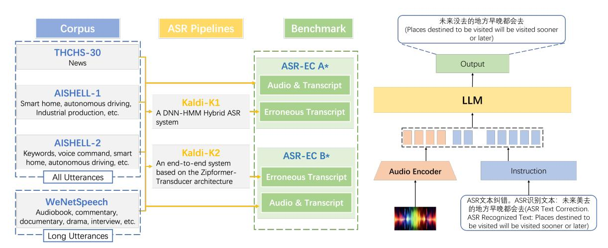

# ASR-EC Benchmark: Evaluating Large Language Models on Chinese ASR Error Correction

Victor Junqiu Wei1 , Weicheng Wang2∗ , Di Jiang3 , Yuanfeng Song4 , Lu Wang5

Macau University of Science and Technology, Macau, China The Chinese University of Hong Kong, Hong Kong, China The Hong Kong Polytechnic University, Hong Kong, China AI Group, WeBank Co., Ltd, Shenzhen, China Shenzhen University, Shenzhen, China [weichengwang@cuhk.edu.hk](mailto:weichengwang@cuhk.edu.hk)

### Abstract

Automatic Speech Recognition (ASR) is a fundamental and important task in the field of speech and natural language processing. It is an inherent building block in many applications such as voice assistant, speech translation, etc. Despite the advancement of ASR technologies in recent years, it is still inevitable for modern ASR systems to have a substantial number of erroneous recognitions due to environmental noise, ambiguity, etc. Therefore, the error correction in ASR is crucial.

Motivated by this, this paper studies ASR error correction in the Chinese language, which is one of the most popular languages and enjoys a large number of users in the world. We first create a benchmark dataset named *ASR-EC* that contains a wide spectrum of ASR errors generated by industry-grade ASR systems. To the best of our knowledge, it is the first Chinese ASR error correction benchmark. Then, inspired by the recent advances in *large language models (LLMs)*, we investigate how to harness the power of LLMs to correct ASR errors. We apply LLMs to ASR error correction in three paradigms. The first paradigm is prompting, which is further categorized as zero-shot, fewshot, and multi-step. The second paradigm is finetuning, which finetunes LLMs with ASR error correction data. The third paradigm is multi-modal augmentation, which collectively utilizes the audio and ASR transcripts for error correction. Extensive experiments reveal that prompting is not effective for ASR error correction. Finetuning is effective only for a portion of LLMs. Multi-modal augmentation is the most effective method for error correction, achieving state-of-the-art performance.

### 1 Introduction

*Automatic Speech Recognition (ASR)* refers to the technology that enables computers to recognize and interpret human speech, converting it into text [\(Lu et al.,](#page-7-0) [2025\)](#page-7-0). It finds wide applications in voice assistants, speech dialogue systems, speech translations, etc. Despite significant advancements, it is still inevitable for modern ASR systems to have erroneous recognition due to environmental noise, ambiguity, etc. Thus, ASR error correction is an important problem for speech and language processing.

There are existing studies on ASR error correction. However, they mainly focus on English or other Western languages. There is a notable gap for Chinese, even though it is one of the most popular languages in the world and enjoys a large number of users. Motivated by this, in this paper, we study the ASR error correction for the Chinese language.

First, we observe that there are no existing ASR error correction datasets for Chinese. We establish a benchmark dataset for Chinese ASR error correction [\(Link,](#page-7-1) [2025\)](#page-7-1). Based on the open-source ASR toolkit Kaldi-K1 [\(Povey et al.,](#page-7-2) [2011\)](#page-7-2) and Kaldi-K2[1](#page-0-0)[2](#page-0-1) , we construct the ASR-EC benchmark by processing audio clips from THCHS-30, AISHELL-1, AISHELL-2, and WeNetSpeech. This dataset encapsulates a broad range of decoding errors and is designed to assess LLMs' capability to correct ASR mistakes across varied utterance lengths.

Second, we investigate how to utilize LLMs [\(De](#page-7-3)[vlin et al.,](#page-7-3) [2019;](#page-7-3) [Brown et al.,](#page-6-0) [2020;](#page-6-0) [Zhao et al.,](#page-8-0) [2023\)](#page-8-0) for ASR error correction in three paradigms: (1) prompting these models to act as an error correction module for existing Chinese ASR systems; (2) customizing the models to the context of the Chinese language and the ASR task with parameterefficient fine-tuning [\(Hu et al.,](#page-7-4) [2022\)](#page-7-4); (3) through multimodal augmentation, leveraging both the audio and text modalities to enhance the LLMs' understanding of the content, providing a comprehensive basis for the LLMs to detect and correct errors.

\* denotes that Weicheng Wang is the corresponding author of this research.

1 https://kaldi-asr.org/

2 https://github.com/k2-fsa/k2

Our experiments show that different strategies for applying LLMs to ASR error correction yield various degrees of effectiveness. Prompting is to correct errors by simply querying foundation models with the erroneous text. This method has proven to be ineffective and can even introduce new errors to previously correct content. This implies that, without annotated ASR error correction datasets, LLMs cannot achieve satisfactory performance even if the advanced prompting method is applied. In comparison, finetuning enables models to leverage their contextual understanding and language mastery to meaningfully refine the ASR output, correcting various decoding mistakes. Moreover, multimodal augmentation stands out as the most effective approach, significantly enhancing error correction by jointly analyzing the audio and its corresponding transcript, thereby achieving stateof-the-art performance in correcting ASR errors.

The contributions of this paper are threefold:

- We build and release a public dataset named ASR-EC for LLM-based ASR error correction. To the best of our knowledge, this is the first dataset for Chinese ASR error correction.
  We believe that this benchmark will pave the way for future studies on the Chinese ASR error correction.
- We undertake a comprehensive investigation on three paradigms for adapting LLMs to ASR error correction, namely *prompting*, *funetuning*, and *multi-modal*.
- We conducted an empirical study on these LLM-based paradigms for ASR error correction on our constructed benchmark. We found that multi-modal augmentation stands out as the best approach.

The discovery in this paper represents a promising direction to inject powerful LLMs into conventional ASR pipelines and significantly improve their performance. We have released our datasets and source code of this paper (Link, 2025).

The remainder of this paper is organized as follows. Section 2 presents the formal problem statement of ASR error correction. Section 3 reviews the related work of error correction. Section 4 demonstrates the construction of our proposed ASR-EC benchmark for Chinese ASR error correction. Sections 5, 6, and 7 present our investigated three approaches for LLM-based Chinese

ASR error correction. Section 8 presents our empirical study. Section 9 concludes this paper.

#### 2 Problem Statement

Let X be the space of all possible input audio signals, and Y be the space of all possible text transcriptions. An ASR system can be modeled as a function  $f:X\to Y$  that maps an input audio signal  $x\in X$  to a text transcription  $y\in Y$ .

Due to various factors, the output  $\hat{y} = f(x)$  may contain errors compared to the ground truth transcription. The error correction problem can be formulated as finding a correction function  $g:Y\times X\to Y$  such that the corrected transcription  $y'=g(\hat{y},x)$  minimizes the error d(y',y), where d is a distance metric between the corrected transcription and the ground truth transcription.

#### 3 Related Work

Error correction models, proposing to identify and correct inaccuracies in the text and audio, play a crucial role in Automatic Speech Recognition (ASR). Their development mirrored the advancements in Natural Language Processing (NLP).

Text Error Correction. Initially, rule-based models were predominant in error correction. These models relied on predefined rules and heuristics to correct text errors, which often limited their adaptability. The advancement of statistical models and end-to-end models marks a large leap forward (Jiang et al., 2021; Hrinchuk et al., 2020; Jiang et al., 2019; Zhao et al., 2021; Jiang et al., 2023). Instead of requiring manually defined rules, they can learn directly from data. This adaptability leads to higher accuracy and more effective error correction.

**Text and Audio Error Correction.** LLMs have shown considerable potential in error correction.

Firstly, for the text, Ma et al. (2023a) and Yang et al. (2023b) prompted and fine-tuned LLMs with ASR error correction data, transferring the knowledge learned by the large-scale pre-trained language model from vast textual data to error correction tasks. Ma et al. (2023b) studied the error correction performance of the most advanced Large Language Model (LLM) at present, Chat-GPT. Hu et al. (2024) extended generative error correction benchmarks to noisy conditions, showcasing LLMs' dual capability in denoising and error correction.

| Corpus      | Source                                                                               | Transcription    | # Hours | # Utterances | Avg Characters |  |
|-------------|--------------------------------------------------------------------------------------|------------------|---------|--------------|----------------|--|
| THCHS-30    | Recorded speech                                                                      | Manually labeled | 30      | 13,388       | 33             |  |
| AISHELL-1   | Recorded speech                                                                      | Manually labeled | 200     | 141,597      | 14             |  |
| AISHELL-2   | Recorded speech                                                                      | Manually labeled | 1,000   | 511,123      | 13             |  |
| WeNetSpeech | YouTube, Podcast                                                                     | OCR, ASR         | 1,100   | 434,781      | 38             |  |
| Corpus      | Domains                                                                              |                  |         |              |                |  |
| THCHS-30    | News                                                                                 |                  |         |              |                |  |
| AISHELL-1   | Smart home, autonomous driving, and industrial production, etc.                      |                  |         |              |                |  |
| AISHELL-2   | Keywords, voice command, smart home, autonomous driving, industrial production, etc. |                  |         |              |                |  |
| WeNetSpeech | Audiobook, commentary, documentary, drama, interview, etc.                           |                  |         |              |                |  |

Table 1: Speech Corpora Statistics

Figure 1: Pipelines for Erroneous ASR Transcripts Construction

Figure 2: ASR error correction with Multimodal model.

Secondly, for the multimodal contexts, including audio and text, the Qwen-Audio model (Chu et al., 2023) advances audio-language unders[tand](#page-7-13)[ing by pre-t](#page-7-13)raining across various tasks and audio types, leading to a versatile model that enhances multi-turn dialogues and audio-centric interactions without needing fine-tuning. Chen et al. (2024) integrates acoustic data into t[he generative error](#page-7-14) correction process, enhancing the model's ability to map from N-best ASR hypotheses to accurate transcriptions.

To the best of our knowledge, there are no existing benchmarks for Chinese ASR error correction, even though Chinese is one of the most popular languages and has a large number of users in the world. Motivated by this, this paper constructs the first Chinese ASR error correction benchmark and paves the way for future research on the ASR error correction. In addition, we systematically investigate the paradigms for the LLM-based ASR error correction, i.e., prompting-based, finetuningbased, and multi-modal paradigms. Our results

demonstrate that different paradigms yield various degrees of effectiveness and the multi-modal approach stands out as the best one. As far as we are concerned, our research work is the first one to study LLM-based ASR error correction and systematically study the paradigms of ASR error correction with LLMs.

### 4 ASR-EC Benchmark

### 4.1 Speech Corpora Collection

To build the ASR-EC benchmark, we curate four open-source Chinese speech corpora: THCHS-30 (Wang and Zhang, 2015), AISHELL-1 (Bu et al., 2017), AISHELL-2 (Du et al., 2018), and WeNet-Sp[eech \(Zhang et al.,](#page-7-15) [2022\)](#page-7-15). The charact[eristics of](#page-6-2) [these](#page-6-2) corpora are det[ailed in Table](#page-7-16) 1.

Our s[tudy leverages the](#page-7-17) datasets of AISHELL-1, AISHELL-2, and THCHS-30. [N](#page-2-1)otably, these three datasets contain a relatively low percentage of long utterances, and they are all one-sentence recognition tasks. In order to evaluate the error correction capabilities of LLMs on long utterances, we also select 434,781 audio clips whose transcripts contain more than 30 Chinese characters. Instead, WeNetSpeech contains both one-sentence recognition tasks and multi-sentence recognition tasks. Thus, WeNetSpeech contains a rather higher percentage of long utterances and is supposed to be harder than the other three datasets.

### 4.2 ASR-EC Benchmark

We adopt two well-recognized ASR pipelines, namely *Kaldi-K1* and *Kaldi-K2*, to establish the erroneous transcripts. To the best of our knowledge, they are the only two pipelines in the history of ASR systems. These two pipelines have contrasting architectures and different ASR performance. In this paper, we adopt both pipelines to create a large variety of different types of errors and different levels of difficulties in our benchmark. Kaldi-K1 (Povey et al., 2011), a DNN-HMM Hybrid ASR system, employs a multistream CNN for acoustic mo[deling and an n-gram](#page-7-2) language model formatted by FST structure. Kaldi-K2, an end-to-end system, is based on the Zipformer-Transducer architecture. Both of the two ASR pipelines are pre-trained on a 10000-hour Chinese speech corpus.

Based on the decoding results of Kaldi-K1 and Kaldi-K2, we establish two datasets in the ASR-EC. To reflect LLMs' performance on utterances of different lengths, we divide each dataset into two subsets: short utterances and long utterances. The average utterance length in the short utterance subset (resp. the long utterance subset) is about 13 characters (resp. about 38 characters). Table 2 reports the statistics of these datasets and subsets. To control the number of those with a CER of [0,](#page-4-1) only 10% of them are kept. Besides, in this table, we also consider three types of ASR errors, namely *substitution*, *deletion* and *insertion*. The percentages of the three types of error in the short, long and mixed utterances are also summarized in the table.

### 5 Prompting-based Correction

Prompting is an emerging technique for fine-tuning large language models (LLMs) in a parameterefficient way. The prompts provide soft cues to steer the model behavior towards desired tasks, without modifying the actual parameters. We introduce two prompting methods, namely direct prompting and multi-step prompting, for conducting ASR correction using LLMs. Direct prompting

encompasses both zero-shot and few-shot error correction techniques.

Zero-shot prompting. In zero-shot prompting, a prompt is presented to the model without accompanying explicit examples. The model is then anticipated to generate a response utilizing its preexisting knowledge base. This method is suitable for quick and simple tasks.

Few-shot prompting. In few-shot prompting, we provide the model with three input-output pairs as examples, enabling it to learn from this isolated input. In each input-output pair, the input is the raw ASR translated text, which may or may not contain errors, and the output is the correct transcripts without any mistakes. This technique is beneficial for ensuring that the model's output follows a specific and consistent format.

Multi-step prompting. Given that LLMs lack context or prior knowledge about the errors in the outputs of ASR systems, correcting these errors using only direct prompting can be challenging. Multistep prompting is a technique that breaks down a complex problem into smaller, manageable steps. LLMs process each of these steps sequentially to achieve the final objective. In particular, we employ a two-step prompting strategy, where the first step detects if the ASR output contains errors or not. After that, the second step will correct the errors if there are any errors detected in the first step. Otherwise, the second step simply outputs the ASR transcript.

### 6 Finetuning-based Correction

By prompting LLMs to perform ASR error correction tasks, LLMs lack a deep understanding of the task. Fine-tuning LLMs is beneficial for making them more adaptable to downstream tasks and ensuring their outputs align with expectations. Note that since full fine-tuning is time-consuming and costly, we opt for a parameter-efficient fine-tuning method. Specifically, we use the LoRA fine-tuning method, which is a breakthrough and efficient finetuning technique.

## 7 Correction based on Multimodal Augmentation

The incorporation of multimodal augmentation into ASR error correction leverages the synergy between audio and text modalities, offering a nuanced approach to identifying and correcting speech recognition errors.

|           |                     |        | Short Utter Subset | Long Utter Subset | Whole Dataset |
|-----------|---------------------|--------|--------------------|-------------------|---------------|
| ASR-EC A* | Train Set           | CER(%) | 13.49              | 12.24             | 12.45         |
|           |                     | #Utter | 186,150            | 358,400           | 544,551       |
|           | Test Set            | CER(%) | 12.83              | 11.73             | 12.42         |
|           |                     | #Utter | 1,024              | 1,024             | 1,024         |
| ASR-EC B* | Train Set           | CER(%) | 12.99              | 7.03              | 8.15          |
|           |                     | #Utter | 181,488            | 280,520           | 462,009       |
|           | Test Set            | CER(%) | 13.44              | 6.92              | 8.11          |
|           |                     | #Utter | 1,024              | 1,024             | 1,024         |
|           |                     |        | Short Utter Subset | Long Utter Subset | Whole Dataset |
| ASR-EC A* | Substitution CER(%) |        | 10.54              | 6.13              | 8.21          |
|           | Deletion CER(%)     |        | 2.20               | 3.04              | 2.81          |
|           | Insertion CER(%)    |        | 1.34               | 2.74              | 2.30          |
|           | Overall CER(%)      |        | 14.09              | 11.91             | 13.32         |
| ASR-EC B* | Substitution CER(%) |        | 9,59               | 2.60              | 5.94          |
|           | Deletion CER(%)     |        | 4.17               | 1.01              | 1.95          |
|           | Insertion CER(%)    |        | 1.57 3.46       |                   | 2.50          |
|           | Overall CER(%)      |        | 15.33              | 7.08              | 10.39         |

Table 2: Benchmark CER Results (ASR-EC A\*, and B\* are respectively generated by Kaldi-K1, a DNN-HMM-Hybrid ASR system, and Kaldi-K2, an end-to-end system which is based on the Zipformer-Transducer architecture)

Multimodal augmentation employs a dynamic fusion process that integrates the complementary strengths of audio signals and textual data. This fusion enables a comprehensive understanding of content, allowing for the detection and correction of errors that may not be apparent when analyzing either modality in isolation. Once errors are identified, multimodal augmentation applies contextually informed corrections, ensuring that the final text accurately reflects the intended speech content. Figure 2 demonstrates the architecture of our multimodal augmentation approach. In the input side of the L[LM](#page-2-2), we concatenate the encoded raw audio input and the instruction which includes the error correction prompt (e.g., "ASR Text Correction, ASR Recognized Text: ") and the erroneous ASR text. The output text of LLM is the corrected text. Here's a description of how audio and text fusion is implemented in our model: a. Feature Extraction and Embedding. Audio Feature Extraction: The speech encoder processes the audio input to extract features such as MFCCs, spectrograms, or embeddings that capture the temporal and spectral characteristics of the speech. Text Feature Extraction: The text input is converted to be embeddings that represent the semantic and syntactic content of the text. b. Encoding Layers. Both the audio and text embeddings are passed through encoding

layers, which are separate encoders for each modality. We adopted the encoders of Qianwen-audio in our experiment. Each modality is processed independently to capture its unique information. c. Fusion Mechanism. The fusion of audio and text involves combining the features extracted by the encoders from both modalities before they are fed into the next layer. We adopted concatenation to combine the features.

The multimodal LLM is trained with our proposed dataset in an end-to-end fashion. This method proves especially effective in scenarios where traditional single-modality error correction techniques may fall short.

### 8 Experiment

### 8.1 LLM Testbeds

In order to demonstrate the effectiveness of the benchmark dataset ASR-EC, we evaluate three open-source large language models that support the Chinese language: ChatGLM3 (Du et al., 2022), Qwen (Bai et al., 2023), and Baichuan2 (Yang et al., 2023a). The number of param[eters of the three](#page-7-18) model[s are 6B, 7B and](#page-6-3) 7B, respectivel[y.](#page-7-19)

[Duri](#page-7-19)ng model inference, we set the generation configuration of Qwen (Bai et al., 2023) and Baichuan2 (Yang et al., 2023a) models to their de-

| Model     | No. of Parameters | Modality |  |
|-----------|-------------------|----------|--|
| ChatGLM3  | 6B                | Text     |  |
| Qwen      | 7B                | Text     |  |
| Baichuan2 | 7B                | Text     |  |

Table 3: Information of LLMs

fault value. When using C[hatGLM3 mode](#page-6-3)l for inference, i[t was observed that](#page-7-19) the default parameters would cause the model to generate repetitive text. In order to reduce the repetition of the model output, we adjusted the repetition penalty parameter to 1.05 (the default value is 1), and the rest of the parameters remain the default (Du et al., 2022). When conducting LoRA fine-tuning, we referenced the fine-tuning hyperparameters f[rom both the of](#page-7-18)ficial repositories of these models and some thirdparty repositories (Team, 2023)(Factory, Accessed in 2025-09-30.).

In this experim[ent, we comp](#page-7-20)[are our approaches](#page-7-21) [with ASR basel](#page-7-21)ines. For the dataset ASR-EC A∗ , we compare ours with Kaldi-K1 which is the ASR model for generating the erroneous transcript in ASR-EC A∗ . For the dataset ASR-EC B∗ , we compare ours with Kaldi-K2 which is the ASR model for generating the erroneous transcript in ASR-EC B∗ . We also compare with the state-ofthe-art Chinese text error correction model called *ReLM* (Liu et al., 2024). In particular, for each erroneous transcript in ASR-EC A∗ and ASR-EC B∗ , we [adopt](#page-7-22) *ReLM* [to co](#page-7-22)rrect the errors and report the CER achieved.

### 8.2 Prompting and Finetuning

We report the evaluation results of prompting and finetuning of LLMs in Table 4. From the results, we emphasize the following key findings.

From Table 4, we observe [tha](#page-6-4)t the prompting of LLMs had very poor performance, and their CER was significan[tly](#page-6-4) larger than that of ASR baselines and LoRA finetuning. Under the zero-shot and one-shot settings, LLMs tend to correct every sentence, regardless of whether the sentence has errors or not, and thus, the CER actually increased after correction by LLMs. The multi-step prompting method, which first lets the LLMs judge whether a sentence is correct and then corrects sentences labeled as incorrect, was found to mitigate the issue of over-correction in longer sentences. However, it showed no improvement for shorter sentences, likely due to the lack of contextual information necessary for LLMs to accurately complete the initial step of judging correctness. Because of the overcorrection of LLMs, directly prompting the foundation models often fail to achieve good results. Specifically, the longer the sentence is corrected, the more over-correction the output has. This result also implies that LLMs can not achieve satisfactory performance without utilizing annotated ASR error correction datasets.

By fine-tuning the open-source large models, the performance of all fine-tuned LLMs showed significant improvement, as revealed in Table 4. The findings reveal that open-source LLMs possess considerable capabilities when it comes to our [be](#page-6-4)nchmark. Our benchmark ASR-EC provides a supervised signal regarding the ASR error and highly resolves the over-correction problem in the prompting. The Baichuan2 chat model showed the best performance after fine-tuning and demonstrated the greatest improvement compared to its performance before fine-tuning.

### 8.3 Multimodal Approach for LLMs

We report the results of our multimodal LLM-based approach for ASR error correction and the comparison with baselines in Table 4. Compared with ASR baselines and the prompting and finetuning of LLMs, the multimodal approach achieves significant improvement. The integration of multimodal augmentation into ASR error correction capitalizes on the synergistic relationshi[p b](#page-6-4)etween audio and text modalities, presenting a sophisticated approach to identifying and rectifying speech recognition errors. By employing a dynamic fusion process, multimodal augmentation combines the complementary strengths of audio signals and textual data. This fusion facilitates a comprehensive comprehension of the content, enabling the detection and rectification of errors that may not be readily apparent when analyzing each modality independently. Once errors are detected, multimodal augmentation applies contextually informed corrections, ensuring that the final text accurately captures the intended speech content. This methodology proves particularly effective in scenarios where traditional single-modality error correction techniques may prove insufficient.

## 9 Conclusion

Our research demonstrates a significant advancement in integrating LLMs for enhancing Chinese

|               |           | CER of Test Set of ASR-EC A* |            |            | CER of Test Set of ASR-EC B* |            |           |
|---------------|-----------|------------------------------|------------|------------|------------------------------|------------|-----------|
|               |           | Short                        | Long       | Mixed      | Short                        | Long       | Mixed     |
|               |           | Utterances                   | Utterances | Utterances | Utterances                   | Utterances | Utterance |
| ASR Baselines |           | 12.83                        | 11.73      | 12.42      | 13.44                        | 6.92       | 8.11      |
| Zero-Shot     | Baichuan2 | 27.47                        | 34.13      | 33.05      | 26.81                        | 31.23      | 30.41     |
|               | ChatGLM3  | 21.92                        | 24.56      | 24.13      | 20.99                        | 20.66      | 20.73     |
|               | Qwen      | 27.21                        | 25.58      | 25.84      | 26.04                        | 21.30      | 22.15     |
| Three-Shot    | Baichuan2 | 22.54                        | 26.33      | 25.71      | 22.04                        | 22.31      | 22.26     |
|               | ChatGLM3  | 19.67                        | 23.64      | 22.97      | 18.87                        | 19.69      | 19.53     |
|               | Qwen      | 21.36                        | 24.30      | 23.74      | 20.44                        | 20.59      | 20.56     |
| Multi-step    | Baichuan2 | 22.23                        | 25.45      | 24.92      | 21.57                        | 21.44      | 21.46     |
|               | ChatGLM3  | 23.12                        | 23.02      | 23.03      | 22.27                        | 18.65      | 19.32     |
|               | Qwen      | 26.73                        | 27.26      | 27.12      | 25.88                        | 22.68      | 23.27     |
| LoRA          | Baichuan2 | 10.99                        | 11.71      | 12.36      | 11.21                        | 6.97       | 7.88      |
| Finetun       | ChatGLM3  | 13.10                        | 12.84      | 13.46      | 12.96                        | 7.43       | 8.57      |
| ing           | Qwen      | 13.45                        | 14.16      | 14.59      | 12.58                        | 7.08       | 8.48      |
| Multimodal    | Baichuan2 | 6.81                         | 6.99       | 5.96       | 5.75                         | 4.29       | 5.12      |
|               | ChatGLM3  | 9.43                         | 10.80      | 11.51      | 10.47                        | 5.47       | 6.64      |
|               | Qwen      | 9.01                         | 5.64       | 6.07       | 9.96                         | 5.22       | 6.16      |

Table 4: Results of Prompting, Finetuning and Multimodal Apporach

ASR systems through Error Correction (EC). We developed a specialized ASR-EC benchmark and applied methods such as parameter-efficient finetuning and multimodal augmentation. Our experiments reveal that the multimodal approach significantly enhances model performance.

### Usage of Generative AI

We utilized Generative AI to aid in refining and polishing the writing. We are fully accountable for the content and its accuracy.

## Limitations

Since our benchmark and algorithm in this paper were specifically developed for Chinese ASR error correction, we would like to leave the ASR error correction task in other languages or multilingual settings as future work. Besides, in the future, we plan to further enhance our multi-modal approach with a new modal of the video.

### Acknowledgement

We are grateful to the reviewers for their constructive comments on this paper. The research of Victor Junqiu Wei was supported in part by the Guangdong Basic and Applied Basic Research Foundation (2024A1515011667) and the Faculty Research Grant of Macau University of Science and Technology (FRG-25-080-FIE). The research

of Lu Wang was supported in part by the China NSFC Grant (No. 62372307, No. U2001207), Guangdong NSF (No. 2024A1515011691), Shenzhen Science and Technology Program (No. RCYX20231211090129039), Shenzhen Science and Technology Foundation (No. JCYJ20230808105906014), Guangdong Provincial Key Lab of Integrated Communication, Sensing and Computation for Ubiquitous Internet of Things (No. 2023B1212010007), the Project of DEGP (No. 2023KCXTD042).

### References

Jinze Bai, Shuai Bai, Yunfei Chu, Zeyu Cui, Kai Dang, Xiaodong Deng, Yang Fan, Wenbin Ge, Yu Han, Fei Huang, et al. 2023. Qwen technical report. *arXiv preprint arXiv:2309.16609*.

Tom Brown, Benjamin Mann, Nick Ryder, Melanie Subbiah, Jared D Kaplan, Prafulla Dhariwal, Arvind Neelakantan, Pranav Shyam, Girish Sastry, Amanda Askell, et al. 2020. Language models are few-shot learners. *Advances in neural information processing systems*, 33:1877–1901.

Hui Bu, Jiayu Du, Xingyu Na, Bengu Wu, and Hao Zheng. 2017. Aishell-1: An open-source mandarin speech corpus and a speech recognition baseline. In *2017 20th conference of the oriental chapter of the international coordinating committee on speech databases and speech I/O systems and assessment (O-COCOSDA)*, pages 1–5. IEEE.

- Chen Chen, Ruizhe Li, Yuchen Hu, Sabato Marco Siniscalchi, Pin-Yu Chen, Ensiong Chng, and Chao-Han Huck Yang. 2024. It's never too late: Fusing acoustic information into large language models for automatic speech recognition. In *ICLR 2024: The Twelfth International Conference on Learning Representations*.
- Yunfei Chu, Jin Xu, Xiaohuan Zhou, Qian Yang, Shiliang Zhang, Zhijie Yan, Chang Zhou, and Jingren Zhou. 2023. Qwen-audio: Advancing universal audio understanding via unified large-scale audiolanguage models. *Preprint*, arXiv:2311.07919.
- Ja[cob Devlin, Ming-Wei Chang, Kenton Lee, and](https://arxiv.org/abs/2311.07919) [Kristina Toutano](https://arxiv.org/abs/2311.07919)va. 2019. BERT: Pre-training of deep bidirectional transformers for language understanding. In *Proceedings of the 2019 Conference of the North American Chapte[r of the Association for](https://doi.org/10.18653/v1/N19-1423) [Computational Linguistics: Human Language Tech](https://doi.org/10.18653/v1/N19-1423)[nologies,](https://doi.org/10.18653/v1/N19-1423) Volume 1 (Long and Short Papers)*, pages 4171–4186, Minneapolis, Minnesota. Association for Computational Linguistics.
- Jiayu Du, Xingyu Na, Xuechen Liu, and Hui Bu. 2018. Aishell-2: Transforming mandarin asr research into industrial scale. *arXiv preprint arXiv:1808.10583*.
- Zhengxiao Du, Yujie Qian, Xiao Liu, Ming Ding, Jiezhong Qiu, Zhilin Yang, and Jie Tang. 2022. Glm: General language model pretraining with autoregressive blank infilling. In *Proceedings of the 60th Annual Meeting of the Association for Computational Linguistics (Volume 1: Long Papers)*, pages 320–335.
- LLaMA Factory. Accessed in 2025-09-30. https:// github.com/hiyouga/LLaMA-Factory.
- Ol[eksii Hrinchuk, Mariya Popova, and Bori](https://github.com/hiyouga/LLaMA-Factory)s Ginsburg. 2020. Correction of automatic speech recognition with transformer sequence-to-sequence model. In *Icassp 2020-2020 ieee international conference on acoustics, speech and signal processing (icassp)*, pages 7074–7078. IEEE.
- Edward J Hu, Yelong Shen, Phillip Wallis, Zeyuan Allen-Zhu, Yuanzhi Li, Shean Wang, Lu Wang, and Weizhu Chen. 2022. Lora: Low-rank adaptation of large language models. *ICLR 2022: The Twelfth International Conference on Learning Representations*.
- Yuchen Hu, Chen Chen, Chao-han Huck Yang, Ruizhe Li, Chao Zhang, Pin-Yu Chen, and Ensiong Chng. 2024. Large language models are efficient learners of noise-robust speech recognition. In *International Conference on Learning Representations*.
- Di Jiang, Yuanfeng Song, Rongzhong Lian, Siqi Bao, Jinhua Peng, Huang He, Hua Wu, Chen Zhang, and Lei Chen. 2021. Familia: A configurable topic modeling framework for industrial text engineering. In *International Conference on Database Systems for Advanced Applications*, pages 516–528. Springer.

- Di Jiang, Yuanfeng Song, Yongxin Tong, Xueyang Wu, Weiwei Zhao, Qian Xu, and Qiang Yang. 2019. Federated topic modeling. In *Proceedings of the 28th ACM international conference on information and knowledge management*, pages 1071–1080.
- Di Jiang, Chen Zhang, and Yuanfeng Song. 2023. *Probabilistic Topic Models: Foundation and Application*. Springer.
- Data Link. 2025. [https://github.com/WANGWC1996/](https://github.com/WANGWC1996/2025EMNLP-ASR-EC-Benchmark) [2025EMNLP-ASR-EC-Benchmark](https://github.com/WANGWC1996/2025EMNLP-ASR-EC-Benchmark).
- Linfeng Liu, Hongqiu Wu, and Hai Zhao. 2024. Chinese spelling correction as rephrasing language model. In *Proceedings of the AAAI Conference on Artificial Intelligence*, volume 38, pages 18662–18670.
- Junyu Lu, Di Jiang, Mengze Hong, Victor Junqiu Wei, Qintian Guo, and Zhiyang Su. 2025. Contextualized token discrimination for speech search query correction. *arXiv preprint arXiv:2509.04393*.
- Rao Ma, Mark JF Gales, Kate M Knill, and Mengjie Qian. 2023a. N-best t5: Robust asr error correction using multiple input hypotheses and constrained decoding space. In *Proc. Interspeech 2023*, pages 3267–3271.
- Rao Ma, Mengjie Qian, Potsawee Manakul, Mark Gales, and Kate Knill. 2023b. Can generative large language models perform asr error correction? *arXiv preprint arXiv:2307.04172*.
- Daniel Povey, Arnab Ghoshal, Gilles Boulianne, Lukas Burget, Ondrej Glembek, Nagendra Goel, Mirko Hannemann, Petr Motlicek, Yanmin Qian, Petr Schwarz, Jan Silovsky, Georg Stemmer, and Karel Vesely. 2011. The kaldi speech recognition toolkit. In *IEEE 2011 Workshop on Automatic Speech Recognition and Understanding*. IEEE Signal Processing Society. IEEE Catalog No.: CFP11SRW-USB.
- DB-GPT-Hub Team. 2023. [DB-GPT-Hub.](https://github.com/eosphoros-ai/DB-GPT-Hub)
- Dong Wang and Xuewei Zhang. 2015. Thchs-30: A free chinese speech corpus. *arXiv preprint arXiv:1512.01882*.
- Aiyuan Yang, Bin Xiao, Bingning Wang, Borong Zhang, Ce Bian, Chao Yin, Chenxu Lv, Da Pan, Dian Wang, Dong Yan, et al. 2023a. Baichuan 2: Open large-scale language models. *arXiv preprint arXiv:2309.10305*.
- Chao-Han Huck Yang, Yile Gu, Yi-Chieh Liu, Shalini Ghosh, Ivan Bulyko, and Andreas Stolcke. 2023b. [Generative speech recognition error correction with](https://doi.org/10.1109/asru57964.2023.10389673) [large language models and task-activating prompting.](https://doi.org/10.1109/asru57964.2023.10389673) In *2023 IEEE Automatic Speech Recognition and Understanding Workshop (ASRU)*. IEEE.
- Binbin Zhang, Hang Lv, Pengcheng Guo, Qijie Shao, Chao Yang, Lei Xie, Xin Xu, Hui Bu, Xiaoyu Chen, Chenchen Zeng, et al. 2022. Wenetspeech: A 10000+ hours multi-domain mandarin corpus for speech

- recognition. In *ICASSP 2022-2022 IEEE International Conference on Acoustics, Speech and Signal Processing (ICASSP)*, pages 6182–6186. IEEE.
- Wayne Xin Zhao, Kun Zhou, Junyi Li, Tianyi Tang, Xiaolei Wang, Yupeng Hou, Yingqian Min, Beichen Zhang, Junjie Zhang, Zican Dong, et al. 2023. A survey of large language models. *arXiv preprint arXiv:2303.18223*.
- Yun Zhao, Xuerui Yang, Jinchao Wang, Yongyu Gao, Chao Yan, and Yuanfu Zhou. 2021. Bart based semantic correction for mandarin automatic speech recognition system. In *Proc. Interspeech 2021*, pages 2017–2021.