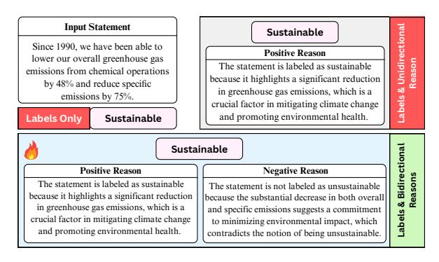
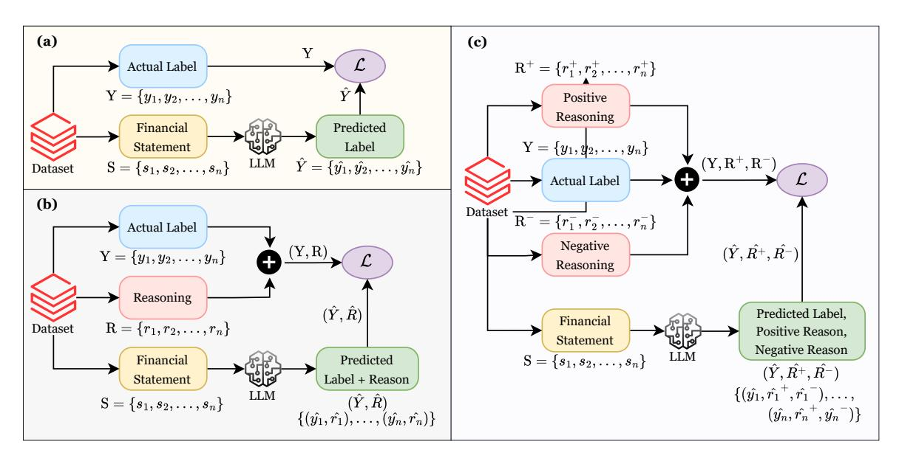
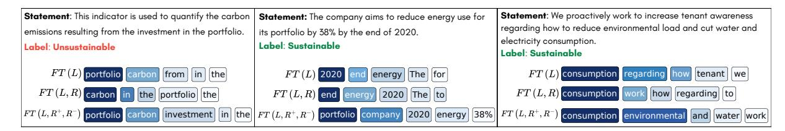
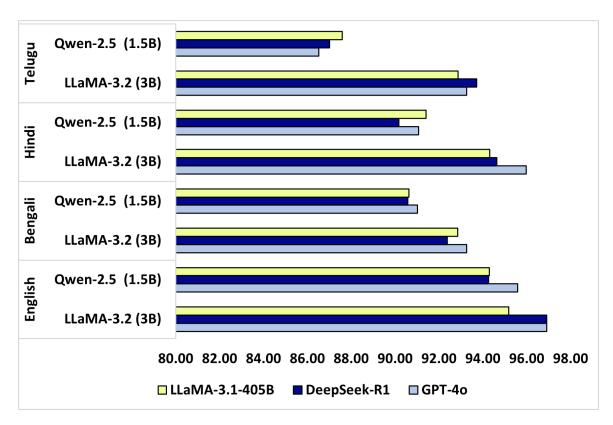
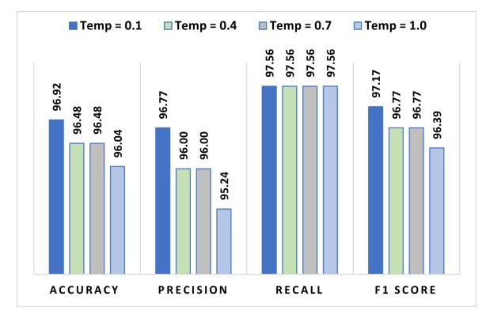

# Bidirectional Reasoning Supervision for Multilingual Financial Decision Making

Muhammad Rafsan Kabir<sup>1</sup> , Jawad Ibn Ahad<sup>1</sup> , Robin Krambroeckers<sup>2</sup> , Silvia Ahmed<sup>1</sup> , M M Lutfe Elahi<sup>1</sup> , Nabeel Mohammed<sup>1</sup> , Shafin Rahman<sup>1</sup>

<sup>1</sup>Machine Intelligence Lab (MILab), North South University, Dhaka, Bangladesh <sup>2</sup>RobotBulls, Europe

Correspondence: [muhammad.kabir@northsouth.edu](mailto:muhammad.kabir@northsouth.edu)

### Abstract

Large Language Models have achieved great success in tasks like sentiment analysis, machine translation, and question answering, yet their effectiveness in the multilingual financial domain remains less explored. This study explores the potential of generative LLMs for classifying financial sustainability in four diverse languages: English, Hindi, Bengali, and Telugu, representing low, medium, and high-resource language categories. We propose a novel fine-tuning approach that integrates both positive and negative rationales alongside classification labels. Unlike existing approaches, our method improves classification performance by incorporating structured bidirectional reasoning into financial decisionmaking. Extensive evaluations demonstrate that the proposed approach consistently outperforms prior methods across all four languages, establishing new benchmark results for multilingual financial NLP. Notably, it also enables smaller models to achieve competitive or even superior performance compared to significantly larger models fine-tuned with conventional methods, demonstrating its suitability for industry applications[1](#page-0-0) .

### 1 Introduction and Motivation

Recent advancements in natural language processing (NLP) have transformed domains like education [\(Orenstrakh et al.,](#page-8-0) [2024\)](#page-8-0), governance [\(Aoki,](#page-7-0) [2024\)](#page-7-0), and finance [\(Li et al.,](#page-8-1) [2023\)](#page-8-1). The financial domain, in particular, requires accurate and timely analysis of complex, domain-specific documents for strategic decisions, risk mitigation, and regulatory compliance. Extracting insights from financial texts is essential for stakeholders, including investors, regulators, and policymakers, to assess corporate sustainability and detect emerging risks

<span id="page-0-1"></span>

Figure 1: A high-level overview of three fine-tuning strategies: (i) Labels Only, (ii) Labels with Positive Reasoning, and (iii) Labels with Bidirectional Reasoning.

early. However, while financial markets are inherently global and multilingual, most financial NLP research has focused on high-resource languages [\(Zhang et al.,](#page-9-0) [2024\)](#page-9-0). In multilingual regions such as South Asia and other emerging markets, stakeholders relying on local financial reports often face delays and inaccuracies, leading to missed risks and suboptimal investment decisions. Addressing sustainability classification in a multilingual context ensures broader inclusion of underrepresented linguistic communities and supports more equitable decision-making across global markets.

Previous studies have explored AI-based approaches for analyzing financial texts, with a particular focus on machine learning algorithms and large language models (LLMs) [\(Gerlein et al.,](#page-7-1) [2016;](#page-7-1) [Huang et al.,](#page-8-2) [2020\)](#page-8-2). More recent studies leverage LLMs for various financial applications, such as financial sentiment analysis [\(Araci and](#page-7-2) [Genc,](#page-7-2) [2020;](#page-7-2) [Rodriguez Inserte et al.,](#page-8-3) [2023\)](#page-8-3) and reasoning tasks [\(Srivastava et al.,](#page-8-4) [2024\)](#page-8-4). Additionally, efforts have been made to develop financial datasets for relation extraction and question answering [\(Jør](#page-8-5)[gensen et al.,](#page-8-5) [2023;](#page-8-5) [Chen et al.,](#page-7-3) [2024;](#page-7-3) [Hamad et al.,](#page-8-6) [2024\)](#page-8-6). However, research on multilingual financial data, particularly for low-resource languages, remains limited. The scarcity of high-quality anno-

<span id="page-0-0"></span><sup>1</sup>Codes and data are available at [https://github.com/](https://github.com/milab-nsu/FinR-M) [milab-nsu/FinR-M](https://github.com/milab-nsu/FinR-M)

tated financial datasets for these languages further increases this challenge. This gap highlights the need for advanced NLP techniques to be applied to multilingual financial tasks, ensuring greater accessibility across diverse linguistic landscapes.

This study advances multilingual financial NLP by integrating low-resource languages into financial sustainability classification. Specifically, we focus on four languages: English, Hindi, Bengali, and Telugu, with Bengali and Telugu considered low-resource in computational linguistics. While (Ghosh et al., 2024) has explored financial sustainability classification for Indic languages using traditional machine learning and BERT-based approaches, their methods do not utilize the generative and reasoning strengths of modern LLMs. In contrast, we employ generative LLMs for this task. Unlike conventional fine-tuning approaches, where LLMs are trained solely with labels, we introduce reason-based fine-tuning. We explore two different reasoning-enhanced methods: (a) fine-tuning LLMs with sustainability labels along with a positive reason explaining why a statement is classified as sustainable or unsustainable, and (b) a bidirectional reasoning approach, where LLMs are finetuned with labels along with positive and negative reasons, as illustrated in 1. This contrastive-style reasoning framework improves classification by enabling LLMs to distinguish not only why a statement belongs to a certain category but also why it does not belong to the alternative category.

Contributions: (1) This study improves multilingual financial sustainability classification in low, medium, and high-resource languages, contributing to progress in the financial domain. (2) We propose a novel fine-tuning method that integrates bidirectional reasoning (both positive and negative) alongside labels to improve classification performance. Our approach, combined with parameterefficient fine-tuning (PEFT), ensures strong performance while maintaining efficiency in resourceconstrained environments. (3) Evaluations demonstrate that the proposed fine-tuning approach consistently outperforms existing methods across four languages and enables smaller models to match the performance of significantly larger models trained using a label-only approach.

### 2 Related Works

**NLP in Multilingual Financial Data:** Recent studies have introduced datasets such as MultiFin

(Jørgensen et al., 2023), FAMMA (Anonymous, 2024), and FIT-ES (Zhang et al., 2024), enabling multilingual financial research. Beyond dataset creation, (Zhang et al., 2024) evaluated FinMA-ES, a model instruction-tuned on financial data, on Spanish and English text, while (Nguyen et al., 2022) assessed multilingual models across several financial tasks in three languages. Others have explored multilingual financial text summarization (Foroutan et al., 2022; Azizov et al., 2023). However, most efforts focus on high- or mid-resource languages, with low-resource languages remaining underrepresented. Our work addresses this gap by classifying financial sustainability in low-resource languages such as Bengali and Telugu.

Fine-Tuning for Financial Tasks: Supervised finetuning is widely used for financial text classification. (Dong and Liu, 2021) fine-tuned deep learning models for financial sentiment analysis, while (Tang et al., 2023) and (Iacovides et al., 2024) finetuned pretrained language models (PLMs) to enhance domain-specific performance. Beyond sentiment analysis, fine-tuning has been employed for financial sustainability classification. For example, (Ghosh et al., 2024) fine-tuned BERT-based models on the IndicFinNLP dataset for sustainability and ESG theme classification. Although these studies demonstrate the efficacy of fine-tuning for financial classification tasks, they primarily rely on labelbased supervision. In contrast, our work extends fine-tuning methodologies by integrating reasoning directly into the training process.

### 3 Methodology

**Problem Definition:** Consider a dataset D consisting of financial statements  $S = \{s_1, s_2, ..., s_n\}$  and corresponding labels  $Y = \{y_1, y_2, ..., y_n\}$ , where each statement  $s_i$  can be in any language. The objective is to classify each statement  $s_i$  into one of two categories:  $y_i \in \{\text{sustainable}, \text{unsustainable}\}$ . Formally, we aim to learn a mapping function:

$$\mathcal{M}: S \to y, \quad \mathcal{M}(s_i) = y_i$$
 (1)

where  $\mathcal{M}$  represents a large language model finetuned for financial sustainability classification. The challenge lies in ensuring accurate classification, particularly in multilingual and low-resource settings, where labeled financial data is often scarce. **Solution Overview:** Existing works fine-tune large language models, denoted as  $\mathcal{M}$ , using only the labels Y, where the model  $\mathcal{M}$  learns a direct map-

<span id="page-2-0"></span>

Figure 2: Overview of three fine-tuning approaches: (a) Fine-tuning using Label, (b) Fine-tuning using Label + Unidirectional Reason, and (c) Fine-tuning using Label + Bidirectional Reason (Ours). The novel third approach enhances classification performance by supervising the model's output with the classification label (Y), positive reason  $(R^+)$ , and negative reason  $(R^-)$ , providing a more comprehensive and context-aware training framework.

ping  $\mathcal{M}(s_i)=y_i$ . However, financial decision-making often requires justification. Hence, we introduce reason-based fine-tuning, particularly leveraging unidirectional and bidirectional reasoning. The first method fine-tunes LLMs with labels and their corresponding reasons  $R=\{r_1,r_2,...,r_n\}$ , which justify the assigned labels:  $\mathcal{M}(s_i)=(y_i,r_i)$ . The second approach supervises LLMs using the label along with two reasoning components: positive reasons  $R^+=\{r_1^+,r_2^+,...,r_n^+\}$  and negative reasons  $R^-=\{r_1^-,r_2^-,...,r_n^-\}$ . Thus, the model is fine-tuned to learn  $\mathcal{M}(s_i)=(y_i,r_i^+,r_i^-)$ , thereby improving the model's decision-making process.

### 3.1 Revisiting Existing Baselines

To establish baseline methods for classifying financial sustainability in English, Hindi, Bengali, and Telugu, we experimented with various prompting techniques. These approaches do not require model training, making them efficient baseline strategies. Specifically, we explore zero-shot prompting (Wei et al., 2022a), few-shot prompting (Brown et al., 2020), and few-shot prompting with reasons (Wei et al., 2022b). However, zero-shot prompting proved ineffective for all four languages, particularly for low-resource languages like Bengali and Telugu. As a result, zero-shot prompting is excluded from further analysis in this study. A detailed discussion is provided in Appendix A.1.

### **3.2** Fine-Tuning Strategies

In this study, we explore three fine-tuning methods: (a) fine-tuning using labels, which is the conventional approach for classification tasks: (b) finetuning using labels and their corresponding reasons (unidirectional); and (c) fine-tuning using labels and bidirectional reasoning, incorporating positive and negative reasons. The third strategy enables the model to learn in a contrastive learning approach. Fine-tune with Label: This is a widely adopted and straightforward approach for classification tasks. It involves training a pre-trained LLM on a labeled dataset to adapt its knowledge to a specific domain. For the financial sustainability classification task, each input statement  $s_i$  is passed into the LLM to generate an output  $\hat{y_i}$ , predicting either sustainable or unsustainable. To optimize the model's performance, the cross-entropy loss is calculated between the predicted label  $\hat{y}_i$  and the ground truth label  $y_i$ , as shown in Figure 2(a). The model's parameters are updated iteratively to minimize this loss, ensuring that it learns the patterns in the labeled data. This approach serves as the baseline in our study to evaluate the effectiveness of more advanced techniques.

### Fine-tune with Label & Unidirectional Reason: This approach extends conventional label-based

fine-tuning by incorporating explanatory reasons into the training process. In this method, each input statement  $s_i$  is paired with its corresponding label

<span id="page-3-0"></span>

Figure 3: Attention heatmap showcasing the top five tokens most relevant to the predicted category across three different fine-tuning strategies. Darker shades indicate higher attention scores, while lighter shades represent lower attention scores. FT(L) represents fine-tuning using labels, FT(L, R) represents fine-tuning using labels and unidirectional reasoning, and  $FT(L, R^+, R^-)$  represents fine-tuning using labels and bidirectional reasoning.

 $y_i$  and reason  $r_i$ , which explains why  $s_i$  is assigned the label  $y_i$ . This additional reasoning component improves the model's ability to understand the underlying rationale behind each decision, thus improving interpretability and domain adaptability. For each input  $s_i$ , the LLM is trained to generate an output comprising both the predicted label  $\hat{y}_i$ and its reason  $\hat{r_i}$ . A combined loss is calculated between the generated output  $(\hat{y_i}, \hat{r_i})$  and the ground truth  $(y_i, r_i)$ , as depicted in Figure 2(b). This loss ensures that the model learns to predict the correct label along with a coherent explanation for its prediction. By incorporating unidirectional reasoning, this fine-tuning strategy allows the LLM to align its decision-making process with human-like explanatory reasoning. As a result, the model provides accurate and interpretable predictions, making it a valuable tool for financial decision-making tasks.

Fine-tune with Label & Bidirectional Reasons: This novel approach extends reason-based fine-tuning by introducing bidirectional reasoning, where each input statement  $s_i$  is accompanied by a label  $y_i$  and two types of reasons: positive  $(r_i^+)$ and negative  $(r_i^-)$ . The positive reason explains why  $s_i$  is classified as  $y_i$ , while the negative reason clarifies why  $s_i$  does not belong to the opposite category  $(\neg y_i)$ . This bidirectional framework enables the model to learn not only what justifies a classification but also what disqualifies alternative labels. For each input  $s_i$ , the LLM is trained to predict an output consisting of the label  $\hat{y}_i$ , the positive reason  $\hat{r}_i^+$ , and the negative reason  $\hat{r}_i^-$ . A cross-entropy loss  $\mathcal{L}_{CE}$  is computed between the generated output  $(\hat{y_i}, \hat{r_i}^+, \hat{r_i}^-)$  and the ground truth  $(y_i, r_i^+, r_i^-)$ , encouraging the model to focus equally on accurate classification and the generation of bidirectional reasons. Figure 2(c) illustrates the proposed fine-tuning methodology.

$$\mathcal{L}_{CE} = \text{CrossEntropy}\left[ (\hat{y_i}, \hat{r_i}^+, \hat{r_i}^-), (y_i, r_i^+, r_i^-) \right]$$

The bidirectional reasoning mechanism improves model performance by aligning predictions with human reasoning through supportive and refutative justifications in a contrastive learning manner and by improving interpretability through a clearer decision-making process. The bidirectional reasoning framework sets our approach apart from methods that rely only on labels or unidirectional reason. By integrating bidirectional reasoning, we aim for more accurate and reliable classification.

An attention heatmap illustrating the effectiveness of our proposed fine-tuning strategy is presented in Figure 3. As shown in the figure, our bidirectional reasoning-based approach successfully highlights a greater number of critical tokens that are directly associated with financial sustainability. This indicates that the model, when fine-tuned using our method, is better able to focus on contextually important information relevant to the task. In contrast, existing label-based fine-tuning or the unidirectional-reasoning approach struggles to capture these key tokens effectively, often attending to irrelevant or generic terms. This enhanced tokenlevel interpretability further underscores the superiority of our approach in aligning model attention with task-relevant semantics, thereby improving both performance and explainability.

#### 3.3 Reason Generation

To enhance fine-tuning with bidirectional reasoning, we automatically generated reasons using GPT-40 (Achiam et al., 2023), eliminating the need for human annotation. Reasons were generated exclusively for the training data across English, Hindi, Bengali, and Telugu. For each statement, we generated both positive and negative reasons to provide a rationale for classification. Carefully designed prompts guided the model in producing these explanations. Each generated response was limited to a maximum of 150 tokens to avoid unnecessary verbosity. In the unidirectional approach, only

<span id="page-4-0"></span>

|          |                    | LLaMA 1  | Family  |          |        |                               | Qwen I   | amily   |          |        |
|----------|--------------------|----------|---------|----------|--------|-------------------------------|----------|---------|----------|--------|
| Language | Model              | Acc. (%) | Pr. (%) | Rec. (%) | F1 (%) | Model                         | Acc. (%) | Pr. (%) | Rec. (%) | F1 (%) |
|          | LLaMA-3.2 (3B) ♦   | 94.71    | 94.40   | 95.93    | 95.16  | Qwen-2.5 (1.5B) ♦             | 93.39    | 97.36   | 90.24    | 93.66  |
|          | LLaMA-3.2 (3B) ♡   | 94.71    | 95.12   | 95.12    | 95.12  | Qwen-2.5 (1.5B) ♡             | 94.71    | 97.44   | 92.68    | 95.00  |
| Ξ        | LLaMA-3.2 (3B) ♠   | 96.92    | 96.77   | 97.56    | 97.17  | Qwen-2.5 (1.5B) •             | 95.59    | 97.48   | 94.31    | 95.87  |
| ENGLISH  | LLaMA-3.1 (8B) ♦   | 93.83    | 95.80   | 92.68    | 94.21  | Qwen-2.5 (7B) $\diamondsuit$  | 93.83    | 92.91   | 95.93    | 94.39  |
| 뎡        | LLaMA-3.1 (8B) ♥   | 94.71    | 93.70   | 96.75    | 95.20  | Qwen-2.5 (7B) ♡               | 94.27    | 92.97   | 96.75    | 94.82  |
| Ž        | LLaMA-3.1 (8B) ♠   | 96.04    | 94.53   | 98.37    | 96.41  | Qwen-2.5 (7B) •               | 94.27    | 92.31   | 97.56    | 94.86  |
| Ξ.       | LLaMA-3.1 (70B) ♦  | 93.83    | 96.64   | 92.00    | 94.26  | Qwen-2.5 (72B) $\diamondsuit$ | 93.83    | 97.39   | 91.06    | 94.11  |
|          | LLaMA-3.1 (70B) ♡  | 96.04    | 95.24   | 97.56    | 96.38  | Qwen-2.5 (72B) ♡              | 94.71    | 97.43   | 92.68    | 94.99  |
|          | LLaMA-3.1 (70B) 🌲  | 96.48    | 95.28   | 98.37    | 96.80  | Qwen-2.5 (72B) 🌲              | 96.04    | 97.50   | 95.12    | 96.30  |
|          | LLaMA-3.2 (3B) ♦   | 92.80    | 90.00   | 96.43    | 93.10  | Qwen-2.5 (1.5B) \$            | 91.07    | 94.49   | 90.22    | 92.12  |
|          | LLaMA-3.2 (3B) ♥   | 92.38    | 92.04   | 92.86    | 92.44  | Qwen-2.5 (1.5B) ♥             | 89.69    | 85.60   | 95.54    | 90.29  |
| Ę        | LLaMA-3.2 (3B) ♠   | 93.27    | 88.80   | 99.11    | 93.67  | Qwen-2.5 (1.5B) •             | 91.03    | 85.94   | 98.20    | 91.66  |
| BENGALI  | LLaMA-3.1 (8B) ♦   | 93.72    | 90.83   | 97.30    | 93.97  | Qwen-2.5 (7B) $\diamondsuit$  | 91.51    | 93.85   | 91.73    | 92.77  |
| Ş        | LLaMA-3.1 (8B) ♥   | 93.72    | 90.16   | 98.21    | 94.02  | Qwen-2.5 (7B) ♥               | 90.13    | 88.79   | 91.96    | 90.34  |
| 氫        | LLaMA-3.1 (8B)     | 94.17    | 90.24   | 99.11    | 94.47  | Qwen-2.5 (7B)                 | 92.38    | 89.26   | 96.43    | 92.70  |
| <b>m</b> | LLaMA-3.1 (70B) \$ | 93.27    | 94.03   | 94.74    | 94.38  | Qwen-2.5 (72B) $\diamondsuit$ | 91.07    | 95.93   | 88.72    | 92.18  |
|          | LLaMA-3.1 (70B) ♥  | 92.83    | 89.34   | 97.32    | 93.15  | Qwen-2.5 (72B) ♥              | 91.93    | 87.90   | 97.32    | 92.37  |
|          | LLaMA-3.1 (70B) 🌲  | 93.72    | 90.80   | 97.32    | 93.92  | Qwen-2.5 (72B) 🌲              | 92.38    | 88.00   | 98.20    | 92.82  |
|          | LLaMA-3.2 (3B) ◊   | 92.70    | 95.49   | 92.70    | 94.32  | Qwen-2.5 (1.5B) \$            | 89.24    | 85.48   | 94.64    | 89.82  |
|          | LLaMA-3.2 (3B) ♥   | 95.54    | 97.67   | 94.74    | 96.18  | Qwen-2.5 (1.5B) ♥             | 91.96    | 94.57   | 91.73    | 93.12  |
|          | LLaMA-3.2 (3B) ♠   | 95.98    | 97.69   | 95.49    | 96.58  | Qwen-2.5 (1.5B)               | 91.07    | 94.49   | 90.23    | 92.31  |
| IO       | LLaMA-3.1 (8B) ♦   | 91.52    | 95.97   | 89.47    | 92.61  | Qwen-2.5 (7B) $\diamondsuit$  | 89.24    | 88.60   | 90.18    | 89.38  |
| HINDI    | LLaMA-3.1 (8B) ♥   | 92.86    | 96.80   | 90.98    | 93.80  | Qwen-2.5 (7B) ♥               | 94.64    | 94.81   | 96.24    | 95.51  |
| 田        | LLaMA-3.1 (8B)     | 94.64    | 96.90   | 93.98    | 95.42  | Qwen-2.5 (7B)                 | 95.09    | 95.52   | 96.24    | 95.87  |
|          | LLaMA-3.1 (70B) ♦  | 91.48    | 89.08   | 94.64    | 91.77  | Qwen-2.5 (72B) $\diamondsuit$ | 92.38    | 88.00   | 98.20    | 92.82  |
|          | LLaMA-3.1 (70B) ♥  | 92.83    | 89.34   | 97.32    | 95.87  | Qwen-2.5 (72B) ♥              | 92.86    | 96.06   | 91.73    | 95.87  |
|          | LLaMA-3.1 (70B) 🌲  | 95.98    | 96.97   | 96.24    | 96.60  | Qwen-2.5 (72B) 🌲              | 94.64    | 96.18   | 94.74    | 95.45  |
|          | LLaMA-3.2 (3B) ◊   | 91.30    | 92.08   | 90.74    | 91.41  | Qwen-2.5 (1.5B) \$            | 85.10    | 82.35   | 90.74    | 86.34  |
|          | LLaMA-3.2 (3B) ♥   | 92.79    | 92.66   | 93.52    | 93.09  | Qwen-2.5 (1.5B) ♥             | 86.06    | 82.64   | 92.59    | 87.33  |
| _        | LLaMA-3.2 (3B) ♠   | 93.27    | 92.73   | 94.44    | 93.58  | Qwen-2.5 (1.5B)               | 86.53    | 83.33   | 92.59    | 87.71  |
| ಶ        | LLaMA-3.1 (8B) ♦   | 91.83    | 90.27   | 94.44    | 92.31  | Qwen-2.5 (7B) $\diamondsuit$  | 86.53    | 87.74   | 86.11    | 86.91  |
| 23       | LLaMA-3.1 (8B) ♥   | 91.83    | 93.33   | 90.74    | 92.02  | Qwen-2.5 (7B) ♡               | 86.06    | 87.61   | 85.19    | 86.38  |
| TELUGU   | LLaMA-3.1 (8B)     | 92.30    | 91.82   | 93.52    | 92.66  | Qwen-2.5 (7B)                 | 87.50    | 90.20   | 85.19    | 87.62  |
| -        | LLaMA-3.1 (70B) ♦  | 93.27    | 91.96   | 95.37    | 93.63  | Qwen-2.5 (72B) $\diamondsuit$ | 88.46    | 90.38   | 87.04    | 88.67  |
|          | LLaMA-3.1 (70B) ♥  | 92.79    | 90.43   | 96.30    | 93.27  | Qwen-2.5 (72B) ♥              | 88.94    | 90.48   | 87.96    | 89.20  |
|          | LLaMA-3.1 (70B)    | 93.72    | 90.80   | 97.32    | 93.94  | Owen-2.5 (72B)                | 89.42    | 90.57   | 88.89    | 89.72  |

Table 1: Performance comparison of multilingual financial sustainability classification using three distinct fine-tuning approaches across four diverse languages: English, Bengali, Hindi, and Telugu. The gray-highlighted rows represent the results obtained using our proposed methodology. **Abbv:** Fine-tuned using Labels ( $\diamondsuit$ ), Fine-tuned using Labels & Bidirectional Reasons ( $\spadesuit$ ).

positive reasons were utilized, while both positive and negative reasons were incorporated in the bidirectional approach. Importantly, these generated reasons were used solely during the training phase, with no reasoning applied during evaluation, ensuring that the model's performance was assessed purely based on its classification capability without relying on additional explanations. As a result, inference costs also remain unaffected, maintaining the model's efficiency during deployment.

#### 4 Experiments

#### 4.1 Setup

**Dataset:** For our experiments, we use datasets in four languages: English, Hindi, Bengali, and Telugu. The English dataset originates from the shared task introduced by (Kang and El Maarouf, 2022), which focuses on classifying financial statements into two categories: *sustainable* and *unsustainable*. To extend this work to Indic languages, we use the

IndicFinNLP Task 2 dataset (Ghosh et al., 2024), which covers Bengali, Hindi, and Telugu. These datasets provide a rich multilingual resource for analyzing financial sustainability in diverse linguistic contexts. All datasets are split into a 9:1 ratio for training and testing to ensure consistent evaluation across languages. A detailed breakdown of the data statistics is presented in Appendix A.3.

Implementation Details: For the multilingual financial sustainability classification task, we conduct three types of fine-tuning alongside prompt-based baseline evaluations. We use six large language models from the LLaMA and Qwen families. The models include LLaMA-3.2 (3B), LLaMA-3.1 (8B & 70B), and Qwen-2.5 (1.5B, 7B & 72B), covering a broad range of model sizes. Given the high computational cost of fine-tuning large models, we adopt parameter-efficient fine-tuning (Ding et al., 2023) using quantized low-rank adapters (QLoRA) (Dettmers et al., 2024). This technique reduces

memory requirements while maintaining performance. All models are fine-tuned for 40 epochs, as we observe no performance improvements beyond this point. All experiments are performed using the *PyTorch* framework on a single NVIDIA RTX 6000 Ada and H100 GPU. Hyperparameter details are provided in Appendix [A.4.](#page-9-4)

Evaluation: To evaluate the performance of our proposed fine-tuning approach alongside existing methods, we test the models on the same test sets across four languages: English, Bengali, Hindi, and Telugu. To ensure a comprehensive evaluation of the models' performance, we employ four widely recognized metrics: accuracy (Acc.), precision (Pr.), recall (Rec.), and F1 score (F1). These metrics collectively provide a balanced assessment of the ability to correctly identify and distinguish between sustainable and unsustainable classes.

### 4.2 Main Results

In this section, we present a comprehensive analysis of our experimental results. The baseline prompt-based inference results are discussed in Appendix [A.1.](#page-9-2) Table [1](#page-4-0) summarizes the performance achieved using three distinct fine-tuning strategies.

The key observations from Table [1](#page-4-0) are as follows: *(1)* Among the three fine-tuning methods, the proposed approach, which incorporates labels and bidirectional reasoning, consistently outperforms other fine-tuning strategies across all languages and evaluation metrics. *(2)* The bidirectional method performs robustly across all model sizes and families, demonstrating its generalizability. *(3)* Small models fine-tuned using our approach can achieve competitive or even superior results compared to significantly larger models trained with labels only. For example, in English, Qwen-2.5 (1.5B) fine-tuned using the bidirectional reasoning method achieves 95.59% accuracy, surpassing both Qwen-2.5 (72B) and LLaMA-3.1 (70B) fine-tuned with only labels. *(4)* While Qwen models perform comparably to LLaMA models for English, their performance is significantly lower for low-resource languages such as Telugu and Bengali. *(5)* Overall, these findings indicate that the proposed fine-tuning methodology, which employs labels and bidirectional reasoning, consistently yields superior performance compared to existing approaches.

Finally, we present a comparison of the proposed method with existing notable studies in Table [2.](#page-5-0) From the table, it is evident that our proposed approach consistently achieves significantly higher

<span id="page-5-0"></span>

|         | Lang Model                                         | Acc (%) F1 (%) |       |
|---------|----------------------------------------------------|----------------|-------|
| English | Logistic Regression (Linhares Pontes et al., 2022) | 90.70          | -     |
|         | Ensemble (late-fusion) (Koloski et al., 2022)      | 88.29          | 89.00 |
|         | RoBERTa (Kang and El Maarouf, 2022)                | 94.63          | -     |
|         | LLaMA-3.2 (3B) [Ours]                              | 96.92          | 97.17 |
| Bengali | MLM-IndicBERT (Ghosh et al., 2024)                 | 81.00          | 81.00 |
|         | RoBERTa (Ghosh et al., 2024)                       | 92.00          | 92.00 |
|         | LLaMA-3.1 (8B) [Ours]                              | 94.17          | 94.47 |
| Hindi   | IndicBERT (Ghosh et al., 2024)                     | 86.00          | 86.00 |
|         | RoBERTa (Ghosh et al., 2024)                       | 95.00          | 95.00 |
|         | LLaMA-3.1 (70B) [Ours]                             | 95.98          | 96.60 |
| Telugu  | MLM-IndicBERT (Ghosh et al., 2024)                 | 90.00          | 90.00 |
|         | RoBERTa (Ghosh et al., 2024)                       | 92.00          | 92.00 |
|         | LLaMA-3.1 (70B) [Ours]                             | 93.72          | 93.94 |

Table 2: Performance comparison between existing benchmarks and our proposed approach across four languages. Our approach demonstrates superior results, showing its effectiveness in multilingual financial tasks.

<span id="page-5-1"></span>

| Language | Faithfulness | Coherence | Relevance |
|----------|--------------|-----------|-----------|
| English  | 4.88         | 4.95      | 4.97      |
| Hindi    | 4.86         | 4.95      | 4.96      |
| Bengali  | 4.82         | 4.88      | 4.94      |
| Telugu   | 4.83         | 4.91      | 4.94      |

Table 3: Evaluation of GPT-4o generated rationale quality using *Claude Opus-4.1*. The average scores (out of 5) are presented for each language.

classification scores compared to existing methods across all languages, including English, Bengali, Hindi, and Telugu. This highlights the effectiveness of our novel fine-tuning approach, particularly in classification tasks within the financial domain, where strong reasoning capabilities are crucial.

### 4.3 Analysis & Evaluation of Reason Quality

We conducted an analysis and evaluation of the quality of reasons generated by GPT-4o using an LLM-as-a-Judge method [\(Gu et al.,](#page-8-14) [2024\)](#page-8-14), where *Claude Opus-4.1* served as the judge. Quality was evaluated based on three criteria: faithfulness, coherence, and relevance, each on a scale of 1 (Poor) to 5 (Excellent). The three criteria are identified based on prior studies [\(Fabbri et al.,](#page-7-13) [2021;](#page-7-13) [Gigant](#page-7-14) [et al.,](#page-7-14) [2024;](#page-7-14) [Song et al.,](#page-8-15) [2024\)](#page-8-15). The average scores are presented in Table [3.](#page-5-1)

The results indicate that GPT-4o consistently produces high-quality reasons across all languages, with average scores exceeding 4.8 (out of 5) in all metrics. English achieved the highest overall performance, closely followed by Hindi, while Bengali and Telugu exhibited slightly lower but still robust scores. These findings suggest that GPT-4o maintains strong multilingual reasoning, with only minor variations across linguistic contexts.

<span id="page-6-0"></span>



(a) Impact of reason-generation LLMs. (b) Impact of sampling temperature.

Figure 4: Ablation studies showing (a) the impact of reason-generation LLMs and (b) the effect of sampling temperature on the classification performance.

### 4.4 Ablation Study

Impact of Reason-Generation LLMs: To assess the impact of different LLMs used for reason generation, we conducted experiments comparing GPT-4o [\(Achiam et al.,](#page-7-10) [2023\)](#page-7-10), DeepSeek-R1 [\(Guo](#page-8-16) [et al.,](#page-8-16) [2025\)](#page-8-16), and LLaMA-3.1-405B [\(Dubey et al.,](#page-7-15) [2024\)](#page-7-15), encompassing both proprietary and opensource models. Figure [4a](#page-6-0) presents the accuracy achieved by our proposed approach when incorporating reasons generated by each model across four languages: English, Bengali, Hindi, and Telugu. The results show that the performance remains consistent across all three LLMs, with only marginal variations. This consistency highlights the robustness and generalizability of our method, irrespective of the underlying reason-generation model.

Impact of Sampling Temperature: Sampling temperature significantly influences LLM responses. To evaluate its effect on the financial sustainability classification, we experimented with four values: 0.1, 0.4, 0.7, and 1.0, as illustrated in Figure [4b.](#page-6-0) The results indicate that a sampling temperature of 0.1 yields the highest performance across all evaluation metrics. In particular, temperature variations do not significantly affect recall scores. The superior performance at 0.1 aligns with the expectation that lower temperatures promote more precise text generation, while higher temperatures introduce greater randomness, which can be beneficial for creative tasks but suboptimal for classification.

## 5 Discussion

We present a novel reasoning-enhanced fine-tuning method that integrates bidirectional rationales into LLM supervision to improve multilingual financial

sustainability classification. By leveraging both positive and negative reasons, our approach outperforms conventional fine-tuning strategies across all languages and model variants, establishing new benchmarks in the multilingual financial domain. This technique yields more interpretable and accurate predictions in the financial domain, where transparent justification is important. Overall, bidirectional reasoning has the potential to enhance performance and explainability in complex tasks.

Industry Benefit: As shown in Table [1,](#page-4-0) our method enables notably smaller models to match the performance of much larger counterparts trained with traditional label-based approaches, drastically reducing computational costs while delivering faster inference and facilitating edge deployment. This provides cost-effective, scalable solutions for resource-constrained financial applications without compromising performance.

### 6 Conclusion

This study explores the potential of large language models for multilingual financial sustainability classification, introducing a novel fine-tuning approach that integrates bidirectional reasoning with classification labels. The method consistently improves performance and robustness across English, Hindi, Bengali, and Telugu, outperforming existing techniques. We also employ parameter-efficient finetuning (PEFT) to enable scalable adaptation with limited resources, supporting deployment in realworld applications. By establishing new benchmarks for financial decision-making in multiple languages, this work advances financial and multilingual NLP, particularly in low-resource settings.

### Limitations

While this study introduces an effective fine-tuning methodology for multilingual financial sustainability classification, it has several limitations. First, the scope of languages is restricted to English, Hindi, Bengali, and Telugu, which, although diverse, excludes other underrepresented languages, limiting the generalizability of our approach to a broader multilingual context. Second, the reliance on parameter-efficient fine-tuning (PEFT) techniques due to computational resource constraints limits the exploration of full fine-tuning. This leaves room for further experimentation on more resource-intensive setups to potentially improve performance. Finally, the focus of this study is domain-specific, targeting the financial sustainability classification task. Although our proposed bidirectional reasoning methodology shows exceptional results in this domain, its applicability to other fields remains unexplored. These limitations present opportunities for future work to broaden the scope and further enhance the proposed methods, contributing to the advancement of multilingual NLP and domain-specific fine-tuning strategies.

# References

- <span id="page-7-10"></span>Josh Achiam, Steven Adler, Sandhini Agarwal, Lama Ahmad, Ilge Akkaya, Florencia Leoni Aleman, Diogo Almeida, Janko Altenschmidt, Sam Altman, Shyamal Anadkat, and 1 others. 2023. Gpt-4 technical report. *arXiv preprint arXiv:2303.08774*.
- <span id="page-7-5"></span>Anonymous. 2024. [FAMMA: A benchmark for finan](https://openreview.net/forum?id=gNOW7ch3Ye)[cial multilingual multimodal question answering.](https://openreview.net/forum?id=gNOW7ch3Ye) In *Submitted to The Thirteenth International Conference on Learning Representations*. Under review.
- <span id="page-7-0"></span>Goshi Aoki. 2024. Large language models in politics and democracy: A comprehensive survey. *arXiv preprint arXiv:2412.04498*.
- <span id="page-7-2"></span>Dogu Araci and Zulkuf Genc. 2020. [{FINBERT}: {FI-](https://openreview.net/forum?id=HylznxrYDr)[NANCIAL} {sentiment} {analysis} {with} {pre}-](https://openreview.net/forum?id=HylznxrYDr) [{trained} {language} {models}.](https://openreview.net/forum?id=HylznxrYDr)
- <span id="page-7-7"></span>Dilshod Azizov, Jiyong Li, Hilal AlQuabeh, and Shangsong Liang. 2023. [Advanced nlp techniques for sum](https://doi.org/10.1109/BigData59044.2023.10386621)[marizing multilingual financial narratives from global](https://doi.org/10.1109/BigData59044.2023.10386621) [annual reports.](https://doi.org/10.1109/BigData59044.2023.10386621) In *2023 IEEE International Conference on Big Data (BigData)*, pages 2802–2804.
- <span id="page-7-9"></span>Tom Brown, Benjamin Mann, Nick Ryder, Melanie Subbiah, Jared D Kaplan, Prafulla Dhariwal, Arvind Neelakantan, Pranav Shyam, Girish Sastry, Amanda Askell, Sandhini Agarwal, Ariel Herbert-Voss, Gretchen Krueger, Tom Henighan, Rewon Child, Aditya Ramesh, Daniel Ziegler, Jeffrey Wu, Clemens

- Winter, and 12 others. 2020. [Language models are](https://proceedings.neurips.cc/paper_files/paper/2020/file/1457c0d6bfcb4967418bfb8ac142f64a-Paper.pdf) [few-shot learners.](https://proceedings.neurips.cc/paper_files/paper/2020/file/1457c0d6bfcb4967418bfb8ac142f64a-Paper.pdf) In *Advances in Neural Information Processing Systems*, volume 33, pages 1877–1901. Curran Associates, Inc.
- <span id="page-7-3"></span>Jian Chen, Peilin Zhou, Yining Hua, Loh Xin, Kehui Chen, Ziyuan Li, Bing Zhu, and Junwei Liang. 2024. [FinTextQA: A dataset for long-form financial ques](https://doi.org/10.18653/v1/2024.acl-long.328)[tion answering.](https://doi.org/10.18653/v1/2024.acl-long.328) In *Proceedings of the 62nd Annual Meeting of the Association for Computational Linguistics (Volume 1: Long Papers)*, pages 6025–6047, Bangkok, Thailand. Association for Computational Linguistics.
- <span id="page-7-12"></span>Tim Dettmers, Artidoro Pagnoni, Ari Holtzman, and Luke Zettlemoyer. 2024. Qlora: Efficient finetuning of quantized llms. *Advances in Neural Information Processing Systems*, 36.
- <span id="page-7-11"></span>Ning Ding, Yujia Qin, Guang Yang, Fuchao Wei, Zonghan Yang, Yusheng Su, Shengding Hu, Yulin Chen, Chi-Min Chan, Weize Chen, and 1 others. 2023. Parameter-efficient fine-tuning of large-scale pretrained language models. *Nature Machine Intelligence*, 5(3):220–235.
- <span id="page-7-8"></span>Shanshan Dong and Chang Liu. 2021. Sentiment classification for financial texts based on deep learning. *Computational Intelligence and Neuroscience*, 2021(1):9524705.
- <span id="page-7-15"></span>Abhimanyu Dubey, Abhinav Jauhri, Abhinav Pandey, Abhishek Kadian, Ahmad Al-Dahle, Aiesha Letman, Akhil Mathur, Alan Schelten, Amy Yang, Angela Fan, and 1 others. 2024. The llama 3 herd of models. *arXiv preprint arXiv:2407.21783*.
- <span id="page-7-13"></span>Alexander R Fabbri, Wojciech Krysci ´ nski, Bryan Mc- ´ Cann, Caiming Xiong, Richard Socher, and Dragomir Radev. 2021. Summeval: Re-evaluating summarization evaluation. *Transactions of the Association for Computational Linguistics*, 9:391–409.
- <span id="page-7-6"></span>Negar Foroutan, Angelika Romanou, Stephane Massonnet, Remi Lebret, and Karl Aberer. 2022. Multilingual text summarization on financial documents. In *Proceedings of the 4th Financial Narrative Processing Workshop@ LREC2022*, pages 53–58.
- <span id="page-7-1"></span>Eduardo A Gerlein, Martin McGinnity, Ammar Belatreche, and Sonya Coleman. 2016. Evaluating machine learning classification for financial trading: An empirical approach. *Expert Systems with Applications*, 54:193–207.
- <span id="page-7-4"></span>Sohom Ghosh, Arnab Maji, Aswartha Narayana, and Sudip Kumar Naskar. 2024. Indicfinnlp: Financial natural language processing for indian languages. In *Proceedings of the 2024 Joint International Conference on Computational Linguistics, Language Resources and Evaluation (LREC-COLING 2024)*, pages 9010–9018.
- <span id="page-7-14"></span>Théo Gigant, Camille Guinaudeau, Marc Decombas, and Frederic Dufaux. 2024. [Mitigating the impact](https://doi.org/10.18653/v1/2024.emnlp-main.1078) [of reference quality on evaluation of summarization](https://doi.org/10.18653/v1/2024.emnlp-main.1078)

- [systems with reference-free metrics.](https://doi.org/10.18653/v1/2024.emnlp-main.1078) In *Proceedings of the 2024 Conference on Empirical Methods in Natural Language Processing*, pages 19355–19368, Miami, Florida, USA. Association for Computational Linguistics.
- <span id="page-8-14"></span>Jiawei Gu, Xuhui Jiang, Zhichao Shi, Hexiang Tan, Xuehao Zhai, Chengjin Xu, Wei Li, Yinghan Shen, Shengjie Ma, Honghao Liu, and 1 others. 2024. A survey on llm-as-a-judge. *arXiv preprint arXiv:2411.15594*.
- <span id="page-8-16"></span>Daya Guo, Dejian Yang, Haowei Zhang, Junxiao Song, Ruoyu Zhang, Runxin Xu, Qihao Zhu, Shirong Ma, Peiyi Wang, Xiao Bi, and 1 others. 2025. Deepseek-r1: Incentivizing reasoning capability in llms via reinforcement learning. *arXiv preprint arXiv:2501.12948*.
- <span id="page-8-6"></span>Hassan Hamad, Abhinav Kumar Thakur, Nijil Kolleri, Sujith Pulikodan, and Keith Chugg. 2024. [FIRE:](https://doi.org/10.18653/v1/2024.findings-naacl.230) [A dataset for financial relation extraction.](https://doi.org/10.18653/v1/2024.findings-naacl.230) In *Findings of the Association for Computational Linguistics: NAACL 2024*, pages 3628–3642, Mexico City, Mexico. Association for Computational Linguistics.
- <span id="page-8-2"></span>Jian Huang, Junyi Chai, and Stella Cho. 2020. Deep learning in finance and banking: A literature review and classification. *Frontiers of Business Research in China*, 14(1):13.
- <span id="page-8-9"></span>Giorgos Iacovides, Thanos Konstantinidis, Mingxue Xu, and Danilo Mandic. 2024. Finllama: Llm-based financial sentiment analysis for algorithmic trading. In *Proceedings of the 5th ACM International Conference on AI in Finance*, pages 134–141.
- <span id="page-8-5"></span>Rasmus Jørgensen, Oliver Brandt, Mareike Hartmann, Xiang Dai, Christian Igel, and Desmond Elliott. 2023. [MultiFin: A dataset for multilingual financial NLP.](https://doi.org/10.18653/v1/2023.findings-eacl.66) In *Findings of the Association for Computational Linguistics: EACL 2023*, pages 894–909, Dubrovnik, Croatia. Association for Computational Linguistics.
- <span id="page-8-18"></span>Muhammad Rafsan Kabir, Rafeed Mohammad Sultan, Ihsanul Haque Asif, Jawad Ibn Ahad, Fuad Rahman, Mohammad Ruhul Amin, Nabeel Mohammed, and Shafin Rahman. 2025. Beyond labels: Aligning large language models with human-like reasoning. In *International Conference on Pattern Recognition (ICPR)*, pages 239–254. Springer.
- <span id="page-8-11"></span>Juyeon Kang and Ismail El Maarouf. 2022. [FinSim4-](https://doi.org/10.18653/v1/2022.finnlp-1.28) [ESG shared task: Learning semantic similarities for](https://doi.org/10.18653/v1/2022.finnlp-1.28) [the financial domain. extended edition to ESG in](https://doi.org/10.18653/v1/2022.finnlp-1.28)[sights.](https://doi.org/10.18653/v1/2022.finnlp-1.28) In *Proceedings of the Fourth Workshop on Financial Technology and Natural Language Processing (FinNLP)*, pages 211–217, Abu Dhabi, United Arab Emirates (Hybrid). Association for Computational Linguistics.
- <span id="page-8-13"></span>Boshko Koloski, Syrielle Montariol, Matthew Purver, and Senja Pollak. 2022. [Knowledge informed sus](https://doi.org/10.18653/v1/2022.finnlp-1.31)[tainability detection from short financial texts.](https://doi.org/10.18653/v1/2022.finnlp-1.31) In *Proceedings of the Fourth Workshop on Financial Technology and Natural Language Processing (FinNLP)*,

- pages 228–234, Abu Dhabi, United Arab Emirates (Hybrid). Association for Computational Linguistics.
- <span id="page-8-1"></span>Yinheng Li, Shaofei Wang, Han Ding, and Hang Chen. 2023. Large language models in finance: A survey. In *Proceedings of the fourth ACM international conference on AI in finance*, pages 374–382.
- <span id="page-8-12"></span>Elvys Linhares Pontes, Mohamed Ben Jannet, Jose G. Moreno, and Antoine Doucet. 2022. [Using contex](https://doi.org/10.18653/v1/2022.finnlp-1.29)[tual sentence analysis models to recognize ESG con](https://doi.org/10.18653/v1/2022.finnlp-1.29)[cepts.](https://doi.org/10.18653/v1/2022.finnlp-1.29) In *Proceedings of the Fourth Workshop on Financial Technology and Natural Language Processing (FinNLP)*, pages 218–223, Abu Dhabi, United Arab Emirates (Hybrid). Association for Computational Linguistics.
- <span id="page-8-17"></span>Ioannis Mollas, Zoe Chrysopoulou, Stamatis Karlos, and Grigorios Tsoumakas. 2022. Ethos: a multi-label hate speech detection dataset. *Complex & Intelligent Systems*, 8(6):4663–4678.
- <span id="page-8-7"></span>Duong Nguyen, Nam Cao, Son Nguyen, Son Ta, and Cuong Dinh. 2022. [Mfinbert: Multilingual pre](https://doi.org/10.1109/KSE56063.2022.9953749)[trained language model for financial domain.](https://doi.org/10.1109/KSE56063.2022.9953749) In *2022 14th International Conference on Knowledge and Systems Engineering (KSE)*, pages 1–6.
- <span id="page-8-0"></span>Michael Sheinman Orenstrakh, Oscar Karnalim, Carlos Aníbal Suárez, and Michael Liut. 2024. [Detecting](https://doi.org/10.1109/COMPSAC61105.2024.00027) [llm-generated text in computing education: Compar](https://doi.org/10.1109/COMPSAC61105.2024.00027)[ative study for chatgpt cases.](https://doi.org/10.1109/COMPSAC61105.2024.00027) In *2024 IEEE 48th Annual Computers, Software, and Applications Conference (COMPSAC)*, pages 121–126.
- <span id="page-8-3"></span>Pau Rodriguez Inserte, Mariam Nakhlé, Raheel Qader, Gaetan Caillaut, and Jingshu Liu. 2023. [Large lan](https://doi.org/10.18653/v1/2023.finnlp-2.1)[guage model adaptation for financial sentiment anal](https://doi.org/10.18653/v1/2023.finnlp-2.1)[ysis.](https://doi.org/10.18653/v1/2023.finnlp-2.1) In *Proceedings of the Sixth Workshop on Financial Technology and Natural Language Processing*, pages 1–10, Bali, Indonesia. Association for Computational Linguistics.
- <span id="page-8-15"></span>Hwanjun Song, Hang Su, Igor Shalyminov, Jason Cai, and Saab Mansour. 2024. [FineSurE: Fine-grained](https://doi.org/10.18653/v1/2024.acl-long.51) [summarization evaluation using LLMs.](https://doi.org/10.18653/v1/2024.acl-long.51) In *Proceedings of the 62nd Annual Meeting of the Association for Computational Linguistics (Volume 1: Long Papers)*, pages 906–922, Bangkok, Thailand. Association for Computational Linguistics.
- <span id="page-8-4"></span>Pragya Srivastava, Manuj Malik, Vivek Gupta, Tanuja Ganu, and Dan Roth. 2024. Evaluating llms' mathematical reasoning in financial document question answering. In *Findings of the Association for Computational Linguistics ACL 2024*, pages 3853–3878.
- <span id="page-8-8"></span>Yixuan Tang, Yi Yang, Allen Huang, Andy Tam, and Justin Tang. 2023. [FinEntity: Entity-level sentiment](https://doi.org/10.18653/v1/2023.emnlp-main.956) [classification for financial texts.](https://doi.org/10.18653/v1/2023.emnlp-main.956) In *Proceedings of the 2023 Conference on Empirical Methods in Natural Language Processing*, pages 15465–15471, Singapore. Association for Computational Linguistics.
- <span id="page-8-10"></span>Jason Wei, Maarten Bosma, Vincent Zhao, Kelvin Guu, Adams Wei Yu, Brian Lester, Nan Du, Andrew M.

Dai, and Quoc V Le. 2022a. Finetuned language models are zero-shot learners. In *International Conference on Learning Representations*.

<span id="page-9-1"></span>Jason Wei, Xuezhi Wang, Dale Schuurmans, Maarten Bosma, Fei Xia, Ed Chi, Quoc V Le, Denny Zhou, and 1 others. 2022b. Chain-of-thought prompting elicits reasoning in large language models. *Advances in neural information processing systems*, 35:24824–24837.

<span id="page-9-0"></span>Xiao Zhang, Ruoyu Xiang, Chenhan Yuan, Duanyu Feng, Weiguang Han, Alejandro Lopez-Lira, Xiao-Yang Liu, Meikang Qiu, Sophia Ananiadou, Min Peng, and 1 others. 2024. Dólares or dollars? unraveling the bilingual prowess of financial llms between spanish and english. In *Proceedings of the 30th ACM SIGKDD Conference on Knowledge Discovery and Data Mining*, pages 6236–6246.

### A Appendix

### <span id="page-9-2"></span>A.1 Prompt-Based Approaches

To establish baseline results for the multilingual financial classification task, we employ prompt-based classification. We explored zero-shot prompting, few-shot prompting, and few-shot prompting with rationales. However, zero-shot prompts are excluded from analysis since they seem ineffective for all the languages.

Few-shot Prompting: Few-shot prompting is a widely used technique to leverage large language models (LLMs) to perform tasks with minimal training data (Brown et al., 2020). Instead of finetuning, the model is prompted with a small number of labeled examples directly in the input context. This approach is particularly beneficial for tasks with limited annotated data, as it allows the model to infer the task pattern from a few examples. Additionally, this method is computationally efficient, as it does not require any training. In this study, we designed few-shot prompts to guide the LLMs in classifying financial sustainability.

Few-shot Prompting with Reason: Few-shot prompting with reason extends the conventional few-shot prompting by incorporating explanatory reasoning into the examples provided to the model (Wei et al., 2022b). In addition to labeled examples, this approach includes explanations that justify why a given statement belongs to a specific class. This added reasoning not only helps the model understand the classification criteria more comprehensively but also aligns with the growing emphasis on explainability in AI systems. In our study, we designed few-shot prompts where each

labeled example was paired with a corresponding reason explaining the classification as either sustainable or unsustainable.

The baseline results for English, Hindi, Bengali, and Telugu are presented in Table 4. The table shows that pre-trained LLaMA models achieve comparatively better performance than Qwen models when inferred without task-specific fine-tuning.

### **A.2** Reason Generation Prompts

#### **Positive Reason Generation**

```
### Statement: \{s_i\} ### Label: \{y_i\} ### Explain why the statement is labeled as y_i. Provide a brief explanation in no more than two sentences.
```

### **Negative Reason Generation**

```
### Statement: \{s_i\}
### Label: \{y_i\}
### Explain why the statement is **not** labeled as \neg y_i. Provide a brief explanation in no more than two sentences.
```

#### <span id="page-9-3"></span>A.3 Data Statistics

Table 5 presents the data counts and other statistics for all the employed languages: English, Hindi, Bengali, and Telugu.

### <span id="page-9-4"></span>A.4 Hyperparameters Used

Table 6 presents the hyperparameters used during the training process. We used 40 epochs, as there were no noticeable improvements beyond that point.

# A.5 Bidirectional Reasoning Approach on Additional Domains

To further assess the generalizability of our proposed bidirectional reasoning-based fine-tuning method, we extended our experiments beyond the financial sustainability domain to two distinct tasks: hate speech classification and ethical judgment classification. These domains were intentionally chosen for their conceptual and linguistic divergence from finance, thereby offering a robust evaluation of cross-domain adaptability.

Hate Speech Classification: We selected this task due to its clear contrast with the financial domain and utilized the publicly available ETHOS dataset (Mollas et al., 2022) for our experiments. Table 7 reports the performance of Qwen-2.5 (1.5B) and LLaMA-3.2 (3B) on ETHOS using our proposed

<span id="page-10-0"></span>

|          | LLaMA Family     |          |         |          | Qwen Family |                   |          |         |          |        |
|----------|------------------|----------|---------|----------|-------------|-------------------|----------|---------|----------|--------|
| Language | Model            | Acc. (%) | Pr. (%) | Rec. (%) | F1 (%)      | Model             | Acc. (%) | Pr. (%) | Rec. (%) | F1 (%) |
| ENGLISH  | LLaMA-3.2 (3B) △ | 60.35    | 57.75   | 98.37    | 72.78       | Qwen-2.5 (1.5B) △ | 60.35    | 58.29   | 94.31    | 72.05  |
|          | LLaMA-3.2 (3B) ○ | 63.00    | 59.70   | 97.56    | 74.07       | Qwen-2.5 (1.5B) ○ | 57.71    | 56.52   | 95.12    | 70.91  |
|          | LLaMA-3.1 (8B) △ | 75.33    | 78.63   | 74.80    | 76.67       | Qwen-2.5 (7B) △   | 55.07    | 54.75   | 98.37    | 70.35  |
|          | LLaMA-3.1 (8B) ○ | 78.41    | 84.26   | 73.98    | 78.79       | Qwen-2.5 (7B) ○   | 60.35    | 57.99   | 98.37    | 72.95  |
| BENGALI  | LLaMA-3.2 (3B) △ | 56.05    | 53.37   | 99.11    | 69.38       | Qwen-2.5 (1.5B) △ | 56.05    | 53.43   | 97.32    | 68.94  |
|          | LLaMA-3.2 (3B) ○ | 59.60    | 61.54   | 84.85    | 71.34       | Qwen-2.5 (1.5B) ○ | 57.85    | 54.56   | 98.21    | 70.03  |
|          | LLaMA-3.1 (8B) △ | 73.99    | 66.67   | 96.43    | 78.83       | Qwen-2.5 (7B) △   | 59.64    | 55.61   | 97.32    | 70.77  |
|          | LLaMA-3.1 (8B) ○ | 73.54    | 67.79   | 90.18    | 77.39       | Qwen-2.5 (7B) ○   | 60.54    | 56.25   | 96.43    | 71.05  |
| HINDI    | LLaMA-3.2 (3B) △ | 66.52    | 64.80   | 95.49    | 77.20       | Qwen-2.5 (1.5B) △ | 60.27    | 61.46   | 88.72    | 72.63  |
|          | LLaMA-3.2 (3B) ○ | 66.50    | 64.50   | 87.90    | 74.40       | Qwen-2.5 (1.5B) ○ | 64.73    | 63.78   | 93.99    | 76.00  |
|          | LLaMA-3.1 (8B) △ | 81.25    | 79.74   | 91.73    | 85.31       | Qwen-2.5 (7B) △   | 63.84    | 63.40   | 92.48    | 75.25  |
|          | LLaMA-3.1 (8B) ○ | 71.43    | 68.06   | 97.74    | 80.25       | Qwen-2.5 (7B) ○   | 62.05    | 62.50   | 90.23    | 73.87  |
| TELUGU   | LLaMA-3.2 (3B) △ | 62.50    | 58.24   | 98.15    | 73.10       | Qwen-2.5 (1.5B) △ | 61.54    | 57.87   | 95.37    | 72.04  |
|          | LLaMA-3.2 (3B) ○ | 60.60    | 61.25   | 81.67    | 70.00       | Qwen-2.5 (1.5B) ○ | 61.54    | 57.69   | 97.22    | 72.43  |
|          | LLaMA-3.1 (8B) △ | 84.62    | 79.23   | 95.37    | 86.55       | Qwen-2.5 (7B) △   | 62.50    | 58.15   | 99.07    | 73.30  |
|          | LLaMA-3.1 (8B) ○ | 76.92    | 70.55   | 95.37    | 81.10       | Qwen-2.5 (7B) ○   | 63.94    | 59.22   | 98.15    | 73.88  |

Table 4: Performance comparison of multilingual financial sustainability classification using a prompt-based approach (no fine-tuning) across four diverse languages: English, Bengali, Hindi, and Telugu. Two distinct prompting strategies are presented: few-shot prompting ( $\triangle$ ) and few-shot prompting with reasons ( $\bigcirc$ ).

<span id="page-10-1"></span>

| Language                            | Total Data | # S  | # U  |
|-------------------------------------|------------|------|------|
| English (Kang and El Maarouf, 2022) | 2265       | 1223 | 1042 |
| Hindi (Ghosh et al., 2024)          | 2238       | 1212 | 1026 |
| Bengali (Ghosh et al., 2024)        | 2228       | 1203 | 1025 |
| Telugu (Ghosh et al., 2024)         | 2072       | 1119 | 953  |

Table 5: Data statistics for the employed languages: English, Hindi, Bengali, and Telugu. (**S** represents *sustainable* and **U** represents *unsustainable*.)

<span id="page-10-2"></span>

| Parameter     | Value         | Parameter    | Value       |
|---------------|---------------|--------------|-------------|
| Epochs        | 40            | Batch Size   | 4           |
| Learning Rate | 2e-4          | Weight Decay | 0.001       |
| LoRA Alpha    | 16            | LoRA Rank    | 64          |
| Loss          | Cross-Entropy | Optimizer    | Paged AdamW |

Table 6: Hyperparameters used in our experiments.

bidirectional fine-tuning method alongside conventional strategies. The results reveal that the bidirectional reasoning-based fine-tuning [FT(L,R+,R-)] consistently outperforms both fine-tuning with labels only [FT(L)] and fine-tuning with unidirectional rationales [FT(L,R)]. Across all models and evaluation metrics, our method achieves superior performance, highlighting its effectiveness for hate speech classification.

Ethics Classification: For this task, we used the publicly available Dataset For Aligning Reasons (DFAR) (Kabir et al., 2025). Evaluation results on the test set (Table 7) demonstrate that our proposed strategy [FT(L,R+,R-)] surpasses alternative fine-tuning methods in both accuracy and F1 score, across both models: Qwen-2.5 (1.5B) and LLaMA-3.2 (3B). These findings clearly indicate that the bidirectional reasoning approach maintains its ad-

<span id="page-10-3"></span>

| Method                                     | Model                                | Acc (%)      | F1 (%)       |  |  |  |
|--------------------------------------------|--------------------------------------|--------------|--------------|--|--|--|
| Hate Speech Classification - ETHOS Dataset |                                      |              |              |  |  |  |
| FT (L)                                     | Qwen-2.5 (1.5B)                      | 45.50        | 25.85        |  |  |  |
| FT (L, R)                                  | Qwen-2.5 (1.5B)                      | 51.00        | 36.94        |  |  |  |
| FT (L,R+,R-)                               | Qwen-2.5 (1.5B)                      | <b>55.00</b> | <b>43.75</b> |  |  |  |
| FT (L)                                     | LLaMA-3.2 (3B)                       | 56.50        | 50.29        |  |  |  |
| FT (L, R)                                  | LLaMA-3.2 (3B)                       | 56.50        | 45.28        |  |  |  |
| FT (L,R+,R-)                               | LLaMA-3.2 (3B)                       | <b>58.00</b> | <b>52.81</b> |  |  |  |
| Ethic                                      | Ethics Classification - DFAR Dataset |              |              |  |  |  |
| FT (L)                                     | Qwen-2.5 (1.5B)                      | 55.00        | 43.03        |  |  |  |
| FT (L, R)                                  | Qwen-2.5 (1.5B)                      | 70.40        | 68.67        |  |  |  |
| FT (L,R+,R-)                               | Qwen-2.5 (1.5B)                      | <b>72.60</b> | <b>71.15</b> |  |  |  |
| FT (L)                                     | LLaMA-3.2 (3B)                       | 58.60        | 49.88        |  |  |  |
| FT (L, R)                                  | LLaMA-3.2 (3B)                       | 74.00        | 73.25        |  |  |  |
| FT (L,R+,R-)                               | LLaMA-3.2 (3B)                       | <b>78.00</b> | <b>78.06</b> |  |  |  |

Table 7: Performance comparison on two distinct tasks: Hate Speech Classification (Top) and Ethics Classification (Bottom).

vantage across diverse domains such as hate speech and ethics, thereby reinforcing its robustness and generalizability beyond the financial context.

### A.6 Error Analysis

To gain deeper insights into the limitations of our proposed bidirectional reasoning framework, we conducted an extensive error analysis focusing on the misclassified samples. Specifically, we employed topic modeling techniques—BERTopic for embedding-based topic discovery and Claude Opus-4.1 for semantic clustering and interpretation—to uncover recurring themes and patterns in the model's erroneous predictions.

<span id="page-11-0"></span>

| Error Theme                                                                        | Topic Keywords           | Misclassified Example                                                                                                                                                                                                           |
|------------------------------------------------------------------------------------|--------------------------|---------------------------------------------------------------------------------------------------------------------------------------------------------------------------------------------------------------------------------|
| Carbon & Emissions Re<br>porting                                                   | emissions, carbon, scope | Data on fiscal 2018 CO emissions by main Group com<br>panies under Scope 1, 2 and 3 (Category 6: Business<br>Travel) has been independently certified by the Japan<br>Quality Assurance Organization to ensure its reliability. |
| Efficiency & Reduction<br>Claims                                                   | reduced, consumption     | First Camp has also reduced its carbon intensity by 89%<br>since 2017.                                                                                                                                                          |
| Sustainable Infrastructure<br>recycled, remanufactured,<br>& Innovation<br>network |                          | The quantities of water recycled are included.                                                                                                                                                                                  |

Table 8: Error analysis through topic modeling and thematic categorization of misclassified samples.

The thematic error analysis, as shown in Table [8,](#page-11-0) reveals that most misclassifications occur in instances containing overlapping sustainability terminology. Samples mentioning carbon emissions or efficiency improvements were frequently misinterpreted due to their contextual similarity to broader sustainability claims. This suggests that the model sometimes struggles to distinguish between factual reporting and evaluative or goal-oriented statements within environmental discourse.