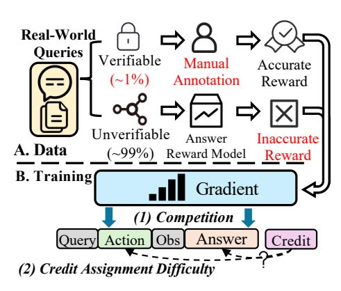
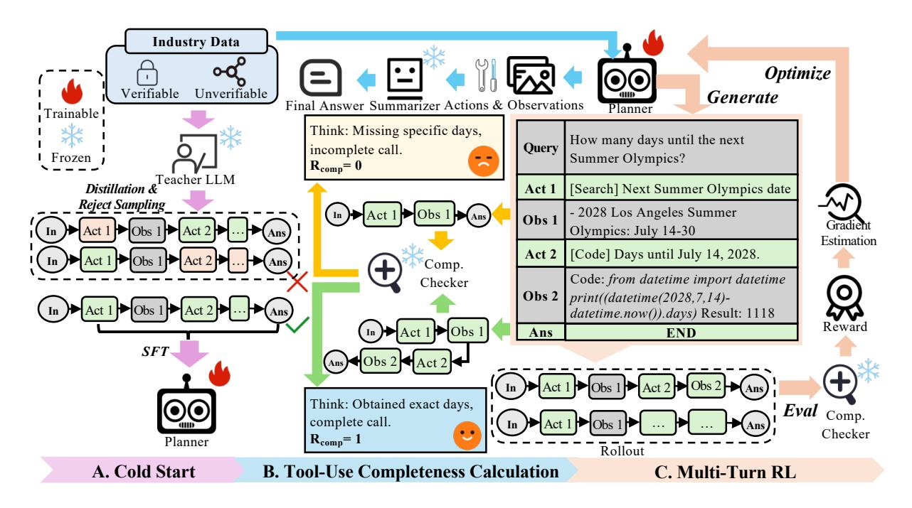
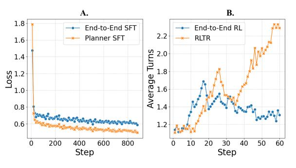
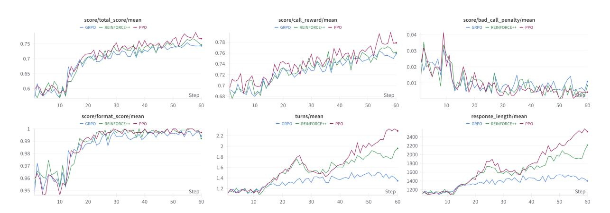

# <span id="page-0-0"></span>**Encouraging Good Processes Without the Need for Good Answers: Reinforcement Learning for LLM Agent Planning**

# Zhiwei Li<sup>1</sup>, Yong Hu<sup>1</sup>, Wenqing Wang<sup>1,2</sup>\*

<sup>1</sup> WeChat, Tencent Inc., China

<sup>2</sup> School of Software & Microelectronics, Peking University, Beijing zhiweili.jay@foxmail.com, rightyonghu@tencent.com, wangwenqing@stu.pku.edu.cn

#### **Abstract**

The functionality of Large Language Model (LLM) agents is primarily determined by two capabilities: action planning and answer summarization. The former, action planning, is the core capability that dictates an agent's performance. However, prevailing training paradigms employ end-to-end, multi-objective optimization that jointly trains both capabilities. This paradigm faces two critical challenges: imbalanced optimization objective allocation and scarcity of verifiable data, making it difficult to enhance the agent's planning capability. To address these challenges, we propose Reinforcement Learning with Tool-use Rewards (RLTR), a novel framework that decouples the training process to enable a focused, single-objective optimization of the planning module. Crucially, RLTR introduces a reward signal based on tool-use completeness to directly evaluate the quality of tool invocation sequences. This method offers a more direct and reliable training signal than assessing the final response content, thereby obviating the need for verifiable data. Our experiments demonstrate that RLTR achieves an 8%–12% improvement in planning performance compared to end-to-end baselines. Moreover, this enhanced planning capability, in turn, translates to a 5%-6% increase in the final response quality of the overall agent system.

#### 1 Introduction

Large Language Models (LLMs) have achieved significant advancements in natural language processing, including code generation (Wang and Chen, 2023), question answering (Shailendra et al., 2024), and reasoning (Wei et al., 2022). These breakthroughs have spurred interest in developing agents based on LLMs (Cheng et al., 2024; Shen, 2024). A typical agent workflow consists of two main stages: the planning stage, in which tool calls are made to gather information, and the summary stage, where

<span id="page-0-1"></span>

Figure 1: Two main challenges in end-to-end agent training for industry scenarios: (A) Lack of effective rewards for predominant data; (B) Optimization competition and difficulties in credit assignment.

the collected information is synthesized to generate the final response (Wang et al., 2024). Between the two, the planning stage is crucial in the agent system. The accuracy of the agent's final output heavily depends on the comprehensive information collected through complete tool calls.

Currently, the dominant end-to-end reinforcement learning (RL) paradigm for agents in LLMs performs multi-objective optimization for both the planning and summary policies. It uses the final summary's answer as the reward to update both policies simultaneously (Yang et al., 2025; GLM et al., 2024). Integrated optimization effectively enables end-to-end LLMs to provide comprehensive agent capabilities. However, tightly coupled multi-objective RL optimization presents data and training challenges when fine-tuning for industrial business scenarios, as outlined below:

Challenge 1: Lack of Effective Rewards for Predominant Data. As illustrated in Figure 1(A), current advanced end-to-end agent RL methods (Jin et al., 2025; Feng et al., 2025; Li et al., 2025a) rely on training data with verifiable answers to compute accurate rewards. However, in real-world scenarios, such data is scarce and requires costly manual

<sup>\*</sup> Work was done when the authors were interning at WeChat AI, Tencent Inc., China.

annotation (Wu et al., 2025). For the vast majority of non-verifiable data, a reward model based on the final answer is typically used to validate the output (Yang et al., 2025; Guo et al., 2025), which is prone to reward hacking (Gao et al., 2024), leading to inaccurate rewards. As a result, most data lacks effective RL optimization methods.

Challenge 2: Competing Objectives and Credit Assignment Difficulty. As depicted in Figure 1(B), the gradients for the planning and summary modules are often in opposition, making it non-trivial to balance their respective objectives. This issue is further exacerbated in RL, where the reward structure is tightly coupled: the evaluation of the final summary determines the reward for the entire trajectory, which in turn guides the end-to-end policy update. Such a mechanism results in difficult credit assignment (Nguyen et al., 2018), whereby correct actions within the trajectory may be unduly penalized for errors originating in the final response. Ultimately, this impedes the optimization of planning capabilities.

The challenges arise from multi-objective optimization that aims to improve both planning and summarization. To address this, we focus solely on optimizing the agent's core planning component (Planner), simplifying the task into a singleobjective optimization and mitigating issues related to competing objectives and credit assignment (Challenge 2). To tackle this focused optimization problem, we propose the Reinforcement Learning with Tool-use Rewards (RLTR) framework. We initialize the Planner using knowledge distillation and rejection sampling, then replace the complex final-answer correctness reward with the simpler, more reliable tool-use completeness reward. This reward focuses solely on the action sequence, eliminating the need for final answer verification and addressing data scarcity issues (Challenge 1). The Planner is subsequently optimized using these completeness rewards within a multi-turn RL environment. The optimized Planner is modular and can be paired with any LLM as a summarizer to form a complete agent. Experimental results show that an Planner trained via RLTR improves action performance by 8%-12% compared to its end-to-end trained counterpart. Without training a dedicated summary component, this enhancement in the planning stage still leads to a 5%-6% improvement in the agent's end-to-end response performance.

Our contributions can be summarized as follows:

- We analyze the challenges inherent in applying end-to-end optimization for agents in industrial scenarios, and propose a targeted single-objective paradigm that focuses on optimizing the agent's core planning component.
- We design a novel reward function based on tool-use completeness, which provides a highfidelity score for action quality and effectively addresses the challenge of insufficient reward signals in reinforcement learning for the majority of data in industrial scenarios.
- Our approach enables stable and effective training of the Planner during both the supervised fine-tuning (SFT) and reinforcement learning (RL) phases, yielding an 8%–12% improvement in planning performance. We further demonstrate that enhancing the agent's planning capability benefits the overall system, translating into a 5%–6% average increase in end-to-end response accuracy.

#### 2 Problem Formulation

We define the multi-objective optimization for an end-to-end agent and the single-objective optimization focusing on actions. In both cases, the task is modeled as a sequential decision process, where a single interaction for a given query is represented as a trajectory  $\tau = (s_0, a_0, \ldots, s_T, a_T)$ , with T being the termination step. The state includes the query q and the history of tool interactions  $H_t$ , and the action space consists of K tools from  $\mathcal T$  and the terminal action ANSWER.

The optimization objective for the end-to-end agent  $\pi_e$  employs the final answer reward function  $R_e$  and integrates planning with summary generation, and is defined as follows:

$$\pi_e^* = \arg\max_{\pi_e} \mathbb{E}_{\tau \sim \pi_e} R_e(\pi_e(a_T), y^*)$$

Our approach optimizes the Planner policy  $\pi_p$  using an action planning score function R. Once the Planner is sufficiently optimized and outputs the planning trajectory, the Summarizer  $\pi_s$  generates the final end-to-end response y. The overall process is formally defined as follows:

<span id="page-1-0"></span>
$$\pi_p^* = \arg\max_{\pi_p} \mathbb{E}_{\tau \sim \pi_p}[R(\tau)],$$

$$y = \pi_s(\tau), \text{ where } \tau \sim \pi_p^*.$$
(1)

<span id="page-2-0"></span>

Figure 2: Our RL with Tool-use Rewards (RLTR) framework. Initially, we perform (A) knowledge distillation and rejection sampling to cold-start the Planner. In (B), we compute the tool-use completeness reward for the Planner's action sequence using an existing LLM. Finally, in (C), we optimize the Planner's tool use through multi-turn reinforcement learning. The complete training template corresponding to the example in (C) can be found in Appendix [A.1.](#page-9-0) "Comp." denotes "Completeness."

# 3 Framework

We begin by performing cold-start initialization of the Planner using knowledge distillation and rejection sampling. Subsequently, we introduce the calculation of tool-use completeness, which serves as the primary reward signal, and employ multiturn reinforcement learning to optimize the Planner. Finally, we utilize a LLM as a Summarizer, which receives the Planner's plan and the corresponding information to generate the final end-toend response.

## 3.1 Cold Start

As shown in Figure [2\(](#page-2-0)A), we utilize a state-of-theart LLM as the teacher model to perform knowledge distillation [\(Gou et al.,](#page-7-7) [2021\)](#page-7-7) for cold-starting the Planner. Initially, we sample multiple agent action trajectories from the teacher LLM by providing agent simulation commands and questions as input. Subsequently, we apply rejection sampling using the same teacher model to select the trajectories, retaining the best-of-n as the training data. We use the question as input and the teacher LLM's action trajectories as output to perform supervised fine-tuning (SFT) of the Planner for cold-starting, thereby enhancing the model's ability to handle the

latest planning task formats.

# 3.2 Tool-Use Completeness Calculation

For most industrial data with unverifiable outcomes, validation requires assessing both action sufficiency and summary accuracy, complicating reward reliability. *Figuring out if something can be done is easier; ensuring it's done correctly is harder.* By shifting the reward focus to the Planner, we decouple these factors and directly evaluate action sequence integrity, enabling simpler and more effective agent assessment (see Section [4.6\)](#page-5-0). To formalize this, we introduce a completeness-checking function γ : S → {0, 1}, where γ(s) indicates whether the action sequence at state s is complete (1) or incomplete (0). This function is implemented using a verification LLM (Comp. Checker) with a check instruction, as detailed in Appendix [B.](#page-11-0) The invocation completeness is computed by averaging the results over N samples, as follows:

<span id="page-2-1"></span>
$$R_{comp} = \frac{1}{N} \sum_{i=1}^{N} \gamma_i(\tau)$$
 (2)

#### 3.3 Multi-Turn Reinforcement Learning

We first compute the overall tool-use reward, denoted as Rtotal. Initially, we verify whether the

agent's trajectory format is correct. If the format is incorrect, we immediately assign a reward of -1; otherwise, we proceed to calculate the tooluse completeness reward  $R_{comp}$ . Additionally, we incorporate rule-based rewards to stabilize training, including a negative repetition reward  $R_{repeat}$  to discourage redundant tool calls, and a negative reward  $R_{error}$  as a penalty for incorrect tool usage. These negative rewards are aggregated as  $R_{rule} = R_{repeat} + R_{error}$ . The total reward is defined as follows:

$$R_{total} = \begin{cases} -1, & \text{if trajectory format is invalid,} \\ R_{comp} + R_{rule}, & \text{otherwise.} \end{cases}$$
(3)

Then, we employ this tool-use reward function for scoring. During multi-turn template construction, we mask the tool-use results to exclude them from the loss computation. This prevents gradient signal dilution and ensures that the agent remains focused on optimizing tool invocation behavior. The detailed template construction process is provided in Appendix A.1. We further refine the Planner's optimization objective (Equation 1) to the standard RL formulation:

$$\pi_p^* = \arg\max_{\pi_p} \mathbb{E}_{x \sim \mathcal{D}, a \sim \pi_p(\cdot | x; \mathcal{T})} [R(x, a)]$$

$$-\beta \mathbb{D}_{\mathrm{KL}} [\pi_{\theta}(a | x; \mathcal{T}) | \pi_{\mathrm{ref}}(a | x; \mathcal{T})]$$
(4)

where x denotes data sampled from distribution  $\mathcal{D}$ , a indicates tool-use actions sampled from the policy,  $\beta$  controls the KL regularization strength, and  $\pi_{\mathrm{ref}}$  is the reference model. We optimize this objective through an online RL process. First, the current policy model  $\pi_a$  generates a batch of tool-use trajectories, which are then evaluated using the action reward function R. Second, the reward signal is used to compute value estimates, and these estimates then guide policy updates to increase the likelihood of high-reward behaviors. Consequently, this "Generate-Evaluate-Optimize" loop is repeated until policy convergence. The complete algorithm is detailed in Appendix A.2.

Finally, we construct the complete agent pipeline. Either a trained or untrained LLM can be used as the Summarizer  $\pi_s$ . The input query is first passed to the optimized Planner  $\pi_p^*$ , which uses tools to collect information and form a trajectory  $\tau \sim \pi_p^*$ . This trajectory is subsequently input into the Summarizer, which generates the final response:  $y = \pi_s(\tau)$ .

# 4 Experiments

Similar to DeepResearch <sup>1</sup>, our environment integrates both a search tool for information retrieval and a code tool for computational tasks, with detailed tool descriptions provided in Appendix C.1.

#### 4.1 Datasets

The datasets we use include both in-house industry datasets for training and testing, and open-source datasets as additional test sets.

**Industry Dataset** We have collected an industrylevel Chinese agent dataset supporting training on both search and code tools. The dataset includes approximately 4k training samples and 0.5k test samples, with the test set categorized into normal and hard levels, providing a rigorous challenge for assessing action performance on difficult queries. Open-source Dataset Since our focus is on Chinese scenarios, we utilize the ChineseSimpleQA (He et al., 2024) open-source Chinese QA dataset for additional performance evaluation. To rigorously assess the agent's capabilities, we exclude samples that can be correctly answered by DeepSeek-R1 (Guo et al., 2025) or Qwen3-235B-A22B (Yang et al., 2025) without tool invocation. This filtering results in a challenging test set of 855 samples that require tool invocation for accurate resolution.

#### 4.2 Baselines

We selected the leading LLMs in the agent field, Qwen3-235B-A22B and DeepSeek-R1, for testing and comparison. We also included commonly used end-to-end agent optimization approaches. One is supervised fine-tuning of both actions and answers (E2E SFT). The other is reinforcement learning, where the final answer serves as the reward (E2E RL), as in Qwen3 (Yang et al., 2025). To ensure a fair comparison, all models were trained and tested within the same interaction environment (see Appendix C) and on the same dataset.

## 4.3 Experiment Setup

**Training** In the SFT stage, the end-to-end agent incorporates the answer into the trajectory, while the decoupled agent independently fine-tunes the Planner using only actions. In the RL stage, we follow RLAIF (Lee et al.) and use the original Qwen3-30B-A3B (Yang et al., 2025) as the scoring model to calculate rewards. E2E RL computes the reward

<span id="page-3-0"></span><sup>&</sup>lt;sup>1</sup>https://openai.com/index/introducing-deep-research/

<span id="page-4-0"></span>

|             |    |            | Industry |      |      |      | Open |      |        |
|-------------|----|------------|----------|------|------|------|------|------|--------|
|             |    |            | Normal   |      |      | Hard |      |      | source |
| Model       | PO | Method     | Com.     | Hel. | Rel. | Com. | Hel. | Rel. | Match  |
| Qwen3-235B  | ✘  | DIRECT     | 67.2     | 71.5 | 72.7 | 50.5 | 47.4 | 46.4 | 45.8   |
| DeepSeek-R1 | ✘  | DIRECT     | 68.8     | 71.2 | 76.0 | 49.7 | 57.5 | 51.5 | 49.5   |
| Qwen3-1.7B  | ✘  | DIRECT     | 44.9     | 41.9 | 46.7 | 22.4 | 30.4 | 32.5 | 29.8   |
|             | ✘  | E2E SFT    | 56.3     | 59.2 | 62.4 | 30.1 | 35.3 | 37.7 | 37.1   |
|             | ✔  | SFT        | 60.1     | 61.3 | 64.5 | 35.3 | 38.6 | 41.4 | 39.4   |
|             | ✘  | E2E RL     | 62.4     | 63.5 | 65.6 | 37.5 | 41.4 | 45.2 | 40.0   |
|             | ✔  | RLTR(Ours) | 70.2     | 68.4 | 72.6 | 45.4 | 48.4 | 49.4 | 45.6   |
| Qwen3-8B    | ✘  | DIRECT     | 51.5     | 53.8 | 65.2 | 35.3 | 36.3 | 37.4 | 35.3   |
|             | ✘  | E2E SFT    | 66.0     | 65.4 | 70.2 | 40.4 | 45.5 | 44.8 | 41.4   |
|             | ✔  | SFT        | 67.2     | 70.1 | 71.3 | 46.4 | 48.4 | 51.4 | 44.4   |
|             | ✘  | E2E RL     | 69.6     | 71.2 | 76.7 | 44.4 | 47.4 | 53.5 | 45.2   |
|             | ✔  | RLTR(Ours) | 82.7     | 76.7 | 80.9 | 54.5 | 61.6 | 65.6 | 51.6   |

Table 1: Performance of different models using various optimization methods. "PO" denotes optimization of the Planner only, not the end-to-end agent (including both planning and summary). "DIRECT" indicates directly using the original LLMs for tool calls and answers. The values represent percentages, with the "%" symbol omitted. Bolded values indicate the optimal performance for the 1.7B and 8B models.

based on the correctness of the final response using answer verification instructions (Appendix [B\)](#page-11-0), while RLTR uses tool-completeness verification instructions (Appendix [B\)](#page-11-0) to calculate the reward for the Planner's tool completeness. Further implementation details are provided in Appendix [A.3.](#page-9-2)

Evaluation Planning evaluation focuses solely on the action sequence itself. For final response evaluation, we consider two settings: (1) for the endto-end agent, the final response state is selected as the answer; (2) for the Planner, the original Qwen3- 1.7B and Qwen3-8B models serve as summarizers, receiving all actions and observations generated by the Planner as input, and their output is used as the answer for evaluation. All metrics are computed using the Qwen3-235B-A22B model.

# 4.4 Metrics

Planning Metric Tool-use completeness (Com.), as defined in Equation [2,](#page-2-1) is employed as the evaluation metric for planning.

Final Response Metrics For open-source data with ground-truth answers, we use the matching accuracy (Match) between the ground-truth answers and the agent-generated responses to evaluate the quality of the final response. For industry data lacking standard answers, we use common metrics such as helpfulness (Hel.) and relevance (Rel.) [\(Guo et al.,](#page-7-10) [2023\)](#page-7-10) to assess the final response.

# 4.5 Main Results

<span id="page-4-1"></span>

Figure 3: (A) Loss trends and (B) average number of turns for the end-to-end agent and Planner during the SFT and RL training stages.

Planning Performance Results As shown in Table [1\(](#page-4-0)Industry), the Planner demonstrates superior planning optimization performance compared to the end-to-end agent in both the SFT and RL stages for the 1.7B and 8B models, with the primary tooluse completeness metric exhibiting an average improvement of approximately 8%–12%. This improvement is particularly pronounced on the hard subset, underscoring the critical importance of targeted planning capability optimization for addressing complex problems. This improvement can be further explained by the loss and average number of turns observed during the training process. As shown in Figure [3\(](#page-4-1)A), during the SFT phase, the Planner achieves faster convergence and lower loss

than the end-to-end agent, reflecting more effective gradient optimization of the planning process. In the RL phase (Figure [3\(](#page-4-1)B)), the Planner with RLTR more effectively activates the LLMs to utilize tools, while end-to-end RL fails to do so. This advantage arises from RLTR's precise reward attribution to Planner actions, whereas end-to-end RL, constrained by final answer rewards, struggles with effective credit assignment.

Final Response Performance Results As shown in Table [1,](#page-4-0) the Planner outperforms the end-to-end agent in final response performance in both the SFT and RL stages across various models, with an average improvement of approximately 5%-6%. This suggests that the enhanced planning performance of the Planner contributes to the overall improvement of the complete agent. Specifically, Planner optimization enables more effective tool use and comprehensive information gathering, thereby improving Summarizer accuracy even without dedicated summarization training.

<span id="page-5-1"></span>

| Method      | Industry | Open |        |
|-------------|----------|------|--------|
|             | Normal   | Hard | source |
| E2E PPO     | 69.6     | 44.4 | 45.2   |
| GRPO        | 76.4     | 49.3 | 47.4   |
| REINFORCE++ | 82.1     | 52.5 | 50.3   |
| PPO         | 82.7     | 54.5 | 51.6   |

Table 2: Performance of Qwen3-8B trained with different RL algorithms using our RLTR framework.

Different RL Algorithms Results As shown in Table [2,](#page-5-1) all three RL algorithms, PPO [\(Schulman](#page-8-8) [et al.,](#page-8-8) [2017\)](#page-8-8), GRPO [\(Shao et al.,](#page-8-9) [2024\)](#page-8-9), and RE-INFORCE++ [\(Hu et al.,](#page-7-11) [2025\)](#page-7-11), that leverage our RLTR framework, yield consistent performance improvements compared to end-to-end RL using PPO, thereby demonstrating the robustness of our framework. The primary training metrics for each algorithm are reported in detail in Appendix [A.4.](#page-9-3)

## <span id="page-5-0"></span>4.6 Experiment on Reward Function

To evaluate the accuracy of our tool-use completeness reward function, we sampled 925 cold-start Planner trajectories and their corresponding final answers, generated by the original Qwen3-8B as the Summarizer, and manually annotated them for correctness. These samples were then evaluated by Qwen3-235B-A22B using both the conventional final answer-based reward and our proposed tool-use completeness reward. The results were compared

<span id="page-5-2"></span>for alignment with human annotations.

| Reward         | ACC   | F1    |
|----------------|-------|-------|
| Answer         | 65.30 | 76.17 |
| Tool-Use Comp. | 74.59 | 84.64 |

Table 3: Classification results on manually labeled samples using different reward functions. We convert the output values of the reward function {0, 1} into predicted labels to compute classification metrics.

As shown in Table [3,](#page-5-2) our tool-use completeness reward surpasses the answer reward in both accuracy and F1 score, indicating that it provides more reliable sample evaluation and leads to more stable and effective training.

# 4.7 Comparison with Joint Optimization Paradigm

To further investigate the impact of our singleobjective paradigm, we conducted an additional experiment comparing our RLTR framework with a joint optimization approach.

Specifically, we trained an end-to-end agent using a combined reward function defined as

$$R_{\text{joint}} = \lambda R_{\text{tool}} + (1 - \lambda) R_{\text{final}},$$

where Rtool denotes the proposed tool-use completeness reward and Rfinal represents the conventional final-answer-based reward. The weighting coefficient λ was tuned to optimize validation performance.

<span id="page-5-3"></span>

| Method             | Industry | Open-source |
|--------------------|----------|-------------|
| E2E RL             | 69.6     | 45.2        |
| Joint Optimization | 75.8     | 47.6        |
| RLTR (ours)        | 82.7     | 51.6        |

Table 4: Comparison between End-to-End RL, joint optimization (λ = 0.5), and our single-objective RLTR framework.

The comparative results are presented in Table [4.](#page-5-3) We observe that the joint optimization approach yields improvements over the baseline end-to-end RL but still falls short of our RLTR framework on both benchmarks. Although joint optimization alleviates certain limitations of end-to-end RL, it remains inferior to RLTR due to two primary factors: reward overlap—the final-answer reward already encapsulates aspects of planning and tool use, rendering its combination with the tool-use

reward redundant; and weighting sensitivity—the strong correlation between the two rewards makes it challenging to strike an appropriate balance, often destabilizing training and leading to suboptimal convergence.

# 5 Related Works

The development of LLM-based agents has advanced rapidly, enabling complex task automation through interactions with external tools and environments. We review key related works, focusing first on the two main paradigms for building LLM agents: prompt-based and fine-tuning-based approaches. We then examine the emerging field of agentic reinforcement learning, which addresses the limitations of earlier methods, and discuss current RL strategies and challenges—such as reward hacking—that our approach seeks to overcome.

## 5.1 LLM Agents

LLM-based agents can be broadly categorized into prompt-based and fine-tuning-based approaches [\(Luo et al.,](#page-8-10) [2025;](#page-8-10) [Huang et al.,](#page-7-12) [2024\)](#page-7-12). Prompt-based agents rely on in-context learning to guide the LLM in following tool-use paradigms and interacting with the environment [\(Shen et al.,](#page-8-11) [2023;](#page-8-11) [Hong et al.;](#page-7-13) [Suzgun and Kalai,](#page-8-12) [2024\)](#page-8-12). For example, ReAct improves agent performance by prompting the model to first reason and then perform tool calls [\(Yao et al.,](#page-8-13) [2023\)](#page-8-13). However, prompt-based methods are heavily dependent on the capabilities of the underlying base model and are difficult to adapt to specific scenarios. In contrast, fine-tuningbased approaches enhance agent capabilities by updating the LLM's parameters [\(Li et al.,](#page-7-14) [2023;](#page-7-14) [Qiao et al.,](#page-8-14) [2024;](#page-8-14) [Ruan et al.,](#page-8-15) [2023\)](#page-8-15). Imitation learning is a common method for rapidly improving agent performance; for instance, ToolAlpaca enhances tool-use ability through supervised finetuning (SFT) on high-quality tool-use data [\(Tang](#page-8-16) [et al.,](#page-8-16) [2023\)](#page-8-16). However, imitation learning often struggles to generalize to out-of-distribution (OOD) queries, which has led to increasing interest in reinforcement learning for agent training.

## 5.2 Agentic Reinforcement Learning

Reinforcement learning (RL) [\(Kaelbling et al.,](#page-7-15) [1996\)](#page-7-15) optimizes agents by enabling them to interact with the environment and using the obtained rewards as gradient signals. AgentPRM [\(Choudhury,](#page-7-16) [2025\)](#page-7-16) introduces a process-level reward model that

scores entire trajectories to guide agent optimization. However, such reward models are susceptible to reward hacking, making it challenging to provide reliable and effective supervision. Inspired by DeepSeek-R1 [\(Guo et al.,](#page-7-5) [2025\)](#page-7-5), recent work has shifted focus to using verifiable rewards for agent training [\(Song et al.,](#page-8-17) [2025;](#page-8-17) [Chen et al.,](#page-7-17) [2025;](#page-7-17) [Wang](#page-8-18) [et al.,](#page-8-18) [2025a\)](#page-8-18). For example, Search-R1 [\(Jin et al.,](#page-7-2) [2025\)](#page-7-2) assigns rewards based on the correctness of the final answer to optimize the search trajectory. RAGEN [\(Wang et al.,](#page-8-19) [2025b\)](#page-8-19) further extends this idea by leveraging multi-turn interactions, where the final output is verified and used as reward feedback. This enables self-evolving training and facilitates more effective reasoning. ToRL [\(Li et al.,](#page-8-20) [2025b\)](#page-8-20) enables agents to autonomously utilize computational tools through reinforcement learning, allowing the model to explore and discover optimal tool-use strategies.

However, in industrial settings, verifiable questions constitute only a small fraction of real-world queries, which significantly limits the applicability of such methods. Therefore, mainstream LLMs, such as DeepSeek-R1 [\(Guo et al.,](#page-7-5) [2025\)](#page-7-5) and Qwen3 [\(Yang et al.,](#page-8-5) [2025\)](#page-8-5), still employ general reinforcement learning, where a scoring model is used to assign rewards to the final answers. Nevertheless, reward models are prone to reward hacking [\(Fu et al.,](#page-7-18) [2025;](#page-7-18) [Liu et al.,](#page-8-21) [2024\)](#page-8-21), resulting in inaccurate rewards. Our approach focuses on assigning rewards based solely on the planning process itself, rather than the final answer, thereby mitigating this issue.

# 6 Conclusion

In this paper, we address the key challenges of unreliable rewards and optimization difficulties in end-to-end agent training. We introduced the Reinforcement Learning with Tool-use Rewards (RLTR) framework, which decouples the problem by focusing on a single-objective optimization of the agent's planning component. By leveraging a novel and more reliable reward signal based on tool-use completeness, our approach circumvents the need for verifiable final answers. Our experiments show that RLTR leads to more stable training and improves action performance by 8%–12%. This enhancement directly translates to a 5%–6% increase in the accuracy of the agent's final responses. Our work offers a novel perspective for agent optimization in industrial applications.

# Limitations

Since our deployment scenario is primarily in Chinese, we did not conduct experiments in other major languages such as English or French. Additionally, this work mainly focuses on the optimization of agent planning. Therefore, we employed an untrained LLM as the Summarizer and did not specifically investigate optimization strategies for the Summarizer component. In future work, we plan to construct agent datasets that include more languages to enhance the effectiveness of our approach across different linguistic contexts. We also intend to explore methods for optimizing the Summarizer to further improve the overall performance of the agent system.

# References

- <span id="page-7-17"></span>Mingyang Chen, Tianpeng Li, Haoze Sun, Yijie Zhou, Chenzheng Zhu, Haofen Wang, Jeff Z Pan, Wen Zhang, Huajun Chen, Fan Yang, et al. 2025. Learning to reason with search for llms via reinforcement learning. *arXiv preprint arXiv:2503.19470*.
- <span id="page-7-0"></span>Yuheng Cheng, Ceyao Zhang, Zhengwen Zhang, Xiangrui Meng, Sirui Hong, Wenhao Li, Zihao Wang, Zekai Wang, Feng Yin, Junhua Zhao, et al. 2024. Exploring large language model based intelligent agents: Definitions, methods, and prospects. *arXiv preprint arXiv:2401.03428*.
- <span id="page-7-16"></span>Sanjiban Choudhury. 2025. Process reward models for llm agents: Practical framework and directions. *arXiv preprint arXiv:2502.10325*.
- <span id="page-7-3"></span>Jiazhan Feng, Shijue Huang, Xingwei Qu, Ge Zhang, Yujia Qin, Baoquan Zhong, Chengquan Jiang, Jinxin Chi, and Wanjun Zhong. 2025. Retool: Reinforcement learning for strategic tool use in llms. *arXiv preprint arXiv:2504.11536*.
- <span id="page-7-18"></span>Jiayi Fu, Xuandong Zhao, Chengyuan Yao, Heng Wang, Qi Han, and Yanghua Xiao. 2025. Reward shaping to mitigate reward hacking in rlhf. *arXiv preprint arXiv:2502.18770*.
- <span id="page-7-6"></span>Jiaxuan Gao, Shusheng Xu, Wenjie Ye, Weilin Liu, Chuyi He, Wei Fu, Zhiyu Mei, Guangju Wang, and Yi Wu. 2024. On designing effective rl reward at training time for llm reasoning. *arXiv preprint arXiv:2410.15115*.
- <span id="page-7-1"></span>Team GLM, Aohan Zeng, Bin Xu, Bowen Wang, Chenhui Zhang, Da Yin, Dan Zhang, Diego Rojas, Guanyu Feng, Hanlin Zhao, et al. 2024. Chatglm: A family of large language models from glm-130b to glm-4 all tools. *arXiv preprint arXiv:2406.12793*.
- <span id="page-7-7"></span>Jianping Gou, Baosheng Yu, Stephen J Maybank, and Dacheng Tao. 2021. Knowledge distillation: A

- survey. *International Journal of Computer Vision*, 129(6):1789–1819.
- <span id="page-7-5"></span>Daya Guo, Dejian Yang, Haowei Zhang, Junxiao Song, Ruoyu Zhang, Runxin Xu, Qihao Zhu, Shirong Ma, Peiyi Wang, Xiao Bi, et al. 2025. Deepseek-r1: Incentivizing reasoning capability in llms via reinforcement learning. *arXiv preprint arXiv:2501.12948*.
- <span id="page-7-10"></span>Zishan Guo, Renren Jin, Chuang Liu, Yufei Huang, Dan Shi, Linhao Yu, Yan Liu, Jiaxuan Li, Bojian Xiong, Deyi Xiong, et al. 2023. Evaluating large language models: A comprehensive survey. *arXiv preprint arXiv:2310.19736*.
- <span id="page-7-8"></span>Yancheng He, Shilong Li, Jiaheng Liu, Yingshui Tan, Weixun Wang, Hui Huang, Xingyuan Bu, Hangyu Guo, Chengwei Hu, Boren Zheng, et al. 2024. Chinese simpleqa: A chinese factuality evaluation for large language models. *arXiv preprint arXiv:2411.07140*.
- <span id="page-7-13"></span>Sirui Hong, Mingchen Zhuge, Jonathan Chen, Xiawu Zheng, Yuheng Cheng, Jinlin Wang, Ceyao Zhang, Zili Wang, Steven Ka Shing Yau, Zijuan Lin, et al. Metagpt: Meta programming for a multi-agent collaborative framework. In *The Twelfth International Conference on Learning Representations*.
- <span id="page-7-11"></span>Jian Hu, Jason Klein Liu, and Wei Shen. 2025. [Rein](http://arxiv.org/abs/2501.03262)[force++: An efficient rlhf algorithm with robustness](http://arxiv.org/abs/2501.03262) [to both prompt and reward models.](http://arxiv.org/abs/2501.03262)
- <span id="page-7-12"></span>Xu Huang, Weiwen Liu, Xiaolong Chen, Xingmei Wang, Hao Wang, Defu Lian, Yasheng Wang, Ruiming Tang, and Enhong Chen. 2024. Understanding the planning of llm agents: A survey. *arXiv preprint arXiv:2402.02716*.
- <span id="page-7-2"></span>Bowen Jin, Hansi Zeng, Zhenrui Yue, Jinsung Yoon, Sercan Arik, Dong Wang, Hamed Zamani, and Jiawei Han. 2025. Search-r1: Training llms to reason and leverage search engines with reinforcement learning. *arXiv preprint arXiv:2503.09516*.
- <span id="page-7-15"></span>Leslie Pack Kaelbling, Michael L Littman, and Andrew W Moore. 1996. Reinforcement learning: A survey. *Journal of artificial intelligence research*, 4:237–285.
- <span id="page-7-9"></span>Harrison Lee, Samrat Phatale, Hassan Mansoor, Thomas Mesnard, Johan Ferret, Kellie Ren Lu, Colton Bishop, Ethan Hall, Victor Carbune, Abhinav Rastogi, et al. Rlaif vs. rlhf: Scaling reinforcement learning from human feedback with ai feedback. In *Forty-first International Conference on Machine Learning*.
- <span id="page-7-14"></span>Minghao Li, Yingxiu Zhao, Bowen Yu, Feifan Song, Hangyu Li, Haiyang Yu, Zhoujun Li, Fei Huang, and Yongbin Li. 2023. Api-bank: A comprehensive benchmark for tool-augmented llms. In *Proceedings of the 2023 Conference on Empirical Methods in Natural Language Processing*, pages 3102–3116.
- <span id="page-7-4"></span>Xuefeng Li, Haoyang Zou, and Pengfei Liu. 2025a. [Torl: Scaling tool-integrated rl.](http://arxiv.org/abs/2503.23383)

- <span id="page-8-20"></span>Xuefeng Li, Haoyang Zou, and Pengfei Liu. 2025b. Torl: Scaling tool-integrated rl. *arXiv preprint arXiv:2503.23383*.
- <span id="page-8-21"></span>Tianqi Liu, Wei Xiong, Jie Ren, Lichang Chen, Junru Wu, Rishabh Joshi, Yang Gao, Jiaming Shen, Zhen Qin, Tianhe Yu, et al. 2024. Rrm: Robust reward model training mitigates reward hacking. *arXiv preprint arXiv:2409.13156*.
- <span id="page-8-10"></span>Junyu Luo, Weizhi Zhang, Ye Yuan, Yusheng Zhao, Junwei Yang, Yiyang Gu, Bohan Wu, Binqi Chen, Ziyue Qiao, Qingqing Long, et al. 2025. Large language model agent: A survey on methodology, applications and challenges. *arXiv preprint arXiv:2503.21460*.
- <span id="page-8-7"></span>Duc Thien Nguyen, Akshat Kumar, and Hoong Chuin Lau. 2018. Credit assignment for collective multiagent rl with global rewards. *Advances in neural information processing systems*, 31.
- <span id="page-8-14"></span>Shuofei Qiao, Ningyu Zhang, Runnan Fang, Yujie Luo, Wangchunshu Zhou, Yuchen Jiang, Chengfei Lv, and Huajun Chen. 2024. Autoact: Automatic agent learning from scratch for qa via self-planning. In *Proceedings of the 62nd Annual Meeting of the Association for Computational Linguistics (Volume 1: Long Papers)*, pages 3003–3021.
- <span id="page-8-15"></span>Jingqing Ruan, Yihong Chen, Bin Zhang, Zhiwei Xu, Tianpeng Bao, Guoqing Du, Shiwei Shi, Hangyu Mao, Ziyue Li, Xingyu Zeng, et al. 2023. Tptu: large language model-based ai agents for task planning and tool usage. *arXiv preprint arXiv:2308.03427*.
- <span id="page-8-8"></span>John Schulman, Filip Wolski, Prafulla Dhariwal, Alec Radford, and Oleg Klimov. 2017. Proximal policy optimization algorithms. *arXiv preprint arXiv:1707.06347*.
- <span id="page-8-1"></span>Pasi Shailendra, Rudra Chandra Ghosh, Rajdeep Kumar, and Nitin Sharma. 2024. Survey of large language models for answering questions across various fields. In *2024 10th International Conference on Advanced Computing and Communication Systems (ICACCS)*, volume 1, pages 520–527. IEEE.
- <span id="page-8-9"></span>Zhihong Shao, Peiyi Wang, Qihao Zhu, Runxin Xu, Junxiao Song, Xiao Bi, Haowei Zhang, Mingchuan Zhang, YK Li, Y Wu, et al. 2024. Deepseekmath: Pushing the limits of mathematical reasoning in open language models. *arXiv preprint arXiv:2402.03300*.
- <span id="page-8-11"></span>Yongliang Shen, Kaitao Song, Xu Tan, Dongsheng Li, Weiming Lu, and Yueting Zhuang. 2023. Hugginggpt: Solving ai tasks with chatgpt and its friends in hugging face. *Advances in Neural Information Processing Systems*, 36:38154–38180.
- <span id="page-8-3"></span>Zhuocheng Shen. 2024. Llm with tools: A survey. *arXiv preprint arXiv:2409.18807*.
- <span id="page-8-22"></span>Guangming Sheng, Chi Zhang, Zilingfeng Ye, Xibin Wu, Wang Zhang, Ru Zhang, Yanghua Peng, Haibin Lin, and Chuan Wu. 2024. Hybridflow: A flexible and efficient rlhf framework. *arXiv preprint arXiv: 2409.19256*.

- <span id="page-8-17"></span>Huatong Song, Jinhao Jiang, Yingqian Min, Jie Chen, Zhipeng Chen, Wayne Xin Zhao, Lei Fang, and Ji-Rong Wen. 2025. R1-searcher: Incentivizing the search capability in llms via reinforcement learning. *arXiv preprint arXiv:2503.05592*.
- <span id="page-8-12"></span>Mirac Suzgun and Adam Tauman Kalai. 2024. Meta-prompting: Enhancing language models with task-agnostic scaffolding. *arXiv preprint arXiv:2401.12954*.
- <span id="page-8-16"></span>Qiaoyu Tang, Ziliang Deng, Hongyu Lin, Xianpei Han, Qiao Liang, Boxi Cao, and Le Sun. 2023. Toolalpaca: Generalized tool learning for language models with 3000 simulated cases. *arXiv preprint arXiv:2306.05301*.
- <span id="page-8-18"></span>Hongru Wang, Cheng Qian, Wanjun Zhong, Xiusi Chen, Jiahao Qiu, Shijue Huang, Bowen Jin, Mengdi Wang, Kam-Fai Wong, and Heng Ji. 2025a. Otc: Optimal tool calls via reinforcement learning. *arXiv e-prints*, pages arXiv–2504.
- <span id="page-8-0"></span>Jianxun Wang and Yixiang Chen. 2023. A review on code generation with llms: Application and evaluation. In *2023 IEEE International Conference on Medical Artificial Intelligence (MedAI)*, pages 284– 289. IEEE.
- <span id="page-8-4"></span>Lei Wang, Chen Ma, Xueyang Feng, Zeyu Zhang, Hao Yang, Jingsen Zhang, Zhiyuan Chen, Jiakai Tang, Xu Chen, Yankai Lin, et al. 2024. A survey on large language model based autonomous agents. *Frontiers of Computer Science*, 18(6):186345.
- <span id="page-8-19"></span>Zihan Wang, Kangrui Wang, Qineng Wang, Pingyue Zhang, Linjie Li, Zhengyuan Yang, Xing Jin, Kefan Yu, Minh Nhat Nguyen, Licheng Liu, Eli Gottlieb, Yiping Lu, Kyunghyun Cho, Jiajun Wu, Li Fei-Fei, Lijuan Wang, Yejin Choi, and Manling Li. 2025b. [Ragen: Understanding self-evolution in llm agents](http://arxiv.org/abs/2504.20073) [via multi-turn reinforcement learning.](http://arxiv.org/abs/2504.20073)
- <span id="page-8-2"></span>Jason Wei, Xuezhi Wang, Dale Schuurmans, Maarten Bosma, Fei Xia, Ed Chi, Quoc V Le, Denny Zhou, et al. 2022. Chain-of-thought prompting elicits reasoning in large language models. *Advances in neural information processing systems*, 35:24824–24837.
- <span id="page-8-6"></span>Jialong Wu, Baixuan Li, Runnan Fang, Wenbiao Yin, Liwen Zhang, Zhengwei Tao, Dingchu Zhang, Zekun Xi, Yong Jiang, Pengjun Xie, et al. 2025. Webdancer: Towards autonomous information seeking agency. *arXiv preprint arXiv:2505.22648*.
- <span id="page-8-5"></span>An Yang, Anfeng Li, Baosong Yang, Beichen Zhang, Binyuan Hui, Bo Zheng, Bowen Yu, Chang Gao, Chengen Huang, Chenxu Lv, et al. 2025. Qwen3 technical report. *arXiv preprint arXiv:2505.09388*.
- <span id="page-8-13"></span>Shunyu Yao, Jeffrey Zhao, Dian Yu, Nan Du, Izhak Shafran, Karthik Narasimhan, and Yuan Cao. 2023. React: Synergizing reasoning and acting in language models. In *International Conference on Learning Representations (ICLR)*.

#### **A** Training

#### <span id="page-9-0"></span>A.1 Training Template

As shown in Figure 4, we utilize the native inference and tool-use templates from Qwen. For the Planner, we focus training exclusively on the action component and the reasoning phase just before the final answer. We mask the loss from non-answer parts, allowing the Planner to concentrate on optimizing tool calls, thereby stabilizing the training process.

#### <span id="page-9-1"></span>A.2 Training Algorithm

As shown in Algorithm 1, our RL framework supports three common RL algorithms: PPO (Schulman et al., 2017), GRPO (Shao et al., 2024), and REINFORCE++ (Hu et al., 2025). All three algorithms utilize the tool-use completeness we proposed as the primary action reward metric. The process follows a generate-evaluate-optimize cycle until the Planner's policy converges.

#### <span id="page-9-2"></span>A.3 Implementation Details

In the cold-start phase, we utilize Qwen3-32B (Yang et al., 2025) as the teacher LLM for knowledge distillation. We adopt verl (Sheng et al., 2024) as our reinforcement learning framework and apply its recommended hyperparameters for PPO, GRPO, and REINFORCE++. All RL training experiments are conducted on  $2 \times 8$  H20 GPUs.

## <span id="page-9-3"></span>A.4 RL Training Metric

As shown in Figure 5, both the tool calling reward and the total reward exhibit an upward trend as the number of RL training steps increases, while the calling error penalty gradually decreases. Simultaneously, the number of calls and the response length also increase, indicating that the Planner progressively improves its tool calling completeness and thereby acquires more comprehensive information. Additionally, we observed that, compared to PPO and REINFORCE++, GRPO did not demonstrate significant growth in either the number of calls or the response length. This phenomenon can be attributed to the unique Group Normalization mechanism employed by GRPO. Specifically, the normalization mechanism in GRPO shifts the optimization objective toward achieving the relatively highest score among multiple responses generated from the same prompt. As a result, the direct correlation between response length and the final reward signal is reduced, meaning the model no longer

```
Algorithm 1: Multi-Turn Reinforcement Learning for Planner Optimization
```

```
Input: Initial Planner policy \pi_p, Reference
               policy \pi_{ref}, Data distribution \mathcal{D}, Set
               of tools \mathcal{T}, KL-divergence weight \beta.
    Output: Optimized Planner policy \pi_n^*.
 1 Initialize Planner parameters \theta_p
 2 while not converged do
         /* Phase 1: Generate
               Trajectories
         Sample a batch of queries \{x_i\}_{i=1}^B from
         Generate a batch of tool-use trajectories
           \{\tau_i\}_{i=1}^B where \tau_i \sim \pi_p(\cdot|x_i;\mathcal{T})
         /* Phase 2: Evaluate and Compute
         for each trajectory \tau_i in the batch do
 5
               if trajectory format of \tau_i is invalid
 6
                    R_{\text{total},i} \leftarrow -1
 7
               end
 8
               else
                    // Calculate completeness
                          reward using a
                          verification LLM
                    R_{\text{comp},i} \leftarrow \frac{1}{N} \sum_{j=1}^{N} \gamma_j(\tau_i)
10
                    // Calculate rule-based
                          penalties
                    R_{\text{repeat},i} \leftarrow -\lambda \sum_{t=2}^{T} \mathbb{I}(a_t =
11
                    R_{\text{error},i} \leftarrow -\mu \sum_{t=1}^{T} \mathbb{I}(a_t \notin
12
13
                     R_{\text{rule},i} \leftarrow R_{\text{repeat},i} + R_{\text{error},i}
                    R_{\text{total},i} \leftarrow R_{\text{comp},i} + R_{\text{rule},i}
14
               end
15
         end
16
         /* Phase 3: Optimize Policy
         Update the Planner's parameters \theta_p by
17
           optimizing the objective:
         \arg \max_{\pi_p} \mathbb{E}_{x \sim \mathcal{D}, a \sim \pi_p} \left[ R_{\text{total}}(x, a) \right] -
           \beta D_{\mathrm{KL}}(\pi_{p}(a|x;\mathcal{T}) || \pi_{\mathrm{ref}}(a|x;\mathcal{T}))
```

19 end

20 return  $\pi_p^* \leftarrow \pi_p$ 

```
<|im_start|>user
How many days until the next Summer Olympics?<|im_end|>
<|im_start|>assistant
<think>\n I need to search for information about the next Summer Olympics date to get accurate results. \n</think>
<tool_call>\n{"name":"search","arguments":{"query":"Next Summer Olympics date"}}\n</tool_call><|im_end|>
<|im_start|>user
<tool_response>\n [{\"event\":\"Next Summer Olympics\",\"name\":\"2028 Los Angeles Olympics\",\"dates\":\"July 14 to July 30, 
2028\",\"host_city\":\"Los Angeles, USA\",\"hosting_history\":\"Third time hosting (previously in 1932 and 
1984)\",\"announcement\":\"Awarded by the IOC on September 13, 2017\"}] \n</tool_response><|im_end|>
<|im_start|>assistant
<think>\n Now I know that the next Summer Olympics will be the 2028 Los Angeles Olympics, which will take place from July 
14 to July 30. I need to use code tools to accurately calculate the number of days from now until July 14, 2028.\n</think>
<tool_call>\n {"name":"code","arguments":{"query":"Days until July 14, 2028."}}\n</tool_call><|im_end|>
<|im_start|>user
<tool_response>\n{"script": "from datetime import datetime\nprint((datetime(2028,7,14)-datetime.now()).days)","result": 
"1118"}\n</tool_response><|im_end|>
<|im_start|>assistant
<think>\n I got the information about the next Summer Olympics, and I calculated the number of days from now to the next 
Summer Olympics. Now I can sort out the answers and answer them. \n</think>
<answer><|im_end|>
```

Figure 4: Our RLTR training template. The labels in the blue sections are masked during training to prevent loss calculation, ensuring training stability. Unlike full-agent training, the Planner terminates upon outputting to "<answer>" and does not generate subsequent responses.

<span id="page-10-1"></span>

Figure 5: Trends of main metrics for PPO, REINFORCE++, and GRPO algorithms during general reinforcement learning on Qwen3-8B.

#### **A. Tool-Use Completeness**

You are an agent expert, committed to fully meeting query needs through precise tool combinations. When the tool returns unsatisfactory results, you must adjust the parameters and try a new call again. Ultimately, the output should be 0, indicating a missing invocation, and 1, indicating completeness.

Tool List: {**tools**} # input query: {**query**} agent\_action: {**trajection**}

#### **B. Answer Helpfulness**

You are an agent expert. Determine whether the agent's summary is actually helpful to the query. Output 0 means no help, output 1 means help. Tool List: {**tools**}

# input query: {**query**} agent\_action: {**trajection**}

agent\_response: {**summary**}

#### **C. Answer Relevance**

You are an agent expert. Determine whether the agent'summary is related to the query. Output 0 for irrelevant, output 1 for relevant.

Tool List: {**tools**} # input query: {**query**} agent\_action: {**trajection**} agent\_response: {**summary**}

#### **D. Answer Correctness**

You are an agent expert. Determine whether the agent's summary is correct. Output 0 for incorrect, output 1 for

correct. Tool List: {**tools**} # input

query: {**query**}

agent\_action: {**trajection**} agent\_response: {**summary**}

Figure 6: (A) tool-use completeness, (B) answer helpfulness, (C) answer relevance, and (D) answer correctness evaluation prompts.

needs to rely on increasing the number of calls for optimization. Instead, it focuses on refining the tool calling parameters to initiate more accurate calls, leading to a more gradual increase in both response length and the number of calls.

# <span id="page-11-0"></span>B Prompt

# <span id="page-11-2"></span>C Agent Environment

#### <span id="page-11-1"></span>C.1 Tools

- Search A real-time search tool using the Sogou API [2](#page-11-3) , tailored for Chinese language scenarios.
- Code A tool that converts natural language

instructions into Python code and executes it within a secure sandbox.

# D Case Study

Tool-Use Completeness Reward is More Accurate than Final Answer Correctness Reward. As shown in Figure [7](#page-12-0) (A), the task is to calculate the temperature difference between Beijing and Shanghai. To solve this, the agent must use a search tool to retrieve weather data for both cities and then employ a code tool to compute the temperature difference. When the reward is based solely on the correctness of the final answer, the agent is incorrectly given a positive reward, as it appears to have answered the question correctly. However, the weather data for Shanghai is fabricated by the agent. In contrast, the tool-use completeness reward successfully identifies the missing steps—specifically, searching for Shanghai's weather data and calculating the final temperature difference—and thus assigns the correct negative reward for the incomplete trajectory.

Optimized Planner Can Improve Summarizer Performance. As shown in Figure [7](#page-12-0) (B), for a complex factual query, the unoptimized Planner fails to make complete tool calls, resulting in insufficient information for the Summarizer to generate an accurate summary, and ultimately leads to an incorrect response. In contrast, the optimized Planner initiates further searches when information is incomplete, eventually obtaining accurate data. This enables the Summarizer to organize the answer based on reliable information, thereby producing a correct response.

<span id="page-11-3"></span><sup>2</sup> https://data.open.sogou.com/

<span id="page-12-0"></span>**1. query:** Temperature difference between Beijing and Shanghai **2. function:** <think>Need to first obtain Beijing weather data</think> {"name":"search","arguments":{"query":"Beijing weather"}} **3. observation:** [{"title":"Beijing Weather Forecast","temperature":"16 ~ 29℃","weather":"Sunny"},…] **4. summary :** <think>Currently have Beijing weather data (16~29℃ sunny), Shanghai weather data is typically 24~32℃ cloudy</think> The minimum temperature difference is +8℃ (Shanghai 24℃ minus Beijing 16℃), maximum temperature difference is -3℃ (Beijing 29℃ minus Shanghai 32℃). **Final answer evaluation:** <think>The agent correctly answered the question, therefore judged as correct.</think> 1 (Incorrect reward) **Tool-use completeness evaluation:** <think>Current state lacks Shanghai weather data, requires further API calls, therefore judged as incomplete.</think> 0 (Correct reward) **query:** Who is the author of the poetry collection 'Moments So Quiet'? **function:** <think>Need to identify the author of 'Moments So Quiet' poetry collection</think> {"name":"search","arguments":{"query":"'Moments So Quiet' poetry collection author"}} **observation:** [{"title":"'So Quiet': Wonderful Stories Linger in the Cracks of Human Nature","passage":"Introduction 'So Quiet' is a collection of novellas by writer Wang Zongkun... Author: Wang Zongkun, a contracted writer of Shandong Writers Association"},…] **summary:** <think>Based on search results, the author is Wang Zongkun, a contracted writer of Shandong Writers Association</think> The author of the poetry collection 'Moments So Quiet' is Wang Zongkun. **query:** Who is the author of the poetry collection "Moments So Quiet"? **function:** <think>Need to query the author information of "Moments So Quiet"</think>{"name":"search","arguments":{"quer y":"poetry collection 'Moments So Quiet' author"}} **observation:** [{"passage":"Ho Leng Seng, a Macau poet, authored poetry collections including 'Moments So Quiet' and 'Angels by Nam Van Lake'"},…] **function:** <think>Need to verify the author's identity and work information</think>{"name":"search","arguments":{" query":"Ho Leng Seng poetry collection 'Moments So Quiet'"}} **observation:** [{"passage":"Ho Leng Seng, real name Zheng Guowei, winner of Macau Literary Awards, published 'Moments So Quiet' in 2014"},…] **summary :** <think>Confirmed by combining both search results</think>The author of the poetry collection "Moments So Quiet" is Macau poet Ho Leng Seng (real name Zheng Guowei) Wrong Right **A. Different Reward Functions' Judgment Process on an Erroneous Agent Trajectory B. Planning Optimization Enhancing Summarizer Performance Unoptimized Planner Optimized Planner**

Figure 7: Examples illustrating the evaluation of different reward criteria and the impact of Planner optimization on summary generation.