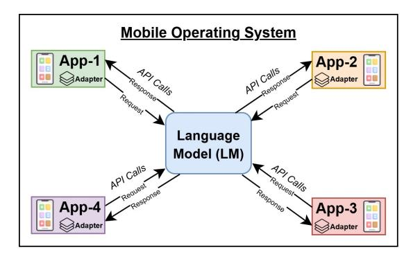
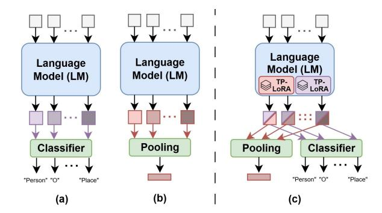
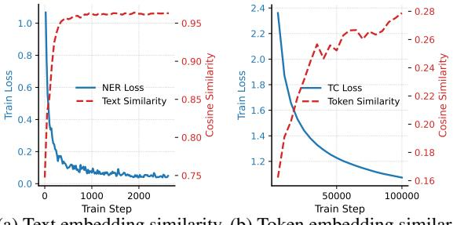
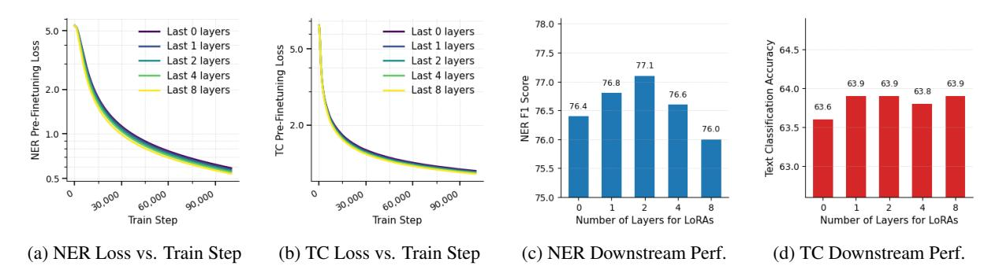

# Multi-Task Pre-Finetuning of Lightweight Transformer Encoders for Text Classification and NER

Junyi Zhu1[\\*](#page-0-0) Savas Ozkan1\* Andrea Maracani1 Sinan Mutlu1 Cho Jung Min2 Mete Ozay1\*

1Samsung R&D Institute UK (SRUK) 2Samsung Electronics Korea

### Abstract

Deploying natural language processing (NLP) models on mobile platforms requires models that can adapt across diverse applications while remaining efficient in memory and computation. We investigate pre-finetuning strategies to enhance the adaptability of lightweight BERTlike encoders for two fundamental NLP task families: named entity recognition (NER) and text classification. While pre-finetuning improves downstream performance for each task family individually, we find that naïve multitask pre-finetuning introduces conflicting optimization signals that degrade overall performance. To address this, we propose a simple yet effective multi-task pre-finetuning framework based on task-primary LoRA modules, which enables a single shared encoder backbone with modular adapters. Our approach achieves performance comparable to individual pre-finetuning while meeting practical deployment constraint. Experiments on 21 downstream tasks show average improvements of +0.8% for NER and +8.8% for text classification, demonstrating the effectiveness of our method for versatile mobile NLP applications.

### 1 Introduction

Mobile applications such as automatic calendar event creation from emails and personalized recommendations based on messages rely on solving multiple natural language processing tasks, particularly text classification and named entity recognition (NER). Solutions often employ either generative large language models [\(Wang et al.,](#page-8-0) [2024a;](#page-8-0) [Constantin et al.,](#page-7-0) [2024\)](#page-7-0) or BERT-like encoder models [\(Devlin et al.,](#page-7-1) [2019\)](#page-7-1), the latter are better suited for on-device deployment due to the demands of memory and computational efficiency.

As illustrated in Fig. [1,](#page-0-1) mobile operating systems (e.g., Android AICore) deploy a shared lan-

Figure 1: An illustration of the practical deployment setting on mobile device. Mobile applications (APP- {1 . . . 4}) use the language model by calling system API and sending their job with task-specific model adapters. Adapters are often in form of LoRA or linear classifier.

guage model backbone that can be invoked by applications along with their task-specific adapters, such as Low-Rank Adaptation (LoRA) [\(Hu et al.,](#page-7-2) [2022\)](#page-7-2) or linear classifiers. This setup requires a highly generalizable backbone—achieved through adapter-based tuning—since mobile applications are diverse and new ones continue to emerge after system deployment.

Directly fine-tuning a pre-trained BERT-like encoder often yields sub-optimal results, particularly when the available data for an application's subtask is limited. This is because the pre-trained representations—optimized primarily through masked language modeling [\(Devlin et al.,](#page-7-1) [2019;](#page-7-1) [Liu et al.,](#page-8-1) [2019b\)](#page-8-1)—may not align well with the objectives of downstream tasks. *To address this misalignment, a pre-finetuning stage can be introduced:*

Unlike pre-training, pre-finetuning focuses on objectives that are better *aligned with the target task*, using data that typically includes *taskrelevant annotations*. Unlike downstream adaptation, however, pre-finetuning is performed on *general*, *large-scale* datasets, and its objectives

\*Correspondence to: {junyi.zhu, savas.ozkan, m.ozay}@samsung.com

are *not limited to specific sub-tasks* such as predicting a fixed label set. This process enables the model to acquire more task-relevant representations, thereby improving its adaptability to downstream tasks.

In this work, we investigate pre-finetuning strategies to enhance the adaptability of a pre-trained BERT-like encoder across two downstream task families: NER and text classification. We use the term task families because each comprises multiple sub-tasks spanning diverse domains, label sets, or entity types. As these task families depend on distinct representational characteristics—contextlevel for text classification and token-level for NER—we first implement and evaluate dedicated pre-finetuning strategies for each in Sec. [4](#page-2-0).

Applying two individual pre-finetuning strategies produces separate encoder models, whereas our deployment setting requires a single shared backbone (Fig. [1\)](#page-0-1). To address this, we explore multi-task pre-finetuning. However, we find that optimizing the model for one task family can degrade its adaptability to the other. As a result, naïve multi-task pre-finetuning—i.e., multi-task pre-finetuning without proper separation—often fails to match the performance of individual prefinetuned models. In Sec. [5](#page-3-0), we analyze this issue and identify an inherent incompatibility between the pre-finetuning objectives of NER and text classification.

To address this challenge, we propose a simple yet effective framework based on LoRA modules, introduced in Sec. [6](#page-4-0), with each module tailored to a specific task family (Fig. [2\)](#page-2-1). During multi-task prefinetuning, we apply LoRA modules to the last few transformer layers of a pre-trained encoder, updating each module exclusively with its corresponding task objective. Unlike conventional LoRA, which freezes the backbone, we allow the entire encoder to be jointly updated by both objectives. After pre-finetuning, the encoder is deployed within the mobile operating system, while the LoRA modules are distributed to applications. These modules can be used directly for inference or as initialization for downstream task adaptation. We refer to them as task-primary LoRAs.

#### Our contributions are:

• We implement two individual pre-finetuning strategies for NER and text classification and demonstrate their effectiveness on improving downstream performance (on average +0.8 across 5 NER sub-tasks and +8.8 across 16 text classification sub-tasks). Notably, we propose a novel pre-finetuning strategy for lightweight encoder models on NER via knowledge distillation (see Sec. [4\)](#page-2-0).

- Despite their individual effectiveness, we show that the two pre-finetuning strategies interfere with each other. Through analysis, we provide experimental evidence that reveals contradictory evolutions of representational characteristics, highlighting their incompatible optimization directions (see Sec. [5\)](#page-3-0).
- Building on this analysis, we propose a simple yet effective multi-task pre-finetuning framework using task-primary LoRAs to resolve the conflict between strategies. This approach delivers a single shared backbone and distributed task-primary LoRAs, aligning with our deployment constraints (Fig. [1\)](#page-0-1), while achieving comparable performance to individual prefinetuned models (see Sec. [6\)](#page-4-0).

## 2 Related Work

Text Classification. Advances in text classification have been driven by transformer-based models [\(Vaswani et al.,](#page-8-2) [2017\)](#page-8-2), with BERT-like encoders [\(Devlin et al.,](#page-7-1) [2019;](#page-7-1) [Liu et al.,](#page-8-1) [2019b\)](#page-8-1) setting benchmarks on tasks such as sentiment analysis and topic classification. Lightweight models like MiniLM [\(Wang et al.,](#page-8-3) [2020\)](#page-8-3) and Distil-BERT [\(Sanh et al.,](#page-8-4) [2019\)](#page-8-4) have attracted attention for their efficiency in resource-constrained environments, achieving competitive performance with lower computational cost. Additionally, recent work increasingly focuses on pre-finetuning strategies, particularly weakly-supervised contrastive learning with text pairs, which has proven effective for improving downstream performance [\(Wang](#page-8-5) [et al.,](#page-8-5) [2022;](#page-8-5) [Sturua et al.,](#page-8-6) [2024;](#page-8-6) [Günther et al.,](#page-7-3) [2023b;](#page-7-3) [Zhang et al.,](#page-8-7) [2023\)](#page-8-7).

Named Entity Recognition (NER). NER involves identifying entities (e.g., person names, organizations) in unstructured text [\(Jehangir et al.,](#page-7-4) [2023\)](#page-7-4). Unlike text classification, which assigns a single label to the entire input, NER requires token-level predictions. Existing methods fall into two categories: token classification [\(Devlin et al.,](#page-7-1) [2019\)](#page-7-1), which labels each token based on predefined entity types, and span classification [\(Ye et al.,](#page-8-8) [2021;](#page-8-8)

[Zhong and Chen,](#page-9-0) [2020;](#page-9-0) [Aarsen;](#page-7-5) [Zhu et al.,](#page-9-1) [2022\)](#page-9-1), which detects and classifies text spans. While span classification often yields better performance, especially for complex or nested entities, it is less efficient due to span enumeration and is thus impractical for resource-constrained scenarios such as mobile devices. Similarly, generative approaches based on LLMs [\(Wang et al.,](#page-8-9) [2025;](#page-8-9) [Ashok and Lip](#page-7-6)[ton,](#page-7-6) [2023\)](#page-7-6) are unsuitable for deployment on mobile devices. Given the cost of entity annotation, recent work has also explored pre-finetuning strategies to boost downstream performance [\(Liu et al.,](#page-8-10) [2021;](#page-8-10) [Bogdanov et al.,](#page-7-7) [2024\)](#page-7-7).

Multi-Task Learning of Text Classification and NER. Recent studies have explored multi-task training of models using both document-level and token-level annotations to improve overall performance, primarily in specific domains such as quality estimation [\(Deoghare et al.,](#page-7-8) [2023\)](#page-7-8), news recommendation [\(Bi et al.,](#page-7-9) [2022\)](#page-7-9), and sentiment analysis [\(Fan et al.,](#page-7-10) [2022\)](#page-7-10). However, a systematic analysis of multi-task pre-finetuning for *diverse* text classification and NER tasks remains largely unexplored. Additionally, [\(Feng et al.,](#page-7-11) [2024\)](#page-7-11) trains multiple domain-specific LoRA modules and uses a trained routing network to select between them. In contrast, we focus on training a generalizable backbone and reducing the number of parameters proportional to the quantity of downstream tasks.

# 3 Evaluation of Downstream Performance

We evaluate pre-finetuning strategies based on their downstream performance, which involves adapting the pre-finetuned model to a diverse set of subtasks. In this section, we first describe the evaluation setup. In the following sections, we report average metrics across all sub-tasks, with detailed per-dataset results deferred to the appendices.

NER Sub-Tasks. We adopt five NER datasets spanning diverse domains and entity types: CoNLL (4 entity types)[\(Tjong Kim Sang and De Meul](#page-8-11)[der,](#page-8-11) [2003\)](#page-8-11), MIT Restaurant (8 types)[\(Liu et al.,](#page-7-12) [2013\)](#page-7-12), BioNLP (5 types)[\(Collier and Kim,](#page-7-13) [2004\)](#page-7-13), OntoNotes5 (18 types)[\(Hovy et al.,](#page-7-14) [2006\)](#page-7-14), and CrossNER (39 types) [\(Liu et al.,](#page-8-12) [2020\)](#page-8-12).

Text Classification Sub-Tasks. We adopt the widely used MTEB benchmark framework [\(Muennighoff et al.,](#page-8-13) [2023\)](#page-8-13) and evaluate on 16 datasets covering a variety of domains:

Figure 2: Illustration of different model configurations for processing inputs: (a) NER model predicts the entity type of each token; (b) text classification model extracts a text embedding representing the entire input; (c) our proposed shared encoder with taskprimary (TP) LoRAs supports diverse outputs, with each LoRA module dedicated to its specific task.

Banking77, Emotion, AmazonCounterfactual, MassiveIntent, TweetSentiment, ToxicChat, News, Patent, FinancialPhrasebank, FrenkEn, IMDB, ArXiv, DBpedia, TweetTopicSingle, YelpReviewFull, and ToxicConversation.

Adaptation Setup. For text classification subtasks, we follow the standard MTEB protocol, training a linear classifier on top of pooled token embeddings extracted from the encoder. We use mean pooling, following the configurations adopted in Jina [\(Günther et al.,](#page-7-15) [2023a;](#page-7-15) [Sturua et al.,](#page-8-6) [2024;](#page-8-6) [Gün](#page-7-3)[ther et al.,](#page-7-3) [2023b\)](#page-7-3) and the E5 model family [\(Wang](#page-8-5) [et al.,](#page-8-5) [2022,](#page-8-5) [2024b\)](#page-8-14). For NER sub-tasks, we apply LoRA [\(Hu et al.,](#page-7-2) [2022\)](#page-7-2) and perform token classification [\(Devlin et al.,](#page-7-1) [2019\)](#page-7-1). Further details of training configurations are provided in App. [A.](#page-9-2)

Models. Motivated by deployment requirements on mobile devices and our stakeholder's interests, we conduct experiments using two lightweight transformer encoders: MiniLM with 33M parameters [\(Wang et al.,](#page-8-3) [2020\)](#page-8-3) and DistilBERT with 67M parameters [\(Sanh et al.,](#page-8-4) [2019\)](#page-8-4). For both models we consider the English-only version.

# 4 Pre-Finetuning Strategies for NER and Text Classification

Pre-finetuning is applied to pre-trained models prior to their adaptation to downstream tasks. During pre-finetuning the model is further trained on *general, large-scale datasets with learning objectives that are more closely aligned with the target tasks*. Recent works have demonstrated the effectiveness of pre-finetuning for either NER or text

| Model      | NER (5 DS) | TC (16 DS)             | Average    |
|------------|------------|------------------------|------------|
| Base model | 76.4       | 55.1                   | 65.8       |
| PF for NER | 77.1 + 0.7 | 53.9- <mark>1.2</mark> | 65.5 - 0.3 |
| PF for TC  | 74.6 - 1.8 | 63.9 + 8.8             | 69.2 + 3.4 |

Table 1: Comparison of downstream performance across different pre-finetuning (PF) strategies and the base model. NER results report the average F1 score over 5 datasets (DS), while text classification (TC) results report the average accuracy over 16 datasets. Gain and Loss are measured relative to the base model. Results for individual datasets are provided in Tabs. 5 and 6. The model architecture used is MiniLM.

classification in isolation. Accordingly, we adopt and extend these strategies to improve the downstream performance of lightweight encoder models on two task families.

In the remainder of this section, we first describe our pre-finetuning procedures for the two task families, and then analyze the downstream performance achieved by each approach.

**Pre-Finetuning for NER.** Bogdanov et al. (2024) recently proposed using ChatGPT-3.5 to extract identifiable concepts from large-scale unlabeled corpora such as C4 (Raffel et al., 2020), resulting in a dataset of 24.4M words, 4.38M annotations, and 200k concepts. A pre-trained RoBERTa model (Liu et al., 2019b) was then optimized on this dataset via contrastive learning by aligning entity embeddings with their corresponding concepts, producing the pre-finetuned NuNER model.

However, NuNER's embedding alignment effectively performs self-distillation, which poses challenges for lightweight models used in on-device applications due to their limited representational capacity. To address this, we distill knowledge from NuNER into lightweight models. Specifically, we adopt NuNER's 24.4M-word dataset and tag each token using NuNER outputs. Since NuNER lacks a classifier head, we extract token embeddings and apply mini-batch k-means clustering to group them, assigning pseudo labels based on cluster IDs. Finally, we train our encoder models—augmented with a linear classifier—to predict these pseudo labels using cross-entropy loss, see App. B for more details.

**Pre-Finetuning for Text Classification.** Following recent work (Wang et al., 2022; Günther et al., 2023b), we apply *weakly supervised contrastive learning* to pre-finetune the encoder. Given a paired

corpus  $\mathcal{D} = \{(x_i, \, x_i^+)\}_{i=1}^N$ , where each pair shares similar semantics, let  $f_\theta$  denote the encoder, and define the  $\ell_2$ -normalized sentence embeddings as:

$$z_i = \frac{f_{\theta}(x_i)}{\|f_{\theta}(x_i)\|_2}, \qquad z_i^+ = \frac{f_{\theta}(x_i^+)}{\|f_{\theta}(x_i^+)\|_2}.$$

Contrastive learning encourages the encoder to bring semantically similar pairs closer while pushing apart unrelated (negative) examples. We adopt *in-batch negatives*: for each anchor  $x_i$ , its paired text  $x_i^+$  serves as the sole positive, while all other samples in the minibatch serve as negatives. The resulting InfoNCE loss (Chen et al., 2020) is:

$$\mathcal{L}_{CL} = -\frac{1}{|B|} \sum_{i \in B} \log \frac{\exp(\langle z_i, z_i^+ \rangle / \tau)}{\sum_{j \in B} \exp(\langle z_i, z_j^+ \rangle / \tau)},$$

where  $\langle \cdot, \cdot \rangle$  denotes the dot product, and  $\tau$  is a temperature parameter (set to 0.05).

To ensure data quality and diversity, we compile multiple datasets pre-processed by SentenceTransformers (Reimers and Gurevych, 2019), totaling  $\sim 895M$  text pairs. Further dataset and training details are provided in App. B.

#### **Downstream Performance after Pre-Finetuning.**

We evaluate downstream performance after applying each pre-finetuning strategy and compare it to the pre-trained base model. As shown in Tab. 1, pre-finetuning improves performance within its respective task family, with average gains of +0.7% for NER and +8.8% for text classification. Additionally, we observe significant improvement for NER under data scarcity: when only 10% of the original downstream train data is used for adaptation, the pre-finetuned model achieves an average F1 improvement of +8.4% (see App. D for details).

Notably, we observe that each pre-finetuning strategy hinders adaptation to the opposite task family, indicating interference between the two approaches. This effect is consistent across NuNER and other open-source pre-finetuned models for text classification (see App. E for details). We analyze this issue in the next section and introduce our solution in Sec. 6, which reconciles both strategies to pre-finetune a unified encoder.

# 5 Interference Between Pre-Finetuning for Text Classification and NER

We identify that the interference between prefinetuning for text classification and NER stems from conflicting requirements on token embeddings. Our analysis reveals two key findings:

(a) Text embedding similarity (b) Token embedding similarduring NER training. ity during TC training.

Figure 3: **Similarity trends during pre-finetuning**: (a) perturbed sentences, as illustrated in Fig. 5, become closer in embedding space when the model is optimized for NER; (b) token embeddings within the same sentence become more homogeneous when the model is optimized for text classification (TC).

Finding 1: Different Sentences Appear Similar After Pre-Finetuning for NER. In the NER pre-finetuning setup, a linear classifier operates on token embeddings extracted from the encoder, requiring that tokens representing entities of the same type be mapped to similar representations. As a result, pre-finetuning for NER encourages the model to reduce distinctions between individual entities of the same type.

To examine this effect, we construct a perturbed version of the CoNLL test set. We first extract all entities from the test set and then replace each entity in a sentence with a randomly sampled entity of the same type, generating four perturbed variants per sentence (see Fig. 5 for an example).

Next, we train a model on the CoNLL training set for NER and use the resulting encoder to extract text embeddings for both the original and perturbed sentences. We compute the cosine similarity between each perturbed sentence and its corresponding original. As shown in Fig. 3a, similarity increases as training progresses, indicating that the model maps perturbed sentences to increasingly similar representations. This reduction in representational distinctiveness can be detrimental to text classification sub-tasks, which rely on preserving sentence-level differences.

Finding 2: Token Embeddings of the Same Input Become More Homogeneous After Pre-Finetuning for Text Classification. In text classification, fine-grained token-level distinctions are less important, as the model focuses on capturing the overall semantics of the input. We find that pre-finetuning for text classification encourages the

model to produce more homogeneous token embeddings within each input sequence.

To quantify this effect, we compute pairwise cosine similarities among token embeddings within the same sentence, averaging the results over 2,000 samples throughout pre-finetuning. As shown in Fig. 3b, intra-sentence token similarity increases as training progresses. This trend explains why pre-finetuning for text classification may impair adaptation to NER, which relies on preserving token-level distinctions to classify entities.

## 6 <u>Multi-Task Pre-Finetuning with</u> Task-Primary LoRAs (MTPF-TPL)

Multi-Task Pre-Finetuning. As discussed in Sec. 5, pre-finetuning strategies for NER and text classification impose conflicting requirements on token embeddings, leading to incompatible optimization directions. However, our deployment setting requires a single shared encoder (see Fig. 1), making it necessary to merge these strategies through multi-task pre-finetuning.

Unlike traditional multi-task learning (Liu et al., 2015; Ruder, 2017; Liu et al., 2019a), which typically involves multiple datasets across domains to improve data diversity, our individual prefinetuning approach already relies on large-scale, general-purpose datasets. Instead of seeking complementary benefits, our goal is to resolve the incompatibility between the pre-finetuning strategies for NER and text classification to enable unified encoder optimization.

Task-Primary LoRAs. Since NER and text classification favor different token embedding characteristics, we extend the encoder with two groups of LoRA modules. Unlike the typical use of LoRA—where the backbone is frozen and only the LoRA parameters are updated—we allow joint optimization: each LoRA is updated solely with the loss of its associated task, while the backbone encoder is optimized by both loss functions, serving as shared parameters (see Fig. 2).

After multi-task pre-finetuning, the backbone encoder is deployed as the central model, and the task-primary LoRAs are distributed to applications for downstream adaptation. These LoRAs can be used either as initialization for downstream LoRA adaptation or directly for inference with linear probing. We refer to these pre-finetuning LoRA parameters as *task-primary LoRAs* (TPL).

Task-primary LoRAs are inspired by multi-task

| Model      | Approach   | PCGrad | NER (5 DS) | TC (16 DS) | Average    |
|------------|------------|--------|------------|------------|------------|
|            | Individual | _      | 77.1       | 63.9       | 70.5       |
|            | Base model | _      | 76.4       | 55.1       | 65.8       |
| Minima     | MTPF       | X      | 76.4       | 63.6 + 8.5 | 70.0 + 4.2 |
| MiniLM     | MTPF       | ✓      | 76.5 + 0.1 | 63.7 + 8.6 | 70.1 + 4.3 |
|            | MTPF-TPL   | X      | 77.1 + 0.8 | 63.9 + 8.8 | 70.5 + 4.7 |
|            | MTPF-TPL   | ✓      | 77.1 + 0.8 | 64.1+9.0   | 70.6+4.9   |
|            | Individual | _      | 77.7       | 64.4       | 71.1       |
|            | Base model | _      | 76.9       | 60.5       | 68.7       |
| DistilBERT | MTPF       | X      | 77.2 + 0.3 | 64.0 + 3.5 | 70.6 + 1.9 |
| DISTIBLE   | MTPF       | ✓      | 77.2 + 0.3 | 63.9 + 3.4 | 70.6 + 1.9 |
|            | MTPF-TPL   | X      | 77.6 + 0.7 | 64.4 + 3.9 | 71.0 + 2.3 |
|            | MTPF-TPL   | ✓      | 77.7 + 0.8 | 64.4 + 3.9 | 71.1 + 2.4 |

Table 2: Comparison of downstream performance across different pre-finetuning strategies and the base model. NER results represent an average over 5 datasets (DS), while text classification (TC) results represent an average over 16 datasets. Result of each dataset is given in Tabs. 7 and 8. Results for individual prefinetuning are grayed out, as the resulting two models are not compatible with our single backbone scheme. Gain and loss are compared with the base model.

Figure 4: Comparison of applying task-primary LoRAs (TPL) to varying numbers of final layers. (a) and (b) show pre-finetuning loss over training steps for different numbers of layers augmented with TPL. (c) and (d) present downstream performance across both task families under varying numbers of TPL-applied layers.

learning approaches such as Cross-Stitch (Misra et al., 2016), which trains task-specific networks alongside a shared representation network. However, in our case, attaching task-specific networks or duplicating encoder layers does not meet the system requirement of maintaining a single backbone with modular adapters. Additionally, Bert-and-PALs(Stickland and Murray, 2019) introduces task-specific adapters into all attention layers for multi-task learning, but their approach directly targets downstream tasks and focuses on minimizing parameter count. In contrast, MTPF-TPL focuses on pre-finetuning to improve adaptability across downstream tasks. As we will discuss later, applying task-primary LoRAs only to the last few layers is key to achieving this adaptability.

#### 6.1 Results

Next, we demonstrate the effectiveness of MTPF-TPL on two parameter-efficient models: MiniLM (Wang et al., 2020) and DistilBERT (Sanh et al., 2019). We compare MTPF-TPL against the pre-trained base model, individually pre-finetuned

models, and multi-task pre-finetuning (MTPF) without task-primary LoRAs. Additionally, we include PCGrad (Yu et al., 2020), a gradient surgery method commonly used in multi-task learning to mitigate gradient conflicts by projecting gradients into orthogonal spaces. The results are presented in Tab. 2. We observe the following: 1) MTPF without taskprimary LoRAs benefits from pre-finetuning and outperforms the base model on downstream tasks. However, due to task interference, its improvements are smaller than those achieved by individually pre-finetuned models. 2) When equipped with task-primary LoRAs, MTPF-TPL successfully combines the strengths of both pre-finetuning strategies, achieving performance comparable to individual pre-finetuning while maintaining a singlebackbone model suitable for deployment. Additionally, as discussed in Sec. 4, pre-finetuning for NER yields substantial gains in low-resource settings (e.g., +8.4% F1 when using only 10% of the original training data). We observe that MTPF-TPL preserves this improvement (see App. D). 3) While PCGrad slightly improves performance by reducing

| Model                                                            | NER (5 DS)                               | TC (16 DS)                               | Average                                  |
|------------------------------------------------------------------|------------------------------------------|------------------------------------------|------------------------------------------|
| Individual                                                       | 77.1                                     | 63.9                                     | 70.5                                     |
| Base model PF-L (two layers) PF-L (all layers) MTPF-TPL | 76.4 76.3-0.1 76.6+0.2 77.1+0.7 | 55.1 60.2+5.1 62.4+7.3 63.9+8.8 | 65.8 68.3+2.5 69.5+3.7 70.5+4.7 |

Table 3: Comparison of downstream performance between classical LoRA fine-tuning (denoted as PF-L) and ours MTPF-TPL. NER results report the average F1 score over 5 datasets (DS), while text classification (TC) results report the average accuracy over 16 datasets. Gain and Loss are measured relative to the base model. The model architecture used is MiniLM.

gradient conflicts, it does not mitigate task interference as effectively as task-primary LoRAs.

In Tab. 2, task-primary LoRAs are applied only to the last two transformer layers, which we find optimal for both MiniLM and DistilBERT in our deployment setting. Constraining task-primary LoRAs to the final layers appears crucial for adaptability to downstream tasks, which we discuss below.

# **Applying Task-Primary LoRAs to the Last Few Transformer Layers Improves Adaptability.**

As shown in Fig. 4, pre-finetuning loss consistently decreases as more transformer layers of MiniLM are equipped with task-primary LoRAs. However, downstream performance on NER peaks when LoRAs are applied only to the last two layers. This phenomenon is unlikely to result from overfitting, given the large scale of our pre-finetuning dataset (Sec. 4) and the strong downstream results of individually pre-finetuned models (Tab. 2).

In our adaptation setup (Sec. 3), task-primary LoRAs serve as a partial initialization for LoRA modules (applied to all layers) that are further finetuned on NER sub-tasks. In contrast, for text classification, task-primary LoRAs remain fixed, and only the linear classifier is updated. Since the performance degradation does not appear for text classification, we hypothesize that once the prefinetuning conflict is mitigated, initializing more transformer layers with random LoRA parameters—rather than task-primary LoRAs—may improve LoRA adaptation on downstream sub-tasks.

## Freezing the backbone and only fine-tune Lo-

**RAs.** We also compare our method with classical LoRA fine-tuning (denoted as PF-L) for different task families, following the pipeline that LoRAs are first pre-finetuned and then further adapted for

downstream tasks. While this strategy avoids interference between task families, its performance remains below that of individual full-parameter prefinetuning as shown in Tab. 3, likely due to the limited number of trainable parameters. Applying PF-L to all layers performs better than restricting them to the last two (our MTPF-TPL's setup). While further increasing LoRA rank might close the gap to individual pre-finetuning, this would also scale parameter cost linearly with the number of applications—potentially dozens or hundreds on today's smartphones. By contrast, MTPF-TPL's shared backbone approach achieves better parameter efficiency while maintaining strong performance, making it more suitable for on-device deployment.

#### 7 Conclusion

In this work, we present a deployment setup for NLP tasks on mobile platforms and explore prefinetuning strategies for two key task families: named entity recognition (NER) and text classification. We demonstrate that pre-finetuning improves downstream performance for both task families but also identify interference when the strategies are combined. To address this, we propose a multitask pre-finetuning framework with task-primary LoRAs that effectively integrates both approaches, resulting in a model and modular adapters compatible with our deployment requirements.

#### Limitations

Our study focuses on demonstrating the effectiveness of multi-task pre-finetuning with task-primary LoRAs in a controlled setting. While the results show consistent improvements across diverse NER and text classification tasks, there remain several avenues for future exploration.

First, we conduct experiments exclusively using English pre-trained models and English-language datasets. This is a common first step in NLP system development, but extending our approach to multilingual settings remains an important direction for future work.

Second, for consistency, we adopt the same task-primary LoRA configuration (e.g., rank and number of augmented layers) across both task families. While our findings already yield strong results under this unified design, task-specific adapter configurations could potentially offer further improvements in downstream performance or efficiency.

# References

- Tom Aarsen. [SpanMarker.](https://github.com/tomaarsen/SpanMarkerNER)
- Dhananjay Ashok and Zachary C Lipton. 2023. Promptner: Prompting for named entity recognition. *arXiv preprint arXiv:2305.15444*.
- Qiwei Bi, Jian Li, Lifeng Shang, Xin Jiang, Qun Liu, and Hanfang Yang. 2022. Mtrec: Multi-task learning over bert for news recommendation. In *Findings of the association for computational linguistics: ACL 2022*, pages 2663–2669.
- Sergei Bogdanov, Alexandre Constantin, Timothée Bernard, Benoit Crabbé, and Etienne P Bernard. 2024. [NuNER: Entity recognition encoder pre](https://doi.org/10.18653/v1/2024.emnlp-main.660)[training via LLM-annotated data.](https://doi.org/10.18653/v1/2024.emnlp-main.660) In *Proceedings of the 2024 Conference on Empirical Methods in Natural Language Processing*, pages 11829–11841, Miami, Florida, USA. Association for Computational Linguistics.
- Ting Chen, Simon Kornblith, Mohammad Norouzi, and Geoffrey Hinton. 2020. [A simple framework for](https://proceedings.mlr.press/v119/chen20j.html) [contrastive learning of visual representations.](https://proceedings.mlr.press/v119/chen20j.html) In *Proceedings of the 37th International Conference on Machine Learning*, volume 119 of *Proceedings of Machine Learning Research*, pages 1597–1607. PMLR.
- Nigel Collier and Jin-Dong Kim. 2004. [Introduction to](https://aclanthology.org/W04-1213) [the bio-entity recognition task at JNLPBA.](https://aclanthology.org/W04-1213) In *Proceedings of the International Joint Workshop on Natural Language Processing in Biomedicine and its Applications (NLPBA/BioNLP)*, pages 73–78, Geneva, Switzerland. COLING.
- Alexandre Constantin, Liam Cripwell, and Etienne Bernard. 2024. NuExtract: A Foundation Model for Structured Extraction. Blog post on NuMind.ai.
- Sourabh Deoghare, Paramveer Choudhary, Diptesh Kanojia, Tharindu Ranasinghe, Pushpak Bhattacharyya, and Constantin Orašan. 2023. A multitask learning framework for quality estimation. In *Findings of the Association for Computational Linguistics: ACL 2023*, pages 9191–9205.
- Jacob Devlin, Ming-Wei Chang, Kenton Lee, and Kristina Toutanova. 2019. Bert: Pre-training of deep bidirectional transformers for language understanding. In *Proceedings of the 2019 conference of the North American chapter of the association for computational linguistics: human language technologies, volume 1 (long and short papers)*, pages 4171–4186.
- Shuai Fan, Chen Lin, Haonan Li, Zhenghao Lin, Jinsong Su, Hang Zhang, Yeyun Gong, Jian Guo, and Nan Duan. 2022. Sentiment-aware word and sentence level pre-training for sentiment analysis. *arXiv preprint arXiv:2210.09803*.
- Wenfeng Feng, Chuzhan Hao, Yuewei Zhang, Yu Han, and Hao Wang. 2024. [Mixture-of-LoRAs: An ef](https://aclanthology.org/2024.lrec-main.994/)[ficient multitask tuning method for large language](https://aclanthology.org/2024.lrec-main.994/)

- [models.](https://aclanthology.org/2024.lrec-main.994/) In *Proceedings of the 2024 Joint International Conference on Computational Linguistics, Language Resources and Evaluation (LREC-COLING 2024)*, pages 11371–11380, Torino, Italia. ELRA and ICCL.
- Michael Günther, Louis Milliken, Jonathan Geuter, Georgios Mastrapas, Bo Wang, and Han Xiao. 2023a. [Jina embeddings: A novel set of high-performance](https://doi.org/10.18653/v1/2023.nlposs-1.2) [sentence embedding models.](https://doi.org/10.18653/v1/2023.nlposs-1.2) In *Proceedings of the 3rd Workshop for Natural Language Processing Open Source Software (NLP-OSS 2023)*, pages 8–18, Singapore. Association for Computational Linguistics.
- Michael Günther, Jackmin Ong, Isabelle Mohr, Alaeddine Abdessalem, Tanguy Abel, Mohammad Kalim Akram, Susana Guzman, Georgios Mastrapas, Saba Sturua, Bo Wang, and 1 others. 2023b. Jina embeddings 2: 8192-token general-purpose text embeddings for long documents. *arXiv preprint arXiv:2310.19923*.
- Eduard Hovy, Mitchell Marcus, Martha Palmer, Lance Ramshaw, and Ralph Weischedel. 2006. [OntoNotes:](https://aclanthology.org/N06-2015) [The 90% solution.](https://aclanthology.org/N06-2015) In *Proceedings of the Human Language Technology Conference of the NAACL, Companion Volume: Short Papers*, pages 57–60, New York City, USA. Association for Computational Linguistics.
- Edward J Hu, yelong shen, Phillip Wallis, Zeyuan Allen-Zhu, Yuanzhi Li, Shean Wang, Lu Wang, and Weizhu Chen. 2022. [LoRA: Low-rank adaptation of large](https://openreview.net/forum?id=nZeVKeeFYf9) [language models.](https://openreview.net/forum?id=nZeVKeeFYf9) In *International Conference on Learning Representations*.
- Basra Jehangir, Saravanan Radhakrishnan, and Rahul Agarwal. 2023. A survey on named entity recognition—datasets, tools, and methodologies. *Natural Language Processing Journal*, 3:100017.
- Jingjing Liu, Panupong Pasupat, Scott Cyphers, and Jim Glass. 2013. [Asgard: A portable architecture](https://doi.org/10.1109/ICASSP.2013.6639301) [for multilingual dialogue systems.](https://doi.org/10.1109/ICASSP.2013.6639301) In *2013 IEEE International Conference on Acoustics, Speech and Signal Processing*, pages 8386–8390.
- Xiaodong Liu, Jianfeng Gao, Xiaodong He, Li Deng, Kevin Duh, and Ye-yi Wang. 2015. [Representation](https://doi.org/10.3115/v1/N15-1092) [learning using multi-task deep neural networks for](https://doi.org/10.3115/v1/N15-1092) [semantic classification and information retrieval.](https://doi.org/10.3115/v1/N15-1092) In *Proceedings of the 2015 Conference of the North American Chapter of the Association for Computational Linguistics: Human Language Technologies*, pages 912–921, Denver, Colorado. Association for Computational Linguistics.
- Xiaodong Liu, Pengcheng He, Weizhu Chen, and Jianfeng Gao. 2019a. [Multi-task deep neural networks](https://doi.org/10.18653/v1/P19-1441) [for natural language understanding.](https://doi.org/10.18653/v1/P19-1441) In *Proceedings of the 57th Annual Meeting of the Association for Computational Linguistics*, pages 4487–4496, Florence, Italy. Association for Computational Linguistics.

- Yinhan Liu, Myle Ott, Naman Goyal, Jingfei Du, Mandar Joshi, Danqi Chen, Omer Levy, Mike Lewis, Luke Zettlemoyer, and Veselin Stoyanov. 2019b. Roberta: A robustly optimized bert pretraining approach. *arXiv preprint arXiv:1907.11692*.
- Zihan Liu, Feijun Jiang, Yuxiang Hu, Chen Shi, and Pascale Fung. 2021. Ner-bert: a pre-trained model for low-resource entity tagging. *arXiv preprint arXiv:2112.00405*.
- Zihan Liu, Yan Xu, Tiezheng Yu, Wenliang Dai, Ziwei Ji, Samuel Cahyawijaya, Andrea Madotto, and Pascale Fung. 2020. [Crossner: Evaluating cross-domain](https://arxiv.org/abs/2012.04373) [named entity recognition.](https://arxiv.org/abs/2012.04373)
- Ilya Loshchilov and Frank Hutter. 2019. [Decoupled](https://openreview.net/forum?id=Bkg6RiCqY7) [weight decay regularization.](https://openreview.net/forum?id=Bkg6RiCqY7) In *International Conference on Learning Representations*.
- Ishan Misra, Abhinav Shrivastava, Abhinav Gupta, and Martial Hebert. 2016. [Cross-Stitch Networks for](https://doi.org/10.1109/CVPR.2016.433) [Multi-task Learning](https://doi.org/10.1109/CVPR.2016.433) . In *2016 IEEE Conference on Computer Vision and Pattern Recognition (CVPR)*, pages 3994–4003, Los Alamitos, CA, USA. IEEE Computer Society.
- Niklas Muennighoff, Nouamane Tazi, Loic Magne, and Nils Reimers. 2023. [MTEB: Massive text embedding](https://doi.org/10.18653/v1/2023.eacl-main.148) [benchmark.](https://doi.org/10.18653/v1/2023.eacl-main.148) In *Proceedings of the 17th Conference of the European Chapter of the Association for Computational Linguistics*, pages 2014–2037, Dubrovnik, Croatia. Association for Computational Linguistics.
- Colin Raffel, Noam Shazeer, Adam Roberts, Katherine Lee, Sharan Narang, Michael Matena, Yanqi Zhou, Wei Li, and Peter J. Liu. 2020. [Exploring the](http://jmlr.org/papers/v21/20-074.html) [limits of transfer learning with a unified text-to-text](http://jmlr.org/papers/v21/20-074.html) [transformer.](http://jmlr.org/papers/v21/20-074.html) *Journal of Machine Learning Research*, 21(140):1–67.
- Nils Reimers and Iryna Gurevych. 2019. [Sentence-bert:](https://arxiv.org/abs/1908.10084) [Sentence embeddings using siamese bert-networks.](https://arxiv.org/abs/1908.10084) In *Proceedings of the 2019 Conference on Empirical Methods in Natural Language Processing*. Association for Computational Linguistics.
- Sebastian Ruder. 2017. An overview of multi-task learning in deep neural networks. *arXiv preprint arXiv:1706.05098*.
- Victor Sanh, Lysandre Debut, Julien Chaumond, and Thomas Wolf. 2019. Distilbert, a distilled version of bert: smaller, faster, cheaper and lighter. *arXiv preprint arXiv:1910.01108*.
- Asa Cooper Stickland and Iain Murray. 2019. [BERT](https://proceedings.mlr.press/v97/stickland19a.html) [and PALs: Projected attention layers for efficient](https://proceedings.mlr.press/v97/stickland19a.html) [adaptation in multi-task learning.](https://proceedings.mlr.press/v97/stickland19a.html) In *Proceedings of the 36th International Conference on Machine Learning*, volume 97 of *Proceedings of Machine Learning Research*, pages 5986–5995. PMLR.
- Saba Sturua, Isabelle Mohr, Mohammad Kalim Akram, Michael Günther, Bo Wang, Markus Krimmel, Feng Wang, Georgios Mastrapas, Andreas Koukounas,

- Nan Wang, and 1 others. 2024. jina-embeddingsv3: Multilingual embeddings with task lora. *arXiv preprint arXiv:2409.10173*.
- Erik F. Tjong Kim Sang and Fien De Meulder. 2003. [Introduction to the CoNLL-2003 shared task:](https://www.aclweb.org/anthology/W03-0419) [Language-independent named entity recognition.](https://www.aclweb.org/anthology/W03-0419) In *Proceedings of the Seventh Conference on Natural Language Learning at HLT-NAACL 2003*, pages 142– 147.
- Ashish Vaswani, Noam Shazeer, Niki Parmar, Jakob Uszkoreit, Llion Jones, Aidan N Gomez, Łukasz Kaiser, and Illia Polosukhin. 2017. Attention is all you need. *Advances in neural information processing systems*, 30.
- Liang Wang, Nan Yang, Xiaolong Huang, Binxing Jiao, Linjun Yang, Daxin Jiang, Rangan Majumder, and Furu Wei. 2022. Text embeddings by weaklysupervised contrastive pre-training. *arXiv preprint arXiv:2212.03533*.
- Liang Wang, Nan Yang, Xiaolong Huang, Linjun Yang, Rangan Majumder, and Furu Wei. 2024a. [Improv](https://doi.org/10.18653/v1/2024.acl-long.642)[ing text embeddings with large language models.](https://doi.org/10.18653/v1/2024.acl-long.642) In *Proceedings of the 62nd Annual Meeting of the Association for Computational Linguistics (Volume 1: Long Papers)*, pages 11897–11916, Bangkok, Thailand. Association for Computational Linguistics.
- Liang Wang, Nan Yang, Xiaolong Huang, Linjun Yang, Rangan Majumder, and Furu Wei. 2024b. Multilingual e5 text embeddings: A technical report. *arXiv preprint arXiv:2402.05672*.
- Shuhe Wang, Xiaofei Sun, Xiaoya Li, Rongbin Ouyang, Fei Wu, Tianwei Zhang, Jiwei Li, Guoyin Wang, and Chen Guo. 2025. [GPT-NER: Named entity recogni](https://doi.org/10.18653/v1/2025.findings-naacl.239)[tion via large language models.](https://doi.org/10.18653/v1/2025.findings-naacl.239) In *Findings of the Association for Computational Linguistics: NAACL 2025*, pages 4257–4275, Albuquerque, New Mexico. Association for Computational Linguistics.
- Wenhui Wang, Furu Wei, Li Dong, Hangbo Bao, Nan Yang, and Ming Zhou. 2020. [Minilm: Deep self](https://proceedings.neurips.cc/paper_files/paper/2020/file/3f5ee243547dee91fbd053c1c4a845aa-Paper.pdf)[attention distillation for task-agnostic compression](https://proceedings.neurips.cc/paper_files/paper/2020/file/3f5ee243547dee91fbd053c1c4a845aa-Paper.pdf) [of pre-trained transformers.](https://proceedings.neurips.cc/paper_files/paper/2020/file/3f5ee243547dee91fbd053c1c4a845aa-Paper.pdf) In *Advances in Neural Information Processing Systems*, volume 33, pages 5776–5788. Curran Associates, Inc.
- Deming Ye, Yankai Lin, Peng Li, and Maosong Sun. 2021. Packed levitated marker for entity and relation extraction. *arXiv preprint arXiv:2109.06067*.
- Tianhe Yu, Saurabh Kumar, Abhishek Gupta, Sergey Levine, Karol Hausman, and Chelsea Finn. 2020. [Gradient surgery for multi-task learning.](https://proceedings.neurips.cc/paper_files/paper/2020/file/3fe78a8acf5fda99de95303940a2420c-Paper.pdf) In *Advances in Neural Information Processing Systems*, volume 33, pages 5824–5836. Curran Associates, Inc.
- Junlei Zhang, Zhenzhong Lan, and Junxian He. 2023. Contrastive learning of sentence embeddings from scratch. *arXiv preprint arXiv:2305.15077*.

Zexuan Zhong and Danqi Chen. 2020. A frustratingly easy approach for entity and relation extraction. *arXiv preprint arXiv:2010.12812*.

Enwei Zhu, Yiyang Liu, and Jinpeng Li. 2022. Deep span representations for named entity recognition. *arXiv preprint arXiv:2210.04182*.

## A Details of Adaptation

For NER sub-tasks, we apply LoRA to the key and query matrices of all attention layers as well as to the MLP layers, using a rank of 32 and an α of 64. Since the linear classifier is randomly initialized, we first freeze the encoder and train the classifier alone for 10 epochs to warm it up. We then jointly fine-tune both the encoder and classifier for an additional 30 epochs. This two-stage procedure consistently yields better performance than training without warm-up in our experiments. We set the batch size to 64 and the learning rate to 2×10−5 , using the AdamW optimizer [\(Loshchilov](#page-8-21) [and Hutter,](#page-8-21) [2019\)](#page-8-21) with a weight decay of 0.01.

For text classification sub-tasks, we follow the standard procedure of MTEB, performing logistic regression on top of the text embeddings extracted by the encoder.

## B Details of Pre-Finetuning

For text classification sub-tasks, we adopt weakly supervised contrastive learning with text pairs as the pre-finetuning strategy. In this setting, both the semantic similarity between anchor texts and their positive pairs, as well as the diversity of all text samples, are crucial for optimization. We combine multiple datasets pre-processed by SentenceTransformer[1](#page-9-5) to maximize semantic coverage and similarity. The datasets used include: all-nli, quora-duplicates, stackexchange-duplicates, wikihow, xsum, s2orc, wikianswers-duplicates, agnews, npr, specter, simple-wiki, altlex, ccnews, sentence-compression, flickr30k-captions, and amazon-reviews.

We apply an in-batch negatives strategy with a batch size of 1024 to ensure sufficient diversity of negative pairs. Additionally, we employ a hierarchical data sampling strategy, where we first sample a dataset and then sample a batch from that dataset. This approach consistently outperforms global random sampling [\(Günther et al.,](#page-7-15) [2023a](#page-7-15)[,b\)](#page-7-3).

#### Original Sentence:

*During his visit to Slovenia, Kwasniewski is also scheduled to meet Prime Minister.*

#### Perturbed Sentences:

*During his visit to Iran, Kim Yoon-man is also... During his visit to Central African Republic, Marc Cohen is also...*

*During his visit to Brno, Blaise Compaore is also... During his visit to UK, Eisuke Sakakibara is also...*

Figure 5: Example of entity replacement. Location and person entities (highlighted) have been substituted with random entities of the same type.

| Model        | NER (5 DS) | TC (16 DS) | Average  |
|--------------|------------|------------|----------|
| MiniLM       | 76.4       | 55.1       | 65.8     |
| all-MiniLM   | 74.5-1.9   | 68.2+13.1  | 71.4+5.6 |
| RoBERTa-base | 79.6       | 58.7       | 69.1     |
| NUNER        | 80.3+0.7   | 58.1-0.6   | 69.2+0.1 |

Table 4: Comparison of downstream performance across different open-source pre-finetuned models and their base models. NER results report the average F1 score over 5 datasets (DS), while text classification (TC) results report the average accuracy over 16 datasets. Gain and Loss are measured relative to the base model.

We use the AdamW optimizer with a learning rate of 2 × 10−5 and train for 100K iterations.

For NER pre-finetuning, we generate pseudo labels by applying k-means clustering to token embeddings extracted from the NuNER model. To improve the clustering quality, we compute the average of sub-token embeddings over a word and run clustering on the resulting word embedding. Since NuNER was originally trained to recognize 200K concepts [\(Bogdanov et al.,](#page-7-7) [2024\)](#page-7-7) with overlaps of the concepts, we conduct a grid search over {50, 100, 200, 500, 1000} clusters and find that 200 yields the best downstream performance. We similarly grid search the batch size over {16, 32, 64, 128, 256, 512} and select 256 based on downstream results. We adopt the same learning rate and training iterations as used for text classification pre-finetuning.

# C Detailed Downstream Performance on Sub-Tasks

Tabs. [5](#page-10-0) and [6](#page-10-1) provide detailed breakdowns of the downstream performance reported in Tab. [1.](#page-3-1) Similarly, Tabs. [7](#page-10-3) to [10](#page-11-1) present the breakdowns corresponding to the results in Tab. [2.](#page-5-0)

1 [https://sbert.net/docs/sentence\\_](https://sbert.net/docs/sentence_transformer/dataset_overview.html#datasets-on-the-hugging-face-hub) [transformer/dataset\\_overview.html#](https://sbert.net/docs/sentence_transformer/dataset_overview.html#datasets-on-the-hugging-face-hub) [datasets-on-the-hugging-face-hub](https://sbert.net/docs/sentence_transformer/dataset_overview.html#datasets-on-the-hugging-face-hub)

| Model      | CoNLL | OntoNotes5 | MIT Restaurant | BioNLP | CrossNER | Average |
|------------|-------|------------|----------------|--------|----------|---------|
| Base model | 88.7  | 84.6       | 76.7           | 68.1   | 64.1     | 76.4    |
| PF for NER | 89.4  | 84.9       | 77.1           | 68.9   | 65.2     | 77.1    |
| PF for TC  | 87.3  | 83.5       | 75.4           | 67.1   | 60.3     | 74.6    |

Table 5: Comparison of downstream performance of different pre-finetuning (PF) approaches and the base model across NER sub-tasks. Evaluation metric is F1. TC stands for text classification. Model architecture is MiniLM. The best results are bold.

| Model      | Bank. | Emo. | ACF  | MI   | TS   | TC   | News | Patent | FPB  | FE   | Imdb | Arxiv | DB.  | TTS. | YRF  | TCon. | Avg. |
|------------|-------|------|------|------|------|------|------|--------|------|------|------|-------|------|------|------|-------|------|
| Base model | 58.8  | 29.8 | 72.9 | 54.4 | 46.3 | 69.7 | 74.1 | 25.7   | 61.4 | 57.6 | 58.6 | 33.7  | 80.5 | 47.0 | 46.4 | 65.0  | 55.1 |
| PF for NER | 53.4  | 27.9 | 66.2 | 51.8 | 44.3 | 66.6 | 71.9 | 27.1   | 54.6 | 56.3 | 57.3 | 39.5  | 83.5 | 52.5 | 43.6 | 65.5  | 53.9 |
| PF for TC  | 79.5  | 40.2 | 69.9 | 64.2 | 43.5 | 63.0 | 73.5 | 36.6   | 72.7 | 59.6 | 85.7 | 63.0  | 84.5 | 67.4 | 53.1 | 66.1  | 63.9 |

Table 6: Comparison of downstream performance of different pre-finetuning (PFT) approaches and the base model on text classification (TC) sub-tasks. Accuracy is used as the evaluation metric. The model architecture is MiniLM. Best results are highlighted in bold. Dataset names are abbreviated as follows: Bank.: Banking77, Emo.: Emotion, ACF: AmazonCounterfactual, MI: MassiveIntent, TS: TweetSentiment, TC: ToxicChat, FPB: FinancialPhrasebank, FE: FrenkEn, DB: DBpedia, TTS: TweetTopicSingle, YRF: YelpReviewFull, TCon.: ToxicConversation.

| Approach | PCGrad | CoNLL | OntoNotes5 | MIT Restaurant | BioNLP | CrossNER | Average |
|----------|--------|-------|------------|----------------|--------|----------|---------|
| MTPF     | Х      | 88.5  | 84.2       | 76.8           | 67.1   | 65.6     | 76.4    |
| MTPF     | ✓      | 88.7  | 84.3       | 77.2           | 67.0   | 65.3     | 76.5    |
| MTPF-TPL | X      | 89.1  | 84.6       | 77.4           | 68.1   | 66.3     | 77.1    |
| MTPF-TPL | ✓      | 89.2  | 84.5       | 77.4           | 68.2   | 66.1     | 77.1    |

Table 7: Comparison of downstream performance of multi-task pre-finetuning (MTPF) with or without task-primary LoRAs (TPL) across NER sub-tasks. Model architecture is *MiniLM*. Evaluation metric is F1. The best results are bold.

| Approach | PCGrad | Bank. | Emo. | ACF  | MI   | TS   | TC   | News | Patent | FPB  | FE   | Imdb | Arxiv | DB.  | TTS. | YRF  | TCon. | Avg. |
|----------|--------|-------|------|------|------|------|------|------|--------|------|------|------|-------|------|------|------|-------|------|
| MTPF     | Х      | 78.3  | 40.0 | 70.3 | 63.6 | 45.1 | 61.1 | 74.1 | 36.7   | 69.8 | 58.0 | 84.3 | 63.3  | 86.1 | 67.9 | 52.5 | 67.2  | 63.6 |
| MTPF     | ✓      | 78.5  | 39.6 | 69.5 | 64.0 | 45.5 | 62.3 | 73.3 | 36.4   | 71.7 | 58.0 | 85.7 | 63.0  | 86.2 | 66.7 | 53.0 | 66.7  | 63.7 |
| MTPF-TPL | X      | 79.5  | 40.2 | 69.9 | 64.2 | 43.5 | 63.0 | 73.5 | 36.6   | 72.7 | 59.6 | 85.7 | 63.0  | 84.5 | 67.4 | 53.1 | 66.1  | 63.9 |
| MTPF-TPL | ✓      | 79.4  | 40.2 | 70.1 | 64.3 | 45.0 | 62.1 | 73.9 | 36.5   | 73.0 | 59.3 | 85.5 | 62.6  | 84.9 | 67.2 | 53.4 | 67.6  | 64.1 |

Table 8: Comparison of downstream performance of multi-task pre-finetuning (MTPF) with and without task-primary LoRAs (TPL) on text classification (TC) sub-tasks. Accuracy is used as the evaluation metric. The model architecture is *MiniLM*. Best results are highlighted in bold. Dataset names are abbreviated as follows: Bank.: Banking77, Emo.: Emotion, ACF: AmazonCounterfactual, MI: MassiveIntent, TS: TweetSentiment, TC: ToxicChat, FPB: FinancialPhrasebank, FE: FrenkEn, DB: DBpedia, TTS: TweetTopicSingle, YRF: YelpReviewFull, TCon.: ToxicConversation.

| Approach | PCGrad | CoNLL | OntoNotes5 | MIT Restaurant | BioNLP | CrossNER | Average |
|----------|--------|-------|------------|----------------|--------|----------|---------|
| MTPF     | X      | 88.0  | 84.1       | 76.4           | 68.7   | 68.7     | 77.2    |
| MTPF     | ✓      | 88.1  | 84.2       | 76.6           | 68.8   | 68.3     | 77.2    |
| MTPF-TPL | X      | 88.6  | 84.2       | 77.0           | 69.0   | 68.9     | 77.6    |
| MTPF-TPL | ✓      | 88.8  | 84.2       | 77.3           | 69.2   | 69.0     | 77.7    |

Table 9: Comparison of downstream performance of multi-task pre-finetuning (MTPF) with or without task-primary LoRAs (TPL) across NER sub-tasks. Model architecture is *DistilBERT*. Evaluation metric is F1. The best results are bold.

### D Downstream Performance of NER Sub-Tasks with Limited Data

NER tasks typically require costly human annotation by domain experts, making it challenging to ob-

| PFT      | PCGrad | Bank. | Emo. | ACF  | MI   | TS   | TC   | News | Patent | FPB  | FE   | Imdb | Arxiv | DB.  | TTS. | YRF  | TCon. | Avg. |
|----------|--------|-------|------|------|------|------|------|------|--------|------|------|------|-------|------|------|------|-------|------|
| MTPF     | X      | 78.6  | 42.8 | 69.6 | 64.6 | 45.4 | 62.7 | 71.5 | 35.9   | 71.3 | 58.1 | 85.7 | 64.7  | 87.9 | 68.0 | 51.4 | 66.2  | 64.0 |
| MTPF     | ✓      | 78.5  | 43.5 | 70.3 | 64.4 | 44.9 | 63.0 | 71.2 | 35.5   | 71.5 | 58.0 | 84.9 | 64.4  | 87.8 | 67.5 | 51.4 | 65.8  | 63.9 |
| MTPF-TPL | X      | 79.4  | 43.6 | 70.1 | 65.5 | 46.3 | 62.2 | 67.5 | 36.3   | 75.4 | 58.4 | 85.9 | 65.5  | 86.4 | 68.0 | 53.0 | 66.7  | 64.4 |
| MTPF-TPL | ✓      | 79.4  | 44.4 | 70.3 | 65.6 | 46.8 | 61.2 | 67.7 | 36.2   | 75.6 | 58.3 | 86.0 | 65.4  | 86.6 | 67.7 | 52.9 | 66.8  | 64.4 |

Table 10: Comparison of downstream performance of multi-task pre-finetuning (MTPF) with and without task-primary LoRAs (TPL) on text classification (TC) sub-tasks. Accuracy is used as the evaluation metric. The model architecture is *DistilBERT*. Best results are highlighted in bold. Dataset names are abbreviated as follows: Bank.: Banking77, Emo.: Emotion, ACF: AmazonCounterfactual, MI: MassiveIntent, TS: TweetSentiment, TC: ToxicChat, FPB: FinancialPhrasebank, FE: FrenkEn, DB: DBpedia, TTS: TweetTopicSingle, YRF: YelpReviewFull, TCon.: ToxicConversation.

tain large-scale labeled datasets in many real-world scenarios. To assess the benefit of pre-finetuning for NER under low-resource conditions, we evaluate downstream adaptation when only a small fraction of the original labeled data is available.

As shown in Tab. 11, pre-finetuning significantly enhances downstream performance, and this improvement becomes more pronounced as the amount of labeled data decreases. When only 10% of the original training data is used, pre-finetuned MiniLM achieves an average F1 gain of +8.4% over its base model, while pre-finetuned Distil-BERT achieves +5.3%. These results highlight the value of pre-finetuning in low-resource NER scenarios, where model generalization from limited supervision is critical.

Importantly, our proposed MTPF-TPL framework preserves this advantage while providing a single unified pre-finetuned model that supports both NER and text classification. This enables efficient deployment without sacrificing the gains of prefinetuning, even in data-scarce settings.

# E Reproducing the Interference Between Pre-Finetuning Strategies Using Open-Source Models

In Sec. 5, we demonstrate the interference between our implemented pre-finetuning strategies. Here, we show that this is a general phenomenon observable with open-source pre-finetuned models. Specifically, we compare NuNER (Bogdanov et al., 2024) with its base model RoBERTa-base (Liu et al., 2019b), and all-MiniLM2 with its base model MiniLM (Wang et al., 2020).

As shown in Tab. 4, NuNER, pre-finetuned for NER, exhibits reduced adaptability to text classification sub-tasks compared to RoBERTa-base. Conversely, all-MinilM, pre-finetuned for text em-

bedding tasks, shows worse adaptability to NER compared to its base model MiniLM.

2https://huggingface.co/sentence-transformers/ all-MiniLM-L12-v2

| Architecture | Data Portion | Approach   | CoNLL | OntoNotes5  | MIT Restaurant | BioNLP | CrossNER | Average     |
|--------------|--------------|------------|-------|-------------|----------------|--------|----------|-------------|
|              |              | Base model | 66.5  | 71.1        | 29.4           | 45.6   | 23.7     | 47.3        |
|              | 10%          | PF for NER | 67.3  | 73.8        | 45.2           | 51.4   | 35.6     | 55.7        |
|              | 10%          | MTPF       | 65.6  | 73.3        | 35.3           | 51.4   | 35.3     | 52.2        |
|              |              | MTPF-TPL   | 67.5  | 74.9        | 47.2           | 51.9   | 37.9     | 55.9        |
|              | 9007         | Base model | 83.3  | 77.9        | 55.0           | 53.0   | 37.7     | 62.4        |
| Maria        |              | PF for NER | 86.2  | 79.3        | 58.3           | 59.7   | 47.8     | 66.3        |
| MiniLM       | 20%          | MTPF       | 86.1  | 79.1        | 56.4           | 59.0   | 45.8     | 65.3        |
|              |              | MTPF-TPL   | 86.7  | 80.3        | 60.8           | 59.6   | 48.7     | 67.2        |
|              |              | Base model | 87.3  | 82.6        | 71.6           | 64.7   | 53.9     | 72.0        |
|              | 50%          | PF for NER | 89.1  | 83.3        | 73.1           | 66.3   | 58.5     | 74.1        |
|              | 9070         | MTPF       | 87.8  | 82.7        | 71.8           | 65.0   | 59.4     | 73.4        |
|              |              | MTPF-TPL   | 88.3  | 83.3        | 75.0           | 65.4   | 61.2     | <b>74.6</b> |
|              |              | Base model | 65.7  | 72.9        | 27.4           | 50.1   | 38.0     | 50.8        |
|              | 10%          | PF for NER | 67.5  | 74.0        | 42.8           | 52.2   | 43.7     | 56.1        |
|              | 10%          | MTPF       | 64.4  | 72.0        | 39.1           | 51.1   | 41.7     | 53.7        |
|              |              | MTPF-TPL   | 69.5  | 74.2        | 39.9           | 52.6   | 42.4     | 55.7        |
|              |              | Base model | 80.9  | 78.6        | 55.4           | 60.2   | 50.3     | 65.6        |
| D'A'IDEDT    | 20%          | PF for NER | 85.0  | <b>79.7</b> | 53.2           | 61.5   | 54.3     | 66.8        |
| DistilBERT   | 20%          | MTPF       | 80.9  | 79.4        | 56.9           | 60.7   | 53.4     | 66.3        |
|              |              | MTPF-TPL   | 82.6  | 79.6        | 55.6           | 61.5   | 54.7     | 66.8        |
|              |              | Base model | 87.0  | 82.6        | 70.6           | 67.1   | 63.3     | 74.1        |
|              | 50%          | PF for NER | 87.8  | 83.3        | 72.1           | 67.0   | 64.6     | 75.0        |
|              | 50%          | MTPF       | 86.8  | 82.5        | 72.8           | 66.4   | 63.5     | 74.4        |
|              |              | MTPF-TPL   | 87.3  | 82.6        | 73.0           | 67.0   | 64.7     | 74.8        |

Table 11: **Comparison of downstream performance of different approaches under data scarcity across NER sub-tasks.** The evaluation metric is F1. The data portion indicates the percentage of the original training data used for fine-tuning. The best results are shown in bold.