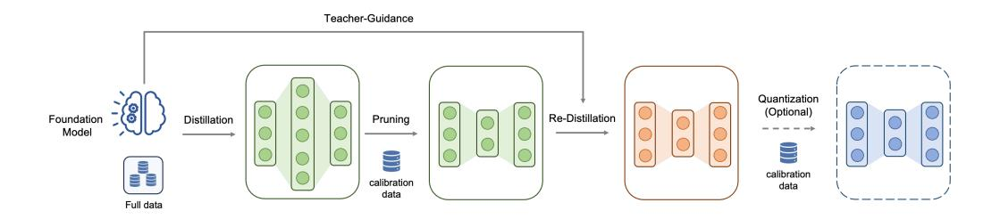
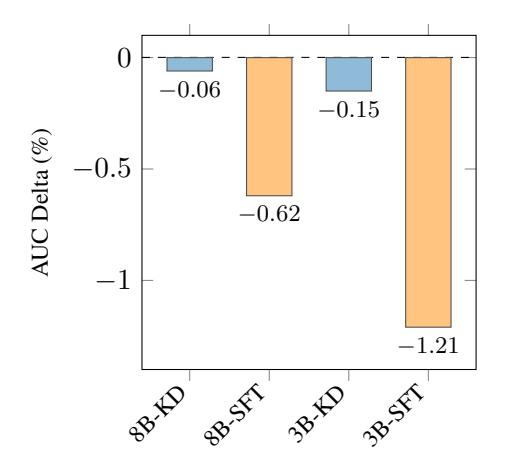
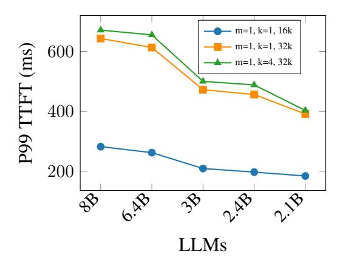
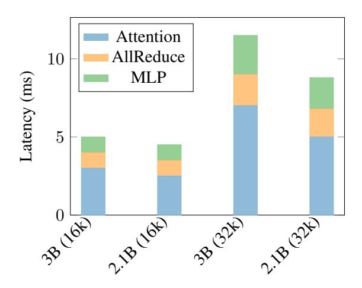
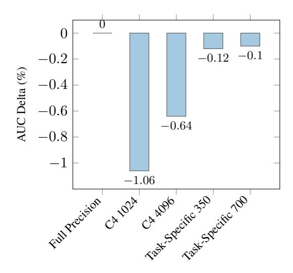

# Scaling Down, Serving Fast: Compressing and Deploying Efficient LLMs for Recommendation Systems

Kayhan Behdin1,3,5, Ata Fatahibaarzi 1,3,5, Qingquan Song2,3,5, Yun Dai 2,3,5 , Aman Gupta 2,3,5 , Zhipeng Wang ∗,1,3 , Shao Tang 1,3 , Hejian Sang 1,3 , Gregory Dexter 1 , Sirou Zhu 1 , Siyu Zhu1 , Tejas Dharamsi1 , Vignesh Kothapalli2 , Zhoutong Fu1 , Yihan Cao1 , Pin-Lun Hsu2 , Fedor Borisyuk1 , Natesh Pillai1 , Luke Simon2 , Rahul Mazumder 1,3,4

1 LinkedIn, 2 Work done at LinkedIn, 3 LinkedIn LLM Efficiency Core Team, 4 MIT 5 Authors contributed equally to this research, ∗ Correspondence: zhip[wang@linkedin.com](mailto:zhipwang@linkedin.com)

## Abstract

Large language models (LLMs) have demonstrated remarkable performance across a wide range of industrial applications, from search and recommendation systems to generative tasks. Although scaling laws indicate that larger models generally yield better generalization and performance, their substantial computational requirements often render them impractical for many real-world scenarios at scale. In this paper, we present a comprehensive set of insights for training and deploying small language models (SLMs) that deliver high performance for a variety of industry use cases. We focus on two key techniques: (1) knowledge distillation and (2) model compression via structured pruning and quantization. These approaches enable SLMs to retain much of the quality of their larger counterparts while significantly reducing training/serving costs and latency. We detail the impact of these techniques on a variety of use cases in a large professional social network platform and share deployment lessons, including hardware optimization strategies that improve speed and throughput for both predictive and reasoningbased applications in Recommendation Systems.

## 1 Introduction

Large language models (LLMs) (Dubey et al., 2024; Jiang et al., 2023; Team et al., 2023; Liu et al., 2024) have ushered in a new era in artificial intelligence and machine learni[ng, driving sig](#page-8-0)[nifica](#page-8-0)[nt improvements in](#page-8-1) [deployed systems ac](#page-10-0)[ross](#page-9-0) [various indu](#page-9-0)stries.

LLMs suitable for real-world applications come in diverse forms, differing in size (ranging from hundreds of millions to hundreds of billions of parameters), architectural design (e.g., encoderbased models like BERT (Devlin, 2018) versus decoder-based models like GPT-3 (Brown et al., 2020)), and training paradigms (such as pretraining, instruction tuning, or test-time com[puta](#page-8-2)[tion](#page-8-2) [\(Dubey](#page-8-2) et al., 2024; Team et al., 2023; Jiang et al., 2023; [Mueller et al.,](#page-7-0) [2023;](#page-7-0) Liu et al., 2024; Guo et al., 2025)).

Specifically for the Social Network Pl[atforms,](#page-8-0) [LLMs are he](#page-8-0)[avily leveraged and d](#page-10-0)[eployed for a](#page-8-1) [multit](#page-8-1)[ude of applications:](#page-9-1) [1. Semantic S](#page-9-0)[earch](#page-8-3) [\(e.g.,](#page-8-3) [embed](#page-8-3)ding generation (Wang et al., 2022, 2023b) and semantic ranking/matching (Qin et al., 2023)); 2. Recommendation Systems (RecSys), specifically Retrieval and Ranking (Zhao et al., 2024) (Li et al., 2023b; Firooz et al., 2025; [Li et al.,](#page-10-1) 2023a[\); 3.](#page-10-1) [Generat](#page-10-2)ive Use cases, such as chatbots, assista[nts, image generator](#page-9-2)s, etc. (Achiam et al., 2023; Dam et al., 2024; Ramesh et al., 2022).

[Fur](#page-10-3)t[hermore, scaling la](#page-9-3)[ws for LLMs have es](#page-8-4)[tablished](#page-9-4) [a strong](#page-9-4) correlation between model size, validation loss, and downstream task performanc[e \(Kaplan et al.,](#page-7-1) 2[020;](#page-7-1) H[offmann et al.](#page-8-5), [2022;](#page-8-5) [Raffel et al.,](#page-9-5) 2[020;](#page-9-5) Wei et al., 2022). As a result, increasing the size of the model is often one of the most effective strategies to enhance performance. Modern LLMs, particularly autoregressive decoder-o[nly models, have expa](#page-8-6)[nded to hundreds](#page-8-7) [of bill](#page-8-7)[ions of parameters.](#page-9-6)

Although large LLMs exhibit extraordinary performance, the deployment of such large models incurs substantial infrastructure costs, especially for latency- or throughput-sensitive tasks in Recommendation Systems (RecSys). However, both academia and industry have developed strategies for creating and deploying efficient small language models (SLMs). Here, we primarily focus on methods that leverage an existing internally trained large LLM to create an efficient SLM that largely maintains the original model's accuracy. Approaches to achieve this include white-box or black-box distillation (Hinton, 2015; Gu et al., 2024; Jin et al., 2021; Agarwal et al., 2024; Tunstall et al., 2023), compression techniques such as quantization (Frantar et al., 2022; Behdin et al., 2023) and sparsification (Frantar and Alistarh, 2023; Meng et al.; Sun et al., 2023; Meng et al., 2024a; Campos et al., 2023).

In this work, we p[resent a suite](#page-8-8) [of insights](#page-8-9) [from](#page-8-9) [the training and de](#page-8-10)[ployment of various ef](#page-7-2)[ficient SLMs in](#page-10-4) [produc](#page-10-4)tion at a large-scale professional social networki[ng company. We addre](#page-8-11)[ss a](#page-7-3) [wide array of pred](#page-7-3)ictive and generative [use cases](#page-8-12) [in RecSys \(including](#page-8-12) [ranking, recom](#page-9-7)[mendations,](#page-9-8) [and r](#page-9-8)[easoning\), with infe](#page-9-9)[rence performance and](#page-7-4) latency constraints in serving as key considerations. Our contributions are as follows.

- We discuss several large-scale RecSys use cases for which language models are useful.
- For these use cases, we explore techniques for developing tailored SLMs, with a focus on knowledge distillation and model compression methods such as quantization and structured pruning.
- We discuss inference, latency, and other serving considerations, offering insights into the infrastructure required to reliably deploy SLMs in high-throughput or low-latency production environments, and share practical lessons from our real-world deployments.

## 2 Preliminaries

Training details We consider models ranging in size from a billion to ∼ 100B parameters. For all use cases, we appropriately tune the learning rate, learning rate warmup schedule and decay, as well as weight decay. Context length varies from a few hundred tokens to up to 32k, depending on the use case. We provide use-case specific details at the appropriate place.

Prompt Structures For predictive tasks, we are mainly interested in ranking use cases. Hence, the use of decoder-based LLMs is prefill-dominant. For generative and reasoning based-tasks, we are also interested in decoding latencies. We relegate the details of the prompt structures to subsections for the specific use cases.

Quality metrics We use different accuracy measures across tasks. For predictive tasks, we use area under the curve (AUC). For generative tasks, we rely on validation loss and task-specific metrics.

Foundational model for RecSys We base our experiments on an internal foundation model (FM) trained using text, primarily for the purpose of ranking and recommendations (Firooz et al., 2025). The FM is a Mixture-of-Experts (MoE) model with an architecture motivated by the Mixtral family (Jiang et al., 2024). In particular, each expert is initialized based on a Llama 3.1 8B Instruct model (Dubey et al., 2024), with 16 experts in total (4 active per token). The FM is trained to approximate the following distribution for a large variety of recommendation tasks where users interact with items:

$$P(m, (e_1, t_1), ..., (e_T, t_T)),$$
 (1)

[where](#page-8-4) m repre[sents a](#page-8-4) user, and each pair (et , it) for t = 1, ..., T represents the user's interaction it (like or click or equivalent) with an entity et (such as post on a social media platform) [. As](#page-8-13) [mentioned be](#page-8-13)fore, the featurization is performed purely via text, allowing the FM to effectively generalize [across heterogeneous](#page-8-0) tasks. The model is then used to estimate the following probabilities for future interactions with entities:

$$P(i_t, i_{t+1}, ... | \text{Task instruction},$$
 $m, (e_1, i_1), ..., (e_{t-1}, i_{t-1}), e_t,$ 
 $e_{t+1}, ...)$  (2)

Text-based featurization makes decoder-only LLMs an attractive option for training this model jointly on a large and varied of recommendation tasks. The FM uses single-token generation for pointwise ranking and probability estimation. The reader is encouraged to peruse the paper Firooz et al. (2025) for more details about the FM.

Due to the large size of the FM—which contains over 100 billion parameters—serving it online for latency-sensitive applications is challenging. In this work, we present experiments demonstrating how we achieved a more than 20× reduction in model size, enabling the online serving of a compressed version of the FM with only a modest loss in accuracy.

## 3 Methodology

We apply these methods to the following realworld use cases in RecSys, with detailed methodology described in [Appendix](#page-8-4) A.

• SLM for predictive tasks obtained through distillation and pruning - We leverage a foundation model (FM) for ranking and recommendations (Firooz et al., 2025; Li et al.,

Figure 1: Overview of the pr[oces](#page-11-0)s of creating SLMs via distillation and compression.

2023a) and leverage distillation and pruning to create an SLM that is efficient for serving latency-sensitive use cases. The fin[al SLM](#page-8-4) [we create is](#page-8-4) [more than](#page-9-4) 20× smaller without any appreciable loss in q[uality.](#page-9-4)

• SLM for reasoning task obtained through distillation - We leverage various flavors of KD to compress a latency-sensitive reasoning model by more than 5× with comparable quality.

Our approach, illustrated in Figure 1, proceeds in three stages: 1) Distillation on the full model. 2) One-shot structured pruning1 to significantly reduce the model size. 3) Re-distillation of the pruned model to recover generalization capabilities. All compression is performed in [a](#page-3-0) posttraining setting using data from various recommendation tasks (see Section A for details on me[tho](#page-2-0)ds). We optionally also quantize the model (details in Section 6). We measure quality by reporting the AUC on the test sets of in-domain tasks, computing AUC per task and then averaging across tas[ks.](#page-11-0)

## 4 Experimental Results for Reasoning Tas[ks](#page-5-0)

We detail experiments for a use case that requires generating reasoning for various input prompts.

We investigate several distillation methods to produce a 1.5B model initialized from Qwen-2.5- 1.5B-Instruct (Yang et al., 2024). The teacher models are obtained by training various sizes of Qwen-2.5 Instruct models using SFT with identical hyperparameters. Performance is primarily measured by validation loss, with lower values indicating higher accuracy (see Table 1).

In a single-stage, word-level training setup, the Forward KL (FKL, β = 0[\) loss achieve](#page-10-5)s the lowest validation loss, outperforming the Jensen–Shannon Divergence (JSD, β = 0.5), SFT, and Reverse KL (RKL, β = 1.0) approaches. Notably, a larger teacher model does not necessarily lead to superior outcomes; for example, a 3B→1.5B distillation can outperform a 7B→1.5B configuration.

In contrast, a two-stage approach—an initial word-level distillation phase followed by onpolicy training with the FKL loss (oFKL) consistently yields better performance than singlestage training alone. Our experiments show that initializing the second stage with the best checkpoint from the first stage (e.g., an FKL-distilled model) is more effective than starting from either an SFT model or the original, non-SFT model. Additionally, an on-policy sampling fraction of 1.0 maximizes accuracy, although a fraction of 0.5 (fr=0.5) may be preferr[ed](#page-3-1) when faster training is desired. We also observe that generating approximately 300 tokens in this task (denoted as tk in Table 1) during on-policy updates strikes an optimal balance between performance and efficiency, outperforming both 200-token and 400-token alternatives, while a generation temperature in the range of 0.8–0.9 is generally most effective.

Interestingly, the student model can sometimes surpass the teacher's performance. In the twostage training paradigm, employing larger teacher models (e.g., 14B rather than 7B or 3B) appears to provide additional benefits for the 1.5B student, although this trend is less pronounced in the singlestage FKL-only training.

Overall, these findings underscore the effectiveness of a two-stage training strategy: an initial supervised fine-tuning phase establishes a strong generative foundation, and subsequent on-policy distillation refines the model's capabilities, leading to improved generalization and performance.

To further study the effectiveness of our distil-

1 "One-shot" indicates pruning without re-training.

| Ablation           | Training Method           | Val Loss |
|--------------------|---------------------------|----------|
|                    | SFT                       | 0.2236   |
|                    | 3B-SFT                    | 0.2081   |
| Baseline           | 7B-SFT                    | 0.1941   |
|                    | 14B-SFT                   | 0.1771   |
|                    | FKL                       | 0.2045   |
|                    | FKL (3B)                  | 0.2015   |
| Single Stage       | JSD (β = 0.5)             | 0.2143   |
|                    | RKL                       | 0.2333   |
|                    | oFKL                      | 0.2107   |
|                    | SFT-SFT                   | 0.2295   |
|                    | SFT-oFKL                  | 0.1982   |
|                    | FKL-oFKL                  | 0.1939   |
| Two Stages         | FKL-oFKL (tk=200)         | 0.1910   |
|                    | FKL-oFKL (tk=300)         | 0.1894   |
|                    | FKL-oFKL (tk=400)         | 0.1910   |
|                    | FKL-oFKL (tk=300, fr=0.5) | 0.1917   |
|                    | FKL (3B)-oFKL (3B)        | 0.1954   |
|                    | FKL (3B)-oFKL (7B)        | 0.1918   |
| Different Teachers | FKL (7B)-oFKL (7B)        | 0.1894   |
|                    | FKL (14B)-oFKL (14B)      | 0.1863   |

Table 1: Validation losses for various training methods and ablations. Unless explicitly specified (e.g., FKL (3B) indicates distillation using the 3B-SFT model as the teacher), the default teacher is the 7B-SFT model.

| Model                                  | AUC Delta (%) |
|----------------------------------------|---------------|
| 8B Distilled Model                     | -             |
| 6.4B Pruned Model (20%) + SFT          | -0.47%        |
| 6.4B Pruned Model (20%) + Distillation | -0.06%        |

Table 2: Distillation vs. SFT for post-pruning retraining.

lation recipes, we apply them to other open source models. In particular, we use the Qwen3 (Yang et al., 2025) model family. On an internal reasoning task, using the same recipes discussed above, we distill a Qwen3 14B model into a Qwen3 4B student model that matches the same accuracy without any performance drops. In addition, using the OpenThoughts reasoning dataset (Guha et al., 2025), we distill the Qwen3 32B reasoning model into Qwen3 8B and 4B student models. We evaluate the student models on AIME 2024 (and 2025) (Habib et al., 2023) benchmarks. Using our recopies, we i[mprove the student](#page-10-6) model's performance by more than 20% for the 8B student model and 15% for the 4B student model compared to their initial base model.

## 5 Experimental Results for Predictive Tasks

#### [5.1](#page-8-14) Knowledge Distillation Findings

To evaluate how knowledge distillation (KD) affects model [generalization, we com](#page-8-15)pare it against standard supervised fine-tuning (SFT). We focus on the task performance retention of the distilled (or fine-tuned) student models relative to the original foundation model (FM). Specifically,

| Model             | AUC Delta (%) |
|-------------------|---------------|
| 8B Model          | -             |
| 6.8B Pruned Model | 0.0%          |
| 6.4B Pruned Model | -1.33%        |
| 6.0B Pruned Model | -1.72%        |

Table 3: Evaluation of the 8B-parameter model post-SFT and its pruned variants, focusing on MLP pruning performed in a one-shot manner (i.e., no retraining after pruning).

| Model                         | #Params | AUC Delta (%) |
|-------------------------------|---------|---------------|
| 3B (Distilled from FM)        | 3B      | -             |
| MLP Prune + Distill           | 2.4B    | -0.12%        |
| MLP Prune + Distill (Gradual) | 2.4B    | 0.03%         |

Table 4: Comparison of one-step vs gradual pruning for a 3B model distilled from the FM.

we use Llama-3.1-8B-Instruct and Llama-3.2-3B-Instruct (Dubey et al., 2024) as our student models. These models offer strong performance while remaining sufficiently compact for throughputand latency-sensitive environments. In both KD and SFT, responses are generated from the groundtruth action-prediction labels. For KD, the pertoken loss is a weighted combination of: 90% forward KL divergence between teacher and student logits, and 10% cross-entropy loss with the ground-truth labels.

Additionally, we include an extra 5% loss contribution computed over the entire sequence (including the prompt), normalized by its token count. Thus, 95% of the loss is computed solely on action prediction tokens (i.e., yes/no token), while the remaining 5% is computed over the prompt tokens. This allows the model to maintain its foundation model knowledge, helping generalization to unseen tasks.

Each KD and SFT configuration undergoes hyperparameter tuning (e.g., peak learning rate, warmup s[chedule, decay schedul](#page-8-0)e, and weight decay). Figure 2 summarizes the results by reporting the AUC delta relative to the original FM (which achieves the best performance). The main observations are:

- SFT: The 3B and 8B student models finetuned only with SFT underperform compared to the FM, which is expected given their smaller size and post-training. The performance drop for the 3B model (−1.21%) is larger than that of the 8B model (−0.62%).
- KD: Using logit supervision from the FM consistently preserves task performance bet-

| Model                 | #Params | AUC Delta (%) |
|-----------------------|---------|---------------|
| MLP Pruning           | 2.4B    | -             |
| ∧ + Attention Pruning | 2.1B    | -1.07%        |
| ∧ + Distillation      | 2.1B    | 0.02%         |

Table 5: Results for attention pruning. We consider the 2.4B gradual pruning model from Table 4 as the base. The second row shows the result for one-shot attention pruning, while the last row shows the results after performing distillation.

Figure 2: Comparison of Distillation and SFT on the Foundation Model. Knowledge distillation consistently outperforms SFT by effectively leveraging teacher supervision to preserve and enhance performance.

ter than SFT. The 8B-KD model shows a minor AUC drop of -0.06% (compared to -0.62% for 8B-SFT), while the 3B-KD model (-0.15%) substantially mitigates the loss relative to 3B-SFT (-1.21%). These results demonstrate the effectiveness of KD for transferring knowledge.

#### 5.2 Post-training Compression Findings

After obtaining the distilled student models, we apply structured pruning and on-the-fly FP8 quantization to further compress the model to meet our serving latency requirements (steps outlined in Figure 1). Since the distilled models (DMs) are decoder-only transformers, our approach focuses on applying structured pruning to remove redundant MLP up/down projection neurons, as well as attention heads in each transformer layer while preserving its capabilities on in-domain ranking tasks. Since an off-the-shelf application of one-shot pruning can result in a loss in model quality (utility), we apply targeted fine-tuning after each pruning step to ensure that the model adapts to its reduced size without significant performance loss.

To this end, we again leverage knowledge distillation to bridge the gap between the original and pruned models, transferring key insights and ensuring the pruned version closely aligns with the outputs of the original foundational model.

For structured pruning, we leverage the OSS-CAR algorithm (Meng et al.) (see Section A.2 for details on methodology). We now discuss the details of various ablations that we conducted towards structured pruning.

Effect of SFT vs. distillation As illustrated in Figure 1, we employ OSSCAR to prune the distilled model in a layerwise fashion. After pruning, we use either SFT or KD to restore any lost generalization, with the unpruned distilled model serving as the teacher. To demonstrate the effectiveness of each approach, we examine an 8B distilled model and its 6.4B pruned counterpart (i.e., 20% pruning of the MLP layers). Table 2 presents the results. Consistent with the findings for pure distillation, the pruned model benefits significantly more from KD than from SFT. Results for the 3B model (pruned to 2.4B) mirror this trend and are omitted for brevity.

While SFT offers a more straightforward optimization path, distillation provides additional flexibility by leveraging teacher—student training to refine model weights more effectively. In practice, the choice of distillation algorithms and associated losses (e.g., forward KL combined with SFT loss) may vary depending on data availability, computational constraints, and the chosen pruning ratio. Nevertheless, in most cases, including a forward KL term proves highly beneficial in counteracting the performance drop associated with pruning.

Pruning the 8B and 3B distilled models down to 6.4B and 2.4B, respectively, can yield further improvements in serving efficiency. Additional details on deployment are provided in Section 6.

Effect of degree and schedule of pruning We next investigate how varying the pruning ratio impacts downstream task accuracy. Table 3 reports one-shot pruning results (i.e., no SFT or KD is applied post-pruning) on an 8B model that has undergone an SFT stage (based on Llama-3.1- 8B-Instruct) comparable to the foundation model. As expected, more aggressive pruning reduces model size but also significantly degrades task accuracy. Notably, small pruning ratios (e.g., from 8B to 6.8B) have minimal effect on performance, while heavier pruning leads to larger accuracy drops. However, as shown in Table 2, such performance

losses can be mitigated by applying distillation.

We also explore *gradual pruning* (Benbaki et al., 2023; Meng et al., 2024b) in which the model is pruned in multiple steps, with knowledge distillation after each pruning. Table 4 summarizes results for pruning a distilled 3B model to 2.4B (a 37.5% MLP sparsity) either in a single step or in two smaller steps (removing 1536 hidden neurons in each step, for a total of 3072). The gradual approach recovers model AUC better than the single-step approach, achieving near-lossless compression from 3B to 2.4B.

Finally, to study attention-head pruning, we take the 2.4B model obtained by gradual MLP pruning and prune half of its attention heads via OSSCAR in a one-shot manner, followed by KD. Table 5 shows that one-shot attention pruning incurs a mod[est](#page-5-0) quality loss, but the subsequent KD phase restores the model to AUC parity with the 2.4B baseline.

We also analyze the effect of calibration data for pr[uni](#page-3-4)ng and results are summarized in Appendix B.2

## 6 Deployment

#### 6.1 Predictive use case in RecSys

SLM variants of the RecSys use case have been deployed to a large-scale A/B test.

Serving Infrastructure For all use cases, we benchmark and serve traffics using nodes with 256 CPU cores, 2TB of host memory an[d 8](#page-3-3) NVIDIA H100 GPUs. As discussed in Appendix A.3, we deploy SGLang (version 0.4.1) as the serving engine. We use tensor parallelism to co[ncurrently](#page-7-5) [use more th](#page-7-5)[an 1 GPU for inferen](#page-9-10)ce. To maximize performance, we employ FP8 quantization for both weights and activations and use FlashI[n](#page-3-2)fer (Ye et al., 2025) as the primary attention backend. Moreover, SGLang incorporates RadixAttention, which enables prefix caching for prompts sharing common prefixes.

Workloads For the RecSys workload, we follow the prompt structure outlined in Section 2 and utilize context lengths of 16k and 32k. Given the predictive nature of the task, the output length (i.e., the number of generated tokens) is set to 1, rendering the workload heavily dependent on the prefill phase. Consequently, optimizing the prefill stage is crucial for performance. For instance, prefix caching su[bsta](#page-4-0)ntially improves prefill (and decode) times when a prompt's key (K) and value (V) tensors for its shared prefix have already been processed. In cases where there are k candidate items to be ranked for a member m, k prompts are served. These prompts share a long prefix containing the [user](#page-14-0) information and historical item interactions. Once one prompt is served, its KV tensors are cached, allowing subsequent prompts for the same member to reuse the cached data - the process we refer to as a hot prefill.

Metrics We use two key metrics - time to first token (TTFT) and time per output token (TPOT). For prediction tasks that are prefill-intensive, TTFT is the primary metric as it reflects the duration of the prefill phase. For generative tasks, both TTFT and TPOT are important. We report the total serving throu[ghput](#page-13-0) for various context lengths.

Results In terms of quality, the models under consideration perform similarly with comparable AUCs. For performance, we report TTFT and throughput measurements for both 16k and 32k context lengths. P99 TTFT results for a w[ork](#page-10-7)[load with 1](#page-10-7) QPS (i.e., m = 1) and 1 or more prompt per member (i.e., k = 1 or more) can be found in Figure 3 (detailed p50, p99 and throughput numbers can be found in Tables 8, 9 and 10 in Appendix B.3). From the results, we can conclude that latency drops drastically as model size beco[me](#page-1-0)s smaller. Serving traffic with 32k context is significantly slower than that with 16k context. Setting k more than 1 doesn't hurt latency much, because of KV caching.

To better understand the effect of model pruning on inference latency, we present the break down of forward pass for a single layer in Figure 4. As it can be seen, the attention step is the main latency bottleneck. Our structured pruning of the attention heads improves the attention latency by about 40% which in turn results in more than 28% speed up in prefill latency.

## 6.2 Generative use case in RecSys

The reasoning task in RecSys was launched online for an 1% A/B test. Along with data changes, KD helped the model improve by 20.29% on an internal quality metric (IQM). We also discuss deployment lessons from a generative use case to study the effect of different quantization schemes on model inference speed and accuracy.

Serving Infrastructure Our setup is mostly similar to Section 6.1. However, in addition to using NVIDIA H100 GPUs, we also study the effect of using older NVIDIA A100 GPUs. To this end, we

Figure [3:](#page-14-1) P[99 T](#page-14-2)TFT ([ms\)](#page-14-3) for various LLM[s](#page-14-4)

| Model       | P50 TTFT (ms) | P50 TPOT (ms) | GPU  |
|-------------|---------------|---------------|------|
| FP16        | 136           | 10.3          | H100 |
| FP8         | 122           | 9.4           | H100 |
| FP16        | 332           | 18.3          | A100 |
| W8A8 (INT)  | 227           | 12.9          | A100 |
| W4A16 (INT) | 389           | 11.2          | A100 |

Table 6: Comparison of different quantization methods for the Llama-3 8B model.

use the vL[LM](#page-6-1) backend (version 0.6.1) for serving. We use 1 GPU for serving.

Workloads The workload here consists of prompts with varying lengths, averaging to 3.8k tokens per request, with 1 request per second. The output generation is capped to 2k tokens. As we focus on a generative task here, we report both TTFT and TPOT. We study a Llama3-based model with the 8B size, and consider several serving scenarios with or without quantization using different hardware.

Performance Results The inference speed results are reported in Table 6. Using the state-of-theart H100 GPUs results in faster inference (both in terms of TTFT and TPOT) compared to A100 GPUs. In particular, we observe that FP8 serving with H100s leads to the smallest TTFT and TPOT. However, for A100 GPUs, INT4(W4A16) quantization yields the most speed-up, while INT8 (W8A8) is more appropriate for prefill-heavy tasks. For the sake of completeness, we present a brief comparison of quantization methods in terms of accuracy in Appendix B.1.

## 7 Limitations

In this paper, we have studied extensively on the training and deployment of efficient SLMs for industry use cases in Recommendation Systems. We do not study any use cases beyond that; thus, our work does not cov[er al](#page-5-1)l the techniques related to

Figure 4: Latency breakdown of a single Transformer block for pruned and unpruned models. At longer context sizes, attention is a bottleneck.

efficient LLM deployment and training. There are several limitations that we want to briefly mention here:

- 1. We did not include the state-of-the-art (SoTA) sparse attention techniques due to the Inference Engine compatibility issues. Recent work such as Star Attention (Acharya et al., 2025) has shown promising results in offline inference speedup. We have explored SoTA sparse attention techniques and achieved >3x of offline inference speedups. However, the SGLang inference engine currently does not support those techniques. We are working closely with th[e SGL](#page-13-1)ang team to align with their roadmap, and hopefully to enable those features in the near future.
- 2. For the LLM model pruning techniques discussed in this paper, we focus only on structured pruning due to its elegant theoretical guarantees and hardware efficiency. However, recent work in unstructured pruning (Jeong et al., 2025; Munoz ˜ et al., 2024) has shown promising performance in inference speed-ups and model quality preservation. A future direction could be to combine unstructured sparsity with structured pruning to further enhance LLMs inference efficiency. To this end, one can draw inspiration from recent work on algorithmic approaches for unstructured sparsity (Meng et al., 2024a; Sun et al., 2023). Other directions include exploring compression strategies adaptive to downstream parameter efficient fine-tuning (Makni et al., 2025).

## 8 Acknowledgement

Rahul Mazumder contributed to this work while he was a consultant for LinkedIn as an Academic Scholar (in compliance with Massachusetts Institute of Technology's outside professional activities policies).

## References

- Shantanu Acharya, Fei Jia, and Boris Ginsburg. 2025. Star attention: Efficient llm inference over long sequences. In *ICML25: International Conference on Machine Learning*.
- [Josh Achiam, S](#page-7-6)teven Adler, Sandhini Agar[wal, Lama](#page-7-6) Ahmad, Ilge Akkaya, Florencia Leoni Aleman, Diogo Almeida, Janko Altenschmidt, Sam Altman, Shyamal Anadkat, and 1 others. 2023. Gpt-4 technical report. *arXiv preprint arXiv:2303.08774*.
- Rishabh Agarwal, Nino Vieillard, Yongchao Zhou, Piotr Stanczyk, Sabela Ramos Garea, Matthieu Geist, and Olivier Bachem. 2024. On-policy distillation of language models: Learning from self-generated mistakes. In *The Twelfth International Conference on Learning Representations*.
- Kayhan Behdin, Ayan Acharya, Aman Gupta, Qingquan Song, Siyu Zhu, Sathiya Keerthi, and Rahul Mazumder. 2023. Quantease: Optimizationbased quantization for language models. *[arXiv e](#page-8-16)prints*, pages arXiv–2309.
- [Riade](#page-8-16) [Benbak](#page-8-16)[i, Wenyu Chen, Xiang](#page-9-11) Meng, Hussein Hazimeh, Natalia Ponomareva, Zhe Zhao, and Rahul Mazumder. 2023. Fast as chita: Neural network pruning with combinatorial optimization. In *International Conference on Machine Learning*, pages 2031–2049. PMLR.
- Yonatan Bisk, Rowan Zellers, Jianfeng Gao, Yejin Choi, and 1 others. 2020. Piqa: Reasoning about ph[ysical commonsense in na](#page-9-9)[tural language](#page-9-8). In *Proceedings of the AAAI conference on artificia[l intelli](#page-9-8)gence*, volume 34, pages 7432–7439.
- Tom Brown, Benjamin Man[n, Nick Ryder, Melan](#page-9-12)ie Subbiah, Jared D Kaplan, Prafulla Dhariwal, Arvind Neelakantan, Pranav Shyam, Girish Sastry, Amanda Askell, and 1 others. 2020. Language models are few-shot learners. *Advances in neural information processing systems*, 33:1877–1901.
- Daniel Campos, Alexandre Marques, Mark Kurtz, and Cheng Xiang Zhai. 2023. oberta: Improving sparse transfer learning via improved initialization, distillation, and pruning regimes. In *Proceedings of The Fourth Workshop on Simple and Efficient Natural Language Processing (SustaiNLP)*, pages 39–58.
- Aakanksha Chowdhery, Sharan Narang, Jacob Devlin, Maarten Bosma, Gaurav Mishra, Adam Roberts, Paul Barham, Hyung Won Chung, Charles Sutton,

- Sebastian Gehrmann, and 1 others. 2023. Palm: Scaling language modeling with pathways. *Journal of Machine Learning Research*, 24(240):1–113.
- Peter Clark, Isaac Cowhey, Oren Etzioni, Tushar Khot, Ashish Sabharwal, Carissa Schoenick, and Oyvind Tafjord. 2018. Think you have solved question answering? try arc, the ai2 reasoning challenge. *arXiv preprint arXiv:1803.05457*.
- Yun Dai, Tejas Dharamsi, Pin-Lun Hsu, Tao Song, and Hamed Firooz. 2024. Enhancing stability for large models training in constrained bandwidth networks. In *Workshop on Efficient Systems for Foundation Models II@ ICML2024*.
- Sumit Kumar Dam, Choong Seon Hong, Yu Qiao, and Chaoning Zhang. 2024. A complete survey on llmbased ai chatbots. *arXiv preprint arXiv:2406.16937*.
- Jacob Devlin. 2018. Bert: Pre-training of deep bidirectional transformers for language understanding. *arXiv preprint arXiv:1810.04805*.
- Abhimanyu Dubey, Abhinav Jauhri, Abhinav Pandey, Abhishek Kadian, Ahmad Al-Dahle, Aiesha Letman, Akhil Mathur, Alan Schelten, Amy Yang, Angela Fan, and 1 others. 2024. The llama 3 herd of models. *arXiv preprint arXiv:2407.21783*.
- Hamed Firooz, Maziar Sanjabi, Adrian Englhardt, Aman Gupta, Ben Levine, Dre Olgiati, Gungor Polatkan, Iuliia Melnychuk, Karthik Ramgopal, Kirill Talanine, and 1 others. 2025. 360brew: A decoderonly foundation model for personalized ranking and recommendation. *arXiv preprint arXiv:2501.16450*.
- Elias Frantar and Dan Alistarh. 2023. Sparsegpt: Massive language models can be accurately pruned in one-shot. In *International Conference on Machine Learning*, pages 10323–10337. PMLR.
- Elias Frantar, Saleh Ashkboos, Torsten Hoefler, and Dan Alistarh. 2022. Gptq: Accurate post-training quantization for generative pre-trained transformers. *arXiv preprint arXiv:2210.17323*.
- Yuxian Gu, Li Dong, Furu Wei, and Minlie Huang. 2024. Minillm: Knowledge distillation of large language models. In *The Twelfth International Conference on Learning Representations*.
- Etash Guha, Ryan Marten, Sedrick Keh, Negin Raoof, Georgios Smyrnis, Hritik Bansal, Marianna Nezhurina, Jean Mercat, Trung Vu, Zayne Sprague, Ashima Suvarna, Benjamin Feuer, Liangyu Chen, Zaid Khan, Eric Frankel, Sachin Grover, Caroline Choi, Niklas Muennighoff, Shiye Su, and 31 others. 2025. Openthoughts: Data recipes for reasoning models. *Preprint*, arXiv:2506.04178.
- Daya Guo, Dejian Yang, Haowei Zhang, Junxiao Song, Ruoyu Zhang, Runxin Xu, Qihao Zhu, Shirong Ma, Peiyi Wang, Xiao Bi, and 1 others. 2025. Deepseek-r1: Incentivizing reasoning capability in llms via reinforcement learning. *arXiv preprint arXiv:2501.12948*.

- Nathan Habib, Clementine Fourrier, Hynek Kydl ´ ´ıcek, ˇ Thomas Wolf, and Lewis Tunstall. 2023. Lighteval: A lightweight framework for llm evaluation.
- Babak Hassibi, David G Stork, and Gregory J Wolff. 1993. Optimal brain surgeon and general network pruning. In *IEEE international conference on neural networks*, pages 293–299. IEEE.
- Geoffrey Hinton. 2015. Distilling the knowledge in a neural network. *arXiv preprint arXiv:1503.02531*.
- Jordan Hoffmann, Sebastian Borgeaud, Arthur Mensch, Elena Buchatskaya, Trevor Cai, Eliza Rutherford, Diego de Las Casas, Lisa Anne Hendricks, Johannes Welbl, Aidan Clark, and 1 others. 2022. Training compute-optimal large language models. *arXiv preprint arXiv:2203.15556*.
- Pin-Lun Hsu, Yun Dai, Vignesh Kothapalli, Qingquan Song, Shao Tang, Siyu Zhu, Steven Shimizu, Shivam Sahni, Haowen Ning, Yanning Chen, and Zhipeng Wang. 2025. Liger kernel: Efficient triton kernels for llm training. *Workshop CODEML: Championing Open-source DEvelopment in Machine Learning @ ICML2025*.
- Geonhwa Jeong, Po-An Tsai, Abhimanyu Bambhaniya, Stephen W. Keckler, and Tushar Krishna. 2025. Enabling unstructured sparse acceleration on structured sparse accelerators. In *MLSys25: Proceedings of the 8th MLSys Conference*.
- Albert Q Jiang, Alexandre Sablayrolles, Arthur Mensch, Chris Bamford, Devendra Singh Chaplot, Diego de las Casas, Florian Bressand, Gianna Lengyel, Guillaume Lample, Lucile Saulnier, and 1 others. 2023. Mistral 7b. *arXiv preprint arXiv:2310.06825*.
- Albert Q Jiang, Alexandre Sablayrolles, Antoine Roux, Arthur Mensch, Blanche Savary, Chris Bamford, Devendra Singh Chaplot, Diego de las Casas, Emma Bou Hanna, Florian Bressand, and 1 others. 2024. Mixtral of experts. *arXiv preprint arXiv:2401.04088*.
- Woojeong Jin, Maziar Sanjabi, Shaoliang Nie, Liang Tan, Xiang Ren, and Hamed Firooz. 2021. Modality-specific distillation. In *Proceedings of the Third Workshop on Multimodal Artificial Intelligence*, pages 42–53.
- Ja[red Kaplan, Sam McCandlish, Tom Henighan,](https://arxiv.org/abs/2506.04178) Tom B Brown, Benjamin Chess, Rewon Child, Scott Gray, Alec Radford, Jeffrey Wu, and Dario Amodei. 2020. Scaling laws for neural language models. *arXiv preprint arXiv:2001.08361*.
- Yoon Kim and Alexander M Rush. 2016. Sequencelevel knowledge distillation. *arXiv preprint arXiv:1606.07947*.
- Jongwoo Ko, Sungnyun Kim, Tianyi Chen, and Se-Young Yun. 2024. Distillm: Towards streamlined d[istillation for large language models.](https://github.com/huggingface/lighteval) *arXiv [preprint arXiv:2](https://github.com/huggingface/lighteval)402.03898*.

- Eldar Kurtic, Elias Frantar, and Dan Alistarh. 2024. ´ Ziplm: Inference-aware structured pruning of language models. *Advances in Neural Information Processing Systems*, 36.
- Woosuk Kwon, Sehoon Kim, Michael W Mahoney, Joseph Hassoun, Kurt Keutzer, and Amir Gholami. 2022. A fast post-training pruning framework for transformers. *Advances in Neural Information Processing Systems*, 35:24101–24116.
- Woosuk Kwon, Zhuohan Li, Siyuan Zhuang, Ying Sheng, Lianmin Zheng, Cody Hao Yu, Joseph E. Gonzalez, Hao Zhang, and Ion Stoica. 2023. Efficient memory management for large language model serving with pagedattention. In *Proceedings of the ACM SIGOPS 29th Symposium on Operating Systems Principles*.
- Yann LeCun, John Denker, and Sara Solla. 1989. Optimal brain damage. *Advances in neural information processing systems*, 2.
- Jiacheng Li, Ming Wang, Jin Li, Jinmiao Fu, Xin Shen, Jingbo Shang, and Julian McAuley. 2023a. Text is all you need: Learning language representations for sequential recommendation. In *Proceedings of the 29th ACM SIGKDD Conference on Knowledge Discovery and Data Mining*, pages 1258–1267.
- Xiaopeng Li, Lixin Su, Pengyue Jia, Xiangyu Zhao, Suqi Cheng, Junfeng Wang, and Dawei Yin. 2023b. Agent4ranking: Semantic robust ranking via personalized query rewriting using multi-agent llm. *arXiv preprint arXiv:2312.15450*.
- Aixin Liu, Bei Feng, Bing Xue, Bingxuan Wang, Bochao Wu, Chengda Lu, Chenggang Zhao, Chengqi Deng, Chenyu Zhang, Chong Ruan, and 1 others. 2024. Deepseek-v3 technical report. *arXiv preprint arXiv:2412.19437*.
- Ryan Lucas and Rahul Mazumder. 2024. Preserving deep representations in one-shot pruning: A hessianfree second-order optimization framework. In *The Thirteenth International Conference on Learning Representations*.
- Mehdi Makni, Kayhan Behdin, Zheng Xu, Natalia Ponomareva, and Rahul Mazumder. 2025. A unified framework for sparse plus low-rank matrix decomposition for llms. In *The Second Conference on Parsimony and Learning (Proceedings Track)*.
- Xiang Meng, Kayhan Behdin, Haoyue Wang, and Rahul Mazumder. 2024a. Alps: Improved optimization for highly sparse one-shot pruning for large language models. *Advances in Neural Information Processing Systems*, 37:37594–37625.
- Xiang Meng, Wenyu Chen, Riade Benbaki, and Rahul Mazumder. 2024b. Falcon: Flop-aware combinatorial optimization for neural network pruning. In *International Conference on Artificial Intelligence and Statistics*, pages 4384–4392. PMLR.

- Xiang Meng, Shibal Ibrahim, Kayhan Behdin, Hussein Hazimeh, Natalia Ponomareva, and Rahul Mazumder. Osscar: One-shot structured pruning in vision and language models with combinatorial optimization. In *Forty-first International Conference on Machine Learning*.
- Aaron Mueller, Kanika Narang, Lambert Mathias, Qifan Wang, and Hamed Firooz. 2023. Meta-training with demonstration retrieval for efficient few-shot learning. *arXiv preprint arXiv:2307.00119*.
- Saurav Muralidharan, Sharath Turuvekere Sreenivas, Raviraj Joshi, Marcin Chochowski, Mostofa Patwary, Mohammad Shoeybi, Bryan Catanzaro, Jan Kautz, and Pavlo Molchanov. 2024. LLM pruning and distillation in practice: The minitron approach. *arXiv preprint arXiv:2408.11796*.
- J. Pablo Munoz, Jinjie Yuan, and Nilesh Jain. 2024. ˜ Shears: Unstructured sparsity with neural low-rank adapter search. In *Proceedings of the 2024 Conference of the North American Chapter of the Association for Computational Linguistics: Human Language Technologies(Volume 6: Industry Track)*, pages 395–405.
- NVIDIA. 2024. Tensorrt-llm. GitHub: https://github.com/NVIDIA/TensorRT-LLM.
- Zhen Qin, Rolf Jagerman, Kai Hui, Honglei Zhuang, Junru Wu, Le Yan, Jiaming Shen, Tianqi Liu, Jialu Liu, Donald Metzler, and 1 others. 2023. Large language models are effective text rankers with pairwise ranking prompting. *arXiv preprint arXiv:2306.17563*.
- Colin Raffel, Noam Shazeer, Adam Roberts, Katherine Lee, Sharan Narang, Michael Matena, Yanqi Zhou, Wei Li, and Peter J Liu. 2020. Exploring the limits of transfer learning with a unified text-to-text transformer. *Journal of machine learning research*, 21(140):1–67.
- Samyam Rajbhandari, Jeff Rasley, Olatunji Ruwase, and Yuxiong He. 2020. Zero: Memory optimizations toward training trillion parameter models. In *SC20: International Conference for High Performance Computing, Networking, Storage and Analysis*, pages 1–16. IEEE.
- Aditya Ramesh, Prafulla Dhariwal, Alex Nichol, Casey Chu, and Mark Chen. 2022. Hierarchical text-conditional image generation with clip latents. *arXiv preprint arXiv:2204.06125*, 1(2):3.
- Mingjie Sun, Zhuang Liu, Anna Bair, and J Zico Kolter. 2023. A simple and effective pruning approach for large language models. *arXiv preprint arXiv:2306.11695*.
- Gemini Team, Rohan Anil, Sebastian Borgeaud, Jean-Baptiste Alayrac, Jiahui Yu, Radu Soricut, Johan Schalkwyk, Andrew M Dai, Anja Hauth, Katie Millican, and 1 others. 2023. Gemini: a family of highly capable multimodal models. *arXiv preprint arXiv:2312.11805*.

- MLC team. 2023-2025. Mlc-llm.
- Philippe Tillet, Hsiang-Tsung Kung, and David Cox. 2019. Triton: an intermediate language and compiler for tiled neural network computations. In *Proceedings of the 3rd ACM SIGPLAN International Workshop on Machine Learning and Programming Languages*, pages 10–19.
- Lewis Tunstall, Edward Beeching, Nathan Lambert, Nazneen Rajani, Kashif Rasul, Younes Belkada, Shengyi Huang, Leandro von Werra, Clementine ´ Fourrier, Nathan Habib, and 1 others. 2023. Zephyr: Direct distillation of lm alignment. *arXiv preprint arXiv:2310.16944*.
- Guanhua Wang, Heyang Qin, Sam Ade Jacobs, Connor Holmes, Samyam Rajbhandari, Olatunji Ruwase, Feng Yan, Lei Yang, and Yuxiong He. 2023a. Zero++: Extremely efficient collective communication for giant model training. *arXiv preprint arXiv:2306.10209*.
- Liang Wang, Nan Yang, Xiaolong Huang, Binxing Jiao, Linjun Yang, Daxin Jiang, Rangan Majumder, and Furu Wei. 2022. Text embeddings by weaklysupervised contrastive pre-training. *arXiv preprint arXiv:2212.03533*.
- Liang Wang, Nan Yang, Xiaolong Huang, Linjun Yang, Rangan Majumder, and Furu Wei. 2023b. Improving text embeddings with large language models. *arXiv preprint arXiv:2401.00368*.
- Jason Wei, Xuezhi Wang, Dale Schuurmans, Maarten Bosma, Fei Xia, Ed Chi, Quoc V Le, Denny Zhou, and 1 others. 2022. Chain-of-thought prompting elicits reasoning in large language models. *Advances in neural information processing systems*, 35:24824–24837.
- Guangxuan Xiao, Ji Lin, Mickael Seznec, Hao Wu, Julien Demouth, and Song Han. 2023. Smoothquant: Accurate and efficient post-training quantization for large language models. In *International Conference on Machine Learning*, pages 38087–38099. PMLR.
- Wenda Xu, Rujun Han, Zifeng Wang, Long T Le, Dhruv Madeka, Lei Li, William Yang Wang, Rishabh Agarwal, Chen-Yu Lee, and Tomas Pfister. 2024. Speculative knowledge distillation: Bridging the teacher-student gap through interleaved sampling. *arXiv preprint arXiv:2410.11325*.
- An Yang, Anfeng Li, Baosong Yang, Beichen Zhang, Binyuan Hui, Bo Zheng, Bowen Yu, Chang Gao, Chengen Huang, Chenxu Lv, and 1 others. 2025. Qwen3 technical report. *arXiv preprint arXiv:2505.09388*.
- An Yang, Baosong Yang, Beichen Zhang, Binyuan Hui, Bo Zheng, Bowen Yu, Chengyuan Li, Dayiheng Liu, Fei Huang, Haoran Wei, and 1 others. 2024. Qwen2. 5 technical report. *arXiv preprint arXiv:2412.15115*.

- Zihao Ye, Lequn Chen, Ruihang Lai, Wuwei Lin, Yineng Zhang, Stephanie Wang, Tianqi Chen, Baris Kasikci, Vinod Grover, Arvind Krishnamurthy, and Luis Ceze. 2025. Flashinfer: Efficient and customizable attention engine for llm inference serving. *arXiv preprint arXiv:2501.01005*.
- Wayne Xin Zhao, Jing Li[u, Ruiyan](https://github.com/mlc-ai/mlc-llm)g Ren, and Ji-Rong Wen. 2024. Dense text retrieval based on pretrained language models: A survey. *ACM Transactions on Information Systems*, 42(4):1–60.
- Lianmin Zheng, Liangsheng Yin, Zhiqiang Xie, Chuyue Sun, Jeff Huang, Cody Hao Yu, Shiyi Cao, Christos Kozyrakis, Ion Stoica, Joseph E Gonzalez, and 1 others. 2024. Sglang: Efficient execution of structured language model programs. *arXiv preprint arXiv:2312.07104*.
- Yongchao Zhou, Kaifeng Lyu, Ankit Singh Rawat, Aditya Krishna Menon, Afshin Rostamizadeh, Sanjiv Kumar, Jean-Franc¸ois Kagy, and Rishabh Agarwal. 2023. Distillspec: Improving speculative decoding via knowledge distillation. *arXiv preprint arXiv:2310.08461*.

## A Methods

In this section, we detail various techniques that allow SLMs to retain strong generalization or task-specific performance, while allowing efficient serving from a latency or throughput standpoint. Specifically, we discuss training via knowledge distillation and post-training model compression. We also intersperse serving and training efficiency concerns across the entire section.

## A.1 Knowledge Distillation

Modern LLMs work with tokens as the currency of input and output. Let x = [x1, x2, x3, . . . ] represent an input prompt consisting of a sequence of tokens. Given this prompt, a large language model (LLM) generates a response y = [y1, y2, y3, . . . , yT ], producing tokens sequentially in an autoregressive manner. An LLM models the probability distribution qθ(y|x), parametrized by θ.

Knowledge distillation (KD) (Hinton, 2015) transfers knowledge from a larger [and expressive](#page-8-8) "teacher" model to a smaller "student" model, allowing the latter to approximate teacher performance with reduced computational resources. KD can be broadly performed in two different ways (1) by leveraging the output of a teacher model to train the student (Tunstall et al., 2023; Guo et al., 2025)(also known as black-box distillation) or (2) by leveraging [intermediate outputs \(](#page-10-4)[Muralidharan](#page-8-3) [et al.,](#page-8-3) 2024; Hinton, 2015) (also known as whitebox distillation). White-box distillation usi[ng the](#page-9-13) [soft probabilistic outputs o](#page-9-13)[f the teacher is](#page-8-8) a powerful technique and helps provide richer information than hard labels used in supervised fine-tuning (SFT), helping the student generalize better, especially in tasks where smaller models struggle to discover patterns in noisy data.

We consider white-box KD using a training objective with the following general structure. Formally, given a fixed teacher model distribution p(y|x), the student model qθ under the same vocabulary is trained by minimizing the following objective:

$$\mathcal{L}[p_{\mathbf{y}}, \mathcal{D}(p||q_{\theta})] = (3)$$

$$\mathbb{E}_{\mathbf{x} \sim p_{\mathbf{x}}} \mathbb{E}_{\mathbf{y} \sim p_{\mathbf{y}}(\cdot|\mathbf{x})} \left[ \sum_{t=1}^{T} \mathcal{D}(p(\cdot|\mathbf{y}_{< t}, \mathbf{x}) ||q_{\theta}(\cdot|\mathbf{y}_{< t}, \mathbf{x})) \right]$$

where py denotes the distribution from which the response y is sampled, D is a divergence measure between two next-token distributions, and T is the maximum response length. This objective emphasizes two aspects:

- 1. Responses are drawn from py, which may correspond to ground truth data, the teacher model (sequence-level KD) (Kim and Rush, 2016), or the student model itself (on-policy KD) (Agarwal et al., 2024; Gu et al., [2024;](#page-8-17) [Zhou et al.,](#page-8-17) [2023\)](#page-8-17). Recent advancements (Xu et al., 2024; Ko et al., [2024\) explore a balance](#page-7-2) [between on-polic](#page-8-9)[y and off-policy sam](#page-10-8)pling to mitigate the mism[atch between stud](#page-10-9)[ent](#page-8-18)[generated re](#page-8-18)sponses and the teacher's distribution while addressing inefficiencies in online student autoregressive training.
- 2. The student model is optimized to minimize the discrepancy between its next-token distribution qθ and the teacher's predictions p, ensuring knowledge transfer across the response sequence.

In this work, we explore different KD strategies based on the task requirements. We also experiment with various student initialization techniques and divergence measures.

Let V denote the vocabulary. The commonly used divergences are:

• Forward Kullback-Leibler (KL) Divergence (FKL):

$$\mathcal{D}_{\text{FKL}}\left[p(y_t|\mathbf{y}_{< t}, \mathbf{x}) || q_{\theta}(y_t|\mathbf{y}_{< t}, \mathbf{x})\right]$$

$$= \sum_{i \in \mathcal{V}} p(i|\cdot) \log \left(\frac{p(i|\cdot)}{q_{\theta}(i|\cdot)}\right),$$

• Reverse Kullback-Leibler Divergence (RKL):

$$\mathcal{D}_{\text{RKL}}\left[p(y_t|\mathbf{y}_{< t}, \mathbf{x}) || q_{\theta}(y_t|\mathbf{y}_{< t}, \mathbf{x})\right]$$

$$= \sum_{i \in \mathcal{V}} q_{\theta}(i|\cdot) \log \left(\frac{q_{\theta}(i|\cdot)}{p(i|\cdot)}\right),$$

• Jensen-Shannon Divergence (JSD):

$$\mathcal{D}_{JS(\beta)} \left[ p(y_t | \mathbf{y}_{< t}, \mathbf{x}) \| q_{\theta}(y_t | \mathbf{y}_{< t}, \mathbf{x}) \right]$$
  
=  $\beta \mathcal{D}_{FKL} \left[ p \| m \right] + (1 - \beta) \mathcal{D}_{FKL} \left[ q_{\theta} \| m \right],$ 

where m = βp + (1 − β)qθ is the mixture distribution.

#### A.2 Post-training model compression

Model compression is a widely studied area of machine learning. We specifically focus on post-training compression (PTC) techniques for improving the inference efficiency of LLMs.

In post-training compression, we apply compression to the model after training. A common compression procedure is based on pruning or quantizing the model weights of a pre-trained model but it can result in large loss in model utility due to which alternative approaches are preferred. Specifically, recent compression procedures employ a layerwise approach (Equation 4) where the utility for every layer in a model is retained (to the extent possible) by minimizing a suitable layerwise objective function based on a calibration dataset — this approach can be scaled to large models while retaining model utility, and we use this method in our work.

We describe a mathematical framework for layerwise PTC using calibration data. Let  $\mathbf{X} \in \mathbb{R}^{n \times d}$  denote the calibration data that serve as inputs to a linear layer of the model (e.g., an MLP or an attention projection). Here, n is the number of tokens in the calibration dataset, and d is the input dimension of the layer. For instance, in the case of an MLP down projection layer of a Transformer block, d corresponds to the intermediate size of the model.

Furthermore, let  $\mathbf{W} \in \mathbb{R}^{d \times p}$  denote the weight matrix of the layer, where p is the output dimension. In the MLP down projection example, p represents the hidden size of the model. We denote by  $\hat{\mathbf{W}} \in \mathbb{R}^{d \times p}$  the weight matrix after compression. The layerwise reconstruction error is defined as  $\|\mathbf{X}\mathbf{W} - \mathbf{X}\hat{\mathbf{W}}\|_F^2$ . Thus, for each layer that undergoes compression, we consider an optimization problem of the form

$$\min_{\hat{\mathbf{W}}} \|\mathbf{X}\mathbf{W} - \mathbf{X}\hat{\mathbf{W}}\|_F^2 \quad \text{subject to} \quad \hat{\mathbf{W}} \in \mathcal{Q}, \ (4)$$

where  $Q \subseteq \mathbb{R}^{d \times p}$  denotes the set of feasible solutions that conform to a particular compression scheme (eg, unstructured or structured pruning, quantization, etc), In practice, the set Q often exhibits a discrete structure, which renders the optimization problem in (4) challenging to solve. Past work has shown that a better optimization procedure for Problem (4) generally results in better utility-compression tradeoffs (Meng et al., 2024a,b; Behdin et al., 2023), which motivates the approaches we used in our work.

Here, we consider two compression techniques: Quantization In quantization, the model weights are represented in lower precision, using a fewer number of bits. Quantization has proved to be successful in the LLM domain, to obtain compressed models with small accuracy loss (Frantar et al., 2022; Xiao et al., 2023). In this work, we consider weight-only quantization, where only model weights are quantized, as well as weight and activation quantization. We study methods such as GPTO (Frantar et al., 2022) and QuantEase (Behdin et al., 2023) for 4-bit weight-only quantization (aka W4A16), SmoothQuant (Xiao et al., 2023) for 8-bit weight-and-activation quantization (aka W8A8), and 8-bit floating-point (FP8) quantization. Since quantization is dependent on hardware, we discuss the details of quantizationrelated experiments in Section 6 (deployment).

Structured Pruning Post-training neural network pruning has old roots (LeCun et al., 1989; Hassibi et al., 1993) - the basic idea is to identify "redundant" model weights and set them to zero to reduce model footprint. Recently, due to increasing challenges associated with large models, advanced algorithms have been explored for pruning neural networks at the post-training stage. Some unstructured pruning methods for LLMs using layerwise reconstruction error include Meng et al. (2024a); Frantar and Alistarh (2023); Sun et al. (2023). Other pruning approaches using loss functions different from layerwise reconstruction error include approaches based on global Fisher loss (Benbaki et al., 2023; Meng et al., 2024b, and references therein), layerwise loss functions that depend upon the future layers (Lucas and Mazumder, 2024), and low-rank fine-tuning adapted loss functions (Makni et al., 2025)[see references therein] — we leave the exploration of these approaches as interesting directions for future research.

Without any structure on the model sparsity, however, it can be difficult to realize any inference acceleration from pruning2. Therefore, in this work, we pursue a structured pruning approach. In structured pruning, the goal is to obtain smaller models via removing some neurons from the model weights. In particular, we study MLP pruning, where the goal is to reduce the intermediate size of the model via removing some hidden

&lt;sup>2Some of the approaches discussed above apply (Meng et al., 2024a; Sun et al., 2023) to semi-structured pruning such as 2:4 sparsity which is different from structured pruning.

neurons in feed-forward layers. We al[so](#page-13-2) study attention pruning, where we remove a certain number of attention heads from the model (Meng et al.; Kwon et al., 2022; Kurtic et al. ´ , 2024). In this paper, we use OSSCAR (Meng et al.) which uses a discrete optimization approach for structured pruning. OSSCAR can be scaled to the large-scale problems we consider here. We use OSSCAR as it can result in state-of-the-art performance when it comes to post-training structured pruning of LLMs and leads to the le[ast drop in ac](#page-9-7)[curacy when compare](#page-9-16)[d to other methods.](#page-9-17)

#### A.3 Training and serving effici[ency](#page-9-7)

Despite significant algorithmic advances, the challenges of training and serving LLMs persist. Efficient training and serving remain critical for practical deployment, requiring ongoing improvements in kernel optimization, distributed training, and inference acceleration.

Training Efficiency LLM training presents a formidable challenge due to the sheer scale of these models and the quadratic complexity of transformer architectures. Model FLOPs utilization (MFU) (Chowdhery et al., 2023) is commonly used to measure GPU efficiency, making it necessary to optimize kernel operations and distributed training strategies. We have implemented Liger Kernel (Hsu et al., 2025) in Triton (Tillet et al., 2019), incorporating several key optimizations. First, we employ kernel fusion to reduce repetitive memory transfers between SRAM and DRAM. Next, we adopt in-place tensor modifications to avoid creating [additional tensors whenever](#page-7-7) possible, thus lowering the memory footprint. We also apply chunking, which prevents the full materialization of large tensors and provides tuning flexibility while maintaining compa[rable perfor](#page-8-20)[mance](#page-8-20). In combi[nation, these optimiza](#page-10-11)tions reduce training time by 20% and memory usage by 60%. Additional performance-memory tradeoffs such as gradient checkpointing and CPU offloading can lead to as much as a threefold speedup.

For distributed training, we use ZeRO (Rajbhandari et al., 2020) to shard model parameters and data across multiple GPUs, overlapping computation with communication to sustain high MFU. Together with the DeepSpeed team, we have optimized the ZeRO algorithm, and for network-constrained cl[usters, we h](#page-9-8)ave developed ZeR[O++ \(Wang](#page-9-9) [et al.,](#page-9-9) 2023a; Dai [et al.,](#page-9-8) 2024) to mitigate non-deterministic synchronization issues that can hinder convergence. ZeRO++ provides a 2.4× speedup over vanilla ZeRO.

Serving Efficiency Serving LLMs efficiently poses unique challenges due to both high computational demands and strict latency requirements. In production environments, the choice of serving frameworks is pivotal for maximizing thro[ugh](#page-9-18)[put and minimizing res](#page-9-18)ponse times. Several solutions, including vLLM, SGLag, TRT-LLM, and MLC-LLM (Kwon et al., 2023; Zheng et al., 2024; NVIDIA, 2024; team, 2023-2025), have been proposed to address these needs. In our use cases, we extensively evaluated vLLM and SGLang. Our benchmarks reve[aled that SGLang is b](#page-10-12)[etter](#page-8-21) [suited to ou](#page-8-21)r workloads because its radix treebased caching mechanism aligns well with our usage patterns and it integrates tightly with Flash-Infer (Ye et al., 2025), whose efficient attention kernels accelerate the sequence lengths and batch sizes we typically handle.

To further improve serving performance, we deploy our models on NVIDIA H100 GPUs at FP8 precision, striking a practical balance between computational efficiency and model quality. Additional details regarding our LLM serving [engine](#page-9-19) [configuratio](#page-9-19)[ns can be found in S](#page-10-13)[ection](#page-9-20) 6.

## [B Additional N](#page-10-14)umerical Experiments

## B.1 Comparison of Quantization Methods

We present a comparison of different quantization methods. We use the Meta Llama 3.1 8B Instruct mode[l, and quantize th](#page-10-7)e model using 1024 samples from the open source C4 (Raffel et al., 2020) dataset as the calibration set. We report the zero-shot accuracy of the model on three opensource tasks PIQA (Bisk et al., 2020) and ARC easy/challenge (Clark et al., 2018). We compare W8A8 quantization with SmoothQuant (Xiao et al., 2023), FP8 quantization on H100 GPUs, and W4A16 quantization with GPTQ (Frantar et al., 2022) a[nd](#page-5-0) QuantEase (Behdin et al., 2023). The results are shown in Table 7. We see that 8-bit quantization generally has a small loss of accuracy. On the other hand, GPTQ with W4A16 shows some model quality degradation. However, using QuantEase for better optimization helps to reduce the model quality gap. In our internal experiments, we have observed similar trends when comparing different methods.

| Model               | ARC-c  | ARC-e  | PIQA   |
|---------------------|--------|--------|--------|
| FP16                | 0.5299 | 0.8136 | 0.7982 |
| FP8                 | 0.5179 | 0.8056 | 0.7922 |
| W8A8-INT            | 0.5171 | 0.8123 | 0.7954 |
| W4A16-INT-GPTQ      | 0.436  | 0.7306 | 0.7437 |
| W4A16-INT-QuantEase | 0.5077 | 0.8068 | 0.7954 |

Table 7: Comparison of different quantization schemes with the Llama 3.1 8B Instruct model.

Figure 5: Comparison of one-shot pruning methods. The bars indicate the drop (in percentage points) relative to the full precision baseline. The pruned model is a 6.4B model (20% MLP pruning).

#### **B.2** Effect of calibration data for Pruning

Figure 5 captures the effect of the calibration dataset X (discussed in Section A and Equation (4)) on the accuracy of the pruned versions of the 8B student model (results for the 3B model are similar and are hence omitted for clarity). The Full Precision bar illustrates the baseline accuracy of the non-pruned model. We consider two different datasets for calibration - C4 (Raffel et al., 2020), an open source dataset, and an in-domain dataset. When we prune using a randomly sampled portion of the C4 dataset (1,024 or 4,096 examples), accuracy drops, although more samples mitigate this drop to an extent. These results indicate that increasing the number of calibration examples from 1,024 to 4,096 can partially recover lost accuracy due to pruning. However, leveraging fewer but more domain-specific samples (350 or 700 examples from the target task) yields better accuracy values, which closely match the full precision baseline. This highlights the importance of using task-relevant data for calibration, even if it involves fewer examples, as it can produce more accurately pruned models than generic calibration

sets.

#### **B.3** Extra tables for Section 6

| Model | P50 TTFT (ms) | P99 TTFT (ms) | Throughput |
|-------|---------------|---------------|------------|
| FM    | 1032          | 1039          | 14127      |
| 8b    | 271           | 282           | 14121      |
| 6.4B  | 256           | 269           | 14121      |
| 3B    | 195           | 209           | 14121      |
| 2.4B  | 189           | 197           | 14122      |
| 2.1B  | 171           | 184           | 14110      |

Table 8: Results for  $m=1,\,k=1$  for 16k context length using 4 GPUs (tp=4).

| Model | P50 TTFT (ms) | P99 TTFT (ms) | Throughput |
|-------|---------------|---------------|------------|
| FM    | 407661        | 45791         | 15740      |
| 8b    | 626           | 643           | 28427      |
| 6.4B  | 600           | 613           | 28427      |
| 3B    | 452           | 472           | 28423      |
| 2.4B  | 437           | 456           | 28422      |
| 2.1B  | 367           | 391           | 28420      |

Table 9: Results for m=1, k=1 for 32k context length using 4 GPUs (tp = 4).

| Model | P50 TTFT (ms) | P99 TTFT (ms) | Throughput |
|-------|---------------|---------------|------------|
| FM    | 179483        | 370376        | 45081      |
| 8b    | 646           | 671           | 115568     |
| 6.4B  | 626           | 655           | 115560     |
| 3B    | 477           | 500           | 115546     |
| 2.4B  | 465           | 488           | 115544     |
| 2.1B  | 378           | 403           | 115520     |

Table 10: Results for m=1, and k=4 for 32k context length using 4 GPUs (tp=4).

## C Implementation and Efficiency Checklist

We provide an open source implementation of all methods discussed in this paper, in addition to examples to recreate our distillation and pruning pipelines. Our python package can be found at https://github.com/linkedin/FMCHISEL.

Additionally, we summarize the lessons from our experiments by providing a practical checklist to create efficient SLMs through distillation and pruning for a specific task. We assume one has access to a family of pre-trained LLMs such as Llama.

- 1. Create a teacher model, for example, by fine-tuning a large pre-trained on the desired task(s).
- 2. Perform distillation using the teacher model developed above, and a variety of student models.

- 3. Find the smallest student model that meets the desired quality bar.
- 4. Perform profiling on the selected student model to identify inference bottlenecks.
- 5. Prune and distill the selected student model, targeting bottlenecks identified above, until [the pruned model's quality approaches](https://github.com/linkedin/FMCHISEL) the quality bar. This is the final model that will be deployed.
- 6. Perform extensive benchmarking under various workloads and scenarios (such as hardware failure, bursty traffic, etc.) to obtain a conservative estimation of the number of GPUs required.

## D Ethical Concerns

This paper presents a methodological study of model compression techniques such as model pruning and knowledge distillation. These techniques aim to ensure the compressed models produce similar predictions compared to the original ones and hence, these methods do not pose any inherent ethical concerns. The analysis of larger (teacher) models is out of the scope of this paper.