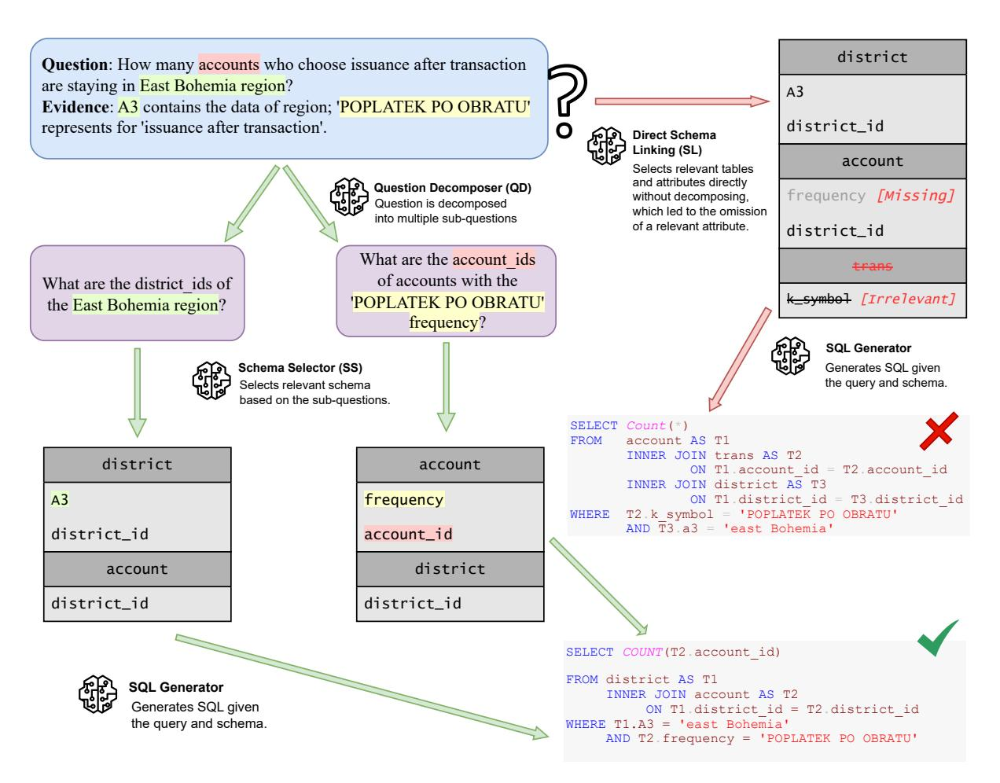
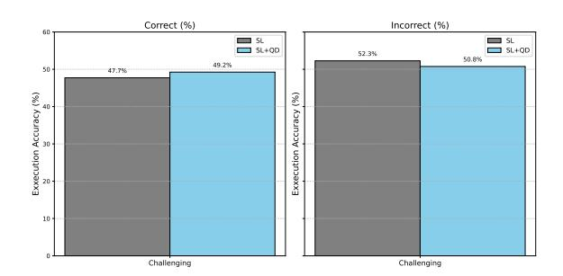
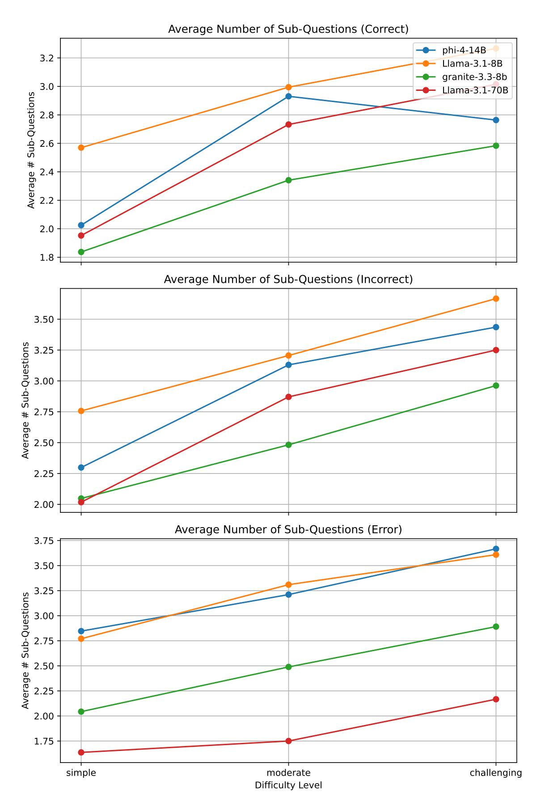

# Divide, Link, and Conquer: Recall-oriented Schema Linking for NL-to-SQL via Question Decomposition

# Kiran Pradeep<sup>1</sup> Kirushikesh D. B.<sup>2</sup> Nishtha Madaan<sup>2</sup> Sameep Mehta<sup>2</sup> Pushpak Bhattacharyya<sup>1</sup>

1 Indian Institute of Technology Bombay <sup>2</sup> IBM Research India {kiranpradeep,pb}@cse.iitb.ac.in kirushi@ibm.com {nishthamadaan,sameepmehta}@in.ibm.com

# Abstract

Natural language to SQL (NL-to-SQL) systems are increasingly critical in industry for enabling non-technical users to access structured data efficiently, supporting faster decision-making and data accessibility. However, state-of-the-art systems often depend on large proprietary models, which introduce serious concerns around privacy. While open-source LLMs offer a viable substitute, high-performing variants (e.g., 70B or 405B) require substantial GPU memory, making them impractical for many production environments. Smaller open-source models that fit on a single 80GB GPU present a more deployable alternative, yet existing efforts to enhance their Text-to-SQL performance rely heavily on fine-tuning, limiting flexibility. We propose **RoSL**, a plug-and-play framework that improves SQL generation for smaller LLMs without any task-specific training. While schema linking is often omitted for larger models, we show it remains essential for smaller ones. Further, we are the first to apply question decomposition at the schema linking stage, rather than during SQL generation as in prior work, to address the precision-recall tradeoff. Our approach improves schema linking recall by 25.1% and execution accuracy by 8.2% on the BIRD benchmark using ibm-granite/granite-3.3-8b-instruct, making it an effective and industry-friendly NL-to-SQL solution. We further analyze RoSL's latency–efficiency characteristics, showing that it maintains practical efficiency for real-world deployment.

# 1 Introduction

With the growing need to make structured data more accessible, NL-to-SQL systems are becoming essential tools that empower non-technical users to query databases using natural language. This capability is especially valuable in fast-paced environments where timely data access directly impacts

decision-making. According to recent industry reports, data analysts spend nearly 30-40% of their time debugging SQL queries due to syntax errors or incorrect joins, significantly reducing productivity. Meanwhile, AI-powered SQL tools have demonstrated the ability to reduce query generation time by 60-75%, highlighting their potential to streamline workflows and accelerate insight delivery. These trends underscore the growing demand for NL-to-SQL systems that are not only accurate but also scalable and deployable in real-world enterprise settings.[1](#page-0-0)

While proprietary models like GPT-4 and Gemini dominate recent state-of-the-art results in NL-to-SQL, their use raises serious concerns in industry settings due to their limitations in privacy. Opensource LLMs offer a promising alternative, but the best-performing variants, such as LLaMA-3.1- 70B and 405B, require substantial GPU resources, up to 140 GB and 405 GB of VRAM respectively for FP16 inference[2](#page-0-1) , making them impractical for most production environments. Smaller open-source models that can run efficiently on a single 80GB GPU are far more feasible, but remain under-explored for NL-to-SQL. Existing approaches often rely on fine-tuning such models for performance, which limits generalizability and introduces training overhead.

NL-to-SQL systems typically consist of two key stages: (1) *schema linking*, where the model identifies relevant tables and attributes from the database schema, and (2) *SQL generation*, where the final SQL query is composed from the selected schema components. In practice, schema linking tends to favor *precision* by filtering irrelevant schema elements, but often at the expense of *recall*, thereby excluding attributes that are necessary for generat-

<span id="page-0-1"></span><span id="page-0-0"></span><sup>1</sup> [https://pmarketresearch.com/it/](https://pmarketresearch.com/it/ai-structured-query-language-sql-tool-market/) [ai-structured-query-language-sql-tool-market/](https://pmarketresearch.com/it/ai-structured-query-language-sql-tool-market/) [https://huggingface.co/blog/llama31#](https://huggingface.co/blog/llama31#inference-memory-requirements) [inference-memory-requirements](https://huggingface.co/blog/llama31#inference-memory-requirements)

ing a valid query. Recent work by [Maamari et al.](#page-7-0) [\(2024\)](#page-7-0) suggests that schema linking may be redundant for very large language models (LLMs), which can often infer schema relevance implicitly. However, for smaller LLMs, schema linking remains indispensable. These models are more sensitive to schema noise, and errors in the linking phase often propagate to the SQL generation step, reducing overall execution accuracy.

To address these limitations, we propose a lightweight and fine-tuning-free framework, **RoSL**, that enhances schema linking in smaller LLMs by introducing *question decomposition*, a strategy previously applied only at the SQL generation stage [\(Talaei et al.,](#page-8-0) [2024;](#page-8-0) [Wang et al.,](#page-8-1) [2024\)](#page-8-1). Our key insight is that smaller models struggle to process complex questions involving multiple entities and relationships in a single pass. By decomposing such questions into simpler, focused sub-questions, we enable the model to retrieve relevant schema elements more effectively and improve schema recall. Finally, we quantify RoSL's computational overhead through a latency and efficiency analysis, demonstrating that its additional reasoning steps remain practical for deployment in multi-worker industrial environments.

# Our contributions are:

- 1. Question decomposition for schema linking, marking the first use of decomposition at this stage in NL-to-SQL. This improves schema linking recall by 25.1%, leading to an 8.21% improvement in execution accuracy on the BIRD benchmark using the ibm-granite/granite-3.3-8b-instruct model.
- 2. **RoSL**: A plug-and-play NL-to-SQL pipeline, requiring no task-specific fine-tuning and designed for seamless integration with opensource LLMs. This supports deployment in privacy-sensitive and resource-constrained environments.
- 3. Comprehensive evaluation of schema linking in smaller LLMs, demonstrating that structured question decomposition significantly improves schema coverage and SQL execution across multiple open-source models and benchmark settings.

# 2 Related Work

Smaller LLMs for NL-to-SQL. While LLMs have advanced NL-to-SQL performance [\(Gao et al.,](#page-7-1) [2023;](#page-7-1) [Pourreza and Rafiei,](#page-7-2) [2024a;](#page-7-2) [Dong et al.,](#page-7-3) [2023;](#page-7-3) [Sun et al.,](#page-7-4) [2023;](#page-7-4) [Pourreza et al.,](#page-7-5) [2024\)](#page-7-5), their compute demands and privacy concerns limit realworld use. Recent work has turned to smaller opensource models as practical alternatives. CodeS [\(Li](#page-7-6) [et al.,](#page-7-6) [2024a\)](#page-7-6) and DTS-SQL [\(Pourreza and Rafiei,](#page-7-7) [2024b\)](#page-7-7) show that, with fine-tuning, small models can be competitive on benchmarks like Spider [\(Yu et al.,](#page-8-2) [2018\)](#page-8-2) and BIRD [\(Li et al.,](#page-7-8) [2024b\)](#page-7-8). With newer performant models such as Phi-4 [\(Mi](#page-7-9)[crosoft,](#page-7-9) [2024\)](#page-7-9), this line of work aligns with our goal: enabling strong Text-to-SQL performance using smaller, more deployable LLMs.

Schema Linking in NL-to-SQL. Schema linking, the task of mapping query terms to relevant tables and columns, is a critical NL-to-SQL step [\(Lewis,](#page-7-10) [2019;](#page-7-10) [Guo et al.,](#page-7-11) [2019;](#page-7-11) [Bogin et al.,](#page-7-12) [2019;](#page-7-12) [Wang et al.,](#page-8-3) [2019;](#page-8-3) [Li et al.,](#page-7-13) [2023\)](#page-7-13). Recent approaches use LLMs for this task [\(Talaei et al.,](#page-8-0) [2024;](#page-8-0) [Pourreza and Rafiei,](#page-7-7) [2024b\)](#page-7-7), though [Maamari et al.](#page-7-0) [\(2024\)](#page-7-0) argue it can be redundant for large models. Our work reevaluates this claim for smaller LLMs, where explicit schema linking remains essential.

Query Decomposition. Breaking down complex questions into simpler sub-questions improves SQL generation. Prior methods like [\(Pourreza](#page-7-2) [and Rafiei,](#page-7-2) [2024a;](#page-7-2) [Wang et al.,](#page-8-1) [2024\)](#page-8-1) decompose queries before SQL generation, but none apply decomposition during schema linking. We fill this gap by introducing question decomposition at the schema selection stage, improving column recall and execution accuracy.

### 3 Methodology

We propose a multi-agent framework for translating natural language (NL) queries into SQL by decomposing the problem into three stages: question decomposition, schema selection, and SQL generation. Each stage is handled by a specialized agent powered by a Large Language Model (LLM), working together to handle compositional and multi-hop queries more effectively.

### 3.1 Problem Statement

The task is to generate an executable SQL query s for a given natural language question q, conditioned on a database schema D. The schema

<span id="page-2-0"></span>

Figure 1: An example illustrating how direct schema linking misses critical columns (frequency) for complex queries, while question decomposition enables correct column retrieval via simpler sub-questions. Highlighted colors indicate the relevant parts of the schema associated with specific segments of the main question. The attribute (k\_symbol) is incorrectly retrieved and serves as an extra column. Model used: meta-llama/Meta-Llama-3.1-8B-Instruct. Refer Appendix [A.6.](#page-9-0)

comprises a set of tables T and columns C: D = {T , C}.

Input: Natural language question q, optional hint h, and schema D.

Output: SQL query s that correctly answers q over D.

### <span id="page-2-1"></span>3.2 Question Decomposer Agent

The Question Decomposer Agent determines whether the input question q requires decomposition and, if so, splits it into simpler sub-questions {q1, q2, ..., qn}. The agent is guided by the condition that each sub-question should correspond to a partial SQL query, and when these are joined (typically via a JOIN operation), they should together yield a query that answers the original question. This step also helps reduce the reasoning burden on smaller LLMs.

Input: Question q, optional hint h, schema D.

### Output:

- A boolean indicator d for whether decomposition is required.
- A list of sub-questions Q = {q1, q2, ..., qn}.
- Chain-of-thought reasoning rQD explaining the decomposition rationale.

The decomposition indicator d is essential as not all queries benefit from decomposition; for simple questions, unnecessary decomposition may degrade performance or add noise.

### 3.3 Schema Selector Agent

Given each sub-question q<sup>i</sup> , the Schema Selector Agent identifies a reduced schema D<sup>i</sup> ⊆ D that contains only the relevant tables and attributes needed to answer q<sup>i</sup> . By working on decomposed queries, the agent can more precisely focus on

specific parts of the query, which improves both schema linking recall and precision.

Input: Sub-question q<sup>i</sup> , optional hint h, and full schema D.

Output: Reduced schema D<sup>i</sup> relevant to q<sup>i</sup> .

### 3.4 SQL Generator Agent

The SQL Generator Agent produces the final SQL query using the reduced schema obtained from the Schema Selector. It is conditioned on the original question to ensure that the final SQL query answers the full intent.

Input: Original question q, optional hint h, and the union of all reduced schemas S i Di .

Output: Executable SQL query s.

Figure [1](#page-2-0) illustrates our pipeline using an example, showing how question decomposition improves schema linking by retrieving relevant columns and avoiding irrelevant ones. Refer to Appendix [A.6](#page-9-0) for details.

We also explored an alternate setting where individual sub-questions were converted into SQL queries, and a recomposer agent merged these into a final query. However, this led to decreased execution accuracy. Details of this variant are presented in Appendix [A.8.](#page-10-0)

# 4 Experiments

We evaluate our approach on the Spider and BIRD datasets, with further details provided in Appendix [A.3.](#page-8-4) Execution Accuracy, Schema Linking Precision, and Recall are used as evaluation metrics (Appendix [A.2\)](#page-8-5). Our implementation employs a modular prompting framework across stages, question decomposition, schema linking, and SQL generation (Appendix [A.12,](#page-12-0) using a diverse set of instruction-tuned open-source LLMs, listed in Appendix [A.5.](#page-9-1) Experimental ablations are conducted on the subsampled\_dev split.

### <span id="page-3-1"></span>4.1 Approaches

To analyze the impact of Question Decomposition on Schema Linking, we evaluate the performance of five different pipeline configurations:

NoSL: The SQL generator receives the full database schema without any schema linking or pruning. This serves as a baseline.

SL: A standard schema linking approach is applied using an existing schema selector. For our

experiments, we adopt the schema selector proposed by [Talaei et al.](#page-8-0) [\(2024\)](#page-8-0). This also serves as a baseline in our experiments to show the efficacy of the addition of the query decomposer.

SL+QD (RoSL): This is our proposed method. It applies the Question Decomposer agent (see Section [3.2\)](#page-2-1) on top of the SL variant, with constraints to ensure sub-queries can be joined to form the original query.

SL+SimpleQD: Similar to the SL+QD variant, but without enforcing any constraints related to database schema during question decomposition. This helps isolate the benefit of structured decomposition.

SL+TableQD: A constrained variant of SL+QD where each sub-question is restricted to retrieving information from a single table.

# 5 Results and Analysis

We evaluate our proposed approach on both the full BIRD development set [\(Li et al.,](#page-7-8) [2024b\)](#page-7-8) and the subsampled development set [\(Talaei et al.,](#page-8-0) [2024\)](#page-8-0). Results on the Spider development set are reported separately in Appendix [A.11.](#page-11-0)

## 5.1 Execution Accuracy on the Complete BIRD Development set

<span id="page-3-0"></span>

| Model          | NoSL  | SL    | SL+QD (RoSL) |
|----------------|-------|-------|--------------|
| Llama-3.1-8B   | 46.08 | 47.19 | 49.28        |
| phi-4-14B      | 51.36 | 59.77 | 59.91        |
| granite-3.3-8B | 37.28 | 37.31 | 40.35        |
| Qwen3-4B       | 44.98 | 49.28 | 49.93        |
| Llama-3.1-70B  | 62.12 | 61.34 | 61.41        |

Table 1: Execution accuracy (%) on the BIRD dev set under different schema linking variants. RoSL applies question decomposition at schema linking.

Table [1](#page-3-0) presents the execution accuracy of different schema linking variants on the full BIRD development set across four open-source LLMs. We compare three settings: NoSL, which uses the full schema without linking; SL, which applies schema linking without decomposition; and SL+QD, our proposed approach that incorporates question decomposition into schema linking.

Our method (SL+QD) achieves the highest execution accuracy for three of the four models. Notably, for ibm-granite/granite-3.3-8b-instruct,

SL+QD improves execution accuracy from 37.31% to 40.35%, demonstrating the largest gain among all models. Similarly, Llama-3.1-8B-Instruct and phi-4-14B also benefit from decomposition, with SL+QD outperforming both NoSL and SL baselines.

Interestingly, for Llama-3.1-70B-Instruct, the NoSL baseline already achieves the best performance (62.12%), slightly outperforming SL and SL+QD. This aligns with prior observations that larger models can internally resolve schema relevance, making explicit schema linking less beneficial in some cases.

We further extend our evaluation to smaller-scale models to assess RoSL's generalizability under constrained settings. Using Qwen3-4B, we observe execution accuracies of 44.98% (NoSL), 49.28% (SL), and 49.93% (RoSL). While the absolute gain in execution accuracy is modest, schema linking recall improves substantially from 0.6697 to 0.7196, indicating that RoSL enhances schema coverage even in low-capacity regimes.



Figure 2: Performance of LLaMA-3.1-70B-Instruct model in challenging queries of the BIRD benchmark.

#### 5.2 Difficulty-wise Analysis

From Table 2, we observe that the performance of the LLaMA-3.1-70B-Instruct model declines when Schema Linking (SL) is applied, contrary to the trend observed in smaller models. These results are in line with the findings of Maamari et al. (2024), which report that while schema linking benefits smaller models (e.g., LLaMA-3.1-8B-Instruct), it often degrades the performance of larger models. Since Schema Linking typically increases precision at the expense of recall, this trade-off appears detrimental to larger models.

However, a more nuanced picture emerges when we analyze the model's performance across different difficulty levels, *Simple*, *Moderate*, and *Challenging*, as defined in the BIRD dataset (Li et al., 2024b). Across the NoSL, SL, and SL+QD variants (see Section 4.1), we find that the LLaMA-3.1-70B-Instruct model shows improved execution accuracy on Challenging instances when using schema linking. This performance is further enhanced with the addition of question decomposition (QD), increasing accuracy from 47.73% (SL) to 49.24% (SL+QD). While this increase may appear modest in absolute terms, it becomes significant when we consider the underlying factors. Challenging queries typically require multiple JOIN operations, which substantially increase the number of conditions the model must attend to. We observe that schema linking recall improves significantly in the SL+QD variant: from 84.83% to 89.63% (refer Appendix A.10) across all queries, and from 81.84% to 89.66% specifically in challenging instances. This suggests that QD aids the model in understanding the question in smaller, more manageable parts, thereby facilitating better schema linking with minimal loss in recall. To further validate this, we analyzed a subset of queries where SL alone yielded incomplete column recall (i.e., recall < 1.0), but SL+QD achieved full recall (i.e., recall = 1.0). Among these, 64.29% resulted in correct SQL generation. This strengthens the argument that the improved execution accuracy stems from better schema linking recall enabled by question decomposition, particularly in complex scenarios involving multiple joins.

<span id="page-4-0"></span>

| Model          | SL     | SL +<br>BaseQD | SL +<br>QD | SL +<br>TableQD |
|----------------|--------|----------------|------------|-----------------|
| Llama-3.1-8B   | 0.7084 | 0.8637         | 0.8309     | 0.8100          |
| Phi-4-14B      | 0.8635 | 0.8980         | 0.8903     | 0.8800          |
| Granite-3.3-8B | 0.5655 | 0.6253         | 0.6650     | 0.6500          |
| DeepCoder-14B  | 0.7057 | 0.7326         | 0.7367     | 0.7200          |
| Llama-3.1-70B  | 0.8484 | 0.8856         | 0.8858     | 0.8800          |
| Llama-3.3-70B  | 0.8772 | 0.9102         | 0.8984     | 0.8920          |

Table 2: Schema Linking Recall across decomposition variants. SL: no decomposition; Base QD: unconstrained; SL + QD: structured; Table QD: table-restricted. Bold = best per model.

### 5.3 Effects of Query Decomposition on Schema Linking Recall

Table 2 shows that both unconstrained (**Base QD**) and structured (**SL+QD**) decompositions significantly boost recall over the baseline (**SL**), confirming their effectiveness in capturing relevant schema elements. Base QD achieves the highest recall on half of the models, but SL+QD remains more con-

<span id="page-5-0"></span>

| (A) Finetuned Methods<br>SFT<br>CodeS-15B<br>-<br>-<br>DTS-SQL (Pourreza and Rafiei, 2024b)<br>DeepSeek-7B<br>-<br>-<br>ExSL<br>granite-20b-code<br>-<br>-<br>(B) Direct Inference + Proprietary LLMs<br>GPT-4<br>GPT-4<br>-<br>-<br>Claude-2<br>Claude-2<br>-<br>- |       |       |
|---------------------------------------------------------------------------------------------------------------------------------------------------------------------------------------------------------------------------------------------------------------------|-------|-------|
|                                                                                                                                                                                                                                                                     |       |       |
|                                                                                                                                                                                                                                                                     | -     | 58.47 |
|                                                                                                                                                                                                                                                                     | -     | 55.80 |
|                                                                                                                                                                                                                                                                     | -     | 51.69 |
|                                                                                                                                                                                                                                                                     |       |       |
|                                                                                                                                                                                                                                                                     | -     | 46.35 |
|                                                                                                                                                                                                                                                                     | -     | 42.70 |
| SQL-Palm (Sun et al., 2024)<br>PaLM2<br>68.92<br>52.07                                                                                                                                                                                                              | 47.89 | 61.93 |
| Distillery (Maamari et al., 2024)<br>GPT-4o<br>-<br>-                                                                                                                                                                                                               | -     | 67.21 |
| CHESS (Talaei et al., 2024)<br>GPT-4<br>-<br>-                                                                                                                                                                                                                      | -     | 68.31 |
| MCS-SQL (Lee et al., 2025)<br>GPT-4<br>70.40<br>53.10                                                                                                                                                                                                               | 51.40 | 63.36 |
| TA-SQL (Qu et al., 2024)<br>GPT-4<br>63.14<br>48.60                                                                                                                                                                                                                 | 36.11 | 56.19 |
| MAG-SQL (Xie et al., 2024)<br>GPT-3.5<br>65.94<br>46.24                                                                                                                                                                                                             | 40.97 | 57.62 |
| MAC-SQL (Wang et al., 2024)<br>GPT-4<br>65.73<br>52.69                                                                                                                                                                                                              | 40.28 | 59.39 |
| E-SQL (Caferoglu and Özgür Ulusoy<br>˘<br>, 2025)<br>GPT-4o-mini<br>68.00<br>53.23                                                                                                                                                                                  | 47.59 | 61.60 |
| RSL-SQL (Cao et al., 2024)<br>GPT-4o<br>74.38<br>57.11                                                                                                                                                                                                              | 53.79 | 67.21 |
| (C) Direct Inference + Open-source LLMs                                                                                                                                                                                                                             |       |       |
| Mistral<br>Mistral-123B<br>-<br>-                                                                                                                                                                                                                                   | -     | 53.52 |
| CHESS (Talaei et al., 2024)<br>Llama-3.1-70B<br>-<br>-                                                                                                                                                                                                              | -     | 61.34 |
| RoSL (Ours)<br>granite-8b-code<br>49.08<br>27.86                                                                                                                                                                                                                    | 25.00 | 40.35 |
| RoSL (Ours)<br>Llama-3.1-8B<br>57.29<br>39.01                                                                                                                                                                                                                       | 31.03 | 49.28 |
| RoSL (Ours)<br>phi-4 (14B)<br>68.54<br>49.56                                                                                                                                                                                                                        | 37.93 | 59.91 |
| RoSL (Ours)<br>Llama-3.1-70B<br>68.32<br>52.37                                                                                                                                                                                                                      | 46.20 | 61.41 |

Table 3: Comparison of various Text-to-SQL methods based on execution accuracy across different query complexities. We separate finetuned methods, proprietary LLMs, and open-source models. Blue-shaded rows indicate our method. Bold numbers represent the highest accuracy in each column.

sistent, outperforming all other variants on models like Granite-3.3-8B and DeepCoder-14B.

The SL+TableQD variant improves over SL in most cases but generally underperforms compared to the unconstrained decomposition variants, likely due to over-restriction that limits inter-table attribute discovery.

We further analyze how query complexity and sub-question depth relate to model performance in Appendix [A.7.](#page-9-2)

### 5.4 State-of-the-art Comparisons

Table [3](#page-5-0) compares the execution accuracy of our approach (RoSL) with state-of-the-art Text-to-SQL methods across three difficulty levels, Simple, Moderate, and Challenging, on the BIRD benchmark.

Our method achieves strong performance in the open-source category, particularly when using the Llama-3.1-70B model, reaching a total execution accuracy of 61.41%. This is competitive with proprietary GPT-4-based methods such as SQL-PaLM (61.93%) and E-SQL (61.60%), and surpasses several recent proprietary models including MAC-SQL (59.39%), TA-SQL (56.19%), and

MAG-SQL (57.62%).

Most notably, RoSL outperforms the CHESS baseline (61.34%) when using the same Llama-3.1-70B model by a little margin. This demonstrates the effectiveness of our proposed query decomposition at the schema linking stage, which enables improved schema recall without sacrificing precision.

On the more constrained phi-4 model (14B), RoSL still achieves a strong overall accuracy of 59.91%, outperforming even some finetuned 15B methods like CodeS-15B (58.47%) and DTS-SQL (55.80%). These results confirm the utility of our plug-and-play design for smaller open-source models, especially in deployment scenarios where proprietary models are not feasible.

# 5.5 Latency and Throughput Analysis

While RoSL achieves substantial gains in execution accuracy, practical deployment in production settings requires understanding its computational overhead. To address this, we conducted a detailed latency and throughput analysis using ibm-granite/granite-3.3-8b-instruct on a

<span id="page-6-0"></span>

| Setting | EX (%) | Avg. LLM Calls | Avg. Tokens | Latency (s/query) | Effective Latency (8 workers) |
|---------|--------|----------------|-------------|-------------------|-------------------------------|
| NoSL    | 37.28  | 1.49           | 8,671       | 18.41             | 2.82                          |
| SL      | 37.31  | 5.82           | 11,606      | 35.57             | 18.60                         |
| RoSL    | 40.35  | 10.56          | 17,617      | 61.90             | 23.14                         |

Table 4: Latency and throughput comparison for RoSL and baseline variants on the BIRD development set. "Latency" refers to single-worker per-instance time; "Effective Latency" denotes per-query runtime under 8 parallel workers.

single NVIDIA A100 (80GB) GPU with vLLM. We compare three pipeline variants: NOSL (no schema linking), SL (standard schema linking), and ROSL (schema linking with question decomposition). Refer Table 4.

**Per-instance Latency.** As expected, introducing question decomposition increases the number of LLM calls (approximately  $7 \times$  more) and total tokens processed ( $\sim 2 \times$ ). Consequently, the average single-worker latency for RoSL is about 61.9s per query, compared to 18.4s for NoSL and 35.6s for SL.

Effective per-query latency. In realistic enterprise setups with parallel workers, the effective per-query latency reduces significantly. With eight workers in parallel, RoSL achieves an effective latency of 23.1s per query, compared to 18.6s for SL and 2.8s for NoSL. This demonstrates that RoSL's additional reasoning steps remain tractable when deployed in distributed environments.

Accuracy–Efficiency Tradeoff. Despite a higher computational cost, RoSL delivers an +8.23% absolute improvement in execution accuracy over NoSL and +8.14% over SL. The added latency thus corresponds to a meaningful gain in reliability and correctness, crucial for production-grade, execution-sensitive applications. These results indicate that RoSL offers a favorable balance between efficiency and accuracy for smaller open-source models in enterprise NL-to-SQL deployments.

#### 6 Conclusion

**RoSL** is a lightweight, modular framework that introduces *question decomposition* at the schema linking stage, an underexplored but crucial part of the NL-to-SQL pipeline. Unlike prior approaches that apply decomposition only during SQL generation, RoSL improves schema coverage early in the pipeline, enabling more accurate and complete SQL generation. This is especially impactful for smaller open-source LLMs, which offer better deployability in compute and privacy constrained en-

vironments but typically underperform on complex queries. Our experiments on the BIRD and Spider benchmarks show that RoSL significantly boosts schema linking recall and execution accuracy, all without fine-tuning. These gains hold consistently across instruction-tuned models under 15B parameters, demonstrating that RoSL serves as a practical, fine-tuning-free alternative to large proprietary systems. By addressing both accuracy and deployment feasibility, RoSL contributes a scalable and industry-ready solution for building efficient and accessible NL-to-SQL systems.

#### Limitations

While RoSL shows strong performance improvements, it has a few limitations:

- Decomposition Quality. The effectiveness of the schema linking depends heavily on the quality and semantic correctness of the generated sub-questions. Poor decompositions may lead to irrelevant or incomplete schema retrieval.
- Inference Overhead. Introducing question decomposition increases latency due to additional LLM calls and token usage. On average, RoSL incurs ~61.9s per query under single-worker inference and ~23.1s effective latency with eight parallel workers, balanced by an +8% improvement in execution accuracy. This tradeoff is acceptable for batch or near-real-time analytics scenarios.
- **SQL Recomposition Challenge.** Although we experimented with decomposed SQL generation followed by recomposition, this approach led to degraded performance (details in Appendix A.8), suggesting limitations in handling inter-query dependencies.
- Constraint Sensitivity. Highly constrained variants like SL+TableQD, which force subquestions to target a single table, can underperform due to overly restrictive assumptions that limit schema coverage.

In future work, we aim to explore dynamic decomposition strategies, LLM-driven sub-question validation, and reinforcement learning techniques to jointly optimize decomposition and SQL generation quality.

# Acknowledgements

We would like to express our deepest gratitude to our co-author, Prof. Pushpak Bhattacharyya, for his invaluable guidance and inspiration throughout this work. Prof. Bhattacharyya passed away shortly before the camera-ready submission of this paper, and we dedicate this work to his memory.

## References

- <span id="page-7-12"></span>Ben Bogin, Matt Gardner, and Jonathan Berant. 2019. Global reasoning over database structures for text-tosql parsing. *arXiv preprint arXiv:1908.11214*.
- <span id="page-7-17"></span>Hasan Alp Caferoglu and Özgür Ulusoy. 2025. ˘ [E-sql:](https://arxiv.org/abs/2409.16751) [Direct schema linking via question enrichment in](https://arxiv.org/abs/2409.16751) [text-to-sql.](https://arxiv.org/abs/2409.16751) *Preprint*, arXiv:2409.16751.
- <span id="page-7-18"></span>Zhenbiao Cao, Yuanlei Zheng, Zhihao Fan, Xiaojin Zhang, and Wei Chen. 2024. Rsl-sql: Robust schema linking in text-to-sql generation. *arXiv preprint arXiv:2411.00073*.
- <span id="page-7-3"></span>Xuemei Dong, Chao Zhang, Yuhang Ge, Yuren Mao, Yunjun Gao, Jinshu Lin, Dongfang Lou, and 1 others. 2023. C3: Zero-shot text-to-sql with chatgpt. *arXiv preprint arXiv:2307.07306*.
- <span id="page-7-1"></span>Dawei Gao, Haibin Wang, Yaliang Li, Xiuyu Sun, Yichen Qian, Bolin Ding, and Jingren Zhou. 2023. Text-to-sql empowered by large language models: A benchmark evaluation. *arXiv preprint arXiv:2308.15363*.
- <span id="page-7-11"></span>Jiaqi Guo, Zecheng Zhan, Yan Gao, Yan Xiao, Jian-Guang Lou, Ting Liu, and Dongmei Zhang. 2019. Towards complex text-to-sql in cross-domain database with intermediate representation. *arXiv preprint arXiv:1905.08205*.
- <span id="page-7-15"></span>Dongjun Lee, Choongwon Park, Jaehyuk Kim, and Heesoo Park. 2025. [MCS-SQL: Leveraging mul](https://aclanthology.org/2025.coling-main.24/)[tiple prompts and multiple-choice selection for text](https://aclanthology.org/2025.coling-main.24/)[to-SQL generation.](https://aclanthology.org/2025.coling-main.24/) In *Proceedings of the 31st International Conference on Computational Linguistics*, pages 337–353, Abu Dhabi, UAE. Association for Computational Linguistics.
- <span id="page-7-10"></span>M Lewis. 2019. Bart: Denoising sequence-tosequence pre-training for natural language generation, translation, and comprehension. *arXiv preprint arXiv:1910.13461*.
- <span id="page-7-13"></span>Haoyang Li, Jing Zhang, Cuiping Li, and Hong Chen. 2023. Resdsql: Decoupling schema linking and

- skeleton parsing for text-to-sql. In *Proceedings of the AAAI Conference on Artificial Intelligence*, volume 37, pages 13067–13075.
- <span id="page-7-6"></span>Haoyang Li, Jing Zhang, Hanbing Liu, Ju Fan, Xiaokang Zhang, Jun Zhu, Renjie Wei, Hongyan Pan, Cuiping Li, and Hong Chen. 2024a. Codes: Towards building open-source language models for text-to-sql. *Proceedings of the ACM on Management of Data*, 2(3):1–28.
- <span id="page-7-8"></span>Jinyang Li, Binyuan Hui, Ge Qu, Jiaxi Yang, Binhua Li, Bowen Li, Bailin Wang, Bowen Qin, Ruiying Geng, Nan Huo, and 1 others. 2024b. Can llm already serve as a database interface? a big bench for large-scale database grounded text-to-sqls. *Advances in Neural Information Processing Systems*, 36.
- <span id="page-7-0"></span>Karime Maamari, Fadhil Abubaker, Daniel Jaroslawicz, and Amine Mhedhbi. 2024. [The death of schema](https://arxiv.org/abs/2408.07702) [linking? text-to-sql in the age of well-reasoned lan](https://arxiv.org/abs/2408.07702)[guage models.](https://arxiv.org/abs/2408.07702) *Preprint*, arXiv:2408.07702.
- <span id="page-7-9"></span>Microsoft. 2024. [Discover the new multi-lingual, high](https://techcommunity.microsoft.com/t5/ai-azure-ai-services-blog/discover-the-new-multi-lingual-high-quality-phi-3-5-slms/ba-p/4225280)[quality phi 3.5 slms.](https://techcommunity.microsoft.com/t5/ai-azure-ai-services-blog/discover-the-new-multi-lingual-high-quality-phi-3-5-slms/ba-p/4225280) Accessed: 2024-10-16.
- <span id="page-7-5"></span>Mohammadreza Pourreza, Hailong Li, Ruoxi Sun, Yeounoh Chung, Shayan Talaei, Gaurav Tarlok Kakkar, Yu Gan, Amin Saberi, Fatma Ozcan, and Sercan O. Arik. 2024. [Chase-sql: Multi-path reason](https://arxiv.org/abs/2410.01943)[ing and preference optimized candidate selection in](https://arxiv.org/abs/2410.01943) [text-to-sql.](https://arxiv.org/abs/2410.01943) *Preprint*, arXiv:2410.01943.
- <span id="page-7-2"></span>Mohammadreza Pourreza and Davood Rafiei. 2024a. Din-sql: decomposed in-context learning of text-tosql with self-correction. In *Proceedings of the 37th International Conference on Neural Information Processing Systems*, NIPS '23, Red Hook, NY, USA. Curran Associates Inc.
- <span id="page-7-7"></span>Mohammadreza Pourreza and Davood Rafiei. 2024b. [Dts-sql: Decomposed text-to-sql with small large](https://api.semanticscholar.org/CorpusID:267406644) [language models.](https://api.semanticscholar.org/CorpusID:267406644) *ArXiv*, abs/2402.01117.
- <span id="page-7-16"></span>Ge Qu, Jinyang Li, Bowen Li, Bowen Qin, Nan Huo, Chenhao Ma, and Reynold Cheng. 2024. [Before gen](https://doi.org/10.18653/v1/2024.findings-acl.324)[eration, align it! a novel and effective strategy for](https://doi.org/10.18653/v1/2024.findings-acl.324) [mitigating hallucinations in text-to-SQL generation.](https://doi.org/10.18653/v1/2024.findings-acl.324) In *Findings of the Association for Computational Linguistics ACL 2024*, pages 5456–5471, Bangkok, Thailand and virtual meeting. Association for Computational Linguistics.
- <span id="page-7-4"></span>Ruoxi Sun, Sercan Ö Arik, Alex Muzio, Lesly Miculicich, Satya Gundabathula, Pengcheng Yin, Hanjun Dai, Hootan Nakhost, Rajarishi Sinha, Zifeng Wang, and 1 others. 2023. Sql-palm: Improved large language model adaptation for text-to-sql (extended). *arXiv preprint arXiv:2306.00739*.
- <span id="page-7-14"></span>Ruoxi Sun, Sercan Ö. Arik, Alex Muzio, Lesly Miculicich, Satya Gundabathula, Pengcheng Yin, Hanjun Dai, Hootan Nakhost, Rajarishi Sinha, Zifeng Wang, and Tomas Pfister. 2024. [Sql-palm: Improved large](https://arxiv.org/abs/2306.00739) [language model adaptation for text-to-sql \(extended\).](https://arxiv.org/abs/2306.00739) *Preprint*, arXiv:2306.00739.

<span id="page-8-0"></span>Shayan Talaei, Mohammadreza Pourreza, Yu-Chen Chang, Azalia Mirhoseini, and Amin Saberi. 2024. Chess: Contextual harnessing for efficient sql synthesis. *arXiv preprint arXiv:2405.16755*.

<span id="page-8-3"></span>Bailin Wang, Richard Shin, Xiaodong Liu, Oleksandr Polozov, and Matthew Richardson. 2019. Rat-sql: Relation-aware schema encoding and linking for textto-sql parsers. *arXiv preprint arXiv:1911.04942*.

<span id="page-8-1"></span>Bing Wang, Changyu Ren, Jian Yang, Xinnian Liang, Jiaqi Bai, Linzheng Chai, Zhao Yan, Qian-Wen Zhang, Di Yin, Xing Sun, and Zhoujun Li. 2024. [Mac-sql: A](https://arxiv.org/abs/2312.11242) [multi-agent collaborative framework for text-to-sql.](https://arxiv.org/abs/2312.11242) *Preprint*, arXiv:2312.11242.

<span id="page-8-6"></span>Wenxuan Xie, Gaochen Wu, and Bowen Zhou. 2024. Mag-sql: Multi-agent generative approach with soft schema linking and iterative sub-sql refinement for text-to-sql. *arXiv preprint arXiv:2408.07930*.

<span id="page-8-2"></span>Tao Yu, Rui Zhang, Kai Yang, Michihiro Yasunaga, Dongxu Wang, Zifan Li, James Ma, Irene Li, Qingning Yao, Shanelle Roman, Zilin Zhang, and Dragomir Radev. 2018. [Spider: A large-scale human-labeled](https://doi.org/10.18653/v1/D18-1425) [dataset for complex and cross-domain semantic pars](https://doi.org/10.18653/v1/D18-1425)[ing and text-to-SQL task.](https://doi.org/10.18653/v1/D18-1425) In *Proceedings of the 2018 Conference on Empirical Methods in Natural Language Processing*, pages 3911–3921, Brussels, Belgium. Association for Computational Linguistics.

### A Appendix

### A.1 Datasets

We evaluate our approach on two standard NL-to-SQL benchmarks: Spider [\(Yu et al.,](#page-8-2) [2018\)](#page-8-2) and BIRD [\(Li et al.,](#page-7-8) [2024b\)](#page-7-8). BIRD poses greater complexity due to larger schemas and multi-hop queries, while Spider serves as a widely used testbed for cross-domain generalization. All evaluations are conducted on the development sets. For ablation studies, we use the subsampled\_dev split introduced by [Talaei et al.](#page-8-0) [\(2024\)](#page-8-0). Further dataset statistics are provided in Appendix [A.3.](#page-8-4)

## <span id="page-8-5"></span>A.2 Metrics

We evaluate the performance of our pipeline using the following metrics:

Execution Accuracy (EX): The official evaluation metric used for both the Spider and BIRD datasets. It compares the execution results of the predicted SQL query with those of the ground truth query on the corresponding database instances. This metric is robust to the existence of multiple semantically equivalent SQL queries.

Schema Linking Precision: Measures the proportion of correctly retrieved columns among all columns selected by the model. It reflects the accuracy of the schema selection process.

Schema Linking Recall: Measures the proportion of relevant (oracle) columns that were correctly retrieved by the model. It evaluates the completeness of schema linking with respect to the ideal set of columns.

### <span id="page-8-4"></span>A.3 Dataset Statistics

Spider [\(Yu et al.,](#page-8-2) [2018\)](#page-8-2) is a large-scale, crossdomain NL-to-SQL benchmark consisting of:

- 8,650 training examples
- 1,034 development examples
- 2,147 test examples
- 200 databases spanning 138 unique domains

It is widely adopted for evaluating generalization across unseen database schemas.

BIRD [\(Li et al.,](#page-7-8) [2024b\)](#page-7-8) is a more recent benchmark that better reflects real-world enterprise scenarios. It includes:

- 9,428 training examples
- 1,534 development examples
- 1,789 hidden test examples
- 95 large-scale databases totaling 33.4 GB
- 37+ professional domains, including healthcare, education, blockchain, and sports

BIRD features significantly more complex queries than Spider, including multi-hop reasoning and nested SQL constructs.

For ablation experiments, we follow [Talaei et al.](#page-8-0) [\(2024\)](#page-8-0) and use the subsampled\_dev split, a curated subset of BIRD's development set, chosen for controlled evaluation of schema linking and decomposition strategies.

### A.4 Implementation Details

We evaluate our pipeline using a variety of opensource, instruction-tuned Large Language Models (LLMs). These models are employed across different modules such as question decomposition, schema linking, and SQL generation. A complete list of all models used and other details can be found in Appendix [A.5](#page-9-1) and [A.12.](#page-12-0)

## <span id="page-9-1"></span>A.5 List of LLMs Used

The following instruction-tuned LLMs were used across different stages of our experiments:

- meta-llama/Meta-Llama-3.1-8B-Instruct
- microsoft/phi-4
- ibm-granite/granite-3.3-8b-instruct
- agentica-org/DeepCoder-14B-Preview
- meta-llama/Meta-Llama-3.1-70B-Instruct
- meta-llama/Llama-3.3-70B-Instruct

Question Decomposer. We employ a singleagent setup with deterministic decoding (temperature = 0.0). The question\_decomposer prompt template guides the model's output. Full prompt details are provided in Appendix [A.12.](#page-12-0)

Schema Selector. We adopt the schema selector design from [Talaei et al.](#page-8-0) [\(2024\)](#page-8-0), using the same prompt and decoding configuration to ensure comparability.

SQL Generator. The SQL generation module follows the candidate generation and revision pipeline introduced in [Talaei et al.](#page-8-0) [\(2024\)](#page-8-0), using low-temperature sampling for candidate generation and a deterministic revision step.

All modules are implemented using a modular prompting framework that allows seamless substitution of LLMs and templates, ensuring controlled and consistent evaluation across different configurations.

# <span id="page-9-0"></span>A.6 Qualitative Analysis of Question Decomposition

To better understand the effectiveness of question decomposition, we present a qualitative example in Figure [1](#page-2-0) using meta-llama/Meta-Llama-3.1-8B-Instruct.

This case study highlights the limitations of direct schema linking on a complex question and demonstrates how decomposition improves schema selection.

Input Question: *How many accounts who choose issuance after transaction are staying in East Bohemia region?*

Answering this query requires filtering accounts based on a specific frequency condition

('POPLATEK PO OBRATU') and their association with a particular region ('East Bohemia'). These conditions involve attributes from multiple tables, account and district, necessitating accurate schema linking.

In the Direct Schema Linking approach, the model fails to identify the critical attribute frequency from the account table. Moreover, it selects additional irrelevant columns not needed for answering the query, which harms Schema Linking Precision. This decrease in precision is likely caused by the model's need to attend simultaneously to multiple entities and relationships within a complex query, combined with noisy schema signals. Without explicit guidance, the model may over-select columns to hedge against missing relevant information, thereby introducing noise that complicates downstream SQL generation.

Conversely, Schema Linking via Question Decomposition breaks down the original question into simpler sub-questions, such as:

- *What are the district\_ids of the East Bohemia region?*
- *What are the account\_ids of accounts with the 'POPLATEK PO OBRATU' frequency?*

Each sub-question focuses on a distinct schema fragment, allowing the schema selector to precisely retrieve the relevant attributes A3, district\_id, and frequency without extraneous noise. This targeted retrieval improves both Schema Linking Recall and Precision, resulting in a more accurate and executable SQL query.

This example supports the hypothesis that, for smaller LLMs handling complex queries, decomposition reduces cognitive overload and mitigates schema noise by narrowing the focus at each step. Consequently, it leads to better schema linking quality and downstream task performance.

## <span id="page-9-2"></span>A.7 Analysis of Sub-Question Counts by Difficulty and Outcome

To better understand how query decomposition behaves under varying difficulty and outcome conditions, we analyze the average number of subquestions generated per query across three outcome categories, correct, incorrect, and error, for different difficulty levels (*simple*, *moderate*, *challenging*). Figure [3](#page-13-0) presents this comparison for four models: phi-4-14B, Llama-3.1-8B, granite-3.3-8b, and Llama-3.1-70B.

We observe that the average number of subquestions generally increases with query complexity across all models. For instance, in the phi-4-14B model, the average number of subquestions rises from 2.02 for simple queries to 2.76 for challenging ones in the correct category. This trend holds for both incorrect and error cases, where decomposition becomes increasingly granular with difficulty, indicating that models struggle more as semantic complexity increases.

Interestingly, models like Llama-3.1-8B consistently generate more sub-questions than others across all categories and difficulty levels, especially in the *challenging* tier (e.g., 3.27 for correct answers), suggesting that smaller models may require more decomposition steps to comprehend complex queries. In contrast, the larger Llama-3.1-70B model generates fewer sub-questions, particularly in error cases (e.g., only 2.17 for challenging errors), possibly due to premature termination or over-simplified reasoning.

These findings demonstrate that decomposition depth correlates with both task complexity and model capability. Effective decomposition strategies, especially for smaller models, can help reduce reasoning overload and improve overall execution accuracy. Full plots are shown in Figure [3.](#page-13-0)

### <span id="page-10-0"></span>A.8 SQL Recomposer Agent

To explore the utility of query decomposition beyond schema linking, we experimented with SQL generation through a recomposition strategy. Specifically, we evaluate two additional variants:

- SL+QD+RC: Structured decomposition with schema linking, where each sub-question is converted into a partial SQL query, and a *recomposer agent* merges them into a final query.
- SL+TableQD+RC: A more constrained variant where each sub-question is limited to a single table, and recomposed similarly.

As shown in Table [5,](#page-11-1) the SL+QD+RC variant generally underperforms compared to SL+QD without recomposition (see Section [A.9\)](#page-10-2), and only provides marginal gains for select models. For instance, phi-4-14B reaches 53.06% with recomposition, which is slightly lower than the 53.74% achieved with SL+TableQD. Similarly, Llama-3.1-8B-Instruct drops from 44.67% (SL+QD) to 42.85% (SL+QD+RC).

These results suggest that decomposed SQL generation introduces new challenges in maintaining logical consistency and join semantics across partial queries. While promising in principle, recomposition demands more robust alignment mechanisms to be viable in practice. As such, our final pipeline uses SL+QD without SQL recomposition, which provides more stable and interpretable improvements.

# <span id="page-10-2"></span>A.9 Effects of Variations in Question Decomposition

To evaluate the impact of query decomposition, we compare multiple schema linking variants using the subsampled\_dev split from [Talaei et al.](#page-8-0) [\(2024\)](#page-8-0). As shown in Table [6,](#page-11-2) our structured decomposition method (SL+QD) consistently improves execution accuracy over both the NoSL and SL baselines for most models. For example, Llama-3.1-8B-Instruct improves from 38.26% (SL) to 44.67% (SL+QD), and phi-4-14B improves from 40.81% (NoSL) to 52.04%. Results from incorporating a SQL Recomposer agent into the pipeline are presented in Appendix [A.8.](#page-10-0)

While a few models achieve their best performance with other variants, SL+QD provides the most stable improvements overall. On the full development set, SL+QD outperforms both NoSL and SL across nearly all models, as detailed in Appendix ??, demonstrating its effectiveness at enhancing schema linking and downstream SQL generation.

## <span id="page-10-1"></span>A.10 Column Recall on the Complete BIRD Development Set

Table [7](#page-11-3) reports the Schema Linking Recall (i.e., column recall) for four open-source LLMs under two settings: SL, which performs schema linking without decomposition, and SL+QD, our proposed approach that integrates question decomposition during schema linking.

Across all models, SL+QD achieves higher recall than the SL baseline, highlighting its effectiveness in retrieving relevant schema elements. The improvements are particularly notable for smaller models. For instance, ibm-granite/granite-3.3-8b-instruct sees a substantial increase from 0.5334 to 0.6673, and Llama-3.1-8B-Instruct improves from 0.7008 to 0.8446. This demonstrates that question decomposition helps smaller LLMs recover a more complete set of necessary columns, which is critical for

<span id="page-11-1"></span>

| Model                               | SL+QD+RC | SL+TableQD+RC |
|-------------------------------------|----------|---------------|
| meta-llama/Llama-3.1-8B-Instruct    | 42.85    | 40.13         |
| microsoft/phi-4-14B                 | 53.06    | 53.74         |
| ibm-granite/granite-3.3-8b-instruct | 37.41    | -             |
| agentica-org/DeepCoder-14B-Preview  | 45.57    | 40.81         |
| meta-llama/Llama-3.1-70B-Instruct   | 56.46    | 55.10         |
| meta-llama/Llama-3.3-70B-Instruct   | 53.06    | 55.10         |

Table 5: Execution accuracy (%) under different query decomposition settings on the subsampled\_dev split from [Talaei et al.](#page-8-0) [\(2024\)](#page-8-0). Refer section [4.1](#page-3-1) for variants related information. Bold values indicate the best performance for each model.

<span id="page-11-2"></span>

| Model                               | NoSL  | SL    | SL+SimpleQD | SL+QD (RoSL) | SL+TableQD |
|-------------------------------------|-------|-------|-------------|--------------|------------|
| meta-llama/Llama-3.1-8B-Instruct    | 42.17 | 38.26 | 44.21       | 44.67        | 40.13      |
| microsoft/phi-4-14B                 | 40.81 | 53.40 | 50.34       | 52.04        | 53.74      |
| ibm-granite/granite-3.3-8b-instruct | 36.73 | 34.01 | 33.33       | 36.05        | 35.37      |
| agentica-org/DeepCoder-14B-Preview  | 39.45 | 40.81 | 38.09       | 38.09        | 40.81      |
| meta-llama/Llama-3.1-70B-Instruct   | 54.42 | 54.42 | 52.38       | 53.06        | 55.10      |
| meta-llama/Llama-3.3-70B-Instruct   | 54.42 | 57.82 | 55.78       | 54.42        | 55.10      |

<span id="page-11-3"></span>Table 6: Execution accuracy (%) under different query decomposition settings on the subsampled\_dev split from [Talaei et al.](#page-8-0) [\(2024\)](#page-8-0). SL+QD represents our structured question decomposition method. Bold values indicate the best performance for each model.

| Model                               | SL     | SL+QD (RoSL) |
|-------------------------------------|--------|--------------|
| meta-llama/Llama-3.1-8B-Instruct    | 0.7008 | 0.8446       |
| microsoft/phi-4-14B                 | 0.8653 | 0.8982       |
| ibm-granite/granite-3.3-8b-instruct | 0.5334 | 0.6673       |
| meta-llama/Llama-3.1-70B-Instruct   | 0.8483 | 0.8963       |

Table 7: Schema Linking Recall comparison between the SL and SL+QD variant as described in the section [4.1.](#page-3-1) Bold values indicate the best performance for each model.

generating valid SQL.

Even for larger models like Llama-3.1-70B-Instruct and phi-4-14B, SL+QD boosts recall noticeably—by nearly 5 percentage points—despite their stronger baseline capabilities. These gains suggest that decomposition not only mitigates the limitations of smaller models but also benefits larger ones by encouraging more exhaustive and structured schema exploration.

Overall, these results reinforce the central claim of this work: that question decomposition, when applied at the schema linking stage, improves the model's ability to identify all relevant schema components, thereby enhancing the reliability of downstream SQL generation.

# <span id="page-11-0"></span>A.11 Performance on Spider Development Set

Table [8](#page-12-1) presents execution accuracy (EX) on the Spider development set. We compare our RoSL framework with state-of-the-art systems that use large proprietary models such as GPT-4 and Chat-GPT. While these models achieve strong performance (e.g., DAIL-SQL with GPT-4 reaches 86.6%), they rely on models that are inaccessible in many real-world deployment settings due to privacy, cost, and reproducibility concerns.

In contrast, our method operates using opensource LLMs and achieves competitive performance without any fine-tuning. RoSL achieves 67.89% execution accuracy with Llama-3.1-8B and 75.43% with phi-4-14B. These results show that RoSL closes a significant portion of the performance gap while remaining lightweight, accessible, and reproducible, making it more suitable for deployment in constrained or privacy-sensitive environments.

<span id="page-12-1"></span>

| Method      | Model        | EX (%) |  |
|-------------|--------------|--------|--|
| DAIL-SQL    | GPT-4        | 86.6   |  |
| DIN-SQL     | GPT-4        | 85.3   |  |
| DIN-SQL     | CodeX        | 78.2   |  |
| C3          | ChatGPT      | 82.3   |  |
| RoSL (ours) | Llama-3.1-8B | 67.89  |  |
| RoSL (ours) | phi-4-14B    | 75.43  |  |

Table 8: Execution Accuracy (EX) on the Spider [\(Yu](#page-8-2) [et al.,](#page-8-2) [2018\)](#page-8-2) Development set. Cyan rows highlight our results using open-source LLMs.

### <span id="page-12-0"></span>A.12 Prompts Used for Various Modules

The following figures illustrate the prompts used across different modules in our framework.

<span id="page-13-0"></span>

Figure 3: Average number of sub-questions generated across difficulty levels (*simple*, *moderate*, *challenging*) for each model, grouped by outcome category: **Top** – correct, **Middle** – incorrect, **Bottom** – error.

```
You are an expert and very smart data analyst.
Your task is to analyze the provided database schema, comprehend the posed question, and
determine if it requires decomposition. If the question requires decomposition, break it down
into multiple sub-questions, each corresponding to an individual sub-SQL query that retrieves
relevant information. These sub-queries should be joinable using the JOIN operation to construct
the final SQL query that answers the given question. If the question does not require
decomposition, return it as is in the sub-questions list.
Database Schema Overview:
{DATABASE_SCHEMA}
This schema provides a detailed definition of the database's structure, including tables, their
columns, primary keys, foreign keys, and any relevant relationships or constraints.For key
phrases mentioned in the question, we have provided the most similar values within the columns,
denoted by "-- examples" in front of the corresponding column names. This is a critical hint for
identifying how the tables are connected.
Question:
{QUESTION}
Hint:
{HINT}
The hint aims to guide you toward the specific elements of the database schema that are crucial
for decomposing the question effectively.
Task:
Your task is to determine whether the question requires decomposition.
If the question can be answered with a single SQL query without breaking it down, return it as
is in the sub-questions list.
If the question requires multiple steps, break it down into a set of sub-questions. Each sub-
question should:
 - Retrieve data from a specific part of the schema.
 - Represent a meaningful step in constructing the final SQL query.
 - Be structured in a way that allows the resulting sub-SQL queries to be combined using JOIN
operations.
Please respond with a JSON object structured as follows:
```json
{{
 "chain_of_thought_reasoning": "Explanation of the logical analysis that led to the
decomposition or decision to keep the original question.",
 "is_decomposition_required": "Yes or No",
 "sub_questions": ["Sub-question 1 in natural language or the original question if no
decomposition is needed.", ...]
}}
Note: The sub-questions should cover all necessary information required to construct the final
SQL query and should be logically structured to allow seamless joining of sub-SQL queries.
Take a deep breath and think step by step. If you do the task correctly, I will give you 1
million dollars.
Only output a JSON as your response.
```

Figure 4: Prompt used for the Question Decomposer in the SL+QD variant. Refer to section [4.1.](#page-3-1)

```
You are an expert and very smart data analyst.
Your task is to analyze the provided database schema, comprehend the posed question, and
determine if it requires decomposition. If the question requires decomposition, break it down
into multiple sub-questions.
Question:
{QUESTION}
Hint:
{HINT}
The hint aims to guide you toward the specific elements of the database schema that are crucial
for decomposing the question effectively.
Task:
1. Determine whether the question needs decomposition based on its complexity or multi-step
reasoning.
2. If decomposition is needed, list all necessary sub-questions in natural language. Each sub-
question should:
 - Isolate a distinct piece of required information.
 - Be simple and focused on one step of the reasoning process.
3. If decomposition is not needed, simply return the original question in the sub_questions
list.
Please respond with a JSON object structured as follows:
```json
{{
 "chain_of_thought_reasoning": "Explanation of the logical analysis that led to the
decomposition or decision to keep the original question.",
 "is_decomposition_required": "Yes or No",
 "sub_questions": ["Sub-question 1 in natural language or the original question if no
decomposition is needed.", ...]
}}
Note: The sub-questions should cover all necessary information required to construct the final
SQL query and should be logically structured to allow seamless joining of sub-SQL queries.
Take a deep breath and think step by step. If you do the task correctly, I will give you 1
million dollars.
Only output a JSON as your response.
```

Figure 5: Prompt used for the Question Decomposer in the SL+SimpleQD variant. Refer to section [4.1.](#page-3-1)

```
You are an expert and very smart data analyst.
Your task is to analyze the provided database schema, comprehend the posed question, and
determine if it requires decomposition. If the question requires decomposition, break it down
into multiple sub-questions. Each sub-question should correspond to a tabular-level SQL query
that retrieves relevant information and includes only one WHERE condition. These sub-queries
should be joinable using JOIN operations to construct the final SQL query that answers the
original question. If the question does not require decomposition, return it as is in the sub-
questions list.
Database Schema Overview:
{DATABASE_SCHEMA}
This schema provides a detailed definition of the database's structure, including tables, their
columns, primary keys, foreign keys, and any relevant relationships or constraints. For key
phrases mentioned in the question, we have provided the most similar values within the columns,
denoted by "-- examples" in front of the corresponding column names. This is a critical hint for
identifying how the tables are connected.
Question:
{QUESTION}
Hint:
{HINT}
The hint aims to guide you toward the specific elements of the database schema that are crucial
for decomposing the question effectively.
Task:
Your task is to determine whether the question requires decomposition.
If the question can be answered with a single tabular-level SQL query that uses only one WHERE
condition, return it as is in the sub-questions list.
If the question requires multiple steps, break it down into a set of sub-questions. Each sub-
question should:
 - Retrieve data from a specific part of the schema at the table level.
 - Include exactly one WHERE condition.
 - Represent a meaningful step in constructing the final SQL query.
 - Be structured in a way that allows the resulting sub-SQL queries to be combined using JOIN
operations.
Please respond with a JSON object structured as follows:
```json
{{
 "chain_of_thought_reasoning": "Explanation of the logical analysis that led to the
decomposition or decision to keep the original question.",
 "is_decomposition_required": "Yes or No",
 "sub_questions": ["Sub-question 1 in natural language or the original question if no
decomposition is needed.", ...]
}}
Note: Each sub-question should align with a query that:
 - Pulls data from a single table,
 - Contains exactly one WHERE condition,
 - And together, the sub-questions should cover all necessary constraints required to construct
the final SQL query.
Take a deep breath and think step by step. If you do the task correctly, I will give you 1
million dollars.
Only output a JSON as your response.
```

Figure 6: Prompt used for the Question Decomposer in the SL+TableQD variant. Refer to section [4.1.](#page-3-1)