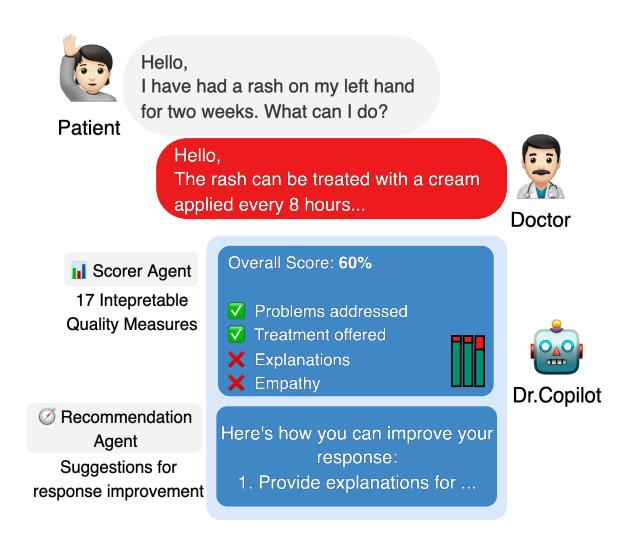
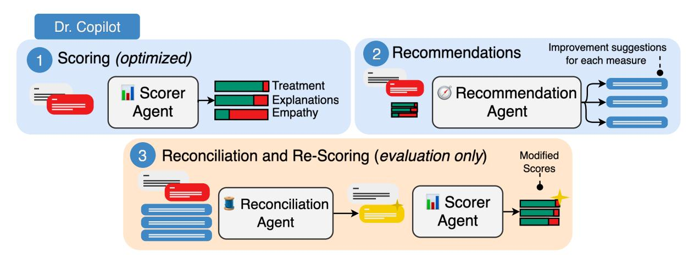
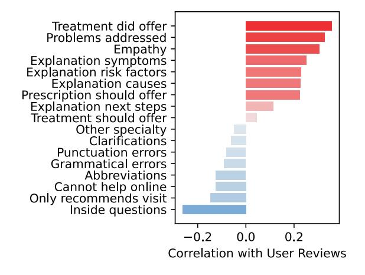
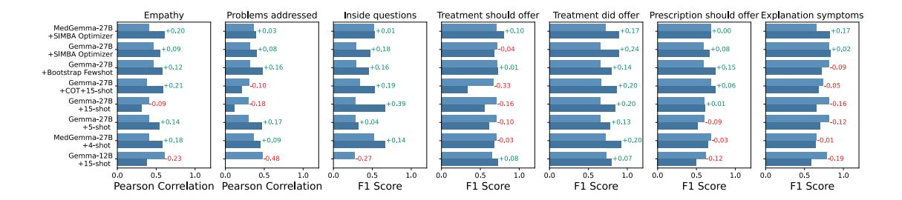
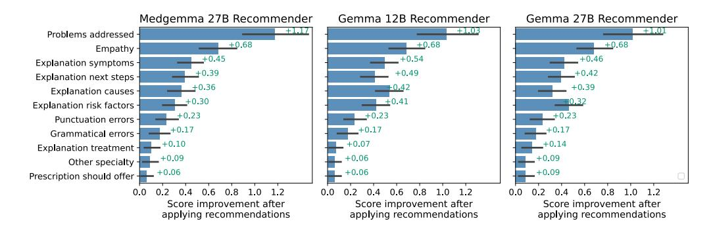
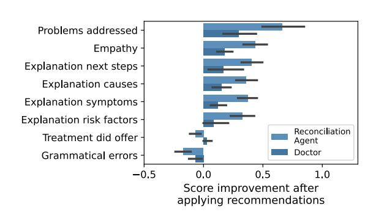
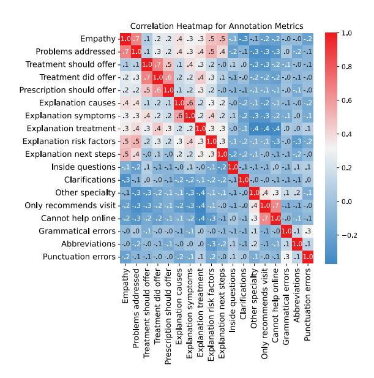
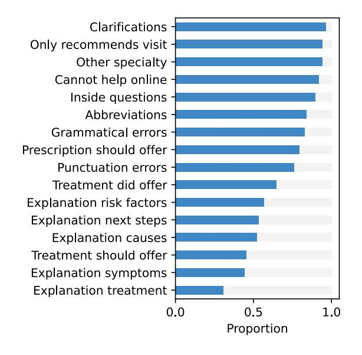
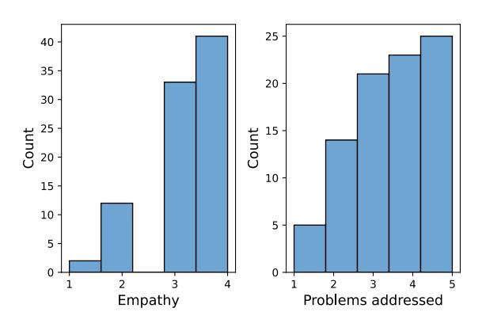
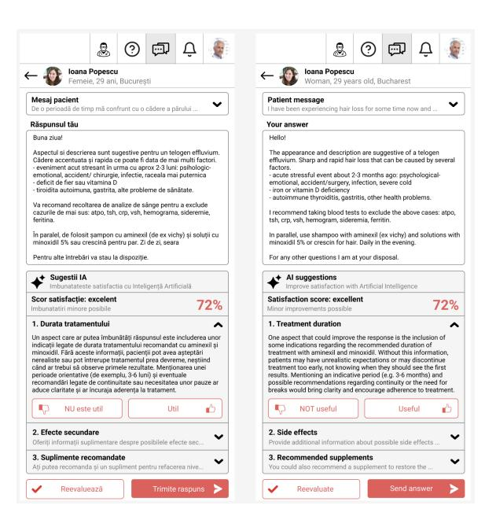

# Dr.Copilot: A Multi-Agent Prompt Optimized Assistant for Improving Patient-Doctor Communication in Romanian

Andrei Niculae<sup>1</sup> , Adrian Cosma1,2, Cosmin Dumitrache<sup>1</sup> , Emilian Radoi<sup>1</sup> <sup>1</sup>National University of Science and Technology POLITEHNICA Bucharest, <sup>2</sup>Dalle Molle Institute for Artificial Intelligence Research (IDSIA)

Correspondence: [emilian.radoi@upb.ro](mailto:emilian.radoi@upb.ro)

#### Abstract

Text-based telemedicine has become increasingly common, yet the quality of medical advice in doctor-patient interactions is often judged by patients more on how advice is communicated rather than its clinical accuracy. To address this, we introduce Dr.Copilot, a multiagent large language model (LLM) system that supports Romanian-speaking doctors by evaluating and enhancing the presentation quality of their written responses. Rather than assessing medical correctness, Dr.Copilot provides feedback along 17 interpretable quality measures. The system comprises of three LLM agents with prompts automatically optimized via DSPy. Designed with low-resource Romanian data and deployed using open-weight models, it delivers real-time specific feedback to doctors within a telemedicine platform. Empirical evaluations and live deployment with 41 doctors show measurable improvements in user reviews and response quality, marking one of the first real-world deployments of LLMs in Romanian medical settings.

#### 1 Introduction

Since 2020, telemedicine services have experienced rapid growth and widespread adoption (Peters et al., 2024). With social distancing measures [and lockdowns](#page-8-0) [limitin](#page-8-0)g access to in-person healthcare, virtual consultations quickly became a practical and convenient alternative, offering easier and faster access to doctors. Doctors providing health advice, especially in the case of text-based telemedicine services, have to balance two competing priorities: on the one hand, they have to provide the most medically accurate advice possible, and on the other, they have to communicate this advice in a way that is most helpful to patients. Generally, doctors focus on the first but sometimes tend to neglect the second. Unfortunately, this tends to attract negative reviews as the patient's perception

<span id="page-0-1"></span>

Figure 1: Dr.Copilot evaluates a doctor's response to a patient's question *in Romanian*<sup>1</sup> , ident[ify](#page-0-0)ing areas for improvement and offering suggestions to improve the form of the response.

on quality is formed primarily by how well the information is presented (Martin et al., 2005; Reis et al., 2024). This is simply due to most patients not being able to judge the quality f[rom a medical](#page-7-0) [persp](#page-7-0)[ective.](#page-8-1)

Although most te[lemedi](#page-8-1)cine platforms that offer text-based services include an onboarding process with guidelines for doctors on how to present their medical advice to receive better user reviews, these recommendations are often overlooked, largely because they are delivered all at once, they tend to be too general, and are easily forgotten or ignored.

To help doctors better communicate medical advice on telemedicine platforms, we propose Dr.Copilot, a multi-agent assistant, designed to provide specific, case-by-case advice on how to improve the presentation / packaging of the medical responses in a way optimized for user satisfaction, without interfering with the medical content. A well presented medical advice is more

<span id="page-0-0"></span><sup>1</sup> For illustration, this example is translated into English.

likely to be followed by the patient and have a positive impact (Martin et al., 2005; Reis et al., 2024). From the doctors' perspective, a well presented response attracts positive reviews, directly impacting reputation and professional satisfaction (Street Jr et al., 2009; Sargeant et al., [2008\). From the](#page-7-0) [telemedicine platfo](#page-8-1)rm's perspective, better user satisfaction translates to retention and referral, which ultimately translates to better business outcomes such as sustainable grow[th and profits.](#page-8-2)

[In this paper, we lever](#page-8-3)age anonymised real-world data from a Romanian telemedicine platform to optimize Dr.Copilot for this specific use case. Since the data is in Romanian, a low resource language (Nigatu et al., 2024), it presents additional practical challenges.

Romanian is under-represented in medical NLP research, and even more so in industry applications. In general, data is scarce and is even more lacking for specialized dom[ains. Current Roman](#page-8-4)ian LLMs (Masala et al., 2024) and language resources (Masala et al., 2020) can be useful for their general purpose embeddings, but might not be mature enough for direct use in real-world applications. However, the performance of multilingual LLMs (Huang et al., 2024; G[emma Team et al.,](#page-7-1) 2025) is improving. Model[s such as Gemma \(Ge](#page-8-5)mma Team et al., 2025) or its medical specialized counterpart MedGemma (Google, 2025), have shown good multilingual performance and have robust results across many axes. Still, R[omanian is not](#page-7-2) [comp](#page-7-2)[rehensively evaluated, which](#page-7-3) introduces inherent risks when these m[odels are used in direct](#page-7-3) [huma](#page-7-3)n-facing interactions.

Dr.Copilot [is a multi-agent](#page-7-4) system designed to support Romanian-speaking doctors by evaluating their written responses to patient questions and offering targeted, constructive feedback (Figure 1) across 17 interpretable measures of response quality (Mehri and Eskenazi, 2020; Shin et al., 2020; Zhang et al., 2024). We used three different LLM agents: a *Scorer Agent*, a *Recommender Agent* and, for evaluation, a *Reconciliation Agent*. To minimize annotation efforts and unnecessary computational costs, w[e op](#page-0-1)timized the agents using an automatic prompt optimization [approach, using DSPy](#page-8-6) [\(Khatt](#page-8-6)[ab et al.,](#page-8-7) 2024[\). We e](#page-8-7)[valuate Dr.Copi](#page-9-0)l[ot both](#page-9-0) in offline settings and in a live production environment with 41 doctors, one of the only real-world deployments of Romanian LLMs in telemedicine today.

We make the following contributions:

- 1. We introduce Dr.Copilot, a multi-agent LLM syste[m designed for Roman](#page-7-5)ian text-based telemedicine that evaluates and enhances doctor-patient communication quality across 17 interpretable quality measures. We make the code publicly available<sup>2</sup> .
- 2. We develop and validate an automatic prompt optimization approach using DSPy for medical communication assessment, achieving effective performance with limited labeled data (100 annotated examples) while ensuring privacy-preserving deployment through open-weight models.
- 3. We [sh](#page-1-0)ow one of the first real-world deployments of LLM agents in Romanian medical setting, with measurable improvements in response quality and patient satisfaction (83.89% increase in positive reviews) through live evaluation with 41 doctors.

## 2 Related Work

LLMs have gained traction in medicine (Zhou et al., 2023), through both general-purpose models (OpenAI, 2024; Gemini Team, 2025) and domainspecific ones such as MedPalm (Singhal et al., 2025, 2023), MedGemma (Google, 2025) and MedAlpaca (Han et al., 2023). In Romanian, smaller models such as RoLLama2/3, RoMistral and RoGemma exist (Masala et al., 2024), but lack medical evaluations. Thus, large multilingua[l mod](#page-9-1)[els remain via](#page-9-1)ble alternatives (Gemma Team et al., 2025; H[uang et al](#page-8-8)., [2024](#page-8-8); [Isbister et al.,](#page-7-6) [2021\)](#page-7-6). LLM use in healthcare varies by model autonomy. [Fully autonomous](#page-8-9) s[ystems](#page-8-9) [such as](#page-8-10) RiskAgent (Liu [et al.,](#page-7-4) 202[5\), Po](#page-7-4)laris (Mukherjee et al., [2024\) and](#page-7-7) [Healt](#page-7-7)hcare Copilot (Ren et al., 2024) manage full patient interactions (Zhao et al., 2025a), but raise [legal and ethical conc](#page-7-1)erns<sup>3</sup> . Patients may receive biased responses (Kusa et al., 2023) due to model sycophancy (Sharma et al., [2023\), a side effect of](#page-7-3) [RLHF \(Christiano et](#page-7-2) al., [2017\), reducing tru](#page-7-8)st (Reis et al., 2024). Safer alternatives restrict autonomy and advice generation (Cheng et al., 2024), sup[ported by benchmar](#page-7-9)ks such as [HealthBench \(Arora](#page-8-11) [et al.,](#page-8-11) 2025) and HeaL (Cheng et al., [2024\).](#page-8-12)

As opposed to other works that de[sign their ap](#page-9-2)[plicatio](#page-9-2)n to directly offer medical advice in t[he](#page-1-1)

<span id="page-1-1"></span><span id="page-1-0"></span><sup>2</sup> [github.com/andrei-niculae/dr-copilot](https://github.com/andrei-niculae/dr-copilot) 3 [https://www.egattorneys.com/](https://www.egattorneys.com/unauthorized-practice-of-medicine-bpc-2052) [unauthorized-practice-of-medicine-bpc-205](https://www.egattorneys.com/unauthorized-practice-of-medicine-bpc-2052)2, Accessed 04.07.2025

<span id="page-2-0"></span>

Figure 2: Overall diagram of Dr.Copilot. A patient-doctor interaction is scored and recommendations are generated for each measure. For automatic evaluation of recommendations we use a separate agent.

absence of a medical professional (Li et al., [2023;](#page-7-10) [Zhao et al.,](#page-7-10) 2025a,b), we design our m[ulti-agent](#page-8-13) [system, Dr.C](#page-8-13)opilot, such that doctors [can improve](#page-7-11) [their commu](#page-7-11)nication with the p[atient, while having](#page-8-1) full control of the medical content. Specific to our use case, we [focus on Romanian te](#page-7-12)lemedicine, having the first, to date, Romanian mult[i-agent LLM](#page-7-13) [writin](#page-7-13)g assistant f[or doctors.](#page-7-12)

#### 3 Method

In designing Dr.Copilot, we were guided [by several](#page-7-14) *[desid](#page-7-14)[erata](#page-9-2)*: *(i)* the [feedba](#page-9-2)[ck](#page-9-3) given to the doctor response should be structured across several easy to understand and interpretable axes; *(ii)* the feedback should be related only to presentation and not the medical content of the response; *(iii)* there should be targeted, explicit and actionable improvement suggestions; *(iv)* the doctor decides whether to incorporate the feedback or ignore the suggestions.

One of the reasons for the reduced autonomy of Dr.Copilot is to avoid language misunderstanding due to the use of Romanian, which is not the primary language of current open-weight LLMs (Gemma Team et al., 2025). Moreover, patients lose trust in the medical advice if they suspect involvement of AI (Reis et al., 2024), so doctors are supposed to formulate the content of the response in its entirety. We further detail the dataset construction for response scoring, experimental setup for prompt optimization and evaluation.

## 3.1 Measuring the Quality of Doctor Responses

To ensure control of responses from the model, we developed several measures of response quality, inspired by both [dialogue evaluation literature](#page-7-3)

(Mehri and Eskenazi, 2020; Zhang et al., 2024; Shin et al., 2020) and several business-ori[ented](#page-8-1) [quality meas](#page-8-1)ures. In Appendix A, we provide a description of each quality measure, including an empathy score (Shin et al., 2020), grammatical score, scores related to specificity and relevancy of the response to the patient questions (problems addressed) (Gopalakrishnan et al., 2019; Adiwardana et al., 2020), and measures of how informative the response is (e.g., explanations for patient symptoms, causes, treatment) (Zhang et al., 2020; Guo et al., 2018). Furthermore, we included measures directly related to the functionality of the telem[edicine platform: inappropri](#page-8-6)[ate use of the](#page-9-0) [clarifi](#page-9-0)[cations functionality](#page-8-7), or responding outside of the doctor's specialty.

From the over 100,000 existing text consultations on the telemedicine plat[form, we randomly](#page-8-7) selected 100 question-response pairs that included both positive and negative user reviews. These pairs were annotated by two compa[ny employees,](#page-7-15) [a male and a female](#page-7-15)[, with business domain knowl](#page-6-0)edge. Both individuals work in operations and support for the platform and, due to the nature of their roles, have explicit au[thorization to access p](#page-9-4)[atient](#page-7-16) [data under str](#page-7-16)ict confidentiality agreements. Given this context, no additional risk disclaimers for the annotators were necessary. All patients and doctors have agreed to have their questions and responses processed. Since prompt optimization frameworks such as DSPy (Khattab et al., 2024) require only a few (< 100) representative examples, the quality of annotations is more important than the quantity. For *"Empathy"* and *"Problems addressed"*, responses are scored on a 1-to-5 Likert scale (Likert, 1932), while the rest are given a binary score. In the initial round of annotations, due to part of the metrics being subjective, the annotators had poor agreement (in terms of Cohen's Kappa (Cohen, 1960)), as shown in Table 1 (App. A). In a second round of annotations, the metrics were reviewed and clarified to ensure full agreement. Figures 8 and 9 (App. A) show the distributions for each measure. Since this dataset is proprietary and contains sensitive patient data, it will not be made public.

In Figure 7 (App. A), we show [pairwise correla](#page-7-5)[tions](#page-7-5) between the response quality metrics. *"Empathy"* is highly correlated with a comprehensive response from the doctor in terms of addressed problems and presence of explanations for each decision. Using the existin[g user reviews](#page-7-17) for the annotated doctor responses, in Figure 3, we show how each individual quality measure impacts the reviews. Positive user reviews result in higher overall user satisfaction and retention. It is cl[ear that](#page-7-18) [users](#page-7-18) are satisfied with empat[hic](#page-10-0) doctor [res](#page-9-5)ponses that include some form of treatment, that comprehensively address their problems and that include explanat[ion](#page-12-0)s. N[ega](#page-12-1)tive re[view](#page-9-5)s are primarily given to responses with poor grammatical correctness and that misunderstand the platform functionality (e.g., incorrectly using the clarifications functionality or responding [with](#page-12-2) a req[uest](#page-9-5) for a physical visit to the clinic).



Figure 3: Correlation between each quality measure for doctor responses and user reviews.

## 3.2 Scoring, Recommender and Reconciliation Agents

To enhance the quality of doctor responses within Dr.Copilot, we developed a multi-agent framework that leverages DSPy (Khattab et al., 2024), a modular paradigm for prompt optimizat[ion. This frame-](#page-7-5) work builds on the response quality measures introduced in the previous section. Dr.Copilot (Figure 2) comprises three main components: a *Scoring Agent*, a *Recommender Agent* and, for evaluation, a *Reconciliation Agent*. Instead of using brittle handcrafted prompts or directly fine-tuning the model, we opt for automatic prompt optimization to enable rapid training of specialized agents for accurate scoring across each metric. Additionally, the constraint of a limited labeled dataset poses challenges for fine-tuned models, which may struggle to generalize to new data. In contrast, prompt optimization using DSPy has shown its effectiveness with small labeled datasets, making it a suitable choice.

Scoring Agent. This agent evaluates doctor responses based on quality metrics, including empathy, number of problems addressed, grammatical [correc](#page-7-5)tness and platform functionality usage. For each metric, we design base prompts to guide the model in assigning scores. In App. A we provide an example of a base prompt (Listing [1](#page-2-0)). To ensure structured and consistent outputs for each metric's scoring model, we use structured LLM outputs (Willard and Louf, 2023) present in DSPy, which ensures model responses are in the required score formats. To optimize the scoring agent's performance, we test three DSPy prompt optimizers: Labeled Few-Shot, Bootstrap Few-Shot, and SIMBA (Khattab et al., 2024). For the Labeled Few-Shot optimizer, we select representative examples from the training set, ensuring an equal balance of positive and negative reviews samples. The Bootstrap Few-Shot optimizer extends this by including unlabeled samples, capturing correct model predictions and their reasoning traces, including them in the final scoring prompt. The SIMBA optimizer iteratively refines the base prompt for each metric by checking the model scoring performance against labeled samples and then keeps the best performing prompts.

[Re](#page-9-5)commender Agent. This agent processes the scores fr[om](#page-11-0) the scoring agent and generates tailored recommendations to improve the doctor's response. We manually design the p[rompts for the](#page-8-14) [recommende](#page-8-14)r model to ensure it provides relevant suggestions. The prompts are created to present recommendations not as directives, but as suggestions to improve the response presentation to maximize patient satisfaction. In Listing 2 (App. A) we provide [a prompt example.](#page-7-5)

Reconciliation Agent. To evaluate the effectiveness of the recommendations, we implemented a

self-evaluation procedure: a reconciliation agent uses the recommender's suggestions to revise the initial doctor response, and the revised response is re-scored to measure improvements in quality metrics. This way, we can measure the quality of recommendations and determine whether they lead to an increase in the quality of the doctor's response. In Listing 3 (App. A) we provide a prompt example.

## 3.3 Pretrained Models

We evaluate three models from the Gemma model family (Gemma Team et al., 2025): Gemma 12B, Gemma 27B, MedGemma-27B. We select these models for the following reasons. Given the sensitive nature of patient data involved in our study, we cannot use any closed-source models available through an API, such as GPT-4 (OpenAI, 2024) or Gemini (Gemini Team, 2025), since these models require data to be trans[mitte](#page-11-1)d to e[xter](#page-9-5)nal servers.

We turn to open-source alternatives that enable local deployment. Currently, there is no robust model for Romanian with evaluations for the medical domain. Therefore, medium-sized open-weight multilingual models represent a suitable choice. In particular, the Gemma model family has shown robust multilingual capabilities across diverse evaluation benchmarks (Gemma Team et al., 2025). This ecosystem enables us to evaluate the performance of models with different parameter scales (Gemma 12B, Gemma 27B), alongside models of equ[iva](#page-11-2)lent si[ze t](#page-9-5)hat have different training objectives (Gemma 27B, MedGemma 27B). We detail our experimental configuration in App. A.

#### 4 Experime[nts and Results](#page-7-3)

Evaluating the Scorer Agent. For evaluating the *Scoring Agent*, in Figure 4 we present a comparison between different base models (Gemma 12B / 27B / MedGemma 27B (Gemma Team et al., 2025)) having the [prompt optimize](#page-8-8)d using diff[erent op](#page-7-6)[timizers from](#page-7-6) DSPy (Khattab et al., 2024). We computed Pearson Correlations between the output scores and the manual annotations for "Empathy" and "Problems addressed", and F<sup>1</sup> scores for binary measures. For runs having manual few-shots, we selected an equal number of examples from each class, when possible. Overall, MedGemma-27B with SIMBA prompt optimizer has the best overall improvement across all metrics, and we used it for the rest of the experiments.

[Evaluating the Recommender](#page-7-3) Agent. Evaluating free-text recommendations is not trivial, especially since there is no ground truth or human rated examples. A common approach is to use an LLM-as-a-Judge paradigm (Gu et al., 2024) to score responses. However, we propose a "Self-Evaluation Procedure": we create a *Reconciliation Age[nt](#page-9-5)* which is tasked to incorporate the recommendations into the original response, and the revised response is re-scored using the *Scorer Agent*. This setup is closer to real-world deployment, as the *Reconciliation Agent* effectively simulates how doctors use the suggestions to improve the response. In Figure 5, we show the average improvement of [met](#page-5-0)rics after suggestion incorporation and re-scoring by a SIMBA MedGemma-27B scorer. Similarly, we [chose MedGemma-27B as a](#page-7-3) *Recommender Agent*. In the next section, we present results after de[ployment in a live pro](#page-7-5)duction environment and show that the improvement estimates of the selfevaluation procedure are actually conservative, and the real score improvement by doctors is greater.

## 4.1 Live Deployment Results

Engagement metrics. During the deployment period, Dr.Copilot processed 871 evaluation requests across 41 doctors. In the UI, the doctors were shown recommendations for only the top 3 most important metrics, ranked by their correlation with patient reviews (i.e., Figure 3), to avoid overwhelming them with excessive suggestions. In Fig. 10 (App. A) we show the application interface from the doctors' perspective when interacting [with](#page-7-19) [Dr.Copilot. I](#page-7-19)n 120 out of the 871 cases, doctors revised their responses based on the recommendations. The distribution of suggested recommendation types is detailed in Table 2 (App. A).

Quality improvement. In Figure 6, we show score improvements across metrics when suggestions are incorporated by doctors in the live environment. When compared to self-evaluation predictions, doctors utilizing Dr.Copilot achieved a 10% overall relative improveme[nt a](#page-5-1)cross all metrics, versus the estimated 28% of the *Reconciliation Agent*. This discrepancy suggests that the *Scoring Agent* exhibits a tendency to favor outputs produced by the *Reconciliator Agent*, in line with previous works which show the self-preference bias of the LLMas-a-judge (Wataoka et al., 2024; Ye et al., 2024). Patient satisfaction. Patients provide reviews on doctors' final responses, by giving a like or dislike (positive or negative rating). Users may also

<span id="page-5-0"></span>

Figure 4: Comparison between base models and prompt-optimized variants across selected quality measures for the *Scoring Agent*. Performance metrics are computed relative to human manual annotations.

<span id="page-5-1"></span>

Figure 5: Evaluation of the *Recommender Agent*, by incorporating recommendations through a *Reconciliator Agent* in the original responses and re-scoring.



Figure 6: Score improvement across selected metrics by doctors who incorporated suggestions from Dr.Copilot compared to estimations using the *Reconciliation Agent*.

choose not to provide feedback. As the number of questions received varies by doctor due to factors such as availability, reputation and average response quality, we used the like-to-response ratio to assess Dr.Copilot's impact on perceived patient satisfaction. During the deployment period, responses that incorporated Dr.Copilot's suggestions received positive reviews from patients in 47.5% of cases, compared to 25.83% for responses that did not incorporate the suggestions. This shows a 83.89% increase in the like-to-response ratio.

# 5 Conclusions

[In this work, w](#page-8-15)e introduced Dr.Copilot, a multiagent LLM system designed to enhance doctorpatient communication quality in Romanian textbased telemedicine settings. Dr.Copilot represents one of the first real-world deployments of Romanian medical LLM applications, overcoming the challenges of working with a low-resource language in a specialized domain. Through automatic prompt optimization using DSPy (Khattab et al., 2024), we achieved effective performance with limited labeled data. In a live deployment environment with 41 doctors, we observed a 83.89% increase in the like-to-response ratio for responses that incorporated Dr.Copilot's suggestions. The deployment of Dr.Copilot represents an important step forward in the practical application of LLMs in healthcare, particularly for underrepresented languages such as Romanian.

## Ethical Considerations

Dr.Copilot is designed with strong ethical safeguards to ensure safe and responsible use in clinical settings. Unlike other autonomous systems that interact directly with patients or provide medical advice (Mukherjee et al., 2024; Liu et al., 2025;

Zhao et al., 2025a), Dr.Copilot functions strictly as a supportive tool for physicians. The model does not offer medical recommendations and is not intended to replace professional judgment. Instead, it serves to assist doctors in formulating clearer and more informative responses to patient questions. Furthermore, the system is deployed on-premise, using local and open-weight models (Gemma Team et al., 2025), without reliance on external API services such as OpenAI or Gemini. This architectural choice minimizes data privacy risks for sensitive health information. The patient questions remain within the institution's infrastructure, and no information is transmitted to third-party services.

## Limitations

One of the limitations of our work is evaluation with a l[imited number of docto](#page-7-5)rs. While our results reflect a preliminary evaluation, we expect the results to improve with further iterations. Another limitation of our work is that while the Gemma3 family of models has been evaluated for multilingual capabilities (Gemma Team et al., 2025), their performance for Romanian and, more specifically, on Romanian medical conversations, is unclear and requires further benchmarking. While we have not observed any particular issues that might arise from language misunderstanding, more comprehensive benchmarks for evaluation on medical domains are needed.

Any type of (semi-) autonomous system related to the medical domain presents inherent risks. While Dr.Copilot does not offer medical advice, and doctors only interact with it to improve the presentation of their responses, interacting with a chatbot [can imp](#page-7-9)act do[ctors' responses \(Hohen](#page-8-11)[stein et al.](#page-7-9), 2023[\) and might result in](#page-9-2) lost trust from patients if they suspect that responses are algorithmic (Reis et al., 2024). Furthermore, since Dr.Copilot is a system of multiple LLM agent deployed in a live environment that directly process raw user input (i.e. patient questions), it might be a target of jailbreaking attacks (Zeng et al., 2024; Andriushchenko et al., 2024). This aspect might be [mitigated through the use of g](#page-7-3)uardrails (Rebedea et al., 2023) and red-teaming (Perez et al., 2022).

#### Acknowledgments

This research was supported by the project "Romanian Hub for Artificial Intelligence - HRIA", Smart Growth, Digitization and Financial Instruments Program, MySMIS no. 334906.

## References

- Daniel Adiwardana, Minh-Thang Luong, David R So, Jamie Hall, Noah Fiedel, and 1 others. 2020. Towards a human-like open-domain chatbot. *arXiv preprint arXiv:2001.09977*.
- Maksym Andriushchenko, Francesco Croce, [and Nico](#page-7-3)[las Flammarion. 20](#page-7-3)24. Jailbreaking leading safetyaligned llms with simple adaptive attacks. *arXiv preprint arXiv:2404.02151*.
- Rahul K Arora, Jason Wei, Rebecca Soskin Hicks, Preston Bowman, Joaquin Quiñonero-Candela, and 1 others. 2025. Healthbench: Evaluating large language models towards improved human health. *arXiv preprint arXiv:2505.08775*.
- Kellen Cheng, Anna Lisa Gentile, Pengyuan Li, Chad DeLuca, and Guang-Jie Ren. 2024. Don't be my Doctor! Recognizing Healthcare Advice in Large Language Models. In *Proceedings of the 2024 Conference on Empirical Methods in Natural Language Processing: Industry Track*, pages 970–980.
- Paul F Christiano, Jan Leike, Tom Brown, Miljan Martic, Shan[e Legg, and 1 others. 2017.](#page-7-20) Deep Reinforcement Learning from Human Preferences. In *Advances in Neural Information Proces[sing Systems](#page-8-1)*, volume 30. Curran Associates, Inc.
- [Jacob](#page-8-1) Cohen. 1960. A coefficient of agreement for nominal scales. *Educational and psychological measurement*, 20(1):37–46.
- Gemini Team. 2025. [Gemini: A Famil](#page-8-16)[y of](#page-6-1) Highly Capable M[ultimod](#page-6-1)al Models. *Preprint*, [arXiv:2312.11805.](#page-6-1)
- [Gemma Team, Aishwarya](#page-8-17) Kamath, Johan Ferret, [Shreya](#page-8-18) Pathak, Nino Vieillard, and 1 others. 2025. Gemma [3 technical](#page-8-18) report. *arXiv preprint arXiv:2503.19786*.
- Google. 2025. MedGemma Hugging Face. https: //huggingface.co/collections/google/ medgemma-release-680aade845f90bec6a3f60c4. Accessed: 2025-07-4.
- Karthik Gopalakrishnan, Behnam Hedayatnia, Qinlang Chen, Anna Gottardi, Sanjeev Kwatra, and 1 others. 2019. Topical-Chat: Towards Knowledge-Grounded Open-Domain Conversations. In *Proc. Interspeech 2019*, pages 1891–1895.
- <span id="page-6-0"></span>Jiawei Gu, Xuhui Jiang, Zhichao Shi, Hexiang Tan, Xuehao Zhai, Chengjin Xu, Wei Li, Yinghan Shen, Shengjie Ma, Honghao Liu, and 1 others. 2024. A survey on llm-as-a-judge. *arXiv preprint arXiv:2411.15594*.
- <span id="page-6-1"></span>Fenfei Guo, Angeliki Metallinou, Chandra Khatri, Anirudh Raju, Anu Venkatesh, and 1 others. 2018. Topic-based evaluation for conversational bots. *arXiv preprint arXiv:1801.03622*.

- <span id="page-7-13"></span>Tianyu Han, Lisa C Adams, Jens-Michalis Papaioannou, Paul Grundmann, Tom Oberhauser, and 1 others. 2023. MedAlpaca–an open-source collection of medical conversational AI models and training data. *arXiv preprint arXiv:2304.08247*.
- <span id="page-7-12"></span>Jess Hohenstein, Rene F. Kizilcec, Dominic DiFranzo, Zhila Aghajari, Hannah Mieczkowski, and 1 others. 2023. Artificial intelligence in communication impacts language and social relationships. *Scientific Reports*, 13(1):5487.
- <span id="page-7-11"></span>Kaiyu Huang, Fengran Mo, Xinyu Zhang, Hongliang Li, You Li, and 1 others. 2024. A survey on large language models with multilingualism: Recent advances and new frontiers. *arXiv preprint arXiv:2[405.10936](https://proceedings.neurips.cc/paper_files/paper/2017/file/d5e2c0adad503c91f91df240d0cd4e49-Paper.pdf)*.
- Ti[m Isbister, Fredrik Carlsson, and Magnus Sahlgren](https://proceedings.neurips.cc/paper_files/paper/2017/file/d5e2c0adad503c91f91df240d0cd4e49-Paper.pdf). 2021. Should we stop training more monolingual models, and simply use machine translation instead? *arXiv preprint arXiv:2104.10441*.
- <span id="page-7-18"></span><span id="page-7-6"></span>Omar Khattab, Arnav Singhvi, Paridhi Maheshwari, Zhiyuan Zhang, Keshav Santhanam, and 1 others. 2024. DSPy: Compiling Declarative Language [Model Calls into Self-Improving Pipelines.](https://arxiv.org/abs/2312.11805)
- <span id="page-7-3"></span>Wojciech Kusa, Edoardo Mosca, and Aldo Lipani. 2023. "Dr LLM, what do I have?": The Impact of User Beliefs and Prompt Formulation on Health Diagnoses. In *Proceedings of the Third Workshop on NLP for Medical Conversations*, pages 13–19.
- <span id="page-7-4"></span>Woosuk Kwon, Zhuohan Li, Siyuan Zhuang, Ying Sheng, Lianmin Zheng, and 1 others. 2023. Efficient [Memory Management for Large Language Model](https://huggingface.co/collections/google/medgemma-release-680aade845f90bec6a3f60c4) [Serving with PagedAttention. In](https://huggingface.co/collections/google/medgemma-release-680aade845f90bec6a3f60c4) *Proceedings of the ACM SIGOPS 29th Symposium on Operating Systems Principles*.
- <span id="page-7-15"></span>Yunxiang Li, Zihan Li, Kai Zhang, Ruilong Dan, Steve Jiang, and 1 others. 2023. C[hatdoctor: A medical](https://doi.org/10.21437/Interspeech.2019-3079) [chat model fine-tuned on a large language model](https://doi.org/10.21437/Interspeech.2019-3079) [meta-ai \(lla](https://doi.org/10.21437/Interspeech.2019-3079)ma) using medical domain knowledge. *Cureus*, 15(6).
- <span id="page-7-19"></span>Rensis Likert. 1932. A technique for the measurement of attitudes. *Archives of psychology*.
- Fenglin Liu, Jinge Wu, Hongjian Zhou, Xiao Gu, Soheila Molaei, and 1 others. 2025. RiskAgent: Autonomous Medical AI Copilot for Generalist Risk Prediction. *arXiv preprint arXiv:2503.03802*.
- <span id="page-7-16"></span>Leslie R Martin, Summer L Williams, Kelly B Haskard, and M Robin DiMatteo. 2005. The challenge of patient adherence. *Therapeutics and clinical risk management*, 1(3):189–199.
- <span id="page-7-20"></span><span id="page-7-7"></span>Mihai Masala, Denis Ilie-Ablachim, Alexandru Dima, Dragos Georgian Corlatescu, Miruna-Andreea Zavelca, Ovio Olaru, Simina-Maria Terian, Andrei Terian, Marius Leordeanu, Horia Velicu, Marius Popescu, Mihai Dascalu, and Traian Rebedea. 2024. "vorbes, ti românes, te?" a recipe to train powerful Romanian LLMs with English instructions. In *Findings of the Association for Computational Linguistics:*

- *EMNLP 2024*, pages [11632–11647, Miami, Florida,](https://doi.org/10.1038/s41598-023-30938-9) [USA. Association for Computational Linguistics.](https://doi.org/10.1038/s41598-023-30938-9)
- <span id="page-7-2"></span>Mihai Masala, Stefan Ruseti, and Mihai Dascalu. 2020. RoBERT – A Romanian BERT Model. In *Proceedings of the 28th International Conference on Computational Linguistics*, pages 6626–6637, Barcelona, Spain (Online). International Committee on Computational Linguistics.
- <span id="page-7-8"></span>Shikib Mehri and Maxine Eskenazi. 2020. Unsupervised Evaluation of Interactive Dialog with DialoGPT. In *Proceedings of the 21th Annual Meeting of the Special Interest Group on Discourse and Dialogue*, pages 225–235, 1st virtual meeting. Association for Computational Linguistics.
- <span id="page-7-5"></span>Subhabrata Mukherjee, Paul Gamble, Markel Sanz Ausin, Neel Kant, Kriti Aggarwal, and 1 others. 2024. Polaris: A safety-focused llm constellation architecture for healthcare. *arXiv preprint arXiv:2403.13313*.
- <span id="page-7-21"></span><span id="page-7-10"></span>Hellina Hailu Nigatu, Atnafu Lambebo Tonja, Benjamin Rosman, Thamar Solorio, and Monojit Choudhury. 2024. The Zeno's Paradox of 'Low-Resource' Languages. In *Proceedings of the 2024 Conference on Empirical Methods in Natural Language Processing*, pages 17753–17774, Miami, Florida, USA. Association for Computational Linguistics.
- OpenAI. 2024. GPT-4 Technical Report. *Preprint*, arXiv:2303.08774.
- <span id="page-7-14"></span>Ethan Perez, Saffron Huang, Francis Song, Trevor Cai, Roman Ring, John Aslanides, Amelia Glaese, Nat McAleese, and Geoffrey Irving. 2022. Red teaming language models with language models. In *Proceedings of the 2022 Conference on Empirical Methods in Natural Language Processing*, pages 3419–3448, Abu Dhabi, United Arab Emirates. Association for Computational Linguistics.
- <span id="page-7-17"></span><span id="page-7-9"></span>Zachary J Peters, Jessica Lendon, Christine Caffrey, Kelly L Myrick, Mohsin Mahar, and 1 others. 2024. Telemedicine Use During the COVID-19 Pandemic by Office-based Physicians and Long-term Care Providers. *National Health Statistics Reports*, (210):10–15620.
- <span id="page-7-1"></span><span id="page-7-0"></span>Traian Rebedea, Razvan Dinu, Makesh Narsimhan Sreedhar, Christopher Parisien, and Jonathan Cohen. 2023. NeMo Guardrails: A Toolkit for Controllable and Safe LLM Applications with Programmable Rails. In *Proceedings of the 2023 Conference on Empirical Methods in Natural Language Processing: System Demonstrations*, pages 431–445, Singapore. Association for Computa[tional Linguistics.](https://doi.org/10.18653/v1/2024.findings-emnlp.681)
- M[oritz Reis, Florian Rei](https://doi.org/10.18653/v1/2024.findings-emnlp.681)s, and Wilfried Kunde. 2024. Influence of believed AI involvement on the perception of digital medical advice. *Nature Medicine*, pages 1–3.

- <span id="page-8-5"></span>Zhiyao Ren, Yibing Zhan, Baosheng Yu, Liang Ding, and D[acheng Tao. 2024. Healthcare copilot: El](https://doi.org/10.18653/v1/2020.coling-main.581)iciting the power of general llms for medical consultation. *arXiv preprint arXiv:2402.13408*.
- <span id="page-8-6"></span>Joan Sargeant, Karen Mann, Douglas Sinclair, Cees Van der Vleuten, and Job Metsemakers. 2008. Understanding the influence of emotions and re[flection](https://doi.org/10.18653/v1/2020.sigdial-1.28) [upon multi-source feedback acceptance and use.](https://doi.org/10.18653/v1/2020.sigdial-1.28) *Ad[vances in H](https://doi.org/10.18653/v1/2020.sigdial-1.28)ealth Sciences Education*, 13:275–288.
- Mrinank Sharma, Meg Tong, Tomasz Korbak, David Duvenaud, Amanda Askell, and 1 others. 2023. Towards understanding sycophancy in language models. *arXiv preprint arXiv:2310.13548*.
- <span id="page-8-11"></span>Jamin Shin, Peng Xu, Andrea Madotto, and Pascale Fung. 2020. Generating empathetic responses by looking ahead the user's sentiment. In *ICASSP 2020- 2020 IEEE International Conference on Acoustics, Speech and Signal Processing (ICASSP)*, pages 7989– 7993. IEEE.
- <span id="page-8-4"></span>Karan Singhal, Sheko[ofeh Azizi, Tao Tu, S Sara Mah](https://doi.org/10.18653/v1/2024.emnlp-main.983)[davi, Jason Wei, and](https://doi.org/10.18653/v1/2024.emnlp-main.983) 1 others. 2023. Large language models encode clinical knowledge. *Nature*, 620(7972):172–180.
- <span id="page-8-8"></span>Karan Singhal, Tao Tu, Juraj Gottweis, Rory Sayres, Ellery Wulczyn, and 1 others. 2025. Toward expertlevel medical [question answering with larg](https://arxiv.org/abs/2303.08774)e language models. *Nature Medicine*, pages 1–8.
- <span id="page-8-18"></span>Richard L Street Jr, Gregory Makoul, Neeraj K Arora, and Ronald M Epstein. 2009. How does communication heal? Pathways linking clinician–patient com[munication to health outcomes.](https://doi.org/10.18653/v1/2022.emnlp-main.225) *Patient education [and cou](https://doi.org/10.18653/v1/2022.emnlp-main.225)nseling*, 74(3):295–301.
- Telemedicine. 2025. Medic Chat. https://www. medic.chat/. Accessed: 2025-07-4.
- <span id="page-8-0"></span>Koki Wataoka, Tsubasa Takahashi, and Ryokan Ri. 2024. Self-preference bias in llm-as-a-judge. *arXiv preprint arXiv:2410.21819*.
- Brandon T Willard and Rémi Louf. 2023. Efficient guided generation for large language models. *arXiv preprint arXiv:2307.09702*.
- <span id="page-8-17"></span>Jiayi Ye, Yanbo Wang, Yue Huang, Dongping Chen, Qihui Zhang, Nuno Moniz, Tian Gao, Werner Geyer, Chao Huang, [Pin-Yu Chen, Nitesh V Chawla, and](https://doi.org/10.18653/v1/2023.emnlp-demo.40) [Xiangliang Zhang. 2024.](https://doi.org/10.18653/v1/2023.emnlp-demo.40) Justice or prejudice? [quantifying biases in](https://doi.org/10.18653/v1/2023.emnlp-demo.40) llm-as-a-judge. *Preprint*, arXiv:2410.02736.
- <span id="page-8-1"></span>Yi Zeng, Hongpeng Lin, Jingwen Zhang, Diyi Yang, Ruoxi Jia, and 1 others. 2024. How johnny can persuade llms to jailbreak them: Rethinking persuasion to challenge ai safety by humanizing llms. In *Proceedings of the 62nd Annual Meeting of the Association for Computational Linguistics (Volume 1: Long Papers)*, pages 14322–14350.

- <span id="page-8-12"></span>Chen Zhang, Luis Fernando D'Haro, Yiming Chen, Malu Zhang, and Haizhou Li. 2024. A comprehensive analysis of the effectiveness of large language models as automatic dialogue evaluators. In *Proceedings of the Thirty-Eighth AAAI Conference on Artificial Intelligence and Thirty-Sixth Conference on Innovative Applications of Artificial Intelligence and Fourteenth Symposium on Educational Advances in Artificial Intelligence*, AAAI'24/IAAI'24/EAAI'24. AAAI Press.
- <span id="page-8-13"></span><span id="page-8-3"></span>Yizhe Zhang, Siqi Sun, Michel Galley, Yen-Chun Chen, Chris Brockett, Xiang Gao, Jianfeng Gao, Jingjing Liu, and Bill Dolan. 2020. DIALOGPT : Large-scale generative pre-training for conversational response generation. In *Proceedings of the 58th Annual Meeting of the Association for Computational Linguistics: System Demonstrations*, pages 270–278, Online. Association for Computational Linguistics.
- <span id="page-8-7"></span>Xuejiao Zhao, Siyan Liu, Su-Yin Yang, and Chunyan Miao. 2025a. A Smart Multimodal Healthcare Copilot with Powerful LLM Reasoning. *arXiv preprint arXiv:2506.02470*.
- <span id="page-8-10"></span>Xuejiao Zhao, Siyan Liu, Su-Yin Yang, and Chunyan Miao. 2025b. MedRAG: Enhancing Retrievalaugmented Generation with Knowledge Graph-Elicited Reasoning for Healthcare Copilot. In *Proceedings of the ACM on Web Conference 2025*, pages 4442–4457.
- <span id="page-8-9"></span><span id="page-8-2"></span>Hongjian Zhou, Fenglin Liu, Boyang Gu, Xinyu Zou, Jinfa Huang, Jinge Wu, Yiru Li, Sam S Chen, Peilin Zhou, Junling Liu, and 1 others. 2023. A survey of large language models in medicine: Progress, application, and challenge. *arXiv preprint arXiv:2311.05112*.

#### A Appendix

# <span id="page-8-19"></span>A.1 Doctor Response Evaluatio[n Metrics](https://www.medic.chat/) Q[uality Metri](https://www.medic.chat/)cs

- <span id="page-8-16"></span><span id="page-8-15"></span><span id="page-8-14"></span>• Empathy (1-5): Evaluates emotional consideration in responses
  - 1 Harsh response, scolds user, makes negative observations
  - 2 Abrupt, direct response without emotional consideration, no explanations
  - 3 Polite but does not consider user's emotional state, relatively short w[ith few ex](https://arxiv.org/abs/2410.02736)[planations](https://arxiv.org/abs/2410.02736)
  - 4 Polite response, focuses solely on medical aspects, but does not consider user's emotional state
  - 5 Empathetic response, considers user's emotional state, explanatory, shows goodwill toward user, attempts to reassure them

- <span id="page-9-4"></span><span id="page-9-0"></span>• Problems Addressed (1-5): Completeness of [addressing patient concerns](https://doi.org/10.1609/aaai.v38i17.29923)
  - 1 [Doctor addressed none of the patient's](https://doi.org/10.1609/aaai.v38i17.29923) problems (e.g., "go see a doctor")
  - 2 Doctor addressed one main problem, ignoring other questions
  - 3 Doctor addressed most problems punctually (approximately 80%)
  - 4 Doctor addressed all patient problems punctually, without additi[onal comple](https://doi.org/10.18653/v1/2020.acl-demos.30)[tions](https://doi.org/10.18653/v1/2020.acl-demos.30)
  - 5 [Doctor addressed](https://doi.org/10.18653/v1/2020.acl-demos.30) all patient problems, including unknown ones, covering the entire medical act (causes, treatment, prescription, analyses, next steps)
- <span id="page-9-2"></span>• Grammatical Errors: Response contains grammatical errors (true/false)
- <span id="page-9-3"></span>• Abbreviations: Response contains abbreviations (true/false)
- Punctuation Errors: Response contains punctuation errors (true/false)

## <span id="page-9-1"></span>Treatment Assessment

- Treatment Should Offer: Should the doctor offer treatment in this case? (true/false)
- <span id="page-9-5"></span>• Treatment Did Offer: Did the doctor offer treatment? (true/false)
- Prescription Should Offer: For the offered treatment, should the doctor offer a prescription? (true/false)

#### Explanation Completeness

- Causes Explanation: Response mentions causes of the problem (true/false)
- Symptoms Explanation: Response mentions symptoms (true/false)
- Risk Factors Explanation: Response mentions risk factors (true/false)
- Next Steps Explanation: Response explains next steps, including recommendations for where to get analyses (true/false)

#### Response Classification

- Clarifications: Doctor only addressed clarification questions (true/false)
- Questions in Response: Doctor answered patient's question but addressed additional questions in response (true/false)
- Other Specialty: Doctor mentions cannot help patient because case requires a different medical specialty (true/false)
- Only Recommends Visit: Doctor only recommends physical consultation and offers no other information/explanations (true/false)
- Cannot Help Online: Doctor mentions cannot help user with information online

## A.2 Experimental details

We use vLLM (Kwon et al., 2023) as the model serving framework due to its high throughput for parallel query processing. This is crucial because each scoring and recommendation request will run 17 concurrent model requests (one per quality measure). We use the original, non-quantized models from Huggingface, *gemma-3-12b-it*<sup>4</sup> , *gemma-3-27b-it*<sup>5</sup> , *medgemma-27b-text-it*<sup>6</sup> .

A critical factor in the practical deployment of these models is the latency experienced by doctors awaiting recommendations. By leveraging vLLM with asynchronous queries, we achieve an average response evaluation time of five seconds. Minimizing this latency is vital for optimizing user experience, as extended delays may reduce doctors' willingness to adopt the improvement recommendations.

For prompt optimization, we split the 100 annotated question-response pairs into a 1:5 train-test ratio: 20 training samples, and 80 validation samples as recommended by DSPy for small, high-quality datasets (Khattab et al., 2024)).

All experiments were run on a cluster node with two NVIDIA A100 GPUs. A full optimization run using the SIMBA optimizer takes two hours, while a labeled or bootstrapped fewshot run takes 15 minutes. We use the default hyper-parameters for each optimizer, aside from few-shot count. For Labeled Few-Shot we used max\_bootstrapped\_demos

<sup>4</sup> hf.co/google/gemma-3-12b-it, Accessed: 04.07.2025

<sup>5</sup> hf.co/google/gemma-3-27b-it, Accessed: 04.07.2025

<sup>6</sup> hf.co/google/medgemma-27b-text-it, Accessed: 04.07.2025

= 4, max\_labeled\_demos = 16, max\_rounds = 1, max\_errors = 5. For SIMBA we used batch\_size = 16, num\_candidates = 6, max\_steps = 8, max\_demos = 4.

| Metric Name               | Cohen's Kappa | % Agreement |
|---------------------------|---------------|-------------|
| Empathy                   | 0.69          | _           |
| Problems addressed        | 0.80          | _           |
| Treatment did offer       | 0.80          | 90.91       |
| Treatment should offer    | 0.59          | 79.55       |
| Clarifications            | 0.56          | 96.59       |
| Explanation treatment     | 0.55          | 79.55       |
| Prescription should offer | 0.48          | 80.68       |
| Other specialty           | 0.47          | 93.18       |
| Explanation causes        | 0.41          | 70.45       |
| Explanation symptoms      | 0.37          | 70.45       |
| Explanation risk factors  | 0.34          | 67.05       |
| Inside questions          | 0.30          | 85.23       |
| Explanation next steps    | 0.24          | 61.36       |
| Cannot help online        | 0.24          | 88.64       |
| Only recommends visit     | 0.12          | 88.64       |

Table 1: Agreement between annotators after the first round of annotation. For "*Empathy*" and "*Problems addressed*", we used a weighted Cohen's Kappa.

<span id="page-10-0"></span>

| Name                      | Count |
|---------------------------|-------|
| Prescription should offer | 95    |
| Explanation causes        | 86    |
| Problems addressed        | 77    |
| Explanation symptoms      | 70    |
| Empathy                   | 38    |
| Cannot help online        | 18    |
| Only recommends visit     | 13    |
| Explanation next steps    | 13    |
| Explanation risk factors  | 12    |
| Other specialty           | 8     |
| Treatment did offer       | 7     |
| Grammatical errors        | 6     |
| Clarifications            | 6     |

<span id="page-10-2"></span><span id="page-10-1"></span>Table 2: Histogram of each recommendation type, during live deployment.

Listing 1: Scoring prompt example for the Problems Addressed metric, using DSPy signatures.

```
class ProblemAddressingEvaluator ( dspy . Signature ) :
""" Evaluates how well a doctor addressed patient 's problems . """
patient_question = dspy . InputField ( desc =" Intrebarea pacientului ")
doctor_response = dspy . InputField ( desc =" Raspunsul doctorului , care va fi evaluat
    ")
problems_addressed : Literal ["1", "2", "3", "4", "5"] = dspy . OutputField (
    desc = """
Toate Problemele (1 -5):
1 - Doctorul nu a adresat nici una din problemele pacientului , exemple includ
    raspunsuri precum " mergeti la doctor "
2 - Doctorul a adresat o problema principala , ignorand celelalte intrebari
3 - Doctorul a adresat punctual majoritatea ( aproximativ 80%) problemelor
4 - Doctorul a adresat punctual toate problemele pacientului , fara alte
    completari
5 - Doctorul a adresat toate problemele pacientului , inclusiv alte necunoscute ,
    acoperind tot actul medical (cauze , tratament , reteta , analize , pasi
    urmatori )
""" )
```

Listing 2: Recommender prompt example for the Problems Addressed metric, using DSPy signatures.

```
class ProblemAddressingRecommender ( dspy . Signature ) :
""" Identifica problemele neadresate din intrebarea pacientului , precizandu -le
    printr -o lista .
Recomandarea poate incepe cu " Raspunsul ar putea beneficia de urmatoarele
    detalii : <lista probleme neadresate , separate pe cate un rand , maxim 4 >"
"""
patient_question = dspy . InputField ( desc =" Intrebarea pacientului ")
doctor_response = dspy . InputField ( desc =" Raspunsul doctorului , care va fi evaluat
    ")
score = dspy . InputField ( desc = description_map [" problems_addressed "])
recommendation = dspy . OutputField ( desc =" Recomandare pentru adresarea completa a
    problemelor ")
```

Listing 3: Reconciliator prompt example for the Problems Addressed metric, using DSPy signatures.

```
class ReconciliatorSignature ( dspy . Signature ) :
""" Tries to improve the doctor 's response using the provided recommendations """
patient_question = dspy . InputField ( desc =" Intrebarea pacientului ")
doctor_response = dspy . InputField ( desc =" Raspunsul doctorului , care va fi evaluat
    ")
recommendations = dspy . InputField (
    desc = f" Recomandari pentru a imbunatati raspunsul doctorului "
)
modified_response = dspy . OutputField (
    desc = f" Raspunsul doctorului modificat folosind recomandarile "
)
```

<span id="page-12-2"></span>

Figure 7: Correlation heatmap between all the quality measures we introduced for doctor responses. For each measure, we used manual annotations fully in agreement after metrics clarification.

<span id="page-12-0"></span>

Figure 8: The distribution of values across classes for the binary quality measures.

<span id="page-12-1"></span>

Figure 9: The distribution of values for Likert-style quality metrics.



Figure 10: Example of suggestions (in Romanian on the left and the translation in English on the right for illustration purposes) given by Dr.Copilot from the doctors' perspectiv[e on the telemedicine p](#page-8-19)latform (Telemedicine, 2025). The doctor writes the response and then receives targeted feedback for the most important metrics. The names and doctor response are mock-ups, and the profile images are stock photos and do not represent real people. Best viewed on a computer, zoomed in.