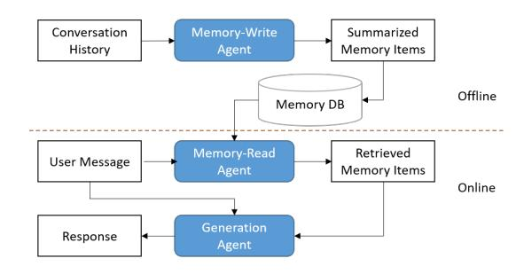
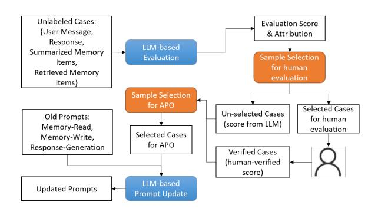
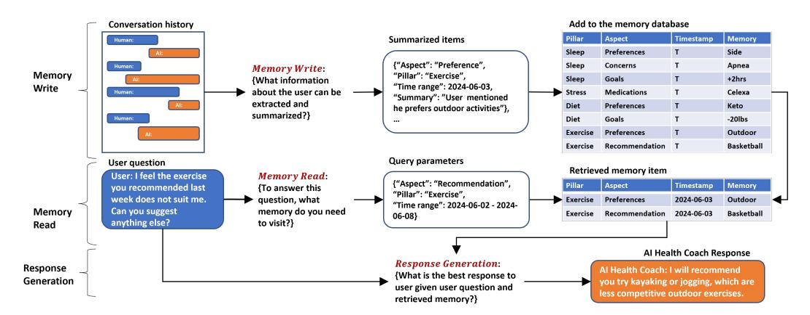
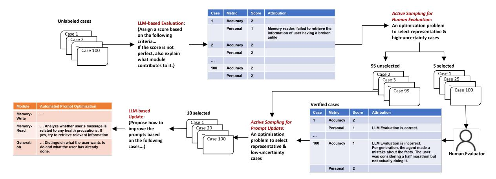

# Data-Efficient Automatic Prompt Optimization for Memory-Enhanced Conversational Agents

#### Ervine Zheng<sup>1</sup> , Yikuan Li<sup>2</sup> , Geoffrey Jay Tso<sup>1</sup> , Jilong Kuang<sup>1</sup>

<sup>1</sup>Samsung, <sup>2</sup>George Mason University

Correspondence: ervine.zheng@samsung.com

#### Abstract

Automatic prompt optimization (APO) uses algorithms to automatically refine prompts for LLMs, effectively reducing human effort in prompt engineering. However, applying APO to memory-enhanced conversational agents presents unique challenges. These agents leverage memory to retain information from historical interactions with users and provide contextaware and personalized responses. Optimizing prompts for these agents is challenging due to their complex, interconnected modules that include memory writing, reading, and response generation. This paper introduces a data-efficient framework for APO in these agents. Our approach leverages LLMs to holistically optimize the prompts of all agents. We also introduce an automated evaluation module that not only provides a quality score for responses but also performs error attribution, pinpointing failures within the specific modules. More importantly, to ensure the evaluation module aligns with human judgment, we develop a data-efficient active sampling algorithm with convex optimization to select the most informative samples for human feedback and prompt improvement. We conducted experiments on two health-related conversation datasets to demonstrate the effectiveness of the proposed framework.

#### 1 Introduction

Large Language Model-powered conversational agents are widely deployed in real-world applications. They are typically configured via natural language instructions, or prompts. The quality of the LLMs' output often depends on the prompt's specific structure and phrasing. This leads to the emergence of prompt engineering, a sophisticated process of designing prompts that elicit optimal and intended responses. However, manual prompt engineering is time-consuming and relies heavily on human expertise and extensive trial-and-error.

<span id="page-0-0"></span>

Figure 1: Example Workflow of Memory-Enhanced Conversational Agents

<span id="page-0-1"></span>

Figure 2: Proposed Automatic Prompt Optimization for Memory-Enhanced Conversational Agents

The optimal prompt for a given task is often nonobvious, and subtle changes in wording can lead to drastically different outcomes, making it a challenging and resource-intensive endeavor.

To overcome the limitations of manual design, practitioners have shifted towards automatic prompt optimization (APO). APO leverages computational methods to systematically optimize prompts, treating the prompt itself as a parameter to be optimized. By using various techniques, including discrete search algorithms, gradient-based optimization, and even LLMs themselves to generate and refine prompts, APO can explore a large search space of potential candidates more efficiently than humans [\(Ramnath et al.,](#page-7-0) [2025\)](#page-7-0).

While APO has shown promise for optimizing

single-turn interactions, its application to memoryenhanced conversational agents presents unique and significant challenges. Those agents usually operate through an intricate mechanism: they store historical interaction with the environment in a memory database, process this stored data for future use, and then leverage it for subsequent actions [\(Zhang et al.,](#page-8-0) [2024\)](#page-8-0). For example, a memoryenhanced chatbot can remember details from historical conversations to provide users with more personalized responses in the future. An example workflow of such chatbots is summarized in Fig. [1.](#page-0-0) This memory-enhanced architecture inherently complicates prompt engineering, as it moves beyond a single LLM call for response generation. Instead, it involves a sequence of LLM inferences, each governed by its own prompt, for tasks such as writing salient information to memory, reading relevant memories when needed, and integrating retrieved memories into the final response generation. Moreover, these memory write, read, and generation modules are deeply integrated, meaning a suboptimal final response could stem from a flaw in any one of the corresponding prompts. Consequently, this complicates the feedback process required by APO (APO needs feedback on whether a response is good or bad to optimize prompts). Obtaining reliable feedback is non-trivial, and relying on human evaluation can be expensive, particularly in specialized domains like healthcare.

This paper introduces a framework for dataefficient APO, specifically tailored for the intricate architecture of memory-enhanced conversational agents. Our approach is built upon an automatic mechanism that holistically optimizes the prompts governing three interconnected modules: memory writing, memory reading, and response generation. This framework also integrates an evaluation module that leverages the LLM to assess the quality of the final generated text. This evaluator not only assigns a quality score but also performs error attribution, pinpointing whether a suboptimal response stems from a failure in the memory writing, reading, or text generation stage. In this way, the evaluation module provides clear signals to guide the direction of optimization, and enables rapid and scalable optimization cycles.

While the LLM-based evaluator is effective, we recognize that it is not perfect, and human judgment remains the gold standard for conversational assessment. To this end, we integrate a human-inthe-loop process to calibrate the evaluation module

and ensure its alignment with the criteria from human experts. To make this calibration maximally efficient, we formulate a mathematical optimization problem that strategically selects the most representative and informative data samples for human review, a method more efficient than existing sampling mechanisms. The high-level workflow of the proposed method is summarized in Fig. [2.](#page-0-1)

In summary, the contributions are:

- A holistic framework for the automatic prompt optimization of memory-writing, memoryreading, and response generation, with an LLMpowered evaluation module with automatic error attribution;
- A data-efficient active sampling algorithm for human evaluation and sample selection for prompt optimization, with mathematical guarantee of a tractable solution;
- To our knowledge, this work is the first to explore the algorithm for APO for memory-enhanced conversational agents.

A real-world application of the proposed algorithm is described in Figs [3](#page-2-0) and [4.](#page-5-0) The experiment evaluation is conducted with health-related datasets. However, the method itself is algorithmically general and not intrinsically limited to health. Its underlying principles are designed to be domain-agnostic and can be potentially applied to other areas.

# 2 Related Work

# Memory Mechanism in Conversational Agent.

Memory mechanisms empower LLM-based conversational agents by allowing them to maintain contextual continuity and improve interaction quality [\(Zhang et al.,](#page-8-0) [2024\)](#page-8-0). For example, the Memory-Bank framework[\(Zhong et al.,](#page-8-1) [2024\)](#page-8-1) equips LLMs with long-term memory capabilities, enabling them to adapt to user personalities and retain relevant information over extended interactions. [\(Wang et al.,](#page-7-1) [2023b\)](#page-7-1) designed a memory module that enables agents to remember past behaviors and evolve dynamically within their environments, inspired by human memory mechanisms from cognitive neuroscience. Additionally, [\(Wang et al.,](#page-7-2) [2023a\)](#page-7-2) developed the Self-Controlled Memory framework with an LLM-based controller to determine the timing and format of when and how to retrieve memory.

Automatic Prompt Optimization. APO can be implemented in multiple ways, such as paraphrasing to produce diverse prompt candidates [\(Prasad](#page-7-3)

<span id="page-2-0"></span>

Figure 3: Illustrative Example of Memory-Enhanced Conversational Agent for Health Coaching

[et al.,](#page-7-3) [2022\)](#page-7-3). Recent works have used LLMs for generating and assessing prompts. For example, Automatic Prompt Engineering [\(Zhou et al.,](#page-8-2) [2022\)](#page-8-2) introduced an iterative prompt creation process informed by LLM feedback. [\(He et al.,](#page-7-4) [2024\)](#page-7-4) proposed Error-reflection methods to refine prompts and examine erroneous predictions. Additional techniques have incorporated past prompt performance data [\(Yang et al.,](#page-8-3) [2023\)](#page-8-3), expert-guided planning [\(Wang et al.,](#page-7-5) [2023c\)](#page-7-5), and heuristic-driven prompt selection [\(Wen et al.,](#page-7-6) [2025;](#page-7-6) [Cui et al.,](#page-7-7) [2025\)](#page-7-7). [\(Chen et al.,](#page-7-8) [2024\)](#page-7-8) proposes heuristic-based sampling to prioritize promising prompts based on human feedback. It should be noted that most existing approaches heavily rely on extensive labeling, posing challenges for scenarios with limited budgets. To achieve data efficiency, active learning is a candidate solution that leverages machine learning algorithms to select the most informative data points for annotation.

Active Learning. The core principle of active learning involves an iterative cycle: the model is trained on a small set of labeled examples, it then identifies and requests labels for the most beneficial unlabeled data points, and the newly labeled data is incorporated into the training set for the next iteration. This human-in-the-loop approach is fundamental, as the algorithm relies on external input to create the "ground-truth" labels necessary for learning. Common approaches of active learning usually prioritize samples based on uncertainty, diversity, or representativeness [\(Ren et al.,](#page-7-9) [2021\)](#page-7-9). The application of active learning in NLP has been explored for tasks like text classification, named entity recognition, and parsing [\(Zhang et al.,](#page-8-4) [2022\)](#page-8-4). Recently, research has begun to bridge active learning with prompt optimization for LLMs.

For instance, Active-Prompt selectively annotates uncertain questions to enhance chain-of-thought reasoning [\(Diao et al.,](#page-7-10) [2023\)](#page-7-10). Another line of work employs AL to refine LLM-as-a-Judge systems in label-scarce environments by iteratively selecting and scoring data subsets [\(Zhen et al.,](#page-8-5) [2025\)](#page-8-5). Our work contributes to this area by proposing a framework that integrates an active learning algorithm for APO in memory-enhanced agents.

# 3 Preliminary

The common workflow of memory-enhanced conversational agents may be summarized into 3 operations: 1) Memory Writing: Extracting information from historical conversations and saving it to a memory database;

$$m_{\text{write}} = f_{\text{write}}(x_{\text{history}})$$
 (1)

where f denotes an LLM call. Ideally, mwrite should be in compact form so that it only consumes limited memory storage.

2) Memory Reading: Retrieving relevant memories from the database to help form a response.

$$m_{\text{read}} = f_{\text{read}}(\{m_{\text{write}}\}, x_{\text{user}})$$
 (2)

where xuser denotes user message, mread denotes the retrieved memory relevant to user message.

3) Response Generation: Using the retrieved memories to generate a context-aware response.

$$y = f_{\text{gen}}(m_{\text{read}}, x_{\text{user}}) \tag{3}$$

We also summarize an example application of conversational health coaching in Fig. [3.](#page-2-0)

# 4 Methodology

We first describe how APO can be applied to memory-enhanced agents, and then introduce the data-efficient APO approach.

Conventional APO can be described as

$$z^{\text{new}} = f_{\text{APO}}(\{(x_{\text{user}}, y, s)_i\}, z_{\text{old}})$$
 (4)

where  $z^{\rm old}$  and  $z^{\rm new}$  are the old prompt and the updated prompt, respectively. APO uses LLMs to suggest improvements for prompts by analyzing a set of data samples  $\{(x_{\rm user},y,s)_i\}$  that includes user messages, responses, and the corresponding feedback. Feedback s can be evaluation scores from humans or LLMs. However, memory-enhanced agents are more complex. They rely on a series of interconnected modules. To apply APO, we need to update multiple agents Z, including memory read, memory write, and generation:

<span id="page-3-0"></span>
$$Z^{\text{new}} = f_{\text{APO}}(\{(x_{\text{user}}, x_{\text{history}}, m_{\text{write}}, m_{\text{read}}, y, s, a)_i\}, Z^{\text{old}})$$
(5)

where  $Z = \{z_{\rm read}, z_{\rm write}, z_{\rm generation}\}$ . a denotes optional error attribution for a non-perfect score, and will be discussed later.

We identify two challenges of implementing Eq.5: 1) Getting useful feedback in an efficient way (Section 4.1-4.2). 2) Selecting representative data samples for prompt optimization (Section 4.3).

#### <span id="page-3-1"></span>4.1 Evauation Module with Error Attribution

Human evaluation is reliable but can be expensive, especially when evaluation requires domain knowledge. In contrast, LLM-based evaluation is cheaper but its quality may not align with human experts. Therefore, we propose a hybrid approach where human and LLM evaluators collaborate. Specifically, we designed an LLM-based evaluator that evaluates response y by assigning a score s. If s is low, the evaluator also outputs attribution a specifying which specific module is responsible for it.

$$a, s = f_{\text{eval}}(y, x_{\text{user}}, x_{\text{history}}, m_{\text{write}}, m_{\text{read}}, Z^{\text{old}})$$
(6)

A poor response can stem from several issues: The system might fail to 1) store accurate or relevant information in its memory, 2) retrieve the correct memory for a user's query, or 3) properly use the memory to generate the final response. They are identified by a.

Intuitively, the error attribution contributes to the APO process in two ways: 1) The specific error attribution and the corresponding explanation are used in the APO process. This provides the LLM with clear context on why a response failed, allowing it to generate more effective and targeted improvements to the prompts. 2) We use an active sampling algorithm to select a diverse set of examples for the APO process. This algorithm ensures that the chosen examples include errors attributed to all three modules, preventing a bias towards any single module.

#### <span id="page-3-2"></span>4.2 Subset Selection for Human Evaluation

LLM-based evaluators can make mistakes and are not always aligned with humans, so human evaluation remains necessary. Since human evaluation is expensive, we sample a subset of cases. These samples are scored by human evaluators, and the scores are also used as feedback for APO.

Mathematically, given an unlabeled set  $D_{\text{unlabeled}}$  with N samples, we aim to select an optimal subset  $D_{\text{opt}} \subseteq D_{\text{unlabeled}}$  of size k for human evaluation. Sample selection is presented as a weight vector  $\mathbf{w} \in \mathbb{R}^N$ , where each element  $w_x \in [0,1]$  indicates whether sample x is selected or not (0 for unselected, 1 for selected).  $w_x$  is relaxed to a continuous number instead of a discrete number for optimization, which will be discussed later.

Intuitively, the selected samples should be 1) **representative** of the whole dataset, and 2) their corresponding scores assigned by LLM evaluator should be **uncertain**, so that the human evaluator can contribute by providing reliable scores for APO. For each sample  $x \in D_{\text{unlabeled}}$ , **uncertainty**  $u_x$  can be captured by sampling the evaluation output with a high temperature. Practically, we set temperature for evaluation to 1 and the top-p parameter to 0.5, but other settings are also applicable. We call LLM evaluator multiple times and calculate the variance of the output scores. A high variance indicates that LLM evaluator is uncertain about this case, and adding human validation will help.

To ensure selected samples **representative**, their distribution should mirror that of the entire dataset. We can model these distributions using probability vectors. For instance, we may consider topic distribution of user messages (e.g., exercise, sleep, or diet), and create a vector representing the percentage of messages for each topic. We use  $p_{c_d}$  to denote the percentage of user messages that talk about a specific topic  $c_d$ , and d denotes the dimension "topic". We use Kullback-Leibler (KL) divergence to quantify representativeness. KL divergence is a standard metric measuring the difference between two probability distributions (Bishop and Nasrabadi, 2006), which in our case are the distributions of the sampled subset and the entire dataset.

Formally, the representative score is:

$$KL(P||Q) = \sum_{d} \sum_{c_d} p_{c_d} \log \frac{p_{c_d}}{q_{c_d}},$$

$$p_{c_d} = \frac{\sum_{x \in D_{\text{unlabeled}}, C_d(x) = c_d} w_x}{\sum_{x' \in D_{\text{unlabeled}}} w_{x'}}$$
(7)

where pc<sup>d</sup> represents the proportion of selected samples belonging to category cd. qc<sup>d</sup> is global distribution represented by a constant probability vector, and it can be estimated by developers or based on the distribution of data from user studies. A low KL-divergence indicates the sampled distribution is close to the actual distribution. Aside from "topic", "error attribution" can be another dimension, to ensure that the selected samples for APO contain a balanced distribution of errors originating from memory writing, memory reading, and response generation.

Finally, the optimization problem for subset selection can be defined as:

<span id="page-4-1"></span>
$$\max_{\mathbf{w}} \frac{1}{|D_{\text{unlabeled}}|} \sum_{x \in D_{\text{unlabeled}}} w_x u_x$$

$$-\lambda_1 K L(P||Q) - \lambda_2 ||\mathbf{w}||_1$$
s.t. 
$$\sum_{x \in D_{\text{unlabeled}}} w_x \le k$$

$$0 \le w_x \le 1, \quad \forall x$$

$$(8)$$

The objectiv[e i](#page-4-1)n Eq. 8 is to select a batch of samples that maximizes the sum of uncertainty and representativeness. The constraint ensures that total selected samples are within budget k to control the cost. Eq. 8 can be solved with convex optimization: the objective combines the linear term, the KL-divergence term, and L<sup>1</sup> norm, with box constraints. Therefore, it is guaranteed to have a globally optimal solution.

Ideally, w<sup>x</sup> should strictly equal 0 or 1 to enforce binary selection of data samples. However, due to computational complexity, we relax w<sup>x</sup> to [0, 1], and include an L<sup>1</sup> norm in the optimization function to encourage the sparsity of wx. After solving the optimization problem, we select k data samples with highest w<sup>x</sup> [to build the final sub](#page-7-12)set of samples [for](#page-9-0) human evaluation.

<span id="page-4-0"></span>Solving the optimization problem can be implemented with existing Python libraries, e.g., cvxpy library (Diamond and Boyd, 2016). In Appendix 7.3, we provide illustrative pseudo code for solving the convex optimization problem for efficient subset selection.

# 4.3 Subset Selection for APO

For the second challenge, APO relies on a curated set of example cases that allow LLMs to analyze the weaknesses of existing prompts. With a large dataset, however, it is impractical to use every single case for APO, because it would be computationally expensive and could overwhelm the LLM with low-quality or non-informative examples.

Therefore, we propose to select representative examples reflecting the overall data distribution. If selected examples are not representative, the newly optimized prompt may overfit to these specific cases and fail to perform well on more general cases. Therefore, we select representative examples that 1) span different topics and 2) have error attribution a that covers all agents (memory writing, reading, and response generation). In addition, the selecte[d e](#page-4-1)xamples should have evaluation score with low uncertainty, ensuring that reliable evaluation scores are used as feedback for APO.

To accomplish this, we use subset selection similar to Eq.8. However, as discussed above, we prioritize selecting low-uncertainty examples. The [unc](#page-3-2)ertainty score is determined as follows: If a sample is labeled by a human, its uncertainty is 0; For all other cases, the uncertainty score is estimated by LLM evaluator as discussed in Section 4.2. The objective function is

$$\min_{\mathbf{w}} \frac{1}{|D_{\text{scored}}|} \sum_{x \in D_{\text{scored}}} w_x u_x + \lambda_1 K L(P||Q) + \lambda_2 ||\mathbf{w}||_1$$
(9)

with similar constraints as discussed before. We summarize an example application of APO for conversational agents in health coaching in Fig. [4.](#page-7-13)

#### [5 Experi](#page-7-13)ments

Datasets We conduct the experiments on two health-related datasets: 1) HealthBench (Arora et al., 2025), a public dataset of health-related conversations. We treat the conversation log from this dataset as conversation history, a[nd au](#page-9-1)gment it with simulated user message that requires memory of the conversation history to generate desirable responses. More details about the augmentation process are provided in Appendix 7.5. 2) A Proprietary HealthCoaching dataset. This dataset was collected during the development of a memory-enhanced conversational agent designed to provide personalized health coaching. By leveraging data from wearable and mobile devices, the agent generates

<span id="page-5-0"></span>

Figure 4: Illustrative Example of APO for Memory-Enhanced Conversational Agent for Health Coaching

tailored, actionable health insights and recommendations to empower users to achieve better health outcomes. This is a dataset composed of user health data and conversations from user trials. During the user trial, participants installed the conversational agent app on their smartphones and connected their phones with their smartwatches. Participants were instructed to ask health-related questions. The user trial lasted one month, and we have collected 500 cases. Each case in the data set includes the following key components: User Health Data (various digital biomarkers collected from smartwatches, such as step count, heart rate, skin temperature, and sleep duration); User Message and Response; Conversation History (The interaction between the user and the conversational agent spanned a month. For any given day, all previous conversations are considered the conversation history).

Experiment Settings The experiment is structured as follows: Begin with initial prompts for all agents; Generate and evaluate responses for the entire training set; Apply a sampling strategy to select samples for human verific[ation; Select rep](#page-7-14)[resent](#page-7-14)ative samples for [APO; Run APO to update](#page-7-15) the prompts; Evaluate the performance of initial vs. optimized prompts on a held-out test set. We experiment with Ge[mini-2.5-pro \(Coma](#page-7-16)nici et al., 2025) and Llama3-70b (Grattafiori et al., 2024). The quality of generated responses is assessed by both an LLM-based evaluator and a team of human experts. Following (Packer et al., 2023), we consider two metrics: Consistency and P[erson](#page-8-6)alization. The detailed evaluation criteria were refined in collaboration with a panel of 8 professional health coaches. The range of score is 0-2. More details of the criteria are provided in Appendix 7.2.

The APO process begins with a set of initial

prompts for all agents, which serve only as a starting point for the optimization algorithm. While these initial prompts may not be perfect, they are automatically refined by the LLM. The hyperparameters are configured to align with the requirements of the APO process. Since APO does not prefer diverse output with randomness, the temperature is set to T=0 and the top-p is set to close to 0. This forces the model to select the most probable token at each step. The MaxToken parameter is set to a high value to prevent premature truncation. RepetitionPenalty=0 is used because the APO process does not require diverse responses.

We design e[xperiments to address th](#page-7-17)ree research questions. RQ.1 *Whet[her the proposed subse](#page-7-18)t selection algorithm for APO is data-efficient*. We compare with established sampling baselines: random sampling (Ghojogh et al., 2020) and densitybased coreset method (Kim and Shin, 2022). A data-efficient method should optimally select samples, thereby leading to the most effective optimized prompts that demonstrate superior performance on the test set. RQ.2 *Whether the framework is robust across varying sampling budgets*. A robust sampling method should consistently maintain strong performance irrespective of varying budgets. We vary the maximum budget for human evaluation B<sup>1</sup> ∈ {5%, 10%} of the training set. We vary the number of samples to be used for the APO process B<sup>2</sup> ∈ {5%, 10%}. The rationale for these settings is grounded in practical application: B<sup>1</sup> should be small to reduce manual effort and cost. B<sup>2</sup> should remain small to ensure that the optimization process focuses only on the most representative and high-impact cases. Also, it is inefficient for B<sup>1</sup> to exceed B2, as this would mean too much humanverified data is collected but not utilized for APO.

<span id="page-6-0"></span>

|                    | Random | Coreset | Proposed |
|--------------------|--------|---------|----------|
| B1 = 5%, B2 = 5%   | 1.67   | 1.72    | 1.85     |
| B1 = 5%, B2 = 10%  | 1.71   | 1.74    | 1.89     |
| B1 = 10%, B2 = 10% | 1.73   | 1.78    | 1.93     |

Table 1: Evaluation of Personalization Score on Health-Coaching dataset

<span id="page-6-3"></span>

|                    | Random | Coreset | Proposed |
|--------------------|--------|---------|----------|
| B1 = 5%, B2 = 5%   | 1.61   | 1.65    | 1.78     |
| B1 = 5%, B2 = 10%  | 1.63   | 1.68    | 1.82     |
| B1 = 10%, B2 = 10% | 1.68   | 1.73    | 1.85     |

Table 2: Evaluation of Personalization Score on Health-Coaching dataset (without error attribution)

RQ.3 *Whether error attribution contributes to optimizing memory-read, memory-write, and responsegeneration prompts*. To answer this question, we compare with an alternative approach where the total budget remains constant, but different ag[en](#page-6-0)[ts'](#page-6-1) prompts are optimized via APO without error attribution.

Results Research problem RQ.1 and RQ.2 can be answered by experiment results from Tables 1-4. It shows that the proposed method achieves superior performance compared to random and coreset sampling with the same budget. Also, its consistent outperformance across varied budget settings highlights its robustness. Furthermore, it demonstrates that the proposed active sampling strategy is data-efficient, achieving good performance with a mini[ma](#page-6-0)[l h](#page-6-2)uman eval[uat](#page-6-3)[ion](#page-6-1) budget of just 5%. (For reference, the Personalization scores with initial prompts without APO are 1.58 for HealthCoaching and 1.62 for HealthBench) RQ.3 can be answered by comparing Table 1,3 with Tables 2,4. It shows that optimizing prompts with error attribution outperforms the alternative approach. With the alternative approach, agents are optimized based only on the quality score, without access to error attribution a or the explanation of how the output of an agent would affect the downstream tasks. However, this feedback loop is inefficient. Due to the page limit, we report Personalization metric and results with the Gemini model in the main paper. The Consistency metric and additional resu[lts ar](#page-9-2)e reported in the Appendix.

Qualitatively, compared to the initial prompts, the optimized prompts exhibit several notable improvements: they incorporate few-shot examples identified by the LLM from selected cases, include more condition-specific instructions, and provide

<span id="page-6-2"></span>

|                    | Random | Coreset | Proposed |
|--------------------|--------|---------|----------|
| B1 = 5%, B2 = 5%   | 1.70   | 1.76    | 1.89     |
| B1 = 5%, B2 = 10%  | 1.74   | 1.78    | 1.91     |
| B1 = 10%, B2 = 10% | 1.76   | 1.83    | 1.94     |

Table 3: Evaluation of Personalization Score on Health-Bench dataset

<span id="page-6-1"></span>

|                    | Random | Coreset | Proposed |
|--------------------|--------|---------|----------|
| B1 = 5%, B2 = 5%   | 1.67   | 1.74    | 1.82     |
| B1 = 5%, B2 = 10%  | 1.72   | 1.75    | 1.84     |
| B1 = 10%, B2 = 10% | 1.72   | 1.78    | 1.89     |

Table 4: Evaluation of Personalization Score on Health-Bench dataset (without error attribution)

clearer guidance for handling ambiguous scenarios.

The superior performance of the proposed method, even under tight annotation budget constraints, can be attributed to the following contributions. First, the data-efficient active sampling algorithm ensures that the small human evaluation budget is allocated to the most representative and uncertain samples, providing high-quality feedback signals. Our sampling algorithm is also used to ensure that high-quality examples are selected for prompt optimization. Second, the proposed framework leverages LLM-based evaluation with error attribution that holistically considers all agents to account for inter-agent dependencies (e.g., error propagation across memory writing, reading, and response generation). It helps identify the key weakness of existing prompts. Optimizing agents based on error attribution helps find the optimal direction to improve prompts.

# 6 Conclusion

In this paper, we propose a data-efficient framework for automatic prompt optimization for memory-enhanced conversational agents, which holistically optimizes the memory write, read, and response generation agents. The key to this framework lies in an LLM-powered evaluation module that provides automated error attribution, and an efficient active sampling algorithm to prioritize a subset of important and representative data samples for human validation and subsequent optimization. The proposed framework offers a practical method to streamline the development and refinement of these complex agents. This advancement is potentially helpful for developing personalized and context-aware conversational agents in specialized domains such as health coaching.

Limitations While the proposed approach effectively optimizes prompts with limited labeled data, we would like to discuss two limitations: 1) The approach relies on LLM-powered agents for automatic evaluation and error attribution. This introduces a dependency, as the optimization process is contingent on the reliability of the evaluator LLM itself. Therefore, it is recommended to use mature LLMs whose performance has been widely verified. 2) While the paper suggests applicability in high-stakes domains like healthcare, it is highly recommended to test the robustness and safety of optimized prompts before using them in real applications.

# References

- <span id="page-7-13"></span>Rahul K Arora, Jason Wei, Rebecca Soskin Hicks, Preston Bowman, Joaquin Quinonero-Candela, Foivos Tsimpourlas, Michael Sharman, Meghan Shah, Andrea Vallone, Alex Beutel, and 1 others. 2025. Healthbench: Evaluating large language models towards improved human health. *arXiv preprint arXiv:2505.08775*.
- <span id="page-7-11"></span>Christopher M Bishop and Nasser M Nasrabadi. 2006. *Pattern recognition and machine learning*, volume 4. Springer.
- <span id="page-7-8"></span>Yongchao Chen, Jacob Arkin, Yilun Hao, Yang Zhang, Nicholas Roy, and Chuchu Fan. 2024. Prompt optimization in multi-step tasks (promst): Integrating human feedback and heuristic-based sampling. *arXiv preprint arXiv:2402.08702*.
- <span id="page-7-14"></span>Gheorghe Comanici, Eric Bieber, Mike Schaekermann, Ice Pasupat, Noveen Sachdeva, Inderjit Dhillon, Marcel Blistein, Ori Ram, Dan Zhang, Evan Rosen, and 1 others. 2025. Gemini 2.5: Pushing the frontier with advanced reasoning, multimodality, long context, and next generation agentic capabilities. *arXiv preprint arXiv:2507.06261*.
- <span id="page-7-7"></span>Wendi Cui, Jiaxin Zhang, Zhuohang Li, Hao Sun, Damien Lopez, Kamalika Das, Bradley A Malin, and Sricharan Kumar. 2025. Automatic prompt optimization via heuristic search: A survey. *arXiv preprint arXiv:2502.18746*.
- <span id="page-7-12"></span>Steven Diamond and Stephen Boyd. 2016. [CVXPY:](https://stanford.edu/~boyd/papers/pdf/cvxpy_paper.pdf) [A Python-embedded modeling language for convex](https://stanford.edu/~boyd/papers/pdf/cvxpy_paper.pdf) [optimization.](https://stanford.edu/~boyd/papers/pdf/cvxpy_paper.pdf) *Journal of Machine Learning Research*. To appear.
- <span id="page-7-10"></span>Shizhe Diao, Pengcheng Wang, Yong Lin, Rui Pan, Xiang Liu, and Tong Zhang. 2023. Active prompting with chain-of-thought for large language models. *arXiv preprint arXiv:2302.12246*.
- <span id="page-7-17"></span>Benyamin Ghojogh, Hadi Nekoei, Aydin Ghojogh, Fakhri Karray, and Mark Crowley. 2020. Sampling algorithms, from survey sampling to monte

- carlo methods: Tutorial and literature review. *arXiv preprint arXiv:2011.00901*.
- <span id="page-7-15"></span>Aaron Grattafiori, Abhimanyu Dubey, Abhinav Jauhri, Abhinav Pandey, Abhishek Kadian, Ahmad Al-Dahle, Aiesha Letman, Akhil Mathur, Alan Schelten, Alex Vaughan, and 1 others. 2024. The llama 3 herd of models. *arXiv preprint arXiv:2407.21783*.
- <span id="page-7-4"></span>Han He, Qianchu Liu, Lei Xu, Chaitanya Shivade, Yi Zhang, Sundararajan Srinivasan, and Katrin Kirchhoff. 2024. Crispo: Multi-aspect critique-suggestionguided automatic prompt optimization for text generation. *arXiv preprint arXiv:2410.02748*.
- <span id="page-7-18"></span>Yeachan Kim and Bonggun Shin. 2022. In defense of core-set: A density-aware core-set selection for active learning. In *Proceedings of the 28th ACM SIGKDD conference on knowledge discovery and data mining*, pages 804–812.
- <span id="page-7-16"></span>Charles Packer, Vivian Fang, Shishir G Patil, Kevin Lin, Sarah Wooders, and Joseph E Gonzalez. 2023. Memgpt: Towards llms as operating systems. *arXiv preprint arXiv:2310.08560*.
- <span id="page-7-3"></span>Archiki Prasad, Peter Hase, Xiang Zhou, and Mohit Bansal. 2022. Grips: Gradient-free, edit-based instruction search for prompting large language models. *arXiv preprint arXiv:2203.07281*.
- <span id="page-7-0"></span>Kiran Ramnath, Kang Zhou, Sheng Guan, Soumya Smruti Mishra, Xuan Qi, Zhengyuan Shen, Shuai Wang, Sangmin Woo, Sullam Jeoung, Yawei Wang, and 1 others. 2025. A systematic survey of automatic prompt optimization techniques. *arXiv preprint arXiv:2502.16923*.
- <span id="page-7-9"></span>Pengzhen Ren, Yun Xiao, Xiaojun Chang, Po-Yao Huang, Zhihui Li, Brij B Gupta, Xiaojiang Chen, and Xin Wang. 2021. A survey of deep active learning. *ACM computing surveys (CSUR)*, 54(9):1–40.
- <span id="page-7-2"></span>Bing Wang, Xinnian Liang, Jian Yang, Hui Huang, Shuangzhi Wu, Peihao Wu, Lu Lu, Zejun Ma, and Zhoujun Li. 2023a. Enhancing large language model with self-controlled memory framework. *arXiv preprint arXiv:2304.13343*.
- <span id="page-7-1"></span>Lei Wang, Jingsen Zhang, Hao Yang, Zhiyuan Chen, Jiakai Tang, Zeyu Zhang, Xu Chen, Yankai Lin, Ruihua Song, Wayne Xin Zhao, and 1 others. 2023b. User behavior simulation with large language model based agents. *arXiv preprint arXiv:2306.02552*.
- <span id="page-7-5"></span>Xinyuan Wang, Chenxi Li, Zhen Wang, Fan Bai, Haotian Luo, Jiayou Zhang, Nebojsa Jojic, Eric P Xing, and Zhiting Hu. 2023c. Promptagent: Strategic planning with language models enables expert-level prompt optimization. *arXiv preprint arXiv:2310.16427*.
- <span id="page-7-6"></span>Bosi Wen, Pei Ke, Yufei Sun, Cunxiang Wang, Xiaotao Gu, Jinfeng Zhou, Jie Tang, Hongning Wang, and Minlie Huang. 2025. Hpss: Heuristic prompting strategy search for llm evaluators. *arXiv preprint arXiv:2502.13031*.

- <span id="page-8-3"></span>Chengrun Yang, Xuezhi Wang, Yifeng Lu, Hanxiao Liu, Quoc V Le, Denny Zhou, and Xinyun Chen. 2023. Large language models as optimizers. *arXiv preprint arXiv:2309.03409*.
- <span id="page-8-0"></span>Zeyu Zhang, Xiaohe Bo, Chen Ma, Rui Li, Xu Chen, Quanyu Dai, Jieming Zhu, Zhenhua Dong, and Ji-Rong Wen. 2024. A survey on the memory mechanism of large language model based agents. *arXiv preprint arXiv:2404.13501*.
- <span id="page-8-4"></span>Zhisong Zhang, Emma Strubell, and Eduard Hovy. 2022. A survey of active learning for natural language processing. *arXiv preprint arXiv:2210.10109*.
- <span id="page-8-5"></span>Cheng Zhen, Ervine Zheng, Jilong Kuang, and Geoffrey Jay Tso. 2025. Enhancing llm-as-a-judge through active-sampling-based prompt optimization. In *Proceedings of the 63rd Annual Meeting of the Association for Computational Linguistics (Volume 6: Industry Track)*, pages 960–970.
- <span id="page-8-1"></span>Wanjun Zhong, Lianghong Guo, Qiqi Gao, He Ye, and Yanlin Wang. 2024. Memorybank: Enhancing large language models with long-term memory. In *Proceedings of the AAAI Conference on Artificial Intelligence*, volume 38, pages 19724–19731.
- <span id="page-8-2"></span>Yongchao Zhou, Andrei Ioan Muresanu, Ziwen Han, Keiran Paster, Silviu Pitis, Harris Chan, and Jimmy Ba. 2022. Large language models are human-level prompt engineers. In *The Eleventh International Conference on Learning Representations*.

## 7 Appendix

The appendix provides more details about the related applications for the proposed algorithm [\(7.1\)](#page-8-7), the evaluation criteria for experiments [\(7.2\)](#page-8-6), and pseudo code of the optimization problem [\(7.3\)](#page-9-0). We report additional experiment results [\(7.4\)](#page-9-2). We then introduce the data processing for HealthBench dataset ([7.5\)](#page-9-1) and provide example prompts (7.6).

#### <span id="page-8-7"></span>7.1 [Discu](#page-9-3)ssion of Related Application

Our proposed approach has been used in developing a memory-enhanced conversational agent designed to deliver personalized health coaching. By leveraging data from wearable devices, the agent generates tailored, actionable health insights and recommendations aimed at empowering users to achieve better health outcomes. However, scaling such a system poses challenges, primarily due to the dependency on feedback from health coaching experts (i.e., the agent needs to align with best practices of health coaching). To address these constraints, we investigate automated prompt optimization techniques. Building on our proposed methodology, we developed and deployed a selfimproving system that refines prompts of all agents through active sampling of the most informative examples. This reduces the extensive human evaluation, significantly lowering associated costs. Notably, this method is applicable not only during initial development but also for ongoing performance monitoring and iterative refinement after product launch.

#### <span id="page-8-6"></span>7.2 Evaluation Criteria

The following evaluation criteria have been refined and verified by health coaching experts, and used for human evaluation.

- 1) Consistency: The response must strictly use or reason upon correct and relevant user context. This context encompasses quantitative health data (e.g., activity levels, biometrics) and qualitative information from the user's profile and the agent's memory of past interactions. Responses that hallucinate or misrepresent user data should be penalized. You should refer to the best practice of health coaching when you evaluate the response.
- 2) Personalization: The response must have an engaging message framing that demonstrates it "knows" the user. This is achieved by referencing past conversational turns and leveraging information from the memory database to create a sense of

continuity and tailored understanding, moving beyond generic, context-unaware replies. You should refer to the best practice of health coaching when you evaluate the response.

#### <span id="page-9-0"></span>7.3 Solving the Optimization Problem

We demonstrate the pseudo code for solving the optimization problem of subset selection.

```
# Required:
top_k: number of selected samples
N: total number of samples
q_probs: probability vector of q
num_cat: number of categories (e.g.,
   topics)
I_cat: indicator matrix of samples'
   category assignments
unc_scores: uncertainty score vector of
    samples
lambda_1: weight of KL term
lambda_2: weight of L1 norm
# Define vector of sample selection
w = cvxpy. Variable (N, nonneg=True)
# Define optimization constraints
constraints = [
  cvxpy.sum(w) \le top_k,
  w <= 1
  1
# Define p and q vectors for KL
    divergence
p = I_cat @ w / num_cat
q = cvxpy. Parameter (num_cat,
    value=q_probs, nonneg=True)
# Define optimization problem
term1 = 1/N * w @ unc_scores
term2 = - lambda_1 *
    cvxpy.sum(cvxpy.kl\_div(p, q))
term3 = - lambda_2 * cvxpy.norm(w, 1)
objective = cvxpy. Maximize(term1 + term2
   + term3)
# Solve optimization problem
problem = cvxpy.Problem(objective,
    constraints)
problem.solve(solver=cvxpy.SCS)
# Select top-K samples ' indices
score = np.nan_to_num(w.value, nan=0.0)
top_k_indices = np. argpartition (score,
```

#### 7.4 Additional Experiment Results

<span id="page-9-2"></span> $-top_k)[-top_k:]$ 

We report additional experiment results on Consistency score with Gemini-2.5 in Tables 5-8.

<span id="page-9-1"></span>Experiment results with Llama-3 are similar to Gemini-2.5, and we report those results in Tables 9-12.

|                          | Random | Coreset | Proposed |
|--------------------------|--------|---------|----------|
| $B_1 = 5\%, B_2 = 5\%$   | 1.78   | 1.82    | 1.89     |
| $B_1 = 5\%, B_2 = 10\%$  | 1.80   | 1.84    | 1.94     |
| $B_1 = 10\%, B_2 = 10\%$ | 1.81   | 1.87    | 1.95     |

Table 5: Evaluation of Consistency Score on Health-Coaching dataset

|                                                   | Random       | Coreset      | Proposed     |
|---------------------------------------------------|--------------|--------------|--------------|
| $B_1 = 5\%, B_2 = 5\%$<br>$B_1 = 5\%, B_2 = 10\%$ | 1.74<br>1.76 | 1.79<br>1.84 | 1.83<br>1.85 |
| $B_1 = 10\%, B_2 = 10\%$                          | 1.77         | 1.84         | 1.90         |

Table 6: Evaluation of Consistency Score on Health-Coaching dataset (without error attribution)

#### 7.5 Data Processing for HealthBench Dataset

The HealthBench dataset comprises multi-round conversations centered on realistic healthcare scenarios, originally designed to evaluate large language model performance in health-related dialogues. However, its initial application did not fully integrate with conversational agents possessing memory capabilities. To adapt this dataset for our customized scenario, we first treat each conversation as a historical dialogue. This history can be processed by the memory-write agent, which summarizes it into structured memory data. We then simulate user interactions by generating healthrelated questions that specifically necessitate the assistant's access to this newly created memory to formulate a desirable response. After that, we apply the standard experimental process: the memoryenhanced agent generates a response, which is then evaluated for quality using a combination of LLMbased assessments and human expert review.

# <span id="page-9-3"></span>7.6 Example Prompts Example Prompt for LLM-Based Evaluation

You have expertise in reviewing, editing, and criticizing written insights and recommendations by health

coaches aimed at users. You will evaluate the quality of the message written by the health coach.

You will be given the following information:

USER\_MESSAGE contains the most recent message that the user would like the coach to address and provide a response. USER\_DATA section contains personal health data about the user or their environment.

CONVERSATION\_LOG contains a history of messages that have been sent between the coach and the user in conversation. Newer messages are last in the log.

|                    | Random | Coreset | Proposed |
|--------------------|--------|---------|----------|
| B1 = 5%, B2 = 5%   | 1.76   | 1.80    | 1.90     |
| B1 = 5%, B2 = 10%  | 1.76   | 1.81    | 1.92     |
| B1 = 10%, B2 = 10% | 1.78   | 1.86    | 1.95     |

Table 7: Evaluation of Consistency Score on Health-Bench dataset

|                    | Random | Coreset | Proposed |
|--------------------|--------|---------|----------|
| B1 = 5%, B2 = 5%   | 1.66   | 1.71    | 1.82     |
| B1 = 5%, B2 = 10%  | 1.70   | 1.75    | 1.85     |
| B1 = 10%, B2 = 10% | 1.73   | 1.76    | 1.87     |

Table 8: Evaluation of Consistency Score on Health-Bench dataset (without error attribution)

MEMORY\_STORED includes an important summary of past discussions between the user and the coach, which can help make coach responses personalized and relevant to the user. MEMORY is generated by a memory-write agent that summarizes important information from CONVERSATION\_LOG.

MEMORY\_RETRIEVED is retrieved by a memory-read agent that analyze USER\_MESSAGE and determine what information from MEMORY\_STORED should be retrieved in order to respond to USER\_MESSAGE.

RESPONSE is the response from a health coach agent to USER\_MESSAGE. To respond to the user, the health coach agent needs to refer to USER\_DATA, MEMORY\_RETRIEVED as context.

<USER\_DATA>

{user\_data}

</USER\_DATA>

<CONVERSATION\_LOG>

{conversation\_log}

</CONVERSATION\_LOG>

<MEMORY\_STORED>

{memory\_stored}

</MEMORY\_STORED>

<MEMORY\_RETRIEVED>

{memory\_retrieved} </MEMORY\_RETRIEVED>

<RESPONSE>

{response}

</RESPONSE>

Below is the example output format for your output.

<EXAMPLE>

[{"score": "",

"attribution":"",

"explanation":""}

an empty string.

</EXAMPLE>

The value of "score" is the score you assign based on EVALUATION\_CRITERIA. The value of "attribution" could be one of the following: "memory-read", "memory-write", "generation". If the score is not perfect, you should explain which module contributes to it. If the score is perfect, the value should be

<span id="page-10-0"></span>

|                    | Random | Coreset | Proposed |
|--------------------|--------|---------|----------|
| B1 = 5%, B2 = 5%   | 1.64   | 1.68    | 1.74     |
| B1 = 5%, B2 = 10%  | 1.66   | 1.70    | 1.79     |
| B1 = 10%, B2 = 10% | 1.66   | 1.73    | 1.82     |

Table 9: Evaluation of Personalization Score on Health-Bench with Llama-3

|                    | Random | Coreset | Proposed |
|--------------------|--------|---------|----------|
| B1 = 5%, B2 = 5%   | 1.61   | 1.65    | 1.77     |
| B1 = 5%, B2 = 10%  | 1.64   | 1.68    | 1.82     |
| B1 = 10%, B2 = 10% | 1.65   | 1.75    | 1.84     |

Table 10: Evaluation of Personalization Score on Health-Coaching with Llama-3

The value of "explanation" is a short explanation of why you attribute the imperfect score to the corresponding module. If the score is perfect, the value should be an empty string.

# Example Prompt for APO

You have expertise in refining LLM prompts. Your task is to optimize the prompt listed in OLD\_PROMPT section. You should refer to the REFERENCE section, which contains a list of cases, which contain the inputs to LLM-empowered agents with OLD\_PROMPT, the outputs generated by OLD\_PROMPT and the corresponding evaluation scores and explanations of the outputs.

<OLD\_PROMPT>

{old\_prompt}

</OLD\_PROMPT>

<REFERENCE>

{cases}

</REFERENCE>

Your output should be the refined prompts that are expected to generate better outputs that achieve higher evaluation scores.

#### Initial Prompt for Memory Writing

Your task is to extract the information from the CONVERSATION between a user and a health coach. The user asked some questions for health advice, and the health coach responds based on the user's health profile and health knowledge.

<CONVERSATION>

{conversation}

</CONVERSATION>

Below is the example output format.

<EXAMPLE>

[{"aspect": "",

"pillar":"". "summary":"",

|                    | Random | Coreset | Proposed |
|--------------------|--------|---------|----------|
| B1 = 5%, B2 = 5%   | 1.74   | 1.80    | 1.85     |
| B1 = 5%, B2 = 10%  | 1.75   | 1.82    | 1.85     |
| B1 = 10%, B2 = 10% | 1.79   | 1.86    | 1.88     |

Table 11: Evaluation of Consistency Score on Health-Coaching with Llama-3

<span id="page-11-0"></span>

|                    | Random | Coreset | Proposed |
|--------------------|--------|---------|----------|
| B1 = 5%, B2 = 5%   | 1.69   | 1.75    | 1.83     |
| B1 = 5%, B2 = 10%  | 1.70   | 1.75    | 1.86     |
| B1 = 10%, B2 = 10% | 1.72   | 1.81    | 1.87     |

Table 12: Evaluation of Consistency Score on Health-Bench with Llama-3

"time range":"",}] </EXAMPLE>

The value of aspect could be one of the following:

"Preferences": This refers to the user's personal choices or likes when it comes to their health and wellness, "Concerns": The health-related worries or issues that the user shares with the health coach. This should not be the obstacles,

"Recommendations": The suggestions provided by the health coach based on the user's preferences, concerns, and health data,

"Goals": The health and wellness goals that the user wants to achieve,

"Medications": The prescribed medications that the user is currently taking,

"Obstacles": The user's diagnosed medical or health conditions. e.g., fracture, disabilities, food allergy, etc.

The value of pillar could be one of the following:

"sleep","stress","diet","exercise","general health"

The value of "summary" is what you can summarize from CONVERSATION.

If the information to be extracted is time-specific, set the value of "time range" in the following format: "MM-DD-YYYY - MM-DD-YYYY"

If the information to be extracted is not time-specific, set the value of "time range" to "NA".

If there is no relevant information that can be summarized from CONVERSATION, output an empty list.

#### Initial Prompt for Memory Reading

Your task is writing queries to retrieve data from a database. The database stores structured data that summarizes the historical conversation between a user and a health coach.

You will be given a new CONVERSATION,

and your task is to determine whether you should retrieve relevant information from the database to answer the last user message from CONVERSATION.

<CONVERSATION> {conversation}

</CONVERSATION>

Below is the example output format for your output.

<EXAMPLE>

[{"aspect": "",

"pillar":"",

"time range":""}]

</EXAMPLE>

Your output will be passed to a function to retrieve the data from the database {definitions\_and\_guidelines}

If there is no relevant information that should be retrieved, output an empty list.

#### Initial Prompt for Response Generation

You are a powerful conversational agent for health coaching. Your task is to generate a response to USER\_MESSAGE based on USER\_DATA and the MEMORY.

USER\_DATA contains numerical data and qualitative summaries about the user. MEMORY contains summarized information about historical conversations with the user.

GUIDELINE contains rules and guidelines you should follow when responding to USER\_MESSAGE.

<USER\_MESSAGE>

{user\_message}

</USER\_MESSAGE>

<USER\_DATA> {user\_data}

</USER\_DATA>

<MEMORY>

{memory}

</MEMORY>

<GUIDELINE>

{guideline} </GUIDELINE>