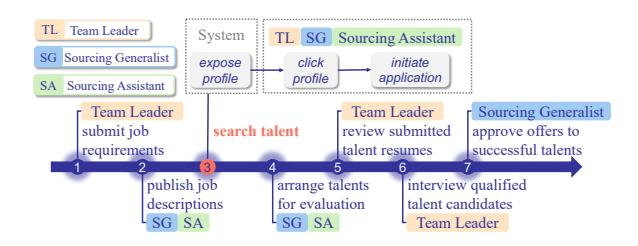
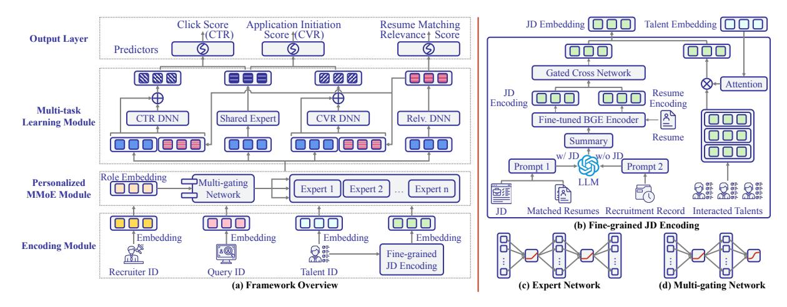
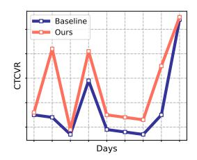
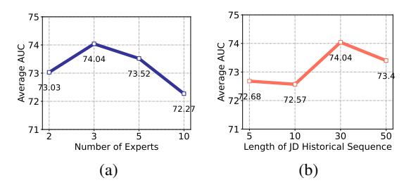
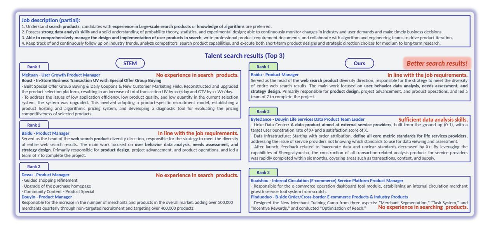
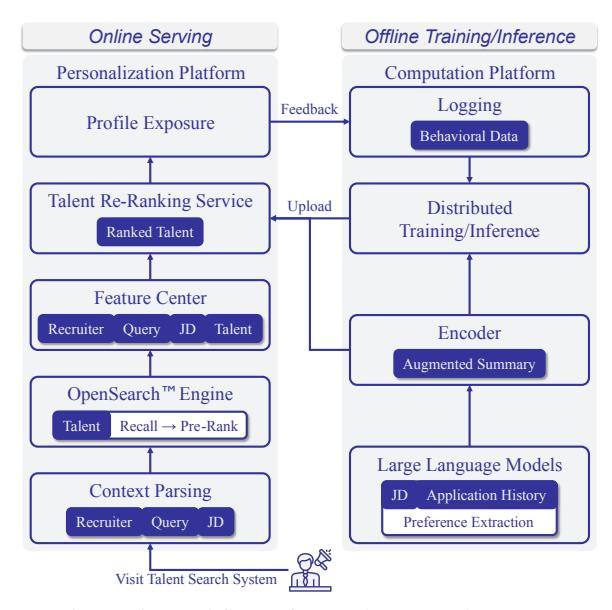

# Enhancing Talent Search Ranking with Role-Aware Expert Mixtures and LLM-based Fine-Grained Job Descriptions

Jihang Li1,[\\*](#page-0-0), Bing Xu2,∗ , Zulong Chen2,∗ , Chuanfei Xu5,† , Minping Chen1,[†](#page-0-0) , Suyu Liu2 , Ying Zhou4 , Zeyi Wen1,3 ,

1HKUST (GZ), Guangzhou, China 2Alibaba Group, Hangzhou, China 3HKUST, Hong Kong, China 4 Zhijiang Lab, Hangzhou, China 5Guangdong Laboratory of Artificial Intelligence and Digital Economy (SZ), Shenzhen, China

Correspondence: xuchuanfei@gml.ac.cn, mchen779@connect.hkust-gz.edu.cn

## Abstract

Talent search is a cornerstone of modern recruitment systems, yet existing approaches often struggle to capture nuanced job-specific preferences, model recruiter behavior at a finegrained level, and mitigate noise from subjective human judgments. We present a novel framework that enhances talent search effectiveness and delivers substantial business value through two key innovations: (i) leveraging LLMs to extract fine-grained recruitment signals from job descriptions and historical hiring data, and (ii) employing a role-aware multi-gate MoE network to capture behavioral differences across recruiter roles. To further reduce noise, we introduce a multi-task learning module that jointly optimizes click-through rate (CTR), conversion rate (CVR), and resume matching relevance. Experiments on real-world recruitment data and online A/B testing show relative AUC gains of 1.70% (CTR) and 5.97% (CVR), and a 17.29% lift in click-through conversion rate. These improvements reduce dependence on external sourcing channels, enabling an estimated annual cost saving of millions of CNY.

## 1 Introduction

The rise of online recruitment platforms has revolutionized how employers and jobseekers connect, enabling efficient matching between talents and open positions [\(Kenthapadi et al.,](#page-7-0) [2017;](#page-7-0) [Geyik et al.,](#page-7-1) [2018b\)](#page-7-1). A core component of these systems is talent search, which allows recruiters to identify qualified talents for specific job postings.

As shown in Figure [1,](#page-0-1) talent search plays a central role in the recruitment process, where recruiters interact with talent profiles by issuing queries and browsing retrieved results. This stage involves three key steps: (i) *exposure*, where talent profiles are surfaced to the recruiter; (ii) *click*, where the

Figure 1: Recruitment process of our online system.

recruiter views a specific profile; and (iii) *application initiation*, where the recruiter initiates a hiring evaluation for the candidate. These interactions generate behavioral signals such as click-through rate (CTR) and conversion rate (CVR), which are central to assessing and optimizing search effectiveness. A detailed workflow of our deployed talent search system is provided in Appendix [A.](#page-8-0)

Recent advancements in talent search have improved ranking quality through better text modeling and personalization. Those techniques include extracting skill signals from recruiter queries and resumes [\(Manad et al.,](#page-7-2) [2018\)](#page-7-2), using deep models for learning-to-rank [\(Ramanath et al.,](#page-7-3) [2018\)](#page-7-3), and applying BERT-based keyword extraction [\(Devlin](#page-7-4) [et al.,](#page-7-4) [2019;](#page-7-4) [Wang et al.,](#page-8-1) [2021\)](#page-8-1). Incorporating historical recruiter behavior and talent features has further enhanced performance [\(Geyik et al.,](#page-7-5) [2018a;](#page-7-5) [Ozcaglar et al.,](#page-7-6) [2019;](#page-7-6) [Yang et al.,](#page-8-2) [2021\)](#page-8-2).

Despite these advancements, several challenges remain. (i) *Insufficient modeling of recruitment preferences*: Existing methods often fail to accurately capture the nuanced requirements of individual job postings, limiting the relevance of retrieved talents. (ii) *Lack of role-aware personalization*: Existing methods typically treat all recruiters uniformly, ignoring role-specific behavioral patterns. This omission limits personalization and leads to mismatches between recruiter intent and retrieved talents. As shown in Table [1,](#page-1-0) sourcing assistants (SA) generate nearly 50% of page views, yet their

\* Equal Contribution

† Corresponding Authors

Table 1: Differences in page view (PV) rates, AUC, and resume evaluation pass rates across various recruiter roles. Due to confidentiality reasons, we cannot show the actual values of the pass rate of resume evaluation.

| Role | PV Rate | AUC   | Pass Rate |
|------|---------|-------|-----------|
| SA   | 49.40%  | 0.554 | 2/3P      |
| SG   | 11.66%  | 0.694 | P         |
| TL   | 38.91%  | 0.693 | P         |

AUC and resume pass rates are much lower than those of sourcing generalists (SG) and team leaders (TL). (iii) *Noisy behavioral signals*: Subjective judgments and recruiter expertise gaps introduce role-dependent noise into interaction data. Without accounting for this, models struggle to learn reliable predictors, reducing matching accuracy.

To address these challenges, we propose a novel framework that enhances talent search along three dimensions. First, we use large language models (LLMs) with chain-of-thought (CoT) prompting [\(Wei et al.,](#page-8-3) [2022\)](#page-8-3) to extract fine-grained recruitment preferences from job descriptions and historical hiring records. Second, we design a role-aware multi-gate mixture-of-experts (MMoE) network to model behavioral differences across recruiter roles and personalize talent ranking. Third, we introduce a multi-task learning module that jointly models CTR, CVR, and resume relevance to mitigate behavioral noise and improve prediction robustness.

Our main contributions are as follows:

- 1. We introduce a novel LLM-guided job representation framework that extracts fine-grained recruitment preferences by jointly analyzing job descriptions and historical hiring records. This enables capturing implicit signals beyond surface-level keywords, significantly improving job-talent alignment.
- 2. We design a role-aware MMoE architecture that models recruiter behavioral heterogeneity across different organizational roles. By leveraging role-specific gating and expert routing, our framework adapts ranking strategies to recruiter intent with high fidelity.
- 3. We validate our framework through extensive offline experiments and online A/B testing on a production-scale platform, achieving relative AUC gains of 1.70% (CTR) and 5.97% (CVR), and boosting click-through conversion

rate (CTCVR) by 17.29%. These improvements translate into an estimated cost reduction of millions of CNY annually.

## 2 Methodology

This section presents our framework to enhancing talent search via personalized modeling and preference-aware ranking, starting with the problem statement and followed by method details.

### 2.1 Problem Statement

Given a recruiter-issued search query or job description (JD), talent search can be viewed as an information retrieval task: retrieving a relevant subset of talents and ranking them by match quality. To personalize this process, we incorporate recruiterspecific information such as recruiter ID and role type to capture behavioral differences.

Our framework outputs three scores for each profile: (i) click-through rate (CTR) that measures the likelihood that an exposed profile is clicked; (ii) conversion rate (CVR) that measures the likelihood that a clicked profile leads to application initiation; and (iii) resume matching relevance. The final ranking score is computed as the product of CTR and CVR, capturing both recruiter engagement and candidate fit. This aligns with our business-to-business (B2B) platform's objectives, where CTR and CVR are key performance metrics. Therefore, we treat CTR and CVR prediction as primary tasks, and resume relevance as an auxiliary task to enhance the overall quality.

### 2.2 Method Overview

An overview of our framework architecture is shown in Figure [2,](#page-2-0) which consists of three major components: (i) an encoding module that transforms the inputs into embeddings, (ii) a personalized MMoE module that models diverse recruiter behaviors and preferences by leveraging role-specific embeddings, and (iii) a multi-task learning module that jointly predicts click score, application initiate score, and resume matching relevance score to calibrate predictions and reduce behavioral noise. To model job-specific recruitment preferences, we introduce a fine-grained JD encoding component that leverages LLMs and historical recruitment data. The outputs of all modules are integrated to produce ranking scores tailored to recruiter intent and talent suitability.

Figure 2: Overview of proposed framework.

#### 2.3 Encoding Module

We construct a vocabulary of recruiter, query, and talent IDs. As most queries are short (e.g., single keywords), we encode only the query ID rather than raw text. Embedding matrices are randomly initialized and trained end-to-end, with recruiter, query, and talent embeddings retrieved via ID lookups.

To capture nuanced recruitment preferences, we introduce a fine-grained JD encoding module (right side of Figure 2). Job postings often imply implicit preferences-e.g., a backend role may favor candidates with a computer science background. To extract such signals, we use an LLM to summarize preferences from JD text and resumes of historical matches. If the JD is unavailable, we instead synthesize a candidate profile from historical data (e.g., education and work experience). Two CoT prompts guide this process (see Appendix B). The generated summaries are encoded using a fine-tuned BGE model (Chen et al., 2024), alongside the current talent's resume. We apply a Gated Cross Network (GCN) (Wang et al., 2023) to model interactions between JD and resume embeddings:

$$c = c_0 \odot (W^{(c)} \times c_0 + b) \odot \sigma(W^{(g)} \times c_0) + c_0,$$

where  $c_0$  is the concatenation of the JD and resume embeddings produced by the BGE encoder,  $W^{(c)}$  (cross matrix) and  $W^{(g)}$  (gate matrix) are learnable weight matrices, b is a bias term, and  $\sigma(\cdot)$  is the activation function.

To incorporate recruiter behavior history, we apply multi-head attention (Vaswani, 2017) between the current talent and previously interacted ones. Using the history as Key/Value and the current embedding  $e^{(t)}$  as Query, the final JD embedding is

formed by concatenating the GCN output c with the attention result.

#### 2.4 Personalized MMoE Module

Our talent search platform serves multiple recruiter roles, including sourcing assistants (SA), sourcing generalists (SG), and team leaders (TL), each exhibiting distinct behavioral patterns. For example in Table 1, SA users account for nearly 50% of page views, yet their AUC and resume pass rates are significantly lower than those of SG and TL.

To effectively model this role-based heterogeneity, we adopt an MMoE module (Ma et al., 2018a), which enables dynamic feature routing based on recruiter role. Specifically, given an input vector x (Equation (1)) formed by concatenating the recruiter embedding  $e^{(r)}$ , query embedding  $e^{(q)}$ , candidate embedding  $e^{(t)}$ , and JD embedding  $e^{(j)}$ , the model processes x through multiple expert networks  $f_i$ . Each expert consists of a three-layer feedforward network with ReLU activations as illustrated in Figure 2c.

A role-aware gating network, as illustrated in Figure 2d, takes the recruiter role embedding as input and produces a softmax distribution  $\{g_1, g_2, \ldots, g_n\}$ , where  $g_i$  represents the weight for expert  $f_i$  and  $\sum_i g_i = 1$ . The final representation  $\hat{x}$  is computed as a weighted sum of expert outputs (Equation (2)).

$$x = [e^{(r)}; e^{(q)}; e^{(t)}; e^{(j)}]$$
 (1)

$$\hat{x} = \sum_{i=1}^{n} g_i f_i(x) \tag{2}$$

As outlined in Section 2.1, our framework predicts three outputs. To support this, we deploy three

independent gating networks, each feeding into a task-specific tower. Additionally, a fourth gating network is introduced to learn shared representations across tasks, enabling the model to capture inter-task dependencies. In total, the MMoE module maintains four gating networks tailored for both task separation and shared behavior modeling.

## 2.5 Multi-task Learning Module

In addition to modeling role-specific behaviors, we also account for noise in click and application initiation behaviors due to the variations in expertise and subjective judgment. This behavioral noise can reduce the accuracy of CTR and CVR predictions.

To address this, we adopt a multi-task learning approach to jointly learn CTR, CVR, and resume matching relevance. The first two are primary prediction tasks, while the third serves as an auxiliary task to improve overall task quality. All tasks are formulated as binary classification. Inspired by STEM (Su et al., 2024), we introduce a shared expert to capture common features and correlations between CTR and CVR tasks, whose output is denoted as  $o_s$ . Each task  $k \in \{\text{ctr, cvr, relv}\}$  also has a dedicated DNN tower  $h_k$  for learning task-specific features. To enhance task interactions, we inject the resume matching relevance output into the input of the CTR and CVR towers:

$$\begin{split} o_{\text{ctr}} &= [\hat{x}_{\text{ctr}}; o_{\text{relv}}] + h_{\text{ctr}}([\hat{x}_{\text{ctr}}; t_{\text{relv}}]), \\ o_{\text{cvr}} &= [\hat{x}_{\text{cvr}}; o_{\text{relv}}] + h_{\text{cvr}}([\hat{x}_{\text{cvr}}; t_{\text{relv}}]), \\ o_{\text{relv}} &= h_{\text{relv}}(\hat{x}_{\text{relv}}). \end{split}$$

Final predictions are computed by applying a linear projection  $l(\cdot)$  followed by softmax:

$$y_{\text{ctr}} = \text{softmax}(l([o_{\text{ctr}}; o_{\text{s}}])),$$
  

$$y_{\text{cvr}} = \text{softmax}(l([o_{\text{cvr}}; o_{\text{s}}])),$$
  

$$y_{\text{rely}} = \text{softmax}(l(o_{\text{rely}})).$$

During training, we minimize the total loss defined as a weighted sum of cross-entropy losses  $\mathcal{L} = \sum_k \lambda_k \mathcal{L}_k$ , where  $\lambda_k$  is the loss weight and  $\mathcal{L}_k$  is the loss for task k. This design allows the auxiliary task to directly inform the primary objectives while enabling robust and noise-tolerant learning.

### 3 Experiments

### 3.1 Experiment Settings

**Datasets** To the best of our knowledge, no public dataset matches the characteristics of our talent

search scenario, which involves both short keyword queries and long job descriptions. As a result, we collect data from our proprietary online recruitment system. The training set spans approximately two months of interaction logs, including search clicks and application actions. It contains around 495,000 samples from roughly 1,000 recruiters, covering 200,000 talent profiles and 500 job postings. The test set comprises about 257,000 samples collected over a subsequent three-week period.

Baselines We compare our proposed framework against both single-task and multi-task learning models commonly used in recommendation systems. GDCN (Wang et al., 2023) is a single-task model that captures high-order feature interactions using a gated mechanism to retain informative signals. For multi-task baselines, we include ESSM (Ma et al., 2018b), MMoE (Ma et al., 2018a), PLE (Tang et al., 2020), and STEM (Su et al., 2024), the current state-of-the-art in multi-task recommendation. These models are further described in Appendix C.

**Metrics** We evaluate performance on click-through rate (CTR) and conversion rate (CVR) prediction tasks using three standard metrics: AUC, mean reciprocal rank at 10 (MRR@10), and average precision (AP). For the online evaluation, we leverage the click-through conversion rate (CTCVR) metric. Definitions of CTR, CVR, and CTCVR are as follows:

$$\begin{split} CTR &= \frac{N_{\rm clicks}}{N_{\rm impressions}}, \\ CVR &= \frac{N_{\rm applications}}{N_{\rm clicks}}, \\ CTCVR &= \frac{N_{\rm applications}}{N_{\rm impressions}}, \end{split}$$

where  $N_{\rm clicks}$  denotes the number of clicked talent resumes,  $N_{\rm impressions}$  denotes the number of exposed talents, and  $N_{\rm applications}$  denotes the number of clicked resumes that lead to application initiations. Intuitively, CTR measures the likelihood that an exposed talent resume is clicked and thus reflects recruiter engagement at the profile-viewing stage. CVR captures the probability that a clicked resume leads to an application initiation, indicating how well the clicked candidates meet recruiter requirements. CTCVR is an end-to-end efficiency metric, measuring the fraction of all exposed resumes that result in applications. Higher CTCVR

|                      |        | CTR    |        | CVR    |        |        |        |
|----------------------|--------|--------|--------|--------|--------|--------|--------|
|                      | Method | AUC    | MRR@10 | AP     | AUC    | MRR@10 | AP     |
| Single-task Learning | GDCN   | 0.6456 | 0.0131 | 0.2816 | 0.6389 | 0.0155 | 0.0484 |
| Multi-task Learning  | ESMM   | 0.7067 | 0.0134 | 0.2988 | 0.7005 | 0.0163 | 0.0633 |
|                      | MMoE   | 0.7106 | 0.0130 | 0.3010 | 0.7108 | 0.0152 | 0.0644 |
|                      | PLE    | 0.6959 | 0.0132 | 0.2974 | 0.6884 | 0.0144 | 0.0624 |
|                      | STEM   | 0.7091 | 0.0132 | 0.3038 | 0.7154 | 0.0152 | 0.0613 |
|                      | Ours   | 0.7227 | 0.0136 | 0.3139 | 0.7581 | 0.0192 | 0.0680 |

signifies that recruiters are finding suitable candidates more quickly, reducing reliance on external sourcing channels. In our production system, CTR and CVR are treated as primary optimization objectives, while CTCVR serves as an aggregate business indicator for recruitment efficiency.

Other implementation details, including hyperparameters and training protocols, are provided in Appendix [D.](#page-9-0)

## 3.2 Offline Evaluation

The performance of all methods is reported in Table [2.](#page-4-0) Our proposed framework consistently outperforms both single-task and multi-task learning baselines across all metrics. In terms of AUC, it achieves absolute gains of 0.0121 (1.70% relative) on the CTR task and 0.0427 (5.97% relative) on the CVR task over the best-performing baselines (underlined in the table). For additional metrics, our framework also demonstrates strong performance. On the CVR task, it improves MRR@10 by 0.0029 (17.79% relative) and AP by 0.0036 (5.59% relative) compared to the best baseline. These results highlight the effectiveness of our approach in improving both ranking quality and predictive accuracy. Moreover, we observe that all multitask learning methods outperform the single-task baseline in most metrics, confirming the benefit of multi-task learning for jointly modeling related objectives such as CTR and CVR prediction.

### 3.3 Online A/B Test

In addition to our offline evaluations, we conducted an online A/B test to assess the real-world effectiveness of our framework. The results are shown in Figure [3.](#page-4-1) We use GDCN as the online baseline and deploy our framework on the personalized recommendation platform using Google's standard experimentation protocol. User traffic was randomly split 1:1 between the experimental group (ours) and the control group (baseline). The test ran for nine consecutive working days to ensure stability and statistical significance.

Compared to the baseline, our framework achieved a 17.29% relative improvement in click-through conversion rate (CTCVR). Importantly, the performance gain is statistically significant, with a p-value of

Figure 3: A/B test result. Values are concealed due to confidentiality.

0.01598 (< 0.05), validating the practical impact of our approach in a production environment. Furthermore, with the assistance of our framework, we yield annual savings of millions of CNY. Specifically, nearly 40% of hires already come from our internal talent database, which incurs no channel fees. By boosting conversions (CTCVR) from this source, we further reduce reliance on external channels, e.g., headhunting channels, thus saving significant external channel fees.

### 3.4 Ablation Study

Impact of Model Components To evaluate the contribution of key components in our framework, we conduct an ablation study. Results are shown in the upper part of Table [3,](#page-5-0) which reports AUC scores for the CTR and CVR tasks. We define the following model variants: (i) *w/o JD enc.* replaces our fine-grained job description encoder with a simple job ID embedding, (ii) *w/o JD enc. & MTL* further removes multi-task learning by training CTR and CVR predictors independently, and (iii) *w/o JD enc. & MTL & P-MMoE* additionally replaces our personalized MMoE module with a standard MMoE architecture. We observe that removing any of these modules leads to a noticeable drop in AUC for both CTR and CVR tasks. This confirms the importance of fine-grained job representation, multi-task learning, and personalized expert rout-

Table 3: Ablation study results (AUC score).

| Model                      | CTR    | CVR    | Avg.   |
|----------------------------|--------|--------|--------|
| Ours (full model)          | 0.7227 | 0.7581 | 0.7404 |
| w/o JD enc.                | 0.7182 | 0.7543 | 0.7363 |
| w/o JD enc. & MTL          | 0.7164 | 0.7264 | 0.7214 |
| w/o JD enc. & MTL & P-MMoE | 0.6970 | 0.7069 | 0.7020 |
| Ours (w/ LLM in JD enc.)   | 0.7227 | 0.7581 | 0.7404 |
| Ours (w/o LLM in JD enc.)  | 0.7282 | 0.7374 | 0.7328 |
| MMoE                       | 0.7106 | 0.7108 | 0.7107 |
| MMoE + our LLM in JD enc.  | 0.7114 | 0.7384 | 0.7294 |

ing in improving model performance.

**Impact of LLM-Based Recruitment Preference Summarization** We also evaluate the effectiveness of using an LLM to summarize key recruitment preferences for job descriptions. Specifically, we compare our framework with a variant that removes the LLM and instead uses simple text concatenation. Results are shown in the middle part of Table 3. Since CTR and CVR predictions are used jointly for ranking, we report the average AUC to assess overall ranking quality. The results indicate that incorporating LLM-based summaries improves model performance. To further validate this, we integrate our LLM-based job description encoder into one of the baselines (MMoE). As shown in the lower part of Table 3, this enhanced version (MMoE + LLM) yields consistent gains over the vanilla MMoE model on both tasks, demonstrating the general effectiveness of using LLMs for recruitment preference modeling.

**Impact of the Number of Experts** We further analyze how the number of experts in the personalized MMoE module affects model performance, as illustrated in Figure 4a. Since each expert is designed to capture role-specific patterns, we expect optimal performance when the number of experts aligns with the number of recruiter roles in our system (SA, SG, TL; see Table 1). Empirically, using three experts yields the best performance. Increasing the number of experts to five or ten results in decreased performance, likely due to overfitting and increased model complexity. Based on these observations, we adopt three experts in our final model, which provides both strong empirical results and a straightforward, interpretable mapping to the three recruiter roles.

**Impact of Historical Sequence Length** We examine how the length of the historical sequence used in the JD encoding module influences model performance. As shown in Figure 4b, this module

Figure 4: Impact of the number of experts in the MMoE module and the historical sequence length in the JD encoding module on the final performance. The performance is the average AUC result of the CTR prediction task and the CVR prediction task.

incorporates both historically matched resumes and previously interacted talents. We observe that a sequence length of 30 yields the best performance. Shorter sequences may fail to provide sufficient context for the LLM or the downstream model to extract meaningful features. Conversely, longer sequences (e.g., beyond 30) may introduce noise or less relevant historical data, which can negatively impact performance. These findings suggest that using a well-balanced sequence length is important for maximizing the utility of historical information in JD encoding.

#### 3.5 Case Study

To qualitatively evaluate the effectiveness of our framework, we present a case study comparing talent search results from STEM and our approach for a "Search Product Manager" position. The comparison is shown in Figure 5. The job description emphasizes expertise in large-scale search systems, data analysis, and industry trend monitoring.

Among the top-ranked candidates, the "Baidu - Product Manager" (ranked 1st by ours and 2nd by STEM) clearly matches the job requirements, showing direct experience in web search diversity, user behavior analysis, and team leadership. In contrast, STEM's 3rd-ranked candidate lacks relevant search experience. Our framework instead highlights two more contextually suitable candidates: a data product leader (Rank 2) with strong analytical skills for search optimization, and an e-commerce tools expert (Rank 3) with transferable experience in metric standardization. These results suggest our framework offers a more refined ranking by balancing domain expertise (Rank 1) with related high-value skills (Ranks 2 and 3), while STEM overlooks such nuances and ranks a less-qualified candidate in the top three.

Figure 5: Case study of candidate ranking for a "Search Product Manager" position.

## 4 Related Works

Talent search aims to identify suitable candidates based on recruiter queries. Early work, such as [Apatean et al.](#page-7-12) [\(2017\)](#page-7-12), explored traditional machine learning methods like KNN [\(Wu et al.,](#page-8-8) [2008\)](#page-8-8) and LDA [\(Blei et al.,](#page-7-13) [2003\)](#page-7-13) to classify candidate attributes such as education, programming, and language skills, enabling structured search over profiles. [Manad et al.](#page-7-2) [\(2018\)](#page-7-2) extended this by extracting skills from both queries and resumes and ranking candidates by skill proficiency.

Recent methods leverage deep learning. [Ra](#page-7-3)[manath et al.](#page-7-3) [\(2018\)](#page-7-3) applied learning-to-rank techniques using DNNs, while [Wang et al.](#page-8-1) [\(2021\)](#page-8-1) used BERT [\(Devlin et al.,](#page-7-4) [2019\)](#page-7-4) to extract competencyrelated keywords and compute weighted scores. Their work also introduced a Competence Map (CMAP) to model inter-skill relationships.

Another line of research leverages recruiter interaction data to improve talent search quality. [Ha-](#page-7-14)[Thuc et al.](#page-7-14) [\(2016,](#page-7-14) [2017\)](#page-7-15) first explored this idea using historical search logs. [Geyik et al.](#page-7-5) [\(2018a\)](#page-7-5) further incorporated real-time recruiter feedback to infer intent clusters and applied a multi-armed bandit framework for ranking. Similarly, [Ozcaglar](#page-7-6) [et al.](#page-7-6) [\(2019\)](#page-7-6) introduced a two-level ranking system that integrates structured candidate features and uses recruiter actions as supervised signals. [Yang et al.](#page-8-2) [\(2021\)](#page-8-2) proposed a cascaded architecture combining DNN and BERT, where personalized recruiter preferences are explicitly modeled in the final ranking stage.

## 5 Conclusion

We present a novel talent search framework that combines LLM-based recruitment preference modeling, a role-aware MMoE network for capturing recruiter heterogeneity, and a multi-task learning module to reduce behavioral noise. Experiments on real-world data and an online A/B test demonstrate significant relative performance gains of 1.70% and 5.97% in AUC for CTR and CVR, and a 17.29% lift in click-through conversion rate (CTCVR). These improvements translate into substantial business value, enabling an estimated annual cost saving of millions of CNY by reducing reliance on external recruiting channels. Our results highlight the practical impact of integrating LLMs, role-specific modeling, and multi-task optimization in real-world talent search systems.

## 6 Limitations

Our system currently depends on sufficient historical interaction data to model recruiter behavior and job preferences effectively. In cold-start scenarios such as new job postings or first-time recruiters, the framework's effectiveness may be limited. Additionally, although our framework supports multiple recruiter roles, it does not explicitly account for temporal dynamics in recruiter behavior or job market trends, which may evolve over time.

## Acknowledgments

This work is supported by National Key R&D Program of China under Grant No. 2024YFA1012700, and by the Guangzhou Industrial Information

and Intelligent Key Laboratory Project (No. 2024A03J0628). It is also funded by the NSFC Project (No. 62306256) and the Natural Science Foundation of Guangdong Province (No. 2025A1515010261).

## References

- 2025. OpenSearch. <https://opensearch.org>. [Accessed 04-07-2025].
- Anca Apatean, Evelyn Szakacs, and Magnolia Tilca. 2017. Machine-learning based application for staff recruiting. *Acta Technica Napocensis*, 58(4):16–21.
- David M Blei, Andrew Y Ng, and Michael I Jordan. 2003. Latent dirichlet allocation. *Journal of machine Learning research*, 3(Jan):993–1022.
- Jianlv Chen, Shitao Xiao, Peitian Zhang, Kun Luo, Defu Lian, and Zheng Liu. 2024. Bge m3-embedding: Multi-lingual, multi-functionality, multi-granularity text embeddings through self-knowledge distillation. *arXiv preprint arXiv:2402.03216*.
- Zhongxia Chen, Xiting Wang, Xing Xie, Tong Wu, Guoqing Bu, Yining Wang, and Enhong Chen. 2019. Coattentive multi-task learning for explainable recommendation. In *IJCAI*, volume 2019, pages 2137– 2143.
- Jacob Devlin, Ming-Wei Chang, Kenton Lee, and Kristina Toutanova. 2019. BERT: pre-training of deep bidirectional transformers for language understanding. In *The Annual Conference of the North American Chapter of the Association for Computational Linguistics: Human Language Technologies (NAACL-HLT)*, pages 4171–4186.
- Sahin Cem Geyik, Vijay Dialani, Meng Meng, and Ryan Smith. 2018a. In-session personalization for talent search. In *Proceedings of the 27th ACM international conference on information and knowledge management*, pages 2107–2115.
- Sahin Cem Geyik, Qi Guo, Bo Hu, Cagri Ozcaglar, Ketan Thakkar, Xianren Wu, and Krishnaram Kenthapadi. 2018b. Talent search and recommendation systems at linkedin: Practical challenges and lessons learned. In *The 41st International ACM SIGIR Conference on Research & Development in Information Retrieval*, pages 1353–1354.
- Viet Ha-Thuc, Ye Xu, Satya Pradeep Kanduri, Xianren Wu, Vijay Dialani, Yan Yan, Abhishek Gupta, and Shakti Sinha. 2016. Search by ideal candidates: Next generation of talent search at linkedin. In *Proceedings of the 25th International Conference Companion on World Wide Web*, pages 195–198.
- Viet Ha-Thuc, Yan Yan, Xianren Wu, Vijay Dialani, Abhishek Gupta, and Shakti Sinha. 2017. From queryby-keyword to query-by-example: Linkedin talent search approach. In *Proceedings of the 2017 ACM*

- *on Conference on Information and Knowledge Management*, pages 1737–1745.
- Po-Sen Huang, Xiaodong He, Jianfeng Gao, Li Deng, Alex Acero, and Larry Heck. 2013. Learning deep structured semantic models for web search using clickthrough data. In *Proceedings of the 22nd ACM international conference on Information & Knowledge Management*, pages 2333–2338.
- Krishnaram Kenthapadi, Benjamin Le, and Ganesh Venkataraman. 2017. Personalized job recommendation system at linkedin: Practical challenges and lessons learned. In *Proceedings of the eleventh ACM conference on recommender systems*, pages 346–347.
- Jiaqi Ma, Zhe Zhao, Xinyang Yi, Jilin Chen, Lichan Hong, and Ed H Chi. 2018a. Modeling task relationships in multi-task learning with multi-gate mixtureof-experts. In *Proceedings of the 24th ACM SIGKDD international conference on knowledge discovery & data mining*, pages 1930–1939.
- Xiao Ma, Liqin Zhao, Guan Huang, Zhi Wang, Zelin Hu, Xiaoqiang Zhu, and Kun Gai. 2018b. Entire space multi-task model: An effective approach for estimating post-click conversion rate. In *The 41st International ACM SIGIR Conference on Research & Development in Information Retrieval*, pages 1137– 1140.
- Otman Manad, Mehdi Bentounsi, and Patrice Darmon. 2018. Enhancing talent search by integrating and querying big hr data. In *2018 IEEE International Conference on Big Data (Big Data)*, pages 4095– 4100. IEEE.
- Cagri Ozcaglar, Sahin Geyik, Brian Schmitz, Prakhar Sharma, Alex Shelkovnykov, Yiming Ma, and Erik Buchanan. 2019. Entity personalized talent search models with tree interaction features. In *The World Wide Web Conference*, pages 3116–3122.
- Rohan Ramanath, Hakan Inan, Gungor Polatkan, Bo Hu, Qi Guo, Cagri Ozcaglar, Xianren Wu, Krishnaram Kenthapadi, and Sahin Cem Geyik. 2018. Towards deep and representation learning for talent search at linkedin. In *Proceedings of the 27th ACM international conference on information and knowledge management*, pages 2253–2261.
- Liangcai Su, Junwei Pan, Ximei Wang, Xi Xiao, Shijie Quan, Xihua Chen, and Jie Jiang. 2024. Stem: unleashing the power of embeddings for multi-task recommendation. In *Proceedings of the AAAI Conference on Artificial Intelligence*, volume 38, pages 9002–9010.
- Hongyan Tang, Junning Liu, Ming Zhao, and Xudong Gong. 2020. Progressive layered extraction (ple): A novel multi-task learning (mtl) model for personalized recommendations. In *Proceedings of the 14th ACM conference on recommender systems*, pages 269–278.

Yi Tay, Anh Tuan Luu, and Siu Cheung Hui. 2018. Multi-pointer co-attention networks for recommendation. In *Proceedings of the 24th ACM SIGKDD international conference on knowledge discovery & data mining*, pages 2309–2318.

A Vaswani. 2017. Attention is all you need. *Advances in Neural Information Processing Systems*.

Fangye Wang, Hansu Gu, Dongsheng Li, Tun Lu, Peng Zhang, and Ning Gu. 2023. Towards deeper, lighter and interpretable cross network for ctr prediction. In *Proceedings of the 32nd ACM international conference on information and knowledge management*, pages 2523–2533.

Yan Wang, Yacine Allouache, and Christian Joubert. 2021. Analysing cv corpus for finding suitable candidates using knowledge graph and bert. In *DBKDA 2021, the thirteenth international conference on advances in databases, knowledge, and data applications*.

Jason Wei, Xuezhi Wang, Dale Schuurmans, Maarten Bosma, Brian Ichter, Fei Xia, Ed H. Chi, Quoc V. Le, and Denny Zhou. 2022. Chain-of-thought prompting elicits reasoning in large language models. In *Annual Conference on Neural Information Processing Systems (NeurIPS)*.

Xindong Wu, Vipin Kumar, J Ross Quinlan, Joydeep Ghosh, Qiang Yang, Hiroshi Motoda, Geoffrey J McLachlan, Angus Ng, Bing Liu, Philip S Yu, and 1 others. 2008. Top 10 algorithms in data mining. *Knowledge and information systems*, 14:1–37.

Zimeng Yang, Song Yan, Abhimanyu Lad, Xiaowei Liu, and Weiwei Guo. 2021. Cascaded deep neural ranking models in linkedin people search. In *Proceedings of the 30th ACM International Conference on Information & Knowledge Management*, pages 4312–4320.

Zhe Zhao, Lichan Hong, Li Wei, Jilin Chen, Aniruddh Nath, Shawn Andrews, Aditee Kumthekar, Maheswaran Sathiamoorthy, Xinyang Yi, and Ed Chi. 2019. Recommending what video to watch next: a multitask ranking system. In *Proceedings of the 13th ACM conference on recommender systems*, pages 43– 51.

## A System Workflow

As illustrated in Figure [6,](#page-8-9) our talent search system consists of two main components: online serving and offline training/inference. The online serving side handles real-time recruiter queries by parsing context, retrieving candidate profiles through the OpenSearch™ engine [\(ope,](#page-7-16) [2025\)](#page-7-16), and re-ranking results using the proposed Talent Re-Ranking Service. The offline module supports training and inference, where behavioral data is logged, processed, and used to train models on a distributed

platform. Our framework enhances this pipeline by integrating LLMs for recruitment preference extraction and generating augmented summaries, which are then encoded by the proposed Encoder. These representations are uploaded to the online system for re-ranking, enabling personalized and context-aware talent recommendations.

Figure 6: Workflow of our talent search system.

## B LLM Prompting

We illustrate the prompt used for the LLM in Figure [7](#page-9-1) and Figure [8.](#page-9-2) The prompt frames the LLM as an experienced HR specialist, introduces the task context, and outlines specific requirements and constraints to guide step-by-step analysis. To ensure consistency and structure, we also include a predefined output format and example inputs. This prompt design helps reduce hallucinations and enhances the quality of the generated recruitment preference summaries.

## C Multi-task Learning Models

We review recent multi-task learning (MTL) models in recommendation systems, focusing on those built upon the widely adopted Embedding-Tower architecture [\(Huang et al.,](#page-7-17) [2013\)](#page-7-17), where inputs are embedded and passed through task-specific towers.

ESSM [\(Ma et al.,](#page-7-10) [2018b\)](#page-7-10) enhances CVR prediction by introducing auxiliary CTR and CTCVR tasks and sharing embedding parameters between CVR and CTR. [Chen et al.](#page-7-18) [\(2019\)](#page-7-18) employ hierarchical multi-pointer co-attention [\(Tay et al.,](#page-8-10) [2018\)](#page-8-10) to model task correlations, improving performance in both recommendation and explanation tasks.

You are a seasoned HR expert specializing in analyzing recruitment data and talent needs. You are now required to analyze and summarize the actual hiring preferences for the position based on its job description and historical recruitment behavior.

#### Please conduct the analysis from the following aspects:

- 1.Core skills required for the position
- 2.Industry domain preferences
- 3.Experience background tendencies
- 4 Educational background requirements
- 5. Potential unstated but behaviorally evident preferences

#### Please follow these steps for the analysis:

Step 1: Comprehensive analysis of explicit requirements in the JD text

- Necessary skill requirements
- Educational and experience requirements
- Explicit industry background requirements

#### Step 2: Analyze historical job application initiation behavior

- Preference for various attributes of resumes initiating applications
- Differences from JD requirements
- Implicit talent attribute information and preferences

#### Step 3: Analyze successful matching cases

- Typical characteristics of successful resumes
- Differences from original JD requirements
- Actual hiring tendencies

#### Constraints:

- 1.Focus on high-frequency, common characteristics, and avoid overemphasis on individual cases
- 2.Distinguish between explicit requirements and preferential tendencies
- 3.Output results should be objective, specific, and quantifiable
- 4.Please adhere strictly to the provided contextual information and do not fabricate answers

Figure 7: LLM Prompt: System Instruction

#### Please output the analysis results in the following format:

#### Core Skill Requirements:

- Essential Skills: [List of key skills separated by commas]
- Preferred Skills: [List of priority skills separated by commas]

#### Industry Experience Preferences:

- Target Industry: [Industries prioritized]
- Related Industry: [Acceptable related industry backgrounds]

#### Educational Background Requirements:

- Education Level: [Minimum education requirement]
- Preferred Majors: [Preferred academic backgrounds]

#### Experience Background Tendencies:

- Years of Experience: [Specific range of years]
- Experience Characteristics: [Description of key experience]

#### Implicit Preferences:

- Skill Inclination: [Skill preferences discovered through behavioral data]
- Background Inclination: [Background preferences discovered through behavioral data]
- Special Preferences: [Other significant preferences discovered]

Figure 8: LLM Prompt: Output

MMoE (Ma et al., 2018a), adopted in large-scale systems such as YouTube's video recommender (Zhao et al., 2019), introduces a set of shared expert networks whose outputs are routed via task-specific gating mechanisms. This design allows tasks to selectively leverage shared knowledge while preserving their unique modeling needs.

Despite their success, MTL often face challenges such as negative transfer and the seesaw effect,

where improving one task may degrade another. To address this, PLE (Tang et al., 2020) separates shared and task-specific experts and introduces progressive routing to better manage task interference and disentangle shared from private knowledge. More recently, STEM (Su et al., 2024) presents a unified embedding paradigm with an All-Forward, Task-Specific Backward gating mechanism, which strengthens task-specific representations while supporting knowledge sharing, achieving strong results across multi-task recommendation benchmarks.

## **D** Implementation Details

This section outlines the key implementation details of our experiments.

**Embedding Dimensions** The ID embeddings for recruiters, queries, and talents are all set to 32 dimensions. The query and job description text embeddings are both 1024-dimensional. The concatenated vector  $c_0$  has a dimensionality of 2048, and the hidden sizes of  $W^{(c)}$  and  $W^{(g)}$  are both 2048. For the multi-head attention module, the number of attention heads is set to 1.

**MMoE Configuration** The number of experts in the MMoE module is 3. The hidden sizes are 128, 64 and 32 for the expert networks, and 32 and 16 for the gating networks.

**Multi-task Learning Module** We use two DNN towers for task-specific modeling: (i) the first tower has three layers with hidden sizes of 512, 256, and 128, and (ii) the second tower has three layers with hidden sizes of 256, 128, and 64. All loss weights  $\lambda_1, \lambda_2, \lambda_3$  are set to 1.0.

**Training Setup** The model is trained with a batch size of 1024, learning rate of  $1 \times 10^{-5}$ , dropout rate of 0.2, and for approximately 20,000 steps.

**Baseline Configuration** For all baseline models, we perform hyperparameter tuning to ensure each achieves its optimal performance on our dataset.