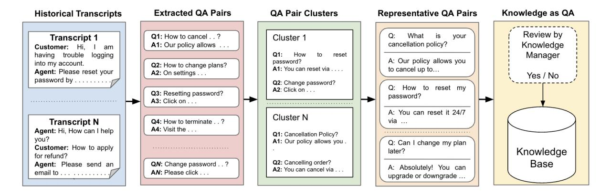
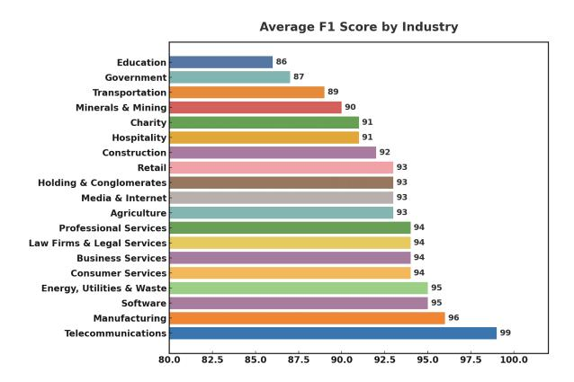
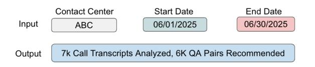
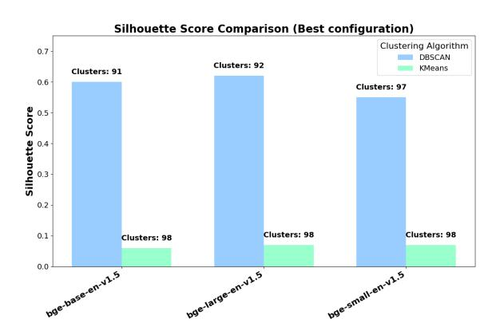

# AI Knowledge Assist: An Automated Approach for the Creation of Knowledge Bases for Conversational AI Agents

# Md Tahmid Rahman Laskar, Julien Bouvier Tremblay Xue-Yong Fu, Cheng Chen, Shashi Bhushan TN

Dialpad Inc.

{tahmid.rahman,julien.bouviertremblay,xue-yong,cchen,sbhushan}@dialpad.com

# Abstract

The utilization of conversational AI systems by leveraging Retrieval Augmented Generation (RAG) techniques to solve customer problems has been on the rise with the rapid progress of Large Language Models (LLMs). However, the absence of a company-specific dedicated knowledge base is a major barrier to the integration of conversational AI systems in contact centers. To this end, we introduce AI Knowledge Assist, a system that extracts knowledge in the form of question–answer (QA) pairs from historical customer-agent conversations to automatically build a knowledge base. Fine-tuning a lightweight LLM on internal data demonstrates state-of-the-art performance, outperforming larger closed-source LLMs. More specifically, empirical evaluation on 20 companies demonstrates that the proposed AI Knowledge Assist system that leverages the LLaMA-3.1-8B model can eliminate the cold-start gap in contact centers by achieving above 90% accuracy in extracting information-seeking question-answer pairs from conversations. This enables immediate deployment of RAG-powered chatbots.

# 1 Introduction

Generative AI can revolutionize many industries, including the contact center industry[1](#page-0-0) . With the growing demand for high-quality customer service, contact centers are constantly seeking ways to improve their processes [\(Laskar et al.,](#page-7-0) [2023b\)](#page-7-0). One way to achieve this goal is by building conversational agents to help answer customer questions [\(Ferraro et al.,](#page-6-0) [2024\)](#page-6-0). Although in real-world scenarios, contact center virtual agents often rely on a comprehensive knowledge base of question-answer (QA) pairs to handle customer inquiries, many enterprises may face a cold start problem if information (e.g., help center articles) related to customer

Figure 1: An example of knowledge extracted from transcripts in the form of QA pairs.

questions are not found in the knowledge base, or if the contact center does not have a knowledge base to begin with [\(Zheng et al.,](#page-8-0) [2023b\)](#page-8-0). This severely limits the adoption of conversational AI agents in industries. Meanwhile, building a knowledge base from scratch is time-consuming and deters the adoption of such conversational AI systems.

Nonetheless, contact centers may possess a wealth of customer service conversation logs (call transcripts and chat histories) that contain repeated information-seeking questions alongside their resolutions [\(Laskar et al.,](#page-7-0) [2023b\)](#page-7-0). Turning past interactions in such historical conversations into an FAQ-style knowledge repository can be useful to develop a knowledge base off the shelf [\(Agrawal](#page-6-1) [et al.,](#page-6-1) [2024\)](#page-6-1). This may result in more adoption of the chatbot feature, increasing agent efficiency by handling customer concerns with the help of a dedicated knowledge base, which may ultimately lead to improving customer satisfaction.

In this paper, we address the cold start problem in conversational AI agents. To this end, we present AI Knowledge Assist, a Generative AI-powered system that automatically builds knowledge bases

1 [https://www.salesforce.com/ca/service/](https://www.salesforce.com/ca/service/contact-center/ai/) [contact-center/ai/](https://www.salesforce.com/ca/service/contact-center/ai/)

Figure 2: An overview of our proposed AI Knowledge Assist. First, QA pairs are extracted from historical transcripts. Then clustering is applied to group similar QA pairs. Finally, from each cluster, representative QA pairs are constructed and then recommended for the knowledge base (a knowledge manager may review the recommended knowledge before insertion)

from past conversations. More specifically, we leverage cost-effective LLMs [\(Wan et al.,](#page-7-1) [2024\)](#page-7-1) to analyze historical customer-agent conversations to extract knowledge in the form of QA pairs (see Figure [1](#page-0-1) for an example) and save them in a knowledge base to address the cold start problem. This paper contains a detailed description of our development and evaluation methodology to deploy *AI Knowledge Assist* in real-world contact centers to address customer concerns. Extensive experiments on realworld datasets demonstrate that the proposed *AI Knowledge Assist* system can significantly boost the capabilities of Contact Center AI chatbots to better handle customer concerns.

# 2 Related Work

The recent success of LLMs in zero-shot scenarios in a wide range of tasks [\(Laskar et al.,](#page-7-2) [2023a\)](#page-7-2) has opened the avenue for new application areas in real-world industrial set[tings \(Zhang et al.,](#page-8-1) [2025;](#page-7-3) [Otani et al.,](#page-7-3) 2025). This inspires researchers and practitioners to use LLMs in solving complex tasks that require the analysis of noisy conversational transcri[pts \(Saini et al.,](#page-7-4) 2025; [Laskar et al.,](#page-8-2) [2023c,](#page-7-5) [2024b\). Mor](#page-7-5)[eover, s](#page-7-6)ince LLMs generate humanlike responses, the development of conver[sa](#page-1-0)tional AI agents is also on the rise2 .

Nonetheless, prior studies on building conversational AI agents have several limitations: (i) missing discussions on how to tackle the cold start problem when organizations do not have a dedicated knowledge base [\(Agrawal et al.,](#page-6-1) [2024;](#page-6-1) [Xu et al.,](#page-8-3) [2024\)](#page-8-3), (ii) requiring human-annotated large training datasets [\(Zheng et al.,](#page-8-0) [2023b\)](#page-8-0) to build models

for information extraction from transcripts, which is difficult to obtain in real-world industrial scenarios [\(Fu et al.,](#page-6-2) [2022\)](#page-6-2), (iii) limiting the evaluation only on chat logs [\(Zheng et al.,](#page-8-0) [2023b\)](#page-8-0), ignoring noisy voice transcripts [\(Fu et al.,](#page-6-2) [2022\)](#page-6-2).

With prior research demonstrating that LLMs are effective in analyzing noisy conversational transcripts [\(Laskar et al.,](#page-7-5) [2023c\)](#page-7-5), in this paper, we propose *AI Knowledge Assist*, a system that leverages LLMs to analyze the call transcripts in contact centers and extracts relevant knowledge from these conversational data in the form of QA pairs. The extracted QA pairs are then stored in a knowledge base to address the cold start problem. Contrary to prior work, our study focuses on addressing the cold start problem in real-world industrial scenarios, with the system being entirely developed in a cost-effective manner from noisy transcripts.

## 3 Our Proposed Approach

The *AI Knowledge Assist* system employs a threestage pipeline, as demonstrated below (also see Figure [2\)](#page-1-1).

#### 3.1 Knowledge Extraction from Transcripts

The initial step focuses on extracting potential question and answer pairs from historical call transcripts. Given a call transcript, an LLM is prompted to extract information-seeking questions from customers alongside the corresponding answers provided by the agents. Since we utilize voice transcripts, the LLM is also instructed to rewrite the question and the answer instead of mere extraction when needed, such that the QA pairs can be understood without reading the full conversation. The

2 [https://www.genesys.com/definitions/](https://www.genesys.com/definitions/what-is-conversational-ai-for-call-centers) [what-is-conversational-ai-for-call-centers](https://www.genesys.com/definitions/what-is-conversational-ai-for-call-centers)

LLM is expected to extract the QA pair as follows:

$$\{(Q_i, A_i)\}_{i=1}^{N(T)} = LLM(T; \theta)$$
 (1)

Here, model parameters are denoted by  $\theta$ , which simultaneously extracts and rewrites each QA pair. N(T) is the number of QA pairs that the model finds in the transcript T, and  $(Q_i, A_i)$  denotes the i-th QA pair. In this way, we extract QA pairs from M transcripts  $(T_1, T_2, \ldots, T_M)$ .

#### 3.2 Clustering for Deduplication

Once QA pairs are extracted from different transcripts, they may exhibit redundancy (e.g., semantically similar QA pairs may appear in multiple transcripts). If it is not managed, the knowledge base may contain many redundant QA pairs. Therefore, our second step involves clustering these QA pairs into semantically similar groups to facilitate the deduplication and filtering of closely related QA pairs. For this purpose, we first measure the pairwise cosine distance between the question embeddings of every QA pair as follows:

$$dist(q_i, q_j) = 1 - \frac{q_i \cdot q_j}{\|q_i\| \|q_j\|}$$
 (2)

Here,  $q_i$  and  $q_j$  denote the embeddings of the questions in the ith and jth QA pairs. Finally, a clustering algorithm is applied to group the QA pairs by minimizing the intra-cluster distance and maximizing the inter-cluster distance.

#### 3.3 Recommending Representative QA Pairs

In the final step, we again leverage an LLM to process each cluster of QA pairs. For each cluster, the model selects one or more representative QA pairs that best encapsulate the information in that cluster. This step serves a dual purpose: *deduplication* and *filtering*, by ensuring that highly similar questions don't lead to redundant entries; and recommendation, by proposing well-formed informative QA pairs for inclusion in the final knowledge base. The representative QA pairs in the *kth* cluster can be defined as follows:

$$\mathcal{R}_k = LLM(C_k; \theta) \tag{3}$$

Here,  $C_k$  is the k-th cluster in the  $1, \ldots, K$  clusters of QA pairs,  $LLM(\cdot;\theta)$  denotes the LLM with parameters  $\theta$ , and  $\mathcal{R}_k$  is the set of representative QA pairs selected for that cluster. These representative pairs can either be directly inserted into a knowledge base or recommended to a Knowledge Manager for human review before final incorporation into the knowledge base.

#### 4 Experimental Settings

#### 4.1 Dataset

We collected real-world data over a month (November 2024) from contact centers across 20 client companies of Dialpad3 that consist of customeragent call conversation transcripts generated using Automatic Speech Recognition systems. On average, each transcript contains 855 words. To ensure customer data privacy, the dataset is anonymized using Google Cloud Data Loss Prevention4 service. Note that in real-world settings, obtaining human-annotated data is challenging, which becomes even more difficult in the context of noisy business conversations (Laskar et al., 2022). Considering these challenges, alongside the customer's data privacy concerns, we annotate our collected dataset using the Gemini-2.5-Pro5 model by following our proposed approach: (i) QA pair extraction from transcripts using Gemini-2.5-Pro, (ii) Clustering the extracted QA pair using the DBSCAN algorithm (Schubert et al., 2017) on the question embeddings generated by the BGE-Large6 (Chen et al., 2024) model, and finally (iii) Representative QA pair selection using the Gemini-2.5-Pro model. In this way, we annotate 27500 instances: 12500 for knowledge extraction (5500 for training and 7000 for evaluation) and 15000 for the recommendation of representative OA pairs (2500 for training and 12500 for evaluation).

#### 4.2 Model Selection

Since our focus is to deploy this solution in a realworld industrial setting, we select the model to develop the system that can achieve good accuracy with faster inference speed and low cost (see Appendix A.1 for cost analysis). Therefore, by considering the accuracy and efficiency of opensource LLMs in real-world settings (Laskar et al., 2023c; Fu et al., 2024), we select the LLMs for knowledge extraction and final recommendation that has at least 7B parameters (and does not exceed 10B parameters). More specifically, we used the LLaMA-3.1-8B (Dubey et al., 2024) model due to its widespread utilization in real-world industrial applications (Khasanova et al., 2025; Fu et al., 2025). For closed-source models, the most cost-effective versions are also preferred. More

&lt;sup>3https://www.dialpad.com/

4https://cloud.google.com/security/products/

5https://deepmind.google/models/gemini/pro/

6https://hf.co/BAAI/bge-large-en-v1.5

| Model                   | Precision | Recall | F1-Score | ROUGE-1      | ROUGE-2      | ROUGE-L      | BERTScore    | # QA Pairs |
|-------------------------|-----------|--------|----------|--------------|--------------|--------------|--------------|------------|
| Knowledge-Assist-8B-SFT | 84.88     | 84.85  | 84.86    | 41.26        | 19.68        | 23.87        | 60.12        | 24K        |
| LLaMA-3.1-8B-Instruct   | 58.29     | 57.98  | 58.13    | 42.37        | 18.25        | 25.38        | 60.80        | 24K        |
| DeepSeek-R1-LLaMA-8B    | 51.43     | 48.10  | 49.71    | 39.79        | 15.45        | 22.49        | 58.58        | 21K        |
| GPT-4o-Mini             | 74.62     | 68.68  | 71.53    | 49.13        | 23.79        | 29.09        | 67.95        | 22K        |
| Gemini-2.0-Flash        | 82.29     | 60.31  | 69.60    | 47.14        | 24.19        | 28.59        | 62.81        | 18K        |
| Gemini-2.0-Flash-Lite   | 72.30     | 58.81  | 64.86    | 47.07        | 23.70        | 28.81        | 62.09        | 20K        |
| Gemini-2.5-Flash-Lite   | 76.72     | 70.88  | 73.68    | <b>54.17</b> | <b>25.42</b> | <b>28.74</b> | <b>66.86</b> | 22K        |

Table 1: Performance in the Knowledge Extraction from Transcripts step. Here, '#' denotes the number of extracted QA pairs.

| Model                   | Precision | Recall | F1-Score | # QA Pairs |
|-------------------------|-----------|--------|----------|------------|
| Knowledge-Assist-8B-SFT | 91.4      | 92.2   | 91.8     | 14K        |
| Gemini-2.5-Flash-Lite   | 81.1      | 78.1   | 79.6     | 13K        |

Table 2: End-to-End Performance based on *Final Recommendation of Representative QA Pairs*. Here, '#' denotes the number of representative QA pairs that are recommended.

specifically, we select the mini7 versions from OpenAI and the Flash8 versions from Google's Gemini series models. For clustering, we use the DBSCAN (Schubert et al., 2017) algorithm with BGE-Large (Xiao et al., 2024; Chen et al., 2024) embeddings since it demonstrates better performance than other approaches (e.g., K-Means (Lloyd, 1982)) when evaluated in our data (see Appendix A.2)

#### 4.3 Implementation

For the open-source models, we use HuggingFace (Wolf et al., 2020) for implementation, and use the respective API providers for the closed-source models. For supervised fine-tuning, we use the LLaMA-3.1-8B model. A total of 3 epochs were run, with the maximum sequence length being set to 8000 tokens: 4000 for input and 4000 for output. The learning rate was tuned between 2e-4 and 2e-6 (inclusive). For response generation, we use the default decoding parameters of each model (HuggingFace for open-source, and the official API of OpenAI and Google Gemini for closed-source), but keep the input and output token limits similar to what we use for fine-tuning. All experiments were run on a machine using 8 NVIDIA A100 GPUs.

#### 4.4 Evaluation Settings

Since our dataset is annotated by *Gemini-2.5-Pro*, we did not limit the evaluation of our models within reference-wise metrics like ROUGE (Lin, 2004) or BERTScore (Zhang et al., 2019) due to the possibility of the presence of bias in our fine-tuned models when compared with Gemini annotations.

Inspired by the success of LLMs-as-the-judge (Gu et al., 2024; Laskar et al., 2024a, 2025), we also propose the use of an LLM judge for the evaluation of LLM-generated outputs in reference-free settings. To avoid any self-enhancement bias (Zheng et al., 2023a; Ye et al., 2024) for the models trained using our *Gemini-2.5-Pro* annotated training data, we did not use Gemini series models as the judge. Instead, we use *GPT-4o* (OpenAI, 2023) as the judge due to its effectiveness in various evaluation tasks (Xiong et al., 2025). We specifically instructed the LLM judge to evaluate the following:

- (i) For the knowledge extraction step, identify the number of QA pairs extracted correctly from the given transcript by following the rules.
- (ii) For the final recommendation step, identify the number of representative QA pairs extracted correctly from the given cluster following the rules.

Based on the above information, we compute the Precision, Recall, and F1 scores. For clustering models' evaluation, we use the Silhouette (Rousseeuw, 1987) metric.

#### 4.5 Prompt Construction

To construct prompts for the knowledge extraction step and knowledge recommendation step, as well as for their evaluation using an LLM judge, we conduct extensive prompt engineering on some sampled data to select the best prompt. The selected prompts that we use throughout our experiments can be found in Appendix A.3.

#### 5 Results and Discussions

In this section, we present our experimental findings. We denote our supervised fine-tuned (SFT) model based on LLaMA-3.1-8B as **Knowledge-Assist-8B-SFT** and compare its performance with various cost-efficient open-source (LLaMA-3.1-8B-Instruct and Deepseek-Distilled-R1-LLaMA-8B) and closed-source (GPT-4o-Mini and Gemini-Flash) LLMs. The results of our experiments, as detailed below, highlight the performance of our

7https://openai.com/index/
gpt-4o-mini-advancing-cost-efficient-intelligence/
8https://deepmind.google/models/gemini/flash/

Figure 3: F1-Score per Company type for the Knowledge-Assist-8B-SFT model in terms of the *Final Recommended Representative QA Pairs*.

proposed system in the key stages of knowledge extraction and recommendation.

# 5.1 Performance on Knowledge Extraction from Transcripts

As shown in Table 1, our fine-tuned model, Knowledge-Assist-8[B-S](#page-3-2)FT, which utilizes the LLaMA-3.1-8B as the backbone, achieves the best performance in the knowledge extraction task in terms of Precision, Recall, and F1-Score, outperforming both closed-source and open-source zero-shot baselines. More specifically, our model achieved an F1-Score of 84.86%, surpassing GPT-4o-Mini (71.53%) and Gemini-2.5-Flash-Lite (73.68%). This indicates the efficacy of fine-tuning on larger LLM-annotated internal datasets for this task. In the reference-wise setting, some closedsource models like Gemini-2.5-Flash-Lite show strong performance in terms of automatic metrics (i.e., ROUGE and BERTScore). However, the references in our evaluation dataset were annotated by the most powerful model in the Gemini series, the Gemini-2.5-Pro model. On the contrary, our Knowledge-Assist-8B-SFT model maintains a competitive edge in the reference-free setting when evaluated by an independent LLM-Judge (i.e., GPT-4o). These findings encourage the use of referencefree metrics in real-world settings to mitigate biases in evaluation datasets when the datasets are annotated using LLMs.

# 5.2 Clustering Results for Deduplication

The next step in our *AI Knowledge Assist* system is clustering, where we group similar QA pairs in the same cluster based on the similarity between question-question embeddings. We select the top two models (Knowledge-Assist-8B-SFT

| Model                                                                                        | P | R                 | F1 |
|----------------------------------------------------------------------------------------------|---|-------------------|----|
| Knowledge-Assist-8B-SFT - replace backbone (LLaMA-3.1-8B with Qwen3-8B) 77.12 72.48 74.73 |   | 84.88 84.85 84.86 |    |
| - replace annotator (Gemini-2.5-Pro with GPT-4o)                                             |   | 80.45 55.89 65.95 |    |

Table 3: Impact of Model choice on the *Knowledge Extraction* step. Here, 'P' and 'R' denote 'Precision' and 'Recall', respectively.

model, and Gemini-2.5-Flash-Lite model) from the knowledge extraction step (see Table 1) to group the extracted QA pairs that are semanti[cal](#page-3-2)ly similar within the same cluster using DBSCAN (Schubert et al., 2017) with BGE-Large Embeddi[ngs \(Chen](#page-7-8) [et al.,](#page-7-8) [2024\)](#page-7-8). From our clustering experime[nts, we](#page-6-3) [find 1578 c](#page-6-3)lusters for the Gemini-2.5-Flash-Lite model and 1429 clusters for the Knowledge-Assist-8B-SFT model. All the QA pairs in each cluster are then given as input to the LLM to construct the representative QA pairs which are then recommended for insertion in the knowledge base. In the following, we present our findings for the final and most crucial step of our system, recommending representative QA pairs for the knowledge base.

# 5.3 Performance on Recommending Representative QA Pairs

In this section, we present the end-to-end performance of our *AI Knowledge Assist* system in Table 2 and find that the Knowledge-Assist-8B-SFT mo[del](#page-3-3) again demonstrates superior performance by achieving an impressive F1-Score of 91.8%, outperforming the Gemini-2.5-Flash-Lite, which scored 79.6%. The high precision and recall in the final stage are critical, as they ensure that the knowledge base is populated with accurate and relevant information, directly impacting the performance of the conversational AI agent. Overall accuracy above 90% confirms that our system can effectively bridge the cold start gap for companies. We also find that for the majority of the companies, the F1-Score is also above 90% (see Figure 3).

# 5.4 Impact of Model Choice

We conduct some experiments to investigate the importance of model selection:

- (i) Does the backbone model choice for finetuning impact the performance?
- (ii) Does the annotator model variation impact the performance?

Table 3 presents the results of our experiments. We find [tha](#page-4-0)t replacing the model from LLaMA-3.1- 8B with Qwen3-8B (Yang et al., 2025) resulted

| Model                   | Human Preference | Total Approved |
|-------------------------|------------------|----------------|
| Knowledge-Assist-8B-SFT | 25%              | 107            |
| Gemini-2.5-Flash-Lite   | 17%              | 98             |

Table 4: Results based on Human Evaluation on *Final Recommended QA Pairs*. Here, 58% of the responses in the preference test were rated as 'Tie' by Humans.

in a notable drop in a[ll metrics, with the](#page-8-9) F1-score being dropped to 74.73%, underscoring the importance of the choice of the base model. Furthermore, when we replaced our data annotator from Gemini-2.5-Pro to GPT-4o, the performance of the model trained on this data decreased significantly to a 65.95% F1-Score. This underscores the importance of model choice for data annotation.

#### 5.5 Human Evaluation

We further conduct human evaluations on the final representative QA pairs recommended by *Knowledge-Assist-8B-SFT* and *Gemini-2.5-Flash-Lite*. For human evaluation, we randomly select *100 conversations* to check the following:

- (i) Which model-recommended QA pairs are preferred by humans (*'Tie' if both are preferred*)?
- (ii) How many of the final recommended QA pairs are approved by humans (*this mimics realworld scenarios where knowledge base managers would approve the final recommended QA pairs*)?
- (iii) What is the agreement between LLM Judge and Human judgments on the final recommended pairs (*we measure the exact match between the number of representative QA pairs recommended for each transcript that are annotated as correct by both the LLM Judge and the Human Annotator*)?

This evaluation was conducted by two humans having expertise in data science and computational linguistics. Based on the results presented in Table 4, we find that in 25% cases, Knowledge-As[sist](#page-5-0)-8B-SFT recommended QA pairs are preferred. On the contrary, only in 17% of cases the Gemini-2.5-Flash-Lite recommended QA pairs are preferred. Moreover, the number of final recommended QA pairs that are accepted by the human evaluators for storing in the knowledge base is 107 for Knowledge-Assist-8B-SFT, while 98 for Gemini-2.5-Flash-Lite. Therefore, the finetuned model also demonstrates superiority based on human evaluation, similar to the LLM-judge. Furthormore, we find about 90% agreement between human-annotated judgments and GPT-4o judgments, indicating the reliability of using GPT-4o as the LLM Judge (see Appendix A.4 for some

Figure 4: A simple demo of AI Knowledge Assist.

examples of LLM Judge error case[s\).](#page-10-0) We also conducted the Wilcoxon signed-rank test (Woolson, 2007) on the number of approved Q[A pairs](#page-7-17) [for each m](#page-7-17)odel across the 100 samples. With our *knowledge-assist-8B-SFT* model generating a higher number of approved pairs compared to the baseline model, we find that this difference is statistically significant (p ≤ 0.05). These findings further provide strong evidence that our system outperforms the baseline in producing content that human evaluators consider correct and valuable for adding to a knowledge base.

## 6 Real World Deployment and Utilization

We deploy the *AI Knowledge Assist* system using Kubeflow on the Google Vertex AI Platform9 (requires 1 L4 GPU). This setup enables aut[oma](#page-5-1)tic execution of the entire system, from data processing to model inference. We show a simple demonstration of *AI Knowledge Assist* in Figure 4 where the users select the contact center and [the](#page-5-2) timeframe, and then the Kubeflow pipeline automatically analyzes all transcripts in the given timeframe to recommend QA pairs for the knowledge base.

A key feature of the deployed system should be the ability for the knowledge base to self-update. This can be achieved by continuously processing new call transcripts to extract potential new QA pairs. After applying clustering to construct representative QA pairs from the extracted QA pairs, the questions in the representative QA pairs can be compared against the existing questions in the knowledge base by measuring question-question similarity using embeddings. If the similarity score is below a predefined threshold, it indicates a significantly different new customer issue. In such cases, the newly extracted QA pair can be flagged and automatically added to the knowledge base or, for higher-quality control, routed to a Knowledge Manager for review. Moreover, the answer-answer similarity can also be measured for similar questions, and if the similarity score is below a pre-defined threshold, it may indicate that the answer in the knowledge base is obsolete (e.g., changes in the

9 <https://cloud.google.com/vertex-ai>

feature/product). This self-updating mechanism ensures that the knowledge base remains current and continuously improves over time by adapting to new customer issues and product changes.

# 7 Conclusion

In this paper, we presented *AI Knowledge Assist*, an LLM-powered system that addresses the cold start problem in conversational AI agents.With extensive experiments, we find that our proposed system demonstrates significant effectiveness in automatically creating a knowledge base from historical conversation transcripts. This allows contact centers without an existing knowledge base to still build conversational AI systems by leveraging *AI Knowledge Assist*. Moreover, we discuss how such systems can be reliably developed, evaluated, and deployed, which can lead to an improved customer experience and agent performance by allowing conversational agents to resolve customer issues more effectively and efficiently by leveraging the constructed knowledge base. In the future, we will build new benchmarks to study how to efficiently update existing knowledge bases.

## Limitations

As our models are trained on customer-agent conversations, they might not be suitable for use in other domains without further prompt engineering or fine-tuning. Since in this work, we use proprietary data for the development and evaluation of the system, the dataset is not released. However, to maximize methodological reproducibility, we have provided extensive details, including the specific open-source models being used, fine-tuning parameters, and the full verbatim prompts that we used in our experiments.

# Ethics Statement

• Compensation for Human Evaluation: Human evaluation was performed by internal scientists who have expertise in computational linguistics. Therefore, no additional compensation was required. Moreover, our in-house employees conducted the human evaluation because of the challenging nature of our proprietary datasets, which contain noisy business conversational transcripts generated by our internal ASR system.

- Data Privacy: There is a data retention policy available that allows the user to not grant permission to use their call transcripts for model development. To protect user privacy, sensitive data such as personally identifiable information (e.g., credit card number, phone number) was removed while collecting the data.
- License: We maintained the licensing requirements accordingly while using different tools (e.g., HuggingFace).

## References

Garima Agrawal, Sashank Gummuluri, and Cosimo Spera. 2024. Beyond-rag: Question identification and answer generation in real-time conversations. *arXiv preprint arXiv:2410.10136*.

Jianlyu Chen, Shitao Xiao, Peitian Zhang, Kun Luo, Defu Lian, and Zheng Liu. 2024. [M3](https://doi.org/10.18653/v1/2024.findings-acl.137) [embedding: Multi-linguality, multi-functionality,](https://doi.org/10.18653/v1/2024.findings-acl.137) [multi-granularity text embeddings through self](https://doi.org/10.18653/v1/2024.findings-acl.137)[knowledge distillation.](https://doi.org/10.18653/v1/2024.findings-acl.137) In *Findings of the Association for Computational Linguistics: ACL 2024*, pages 2318–2335, Bangkok, Thailand. Association for Computational Linguistics.

Abhimanyu Dubey, Abhinav Jauhri, Abhinav Pandey, Abhishek Kadian, Ahmad Al-Dahle, Aiesha Letman, Akhil Mathur, Alan Schelten, Amy Yang, Angela Fan, et al. 2024. The llama 3 herd of models. *arXiv preprint arXiv:2407.21783*.

Carla Ferraro, Vlad Demsar, Sean Sands, Mariluz Restrepo, and Colin Campbell. 2024. The paradoxes of generative ai-enabled customer service: A guide for managers. *Business Horizons*, 67(5):549–559.

Xue-Yong Fu, Cheng Chen, Md Tahmid Rahman Laskar, TN Shashi Bhushan, and Simon Corston-Oliver. 2022. An effective, performant named entity recognition system for noisy business telephone conversation transcripts. In *Proceedings of 8th Workshop on Noisy User-generated Text (W-NUT 2022)*, page 96.

Xue-Yong Fu, Elena Khasanova, Md Tahmid Ra[hman](https://aclanthology.org/2024.naacl-industry.33) [Laskar, Harsh Saini, and Shashi Bhushan TN. 2025.](https://aclanthology.org/2024.naacl-industry.33) [Dacp: Domain-adaptive continual pre-training of](https://aclanthology.org/2024.naacl-industry.33) [large langua](https://aclanthology.org/2024.naacl-industry.33)ge models for phone conversation summarization. *arXiv preprint arXiv:2510.05858*.

Xue-Yong Fu, Md Tahmid Rahman Laskar, Elena Khasanova, Cheng Chen, and Shashi Tn. 2024. Tiny titans: Can smaller large language models punch above their weight in the real world for meeting summarization? In *Proceedings of the 2024 Conference of the North American Chapter of the Association for*

- *Computational Linguistics: Human Language Technologies (Volume 6: Industry Track)*, pages 387–394, Mexico City, Mexico. Association for Computational Linguistics.
- Jiawei Gu, Xuhui Jiang, Zhichao Shi, Hexiang Tan, Xuehao Zhai, Chengjin Xu, Wei Li, Yinghan Shen, Shengjie Ma, Honghao Liu, et al. 2024. A survey on llm-as-a-judge. *arXiv preprint arXiv:2411.15594*.
- Elena Khasanova, Harsh Saini, Md Tahmid Rahman Laskar, Xue-Yong Fu, Cheng Chen, and Shashi Bhushan TN. 2025. Dacip-rc: Domain adaptive continual instruction pre-training via reading comprehension on business conversations. *arXiv preprint arXiv:2510.08152*.
- M[d Tahmid Rahman Laskar, Sawsan Alqahtani, M Sai](https://aclanthology.org/2023.findings-acl.29)ful Bari, Mizanur Rahman, Mohammad Abdullah Matin Khan, Haidar Khan, Israt Jahan, Amran Bhuiyan, Chee Wei Tan, Md Rizwan Parvez, et al. 2024a. A systematic survey and critical review on evaluating large language models: Challenges, limitations, and recommendations. In *Proceedings of the 2024 Conferen[ce on Empirical Methods in Natural](https://doi.org/10.18653/v1/2023.acl-industry.57) Language Processing*[, pages 13785–13816.](https://doi.org/10.18653/v1/2023.acl-industry.57)
- M[d Tahmid Rahman L](https://doi.org/10.18653/v1/2023.acl-industry.57)askar, M Saiful Bari, Mizanur Rahman, Md Amran Hossen Bhuiyan, Shafiq Joty, and Jimmy Huang. 2023a. A systematic study and comprehensive evaluation of ChatGPT on benchmark datasets. In *Findings of the Association for Computational Linguistics: ACL 2023*, pages 431–469, Toronto, Canada. Association for [Computational Lin](https://aclanthology.org/2022.dash-1.12)[guistics.](https://aclanthology.org/2022.dash-1.12)
- M[d Tahmid Rahman Laskar, Cheng Chen, Xue-yong](https://aclanthology.org/2022.dash-1.12) Fu, Mahsa Azizi, Shashi Bhushan, and Simon Corstonoliver. 2023b. AI coach assist: An automated approach for call recommendation in contact centers for agent coaching. In *Proceedings of the 61st Annual Meeting of the Association for Computational Linguistics (Volume 5: Industry Track)*[, pages 599–](https://doi.org/10.18653/v1/2023.emnlp-industry.33) [607, Toronto, Canada. Association for Computational](https://doi.org/10.18653/v1/2023.emnlp-industry.33) [Linguistics.](https://doi.org/10.18653/v1/2023.emnlp-industry.33)
- Md Tahmid Rahman Laskar, Cheng Chen, Xue-yong Fu, and Shashi Bhushan Tn. 2022. Improving named entity recognition in telephone conversations via effective active learning with human in the loop. In *Proceedings of the Fourth Workshop on Data Science with Human-in-the-Loop (Language Advances)*, pages 88–93, A[bu Dhabi, United Arab Emirates \(Hy](https://doi.org/10.18653/v1/2025.acl-long.1238)[brid\). Association for Computational Linguistics.](https://doi.org/10.18653/v1/2025.acl-long.1238)
- Md Tahmid Rahman Laskar, Xue-Yong Fu, Cheng Chen, and Shashi Bhushan TN. 2023c. Building real-world meeting summarization systems using large language models: A practical perspective. In *Proceedings of the 2023 Conference on Empirical Methods in Natural Language Processing: Industry Track*, pages 343–35[2, Singapore. Association for Computational](https://doi.org/10.18653/v1/2024.emnlp-industry.86) [Linguistics.](https://doi.org/10.18653/v1/2024.emnlp-industry.86)
- M[d Tahmid Rahma](https://doi.org/10.18653/v1/2024.emnlp-industry.86)n Laskar, Israt Jahan, Elham Dolatabadi, Chun Peng, Enamul Hoque, and Jimmy

- Huang. 2025. Improving automatic evaluation of large language models (LLMs) in biomedical relation extraction via LLMs-as-the-judge. In *Proceedings of the 63rd Annual Meeting of the Association for Computational Linguistics (Volume 1: Long Papers)*, pages 25483–25497, Vienna, Austria. Association for Computational Linguistics.
- Md Tahmid Rahman Laskar, Elena Khasanova, Xue-Yong Fu, Cheng Chen, and Shashi Bhushan Tn. 2024b. Query-OPT: Optimizing inference of large language models via multi-query instructions in meeting summarization. In *[Proceedings](http://arxiv.org/abs/2303.08774) of the 2024 Conference on Empirical Methods in Natural Language Processing: Industry Track*, pages 1140–1151, Miami, Fl[orida, US. Association for Computational Lin](https://doi.org/10.18653/v1/2025.naacl-industry.47)[guistics.](https://doi.org/10.18653/v1/2025.naacl-industry.47)
- Chin-Yew Lin. 2004. Rouge: A package for automatic evaluation of summaries. In *Text summarization branches out*, pages 74–81.
- Stuart Lloyd. 1982. Least squares quantization in pcm. *IEEE transactions on information theory*, 28(2):129– 137.
- OpenAI. 2023. Gpt-4 technical report.
- Naoki Otani, Nikita Bhutani, and Estevam Hruschka. 2025. Natural language processing for human resources: A survey. In *Proceedings of the 2025 Conference of the Nations of the Americas Chapter of the Association for Computational Linguistics: Human Language Technologies (Volume 3: Industry Track)*, pages 583–597, Albuquerque, New Mexico. Association for Computational Linguistics.
- Peter J Rousseeuw. 1987. Silhouettes: a graphical aid to the interpretation and validation of cluster analysis. *Journal of computational and applied mathematics*, 20:53–65.
- Harsh Saini, Md Tahmid Rahman Laskar, Cheng Chen, Elham Mohammadi, and David Rossouw. 2025. Llm evaluate: An industry-focused evaluation tool for large language models. In *Proceedings of the 31st International Conference on Computational Linguistics: Industry Track*, pages 286–294.
- Erich Schubert, Jörg Sander, Martin Ester, Hans Peter Kriegel, and Xiaowei Xu. 2017. Dbscan revisited, revisited: why and how you should (still) use dbscan. *ACM Transactions on Database Systems (TODS)*, 42(3):1–21.
- Zhongwei Wan, Xin Wang, Che Liu, Samiul Alam, Yu Zheng, Jiachen Liu, Zhongnan Qu, Shen Yan, Yi Zhu, Quanlu Zhang, et al. 2024. Efficient large language models: A survey. *Trans. Mach. Learn. Res.*
- Thomas Wolf, Lysandre Debut, Victor Sanh, Julien Chaumond, Clement Delangue, Anthony Moi, Pierric Cistac, Tim Rault, Rémi Louf, Morgan Funtowicz, et al. 2020. Transformers: State-of-the-art natural

language processing. In *Proceedings of the 2020 conference on empirical methods in natural language processing: system demonstrations*, pages 38–45.

Robert F Woolson. 2007. Wilcoxon signed-rank test. *Wiley encyclopedia of clinical trials*, pages 1–3.

Shitao Xiao, Zheng Liu, Peitian Zhang, Niklas Muennighoff, Defu Lian, and Jian-Yun Nie. 2024. C-pack: Packed resources for general chinese embeddings. In *Proceedings of the 47th international ACM SIGIR conference on research and development in information retrieval*, pages 641–649.

Tianyi Xiong, Xiyao Wang, Dong Guo, Qinghao Ye, Haoqi Fan, Quanquan Gu, Heng Huang, and Chunyuan Li. 2025. Llava-critic: Learning to evaluate multimodal models. In *Proceedings of the Computer Vision and Pattern Recognition Conference*, pages 13618–13628.

Zhentao Xu, Mark Jerome Cruz, Matthew Guevara, Tie Wang, Manasi Deshpande, Xiaofeng Wang, and Zheng Li. 2024. Retrieval-augmented generation with knowledge graphs fo[r customer service question](http://arxiv.org/abs/2410.02736) answering. In *[Proceedings of th](http://arxiv.org/abs/2410.02736)e 47th international ACM SIGIR conference on research and development in information retrieval*, pages 2905–2909.

An Yang, Anfeng Li, Baosong Yang, Beichen Zhang, Binyuan Hui, Bo Zheng, Bowen Yu, Chang Gao, Chengen Huang, Chenxu Lv, et al. 2025. Qwen3 technical report. *arXiv preprint arXiv:2505.09388*.

Jiayi Ye, Yanbo Wang, Yue Huang, Dongping Chen, Qihui Zhang, Nuno Moniz, Tian Gao, Werner Geyer, Chao Huang, Pin-Yu Chen, Nitesh V Chawla, and Xiangliang Zhang. 2024. Justice or prejudice? quantifying biases in llm-as-a-judge.

Bing Zhang, Mikio Takeuchi, Ryo Kawahara, Shubhi Asthana, Maruf Hossain, Guang-Jie Ren, Kate Soule, Yifan Mai, and Yada Zhu. 2025. Evaluating large language models with enterprise benchmarks. In *Proceedings of the 2025 Conference of the Nations of the Americas Chapter of the Association fo[r Compu](https://proceedings.neurips.cc/paper_files/paper/2023/file/91f18a1287b398d378ef22505bf41832-Paper-Datasets_and_Benchmarks.pdf)[tational Linguistics: Human Language Technolog](https://proceedings.neurips.cc/paper_files/paper/2023/file/91f18a1287b398d378ef22505bf41832-Paper-Datasets_and_Benchmarks.pdf)ies (Volume 3: Industry Track)*, pages 485–505.

Tianyi Zhang, Varsha Kishore, Felix Wu, Kilian Q Weinberger, and Yoav Artzi. 2019. Bertscore: Evaluating text generation with bert. In *International Conference on Learning Representations*.

Lianmin Zheng, Wei-Lin Chiang, Ying Sheng, Siyuan Zhuang, Zhanghao Wu, Yonghao Zhuang, Zi Lin, Zhuohan Li, Dacheng Li, Eric Xing, Hao Zhang, Joseph E Gonzalez, and Ion Stoica. 2023a. Judging llm-as-a-judge with mt-bench and chatbot arena. In *Advances in Neural Information Processing Systems*, volume 36, pages 46595–46623.

Xin Zheng, Tianyu Liu, Haoran Meng, Xu Wang, Yufan Jiang, Mengliang Rao, Binghuai Lin, Yunbo Cao, and Zhifang Sui. 2023b. Dialogqae: N-to-n question answer pair extraction from customer service chatlog.

Figure 5: Performance Comparisons between Clustering Approaches.

In *Findings of the Association for Computational Linguistics: EMNLP 2023*, pages 6540–6558.

## A Appendix

#### A.1 Cost Analysis

All open-source models in this study have fewer than 10 billion parameters [and fit comfortably on](#page-7-5) a single NVIDIA L4 GPU (Laskar et al., 2023c). For proprietary models, Gemini-2.0-Flash-Lite is the most cost-effective at \$0.075 per million tokens for input and \$0.30 for output. Gemini-2.0- Flash costs \$0.15 for input and \$0.60 for output. We omit Gemini-2.5-Flash due to its much higher \$0.30 / \$2.50 pricing. Among the OpenAI models, GPT-4o-mini is modestly higher at \$0.15 / \$0.60, whereas our evaluation model GPT-4o costs \$2.50 / \$10. For data annotation, we rely on Gemini-2.5- Pro at \$1.25 / \$10 per million tokens.

#### A.2 Clustering Model Evaluation

For clustering, we compare the DBSCAN [\(Schu](#page-7-8)[bert et al.,](#page-7-8) [2017\)](#page-7-8) with K-Means [\(Lloyd,](#page-7-10) [1982\)](#page-7-10) using the Silhouette [\(Rousseeuw,](#page-7-16) [1987\)](#page-7-16) metric. By comparing various embedding models, we find that BGE embeddings [\(Xiao et al.,](#page-7-9) [2024;](#page-7-9) [Chen et al.,](#page-6-3) [2024\)](#page-6-3) work best by ensuring both efficiency and accuracy. Based on the results given in Figure [5](#page-8-10) using the best configurations for different BGE embedding models with the minimum sample size of 2 per cluster, we find that the DBSCAN algorithm performs much better than K-Means. Moreover, DBSCAN automatically determines the number of clusters, a significant advantage given the varying call volumes across companies and the high heterogeneity of underlying cluster structures. In contrast, the K-Means method requires a predefined number of clusters *k*, making it unsuitable for datasets whose optimal number of clusters is unknown.

#### A.3 Sample Prompts

The sample prompts for the LLMs for Knowledge Extraction and Recommendation, as well as for evaluation using LLM Judge, are given below.

# Prompt: Knowledge Extraction from Transcript using LLMs

You are given a call transcript that has two speakers: "Customer" (the person seeking help) and "Agent" (the customer service representative).

Your goal is to extract factually correct high-quality knowledge from this call in the form of "questions" and "answers" that will be uploaded to a knowledge base such that if similar questions are asked by a customer in a future conversation, the knowledge base can be used to address the customer concern.

Since the transcript may contain stilted or colloquial phrasing due to being transcribed from spoken audio, you can rewrite the knowledge (i.e., QA pair) extracted from the conversation such that the extracted knowledge is human-readable.

For knowledge extraction, you should follow these rules:

- 1. Only extract the knowledge that is *non-sensitive* and does *not* contain personally identifiable information (PII).
- 2. The extracted knowledge should be *general*, *information-seeking* in nature and applicable to future customers with similar needs. Chit-chats or rapport-building type questions that are not information-seeking should be avoided.
- 3. Do not extract those answers that are *time sensitive*. For instance, if an answer is only applicable till a certain date, ignore such types of knowledge extraction.
- 4. If the question is related to any product, then the product name must be mentioned in the selected QA pairs such that they are *understandable* when added to the knowledge base.

#### Output Format:

Only return a JSON array of objects without any additional text, where each object has three keys: (i) "Question", (ii) "Answer", and (iii) Justification.

In the above, "Justification" refers to the rationale behind why the specific "Question" and "Answer" pairs are selected and how they strictly follow all the rules. In addition, "Justification" may also contain some snippets from the conversation transcript that support the extracted knowledge (i.e., the Question-Answer pairs). If no knowledge pair is extracted, just return an empty JSON array.

# Transcript:

[Call Conversation Transcript]

# Prompt: Recommending Representative QA Pairs

You are given a cluster of question-answer (QA) pairs. The cluster is constructed in a way such that similar questions are grouped together in the same cluster. These QA pairs are extracted from different customer-agent conversations and will be stored in a company knowledge base.

In this task, your goal is to filter the QA pairs in the cluster by constructing representative QA pairs. For this purpose, you should follow the following rules:

- 1. No Duplicates: If there are multiple duplicate QA pairs in the cluster, only extract the QA pair that can be the representative for this cluster.
- 2. Rewrite or Extract: The representative QA pairs can either be extracted directly from the cluster, or you can rewrite them if that makes them better understandable.
- 3. Not time-sensitive: QA pairs that are only applicable for a certain time period (e.g., if something is due today) cannot be representative.
- 4. Non-personalized: QA pairs that are specific to certain customers or contain PII information, like account-specific details (e.g., billing info, addresses) cannot be representative.
- 5. Universal: QA pairs that are not general and cannot be applicable to future customers with similar needs cannot be representative.
- 6. Usefulness: QA pairs that agents cannot use in the company knowledge base to address questions asked by other customers in the future cannot be representative.
- 7. Information-Seeking: You should only select the information-seeking QA pairs. Personal questions (e.g., what is your name, address, etc.), chit-chat, or rapport-building type QA pairs should not be included.
- 8. Understandable: If the question in the QA pair is related to any product, then the product name must be clearly specified in the representative QA pairs so that it is understandable.

After strictly following the above rules, generate your answer in an array of JSON format, with the following keys:

- (i) Representative Question
- (ii) Representative Answer
- (ii) Type
- (iv) Explanation

Here, the value for type should be either "Rewritten" or "Extracted", where "Rewritten" means you rewrite it, while "Extracted" means it has been extracted without any rewrite. Moreover, Explanation will contain the reasoning behind "rewriting", and it should be "N/A" if "Extracted".

Note that you should only rewrite in case of urgency. For rewriting, you can mix information from multiple questions and answers to create the representative QA pair (if relevant) but ensure that your representative QA pairs do not lose any important information.

If similar questions have different answers, you can keep both of them if merging multiple answers into one representative is not possible.

The question cluster is given below. Please construct the representative QA pairs.

Question Cluster: [List of QA Pairs]

# Prompt: Evaluation of the Knowledge Extraction and Recommendation Models using LLM Judge

You are given the knowledge extracted from a customer-agent conversation in the form of question-answer (QA) pairs that would be stored in the company's knowledge base. This is done so that in a future conversation between a new customer and a new agent in the company, the agent can use the knowledge base to answer the customer's question if similar questions or concerns are asked by the customer.

Your goal is to identify how many of the extracted QA pairs strictly follow the following rules:

- 1. Not Time-Sensitive: QA pairs that are only applicable for a certain time period (e.g., if something is due today) must not be there.
- 2. Non-personalized and No PII: QA pairs that are specific to certain customers and contain personally identifiable information (PII) or account-specific details (e.g., billing info, addresses) must not be there.
- 3. Universal: QA pairs that are not general and not applicable to future customers with similar needs, such that agents cannot use the QA pairs in the company knowledge base to address questions asked by any new customers, must not be there.
- 4. Information-Seeking: Personal questions (e.g., what is your name, address, etc.), chit-chat, or rapport-building type QA pairs must not be there.
- 5. Customer-Focused: The selected questions must be something that are asked by the customer, not the agent.
- 6. Understandable: If the question is related to any product, then the product name must be mentioned in the selected QA pairs such that they are understandable when added to the knowledge base.
- 7. Factually Correct: In comparison to the conversation context, the QA pair should be factually correct.

Now, your goal is to identify the QA pairs that fulfill the above criteria. For this, you are provided with the Conversation Transcript and the list of QA pairs that are extracted from it. Please generate your answer in the JSON format, with the following keys:

(i) Total Correct (ii) Total Predicted (iii) Justification

Here, Total Correct denotes the number of correct QA pairs, Total Predicted denotes the total number of QA pairs provided, while Justification denotes your reasoning behind your answer.

Transcript: [Call Conversation Transcript]

Extracted Questions: [List of QA Pairs]

#### A.4 Sample Errors

# Error Examples: LLM Judge Labelling Correct QA Pairs as Incorrect

#### **Example 1:**

Representative Question: What is [PLAT-FORM X] and what are its features?

Representative Answer: [PLATFORM X] is a digital platform for administering assessments. It allows users to purchase digital assessment administrations and reports. Users can conduct tests in person, send a remote completion link to clients, or manually enter responses from physical assessments for digital scoring. The platform ensures secure data transmission through encryption and adheres to security guidelines.

Type: Extracted. Explanation: N/A.

#### **Example 2:**

Representative Question: Do customers need to purchase score reports separately when using specific tests or assessments in an online format?

Representative Answer: Yes, score reports need to be purchased separately even if using an online format.

Type: Extracted. Explanation: N/A.

#### **Example 3:**

Representative Question: What should a customer do if they encounter a problem or technical issue while placing an order online?

Representative Answer: If a customer encounters a problem or technical issue while placing an order online, they have a couple of options. They can try clearing their browser's cache, history, and cookies, and then restarting the browser. Alternatively, they can contact customer service for assistance, and the agent can help them place the order over the phone or manually process it.

Type: Rewritten.

Explanation: The representative question is a combination of several similar questions to encompass all the nuances of the issues. The representative answer synthesizes the recommended solutions from multiple QA pairs, providing both self-service troubleshooting steps (clearing cache) and direct support options (contacting customer service for manual order placement). This approach covers the different solutions offered and is more comprehensive.