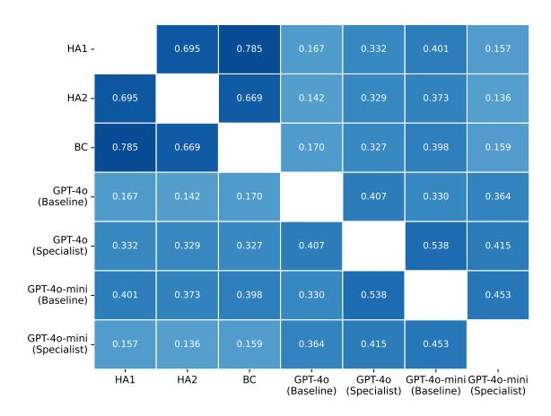
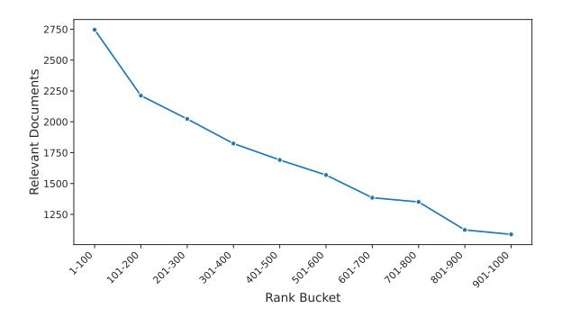
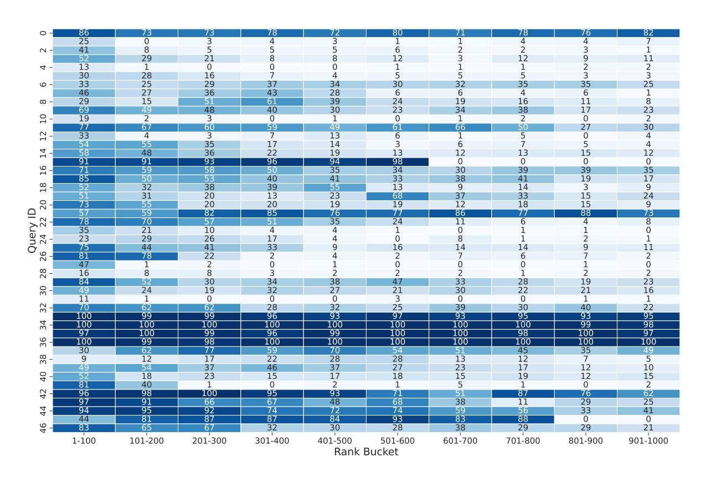

# **Analysis of Automated Document Relevance Annotation for Information Retrieval in Oil and Gas Industry**

**João Vitor Mariano Correia**1 **, Murilo Missano Bell**1 **, João Vitor Robiatti Amorim**1 **, Jonas Felipe Pereira de Queiroz**1 **, Daniel Carlos Guimarães Pedronette**1 **, Ivan Rizzo Guilherme**1 **, Felipe Lima de Oliveira**2

1 Institute of Geosciences and Exact Sciences, São Paulo State University 2Research, Development and Innovation Center, Petróleo Brasileiro S.A. {mariano.correia, murilo.bell, joao.robiatti, jonas.queiroz, daniel.pedronette, ivan.guilherme}@unesp.br, flimao@petrobras.com.br

# **Abstract**

The lack of high-quality test collections challenges Information Retrieval (IR) in specialized domains. This work addresses this issue by comparing supervised classifiers against zero-shot Large Language Models (LLMs) for automated relevance annotation in the oil and gas industry, using human expert judgments as a benchmark. A supervised classifier, trained on limited expert data, outperforms LLMs, achieving an F1-score that surpasses even a second human annotator. The study also empirically confirms that LLMs are susceptible to unfairly prefer technologically similar retrieval systems. While LLMs lack precision in this context, a well-engineered classifier offers an accurate and practical path to scaling evaluation datasets within a human-in-the-loop framework that empowers, not replaces, human expertise.

# **1 Introduction**

The fast digital transformation across industries has led to an exponential increase in data creation, presenting both opportunities and challenges for Information Retrieval (IR) systems. The ability to efficiently access relevant inform[ation from vast,](#page-7-0) [intric](#page-7-0)ate datasets has become critical, particularly in specialized fields like the oil and gas industry (Cinelli et al., 2021). However, developing and evaluating effective IR solutions is heavily dependent on high-quality annotated datasets, yet there is a notable scarcity of such resources especially for niche industrial domains.

The creation of evaluation datasets has long relied on the pooling m[ethodology, institutionalized](#page-8-0) [by the Tex](#page-8-0)[t REtrieval Confer](#page-8-1)ence (TREC) as the gold standard (Sparck-Jones and Rijshergen, 1975;

Sanderson, 2010). While effective in generalpurpose domains, this paradigm faces significant challenges in specialized industrial contexts. The TREC model's reliance on a vast set of annotators is infeasible in fields like oil and gas, where subject matter experts are scarce. Furthermore, the quality of the pooled document set itself is often compromised, as retrieval systems typically underperform when faced with complex and domain-specific terminologies. These problems lead to an inefficient annotation process where experts must sift through a high volume of irrelevant docu[ments to find some](#page-8-2) [positive results.](#page-7-1)

While the acade[mic co](#page-7-1)mmunity debates the advantages and risks of using Large Language Models (LLMs) as evaluators (Soboroff, 2025; Clarke and Dietz, 2024), the high cost of manual annotation demands pragmatic automated solutions. This work conducts a direct empirical comparison between supervised classifiers and zero-shot LLMs to determine a more viable and scalable annotation solution in a practical industrial context. It does not propose to replace human experts, but to empower them by reducing the annotation burden by pre-selecting documents most likely to be relevant, ensuring the resulting system is continuously refined and validated against the ground truth of human utility.

Therefore, it finds that the classifier, while susceptible to inheriting annotator bias, achieves a high F1-score (0.860) and substantial agreement with experts (Cohen's κ = 0.669). In contrast, LLMs exhibit a poor precision-recall trade-off: high recall is compromised by low precision, leading to a lower F1-score (0.671) and only moderate agreement (κ = 0.332). This analysis thus provides a data-driven path for practitioners to scale evaluation in specialized domains.

# **2 Related Work**

To overcome the prohibitive cost and scalability issues of relying on human experts for annotation, a growing body of research has explored using LLMs as a substitute for human annotators, with several studies already applying them to generate labels for IR datasets. For instance, recent works using LLMs [as judges report m](#page-7-2)[oderate human-](#page-7-3)[LLM](#page-7-3) [agreement, with Cohen](#page-8-3)'s Kappa score typically ranging from 0.20 to 0.64 (Bueno et al., 2024; Faggioli et al., 2023; Thomas et al., 2024). Despite this moderate agree[ment, proponents arg](#page-7-4)[ue that](#page-8-4) [LLMs offer](#page-8-4) a scalable and consistent alternative to human annotation (Bencke et al., 2024; Zheng et al., 2023). The prominence of this topic is underscored by dedicated academic focus, including the establishment of the LLM4EVA[L w](#page-1-0)orkshop at the ACM Special Interest Group on Information Retrieval (SIGIR)1 .

Despite this potential, the use of LLMs as a definitive source of relevance judgments has drawn significant skepticism. A central critique is that evaluating a system with an LL[M is methodolog](#page-8-2)[ically indistinct from us](#page-7-1)ing an LLM for the retrieval task itself (Soboroff, 2025; Clarke and Dietz, 2024). In this paradigm, the LLMs output becomes the gold standard, making it methodologically impossible to measure the performance of any system that might surpass the LLM judge. This circular logic leads to potentially illusory performance gains that merely reflect an alignment with the LLMs intrinsic biases rather than [an actual im](#page-7-1)[provement in](#page-7-1) utility for human users (Clarke and Dietz, 2024). Ultimately, critics argue that because IR systems are designed to serve human needs, their evaluation must remain grounded in human judgment and understanding. Consequently, LLMgenerated labels cannot be considered a proper gold standard, as they lack the essential connection to real-[world human utility \(F](#page-7-3)[aggioli et al.,](#page-7-1) 2023; [Clark](#page-7-1)e and Dietz, 2024).

The current academic debate is often limited in its perspective. This work contributes to the discussion by empirically investigating supervised classifiers as a practical tool to assist human experts.

# **3 Methodology**

This section details the experimental design for evaluating automated relevance annotation methods. The proposed methodology is grounded in the practical challenges of creating evaluation resources in a specialized industrial domain.

The corpus consists of Daily Drilling Reports (DDRs), which are semi-structured technical documents commonly used in the oil and gas industry. They contain daily logs that detail noticeable events, operations performed, equipment status, geological findings, and any problems encountered during the drilling of a well. The unstructured nature and richness in domain-specific terminology make the retrieval of information a challenging task, especially when written by and from highly specialized professionals. The queries are informational and problem-oriented, reflecting a professional need to find geomechanical events or past problems from historical data.

This test collection was built using the standard pooling method, where document candidates are sourced from the top results of multiple IR systems. This approach, however, presents a known challenge in niche domains, such as oil and gas: if the underlying retrieval systems perform poorly, the resulting pool may be sparse in relevant documents. This can make the subsequent human annotation effort highly inefficient, as experts spend significant time judging non-relevant items.

The dataset initially featured multi-level relevance judgments on a four-point scale (0=irrelevant, 1=marginal, 2=relevant, 3=highly relevant). A preliminary analysis revealed a severe class imbalance, with certain relevance levels being extremely rare or completely absent for many queries. Training a robust multi-class classifier on such imbalanced data is impractical and unlikely to yield reliable models.

To establish a well-defined and manageable problem, the relevance labels were binarized. All documents with a score of 1, 2, or 3 were consolidated into a single Relevant class, while documents with a score of 0 remained Not Relevant. This transformation creates a straightforward binary classification task — the core of our investigation — where we compare the ability of traditional machine learning classifiers against generative LLMs to replicate the gold standard of human expert judgments.

1 https://llm4eval.github.io/

### **3.1 Machine Learning Classifiers**

A suite of traditional machine learning classifiers is first evaluated by using semantic representations of query-document pairs. In this bi-encoder architecture, the query and document are independently encoded into dense vectors, which are then combined using an interaction method before being fed into the classifier. The experimental design systematically evaluates the impact of four components: the embedding model, the query-document interaction (feature engineering), the classification algorithm, and the training strategy. The specific component tested for each factor is outlined in Table 1.

The feature vectors for the classifiers were generated using a bi-encoder architecture. All classifier models were implemented using the scikitlearn library and included crucial pre-proce[ssi](#page-3-0)ng steps: data standardization was applied to the feature vectors, and class weight balancing was used to handle the inherent data imbalance. To assess model robustness and generalization, three distinct validation schemes were employed:

- **Cross-Query (CQ):** This strategy uses a 5-fold stratified cross-validation framework. The folds were stratified by class label across the entire dataset to ensure that documents from all queries were present in both the training and validation sets of each split, testing the model's ability to learn a general relevance function.
- **Per-Query (PQ):** For this approach, a separate, independent classifier was trained for each query. A dedicated 5-fold crossvalidation was performed for each model using only the documents associated with that specific query.
- **Unseen Queries (UQ):** To test generalization to new topics, this strategy used leave-one-out cross-validation at the query level. In each fold, the validation set consisted of all documents for a query (or group of queries) that the model had not seen during training.

#### **3.2 LLMs as Annotators**

The ability of LLMs to perform relevance annotation is evaluated in a zero-shot setting, a paradigm with significant potential for reducing manual effort. The evaluation analyzes the trade-off between

performance and efficiency by testing two models: **GPT-4o**, a state-of-the-art model known for its language understanding capabilities, and **GPT-4o-mini**, a smaller, faster, and more cost-effective model suited for practical deployment.

For each model, two prompting strategies were compared to gauge the impact of domain context. The first is a **Generic Prompt (Baseline)**, which uses the standardized reference from the LLM4EVAL workshop. The second is a **Domain-Knowledge Prompt (Specialist)**, which was enriched with structured information from a domainspecific ontology. Details for both prompts is provided in Appendix A for reproducibility. All LLM inferences were executed via the official API with the temperature parameter set to 0 to minimize randomness and promote reproducible outputs.

### **3.3 Evaluation Metrics**

Model performance is evaluated against the humanadjudicated gold standard using standard classification met[rics](#page-8-5), including F1-Score, Precision and Recall. Furthermore, to specifically measure the consistency between an LLM's predictions and human judgments, the Cohen's Kappa (κ) coefficient is also reported.

To establish the gold standard and interannotator agreement, both Human Annotators (HA1, HA2) independently annotated an overlapping subset of 5066 query-document pairs. Disagreements were not adjudicated; the agreement was calculated from this set. Following this, one expert (HA1) was designated as the primary annotator to provide a consistent ground truth for crossfold training and evaluation, while the second expert's judgments (HA2) were reserved to validate the model's ability to generalize to an unseen human perspective.

### **3.4 Retrieval Systems for Evaluation**

To assess the downstream impact of different relevance judgments, we evaluated five distinct retrieval systems representing a range of classic and modern neural approaches. The systems used were:

- **BM25:** A standard lexical, keyword-based retrieval model based on the probabilistic relevance framework.
- • **BGE:** The BAAI General Embedding model *bge-multilingual-gemma2*, a state-of-the-art dense retriever from the Beijing Academy of

| Component          | Option                                                                                                                           | Description                                                                                                                                                                      |  |  |  |
|--------------------|----------------------------------------------------------------------------------------------------------------------------------|----------------------------------------------------------------------------------------------------------------------------------------------------------------------------------|--|--|--|
| Embedding Model    | bge-multilingual-gemma2 (BGE) (Chen et al., 2024) PetroBERT (P-BERT) (Rodrigues et al., 2022)                     | State-of-the-art, large-scale general-purpose multilin gual model. Smaller, computationally efficient model domain adapted for oil and gas.                             |  |  |  |
| Interaction Method | Document Only (DocOnly) Concatenation (Concat)                                                                                | Query-agnostic baseline using only the document em bedding. Concatenates query and document embeddings: [q; d].                                                         |  |  |  |
|                    | Absolute Difference (Diff) Hadamard Product (Hada) Cosine Similarity (CosSim)                                              | Element-wise absolute difference:  q - d . Element-wise multiplication, capturing feature inter actions: q ⊙ d. The single cosine similarity score used as the sole fea |  |  |  |
|                    |                                                                                                                                  | ture.                                                                                                                                                                            |  |  |  |
| Classifier Model   | Logistic Regression (LR) SVM with RBF Kernel (SVM-RBF) Random Forest (RF) Gradient Boosting (GB) Neural Network (NN) | Linear model. Non-linear kernel-based model. Ensemble of decision trees. Sequential ensemble model. Multi-Layer Perceptron for non-linear patterns.                  |  |  |  |
| Training Strategy  | Cross-Query (CQ) Per-Query (PQ)                                                                                               | A single model trained on data from all queries. Tests general relevance. A separate model trained for each query. Tests spe                                               |  |  |  |
|                    | Unseen Queries (UQ)                                                                                                              | cialized relevance. Model trained on a subset of queries and validated on held-out. Tests generalization.                                                                  |  |  |  |

Table 1: Experimental design for the supervised baseline classifiers, structured around four components: embedding model, query-document interaction, classifier, and training strategy. For interaction methods, **'q'** denotes the query embedding vector and **'d'** denotes the document embedding vector

Artificial Intelligence (Xiao et al., 2023; Chen et al., 2024).

- **mContriever:** A dense retriever pre-trained using contrastive learning on unsupervised data, designed for strong zero-shot performance (Izacard et al., 2021).
- **ColBERT:** A late-interaction model that performs scalable and fine-grained text matching by interacting with the query and document embeddings at the token level (Sant[hanam](#page-8-7) [et al.,](#page-8-7) [2022\).](#page-8-7)
- **text-embedding-3-large:** A proprietary, high-dimensional embedding model from OpenAI.

# **4 Results**

This section details the results of the empirical evaluation.

#### **4.1 Classification Performance**

Over 120 d[istinct model configuration](#page-8-8)s were evaluated by varying the classifier algorithm, feature engineering, embedding model and training strategy. Table 2 summarizes the performance of the highestperforming classification models by each metric

and zero-shot LLMs. The models are trained on data from a primary human annotator and evaluated against a held-out second expert, whose performance is also shown.

While both the BGE and PetroBERT embedding models were evaluated across all configurations, models using BGE consistently and significantly outperformed those using PetroBERT. Therefore, for clarity and brevity, Table 2 presents only the highest-performing confi[gur](#page-4-0)ations, which were all based on the BGE model.

The analysis of the results demonstrates a clear outcome: the supervised classifier, trained with expert data, not only significantly outperforms the zero-shot LLMs but also exceeds the performance of a second human annotator. The (NN + CQ + BGE + Hada) classifier, henceforth referred to as the Best Classifier (BC), achieved an F1-score of 0.860. This result is notably superior to that of the second human expert (0.793), and vastly surpasses the best LLM configuration, GPT-4o wi[th](#page-4-0) a specialist prompt (0.671). The robustness of the supervised classifier is further evidenced in the most stringent evaluation scenario. Even when tested on queries not seen during training, the classifier (SVM-RBF + UQ + BGE + Diff) achieved

| Method                    | Precision         | Recall            | F1-Score          |  |
|---------------------------|-------------------|-------------------|-------------------|--|
| Human Annotator 2         | 0.867             | 0.730             | 0.793             |  |
| GB + CQ + BGE + Hada      | $0.865 \pm 0.028$ | $0.696 \pm 0.010$ | $0.771 \pm 0.007$ |  |
| NN + CQ + BGE + Hada      | $0.860 \pm 0.017$ | $0.860 \pm 0.020$ | $0.860 \pm 0.018$ |  |
| SVM-RBF + CQ + BGE + Diff | $0.850 \pm 0.019$ | $0.861 \pm 0.012$ | $0.856 \pm 0.013$ |  |
| SVM-RBF + CQ + BGE + Hada | $0.849 \pm 0.018$ | $0.865 \pm 0.015$ | $0.857 \pm 0.014$ |  |
| NN + PQ + BGE + Diff      | $0.718 \pm 0.212$ | $0.890 \pm 0.084$ | $0.772 \pm 0.161$ |  |
| NN + PQ + BGE + Hada      | $0.731 \pm 0.214$ | $0.877 \pm 0.113$ | $0.775 \pm 0.174$ |  |
| NN + PQ + BGE + DocOnly   | $0.730 \pm 0.209$ | $0.876 \pm 0.103$ | 0.776 + 0.169     |  |
| GPT-40 (Baseline)         | 0.413             | 0.915             | 0.569             |  |
| GPT-40 (Specialist)       | 0.522             | 0.940             | 0.671             |  |
| GPT-40-mini (Baseline)    | 0.494             | 0.877             | 0.632             |  |
| GPT-40-mini (Specialist)  | 0.407             | <b>0.983</b>      | 0.575             |  |

Table 2: Performance comparison of all models. The best score in each metric is in bold. Top three F1-scores in the ML group are highlighted. Model names are abbreviated as [Classifier] + [Training Strategy] + [Embedding] + [Feature Combination]. Values are mean  $\pm$  standard deviation when available.

an F1-score of 0.674, still outperforming the best LLM. This finding is particularly significant, as it suggests that the classifier effectively learned to generalize the human annotator's decision patterns rather than simply memorizing topic-specific cues.

In contrast, the LLMs presented an imbalanced performance profile. Although they achieved extremely high recall, with GPT-40-mini correctly identifying 98.3% of relevant documents, their low precision severely compromised their F1-scores. This trend confirms that while LLMs may be useful for sourcing a broad set of candidate documents, their inability to accurately distinguish relevance makes them unreliable for final annotation. The classifiers have proven exceptionally capable of learning from the expert annotations, effectively internalizing and replicating the primary annotator's nuanced judgment, however, it is crucial to emphasize that this robust performance is fundamentally driven by the training data and annotator bias.

#### 4.2 Inter-Annotator Agreement

To evaluate agreement between annotators, pairwise Cohen's Kappa scores were computed between all human and automated annotators. The results, shown in Figure 1 reveal several critical insights into the nature of the annotation task.

The agreement between the two human experts (HA1 and HA2) was substantial ( $\kappa = 0.695$ ). This level of agreement validates the feasibility of the relevance task and establishes a strong upperbound benchmark for any automated system aiming to replicate human judgment. As expected, the best classifier showed a very high agreement with its training source, HA1 ( $\kappa = 0.785$ ), demonstrating successful pattern learning. More impor-

Figure 1: Heatmap of Pairwise Cohen's Kappa  $(\kappa)$  Agreement.

tantly, its agreement with the unseen expert, HA2 ( $\kappa = 0.669$ ), was also substantial, indicating that the classifier captured generalizable relevance signals beyond simple overfitting to one annotator's idiosyncrasies.

Otherwise, the agreement between humans and the zero-shot LLMs was universally lower. All LLM configurations scored between slight and fair agreement with both HA1 and HA2, with values ranging from 0.136 to 0.401. These values are in the same ballpark as the Cohen's Kappa of 0.31 from the Quati dataset, 0.26 reported by Faggioli et al. (2023), and the 0.20-0.64 range observed by Thomas et al. (2024). However, when comparing the gap between human-human and LLM-human agreement, this study reveals a much starker divergence.

Despite their linguistic prowess, the LLMs intrinsic understanding of relevance in this specialized domain differs significantly from that of human experts. This divergence likely stems from the LLMs' training on general web data, which predisposes them to a broader, keyword-centric interpretation of relevance, contrasting with the experts' utility-focused approach. Furthermore, the agreement among the different LLM configurations was also only moderate (e.g., κ = 0.415 between GPT-4o Specialist and GPT-4o-mini Specialist), indicating a lack of consistent consensus even within the same family of models. This low level of agreement with the human gold standard, coupled with their poor precisio[n scores, suggests that](#page-7-3) while LLMs can be used for broad cand[idate discovery](#page-8-3) [\(high r](#page-8-3)ecall), they are not sufficiently reliable as a direct alternative for human annotators in this highstakes domain.

# **4.3 Effect on Downstream IR System Evaluation**

To address how different relevance judgments impact the evaluation of IR systems, the rankings of the five retrieval models detailed in Section 3.4 were analyzed using various sets of relevance labels. As detailed in Table 3 (Appendix B), two distinct scenarios emerged. First, the ranking produced using judgments from human annotators and our best-performing neural classifier were highly consistent. For both Recall@10 and Precision@10, the relative order of the retrieval systems remained stable: BM25 performed best, followed by BGE, mContriever, ColBERT, and finally textembedding-3-large.

In contrast, when using judgments generated by any of the GPT configurations, the system rankings changed significantly. While BM25 remained the top retriever, the text-embedding-3-large model, which was the worst-performing model according to human judgments, consistently rose to the second or third position. This reveals a critical finding of potential algorithmic collusion: the GPT-based annotators appear to favor the output of a retriever based on a technologically similar embedding model (OpenAI's text-embedding-3-la[rge\).](#page-2-0) The semantic characteristics that the text-embedding-3-large model dee[ms r](#page-9-0)elevant are [lik](#page-8-9)ely the same characteristics the GPT models use to assess relevance, leading to an inflated evaluation. This confirms the concerns raised in the literature and provides a practical demonstration that using LLMs as evaluators can distort system rankings, especially when there is a technological

overlap between the evaluator and the system being evaluated.

#### **4.4 Cost-Performance Analysis**

To contextualize the practical implications of each approach, the costs of using the LLMs were projected to annotate our full dataset of 108,292 documents across 47 queries. This projection is based on a direct, one-request-per-document schema, using an average of approximately 570 tokens per document and a 900-token prompt overhead. In contrast, the inference cost for our trained supervised classifiers is negligible, as these lightweight models can be run on existing commodity hardware without incurring per-document API fees.

Based on the pricing models at the time of this work, a single annotation pass over the entire dataset would cost approximately \$23.8k for GPT-4o and \$1.4k for GPT-4o-mini, presenting a trade-off for practitioners. While the supervised classifiers demonstrated superior performance in the evaluation, the cost of using LLMs must be weighed against the alternative: the expense and time required to source and manage human domain experts for a task of this scale. The cost of GPT-4o, while substantial, may be competitive with or even lower than employing specialists. Therefore, the optimal approach depends on the specific project constraints. For scenarios where a sufficient labeled dataset already exists to train a highperforming specialized model, the supervised classifier is a more efficient and accurate solution.

### **4.5 Impact of Automated Annotation at Scale**

To assess the real-world utility and behavior of the classifier, it was used to annotate all the entire dataset. Then, the top 1,000 ranking was retrieved for each query using BM25. As shown in Figure 2, the classifier behaved as expected, ranking more relevant documents higher, with the number of positive labels decreasing as the rank position increases. However, the absolute volume of documents labeled relevant was unexpectedly high.

Further analysis, visualized in the heatmap in Figure 5 (Appendix C), revealed that this high volume was driven by a few queries (e.g., 0, 33, 34, 35, 36) that returned a disproportionately high number of positive labels across the entire ranking. To diagnose it, a targeted qualitative analysis was conducted by creating a stratified sample of 111 documents from five queries: three with a high number of positives (0, 35 and 36) and two (12 and 41)

Figure 2: Distribution of Relevant Documents by BM25 Grouped Rank

with the expected pattern as a control group. This sample was stratified into three groups to isolate specific performance characteristics: Stratum A, consisting of high-ranking documents (1–50) that the classifier marked as relevant; Stratum B, containing low-ranking documents (500–1000) also marked as relevant; and Stratum C, comprising high-ranking documents (1–100) that the classifier marked as irrelevant.

A human expert manually re-judged this sample, yielding a important insight: the classifier's overall accuracy was a respectable 80.18%. However, its performance varied significantly by stratum. It was 100% accurate on the top-ranked documents (Stratum A and C) but dropped to 69% on the lowranked documents it had labeled as relevant (Stratum B). This indicates that while the classifier is generally reliable, its precision decreases on documents that are less obviously relevant. For queries with high number of positives, which were often broad or described routine procedures, the classifier struggled to distinguish between documents merely mentioning keywords and those that were genuinely useful, leading to an over-prediction of relevance. This analysis confirms that the classifier is a promising tool but requires careful application, as it can be overly lenient on ambiguous queries and less reliable on documents with weaker relevance signals.

#### 5 Conclusion

This work address the challenge of creating evaluation test collection within the specialized domain of oil and gas exploration. A comprehensive comparison of automated relevance annotation methods was conducted, evaluating machine learning classifiers against zero-shot Large Language Models and benchmarking both against human expert

judgment.

The findings of this study provide clear insights for industrial practitioners, demonstrating that a carefully engineered supervised classifier, built upon a powerful general-purpose embedding model and trained on a modest amount of expertlabeled data can be a more effective and practical solution for this task. Outperforming all the LLM-based configurations. Crucially, this approach is also the most cost-effective, with negligible inference costs compared to the prohibitively expensive API calls required for LLM-based annotation at scale.

Furthermore, this study empirically confirmed several concerns raised in the academic literature regarding the use of LLMs as evaluators. It was found that LLMs have low agreement with human experts in this domain and are suscetible to unfairly favor retrieval systems built on similar underlying technology, thereby distorting evaluation results.

#### Limitations

While this study provides a pragmatic evaluation of automated annotation methods in a specialized industrial context, its findings are subject to some limitations that offer avenues for future research.

First, the scope of this work is intentionally focused on a single, highly specialized domain: oil and gas exploration, using a corpus of daily drilling reports. The superior performance of the supervised classifier is contingent on the availability of expert-labeled data from this specific domain. Consequently, the conclusions regarding the classifier's effectiveness may not be directly generalizable to other industrial sectors, different types of technical documents, or other languages, where the nature of relevance and the complexity of the terminology might differ significantly.

Second, the supervised classifier's performance is fundamentally tied to the data on which it was trained. It was optimized to replicate the judgments of a single primary annotator. While it demonstrated high agreement with a second expert, the model has effectively learned one specific, albeit expert, perspective on relevance. This 'annotator-cloning' approach may not capture a broader consensus and risks perpetuating individual biases at scale. The qualitative analysis revealed that the classifier struggles with ambiguity in broad queries, leading to an over-prediction of relevance.

Third, the investigation into Large Language Models was constrained to a zero-shot evaluation of two specific OpenAI models. Other potentially effective methods were not explored, such as fewshot learning, chain-of-thought prompting, or finetuning the LLMs on domain-specific data, which could have improved their performance and agreement with human experts. Similarly, the landscape of LLMs is vast, and the results may not be representative of other proprietary or open-source models.

Finally, while the analysis provides compelling evidence of algorithmic collusion where LLMbased evaluators favor technologically similar models, this finding is based on a limited set of five retrieval systems. To establish this as a more general phenomenon, further research is needed across a wider and more diverse range of retriever architectures. Furthermore, the cost analysis, while illustrative, is based on a non-optimized, per-document API call structure; more sophisticated batching strategies could alter the economic trade-offs presented.

# **Acknowledgments**

This study was funded by FUNDUNESP/Petrobras (grant number 3070/2019). The authors also thank the Center of Applied Natural Science (UN-ESPetro) of the Institute of Geosciences and Exact Sciences, for providing laboratory facilities.

# **References**

- Luciana Bencke, Felipe S. F. Paula, Bruno G. T. dos Santos, and Viviane P. Moreira. 2024. Can we trust LLMs as relevance judges? In *Simpósio Brasileiro de Banco de Dados (SBBD)*, pages 600–612. SBC. ISSN: 2763-8979.
- Mirelle Bueno, Eduardo Seiti de Oliveira, Rodrigo Nogueira, Roberto A. Lotufo, and Jayr Alencar Pereira. 2024. Quati: A brazilian portuguese information retrieval dataset from native speakers. *Preprint*, arXiv:2404.06976.
- Jianlv Chen, Shitao Xiao, Peitian Zhang, Kun Luo, Defu Lian, and Zheng Liu. 2024. Bge m3 embedding: Multi-lingual, multi-functionality, multi-granularity text embeddings through selfknowledge distillation. *Preprint*, arXiv:2402.03216.
- Lucas P. Cinelli, José F.L. De Oliveira, Vinicius M. De Pinho, Wesley L. Passos, Rafael Padilla, Patrick F. Braz, Breno Galves, Domenica P. Dalvi, Gabriela Lewenfus, Jonathas O. Ferreira, Anthony Y.Y. Ji, Felipe L. De Oliveira, Clemente J.C.

- Gonçalves, Sergio L. Netto, Eduardo A.B. Da Silva, and Marcello L.R. De Campos. 2021. Automatic event identification and extraction from daily drilling reports using an expert system and artificial intelligence. *Journal of Petroleum Science and Engineering*, 205:108939.
- Charles L. A. Clarke and Laura Dietz. 2024. LLMbased relevance assessment still can't replace human relevance assessment. *arXiv preprint*. ArXiv:2412.17156 [cs].
- Guglielmo Faggioli, Laura Dietz, Charles L. A. Clarke, Gianluca Demartini, Matthias Hagen, Claudia Hauff, Noriko Kando, Evangelos Kanoulas, Martin Potthast, Benno Stein, and Henning Wachsmuth. 2023. Perspectives on Large Language Models for Relevance Judgment. In *Proceedings of the 2023 ACM SIGIR International Conference on Theory of Information Retrieval*, ICTIR '23, pages 39–50, New York, NY, USA. Association for Computing Machinery.
- Gautier Izacard, Mathilde Caron, Lucas Hos[seini, Se](https://doi.org/10.5753/sbbd.2024.243130)[bastian Riedel, Piotr Bojanowski, A](https://doi.org/10.5753/sbbd.2024.243130)rmand Joulin, and Edouard Grave. 2021. Unsupervised dense information retrieval with contrastive learning.
- Rafael B. M. Rodrigues, Pedro I. M. Privatto, Gustavo José de Sousa, Rafael P. Murari, Luis C. S. Afonso, João [P. Papa, Daniel C. G. Pedronette,](https://arxiv.org/abs/2404.06976) [Ivan R. Guilherme, Stephan R. Perrout, and Aliel F.](https://arxiv.org/abs/2404.06976) Riente. 2022. PetroBERT: A Domain Adaptation Language Model for Oil and Gas Applications in Portuguese. In *Computational Processing of the Portuguese Language*[, pages 101–109, Cham. Springer](https://arxiv.org/abs/2402.03216) [International Publishing.](https://arxiv.org/abs/2402.03216)
- M[ark Sanderson. 2010.](https://arxiv.org/abs/2402.03216) Test Collection Based Evaluation of Information Retrieval Systems. *Foundations and Trends® in Information Retrieval*, 4(4):247– 375.
- Keshav Santhanam, Omar Khattab, Jon Saad-Falcon, Christopher Potts, and Matei Zaharia. 2022. Colbertv2: Effective and efficient retrieval via lightweight late interaction. *Preprint*, arXiv:2112.[01488.](https://doi.org/10.1016/j.petrol.2021.108939)
- Ian Soboroff. 2025. [Don't Use LLMs to Make Rele](https://doi.org/10.1016/j.petrol.2021.108939)vance Judgments. *[Information Retriev](https://doi.org/10.1016/j.petrol.2021.108939)al Research Journal*, 1(1).
- K Sparck-Jones and C J Van Rijshergen. 1975. [Report](https://doi.org/10.48550/arXiv.2412.17156) [on the need for and provision of an ideal 'ideal' in](https://doi.org/10.48550/arXiv.2412.17156)[formation retrieval test collection](https://doi.org/10.48550/arXiv.2412.17156). *Computer Laboratory*.
- Paul Thomas, Seth Spielman, Nick Craswell, and Bhaskar Mitra. 2024. Large language models can accurately predict searcher preferences. *Preprint*, arXiv:2309.10621.
- S[hitao Xiao, Zheng Liu, Peitian Zhang, and Niklas](https://doi.org/10.1145/3578337.3605136) Muennighoff. 2023. C-pack: Packaged resources to advance general chinese embedding. *Preprint*, arXiv:2309.07597.

Lianmin Zheng, Wei-Lin Chiang, Ying Sheng, Siyuan Zhuang, Zhanghao Wu, Yonghao Zhuang, Zi Lin, Zhuohan Li, Dacheng Li, Eric P. Xing, Hao Zhang, Joseph E. Gonzalez, and Ion Stoica. 2023. Judging LLM-as-a-Judge with MT-Bench and Chatbot Arena. *arXiv preprint*. ArXiv:2306.05685 [[cs\].](https://doi.org/10.48550/ARXIV.2112.09118)

# **A [L](https://doi.org/10.48550/ARXIV.2112.09118)LM Prompt Templates**

For reproducibility, the full text of the prompts used for the zero-shot LLM evaluation is provided below. The system instructions and the user input format are combined to f[orm the complete prompt](https://doi.org/10.1007/978-3-030-98305-5_10) se[nt to the LLM. The original prompts are in por](https://doi.org/10.1007/978-3-030-98305-5_10)tu[guese, being translated to en](https://doi.org/10.1007/978-3-030-98305-5_10)glish for this paper.

It is important to note that the query\_metadata and document\_metadata placeholders in the specialist prompt are populated by a Rule-Based N[amed Entity Recognition \(NER\) system. This](https://doi.org/10.1561/1500000009) system processes the raw text of the query and document to extract and classify domain-specific entities according to the ontology described in the prompt, providing structured data that the LLM is instructed [to use in its reasoning process.](https://arxiv.org/abs/2112.01488)

### **A[.1 Generic Prompt \(Baseline\)](https://arxiv.org/abs/2112.01488)**

This prompt, shown in Figure [3, provides a](https://doi.org/10.54195/irrj.19625) sl[ightly modified ver](https://doi.org/10.54195/irrj.19625)sion from the reference of the LLM4EVAL workshop, following the standard structure for a relevance annotation task.

### **A.2 Domain-Knowledge Prompt (Specialist)**

The prompt shown in Figure 4 was enriched with domain-specific context, an ontology of named entities, and detailed reas[oning instructions to guide](https://arxiv.org/abs/2309.10621) th[e model as a subject-matter expert.](https://arxiv.org/abs/2309.10621)

Due to confidentiality agreements, the full version of the specialist prompt cannot be disclosed. The version presented [is a representative summary](https://arxiv.org/abs/2309.07597) th[at illustrates the key domain-specific in](https://arxiv.org/abs/2309.07597)structions given to the model.

# **B Downstream Evaluation of IR System**

Table 3 illustrates the direct impact of using different sets of rel[evance judgments \(qrels\) on the evalu](https://doi.org/10.48550/arXiv.2306.05685)at[ion of five distinct Information](https://doi.org/10.48550/arXiv.2306.05685) Retrieval (IR) systems.

# **C Impact of Automated Annotation at Scale**

Figure 5 provides a granular, per-query detail for the analysis in Section 4.5. The heatmap shows the percentage of documents labeled as "Relevant" by the classifier, broken down by BM25 rank and by query. This visualization was critical for diagnosing the classifier's behavior and identifying outliers. Key observations from the heatmap include:

- Expected Behavior: For many queries, such as 1, 10, 12, 14, 22, and 40, the classifier behaves as expected. It identifies a high percentage of relevant documents in the top ranks, with the relevance percentage steadily decreasing as the rank gets lower. This pattern indicates that for well-defined queries, the classifier successfully prioritizes relevant content
- Saturated Queries: A distinct set of queries (33, 34, 35, 36, and to a lesser extent 42) are saturated with positive labels[. F](#page-9-1)or these, the classifier marks nearly 100% of documents as relevant across almost all ranking blocks. This finding prompted the qualitative analysis described in the main text, which revealed that these queries were often broad or described routine procedures, causing the classifier's precision to decreas[e.](#page-10-0)
- • Low-Relevance Queries: Some queries, like 10 and 31, return very few relevant documents overall, with relevance percentages close to zero across all ranks. This suggests these topics are either extremely rare in the corpus or the queries themselves are difficult for any system to retrieve relevant documents for.

You are a search quality rater evaluating the relevance of passages. Given a query and a passage, you must provide a score on an integer scale of 0 to 3 with the following meanings:

- **3 = Highly Relevant:** Documents directly correlated with the query that answer it completely;
- **2 = Relevant:** Documents correlated with the query, but that do not answer it completely;
- **1 = Marginally Relevant:** Documents not correlated with the query, but that contain associated information;
- **0 = Not Relevant:** Documents that show no correlation with the query.

Your response MUST be only the score number (0, 1, 2, or 3).

Query: {query}

Document: {document}

Relevance:

Figure 3: The baseline prompt for relevance annotation, providing general instructions and a 4-point scale.

|             |                          | Recall |       |       | Precision |       |       |       |       |
|-------------|--------------------------|--------|-------|-------|-----------|-------|-------|-------|-------|
| Model       | Qrel Source              | @1     | @5    | @10   | @50       | @1    | @5    | @10   | @50   |
| BM25        | HA1                      | 0.032  | 0.122 | 0.226 | 0.374     | 0.830 | 0.732 | 0.689 | 0.235 |
|             | HA2                      | 0.045  | 0.193 | 0.331 | 0.464     | 0.809 | 0.783 | 0.726 | 0.226 |
|             | BC                       | 0.032  | 0.138 | 0.248 | 0.397     | 0.787 | 0.736 | 0.694 | 0.233 |
|             | GPT-4o (Baseline)        | 0.011  | 0.056 | 0.113 | 0.201     | 0.915 | 0.919 | 0.915 | 0.315 |
|             | GPT-4o (Specialist)      | 0.017  | 0.083 | 0.161 | 0.271     | 1.000 | 0.987 | 0.957 | 0.320 |
|             | GPT-4o-mini (Baseline)   | 0.017  | 0.085 | 0.161 | 0.275     | 0.957 | 0.974 | 0.928 | 0.312 |
|             | GPT-4o-mini (Specialist) | 0.012  | 0.059 | 0.118 | 0.206     | 1.000 | 1.000 | 1.000 | 0.342 |
|             | HA1                      | 0.030  | 0.098 | 0.165 | 0.368     | 0.851 | 0.651 | 0.543 | 0.255 |
|             | HA2                      | 0.033  | 0.126 | 0.201 | 0.418     | 0.787 | 0.634 | 0.521 | 0.237 |
|             | BC                       | 0.034  | 0.111 | 0.184 | 0.397     | 0.809 | 0.664 | 0.551 | 0.256 |
| BGE         | GPT-4o (Baseline)        | 0.012  | 0.050 | 0.087 | 0.229     | 0.915 | 0.770 | 0.664 | 0.353 |
|             | GPT-4o (Specialist)      | 0.016  | 0.065 | 0.113 | 0.279     | 0.936 | 0.783 | 0.672 | 0.342 |
|             | GPT-4o-mini (Baseline)   | 0.016  | 0.066 | 0.114 | 0.285     | 0.936 | 0.766 | 0.649 | 0.335 |
|             | GPT-4o-mini (Specialist) | 0.011  | 0.047 | 0.084 | 0.227     | 0.936 | 0.800 | 0.696 | 0.376 |
| TE3         | HA1                      | 0.019  | 0.064 | 0.105 | 0.227     | 0.574 | 0.485 | 0.426 | 0.182 |
|             | HA2                      | 0.023  | 0.085 | 0.134 | 0.268     | 0.574 | 0.460 | 0.396 | 0.165 |
|             | BC                       | 0.017  | 0.061 | 0.102 | 0.221     | 0.511 | 0.460 | 0.409 | 0.175 |
|             | GPT-4o (Baseline)        | 0.012  | 0.055 | 0.098 | 0.204     | 0.936 | 0.889 | 0.796 | 0.322 |
|             | GPT-4o (Specialist)      | 0.014  | 0.068 | 0.118 | 0.231     | 0.851 | 0.813 | 0.715 | 0.289 |
|             | GPT-4o-mini (Baseline)   | 0.015  | 0.070 | 0.118 | 0.238     | 0.894 | 0.838 | 0.721 | 0.294 |
|             | GPT-4o-mini (Specialist) | 0.011  | 0.053 | 0.100 | 0.204     | 0.936 | 0.915 | 0.843 | 0.346 |
| ColBERT     | HA1                      | 0.023  | 0.091 | 0.133 | 0.307     | 0.660 | 0.540 | 0.415 | 0.206 |
|             | HA2                      | 0.037  | 0.122 | 0.174 | 0.366     | 0.723 | 0.557 | 0.415 | 0.194 |
|             | BC                       | 0.028  | 0.097 | 0.143 | 0.327     | 0.702 | 0.536 | 0.413 | 0.201 |
|             | GPT-4o (Baseline)        | 0.010  | 0.044 | 0.065 | 0.179     | 0.809 | 0.660 | 0.500 | 0.264 |
|             | GPT-4o (Specialist)      | 0.014  | 0.058 | 0.088 | 0.220     | 0.830 | 0.672 | 0.502 | 0.259 |
|             | GPT-4o-mini (Baseline)   | 0.014  | 0.059 | 0.089 | 0.219     | 0.787 | 0.655 | 0.498 | 0.251 |
|             | GPT-4o-mini (Specialist) | 0.010  | 0.041 | 0.063 | 0.171     | 0.851 | 0.689 | 0.521 | 0.282 |
| mContriever | HA1                      | 0.018  | 0.078 | 0.157 | 0.279     | 0.638 | 0.570 | 0.566 | 0.214 |
|             | HA2                      | 0.022  | 0.095 | 0.181 | 0.317     | 0.574 | 0.515 | 0.496 | 0.191 |
|             | BC                       | 0.018  | 0.087 | 0.158 | 0.291     | 0.596 | 0.587 | 0.543 | 0.211 |
|             | GPT-4o (Baseline)        | 0.010  | 0.052 | 0.101 | 0.220     | 0.830 | 0.834 | 0.828 | 0.351 |
|             | GPT-4o (Specialist)      | 0.014  | 0.069 | 0.127 | 0.252     | 0.809 | 0.821 | 0.785 | 0.317 |
|             | GPT-4o-mini (Baseline)   | 0.014  | 0.066 | 0.120 | 0.242     | 0.830 | 0.800 | 0.757 | 0.310 |
|             | GPT-4o-mini (Specialist) | 0.010  | 0.052 | 0.101 | 0.212     | 0.936 | 0.898 | 0.879 | 0.366 |

Table 3: Impact of different relevance judgment sets, focusing on Recall and Precision across five retrieval models.

You are a highly experienced Well Engineer with deep knowledge of all processes, equipment, components, and procedures involved in the drilling, workover, and abandonment of oil and gas wells. Your specialty includes drilling and completion operations. Your task is to evaluate the relevance of a Document in relation to a Query. You must provide a score on an ordinal scale from 0 to 3.

#### **Domain Context (Oil Wells):**

The documents (Daily Drilling Reports - DDRs) are technical reports... The classes of these entities are:

- **Action:** Verbs describing operations (e.g., Drill, Pump, Install).
- **Procedure:** Nouns for processes (e.g., Pressure Test, Pipe Trip).
- **Component:** Equipment, tools (e.g., BOP, Drill Bit, Casing, BHA).
- **Material:** Fluids, compounds (e.g., Drilling Fluid, Cement, Sea Water).
- **Location:** Where actions occur (e.g., Bottom of the Well, Rig, Moon Pool).
- **Organization:** Companies, teams (e.g., Petrobras, Halliburton).
- **Property:** Numerical values, qualities (e.g., Pressure (psi), Diameter (in)).
- **State:** Conditions (e.g., Valve Open, Test Approved).
- **Incident:** Unplanned events (e.g., Kick, Loss Circulation, Stuck Pipe).

#### **Detailed Evaluation Instructions:**

- 1. **Analyze the Query:** Identify the main topic, intent, and key entities.
- 2. **Analyze the Document:** Understand the scenario, activities, and elements described.
- 3. **Analyze Metadata (Fundamental):** Compare the classes and concepts from the query's metadata with those of the document. A strong overlap of relevant classes and related concepts indicates higher relevance.
- 4. **Weigh the Relevance:** Combine your textual analysis with the metadata analysis to determine the score.
- 5. **Response Format:** Your response MUST be ONLY the score number (0, 1, 2, or 3).

#### **Example of Reasoning with Metadata:**

- **Query:** "BOP pressure test procedure"
- **Query Metadata:** [Class: Procedure>PressureTest], [Class: Component>BlowoutPreventer]
- **Document:** "Initiating pressure test on the annular BOP. Applied pressure: 5000 psi. Result: OK."
- **Document Metadata:** [Action>Initiate, Procedure>PressureTest, Component>BlowoutPreventer, Property>Measure>Pressure(psi), State>Ok]
- **Analysis:** High overlap. The document describes exactly the specified procedure on the specified component. Score: 3.

Query: {query}

Query Metadata: {query\_metadata}

Document: {document}

Document Metadata: {document\_metadata}

Relevance:

Figure 4: The specialist prompt, which instructs the model to act as an oil well engineer and use domain-specific metadata for annotation.

Figure 5: Per Query Relevance Distribution Heatmap. This shows the percentage of relevant documents found in each ranking block for each query. It clearly identifies queries that are saturated with positive labels, skewing the overall distribution.