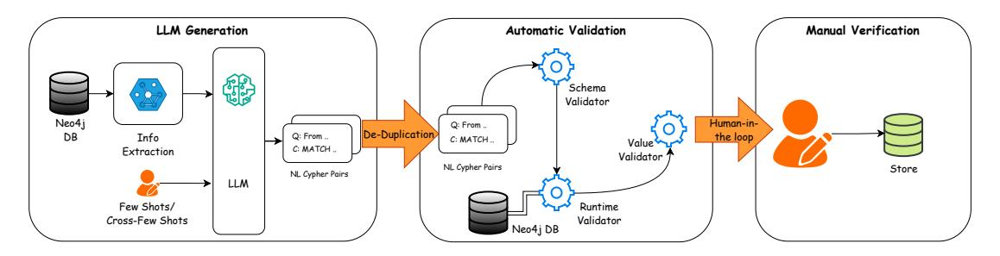

# Mind the Query: A Benchmark Dataset towards Text2Cypher Task

# Vashu Chauhan<sup>1</sup> Shobhit Raj<sup>1</sup> Shashank Mujumdar<sup>2</sup> Avirup Saha<sup>2</sup> Anannay Jain<sup>3</sup>

1 IIIT Delhi, India <sup>2</sup> IBM Research, India <sup>3</sup> IIT Bombay, India [Vashu Chauhan,](mailto:vashu22606@iiitd.ac.in) [Shobhit Raj,](mailto:shobhit22482@iiitd.ac.in) [Shashank Mujumdar,](mailto:shamujum@in.ibm.in) [Avirup Saha,](mailto:Avirup.Saha2@ibm.com) [Anannay Jain](mailto:anannay.j@gmail.com)

## Abstract

We present a high-quality, multi-domain dataset for the *Text2Cypher* task which is enabling the translation of natural language (NL) questions into executable Cypher queries over graph databases. The dataset comprises 27,529 NL queries and corresponding Cyphers spanning across 11 real-world graph datasets, each accompanied by its corresponding graph database for grounded query execution. To ensure correctness, the queries are validated through a rigorous pipeline combining automated schema, runtime and value checks, along with manual review for logical correctness. Queries are further categorized by complexity to support fine-grained evaluation. We have released our benchmark dataset and code[1](#page-0-0) to replicate our data synthesis pipeline on new graph datasets, supporting extensibility and future research for the task of *Text2Cypher*.

## 1 Introduction

Graph databases have become increasingly popular for representing and querying complex, interconnected data. Unlike traditional relational databases, graph databases store data in nodes and relationships, enabling more natural modeling of realworld entities and their interactions. Among various graph query languages, Cypher has emerged as the de facto standard, particularly in the Neo4j [\(Kemper,](#page-7-0) [2015\)](#page-7-0) ecosystem. Cypher's declarative syntax allows users to specify patterns to match in the graph, making it a powerful tool for extracting meaningful insights from graph-structured data.

The task of Text2Cypher, which is automatically translating natural language questions into valid Cypher queries, has gained traction due to its potential to democratize access to graph databases. Users without technical expertise can retrieve information from complex graph structures simply

by posing questions in natural language. However, generating Cypher queries from text remains a challenging problem. It requires the model to understand the semantics of the input question, accurately map it to the underlying schema, and generate syntactically and semantically correct queries.

A few datasets have been proposed to train and evaluate *Text2Cypher* models, including the Neo4j *Text2Cypher* dataset [\(Ozsoy et al.,](#page-7-1) [2025\)](#page-7-1) and SyntheT2C [\(Zhong et al.,](#page-7-2) [2024\)](#page-7-2). While these efforts mark substantial progress, they suffer from notable limitations:

- Lack of human verification: Many queries in the Neo4j dataset are generated by large language models (LLMs) without subsequent manual validation. As a result, some queries may be syntactically incorrect or semantically misaligned with the input question.
- Incomplete graph context: In the Neo4j datasets, the corresponding graph databases are often not provided, making it difficult to test and evaluate the generated Cypher queries in context.
- Domain restriction: The MedT2C dataset introduced in the SyntheT2C paper is confined to the medical domain, limiting its generalizability to other real-world applications.

To address these shortcomings, we introduce a novel dataset for the *Text2Cypher* task with the following key contributions:

- 1. Graph Database Availability: We provide graph databases for all examples in our dataset so that Cypher queries can be executed.
- 2. Multi-domain Coverage: Our dataset spans a diverse range of domains, enhancing the model's ability to generalize across different graph schemas and use cases.
- 3. Robust Validation: We employ a rigorous query validation pipeline that includes both automated and manual checks to ensure the correctness of each Cypher query with respect to the associated graph schema.

<span id="page-0-0"></span><sup>1</sup> <https://github.com/endeavorXx/Mind-the-Query>

- 4. Complexity-aware Categorization: We provide a novel classification scheme that categorizes each query based on its structural and semantic complexity, facilitating more nuanced evaluation and benchmarking.
- 5. Human Annotated Ground Truth: As part of the manual validation, we include detailed reasoning for failure cases, useful for training reasoning-based models for *Text2Cypher* task.

Our dataset comprises of 27,529 *NL-Cypher* query pairs with 955 detailed human annotations for challenging failure cases. It is designed to foster future research towards building NL interfaces for graph databases by offering a high-quality, extensible, and well-annotated resource.

## 2 Methodology

### 2.1 Graph Database and Cypher

Graph databases are created by modeling information as a network of interconnected entities, rather than relying on rigid tables or documents. The data is stored in the form of *nodes*, *relationships*, and *properties*, that enables a flexible, schema-aware structure that captures the intrinsic connections in the data. Most graph databases (Neo4j [\(Kemper,](#page-7-0) [2015\)](#page-7-0), JanusGraph [\(JanusGraph Project,](#page-7-3) [2023\)](#page-7-3), ArangoDB [\(ArangoDB GmbH,](#page-7-4) [2023\)](#page-7-4) etc.) use a property graph model where each node represents an entity and can have zero or more labels to indicate its type. Relationships describe a connection between a source and target node and always include a single type. Both nodes and relationships can have properties which are key-value pairs that further describe them.

The Cypher query language is a declarative, SQL-inspired language tailored to the property graph model. It uses a pattern matching syntax to intuitively express complex graph traversals, filtering, aggregation and other operations. Round brackets are used to represent (:Nodes), and -[:ARROWS]→ to represent a relationship between the (:Nodes). Cypher utilizes the customized syntax to perform create, read, update, or delete (CRUD) operations on the graph database.

#### 2.2 Synthetic Dataset Generation

The task of *Text2Cypher* conversion involves translating a natural language question into a corresponding Cypher query (C). In this work we propose an end-to-end framework to create a versatile synthetic dataset comprising a natural language

(NL) query and a corresponding cypher query (*NL-Cypher* pair) to facilitate fine-tuning, evaluation, and exploration of knowledge graphs (KG) with natural language user queries. The overall framework is shown in Figure [1.](#page-2-0) The overall pipeline executes in three stages - (i) Large-Language Model (LLM) based *NL-Cypher* pairs generation, (ii) Automatic Validation to remove duplicates and check for schema, syntax and value errors and (iii) Human in the loop logical verification. In particular, the proposed framework incorporates various steps to ensure that the generated synthetic dataset adheres to correct syntax based on Cypher grammar, generates semantically correct NL queries and Cyphers, and has adequate node and relationship coverage over the schema. To ensure both diversity and varying levels of complexity in the generated cyphers, we define query categories for generation as follows

- Simple Retrieval (SR): Queries that return nodes or relationships based on straightforward conditions such as labels, properties, or direct connections. They are mainly used for basic exploration and quick data checks.
- Complex Retrieval (CR): Queries that explore richer patterns involving multiple node types, relationship chains, and conditional filters. These capture more nuanced insights, such as multi-hop connections or optional matches.
- Simple Aggregation (SA): Queries that compute basic statistics over data, including counts, averages, or min/max values of node or relationship properties. They provide quick summaries of key characteristics.
- Complex Aggregation (CA): Queries that use multiple aggregations, often grouped by subgraphs, to generate higher-level summaries (e.g., averages per group or totals across a network). These support deeper analytics and decisionmaking.
- Evaluation Queries (EQ): Queries designed to retrieve one specific value or identifier, such as a movie title, product name, or employee ID. They allow precise verification and benchmarking of query or model outputs.

Examples for different query categories are shown in Appendix [E.](#page-9-0) We consider 11 open source real-world KGs, each presenting unique modeling challenges and domain characteristics [\(Neo4j,](#page-7-5) [2025\)](#page-7-5) - (i) Healthcare Analytics (HCA), (ii) Open Street Map (OSM), (iii) Entity Resolution (ER), (iv) Women World Cup 2019 (WWC),

<span id="page-2-0"></span>

Figure 1: The LLM-based *NL-Cypher* generation pipeline begins by extracting the KG schema and sampling node and relationship values. These, along with category-specific few-shots and instruction-based prompts, guide generation. The output undergoes de-duplication, automatic validation, and final manual verification.

(v) Legis Graph (LG), (vi) Contact Tracing (CT), (vii) Bloom, (viii) Graph Data Science (GDSC), (ix) Pole, (x) Star Wars (SW), and (xi) US Election Twitter Trolls (USTT). Details of the datasets are mentioned in Table [6](#page-8-0) in Appendix.

# 2.3 Setting up the Knowledge Graphs

We begin by extracting the schema and sample node and relationship values from the KG in Neo4j graph database. An example schema from LG dataset is shown in Figure [5](#page-13-0) in the Appendix. We systematically analyze each KG schema by identifying node/relationship types and their properties, addressing NULL values, and ensuring accurate data type handling (e.g., date, number, string etc.). Datasets with complex types, such as Point and Duration (e.g., in CT), require specialized handling using sub-properties (e.g., addresslocation.x) and operations like point.distance() for geospatial reasoning. Certain filters were designed with awareness of schema distributions. For example, the CT dataset contains a single region ("Antwerp"), a single country ("Belgium") and a single continent ("Europe") while the USTT involves filtering based on metadata such as retweet counts and timestamps. Temporal and spatial attributes are verified to maintain consistency. For example, the CT dataset spans 07/04/2020–07/05/2020, the USTT dataset spans 2014–2017, and WWC events occur quadrennially starting from 1991.

<span id="page-2-1"></span>Table 1: Query type distribution of our benchmark dataset for the *Text2Cypher* task.

|                | CA   | CR   | EQ   | SA   | SR   | Total |
|----------------|------|------|------|------|------|-------|
| No. of Queries | 5695 | 5196 | 6718 | 3719 | 6201 | 27529 |

#### 2.4 Fewshots and Cross-Fewshots Curation

To guide the LLM, we incorporate query categoryspecific information such as descriptions and provide 10 manually curated fewshots per category. Fewshot examples are iteratively improved through manual error analysis. Common issues like invalid nested aggregations (e.g., AVG(SUM(...))) are addressed by restructuring queries with subqueries and correct aggregation logic. Queries are designed to comprehensively cover node and relationship types. We selectively use OPTIONAL MATCH for partial graph structures and ensure all queries are syntactically valid and performance-efficient. We also introduced patterns in the fewshots to include multi-hop traversals across 3–4 node types and include subqueries employing WITH, COLLECT, and CASE clauses.

We manually curated fewshots for each category specifically for HCA, WWC, CT and USTT datasets. The same fewshots are used as crossfewshots for different categories for the remaining datasets. For example, the category-specific fewshots created for USTT were used as few shot examples for LG during the generation process.

#### 2.5 Prompt Refinement

Prompting was driven by a carefully engineered, instruction-based template incorporating schema awareness, datatype constraints, naming conventions (e.g., camelCase), and query formatting rules (e.g., ISO date formats, avoidance of nested aggregations etc.). The prompt evolved iteratively through empirical analysis of model output to resolve edge cases such as handling NULL values, using OPTIONAL MATCH for partial subgraphs, and enforcing literal spelling of node/relationship names and properties. This refinement process aimed to minimize ambiguity and improve the *NL-Cypher* alignment. We experimented with four prompting

<span id="page-3-0"></span>[Gemini] Question - For each team that participated in the 'Canada 2015' tournament, find the player who scored the most goals in any single match during that tournament. Return the team name, player name, and the number of goals scored. [Gemini] Cypher - MATCH (team:Team)-[:PARTICIPATED\_IN]->(tournament:Tournament {name: 'Canada 2015'}), (team)<- [:REPRESENTS]-(player:Person)-[scored:SCORED\_GOAL]->(match:Match)-[:IN\_TOURNAMENT]->(tournament) WITH team, player, match, COUNT(scored) AS goals WHERE goals > 0 WITH team, player, MAX(goals) AS maxGoals ORDER BY maxGoals DESC LIMIT 1 RETURN team.name AS teamName, player.name AS playerName, maxGoals [KG] Runtime Result - True [Human Annotation] Logically Correct - False [Human Annotation] Reason - Not able to extract the player who scored most Goals for each team, it only returns the player with the maximum goals across all teams. The query is logically incorrect as it does not group by team before finding the maximum goals scored.

Figure 2: Manual verification of sample *NL-Cypher* pair with detailed human annotation for WWC.

setups to study the LLM behavior:

- Zero-Shot: The model receives only the task description and graph schema which tests schemagrounded generalization without demonstration.
- Zero-Shot + Instruction: Builds on zero-shot by incorporating the handcrafted instruction prompt. This evaluates the model's ability to internalize verbal task constraints (e.g., syntax, datatype handling) without demonstrations.
- Few-Shot: Provides 10 category-specific *NL-Cypher* pairs without additional instructions. This tests if demonstration alone improves syntactic correctness and category-specific generation diversity (see Figure [6](#page-14-0) in Appendix).
- Few-Shot + Instruction: Combines detailed instructions with in-context examples, offering both pattern guidance and schema-aware reasoning. This is the most expressive setting, promoting alignment in both structure and semantics (see Figure [7](#page-15-0) in Appendix).

We employ the *Gemini Flash 2.0* model [\(Anil](#page-7-6) [et al.,](#page-7-6) [2023\)](#page-7-6) for query generation, using a progressively refined prompting strategy. As detailed in Table [9](#page-12-0) in Appendix, structured instructions and example-driven few-shot prompts significantly improve query correctness and coverage, particularly for complex query types. Our evaluation of various prompt strategies during dataset construction revealed that instruction-guided prompts, when combined with representative *NL-Cypher* examples and schema-grounded values from the KG, substantially enhance the model's ability to generate executable, semantically aligned queries, supporting reliable evaluation and benchmarking.

# 2.6 Automatic Validation and Human Verification

To ensure a high-quality output, the synthetic dataset generated via our LLM-based pipeline is

<span id="page-3-1"></span>Table 2: Number of *NL-Cypher* pairs that passed automatic and manual validation, grouped by dataset.

| Dataset  | Category | Passed Automatic | Passed Manual (%) |
|----------|----------|------------------|-------------------|
| BLOOM CR |          | 319              | 311/319 (97.5%)   |
|          | CA       | 333              | 333/333 (100.0%)  |
|          | CR       | 304              | 299/304 (98.4%)   |
| HCA      | CA       | 524              | 524/524 (100.0%)  |
|          | CR       | 592              | 583/592 (98.5%)   |
| WWC      | CA       | 572              | 567/572 (99.1%)   |
|          | CR       | 566              | 537/566 (94.9%)   |
| CT       | CA       | 559              | 501/559 (89.6%)   |
|          | CR       | 550              | 538/550 (97.8%)   |
| ER       | CA       | 510              | 503/510 (98.6%)   |
| Total    |          | 4,829            | 4,696 (97.2%)     |

first de-duplicated, followed by automatic validation from 3 validators, and is finally reviewed by a human to yield the final dataset. Validators we used are: (i) Schema Validator: Verifies that node labels, relationship types, and property keys used in C conform to the graph schema. Regex-based parsing is used to extract structural elements and validate with graph schema. (ii) Runtime Validator: Executes each query C on the KG to check for syntactic correctness. Queries that run without runtime exceptions and return non-empty results are marked valid. (iii) Value Validator: Ensures that literal values in C (e.g., strings, numbers, dates) are drawn from valid node/relationship instances in KG and also checks for incorrect types. Detailed numbers of automatic validation across datasets are presented in Table [7](#page-9-1) in the Appendix.

### Manual Validation of Logical Correctness:

While queries returning non-empty results typically pass all three automatic validators, logical correctness cannot be guaranteed, especially for CR and CA categories. To address this, we conducted manual evaluation of 6,653 deduplicated *NL-Cypher* pairs across the WWC, HCA, BLOOM, CT, and

#### <span id="page-4-0"></span>AGGREGATION HALLUCINATION STRUCTURE HALLUCINATION [Gemini] Question - For the 'Canada 2015' tournament, find all matches and list the names of the players who played in those matches along with the type of participation (e.g., 'Started', 'Substitute') and their score in [Gemini] Question - For the 'Sweden 1995' tournament, what is the average number of goals scored by each team in their matches, and what is the total number of matches played by all teams? [Gemini] Cypher - MATCH (t:Team)-[r:PLAYED\_IN]->(m:Match)-[:IN\_TOURNAMENT]->(tour:Tournament (name: 'Sweden 1995')) WHERE r.score IS NOT NULL WITH [Gemini] Cypher - MATCH (t:Team)-[r:PLAYED\_IN]->(m:Match)-[:IN\_TOURNAMENT]'(tour:Tournament (name: 'Sweden 1995')) WHERE r.score IS NOT NULL WITH tour, t, COUNT(m) AS matchesPlayed, SUM(r.score) AS totalGoalsPerTeam WITH tour, t, matchesPlayed, totalGoalsPerTeam RETURN tour.name AS tournamentMame, t.name AS toamName, matchesPlayed, totalGoalsPerTeam, toFloat(totalGoalsPerTeam)/matchesPlayed AS avgGoalsPerMatch, SUM(matchesPlayed) OVER (PARTITION BY tour.name) AS totalMatchesPlayed [Gemini] Cypher - MATCH (t:Tournament {name: 'Canada 2015'})<- [:IN\_TOURNAMENT]-(m:Match)<-[r:PLAYED\_IN]-(p:Person) RETURN m.id AS matchId, p.name AS playerName, r.type AS participationType, r.score AS playerScore [KG] Runtime Result - True [Human Annotation] Logically Correct - False [Human Annotation] Logically Correct - False [Human Annotation] Reason — In this schema, "PLAYED\_IN" connects Team to Match, not Person to Match, making the query schema-invalid. [Human Annotation] Reason – The query uses a SQL-style window function SUM(...) OVER (...), which is not supported in Neo4j Cypher. AGGREGATION HALLUCINATION **VOID RESULT** [Gemini] Question - For each squad, calculate the total number of distinct persons who are both coaches and players in that squad. Return the squad ID and the count of such persons. [Gemini] Question - Retrieve the names of all players who played in matches on '2007-09-22' and also represent the team 'France'. [Gemini] Cypher - MATCH (p:Person)-[:PLAYED\_IN]->(m:Match {date: date('2007-09-22')}), (p)-[:REPRESENTS]->(t:Team {name: 'France'}) RETURN p.name AS playerName [Gemini] Cypher - MATCH (p:Person)-[:IN\_SQUAD]->(s:Squad) WITH s, COLLECT(p) AS players MATCH (c:Person)-[:COACH\_FOR]->(s) WITH s, players, COLLECT(c) AS coaches RETURN s.id AS squadId, SIZE(INTERSECTION(players, coaches)) AS bothCount [KG] Runtime Result - False [KG] Runtime Result - False [Human Annotation] Logically Correct - False [Human Annotation] Logically Correct - True [Human Annotation] Reason — The function INTERSECTION(...) is not a valid Cypher operation and was hallucinated. [Human Annotation] Reason - There were no matches featuring France on that date, so the query returns no rows, but its logic is sound.

Figure 3: Structured/Aggregation hallucination patterns and void results with manually verified annotations

ER datasets for the CR and CA categories. Each query was independently reviewed by two annotators following a defined protocol (see Appendix B), and disagreements were resolved through arbitration by a third annotator. Validators aided in identifying faults, after which logical correctness was assessed based on the alignment between query  $\mathcal C$ and the intent of the NL query, regardless of result count. A sample recorded as part of the manual validation is shown in Figure 2. We compared the number of *NL-Cypher* pairs that passed automatic validation with their logical correctness (see Table 2). Of the 4,829 automatically validated queries, 4,696 (97.2%) were logically correct, demonstrating the effectiveness of our validation pipeline in filtering erroneous *NL-Cypher* pairs.

A few common error patterns were observed among the incorrect cases. Some queries retrieved results but were logically incorrect, while others retrieved no results despite being logically valid, indicating that the intent was correctly captured but matching data was absent in the database. Two notable LLM failure cases were observed - (i) Structural Hallucination: for e.g., confusing relationships such as PLAYED\_IN vs. PLAYED\_FOR, leading to incorrect graph traversals and (ii) Aggregator Hallucination: for e.g., insertion of SQL-like operations such as INTERSECTION or SUM that are not valid in Cypher. These detailed annotations are provided as part of our benchmark dataset to support reasoning-based evaluation for the task of Text2Cypher (see Figure 3).

#### 3 Experiments and results

#### 3.1 Dataset

As shown in Table 1 our benchmark dataset comprises 27,529 *NL-Cypher* query pairs spanning diverse knowledge graph domains and query categories. The detailed distribution of the dataset across query categories of each dataset is included in Table 8 in Appendix. The dataset is partitioned into train, validation and test sets with 18,470 (67.09%), 2,000 (7.26%), and 7,059 (24.59%) entries respectively. To ensure robust evaluation and prevent data leakage, we maintain strict domain separation between training and test sets. The test set consisted of manually verified *NL-Cypher* queries from WWC, HCA and Bloom datasets while the remaining 8 datasets constituted the train and validation sets.

#### 3.2 Experiment Setting

We evaluated 10 state-of-the-art large language models across three experimental paradigms: zero-shot, few-shot, and fine-tuned approaches. The selected models are - (i) Granite-3.3-8B-Instruct, (ii) Granite-34B-Code-Instruct, (iii) Llama-4-Maverick-17B-128E-Instruct, (iv) Llama-3.3-70B-Instruct, (v) Llama-3.1-8B-Instruct, (vi) Mixtral-8x22B, (vii) DeepSeek-Coder-33B-Instruct, (viii) DeepSeek-V3, (ix) Phi-4, (x) Qwen2.5-72B-Instruct

**Zero-Shot Configuration:** In the zero-shot setting, models receive only task instructions and the target

<span id="page-5-0"></span>Table 3: Zero-shot and Few-shot performance comparison of baseline models on different query types on test set. Percentage Execution Accuracy is reported.

| Zero-shot               |              |       |       |              |       |              |  |
|-------------------------|--------------|-------|-------|--------------|-------|--------------|--|
| Model                   | CA           | CR    | EQ    | SA           | SR    | Total        |  |
| Granite-3.3-8B-Instruct | 7.83         | 23.46 | 30.20 | 34.56        | 34.76 | 26.21        |  |
| Granite-34B-Code        | 17.63        | 35.44 | 59.23 | 49.50        | 66.06 | 46.23        |  |
| Llama-3.1-8B-Instruct   | 10.65        | 33.54 | 39.66 | 32.05        | 36.46 | 30.99        |  |
| Llama-3-3-70B-Instruct  | <u>29.20</u> | 54.35 | 81.95 | 67.70        | 85.83 | 64.69        |  |
| Llama-4-Maverick        | 24.05        | 66.46 | 91.71 | 82.39        | 86.40 | <u>70.97</u> |  |
| Mixtral-8x22B           | 14.03        | 50.76 | 81.02 | 66.44        | 73.99 | 58.14        |  |
| DeepSeek-Coder-33B      | 22.92        | 47.04 | 75.76 | 54.92        | 68.45 | 54.83        |  |
| DeepSeek-V3             | 49.93        | 69.04 | 89.02 | <u>79.97</u> | 92.76 | 76.75        |  |
| Phi-4                   | 26.23        | 50.63 | 81.07 | 67.53        | 80.60 | 62.01        |  |
| Qwen2.5-72B             | 27.22        | 55.99 | 85.81 | 71.20        | 86.84 | 66.32        |  |

| Few-shot                |              |              |              |              |              |       |  |
|-------------------------|--------------|--------------|--------------|--------------|--------------|-------|--|
| Model                   | CA           | CR           | EQ           | SA           | SR           | Total |  |
| Granite-3.3-8B-Instruct | 9.45         | 27.81        | 52.51        | 44.32        | 57.18        | 38.83 |  |
| Granite-34B-Code        | 18.76        | 37.52        | 55.32        | 47.58        | 63.98        | 45.24 |  |
| Llama-3.1-8B-Instruct   | 13.89        | 36.57        | 69.57        | 44.32        | 60.20        | 46.05 |  |
| Llama-3-3-70B-Instruct  | 31.52        | 53.22        | 85.34        | 70.20        | <u>89.11</u> | 66.76 |  |
| Llama-4-Maverick        | <u>37.09</u> | 71.94        | 92.17        | 81.14        | 86.71        | 74.57 |  |
| Mixtral-8x22B           | 17.49        | 45.21        | 82.01        | 64.61        | 80.10        | 58.85 |  |
| DeepSeek-Coder-33B      | 20.80        | 28.69        | 45.79        | 58.43        | 62.97        | 43.11 |  |
| DeepSeek-V3             | 45.77        | <u>69.67</u> | <u>87.91</u> | <u>79.72</u> | 93.39        | 75.94 |  |
| Phi-4                   | 29.27        | 51.83        | 81.43        | 68.20        | 84.45        | 63.84 |  |
| Qwen2.5-72B             | 20.31        | 55.30        | 85.57        | 71.95        | 88.92        | 65.37 |  |

knowledge graph schema without any example *NL-Cypher* pairs.

**Few-Shot Configuration:** For few-shot learning, we implement a retrieval-augmented approach using ChromaDB to create vector embeddings of training queries. Given a test query, we retrieve the top-5 most semantically similar *NL-Cypher* pairs from the training set using cosine similarity.

**Fine-Tuning Configuration:** We fine-tune Llama-3.1-8B-Instruct using Low-Rank Adaptation (LoRA) on our training dataset. The model is fine-tuned for 2 training epochs, with a maximum token length of 5200 tokens while employing LoRA with rank-8 optimization on a single NVIDIA A100 80GB GPU.

**Evaluation Metric:** We employ **Execution Accuracy**, a binary metric indicating whether the generated  $\mathcal{C}$  produces identical results to the ground truth  $\mathcal{C}'$  when executed against the Neo4j  $\mathcal{KG}$ .

#### 3.3 Results

**Zero-Shot Performance:** Table 3 presents zero-shot performance across all evaluated models. DeepSeek-V3 and Llama-4-Maverick emerge as the top performers with the highest execution accuracies across most query categories. The performance degradation between SA and CA categories averages  $\sim 37\%$  across all models, highlighting the inherent difficulty of complex cypher generation in zero-shot setting.

<span id="page-5-1"></span>Table 4: Percentage Execution Accuracy for fine-tuned model across query categories on test set.

|              | CA    | CR    | EQ    | SA    | SR    | Total |
|--------------|-------|-------|-------|-------|-------|-------|
| Llama-3.1-8B | 33.63 | 61.09 | 87.27 | 80.63 | 85.45 | 70.15 |

Few-Shot Learning Effects: The introduction of few-shot examples yields performance improvements ( $\sim$ 2.5% on average) across most models and query categories (Table 3). High-performing models show minimal improvement, with slight degradation in specialized code models. This suggests that schema mismatch in few-shot examples can mislead code-specialized models, causing them to overgeneralize patterns from different database schemas.

**Fine-Tuning Results:** As seen in Table 4, fine-tuning *Llama-3.1-8B-Instruct* on our dataset yields dramatic performance improvements across all query categories on the test set, approaching performance of the significantly larger models, suggesting that task-specific fine-tuning can bridge the gap between model scales for the *Text2Cypher* task.

Our results reveal substantial room for improvement in complex query generation. Even the best-performing models achieve subpar accuracy numbers as seen from Tables 3 and 4. This indicates that: (i) complex cypher generation remains challenging even for state-of-the-art models, (ii) our dataset captures genuine difficulty in text-to-cypher translation, (iii) significant research opportunities exist for improving complex query understanding and generation.

**Prompt Refinement Analysis:** We adopted an iterative prompt engineering strategy to build a high-quality training set for translating NL queries into Cypher. Each iteration refined instructions and introduced constraints to address specific short-comings observed in earlier versions. To assess the effect of incorporating cross-fewshots and detailed instructions in *NL-Cypher* generation, we generated 50 unique queries per category across all

datasets and evaluated their automatic validation results. We evaluated four prompt variants:

- 1. **Zero-shot**: Prompt v0 with only schema and category details.
- 2. **Zero-shot + Instruct**: Prompt v2.5 with additional corrective guidance but no exemplars.
- 3. **Few-shot**: Prompt v0 augmented with exemplar *NL-Cypher* pairs.
- 4. **Few-shot + Instruct**: Prompt v2.5 enhanced with exemplars.

As shown in Table 5, for complex query categories, neither fewshots nor instructions alone substantially affect performance, but their combination yielded the highest performance. In particular, the *Few-shot + Instruct* variant consistently achieved the best results on complex query categories. In contrast, for simple query categories, the performance delta among the different variants is negligible. A summary of prompt evolution and its empirical effects is provided in Table 9 in Appendix.

#### 4 Effort Estimate

The team consisted of 5 researchers across two geographic locations, fluent in English with expertise in graph databases, Cypher query language and LLMs. Manual validation involved carefully checking the NL questions for ambiguity, validating the cypher with  $\mathcal{KG}$  schema and analysing the fetched results from the  $\mathcal{KG}$  w.r.t. to the NL query. Collectively, the team dedicated approximately 1400 person-hours to the creation and refinement of the dataset.

#### 5 Related Work

Text2Cypher Datasets: Initial Text2Cypher datasets primarily relied on synthetic or LLMgenerated pairs, often with limited validation. The Neo4j Text2Cypher dataset (Ozsoy et al., 2025) includes approximately 44K examples, but most lack manual verification and do not provide the associated graph databases, making it difficult to assess query executability. Zhong et al. (Zhong et al., 2024) released MedT2C, a domain-specific dataset for healthcare created using prompt-based and template-driven generation. While useful in the medical domain, it lacks generalizability. SynthCypher (Tiwari et al., 2024) presents a fully synthetic pipeline with automated LLM-supervised validation, generating 29.8K examples across domains. However, its verification remains LLMsupervised and may still miss semantically subtle

<span id="page-6-0"></span>Table 5: ZS, FS and I refer to Zeroshot, Fewshot and Instruction respectively. Percentage of queries that passed automatic validation are reported.

| Query Category | ZS    | FS    | ZS + I | FS + I |
|----------------|-------|-------|--------|--------|
| SR             | 91.6% | 89.8% | 84.9%  | 88.9%  |
| SA             | 92.7% | 94.7% | 94.4%  | 93.8%  |
| CR             | 58.5% | 57.8% | 58.5%  | 64.4%  |
| CA             | 41.6% | 49.1% | 48.2%  | 60.5%  |
| EQ             | 88.0% | 87.6% | 86.9%  | 88.2%  |

errors. AutoCypher (Tiwari et al., 2025) further improves synthetic generation via a novel *LLM-as-Database-Filter* approach to better align Cypher queries with the underlying schema, though semantically nuanced errors may persist.

**Text-to-Query Generation Methods:** Unlike Text2SQL, the Text2Cypher task requires handling of graph-specific patterns such as multi-hop paths and optional matches. CoBGT (Tran et al., 2024) addresses this with a modular framework for extracting key-value pairs, predicting relations and properties, and generating Cypher queries using a Transformer-based decoder. Ozsoy et al. (Ozsoy, 2025a) proposed hard-example selection methods to reduce dataset size while maintaining performance, and further explored schema filtering strategies (Ozsoy, 2025b) to improve model efficiency. Hornsteiner et al. (Hornsteiner et al., 2024) developed an interactive chat interface for real-time Text2Cypher translation across multiple databases. Munir et al. (Munir and Aldini, 2024) benchmarked LLMs on Cypher generation tasks and highlighted the need for standardized evaluation frameworks.

#### 6 Conclusion

We present a new benchmark dataset for the *Text2Cypher* task, featuring comprehensive automatic and manual validation across diverse domains and query types. Alongside the dataset, we provide a validation framework and benchmark results for several state-of-the-art LLMs and a fine-tuned model. Our analysis shows that LLMs often struggle with complex graph reasoning, particularly as query and schema complexity increases. Notably, a smaller model fine-tuned on our dataset matches the performance of much larger models on unseen data, highlighting the value of our benchmark. To support broader adoption and generalization, we have released our dataset and the complete codebase for our *NL-Cypher* generation pipeline.

# Limitations and Future Work

Manual validation of all *NL-Cypher* pairs in the dataset is a time-intensive process and is currently ongoing. To date, we have focused our annotation efforts on the Complex Retrieval and Complex Aggregation categories, which are the most challenging due to their intricate query structures and reasoning requirements. We plan to extend manual validation to the remaining categories and release updated annotations in future iterations of our benchmark dataset.

While our automatic validation framework achieves high performance, it is limited in its ability to identify logically correct queries that return no results. This is a known challenge, as it is difficult to determine whether an empty result is due to a true absence of data or an error in query logic. In future work, we aim to address this by decomposing complex queries into smaller sub-queries, analyzing their individual outputs, and examining how aggregations and different clauses (e.g., SUM, UNION, WITH) affect the final result. Such an approach could help identify alignment with user intent at intermediate steps and improve overall generation numbers.

We intentionally excluded closed-source models (e.g., GPT, Claude) to prevent potential testset leakage and to ensure reproducibility. Sending unreleased queries to proprietary APIs risks contaminating future use of the benchmark. Looking forward, we plan to evaluate closed models under controlled settings and release updates accordingly.

# References

<span id="page-7-6"></span>Rohan Anil, Sebastian Borgeaud, Jean-Baptiste Alayrac, Jiahui Yu, Radu Soricut, Johan Schalkwyk, Andrew M Dai, Anja Hauth, Katie Millican, and 1 others. 2023. Gemini: a family of highly capable multimodal models. *arXiv preprint arXiv:2312.11805*.

<span id="page-7-4"></span>ArangoDB GmbH. 2023. ArangoDB: A native multi-model nosql database. [https://www.](https://www.arangodb.com/) [arangodb.com/](https://www.arangodb.com/).

<span id="page-7-12"></span>Markus Hornsteiner, Michael Kreussel, Christoph Steindl, Fabian Ebner, Philip Empl, and Stefan Schönig. 2024. Real-time text-to-cypher query generation with large language models for graph databases. *Future Internet*.

<span id="page-7-3"></span>JanusGraph Project. 2023. JanusGraph: An open-source, distributed graph database. [https:](https://janusgraph.org/) [//janusgraph.org/](https://janusgraph.org/).

<span id="page-7-0"></span>Chris Kemper. 2015. *Beginning Neo4j*. Springer.

<span id="page-7-13"></span>Siraj Munir and Alessandro Aldini. 2024. Towards evaluating large language models for graph query generation. *arXiv preprint arXiv:2411.08449*.

<span id="page-7-5"></span>Neo4j. 2025. Neo4j graph examples. [https://github.](https://github.com/neo4j-graph-examples) [com/neo4j-graph-examples](https://github.com/neo4j-graph-examples).

<span id="page-7-10"></span>Makbule G. Ozsoy. 2025a. Text2cypher: Data pruning using hard example selection. *arXiv preprint arXiv:2505.05122*.

<span id="page-7-1"></span>Makbule G. Ozsoy, Leila Messallem, Jon Besga, and Gianandrea Minneci. 2025. Text2cypher: Bridging natural language and graph databases. *Proceedings of the Generative AI and Knowledge Graph Workshop (GenAIK)*.

<span id="page-7-11"></span>Makbule Gulcin Ozsoy. 2025b. Enhancing text2cypher with schema filtering. *arXiv preprint arXiv:2505.05118*.

<span id="page-7-8"></span>Aman Tiwari, Shiva Krishna Reddy Malay, Vikas Yadav, Masoud Hashemi, and Sathwik Tejaswi Madhusudhan. 2025. Auto-cypher: Improving llms on cypher generation via llm-supervised generation-verification framework. In *Proceedings of the 2025 Conference of the Nations of the Americas Chapter of the Association for Computational Linguistics: Human Language Technologies (Volume 2: Short Papers)*.

<span id="page-7-7"></span>Aman Tiwari, Shiva Krishna Reddy Malay, Vikas Yadav, Masoud Hashemi, and Sathwik Tejaswi Madhusudhan. 2024. Synthcypher: A fully synthetic data generation framework for text-to-cypher querying in knowledge graphs. *arXiv preprint arXiv:2412.12612*.

<span id="page-7-9"></span>Quoc-Bao-Huy Tran, Aagha Abdul Waheed, and Sun-Tae Chung. 2024. Robust text-to-cypher using combination of bert, graphsage, and transformer (cobgt) model. *Applied Sciences*.

<span id="page-7-2"></span>Zhenchen Zhong, Linqing Zhong, Zhaoze Sun, Qingyun Jin, Zengchang Qin, and Xiaofan Zhang. 2024. Synthet2c: Generating synthetic data for fine-tuning large language models on the text2cypher task. *arXiv preprint arXiv:2406.10710*.

# A Detailed Category Descriptions

Simple Retrieval Simple retrieval questions focus on basic data extraction, retrieving nodes or relationships based on straightforward criteria such as labels, properties, or direct relationships. Examples include fetching all nodes labeled as "x" or retrieving all relationships of a specific type like "y." Simple retrieval is essential for initial data inspections and basic reporting tasks.

<span id="page-8-0"></span>Table 6: Knowledge Graph Statistics: Node labels, Relationship labels, properties, and value counts for each KG.

| KG Name | # Node Labels | # Relationship Labels | # Properties | # Node Values | # Relationship Values | Description                                                                                                                               |
|---------|---------------|-----------------------|--------------|---------------|-----------------------|-------------------------------------------------------------------------------------------------------------------------------------------|
| HCA     | 8             | 11                    | 21           | 11,381        | 61,453                | Models patients, treatments, diagnoses, and adverse drug events for healthcare analytics.                                                 |
| OSM     | 10            | 8                     | 318          | 69,165        | 76,040                | Represents Central Park data from OpenStreetMap us-<br>ing nodes for points of interest and relationships for<br>geographic connectivity. |
| USTT    | 6             | 7                     | 22           | 281,136       | 493,160               | Captures Russian troll activity on Twitter during the 2016 U.S. election, modeling users, content, and interactions.                      |
| CT      | 7             | 4                     | 14           | 5,615         | 15,130                | Simulates contact tracing using graph structures for people, locations, and time-based interactions.                                      |
| POLE    | 11            | 17                    | 32           | 61,521        | 105,840               | Crime analysis dataset following the POLE (Person-Object-Location-Event) model used in law enforcement.                                   |
| ER      | 4             | 3                     | 14           | 1,237         | 1,819                 | Demonstrates graph-based entity resolution with similarity algorithms to identify and link duplicate records.                             |
| LG      | 8             | 9                     | 39           | 11,825        | 523,004               | Models the U.S. legislative system including legislators, bills, committees, and voting behavior.                                         |
| BLOOM   | 18            | 15                    | 42           | 30,960        | 29,731                | A general-purpose visual demo graph used to showcase<br>Neo4j Bloom's graph storytelling and search capabili-<br>ties.                    |
| GDSC    | 12            | 20                    | 30           | 2,642         | 16,747                | Sample graph to demonstrate graph data science work-<br>flows like centrality, similarity, and community detec-<br>tion.                  |
| sw      | 6             | 4                     | 52           | 260           | 611                   | Knowledge graph of the Star Wars universe linking characters, planets, films, and related entities.                                       |
| WWC     | 5             | 9                     | 12           | 2,486         | 14,799                | Represents the 2019 FIFA Women's World Cup, modeling players, teams, matches, goals, and events.                                          |

Complex Retrieval Complex retrieval questions leverage Cypher's rich pattern-matching capabilities to navigate multiple node types and relationship patterns. They involve sophisticated filtering conditions and logical operations to extract nuanced insights from interconnected data points (e.g., multi-hop traversals with optional matches).

**Simple Aggregation** Simple aggregation questions calculate basic statistical metrics over node or relationship properties, such as counting nodes, averaging numeric values, or finding maximum and minimum values. These queries summarize key data characteristics and support rapid analytical conclusions.

Complex Aggregation Complex aggregation questions combine multiple aggregation functions—often grouped over subgraphs—to produce higher-order metrics (e.g., average number of reports per manager or total sales volume across a network). This category supports strategic decision-making and advanced reporting by summarizing interconnected data.

**Evaluation Query** Evaluation queries target the precise retrieval of specific data points, such as single property values or identifiers (e.g., movie titles, product names, or employee IDs). These queries use clear and detailed instructions to extract exactly one item or attribute, facilitating direct verification

and benchmarking of model performance.

#### <span id="page-8-1"></span>**B** Annotation Protocol

Each generated *NL-Cypher* pair in the **de-duplicated** dataset is evaluated and annotated according to the following protocol:

• result [0/1]:

Indicates whether the Cypher query returned a non-empty output when executed on Neo4j (1 = returned results, 0 = empty or error occurred).

• logical [0/1]:

Marks whether the generated Cypher query is logically correct (1 = correct, 0 = incorrect).

• reason/observation:

A free-form string explaining why a query was logically incorrect or why it failed to retrieve results. This field is left empty only when result = 1 and logical = 1.

The determination of correctness is based on four validation steps:

- 1. **Runtime Validation (Automatic):** Execute the query in Neo4j to check for syntax/runtime errors and non-empty output.
- 2. **Schema Validation (Semi-Automatic):** Verify that node labels, relationship types, and properties used in the query match with those in the schema. Researchers were allowed to use schema validator.
- 3. Value Validation (Manual): Ensure that lit-

<span id="page-9-1"></span>

| Table 7: Consolidated validator performance report. Number of NL-Cypher queries that passed to the next stage for |
|-------------------------------------------------------------------------------------------------------------------|
| each validator are reported.                                                                                      |

| KG             | Deduplication         | Schema Validator      | Runtime Validator     | Value Validator       | All Passed            |
|----------------|-----------------------|-----------------------|-----------------------|-----------------------|-----------------------|
| BLOOM (2000)   | 1665/2000 (83.2%)     | 1659/1665 (99.6%)     | 1554/1659 (93.7%)     | 1547/1554 (99.5%)     | 1547/1665 (92.9%)     |
| CT (3785)      | 2825/3785 (74.6%)     | 2819/2825 (99.8%)     | 2454/2819 (87.1%)     | 2437/2454 (99.3%)     | 2437/2825 (86.3%)     |
| ER (3980)      | 3197/3980 (80.3%)     | 3190/3197 (99.8%)     | 2875/3190 (90.1%)     | 2846/2875 (99.0%)     | 2846/3197 (89.0%)     |
| GDSC (3970)    | 2762/3970 (69.6%)     | 2759/2762 (99.9%)     | 2281/2759 (82.7%)     | 2236/2281 (98.0%)     | 2236/2762 (81.0%)     |
| HCA (3985)     | 3330/3985 (83.6%)     | 3318/3330 (99.6%)     | 2584/3318 (77.9%)     | 2566/2584 (99.3%)     | 2566/3330 (77.1%)     |
| LG (3990)      | 3333/3990 (83.5%)     | 3318/3333 (99.5%)     | 2915/3318 (87.9%)     | 2878/2915 (98.7%)     | 2878/3333 (86.3%)     |
| OSM (3984)     | 2944/3984 (73.9%)     | 2759/2944 (93.7%)     | 2288/2759 (82.9%)     | 2217/2288 (96.9%)     | 2217/2944 (75.3%)     |
| POLE (3990)    | 3435/3990 (86.1%)     | 3424/3435 (99.7%)     | 2767/3424 (80.8%)     | 2759/2767 (99.7%)     | 2759/3435 (80.3%)     |
| SW (3995)      | 2742/3995 (68.6%)     | 2733/2742 (99.7%)     | 2482/2733 (90.8%)     | 2479/2482 (99.9%)     | 2479/2742 (90.4%)     |
| USTT (3970)    | 3431/3970 (86.4%)     | 3344/3431 (97.5%)     | 2671/3344 (79.9%)     | 2618/2671 (98.0%)     | 2618/3431 (76.3%)     |
| WWC (3995)     | 3375/3995 (84.5%)     | 3371/3375 (99.9%)     | 3107/3371 (92.2%)     | 2946/3107 (94.8%)     | 2946/3375 (87.3%)     |
| Total (41,644) | 33,039/41,644 (79.3%) | 32,694/33,039 (98.9%) | 27,978/32,694 (85.6%) | 27,529/27,978 (98.4%) | 27,529/33,039 (83.3%) |

eral values in the Cypher query exactly match the provided node and relationship values. Researchers were allowed to use value validator.

## 4. Logical Validation (Manual):

- Analyze the user's NL question for ambiguities.
- Compare the Cypher results to realistic values in the KG.
- Decompose complex queries into subqueries and inspect intermediate results.
- Queries that fail any manual step are annotated with a descriptive reason/observation, and are separated from manually validated dataset.

## C Generated NL-Cypher Pairs

The final dataset is generated using Gemini-2.0 flash. We used a few-shot + Instruct prompt for curating our final dataset. The prompt strictly instructs Gemini to curate five questions and return the results in the JSON format (see Figure [4\)](#page-10-1). Then the JSON format is extracted using a regex based JSON parser.

## D Prompt Analysis for Query Categories

For generating simple queries, even a single prompt mentioning about the category for about 4-5 lines was sufficient but to curate correct complex queries we did 10-20 prompt refinements. Then, we finalized our prompt which helped us generate correct complex cypher queries (see Figure [7\)](#page-15-0) involving more than one MATCH clauses, some may contain even three with different types of aggregation operations and using multiple wildcard patterns.

## <span id="page-9-0"></span>E Validated NL-Cypher Query Examples

This appendix contains a comprehensive collection of validated Natural Language to Cypher query examples across different complexity levels. All examples have been validated for schema compliance, value consistency, runtime correctness, and meaningful result generation.

Natural Language Question: "Find all 'Sick' persons who visited a 'Restaurant' and return their names, IDs, and the start and end times of their visits."

## Cypher Query:

```
MATCH ( p : Person { healthstatus : 'Sick '})
    -[ v : VISITS ] - >( pl : Place { type : '
    Restaurant '})
RETURN p . name AS PersonName , p . id AS
    PersonID ,
        v . starttime AS VisitStartTime , v .
    endtime AS VisitEndTime ;
```

Natural Language Question: "Retrieve the names of all 'Healthy' persons who visited places in 'Belgium' and also return the names of those places."

#### Cypher Query:

```
MATCH ( p : Person { healthstatus : 'Healthy '
    }) -[ v : VISITS ] - >( pl : Place )
       -[: PART_OF ] - >( r : Region ) -[: PART_OF
    ] - >( c : Country { name : 'Belgium '})
RETURN p . name AS PersonName , pl . name AS
    PlaceName ;
```

<span id="page-10-0"></span>Table 8: Category-wise *All-Passed* queries by dataset. Number of *NL-Cypher* queries that passed all the automated validators for each query category are reported.

| KG    | SR              | SA               | CR              | CA              | EQ              | Total             |
|-------|-----------------|------------------|-----------------|-----------------|-----------------|-------------------|
| BLOOM | 392/393 (99.7%) | 124/124 (100.0%) | 319/384 (83.1%) | 333/377 (88.3%) | 379/387 (97.9%) | 1547/1665 (92.9%) |
| CT    | 473/491 (96.3%) | 274/290 (94.5%)  | 566/696 (81.3%) | 559/763 (73.3%) | 565/585 (96.6%) | 2437/2825 (86.3%) |
| ER    | 745/749 (99.5%) | 294/294 (100.0%) | 550/784 (70.2%) | 510/616 (82.8%) | 747/754 (99.1%) | 2846/3197 (89.0%) |
| GDSC  | 390/396 (98.5%) | 328/340 (96.5%)  | 495/789 (62.7%) | 615/716 (85.9%) | 408/521 (78.3%) | 2236/2762 (81.0%) |
| HCA   | 513/517 (99.2%) | 483/494 (97.8%)  | 304/800 (38.0%) | 524/730 (71.8%) | 742/789 (94.0%) | 2566/3330 (77.1%) |
| LG    | 757/764 (99.1%) | 358/368 (97.3%)  | 590/786 (75.1%) | 385/619 (62.2%) | 788/796 (99.0%) | 2878/3333 (86.3%) |
| OSM   | 453/544 (83.3%) | 307/314 (97.8%)  | 409/759 (53.9%) | 486/695 (69.9%) | 562/632 (88.9%) | 2217/2944 (75.3%) |
| POLE  | 735/746 (98.5%) | 355/356 (99.7%)  | 398/798 (49.9%) | 486/737 (65.9%) | 785/798 (98.4%) | 2759/3435 (80.3%) |
| SW    | 430/431 (99.8%) | 297/305 (97.4%)  | 591/759 (77.9%) | 571/648 (88.1%) | 590/599 (98.5%) | 2479/2742 (90.4%) |
| USTT  | 649/745 (87.1%) | 358/379 (94.5%)  | 382/797 (47.9%) | 654/750 (87.2%) | 575/760 (75.7%) | 2618/3431 (76.3%) |
| WWC   | 664/692 (96.0%) | 541/586 (92.3%)  | 592/776 (76.3%) | 572/727 (78.7%) | 577/594 (97.1%) | 2946/3375 (87.3%) |

```
Generated NL-Cypher pairs
(NL: "Find all legislators who represent a state and are members of a party, and return their first and last names along with the name of the party they
belong to and the state they represent.", Cypher: "MATCH (l:Legislator)-[:REPRESENTS]->(s:State), (l)-[:IS_MEMBER_OF]->(p:Party) RETURN l.firstName, l.lastName, p.name, s.code" )
(NL: "Retrieve the bill IDs and official titles of all bills that deal with a specific subject and were proposed during a specific congress, and also list the
number of legislators who sponsored each of those bills.",
Cypher: "MATCH (b:Bill)-[:DEALS_WITH]->(s:Subject), (b)-[:PROPOSED_DURING]->(c:Congress) WITH b, s, c MATCH (b)-[:SPONSORED_BY]->
(l:Legislator) RETURN b.billID, b.officialTitle, COUNT(l) AS SponsorCount")
(NL: "For each state, find the legislators who represent that state and are members of the 'Democrat' party. Return the state code and a list of the last
names of the legislators.", Cypher: "MATCH (l:Legislator)-[:REPRESENTS]->(s:State), (l)-[:IS_MEMBER_OF]->(p:Party) WHERE p.name = 'Democrat' WITH s, l ORDER BY s.code
RETURN s.code, collect(l.lastName) AS LegislatorLastNames")
(NL: "Find all bills that were voted on by legislators who are members of the 'Republican' party and who represent the state 'IL'. Return the bill ID and
the vote of each legislator on that bill.", Cypher: "MATCH (l:Legislator)-[:IS_MEMBER_OF]->(p:Party), (l)-[:REPRESENTS]->(s:State), (l)-[v:VOTED_ON]->(b:Bill) WHERE p.name =
'Republican' AND s.code = 'IL' RETURN b.billID, v.vote")
(NL: "What are the names of the committees that legislators with the first name 'John' and last name 'Shimkus' serve on, and what is the rank of John
Shimkus on each committee?", Cypher: "MATCH (l:Legislator)-[s:SERVES_ON]->(c:Committee) WHERE l.firstName = 'John' AND l.lastName = 'Shimkus' RETURN c.name, s.rank")
```

Figure 4: Generated five NL–Cypher pairs from Gemini-2.0-Flash in a single API call.

Natural Language Question: "Find all 'Sick' persons who visited a 'School' after their confirmed time, and return their names, confirmed times, and the names of the schools they visited."

# Cypher Query:

```
MATCH ( p : Person { healthstatus : 'Sick '})
    -[ v : VISITS ] - >( pl : Place { type : '
    School '})
WHERE p . confirmedtime < v . starttime
RETURN p . name AS PersonName , p .
    confirmedtime AS ConfirmedTime ,
        pl . name AS SchoolName ;
```

Natural Language Question: "Retrieve cases where the outcome was 'Disability' and the patient's age is 75. Find the drugs that are listed as concomitant for these cases."

#### Cypher Query:

```
MATCH ( c : Case { age : 75}) -[: RESULTED_IN
    ] - >( o : Outcome { outcome : 'Disability '
    })
MATCH ( c ) -[: IS_CONCOMITANT ] - >( d : Drug )
RETURN c . primaryid AS caseId , d . name AS
    drugName ;
```

Natural Language Question: "Find all cases where the patient's age is greater than 50 and the case resulted in 'Disability'. Also, find the drugs that are primary suspects in these cases."

## Cypher Query:

```
MATCH ( c : Case ) -[: RESULTED_IN ] - >( o :
    Outcome { outcome : 'Disability '})
WHERE c . age > 50
MATCH ( c ) -[: IS_PRIMARY_SUSPECT ] - >( d : Drug
    )
RETURN c . primaryid AS caseId , d . name AS
    drugName ;
```

Natural Language Question: "For each age group, how many cases are there where the patient received therapy?"

#### Cypher Query:

```
MATCH ( c : Case ) -[: FALLS_UNDER ] - >( a :
    AgeGroup ) , ( c ) -[: RECEIVED ] - >( t :
    Therapy )
RETURN a . ageGroup AS ageGroup , COUNT ( c )
    AS caseCount ;
```

Natural Language Question: "What are the top 3 drugs that are most frequently primary suspects in cases with the outcome 'Hospitalization - Initial or Prolonged', and how many cases are associated with each drug?"

### Cypher Query:

```
MATCH ( c : Case ) -[: IS_PRIMARY_SUSPECT ] - >( d
    : Drug ) ,
       ( c ) -[: RESULTED_IN ] - >( o : Outcome
       { outcome : ' Hospitalization -
    Initial or Prolonged '})
WITH d . name AS drugName , COUNT ( c ) AS
    caseCount
ORDER BY caseCount DESC
LIMIT 3
RETURN drugName , caseCount ;
```

Natural Language Question: "For cases where 'LYRICA' is the primary suspect drug, what is the average age, and how many cases are there, grouped by the route of administration?"

#### Cypher Query:

```
MATCH ( c : Case ) -[ r : IS_PRIMARY_SUSPECT ] - >(
    d : Drug { name : 'LYRICA '})
RETURN r . route AS route , AVG( c . age ) AS
    averageAge , COUNT ( c ) AS caseCount ;
```

Natural Language Question: "For each report source, find the number of cases where the outcome was 'Other Serious (Important Medical Event)' and the average age of the patients."

# Cypher Query:

```
MATCH ( c : Case ) -[: REPORTED_BY ] - >( r :
    ReportSource ) ,
       ( c ) -[: RESULTED_IN ] - >( o : Outcome
       { outcome : 'Other Serious (
    Important Medical Event )'})
RETURN r . name AS reportSource , COUNT ( c )
    AS totalCases , AVG ( c . age ) AS
    averageAge ;
```

## F Prompt Refinement Version Details

#### Version v0 - Key Features:

- Basic version outlining core task and expected JSON output structure.
- Emphasized logical correctness, diversity, and data-backed queries through instructions.
- Included caution to avoid ambiguous or unanswerable questions.

## Limitations:

- Inconsistent naming conventions for node types and properties.
- Inclusion of values not present in provided data samples.
- Failure to reflect schema types (e.g., asking average over string-type fields).

#### Version v1.1 - Key Improvement:

• Introduced letter-by-letter matching requirement for node and relationship values.

## Observed Benefits:

- Reduced hallucination of node names or properties.
- Improved syntactic and semantic consistency between NL and Cypher.

## Version v1.2 - Key Additions:

- Added in-context Cypher examples for few-shot learning.
- Enforced letter-by-letter matching for:
  - Node names,
  - Relationship names,
  - Node and relationship properties.

# Effect:

- Boosted fidelity to schema structure and values.
- Significantly reduced syntactic errors.
- Encouraged adherence to exact data type handling.

# Version v1.3 - Addition:

• Explicit instruction to generate concrete NL questions targeting *specific* pieces of information.

### Impact:

- Reduced vague or underspecified questions.
- Better alignment of questions with Cypher patterns.

#### Version v2.1 - Changes:

• Corrected schema-level errors in the Neo4j Database Dneo (e.g., spelling correction from primarySubstanbce to primarySubstance for the healthcare KG).

# Outcome:

• Prevented schema mismatch errors during execution.

Table 9: Summary of Iterative Prompt Refinements for *NL-Cypher* pairs Generation

<span id="page-12-0"></span>

| Version | Key Additions / Changes / Improvements                                                                                  | Result / Impact / Effect                                                                                               |
|---------|-------------------------------------------------------------------------------------------------------------------------|------------------------------------------------------------------------------------------------------------------------|
| v0      | Defined core task and JSON output structure, logical<br>correctness, diversity, and avoidance of ambiguity.             | Initial prompts were ambiguous; produced inconsis<br>tent naming and schema mismatches.                                |
| v1.1    | (1) Enforced strict letter-by-letter matching for node<br>and relationship values.                                      | Reduced hallucinations; (2) improved semantic and<br>syntactic alignment. Many queries passed automated<br>validation. |
| v1.2    | (1) Added in-context Cypher examples; (2) enforced<br>exact matching for node, relationship names, and<br>properties.   | Boosted schema fidelity; significantly reduced syn<br>tactic errors.                                                   |
| v1.3    | Mandated concrete NL questions targeting specific<br>information.                                                       | Eliminated underspecified queries; enhanced align<br>ment with Cypher patterns.                                        |
| v2.1    | Corrected<br>schema<br>typos<br>in<br>the<br>(e.g.,<br>KG<br>primarySubstanbce<br>primarySubstance<br>→<br>in HCA [6]). | Prevented runtime mismatches; maintained Cypher<br>compatibility.                                                      |
| v2.2    | Required each retrieval query to target a different<br>node/relationship.                                               | Overgeneralization led to lower relevance and preci<br>sion.                                                           |
| v2.3    | Formalized<br>date-query<br>rules:<br>use<br>date("YYYY-MM-DD")<br>and<br>dot<br>notation<br>for<br>components.         | Improved temporal query correctness; removed mis<br>use of year() function.                                            |
| v2.4    | Prohibited<br>nested<br>aggregations<br>(e.g.,<br>AVG(COUNT())).                                                        | Ensured executable queries; enhanced aggregation<br>logic.                                                             |
| v2.5    | Generalized date-handling guidance for schema<br>agnostic prompts with example patterns.                                | Increased prompt reusability; retained precision<br>across datasets.                                                   |

• Maintained syntactic compatibility with Cypher runtime.

#### Version v2.2 -

## New Constraint:

• Required each retrieval query to target a different node or relationship.

# Result:

- Reduced relevance and precision.
- Drop in valid query generation due to overgeneralization and artificial diversity.

# Version v2.3 - Additions:

- Added rules for generating date-based queries:
  - 1. Use date("YYYY-MM-DD") format for equality checks.
  - 2. Use dot notation for components like dob.year, dob.month.

## Impact:

- Improved handling of temporal attributes in queries.
- Eliminated misuse of functions like year(dob).

# Version v2.4 -

### Critical Update:

• Prohibited use of nested aggregations (e.g., AVG(COUNT())).

# Effect:

• Ensured Cypher queries were executable.

• Improved logical correctness of aggregationrelated tasks.

#### Version v2.5 -

#### Improvement:

• Generalized formatting guidance for date-based comparisons and attribute extraction.

# Result:

- Enabled schema-agnostic application to different graph datasets.
- Made prompt more reusable while retaining correctness.

```
Node & properties are the following:
Legislator { fecIDs: STRING, govtrackID: STRING, party: STRING, state: STRING, republicanCount: STRING, currentParty: STRING, lisID:
STRING, cspanID: STRING, wikipediaID: STRING, religion: STRING, firstName: STRING, opensecretsID: STRING, votesmartID: STRING, icpsrID:
STRING, lastName: STRING, democratCount: STRING, otherCount: STRING, thomasID: STRING, birthday: STRING, gender: STRING, bioguideID:
STRING, type: STRING, district: STRING }
State { code: STRING }
Party { name: STRING }
Body { type: STRING }
Bill { billID: STRING, active: STRING, officialTitle: STRING, enacted: STRING, vetoed: STRING }
Subject { title: STRING }
Committee { url: STRING, jurisdiction: STRING, type: STRING, thomasID: STRING, name: STRING }
Congress { number: STRING }
Relationship properties are the following:
SPONSORED_BY { cosponsor: BOOLEAN }
VOTED_ON { vote: STRING }
SERVES_ON { rank: INTEGER }
The relationships are the following:
(:Legislator)-[:REPRESENTS]->(:State)
(:Legislator)-[:IS_MEMBER_OF]->(:Party)
(:Legislator)-[:ELECTED_TO]->(:Body)
(:Legislator)-[:SERVES_ON]->(:Committee)
(:Legislator)-[:VOTED_ON]->(:Bill)
(:Bill)-[:DEALS_WITH]->(:Subject)
(:Bill)-[:PROPOSED_DURING]->(:Congress)
(:Bill)-[:SPONSORED_BY]->(:Legislator)
(:Bill)-[:REFERRED_TO]->(:Committee)
```

Figure 5: The Legis Graph schema, detailing nodes, their properties, and relationships, was appended to all prompt types during experimentation.

```
Your task is to generate {num_questions} questions that are directly related to a specific graph schema in Neo4j. Each question should target distinct aspects
of the schema, such as relationships between nodes, properties of nodes, or characteristics of node types.
Imagine you are a user at a company that needs to present all the types of questions that the graph can answer. You have to be very diligent at your job. The goal of these questions is to create a dataset for training AI models to convert natural language queries into Cypher queries effectively. Task -
- Generate {num_questions} Questions and corresponding cypher statement from the following graph schema : {schema}.\n
- These questions should target a specific query type category {category} which has following description {query_type}.Here are some examples for the the
mentioned query type {in_context}.
- It is vital that the database contains information that can answer the question. Don't use any not provided node and relationship values. \n provided node
values : {node_values} \n provided relationship values : {rels_values}.
- while making cypher and natural language questions, Be careful while inducing node values and relationship values. They should match letter by letter.
since, they will be directly used in the query.
- for every question you have to provide a reason why that question belongs to that specific query type. Therefore you have to give {num_questions}
questions and their reasoning why it belong to that particular category of query type.
Also, do not ask questions that there is no way to answer based on the schema or provided example values.
Find good natural language questions that will test the capabilities of graph answering.
put all the questions in a list, each question with reasoning and it's cypher with reasoning must be enclosed in a dictionary !!
[
{{
"NL Question": # your_question,
"Reason for NL": # Provide reason why it is correct logically,
"Cypher": # Cypher statement corresponding to that question,
"Reason for cypher": # Provide reason why your cypher is correct logically for the natural language question
}},
{{
"NL Question": # your_question,
"Reason for NL": # Provide reason why it is correct logically,
"Cypher": # Cypher statement corresponding to that question,
"Reason for cypher": # Provide reason why your cypher is correct logically for the natural language question
}},
so on...
]
Just write the json file !!
```

Figure 6: Prompt combining few-shots examples (as in\_context) and sampled node and relationship values (as node\_values and rels\_values) for *NL-Cypher* generation.

```
Your task is to generate {num_questions} questions that are directly related to a specific graph schema in Neo4j. Each question should target distinct aspects
of the schema, such as relationships between nodes, properties of nodes, or characteristics of node types.
Imagine you are a user at a company that needs to present all the types of questions that the graph can answer. You have to be very diligent at your job. The goal of these questions is to create a dataset for training AI models to convert natural language queries into Cypher queries effectively. Task -
- Generate {num_questions} Questions and corresponding cypher statement from the following graph schema : {schema}.\n
- Generate logical natural language questions based on the schema, avoid ambiguous question which can be interpreted in multiple ways or does not have a
straightforward answer. For example, avoid asking, "What is related to this?" without specifying the node type or relationship.
- The questions should be diverse and vary in increasing complexity.
- These questions should target a specific query type category {category} which has following description {query_type}. Here are some examples for the the
mentioned query type {in_context}.
- It is vital that the database contains information that can answer the question. Don't use any not provided node and relationship values. \n provided node
values : {node_values} \n provided relationship values : {rels_values}.
- while making cypher and natural language questions, Be careful while inducing node values and relationship values. They should match letter by letter. since,
they will be directly used in the query.
- while making cypher and natural language questions, Be careful while using Node and relationship names. They should match letter by letter.
- while making cypher and natural language questions, Be careful while using Node and relationship properties. They should match letter by letter.
- Always keep in mind the data type of attributes for the nodes and relationship. For example for simple aggregation or complex aggregation type queries, It
makes no sense to ask for average of Descriptions which has "STRING" datatype.
- for every question you have to provide a reason why that question belongs to that specific query type. Therefore you have to give {num_questions}
questions and their reasoning why it belong to that particular category of query type.
- Note that while constructing cyphers, you can not use aggregator inside an aggregator, for example AVG(COUNT()), it's not valid.
- While making queries involving dates, Mae sure to follow these formats and principles provided in the example -
(i) When comparing dates, convert the date property using a generic date string format (e.g., date(dob) = date("YYYY-MM-DD")).
(ii) To extract date components, use the dot notation (e.g., player.dob.year, player.dob.month, player.dob.day) instead of using functions like year(player.dob).
(iii) Some properties can be NULL - check for not null in queries.
Also, do not ask questions that there is no way to answer based on the schema or provided example values.
Find good natural language questions that will test the capabilities of graph answering.
put all the questions in a list, each question with reasoning and it's cypher with reasoning must be enclosed in a dictionary !!
[
{{
"NL Question": # your_question,
"Reason for NL": # Provide reason why it is correct logically,
"Cypher": # Cypher statement corresponding to that question,
"Reason for cypher": # Provide reason why your cypher is correct logically for the natural language question
}},
"NL Question": # your_question,
"Reason for NL": # Provide reason why it is correct logically,
"Cypher": # Cypher statement corresponding to that question,
"Reason for cypher": # Provide reason why your cypher is correct logically for the natural language question
}},
so on...
]
Just write the json file !!
```

Figure 7: Final prompt used for curating our benchmark dataset combining few-shot examples (as in\_context), sampled node and relationship values from the Neo4j database (as node\_values and rels\_values), and key instructions (highlighted in red).