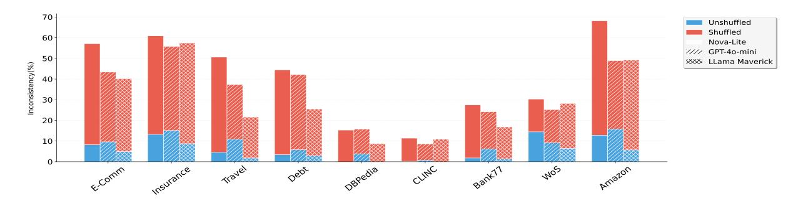
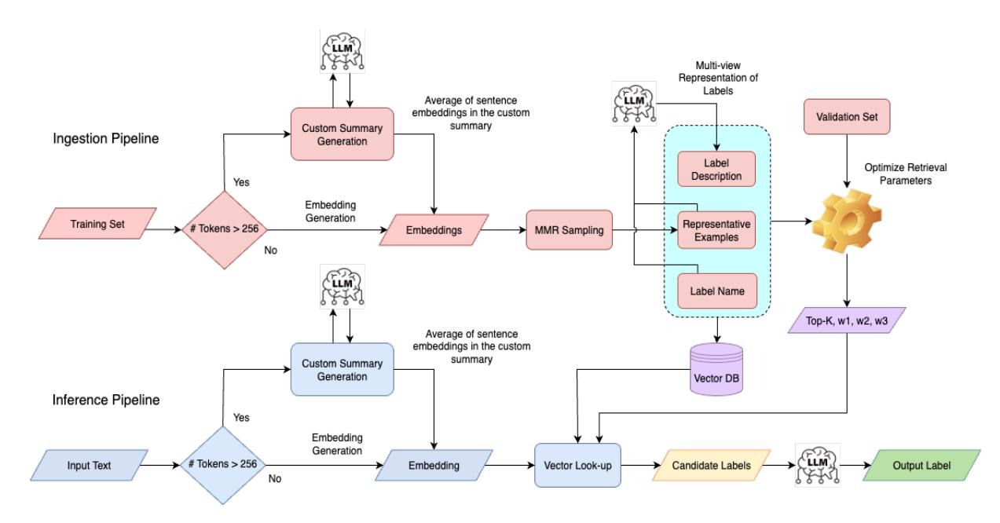

# Scalable and Cost Effective High-Cardinality Classification with LLMs via Multi-View Label Representations and Retrieval Augmentation

Anup Pattnaik Sasanka Rani Vutla[\\*](#page-0-0) Hamvir Dev\* Jeevesh Nandan[†](#page-0-0) Cijo Geroge†

Observe.AI, India

{anup.pattnaik, sasanka.vutla, hamvir.dev}@observe.ai {jeevesh.nandan, cijo.george}@observe.ai

# Abstract

Classifying contact center interactions into a large number of categories is critical for downstream analytics, but challenging due to high label cardinality, and cost constraints. While Large Language Models (LLMs) offer flexibility for such tasks, existing methods degrade with increasing label space, showing significant inconsistencies and sensitivity to label ordering. We propose a scalable, cost-effective two-step retrieval-augmented classification framework, enhanced with a multi-view representation of labels. Our method significantly improves accuracy and consistency over baseline LLM approaches. Experiments across 4 private and 5 open datasets yield performance improvements of upto 14.6% while reducing inference cost by 60-91% compared to baseline approaches.

# 1 Introduction

Contact centers record and store transcripts of interactions between agents and customers for multiple use cases, including agent quality assurance and business insights. With hundreds of thousands of interactions happening on a daily basis, large contact centers businesses often have the need to classify or label these interactions for targeted analysis and downstream workflows. For large businesses, these classes often run into the hundreds. Ability to classify interactions accurately even for minority categories is critical for downstream applications since the frequency of a category is often not a measure of the business value of it. Given the large volume of interactions, it is also imperative for such classification to be cost effective as well.

Established approaches for high-cardinality classification primarily focus on novel model architectures [\(Kowsari et al.,](#page-7-0) [2017;](#page-7-0) [Botzer et al.,](#page-7-1) [2023;](#page-7-1) [Lei et al.,](#page-7-2) [2022\)](#page-7-2), which demonstrate effectiveness

within specific domains or fixed label sets. However, this paradigm presents significant scalability challenges for contact center AI platforms used by enterprise and Business Process Outsourcing companies serving multiple business verticals that requires domain-specific label taxonomies, necessitating separate model development and maintenance, a resource-intensive approach that becomes prohibitively expensive at scale.

The dynamic nature of businesses further compounds these challenges. As organizations evolve, their requirements change, leading to frequent model retraining or complete redevelopment to accommodate new label categories or taxonomic restructuring. Additionally, curating high-quality labeled datasets for training domain-specific models remains a persistent bottleneck, particularly for specialized business domains where expert annotation is costly and time-consuming. These limitations highlight the critical need for flexible, generalizable approaches that can adapt to diverse label spaces without extensive retraining, while maintaining competitive performance across varied domains and evolving business requirements.

Recent advances in LLMs with large context sizes have made it possible to consider them as an alternative solution approach. Multiple strategies [\(Yu et al.](#page-8-0) [\(2023a\)](#page-8-0), [Yu et al.](#page-8-1) [\(2023b\)](#page-8-1), [\(Rubin](#page-8-2) [et al.,](#page-8-2) [2022\)](#page-8-2)) have been proposed for this including few shot learning and retrieval-based approaches. However, empirical studies conducted by us reveal limitations of these approaches with increasing cardinality. Specifically, with higher number of labels, responses generated by LLMs are found to be extremely sensitive to the *order* in which the labels are provided in the prompt [\(Liu et al.](#page-7-3) [\(2023\)](#page-7-3), [Zhang](#page-8-3) [et al.](#page-8-3) [\(2023c\)](#page-8-3), [Lu et al.](#page-7-4) [\(2022\)](#page-7-4)).

In this paper, we first establish the limitations of existing LLM-based approaches. We then propose a novel two-step retrieval-augmented classification technique with a multi-view representation of the

\*Equal contribution as second authors

†Equal contribution as third authors

labels. Through empirical results we show that the proposed approach significantly improves consistency and overall accuracy of results compared to existing LLM-based methodologies, in a cost effective manner.

Our key contributions in this work are:

- Sections 1, 2, and 3 introduce the highcardinality classification problem in contact centers and outline challenges with existing methods.
- Section 4 highlights the limitations of vanilla LLM-based classification under high label cardinality.
- Section 5 presents our scalable, cost-effective two-stage retrieval-augmented approach with multi-view label representations.
- Section 6 empirically validates our method via experiments and ablations on proprietary and public datasets.

#### 2 Problem Formulation

Given a dataset  $\mathcal{D} = \{(x_i, y_i)\}_{i=1}^n$  of input texts  $x_i$  and labels  $y_i \in \mathcal{Y} = \{y_1, \dots, y_L\}$ , and  $|\mathcal{Y}| = L \gg 1$  (high-cardinality label space), find a function  $f: \mathcal{X} \to \mathcal{Y}$ , minimizing output variance and classification error.

## 3 Data Sources and Composition

Empirical analysis and experimentation in this work are carried out with proprietary Contact Center datasets, as well as selected open datasets. These datasets, listed in Table 1, span diverse domains, and has high label cardinality in the range from 77 to 800.

#### 3.1 Contact Center Datasets

We use transcripts of agent-customer interactions in contact centers, in English, across four distinct domains: Insurance, E-Commerce, Travel, and Debt Collection1. This includes transcripts from both chat and voice interactions representing a wide variety of topics regularly handled by contact centers in these domains.

| Dataset         | #Labels | #Val Set | #Avg Tokens |
|-----------------|---------|----------|-------------|
| E-Commerce      | 120     | 10,000   | 1,200       |
| Insurance       | 800     | 10,000   | 1,320       |
| Travel          | 160     | 10,000   | 600         |
| Debt Collection | 200     | 10,000   | 2,000       |
| DBPedia         | 219     | 60,794   | 153         |
| CLINC150        | 150     | 4,500    | 15          |
| Banking77       | 77      | 3,000    | 13          |
| Web of Science  | 134     | 9,000    | 300         |
| Amazon Reviews  | 510     | 10,000   | 63          |

Table 1: Dataset Statistics for Internal Contact Center and Open Source Datasets

### 3.2 Open Datasets

To demonstrate the broader applicability of this work, we use the following 5 open datasets as is or adapted for our use case and experimental setup.

**Standard Open Datasets:** We use the following 2 single-label flat hierarchy datasets without modifications: CLINC150 (Larson et al., 2019) and Banking77 (Casanueva et al., 2020).

Adapted Open Datasets: To expand our analysis across more diverse data, we also adapt the following open datasets to suit our experimental setup and the primary use-case of single-label classification in contact centers: Leaf labels from the hierarchical datasets Amazon Reviews (Kashnitsky, 2020) and Web of Science (Kowsari et al., 2017) and DBPedia (Lehmann et al., 2015). We do not use the parent hierarchy information in any of the above datasets in the ingestion or inference pipeline.

# 4 Inconsistency in LLM Predictions for High-Cardinality Tasks

A key driver for this work is the observed lack of consistency in the predictions from large language models under varying label cardinality conditions. Our findings, shown in Figure 1, reveal a significant degradation in model reliability as the number of candidate labels increases, as detailed below.

#### 4.1 Impact of High Label Cardinality

We define Inconsistency as the variance in the outputs generated by an LLM when the same prompt or question is presented multiple times. In the classification task, to quantify inconsistency for a data point, we identify the modal class, the class predicted most frequently across trials, and count the number of times the LLM output deviates from this

&lt;sup>1These datasets cannot be released as they are proprietary.

Figure 1: Inconsistency in LLM Predictions in High-Cardinality Classification. Grouped bar chart showing average inconsistency in model predictions under shuffled and unshuffled label conditions for Nova-Lite, GPT-40-mini, and Llama 4 Mayerick 17B

modal class.

Inconsistency (%) = 
$$\frac{1}{M} \sum_{i=1}^{M} \mathbf{1}[y_i \neq y_{\text{modal}}] \times 100$$

where M is the number of prediction trials,  $y_i$  is the LLM output for the i-th trial,  $y_{\text{modal}}$  is modal class, and  $\mathbf{1}[\cdot]$  is the indicator function, equal to 1 if the condition is true and 0 otherwise.

For each dataset, we compute inconsistency across 100 LLM prediction trials on 5000 input samples and then take the average. The results across all datasets show significantly high inconsistency, with values of upto 15.8%, indicating substantial variance in LLM predictions.

#### 4.2 Influence of Label Ordering

We assess the impact of label ordering on prediction stability by shuffling candidate label sequences across multiple trials. Our analysis shows that models are highly sensitive to label order, with inconsistency values reaching up to 68% for near identical inputs. This sensitivity correlates with label cardinality, indicating that large language models struggle with consistent attention and reasoning over long label lists. Variance patterns point to positional bias and attention degradation as major factors affecting performance in high-cardinality settings. To isolate the effect of label ordering, we held prompt templates constant across runs. These results highlight the importance of our retrievalbased approach in reducing label space complexity and minimizing order-dependent variability.

#### 5 Proposed Methodology

We propose a retrieval-augmented classification framework that addresses the challenges of highcardinality label spaces by decomposing the classification task into two stages: **Stage 1: Candidate Label Retrieval:** The retrieval component serves as a filtering mechanism that reduces the classification search space from the full label vocabulary  $|\mathcal{L}|$  to a manageable subset of K candidates, where  $K \ll |\mathcal{L}|$ . We also introduce *multi-view* label representations to improve retrieval accuracy.

Stage 2: Final Classification: The classification component takes the K retrieved candidate labels and makes the final prediction using an LLM through zero-shot learning. This stage operates on a significantly reduced label space, enabling more focused decision-making, faster inference times and lower prompt processing cost.

In this section, we detail the different components of the proposed methodology, as shown in Figure 2, from ingestion to inference.

#### 5.1 Input pre-processing

For input texts exceeding 256 tokens, we apply task-aware summarization using an in-house fine-tuned FlanT5 7B model (Chung et al., 2022) to compress content to approximately 256 tokens while preserving classification-relevant information. Refer to Appendix F an example. This pre-processing step is motivated by empirical evidence demonstrating that embedding model performance degrades substantially with longer input sequences, consistent with findings in dense retrieval literature (Karpukhin et al., 2020; Reimers and Gurevych, 2019).

#### 5.2 Retrieval Setup

## 5.2.1 Sampling from Training Set

For each sample  $x_i$  with corresponding summary  $s_i$ , we compute sentence-level embeddings and de-

Figure 2: Two-stage retrieval-augmented classification pipeline. Ingestion pipeline creates multi-view label representations from summarized texts and extracts retrieval parameters (TopK, w1, w2, w3) post tuning. Inference pipeline retrieves top-K candidate labels via vector similarity and performs final classification using LLM

rive the document representation as:

$$\mathbf{e}i = \frac{1}{|S_i|} \sum j = 1^{|S_i|} \mathrm{Embed}(s_{i,j})$$

where  $S_i$  represents the set of sentences in summary  $s_i$ , and  $\operatorname{Embed}(\cdot)$  denotes the embedding function. We then select N representative samples for each label l, using Maximal Marginal Relevance (MMR) (Carbonell and Goldstein (1998)) to capture the semantic diversity within each label class.

#### 5.2.2 Multi-View Representation of Labels

Our label representation captures three complementary aspects, or *views*, of a given label: label name (Name View, (NV)), representative examples selected as described in Section 5.2.1 (Examples View, (EV)), and an LLM-generated description based on the label name and examples (Description View, (DV)) (Pattnaik et al. (2024))(Refer Appendix F for examples). Specifically, we create 3 distinct vector representations for each label *l*:

$$NV : \mathbf{v}_l^{(n)} = \text{Embed}(\text{Name}(l))$$
 (1)

$$DV : \mathbf{v}_l^{(d)} = \text{Embed}(\text{Description}(l))$$
 (2)

$$EV: \mathbf{V}_l^{(e)} = \{ \mathbf{e}_i : i \in \mathcal{R}_l \}$$
 (3)

These representations (*views*) are indexed on Pinecone (Systems (2021)) to enable efficient similarity-based retrieval during inference.

The composite similarity score for a query q and label l is computed as:

$$score(q, l) = w_1 \cos(\mathbf{q}, \mathbf{v}_l^{(n)}) + w_2 \cos(\mathbf{q}, \mathbf{v}_l^{(d)}) + w_3 \max_{\mathbf{e}_i \in \mathbf{V}_l^{(e)}} \cos(\mathbf{q}, \mathbf{e}_i), \tag{4}$$

where  $\mathbf{q} = \text{Embed}(q)$  and  $\sum_{i=1}^{3} w_i = 1$ .

#### 5.3 Retrieval Parameters & Accuracy

Retrieval accuracy is defined as follows:

$$Acc_{ret}@K = \frac{1}{|\mathcal{V}|} \sum_{(x,y)\in\mathcal{V}} \mathbf{1}[y \in TopK(x)]$$

where V is the validation set, and TopK(x) returns the K highest-scoring labels for input x.

We determine the ideal view weights  $\mathbf{w} = [w_1, w_2, w_3]$ , and number of retrieved candidates K by maximizing retrieval accuracy on a held-out validation set.

This is done via grid search over weight combinations w subject to the constraint that retrieval error rate  $\epsilon=1-\mathrm{Acc_{ret}}@K\leq 0.05$ . We constrain the retrieval parameter to  $20\leq K\leq 50$  based on empirical evidence that large language model classification performance deteriorates when presented with excessive label candidates. The computational cost of this grid search optimization remains minimal, as it involves only vector similarity computations without requiring expensive LLM inference

calls. Refer to Appendix [C](#page-10-0) for the optimal parameters across datasets.

# 5.4 Inference Pipeline

Inference pipeline is shown in Figure [2,](#page-3-0) and proceeds as follows: Given a document d, we first pre-process the input, if needed, as detailed in Section [5.1,](#page-2-3) and then compute the composite similarity scores using the learned weights w from Section [5.3](#page-3-1) to retrieve the top-K candidate labels. These labels and then sent to an LLM for final classification.

Our approach reduces the computational complexity from O(|L|) to O(K) where K ≪ |L|, while maintaining high classification accuracy through candidate selection based on multi-view label representations.

# 6 Evaluation

# 6.1 Performance Gains

Table [2](#page-5-0) compares our retrieval-augmented method with baselines across three state-of-the-art models: Nova-Lite [\(Services,](#page-8-5) [2024\)](#page-8-5), GPT-4o-mini [\(OpenAI,](#page-7-14) [2024a\)](#page-7-14), and Llama 4 Maverick 17B [\(AI,](#page-6-0) [2024\)](#page-6-0). Our two-stage pipeline with multi-view label representations consistently outperforms baselines, achieving up to 14.6% accuracy gains across models. Performance on Adapted Open Datasets (Section [3.2\)](#page-1-5) is relatively lower due to the exclusion of parent hierarchy information when classifying leaf nodes.

Results show strong gains across dataset categories. Internal contact center datasets see improvements over 9% in three of four domains. Open benchmarks also improve consistently, with gains from 4.6% to 14.6%, underscoring our method's robustness across domains and tasks.

To ensure fair comparison, we use identical input settings across all models, incorporating label names and descriptions into the prompt. Table [5](#page-11-0) highlights performance gains from using label descriptions. We use Claude Sonnet 3.5 [\(An](#page-6-1)[thropic,](#page-6-1) [2024\)](#page-6-1) for automated description generation and OpenAI's text-embedding-3-small [\(OpenAI,](#page-7-15) [2024b\)](#page-7-15) for dense vector representations, ensuring a consistent evaluation framework.

# 6.2 Ablation Studies

# 6.2.1 Multi-View Label Representation

We evaluate the impact of three label views—*name*, *description*, and *examples*—via weight optimization. Optimal weights vary by dataset, reflecting label space and domain characteristics.

Internal contact center datasets predominantly benefit from rich contextual representations, favoring balanced weighting between descriptions and examples (Pattern 1: 0.2, 0.4, 0.4), while knowledge-based datasets (DBPedia, Web of Science) and product reviews demonstrate superior performance with example-centric configurations (Pattern 2: 0.25, 0.25, 0.5). The universal requirement for non-zero weights across all three components validates the complementary contributions of label names, descriptions, and representative examples in high-cardinality classification scenarios. Table [3](#page-8-6) in Appendix presents the retrieval accuracy achieved across different weight configurations, confirming the necessity of multi-view label representations.

## 6.2.2 TopK Retrieval Analysis

The relatively modest Top-K values (all < 50) demonstrate that our retrieval mechanism effectively reduces the label search space while preserving classification performance. This validates our approach's capability to manage highcardinality scenarios without exhaustive label evaluation, achieving computational efficiency gains while maintaining accuracy. Table [4](#page-9-0) in Appendix illustrates the relationship between TopK values with retrieval and overall error rates, revealing optimal performance at tuned configurations that balance retrieval coverage with classification complexity.

### 6.3 Error Propagation Analysis

We analyze how retrieval-stage errors affect overall classification in our two-stage pipeline. Two error types are defined:

Retrieval Errors (Stage 1): Occur when the correct label is absent from the topK candidates. These are *irrecoverable*, as Stage 2 cannot predict unseen labels. Retrieval error is defined as:

$$\epsilon_{\text{ret}} = 1 - \text{Acc}_{\text{ret}}@K$$

$$= 1 - \frac{1}{|\mathcal{T}|} \sum_{(x,y)\in\mathcal{T}} \mathbb{I}[y \in \text{TopK}(x)] \quad (5)$$

Across datasets, ϵret ranges from 0.13% (CLINC150) to 10.66% (Travel), averaging 3.23%.

Classification Errors (Stage 2): Happen when the correct label is retrieved but misclassified. Conditional error is:

$$\epsilon_{\text{clslret}} = \frac{|\{(x, y) \in \mathcal{T} : y \in \text{TopK}(x) \land \hat{y} \neq y\}|}{|\{(x, y) \in \mathcal{T} : y \in \text{TopK}(x)\}|}$$

| Method | LLM   | E-0 | Com  | Ins  | sur  | Tra  | ivel | D   | ebt  | DBI | Pedia | CL  | INC  | Baı | ık77 | W    | os   | Ama  | azon |
|--------|-------|-----|------|------|------|------|------|-----|------|-----|-------|-----|------|-----|------|------|------|------|------|
|        |       | Inc | Acc  | Inc  | Acc  | Inc  | Acc  | Inc | Acc  | Inc | Acc   | Inc | Acc  | Inc | Acc  | Inc  | Acc  | Inc  | Acc  |
| ALC    | Nova  | 8.2 | 70.3 | 13.2 | 62.8 | 4.5  | 64.6 | 3.4 | 78.4 | 0   | 85.7  | 0.2 | 86.0 | 1.8 | 64.8 | 14.5 | 55.2 | 12.8 | 61.6 |
| ALC    | GPT   | 9.6 | 72.1 | 15.1 | 63.6 | 10.9 | 66.0 | 5.8 | 77.6 | 3.8 | 81.9  | 0.7 | 86.0 | 6.2 | 69.0 | 9.2  | 60.4 | 15.8 | 65.1 |
| ALC    | Llama | 4.9 | 69.4 | 8.7  | 60.2 | 1.8  | 70.4 | 2.9 | 75.2 | 0   | 79.5  | 0   | 82.5 | 1.4 | 69.4 | 6.4  | 56.5 | 5.7  | 62.3 |
| RAC    | Nova  | 2.2 | 84.3 | 2.5  | 71.1 | 1.8  | 74.6 | 1.8 | 86.1 | 0   | 92.3  | 0   | 94.5 | 1.2 | 80.8 | 2.6  | 60.8 | 0.6  | 65.4 |
| RAC    | GPT   | 2.5 | 83.8 | 4.6  | 73.2 | 6.3  | 72.4 | 2.6 | 88.2 | 1   | 92.8  | 0.3 | 95.4 | 1.9 | 84.0 | 4.4  | 66.5 | 8.6  | 69.7 |
| RAC    | Llama | 1.6 | 81.1 | 1.7  | 70.8 | 1.0  | 77.3 | 1.4 | 85.3 | 0   | 94.2  | 0   | 96.8 | 0.8 | 78.1 | 3.1  | 70.1 | 0.3  | 68.2 |

Table 2: Performance Comparison of All Label Classification (ALC) vs. Retrieval Augmented Classification (RAC) methods across three LLMs: Nova-Lite, GPT-4o-mini, and Llama 4 Maverick 17B. Metrics shown are Inconsistency (Inc) and Accuracy (Acc), with best values highlighted in bold.

Values range from 3.05% (CLINC150) to 28.1% (Web of Science), with an average of 15.37%.

**Error Distribution:** Total error combines both components:

$$\epsilon_{\text{total}} = \epsilon_{\text{ret}} + (1 - \epsilon_{\text{ret}}) \cdot \epsilon_{\text{cls/ret}}$$

On average, retrieval accounts for 15.3% of total errors; classification accounts for 84.7%. Contribution varies—e.g., retrieval dominates in Travel (47.01%) but is minor in Banking77, CLINC150 and DBPedia (Refer Appendix B).

## 6.4 Efficiency and Cost Analysis

The two-stage design offers significant computational gains. Since retrieval is faster than language model inference, our pipeline achieves a  $3.2 \times$  to  $8.7 \times$  speedup across datasets, with larger gains for high-cardinality label spaces.

Retrieval completes in 15–45 ms per query, while classification takes 200–1200 ms depending on topK and input length. This shows that retrieval adds minimal overhead while substantially reducing cost, upto 91%, with average being 72.36%, as shown in Table 8. Refer Section D for details on cost calculation and savings.

# 7 Related Work

Our work spans retrieval-augmented classification, high-cardinality label spaces, multi-view learning, and LLM consistency. Traditional classifiers struggle with large label sets, often mitigated through rebalancing (Bach et al., 2019; Chawla et al., 2002), augmentation (Wei and Zou, 2019), label hierarchy (Kowsari et al., 2017; Yang et al., 2016), label clustering (Tagami, 2017), or retrieval filtering.

RAG-based methods (Lewis et al., 2021) improve few-shot classification by retrieving exam-

ples (Chen et al., 2024; Zhan et al., 2025), with extensions to label retrieval (Zhu and Zamani, 2024).

Multi-view learning leverages complementary label signals (Xu and Tao, 2013; Sun, 2013; Andrew et al., 2013; Pattnaik et al., 2024; Li et al., 2019). Recent work (Wang et al., 2025; Zhang et al., 2023b) shows label descriptions aid classification. We extend this by retrieving labels using names, descriptions, and examples instead of direct classification.

LLMs perform well in zero-shot settings Yin et al. (2019), but degrade with large label spaces Zhang et al. (2023a) are sensitive to prompt formatting and label order Zhao et al. (2021); Lu et al. (2022), especially under high cardinality. By reducing the effective label space as a first step, we address these challenges with LLMs.

While recent approaches in extreme classification target massive label spaces with hundreds of thousands of classes (D'Oosterlinck et al., 2024; Zhu and Zamani, 2024), our work focuses on multiclass setting with fewer than 1,000 labels, where the goal is to predict a single intent per instance, consistent with our internal use case of call intent classification.

Finally, in contact center scenarios with domainspecific language and large intent sets, we show that retrieval-augmented methods help LLMs scale effectively.

## 8 Conclusion

We propose a scalable, cost-effective framework for high-cardinality classification using retrievalaugmented prompting and multi-view label representations. Unlike domain-specific architectures requiring custom development, our approach is dataset- and domain-agnostic, offering a unified solution across diverse scenarios. It improves accuracy by up to 14.6% and reduces prediction variance by over 9.4% compared to full-label prompting. Evaluated on four proprietary contact center datasets and five open benchmarks, our method consistently outperforms baselines while reducing inference costs by up to 91%. These results highlight the effectiveness of retrieval filtering and multi-view label modeling in enabling robust, generalizable LLM-based classification—eliminating the need for domain-specific model development and frequent retraining.

# 9 Ethical Considerations

Data Privacy: Our proprietary contact center datasets contain sensitive customer-agent interactions. All data used in this work were de-identified and anonymized to protect individual privacy. No personally identifiable information (PII) was accessible during model training or evaluation.

Bias and Fairness: Language models and embeddings used in this framework may carry biases present in pre-training data. While our retrievalaugmented approach improves consistency, it does not explicitly de-bias predictions. Future work could explore fairness-aware retrieval or prompt calibration techniques to mitigate such risks.

Deployment Impact: Automated classification in customer support has potential implications for workforce displacement or reduced human oversight. Our framework is intended to augment, not replace, human agents by improving triage and analytics in large-scale systems.

Generalization Limits: The use of multi-view label representations is domain-informed and tuned on specific datasets. Care should be taken when applying the method to domains with different linguistic characteristics or sensitive decision boundaries (e.g., healthcare, legal), where interpretability and accountability are critical.

Use of Open Datasets: All open datasets used are publicly released for research use under permissive licenses. We adhere to their terms and cite all sources appropriately.

# Limitations

While our framework shows promising results, it has the following limitations:

Dependence on Retrieval Quality: The effectiveness of the pipeline depends on accurate label retrieval. Retrieval failures (upto 10.66% in highcardinality settings) are unrecoverable by the classification stage.

View Weight Sensitivity: Multi-view weights (name, description, examples) vary by dataset. Generalizing these weights across domains without tuning may lead to performance drops.

Prompt Sensitivity: LLM outputs retain some sensitivity to prompt ordering and structure, especially with larger K, despite improvements in consistency.

Monolingual Focus: The current work is limited to English datasets. Applying the method to multilingual or mixed-language scenarios remains unexplored.

Lack of Joint Optimization: Retrieval and classification are optimized separately. An end-to-end trainable alternative could offer better performance but may reduce flexibility.

Off-the-shelf Embedding Models: Our framework relies on pre-trained, general-purpose embedding models for similarity computation, which may not capture domain-specific semantic relationships optimally. While this design choice ensures broad applicability and reduces computational overhead, it potentially limits performance compared to task-specific learned representations. A learnable re-ranker (e.g., shallow MLP or cross-encoder finetuned on validation data) could better capture labeltext relationships and reduce classification-stage errors, particularly for domains with specialized terminology or nuanced semantic distinctions.

# References

Meta AI. 2024. Llama 4 maverick 17b. Large Language Model. Hypothetical model for experimental purposes.

Amazon Web Services, Inc. 2023. Amazon bedrock: Build and scale generative ai applications with foundation models. [https://aws.amazon.com/](https://aws.amazon.com/bedrock/) [bedrock/](https://aws.amazon.com/bedrock/). Accessed June 2025.

Galen Andrew, Raman Arora, Jeff Bilmes, and Karen Livescu. 2013. Deep canonical correlation analysis. In *International conference on machine learning*, pages 1247–1255.

Anthropic. 2024. [Claude 3.5 sonnet.](https://www.anthropic.com/claude) Large Language Model. Accessed: 2024.

Małgorzata Bach, Aleksandra Werner, and Mateusz Palt. 2019. [The proposal of undersampling method for](https://doi.org/10.1016/j.procs.2019.09.167) [learning from imbalanced datasets.](https://doi.org/10.1016/j.procs.2019.09.167) *Procedia Computer Science*, 159:125–134.

- Nicholas Botzer, David Vasquez, Tim Weninger, and Issam Laradji. 2023. [Tk-knn: A balanced distance](https://arxiv.org/abs/2310.11607)[based pseudo labeling approach for semi-supervised](https://arxiv.org/abs/2310.11607) [intent classification.](https://arxiv.org/abs/2310.11607) *Preprint*, arXiv:2310.11607.
- Jaime Carbonell and Jade Goldstein. 1998. [The use of](https://doi.org/10.1145/290941.291025) [mmr, diversity-based reranking for reordering doc](https://doi.org/10.1145/290941.291025)[uments and producing summaries.](https://doi.org/10.1145/290941.291025) In *Proceedings of the 21st Annual International ACM SIGIR Conference on Research and Development in Information Retrieval*, SIGIR '98, page 335–336, New York, NY, USA. Association for Computing Machinery.
- Iñigo Casanueva, Amine Nouali, Pei-Hao Su, Christophe Cerisara, Yen-Chun Liu, and Matthew Henderson. 2020. [Efficient intent detection with dual](https://aclanthology.org/2020.nlp4convai-1.6/) [sentence encoders.](https://aclanthology.org/2020.nlp4convai-1.6/) In *Proceedings of the 2nd Workshop on Natural Language Processing for Conversational AI*, pages 38–45.
- N. V. Chawla, K. W. Bowyer, L. O. Hall, and W. P. Kegelmeyer. 2002. [Smote: Synthetic minority over](https://doi.org/10.1613/jair.953)[sampling technique.](https://doi.org/10.1613/jair.953) *Journal of Artificial Intelligence Research*, 16:321–357.
- Huiyao Chen, Yu Zhao, Zulong Chen, Mengjia Wang, Liangyue Li, Meishan Zhang, and Min Zhang. 2024. [Retrieval-style in-context learning for few](https://arxiv.org/abs/2406.17534)[shot hierarchical text classification.](https://arxiv.org/abs/2406.17534) *Preprint*, arXiv:2406.17534.
- Hyung Won Chung, Le Hou, Shayne Longpre, Barret Zoph, Yi Tay, William Fedus, Xuezhi Wang, Mostafa Dehghani, Zhifeng Dai, William Chan, Sharan Narang, Jacob Devlin, Adam Roberts, and Quoc V. Le. 2022. [Scaling instruction-finetuned lan](https://arxiv.org/abs/2210.11416)[guage models.](https://arxiv.org/abs/2210.11416) *arXiv preprint arXiv:2210.11416*.
- Karel D'Oosterlinck, Omar Khattab, François Remy, Thomas Demeester, Chris Develder, and Christopher Potts. 2024. [In-context learning for extreme multi](https://arxiv.org/abs/2401.12178)[label classification.](https://arxiv.org/abs/2401.12178) *Preprint*, arXiv:2401.12178.
- Vladimir Karpukhin, Barlas Oguz, Sewon Min, Patrick Lewis, Ledell Wu, Sergey Edunov, Danqi Chen, and Wen-tau Yih. 2020. [Dense passage retrieval for open](https://doi.org/10.18653/v1/2020.emnlp-main.550)[domain question answering.](https://doi.org/10.18653/v1/2020.emnlp-main.550) In *Proceedings of the 2020 Conference on Empirical Methods in Natural Language Processing (EMNLP)*, pages 6769–6781, Online. Association for Computational Linguistics.
- Yury Kashnitsky. 2020. [Hierarchical text classification.](https://doi.org/10.34740/KAGGLE/DSV/1054619)
- Kamran Kowsari, Donald E. Brown, Mojtaba Heidarysafa, Kiana Jafari Meimandi, Matthew S. Gerber, and Laura E. Barnes. 2017. [Hdltex: Hierarchical](https://doi.org/10.1109/icmla.2017.0-134) [deep learning for text classification.](https://doi.org/10.1109/icmla.2017.0-134) In *2017 16th IEEE International Conference on Machine Learning and Applications (ICMLA)*, page 364–371. IEEE.
- Stefan Larson, Anish Mahendran, Joseph J Peper, Christopher Clarke, Andrew Lee, Parker Hill, Jonathan K Kummerfeld, Kevin Leach, Michael A Laurenzano, Lingjia Tang, and Jason Mars. 2019. [An](https://doi.org/10.18653/v1/D19-1131)

- [evaluation dataset for intent classification and out-of](https://doi.org/10.18653/v1/D19-1131)[scope prediction.](https://doi.org/10.18653/v1/D19-1131) In *Proceedings of the 2019 Conference on Empirical Methods in Natural Language Processing (EMNLP)*, pages 1311–1316.
- Jens Lehmann, Robert Isele, Max Jakob, Anja Jentzsch, Dimitris Kontokostas, Pablo N. Mendes, Sebastian Hellmann, Mohamed Morsey, Patrick van Kleef, Sören Auer, and Christian Bizer. 2015. [Dbpedia–a](https://doi.org/10.3233/SW-140134) [large-scale, multilingual knowledge base extracted](https://doi.org/10.3233/SW-140134) [from wikipedia.](https://doi.org/10.3233/SW-140134) *Semantic Web*, 6(2):167–195.
- Tianyi Lei, Honghui Hu, Qiaoyang Luo, Dezhong Peng, and Xu Wang. 2022. Adaptive meta-learner via gradient similarity for few-shot text classification. In *Proceedings of the 29th International Conference on Computational Linguistics (COLING)*, pages 4873– 4882, Gyeongju, Republic of Korea. International Committee on Computational Linguistics.
- Patrick Lewis, Ethan Perez, Aleksandra Piktus, Fabio Petroni, Vladimir Karpukhin, Naman Goyal, Heinrich Küttler, Mike Lewis, Wen tau Yih, Tim Rocktäschel, Sebastian Riedel, and Douwe Kiela. 2021. [Retrieval-augmented generation for knowledge](https://arxiv.org/abs/2005.11401)[intensive nlp tasks.](https://arxiv.org/abs/2005.11401) *Preprint*, arXiv:2005.11401.
- Yingming Li, Ming Yang, and Zhongfei Zhang. 2019. [A](https://doi.org/10.1109/tkde.2018.2872063) [survey of multi-view representation learning.](https://doi.org/10.1109/tkde.2018.2872063) *IEEE Transactions on Knowledge and Data Engineering*, 31(10):1863–1883.
- Nelson F Liu, Kevin Lin, John Hewitt, Ashwin Paranjape, Yonatan Belinkov, Hassan Sajjad, and Hannaneh Hajishirzi. 2023. Lost in the middle: How language models use long contexts. In *Transactions of the Association for Computational Linguistics*, volume 11, pages 1–17.
- Yao Lu, Max Bartolo, Alastair Moore, Sebastian Riedel, and Pontus Stenetorp. 2022. [Fantastically](https://arxiv.org/abs/2104.08786) [ordered prompts and where to find them: Over](https://arxiv.org/abs/2104.08786)[coming few-shot prompt order sensitivity.](https://arxiv.org/abs/2104.08786) *Preprint*, arXiv:2104.08786.
- OpenAI. 2024a. [Gpt-4o-mini: Advancing cost-efficient](https://openai.com/index/gpt-4o-mini-advancing-cost-efficient-intelligence/) [intelligence.](https://openai.com/index/gpt-4o-mini-advancing-cost-efficient-intelligence/) Technical Report. Small model in the GPT-4o family optimized for cost and efficiency.
- OpenAI. 2024b. [Openai embeddings api: text](https://platform.openai.com/docs/guides/embeddings)[embedding-3-small.](https://platform.openai.com/docs/guides/embeddings) API Documentation. Version: text-embedding-3-small.
- Anup Pattnaik, Cijo George, Rishabh Kumar Tripathi, Sasanka Vutla, and Jithendra Vepa. 2024. [Improving](https://doi.org/10.18653/v1/2024.emnlp-industry.54) [hierarchical text clustering with LLM-guided multi](https://doi.org/10.18653/v1/2024.emnlp-industry.54)[view cluster representation.](https://doi.org/10.18653/v1/2024.emnlp-industry.54) In *Proceedings of the 2024 Conference on Empirical Methods in Natural Language Processing: Industry Track*, pages 719– 727, Miami, Florida, US. Association for Computational Linguistics.
- Nils Reimers and Iryna Gurevych. 2019. [Sentence-bert:](https://arxiv.org/abs/1908.10084) [Sentence embeddings using siamese bert-networks.](https://arxiv.org/abs/1908.10084) *Preprint*, arXiv:1908.10084.

- Ohad Rubin, Jonathan Herzig, and Jonathan Berant. 2022. [Learning to retrieve prompts for in-context](https://arxiv.org/abs/2112.08633) [learning.](https://arxiv.org/abs/2112.08633) *Preprint*, arXiv:2112.08633.
- Amazon Web Services. 2024. [Amazon nova lite.](https://aws.amazon.com/bedrock/nova/) Large Language Model. Accessed: 2024.
- Shiliang Sun. 2013. A survey of multi-view machine learning. In *Neural Computing and Applications*, volume 23, page 2031–2038. Springer.
- Pinecone Systems. 2021. [Pinecone: Vector database for](https://www.pinecone.io/) [machine learning.](https://www.pinecone.io/) Vector Database Platform. Accessed: 2024.
- Yukihiro Tagami. 2017. [Annexml: Approximate nearest](https://doi.org/10.1145/3097983.3097987) [neighbor search for extreme multi-label classification.](https://doi.org/10.1145/3097983.3097987) In *Proceedings of the 23rd ACM SIGKDD International Conference on Knowledge Discovery and Data Mining*, KDD '17, page 455–464, New York, NY, USA. Association for Computing Machinery.
- Yau-Shian Wang, Wei-Cheng Chang, Jyun-Yu Jiang, Jiong Zhang, Hsiang-Fu Yu, and S. V. N. Vishwanathan. 2025. [Retrieval-augmented encoders for](https://arxiv.org/abs/2502.10615) [extreme multi-label text classification.](https://arxiv.org/abs/2502.10615) *Preprint*, arXiv:2502.10615.
- Jason Wei and Kai Zou. 2019. [EDA: Easy data augmen](https://doi.org/10.18653/v1/D19-1670)[tation techniques for boosting performance on text](https://doi.org/10.18653/v1/D19-1670) [classification tasks.](https://doi.org/10.18653/v1/D19-1670) In *Proceedings of the 2019 Conference on Empirical Methods in Natural Language Processing and the 9th International Joint Conference on Natural Language Processing (EMNLP-IJCNLP)*, pages 6382–6388, Hong Kong, China. Association for Computational Linguistics.
- Chao Xu and Dacheng Tao. 2013. A survey on multiview learning. *IEEE Transactions on Knowledge and Data Engineering*, 26(6):149–172.
- Zichao Yang, Diyi Yang, Chris Dyer, Xiaodong He, Alex Smola, and Eduard Hovy. 2016. [Hierarchical](https://doi.org/10.18653/v1/N16-1174) [attention networks for document classification.](https://doi.org/10.18653/v1/N16-1174) In *Proceedings of the 2016 Conference of the North American Chapter of the Association for Computational Linguistics: Human Language Technologies*, pages 1480–1489, San Diego, California. Association for Computational Linguistics.
- Wenpeng Yin, Jamaal Hay, and Dan Roth. 2019. [Bench](https://doi.org/10.18653/v1/D19-1404)[marking zero-shot text classification: Datasets, eval](https://doi.org/10.18653/v1/D19-1404)[uation and entailment approach.](https://doi.org/10.18653/v1/D19-1404) In *Proceedings of the 2019 Conference on Empirical Methods in Natural Language Processing and the 9th International Joint Conference on Natural Language Processing (EMNLP-IJCNLP)*, pages 3914–3923, Hong Kong, China. Association for Computational Linguistics.
- Guoxin Yu, Lemao Liu, Haiyun Jiang, Shuming Shi, and Xiang Ao. 2023a. Retrieval-augmented few-shot text classification. In *Findings of the Association for Computational Linguistics: EMNLP*, pages 6721– 6735. ACL.

- Wenhao Yu, Dan Iter, Shuohang Wang, Yichong Xu, Mingxuan Ju, Soumya Sanyal, Chenguang Zhu, Michael Zeng, and Meng Jiang. 2023b. Generate rather than retrieve: Large language models are strong context generators. In *International Conference on Learning Representations*.
- Zaifu Zhan, Shuang Zhou, Xiaoshan Zhou, Yongkang Xiao, Jun Wang, Jiawen Deng, He Zhu, Yu Hou, and Rui Zhang. 2025. [Retrieval-augmented in-context](https://arxiv.org/abs/2505.02087) [learning for multimodal large language models in](https://arxiv.org/abs/2505.02087) [disease classification.](https://arxiv.org/abs/2505.02087) *Preprint*, arXiv:2505.02087.
- Kai Zhang, Bernal Jimenez Gutierrez, and Yu Su. 2023a. [Aligning instruction tasks unlocks large language](https://doi.org/10.18653/v1/2023.findings-acl.50) [models as zero-shot relation extractors.](https://doi.org/10.18653/v1/2023.findings-acl.50) In *Findings of the Association for Computational Linguistics: ACL 2023*, pages 794–812, Toronto, Canada. Association for Computational Linguistics.
- Ruohong Zhang, Yau-Shian Wang, Yiming Yang, Donghan Yu, Tom Vu, and Likun Lei. 2023b. [Long-tailed](https://doi.org/10.18653/v1/2023.findings-eacl.81) [extreme multi-label text classification by the retrieval](https://doi.org/10.18653/v1/2023.findings-eacl.81) [of generated pseudo label descriptions.](https://doi.org/10.18653/v1/2023.findings-eacl.81) In *Findings of the Association for Computational Linguistics: EACL 2023*, pages 1092–1106, Dubrovnik, Croatia. Association for Computational Linguistics.
- Yue Zhang, Yafu Li, Leyang Cui, Deng Cai, Lemao Liu, Tingchen Fu, Xinting Huang, Enbo Zhao, Yu Zhang, Yulong Chen, Longyue Wang, Anh Tuan Luu, Wei Bi, Freda Shi, and Shuming Shi. 2023c. [Siren's song](https://arxiv.org/abs/2309.01219) [in the ai ocean: A survey on hallucination in large](https://arxiv.org/abs/2309.01219) [language models.](https://arxiv.org/abs/2309.01219) *Preprint*, arXiv:2309.01219.
- Tony Z. Zhao, Eric Wallace, Shi Feng, Dan Klein, and Sameer Singh. 2021. [Calibrate before use: Im](https://arxiv.org/abs/2102.09690)[proving few-shot performance of language models.](https://arxiv.org/abs/2102.09690) *Preprint*, arXiv:2102.09690.
- Yaxin Zhu and Hamed Zamani. 2024. [Icxml:](https://arxiv.org/abs/2311.09649) [An in-context learning framework for zero-shot](https://arxiv.org/abs/2311.09649) [extreme multi-label classification.](https://arxiv.org/abs/2311.09649) *Preprint*, arXiv:2311.09649.

# A Ablation Studies

### A.1 Weight Configuration Analysis

| w1   | w2   | w3   | Acc. (%) |
|------|------|------|----------|
| 1.0  | 0.0  | 0.0  | 84.2     |
| 0.0  | 1.0  | 0.0  | 92.4     |
| 0.0  | 0.0  | 1.0  | 93.8     |
| 0.5  | 0.25 | 0.25 | 94.2     |
| 0.25 | 0.5  | 0.25 | 94.6     |
| 0.25 | 0.25 | 0.5  | 95.4     |
| 0.33 | 0.33 | 0.34 | 94.6     |
| 0.2  | 0.4  | 0.4  | 95.0     |
|      |      |      |          |

Table 3: Retrieval Accuracy with various weight values on Amazon Reviews Dataset

To validate the necessity of multi-view label representations and determine optimal weight configurations, we conduct a comprehensive ablation study

on the Amazon Reviews dataset. We systematically evaluate different combinations of weights w1 (label names), w2 (label descriptions), and w3 (representative examples) where w1+w2+w3 = 1.

Table [3](#page-8-6) presents the retrieval accuracy achieved across various weight configurations, ranging from single-component approaches to balanced multiview combinations.

# A.1.1 Key Findings

Single-Component Limitations: Approaches relying solely on individual components show significant performance gaps. Label names alone achieve only 84.2% accuracy, highlighting the inadequacy of simple lexical matching for complex classification tasks. While label descriptions (92.4%) and representative examples (93.8%) perform better individually, they still underperform compared to multi-view approaches.

Multi-View Superiority: All multi-view combinations outperform single-component approaches, with the best configuration (0.25, 0.25, 0.5) achieving 95.4% accuracy—a 11.2% improvement over label names alone and 1.6% over the best singlecomponent method.

Component Contribution Analysis: Representative examples demonstrate the highest individual contribution (93.8%), followed by label descriptions (92.4%) and label names (84.2%). This hierarchy reflects the semantic richness of each component, with concrete examples providing stronger discriminative signals than abstract descriptions or concise names.

Optimal Weight Distribution: The bestperforming configuration emphasizes representative examples (w3 = 0.5) while maintaining balanced contributions from names and descriptions (w1 = w2 = 0.25). This suggests that while examples provide the strongest signal, complementary information from names and descriptions remains valuable for comprehensive label representation.

Robustness of Multi-View Approach: The consistent performance improvements across different multi-view configurations (94.2%-95.4%) demonstrate the robustness of our approach, with even suboptimal weight combinations significantly outperforming single-component methods.

These findings validate our multi-view design philosophy and provide empirical evidence for the complementary nature of different label representation modalities in high-cardinality classification tasks.

## A.2 Top-K Retrieval Ablation Study

We conduct a systematic ablation study to analyze the impact of Top-K values on both retrieval and overall classification performance. Table [4](#page-9-0) presents error rates across three representative datasets with varying Top-K configurations.

| TopK  |      | Amazon  |      | DBPedia | Travel |         |  |
|-------|------|---------|------|---------|--------|---------|--|
|       | Ret. | Overall | Ret. | Overall | Ret.   | Overall |  |
| 10    | 8.68 | 42.2    | 0.58 | 9.2     | 33.27  | 47.23   |  |
| 50    | 3.53 | 40.2    | 0.04 | 10.4    | 10.66  | 25.4    |  |
| 100   | 2.00 | 48.8    | 0.02 | 12.2    | 2.20   | 48.71   |  |
| Tuned | 4.6  | 34.6    | 0.16 | 7.7     | 10.66  | 25.4    |  |

Table 4: TopK impact on error rates. Ret. = Retrieval Error (%), Overall = Overall Error (%).

## A.2.1 Key Findings

Retrieval-Classification Trade-off: All datasets exhibit a consistent pattern where increasing Top-K values improve retrieval accuracy (lower retrieval error) but may degrade classification performance due to increased decision complexity. For Amazon, retrieval error decreases from 8.68% (K=10) to 2.00% (K=100), while overall error fluctuates between 40.2% and 48.8%.

Dataset-Specific Optimal Points: Each dataset demonstrates distinct optimal Top-K ranges. DB-Pedia, with its well-structured categorical hierarchy, achieves excellent retrieval performance even at low K values (0.58% at K=10), while Travel dataset requires higher K values to achieve reasonable retrieval accuracy (33.27% at K=10 vs. 2.20% at K=100).

Diminishing Returns Pattern: The relationship between Top-K and retrieval error follows a logarithmic decay pattern across all datasets. The most significant improvements occur in the lower K ranges (10→50), with marginal gains at higher values (50→100), suggesting an optimal efficiency zone around K=20-50.

Domain Complexity Correlation: Knowledgebased datasets (DBPedia) demonstrate superior retrieval performance across all K values, with retrieval errors consistently below 0.6%. In contrast, conversational datasets (Travel) show higher retrieval errors, reflecting the semantic complexity and ambiguity inherent in natural language interactions.

Tuned Configuration Superiority: The hyperparameter-tuned configurations consistently outperform fixed K values, achieving optimal balance between retrieval coverage and classification accuracy. Amazon's tuned configuration (K=28) achieves 4.6% retrieval error and 34.6% overall error, outperforming all fixed K alternatives.

Classification Bottleneck: Despite excellent retrieval performance, classification errors remain the dominant contributor to overall error rates. This pattern suggests that future improvements should focus on enhancing the classification stage rather than further optimizing retrieval parameters.

These findings validate our adaptive TopK approach and demonstrate the importance of datasetspecific hyperparameter tuning for optimal performance in diverse domains.

# A.3 Impact of Label Descriptions on Classification Performance

To quantify the contribution of label descriptions to classification accuracy, we conduct a systematic comparison between name-only prompts (N) and name-plus-description prompts (N+D) across both baseline All Label Classification (ALC) and our proposed Retrieval Augmented Classification (RAC) approaches.

Table [5](#page-11-0) presents comprehensive results across all datasets and language models, revealing consistent patterns in how descriptive information enhances classification performance.

# A.3.1 Key Findings

Universal Description Benefit: Label descriptions consistently improve classification performance across 89% of all experimental configurations (24 out of 27 cases), with average improvements of 6.2% for ALC and 8.4% for RAC approaches. This demonstrates the universal value of contextual information in disambiguating label semantics.

Domain-Specific Impact Patterns: The magnitude of description benefits varies significantly across domains. Contact center datasets show the most substantial improvements, with E-Commerce achieving up to 14.9% gains (Nova RAC: 70.9% → 84.3%) and Debt Collection showing consistent 6- 8% improvements across all models. This reflects the semantic ambiguity inherent in conversational data where label names alone provide insufficient discriminative information.

Retrieval Augmentation Amplifies Description Value: RAC consistently demonstrates higher description benefits compared to ALC. For instance, CLINC150 shows 8.5% average improvement under RAC versus 4.3% under ALC, suggesting that focused label sets enable more effective utilization of descriptive information by reducing cognitive load and attention dilution.

Model-Specific Sensitivity: Different LLMs exhibit varying sensitivity to descriptive information. GPT-4o-mini shows the most consistent improvements across datasets (average 7.8%), while Llama Maverick demonstrates higher variability, with exceptional gains in some domains (CLINC150: 7.9% improvement) but minimal benefits in others (Amazon Reviews: 0.5% improvement).

Structured vs. Conversational Data: Wellstructured datasets (DBPedia, Web of Science) show modest description benefits (2-4% average), while conversational datasets (contact center domains) demonstrate substantial gains (6-15% average). This pattern indicates that descriptions are particularly valuable when label names are ambiguous or when domain-specific terminology requires clarification.

Diminishing Returns in Simple Domains: Some datasets show minimal or negative impact from descriptions (e.g., Web of Science with Nova), suggesting that overly detailed descriptions may introduce noise in domains where label names are already sufficiently discriminative.

These findings validate our multi-view approach and demonstrate that label descriptions serve as crucial contextual anchors, particularly in highcardinality scenarios where semantic disambiguation is essential for accurate classification.

# B Error Breakdown Between Retrieval and Classification

Table [6](#page-11-2) shows the error breakdown between retrieval and classification across all datasets.

# C Optimal Retrieval Parameters

Table [7](#page-11-3) shows the the observed optimal retrieval parameters for each dataset based on grid search.

# D Cost Calculation

The total prompt tokens for each interaction are calculated as:

Total Tokens = Input Text Tokens +(Label Count × Avg Label Tokens) (6)

where Average Label Tokens encompasses both label names and descriptions. For ALC, Label

|     | App LLM |      | E-Com |      | Insur |      | Travel |      | Debt |      | DBP  |      | Clinc |      | Bank |      | WOS  |      | Amzn |
|-----|------------|------|-------|------|-------|------|--------|------|------|------|------|------|-------|------|------|------|------|------|------|
|     |            | N    | N+D   | N    | N+D   | N    | N+D    | N    | N+D  | N    | N+D  | N    | N+D   | N    | N+D  | N    | N+D  | N    | N+D  |
| ALC | Nova       | 62.6 | 70.3  | 57.5 | 62.8  | 66.9 | 64.6   | 70.1 | 78.4 | 85.3 | 85.7 | 83.0 | 86.0  | 64.8 | 64.8 | 61.2 | 55.2 | 60.9 | 61.6 |
|     | GPT        | 65.1 | 72.1  | 59.1 | 63.6  | 58.0 | 66.0   | 68.4 | 77.6 | 81.1 | 81.9 | 75.3 | 86.0  | 60.0 | 69.0 | 62.4 | 60.4 | 63.1 | 65.1 |
|     | Llama      | 64.9 | 69.4  | 55.8 | 60.2  | 69.3 | 70.4   | 68.2 | 75.2 | 89.2 | 79.5 | 80.9 | 82.5  | 58.7 | 69.4 | 62.9 | 56.5 | 66.1 | 62.3 |
| RAC | Nova       | 70.9 | 84.3  | 63.9 | 71.1  | 66.0 | 74.6   | 80.5 | 86.1 | 83.9 | 92.3 | 86.0 | 94.5  | 64.8 | 80.8 | 61.9 | 60.8 | 62.9 | 65.4 |
|     | GPT        | 68.9 | 83.8  | 66.2 | 73.2  | 63.0 | 72.4   | 82.2 | 88.2 | 86.1 | 92.8 | 88.2 | 95.4  | 68.8 | 84.0 | 66.4 | 66.5 | 68.5 | 69.7 |
|     | Llama      | 68.1 | 81.1  | 64.3 | 70.8  | 71.0 | 77.3   | 79.9 | 85.3 | 92.3 | 94.2 | 88.9 | 96.8  | 70.6 | 78.1 | 63.4 | 70.1 | 67.7 | 68.2 |

Table 5: Performance Comparison: All Label vs. Retrieval Augmented Classification

Acronyms: ALC = All Label Classification, RAC = Retrieval Augmented Classification; Nova = Nova-Lite, GPT = GPT-4o-mini, Llama = Llama Maverick; N = Name only, N+D = Name + Description

| Dataset         | Retrieval (%) | Classification (%) |
|-----------------|---------------|--------------------|
| E-Commerce      | 4.3           | 11.9               |
| Insurance       | 4.9           | 23.02              |
| Travel          | 10.66         | 13.45              |
| Debt Collection | 1.6           | 10.37              |
| DBPedia         | 0.16          | 5.68               |
| CLINC150        | 0.13          | 3.05               |
| Banking77       | 0.2           | 15.83              |
| Web of Science  | 2.5           | 28.1               |
| Amazon Reviews  | 4.6           | 26.93              |

Table 6: Error breakdown between retrieval and classification across datasets

| Dataset         | TopK | w1   | w2   | w3   |
|-----------------|------|------|------|------|
| E-Commerce      | 32   | 0.2  | 0.4  | 0.4  |
| Insurance       | 44   | 0.33 | 0.33 | 0.34 |
| Travel          | 50   | 0.2  | 0.4  | 0.4  |
| Debt Collection | 25   | 0.2  | 0.4  | 0.4  |
| DBPedia         | 20   | 0.25 | 0.25 | 0.5  |
| CLINC150        | 20   | 0.2  | 0.4  | 0.4  |
| Banking77       | 20   | 0.2  | 0.4  | 0.4  |
| Web of Science  | 20   | 0.25 | 0.25 | 0.5  |
| Amazon Reviews  | 28   | 0.25 | 0.25 | 0.5  |

Table 7: Optimal Retrieval Parameters for Each Dataset

Count equals the full label set size (#L), while for RAC, it equals the TopK retrieved candidates.

We take the average tokens per interaction for eahc dataset from Table [1](#page-1-3) and derive average number of tokens for label representation(combining name and description). All cost calculations use Llama 4 Maverick 17B pricing from AWS Bedrock [\(Amazon Web Services, Inc.](#page-6-4) [\(2023\)](#page-6-4)) at \$0.0024 per 1,000 input tokens.

Table [8](#page-11-1) demonstrates substantial cost savings achieved through our retrieval-augmented approach. The most dramatic savings occur in highcardinality scenarios, with Insurance dataset showing 91.5% cost reduction (\$9,900 → \$845 per million interactions) due to its large label space (800 labels reduced to 44 candidates).

| Dataset         | #L  | K  | ALC Tokens | RAC Tokens | ALC Cost | RAC Cost | Save % |
|-----------------|-----|----|---------------|---------------|-------------|-------------|-----------|
| E-Commerce      | 120 | 32 | 7200          | 2800          | \$1700      | \$672       | 61.1      |
| Insurance       | 800 | 44 | 41300         | 3500          | \$9900      | \$845       | 91.5      |
| Travel          | 160 | 50 | 8600          | 3100          | \$2100      | \$744       | 63.9      |
| Debt Collection | 200 | 25 | 12000         | 3300          | \$2900      | \$780       | 72.9      |

Table 8: Cost Analysis for 1M Interactions: All Label Classification (ALC) vs. Retrieval Augmented Classification (RAC). #L = Label Count, K = TopK threshold. Tokens = Average prompt tokens per interaction. Save% = RAC cost reduction over ALC.

Token Efficiency: RAC consistently reduces prompt sizes by 61-92% across all datasets. For instance, E-Commerce prompts decrease from 7,200 to 2,800 tokens per interaction, representing a 61.1% reduction. This efficiency stems from our ability to focus on relevant label subsets rather than exhaustive label enumeration.

Scalability Benefits: Cost savings scale proportionally with label cardinality. Datasets with larger label spaces (Insurance: 800 labels, Debt Collection: 200 labels) achieve higher savings percentages compared to smaller label sets (E-Commerce: 120 labels), demonstrating the approach's particular value in high-cardinality scenarios.

Economic Viability: At enterprise scale, these savings translate to significant operational cost reductions. For a contact center processing 10 million interactions annually on the Insurance dataset, RAC would save approximately \$90,550 in LLM processing costs alone, while maintaining superior classification accuracy.

The cost analysis excludes generation tokens as our prompts explicitly constrain model outputs to single label predictions, resulting in negligible generation costs (typically 5-15 tokens per interaction). This design choice ensures that the primary cost driver remains input token processing, where our retrieval mechanism delivers maximum economic impact.

# E Prompt Templates

This section provides the complete prompt templates used in our experiments. All prompts were designed to ensure consistency across different language models and datasets while maintaining clarity and specificity for each task.

# F Dataset Examples

Table [10](#page-14-0) shows an example of an Agent-Customer interaction transcript and corresponding custom summary.

Table [11](#page-14-1) shows examples of label descriptions and custom summaries, demonstrating disambiguation through detailed descriptions.

| Task              | Prompt                                                                                                                                                                                                                                                |
|-------------------|-------------------------------------------------------------------------------------------------------------------------------------------------------------------------------------------------------------------------------------------------------|
| Label Description | Given a label name and some training examples corresponding to that label, please generate a 1-2 line description for the label.                                                                                                                   |
|                   | Here is the label name: <label></label>                                                                                                                                                                                                               |
|                   | Here are the examples: <examples></examples>                                                                                                                                                                                                          |
|                   | Give a description in 1-2 lines.                                                                                                                                                                                                                      |
| Summary           | Summarize the following text within 256 tokens while preserving information most relevant for the following classification task:                                                                                                                   |
|                   | <classification task=""></classification>                                                                                                                                                                                                             |
|                   | Here is the input text : <text></text>                                                                                                                                                                                                                |
| Classification    | ### Instructions: Given the list of labels with descriptions, clas sify the following text into one of the categories. Analyze the text, the provided labels and their descriptions to classify the input text into most appropriate labels. |
|                   | Each label is in the format: (Name : Description).                                                                                                                                                                                                    |
|                   | Provide only the label name. Make sure to pick category from the list of categories.                                                                                                                                                               |
|                   | ### Text:                                                                                                                                                                                                                                             |
|                   | <text></text>                                                                                                                                                                                                                                         |
|                   | ### Labels:                                                                                                                                                                                                                                           |
|                   | <labels></labels>                                                                                                                                                                                                                                     |
|                   | ### Give Output in below format (in between "<" and ">"):                                                                                                                                                                                             |
|                   | <label name=""></label>                                                                                                                                                                                                                               |

Table 9: Prompts used for Summary, Label Description and Classification

#### Agent-Customer Transcript (>256 tokens) Custom Summary

Agent: Thank you for calling customer support, my name is Sarah, how can I help you today?

Customer contacted support regarding inability to download invoice PDF from their account portal. Agent troubleshooted the technical issue and provided alternative method to access the invoice document.

Customer: Hi, I'm having trouble with my account. I'm trying to download my invoice but it's not working.

Agent: I'm sorry to hear that. Can you tell me more about what's happening when you try to download the invoice?

Customer: I log into my account portal and go to the billing section. I see my invoice from last month, but when I click the download button, nothing happens. Sometimes it says "error."

Agent: So you're able to see the invoice but getting an error when downloading. Is that correct? Customer: Yes, exactly. I need this for my expense report at work, so I really need to get this PDF downloaded.

Agent: I can definitely help you with that. Let me verify your account information. Can you provide your email address?

Customer: Sure, it's john.smith@email.com.

Agent: Perfect, thank you John. I can see your account and the November 15th invoice.

What browser are you using? Customer: Google Chrome.

Agent: Have you tried clearing your browser cache?

Customer: I tried refreshing but haven't cleared the cache. I'm not really tech-savvy. Agent: No worries. Let me try a different approach. Can you right-click on the download

button?

Customer: Right-click? Okay, let me try... Yes, I see some options here.

Agent: Great! Do you see "Save link as" or "Save target as"?

Customer: I see "Save link as."

Agent: Perfect! Try clicking on that option.

Customer: Okay... Oh! It's asking where to save it. Should I save it to my desktop?

Agent: Yes, that's perfect.

Customer: It's downloading! I can see the progress bar. That's great! Agent: You're welcome, John. Is there anything else I can help with today?

Customer: No, that covers everything. Thanks again!

Agent: Perfect. Have a great day!

Table 10: Example of an Agent-Customer Tnteraction Transcript and Corresponding Custom Summary

| Label                | Label Description                                                                                                                                                                                                                                                                                                                               | Input Text/Custom Summary                                                                                                                                                                                                            |
|----------------------|-------------------------------------------------------------------------------------------------------------------------------------------------------------------------------------------------------------------------------------------------------------------------------------------------------------------------------------------------|--------------------------------------------------------------------------------------------------------------------------------------------------------------------------------------------------------------------------------------|
| Invoice/ Re ceipt | User needs assistance with their order invoices or re ceipts. This also includes technical issues preventing viewing or downloading invoices or receipts, and where a user requests help with modification, missing or incor rect details, specific invoice requests, or adjustments to how they receive their invoice/receipts. | Customer contacted support regarding inability to download invoice PDF from their account portal. Agent troubleshooted the technical is sue and provided alternative method to access the invoice document.              |
| Tech Issues          | Customer experiences technical problems with the app or online platform, including crashes, slow performance, unresponsive buttons, login failures, loading errors, and other software malfunctions that prevent normal app functionality.                                                                                          | Customer reported that photo upload feature in app is not working, showing error message when trying to attach documents. Agent con firmed known issue with image processing and provided alternative submission method. |

Table 11: Example Label Definitions and Custom Summaries Demonstrating Disambiguation Through Detailed Descriptions