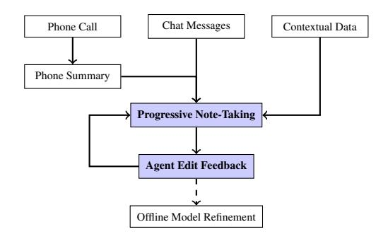
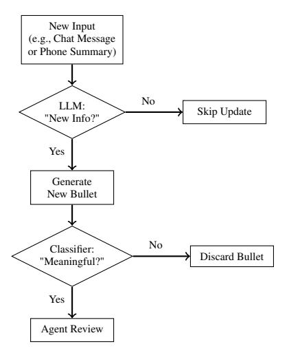
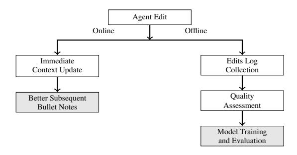
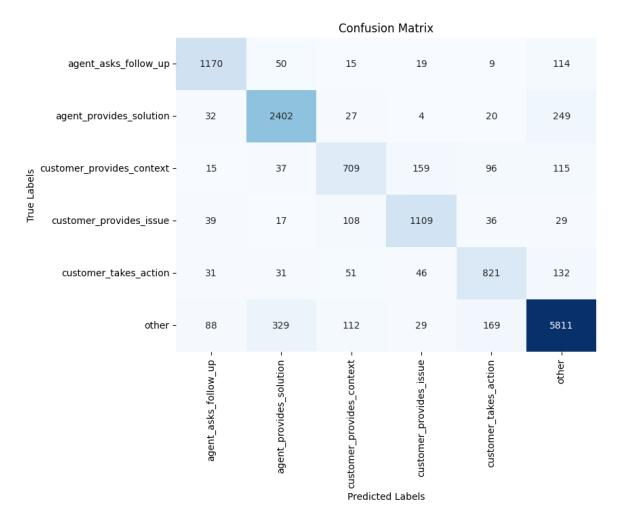
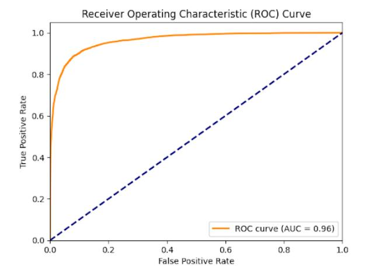
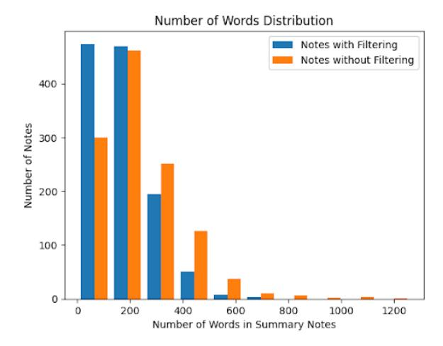

# Incremental Summarization for Customer Support via Progressive Note-Taking and Agent Feedback

# Yisha Wu Cen (Mia) Zhao Yuanpei Cao Xiaoqing Xu Yashar Mehdad Mindy Ji Claire Na Cheng

Airbnb Inc., USA

{yisha.wu, mia.zhao, yuanpei.cao, xiaoqing.xu yashar.mehdad, mindy.ji, claire.cheng}@airbnb.com

# Abstract

We introduce an incremental summarization system for customer support agents that intelligently determines when to generate concise bullet notes during conversations, reducing agents' context-switching effort and redundant review. Our approach combines a fine-tuned Mixtral-8×7B model for continuous note generation with a DeBERTa-based classifier to filter trivial content. Agent edits refine the online notes generation and regularly inform offline model retraining, closing the agent edits feedback loop. Deployed in production, our system achieved a 3% reduction in case handling time compared to bulk summarization (with reductions of up to 9% in highly complex cases), alongside high agent satisfaction ratings from surveys. These results demonstrate that incremental summarization with continuous feedback effectively enhances summary quality and agent productivity at scale.

## 1 Introduction

Customer support agents manage complex interactions across phone, chat, and email. Agents must quickly identify core customer issues, track prior actions, and produce accurate notes. These notes are usually mandatory for handoffs, compliance, and quality audits. Industry studies show that writing these summary notes consumes roughly 10% of case handling duration time, thus increasing context-switching effort and total working time [\(ASAPP Inc.,](#page-6-0) [2024\)](#page-6-0). Two primary challenges exacerbate this issue:

Long multi-source inputs Real-world customer interactions often involve lengthy, unstructured texts and transcripts spanning thousands of tokens. As showed by DialogSum [\(Chen et al.,](#page-7-0) [2021\)](#page-7-0), this complexity makes it difficult for agents to quickly pinpoint crucial information precisely during the interactions with customers. See Appendix [A](#page-8-0) for common challenges.

High accuracy demands. Accurate summaries are essential for effective issue resolution. Any inaccuracies or omissions can lead to degraded decision-making and reduced customer satisfaction [\(Liu et al.,](#page-7-1) [2021\)](#page-7-1).

Our Contributions Most current summarization tools operate post-conversation without providing limited real-time support or leveraging chunkbased method to produce real-time summary based on length, which cannot address agents' contextswitching effort effectively. We introduce a *realtime incremental notes generation system* designed to reduce agents' context-switching effort and enhance efficiency through two key innovations: (i) a *Progressive Note-Taking with Quality Control* workflow that intelligently determines optimal moments to generate concise notes using a summarization LLM and a subsequent relevance classifier, and (ii) an *Agent-Edits Learning Framework*, in which agents' real-time edits immediately refine the online notes generation and periodically contribute to offline model refinement.

Deployed in production, the system reduces the average handling time by 3%, and up to 9% for complex scenarios, secures agent satisfaction scores over 80%, showing that incremental summarization with live human feedback can effectively lower context-switching effort without sacrificing quality.

## 2 Related Works

Managing long multi-source inputs Previous work on long customer support interactions uses hierarchical summarization and chunk-based methods. These approaches either aggregate summaries from smaller segments [\(Li et al.,](#page-7-2) [2021\)](#page-7-2); or regenerate summaries periodically as input exceeds thresholds. These have been extensively explored in customer service and structured meeting domains [\(Wang et al.,](#page-7-3) [2025;](#page-7-3) [Manuvinakurike et al.,](#page-7-4)

[2021\)](#page-7-4). While recent LLMs can process very long contexts, these generally lack precise update mechanisms needed for real-time agent support.

Ensuring High Accuracy Existing work focuses on extractive and taxonomy-driven summarization, selecting key dialogue elements by speaker role, intent, or domain taxonomy to create coherent summaries [\(Lin et al.,](#page-7-5) [2021;](#page-7-5) [Stolcke et al.,](#page-7-6) [2000\)](#page-7-6). Human-in-the-loop optimization methods, such as reinforcement learning from human feedback and preference ranking, further improve factual precision and alignment with user expectations [\(Ken](#page-7-7)[nington et al.,](#page-7-7) [2023;](#page-7-7) [Stiennon et al.,](#page-7-8) [2022\)](#page-7-8).

Evaluation with AI Recent studies explore LLM-as-a-judge (LLM-judge) for automated assessment of summaries quality, showing promising correlation with expert judgments but also highlighting prompt sensitivity and bias risks [\(Zheng](#page-8-1) [et al.,](#page-8-1) [2023;](#page-8-1) [Chen et al.,](#page-7-9) [2024\)](#page-7-9). In parallel, RL from AI feedback (RLAIF) replaces or augments human preference data with model-generated feedback, e.g., Constitutional AI, scaled RLAIF, reducing labeling cost while requiring calibration against human rubrics [\(Bai et al.,](#page-7-10) [2022;](#page-7-10) [Lee et al.,](#page-7-11) [2023\)](#page-7-11).

Our approach extends these previous methods by introducing a production-deployed real-time summarization workflow, integrating incremental summary generation with targeted topic-based redundancy filtering, incorporates immediate edits from agents. Offline, an agent-edits learning framework leverages agent edits and an LLM-judge to curate preference pairs and automate evaluation, enabling efficient model iteration.

## 3 System Architecture and Methods

Our unified summarization system integrates multichannel conversations into continuously generated summary bullet notes. Agents can provide realtime edits to these notes in the UI, and their edits further refine model through periodic offline retraining (Figure [1\)](#page-1-0).

# 3.1 Progressive Note-Taking with Quality Control

The system uses progressive note-taking, generating summary bullets only when substantial new information is detected (Figure [2\)](#page-1-1). The summarization LLM proposes candidate updates. A subsequent relevance classifier filters out trivial or redundant bullets, retaining critical updates. Agent edits provide implicit validation for summary quality.

<span id="page-1-0"></span>

Figure 1: System Architecture

<span id="page-1-1"></span>

Figure 2: Progressive Note-Taking Workflow.

# 3.1.1 LLM-based Summarization with Continuous Bullet Generation

We fine-tuned a Mixtral-8x7B [\(Jiang et al.,](#page-7-12) [2024\)](#page-7-12) model to generate summary notes that meet the product requirements. The system operates using an iterative prompting strategy. Each invocation uses a dynamic prompt composed of task instructions, contextual data (case metadata, agent/customer profiles), full interaction history (chat, calls, emails), and previously generated and accepted bullets.

Continuous summarization uses *prefix prompting* and *in-context learning*. Each model response is prefixed with previous bullets, instructing the LLM to generate only new, incremental bullets from recent dialogue turns. If no new content is identified, the LLM returns an empty response. see Appendix [C.1](#page-8-2) for prompt working examples.

This iterative approach is essential, as naively re-summarizing the entire history each turn would discard agent edits to previous generated bullets. By preserving agent edit feedback, our method ensures that agent edits persist in all subsequent summary updates.

# 3.1.2 Bullet Relevance Classifier for Filtering

To improve the relevancy and conciseness of summary bullets, we fine-tuned an pretrained De-BERTa [\(He et al.,](#page-7-13) [2021\)](#page-7-13) based classifier to filter out non-essential updates, such as generic acknowledgments or redundant statements. The classifier retains only high-value utterances categorized as:

- customer\_provides\_issue: Customer describes a problem or concern.
- customer\_provides\_context: Customer shares additional details about their situation or requirements.
- customer\_takes\_action: Customer states a particular action taken or intended.
- agent\_asks\_follow\_up: Agent queries for further clarification or detail.
- agent\_provides\_solution: Agent offers a solution, recommendation, or commitment.

The bullet classifier achieved an ROC AUC of 0.96, a macro F1 of 0.801, and a micro F1 of 0.845. For production, we use it as a binary classifier, retaining any of the five target classes and filtering the others, resulting in an F1 of 0.895. Detailed fine-tuning methods and results are in Appendix [D.](#page-9-0)

#### 3.2 Agent Edits Learning Framework

Agent edits are integral to our system's continuous improvement, operating through both online and offline mechanisms (Figure [3\)](#page-2-0).

<span id="page-2-0"></span>

Figure 3: Dual-path Agent Edit Feedback Workflow.

### 3.2.1 Online Interaction Updates

When the progressive note-taking workflow generates a new summary bullet, it appears in the agents' UI, allowing agents to correct errors, add missing details, etc. These edits are immediately saved and inform subsequent LLM prompts, ensuring the LLM continuously uses the most accurate and agent-verified information. See Appendix [C.2](#page-8-3) how agent edits continuously update the prompt.

## 3.2.2 Offline Model Refinement

To continuously improve the summarization LLM, we implement an offline pipeline that uses agent edits as valuable training signals.

All agent edits are logged as the original LLMgenerated bullet ("before-edit") and the agentmodified version ("after-edit"). However, since not all edits improve quality, some may reflect individual preferences or case-specific requirements, we process these edits as follows:

- Initial Quality Assessment: Each "afteredit" bullet is verified through a LLM-based evaluation and a sampled human review for correctness and completeness.
- Conditional High-Quality Rewrite: Bullets failing initial quality checks are rewritten by a powerful LLM, guided by verification feedback, to ensure consistent quality standards.
- Pairwise Preference Data Generation: "before-" and "after-edit" pairs are compared by LLM and human review. Only pairs with clear quality improvement are included in finetuning dataset, thus ensuring generalizable and meaningful training data.

Validated pairs are structured into a training corpus for further summarization LLM refinement using supervised fine-tuning (SFT) and preference alignment (DPO and ORPO [\(Rafailov et al.,](#page-7-14) [2024;](#page-7-14) [Hong et al.,](#page-7-15) [2024\)](#page-7-15)). Detailed dataset preparation and fine-tuning methodologies are in Appendix [E.](#page-9-1)

## 4 Evaluation Metrics

We define explicit metrics to evaluate the summarization quality both offline and online. Offline metrics ensure precise measurement of summary quality, while online metrics measure real-world operational effectiveness.

## <span id="page-2-1"></span>4.1 Offline Metrics

Summary quality is assessed through conciseness, completeness, and truthfulness. Completeness and truthfulness evaluations use human reviewers and GPT-4o [\(OpenAI et al.,](#page-7-16) [2024\)](#page-7-16) based automated LLM Judges, following the same evaluation guidelines. See details in Appendix [K.](#page-12-0)

• Conciseness: Measured as token reduction ratio from original input to summarized output:

Conciseness = 1 − Toutput\_summary\_tokens Tinput\_conversation\_tokens

- Completeness: Evaluates coverage of critical case interaction elements. Each sub-metric below is evaluated as a binary outcome (yes/no), with the overall score as their average:
  - Customer Issue: Clearly stated customer problems.
  - Agent Commitment: Explicit promises and intended follow-up actions from agents.
  - Agent Solution: Key solutions and actions provided by agents.
- Truthfulness: Assesses factual accuracy compared to original interactions. Similarly evaluated as binary outcomes (yes/no) across:
  - Customer Issue: Accurate interpretation of the user's stated issue.
  - Agent Commitment: Correct representation of commitments or promises made by agents.
  - Agent Other Action: Precise documentation of other relevant agent activities.

### 4.1.1 LLM Judge vs Human Annotators

We compared the GPT-4o based LLM judge against traditional human annotation on 522 case samples with conversation and model generated summary notes. An expert auditor produced gold labels using the binary rubric: (i) customer issue covered, (ii) agent commitment captured, (iii) truthfulness to the raw conversation. Detailed human annotation guidelines can be found in Appendix [J.](#page-11-0)

Both the LLM judge and the human annotators evaluated the model summary with the same binary rubrics. The human annotations were aggregated by majority over three passes, while the LLM judge was set at temperature 0 for stable results.

Table [1](#page-3-0) reports each evaluator compared to the audited gold. The results indicated that the LLM judge showed superior performance, outperforming the human annotators in almost all metrics. Beyond these, the LLM judge offered a significant throughput advantage, processing evaluations approximately 15 times faster than our human annotators.

# 4.1.2 Limitations of Standard Metrics

Standard metrics like BERTScore [\(Zhang et al.,](#page-8-4) [2020\)](#page-8-4) mainly assess semantic similarity, which do not capture our core needs: factual accuracy and task-oriented utility. The complexity of customer

<span id="page-3-0"></span>

|                      | Accuracy | Precision      | Recall | F1    |  |
|----------------------|----------|----------------|--------|-------|--|
|                      |          |                |        |       |  |
|                      |          | Customer Issue |        |       |  |
| LLM Judge            | 0.974    | 0.941          | 0.593  | 0.727 |  |
| Human                | 0.959    | 0.654          | 0.630  | 0.642 |  |
| Agent Commitment     |          |                |        |       |  |
| LLM Judge            | 0.965    | 0.389          | 0.583  | 0.467 |  |
| Human                | 0.965    | 0.333          | 0.333  | 0.333 |  |
| Overall Truthfulness |          |                |        |       |  |
| LLM Judge            | 0.935    | 0.410          | 0.727  | 0.525 |  |
| Human                | 0.929    | 0.333          | 0.456  | 0.385 |  |

Table 1: GPT-4o LLM Judge vs Human Annotators, Comparing to Gold Labels from Expert Audits

interactions also means there is no single "gold" summary, making these metrics unreliable.

Therefore, we mainly rely on the LLM-judgebased approach for these task-oriented accuracy and effectiveness. Standard metrics like BERTScore serve only as supplementary references as shown in Appendix [F.](#page-10-0)

## 4.2 Online Metrics

To evaluate the effectiveness and impact of the system in the real world, we analyze the following online business metrics:

- Agent Satisfaction: Measured via a postrollout survey using a five-point Likert scale ("extremely dissatisfied" to "extremely satisfied"), distributed to agent cohorts in English, French, and Spanish, with this new feature. Survey details are in Appendix [G.](#page-10-1)
- Agent Working Time: Defined as the total duration of case handling in minutes, from the initial customer interaction until case resolution.
- Customer NPS (Net Promoter Score): Calculated based on customer responses to standard NPS surveys sent within 14 days after case resolution. See Appendix [I](#page-11-1) for details.

## 5 Experiment Results

# 5.1 Background and Motivation

Our previous system used a fine-tuned Mixtral-8x7B model from task-specific annotated data (see Appendix [E\)](#page-9-1) to generate summaries at the end of the conversation. While it performed well compared to agent-written notes (see Appendix [H\)](#page-10-2),

agents reported a key limitation: they needed summaries generated *incrementally during* conversations, not just at the end, to save working time.

To address this and reduce agents' contextswitching effort, we conducted a two-phase experiments to assess the impact and effectiveness of the new incremental summarization system.

### 5.2 Offline Experiment

We conducted offline experiments on 1,200 random sampled production case conversations. These experiments aimed to validate summary quality prior to production roll-out, focusing specifically on: (1) the iterative model improvements derived from agent edit feedback learning, (2) the impact of the bullet classifier to the note-taking workflow.

### 5.2.1 Model Iteration Improvements

We conducted the offline comparison to benchmark incremental improvements from our iterative finetuning via agent feedback learning. Evaluations were performed in three progressive model stages:

- 1. Mixtral-Base: The Mixtral base model without any fine-tuning.
- 2. Mixtral-NF (No Feedback): Fine-tuned variant using a task-specific dataset without incorporating agent edits, served to generate summary at the end of the case conversation.
- 3. Mixtral-FB (Feedback): Further fine-tuned from Mixtral-NF by integrating agent edit feedback, served to generate higher quality summaries for note-taking.

We included GPT-4o as a state-of-the-art external benchmark. Models were asked to summarize the whole conversation. Summary notes were evaluated using the LLM judge approach on completeness, truthfulness, conciseness as mentioned in Section [4.1.](#page-2-1) We also calculated the overall as the average of the three aspects.

The results in Table [2](#page-5-0) showed clear incremental gains in all aspects from Mixtral-Base to the finetuned Mixtral-NF, and to Mixtral-FB through agent edit feedback integration. The Mixtral-FB model has the best completeness 0.842, truthfulness 0.996, and overall scores 0.885.

While GPT-4o had better completeness, its lower conciseness and operational constraints (latency, cost, data privacy) prevented its deployment (see Appendix [B\)](#page-8-5). Our fine-tuned model via agent edit

feedback (Mixtral-FB) data offered the optimal balance of performance and feasibility.

We also performed a paired t-test and paired bootstrap analysis with 10k replicates of the dataset, to verify the significance of performance differences between each model's overall score. The results in Table [3](#page-5-1) confirmed significant improvements between Mixtral-FB and Mixtral-NF or GPT-4o, while there was no significant difference between Mixtral-NF and GPT-4o.

## 5.2.2 Comparative Analysis of Incremental Summarization Methods

We conducted an ablation study on the same 1,200 case conversations to evaluate the impact of bullet classifier filtering (BCF) on progressive note-taking workflow. Each example was summarized twice using the Mixtral-FB based note-taking workflow, with and without BCF. We also compared them to the traditional chunk-based summarization methods (200- and 500-word chunks). Summaries were evaluated using the same LLM judge method as in the offline model comparison (Table [4\)](#page-6-1).

Although enabling the BCF slightly reduced completeness, it did not significantly affect truthfulness. The overall scores also increased from 0.880 to 0.888 due to improved conciseness. Summary length decreased by 26.5% on average and 24.9% at the median (see Appendix [D](#page-9-0) for summary length distribution).

The chunk-based approach yielded lower truthfulness and conciseness, further supporting the effectiveness of our approach. Greater conciseness also enhanced readability and allowed agents to extract key information more efficiently, as confirmed by internal pilot feedback.

#### 5.2.3 Benchmark on Public Datasets

We benchmarked Mixtral-Base, Mixtral-NF, and Mixtral-FB models on the SAMSum [\(Gliwa et al.,](#page-7-17) [2019\)](#page-7-17) and DialSum [\(Chen et al.,](#page-7-0) [2021\)](#page-7-0) datasets, comparing them with a few other LLM baselines. BERTScore results were reported in Table [5.](#page-6-2)

While our refined model performed best on these public datasets, these are mainly for reference purposes. Our primary evaluation and development use a curated internal dataset, which better captures the length, complexity, and domain-specific standards critical to our application.

<span id="page-5-0"></span>

|              | Completeness       | Truthfulness       | Conciseness        | Overall            |
|--------------|--------------------|--------------------|--------------------|--------------------|
| Mixtral-Base | $0.585 \pm 0.0138$ | $0.989 \pm 0.0035$ | $0.788 \pm 0.0109$ | $0.787 \pm 0.0053$ |
| Mixtral-NF   | $0.824 \pm 0.0107$ | $0.995 \pm 0.0012$ | $0.819 \pm 0.0093$ | $0.879 \pm 0.0047$ |
| Mixtral-FB   | $0.842 \pm 0.0011$ | $0.996 \pm 0.0019$ | $0.818 \pm 0.0095$ | $0.885 \pm 0.0049$ |
| GPT-4o       | $0.846 \pm 0.0073$ | $0.995 \pm 0.0008$ | $0.788 \pm 0.0134$ | $0.876 \pm 0.0053$ |

Table 2: Model Comparison Results. Scores reported as mean with 95% CI (higher is better).

<span id="page-5-1"></span>

| Comparison                                                       | 95% Bootstrap CI                                         | p-value                                         |
|------------------------------------------------------------------|----------------------------------------------------------|-------------------------------------------------|
| Mixtral-FB vs NF<br>Mixtral-FB vs GPT-40<br>Mixtral-NF vs GPT-40 | [+0.28%, +0.96%]<br>[+0.46%, +1.28%]<br>[-0.65%, +0.13%] | $4.6 \times 10^{-4}  4.1 \times 10^{-5}  0.202$ |

Table 3: Model Comparison Significance Results.

## 5.3 Online Experiment

#### **5.3.1** Online Experiment Setup

Due to the infeasibility of direct A/B testing caused by agent experience variance and scheduling complexities, we leveraged a Diff-in-Diff (DiD) (Abadie, 2005) based quasi-experiment to evaluate our system's real-world impact.

- **Treatment Group:** Pilot sites adopting the progressive note-taking workflow.
- Control Group: All other sites, which continued to use the bulk summary at the end of the conversation.

The control group agent workflow is that the agents read prior notes and conversations, chat with customer, take actions, write notes; if multiple agents are involved in the case, repeat multiple times. In the treatment group, there is no need to manually write notes, as they are automatically generated by the progressive note-taking workflow.

By comparing performance changes in both groups from three months before to one month after rollout, the DiD model isolates the feature's true impact from external trends and site-level differences.

#### <span id="page-5-2"></span>5.3.2 Model Serving Configurations

The progressive note-taking workflow triggers the LLM inference at every new message or phone call. Inference is performed via NVIDIA Triton using TensorRT-LLM, with each model instance allocated 2 A100 GPUs. The p50 latency is 600 ms, and p95 is 2s.

The bullet classifier is invoked for each LLM-generated bullet. It is served using an internal model serving framework with an A10G GPU. The p50 latency is 20 ms, and p95 is 40 ms.

#### **5.3.3** Online Experiment Results

**Agent Satisfaction.** Surveys from over a thousand agents showed high satisfaction with the summary feature: **95.2%** (English), **81.8%** (French), and **89.4%** (Spanish) reported being "Satisfied" or "Very Satisfied".

These satisfaction scores come from the postpilot survey targeting this feature, where agents were asked whether the summarization product benefits them.

Agent Working Time Reduction. Our online DiD analysis evaluated over 92% of production cases from control and treatment sites. This revealed overall 3% agent working time reduction (p-val < 0.001), with up to 9% reduction for most complex cases (defined as cases **involving 3+ agents**, usually with solving time > 100 min).

These time savings come from: (i) modelgenerated notes reduced manual writing; (ii) comprehensive and easy to follow notes reduced reading raw conversations. Thus these complex cases could see a larger working time reduction. Our offline analysis showed that:

- Agents' manual note-writing time ratio decreased from 10% to 3% after this feature roll-out.
- Model generated notes have higher completeness than agent's manual notes (0.871 vs 0.624 in Appendix H).

At our production volume, these reductions correspond to  $O(10^5-10^6)$  agent hours saved annually, implying multi-million dollar cost savings annually.

Appendix L showed a real-world study on how our incremental summarization feature improved continuity, reduced redundancy, and minimized agent effort in complex, multi-agent, multi-channel case solving process.

**Customer NPS.** The customer NPS results remain neutral across different languages, indicating that there is no observable negative impact on customer satisfaction.

<span id="page-6-1"></span>

|                                    | Completeness       | Truthfulness       | Conciseness        | Overall            |
|------------------------------------|--------------------|--------------------|--------------------|--------------------|
| Mixtral-FB Note-Taking without BCF | $0.901 \pm 0.0094$ | $0.998 \pm 0.0016$ | $0.740 \pm 0.0095$ | $0.880 \pm 0.0045$ |
| Mixtral-FB Note-Taking with BCF    | $0.868 \pm 0.0135$ | $0.996 \pm 0.0022$ | $0.800 \pm 0.0078$ | $0.888 \pm 0.0052$ |
| Mixtral-FB with 200-Word Chunks    | $0.868 \pm 0.0104$ | $0.964 \pm 0.0065$ | $0.690 \pm 0.0078$ | $0.841 \pm 0.0049$ |
| Mixtral-FB with 500-Word Chunks    | $0.871 \pm 0.0107$ | $0.976 \pm 0.0040$ | $0.783 \pm 0.0081$ | $0.877 \pm 0.0047$ |

Table 4: Incremental Summarization Ablation Comparison. Scores reported as mean with 95% CI (higher is better).

<span id="page-6-2"></span>

|                 | SAMSum             | DialogSum          |
|-----------------|--------------------|--------------------|
| Mixtral-Base    | $0.874 \pm 0.0010$ | $0.861 \pm 0.0007$ |
| Mixtral-NF      | $0.881 \pm 0.0011$ | $0.866 \pm 0.0007$ |
| Mixtral-FB      | $0.888 \pm 0.0012$ | $0.871 \pm 0.0007$ |
| Llama-2-ROR-FG* | $0.685 \pm 0.0008$ | $0.757 \pm 0.0010$ |

Table 5: BERTScore F1 Comparison on Public Datasets for Reference. Results marked with \* are from Tian et al. (2024)

#### 6 Learnings

#### 6.1 Learnings on Model Serving

We evaluated optimizations in quantization and inference frameworks. 8-bit quantization reduced GPU usage (from two A100s to one) with similar latency and 1% drop in completeness and truthfulness (tested on 2,500 cases). Furthermore, replacing vLLM with TensorRT-LLM reduced model inference latency by 20% at p50 and p90.

The final serving stack (Section 5.3.2) adopts BF16 with TensorRT-LLM, selected for the best quality in the desired latency budget, while 8-bit was retained as an efficiency fallback.

#### **6.2** Learnings on Multilingual Performance

Offline evaluations revealed language-specific challenges in multilingual summarization. French summaries had lower truthfulness, mainly due to numeric inaccuracies from complex number structures, such as representing (e.g., "quatre-vingt-quatre" for 84, literally " $4 \times 20 + 4$ ""). Spanish summaries had lower completeness in capturing agent solutions, due to varied verb conjugations and passive (e.g., indicative "enviaré", conditional "enviaría").

#### 7 Conclusions

We introduced an incremental summarization system for customer support scenarios, leveraging progressive note-taking coupled with continuous agent feedback learning. Our approach utilizes a fine-tuned Mixtral-based LLM paired with a DeBERTa-based classifier to dynamically generate

high-quality and concise summary bullets. Extensive offline evaluations validated our design, showing that iterative refinement with agent edits feedback is key for real-world alignment. Ablation studies also confirmed that the integrated bullet classifier improves summary relevance and conciseness. Real-world experiment on over 92% of production cases showed a substantial business impact, reducing overall agent handling time by 3%, and up to 9% for complex cases, achieving high agent satisfaction in multi-language deployments. These confirmed the system's effectiveness in improving operational efficiency and agent experience.

Future work will extend our system to additional languages beyond English, Spanish, and French, and incorporate multimodal contexts such as images. Additionally, we plan to further experiment with continuous retraining and updating of the classifier based on ongoing agent feedback.

#### Limitations

Despite the demonstrated effectiveness of our system, several limitations remain. First, reliance on a GPT-4o-based LLM-judge for quality assessment may introduce evaluation biases or inaccuracies compared to human judgments. Second, the bullet classifier occasionally mis-classifies content, potentially causing omissions or irrelevant updates. Continuous retraining of this classifier using agent feedback will be important to improve classification accuracy and overall agent experience. Finally, summarization performance varies across different languages, and efficiently adapting our system to new languages remains a challenge for future work.

### References

<span id="page-6-3"></span>Alberto Abadie. 2005. Semiparametric difference-in-differences estimators. *The Review of Economic Studies*, 72(1):1–19.

<span id="page-6-0"></span>ASAPP Inc. 2024. Aht meaning: What is average handle time? https://www.asapp.com/blog/aht-meaning-what-is-average-handle-time/. Accessed Jul 2025. Archived at https:

- [//web.archive.org/web/20250704192237/](https://web.archive.org/web/20250704192237/https://www.asapp.com/blog/aht-meaning-what-is-average-handle-time) [https://www.asapp.com/blog/](https://web.archive.org/web/20250704192237/https://www.asapp.com/blog/aht-meaning-what-is-average-handle-time) [aht-meaning-what-is-average-handle-time](https://web.archive.org/web/20250704192237/https://www.asapp.com/blog/aht-meaning-what-is-average-handle-time).
- <span id="page-7-10"></span>Yuntao Bai, Saurav Kadavath, Sandipan Kundu, Amanda Askell, Jackson Kernion, Andy Jones, Anna Chen, Anna Goldie, Azalia Mirhoseini, Cameron McKinnon, and 1 others. 2022. Constitutional ai: Harmlessness from ai feedback. *arXiv preprint arXiv:2212.08073*.
- <span id="page-7-9"></span>Guiming Hardy Chen, Shunian Chen, Ziche Liu, Feng Jiang, and Benyou Wang. 2024. [Humans or LLMs](https://doi.org/10.18653/v1/2024.emnlp-main.474) [as the judge? a study on judgement bias.](https://doi.org/10.18653/v1/2024.emnlp-main.474) In *Proceedings of the 2024 Conference on Empirical Methods in Natural Language Processing*, pages 8301–8327, Miami, Florida, USA. Association for Computational Linguistics.
- <span id="page-7-0"></span>Yulong Chen, Yang Liu, Liang Chen, and Yue Zhang. 2021. [Dialogsum: A real-life scenario dialogue sum](https://arxiv.org/abs/2105.06762)[marization dataset.](https://arxiv.org/abs/2105.06762) *Preprint*, arXiv:2105.06762.
- <span id="page-7-17"></span>Bogdan Gliwa, Iwona Mochol, Maciej Biesek, and Aleksander Wawer. 2019. [Samsum corpus: A human](https://doi.org/10.18653/v1/d19-5409)[annotated dialogue dataset for abstractive summariza](https://doi.org/10.18653/v1/d19-5409)[tion.](https://doi.org/10.18653/v1/d19-5409) In *Proceedings of the 2nd Workshop on New Frontiers in Summarization*. Association for Computational Linguistics.
- <span id="page-7-13"></span>Pengcheng He, Xiaodong Liu, Jianfeng Gao, and Weizhu Chen. 2021. [Deberta: Decoding](https://arxiv.org/abs/2006.03654)[enhanced bert with disentangled attention.](https://arxiv.org/abs/2006.03654) *Preprint*, arXiv:2006.03654.
- <span id="page-7-15"></span>Jiwoo Hong, Noah Lee, and James Thorne. 2024. [Orpo:](https://arxiv.org/abs/2403.07691) [Monolithic preference optimization without refer](https://arxiv.org/abs/2403.07691)[ence model.](https://arxiv.org/abs/2403.07691) *Preprint*, arXiv:2403.07691.
- <span id="page-7-12"></span>Albert Q. Jiang, Alexandre Sablayrolles, Antoine Roux, Arthur Mensch, Blanche Savary, Chris Bamford, Devendra Singh Chaplot, Diego de las Casas, Emma Bou Hanna, Florian Bressand, Gianna Lengyel, Guillaume Bour, Guillaume Lample, Lélio Renard Lavaud, Lucile Saulnier, Marie-Anne Lachaux, Pierre Stock, Sandeep Subramanian, Sophia Yang, and 7 others. 2024. [Mixtral of experts.](https://arxiv.org/abs/2401.04088) *Preprint*, arXiv:2401.04088.
- <span id="page-7-7"></span>Casey Kennington, Jerry Alan Fails, Katherine Landau Wright, and Maria Soledad Pera. 2023. [Con](https://arxiv.org/abs/2302.12043)[versational agents and children: Let children learn.](https://arxiv.org/abs/2302.12043) *Preprint*, arXiv:2302.12043.
- <span id="page-7-11"></span>Harrison Lee, Samrat Phatale, Hassan Mansoor, Thomas Mesnard, Johan Ferret, Kellie Lu, Colton Bishop, Ethan Hall, Victor Carbune, Abhinav Rastogi, and 1 others. 2023. Rlaif vs. rlhf: Scaling reinforcement learning from human feedback with ai feedback. *arXiv preprint arXiv:2309.00267*.
- <span id="page-7-2"></span>Daniel Li, Thomas Chen, Albert Tung, and Lydia Chilton. 2021. [Hierarchical summarization for long](https://arxiv.org/abs/2108.09597)[form spoken dialog.](https://arxiv.org/abs/2108.09597) *Preprint*, arXiv:2108.09597.

- <span id="page-7-5"></span>Haitao Lin, Liqun Ma, Junnan Zhu, Lu Xiang, Yu Zhou, Jiajun Zhang, and Chengqing Zong. 2021. [Csds: A](https://arxiv.org/abs/2108.13139) [fine-grained chinese dataset for customer service dia](https://arxiv.org/abs/2108.13139)[logue summarization.](https://arxiv.org/abs/2108.13139) *Preprint*, arXiv:2108.13139.
- <span id="page-7-1"></span>Yang Liu, Yifei Sun, and Vincent Gao. 2021. [Improving](https://arxiv.org/abs/2106.16188) [factual consistency of abstractive summarization on](https://arxiv.org/abs/2106.16188) [customer feedback.](https://arxiv.org/abs/2106.16188) *Preprint*, arXiv:2106.16188.
- <span id="page-7-4"></span>Ramesh Manuvinakurike, Saurav Sahay, Wenda Chen, and Lama Nachman. 2021. [Incremental temporal](https://doi.org/10.18653/v1/2021.sigdial-1.55) [summarization in multi-party meetings.](https://doi.org/10.18653/v1/2021.sigdial-1.55) In *Proceedings of the 22nd Annual Meeting of the Special Interest Group on Discourse and Dialogue*, pages 530– 541, Singapore and Online. Association for Computational Linguistics.
- <span id="page-7-16"></span>OpenAI, :, Aaron Hurst, Adam Lerer, Adam P. Goucher, Adam Perelman, Aditya Ramesh, Aidan Clark, AJ Ostrow, Akila Welihinda, Alan Hayes, Alec Radford, Aleksander M ˛adry, Alex Baker-Whitcomb, Alex Beutel, Alex Borzunov, Alex Carney, Alex Chow, Alex Kirillov, and 401 others. 2024. [Gpt-4o](https://arxiv.org/abs/2410.21276) [system card.](https://arxiv.org/abs/2410.21276) *Preprint*, arXiv:2410.21276.
- <span id="page-7-14"></span>Rafael Rafailov, Archit Sharma, Eric Mitchell, Stefano Ermon, Christopher D. Manning, and Chelsea Finn. 2024. [Direct preference optimization: Your lan](https://arxiv.org/abs/2305.18290)[guage model is secretly a reward model.](https://arxiv.org/abs/2305.18290) *Preprint*, arXiv:2305.18290.
- <span id="page-7-8"></span>Nisan Stiennon, Long Ouyang, Jeff Wu, Daniel M. Ziegler, Ryan Lowe, Chelsea Voss, Alec Radford, Dario Amodei, and Paul Christiano. 2022. [Learn](https://arxiv.org/abs/2009.01325)[ing to summarize from human feedback.](https://arxiv.org/abs/2009.01325) *Preprint*, arXiv:2009.01325.
- <span id="page-7-6"></span>Andreas Stolcke, Klaus Ries, Noah Coccaro, Elizabeth Shriberg, Rebecca Bates, Daniel Jurafsky, Paul Taylor, Rachel Martin, Carol Van Ess-Dykema, and Marie Meteer. 2000. [Dialogue act modeling for au](https://doi.org/10.1162/089120100561737)[tomatic tagging and recognition of conversational](https://doi.org/10.1162/089120100561737) [speech.](https://doi.org/10.1162/089120100561737) *Computational Linguistics*, 26(3):339–373.
- <span id="page-7-18"></span>Yuanhe Tian, Fei Xia, and Yan Song. 2024. [Dialogue](https://doi.org/10.18653/v1/2024.acl-long.385) [summarization with mixture of experts based on large](https://doi.org/10.18653/v1/2024.acl-long.385) [language models.](https://doi.org/10.18653/v1/2024.acl-long.385) In *Proceedings of the 62nd Annual Meeting of the Association for Computational Linguistics (Volume 1: Long Papers)*, pages 7143–7155, Bangkok, Thailand. Association for Computational Linguistics.
- <span id="page-7-3"></span>Qingyue Wang, Yanhe Fu, Yanan Cao, Shuai Wang, Zhiliang Tian, and Liang Ding. 2025. [Recursively](https://arxiv.org/abs/2308.15022) [summarizing enables long-term dialogue memory in](https://arxiv.org/abs/2308.15022) [large language models.](https://arxiv.org/abs/2308.15022) *Preprint*, arXiv:2308.15022.
- <span id="page-7-19"></span>Guillaume Wenzek, Marie-Anne Lachaux, Alexis Conneau, Vishrav Chaudhary, Francisco Guzmán, Armand Joulin, and Édouard Grave. 2020. [CCNet: Ex](https://aclanthology.org/2020.lrec-1.494)[tracting high quality monolingual datasets from web](https://aclanthology.org/2020.lrec-1.494) [crawl data.](https://aclanthology.org/2020.lrec-1.494) In *Proceedings of the 12th Language Resources and Evaluation Conference (LREC)*, pages 4003–4012.

<span id="page-8-4"></span>Tianyi Zhang, Varsha Kishore, Felix Wu, Kilian Q. Weinberger, and Yoav Artzi. 2020. [Bertscore:](https://arxiv.org/abs/1904.09675) [Evaluating text generation with bert.](https://arxiv.org/abs/1904.09675) *Preprint*, arXiv:1904.09675.

<span id="page-8-1"></span>Lianmin Zheng, Wei-Lin Chiang, Ying Sheng, Siyuan Zhuang, Zhanghao Wu, Yonghao Zhuang, Zi Lin, Zhuohan Li, Dacheng Li, Eric Xing, and 1 others. 2023. Judging llm-as-a-judge with mt-bench and chatbot arena. *Advances in neural information processing systems*, 36:46595–46623.

# <span id="page-8-0"></span>A Common Customer Support Challenges

See Table [6](#page-9-2) for examples.

# <span id="page-8-5"></span>B Foundation Model Selection Comparison

Serving cost calculation is based on 1 QPS, median input of 4k tokens and median output of 512 tokens. So the annual total input tokens are 126k milliontokens, total output tokens are 16k million-tokens. See Table [7](#page-9-3) for details.

## C Note-Taking Prompt Examples

## <span id="page-8-2"></span>C.1 Continuous Generation Examples

Here are a few examples of how the note-taking LLM prompt works to continuously generate new bullets along with the conversation:

At the first round

Model Input: <s>[INST] Summarize the following case conversations Guest Name: Tom Agent Name: Jack guest(messaging): i want to refund, i cannot find the host. [/INST] Model Output: Guest Tom expressed his desire to request a refund but mentioned he cannot find the host

At the second round

```
Model Input:
<s>[INST] Summarize the following case
conversations
Guest Name: Tom
Agent Name: Jack
guest(messaging): i want to refund, i cannot
find the host.
agent(messaging): i'll help you find the
host. [/INST]
Guest Tom expressed his desire to request a
refund but mentioned he cannot find the host.
Model output:
Agent Jack offered to help Tom find the host.
```

### At the third round

```
Model Input:
<s>[INST] Summarize the following case
conversations
Guest Name: Tom
Agent Name: Jack
guest(messaging): i want to refund, i cannot
find the host.
agent(messaging): i'll help you find the
host.
guest(messaging): thank you [/INST]
Guest Tom expressed his desire to request a
refund but mentioned he cannot find the host.
Agent Jack offered to help Tom find the host.
Model Output:
<EMPTY>
```

#### <span id="page-8-3"></span>C.2 Agent Edits Prompt Examples

At the first round

```
Model Input:
<s>[INST] Summarize the following case
conversations
Guest Name: Tom
Agent Name: Jack
guest(messaging): i want to refund, i cannot
find the host. [/INST]
Model Output:
Guest Tom expressed his desire to request a
refund but mentioned he cannot find the host
```

Then agent edited the bullet to *Guest Tom wanted to refund but he cannot find the host*. At the second round, the prompt becomes the following to reflect the agent's edits.

<span id="page-9-2"></span>

| Challenge                        | Raw Dialogue Snippet                                                                                                                                                                                | Desired Outcome in Final Summary                                                                                              |
|----------------------------------|-----------------------------------------------------------------------------------------------------------------------------------------------------------------------------------------------------|-------------------------------------------------------------------------------------------------------------------------------|
| Integrating Disparate Sources    | Phone Call: "Hi, I need to cancel my<br>booking ABC123"<br>Live Chat: "For my cancellation request<br>ABC123, the reason is a last-minute fam<br>ily emergency."                                    | Customer wanted to cancel booking<br>ABC123 due to a family emergency.                                                        |
| Managing Information Redundancy  | Customer: "My booking is ABC123."<br>Agent: "Okay, I'm finding the detailed in<br>formation about your booking ABC123"<br>Customer: "Yes, that's right, ABC123."                                    | Customer confirmed booking ABC123<br>and agent began looking for details.                                                     |
| Maintaining Contextual Coherence | Agent: "Okay, there is a cancellation fee<br>for \$100."<br>Customer: "Wait I made the booking<br>with fully refundable price."<br>Agent: "Ah sorry, you are right. You'll<br>get the full refund." | Agent apologized and confirmed full re<br>fund after making mistake about cancel<br>lation fee and clarified by the customer. |

Table 6: Examples of Summarization Challenges in Customer Support

<span id="page-9-3"></span>

|              | Model Size | Annual Cost | Latency (p95) |
|--------------|------------|-------------|---------------|
| GPT-4o       | >100B      | \$475k/year | 4s            |
| Gemini       | >100B      | \$475k/year | 17s           |
| Claude       | >100B      | \$618k/year | 4s            |
| Mixtral-8x7B | 45B        | \$100k/year | 5s            |

Table 7: Foundation Model Selection Comparison

| Model Input:<br><s>[INST]<br/>Summarize<br/>the<br/>following<br/>case<br/>conversations</s>                                               |
|--------------------------------------------------------------------------------------------------------------------------------------------|
| Guest Name: Tom<br>Agent Name: Jack                                                                                                        |
| guest(messaging): i want to refund, i cannot<br>find the host.<br>agent(messaging):<br>i'll<br>help<br>you<br>find<br>the<br>host. [/INST] |
| Guest Tom wanted to refund but he cannot find<br>the host                                                                                  |
| Model output:<br>Agent Jack offered to help Tom find the host.                                                                             |

## <span id="page-9-0"></span>D Bullet Classifier Training

The DeBERTa classifier was first pre-trained with 500G domain specific corpus mixed with CCNet dataset [\(Wenzek et al.,](#page-7-19) [2020\)](#page-7-19), then fine-tuned on 70,000 bullets sourced from the production LLM summary loggings. Annotation was performed by an ensemble of LLMs like Qwen-2.5 and QwQ-32B via majority vote, guided by category definitions. The dataset was split 80:10:10 for training, validation, and testing, and the model was finetuned using standard cross-entropy loss.

For each category, the precision, recall, and F1 are reported in Table [8:](#page-9-4)

<span id="page-9-4"></span>

|                           | Precision | Recall | F1    |
|---------------------------|-----------|--------|-------|
| agent_asks_follow_up      | 0.851     | 0.850  | 0.850 |
| agent_provides_solution   | 0.838     | 0.879  | 0.858 |
| customer_provides_context | 0.694     | 0.627  | 0.659 |
| customer_provides_issue   | 0.812     | 0.829  | 0.820 |
| customer_takes_action     | 0.714     | 0.738  | 0.726 |
| other                     | 0.901     | 0.889  | 0.895 |

Table 8: Bullet Classifier Per Category Performance

See Figure [4](#page-9-5) for the confusion matrix and Figure [5](#page-10-3) for the ROC AUC curve.

<span id="page-9-5"></span>

Figure 4: Confusion Matrix for the bullet Classifier

Figure [6](#page-10-4) showed how the bullet classifier affects the summary notes length distribution.

# <span id="page-9-1"></span>E Summarization LLM Fine-tuning Details

(prompt, chosen, rejected) for preference alignment techniques like Direct Preference Op-

<span id="page-10-3"></span>

Figure 5: ROC AUC for the bullet Classifier

<span id="page-10-4"></span>

Figure 6: Distribution of Note Words Count

timization (DPO) or Odds Ratio Preference Optimization (ORPO). The chosen would be the high-quality "after-edit" version, and the rejected would be the "before-edit" version.

(prompt, chosen) for supervised fine-tuning (SFT), using only the high quality target.

For fine-tuning from Mixtral-Base to Mixtral-NF, we collected 30k examples, ran 1 round of SFT and 1 round of ORPO. For fine-tuning from Mixtral-NF to Mixtral-FB, we collected 8k examples and ran 1 round of ORPO.

## <span id="page-10-0"></span>F BERTScore Reference Metrics

We report BERTScore (precision, recall, F1) for our offline experiment setups on the 1,200-sample production dataset. As ground-truth summaries were unavailable, the full conversation transcript served as the reference text. We compared end-toend summarization LLMs, and progressive notetaking workflow based on Mixtral-FB, evaluated

both with and without the bullet classifier Table [9.](#page-10-5)

<span id="page-10-5"></span>

|                     | Precision | Recall | F1     |
|---------------------|-----------|--------|--------|
| Mixtral-Base        | 0.5083    | 0.6430 | 0.5650 |
| Mixtral-NF          | 0.5033    | 0.6475 | 0.5647 |
| Mixtral-FB          | 0.5094    | 0.6489 | 0.5691 |
| GPT-4o              | 0.5226    | 0.6418 | 0.5745 |
| Note-Taking w/ BCF  | 0.5211    | 0.6501 | 0.5763 |
| Note-Taking w/o BCF | 0.5481    | 0.6524 | 0.5938 |

Table 9: BERTScore Comparison on Internal Evaluation Dataset

## <span id="page-10-1"></span>G Survey Details

The examples of agent survey questions are as follows:

- Model-generated summary CSAT (Customer Satisfaction Score)
  - Extremely Dissatisfied
  - Dissatisfied
  - Neither Satisfied Nor Dissatisfied
  - Satisfied
  - Extremely Satisfied
- How does the model-generated summary benefit you? (Multi-Select)
  - Saves Time & Efforts
  - Provides Clear Case Context
  - Improves Admin Notes Accuracy
  - Captures Case Details Concisely
  - Don't See Any Benefit

## <span id="page-10-2"></span>H Model Summary vs Admin Notes

Below is the human-annotated results when comparing the quality between model generated summaries and agent-written notes. Human annotators assessed each summary's completeness and truthfulness relative to the source conversations, using the original agent notes as baselines.

| Language | Completeness |       | Truthfulness |       |
|----------|--------------|-------|--------------|-------|
|          | Model        | Agent | Model        | Agent |
| EN       | 0.884        | 0.683 | 0.917        | 0.801 |
| FR       | 0.894        | 0.604 | 0.875        | 0.825 |
| ES       | 0.835        | 0.585 | 0.904        | 0.775 |

Table 10: Notes Quality: Model-generated Summaries vs. Agent-written Notes (higher is better).

## <span id="page-11-1"></span>I Customer NPS (Net Promoter Score)

NPS is calculated as follows:

NPS = %Promoters − %Detractors

- Promoters (score 9–10): Enthusiastic customers who are likely to recommend the company to others and demonstrate strong loyalty.
- Passives (score 7–8): Satisfied but not enthusiastic customers; unlikely to either promote or detract from the brand.
- Detractors (score 0–6): Dissatisfied customers who may harm the brand's reputation through negative word-of-mouth.

## <span id="page-11-0"></span>J Human Annotation Guideline

## J.1 Context

We are conducting an evaluation to assess the quality of incremental summarizations. This initiative aims to establish a baseline for the product performance while also serving as a source of truth for the development and validation of the llm judge system.

Please review both the summarized case note and the origin conversation context between the agent and the customer thoroughly and provide answers to the following questions.

#### J.2 Completeness

Does the summary capture all key information about the user's issue?

- Yes
- No
- N/A (no such info mentioned in the conversation)

If "no", what customer issue is missing?

Note: 1. A summary should contain only key info necessary for a subsequent agent to effectively understand and handle the case, not all info. So, if you see that a summary doesn't include a nonkey detail that's found in the conversation, then please still mark this as YES. Examples of nonkey details: authentication action, agent's OBCrecording notification, agent actions, or negotiation process between agent and user. 2. Do not consider information that can be easily found in Atrium already, such as customer and agent name, role, or reservation details.

Does the summary capture all the solutions provided in the conversation?

- Yes
- No
- N/A (no such info mentioned in the conversation)

If "no", what solution is missing? Note: solution means that the agent resolved the user's issue (ex: 'I refunded your cleaning fee.')

Does the summary capture all the follow-up steps provided in the conversation?

- Yes
- No
- N/A (no such info mentioned in the conversation)

If "no", what follow-up step is missing?

## J.3 Accuracy

Does the summary introduce any inaccurate information?

- Yes
- No

If Yes, what inaccurate information was added to the summary?

Note: Definition of accurate: This term refers to information that is correct, true, and free from errors. Accuracy is crucial as it helps establish credibility. Please only consider the accuracy of the critical information that will affect the understanding and the following handling of the case.

Does the summary correctly interpret the commitment to the customer/promise made by the agent?

- Yes
- No
- N/A (no such info mentioned in the summary)

If No, what inaccurate agent commitment was added to the summary?

Does the summary correctly interpret other agent actions that are not about the commitment/promise made?

• Yes

- No
- N/A (no such info mentioned in the summary)

If No, what inaccurate agent action was added to the summary?

Does the summary correctly interpret the customer's issue?

- Yes
- No
- N/A (no such info mentioned in the summary)

If No, what inaccurate customer issue was added to the summary?

Are Dates/Numbers/Currency related information correctly identified in the summary?

- Yes
- No
- N/A (not mentioned in the summary)

If No, what inaccurate information was added to the summary?

#### J.4 Conciseness

## Is the summary concise and to the point?

- Yes
- No

If No, in what ways should the summary be more concise? Give examples of lines that should be reworded for brevity.

Note: The summary should not include non-key information, such as the authentication process or negotiation process between agent and user.

## <span id="page-12-0"></span>K LLM Judge Annotation Prompt

#### K.1 Completeness

## Evaluation of Conversation Summary Quality Context:

- You are tasked with evaluating a summary generated from an Airbnb customer service conversation.
- The objective is to ensure the summary captures essential information.

#### Instructions:

- Compare the summary with the full conversation and answer the questions below, keeping your task objective in mind.
- The following questions are intended to evaluate only the completeness of the information in the summary, not its accuracy. If the summary fully reflects the essential information of the conversation, answer "Yes", even if some details in the summary are inaccurate.
- Rate the summary according to the outlined criteria and provide your ratings in a JSON format as illustrated at the end.

### Completeness Questions:

### 1. agent\_commitment:

- Does the summary capture all key information about the commitment to the customer/promise made by the agent?
- Answer Options: Yes, No
- Note:
  - Commitment refers to specific follow-up action that the agent promises to do after the conversation, such as calling back customers, checking information, or sending helpful links.
  - Do not consider it a commitment if:
    - \* The commitment is completed during the conversation.
    - \* The commitment is just to send a recap message or documentation.
    - \* The commitment is just to wrap up and close the case or put the conversation on hold.
    - \* The commitment is offered but later not needed as the issue is resolved.
  - Check if all commitments promised by the agent are summarized, especially actions like sending links or special messages.
  - This question only evaluates completeness, not truthfulness. Answer "Yes" if the summarized commitment is complete even if not accurate.
  - If the summary does not mention any specific commitment or follow-up action, answer should be Yes.

- 2. agent\_commitment\_reason: Provide a concise rationale for question 1 in a maximum of 50 words.
- 3. confidence\_score\_agent\_commitment: Provide a confidence score between 0.0 and 1.0 to rate your confidence in the assessment of question 1. Use the full range (0.0 to 1.0).
- 4. confidence\_score\_agent\_commitment\_ reason: Provide a concise rationale for question 3 in a maximum of 50 words.

### 5. agent\_solution:

- Does the summary capture all key information about the solution that agent provided to the customer?
- Answer Options: Yes, No

## • Note:

- Solution refers to actions an agent takes during a conversation to resolve a customer's issue, such as confirming information, providing links, or deleting reviews.
- Check if all solutions provided by agent are summarized, especially actions like sending links or messages.
- Only evaluates completeness, not truthfulness. If the summarized solution is complete but not accurate, answer "Yes".
- If the summary does not mention any solution provided by the agent, answer should be Yes.
- 6. agent\_solution\_reason: Provide a concise rationale for question 5 in a maximum of 50 words.
- 7. confidence\_score\_agent\_solution: Provide a confidence score between 0.0 and 1.0 for question 5. Use the full range (0.0 to 1.0).
- 8. confidence\_score\_agent\_solution\_reason: Provide a concise rationale for question 7 in a maximum of 50 words.

## 9. customer\_issue:

• If the answer of question 1 conversation\_direction is "No", does the summary capture all key information about the customer's issue, request, and concern and explicitly state it at the beginning?

- Answer Options: Yes, No
- Note:
  - Ensure the summary explicitly and directly states the customer's issue and request at the beginning.
  - Include all key customer issues, requests, and concerns.
  - Include all previous action taken by the customer.
  - Include all important details (e.g., party, review concern, allergies).
  - Only key info is necessary; minor details can be omitted.
  - Only assesses completeness, not truthfulness.
  - Disregard inaccuracies in confirmation codes, dates, names, or numbers.
- 10. customer\_issue\_reason: Provide a concise rationale for question 9 in a maximum of 50 words.
- 11. confidence\_score\_customer\_issue: Provide a confidence score between 0.0 and 1.0 for question 9. Use the full range (0.0 to 1.0).
- 12. confidence\_score\_customer\_issue\_reason: Provide a concise rationale for question 11 in a maximum of 50 words.

#### K.2 Accuracy

## Evaluation of Conversation Summary Quality Context:

- You are tasked with evaluating a summary generated from a customer service conversation.
- The objective is to ensure the summary captures information accurately.

#### Instructions:

- Compare the corresponding information in summary against the full conversation and answer the questions below, keeping your task objective in mind.
- Please note that the following question only evaluates the accuracy of the provided information, not its completeness. Therefore, do not answer "No" if there is some information missing in the summary.
- Rate the summary according to the outlined criteria and provide your ratings in a JSON format as illustrated at the end.

## Accuracy Questions:

## 1. fake\_issue:

- Does the summary correctly interpret the customer's issue?
- Answer Options: Yes, No
- Note: If no customer issue mentioned in summary, answer should be Yes. Disregard inaccuracies in codes, dates, names, or numbers.
- 2. fake\_issue\_reason: Provide a concise rationale for question 1 in a maximum of 50 words.
- 3. confidence\_score\_fake\_issue: Provide a confidence score between 0.0 and 1.0 for question 1. Use the full range.
- 4. confidence\_score\_fake\_issue\_reason: Provide a concise rationale for question 3 in a maximum of 50 words.

### 5. fake\_commitment:

- Does the summary correctly interpret the commitment to the customer/promise made by the agent?
- Answer Options: Yes, No
- Note: Commitment refers to follow-up action promised. Only about truthfulness of existing commitments in summary; completeness is not assessed.
- 6. fake\_commitment\_reason: Provide a concise rationale for question 5 in a maximum of 50 words.
- 7. confidence\_score\_fake\_commitment: Provide a confidence score between 0.0 and 1.0 for question 5. Use the full range.
- 8. confidence\_score\_fake\_commitment\_ reason: Provide a concise rationale for question 7 in a maximum of 50 words.

# 9. fake\_other\_action:

- Does the summary correctly interpret other agent actions that are not about the commitment/promise made?
- Answer Options: Yes, No
- Note: If no other agent actions mentioned in transcript, answer should be Yes.

- 10. fake\_other\_action\_reason: Provide a concise rationale for question 9 in a maximum of 50 words.
- 11. confidence\_score\_fake\_other\_action: Provide a confidence score between 0.0 and 1.0 for question 9. Use the full range.
- 12. confidence\_score\_fake\_other\_action\_ reason: Provide a concise rationale for question 11 in a maximum of 50 words.

### 13. role\_assignment:

- Are the roles of all mentioned individuals (e.g., guest, host, agent) correctly identified and consistent?
- Answer Options: Yes, No
- Note: Verify all roles in the summary to ensure they align with the conversation. The focus is on accurate assignment, not correctness of names.
- 14. role\_assignment\_reason: Provide a concise rationale for question 13 in a maximum of 50 words.
- 15. confidence\_score\_role\_assignment: Provide a confidence score between 0.0 and 1.0 for question 13. Use the full range.
- 16. confidence\_score\_role\_assignment\_ reason: Provide a concise rationale for question 15 in a maximum of 50 words.

### 17. fake\_digit:

- Are Dates, Numbers, Transaction or Payment Digits, or Currency Type correctly identified in the summary?
- Answer Options: Yes, No

# • Note:

- Disregard inaccuracies in confirmation codes, check-in/out dates, or codes not mentioned in the conversation.
- Carefully review payment amounts; cent is last two digits after decimal point.
- If no such information is mentioned in the summary, answer Yes.
- 18. fake\_digit\_reason: Provide a concise rationale for question 17 in a maximum of 50 words.

- 19. confidence\_score\_fake\_digit: Provide a confidence score between 0.0 and 1.0 for question 19. Use the full range.
- 20. confidence\_score\_fake\_digit\_reason: Provide a concise rationale for question 19 in a maximum of 50 words.

# <span id="page-15-0"></span>L Case Study for Incremental Summarization

This case involves a guest reporting multiple concerns that resulted in escalation, handoff between multiple front-line agents, and reimbursement via the specialized team. It spanned messaging, phone and email, and involved at least 4+ agents. All names, amounts, and identifiers are redacted or anonymized.

These progressive model notes were automatically generated across the case lifecycle, making key context visible to subsequent agents without re-reading full transcripts.

- 1. Guest N reported numerous concerns ...
- 2. Guest N also mentioned aggressive wasp nest outside ...
- 3. Transferred to ...
- 4. Agent J asked N if she had any additional details to share ...
- 5. Agent J later asked N if she had any images or videos ...
- 6. Agent J suggested N could send the video via email ...
- 7. Agent I asked N to send the photo of the hotel receipt ...
- 8. Agent I informed N that the specialized team would process the reimbursement ...
- 9. Specialized team informed N that we will cover the cost ...
- After reading notes 1-3, Agent J can quickly start asking for additional details such as video evidences.
- After reading notes 1-6, Agent I can continue to check emails for videos and ask for receipt.
- After reading notes 1-8, the Specialized team can directly move to reimbursement without redundant questions.

The key takeaways are following:

• Complexity: Multi-channel interaction (chat, phone, email), multiple agents, and crossteam coordination. Automated notes unify chat/phone/email events into a single evolving state, so context "travels" across agents and time.

- Model notes utility: Each agent continued the case without repeating prior steps or asking the guest to restate known facts.
- No transcript replay needed: Agents trusted and built on prior notes, reducing handling time and improving guest experience.