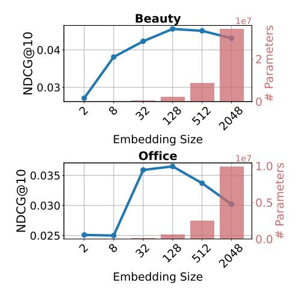
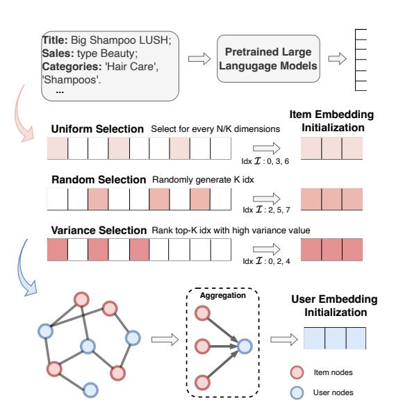
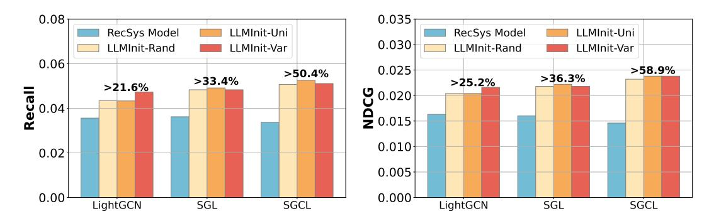

# LLMINIT: A Free Lunch from Large Language Models for Selective Initialization of Recommendation

Weizhi Zhang1, Liangwei Yang2\*, Wooseong Yang1, Henry Peng Zou1, Yuqing Liu1, Ke Xu1, Sourav Medya 1, Philip S. Yu1,

1University of Illinois Chicago, 2Salesforce AI Research

#### **Abstract**

Collaborative filtering (CF) is widely adopted in industrial recommender systems (RecSys) for modeling user-item interactions across numerous applications, but often struggles with cold-start and data-sparse scenarios. Recent advancements in pre-trained large language models (LLMs) with rich semantic knowledge, offer promising solutions to these challenges. However, deploying LLMs at scale is hindered by their significant computational demands and latency. In this paper, we propose a novel and scalable LLM-RecSys framework, LLMInit, designed to integrate pretrained LLM embeddings into CF models through selective initialization strategies. Specifically, we identify the embedding collapse issue observed when CF models scale and match the large embedding sizes in LLMs and avoid the problem by introducing efficient sampling methods, including, random, uniform, and variance-based selections. Comprehensive experiments conducted on multiple real-world datasets demonstrate that LLMInit significantly improves recommendation performance while maintaining low computational costs, offering a practical and scalable solution for industrial applications. To facilitate industry adoption and promote future research, we provide open-source access to our implementation at https://github.com/ DavidZWZ/LLMInit.

## 1 Introduction

Recommender systems (RecSys), particularly collaborative filtering (CF), play a pivotal role in many online platforms and web applications (Koren et al., 2021; Fan et al., 2019), aiding users in navigating vast information by offering personalized suggestions. Among the various techniques, collaborative filtering (Wang et al., 2019; He et al., 2020; Zhang et al., 2024a) stands out for its effectiveness in predicting user preferences by an-

Figure 1: An investigation of the embedding collapse issue of CF model LightGCN (He et al., 2020) in two Amazon-review datasets. Increasing embedding size with exponentially growing parameters finally leads to performance degradation.

alyzing past user-item interactions. A key principle among these models is learning randomly initialized user/item representations with carefully designed loss functions to capture each user's preference (Rendle et al., 2012). However, such CF approaches heavily rely on the observed user-item interactions to optimize the CF embeddings from random initialization and perform poorly in real-world applications where interaction data is sparse and users/items are cold-start.

More recently, the rapid advancement of large language models (LLMs) such as GPT-4 (Achiam et al., 2023) and LLaMa (Touvron et al., 2023), which have exhibited remarkable proficiency in understanding and processing textual information, have piqued the interest of researchers seeking to explore their potential in improving recommender systems beyond traditional approaches (Geng et al., 2022; Li et al., 2023; Zhang et al., 2025c). One of the most promising directions in this exploration involves adapting LLMs as recommender systems

\*Corresponding author: liangwei.yang@salesforce.com

through prompt engineering and tailored instruction tuning. Such integration of LLMs enables the RecSys to better understand user preferences, and interpret contextual information, thereby surpassing the traditional models in cold-start settings.

Despite the inspiring progress made in LLMs for recommendations, their adoption in online deployments faces significant challenges related to efficiency and scalability. These issues stem from the inherently time-consuming and computationally intensive nature of LLMs. Such problems can be further exaggerated in real-world applications of largescale users and items due to the enlarged vocabulary tokens and in-context input. Moreover, LLMs fall short of complex CF interaction understanding owing to the next-token prediction pipeline and the constraints of a maximum token limit (e.g., 4096 tokens in LLaMA-2) to incorporate the whole CF interactions. This limitation hampers their ability to capture and effectively model global user-item dependencies as in CF models, leading to poor performance in the full-ranking (Hou et al., 2024) and warm-start settings (Bao et al., 2023). Therefore, we raise a critical research question:

How can we harness the power of LLMs for RecSys in an effective and scalable manner?

To answer the above question, we propose to utilize LLMs for CF-based RecSys from a new perspective by taking pretrained large language models as a free lunch for the embedding initialization of CF models. One trivial way is to directly utilize the LLMs to generate embeddings with substantial textual information. However, storing the largescale embeddings from LLMs for each user and item is not efficient nor scalable, especially when the platform scales to millions of users and items. Furthermore, as illustrated in Figure 1, unlike the scaling laws observed in language models (Kaplan et al., 2020) and graph models (Liu et al., 2024), the performance of the recommendation model Light-GCN (He et al., 2020) deteriorates even when the numbers of parameters scale up exponentially. This behavior resembles the embedding collapse issue (Guo et al.) observed in click-through rate prediction models (Wang et al., 2021). These findings suggest that significantly smaller embedding sizes (e.g., 128) are more suitable for recommendation tasks. In contrast, the top-10 models in the LLM embedding benchmark MTEB (Muennighoff et al., 2023), pretrained for various NLP tasks, use an average large embedding size of 4,506.

Figure 2: An Illustration of LLMInit framework including contextual LLM input, three types of selective item embedding initialization strategies, and the user embedding aggregation operation.

In this paper, we present LLMInit, a practical and scalable initialization framework that bridges large language model (LLM) embeddings with collaborative filtering (CF) models for industrial-scale recommendation systems. LLMInit tackles the deployment challenges of LLMs and enhances the semantic capacity of CF models by initializing CF embedding models based on pretrained LLMs. To this end, we introduce three efficient strategies, including random, uniform, and variance-based index selection, that selectively sample and compress LLM-generated item embeddings to suit the constrained embedding spaces of CF models. On the user side, where contextual signals may be missing or sparse, LLMInit aggregates item-level embeddings using lightweight pooling mechanisms. This design enables recommendation models to inherit rich language semantics from pretrained LLMs while maintaining high efficiency in both training and inference. Extensive evaluations on multiple real-world datasets demonstrate that LLMInit consistently enhances performance across several state-of-the-art CF architectures. Compared to full LLM-based recommendation systems, our framework achieves significant gains in scalability and efficiency, making it well-suited for real-world deployments. Our contributions underscore the value of adapting language model innovations to meet the practical demands of large-scale, industry-grade recommendation systems.

- Conceptually, we identify the embedding collapse issue in the CF-based recommendations and propose a new paradigm of effectively leveraging LLMs for CF embedding initialization.
- Methodologically, we devise three types of selective initialization strategies to inherit the rich pretrained knowledge from LLMs into lightweight CF models for scalable recommendations.
- Empirically, we implement LLMInit in a plugand-play manner on various SOTA CF models, achieving significant performance and efficiency gains, especially compared to LLM RecSys.

#### 2 Preliminaries

#### 2.1 Problem Definition

Recommender systems (RecSys) aims to improve the platform's accuracy in personalization by leveraging content features and user-item interactions. Formally, consider a textual bipartite graph  $\mathcal{G}=(\mathcal{V},\mathcal{E})$  that models user-item interactions with nodelevel content features. The node set  $\mathcal{V}$  is divided into users  $u_i \in \mathcal{V}_u$  and items  $v_j \in \mathcal{V}_v$ . Edges  $(u_i,v_j) \in \mathcal{E}$  represent interactions or relationships between users and items. The objective is to develop a recommendation algorithm that utilizes the node features and graph structure to predict and rank items that a user is likely to be interested in but has not yet interacted with.

#### 2.2 Related Work

LLMs for Recommendation. Recent advancements in this domain can be categorized into three paradigms (Wu et al., 2024): extracting embeddings for sequential recommendation (Oiu et al., 2021; Hou et al., 2022), generating semantic tokens to capture user preferences (Li et al., 2023; Xi et al., 2024), and directly adapting LLMs as Rec-Sys through prompting (Hou et al., 2024; Liang et al., 2025) or tuning (Geng et al., 2022; Yang et al., 2024). However, they all fail to capture the intricate CF relationship in the user-item bipartite graphs as they either only focus on sequential order patterns (Qiu et al., 2021; Hou et al., 2022) or semantic understandings (Li et al., 2023; Xi et al., 2024; Zhang et al., 2023). In addition, they face notable challenges in efficiency and scalability due to the computational demands of LLMs, large-scale embeddings, overloaded vocabulary tokens, and limited in-context inputs in real-world scenarios.

In contrast, our work LLMInit, proposes a novel paradigm to leverage LLMs in a scalable manner and addresses ineffective interaction modeling by resorting to CF models.

#### 3 Method

As in Figure 2 LLMInit, before CF model training, the raw metadata is concatenated and fed to the LLMs. Then the semantic latent embeddings are selectively sampled via one of the CF item embedding initialization approaches followed by user embedding aggregation.

#### 3.1 Selective Item Embedding Initialization

The CF item representation space can be regarded as a subspace of the sophisticated world-knowledge representation space in large language models (Sheng et al., 2024). Motivated by this, we propose to distill and selectively utilize the embeddings from LLMs to initialize the embeddings for CF recommendation models.

Formally,  $\mathbf{v} \in \mathbf{R}^N$  represents the item embedding vector generated by the pre-trained LLMs. Let K denotes the desired embedding dimensionality after selection. Then  $\mathcal{I} \subseteq \{0,1,\ldots,N-1\}$  is the selected indices. The resulting K-dimensional embedding is:  $\mathbf{v}_{\text{selected}} = \{\mathbf{v}[i]: i \in \mathcal{I}\}$ . Here, we propose three novel initialization strategies to mitigate the inefficiency and embedding collapse issue for directly adopting the LLMs embeddings as follows.

#### 3.1.1 Uniform Selection (LLMInit-Uni)

The uniform space among selections provides a balanced representation and helps mitigate potential redundancy or over-reliance on the LLM embeddings. By evenly spacing the indices, the strategy ensures that no region of the embedding vector dominates or is neglected across v:

$$\mathcal{I} = \{k \cdot | N/K | : k \in \{0, 1, \dots, K - 1\}\}.$$

#### 3.1.2 Random Selection (LLMInit-Rand)

Randomization introduces diversity in the selected dimension patterns. Indices K are randomly sampled from  $\{0, 1, \ldots, N-1\}$  based on the uniform distribution:

$$\mathcal{I} \sim \text{Random}(\{0, 1, \dots, N-1\}), \quad |\mathcal{I}| = K.$$

## 3.1.3 Variance Selection (LLMInit-Var)

Variance can serve as a heuristic for identifying information-rich and discriminative dimensions in

Table 1: Performance comparison on four datasets. Gains are relative to the base model's performance.

| Method                     | Beauty               |                      | Toys-Games           |                      | Tools-Home           |                      | Office-Products      |                      |
|----------------------------|----------------------|----------------------|----------------------|----------------------|----------------------|----------------------|----------------------|----------------------|
| Wellou                     | R@10                 | N@10                 | R@10                 | N@10                 | R@10                 | N@10                 | R@10                 | N@10                 |
| LightGCN (He et al., 2020) | 0.0910               | 0.0432               | 0.0775               | 0.0360               | 0.0574               | 0.0283               | 0.0745               | 0.0365               |
| +LLMInit-Rand              | 0.0960 +5.5%      | 0.0467 +8.1%      | 0.0805 + 3.9%        | 0.0387 +7.5%      | 0.0612 +6.6%      | 0.0313 + 10.6%       | $0.0773 \\ +3.8\%$   | 0.0387 + 6.0%        |
| +LLMInit–Uni               | 0.1006 +10.6%     | 0.0469 +8.6%      | 0.0806 +4.0%      | 0.0388 +7.8%      | 0.0633 +10.3%     | <b>0.0319</b> +12.7% | 0.0791 +6.2%      | 0.0395 +8.2%      |
| +LLMInit-Var               | <b>0.1019</b> +12.0% | <b>0.0485</b> +12.3% | <b>0.0808</b> +4.3%  | <b>0.0389</b> +8.1%  | <b>0.0633</b> +10.3% | 0.0317 + 12.0%       | <b>0.0816</b> +9.5%  | <b>0.0414</b> +13.4% |
| SGL (Wu et al., 2021)      | 0.1017               | 0.0474               | 0.0832               | 0.0380               | 0.0580               | 0.0284               | 0.0669               | 0.0297               |
| +LLMInit-Rand              | 0.1069 +5.1%      | 0.0520 +9.7%      | 0.0885 +6.4%      | $0.0418 \\ +10.0\%$  | <b>0.0692</b> +19.3% | 0.0337 +18.7%     | <b>0.0810</b> +21.1% | <b>0.0426</b> +43.4% |
| +LLMInit-Uni               | 0.1101 +8.3%      | 0.0513 +8.2%      | 0.0920 +10.6%     | 0.0424 +11.6%     | 0.0676 +16.6%     | 0.0333 +17.3%     | 0.0773 +15.6%     | 0.0350 +17.9%     |
| +LLMInit-Var               | <b>0.1106</b> +8.8%  | <b>0.0530</b> +11.8% | <b>0.0927</b> +11.4% | <b>0.0427</b> +12.4% | 0.0686 +18.3%     | <b>0.0339</b> +19.4% | 0.0794 +18.7%     | 0.0421 +41.8%     |
| SGCL (Zhang et al., 2025b) | 0.1027               | 0.0499               | 0.0828               | 0.0382               | 0.0585               | 0.0294               | 0.0647               | 0.0298               |
| +LLMInit-Rand              | 0.1094 +6.5%      | 0.0512 + 2.6%        | 0.0929 + 12.2%       | 0.0418 +9.4%      | <b>0.0651</b> +11.3% | $0.0326 \\ +10.9\%$  | $0.0770 \\ +19.0\%$  | 0.0365 +22.5%     |
| +LLMInit–Uni               | <b>0.1115</b> +8.6%  | 0.0513 + 2.8%        | 0.0923 +11.5%     | <b>0.0422</b> +10.5% | $0.0650 \\ +11.1\%$  | 0.0327 +11.2%     | $0.0742 \\ +14.7\%$  | 0.0354 +18.8%     |
| +LLMInit-Var               | 0.1104 +7.5%      | <b>0.0522</b> +4.6%  | <b>0.0941</b> +13.6% | $0.0421 \\ +10.2\%$  | $0.0646 \\ +10.4\%$  | <b>0.0327</b> +11.2% | <b>0.0776</b> +19.9% | <b>0.0366</b> +22.8% |

the representation space. By selecting the top-k dimensions of  $\mathbf{v}$  with the highest variance across the dataset, this method prioritizes the most distinctive features, improving the separation of potential positive items from candidate pools. Let  $\sigma^2[j]$  denote the variance of the j-th dimension of  $\mathbf{h}$  across the dataset. The variance selects the embedding indices as:

$$\mathcal{I} = \text{Top-}K(\sigma^2[0], \sigma^2[1], \dots, \sigma^2[N-1]).$$

## 3.2 Aggregated User Embedding Initialization

Based on the item-side embedding, we design an aggregation strategy for user embedding initialization to tackle the privacy situation where the user's context information is missing. Suppose we observe a user with historical items initial embeddings  $\mathbf{v}_j$ , and we design the aggregation initialization based on the smoothed neighborhood pooling process. The user embedding  $\mathbf{u}_i$  is finalized as:

$$\mathbf{u}_i = \sum_{j \in N_i} \frac{1}{|N_i|} \mathbf{v}_j,\tag{1}$$

The normalization employs the degree  $|N_i|$  to temper the magnitude and bias towards popular users after aggregation pooling.

#### 4 Experiments

## 4.1 Experimental Set Up

We adopt the 5-core setting from (Zhang et al., 2025b, 2024b) and conduct experiments on four real-world Amazon datasets (Ni et al., 2019), 1, including Beauty, Toys-Games, Tools-Home, and Office-Products, as summarized in Table 4. We use a leave-one-out strategy for data splitting and evaluate all the models using top-K metrics for ranking, including Recall@10 and NDCG@10. For collaborative filtering (CF) baselines, we include LightGCN (He et al., 2020) as a representative graph-based model, SGL (Wu et al., 2021) for selfsupervised contrastive learning, and SGCL (Zhang et al., 2025b) for supervised contrastive learn-For LLM-based baselines, we evaluate ing. MoRec (Yuan et al., 2023), LLMRank (Hou et al., 2024), LLMRec (Wei et al., 2024), and TIGER (Rajput et al., 2023). To ensure fair comparison, we fix the embedding dimension to K = 128 across all models and use MPNet (Song et al., 2020) as the default embedding generator.

https://jmcauley.ucsd.edu/data/amazon/links. html

Table 2: Comparisons of computation cost and performance with LLM-based RecSys in full-ranking settings.

|                             | Beauty |        |         | Toys-Games |        |         |
|-----------------------------|--------|--------|---------|------------|--------|---------|
| Methods                     | R@10   | N@10   | # Para. | R@10       | N@10   | # Para. |
| MoRec (Yuan et al., 2023)   | 0.0857 | 0.0397 | 13M     | 0.0793     | 0.0362 | 14M     |
| LLMRank (Hou et al., 2024)  | –      | –      | 7B      | –          | –      | 7B      |
| LLMRec (Wei et al., 2024)   | 0.0974 | 0.0472 | 7B+13M  | 0.0820     | 0.0389 | 7B+14M  |
| TIGER (Rajput et al., 2023) | 0.1015 | 0.0481 | 13M     | 0.0864     | 0.0385 | 13M     |
| LLMInit-Full                | 0.1029 | 0.0475 | 13M     | 0.0871     | 0.0387 | 14M     |
| LLMInit-Var                 | 0.1104 | 0.0522 | 2M      | 0.0941     | 0.0421 | 2M      |

## 4.2 Performance Comparison

The experimental results clearly demonstrate that all variants of LLMInit substantially improve recommendation performance across diverse datasets compared to traditional CF baselines. Among the proposed strategies, LLMInit-Var consistently achieves the best results, effectively capturing both collaborative filtering signals and semantic information through variance-based index selection. While both LLMInit-Rand and LLMInit-Uni offer notable gains, the variance-based method proves to be the most robust and adaptable across model types and domains. Notably, on the Office-Products dataset (with severe embedding collapse issue as in Figuire [1\)](#page-0-1), LLMInit-Var delivers more than a 20% average gain in NDCG@10 over strong baselines like SGL and SGCL. These consistent improvements highlight the generalizability and practicality of LLMInit, especially in handling diverse real-world scenarios.

# 4.3 Efficiency and Perforamance Comparisons of LLM-based RecSys

Table [2](#page-4-0) compares computation cost and performance of various LLM-based RecSys in fullranking settings. For the LLMRank [\(Hou et al.,](#page-6-6) [2024\)](#page-6-6) and LLMRec [\(Wei et al.,](#page-7-15) [2024\)](#page-7-15), we adopt the LLaMa-7B model for text generation. LLM-Rank [\(Hou et al.,](#page-6-6) [2024\)](#page-6-6) directly employs an LLM for prompting but struggles with an incomplete long-context candidate pool and hallucination problem, leading to unreported performance results. LLMRec prompts LLM for graph augmentation, achieving recall 0.0974 (Beauty) and 0.082 (Toys) with high computational cost (7B+ parameters). In comparison, MoRec[\(Yuan et al.,](#page-7-14) [2023\)](#page-7-14), a modalitybased model, leverages LLMs to generate textual embeddings but restricted by the use of a unified transform layer for distinct item embedding mapping. In addition, the parameter size for LLMgenerated embeddings, initially around 13M/14M for MoRec and LLMInit-Full, can scale to billions as the total number of users and items surpasses 1 million, posing significant computational and storage challenges. TIGER, employing vector quantization for generative recommendation, shows potential for scalable RecSys. LLMInit-Var, a lightweight alternative, achieves the best performance with only 2M parameters, highlighting the potential of parameter-efficient strategies in LLMbased RecSys.

#### 4.4 Cold-Start Recommendation

In the long-tail cold-start setting [\(Zhang et al.,](#page-7-17) [2025a;](#page-7-17) [Yang et al.,](#page-7-18) [2025\)](#page-7-18), we remove half of the observed interactions of each user in training, resulting in many cold-start users with only a single interaction. Figure [3](#page-5-0) highlights how the three CF models (LightGCN, SGL, and SGCL) react to the limited interactions and benefit from LLMbased initialization strategies in cold-start scenarios. LightGCN, as a simple graph model, is most resistant to the cold-start challenge, while the SGL and SGCL both suffer sharp performance drops due to reliance on interactions for data augmentation or supervised loss optimization. With the LLMInit, SGL and SGCL demonstrate stronger abilities to utilize enhanced embeddings. In particular, SGCL achieves the highest gains with LLMInit strategies, with Recall and NDCG improving by over 50.4% and 58.9%, respectively. The supervised loss in SGCL amplifies the impact of informative embeddings, allowing it to extract more meaningful patterns from the selected dimensions. Overall, the results reveal that more advanced models like SGCL with nuanced supervised graph contrastive loss are better equipped to exploit high-quality LLM-based initializations.

Figure 3: Performance improvement comparison in non-strict cold-start scenarios on Amazon-Beauty, where half of the observed interactions for each user are removed.

Table 3: The Performance of LightGCN on Amazon-Beauty with initialization of different LLMs. The embedding size of LLMs scale from 768 to 8,096 while LLMInit models all adopt the embedding size of 128, efficient for large user base scenarios.

| LLM          | 1s                   | MPNet 2 | gte-Qwen 3 | GPT-S 4 | GPT-L 5 | Stella 6 |
|--------------|----------------------|--------------------|-----------------------|--------------------|--------------------|---------------------|
| Embeddii     | ng Size              | 768                | 1,536                 | 1,536              | 3,072              | 8,096               |
| LLMInit-Rand | Recall@10 NDCG@10 | 0.0960 0.0467      | 0.0936 0.0418      | 0.0967 0.0463   | 0.0925 0.044    | 0.0996 0.0447    |
| LLMInit-Uni  | Recall@10 NDCG@10 |                    | 0.096 0.0428       | 0.098 0.0465    | 0.0942 0.0445   |                     |
| LLMInit-Var  | Recall@10 NDCG@10 | 0.1019 0.0485      | 0.0932 0.0429      | 0.098 0.0465    | 0.096 0.046     | 0.0935 0.0412    |

 $^2\; https://hugging face.co/sentence-transformers/all-mpnet-base-v2$ 

#### 4.5 The impacts of Large Language Models

Table 3 presents the performance of LightGCN initialized with embeddings from various LLMs using different strategies on the Amazon-Beauty dataset. The results show that all tested LLMs can enhance LightGCN's performance when paired with appropriate initialization methods. Among them, the variance-based strategy consistently delivers superior results by selecting high-variance dimensions that retain the most informative semantic features. While larger models such as GPT-L and Stella provide higher-dimensional embeddings, their advantages are not linearly correlated with model size. Instead, MPNet and GPT-S exhibit superior performance, suggesting that the quality and domain alignment of embeddings play a more decisive role than sheer model capacity. Consequently, optimizing initialization and embedding relevance emerges as a more effective approach than simply increasing embedding dimensionality or model size for large-scale recommendation scenarios.

#### 5 Conclusion

In this work, we introduced LLMInit, a practical and scalable framework designed for industrial LLM RecSys, which effectively integrates LLM embeddings for CF model initialization. By employing selective strategies for item embeddings and aggregation pooling for user embeddings, LLMInit addresses critical industry challenges of existing CF models, such as data sparsity and coldstart scenarios, while maintaining computational efficiency suitable for large-scale deployments. Extensive evaluations on real-world datasets validate that LLMInit significantly boosts the performance of various state-of-the-art CF models, demonstrating the tangible value and feasibility of leveraging language-based world knowledge to improve recommendation quality in industrial applications.

## Acknowledgment

This work is supported in part by NSF under grants III-2106758, and POSE-2346158.

https://huggingface.co/Alibaba-NLP/gte-Qwen2-1.5B-instruct

4,5 https://platform.openai.com/docs/guides/embeddings/embedding-models

&lt;sup>6 https://huggingface.co/blevlabs/stella\_en\_v5

# Limitations

Although LLMInit achieves notable improvements for scalable LLM-based recommendation, especially under cold-start and sparse-data scenarios, its effectiveness relies on the quality and domain relevance of pretrained LLM embeddings, necessitating careful selection of LLMs for domains or conducting further domain adaptation. Additionally, our current approach leverages only textual metadata; incorporating multi-modal features (such as images or audio) remains an important future direction to enhance real-world applicability. Finally, more advanced CF models such ordinarydifferential-equations (ODEs) [\(Xu et al.,](#page-7-19) [2023,](#page-7-19) [2025;](#page-7-20) [Zhang et al.,](#page-7-1) [2024a\)](#page-7-1) have not yet been evaluated within LLMInit.

# References

- Josh Achiam, Steven Adler, Sandhini Agarwal, Lama Ahmad, Ilge Akkaya, Florencia Leoni Aleman, Diogo Almeida, Janko Altenschmidt, Sam Altman, and 1 others. 2023. Gpt-4 technical report. *arXiv preprint arXiv:2303.08774*.
- Keqin Bao, Jizhi Zhang, Yang Zhang, Wenjie Wang, Fuli Feng, and Xiangnan He. 2023. Tallrec: An effective and efficient tuning framework to align large language model with recommendation. In *Proceedings of the 17th ACM Conference on Recommender Systems*, pages 1007–1014.
- Wenqi Fan, Yao Ma, Qing Li, Yuan He, Eric Zhao, Jiliang Tang, and Dawei Yin. 2019. Graph neural networks for social recommendation. In *The world wide web conference*, pages 417–426.
- Shijie Geng, Shuchang Liu, Zuohui Fu, Yingqiang Ge, and Yongfeng Zhang. 2022. Recommendation as language processing (rlp): A unified pretrain, personalized prompt & predict paradigm (p5). In *Proceedings of the 16th ACM Conference on Recommender Systems*, pages 299–315.
- Xingzhuo Guo, Junwei Pan, Ximei Wang, Baixu Chen, Jie Jiang, and Mingsheng Long. On the embedding collapse when scaling up recommendation models. In *Forty-first International Conference on Machine Learning*.
- Xiangnan He, Kuan Deng, Xiang Wang, Yan Li, Yongdong Zhang, and Meng Wang. 2020. Lightgcn: Simplifying and powering graph convolution network for recommendation. In *Proceedings of the 43rd International ACM SIGIR conference on research and development in Information Retrieval*, pages 639–648.
- Yupeng Hou, Shanlei Mu, Wayne Xin Zhao, Yaliang Li, Bolin Ding, and Ji-Rong Wen. 2022. Towards

- universal sequence representation learning for recommender systems. In *Proceedings of the 28th ACM SIGKDD Conference on Knowledge Discovery and Data Mining*, pages 585–593.
- Yupeng Hou, Junjie Zhang, Zihan Lin, Hongyu Lu, Ruobing Xie, Julian McAuley, and Wayne Xin Zhao. 2024. Large language models are zero-shot rankers for recommender systems. In *European Conference on Information Retrieval*, pages 364–381.
- Jared Kaplan, Sam McCandlish, Tom Henighan, Tom B Brown, Benjamin Chess, Rewon Child, Scott Gray, Alec Radford, Jeffrey Wu, and Dario Amodei. 2020. Scaling laws for neural language models. *arXiv preprint arXiv:2001.08361*.
- Yehuda Koren, Steffen Rendle, and Robert Bell. 2021. Advances in collaborative filtering. *Recommender systems handbook*, pages 91–142.
- Jiacheng Li, Ming Wang, Jin Li, Jinmiao Fu, Xin Shen, Jingbo Shang, and Julian McAuley. 2023. Text is all you need: Learning language representations for sequential recommendation. In *Proceedings of the 29th ACM SIGKDD Conference on Knowledge Discovery and Data Mining*, pages 1258–1267.
- Yueqing Liang, Liangwei Yang, Chen Wang, Xiongxiao Xu, Philip S. Yu, and Kai Shu. 2025. [Taxonomy](https://aclanthology.org/2025.coling-main.102/)[guided zero-shot recommendations with LLMs.](https://aclanthology.org/2025.coling-main.102/) In *Proceedings of the 31st International Conference on Computational Linguistics*, pages 1520–1530, Abu Dhabi, UAE. Association for Computational Linguistics.
- Jingzhe Liu, Haitao Mao, Zhikai Chen, Tong Zhao, Neil Shah, and Jiliang Tang. 2024. Towards neural scaling laws on graphs. *arXiv preprint arXiv:2402.02054*.
- Niklas Muennighoff, Nouamane Tazi, Loic Magne, and Nils Reimers. 2023. Mteb: Massive text embedding benchmark. In *Proceedings of the 17th Conference of the European Chapter of the Association for Computational Linguistics*, pages 2014–2037.
- Jianmo Ni, Jiacheng Li, and Julian McAuley. 2019. Justifying recommendations using distantly-labeled reviews and fine-grained aspects. In *Proceedings of the 2019 conference on empirical methods in natural language processing and the 9th international joint conference on natural language processing (EMNLP-IJCNLP)*, pages 188–197.
- Zhaopeng Qiu, Xian Wu, Jingyue Gao, and Wei Fan. 2021. U-bert: Pre-training user representations for improved recommendation. In *Proceedings of the AAAI Conference on Artificial Intelligence*, volume 35, pages 4320–4327.
- Shashank Rajput, Nikhil Mehta, Anima Singh, Raghunandan Hulikal Keshavan, Trung Vu, Lukasz Heldt, Lichan Hong, Yi Tay, Vinh Tran, Jonah Samost, and 1 others. 2023. Recommender systems with generative retrieval. *Advances in Neural Information Processing Systems*, 36:10299–10315.

- Steffen Rendle, Christoph Freudenthaler, Zeno Gantner, and Lars Schmidt-Thieme. 2012. Bpr: Bayesian personalized ranking from implicit feedback. *arXiv preprint arXiv:1205.2618*.
- Leheng Sheng, An Zhang, Yi Zhang, Yuxin Chen, Xiang Wang, and Tat-Seng Chua. 2024. Language representations can be what recommenders need: Findings and potentials. *arXiv preprint arXiv:2407.05441*.
- Kaitao Song, Xu Tan, Tao Qin, Jianfeng Lu, and Tie-Yan Liu. 2020. Mpnet: Masked and permuted pretraining for language understanding. *Advances in neural information processing systems*, 33:16857– 16867.
- Hugo Touvron, Thibaut Lavril, Gautier Izacard, Xavier Martinet, Marie-Anne Lachaux, Timothée Lacroix, Baptiste Rozière, Naman Goyal, Eric Hambro, Faisal Azhar, and 1 others. 2023. Llama: Open and efficient foundation language models. *arXiv preprint arXiv:2302.13971*.
- Ruoxi Wang, Rakesh Shivanna, Derek Cheng, Sagar Jain, Dong Lin, Lichan Hong, and Ed Chi. 2021. Dcn v2: Improved deep & cross network and practical lessons for web-scale learning to rank systems. In *Proceedings of the web conference 2021*, pages 1785– 1797.
- Xiang Wang, Xiangnan He, Meng Wang, Fuli Feng, and Tat-Seng Chua. 2019. Neural graph collaborative filtering. In *Proceedings of the 42nd international ACM SIGIR conference on Research and development in Information Retrieval*, pages 165–174.
- Wei Wei, Xubin Ren, Jiabin Tang, Qinyong Wang, Lixin Su, Suqi Cheng, Junfeng Wang, Dawei Yin, and Chao Huang. 2024. Llmrec: Large language models with graph augmentation for recommendation. In *Proceedings of the 17th ACM International Conference on Web Search and Data Mining*, pages 806–815.
- Jiancan Wu, Xiang Wang, Fuli Feng, Xiangnan He, Liang Chen, Jianxun Lian, and Xing Xie. 2021. Selfsupervised graph learning for recommendation. In *Proceedings of the 44th international ACM SIGIR conference on research and development in information retrieval*, pages 726–735.
- Likang Wu, Zhi Zheng, Zhaopeng Qiu, Hao Wang, Hongchao Gu, Tingjia Shen, Chuan Qin, Chen Zhu, Hengshu Zhu, Qi Liu, and 1 others. 2024. A survey on large language models for recommendation. *World Wide Web*, 27(5):60.
- Yunjia Xi, Weiwen Liu, Jianghao Lin, Xiaoling Cai, Hong Zhu, Jieming Zhu, Bo Chen, Ruiming Tang, Weinan Zhang, and Yong Yu. 2024. Towards openworld recommendation with knowledge augmentation from large language models. In *Proceedings of the 18th ACM Conference on Recommender Systems*, pages 12–22.

- Ke Xu, Weizhi Zhang, Zihe Song, Yuanjie Zhu, and Philip S Yu. 2025. Graph neural controlled differential equations for collaborative filtering. In *Companion Proceedings of the ACM on Web Conference 2025*, pages 1446–1449.
- Ke Xu, Yuanjie Zhu, Weizhi Zhang, and S Yu Philip. 2023. Graph neural ordinary differential equationsbased method for collaborative filtering. In *2023 IEEE International Conference on Data Mining (ICDM)*, pages 1445–1450. IEEE.
- Wooseong Yang, Chen Wang, Zihe Song, Weizhi Zhang, and Philip S Yu. 2024. Item cluster-aware prompt learning for session-based recommendation. *arXiv preprint arXiv:2410.04756*.
- Wooseong Yang, Weizhi Zhang, Yuqing Liu, Yuwei Han, Yu Wang, Junhyun Lee, and Philip S Yu. 2025. Cold-start recommendation with knowledge-guided retrieval-augmented generation. *arXiv preprint arXiv:2505.20773*.
- Zheng Yuan, Fajie Yuan, Yu Song, Youhua Li, Junchen Fu, Fei Yang, Yunzhu Pan, and Yongxin Ni. 2023. Where to go next for recommender systems? id-vs. modality-based recommender models revisited. In *Proceedings of the 46th International ACM SIGIR Conference on Research and Development in Information Retrieval*, pages 2639–2649.
- Weizhi Zhang, Yuanchen Bei, Liangwei Yang, Henry Peng Zou, Peilin Zhou, Aiwei Liu, Yinghui Li, Hao Chen, Jianling Wang, Yu Wang, and 1 others. 2025a. Cold-start recommendation towards the era of large language models (llms): A comprehensive survey and roadmap. *arXiv preprint arXiv:2501.01945*.
- Weizhi Zhang, Liangwei Yang, Yuwei Cao, Ke Xu, Yuanjie Zhu, and S Yu Philip. 2023. Dual-teacher knowledge distillation for strict cold-start recommendation. In *2023 IEEE International Conference on Big Data (BigData)*, pages 483–492. IEEE.
- Weizhi Zhang, Liangwei Yang, Zihe Song, Henry Peng Zou, Ke Xu, Liancheng Fang, and Philip S Yu. 2024a. Do we really need graph convolution during training? light post-training graph-ode for efficient recommendation. In *Proceedings of the 33rd ACM International Conference on Information and Knowledge Management*, pages 3248–3258.
- Weizhi Zhang, Liangwei Yang, Zihe Song, Henry Peng Zou, Ke Xu, Yuanjie Zhu, and Philip S Yu. 2024b. Mixed supervised graph contrastive learning for recommendation. *arXiv preprint arXiv:2404.15954*.
- Weizhi Zhang, Liangwei Yang, Zihe Song, Henry Peng Zou, Ke Xu, Yuanjie Zhu, and Philip S Yu. 2025b. Sgcl: Unifying self-supervised and supervised learning for graph recommendation. In *Proceedings of the Nineteenth ACM Conference on Recommender Systems*, pages 671–676.
- Weizhi Zhang, Xinyang Zhang, Chenwei Zhang, Liangwei Yang, Jingbo Shang, Zhepei Wei, Henry Peng

Zou, Zijie Huang, Zhengyang Wang, Yifan Gao, and 1 others. 2025c. Personaagent: When large language model agents meet personalization at test time. *arXiv preprint arXiv:2506.06254*.

# A Dataset Statistics

Table 4: Statistics of the datasets.

| Dataset         |        |       |        | # Users # Items # Inter. Sparsity |
|-----------------|--------|-------|--------|-----------------------------------|
| Beauty          | 10,554 | 6,087 | 94,148 | 99.85%                            |
| Toys–Games      | 11,269 | 7,310 | 95,420 | 99.88%                            |
| Tools–Home      | 9,246  | 6,199 | 73,250 | 99.87%                            |
| Office–Products | 3,261  | 1,584 | 36,544 | 99.29%                            |

To comprehensively evaluate the effectiveness of LLM-based initialization strategies in real-world recommendation scenarios, we conduct experiments on four widely used Amazon product review datasets [\(Ni et al.,](#page-6-15) [2019\)](#page-6-15), covering diverse user interaction domains. Each dataset consists of implicit user–item interactions, where an interaction denotes a user's engagement (e.g., rating and review) with a product. Following common practice, we filter out users and items with fewer than five interactions and adopt the leave-one-out evaluation protocol. The statistics of the processed datasets are summarized in Table [4.](#page-8-0)

# B Pooling Strategies

To further analyze the impact of different embedding aggregation strategies, Table [5](#page-8-1) compares pooling-based methods for user embedding initializations. Results show that all LLM-based initialization strategies outperform random initialization, confirming the benefits of semantic priors learned by LLMs. Mean pooling achieves the best overall performance, slightly surpassing both max pooling and LightGCN pooling. This indicates that averaging item embeddings provides a stable and representative initialization signal for graph-based user–item interaction modeling.

Table 5: Performance comparison of different initialization pooling strategies on Amazon-Beauty. All models are initialized with LLM-based embeddings except for the random baseline.

| Method             | Recall@10 | NDCG@10 |
|--------------------|-----------|---------|
| Random Init        | 0.1029    | 0.0475  |
| Mean (LLMInit)     | 0.1104    | 0.0522  |
| Max (LLMInit)      | 0.1088    | 0.0510  |
| LightGCN (LLMInit) | 0.1101    | 0.0515  |