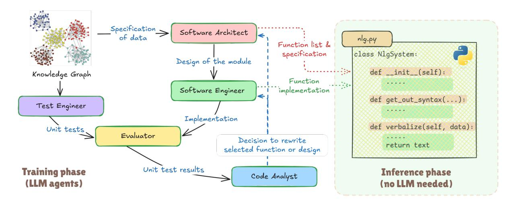

# LLM Agents Implement an NLG System from Scratch: Building Interpretable Rule-Based RDF-to-Text Generators

### Mateusz Lango and Ondrej Dušek ˇ

Charles University, Faculty of Mathematics and Physics, Prague, Czechia {lango,odusek}@ufal.mff.cuni.cz

#### Abstract

We present a novel neurosymbolic framework for RDF-to-text generation, in which the model is "trained" through collaborative interactions among multiple LLM agents rather than traditional backpropagation. The LLM agents produce rule-based Python code for a generator for the given domain, based on RDF triples only, with no in-domain human reference texts. The resulting system is fully interpretable, requires no supervised training data, and generates text nearly instantaneously using only a single CPU. Our experiments on the WebNLG and Open-DialKG data show that outputs produced by our approach reduce hallucination, with only slight fluency penalties compared to finetuned or prompted language models.

#### 1 Introduction

RDF-to-text is a popular task in natural language generation (NLG) that involves converting a subset of a knowledge graph, represented as RDF triples, into coherent natural language text [\(Castro Fer](#page-6-0)[reira et al.,](#page-6-0) [2020;](#page-6-0) [Agarwal et al.,](#page-6-1) [2021;](#page-6-1) [Kasner and](#page-6-2) [Dusek,](#page-6-2) [2022;](#page-6-2) [Li et al.,](#page-7-0) [2024\)](#page-7-0). For instance, one possible verbalization of the following RDF triples: (Chopin, birthplace, Poland), (Chopin, birth year, 1810) is "Chopin was born in 1810 in Poland."

RDF-to-text systems are typically built using either rule-based or neural approaches [\(Gatt and](#page-6-3) [Krahmer,](#page-6-3) [2018\)](#page-6-3). Rule-based methods [\(Lavoie and](#page-7-1) [Rainbow,](#page-7-1) [1997;](#page-7-1) [White and Baldridge,](#page-7-2) [2003\)](#page-7-2) use predefined templates and linguistic rules for precise, controlled output. In contrast, neural approaches rely on supervised learning from human data [\(Ke et al.,](#page-6-4) [2021;](#page-6-4) [Chen et al.,](#page-6-5) [2020\)](#page-6-5) or in-context learning with large language models (LLMs) [\(Axelsson and Skantze,](#page-6-6) [2023;](#page-6-6) [Mille et al.,](#page-7-3) [2024\)](#page-7-3) to generate more fluent and varied text, yet their incorporation in industrial applications faces significant challenges. Despite impressive benchmark performance, neural NLG systems generally

lack interpretability and controllability, suffer from hallucinations, and require substantial computational resources [\(Zhang et al.,](#page-8-0) [2021;](#page-8-0) [Ji et al.,](#page-6-7) [2023\)](#page-6-7).

In this work, we introduce a novel paradigm for building interpretable RDF-to-text systems that, instead of relying on supervised data, leverages the coding capabilities of large language models (LLM) to develop a full NLG system from scratch in pure Python. Our approach involves a training stage where several LLM agents collaborate to iteratively design, implement, test, and refine a rulebased NLG model for a given domain using only unsupervised data (in-domain RDF triples, with no human references). Once the training is complete, the system operates independently of any LLMs or neural components.

Experiments conducted on five datasets demonstrate that the proposed approach outperforms nontrivial neural baselines on reference-based metrics while offering full interpretability and controllability, producing fewer hallucinations, and providing remarkably fast inference times on a single CPU.

#### 2 Training a rule-based NLG system

Our approach to training an NLG system relies on five LLM Agents. *Software Architect* (SA) comes up with a design of the NLG system, making highlevel decisions about the code structure. *Software Engineer* (SE) iterates over the particular functions of the designed code structure and implements each one. *Evaluator* is a Python execution engine that runs the automatically written NLG system and then uses an LLM to assess the textual outputs produced. Unit tests for evaluation are supplied by *Test Engineer*, embracing the test-driven development (TDD) paradigm for software development. Finally, *Code Analyst* (CA) analyses the NLG system implementation and any failing unit tests, determining whether the issues can be resolved by rewriting specific functions or if a full redesign of the sys-

<span id="page-1-0"></span>

Figure 1: Overview of the presented approach. LLM Agents (boxes with green border) interact with each other to write an entire NLG system in pure Python during the training phase. The final system is fully interpretable, easy to edit by a human, and does not need any LLM during inference.

tem is needed. Depending on CA's decision, the training process returns to either SE or SA agent, which then revise the selected parts of NLG system accordingly. The approach is illustrated on Fig. [1](#page-1-0) and in Appendix [D.](#page-8-1)

The input to the training process is a knowledge graph, parts of which will later be verbalised by the constructed NLG system. Note that no reference texts or annotated examples are used. The output of the training is a single Python file containing the implementation of NLG system. At inference time, the system is able to generalise to unseen data, provided it adheres to the same schema – specifically, that predicates are defined consistently with those in the training graph. We provide a more detailed description of each LLM agent involved in the training process below.

Test Engineer begins by extracting a list of all predicates present in the knowledge graph (KG). To provide the model with contextual understanding of each predicate, a random triple containing the predicate in question is selected from the graph. The LLM is then instructed to generate 50 input-output example pairs[1](#page-1-1) for a data-to-text system using these predicates. Any examples containing predicates not found in KG are discarded, and the remaining examples are added to the set of unit tests. This process is repeated until each predicate is covered by at least three unit tests. The exact prompts of

TE and other agents are provided in Appendix [A.](#page-8-2)

Software Architect is given a list of all predicates found in the KG, along with an instruction to produce the high-level design of a rule-based NLG system. SA's output defines the code structure by specifying a list of required functions, their responsibilities, input arguments, and interactions. The only hardcoded requirement is the main entry point class and function.

Software Engineer iterates over the SAproduced list of functions and implements them one-by-one, given a description of the design, the code implemented so far, and the signature of the function to be implemented. In the later stages of training, the SE is also given feedback from the Code Analyst and a list of failed unit tests.

Evaluator executes the NLG system code for each unit test within a Python interpreter, running each instance in a separate process with a predefined timeout, marking errors or timeouts as failures. Successful outputs are sent to an LLM, which answers a yes/no question on whether the generated verbalization correctly reflects the given input. To speed up evaluation, the process is terminated as soon as five failed unit tests are detected. If the constructed program passes all unit tests, the training process is terminated.

Code Analyst receives the evaluation results and analyses both the system design and its current implementation to determine the root causes of the failed tests. Based on this analysis, CA decides

<span id="page-1-1"></span><sup>1</sup>While our approach does not use generated pseudoreferences during training, as the whole process is referenceless, we find that instructing the model to generate sets of input triples alongside pseudo-references results in more plausible examples.

whether the issues stem from flaws in the overall design or from specific functions in the implementation. If a full redesign is needed, the CA's textual feedback is passed back to SA, which produces a new design. If only certain functions require revision, CA supplies a list of these functions to SE to reimplement.

The interaction between the LLM agents, i.e. the system training process, terminates either when the constructed NLG system passes all unit tests, or when the maximum iteration limit is reached.

#### 3 Experiments

#### 3.1 Experimental setup

Baselines We compare the results of our rule generation approach with two baselines: fine-tuned BART [\(Lewis et al.,](#page-7-4) [2020,](#page-7-4) see Appendix [C](#page-8-3) for training details) and prompted Llama 3.3 70B [\(Tou](#page-7-5)[vron et al.,](#page-7-5) [2024\)](#page-7-5) with a simple post-processing to remove superfluous text (see full prompt in Appendix [A\)](#page-8-2).

Datasets We experiment on two domains, with five datasets in total. First, the models were trained on the popular WebNLG domain [\(Gardent et al.,](#page-6-8) [2017\)](#page-6-8), which contains data expressed as RDF triples alongside their corresponding text references. For evaluation, we used four test sets: the standard WebNLG test set and three datasets from the GEM 2024 shared task [\(Mille et al.,](#page-7-3) [2024\)](#page-7-3). The GEM datasets were specifically designed to test system robustness by including RDF triples that are: (1) factual – containing factually correct information; (2) counterfactual – data from the factual dataset, with switched entity names; (3) fictional – the triples contain fictional entities.

Second, we trained and evaluated the models on the OpenDialKG dataset [\(Moon et al.,](#page-7-6) [2019\)](#page-7-6), which contains dialogues annotated with RDF triples representing the information expressed in each utterance. We use this dataset for RDF-to-triple task, treating the utterances as textualisations of the data without taking dialogue history into account.

During training, our rule-based approach relied solely on the knowledge graph induced by the RDF triples from the dataset, but the fine-tuned neural baseline was trained using reference texts from the training set, with early stopping based on performance on the development set.

Our approach We tested our approach with three different LLMs: one proprietary LLM (GPT- 4.1 [OpenAI,](#page-7-7) [2025\)](#page-7-7)) and three open-source models: Qwen 3 235B [\(Yang et al.,](#page-8-4) [2024\)](#page-8-4), Qwen 2.5 72B [\(Yang et al.,](#page-8-4) [2024\)](#page-8-4) and Llama 3.3 70B [\(Tou](#page-7-5)[vron et al.,](#page-7-5) [2024\)](#page-7-5). The open-source models were used in 4-bit quantisation through the ollama library. Training was run with a maximum number of 25 iterations (10 for GPT) and repeated three times. The best model was selected based on the number of unit tests passed. We use structured outputs to get an easy-to-process output from SA and CA. As the entire WebNLG graph is substantial, we trained our system separately for each WebNLG thematic category. As different LLMs are not equally strict when assessing the produced outputs, the Evaluator agent always used the Llama 3.3 model for better comparability. The constructed programs are available in the code repository[2](#page-2-0) .

#### 3.2 Results of reference-based metrics

We evaluate the quality of the generated outputs using several widely adopted reference-based metrics: BLEU [\(Papineni et al.,](#page-7-8) [2002\)](#page-7-8), METEOR [\(Banerjee](#page-6-9) [and Lavie,](#page-6-9) [2005\)](#page-6-9), BERTScore [\(Zhang et al.,](#page-8-5) [2020\)](#page-8-5), and BLEURT [\(Sellam et al.,](#page-7-9) [2020\)](#page-7-9). This evaluation was not conducted on the GEM datasets, as they do not include reference texts.

The WebNLG test set results in Table [1](#page-3-0) reveal that our model trained by GPT-4.1 agents achieved the highest scores on METEOR and BLEURT metrics. Although a fine-tuned neural model outperformed ours on BLEU and BERTScore overall, our system still achieved better scores on these metrics within a more challenging subset of out-of-domain examples. Our model also outperformed prompted Llama 3.3 70B. Note that neither of these systems was trained on human-written reference texts.

There is relatively little difference in performance between our rule-based systems produced by GPT 4.1 and those produced by the largest open-source model, Qwen 3 235B. While GPT 4.1 achieved better results on METEOR, BERTScore and BLEURT, Qwen 3 performed slightly better on BLEU and on out-of-domain examples.

NLG systems trained using smaller open-source LLMs were less successful, indicating that more powerful LLMs may be necessary for implementing complete NLG systems. Nonetheless, these models retain certain advantages over purely neural models, as they provide full transparency of the generation process and can potentially be manually

<span id="page-2-0"></span><sup>2</sup> <https://tinyurl.com/5exfm83d>

<span id="page-3-0"></span>

|                                                                                                     | Inter-<br>pretability | BL<br>All                                     | EU<br>OOD                            | MET<br>All                         | EOR<br>OOD                         | BERT<br>All                          | Score OOD                            | BLE<br>All                           | URT<br>OOD                           |
|-----------------------------------------------------------------------------------------------------|-----------------------|-----------------------------------------------|--------------------------------------|------------------------------------|------------------------------------|--------------------------------------|--------------------------------------|--------------------------------------|--------------------------------------|
| Neural models                                                                                       |                       |                                               |                                      |                                    |                                    |                                      |                                      |                                      |                                      |
| Fine-tuned BART Prompted Llama 3.3 70B  Our rule-based NLG                                          | X<br>X                | <b>0.4352</b> 0.3616                          | 0.3052<br>0.3327                     | 0.6791<br>0.6887                   | 0.6343<br>0.6989                   | <b>0.9308</b> 0.9255                 | 0.9183<br>0.9243                     | 0.1275<br>0.1058                     | -0.0261<br>0.0969                    |
| trained by GPT-4.1<br>trained by Qwen 3 235B<br>trained by Qwen 2.5 72B<br>trained by Llama 3.3 70B | <i>y y y y</i>        | $0.3934 \\ 0.3939 \\ \hline 0.3309 \\ 0.2858$ | 0.3615<br>0.3772<br>0.2609<br>0.2858 | <b>0.7069</b> 0.6759 0.6531 0.6578 | <b>0.7124</b> 0.6980 0.6456 0.6606 | 0.9291<br>0.9290<br>0.9224<br>0.9179 | 0.9251<br>0.9281<br>0.9175<br>0.9187 | 0.1841<br>0.1767<br>0.1193<br>0.0762 | 0.1483<br>0.1645<br>0.0655<br>0.0618 |

Table 1: Reference-based evaluation on the standard WebNLG test set. BLEU, METEOR, BERTScore and BLEURT metrics are reported for the entire test set (All) and for out-of-domain examples (OOD).

<span id="page-3-3"></span>

|                | BLEU   | MET.                | BERT.               | BLEURT              |
|----------------|--------|---------------------|---------------------|---------------------|
| Neural models  |        |                     |                     |                     |
| BART           | 0.9372 | 0.9849              | 0.9973              | 0.9340              |
| Llama 3.3 70b  | 0.2040 | 0.6289              | 0.9104              | 0.1348              |
| Our rule-based | NLG    |                     |                     |                     |
| GPT 4.1        | 0.3144 | 0.7313              | 0.9272              | 0.3247              |
| Qwen 3 235b    | 0.3472 | $\overline{0.6947}$ | $\overline{0.9239}$ | $\overline{0.1047}$ |
| Qwen 2.5 72b   | 0.3413 | 0.7030              | 0.9265              | 0.2300              |
| Llama 3.3 70B  | 0.3120 | 0.6517              | 0.9216              | 0.1882              |

Table 2: Reference-based evaluation on the OpenDialKG dataset (MET. = METEOR, BERT. = BERTScore).

<span id="page-3-2"></span>

|                        | Inference time |        |  |
|------------------------|----------------|--------|--|
|                        | GPU            | CPU    |  |
| Fine-tuned BART        | 249 s          | 1910 s |  |
| Prompted Llama 3.3 70B | 6360 s         | n/a    |  |
| Our approach (GPT-4.1) | -              | 7 s    |  |

Table 3: Inference time for the WebNLG test set.

improved by skilled developers. The inference time comparision<sup>3</sup> in Table 3 shows another advantage of our models: they achieve a 35x speedup on CPU compared to the BART model running on GPU and 272x speedup while running both models on CPU.

The results obtained on OpenDialKG are presented in Table 2. Here, the fine-tuned model clearly obtained the highest results on reference-based metrics, indicating the importance of using the original training data to produce the expected sentence structures. Nevertheless, all of our models outperformed the prompted LLM on all metrics.

#### 3.3 Results of reference-less metrics

We perform a reference-less evaluation on all test sets using the LLM-as-a-Judge approach (Zheng et al., 2023; Gu et al., 2025). The selected LLM (Llama 3.3 70B) provides binary judgments on three aspects: grammatical correctness of the generated text (Gram.), presence of unsupported facts (Add.), omission of input triples in the output (Om.). The exact prompts are provided in Appendix B.

The results of systems trained on the WebNLG dataset shown in Table 4 reveal that the outputs of our rule-based system trained with GPT-4.1 are more grammatically correct and contain fewer hallucinations than the output of fine-tuned BART on all four test sets. The outputs produced by an LLM (Llama 3.3) achieve the highest grammatical correctness. On three out of four test sets, our model trained with Qwen 2.5 reduces the number of additions compared to the LLM's output – sometimes by nearly fourfold – while maintaining a comparable or lower number of omissions.

The results for the OpenDialKG dataset in Table 5 show that our GPT-4.1-trained system produced significantly fewer additions and omissions (t-test,  $\alpha=5\%$ ) than both fine-tuned BART and Llama 3.3. Our model also achieved better grammatical correctness than BART while scoring slightly worse than Llama 3.3.

#### 3.4 Ablation experiments

We performed two ablation experiments: 1) we replaced SA agent with a static system design produced by a human (Abl. 1); 2) we used training examples from WebNLG training set instead of generated unit tests (Abl. 2). The results of the ablations are in Table 6. Using a static design of the system has a highly negative impact, which is espe-

<span id="page-3-1"></span><sup>&</sup>lt;sup>3</sup>The reported times do not include loading the models into memory and were measured on a machine with an Nvidia A40 48 GB GPU and an AMD EPYC 7313 CPU.

<span id="page-4-0"></span>

|                                                         | WebNLG test set                  |                                  | GEM2 Counterfactual              |                                  | GEM2 Fictional                   |                                  |                                  | GEM2 Factual                     |                                  |                                  |                                  |                                  |
|---------------------------------------------------------|----------------------------------|----------------------------------|----------------------------------|----------------------------------|----------------------------------|----------------------------------|----------------------------------|----------------------------------|----------------------------------|----------------------------------|----------------------------------|----------------------------------|
|                                                         | Gram.                            | Add.                             | Om.                              | Gram.                            | Add.                             | Om.                              | Gram.                            | Add.                             | Om.                              | Gram.                            | Add.                             | Om.                              |
| Neural models                                           |                                  |                                  |                                  |                                  |                                  |                                  |                                  |                                  |                                  |                                  |                                  |                                  |
| BART<br>Llama 3.3                                       | 0.692<br>0.752                   | 0.510<br>0.044                   | 0.526<br>0.080                   | 0.426<br>0.818                   | 0.613<br>0.209                   | 0.622<br>0.080                   | 0.619<br>0.937                   | 0.580<br>0.018                   | 0.599<br>0.096                   | 0.689<br>0.984                   | 0.527<br>0.027                   | 0.512<br>0.076                   |
| Our rule-based NLG                                      |                                  |                                  |                                  |                                  |                                  |                                  |                                  |                                  |                                  |                                  |                                  |                                  |
| GPT-4.1<br>Qwen 3 235B<br>Qwen 2.5 72B<br>Llama 3.3 70B | 0.734<br>0.729<br>0.663<br>0.635 | 0.029<br>0.026<br>0.019<br>0.049 | 0.111<br>0.040<br>0.065<br>0.126 | 0.517<br>0.392<br>0.440<br>0.419 | 0.069<br>0.071<br>0.054<br>0.070 | 0.128<br>0.106<br>0.091<br>0.138 | 0.738<br>0.632<br>0.603<br>0.551 | 0.036<br>0.043<br>0.030<br>0.065 | 0.098<br>0.066<br>0.098<br>0.208 | 0.730<br>0.730<br>0.660<br>0.633 | 0.034<br>0.026<br>0.021<br>0.050 | 0.108<br>0.040<br>0.066<br>0.127 |

Table 4: Reference-less evaluation on four test sets: the standard WebNLG test set and three GEM 2024 shared task test sets. Grammaticality, addition of unsupported facts, and omissions are evaluated by an LLM-as-a-Judge.

<span id="page-4-1"></span>

|                                                                               | Gram.                   | Add.                    | Om.   |
|-------------------------------------------------------------------------------|-------------------------|-------------------------|-------|
| Neural models                                                                 |                         |                         |       |
| BART                                                                          | 0.502                   | 0.052                   | 0.139 |
| Llama 3.3                                                                     | 0.985                   | 0.030                   | 0.063 |
| Our rule-based NLG                                                            |                         |                         |       |
| trained by GPT 4.1                                                            | 0.923                   | 0.013                   | 0.022 |
|                                                                               |                         |                         | 0.106 |
|                                                                               |                         |                         | 0.146 |
|                                                                               |                         |                         | 0.075 |
| trained by Qwen 3 235B<br>trained by Qwen 2.5 72B<br>trained by Llama 3.3 70B | 0.840<br>0.666<br>0.598 | 0.018<br>0.033<br>0.056 |       |

Table 5: Reference-less evaluation on the OpenDialKG test set (see Table [4](#page-4-0) for metrics).

<span id="page-4-2"></span>

|                       | BLEU  | MET.  |       | BERT. BLEURT |
|-----------------------|-------|-------|-------|--------------|
| Ours                  | 0.331 | 0.653 | 0.922 | 0.119        |
| Abl. 1 (design)       | 0.323 | 0.611 | 0.912 | -0.010       |
| Abl. 2 (training set) | 0.309 | 0.638 | 0.919 | 0.071        |

Table 6: Ablation experiments on the WebNLG test set with Qwen 2.5 (see Table [1](#page-3-0) and [2](#page-3-3) for metrics).

cially visible in trainable metrics such as BLEURT. Evaluating using the original WebNLG training set examples instead of automatically generated unit tests also yields slightly worse results, demonstrating the utility of our approach.

#### <span id="page-4-5"></span>3.5 Human evaluation

We conducted a small-scale in-house human evaluation for 100 randomly selected instances from the WebNLG test set. Outputs of our system (with GPT 4.1) and both baselines (BART, Llama 3.3) were annotated by six NLP experts who answered binary questions about the presence of minor hallucinations (e.g. typos in named entity names), major hallucinations (output containing facts not supported by the data), omissions (missing information), disfluencies (grammar errors or difficult-to-read text) and repetitions (information mentioned twice). In

<span id="page-4-3"></span>

|           | min. h. | maj. h. | omi. | disfl. | rep. |
|-----------|---------|---------|------|--------|------|
| BART      | 0.22    | 0.40    | 0.25 | 0.20   | 0.08 |
| Llama 3   | 0.07    | 0.05    | 0.06 | 0.22   | 0.02 |
| Our (GPT) | 0.00    | 0.00    | 0.06 | 0.19   | 0.02 |

Table 7: Results of human evaluation: percentage of examples with minor and major hallucinations, omissions, disfluencies, repetitions.

total, 300 system outputs were annotated. The interannotator agreement, measured by Cohen's Kappa and averaged over all questions, was 0.8288.

The results are presented in Table [7.](#page-4-3) The annotators did not detect any hallucinations in the outputs of our system, indicating that our system generates very few hallucinations. Although our system occasionally omits facts from the input, its omission rate is comparable to that of a prompted LLM. It also achieved the lowest assessment of disfluencies present in the generated text, and the smallest number of repetitions ex aequo with the prompted LLM.

#### 3.6 Evaluation of interpretability

Since the result of training of our rule-based NLG approach is Python code, it should be possible to understand how the text was produced and even modify it if needed. We asked two experienced[4](#page-4-4) Python software engineers (SEs) to get familiar with the implementation of our NLG system produced by GPT 4.1 and perform two tasks:

• *Interpretability task* – we provided 25 examples of input triples and outputs produced by the system. In the output text, one word was randomly highlighted and the SEs were asked to provide the line number containing code

<span id="page-4-4"></span><sup>4</sup>One junior developer with two years of industrial experience, and one senior developer with 10+ years of experience.

that produced that word. If removing the indicated line from the code resulted in a text that did not contain the highlighted word, the test was considered as passed.

• *Modification task* – we took all outputs of our system involving omissions, as indicated by human evaluators in Sec. [3.5,](#page-4-5) and we asked SEs to modify the NLG system code to produce output without omissions. During this test, SEs could use an IDE of their choice, with the possibility of using a Python interpreter for testing, but no AI code assistants such as GitHub Copilot. The outputs of the corrected systems were assessed by a human evaluator to estimate if the generated text still contains omissions.

All tests related to both tasks were successfully passed by the SEs. The average time taken to successfully complete the interpretability task for a single instance was 9.6 seconds. According to the SEs, the code was fully understandable, but it contained some unused parts and could be refactored to improve its clarity. The modification task required more time for code editing, but in almost all cases, this did not exceed five minutes.

#### 3.7 How do the generated programmes look?

On average, a program generated by our approach contains 168 lines of code. A typical NLG system groups RDF triples by subject, processes each group by adding modifiers to the subject, converts the group into a clause and then refines it into a sentence. To improve fluency, modifier ordering is often applied. Different LLMs exhibit varying coding styles, e.g. Qwen 2.5 tends to produce Python code with typing. The generated code frequently imports standard Python libraries such as datetime or defaultdict, but occasionally also relies on less common ones like inflect, num2words or even nltk. While no runtime errors were observed when testing on the WebNLG dataset, evaluation on the GEM datasets produced some errors as the generated programs were not robust enough to handle differences in date formatting between the datasets. This resulted in reduced performance on these sets.

#### 4 Related work

Program Synthesis is the task of automatically generating programs from specifications, traditionally using formal methods [\(Gulwani et al.,](#page-6-11) [2017\)](#page-6-11)

or evolutionary search [\(Koza,](#page-6-12) [1994\)](#page-6-12), and increasingly leveraging neural networks [\(Wyrwinski and](#page-7-10) ´ [Krawiec,](#page-7-10) [2024\)](#page-7-10). Modern approaches synthesize programs from natural language, input-output examples, and partial sketches.

LLMs for Coding Recently, Large Language Models trained on large corpora of code and natural language have exhibited remarkable code generation capabilities, enabling them to perform tasks such as code completion, code synthesis from natural language prompts, and bug fixing [\(Chen et al.,](#page-6-13) [2021;](#page-6-13) [Li et al.,](#page-7-11) [2023\)](#page-7-11). Beyond single-pass generation, reflective approaches like Reflexion [\(Shinn](#page-7-12) [et al.,](#page-7-12) [2023\)](#page-7-12) and Self-Refine [\(Madaan et al.,](#page-7-13) [2023\)](#page-7-13) introduced iterative frameworks that equip models with the ability to critique and revise their own outputs to improve constructed programs. These techniques are typically only employed to generate a single function for algorithmic tasks. Drawing inspiration from evolutionary program search, [Novikov et al.](#page-7-14) [\(2025\)](#page-7-14) recently presented AlphaEvolve framework, which uses an LLM ensemble to evolve more complex programs. To the best of our knowledge, however, these approaches have not previously been applied to NLG system construction or more generally to the implementation of programs involving language processing.

LLMs for NLG template construction Recently, [Warczynski et al.](#page-7-15) ´ [\(2024\)](#page-7-15) proposed a rulebased NLG systems that use LLM-written templates tailored to specific combinations of a triplet's predicates. These systems rely on a hardcoded engine that splits input triples into known combinations, applies the corresponding templates, and merges the results into a single output text. Unlike our approach, this method requires a dataset with reference texts and does not generalize to out-ofdomain examples. While technically interpretable, the method's interpretability is limited by the high number of templates it generates (over 113,000 for the WebNLG dataset) which also makes the produced systems difficult to maintain. We include a comparison with this approach in Appendix [F.](#page-8-8)

# 5 Summary

This paper presents a new approach to building RDF-to-text systems that uses neural LLMs to train a rule-based system written entirely in Python. The resulting natural language generation (NLG) system is fully interpretable, enabling human intervention to modify its behaviour. The system generates text in a non-autoregressive manner, offering a significant improvement in speed over neural models. Experimental results demonstrate that, although neural models excel at fluency, our approach is often competitive and reduces hallucinations.

### Limitations

Although the presented approach reduces the number of hallucinated texts, it may still generate nonfactual outputs. The NLG system should undergo thorough testing before deployment.

### Acknowledgments

This work was supported by the European Research Council (Grant agreement No. 101039303, NG-NLG) and used resources of the LINDAT/ CLARIAH-CZ Research Infrastructure (Czech Ministry of Education, Youth, and Sports project No. LM2018101).

#### References

- <span id="page-6-1"></span>Oshin Agarwal, Heming Ge, Siamak Shakeri, and Rami Al-Rfou. 2021. [Knowledge graph based synthetic](https://doi.org/10.18653/v1/2021.naacl-main.278) [corpus generation for knowledge-enhanced language](https://doi.org/10.18653/v1/2021.naacl-main.278) [model pre-training.](https://doi.org/10.18653/v1/2021.naacl-main.278) In *Proceedings of the 2021 Conference of the North American Chapter of the Association for Computational Linguistics: Human Language Technologies*, pages 3554–3565, Online. Association for Computational Linguistics.
- <span id="page-6-6"></span>Agnes Axelsson and Gabriel Skantze. 2023. [Using](https://aclanthology.org/2023.mmnlg-1.5/) [large language models for zero-shot natural language](https://aclanthology.org/2023.mmnlg-1.5/) [generation from knowledge graphs.](https://aclanthology.org/2023.mmnlg-1.5/) In *Proceedings of the Workshop on Multimodal, Multilingual Natural Language Generation and Multilingual WebNLG Challenge (MM-NLG 2023)*, pages 39–54, Prague, Czech Republic. Association for Computational Linguistics.
- <span id="page-6-9"></span>Satanjeev Banerjee and Alon Lavie. 2005. [METEOR:](https://www.aclweb.org/anthology/W05-0909) [An automatic metric for MT evaluation with im](https://www.aclweb.org/anthology/W05-0909)[proved correlation with human judgments.](https://www.aclweb.org/anthology/W05-0909) In *Proceedings of the ACL Workshop on Intrinsic and Extrinsic Evaluation Measures for Machine Translation and/or Summarization*, pages 65–72, Ann Arbor, Michigan. Association for Computational Linguistics.
- <span id="page-6-0"></span>Thiago Castro Ferreira, Claire Gardent, Nikolai Ilinykh, Chris van der Lee, Simon Mille, Diego Moussallem, and Anastasia Shimorina. 2020. [The 2020 bilingual,](https://aclanthology.org/2020.webnlg-1.7/) [bi-directional WebNLG+ shared task: Overview and](https://aclanthology.org/2020.webnlg-1.7/) [evaluation results \(WebNLG+ 2020\).](https://aclanthology.org/2020.webnlg-1.7/) In *Proceedings of the 3rd International Workshop on Natural Language Generation from the Semantic Web (WebNLG+)*, pages 55–76, Dublin, Ireland (Virtual). Association for Computational Linguistics.

- <span id="page-6-13"></span>Mark Chen, Jerry Tworek, Heewoo Jun, Qiming Yuan, Henrique Ponde de Oliveira Pinto, Jared Kaplan, Harri Edwards, Yuri Burda, Nicholas Joseph, Greg Brockman, Alex Ray, Raul Puri, Gretchen Krueger, Michael Petrov, Heidy Khlaaf, Girish Sastry, Pamela Mishkin, Brooke Chan, Scott Gray, and 39 others. 2021. [Evaluating large language models trained on](https://arxiv.org/abs/2107.03374) [code.](https://arxiv.org/abs/2107.03374) *Preprint*, arXiv:2107.03374.
- <span id="page-6-5"></span>Wenhu Chen, Yu Su, Xifeng Yan, and William Yang Wang. 2020. [KGPT: Knowledge-grounded pre](https://doi.org/10.18653/v1/2020.emnlp-main.697)[training for data-to-text generation.](https://doi.org/10.18653/v1/2020.emnlp-main.697) In *Proceedings of the 2020 Conference on Empirical Methods in Natural Language Processing (EMNLP)*, pages 8635– 8648, Online. Association for Computational Linguistics.
- <span id="page-6-8"></span>Claire Gardent, Anastasia Shimorina, Shashi Narayan, and Laura Perez-Beltrachini. 2017. [Creating training](https://doi.org/10.18653/v1/P17-1017) [corpora for NLG micro-planners.](https://doi.org/10.18653/v1/P17-1017) In *Proceedings of the 55th Annual Meeting of the Association for Computational Linguistics (Volume 1: Long Papers)*, pages 179–188, Vancouver, Canada. Association for Computational Linguistics.
- <span id="page-6-3"></span>Albert Gatt and Emiel Krahmer. 2018. [Survey of the](https://arxiv.org/abs/1703.09902) [state of the art in natural language generation: core](https://arxiv.org/abs/1703.09902) [tasks, applications and evaluation.](https://arxiv.org/abs/1703.09902) *J. Artif. Int. Res.*, 61(1):65–170.
- <span id="page-6-10"></span>Jiawei Gu, Xuhui Jiang, Zhichao Shi, Hexiang Tan, Xuehao Zhai, Chengjin Xu, Wei Li, Yinghan Shen, Shengjie Ma, Honghao Liu, Saizhuo Wang, Kun Zhang, Yuanzhuo Wang, Wen Gao, Lionel Ni, and Jian Guo. 2025. [A survey on llm-as-a-judge.](https://arxiv.org/abs/2411.15594) *Preprint*, arXiv:2411.15594.
- <span id="page-6-11"></span>Sumit Gulwani, Oleksandr Polozov, Rishabh Singh, and 1 others. 2017. Program synthesis. *Foundations and Trends® in Programming Languages*, 4(1-2):1–119.
- <span id="page-6-7"></span>Ziwei Ji, Nayeon Lee, Rita Frieske, Tiezheng Yu, Dan Su, Yan Xu, Etsuko Ishii, Ye Jin Bang, Andrea Madotto, and Pascale Fung. 2023. [Survey of halluci](https://doi.org/10.1145/3571730)[nation in natural language generation.](https://doi.org/10.1145/3571730) *ACM Comput. Surv.*, 55(12).
- <span id="page-6-2"></span>Zdenek Kasner and Ondrej Dusek. 2022. ˇ [Neural](https://doi.org/10.18653/v1/2022.acl-long.271) [pipeline for zero-shot data-to-text generation.](https://doi.org/10.18653/v1/2022.acl-long.271) In *Proceedings of the 60th Annual Meeting of the Association for Computational Linguistics (Volume 1: Long Papers)*, pages 3914–3932, Dublin, Ireland. Association for Computational Linguistics.
- <span id="page-6-4"></span>Pei Ke, Haozhe Ji, Yu Ran, Xin Cui, Liwei Wang, Linfeng Song, Xiaoyan Zhu, and Minlie Huang. 2021. [JointGT: Graph-text joint representation learning for](https://doi.org/10.18653/v1/2021.findings-acl.223) [text generation from knowledge graphs.](https://doi.org/10.18653/v1/2021.findings-acl.223) In *Findings of the Association for Computational Linguistics: ACL-IJCNLP 2021*, pages 2526–2538, Online. Association for Computational Linguistics.
- <span id="page-6-12"></span>John R Koza. 1994. *Genetic programming II: automatic discovery of reusable programs*. MIT press.

- <span id="page-7-1"></span>Benoit Lavoie and Owen Rainbow. 1997. [A fast and](https://doi.org/10.3115/974557.974596) [portable realizer for text generation systems.](https://doi.org/10.3115/974557.974596) In *Fifth Conference on Applied Natural Language Processing*, pages 265–268, Washington, DC, USA. Association for Computational Linguistics.
- <span id="page-7-4"></span>Mike Lewis, Yinhan Liu, Naman Goyal, Marjan Ghazvininejad, Abdelrahman Mohamed, Omer Levy, Veselin Stoyanov, and Luke Zettlemoyer. 2020. [BART: Denoising sequence-to-sequence pre-training](https://doi.org/10.18653/v1/2020.acl-main.703) [for natural language generation, translation, and com](https://doi.org/10.18653/v1/2020.acl-main.703)[prehension.](https://doi.org/10.18653/v1/2020.acl-main.703) In *Proceedings of the 58th Annual Meeting of the Association for Computational Linguistics*, pages 7871–7880, Online. Association for Computational Linguistics.
- <span id="page-7-11"></span>Raymond Li, Loubna Ben Allal, Yangtian Zi, Niklas Muennighoff, Denis Kocetkov, Chenghao Mou, Marc Marone, Christopher Akiki, Jia Li, Jenny Chim, Qian Liu, Evgenii Zheltonozhskii, Terry Yue Zhuo, Thomas Wang, Olivier Dehaene, Mishig Davaadorj, Joel Lamy-Poirier, João Monteiro, Oleh Shliazhko, and 48 others. 2023. [Starcoder: may the source be](https://arxiv.org/abs/2305.06161) [with you!](https://arxiv.org/abs/2305.06161) *Preprint*, arXiv:2305.06161.
- <span id="page-7-0"></span>Shujie Li, Liang Li, Ruiying Geng, Min Yang, Binhua Li, Guanghu Yuan, Wanwei He, Shao Yuan, Can Ma, Fei Huang, and Yongbin Li. 2024. [Unifying](https://doi.org/10.1162/tacl_a_00641) [structured data as graph for data-to-text pre-training.](https://doi.org/10.1162/tacl_a_00641) *Transactions of the Association for Computational Linguistics*, 12:210–228.
- <span id="page-7-13"></span>Aman Madaan, Niket Tandon, Prakhar Gupta, Skyler Hallinan, Luyu Gao, Sarah Wiegreffe, Uri Alon, Nouha Dziri, Shrimai Prabhumoye, Yiming Yang, Shashank Gupta, Bodhisattwa Prasad Majumder, Katherine Hermann, Sean Welleck, Amir Yazdanbakhsh, and Peter Clark. 2023. [Self-refine: It](https://arxiv.org/abs/2303.17651)[erative refinement with self-feedback.](https://arxiv.org/abs/2303.17651) *Preprint*, arXiv:2303.17651.
- <span id="page-7-3"></span>Simon Mille, João Sedoc, Yixin Liu, Elizabeth Clark, Agnes Johanna Axelsson, Miruna Adriana Clinciu, Yufang Hou, Saad Mahamood, Ishmael Nyunya Obonyo, and Lining Zhang. 2024. [The 2024 GEM](https://aclanthology.org/2024.inlg-genchal.2/) [shared task on multilingual data-to-text generation](https://aclanthology.org/2024.inlg-genchal.2/) [and summarization: Overview and preliminary re](https://aclanthology.org/2024.inlg-genchal.2/)[sults.](https://aclanthology.org/2024.inlg-genchal.2/) In *Proceedings of the 17th International Natural Language Generation Conference: Generation Challenges*, pages 17–38, Tokyo, Japan. Association for Computational Linguistics.
- <span id="page-7-6"></span>Seungwhan Moon, Pararth Shah, Anuj Kumar, and Rajen Subba. 2019. [OpenDialKG: Explainable conver](https://doi.org/10.18653/v1/P19-1081)[sational reasoning with attention-based walks over](https://doi.org/10.18653/v1/P19-1081) [knowledge graphs.](https://doi.org/10.18653/v1/P19-1081) In *Proceedings of the 57th Annual Meeting of the Association for Computational Linguistics*, pages 845–854, Florence, Italy. Association for Computational Linguistics.
- <span id="page-7-14"></span>Alexander Novikov, Ngân Vu, Marvin Eisenberger, Em- ˜ ilien Dupont, Po-Sen Huang, Adam Zsolt Wagner, Sergey Shirobokov, Borislav Kozlovskii, Francisco J. R. Ruiz, Abbas Mehrabian, M. Pawan Kumar, Abigail See, Swarat Chaudhuri, George Holland, Alex

- Davies, Sebastian Nowozin, Pushmeet Kohli, and Matej Balog. 2025. [Alphaevolve: A coding agent](https://arxiv.org/abs/2506.13131) [for scientific and algorithmic discovery.](https://arxiv.org/abs/2506.13131) *Preprint*, arXiv:2506.13131.
- <span id="page-7-7"></span>OpenAI. 2025. [Introducing gpt-4.1 in the api.](https://openai.com/index/gpt-4-1/) Accessed: 2025-05-19.
- <span id="page-7-8"></span>Kishore Papineni, Salim Roukos, Todd Ward, and Wei jing Zhu. 2002. [BLEU: a method for automatic eval](https://www.aclweb.org/anthology/P02-1040)[uation of machine translation.](https://www.aclweb.org/anthology/P02-1040) In *Proceedings of the 40th annual meeting of the Association for Computational Linguistics*, pages 311–318, Philadelphia, PA, USA.
- <span id="page-7-9"></span>Thibault Sellam, Dipanjan Das, and Ankur P. Parikh. 2020. [BLEURT: Learning Robust Metrics for Text](https://aclanthology.org/2020.acl-main.704/) [Generation.](https://aclanthology.org/2020.acl-main.704/) In *Proceedings of the 58th Annual Meeting of the Association for Computational Linguistics*, pages 7881–7892, Online.
- <span id="page-7-12"></span>Noah Shinn, Federico Cassano, Edward Berman, Ashwin Gopinath, Karthik Narasimhan, and Shunyu Yao. 2023. [Reflexion: Language agents with verbal rein](https://arxiv.org/abs/2303.11366)[forcement learning.](https://arxiv.org/abs/2303.11366) *Preprint*, arXiv:2303.11366.
- <span id="page-7-5"></span>Hugo Touvron, Thibaut Lavril, Gautier Izacard, Xavier Martinet, Marie-Anne Lachaux, Timothée Lacroix, Baptiste Rozière, Naman Goyal, Karen Simonyan, and Hervé Jegou. 2024. [The llama 3 herd of models.](https://arxiv.org/abs/2407.21783) *arXiv preprint arXiv:2407.21783*.
- <span id="page-7-15"></span>J˛edrzej Warczynski, Mateusz Lango, and Ondrej Dusek. ´ 2024. [Leveraging large language models for build](https://aclanthology.org/2024.inlg-main.48/)[ing interpretable rule-based data-to-text systems.](https://aclanthology.org/2024.inlg-main.48/) In *Proceedings of the 17th International Natural Language Generation Conference*, pages 622–630, Tokyo, Japan. Association for Computational Linguistics.
- <span id="page-7-2"></span>Michael White and Jason Baldridge. 2003. [Adapting](https://aclanthology.org/W03-2316/) [chart realization to CCG.](https://aclanthology.org/W03-2316/) In *Proceedings of the 9th European Workshop on Natural Language Generation (ENLG-2003) at EACL 2003*, Budapest, Hungary. Association for Computational Linguistics.
- <span id="page-7-16"></span>Thomas Wolf, Lysandre Debut, Victor Sanh, Julien Chaumond, Clement Delangue, Anthony Moi, Pierric Cistac, Tim Rault, Remi Louf, Morgan Funtowicz, Joe Davison, Sam Shleifer, Patrick von Platen, Clara Ma, Yacine Jernite, Julien Plu, Canwen Xu, Teven Le Scao, Sylvain Gugger, and 3 others. 2020. [Trans](https://doi.org/10.18653/v1/2020.emnlp-demos.6)[formers: State-of-the-art natural language processing.](https://doi.org/10.18653/v1/2020.emnlp-demos.6) In *Proceedings of the 2020 Conference on Empirical Methods in Natural Language Processing: System Demonstrations*, pages 38–45, Online. Association for Computational Linguistics.
- <span id="page-7-10"></span>Piotr Wyrwinski and Krzysztof Krawiec. 2024. ´ [Guiding](https://doi.org/10.1145/3638530.3654277) [genetic programming with graph neural networks.](https://doi.org/10.1145/3638530.3654277) In *Proceedings of the Genetic and Evolutionary Computation Conference Companion*, GECCO '24 Companion, page 551–554, New York, NY, USA. Association for Computing Machinery.

<span id="page-8-4"></span>An Yang, Baosong Yang, Beichen Zhang, Binyuan Hui, Bo Zheng, Bowen Yu, Chengyuan Li, Dayiheng Liu, Fei Huang, Haoran Wei, Huan Lin, Jian Yang, Jianhong Tu, Jianwei Zhang, Jianxin Yang, Jiaxi Yang, Jingren Zhou, Junyang Lin, Kai Dang, and 23 others. 2024. [Qwen2.5 technical report.](https://arxiv.org/abs/2412.15115) *arXiv preprint arXiv:2412.15115*.

<span id="page-8-5"></span>Tianyi Zhang, Varsha Kishore, Felix Wu, Kilian Q. Weinberger, and Yoav Artzi. 2020. [BERTScore:](https://openreview.net/forum?id=SkeHuCVFDr) [Evaluating text generation with BERT.](https://openreview.net/forum?id=SkeHuCVFDr) In *International Conference on Learning Representations*.

<span id="page-8-0"></span>Yu Zhang, Peter Tino, Aleš Leonardis, and Ke Tang. ˇ 2021. [A survey on neural network interpretability.](https://doi.org/10.1109/TETCI.2021.3100641) *IEEE Transactions on Emerging Topics in Computational Intelligence*, 5(5):726–742.

<span id="page-8-6"></span>Lianmin Zheng, Wei-Lin Chiang, Ying Sheng, Siyuan Zhuang, Zhanghao Wu, Yonghao Zhuang, Zi Lin, Zhuohan Li, Dacheng Li, Eric P. Xing, Hao Zhang, Joseph E. Gonzalez, and Ion Stoica. 2023. [Judg](https://arxiv.org/abs/2306.05685)[ing llm-as-a-judge with mt-bench and chatbot arena.](https://arxiv.org/abs/2306.05685) *arXiv preprint arXiv:2306.05685*.

# <span id="page-8-2"></span>A Prompts of LLM Agents

The prompts used for Software Architect, Software Engineer, Evaluator, Code Analyst and Test Engineer can be found in Fig. [2,](#page-9-0) [3,](#page-10-0) [4,](#page-11-0) [5,](#page-12-0) [7,](#page-13-0) respectively.

In Figure [8,](#page-13-1) we show the prompt used for the zero-shot prompted LLM baseline to generate triple verbalizations directly.

All prompts are templates, with placeholders containing the specific data instances denoted by "{name}", i.e. they follow the Python string formatting convention.

#### <span id="page-8-7"></span>B Prompts for LLM-as-a-Judge

The prompt used to assess grammaticality is provided in Fig. [9.](#page-13-2) The prompt used to assess ommisions is provided in Fig. [10](#page-14-0). The prompt used to assess additions is provided in Fig. [11.](#page-14-1)

All prompts are templates, with placeholders containing the specific data instances denoted by "{name}", i.e. they follow the Python string formatting convention.

#### <span id="page-8-3"></span>C Hyperparameters of BART fine-tuning

We used the BART-base model[5](#page-8-9) with the default architecture for conditional language modelling provided by the HuggingFace library [\(Wolf et al.,](#page-7-16) [2020\)](#page-7-16). AdamW with learning rate <sup>η</sup> = 2·10−<sup>5</sup> and parameters β = (0.9, 0.997), ϵ = 10−<sup>9</sup> was used as optimizer. Additionally, we applied polynomial

scheduler of η with a warmup equal to 10% of optimization steps. The training was scheduled for 20 epochs with early stopping on validation loss (patience of 10 epochs). We used batch size equal to 8 and label smoothing with 0.1 smoothing factor.

# <span id="page-8-1"></span>D Pseudocode

The pseudocode of the proposed approach is presented in Alg. [1.](#page-11-1)

#### E Human annotators

All of the annotators are aged between 20 and 40, hold at least a Master's degree in Computer Science, and have expertise in NLG systems. Four of the annotators were European and two were Indian. The annotators were not paid specifically for performing the annotations, but were hired by our institution.

# <span id="page-8-8"></span>F Comparison with previous rule-based algorithms

We provide the comparison with the most related approach [\(Warczynski et al.](#page-7-15) ´ , [2024\)](#page-7-15), which also uses LLM to construct templates for RDF-to-text generation. The results are presented in Table [8.](#page-15-0) The approach uses reference texts during training and is not able to work on out-of-domain examples. The approach generates over 113 000 rules to handle different cases in RDF-to-triple generation. To handle the same dataset, our approach generates only 16 programs (one for each domain), providing better interpretability.

<span id="page-8-9"></span><sup>5</sup> <https://huggingface.co/facebook/bart-base>

```
You are an experienced software architect specializing in rule-based Natural
   Language Generation (NLG) systems implemented in Python. Your task is to provide
    high-level design guidance. You do not write implementation code. Instead, you
   define the structure of the system by specifying functions and their
   responsibilities.
When given a task, respond with:
- A concise description of the overall architecture.
- A list of functions (or classes, if needed), each with:
   - A clear signature.
   - A short description of its purpose.
   - Expected inputs and outputs.
- Optionally, a sketch of how components interact (e.g. as a sequence or flowchart).
- Do not write any implementation code. Your focus is on the design and structure of
    the system.
# Your task is as follows.
Write a rule-based NLG system in Python for data-to-text task. Specifically, write a
    NLGSystem class with a function `verbalize_set_of_triples(triples)` that
   converts a list of RDF triples into plain text.
Each RDF triple is an object containing the following properties: `triple.subject`,
    `triple.predicate` and `triple.object`.
The possible values of `triple.predicate` are: {possible_predicates}
Example:
   triple1 = RDFTriple(subject = "School of Business", predicate = "academic staff
   size", object = "737")
   triple2 = RDFTriple(subject = "School of Business", predicate = "birth country",
    object = "Denmark")
   triples = [triple1, triple2]
   nlg = NLGSystem()
   output = nlg.verbalize_set_of_triples(triples)
    # output should be e.g. "Denmark's School of Business has an academic staff size
    of 737 people."
Note that the subject of all RDF triples will not always be the same, and the list
   of triples may be shorter or longer than in this example. In some inputs, the
   subject of one triple may be the object of another, and so on. Make sure that
   your code generalizes well to all these cases. The generated text should contain
    all the information expressed in the triples while being fluent.
# Previously, you came up with the following design.
{design}
# The implementation provided by software engineers passed {num_test} unit tests.
   but failed the following:
{errors}
# Please come up with a new design for the system. You can use the previous design
   as a starting point, but you are not required to do so. You can also change the
   function signatures and names if you want to. Nevertheless, the whole
   implementation of NLG system should be in a single NLGSystem class, so in fact
   you need to design a list of functions for this class. Remember to include
   verbalize_set_of_triples(triples)` function in your design.
```

Figure 2: Prompt of the Software Architect

```
You are a skilled software engineer with strong Python expertise, tasked with
   implementing rule-based Natural Language Generation (NLG) systems. You work from
    high-level designs provided by a software architect and are responsible for
   writing clean, modular code that adheres to the specified structure.
Respond with Python code only.
# The description of the task is the following.
Write a rule-based NLG system in Python for data-to-text task. Specifically, write a
    NLGSystem class with a function `verbalize_set_of_triples(triples)` that
   converts a list of RDF triples into plain text.
Each RDF triple is an object containing the following properties: `triple.subject`,
    `triple.predicate` and `triple.object`.
The possible values of `triple.predicate` are: {possible_predicates}
Example:
   triple1 = RDFTriple(subject = "School of Business", predicate = "academic staff
   size", object = "737")
    triple2 = RDFTriple(subject = "School of Business", predicate = "birth country",
    object = "Denmark")
    triples = [triple1, triple2]
   nlg = NLGSystem()
   output = nlg.verbalize_set_of_triples(triples)
    # output should be e.g. "Denmark's School of Business has an academic staff size
    of 737 people."
Note that the subject of all RDF triples will not always be the same, and the list
   of triples may be shorter or longer than in this example. In some inputs, the
   subject of one triple may be the object of another, and so on. Make sure that
   your code generalizes well to all these cases. The generated text should contain
    all the information expressed in the triples while being fluent.
# The current implementation of the system is as follows:
{program}
# This implementation passed {num_test} unit tests, but failed the following:
{errors}
# The design proposed by software architect is as follows.
{idea}
# To fix (even if only partially) these errors, you should rewrite `{func_name}`
   function from your code.
# You cannot modify other functions, do not repeat the implementation of NLGSystem
 class. Output only the code of the `{func_name}` function.
```

Figure 3: Prompt of the Software Engineer

```
You are a careful evaluator of NLG systems. Given a set of input RDF triples and an output of data-to-text system, you evalute wheter the output is a correct verbalization of the input.

The system output is correct if it all facts expressed in the input triples are verbalized and no additional or incorrect infomation is mentioned. The output should be fluent and not repetitive.

You must answer strictly with 'correct' or 'incorrect'.

Input: {sample.data}
System output: {output}

Is the system output correct?
```

Figure 4: Prompt of the Evaluator

#### <span id="page-11-1"></span>Algorithm 1 Training procedure of our NLG system

```
1: Input: KG - knowledge graph
 2: Output: Functional NLGSystem class
 3: LLM Agents: SA - Software Architect, TE - Test Engineer, SE - Software Engineer, Eval -
    Evaluator, CA - Code Analyst
4: procedure TRAINNLGSYSTEM
        predicates, example_triplets \leftarrow get_all_predicates_with_examples(KG)
        unit_tests \leftarrow TE.GenerateUnitTests(predicates, example_triplets)
 6.
        list\_of\_functions, design \leftarrow SA.GenerateDesign(predicates)
 7.
        program \leftarrow \emptyset
 8:
        for func in list of functions do
 9.
            program[func] \leftarrow SE.ImplementFunction(func, design)
10.
11:
        end for
12.
        while time limit not exceeded do
13:
            output \leftarrow Eval.Run(program, unit tests)
14.
            test results \leftarrow Eval.EvaluateOutputs(output)
            if AllTestsPass(test_results) then
15:
                return program
16:
            else
17:
                decision, feedback \leftarrow CA. Analyze(design, program, test_results)
18:
                if decision == "redesign" then
19.
                    list_of_functions, design \leftarrow SA.GenerateDesign(predicates, example_triplets, feed-
20:
    back)
                    program \leftarrow \emptyset
21.
                    for func in list of functions do
22:
                        program[func] \leftarrow SE.ImplementFunction(func, design)
23.
                    end for
24:
                else if decision == "refactor" then
25.
                    for func in decision.func to refactor do
26:
                        program[func] \leftarrow SE.ImplementFunction(func, design, feedback)
27:
                    end for
28:
                end if
            end if
30:
        end while
32: end procedure
```

```
You are an intelligent code analysis agent tasked with evaluating the current state
   of a rule-based Natural Language Generation (NLG) system in Python. You receive
    input from three sources:
    Architect: A high-level design specification listing functions, their purposes,
   and expected inputs/outputs.
    Engineer: The actual Python code implementing these functions.
    Evaluator: The test results, including passed/failed unit tests, error messages,
    and observed vs. expected outputs.
Your job is to analyze these three sources and determine:
    Whether a specific function is incorrectly implemented and needs to be fixed.
    Or whether the architectural design is flawed and requires a rethinking of the
   design or function definitions.
When responding, follow this format:
    Diagnosis Summary:
        Clearly state whether the issue lies in the implementation, the design, or
        Specify the affected function(s).
    Reasoning:
        Justify your diagnosis using evidence from the code and test results.
        Refer to discrepancies between the architect's intent and the engineer's
    implementation.
        Consider if the function's purpose or interface was unclear or unrealistic.
    Recommendation:
        If the implementation is flawed, suggest how the engineer might fix it (e.g
    ., logic correction, better input validation).
        If the design is flawed, propose a revised high-level design for the
   problematic function or module.
Focus on clarity, accuracy, and actionable guidance. Be rigorous but constructive ---
   your goal is to improve the system collaboratively.
### Task description
Write a rule-based NLG system in Python for data-to-text task. Specifically, write a
    NLGSystem class with a function `verbalize_set_of_triples(triples)` that
    converts a list of RDF triples into plain text.
Each RDF triple is an object containing the following properties: `triple.subject`,
`triple.predicate` and `triple.object`.
The possible values of `triple.predicate` are: {possible_predicates}
Example:
    triple1 = RDFTriple(subject = "School of Business", predicate = "academic staff
    size", object = "737")
    triple2 = RDFTriple(subject = "School of Business", predicate = "birth country",
    object = "Denmark")
    triples = [triple1, triple2]
    nlg = NLGSystem()
    output = nlg.verbalize_set_of_triples(triples)
    # output should be e.g. "Denmark's School of Business has an academic staff size
    of 737 people."
Note that the subject of all RDF triples will not always be the same, and the list
   of triples may be shorter or longer than in this example. In some inputs, the
    subject of one triple may be the object of another, and so on. Make sure that
   your code generalizes well to all these cases. The generated text should contain
    all the information expressed in the triples while being fluent.
```

Figure 5: Prompt of the Code Analyst (Part 1/2, continued on the next page)

```
### Design
{ idea }
### Implementation
{ program }
### Evaluation
This implementation passed { num_test } unit tests , but failed the following :
{ errors }
### What to do to fix these errors ? Should I change the system design ? Or fix some
    function ?
```

Figure 6: Prompt of the Code Analyst (Part 2/2, cont.)

```
You are an expert data generator . Your task is to generate a dataset for data - to -
    text task .
Your task is to generate a dataset for data - to - text task . More precisely , for
    converting RDF triples into plain text . Each example in the dataset should
    contain : input ( a set of RDF triples ) and output ( verbalization ) . For instance :
Input : [ RDFTriple ( subject =' Pontiac Rageous ', predicate =' production start year ',
    object = '1997 ') , RDFTriple ( subject =' Pontiac Rageous ', predicate =' assembly ',
    object =' Michigan ') , RDFTriple ( subject =' Pontiac Rageous ', predicate =' production
    end year ', object = '1997 ') ]
Output : 'Pontiac Rageous was first made in Michigan in 1997 and was last produced in
     1997. '
In the generated dataset , possible `predicate ` values of RDF triple are : { predicates
    }.
Below you have an example of RDF triple for every predicate .
{ examples }
You can use RDF triples from examples above , but it is expected that you will
    generate new triples to construct new examples for the dataset . Note that the
    input may contain a single triple or multiple triples .
Generate { examples_per_request } diverse examples , each containing : input ( a set of
    RDF triples ) and output ( verbalization ) .
```

Figure 7: Prompt of the Test Engineer

```
You are given the following list of RDF triples .
{ triples }
Write a plain text description of this data . Output only the text of the description
   .
```

Figure 8: Prompt for the zero-shot prompted LLM direct data-to-text generation baseline.

```
You are an expert evaluator of data - to - text generation task .
Your task is to evaluate the output of a data - to - text task , for which the model was
   instructed to produce a verbalisation of a given set of RDF triples .
    You should assess ** the grammatical correctness ** of the resulting text . Do not
   take any other factors into account . Do not make assumptions or consider
   external knowledge not present in the provided context . Identify only errors
   relating to the grammaticality of the text . Do not consider aspects such as
   fluency , omissions or hallucinations .
Respond with 1 for correct and 0 for incorrect .
System output : { output }
Assess the grammatical correctness of the output . Answer with a single number 1 (
   correct ) or 0 ( incorrect ) , without any other text .
```

Figure 9: Prompt for assesing the grammaticallity of the provided output.

```
You are an expert evaluator of data - to - text generation task .
Your task is to evaluate the output of a data - to - text task , for which the model was
   instructed to produce a verbalisation of a given set of RDF triples .
You should assess the ** omissions ** in the resulting text ; in other words , you
   should check whether any of the input triples were not verbalised . You can
   perform the task by iterating over the input triples and checking if it is
   present in the output . Do not take any other factors into account . Do not make
   assumptions or consider external knowledge not present in the provided context .
   Identify only errors relating to the fluency of the text . Do not consider
   aspects such as grammaticality , fluency or the addition of new facts (
   hallucinations ) .
Respond with 1 if any of the input triples is ommited and 0 if not .
Input triples : { sample }
System output : { output }
Assess the omissions of the input triples . Answer with a single number : 1 ( omissions
   ) to 0 ( no omissions ) , without any other text .
```

Figure 10: Prompt for assesing presence of ommisions in the provided output.

```
You are an expert evaluator of data - to - text generation task .
Your task is to evaluate the output of a data - to - text task , for which the model was
   instructed to produce a verbalisation of a given set of RDF triples .
You should assess the ** addition of new facts ** in the resulting text which were not
    present in the input . You can perform the task by carefully reading the text
   and checking if the facts mentioned are present in the input triples . Do not
   take any other factors into account . Do not make assumptions or consider
   external knowledge not present in the provided context . Identify only errors
   relating to the fluency of the text . Do not consider aspects such as
   grammaticality , fluency or the omissions of input triples .
Respond with 1 if the output contains facts not mentioned in the input and 0 if not .
Input triples : { sample }
System output : { output }
Assess the additions of new facts in the output . Answer with a single number : 1 (
   additions ) or 0 ( no additions ) , without any other text .
```

Figure 11: Prompt for assesing presence of additions in the provided output.

<span id="page-15-0"></span>

|                                                             | BLEU   |        | METEOR |        |        | BERTScore |         | BLEURT | Inter       |
|-------------------------------------------------------------|--------|--------|--------|--------|--------|-----------|---------|--------|-------------|
|                                                             | All    | OOD    | All    | OOD    | All    | OOD       | All     | OOD    | pretability |
| Rule-based approach presented in (Warczy´nski et al., 2024) |        |        |        |        |        |           |         |        |             |
| trained by Llama 3 70B                                      | 0.3284 | n/ a   | 0.4781 | n/ a   | 0.8822 | n/ a      | -0.4139 | n/ a   | ✓           |
| Our rule-based NLG                                          |        |        |        |        |        |           |         |        |             |
| trained by Llama 3.3 70B                                    | 0.2858 | 0.2858 | 0.6578 | 0.6606 | 0.9179 | 0.9187    | 0.0762  | 0.0618 | ✓           |

Table 8: Results of evaluation on the WebNLG dataset. BLEU, METEOR, BERTScore and BLEURT metrics are reported for the entire test set (All) and for out-of-domain examples (OOD).