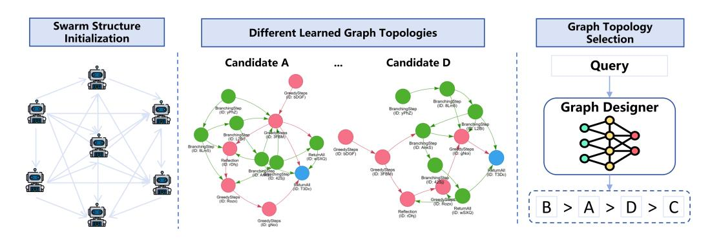

# AMAS: Adaptively Determining Communication Topology for LLM-based Multi-agent System

Hui Yi Leong1,∗ [,](#page-0-0) Yuheng Li2,∗ , Yuqing Wu1,∗ , Wenwen Ouyang3 , Wei Zhu4,† [,](#page-0-0) Jiechao Gao5,† , Wei Han6

1University of Chicage, Chicago, IL, United States. 2 Johns Hopkins University, Baltimore, MD, United States 3Carnegie Mellon University, Pittsburgh, PA, United States 4University of Hong Kong, Hong Kong, HK, China 5 Stanford University, Stanford, CA, United States

6 Independent Researcher, Austin, TX, United States. Email: palebluedot.milkyway@gmail.com

# Abstract

Although large language models (LLMs) have revolutionized natural language processing capabilities, their practical implementation as autonomous multi-agent systems (MAS) for industrial problem-solving encounters persistent barriers. Conventional MAS architectures are fundamentally restricted by inflexible, handcrafted graph topologies that lack contextual responsiveness, resulting in diminished efficacy across varied academic and commercial workloads. To surmount these constraints, we introduce AMAS, a paradigm-shifting framework that redefines LLM-based MAS through a novel dynamic graph selector. This component autonomously identifies task-specific optimal graph configurations via lightweight LLM adaptation, eliminating the reliance on monolithic, universally applied structural templates. Instead, AMAS exploits the intrinsic properties of individual inputs to intelligently direct query trajectories through task-optimized agent pathways. Rigorous validation across question answering, mathematical deduction, and code generation benchmarks confirms that AMAS systematically exceeds state-of-the-art singleagent and multi-agent approaches across diverse LLM architectures. Our investigation establishes that context-sensitive structural adaptability constitutes a foundational requirement for high-performance LLM MAS deployments.

## 1 Introduction

Despite achieving unprecedented success in natural language processing benchmarks, large language models (LLMs) have established SOTA performance across specialized domains including domain-specific question answering, mathematical deduction, safety alignment, and instruction comprehension [\(Qin et al.,](#page-8-0) [2023;](#page-8-0) [Zhu et al.,](#page-8-1) [2023\)](#page-8-1). However, their transition from sophisticated language processors to autonomous problemsolving engines remains fraught with unresolved challenges. Current research primarily focuses on single-model applications, leaving critical gaps in operational deployment frameworks for LLMdriven agent ecosystems. Notably, the momentum toward LLM-based agent architectures has accelerated dramatically, with both industrial practitioners and academic researchers increasingly prioritizing this paradigm shift for scalable problem-solving architectures.

A vibrant scholarly pursuit has centered on architecting LLM-driven agent frameworks, evolving from foundational GPT-3 [\(Brown et al.,](#page-7-0) [2020\)](#page-7-0) through sophisticated few-shot prompting mechanisms that harness LLMs' intrinsic in-context learning potential. Current single-agent implementations increasingly deploy structured reasoning protocols—such as Chain of Thought (COT) [\(Wei et al.,](#page-8-2) [2022\)](#page-8-2), ReAct [\(Yao et al.,](#page-8-3) [2022\)](#page-8-3), Tree of Thought (TOT) [\(Muralidharan and Thomas,](#page-8-4) [2024\)](#page-8-4), Reflexion [\(Shinn et al.,](#page-8-5) [2024\)](#page-8-5), and Graph of Thought (GOT) [\(Besta et al.,](#page-7-1) [2024\)](#page-7-1)—to elevate textual reasoning efficacy. To transcend these boundaries, LLM-powered multi-agent systems (MAS) [\(Zeng et al.,](#page-8-6) [2022;](#page-8-6) [Zhuge et al.,](#page-8-7) [2024;](#page-8-7) [Li et al.,](#page-7-2) [2023a\)](#page-7-2) have gained traction across industrial and academic domains. These systems deploy multiple LLM instances with distinct functional roles [\(Park et al.,](#page-8-8) [2023\)](#page-8-8), enabling natural language coordination to collectively resolve complex problems. This distributed intelligence paradigm consistently surpasses single-agent benchmarks by leveraging specialized agent expertise and emergent collective cognition [\(Minsky,](#page-8-9) [1988\)](#page-8-9). Nevertheless, prevailing MAS approaches persistently rely on handcrafted agent collaboration topologies. GPTSwarm [\(Zhuge](#page-8-7) [et al.,](#page-8-7) [2024\)](#page-8-7) represents a pivotal departure by formalizing MAS as a parameterized graph, employing reinforcement learning (RL) to autonomously

∗These authors contribute equally.

†Corresponding author. For any inquiries, please contact: michaelwzhu91@gmail.com, jiechao@stanford.edu.

refine structural configurations for optimal task execution.

This study introduces the Adaptive Multi-Agent System (AMAS) architecture to overcome fundamental constraints in contemporary methodologies. Preliminary empirical analysis uncovers pronounced heterogeneity across task-specific samples, demonstrating that no singular graph topology consistently achieves optimal outcomes within the MAS paradigm. Instead, numerous graph configurations yield performance metrics that closely approximate the highest-performing variant. This empirical insight propels a paradigm shift: rather than enforcing a static graph architecture, we develop a context-aware selector that autonomously adapts to input characteristics. The AMAS framework harnesses parameter-efficient adaptation protocols for large language models to construct this selector, enabling real-time graph selection tailored to each individual sample without task-specific reconfiguration.

This research establishes a rigorous empirical validation of the AMAS architecture across heterogeneous workloads, encompassing open-domain question answering, formal mathematical reasoning, and program synthesis challenges. Across all evaluated scenarios—regardless of underlying LLM architecture—the framework systematically outperforms both monolithic agents and conventional multi-agent baselines. Robust experimental evidence confirms the framework's cross-domain adaptability and operational robustness. Our key innovations are articulated as follows:

- We refine graph topology quality through adaptive integration of actor-critic dynamics within reinforcement learning-driven optimization pipelines.
- The architecture implements a dynamic graph selection mechanism that autonomously determines optimal structural configuration from candidate ensembles upon sample ingestion.
- Extensive empirical validation and mechanistic analysis substantiate AMAS's superior task resolution efficacy compared to state-of-theart multi-agent paradigms.

# 2 Related works

## 2.1 LLM-based agents

Large language models have undergone unprecedented advancements, exhibiting exceptional versatility across multifaceted application domains. Consequently, scholarly and industrial communities have intensified focus on transforming these models into autonomous cognitive agents. While LLM-driven single-agent systems demonstrate notable efficacy, the inherent advantages of collective intelligence remain irrefutable. Substantial research efforts have been directed toward LLMpowered multi-agent architectures. Drawing inspiration from the theoretical framework of collective cognition [\(Minsky,](#page-8-9) [1988\)](#page-8-9), NLSOMs [\(Zhuge et al.,](#page-8-10) [2023\)](#page-8-10) deploy task-specialized social topologies within MAS implementations. The open-source ecosystem has witnessed proliferation of MAS development frameworks, including CAMEL [\(Li](#page-7-2) [et al.,](#page-7-2) [2023a\)](#page-7-2), Agents [\(Zheng et al.,](#page-8-11) [2024\)](#page-8-11), ChatDev [\(Qian et al.,](#page-8-12) [2023\)](#page-8-12), and AutoGen [\(Wu et al.,](#page-8-13) [2023\)](#page-8-13), which implement handcrafted role-assignment protocols for inter-agent coordination. MetaGPT [\(Hong et al.,](#page-7-3) [2023\)](#page-7-3) establishes structured operational frameworks to standardize role definitions and communication protocols, thereby enhancing collaborative efficiency. GPTSwarm [\(Zhuge](#page-8-7) [et al.,](#page-8-7) [2024\)](#page-8-7) conceptualizes MAS through composite topological architectures and proposes reinforcement learning-based parameterization for graph structure refinement. Despite these innovations, critical limitations persist: (a) automated topological optimization remains challenging due to reinforcement learning's inherent instability, and (b) all contemporary approaches enforce static graph configurations—whether manually engineered or RL-optimized—thereby neglecting sample-specific heterogeneity in task execution.

#### 2.2 Sample dependency in LLMs

This research pioneers the integration of samplespecific heterogeneity into multi-agent system architecture, introducing a query-adaptive graph orchestrator that dynamically selects optimal topological configurations from candidate ensembles based on input characteristics. The conceptual foundation draws inspiration from parallel advancements in large language model research: in-context learning methodologies [\(Rubin et al.,](#page-8-14) [2021;](#page-8-14) [Li](#page-7-4) [et al.,](#page-7-4) [2023b\)](#page-7-4) dynamically construct task-specific exemplars during inference to generate adaptive

Figure 1: Schematic illustration of our AMAS framework.

|         | Sample index |     |     |     |     |     |     |     |     |     |     |     |     |     |     |       |
|---------|--------------|-----|-----|-----|-----|-----|-----|-----|-----|-----|-----|-----|-----|-----|-----|-------|
| Graph   | 1            | 2   | 3   | 4   | 5   | 6   | 7   | 8   | 9   | 10  | 11  | 12  | 13  | 14  | 15  | Avg   |
| Graph A | 0.2          | 0.2 | 0.1 | 0.2 | 0.3 | 0.4 | 0.1 | 0.1 | 0.2 | 0.3 | 0.2 | 0.3 | 0.1 | 0.1 | 0.3 | 0.208 |
| Graph B | 0.1          | 0.1 | 0.2 | 0.2 | 0.2 | 0.2 | 0.3 | 0.1 | 0.1 | 0.0 | 0.2 | 0.1 | 0.2 | 0.2 | 0.2 | 0.199 |
| Graph C | 0.1          | 0.1 | 0.1 | 0.1 | 0.1 | 0.3 | 0.0 | 0.0 | 0.2 | 0.2 | 0.3 | 0.2 | 0.5 | 0.1 | 0.3 | 0.199 |
| Graph D | 0.0          | 0.1 | 0.2 | 0.0 | 0.3 | 0.1 | 0.1 | 0.3 | 0.2 | 0.2 | 0.6 | 0.2 | 0.2 | 0.0 | 0.1 | 0.192 |

Table 1: Pilot experiment's results on Crossword. This table presents the four different graphs' performances on 15 samples of the test set.

prompts, while input-dependent soft prompt tuning approaches [\(Zhu et al.,](#page-8-15) [2024;](#page-8-15) [Liu et al.,](#page-7-5) [2022\)](#page-7-5) synthesize query-conditioned embedding vectors through parameter-efficient adaptation. AMAS extends this paradigm by transposing the input-aware design principle from prompt engineering to structural optimization, establishing a novel framework for context-sensitive multi-agent system architectures that fundamentally addresses sample-specific variation in task execution.

# 3 AMAS

### 3.1 Preliminaries on graph optimization

Drawing upon the theoretical foundation of collective cognition [\(Minsky,](#page-8-9) [1988;](#page-8-9) [Zhuge et al.,](#page-8-10) [2023\)](#page-8-10), the GPTSwarm framework [\(Zhuge et al.,](#page-8-7) [2024\)](#page-8-7) formalizes agent interconnectivity through a composite topological architecture G = (N , E). To elevate multi-agent system efficacy, this approach further embeds topological attributes within differentiable parameters, employing policy gradient optimization via the REINFORCE algorithm to dynamically refine structural configurations for taskspecific performance enhancement.

## 3.2 A pilot experiments and motivations

To establish the foundation for our AMAS framework, we initiate an exploratory investigation[1](#page-2-0) tar-

geting the Crossword puzzle benchmark [\(Muralid](#page-8-4)[haran and Thomas,](#page-8-4) [2024\)](#page-8-4). Figure [1](#page-2-1) displays the four most effective architectural designs—labeled Graph A through D—while Table [1](#page-2-2) illustrates their evaluation outcomes across fifteen test instances. A complete tabular representation of these comparative results appears in Table [1.](#page-2-2)

Analysis of the empirical findings uncovers two pivotal patterns: (i) While Graph A's architecture delivers the highest cumulative score in the Crossword evaluation, multiple alternative graph configurations demonstrate performance metrics that are statistically comparable to Graph A's outcomes. (ii) The assessment data reveals pronounced samplespecific performance variations, indicating that no single architectural design maintains consistent superiority across all test instances. Specifically, Graph A achieves the highest mean score yet fails to secure top position in every individual case. Conversely, Graph D registers the lowest average performance but never attains the lowest rank in any single evaluation. This fluctuation is exemplified by the contrasting performance hierarchies: the initial test instance ranks architectures as A > B = C > D, whereas the thirteenth sample exhibits a completely inverted ordering of C > B = D > A.

These empirical findings demonstrate that while reinforcement learning facilitates the refinement of agent architectures, a static graph configuration

1The methodological approach aligns precisely with Section [4,](#page-4-0) utilizing the Qwen2.5 3B language model as the core

LLM component instead of the primary experimental configuration.

fails to secure consistent superiority across all task instances. Consequently, the integration of a dynamic graph selection mechanism—capable of autonomously evaluating and selecting the most appropriate architecture for each test sample based on predictive performance analytics—would yield a substantial performance enhancement for the agentic system.

#### 3.3 Construction of graph selector

Our methodology for developing the graph selector within task  $\mathcal{T}$  operates through a three-phase framework. Analogous to the reward modeling component in RLHF (Ouyang et al., 2022), this selector quantifies architectural efficacy by assigning a normalized performance expectation score within (0,1) for each candidate graph structure given the input context. Crucially, whereas RLHF reward models assess LLM output quality, our selector evaluates the intrinsic suitability of agent architecture configurations. The implementation pipeline proceeds as follows:

Generation of Candidate Architectural Configurations The parameterized graph undergoes systematic refinement through optimization over task  $\mathcal{T}$ 's training corpus  $\mathcal{D}_{train}$ , executed according to the protocol specified in (Zhuge et al., 2024). This iterative process produces multiple parameter  $\Theta$  checkpoint iterations, each yielding a distinct architectural configuration. Subsequently, we extract the top K graph structures exhibiting maximal average performance metrics from these checkpointderived configurations.

Formulating the Training Corpus for the Graph Selection Module The graph selector's training dataset  $\mathcal{D}_{gs,train}$  is systematically derived from  $\mathcal{D}_{train}$  via a structured methodology. Each instance within  $\mathcal{D}_{gs,train}$  operates on a dual-element architecture, featuring a query component x and an outcome indicator y. The query x follows a standardized template as follows:

Task Introduction:

- (a) You are currently acting as the graph selector for the agent system that works on the [task\_name] task.
- (b) The task [task\_name]'s introduction is as follows: [task\_intro].
- (c) you will be given an input query, and a graph structure. Please evaluate the graph structure's quality in terms of how it will help solving the task in the input prompt.

The input query is:

In the above template, [task\_name] denotes the the task name, [task\_intro] denotes the introductory text contents for the task, [input\_query] denotes the input query q of the current sample, and [graph\_structure] denotes the graph's structure G. And the label g is the rank index for the [graph\_structure]. Correspondingly, g encodes the sequential position of [graph\_structure] within the structural hierarchy.

Architecting the Graph Selection Mechanism The pre-existing LLM framework  $\mathcal{M}$  serves as the foundational architecture, augmented via low-rank adaptation (LoRA) (Hu et al., 2021) to specialize in graph selection, driven by two critical advantages: (i) LoRA substantially reduces computational resource demands during training while mitigating reliance on extensive datasets; (ii) LoRA parameters integrate seamlessly with the existing LLM backbone, occupying merely  $\sim 0.5\%$  of the backbone's GPU memory footprint. Let  $\Omega$  denote the LoRA parameter set. The graph selection module integrates LoRA layers atop  $\mathcal{M}$ , supplemented by a pooling layer and a linear prediction head. Formally, with Pooler(·) representing the pooling operation and  $LP(\cdot)$  denoting the prediction head, the selector's output is defined as:

$$\hat{y} = \text{LP}(\text{Pooler}(\mathcal{M}(x \mid \Omega))).$$
 (1)

Here,  $\mathcal{M}$  processes the input to generate hidden states  $H_x \in \mathbf{R}^{l_x \times d_m}$ . The Pooler condenses these states into a contextual vector  $h_x \in \mathbf{R}^{d_m}$ , while LP employs a linear transformation followed by a sigmoid activation to yield normalized scores in [0,1].

The training objective aligns the selector's predicted rankings with ground-truth performance metrics. For a test query q, K candidate graphs  $\{G_i\}_{i=1}^K$  correspond to distinct agent systems, each associated with performance score  $s_i$ . Their relative ordering is determined by:

$$r_j = \operatorname{Ranking}(s_j \mid \{s_j\}_{j=1}^K), \tag{2}$$

where Ranking assigns positions 1 (best) to K (worst) in ascending score order. Ties are resolved by index priority (e.g., i < j when  $s_i = s_j$ ). 2

&lt;sup>2For identical scores  $s_i = s_j$ , the graph with smaller index i receives higher rank.

| Datasets   | #train | #dev | #test | Type               | Metrics |
|------------|--------|------|-------|--------------------|---------|
| Game-of-24 | 1.0k   | 0.1k | 0.1k  | Math problem       | acc     |
| Crossword  | 80     | 25   | 25    | Text puzzles       | acc     |
| MMLU       | 11.2k  | 1.4k | 1.4k  | Question Answering | acc     |
| LLM-Eval-P | 3.2k   | 0.4k | 0.4k  | Question Answering | acc     |
| HumanEval  | 120    | 24   | 20    | Code generation    | pass@10 |

Table 2: The statistics of the datasets evaluated in this work.

To instill ranking semantics, we employ the loss:

$$\mathcal{L}_r = \sum_{1 \le i, j \le K, i \ne j} m(i, j) \cdot g(i, j), \qquad (3)$$

with weights  $m(i, j) = \max (0, |r_j - r_i|^{0.5})$  and scoring term  $g(i, j) = \text{GeLU}((s_j - s_i) \cdot (\hat{y}_j - \hat{y}_i))$ .

This formulation enforces critical constraints. When  $s_j > s_i$  (implying  $r_j > r_i$ ), m(i,j) = 0 discards the pair. When  $s_j < s_i$  ( $r_j < r_i$ ), m(i,j) > 0 and minimizing  $\mathcal{L}_r$  maximizes  $\hat{y}_j - \hat{y}_i$ . Ties ( $s_i = s_j$ ) yield  $m(i,j) \cdot g(i,j) = 0$ , rendering the pair inactive. The weight m(i,j) dynamically scales loss contribution based on rank disparity. Adjacent ranks ( $r_i = 2$ ,  $r_j = 1$ ) yield  $m(i,j) \approx 0.292$ . Distant ranks ( $r_i = 4$ ,  $r_j = 1$ ) yield m(i,j) = 0.5, amplifying optimization pressure. Thus,  $\mathcal{L}_r$  efficiently propagates list-wise ranking cues to the selector, enabling precise graph selection aligned with empirical performance.

#### 4 Experiments

#### 4.1 Datasets and evaluation metrics

Our evaluation framework encompasses five rigorously designed assessment benchmarks: (i) Crossword (Muralidharan and Thomas, 2024), requiring 5×5 puzzle resolution; (ii) Game-of-24 (Muralidharan and Thomas, 2024), demanding arithmetic composition of four digits to reach 24; (iii) MMLU (Hendrycks et al., 2020), a comprehensive multiple-choice reasoning benchmark; (iv) LLM-Eval-P (internal benchmark), engineered to assess reasoning depth, factual knowledge, and task generalization across 47 domain-specific challenges spanning literature, healthcare, security, coding, and software engineering; (v) HumanEval (Chen et al., 2021), a code-generation evaluation suite. All datasets undergo standardized partitioning into 8:1:1 train/dev/test splits to support our AMAS pipeline. Graph selector fine-tuning data is exclusively derived from the training partitions. with comprehensive statistical profiles documented in Table 2.

Task-specific metrics are as follows: (i) *Cross-word* employs character-level precision, measuring the proportion of correctly resolved puzzle entries; (ii) *Game-of-24* evaluates arithmetic composition success, quantifying the correctness of derived expressions from four numerical digits; (iii) *MMLU* adopts multiple-choice reasoning accuracy, assessing selection correctness among candidate options; (iv) *LLM-Eval-P* utilizes domain-diverse multiple-choice accuracy to gauge response correctness across 47 specialized challenge domains; (v) *HumanEval* implements the standard pass@10 metric, calculating the fraction of successful code executions across ten independent generation trials.

#### 4.2 Baselines

We benchmark AMAS against state-of-the-art LLM architectures across diverse agent-centric inference paradigms. *Monolithic agent approaches* encompass: (i) *Input-Output* (IO), where the LLM directly synthesizes outputs from prompts; (ii) *Chain-of-Thought* (COT) (Wei et al., 2022), implementing stepwise reasoning prior to final response generation; (iii) *Self-Consistency* (Wang et al., 2022); (iv) *Tree-of-Thought* (TOT) (Muralidharan and Thomas, 2024); (v) *Graph-of-Thought* (GOT) (Besta et al., 2024). *Collaborative agent ecosystems* include: (i) *AutoGPT* (Yang et al., 2023); (ii) *AgentVerse* (Chen et al., 2023); (iii) *GPTSwarm* (Zhuge et al., 2024).

#### 4.3 Experiment Settings

Computational infrastructure All experiments were conducted using either NVIDIA A40 GPUs (equipped with 48GB of memory) or NVIDIA A100 GPUs (featuring 80GB of memory).

Foundation LLMs Each agent system in our study relies on a large language model (LLM) as its core backbone. Specifically, we employ the following models in our evaluations: (a) GPT-3.5-turbo3; (b) the LLaMA-3 architecture (Dubey et al., 2024), instantiated in both 8B and 70B parameter variants;

&lt;sup>3https://platform.openai.com/docs/models/gpt-3-5-turbo

and (c) distilled versions of the Deepseek R1 model [\(Guo et al.,](#page-7-11) [2025\)](#page-7-11), each with 7B parameters.

Graph optimization configuration Following the methodology of GPTSwarm, we structure our agentic system as a composite computational graph. This graph integrates three key components: a Treeof-Thoughts (ToT) agent configured with a depth of 4 and a branching factor of 2; a Reflection agent [\(Shinn et al.,](#page-8-5) [2024\)](#page-8-5) that performs one reflection step over two iterative passes; and a dedicated output node. Altogether, this yields a graph comprising n = 12 nodes. The d potential interconnections within the graph are governed by a learnable parameter vector Θ = [θ1, θ2, . . . , θd]. We utilize the REINFORCE algorithm [\(Williams,](#page-8-19) [1992\)](#page-8-19). On each optimization step, two graph structures are sampled via [\(Zhuge et al.,](#page-8-7) [2024\)](#page-8-7), and their will obtain rewards on the current batched samples. The parameters are optimized with the optimizer set to AdamW, the learning rate set to 1.0e-1, the training epoch set to 5, and the batch size set to 4.

During optimization, we persist the graph parameters Θ at every tenth training step. Each saved checkpoint is then used to instantiate a concrete graph structure, which is subsequently evaluated on the development set. From these, we retain the top K = 4 highest-performing graphs as candidates for the downstream graph selection module.

Graph selector hyperparameters Our implementation of the graph selector adopts the following settings: (a) the Pooler utilizes last-token pooling—i.e., the representation of the final token in the input sequence serves as the aggregate embedding for the entire sequence; (b) a LoRA adapter with rank r = 16 is attached to every linear layer within the LLM backbone; and (c) for experiments involving proprietary LLMs, the selector is realized by fine-tuning the 7B distilled Deepseek model. In all other cases, the LoRA modules of the selector are fine-tuned directly on the same LLM backbone used by the agent. Consequently, when the backbone is the Deepseek 7B distilled model, the selector introduces an additional 40.5 million trainable parameters—equivalent to just 0.57% of the total model size. At inference time, the selector assesses each candidate graph on a per-sample basis and selects the structure yielding the highest reward to construct the final agentic pipeline for prediction.

We use the HugginFace Transformers [\(Wolf](#page-8-20) [et al.,](#page-8-20) [2020\)](#page-8-20) and PEFT [\(Mangrulkar et al.,](#page-7-12) [2022\)](#page-7-12) for implementing the training procedure of the graph

selector. The batch size is set to ensure the optimization steps in one epoch is between 64 to 256, and the maximum training epoch is set to 10. We use AdamW as the optimizer with a linear learning rate decay schedule and 6% of the training steps for warm-up. The learning rate is set to 1e-4. In every 50 steps, the model is evaluated on the dev set to calculate dev set perplexity. Patience is set to 10, that is, if the model does not achieve a lower dev set perplexity for 10 evaluation runs, the training stops early. The best checkpoint on the dev set is used to run predictions on the test set.

Reproducibility protocol To ensure robustness, every task is executed across five distinct random seeds, and we report the median performance across these runs.

### 4.4 Main results

We compare AMAS with baseline LLM agentic approaches, and the experimental results are presented in Table [3.](#page-6-0) We present the average latency (in seconds) in the last column to examine the efficiency of each system. Table [3](#page-6-0) reveals that: (a) our AMAS method outperforms the baseline methods across all seven tasks. In particular, AMAS outperforms the previous SOTA MAS baselines like AgentVerse and GPTSwarm. (b) Despite having an additional graph selection step, our AMAS's latency is comparable to that of GPTSwarm. The graph selection step requires only one forward pass on the LLM backbone, which will not significantly increase latency.

#### 4.5 Ablation studies and further analysis

Results on more LLM backbones While our primary evaluation focuses on the open-source LLaMA-3 family, we further assess the generality of the AMAS framework by extending our experiments to a diverse set of language models: (a) GPT-3.5-turbo, (b) the distilled 7B variant of Deepseek R1, and (c) Qwen-3 models of both 8B and 30B scales [\(Yang et al.,](#page-8-21) [2025\)](#page-8-21). Performance on the Crossword and Game-of-24 benchmarks is summarized in Table [4.](#page-6-1) Due to practical limitations in integrating LoRA adapters with GPT-3.5-turbo, we instead train a graph selector by fine-tuning the LLaMA-3 8B model using LoRA. As shown in the table, our approach consistently surpasses conventional MAS baselines across these alternative backbones as well.

Ablation analysis of the AMAS architecture To rigorously assess the architectural integrity of

| System                  | Crossword | Game-of-24 | MMLU  | LLM-Eval-P | HumanEval | Latency |  |
|-------------------------|-----------|------------|-------|------------|-----------|---------|--|
| Results for LlaMA-3 8B  |           |            |       |            |           |         |  |
| IO                      | 0.165     | 0.132      | 0.536 | 0.365      | 0.659     | 1.13    |  |
| COT                     | 0.184     | 0.217      | 0.594 | 0.432      | 0.701     | 2.25    |  |
| Self-consistency        | 0.205     | 0.206      | 0.604 | 0.445      | 0.707     | 2.67    |  |
| TOT                     | 0.396     | 0.305      | 0.615 | 0.459      | 0.713     | 13.5    |  |
| GOT                     | 0.406     | 0.289      | 0.618 | 0.464      | 0.708     | 14.6    |  |
| AutoGPT                 | 0.418     | 0.309      | 0.621 | 0.457      | 0.698     | 32.4    |  |
| AgentVerse              | 0.452     | 0.326      | 0.632 | 0.458      | 0.715     | 35.2    |  |
| GPTSwarm                | 0.447     | 0.343      | 0.649 | 0.473      | 0.728     | 30.6    |  |
| AMAS (ours)             | 0.485     | 0.377      | 0.663 | 0.481      | 0.748     | 31.0    |  |
| Results for LlaMA-3 70B |           |            |       |            |           |         |  |
| TOT                     | 0.647     | 0.521      | 0.829 | 0.564      | 0.785     | 145.6   |  |
| GPTSwarm                | 0.654     | 0.548      | 0.836 | 0.585      | 0.798     | 353.5   |  |
| AMAS (ours)             | 0.671     | 0.563      | 0.847 | 0.597      | 0.812     | 351.7   |  |

Table 3: The Overall comparison of different agentic systems. The LLM backbone model is LlaMA-3 8B or 72B. We report the median accuracy over five random seeds. Bold indicate the best results.

| Method                               | Crossword | Game-of-24 |  |  |  |  |  |  |
|--------------------------------------|-----------|------------|--|--|--|--|--|--|
| Results for Deepseek R1 distilled 7B |           |            |  |  |  |  |  |  |
| TOT                                  | 0.457     | 0.368      |  |  |  |  |  |  |
| GPTSwarm                             | 0.479     | 0.402      |  |  |  |  |  |  |
| AMAS                                 | 0.516     | 0.438      |  |  |  |  |  |  |
| Results for Qwen-3 8B                |           |            |  |  |  |  |  |  |
| TOT                                  | 0.448     | 0.462      |  |  |  |  |  |  |
| GPTSwarm                             | 0.464     | 0.471      |  |  |  |  |  |  |
| AMAS                                 | 0.502     | 0.493      |  |  |  |  |  |  |
| Results for Qwen-3 8B                |           |            |  |  |  |  |  |  |
| TOT                                  | 0.592     | 583        |  |  |  |  |  |  |
| GPTSwarm                             | 0.616     | 0.601      |  |  |  |  |  |  |
| AMAS                                 | 0.642     | 0.615      |  |  |  |  |  |  |
| Results for GPT-3.5-turbo            |           |            |  |  |  |  |  |  |
| TOT                                  | 0.673     | 0.646      |  |  |  |  |  |  |
| GPTSwarm                             | 0.698     | 0.674      |  |  |  |  |  |  |
| AMAS                                 | 0.717     | 0.692      |  |  |  |  |  |  |

Table 4: Experimental results for four different LLM backbones.

our AMAS framework, we systematically evaluate three distinct modifications: (a) AMAS-1, which employs K = 8 top-ranked graph candidates; (b) AMAS-2, which restricts candidate selection to K = 2 top graphs; (c) AMAS-3, which omits the weight coefficient m(i, j) from the loss formulation (Equation [3\)](#page-4-3). Comparative results across Crossword and Game-of-24 benchmarks are documented in Table [5.](#page-6-2) Notably, the baseline AMAS configuration (mirroring Table [3\)](#page-6-0) achieves superior performance over all alternative implementations. Specifically: (a) AMAS-1 and AMAS-2 analyses confirm K = 4 as the optimal candidate threshold—reducing (K = 2) or expanding (K = 8) this parameter degrades graph selector efficacy. (b) The

| Method | Crossword | Game-of-24 |
|--------|-----------|------------|
| AMAS   | 0.483     | 0.374      |
| AMAS-1 | 0.482     | 0.373      |
| AMAS-2 | 0.478     | 0.369      |
| AMAS-3 | 0.476     | 0.365      |

Table 5: The comparison of AMAS's variants.

AMAS-3 comparison substantiates the loss objective's design (Equation [3\)](#page-4-3), where m(i, j) quantifies item-wise disparity (i vs. j), thereby sharpening the model's sensitivity to ordinal relationships within the ranking structure.

# 5 Conclusion

This study introduces AMAS, a novel adaptive framework engineered to elevate LLM-driven multi-agent systems. We commence with an initial empirical investigation revealing task-specific sample sensitivity inherent in conventional MAS architectures. Subsequently, we engineer a graph selector mechanism that dynamically identifies optimal structural configurations for incoming queries. This selector is synthesized through parameterefficient adaptation of the LLM backbone, leveraging our bespoke loss formulation. Comprehensive evaluations across question answering, mathematical reasoning, and code generation benchmarks affirm that AMAS delivers consistent superiority over leading single-agent and multi-agent baselines, across diverse LLM architectures. Crucially, AMAS achieves comparable computational efficiency to established approaches, establishing its viability for large-scale industrial deployment.

# Limitations

While our methodology demonstrates robust efficacy across diverse benchmarks and pretrained architectures, we recognize two key constraints: (a) computational constraints precluded evaluation on exceptionally large open-source LLMs, including LlaMA-3 450B and Deepseek R1. (b) The scope excludes more complex variants within mathematical reasoning, question answering, and information extraction domains. Notwithstanding these boundaries, the architectural adaptability of AMAS permits seamless integration with alternative backbone models and task paradigms. Future investigations will systematically examine the framework's performance across high-capacity model variants and challenging task landscapes, thereby validating its broader applicability beyond current experimental boundaries.

## Ethics Statement

This research establishes a paradigm for enhancing LLM-driven MAS architectures through optimized downstream performance. The experimental datasets represent established benchmarks in the literature, with comprehensive ethical clearance confirmed through peer-reviewed validation protocols. Our methodology was rigorously tested across LlaMA-3 variants, GPT-3.5-turbo, and Deepseek R1 distilled architectures. Notably, as with all generative language models, these systems exhibit inherent output unpredictability, occasionally generating erroneous or biased content. Crucially, this investigation centers on theoretical framework development for MAS methodologies, distinct from user-facing application deployment. Subsequent research will comprehensively evaluate the safety profile of AMAS within LLM operational ecosystems, prioritizing robustness against harmful outputs in future iterations.

## References

- Maciej Besta, Nils Blach, Ales Kubicek, Robert Gerstenberger, Michal Podstawski, Lukas Gianinazzi, Joanna Gajda, Tomasz Lehmann, Hubert Niewiadomski, Piotr Nyczyk, et al. 2024. Graph of thoughts: Solving elaborate problems with large language models. In *Proceedings of the AAAI Conference on Artificial Intelligence*, volume 38-16, pages 17682–17690.
- Tom Brown, Benjamin Mann, Nick Ryder, Melanie Subbiah, Jared D Kaplan, Prafulla Dhariwal, Arvind Neelakantan, Pranav Shyam, Girish Sastry, Amanda

- Askell, et al. 2020. Language models are few-shot learners. *Advances in neural information processing systems*, 33:1877–1901.
- Mark Chen, Jerry Tworek, Heewoo Jun, Qiming Yuan, Henrique Ponde De Oliveira Pinto, Jared Kaplan, Harri Edwards, Yuri Burda, Nicholas Joseph, Greg Brockman, et al. 2021. Evaluating large language models trained on code. *arXiv preprint arXiv:2107.03374*.
- Weize Chen, Yusheng Su, Jingwei Zuo, Cheng Yang, Chenfei Yuan, Chen Qian, Chi-Min Chan, Yujia Qin, Yaxi Lu, Ruobing Xie, et al. 2023. Agentverse: Facilitating multi-agent collaboration and exploring emergent behaviors in agents. *arXiv preprint arXiv:2308.10848*, 2(4):6.
- Abhimanyu Dubey, Abhinav Jauhri, Abhinav Pandey, Abhishek Kadian, Ahmad Al-Dahle, Aiesha Letman, Akhil Mathur, Alan Schelten, Amy Yang, Angela Fan, et al. 2024. The llama 3 herd of models. *arXiv preprint arXiv:2407.21783*.
- Daya Guo, Dejian Yang, Haowei Zhang, Junxiao Song, Ruoyu Zhang, Runxin Xu, Qihao Zhu, Shirong Ma, Peiyi Wang, Xiao Bi, et al. 2025. Deepseek-r1: Incentivizing reasoning capability in llms via reinforcement learning. *arXiv preprint arXiv:2501.12948*.
- Dan Hendrycks, Collin Burns, Steven Basart, Andy Zou, Mantas Mazeika, Dawn Song, and Jacob Steinhardt. 2020. Measuring massive multitask language understanding. *arXiv preprint arXiv:2009.03300*.
- Sirui Hong, Xiawu Zheng, Jonathan Chen, Yuheng Cheng, Jinlin Wang, Ceyao Zhang, Zili Wang, Steven Ka Shing Yau, Zijuan Lin, Liyang Zhou, et al. 2023. Metagpt: Meta programming for multi-agent collaborative framework. *arXiv preprint arXiv:2308.00352*.
- Edward J Hu, Yelong Shen, Phillip Wallis, Zeyuan Allen-Zhu, Yuanzhi Li, Shean Wang, Lu Wang, and Weizhu Chen. 2021. Lora: Low-rank adaptation of large language models. *arXiv preprint arXiv:2106.09685*.
- Guohao Li, Hasan Hammoud, Hani Itani, Dmitrii Khizbullin, and Bernard Ghanem. 2023a. Camel: Communicative agents for" mind" exploration of large language model society. *Advances in Neural Information Processing Systems*, 36:51991–52008.
- Xiaonan Li, Kai Lv, Hang Yan, Tianya Lin, Wei Zhu, Yuan Ni, Guo Tong Xie, Xiaoling Wang, and Xipeng Qiu. 2023b. [Unified demonstration retriever for in](https://api.semanticscholar.org/CorpusID:258557751)[context learning.](https://api.semanticscholar.org/CorpusID:258557751) *ArXiv*, abs/2305.04320.
- Xiangyang Liu, Tianxiang Sun, Xuanjing Huang, and Xipeng Qiu. 2022. Late prompt tuning: A late prompt could be better than many prompts. *ArXiv*, abs/2210.11292.
- Sourab Mangrulkar, Sylvain Gugger, Lysandre Debut, Younes Belkada, Sayak Paul, and Benjamin Bossan.

- 2022. Peft: State-of-the-art parameter-efficient finetuning methods. [https://github.com/huggingface/](https://github.com/huggingface/peft) [peft](https://github.com/huggingface/peft).
- Marvin Minsky. 1988. *Society of mind*. Simon and Schuster.
- Jananee Muralidharan and Tiju Thomas. 2024. Deliberate problem-solving with a large language model as a brainstorm aid using a checklist for prompt generation. *The Journal of the Association of Physicians of India*, 72(5):89–90.
- Long Ouyang, Jeffrey Wu, Xu Jiang, Diogo Almeida, Carroll Wainwright, Pamela Mishkin, Chong Zhang, Sandhini Agarwal, Katarina Slama, Alex Ray, et al. 2022. Training language models to follow instructions with human feedback. *Advances in Neural Information Processing Systems*, 35:27730–27744.
- Joon Sung Park, Joseph O'Brien, Carrie Jun Cai, Meredith Ringel Morris, Percy Liang, and Michael S Bernstein. 2023. Generative agents: Interactive simulacra of human behavior. In *Proceedings of the 36th annual acm symposium on user interface software and technology*, pages 1–22.
- Chen Qian, Wei Liu, Hongzhang Liu, Nuo Chen, Yufan Dang, Jiahao Li, Cheng Yang, Weize Chen, Yusheng Su, Xin Cong, et al. 2023. Chatdev: Communicative agents for software development, 2024. *URL https://arxiv. org/abs/2307*, 7924.
- Chengwei Qin, Aston Zhang, Zhuosheng Zhang, Jiaao Chen, Michihiro Yasunaga, and Diyi Yang. 2023. Is chatgpt a general-purpose natural language processing task solver? *arXiv preprint arXiv:2302.06476*.
- Ohad Rubin, Jonathan Herzig, and Jonathan Berant. 2021. Learning to retrieve prompts for in-context learning. *arXiv preprint arXiv:2112.08633*.
- Noah Shinn, Federico Cassano, Ashwin Gopinath, Karthik Narasimhan, and Shunyu Yao. 2024. Reflexion: Language agents with verbal reinforcement learning. *Advances in Neural Information Processing Systems*, 36.
- Yizhong Wang, Yeganeh Kordi, Swaroop Mishra, Alisa Liu, Noah A Smith, Daniel Khashabi, and Hannaneh Hajishirzi. 2022. Self-instruct: Aligning language model with self generated instructions. *arXiv preprint arXiv:2212.10560*.
- Jason Wei, Xuezhi Wang, Dale Schuurmans, Maarten Bosma, Ed Huai hsin Chi, F. Xia, Quoc Le, and Denny Zhou. 2022. [Chain of thought prompting](https://api.semanticscholar.org/CorpusID:246411621) [elicits reasoning in large language models.](https://api.semanticscholar.org/CorpusID:246411621) *ArXiv*, abs/2201.11903.
- Ronald J Williams. 1992. Simple statistical gradientfollowing algorithms for connectionist reinforcement learning. *Machine learning*, 8:229–256.

- Thomas Wolf, Lysandre Debut, Victor Sanh, Julien Chaumond, Clement Delangue, Anthony Moi, Pierric Cistac, Tim Rault, Remi Louf, Morgan Funtowicz, Joe Davison, Sam Shleifer, Patrick von Platen, Clara Ma, Yacine Jernite, Julien Plu, Canwen Xu, Teven Le Scao, Sylvain Gugger, Mariama Drame, Quentin Lhoest, and Alexander Rush. 2020. [Trans](https://doi.org/10.18653/v1/2020.emnlp-demos.6)[formers: State-of-the-art natural language processing.](https://doi.org/10.18653/v1/2020.emnlp-demos.6) In *Proceedings of the 2020 Conference on Empirical Methods in Natural Language Processing: System Demonstrations*, pages 38–45, Online. Association for Computational Linguistics.
- Qingyun Wu, Gagan Bansal, Jieyu Zhang, Yiran Wu, Shaokun Zhang, Erkang Zhu, Beibin Li, Li Jiang, Xiaoyun Zhang, and Chi Wang. 2023. Autogen: Enabling next-gen llm applications via multiagent conversation framework. *arXiv preprint arXiv:2308.08155*.
- An Yang, Anfeng Li, Baosong Yang, Beichen Zhang, Binyuan Hui, Bo Zheng, Bowen Yu, Chang Gao, Chengen Huang, Chenxu Lv, et al. 2025. Qwen3 technical report. *arXiv preprint arXiv:2505.09388*.
- Hui Yang, Sifu Yue, and Yunzhong He. 2023. Auto-gpt for online decision making: Benchmarks and additional opinions. *arXiv preprint arXiv:2306.02224*.
- Shunyu Yao, Jeffrey Zhao, Dian Yu, Nan Du, Izhak Shafran, Karthik Narasimhan, and Yuan Cao. 2022. React: Synergizing reasoning and acting in language models. *arXiv preprint arXiv:2210.03629*.
- Andy Zeng, Maria Attarian, Brian Ichter, Krzysztof Choromanski, Adrian Wong, Stefan Welker, Federico Tombari, Aveek Purohit, Michael Ryoo, Vikas Sindhwani, et al. 2022. Socratic models: Composing zero-shot multimodal reasoning with language. *arXiv preprint arXiv:2204.00598*.
- Longtao Zheng, Zhiyuan Huang, Zhenghai Xue, Xinrun Wang, Bo An, and Shuicheng Yan. 2024. Agentstudio: A toolkit for building general virtual agents. *arXiv preprint arXiv:2403.17918*.
- Wei Zhu, Aaron Xuxiang Tian, Congrui Yin, Yuan Ni, Xiaoling Wang, and Guotong Xie. 2024. Iapt: Instruction-aware prompt tuning for large language models. *arXiv preprint arXiv:2405.18203*.
- Wei Zhu, Xiaoling Wang, Huanran Zheng, Mosha Chen, and Buzhou Tang. 2023. [PromptCBLUE: A Chinese](https://doi.org/10.48550/arXiv.2310.14151) [Prompt Tuning Benchmark for the Medical Domain.](https://doi.org/10.48550/arXiv.2310.14151) *arXiv e-prints*, page arXiv:2310.14151.
- Mingchen Zhuge, Haozhe Liu, Francesco Faccio, Dylan R Ashley, Róbert Csordás, Anand Gopalakrishnan, Abdullah Hamdi, Hasan Abed Al Kader Hammoud, Vincent Herrmann, Kazuki Irie, et al. 2023. Mindstorms in natural language-based societies of mind. *arXiv preprint arXiv:2305.17066*.
- Mingchen Zhuge, Wenyi Wang, Louis Kirsch, Francesco Faccio, Dmitrii Khizbullin, and Jürgen Schmidhuber. 2024. Gptswarm: language agents as

optimizable graphs. In *Proceedings of the 41st International Conference on Machine Learning*, pages 62743–62767.