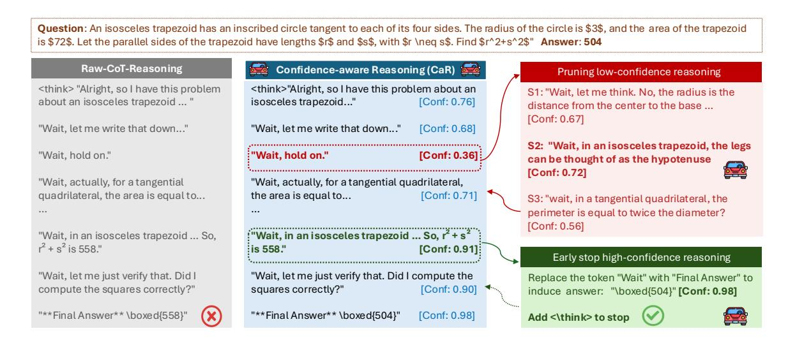
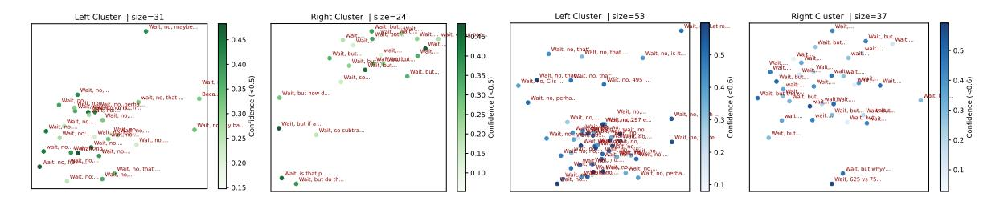
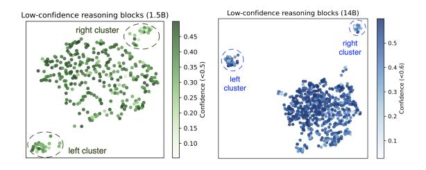
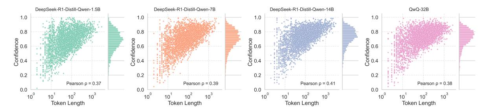
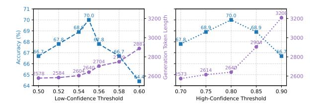
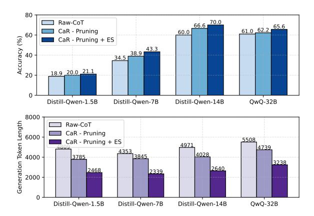
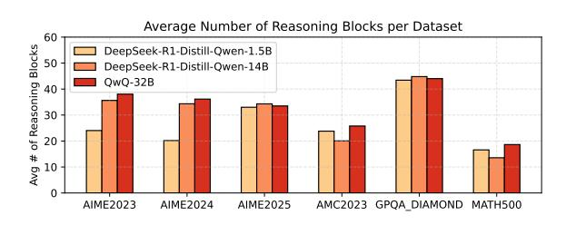

# <span id="page-0-0"></span>Confidence-Aware Reasoning: Optimizing Self-Guided Thinking Trajectories in Large Reasoning Models

# Jiaxin Zhan[g](#page-0-0)

Independent Researcher

# Abstract

Chain-of-thought enables large reasoning models (LRMs) to reason through multi-step problems but often leads to unnecessarily long or redundant reasoning traces, a phenomenon known as *overthinking*. This results in inflated inference costs and potential degradation in answer quality. To address these challenges, we propose Confidence-Aware Reasoning (CaR), an inference-time framework that optimizes reasoning trajectories by selectively pruning lowutility reasoning blocks and halting early when sufficient confidence has been achieved. CaR is theoretically grounded in Bayesian optimal experimental design, treating each reasoning block as a sequential decision whose utility is approximated by its marginal contribution to reducing final answer uncertainty. We introduce a lightweight implementation that leverages token-level confidence to dynamically modulate reasoning depth without additional supervision. Evaluations on multiple benchmarks, including AMC, AIME, GPQA-Diamond, and MATH-500 show that CaR improves answer accuracy by up to +13.3%, while reducing average reasoning length by 40%–50%. Our findings demonstrate that information-theoretic insights can effectively control self-guided reasoning and enable LRMs to "think just enough" at test time.

# 1 Introduction

Large language models (LLMs) have achieved remarkable progress in multi-step reasoning through the use of chain-of-thought (CoT) prompting, where models are guided to first generate an intermediate sequence of thoughts before producing a final answer [\(Wei et al.,](#page-8-0) [2023\)](#page-8-0). Recent open-source models such as DeepSeek-R1 [\(DeepSeek-AI,](#page-7-0) [2025\)](#page-7-0) and OpenAI's o-series [\(Jaech et al.,](#page-8-1) [2024\)](#page-8-1) have further adopted System-2-style generation [\(Li et al.,](#page-8-2) 2025), producing explicit reasoning traces that mirror deliberative thinking. [These advances have](jxzhangai@gmail.com) led

[to str](#page-8-2)ong performance on complex benchmarks. However, this improvement often comes at the cost of significantly increased inference latency, as long reasoning trajectories are generated regardless of their necessity or informativeness (Wu et al., 2025; Cuadron et al., 2025).

In practice, many CoT traces in[clude redundant](#page-8-3) [or low-value steps th](#page-7-1)at contribute little to final answer quality, sometimes even reducing it, a phenomenon known as *overthinking* (Chen et al., 2024; Su et al., 2025; Fan et al., 2025). This leads to both computational inefficiency and p[otential reasoning](#page-7-2) [degradation, es](#page-8-4)[pecially in setting](#page-7-3)s with hard latency or token budgets (Muennighoff et al., 2025). Existing works have observed that a substantial fraction of reasoning tok[ens can be safely omitted w](#page-8-5)ithout impacting the final answer (Ma et al., 2025), motivating the need for adaptive reasoning control. Prior efforts to address thi[s issue fall into](#page-8-6) three main categories (Xu et al., 2025a): (1) post-training approaches that fine-tune the model using variablelength CoT or r[eward shaping \(L](#page-8-7)uo et al., 2025b; Munkhbat et al., 2025), (2) prompt-based heuristics that instruct the model to "[be concise" \(Aytes](#page-8-8) et al., [2025;](#page-8-9) Xu [et al.,](#page-8-9) 2025b), and (3) inferencetime methods that monitor generated traces [and ap](#page-7-4)[ply early exi](#page-7-4)[t strategies \(Yang](#page-8-10) et al., 2025; Zhang et al., 2025; Yi and Wang, 2025). Among these, inference-time approac[hes are appealing](#page-8-11) [due to](#page-9-0) [their plug-an](#page-9-0)[d-play nature, but the](#page-9-1)y typically rely on either external probes or ad hoc thresholds, and lack a principled framework for deciding when to prune or terminate reasoning.

We address these limitations by proposing a novel inference-time framework Confidenceaware Reasoning (**CaR**), which optimizes selfguided reasoning trajectories through informationtheoretic signals. At the heart of our approach lies a simple yet powerful insight: each reasoning step should be evaluated not merely for fluency, but for its *potential to reduce uncertainty* about



Figure 1: Overview of Confidence-Aware Reasoning (CaR). An illustrative example of CaR applied to a mathematical problem. The model generates intermediate reasoning blocks (separated by "Wait"), each associated with a token-level confidence score. Low-confidence steps are pruned, while high-confidence blocks are retained. When the confidence for both the reasoning and the candidate answer exceeds predefined thresholds, CaR inserts a <\think> token to stop further generation and outputs the final answer. This process adaptively controls reasoning depth and improves efficiency without modifying model parameters. See Section 3 for more details.

the final answer. Inspired by Bayesian optimal experimental design, we interpret each intermediate reasoning block as a design decision whose utility can be approximated by the LRM's predictive confidence. This intuition enables two complementary interventions: **pruning** low-confidence blocks that likely contribute little information gain, and early stopping when the model exhibits strong internal certainty. Unlike existing early-exit or probebased strategies (Yang et al., 2025; Zhang et al., 2025), CaR operates entirely within the self-guided decoding loop, requiring no fine-tuning or external feedback. CaR dynamically modulates reasoning length based on token-level confidence, allowing the model to "think just enough"—longer when uncertain, shorter when confident. An illustrative example is provided in Figure 1.

#### 2 Preliminaries

## 2.1 Problem Formulation

Let P denote a problem statement that necessitates complex reasoning, such as math or programming tasks. We employ a reasoning language model  $\mathcal{L}$  and the inference begins with the construction of an initial prompt  $\mathcal{P}$ , which instructs  $\mathcal{L}$  to generate step-by-step reasoning enclosed within predefined delimiters (e.g., "<think>...</think>"), followed by a final answer presented in a standardized format (e.g., "\boxed {Answer}"). Given the problem prompt  $\mathcal{P}$ , we call the LRM  $\mathcal{L}$  to generate

the full output response  $\mathcal{O}$  via inference decoding:

$$\mathcal{O} = \mathcal{L}(\mathcal{P} \mid \theta), \quad (\mathcal{R}, \mathcal{A}) \in \mathcal{O},$$
 (1)

where  $\theta$  is the parameter of LRMs, and the output  $\mathcal{O}$  consists of the thinking/reasoning process  $\mathcal{R}$  and the final answer  $\mathcal{A}$ . Specifically, the thinking process can typically be divided into multiple reasoning blocks  $\mathcal{R} = \{r_1, ..., r_n\}$ .

Our objective is to maximize the performance of the final answer by self-guiding the thinking trajectories while avoiding overthinking. Formally, we define the optimization problem as:

$$\max_{\mathcal{R}} \operatorname{Perf}(\mathcal{A}) \quad \text{subject to} \quad \operatorname{Len}(\mathcal{R}) \leq \tau, \quad (2)$$

where  $\operatorname{Perf}(\mathcal{A}) \in [0,1]$  denotes a task-specific performance metric of the final answer  $\mathcal{A}$ ,  $\operatorname{Len}(\mathcal{R})$  denotes the length of the reasoning trace  $\mathcal{R}$ , and  $\tau$  is a predefined threshold controlling the maximal allowable reasoning length.

# 2.2 Bayesian Optimal Experimental Design

We draw theoretical motivation from the framework of Bayesian Optimal experimental design (BOED) (Foster et al., 2019), which formalizes how to make optimal decisions under uncertainty by acquiring the most informative observations (Chaloner and Verdinelli, 1995). BOED provides a general principle for **sequential information acquisition** which inspires us to reinterpret this perspective by treating each reasoning block as a design choice, and

the eventual answer as the latent target variable. This analogy allows us to approximate the marginal utility of each block based on how much it is expected to reduce uncertainty over the final answer distribution. As a result, BOED offers a natural foundation for our CaR framework, guiding both the **pruning** and **stopping** of reasoning steps based on information-theoretic utility. More discussions are provided in the appendix.

# 3 Methodology

### 3.1 Information-Theoretic Insights

We reinterpret the principle of BOED by viewing each intermediate **reasoning block**  $r_t$  as a local design decision  $\xi_t$ , whose purpose is to reduce the reasoning model's epistemic uncertainty over the correct final answer  $\mathcal{A}$ . Let  $\mathcal{R}_{< t} = \{r_1, r_2, \ldots, r_{t-1}\}$  denote the partial reasoning trajectory up to step t-1. The final output consists of a full trajectory  $\mathcal{R} = \mathcal{R}_{< t} \cup \{r_t\}$  and an answer  $\mathcal{A}$ . We define the marginal utility of block  $r_t$  as the conditional EIG over the answer distribution:

$$EIG_{\mathcal{A}} = \mathbb{E}_{\mathcal{A} \sim p(\cdot \mid \mathcal{R}_{< t}, r_{t})} \left[ \log \frac{p(\mathcal{A} \mid \mathcal{R}_{< t}, r_{t})}{p(\mathcal{A} \mid \mathcal{R}_{< t})} \right].$$

This quantity quantifies the expected information contribution of  $r_t$  toward the final answer  $\mathcal{A}$ . Our objective is to select the next reasoning block  $r_t$  that maximizes the conditional EIG with respect to the final answer  $\mathcal{A}$   $r_t^\star = \arg\max_{r_t} \{ \mathrm{EIG}_{\mathcal{A}} \}$ . However, directly estimating the  $\mathrm{EIG}_{\mathcal{A}}$  is intractable in practice, as it requires full posterior access or Monte Carlo sampling over alternative reasoning paths, which is computationally expensive for LRMs (Rainforth et al., 2024).

To overcome this limitation, we propose a tractable **single-sample proxy** for the  $\mathrm{EIG}_{\mathcal{A}}$  of each reasoning block, leveraging the model's token-level predictive confidence. This proxy avoids Monte Carlo sampling, making it tractable for large-scale decoding. Let  $r_t = \{y_1^{(t)}, \ldots, y_k^{(t)}\}$  be the tokens comprising the t-th block,  $\mathcal{C}$  means the entire previous "context", and define the block confidence  $\mathrm{Conf}(r_t)$  as the average log-probability of its tokens.

**Empirical Observations.** We note that blocks with low predictive confidence tend to be semantically vague or uninformative (e.g., filler phrases such as "Wait", "Wait, no", "Wait, but..."). Figure 3 visualizes the manifold of the low-confidence

reasoning blocks (e.g.,  $Conf(r_t) \leq 0.6$ ). We can observe isolated clusters from both sizes of models (1.5B and 14B), and the zoomed-in visualization with annotated tokens are shown in Figure 2.

However, high-confidence blocks often correlate with decisive and informative steps in the reasoning trajectory. Therefore, we approximate the  $\mathrm{EIG}_{\mathcal{A}}$  of  $r_t$  via a monotonic mapping of its confidence score:  $\mathrm{EIG}_{\mathcal{A}}(r_t \mid \mathcal{R}_{< t}) \approx \varphi \big( \mathrm{Conf}(r_t) \big),$  where  $\varphi(\cdot)$  is an empirically calibrated function (e.g., identity, exponential, or entropy-based mapping) that serves as a surrogate for expected utility.

# 3.2 Pruning Low-Confidence Reasoning Blocks

Motivated by the information-theoretic insights and empirical observations, we propose a pruning mechanism to remove low-confidence reasoning blocks during inference, thereby reducing noise, instability, and risk of overthinking. We define a confidence threshold  $\tau_{\text{low}} \in (0,0.6)$ . If  $\text{Conf}(r_t) < \tau_{\text{low}}$ , the block is considered **low-confidence**, and thus unlikely to yield nontrivial information gain:

$$\operatorname{Conf}(r_t) < \tau_{\text{low}} \implies \widehat{\operatorname{EIG}}_{\mathcal{A}}(r_t \mid \mathcal{R}_{< t}) \approx 0.$$
 (3)

In this case, we prune  $r_t$  and return to the previous reasoning state  $\mathcal{R}_{< t}$ , from which we perform resampling. Specifically, we adopt the following pruning and resampling procedure:

- **Detection**: If  $Conf(r_t) < \tau_{low}$ , discard the current block  $r_t$  due to low IG.
- **Resampling**: Revert to the previous state  $\mathcal{R}_{< t}$ , and resample K candidate reasoning blocks with a relatively higher temperature:

$$\{r_t^{(1)}, \dots, r_t^{(K)}\} \sim \text{Decode}(\mathcal{L}(\mathcal{R}_{< t}, \theta)), \quad (4)$$

• **Selection**: Among the *K* candidates, select the block with the highest confidence, i.e., maximum information gain (IG):

$$r_t^{\star} = \arg\max_{r_t^{(i)}} \text{Conf}(r_t^{(i)}), \ i = 1, \dots, K.$$
 (5)

• Acceptance or fallback: If  $\operatorname{Conf}(r_t^\star) \geq \tau_{\operatorname{low}}$ , accept  $r_t^\star$  as the new reasoning block; otherwise, accept it anyway to avoid infinite resampling, and proceed to step t+1.

This mechanism can be viewed as a light-weight form of importance/reject sampling, which efficiently mitigates the inclusion of noisy reasoning fragments. Intuitively, it also improves alignment

<span id="page-3-1"></span>

Figure 2: Zoom-in visualization of low-confidence tokens in low-dimensional space on 1.5B (green) and 14B (blue).

<span id="page-3-0"></span>

Figure 3: Visualization of low-confidence reasoning blocks on 1.4B and 15B models across AIME tasks.

between the LRM's output space and its internal belief: by preferring blocks with higher confidence, we approximate the objective of maximizing IG with respect to the final answer distribution.

# 3.3 Early Stopping via High-Confidence Control

We further introduce an early stopping mechanism that terminates the reasoning trajectory once sufficient evidence has been accumulated. To avoid premature termination, we design a two-stage gating procedure with progressively stricter confidence thresholds. CaR first checks the high-confidence reasoning block, and then passes a second confidence check on the predicted final answer before halting. This approach ensures that the decision to stop is both context-aware and answer-aware.

Stage 1: Confidence Gate on the Reasoning Block. Let  $r_t$  be the current reasoning block, and define its normalized confidence score:

$$\operatorname{Conf}(r_t) = \exp\left(\frac{1}{|r_t|} \sum_{j=1}^{|r_t|} \log p_{\theta}(y_j^{(t)} \mid \mathcal{C}_{j-1})\right).$$

We define a threshold  $\tau_{\rm high} \in (0.7, 0.9)$ . If  ${\rm Conf}(r_t) \geq \tau_{\rm high}$ , we hypothesize that the model has reached a confident and informative state in its trajectory. We initiate a probe to assess whether the model is ready to produce the final answer.

Stage 2: Confidence Gate on the Final Answer Conditioned on the current reasoning trace, we prompt the LRM  $\mathcal{L}$  to generate a candidate answer

sequence  $A_t = \{a_1, \dots, a_{|\mathcal{A}_t|}\}$ . We compute the answer confidence as:

$$\operatorname{Conf}(\mathcal{A}_t) = \exp\left(\frac{1}{|\mathcal{A}_t|} \sum_{j=1}^{|\mathcal{A}_t|} \log p_{\theta}(a_j | \mathcal{R}, a_{< j})\right)$$

If the answer confidence exceeds a stricter threshold  $\tau_{\rm ans} \in (0.9, 1.0)$ , we consider the reasoning process complete and terminate the trajectory:

$$Conf(A_t) \ge \tau_{ans} \implies Emit A_t \text{ and stop.}$$

We then insert a special delimiter token (e.g., "<\think>") to signal the end of the reasoning phase and proceed to output the final answer. Otherwise, if the answer confidence is insufficient, we discard the candidate answer and resume the generation of the next reasoning block  $r_{t+1}$ .

**Information-Theoretic Interpretation.** This two-stage mechanism aligns with the goal of information-efficient reasoning. Stage 1 identifies the onset of marginal utility saturation, i.e., when the expected information gain of an additional reasoning block becomes negligible:

$$\widehat{\mathrm{EIG}}_{\mathcal{A}}(r_{t+1} \mid \mathcal{R}_t) \approx 0.$$
 (6)

Stage 2 provides a formal confirmation that the model's predictive posterior over the answer A is sufficiently peaked:

$$H[p(A \mid \mathcal{R}_t)] \le \varepsilon \Leftrightarrow Conf(A_t) \ge \tau_{ans}, \quad (7)$$

where  $H[\cdot]$  denotes Shannon entropy and  $\varepsilon$  is a user-defined entropy budget. Thus, early stopping occurs only when both: (1) the latest reasoning step is confident enough to warrant a prediction attempt. (2) The answer itself is deemed reliable given the current trace. This two-stage design avoids overthinking and redundant reasoning, while maintaining rigorous guarantees on prediction quality.

A step-by-step workflow is provided in Algorithm 1. Unlike fixed-length generation or step-based heuristics, our CaR method is fully adaptive, self-guided, driven by the LRM's own confidence over the reasoning blocks and the final answer.

<span id="page-4-1"></span>

| Model             | Method  | MATH-500             | AMC-2023              | <b>GPQA-Diamond</b>  | AIME-2023             | AIME-2024             | AIME-2025            |
|-------------------|---------|----------------------|-----------------------|----------------------|-----------------------|-----------------------|----------------------|
| Distill-Qwen-1.5B | CoT-Raw | 65.4                 | 42.5                  | 5.7                  | 20.0                  | 20.0                  | 16.7                 |
|                   | CaR     | 74.2 (†8.8)          | 55.0 ( <b>†12.5</b> ) | 6.6 ( <b>†0.9</b> )  | 20.0 ( <b>†0.0</b> )  | 23.3 (†6.6)           | 20.0 ( <b>†3.3</b> ) |
| Distill-Qwen-7B   | CoT-Raw | 86.0                 | 75.0                  | 24.8                 | 40.0                  | 36.7                  | 26.7                 |
|                   | CaR     | 87.4 ( <b>†1.4</b> ) | 85.0 ( <b>†15.0</b> ) | 28.3 (†3.5)          | 50.0 ( <b>†10.0</b> ) | 46.7 ( <b>†10.0</b> ) | 33.3 ( <b>†6.6</b> ) |
| Distill-Qwen-14B  | CoT-Raw | 86.0                 | 82.5                  | 52.0                 | 73.3                  | 66.7                  | 40.0                 |
|                   | CaR     | 88.2 ( <b>†2.2</b> ) | 90.0 ( <b>†7.5</b> )  | 59.1 ( <b>†7.1</b> ) | 80.0 ( <b>†6.7</b> )  | 76.7 ( <b>†10.0</b> ) | 53.3 (†13.3)         |
| QwQ-32B           | CoT-Raw | 86.4                 | 87.5                  | 47.5                 | 69.7                  | 56.7                  | 56.7                 |
|                   | CaR     | 87.8 ( <b>†1.4</b> ) | 85.0 (\dagger*2.5)    | 52.5 ( <b>†5.0</b> ) | 69.7 ( <b>†0.0</b> )  | 70.0 (†13.3)          | 53.3 (\J3.4)         |

Table 1: Accuracy results on the DeepSeek-R1-Distill series of models (1.5B, 7B, and 14B) and QwQ-32B. Accuracy improvements are shown in blue with  $\uparrow$ ; regressions are shown in red with  $\downarrow$ .

<span id="page-4-2"></span>

Figure 4: Relationship between the confidence of reasoning blocks and their token length across different LRMs.

# <span id="page-4-0"></span>Algorithm 1 @ Confidence-Aware Reasoning

```
1: Requirements: problem prompt \mathcal{P}, \mathcal{P}_A, LRM \mathcal{L}_\theta, thresh-
      olds \tau_{\text{low}}, \tau_{\text{high}}, \tau_{\text{ans}}, budget \tau_{\text{budget}}, resample trials K
      Initialization: reasoning trajectory \mathcal{R} \leftarrow \emptyset, reasoning
      token length T \leftarrow 0
 3: while T \leq \tau_{\text{budget}} do
          Generate reasoning block r_t \sim \mathcal{L}_{\theta}(\mathcal{P} \mid \mathcal{R})
 5:
          Compute Conf(r_t)
                                                      // Reasoning Pruning
 6:
          if \operatorname{Conf}(r_t) < \tau_{\text{low}} then
              Re-sample K reasoning blocks r_{\perp}^{(k)}
 7:
             Compute Conf(r_t^{(k)}) for each sample
 8:
 9:
              Select r_t^* \leftarrow \arg\max_k \operatorname{Conf}(r_t^{(k)})
10:
          end if
11:
          if \operatorname{Conf}(r_t) > \tau_{\operatorname{high}} then
                                                            // Early Stopping
12:
              Generate candidate answer A_t \sim \mathcal{L}_{\theta}(\mathcal{P}, \mathcal{P}_{\mathcal{A}} \mid \mathcal{R})
              Compute Conf(A_t)
13:
14:
              if Conf(A_t) \ge \tau_{ans} then
15.
                  Append <\think> to \mathcal R and exit thinking
16:
              end if
          end if
17.
          Append r_t to \mathcal{R} and update T \leftarrow T + \operatorname{Len}(r_t)
18:
19: Generate final answer \mathcal{A} \sim \mathcal{L}_{\theta}(\cdot \mid \mathcal{R})
20: return A. T
```

#### 4 Experiments

#### 4.1 Experimental Setup

We evaluate our confidence-aware reasoning CaR framework on a diverse set of LRMs, including the DeepSeek-R1-Distill-Qwen family (1.5B, 7B, 14B) (DeepSeek-AI, 2025) and the QwQ-32B (Team, 2025) model. We select 6 benchmark datasets, including AMC 2023, AIME 2023, 2024, 2025, MATH-500 (Hendrycks et al., 2021), and GPQA-Diamond (Rein et al., 2024) that emphasize com-

plex multi-step math reasoning. We follow prior work in adopting a zero-shot chain-of-thought prompting setup, and we report exact match accuracy on the final answers. Our evaluation focuses on two complementary objectives: reasoning,g accuracy, and computational efficiency. We aim to maximize the quality of the final answer while minimizing the length of the reasoning trajectory. More details are provided in the appendix.

#### 4.2 Main Results

Reasoning Accuracy. As shown in Table 1-2, CaR consistently improves accuracy while substantially reducing the number of tokens generated during the reasoning process. This demonstrates that inference-time trajectory optimization can yield both performance and efficiency gains without tuning model parameters. Specifically, CaR improves accuracy by +12.5 on AMC-2023 and +8.8 on MATH-500 on the 1.5B model. Gains remain substantial at 7B and 14B scales, with improvements of +15.0 and +7.5, respectively. On challenging datasets like GPQA-Diamond and AIME-2025, CaR improves performance by up to +13.3.

**Reasoning Length.** CaR delivers significant reductions in reasoning token length, typically by 40–50%. For instance, average token length drops from 4205 to 2283 on AIME-2024 (–46%),and from 3864 to 2008 on GPQA-Diamond (–48%) on the 7B model. Even on the QwQ-32B model, which is already highly optimized for long-range

<span id="page-5-0"></span>

| Model             | Method  | MATH-500        | AMC-2023                 | GPQA-Diamond          | AIME-2023            | AIME-2024     | AIME-2025                |
|-------------------|---------|-----------------|--------------------------|-----------------------|----------------------|---------------|--------------------------|
| Distill-Qwen-1.5B | CoT-Raw | 2053            | 3295                     | 4387                  | 4355                 | 4601          | 5472                     |
|                   | CaR     | 1204 (↓41%)     | 1585 ( <b>↓52%</b> )     | 2487 ( <b>\_43%</b> ) | 2068 (\$\sqrt{53\%}) | 2587 (↓44%)   | 2749 (\$\sqrt{50\%})     |
| Distill-Qwen-7B   | CoT-Raw | 1874            | 2658                     | 3864                  | 3901                 | 4205          | 4954                     |
|                   | CaR     | 993 (↓47%)      | 1539 ( <b>\42%</b> )     | 2008 (\\48%)          | 2177 (\\44%)         | 2283 (↓46%)   | 2558 (\\48%)             |
| Distill-Qwen-14B  | CoT-Raw | 1905            | 2866                     | 4013                  | 4823                 | 4799          | 5293                     |
|                   | CaR     | 1055 (\\d\45\%) | 1532 ( <b>↓47%</b> )     | 1955 ( <b>\_51%</b> ) | 2394 (\$\sqrt{50\%}) | 2693 (↓44%)   | 2834 (\psi46%)           |
| QwQ-32B           | CoT-Raw | 1977            | 3019                     | 4482                  | 5064                 | 5385          | 6077                     |
|                   | CaR     | 1202 (↓39%)     | 1699 ( <del>\</del> 44%) | 2743 (\139%)          | 2793 (↓45%)          | 3058 (\\43\%) | 3864 ( <del>\</del> 36%) |

Table 2: Token length results on the DeepSeek-R1-Distill series of models (1.5B, 7B and 14B) and QwQ-32B. Red  $\downarrow$  indicates the reduction percentage of CaR compared to CoT-Raw .

reasoning, CaR reduces CoT length by 36–45% without degrading accuracy on most benchmarks.

These results underscore the core advantage of CaR: **generating less but thinking better**. By pruning low-utility reasoning blocks and terminating early when confidence peaks, the model avoids redundant or misleading paths while maintaining or improving prediction quality. Importantly, CaR operates entirely at the decoding level, making it broadly compatible with existing LRMs without requiring retraining or external supervision.

### 4.3 Analysis

**Impact of confidence thresholds.** We begin our ablation study by analyzing the effect of the two core hyperparameters in CaR: the low-confidence pruning threshold  $\tau_{\text{low}}$  and the high-confidence early-stopping threshold  $\tau_{\text{high}}$ .

<span id="page-5-1"></span>

Figure 5: Effect of low/high-confidence thresholds on accuracy and generation token length.

As shown in Figure 5 (left), varying  $\tau_{low}$  from 0.50 to 0.60 reveals a non-monotonic relationship with final accuracy. Moderate pruning (e.g.,  $\tau_{low}=0.55$ ) yields the best accuracy (70.0%), while more aggressive pruning ( $\tau_{low}\geq0.58$ ) leads to a decline in performance. This suggests that overly strict pruning risks discarding useful intermediate steps, while too lenient thresholds retain noisy reasoning blocks. We therefore adopt  $\tau_{low}=0.55$  as a balanced default.

For  $\tau_{high}$ , which determines when to attempt early answer generation, we observe in Figure 5 (right) that setting this value to 0.80 achieves

the best trade-off between accuracy and efficiency. As  $\tau_{\rm high}$  increases beyond 0.85, accuracy begins to drop due to premature answer emission, while smaller values (e.g., 0.70) incur higher token costs without substantial gains. We select  $\tau_{\rm high} = 0.80$  as the default in all experiments. Figure 4 shows the relationship between the confidence of reasoning blocks and their corresponding token length, which also provides some insights into the choice of confidence thresholds.

We also set an answer-level confidence threshold  $\tau_{\rm ans}$  for the final stopping condition. Prior work (Yang et al., 2025) observed that lower values (e.g., 0.90) often lead to premature stopping with underdeveloped CoT traces, while values close to 1.0 delay exit unnecessarily. The choice of 0.95 strikes a strong empirical balance between early termination and answer certainty, and avoids introducing instability in confidence estimation. We adopt  $\tau_{\rm ans}=0.95$  throughout our experiments without additional tuning.

**Block Pruning vs. Early Stopping.** To disentangle the individual contributions of block pruning and early stopping (ES) within CaR, we conduct a component-wise ablation study across four models, reporting both final answer accuracy and average reasoning token length in Figure 6.

<span id="page-5-2"></span>Introducing pruning consistently improves accuracy while substantially reducing token usage over the CoT-Raw baseline. For example, pruning raises accuracy from 34.5% to 38.9% and reduces generation length from 4353 to 2339 tokens (–46%) on 7B model. Similar trends are observed for 1.5B and 32B models, indicating that pruning low-confidence blocks helps remove distractive or redundant steps in early-stage reasoning.

Adding early stopping on top of pruning yields further efficiency gains, and in most cases, additional accuracy improvement. Notably, on 1.5B model, accuracy rises from 20.0% (CoT-Raw) to



Figure 6: Effect of pruning and early stopping.

21.1% (Pruning + ES), while token length drops from 4809 to 2468 (–49%). On 14B model, however, we observe a small drop in accuracy when ES is applied (from 70.0% to 65.6%), suggesting that early halting may occasionally truncate valid yet long reasoning chains in high-capacity models.

# 5 Industrial Application

Our CaR approach has broad potential for real-world industrial applications where efficiency and reliability are critical. For example, CaR can reduce computation cost and latency for customer service chatbots, search and retrieval systems, and code assistants by pruning unnecessary reasoning steps while maintaining or even improving answer accuracy. It can also be used in edge or mobile deployments to fit strict token or memory budgets without requiring any model fine-tuning. Overall, CaR offers a simple yet effective method to optimize LRMs for production systems that need to balance accuracy, speed, and cost.

# 6 Related Work

Overthinking and Efficient Reasoning. Recent advances in LRMs, like Open-AI o1 (Jaech et al., 2024), and DeepSeek-R1 (DeepSeek-AI et al., 2025) have demonstrated that explicit chain-of-thought (CoT) generation can significantly improve performance across math, science, and logic benchmarks (Xu et al., 2025a; Li et al., 2025). However, this improvement often comes at the cost of increased test-time compute, as multi-step reasoning requires longer generation traces compared to standard prompting (Guo et al., 2025; Feng et al., 2025; Muennighoff et al., 2025). Moreover, these models frequently engage in unnecessary or repetitive reasoning steps—commonly referred to as

"overthinking", even after the correct answer has been implicitly reached (Chen et al., 2024; Zhang et al., 2025). To mitigate this, several methods have been proposed to improve reasoning efficiency, including training-time interventions that encourage concise reasoning (Munkhbat et al., 2025), and test-time strategies that adaptively constrain generation based on confidence signals, prompt complexity, or answerability heuristics (Zhao et al., 2024; Manvi et al., 2024; Li et al., 2024; Yang et al., 2025; Xu et al., 2025b; Ma et al., 2025; Luo et al., 2025a; Hammoud et al., 2025).

Information-Theoretic Perspective. A principled view of efficient reasoning emerges from the lens of Bayesian optimal experimental design (BOED) (Foster et al., 2021; Rainforth et al., 2024), which prescribes selecting actions that maximize the expected information gain (EIG) over an unknown target variable (Panousis and Rainforth, 2022). While BOED has been widely applied in active learning (Melo et al., 2024) and Bayesian optimization (Liu et al., 2024), it remains underexplored in the context of LLM-based reasoning, where each token or block can be viewed as a design decision (Handa et al., 2024; Falck et al., 2024; Xiao et al., 2025; Qiu et al., 2025). In contrast, we propose to view each reasoning block as a sequential design variable whose utility can be approximated by its marginal reduction in uncertainty over the final answer. By adapting the BOED principle to CoT generation, our approach connects confidence estimation and trajectory control under a single theoretical framework. To the best of our knowledge, CaR is the first reasoning-time framework to operationalize BOED for stepwise generation, bridging the gap between informationtheoretic decision making and LLM decoding.

### 7 Conclusion

We present CaR, a unified self-guided framework for optimizing the reasoning trajectories of LLMs at inference time. By approximating information gain with token-level confidence scores, CaR enables two complementary interventions: low-confidence block pruning and high-confidence early stopping. Our method operates entirely at the decoding level without requiring model modifications or auxiliary training, making it broadly compatible with future reasoning models. Future directions include extending CaR beyond mathematical reasoning and enhancing its robustness.

# Limitations

While our method introduces a principled and efficient framework for reasoning trajectory control, it has several limitations. First, our confidence estimates are based solely on tokenlevel log-probabilities from a single forward pass, which may not fully capture epistemic uncertainty—particularly in ambiguous or multi-answer settings. Second, the approach assumes that reasoning blocks are cleanly segmented via delimiters (e.g., "Wait", "hmm", "Alternatively"), an assumption that may not hold in domains or models lacking explicit CoT formatting. Third, although CaR demonstrates strong performance across a range of open-source models, it has not yet been evaluated on closed or instruction-tuned systems with different output conventions. Finally, the method does not explicitly address hallucinated or logically inconsistent intermediate steps, which remain a broader challenge for decoding-time reasoning control.

An important additional limitation of CaR lies in its reliance on the language model's internal confidence, as approximated by token-level likelihoods. Large language models are known to exhibit overconfidence or miscalibrated uncertainty, especially on out-of-distribution queries or complex multi-hop reasoning. In the absence of external supervision or verification signals, confidently incorrect blocks may be retained or prematurely trigger final answer emission. While CaR partially mitigates this via threshold tuning and resampling, future work could incorporate stronger uncertainty estimation, calibration techniques, or auxiliary self-verification modules. Beyond modelinternal refinements, another direction involves combining CaR with retrieval-augmented reasoning or consistency-based methods to further improve robustness on open-ended tasks.

# References

- <span id="page-7-4"></span>Simon A Aytes, Jinheon Baek, and Sung Ju Hwang. 2025. [Sketch-of-thought: Efficient llm reasoning](https://arxiv.org/abs/2503.05179) [with adaptive cognitive-inspired sketching.](https://arxiv.org/abs/2503.05179) *arXiv preprint arXiv:2503.05179*.
- <span id="page-7-6"></span>Kathryn Chaloner and Isabella Verdinelli. 1995. Bayesian experimental design: A review. *Statistical science*, pages 273–304.
- <span id="page-7-2"></span>Xingyu Chen, Jiahao Xu, Tian Liang, Zhiwei He, Jianhui Pang, Dian Yu, Linfeng Song, Qiuzhi Liu, Mengfei Zhou, Zhuosheng Zhang, and 1 others.

- 2024. Do not think that much for 2+ 3=? on the overthinking of o1-like llms. *arXiv preprint arXiv:2412.21187*.
- <span id="page-7-1"></span>Alejandro Cuadron, Dacheng Li, Wenjie Ma, Xingyao Wang, Yichuan Wang, Siyuan Zhuang, Shu Liu, Luis Gaspar Schroeder, Tian Xia, Huanzhi Mao, and 1 others. 2025. The danger of overthinking: Examining the reasoning-action dilemma in agentic tasks. *arXiv preprint arXiv:2502.08235*.
- <span id="page-7-0"></span>DeepSeek-AI. 2025. [Deepseek-r1: A high-performance](https://arxiv.org/abs/2504.20708) [open-source reasoning model.](https://arxiv.org/abs/2504.20708) *arXiv preprint arXiv:2504.20708*.
- <span id="page-7-7"></span>DeepSeek-AI, Daya Guo, Dejian Yang, Haowei Zhang, Junxiao Song, Ruoyu Zhang, Runxin Xu, Qihao Zhu, Shirong Ma, Peiyi Wang, Xiao Bi, Xiaokang Zhang, Xingkai Yu, Yu Wu, Z. F. Wu, Zhibin Gou, Zhihong Shao, Zhuoshu Li, Ziyi Gao, and 181 others. 2025. [Deepseek-r1: Incentivizing reasoning capa](https://arxiv.org/abs/2501.12948)[bility in llms via reinforcement learning.](https://arxiv.org/abs/2501.12948) *Preprint*, arXiv:2501.12948.
- <span id="page-7-13"></span>Fabian Falck, Ziyu Wang, and Christopher C Holmes. 2024. Are large language models bayesian? a martingale perspective on in-context learning. In *ICLR 2024 Workshop on Secure and Trustworthy Large Language Models*.
- <span id="page-7-3"></span>Chenrui Fan, Ming Li, Lichao Sun, and Tianyi Zhou. 2025. Missing premise exacerbates overthinking: Are reasoning models losing critical thinking skill? *arXiv preprint arXiv:2504.06514*.
- <span id="page-7-9"></span>Sicheng Feng, Gongfan Fang, Xinyin Ma, and Xinchao Wang. 2025. Efficient reasoning models: A survey. *arXiv preprint arXiv:2504.10903*.
- <span id="page-7-11"></span>Adam Foster, Johannes Beck, and Tom Rainforth. 2021. [Variational bayesian optimal experimental design.](https://arxiv.org/abs/2102.05274) *arXiv preprint arXiv:2102.05274*.
- <span id="page-7-5"></span>Adam Foster, Martin Jankowiak, Elias Bingham, Paul Horsfall, Yee Whye Teh, Thomas Rainforth, and Noah Goodman. 2019. Variational bayesian optimal experimental design. *Advances in Neural Information Processing Systems*, 32.
- <span id="page-7-8"></span>Daya Guo, Dejian Yang, Haowei Zhang, Junxiao Song, Ruoyu Zhang, Runxin Xu, Qihao Zhu, Shirong Ma, Peiyi Wang, Xiao Bi, and 1 others. 2025. Deepseek-r1: Incentivizing reasoning capability in llms via reinforcement learning. *arXiv preprint arXiv:2501.12948*.
- <span id="page-7-10"></span>Hasan Abed Al Kader Hammoud, Hani Itani, and Bernard Ghanem. 2025. Beyond the last answer: Your reasoning trace uncovers more than you think. *arXiv preprint arXiv:2504.20708*.
- <span id="page-7-12"></span>Kunal Handa, Yarin Gal, Ellie Pavlick, Noah Goodman, Jacob Andreas, Alex Tamkin, and Belinda Z Li. 2024. Bayesian preference elicitation with language models. *arXiv preprint arXiv:2403.05534*.

- <span id="page-8-14"></span>Dan Hendrycks, Collin Burns, Saurav Kadavath, Akul Arora, Steven Basart, Eric Tang, Dawn Song, and Jacob Steinhardt. 2021. Measuring mathematical problem solving with the math dataset. *arXiv preprint arXiv:2103.03874*.
- <span id="page-8-1"></span>Aaron Jaech, Adam Kalai, Adam Lerer, Adam Richardson, Ahmed El-Kishky, Aiden Low, Alec Helyar, Aleksander Madry, Alex Beutel, Alex Carney, and 1 others. 2024. Openai o1 system card. *arXiv preprint arXiv:2412.16720*.
- <span id="page-8-17"></span>Yiwei Li, Peiwen Yuan, Shaoxiong Feng, Boyuan Pan, Xinglin Wang, Bin Sun, Heda Wang, and Kan Li. 2024. Escape sky-high cost: Early-stopping selfconsistency for multi-step reasoning. *arXiv preprint arXiv:2401.10480*.
- <span id="page-8-2"></span>Zhong-Zhi Li, Duzhen Zhang, Ming-Liang Zhang, Jiaxin Zhang, Zengyan Liu, Yuxuan Yao, Haotian Xu, Junhao Zheng, Pei-Jie Wang, Xiuyi Chen, and 1 others. 2025. From system 1 to system 2: A survey of reasoning large language models. *arXiv preprint arXiv:2502.17419*.
- <span id="page-8-21"></span>Tennison Liu, Nicolás Astorga, Nabeel Seedat, and Mihaela van der Schaar. 2024. Large language models to enhance bayesian optimization. *arXiv preprint arXiv:2402.03921*.
- <span id="page-8-18"></span>Haotian Luo, Li Shen, Haiying He, Yibo Wang, Shiwei Liu, Wei Li, Naiqiang Tan, Xiaochun Cao, and Dacheng Tao. 2025a. [O1-pruner: Length](https://arxiv.org/abs/2501.12570)[harmonizing fine-tuning for o1-like reasoning prun](https://arxiv.org/abs/2501.12570)[ing.](https://arxiv.org/abs/2501.12570) *arXiv preprint arXiv:2501.12570*.
- <span id="page-8-8"></span>Yijia Luo, Yulin Song, Xingyao Zhang, Jiaheng Liu, Weixun Wang, GengRu Chen, Wenbo Su, and Bo Zheng. 2025b. Deconstructing long chainof-thought: A structured reasoning optimization framework for long cot distillation. *arXiv preprint arXiv:2503.16385*.
- <span id="page-8-6"></span>Xinyin Ma, Guangnian Wan, Runpeng Yu, Gongfan Fang, and Xinchao Wang. 2025. [Nothinking: Re](https://arxiv.org/abs/2504.09858)[thinking the role of explicit reasoning in llms.](https://arxiv.org/abs/2504.09858) *arXiv preprint arXiv:2504.09858*.
- <span id="page-8-16"></span>Rohin Manvi, Anikait Singh, and Stefano Ermon. 2024. Adaptive inference-time compute: Llms can predict if they can do better, even mid-generation. *arXiv preprint arXiv:2410.02725*.
- <span id="page-8-20"></span>Luckeciano C Melo, Panagiotis Tigas, Alessandro Abate, and Yarin Gal. 2024. Deep bayesian active learning for preference modeling in large language models. *arXiv preprint arXiv:2406.10023*.
- <span id="page-8-5"></span>Niklas Muennighoff, Zitong Yang, Weijia Shi, Xiang Lisa Li, Li Fei-Fei, Hannaneh Hajishirzi, Luke Zettlemoyer, Percy Liang, Emmanuel Candès, and Tatsunori Hashimoto. 2025. s1: Simple test-time scaling. *arXiv preprint arXiv:2501.19393*.

- <span id="page-8-9"></span>Tergel Munkhbat, Namgyu Ho, Seo Hyun Kim, Yongjin Yang, Yujin Kim, and Se-Young Yun. 2025. Selftraining elicits concise reasoning in large language models. *arXiv preprint arXiv:2502.20122*.
- <span id="page-8-19"></span>Emmanouil Panousis and Tom Rainforth. 2022. [A prin](https://arxiv.org/abs/2202.04647)[cipled and unified framework for bayesian optimal ex](https://arxiv.org/abs/2202.04647)[perimental design.](https://arxiv.org/abs/2202.04647) *arXiv preprint arXiv:2202.04647*.
- <span id="page-8-23"></span>Linlu Qiu, Fei Sha, Kelsey Allen, Yoon Kim, Tal Linzen, and Sjoerd van Steenkiste. 2025. Bayesian teaching enables probabilistic reasoning in large language models. *arXiv preprint arXiv:2503.17523*.
- <span id="page-8-12"></span>Tom Rainforth, Adam Foster, Desi R Ivanova, and Freddie Bickford Smith. 2024. Modern bayesian experimental design. *Statistical Science*, 39(1):100–114.
- <span id="page-8-15"></span>David Rein, Betty Li Hou, Asa Cooper Stickland, Jackson Petty, Richard Yuanzhe Pang, Julien Dirani, Julian Michael, and Samuel R Bowman. 2024. Gpqa: A graduate-level google-proof q&a benchmark. In *First Conference on Language Modeling*.
- <span id="page-8-4"></span>Jinyan Su, Jennifer Healey, Preslav Nakov, and Claire Cardie. 2025. Between underthinking and overthinking: An empirical study of reasoning length and correctness in llms. *arXiv preprint arXiv:2505.00127*.
- <span id="page-8-13"></span>Qwen Team. 2025. [Qwq-32b: Embracing the power of](https://qwenlm.github.io/blog/qwq-32b/) [reinforcement learning.](https://qwenlm.github.io/blog/qwq-32b/)
- <span id="page-8-0"></span>Jason Wei, Xuezhi Wang, Dale Schuurmans, Maarten Bosma, Brian Ichter, Fei Xia, Ed Chi, Quoc Le, and Denny Zhou. 2023. [Chain-of-thought prompting](https://arxiv.org/abs/2201.11903) [elicits reasoning in large language models.](https://arxiv.org/abs/2201.11903) *arXiv preprint arXiv:2201.11903*.
- <span id="page-8-3"></span>Yuyang Wu, Yifei Wang, Tianqi Du, Stefanie Jegelka, and Yisen Wang. 2025. When more is less: Understanding chain-of-thought length in llms. *arXiv preprint arXiv:2502.07266*.
- <span id="page-8-22"></span>Xiao Xiao, Yu Su, Sijing Zhang, Zhang Chen, Yadong Chen, and Tian Liu. 2025. Confidence in large language model evaluation: A bayesian approach to limited-sample challenges. *arXiv preprint arXiv:2504.21303*.
- <span id="page-8-7"></span>Fengli Xu, Qianyue Hao, Zefang Zong, Jingwei Wang, Yunke Zhang, Jingyi Wang, Xiaochong Lan, Jiahui Gong, Tianjian Ouyang, Fanjin Meng, and 1 others. 2025a. [Towards large reasoning models: A survey](https://arxiv.org/abs/2501.09686) [of reinforced reasoning with large language models.](https://arxiv.org/abs/2501.09686) *arXiv preprint arXiv:2501.09686*.
- <span id="page-8-10"></span>Silei Xu, Wenhao Xie, Lingxiao Zhao, and Pengcheng He. 2025b. [Chain of draft: Thinking faster by writing](https://arxiv.org/abs/2502.18600) [less.](https://arxiv.org/abs/2502.18600) *arXiv preprint arXiv:2502.18600*.
- <span id="page-8-11"></span>Chenxu Yang, Qingyi Si, Yongjie Duan, Zheliang Zhu, Chenyu Zhu, Zheng Lin, Li Cao, and Weiping Wang. 2025. Dynamic early exit in reasoning models. *arXiv preprint arXiv:2504.15895*.

- <span id="page-9-1"></span>Jingyang Yi and Jiazheng Wang. 2025. Shorterbetter: Guiding reasoning models to find optimal inference length for efficient reasoning. *arXiv preprint arXiv:2504.21370*.
- <span id="page-9-0"></span>Anqi Zhang, Yulin Chen, Jane Pan, Chen Zhao, Aurojit Panda, Jinyang Li, and He He. 2025. Reasoning models know when they're right: Probing hidden states for self-verification. *arXiv preprint arXiv:2504.05419*.
- <span id="page-9-2"></span>Zirui Zhao, Hanze Dong, Amrita Saha, Caiming Xiong, and Doyen Sahoo. 2024. Automatic curriculum expert iteration for reliable llm reasoning. *arXiv preprint arXiv:2410.07627*.

# A Additional Discussion about BOED

We draw theoretical motivation from the framework of Bayesian Optimal experimental design (BOED) [\(Foster et al.,](#page-7-5) [2019\)](#page-7-5), which formalizes how to make optimal decisions under uncertainty by acquiring the most informative observations [\(Chaloner and](#page-7-6) [Verdinelli,](#page-7-6) [1995\)](#page-7-6). The central objective is to select a design variable ξ that maximizes the expected utility of an experiment, often instantiated as the expected information gain (EIG) about a latent target variable θ [\(Rainforth et al.,](#page-8-12) [2024\)](#page-8-12). Formally, EIG quantifies the reduction in uncertainty about θ upon observing data y under a given design ξ, and is defined as the mutual information:

$$EIG_{\theta}(\xi) = \mathbb{E}_{p(\theta, y|\xi)} \left[ \log \frac{p(y|\theta, \xi)}{p(y|\xi)} \right], \quad (8)$$

which corresponds to the expected KL divergence between the posterior p(θ | y, ξ) and the prior p(θ).

BOED provides a general principle for sequential information acquisition, which motivates us to reinterpret each reasoning block as a design decision, and the final answer as the latent target variable. From this perspective, the goal of reasoning becomes selecting the next block to *maximize its expected information gain* to the final answer. Intuitively, each step should contribute meaningfully to reducing predictive uncertainty, and reasoning should proceed only as long as additional information is worth acquiring. This interpretation approximates the marginal utility of each block by reducing uncertainty over the answer distribution.

# B Additional Experiment Details

# B.1 Reasoning Models

We evaluate our confidence-aware reasoning framework on a diverse set of large reasoning language models (LRLMs), including the DeepSeek-R1-Distill-Qwen family (1.5B, 7B, 14B) and the QwQ-32B model. The DeepSeek series represents instruction-tuned models optimized for chain-ofthought (CoT) generation, with explicit reasoninganswer delimiters. QwQ-32B serves as a highcapacity baseline with strong reasoning performance across math and logic benchmarks. All models are evaluated in a zero-shot setting with consistent CoT-style prompts and no additional fine-tuning or calibration, allowing us to isolate the effect of our decoding-time intervention.

# B.2 Datasets and benchmarks

We evaluate our method on four benchmark datasets that emphasize multi-step reasoning, symbolic manipulation, and factual knowledge retrieval. To assess mathematical problem-solving capabilities, we include AMC 2023 (American Mathematics Competitions) and AIME 2023–2025 (American Invitational Mathematics Examination), both consisting of high-school level problems with nontrivial algebraic and combinatorial structure. These datasets challenge models to perform precise symbolic reasoning over several steps, making them ideal for evaluating reasoning trajectory optimization. In addition, we include GPQA Diamond recently proposed benchmark for graduate-level professional question answering—which tests factual recall, deductive reasoning, and domain-specific knowledge across fields such as law, medicine, and engineering. To assess generalization under token budget constraints, we also evaluate on a filtered subset of MATH-500, a collection of moderately difficult open-domain math problems designed to test both CoT depth and correctness. Across all datasets, we follow prior work in adopting a zeroshot chain-of-thought prompting setup, and we report exact match accuracy on the final answers.

# B.3 Performance Metrics

Our evaluation focuses on two complementary objectives: reasoning accuracy and computational efficiency. Following our formulation in Section 4, we aim to maximize the quality of the final answer while minimizing the length of the reasoning trajectory. Accordingly, we report the following metrics:

- Answer Accuracy: the primary evaluation metric is exact match (EM) between the predicted answer and the gold label, evaluated under the model's emitted answer format (e.g., \boxed{} or final token span). For multiple-choice problems (e.g., GPQA), EM is computed over the selected choice token.
- Reasoning Length: to quantify inference-time efficiency, we measure the total number of tokens generated in the reasoning phase prior to answer emission. This includes all tokens between the start of the slow-thinking region and the point of early stopping (if triggered). Tokens from the final answer are excluded.

# B.4 Implementation Details

We use greedy decoding with a maximum generation length of 16,384 tokens for all models. The generation temperature is set to 0.6 by default to encourage determinism while maintaining fluency. For low-confidence block pruning (Section 3.2), we resample reasoning blocks using a higher temperature of 0.7 to promote diversity, and retain the candidate with the highest confidence among K = 3 samples. Thresholds for confidence-based control are fixed across all models and datasets. We set the low-confidence pruning threshold to τlow = 0.55, such that blocks below this value are discarded and regenerated. For early stopping (Section 3.3), we apply a two-stage gating procedure: a block-level threshold τhigh = 0.8 determines when to trigger candidate answer generation, and an answer-level threshold τans = 0.95 is used to decide whether to halt reasoning and emit the final output. These values were chosen based on validation performance on held-out samples from the AMC dataset and held fixed across all experiments.

# C Additional Experiments and Analysis

# C.1 More Baseline Comparisons

We have conducted additional experiments, including two additional baseline methods:

- Majority Voting (k=5): Generates k=5 reasoning chains and selects the most frequent final answer, following standard self-consistency setups.
- Token-Conditional Control (TCC) [\(Muennighoff](#page-8-5) [et al.,](#page-8-5) [2025\)](#page-8-5): Specifies a fixed token budget in the system prompt to enforce concise reasoning. We set this token limit based on the average length generated by CaR to ensure a fair comparison.

The results are summarized below (AMC 2023, GPOQA-Diamond, AIME 2023) and the key observations are:

- CaR consistently outperforms both Majority Voting and TCC across all datasets and model scales.
- Compared to TCC, CaR achieves +2.5 to +3.3 accuracy gains, demonstrating that purely enforcing a token budget without confidence-aware reasoning is suboptimal.
- Compared to Majority Voting, CaR improves accuracy by +2.0 to +4.3, while also reducing average tokens due to pruning and early stopping.

# C.2 Budget Compliance.

We further evaluate token budget compliance, defined as the proportion of examples whose reasoning phase terminates within a fixed maximum token length (e.g., 2048 tokens). While the CoT-Raw baseline frequently exceeds this threshold, particularly on arithmetic-heavy datasets such as AIME and GPQA. CaR significantly increases compliance rates across all settings. The results highlight CaR's practical utility as a plug-and-play decoding strategy that can maintain high performance under bounded compute. For instance, on Distill-Qwen-7B, the proportion of inputs completed within budget increases from 62% to 94% on AIME-2025, and from 58% to 91% on GPQA-Diamond. This budget-awareness is particularly valuable for realworld applications where latency, API quota, or memory constraints limit the allowable generation cost per query.

# C.3 Effect of Resampling during Pruning.

During pruning, CaR optionally resamples multiple candidate reasoning blocks when the initial one has low confidence. This introduces a trade-off between selection quality and decoding cost. Table [4](#page-12-0) presents results on AMC-2023 (Distill-Qwen-7B) with varying resampling counts K ∈ {1, 3, 5}. Increasing K from 1 to 3 substantially improves accuracy from 78.5% to 85.0% (↑6.5) and reduces reasoning length by 9%, which is a strong gain relative to only 1.7× decoding overhead. Further increasing K to 5 yields a marginal +0.5 accuracy gain at a significantly higher cost (2.5×), suggesting diminishing returns. We therefore fix K = 3 throughout all experiments as a practical compromise, achieving near-maximum performance while keeping compute overhead moderate.

## C.4 Trajectory Length Stability.

To better understand how CaR adapts its reasoning depth across tasks and models, we measure the average number of reasoning blocks generated before emitting a final answer. As shown in Figure [7,](#page-12-1) CaR maintains a stable and balanced number of blocks across all six datasets and three model scales (1.5B, 14B, and 32B). For example, on challenging tasks like MATH-500 and GPQA-Diamond, the average number of blocks remains below 50 even for smaller models, while on shorteranswer tasks such as AIME-2023, CaR converges in fewer than 20 blocks. Importantly, CaR exhibits

| Model            | Method                                                           | AMC         | GPQA        | AIME 2023   |
|------------------|------------------------------------------------------------------|-------------|-------------|-------------|
| Distill-Qwen-7B  | CoT-Raw TCC (Muennighoff et al., 2025) Majority Voting (k=5) CaR | 75.0        | 24.8        | 40.0        |
| Distill-Qwen-7B  |                                                                  | 82.5        | 27.3        | 46.7        |
| Distill-Qwen-7B  |                                                                  | 78.0        | 25.7        | 43.3        |
| Distill-Qwen-7B  |                                                                  | <b>85.0</b> | <b>28.3</b> | <b>50.0</b> |
| Distill-Qwen-14B | CoT-Raw                                                          | 82.5        | 52.0        | 73.3        |
| Distill-Qwen-14B | TCC (Muennighoff et al., 2025)                                   | 88.5        | 58.3        | 76.7        |
| Distill-Qwen-14B | Majority Voting (k=5)                                            | 84.5        | 55.8        | 73.3        |
| Distill-Qwen-14B | CaR                                                              | <b>90.0</b> | <b>59.1</b> | <b>80.0</b> |

Table 3: Performance comparison across different baselines and models.

<span id="page-12-0"></span>

| # of Samples | Accuracy ↑ | Token Length ↓ | Relative Cost |
|--------------|------------|----------------|---------------|
| K=1          | 78.5       | 1693           | 1×            |
| K=3          | 85.0       | 1539           | 1.7×          |
| K=5          | 85.5       | 1512           | 2.5×          |

Table 4: Effect of the number of resampling in low-confidence reasoning block pruning.

consistent behavior across models, suggesting that its confidence-based control mechanism scales robustly with model capacity. These results highlight CaR's ability to dynamically adjust reasoning depth in a content-aware manner, without over-generating or prematurely stopping. The uniformity across tasks further demonstrates the framework's generality and its suitability for deployment under varied reasoning demands.

<span id="page-12-1"></span>

Figure 7: Converged number of reasoning blocks across different LRMs and benchmarks.

# C.5 How does CaR impact the inference latency?

**Overall effect on latency.** Our experiments show that CaR reduces end-to-end inference latency, primarily because:

- Pruning removes low-confidence reasoning blocks early.
- Early stopping halts generation once confidence is sufficiently high.

Latency is measured as wall-clock time, including decoding and post-processing, on an A100-40GB GPU.

**Computational overhead analysis.** While CaR reduces generation length and latency, it introduces minimal additional computation:

### **Engineering considerations.**

- CaR does not require additional forward passes or cross-process communication.
- All pruning and stopping decisions are implemented inline within the decoding loop, ensuring minimal orchestration delays.

Overall, CaR reduces inference latency by shortening generation length, with negligible computational overhead from confidence calculation or decision logic. Compared to SC, CaR offers a much more latency-efficient improvement pathway. We will clarify these latency trade-offs and engineering considerations in the camera-ready version to better inform deployment implications.

#### **C.6** Segment Reasoning Blocks

In our current implementation, we target reasoning models such as DeepSeek and Qwen series models, which reliably generate explicit block markers (e.g., "Step i:", "Wait:", "Hmm") when prompted appropriately. Empirically, >98% of generations include such markers, enabling straightforward segmentation via string matching. However, we acknowledge that if these explicit signals are absent, segmentation becomes non-trivial and is a limitation of the current CaR framework (as noted in §7 Limitations).

To address this, we are exploring automatic block segmentation methods, including:

- Perplexity-based segmentation: identify split points where token-level perplexity sharply changes.
- Sentence-level semantic clustering: embed token sequences and segment when adjacent embeddings show low similarity.

| Component                      | Overhead impact                                                                                                                              |
|--------------------------------|----------------------------------------------------------------------------------------------------------------------------------------------|
| Confidence calculation         | Negligible. Uses token logprobs already produced by the decoder; adds $< 1 \text{ ms}$ per block for aggregation.                            |
| Pruning & early stopping logic | Negligible. Involves simple threshold comparisons.                                                                                           |
| Block segmentation, parsing    | Minimal. Uses string matching for explicit markers (e.g., "Step i:"); fallback heuristics (newline + punctuation) incur low processing cost. |
| Prompt size change             | Minimal. Including pruning/stopping instructions slightly increases prompt tokens but does not meaningfully affect decode speed.             |

Table 5: Computational overhead introduced by CaR components.

- Lightweight learned segmentation classifiers: train a small classifier to predict block boundaries using annotated CoT samples.
- If no segmentation is possible, CaR can fallback to fixed-length token windows as an approximate solution, albeit with reduced interpretability.

# C.7 Relationship Between Overthinking and Confidence

Our CaR's central hypothesis is that overthinking correlates with declining token-level confidence, and we provide both empirical evidence and new analyses to support this.

Low-confidence and pruning. As shown in Figures 5 and 6, reasoning blocks with confidence <0.6 often contain transitional or filler phrases such as "wait, no...", which typically do not contribute meaningfully to the final reasoning outcome. We acknowledge that some low-confidence blocks may still be helpful, though their proportion is small.

To quantify this, we conducted a new annotation experiment on the AIME 2023–2025 datasets. We sampled reasoning blocks with confidence <0.6 and used an O3 model to label each as **Helpful** (contributing to correct reasoning) or **Redundant/Harmful**. Then we conduct a manual inspection to verify the labels for accuracy.

These results in Table 6 indicate that only  $\sim 5\%$  of low-confidence blocks are actually helpful, confirming that pruning low-confidence blocks rarely removes useful reasoning steps. Moreover, pruning improves both accuracy and efficiency, further suggesting that these blocks are less helpful on average.

**High-confidence and early stopping.** We agree that high-confidence blocks can still contain hallucinations, as noted in §7 Limitations. However, in practice, models perform well when early stopping is triggered by high-confidence thresholds, as also

observed in recent RL-based reasoning optimization studies.

To validate this, we conducted an additional block annotation experiment. Using the O3 model, we labeled reasoning blocks as **Helpful** or **Redundant**, and calculated their average confidence scores (plus the standard deviation). These results in Table 7 show that **Helpful blocks consistently have higher confidence** than redundant ones, supporting our use of high-confidence early stopping as a practical heuristic.

# **D** Prompt Format Examples

We show a representative prompt used for inference with Distill-Qwen-7B on an AIME problem:

Question: Let x be a positive real number such that  $x + \frac{1}{x} = 3$ . What is the value of  $x^2 + \frac{1}{x^2}$ ? <think> Let's first square both sides of the equation...

Reasoning blocks are automatically segmented at the "Wait" delimiter during decoding.

# **E** Hyperparameter Selection

We sweep the following values for threshold tuning (§6.1):

- $\tau_{\text{low}} \in \{0.50, 0.52, 0.54, 0.55, 0.56, 0.58, 0.60\}$
- $\tau_{\text{high}} \in \{0.7, 0.75, 0.80, 0.85, 0.90\}$
- $\tau_{\text{ans}} \in \{0.90, 0.95, 1.00\}$
- $K \in \{1, 3, 5\}$

We fix  $\tau_{\text{low}} = 0.55$ ,  $\tau_{\text{high}} = 0.80$ , and  $\tau_{\text{ans}} = 0.95$  in all final experiments.

In our current experiments, we performed coarse grid searches and found that:

• For Qwen-series models, any  $\tau_{\text{low}} \in [0.55, 0.65]$  and  $\tau_{\text{high}} \in [0.70, 0.90]$  yields accuracy variation within ±0.5.

<span id="page-14-0"></span>

| Dataset   | Model | % Helpful (confidence < 0.6) |
|-----------|-------|------------------------------|
| AIME 2023 | 1.5B  | 5.8%                         |
| AIME 2024 | 1.5B  | 4.2%                         |
| AIME 2025 | 1.5B  | 3.5%                         |
| AIME 2023 | 7B    | 4.9%                         |
| AIME 2024 | 7B    | 4.3%                         |
| AIME 2025 | 7B    | 4.7%                         |

<span id="page-14-1"></span>Table 6: Percentage of helpful blocks among low-confidence (<0.6) blocks.

| Dataset   | Helpful (avg confidence) | Redundant (avg confidence) |
|-----------|--------------------------|----------------------------|
| AIME 2023 | $0.82 (\pm 0.04)$        | $0.58 (\pm 0.08)$          |
| AIME 2024 | $0.84 (\pm 0.06)$        | $0.53 (\pm 0.10)$          |
| AIME 2025 | $0.85~(\pm 0.07)$        | $0.55 (\pm 0.09)$          |

Table 7: Average confidence scores for Helpful vs. Redundant blocks.

| Symbol                                            | Description                                             |
|---------------------------------------------------|---------------------------------------------------------|
| $\overline{\mathcal{P}}$                          | Problem prompt or input question                        |
| $\mathcal{L}_{\theta}$                            | Language reasoning model with parameters $\theta$       |
| $\mathcal{R}_{< t}$                               | Partial reasoning trajectory before step $t$            |
| $r_t$                                             | Candidate reasoning block at step t                     |
| $\mathcal R$                                      | Full reasoning trajectory up to final block $r_t$       |
| $\mathcal{A}_t$                                   | Candidate answer generated after block $r_t$            |
| $\mathcal{A}$                                     | Final predicted answer                                  |
| $\mathcal{O} = (\mathcal{R}, \mathcal{A})$        | Complete model output: trajectory and answer            |
| $Conf(\cdot)$                                     | Confidence score based on average token log-probability |
| $\tau_{\rm low}, \tau_{\rm high}, \tau_{\rm ans}$ | Confidence thresholds for pruning and early stopping    |
| K                                                 | Number of samples used for block resampling             |

Table 8: Summary of notations used in CaR.

• Preliminary tests on **DeepSeek-R1-Distill-Llama-8B** confirm similar stability ranges, suggesting that these thresholds generalize well across architectures, see our ablation studies in Section 4.3. Moreover, tuning these thresholds is computationally lightweight, requiring only evaluation on a small held-out dev set without additional backpropagation.

In future work, we plan to explore adaptive thresholding strategies, such as percentile-based calibration, selecting  $\tau$  based on confidence distribution quantiles.

# F Notation Summary

For clarity and reproducibility, we summarize the key notations used throughout the paper. Our framework operates at the decoding level of large reasoning models (LRMs), where each reasoning step is treated as an action in a self-guided trajectory.