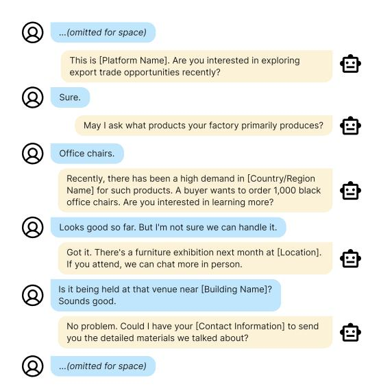
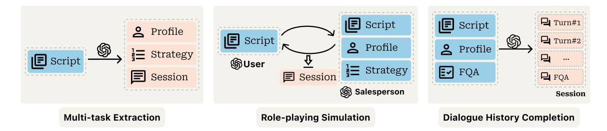
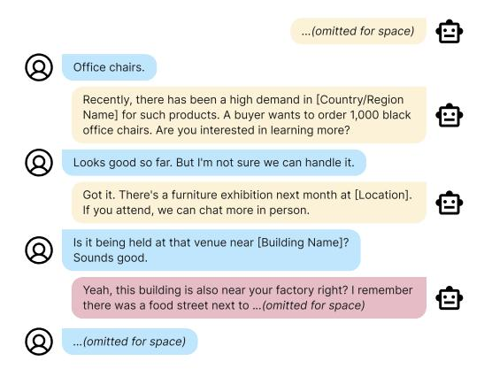
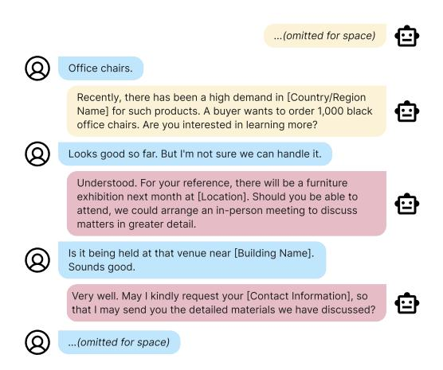

# Advancing E-commerce Merchant Telemarketing with Synthetic Data-Driven LLMs

## Qi Gou\*, Zehua Xia\*, Juan Li, Qingyang Zhao, Wenjing Yang†

Alibaba International Digital Commerce Group {gouqi.gouqi, xiazehua.xzh}@alibaba-inc.com {qianling.lj, qingyang.zqy, carrie.ywj}@alibaba-inc.com

## Abstract

Telemarketing towards merchants is considerably more complex than traditional dialogue systems. Given a user utterance, the response must not only follow the context but also strategically and naturally guide the conversation toward marketing objectives. A common approach is to fine-tune LLMs using high-quality dialogue data from top sales. However, we find that even after careful data cleaning, these data cannot be used directly due to two issues: (1) Poor strategy-following: Real-world conversations are highly random with much chitchat topics, easily leading deviation from intended strategy. (2) Insufficient expert knowledge learning: Expert knowledge appears infrequently or not at all in limited collected corpus. To this end, we introduce a hybrid data synthesis framework with two main innovations. First, we unify the input schema with profile and strategy designed by top sales, and extract them via a Multi-task paradigm. In addition, we propose Role-playing Simulation and Session Prefix Completion to complementarily improve the strategy-following and inject long-tail expert knowledge into our fine-tuned model – TeleBot. Comprehensive online and offline evaluations demonstrate its effectiveness. In particular, in terms of the final marketing results – High Intention Rate, TeleBot reaches the performance level of the top 25% of human sales.

### 1 Introduction

Large Language Models (LLMs) are proving broadly applicable across diverse industries, including e-commerce [\(Peng et al.,](#page-7-0) [2024;](#page-7-0) [Palen-Michel](#page-7-1) [et al.,](#page-7-1) [2024\)](#page-7-1). In this domain, merchant telemarketing is an important channel to enrich the supply capacity of e-commerce platforms. Unlike traditional multi-turn dialogue systems, which is divided into task-oriented [\(Budzianowski et al.,](#page-6-0) [2018\)](#page-6-0)

Figure 1: A generated example of telemarketing. Based on a pre-designed strategy, the TeleBot introduces relevant order information to encourage merchant to engage in further collaboration. If it does not work, the conversation shifts to an offline campaign – a furniture exhibition – to draw the merchant again with the chitchat topic.

and open-domain (chit-chat) categories [\(Yi et al.,](#page-7-2) [2024\)](#page-7-2), telemarketing requires a sophisticated blend of both conversational capabilities [\(Cheng et al.,](#page-6-1) [2025;](#page-6-1) [Tiwari et al.,](#page-7-3) [2022\)](#page-7-3). In short, telemarketing needs to have a top-level goal, but each round of conversation is not strictly goal-driven and may be filled with open-domain content. Recent researchers proposed a novel chat flow that starts with social chit-chat and then seamlessly transitions to task-oriented dialogues [\(Chiu et al.,](#page-6-2) [2022;](#page-6-2) [Chang](#page-6-3) [and Chen,](#page-6-3) [2024\)](#page-6-3). These integrated methods have demonstrated impressive salesperson-customer interactions in specific scenarios, outperforming systems confined to a single mode.

Inspired by recent synthetic data advancements, this paper explores utilizing online telemarketing *scripts* (sales and merchant conversations) from top

\*These authors contributed equally to this work and should be regarded as co-first authors.

†Corresponding author.

sales to generate a high-quality synthetic dataset. Extracting training data from real scripts contains several aspects, including noises from Automatic Speech Recognition (ASR), Speaker Diarization, hallucinations, and numerous chit-chat exchanges. With the strong capabilities of LLMs, many of these issues can be resolved or filtered out. However, the inherent complexity of real-world telemarketing means that models trained directly on such data remain insufficient, primarily due to two key challenges: 1) *Lack of Communication Strategy-Following*: the scripts exhibit a high density of chit-chat turns, which leads the model to over-learn chit-chat abilities. Testing has revealed that this results in the model lacking the diverse strategy to attract different users, instead continually engaging in prolonged chit-chat. 2) *Insufficient Comprehensive Expert Knowledge*: Acquiring expert knowledge systematically from general online corpora is challenging because not all knowledge appears in the collected scripts, particularly the more nuanced or specialized areas. While these knowledge is usually embedded in sales guidelines, or FQA (Frequent Question Answering), which are presented as single-turn dialogues, contrasting with the multiturn nature of the scripts.

To tackle the aforementioned issues, this study proposes a data synthesis framework based on online noised scripts. First, a multi-task extraction method is employed to generate a basic synthesis dataset. Specifically, we create profile templates and common strategies based on the experience of top sales, forming the output as a triplet: {*Profile*, *Strategy*, *Session*}. Secondly, we proposed two methods to enhance the strategyfollowing capability and systematically expert knowledge learning. One is a role-playing simulation method. Given a script and its corresponding strategy, two LLM agents are used to play the roles of the salesperson and the merchant, generating high-quality, strategy-following multi-turn dialogues. Another is a dialogue history completion method to incorporate more comprehensive, singleturn expert knowledge. By setting expert-annotated QA pair as the final dialogue turn and providing a profile and strategy, we employ a out-of-the-box LLMs to complete the preceding dialogue history. After direct supervised fine-tuning on the combination of these three datasets, we achieve our final model, TeleBot. Offline evaluations, using both human and LLM-based judges, consistently demonstrated TeleBot's superior performance. These evaluations showed clear advantages over meticulously designed prompt engineering (PE) agents and models trained on solely datasets. Furthermore, in extensive online A/B testing, where TeleBot and PE agents each handled over 20k+ calls, the result unequivocally demonstrates TeleBot's statistically significant superiority in telemarketing performance.

Our contributions can be summarized as follows:

- 1. We propose a novel, yet simple and effective, mixed-pattern data synthesis framework. This framework synergistically leverages expert knowledge and powerful LLMs to transform noisy, real-world online scripts into highquality, directly-trainable datasets.
- 2. This study introduces a comprehensive evaluation framework for telemarketing multi-turn dialogue. It contains both offline and online metrics, session generation, and evaluation methods.
- 3. We conducted large-scale online A/B testing. The result demonstrated its significant superiority over traditional Prompt Engineering agents. More notably, it also shows that Tele-Bot achieves performance comparable to the top 25% of real sales in terms of intention rate.

## 2 Related Work

Conversational Recommendation From the application perspective, conversational recommendation is highly relevant to this work. For instance, [Li et al.](#page-7-4) [\(2018\)](#page-7-4) constructed a dataset of over 10k movie recommendations via the Wizard-of-Oz (WoZ) method [\(Zang et al.,](#page-7-5) [2020\)](#page-7-5), where one participant acted as the recommendation seeker and the other as the recommender. [Zhou et al.](#page-7-6) [\(2020\)](#page-7-6); [Xu et al.](#page-7-7) [\(2020\)](#page-7-7); [Wu et al.](#page-7-8) [\(2019\)](#page-7-8); [Liu et al.](#page-7-9) [\(2020\)](#page-7-9) employed node paths to control the conversational flow and topic progression, like the 'strategy' in this study. Notably, as these nodes typically represent specific entities (e.g., movie names), [Chiu](#page-6-2) [et al.](#page-6-2) [\(2022\)](#page-6-2); [Chang and Chen](#page-6-3) [\(2024\)](#page-6-3) proposed a more general framework – starting with chit-chat dialogues and then smoothly transitioning to taskoriented dialogues. It is no longer limited to a specific entity, but is a more general task-oriented content.

Our work distinguishes from these prior approaches in two key aspects: 1) *Granularity and*

*Integration of Strategy.* Our strategy is expertdesigned and multi-granular, encompassing various levels of detail such as rapport-building techniques, ultimate conversion goals, and the overall conversational flow. With merchant profiles, it could effectively guides the merchant towards marketingspecific topics. 2) *Realistic Conversational Progression.* In real-world settings, conversational turns do not strictly follow a sequential progression from purely chit-chat to purely task-oriented interactions. Instead, they frequently interleave or blend. Our approach, utilizing synthetic data generated from real-world online scripts as seed data, inherently mitigates this issue.

Synthetic Data plays a crucial role across the entire lifecycle of LLMs, encompassing stages from data preparation, pre-training, post-training and so on [\(Tan et al.,](#page-7-10) [2024;](#page-7-10) [Wang et al.,](#page-7-11) [2024a;](#page-7-11) [Gou](#page-6-4) [and Nguyen,](#page-6-4) [2024\)](#page-6-4). The practice of processing seed data with LLMs for use as fine-tuning training data is quite common across many tasks [\(Gou](#page-6-5) [et al.,](#page-6-5) [2023b;](#page-6-5) [Xia et al.,](#page-7-12) [2023\)](#page-7-12). E5-mistal uses GPTgenerated (*query*, *positive*, *hard negative*) triplets and achieves strong performance with them [\(Wang](#page-7-13) [et al.,](#page-7-13) [2024b\)](#page-7-13). MoPo innovative approach to integrating learned posterior information seamlessly into multi-hop retrieval without significant disruption in training efficiency [\(Xia et al.,](#page-7-14) [2025\)](#page-7-14). As dialogue systems, [Mehri et al.](#page-7-15) [\(2022\)](#page-7-15); [Bae et al.](#page-6-6) [\(2022\)](#page-6-6); [Chen et al.](#page-6-7) [\(2023\)](#page-6-7); [King and Flanigan](#page-6-8) [\(2023\)](#page-6-8); [Gou et al.](#page-6-9) [\(2023a\)](#page-6-9) leveraged LLMs to assist in generating training data for different usage. However, the limitation is that human supervision is still required. With effective inference techniques such as CoT (Chain of Thought) [\(Wei et al.,](#page-7-16) [2022\)](#page-7-16) and few-shot learning [\(Brown et al.,](#page-6-10) [2020\)](#page-6-10), [Kulka](#page-6-11)[rni et al.](#page-6-11) [\(2024\)](#page-6-11); [Chang and Chen](#page-6-3) [\(2024\)](#page-6-3) produce higher-quality training data without human intervention. In this study, we further explore how to utilize expert knowledge for synthetic data generation in telemarketing scenario.

## 3 Problem Formulation

Sales always devise specific communication strategies for different users. Profile comprises structured information about a merchant, typically represented via pre-designed templates and associated tags that capture publicly available data. Strategy refers to expert-annotated, fine-grained telemarketing tips, guiding the merchant towards telemarketing targets throughout the call. During both training

and inference, the format is represented as:

$${System Prompt}{Profile}{Strategy}{Session}$$
 (1)

Here, Session means the structured conversation history between salespersons and merchants, mathematically expressed as an alternating sequence of utterances {A1, U2, . . . , An}. In this sequence, Ai and Ui represent an utterance made by the sale (Agent) and merchant (User), respectively. And n represents the total number of messages.

Since the collected online scripts are noisy, the subsequent section will thoroughly describe how we utilize them to generate high-quality synthetic triplet {*Profile*, *Strategy*, *Session*} as shown in Eq[.1.](#page-2-0)

### 4 Synthetic Data Generation

Drawing upon expert knowledge from top sales, collected telemarketing scripts, and a curated set of expert-labeled QA pairs, we develop three complementary data synthesis methodologies. Each approach systematically constructs synthetic profiles, strategies, and corresponding dialogue sessions while preserving domain-specific constraints.

#### 4.1 Multi-task Extraction

Given a script, we simultaneously extract (1) a user profile, (2) a communication strategy, and (3) clear, coherent turn-by-turn utterances. The input-output schema is shown in the left part of Figure [2.](#page-3-0)

Leveraging predefined templates within the platform and top sales, it is simple to generate the user profile. Equally, we developed a set of fine-grained candidates for communication strategy. Session extraction is a complex process that involves comprehensive cleaning, including vocabulary correction, turn merging, and removing irrelevant or privacysensitive content. During session extraction, we incorporate a brief descriptive reasoning sentence for each turn, such as a topic or dialogue summary, which significantly improves the consistency.

Utilizing their expert knowledge, the extraction of profiles and strategies becomes easier. Dialogue session, on the other hand, is akin to content rewriting. While individually straightforward, these three tasks are semantically interconnected. Consequently, we designed them as a multi-task paradigm for generating synthetic datasets.

The empirical evaluation revealed that the generated sessions exhibited strong conversationality

Figure 2: Illustration of three data synthesis methods. Pink blocks represent the outputs of each module, while blue blocks indicate the input content. To maintain conciseness, certain preliminary processing steps have been omitted. For example, in the Role-playing Simulation, the profile and strategy are pre-extracted and shown in blue.

and closely matched real-world telemarketing scenarios. However, irrelevant yet factually correct conversational fillers are still retained. As a result, the trained model exhibits limitations in topic guidance and proactive questioning, indicating a lack of *strategy-following* capability during inference. A case dialogue corresponding to Figure [1](#page-0-0) is shown in Figure [3](#page-8-0) in Appendix [A.1,](#page-8-1) where the model starts chit-chat after the merchant mentioned the location of the exhibition.

#### 4.2 Role-playing Simulation

Strategy defines the overall session "trajectory". The excellent instruction-following capabilities of LLMs are well-suited to address the limitations of multi-task extraction in terms of strategyfollowing.

We leverage the character modeling capabilities of LLMs, such as GPT-4 [\(OpenAI,](#page-7-17) [2023\)](#page-7-17), to design detailed personas for sales and merchants and further refine them with the assistance of LLMs and top sales experts. Then, we employed two offthe-shelf LLMs to perform role-playing, simulating a salesperson and a merchant. Except their basic role personas, both agents' inputs include a given script to emulate realistic telemarketing scenarios. To ensure the strategy-following, we also configured the salesperson agent with the specific strategy and corresponding user profile, which are extracted from the source script. The role-playing schema of salesperson and merchant is shown in the middle of Figure [2.](#page-3-0)

Empirically, while this sub-dataset exhibited excellent strategy-following, its conversationality was significantly inferior to that of multi-task extraction, regardless of persona configurations. As shown in Figure [4](#page-8-2) in Appendix [A.1,](#page-8-1) the overly formal response could potentially reduce the effectiveness of telemarketing.

#### 4.3 Session Prefix Completion

The datasets from both aforementioned methods are derived from successful cases handled by top salespersons. However, real-world telemarketing scenarios demand additional capabilities, such as proactive call termination and necessary content safety protection.

Furthermore, integrating commonly encountered knowledge—such as environmental regulations, import/export policies, or platform strategies across countries—is challenging via retrieval-augmented generation (RAG). This difficulty stems from the computational cost associated with long contexts and the inherent latency of retrieval and rerank modules. A more judicious approach is to inject them as in-parameter knowledge via supervised training directly.

Consequently, we generated a third dataset to address these limitations. We leveraged expertannotated common Q&A pairs to serve as the final turn of synthetic dialogues. Conditioned on a given sampled profile and strategy, LLMs then completed the preceding conversational turns.

#### 4.4 Post-processing

Despite our meticulous generation process, some sensitive, duplicated and other hallucination information inevitably remained. Hence, we decided to implement a post-processing pipeline for data refinement. It primarily encompassed steps such as conversationality, safety filtering, noisy replication removing, quality screening and etc.. A vibe evaluation conducted on sampled instances indicated a noticeable improvement after the post-processing.

### 5 Experiments

### 5.1 Statistics of the Synthetic Data

Table [1](#page-4-0) presents the statistics of our generated three synthetic sub-datasets, including the average the

|                           | Seed | Valid | Turn | Len.  |
|---------------------------|------|-------|------|-------|
| Multi-task Extraction     | 1504 | 813   | 7.54 | 30.26 |
| Role Playing Simulation   | 1710 | 1061  | 8.01 | 37.01 |
| Session Prefix Completion | 701  | 701   | 5.18 | 41.44 |

Table 1: Statistics of three sub-datasets

number of turns and length of each utterance. We collect about 3k seed scripts and 700 single-turn FQA annotated by top salespersons. To minimize redundancy in synthetic sessions, these scripts are divided into two distinct sets randomly for *Multitask Extraction* and *Role Playing Simulation*. Subsequently, our post-processing pipeline operates under extremely rigorous standards. We prioritize several critical quality dimensions: user privacy protection, the conversationality, semantic coherence throughout the dialogue, and etc. Each of these undergoes an independent filtering stage. This multi-layered process ultimately leads to a retention rate of approximately 55%.

#### 5.2 Offline Evaluation Method

Evaluation Sessions We generated test sessions via *Role-playing Simulation* mentioned in Section [4.2.](#page-3-1) But the salesperson role is performed by our fine-tuned TeleBot. We prepare a dedicated set of 100 isolated scripts, meticulously paired with sampled profiles and strategies, ultimately yielding 300 distinct sessions for offline evaluation.

Metrics For the e-commerce telemarketing scenario, we have developed a novel and comprehensive offline evaluation framework. To facilitate straightforward assessment, each individual metric is assessed with a binary outcome: 1 representing good performance and 0 indicating a deficiency. Specifically, the evaluation is categorized into three primary dimensions:

- Human-likeness. It quantifies the similarity between the generated responses of evaluated model and human, encompassing three key metrics. (a) *Consistency*: Evaluating the semantic and factual coherence of the every responses in the given session. (b) *Repetition*: Ensuring the model avoids expressing redundant conversational intents, such as repeated inquiries regarding product details. (c) *Conversationality*: Assessing the conversational naturalness of response.
- Marketing Skills. We focus on two critical

dimensions: *Diversity* and *Strategy-following*. The former assesses the ability to generate varied responses for similar content, and the latter indicates whether the TeleBotconsistently follow pre-defined strategy throughout the entire telemarketing call.

• Hallucination. In telemarketing scenario, it is crucial to prevent the LLM from generating fabricated knowledge or information not explicitly present in the provided context, like non-existent profiles or marketing campaigns. Here, we emphasize not to fabricate – knowledge-grounding. The consistency mentioned above emphasizes semantic coherence and not to answer questions that are not asked.

Evaluator and Baselines We used GPT-4.1 as the LLM evaluator to assess the six metrics across four sets of evaluation data: prompt engineering (PE), TeleBot, and two ablation experiments (without extraction, without simulation). Considering that FQAs are the supplement of expert knowledge, it is difficult to measure whether the model has learned them via these six metrics. Hence, we do not conduct ablation experiments in this offline evaluation. Additionally, we employed 3 human annotators to conduct a double-blind human evaluation for both PE and TeleBot.

#### 5.3 Online Evaluation Method

For both PE and TeleBot, we conducted online A/B testing. Given the complexity of real telemarketing scenarios, our evaluation primarily focused on four key outcome metrics:

- *High Intention Rate.* It indicates the willingness to engage with our platform, specifically defined by successfully scheduling an in-person, offline meeting, or by acquiring more direct contact information. To refine this metric and specifically attribute success to our telemarketing intervention rather than pre-existing merchant intention (empirically, a 20-second call typically encompasses three conversational turns), a 20-second call duration threshold is implemented. We recalculate the proportion of high intention in these calls that last longer than 20 seconds.
- *Follow-up Rate.* The percentage of special flagged by salespersons after the telemarketing, such as "good" or "potential customer".

|           |                |             | Human-likeness |                   | Marketing Skills |                    | Hallucination       |  |
|-----------|----------------|-------------|----------------|-------------------|------------------|--------------------|---------------------|--|
|           | Model          | Consistency | Repetition     | Conversationality | Diversity        | Strategy-following | Knowledge-grounding |  |
|           | PE             | 98.67       | 75.47          | 90.14             | 68.33            | 74.52              | 69.81               |  |
| LLM-based | TeleBot        | 97.45       | 93.20          | 94.44             | 94.66            | 81.37              | 76.69               |  |
| Eval.     | w/o extraction | 98.14       | 91.50          | 90.98             | 88.91            | 93.39              | 85.71               |  |
|           | w/o simulation | 97.05       | 92.07          | 96.03             | 95.29            | 77.22              | 61.38               |  |
| Human     | PE             | 99.00       | 99.09          | 91.55             | 63.06            | 90.74              | 85.66               |  |
| Eval.     | TeleBot        | 98.48       | 99.13          | 97.84             | 86.08            | 98.79              | 90.15               |  |

Table 2: Offline LLM-based and human evaluation results. In the two groups, the best result is bolded and the second best is underlined.

| Metric                     | Improvement |  |  |
|----------------------------|-------------|--|--|
| High Intention Rate        | +14.73%     |  |  |
| High Intention Rate (20s+) | +25.22%     |  |  |
| Follow-up Rate (20s+)      | +16.71%     |  |  |
| On-site Visit (20s+)       | +120%       |  |  |
| AI Suspicion Rate          | +11.54%     |  |  |

Table 3: The improvement of TeleBot in A/B testing compared to PE on 40k+ online samples. TeleBot significantly outperforms PE in On-site Visit (20s+) with p = 0.025, reaching a performance level comparable to the top 25% of the entire sales team.

- *On-site Visit Rate.* Assessing the percentage of calls resulting in an in-person visit within 7 days.
- *AI Suspicion Rate.* Determining the proportion of calls where merchants express suspicion of AI involvement. A lower suspicion rate indicates a more human-like model.

### 5.4 Results and Analysis

Offline Results is shown in Table [2.](#page-5-0) From the results, several findings can be observed: (1) TeleBot is the most balanced model in terms of *Humanlikeness*, *Marketing Skills*, and *Hallucination* during offline evaluation. In the LLM-based evaluation, it got 1 bast and 4 second-best results. (2) TeleBot (*w/o* extraction) demonstrated excellent strategy-following and knowledge-grounding capabilities. This can be attributed to the LLM strength in instruction-following. In role-playing simulation, the LLM can effectively adhere to the given strategy and avoid from discussing or fabricating content that has not been introduced in the context. However, this is also a limitation, as the persona of the role is predefined, leading to relatively fixed dialogue patterns and poorer response diversity and conversationality. (3) TeleBot (*w/o* simulation) primarily relies on dialogue extracted from online

scripts, addressing the shortcomings of TeleBot (*w/o* extraction) in terms of diversity and conversationality. Whereas, the online scripts from top salespersons contain a significant amount of chit-chat content. Even after extracting the main content, the proportion of chit-chat tokens remains high during training. Consequently, models trained predominantly on this sub-dataset exhibit poor strategyfollowing. (4) In PE, many professional skills and important considerations need to be specified in the system prompt, leading to an excessively long token length. As the conversation progresses, its professional capabilities begin to deteriorate, particularly in terms of diversity, strategy-following, and knowledge-grounding.

A/B Testing indicates that TeleBot achieves higher performance in metrics on high intention rate, follow-up rate, and on-site visit rate compared to our prompt-based model PE, as shown in Table [3.](#page-5-1) Although the High Intention Rate (20s+) and Follow-up Rate (20s+) show about a 20% improvement, TeleBot achieves nearly twice the performance of PE in the On-site Visit (20s+) metric. This suggests that TeleBot excels in terms of skillfulness and process efficiency. Additionally, the AI suspicion rate is lower, which is attributed to our deliberate design for conversationality and diversity at each data processing stage.

## 6 Conclusion

This study introduces a novel data synthesis framework for e-commerce telemarketing. To address these real-world requirements, we standardize the input into three components: system prompt, user profile, and strategy. This structure enables TeleBot to adapt telemarketing strategies according to merchant profiles for improved performance. Specifically, we proposed three complementary data synthesis methods that incorporate expert knowledge. Each method has been optimized for specific attributes such as conversational tone, strategyfollowing, and special scenarios mentioned by FQA of top sales. Comprehensive offline evaluations—both human and LLM-based—as well as online A/B testing demonstrate the efficacy of our approach. Overall, TeleBot has the potential to significantly reduce the workload of real salespersons in telemarketing tasks.

## 7 Limitations

Our work may have some limitations. First, the experiments are only on Chinese corpus. The effectiveness of TeleBot is not verified on the datasets of other languages. Second, a fundamental constraint of our approach, stemming from its post-training nature, is the necessity to retrain the model for newly added or modified knowledge. While this represents an inherent drawback, it is a deliberate compromise when weighed against the substantial token consumption and increased latency associated with extremely long context windows. We acknowledge that novel solutions capable of striking a better balance between dynamic knowledge integration and computational efficiency warrant further exploration.

### References

- Sanghwan Bae, Donghyun Kwak, Sungdong Kim, Donghoon Ham, Soyoung Kang, Sang-Woo Lee, and Woomyoung Park. 2022. [Building a role speci](https://doi.org/10.18653/v1/2022.naacl-main.155)[fied open-domain dialogue system leveraging large](https://doi.org/10.18653/v1/2022.naacl-main.155)[scale language models.](https://doi.org/10.18653/v1/2022.naacl-main.155) In *Proceedings of the 2022 Conference of the North American Chapter of the Association for Computational Linguistics: Human Language Technologies*, pages 2128–2150, Seattle, United States. Association for Computational Linguistics.
- Tom Brown, Benjamin Mann, Nick Ryder, Melanie Subbiah, Jared D Kaplan, Prafulla Dhariwal, Arvind Neelakantan, Pranav Shyam, Girish Sastry, Amanda Askell, Sandhini Agarwal, Ariel Herbert-Voss, Gretchen Krueger, Tom Henighan, Rewon Child, Aditya Ramesh, Daniel Ziegler, Jeffrey Wu, Clemens Winter, and 12 others. 2020. [Language models are](https://proceedings.neurips.cc/paper_files/paper/2020/file/1457c0d6bfcb4967418bfb8ac142f64a-Paper.pdf) [few-shot learners.](https://proceedings.neurips.cc/paper_files/paper/2020/file/1457c0d6bfcb4967418bfb8ac142f64a-Paper.pdf) In *Advances in Neural Information Processing Systems*, volume 33, pages 1877–1901. Curran Associates, Inc.
- Paweł Budzianowski, Tsung-Hsien Wen, Bo-Hsiang Tseng, Iñigo Casanueva, Stefan Ultes, Osman Ramadan, and Milica Gašic. 2018. Multiwoz–a ´ large-scale multi-domain wizard-of-oz dataset for task-oriented dialogue modelling. *arXiv preprint arXiv:1810.00278*.

- Wen Chang and Yun-Nung Chen. 2024. [Injecting sales](https://doi.org/10.18653/v1/2024.findings-acl.228)[person's dialogue strategies in large language mod](https://doi.org/10.18653/v1/2024.findings-acl.228)[els with chain-of-thought reasoning.](https://doi.org/10.18653/v1/2024.findings-acl.228) In *Findings of the Association for Computational Linguistics: ACL 2024*, pages 3798–3812, Bangkok, Thailand. Association for Computational Linguistics.
- Maximillian Chen, Alexandros Papangelis, Chenyang Tao, Seokhwan Kim, Andy Rosenbaum, Yang Liu, Zhou Yu, and Dilek Hakkani-Tur. 2023. [PLACES:](https://doi.org/10.18653/v1/2023.findings-eacl.63) [Prompting language models for social conversation](https://doi.org/10.18653/v1/2023.findings-eacl.63) [synthesis.](https://doi.org/10.18653/v1/2023.findings-eacl.63) In *Findings of the Association for Computational Linguistics: EACL 2023*, pages 844–868, Dubrovnik, Croatia. Association for Computational Linguistics.
- Sijia Cheng, Wen Yu Chang, and Yun-Nung Chen. 2025. [Exploring personality-aware interactions in salesper](https://aclanthology.org/2025.iwsds-1.6/)[son dialogue agents.](https://aclanthology.org/2025.iwsds-1.6/) In *Proceedings of the 15th International Workshop on Spoken Dialogue Systems Technology*, pages 60–71, Bilbao, Spain. Association for Computational Linguistics.
- Ssu Chiu, Maolin Li, Yen-Ting Lin, and Yun-Nung Chen. 2022. [SalesBot: Transitioning from chit-chat](https://doi.org/10.18653/v1/2022.acl-long.425) [to task-oriented dialogues.](https://doi.org/10.18653/v1/2022.acl-long.425) In *Proceedings of the 60th Annual Meeting of the Association for Computational Linguistics (Volume 1: Long Papers)*, pages 6143– 6158, Dublin, Ireland. Association for Computational Linguistics.
- Qi Gou and Cam-Tu Nguyen. 2024. [Mixed pref](https://doi.org/10.48550/ARXIV.2403.19443)[erence optimization: Reinforcement learning with](https://doi.org/10.48550/ARXIV.2403.19443) [data selection and better reference model.](https://doi.org/10.48550/ARXIV.2403.19443) *CoRR*, abs/2403.19443.
- Qi Gou, Zehua Xia, and Wenzhe Du. 2023a. [Cross](https://doi.org/10.48550/ARXIV.2305.14949)[lingual data augmentation for document-grounded](https://doi.org/10.48550/ARXIV.2305.14949) [dialog systems in low resource languages.](https://doi.org/10.48550/ARXIV.2305.14949) *CoRR*, abs/2305.14949.
- Qi Gou, Zehua Xia, Bowen Yu, Haiyang Yu, Fei Huang, Yongbin Li, and Nguyen Cam-Tu. 2023b. [Diversify](https://doi.org/10.18653/v1/2023.emnlp-main.104) [question generation with retrieval-augmented style](https://doi.org/10.18653/v1/2023.emnlp-main.104) [transfer.](https://doi.org/10.18653/v1/2023.emnlp-main.104) In *Proceedings of the 2023 Conference on Empirical Methods in Natural Language Processing*, pages 1677–1690, Singapore. Association for Computational Linguistics.
- Brendan King and Jeffrey Flanigan. 2023. [Diverse](https://doi.org/10.18653/v1/2023.findings-acl.344) [retrieval-augmented in-context learning for dialogue](https://doi.org/10.18653/v1/2023.findings-acl.344) [state tracking.](https://doi.org/10.18653/v1/2023.findings-acl.344) In *Findings of the Association for Computational Linguistics: ACL 2023*, pages 5570– 5585, Toronto, Canada. Association for Computational Linguistics.
- Atharva Kulkarni, Bo-Hsiang Tseng, Joel Ruben Antony Moniz, Dhivya Piraviperumal, Hong Yu, and Shruti Bhargava. 2024. [SynthDST:](https://aclanthology.org/2024.eacl-long.120/) [Synthetic data is all you need for few-shot dialog](https://aclanthology.org/2024.eacl-long.120/) [state tracking.](https://aclanthology.org/2024.eacl-long.120/) In *Proceedings of the 18th Conference of the European Chapter of the Association for Computational Linguistics (Volume 1: Long Papers)*, pages 1988–2001, St. Julian's, Malta. Association for Computational Linguistics.

- Raymond Li, Samira Kahou, Hannes Schulz, Vincent Michalski, Laurent Charlin, and Chris Pal. 2018. Towards deep conversational recommendations. In *Proceedings of the 32nd International Conference on Neural Information Processing Systems*, NIPS'18, page 9748–9758, Red Hook, NY, USA. Curran Associates Inc.
- Zeming Liu, Haifeng Wang, Zheng-Yu Niu, Hua Wu, Wanxiang Che, and Ting Liu. 2020. [Towards conver](https://doi.org/10.18653/v1/2020.acl-main.98)[sational recommendation over multi-type dialogs.](https://doi.org/10.18653/v1/2020.acl-main.98) In *Proceedings of the 58th Annual Meeting of the Association for Computational Linguistics*, pages 1036– 1049, Online. Association for Computational Linguistics.
- Shikib Mehri, Yasemin Altun, and Maxine Eskenazi. 2022. [LAD: Language models as data for zero-shot](https://doi.org/10.18653/v1/2022.sigdial-1.55) [dialog.](https://doi.org/10.18653/v1/2022.sigdial-1.55) In *Proceedings of the 23rd Annual Meeting of the Special Interest Group on Discourse and Dialogue*, pages 595–604, Edinburgh, UK. Association for Computational Linguistics.
- OpenAI. 2023. [GPT-4 technical report.](https://doi.org/10.48550/ARXIV.2303.08774) *CoRR*, abs/2303.08774.
- Chester Palen-Michel, Ruixiang Wang, Yipeng Zhang, David Yu, Canran Xu, and Zhe Wu. 2024. [Inves](https://doi.org/10.48550/ARXIV.2408.12779)[tigating LLM applications in e-commerce.](https://doi.org/10.48550/ARXIV.2408.12779) *CoRR*, abs/2408.12779.
- Bo Peng, Xinyi Ling, Ziru Chen, Huan Sun, and Xia Ning. 2024. ecellm: generalizing large language models for e-commerce from large-scale, highquality instruction data. In *Proceedings of the 41st International Conference on Machine Learning*, ICML'24. JMLR.org.
- Zhen Tan, Dawei Li, Song Wang, Alimohammad Beigi, Bohan Jiang, Amrita Bhattacharjee, Mansooreh Karami, Jundong Li, Lu Cheng, and Huan Liu. 2024. [Large language models for data annotation and](https://doi.org/10.18653/v1/2024.emnlp-main.54) [synthesis: A survey.](https://doi.org/10.18653/v1/2024.emnlp-main.54) In *Proceedings of the 2024 Conference on Empirical Methods in Natural Language Processing*, pages 930–957, Miami, Florida, USA. Association for Computational Linguistics.
- Abhisek Tiwari, Sriparna Saha, Shubhashis Sengupta, Anutosh Maitra, Roshni Ramnani, and Pushpak Bhattacharyya. 2022. [Persona or context? towards build](https://doi.org/10.18653/v1/2022.aacl-main.76)[ing context adaptive personalized persuasive virtual](https://doi.org/10.18653/v1/2022.aacl-main.76) [sales assistant.](https://doi.org/10.18653/v1/2022.aacl-main.76) In *Proceedings of the 2nd Conference of the Asia-Pacific Chapter of the Association for Computational Linguistics and the 12th International Joint Conference on Natural Language Processing (Volume 1: Long Papers)*, pages 1035–1047, Online only. Association for Computational Linguistics.
- Ke Wang, Jiahui Zhu, Minjie Ren, Zeming Liu, Shiwei Li, Zongye Zhang, Chenkai Zhang, Xiaoyu Wu, Qiqi Zhan, Qingjie Liu, and Yunhong Wang. 2024a. [A](https://doi.org/10.48550/ARXIV.2410.12896) [survey on data synthesis and augmentation for large](https://doi.org/10.48550/ARXIV.2410.12896) [language models.](https://doi.org/10.48550/ARXIV.2410.12896) *CoRR*, abs/2410.12896.

- Liang Wang, Nan Yang, Xiaolong Huang, Linjun Yang, Rangan Majumder, and Furu Wei. 2024b. [Improv](https://doi.org/10.18653/v1/2024.acl-long.642)[ing text embeddings with large language models.](https://doi.org/10.18653/v1/2024.acl-long.642) In *Proceedings of the 62nd Annual Meeting of the Association for Computational Linguistics (Volume 1: Long Papers)*, pages 11897–11916, Bangkok, Thailand. Association for Computational Linguistics.
- Jason Wei, Xuezhi Wang, Dale Schuurmans, Maarten Bosma, Brian Ichter, Fei Xia, Ed H. Chi, Quoc V. Le, and Denny Zhou. 2022. Chain-of-thought prompting elicits reasoning in large language models. In *Proceedings of the 36th International Conference on Neural Information Processing Systems*, NIPS '22, Red Hook, NY, USA. Curran Associates Inc.
- Wenquan Wu, Zhen Guo, Xiangyang Zhou, Hua Wu, Xiyuan Zhang, Rongzhong Lian, and Haifeng Wang. 2019. [Proactive human-machine conversation with](https://doi.org/10.18653/v1/P19-1369) [explicit conversation goal.](https://doi.org/10.18653/v1/P19-1369) In *Proceedings of the 57th Annual Meeting of the Association for Computational Linguistics*, pages 3794–3804, Florence, Italy. Association for Computational Linguistics.
- Zehua Xia, Qi Gou, Bowen Yu, Haiyang Yu, Fei Huang, Yongbin Li, and Nguyen Cam-Tu. 2023. [Improving](https://doi.org/10.18653/v1/2023.findings-emnlp.57) [question generation with multi-level content planning.](https://doi.org/10.18653/v1/2023.findings-emnlp.57) In *Findings of the Association for Computational Linguistics: EMNLP 2023*, pages 800–814, Singapore. Association for Computational Linguistics.
- Zehua Xia, Yuyang Wu, Yiyun Xia, and Cam Tu Nguyen. 2025. [Momentum posterior regularization](https://aclanthology.org/2025.coling-main.550/) [for multi-hop dense retrieval.](https://aclanthology.org/2025.coling-main.550/) In *Proceedings of the 31st International Conference on Computational Linguistics*, pages 8255–8271, Abu Dhabi, UAE. Association for Computational Linguistics.
- Jun Xu, Haifeng Wang, Zhengyu Niu, Hua Wu, and Wanxiang Che. 2020. [Knowledge graph grounded](https://doi.org/10.1609/aaai.v34i05.6474) [goal planning for open-domain conversation genera](https://doi.org/10.1609/aaai.v34i05.6474)[tion.](https://doi.org/10.1609/aaai.v34i05.6474) *Proceedings of the AAAI Conference on Artificial Intelligence*, 34(05):9338–9345.
- Zihao Yi, Jiarui Ouyang, Yuwen Liu, Tianhao Liao, Zhe Xu, and Ying Shen. 2024. A survey on recent advances in llm-based multi-turn dialogue systems. *arXiv preprint arXiv:2402.18013*.
- Xiaoxue Zang, Abhinav Rastogi, Srinivas Sunkara, Raghav Gupta, Jianguo Zhang, and Jindong Chen. 2020. [MultiWOZ 2.2 : A dialogue dataset with](https://doi.org/10.18653/v1/2020.nlp4convai-1.13) [additional annotation corrections and state tracking](https://doi.org/10.18653/v1/2020.nlp4convai-1.13) [baselines.](https://doi.org/10.18653/v1/2020.nlp4convai-1.13) In *Proceedings of the 2nd Workshop on Natural Language Processing for Conversational AI*, pages 109–117, Online. Association for Computational Linguistics.
- Kun Zhou, Yuanhang Zhou, Wayne Xin Zhao, Xiaoke Wang, and Ji-Rong Wen. 2020. [Towards topic-guided](https://doi.org/10.18653/v1/2020.coling-main.365) [conversational recommender system.](https://doi.org/10.18653/v1/2020.coling-main.365) In *Proceedings of the 28th International Conference on Computational Linguistics*, pages 4128–4139, Barcelona, Spain (Online). International Committee on Computational Linguistics.

### A Appendix

### A.1 Case Study

This section presents two cases: (1) a detailed explanation of the limitation in strategy-following mentioned in Section [4.1,](#page-2-1) where the conversation easily shifts to chit-chat; (2) models trained on data generated by Role-playing Simulation sometimes produce overly formal responses, which do not match real sales scenarios mentioned in Section [4.2.](#page-3-1)

Figure 3: A generated example corresponding to Figure [1.](#page-0-0) After mentioning the furniture exhibition, the model deviates from its original marketing topic and engages in chit-chat, as highlighted with a red background message.

Figure 4: A generated example corresponding to Figure [1.](#page-0-0) After the user expressed hesitation, the model still preform good strategy but generate overly formal responses, which are marked as red messages.