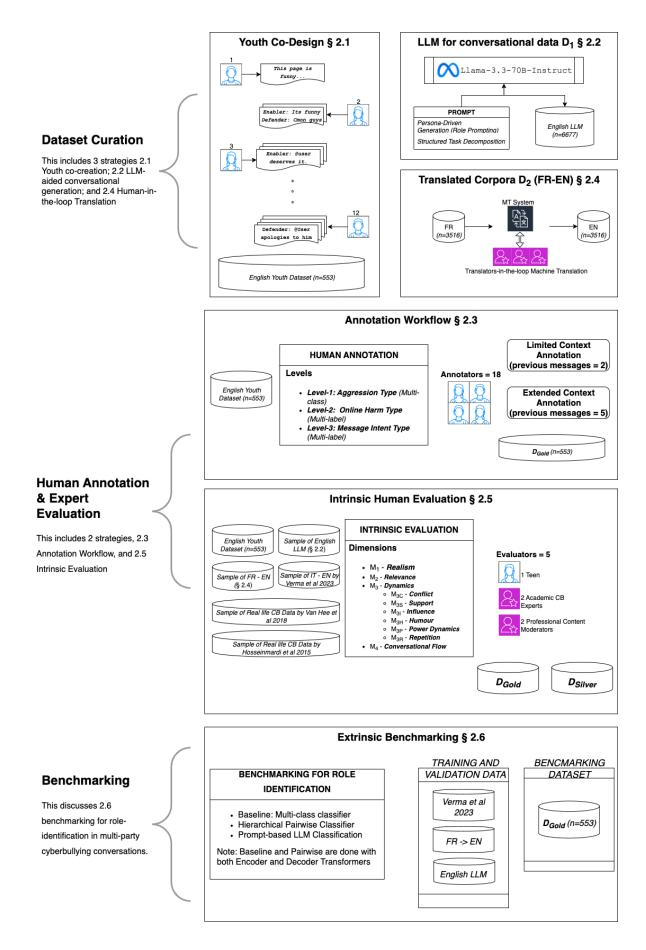
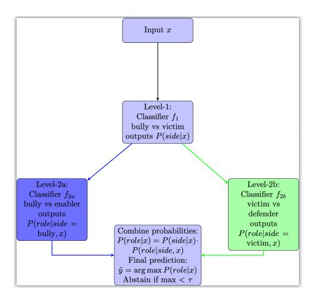
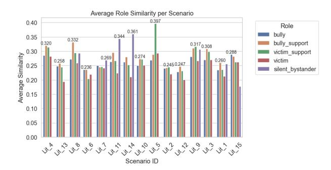
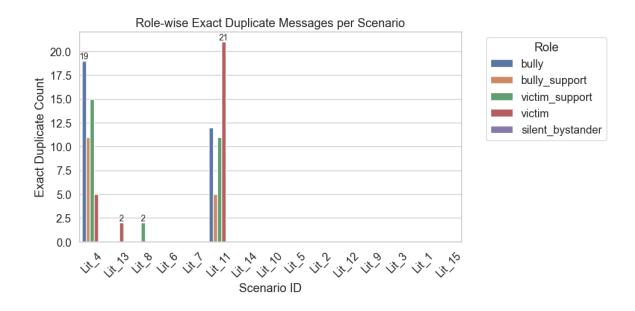
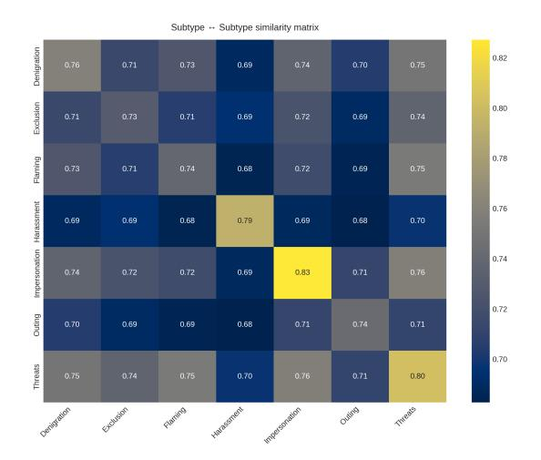
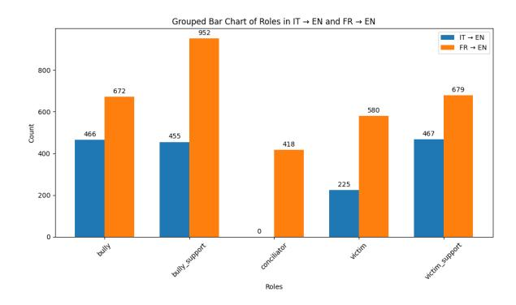
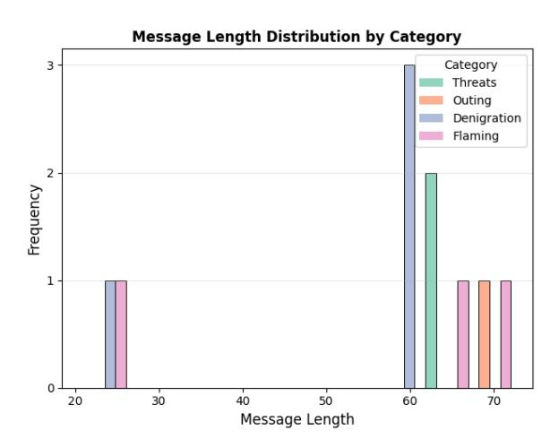
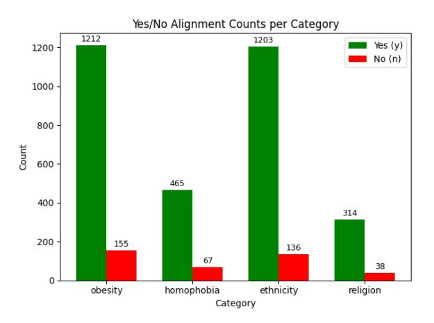
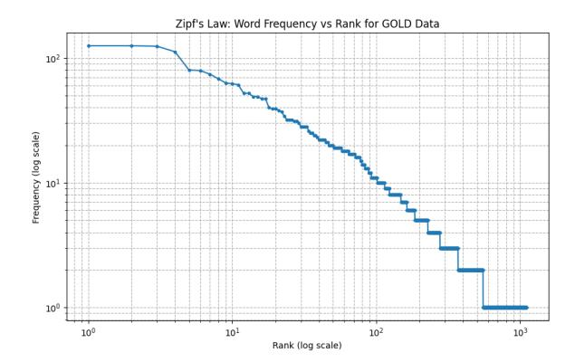

# BullyBench: Youth & Experts-in-the-loop Framework for *Intrinsic* and *Extrinsic* Cyberbullying NLP Benchmarking

Kanishk Verma1,2 , Sri Balaaji Natarajan Kalaivendan<sup>1</sup> , Arefeh Kazemi<sup>1</sup> , Joachim Wagner<sup>1</sup> , Darragh McCashin2,3 , Isobel Walsh2,3 , Sayani Basak<sup>2</sup> , Sinan Asci<sup>2</sup> , Yelena Cherkasova<sup>4</sup> , Alexandrous Poullis<sup>5</sup> , James O'Higgins Norman<sup>2</sup> , Rebecca Umbach<sup>6</sup> , Tijana Milosevic<sup>7</sup> , Brian Davis<sup>1</sup>

<sup>1</sup> ADAPT Centre; <sup>2</sup> DCU Anti Bullying Centre; <sup>3</sup> School of Psychology, Dublin City University, Ireland <sup>4</sup> G3 Translate, USA; <sup>5</sup> DataForce, Luxembourg ; <sup>6</sup> Google, USA

<sup>7</sup> School of Information and Communication Studies, University College Dublin, Ireland 1 {first.last}@adaptcentre.ie | 2 {first.last}@dcu.ie

#### Abstract

Cyberbullying (CB) involves complex relational dynamics that are often oversimplified as a binary classification task. Existing youthfocused CB datasets rely on scripted roleplay, lacking conversational realism and ethical youth involvement, with little or no evaluation of their social plausibility. To address this, we introduce a youth-in-the-loop dataset "BullyBench" developed by adolescents (ages 15–16) through an ethical co-research framework. We introduce a structured intrinsic quality evaluation with experts-in-the-loop (social scientists, psychologists, and content moderators) for assessing realism, relevance, and coherence in youth CB data. Additionally, we perform extrinsic baseline evaluation of this dataset by benchmarking encoder- and decoderonly language models for multi-class CB role classification for future research. A three-stage annotation process by young adults refines the dataset into a gold-standard test benchmark, a high-quality resource grounded in minors' lived experiences of CB detection. Code and data are available for review [1](#page-0-0) .

*Content Warning*: *This manuscript contains references to online bullying examples, reader discretion is advised.*

#### 1 Introduction & Background

Cyberbullying (CB), or online bullying, is an act of online harm characterised by the intention to repeatedly hurt someone [\(Patchin and Hinduja,](#page-10-0) [2006\)](#page-10-0). Extending beyond simplistic bully–victim or harm–no-harm dichotomies, CB transitions from offline to online settings [\(O'Higgins Norman et al.,](#page-10-1) [2023\)](#page-10-1), and involves behaviours that are distinct from hate-speech, aggression, or abusive language due to their inherent relational and repetitive nature [\(Smith et al.,](#page-10-2) [2013;](#page-10-2) [Ziems et al.,](#page-11-0) [2020;](#page-11-0) [Emmery](#page-8-0)

[et al.,](#page-8-0) [2021\)](#page-8-0). It includes behaviours like *exclusion, denigration, flaming, stalking* each different from another, e.g., *denigration* involves harmful behaviour to damage reputation, *flaming* involves *insults, hostile actions* [\(Nadali et al.,](#page-10-3) [2013;](#page-10-3) [Slonje](#page-10-4) [et al.,](#page-10-4) [2013;](#page-10-4) [Bauman,](#page-8-1) [2015\)](#page-8-1). CB also includes complex bystander participant behaviours like i) escalation or enabling the bully (enablers), ii) deescalation or defending the victim (defenders), iii) resolving the situation (conciliators) and iv) passive viewers (silent bystanders) [\(Leung et al.,](#page-9-0) [2018;](#page-9-0) [Song and Oh,](#page-10-5) [2018;](#page-10-5) [Van Hee et al.,](#page-11-1) [2018;](#page-11-1) [Ollagnier](#page-10-6) [et al.,](#page-10-6) [2022\)](#page-10-6).

Many computational studies treat CB as a onedimensional label prediction task i.e., CB (0) vs not-CB (1) [\(Mali et al.,](#page-10-7) [2025;](#page-10-7) [Philipo et al.,](#page-10-8) [2024;](#page-10-8) [Ahmad Al-Khasawneh et al.,](#page-8-2) [2024;](#page-8-2) [Paul and Saha,](#page-10-9) [2022\)](#page-10-9), thereby neglecting the layered inter-personal dynamics of CB that demand relational and contextual awareness. The need for fine-grained resources is especially acute for minors, who remain disproportionately exposed to CB [\(CyberSafeKids,](#page-8-3) [2024\)](#page-8-3). Capturing these realities calls for true interdisciplinary collaboration, in particular involving minors themselves.

The AMiCA[2](#page-0-1) corpus by [Van Hee et al.](#page-11-1) [\(2018\)](#page-11-1) advanced CB detection with granular categories (e.g., insults, threats, exclusion, etc), and CB roles (bully, victim, and bystander). However, drawn from a semi-anonymous and outdated platform, ASK.fm[3](#page-0-2) , it lacks verifiable youth engagement or real-time interaction. Role classification on the AMiCA corpus suffers from class imbalance (e.g., Enabler F1: 0.00 [\(Rathnayake et al.,](#page-10-10) [2020\)](#page-10-10)); balancing methods only moderately help (F1: 0.56 [\(Jacobs et al.,](#page-9-1) [2022\)](#page-9-1)). Addressing this, [Sprugnoli et al.](#page-11-2) [\(2018\)](#page-11-2) and [Ollagnier et al.](#page-10-6) [\(2022\)](#page-10-6) curated 2,192 Italian and 2,912 French conversational messages with

<span id="page-0-0"></span><sup>1</sup> [https://github.com/kanishk-r-verma/](https://github.com/kanishk-r-verma/bully-bench) [bully-bench](#page-8-0)

<span id="page-0-2"></span><span id="page-0-1"></span><sup>2</sup> (Automatic Monitoring in Cyberspace Applications)

<sup>3</sup> [https://www.esafety.gov.au/key-topics/](https://www.esafety.gov.au/key-topics/esafety-guide/askfm) [esafety-guide/askfm](https://www.esafety.gov.au/key-topics/esafety-guide/askfm)

minors, respectively, through role-playing Cyberbullying(CB) scenarios on group-chat platforms. [Ollagnier et al.](#page-10-11) [\(2023\)](#page-10-11) inferred roles using a binary hate classifier and heuristics based on harm repetition and intention. While this captures basic bully-victim dynamics, it overlooks the complexities of social influences such as *escalation*, *power shifts*, *bystander actions*, and *humour* on CB [\(Hinduja and Patchin,](#page-9-2) [2013;](#page-9-2) [Englander et al.,](#page-8-4) [2017;](#page-8-4) [Steer et al.,](#page-11-3) [2020;](#page-11-3) [Macaulay et al.,](#page-9-3) [2022\)](#page-9-3). Further challenges include little or no evaluation of the realism of such scripted interactions, raising questions about their representativeness, notwithstanding the ethical risks of involving minors in harmful behaviour simulations, which may induce distress or inadvertently normalize toxic dynamics [\(Livingstone and Stoilova,](#page-9-4) [2021;](#page-9-4) [Jicol et al.,](#page-9-5) [2022\)](#page-9-5).

An emerging alternative is the use of Large Language Models (LLMs) to generate synthetic cyberbullying (CB) data by simulating diverse scenarios without involving minors [\(Kazemi et al.,](#page-9-6) [2025;](#page-9-6) [Tari](#page-11-4) [et al.,](#page-11-4) [2025\)](#page-11-4). However, to date no studies have yet assessed the properties and suitability of LLMgenerated and role-play corpora through intrinsic evaluation i.e., *whether the data reflect the dynamics of online bullying by individuals and multiple participants* studied by [\(Hinduja and Patchin,](#page-9-2) [2013;](#page-9-2) [Englander et al.,](#page-8-4) [2017;](#page-8-4) [Van Hee et al.,](#page-11-1) [2018;](#page-11-1) [Ziems](#page-11-0) [et al.,](#page-11-0) [2020;](#page-11-0) [Huang et al.,](#page-9-7) [2020;](#page-9-7) [Steer et al.,](#page-11-3) [2020;](#page-11-3) [Macaulay et al.,](#page-9-3) [2022\)](#page-9-3), and extrinsic evaluation i.e., *applicability of such data in downstream tasks such as participant role identification*. As illustrated in Figure [2,](#page-11-5) through our multi-stakeholder collaboration with academics, industry partners, and teenagers we address these challenges by making following key contributions:

- 1. In line with the EU Joint Research Centre's call for youth involvement in AI design [\(Charisi et al.,](#page-8-5) [2022\)](#page-8-5) and co-design/research framework [\(Clark et al.,](#page-8-6) [2022\)](#page-8-6), we developed a novel dataset with Irish teens (ages 15-16; 6M, 6F) [[§2.1\]](#page-1-0). It was further refined via a three-stage annotation into processing a gold test-set DGold labelled for aggression type, online harm type and intent type [[§2.3\]](#page-2-0).
- 2. Intrinsic evaluation involved experts (content moderators, social scientists, and youth psychologists) through a structured human evaluation protocol to assess *realism*, *relevance*,

- *coherence*, and the representation of *bullying dynamics* across CB data. [[§2.5\]](#page-3-0)
- 3. A baseline validation of our dataset DGold on multi-class CB role classification using fine-tuned (GPT2, RoBERTa) and prompt-based classification with (Llama-3.3) models, to guide future research with *BullyBench* [[§2.6\]](#page-3-1).

#### 2 Methodology

Figure [2](#page-11-5) (See Appendix [A\)](#page-11-6) highlights the structured methodology to build, refine, cyberbullying conversational datasets The dataset curation workflow starts with youth co-design, where teens cocreate dialogue scenarios ([§2.1\)](#page-1-0), followed by Large Language Model (LLM) driven dialogue generation ([§2.2\)](#page-2-1), and human-in-the-loop translation from French to English ([§2.4\)](#page-2-2). Once curated, the youth co-design dataset is annotated by young adult annotators across three levels (i) aggression type, (ii) online harm type, and (iii) intent type ([§2.3\)](#page-2-0). The *intrinsic evaluation* validates the quality of different cyberbullying datasets across dimensions such as realism, relevance, conversational flow, and cyberbullying dynamics such as conflict, humour, power dynamics, and repetition ([§2.5\)](#page-3-0). Finally, the *extrinsic benchmarking* tests participant role identification techniques, comparing traditional multiclass classifiers, hierarchical approaches, and LLMbased classification methods across gold-standard and translated datasets ([§2.6\)](#page-3-1). This multi-step process ensures datasets are both authentic and robust for cyberbullying detection and analysis.

# <span id="page-1-0"></span>2.1 Co-design & Co-research Approach to curate Gold test-set (DGold)

Building upon research by [\(Guishard and Tuck,](#page-9-8) [2013;](#page-9-8) [Alderson,](#page-8-7) [2008;](#page-8-7) [Clark et al.,](#page-8-6) [2022\)](#page-8-6) that promotes co-research methods to empower youth as active collaborators, we implemented a five-day in-person "young research assistantship" for coresearch and co-design of a benchmarking CB dataset. Each youth researcher participates anonymously and is introduced to digital skills (advanced Google sheets, Python programming) and shares perspectives individually across three dimensions: i) *realism* [\(Agha et al.,](#page-8-8) [2024\)](#page-8-8), ii) *seriousness* [\(Huang et al.,](#page-9-7) [2020\)](#page-9-7), and iii) *report-worthiness* [\(Thorn and Benenson Strategy Group,](#page-11-7) [2021\)](#page-11-7) for 15 CB vignettes[4](#page-1-1) previously developed by [\(Ashktorab](#page-8-9)

<span id="page-1-1"></span><sup>4</sup>[Vignettes are text-based description of online bullying](#page-8-9) scenarios, See [Table Z](https://github.com/kanishk-r-verma/bully-bench/blob/main/supplementary_material/emnlp_idc_tex.pdf) [for detailed vignetes.](#page-8-9)

[and Vitak,](#page-8-9) [2016;](#page-8-9) [Camelford and Ebrahim,](#page-8-10) [2016;](#page-8-10) [Campbell and Xu,](#page-8-11) [2022;](#page-8-11) [Huang et al.,](#page-9-7) [2020;](#page-9-7) [Ol](#page-10-6)[lagnier et al.,](#page-10-6) [2022\)](#page-10-6). Each young researcher adapts the CB vignette by associating it with a social media platform (e.g., TikTok, Discord) and a sharing feature (e.g., comments, group chats, disappearing messages). They then develop three or more escalating (instigate or nasty or hurtful or mean) and de-escalating (defend or support) bystander responses per vignette in a cascading manner. For ethical considerations, young researchers participated individually in a cascading manner i.e., recruited in staggered intervals between late 2023 to mid-2025. Each new participant first composed a minimum of six messages, and on subsequent days they were provided with a sheet containing the scenarios and messages produced by previous participants. Following a *mix-of-ideas* or *bagsof-stuff* co-design approach [\(Guha et al.,](#page-9-9) [2004\)](#page-9-9), participants were required to either adjust the sequence of existing '*bag of messages*" or confirm its order. The contributions and suggestions by youth that inform this co-design process are documented and published in our work [\(Verma et al.,](#page-11-8) [2025\)](#page-11-8). For detailed study and ethical considerations see Appendix [B.](#page-12-0)

# <span id="page-2-1"></span>2.2 LLM for Conversational Data-creation (D1)

To address the paucity of datasets in youth CB research and avoid ethically risky role-play, we use LLMs to generate synthetic conversational data. Drawing on (a) Persona-Driven Generation (Role Prompting) [Ge et al.](#page-9-10) [\(2024\)](#page-9-10) and (b) Structured Task Decomposition [\(Khot et al.,](#page-9-11) [2022\)](#page-9-11), our method principled in prompt engineering to guide Llama-3.3-70B-Instruct in simulating complex, multi-party social interactions by breaking down dialogues into defined elements like roles, context, platform traits, and format. To generate realistic and dynamic conversations, we designed a multilayered prompt architecture that includes (a) *Character Archetype Specification* with participant-role specific behaviour [\(Hu and Collier,](#page-9-12) [2024;](#page-9-12) [Olea](#page-10-12) [et al.,](#page-10-12) [2024\)](#page-10-12), (b) *Controlled Narrative and Emotional Escalation* involves increasing linguistic intensity, profanity, and signs of emotional distress [\(Kim et al.,](#page-9-13) [2024;](#page-9-13) [Zheng et al.,](#page-11-9) [2023\)](#page-11-9), and (c) *Implicit Chain-of-Thought Reasoning* to account for group dynamics and emotional flow. For further details, see [§3.1.](#page-4-0)

## <span id="page-2-0"></span>2.3 Annotation Workflow for DGold

Following [\(Van Hee et al.,](#page-11-1) [2018;](#page-11-1) [Sprugnoli et al.,](#page-11-2) [2018;](#page-11-2) [Ollagnier et al.,](#page-10-6) [2022;](#page-10-6) [Kumar et al.,](#page-9-14) [2024\)](#page-9-14), we refine the co-design data to gold quality in three distinct annotation tasks: (a) aggression type labelling - building upon [\(Kumar et al.,](#page-9-14) [2024;](#page-9-14) [Ol](#page-10-13)[lagnier,](#page-10-13) [2024\)](#page-10-13) the goal is to label a message into only one of the three aggression types (*covertly* or *overtly* or *no* aggression); (b) harm type labelling - following [\(Van Hee et al.,](#page-11-1) [2018;](#page-11-1) [Sprugnoli et al.,](#page-11-2) [2018\)](#page-11-2), the goal is to label a message into one or more subcategories such as : *threats of violence, blackmail, personal attack, identity-based harassment, body-shaming, exclusion, sexual-harassment, general insult, encouragement to bully, or no harm*, and (c) intent type labelling - drawing from [\(Ku](#page-9-14)[mar et al.,](#page-9-14) [2024;](#page-9-14) [Ollagnier,](#page-10-13) [2024\)](#page-10-13), the goal is to identify one or more applicable subcategories of intent for the message *sarcasm, attack, blame, defend, abet or instigate, gaslighting, or no-intent*. We report Krippendorff's α [\(Hayes and Krippen](#page-9-15)[dorff,](#page-9-15) [2007\)](#page-9-15) to assess inter-annotator agreement across all three sub-tasks, complementing intrinsic evaluation in [§2.5.](#page-3-0) For detailed definitions and annotation pipeline see Appendix [C.](#page-13-0)

## <span id="page-2-2"></span>2.4 Translated Corpora (FR-EN) (D2)

The only English youth CB dataset is by [Verma](#page-11-10) [et al.](#page-11-10) [\(2023\)](#page-11-10) through human translation of [Sprug](#page-11-2)[noli et al.](#page-11-2) [\(2018\)](#page-11-2). To support dataset curation, we collaborated with a specialist translation company, DataForce by Transperfect[5](#page-2-3) , for human-in-the-loop machine translation of [Ollagnier et al.](#page-10-6) [\(2022\)](#page-10-6); [Ol](#page-10-13)[lagnier](#page-10-13) [\(2024\)](#page-10-13) into English. Four professional translators (3M, 1F)[6](#page-2-4) with experience in reviewing harmful social media content manually postedited French-to-English translations through two key steps: (a) *Linguistic Correction* - editing grammar while preserving informal tone, offensive language, emojis; and (b) *Comprehensive Verification*, where translators assessed alignment between source and translations across HATE/INTENTION labels and vignettes from [Ollagnier et al.](#page-10-6) [\(2022\)](#page-10-6); [Ollagnier](#page-10-13) [\(2024\)](#page-10-13) with binary (yes/no) judgements per sentence.

<span id="page-2-4"></span><span id="page-2-3"></span><sup>5</sup> <https://www.dataforce.ai/>

<sup>6</sup>All professional translators meet the requirements of ISO 17100 – the translation industry-standard. (ISO 17100 [https:](https://www.iso.org/standard/59149.html) [//www.iso.org/standard/59149.html](https://www.iso.org/standard/59149.html))

# <span id="page-3-0"></span>2.5 Intrinsic Human Evaluation for curating $\mathcal{D}_{\text{Gold}}$

Intrinsic evaluation in NLP typically relies on ground truth (Clark et al., 2013). To overcome the paucity of such data in CB contexts, we adopt AIcontent evaluation frameworks like (Chhun et al., 2022), which assess story-like LLM outputs for relevance and coherence. We extend this approach for multi-party CB dialogues by explicitly incorporating "realism" and "online bullying dynamics" to capture authentic social media interactions across characteristics studied by (Hinduja and Patchin, 2013; Salmivalli, 2014; Englander et al., 2017; Van Hee et al., 2018; Sprugnoli et al., 2018; Huang et al., 2020; Ziems et al., 2020; Steer et al., 2020; Ollagnier et al., 2022). This intrinsic evaluation ensures development of reliable ground truth across the following four dimensions,

- Realism (M<sub>1</sub>): How closely a conversation mirrors genuine youth interactions in tone, language, structure, and context?
- Relevance (M<sub>2</sub>): How directly a conversation reflects the CB vignette it intends to simulate?
- **Dynamics** (M<sub>3</sub>): This dimension subcategorises into the following **six subdimensions**:
  - 1. **Conflict**( $\mathcal{M}_{3C}$ ): hostile exchanges, insults, or antagonism.
  - 2. **Support**( $\mathcal{M}_{3S}$ ): Empathy, defence, or enabling hurtful behaviour.
  - 3. **Influence**( $\mathcal{M}_{3I}$ ): Covert tactics like instigation, shaming, or gaslighting.
  - 4. **Humour**( $\mathcal{M}_{3H}$ ): sarcasm or mockery to veil aggression.
  - 5. **Power-dynamics**( $\mathcal{M}_{3P}$ ): dominance/marginalisation cues by individuals or groups.
  - 6. **Repetition**( $\mathcal{M}_{3R}$ ): Repeated hurtful behaviour.
- Flow (M<sub>4</sub>): How easily can conversations be followed despite asynchronous participation and threaded replies?

All dimensions were rated on a 5-point Likert scale by experts in both i) the pilot (3 domain experts) and ii) the main study (2 academics, 2 moderators, 1 teen). Evaluation involved four datasets, including  $\mathcal{D}_{gold}$ ,  $\mathcal{D}_1$ ,  $\mathcal{D}_2$ , and (Verma et al., 2023) as  $\mathcal{D}_3$  and CB conversations from Instagram (Hosseinmardi et al., 2015). We report Fleiss  $\kappa$  (Fleiss,

1971) and prevalence-adjusted and bias-adjusted kappa for ordinal scales (PABAK-OS) (Parker et al., 2011) for pair-wise agreement. Fleiss  $\kappa$  quantifies the extent to which annotators agree beyond chance; however, if one category is extremely common or rare (e.g., "strongly agree" selected by all annotators), both observed agreement and chance agreement become high. While annotators are actually highly consistent, the  $\kappa$  value becomes low because the difference between observed and chance agreement is small relative to the maximum possible improvement over chance. PABAK-OS corrects for this by adjusting for prevalence (how common categories are) and bias (systematic differences between annotators), giving a more faithful estimate of agreement. See Appendix D for study details and ethical considerations.

## <span id="page-3-1"></span>2.6 Encoder vs. Decoder Baseline Benchmarking for CB Role Classification

**Problem Formulation:** Cyberbullying involves multiple participant roles beyond simple bully-victim dynamics. As role-dynamics are pre-defined across prior datasets (Sprugnoli et al., 2018; Ollagnier et al., 2022) and both co-designed and LLM-generated data, this enables us to benchmark multi-party CB-role classification. We formalise it as given a dataset of messages  $x_i \in \mathcal{X}$ , predict author's role  $y_i \in \mathcal{Y}$ , where  $\mathcal{Y} = \{bully, victim, enabler, defender\}$ .

**Multi-source Dataset:** To address data paucity, we construct  $\mathcal{D} = \mathcal{D}_1 \cup \mathcal{D}_2 \cup \mathcal{D}_3$ , where  $\mathcal{D}_1$  in §2.2,  $\mathcal{D}_2$  in §2.4, and  $\mathcal{D}_3$  in §2.5.

Classification Paradigms: Building upon previous work by (Rathnayake et al., 2020; Jacobs et al., 2022; Ollagnier et al., 2023), we compare following classification approaches:

- Direct Multiclass (Baseline): A single model f: X → Y is trained to predict one of the four mutually exclusive role labels - Y.
- Hierarchical Pairwise: Label patterns D₂ and D₃ reveals that certain role pairs share similar distributions of verbal abuse markers (Tables 19, 20 See Appendix E.1). So, we implement a two-level hierarchical classifier as depicted in Figure 3 (See Appendix E.1). This involves, Level-1: a binary classifier (f₁: X → {0,1}) distinguishes between primary roles: bully vs victim. Level-2: Conditional classifiers refine each side: f₂a: X → {bully, enabler} (bully-side),

and  $f_{2b}: \mathcal{X} \to \{victim, defender\}$  (victimside). We compute full joint role probabilities as:  $P(role \mid x) = P(side \mid x) \cdot P(role \mid side, x)$  with  $P(side \mid x)$  from  $f_1$ , and  $P(role \mid side, x)$  from the appropriate Level-2 classifier. Both Level-2 models are applied to all instances, yielding a normalized distribution over: bully, enabler, defender, and victim. The predicted role is:  $\hat{y} = \arg\max_{role} P(role \mid x)$ . We abstain from prediction if  $\max_{role} P(role \mid x) < \tau$ , where  $\tau$  is a tunable threshold.

• Prompt-based LLM classification: Given LLMs' comparable performance to transfer learning in low-resource offensive language detection (Riabi, 2025; Riahi Samani et al., 2025; Plaza-del arco et al., 2023), we benchmark prompt-based classification using zero-, one-, and few-shot settings.

#### 3 Experiment Setup

#### <span id="page-4-0"></span>3.1 LLM for conversational data-creation

Llama-3.3-70B-Instruct out-performs other LLMs on IFEval (Zhou et al., 2023)<sup>7</sup>. Additionally, the feasibility of local deployment of Llama on NVIDIA A100 GPUs ensures data privacy and full control over the generation process. Each of the 15 vignettes in §2.1 served as {scenario} inputs; each one paired with 10 youth-generated {problem} phrases describing how the scenario could spread via social media (e.g., reposting, commenting, sharing screenshots), yielding diverse simulated CB runs  $(15 * 10)^8$ . To control the length of each conversation, we limited each vignette to 50 messages. Figure 1 illustrates prompt template used for LLM-aided generation. Moreover, in order to ensure semantic diversity across the 10 conversational runs per vignette, we compute pairwise cosine similarities, following (Aynetdinov and Akbik, 2024), with off-the-shelf sentencetransformer<sup>9</sup>. Lower average similarity scores across CB vignettes will indicate the model's ability to generate more varied and diverse conversations. Full prompt design details are available in Appendix F.1 and F.2.

```
{scenario}
Scenario
          Context:
                       Situation:
                 {problem} {platforms_section}
Problem Type:
{features_section}
CHARACTER ROLES & DEVELOPMENT
<conversation>
[Generate the conversation here, [...] - MUST BE
EXACTLY 50 MESSAGES] 1. USERNAME[role]: Message
2. USERNAME[role]: Message
</conversation>
         Style
                              Platform-Specific
[...]
                Guidelines:
Language [...] Group Chat Interaction Patterns
[...]Message Structure Variation [...]
```

Figure 1: Prompt Template snippet for LLM cyberbullying conversational data-creation

# 3.2 Encoder vs. Decoder Baselines Benchmarking for CB Role Classification

Foundational models: RoBERTa-base (Liu et al., 2019) and GPT2-medium (Radford et al., 2019) have been widely studied for abusive language tasks (Wei et al., 2021; Philipo et al., 2024; Kancharla et al., 2025) and achieved near state-of-the-art performance. We also evaluate zero- and few-shot classification using LLaMA-3.3-70B (Touvron et al., 2023).

**Learning Objective:** Cross-entropy (CE) treats all samples equally, causing majority classes to dominate training. Focal Loss (FL) down-weights easy, well-classified samples to focus learning on harder, minority-class examples (Lin et al., 2020). Hence, we also benchmark both CE and FL for handling class imbalance.

**Training and Evaluation Configurations:** ble 1 illustrates the distribution of role labels across the different datasets curated in this study such as: LLM-generated  $\mathcal{D}_1$  (§2.2), French datasets by (Ollagnier et al., 2022; Ollagnier, 2024) translated to English (§2.4),  $\mathcal{D}_3$  Italian dataset by (Sprugnoli et al., 2018) translated to English by (Verma et al., 2023), and youth co-created  $\mathcal{D}_{Gold}$  (§2.1).  $\mathcal{D}_1$  and  $\mathcal{D}_3$  lack the "conciliator" role, so we exclude it from  $\mathcal{D}_2$  for consistency. Across  $\mathcal{D}_2$ and  $\mathcal{D}_3$  consecutive messages from the same user were merged into single utterances to reflect conversational flow. Also short greeting messages<sup>10</sup> were filtered to reduce conversational noise. We evaluate cross-domain transfer learning using two training setups with 5-fold cross validation with no-sampling and random up-sampled class distributions  $^{11}$ , on (i) translated-only data ( $\mathcal{D}_2 \cup \mathcal{D}_3$ ) and (ii) all-combined multi-source dataset ( $\mathcal{D}_1$ 

<span id="page-4-1"></span> $<sup>^7</sup> See\ OpenLLM\ Leaderboard\ https://huggingface.co/spaces/open-llm-leaderboard/open_llm_leaderboard/$ 

<span id="page-4-2"></span><sup>&</sup>lt;sup>8</sup>For brevity we refer each problem phrase as a conversation-run

<span id="page-4-4"></span> $<sup>^{9}</sup>$ https://huggingface.co/sentence-transformers/all-MiniLM-L6-v2

<span id="page-4-6"></span><span id="page-4-5"></span> $<sup>^{10}</sup>$ text starting with "hi" or "hey" and containing tokens < 3  $^{11}$ we randomly copy sentences at seed=42

<span id="page-5-0"></span>

| Role                  | $\mathcal{D}_1$ (§2.2) | $\mathcal{D}_{2}$ $(FR \rightarrow EN \S 2.4)$ | $\mathcal{D}_3$ (IT $\rightarrow EN$ (Verma et al., 2023)) | $\mathcal{D}_{\text{Gold}}$ (§2.1) |
|-----------------------|------------------------|------------------------------------------------|------------------------------------------------------------|------------------------------------|
| Enabler               | 17.36%                 | 28.75%                                         | 27.08%                                                     | 33.99%                             |
| Defender              | 22.87%                 | 19.56%                                         | 28.76%                                                     | 43.94%                             |
| Bully                 | 36.85%                 | 20.39%                                         | 29.65%                                                     | 17.54%                             |
| Victim                | 22.06%                 | 20.29%                                         | 15.78%                                                     | 4.52%                              |
| Conciliator           | -                      | 10.97%                                         | -                                                          | -                                  |
| Silent By-<br>stander | 0.83%                  | -                                              | -                                                          | -                                  |
|                       |                        |                                                |                                                            |                                    |

Table 1: Role Label Distribution across  $\mathcal{D}_{1-3}$  and  $\mathcal{D}_{Gold}$ 

 $\cup$   $\mathcal{D}_2$   $\cup$   $\mathcal{D}_3$ ). All models are trained for early stopping based on both validation macro-F1 and validation loss with a patience of 3 epochs and threshold of 0.001. Using Bayesian optimisation we tune hyper-parameters to maximise macroaverage F1 on validation data. For comparing this baseline with Llama-3.3-70B-Instruct we followed hyper-parameters and classification prompt-structures as previously studied in (Kazemi et al., 2025)<sup>12</sup>. We benchmark the models on  $\mathcal{D}_{gold}$  as our test-set and report macro-average F1 score across all roles in §4. Detailed hyper-parameters across our benchmarking paradigm can be found in Appendix E.2.

#### <span id="page-5-2"></span>4 Results & Discussion

 $\mathcal{D}_{Gold}$  Curation: Comprises of 553 messages across 10 cyberbullying (CB) vignettes curated in cascading manner by twelve teens. These are evenly split between purely online contexts and offline-to-online transitions. The dataset covers key CB types - denigration (3), flaming (3), threats (2), outing (1). Conversational lengths ranged from 21 to 72 messages (Figure 8 Appendix G.2). The 12 teens introduced socio-linguistic features such as emojis, teenage informal registers (e.g., "to die"  $\rightarrow$  "unalived", etc.), and obfuscation (e.g., "fat"  $\rightarrow$  "f@", etc.). The dataset shows a classic Zipf's distribution (Zipf, 2016) characterised by highly frequent terms and a long tail of infrequent terms. (See Figure 9 in Appendix G.2). Our codesign/research approach, while mitigating ethical risks, yields a role-distribution across CB participants across vignettes similar to (Sprugnoli et al., 2018; Ollagnier et al., 2022) (See Table 29 and Figure 7 in Appendix G.1)

**LLM for conversational data-creation:** Our multilayered prompt strategy managed to generate 134 conversations across 150 conversational runs (89.33% completion rate) (See Table 28 in Appendix F.3). Pairwise cosine scores show low message-level similarity across roles (0.2-0.4; see Figure 4, Appendix F.3). Only two vignettes have over 15 exact duplicates (victim: 21; bully: 19; Figure 5), suggesting the model produces diverse lexical and structural outputs across different conversational-runs on similar topics. Across all conversational runs grouped by the type of CB vignette, pairwise cosine similarity reveals relatively low cosine similarity (less than 0.69) for harassment-based vignettes for denigration, flaming, outing and threat (See Figure 6 in Appendix F.3)

Annotation workflow for  $\mathcal{D}_{Gold}$ : Three annotators labelled each task within one of two context conditions (a) *limited* (2 prior messages), (b) extended (5 prior messages), resulting in 18 annotators across 3 tasks as a between-subjects design. For Krippendorff's  $\alpha$ , we use the most majority, defaulting to the first assigned label in case of ties or no-agreement. The observed change in agreement ( $\Delta \alpha$ ) is +0.08 across all tasks in extended context condition (See Table 30 in Appendix G.2).  $\Delta \alpha$  yields +0.121 in **aggression-type** labelling in extended context condition and a drop in covert vs overt aggression confusions, with disagreement counts between these labels decreasing from 96 to 50 (Table 32). In **harm-type** labelling, a modest  $\Delta \alpha$  of +0.07 parallels substantial reductions in key disagreement pairs such as general insult  $\leftrightarrow$  no harm (Table 33). Disagreements between Bodyshaming  $\leftrightarrow$  Personal Attack and Exclusion  $\leftrightarrow$  Personal Attack slightly increase under extended context (9 and 8 items, respectively), suggesting persistent difficulty with fine-grained distinctions. In **intent-type** labelling, a  $\Delta \alpha$  of +0.0696 aligns with reduced disagreements between  $attack \leftrightarrow blaming$ (from 12 to 4), but also reveals increased confusion in  $attack \leftrightarrow defend$  (from 12 to 19) and new disagreements between defend  $\leftrightarrow$  gaslighting (6 instances), indicating added context can introduce new ambiguities.

**Translated Corpora(FR-EN):** Figure 10 (See Appendix H) depicts the binary alignment responses across all messages with both HATE and INTENTION labels of Ollagnier et al. (2022); Ollagnier (2024) grouped by the four online-harm

<span id="page-5-1"></span><sup>12</sup>https://github.com/kanishk-r-verma/
bully-bench/blob/main/supplementary\_material/
prompt\_classify.txt

vignettes - obesity, homophobia, ethnicity, and religion. Translators' verification of alignment of sentences were highest in obesity scenarios (1212 yes vs 155 no) indicating relatively direct cross-lingual mappings and lower for homophobia and religion scenarios 465/67 and 314/38, respectively), reflecting slightly more interpretive complexity. Results support the suitability of human-in-the loop post editing for preserving intended meaning in sensitive sociolinguistic contexts.

Intrinsic Human Evaluation for  $\mathcal{D}_{Gold}$ : Table 12 shows substantial overall agreement ( $\kappa$ =0.67) across all datasets. Every dimension level indicates varied  $\kappa$  scores,  $\mathcal{M}_{3S}$  i.e., "support" (see §2.5) achieved substantial ( $\kappa$ =0.62) and  $\mathcal{M}_{3H}$  moderate ( $\kappa$ =0.54) agreement respectively, while  $\mathcal{M}_{3C}$  $(\kappa=0.07)$ ,  $\mathcal{M}_{3P}$  ( $\kappa=0.20$ ),  $\mathcal{M}_{4}$  ( $\kappa=0.31$ ), and  $\mathcal{M}_{3R}$ ( $\kappa$ =0.38) showed poor to slight agreement. However, these low scores are due to distributional imbalance in responses (See Table 6). Correcting for distributional bias with PABAK-OS resulted in good to excellent agreement:  $\mathcal{M}_{3C}$  (0.88),  $\mathcal{M}_{3P}$  $(0.82), \mathcal{M}_4$   $(0.88), and \mathcal{M}_{3R}$  (0.92) (See Table 12). The youth co-designed dataset ( $\mathcal{D}_{Gold}$ ) demonstrated the most consistent agreement across dimensions, achieving perfect PABAK-OS scores for  $\mathcal{M}_{3C}$ ,  $\mathcal{M}_{3S}$ ,  $\mathcal{M}_{3R}$  (See §2.5) (1.00 each, Table 14), also validated by 100% yes response choice (See Table 7).  $(\mathcal{D}_{Gold})$  also has strong agreement on  $\mathcal{M}_{3I}$  (0.875),  $\mathcal{M}_{3H}$  (0.85),  $\mathcal{M}_{3I}$  (0.776), and  $\mathcal{M}_{3P}$ (0.700) (See Table 15). The LLM-generated data performed competitively with perfect agreement on  $\mathcal{M}_{3C}$  and  $\mathcal{M}_{3I}$ , but showed weaker reliability in  $\mathcal{M}_{3P}$  (0.500) and  $\mathcal{M}_{3R}$  (0.689) (See Table 16 and Table 8). Test-set conversations from  $\mathcal{D}_2$  and  $\mathcal{D}_3$ datasets yielded high agreement across  $\mathcal{M}_1$  (0.87) and  $\mathcal{M}_2$  but weak agreement across  $\mathcal{M}_{3S}$  (0.6) (See Table 17 and Table 9). Instagram data showed strong agreement on  $\mathcal{M}_1$  (0.886) and  $\mathcal{M}_{3R}$  (0.829) but lower scores for  $\mathcal{M}_{3O}$  (0.561) (See Table 18 and Table 10).

#### **Encoder vs. Decoder Baseline Benchmarking:**

Across all three classification paradigms on  $\mathcal{D}_{\textbf{Gold}}$ , few-shot Llama-3.3-70B-Instruct achieves a macro-average F1 of 0.48, competitive with supervised baselines (See Table 22 in Appendix E.3). **Role-specific** analysis shows that GPT2-Medium (multi-class) achieves the highest *enabler* detection (F1=0.5234), followed by Llama-3.3 (few-shot) (F1=0.5149), and Roberta (pairwise, F1=0.4422) (See Table 23 in Appendix E.3). It also reveals

similar weaknesses for identifying victim, GPT2medium performs poorly (F1=0.1905), followed by Llama-3.3 (few-shot) (F1=0.2222) and RoBERTa (pairwise) (F1=0.2243). Error analysis reveals that all 3 baselines fail on 94 sentences in  $\mathcal{D}_{Gold}$ indicating that messages like "b1tches ik ur stup!d but like thats so low" written by defenders, due to its obfuscation and use of profanities are predicted either as *bully* (Llama-3.3 and RoBERTa) or *enabler* (GPT2-medium) hinting that additional context is needed and sequence-classification for this task might not be ideal. The most frequent error across all baselines (LLaMA-3.3, RoBERTa, GPT-2 Medium) is misclassifying Bully as Enabler and vice versa (see Table 21). For detailed error analysis see Appendix E.3.

#### 5 Conclusion & Future Directions

This work introduces BullyBench - a multi-faceted, ethically grounded approach to developing a cyberbullying (CB) benchmark. The resulting dataset  $\mathcal{D}_{Gold}$  demonstrates high **intrinsic** quality, capturing the sociolinguistic richness and interactional dynamics of teen CB, including obfuscation, informal registers and realistic role distributions. Human evaluation confirms its semantic consistency, authenticity and theoretical alignment with multi-participant bullying behaviour. Few-shot prompting with Llama-3.3 performs well for defender/victim roles, but struggles with obfuscated bystander messages. Supervised fine-tuning of encoder- and decoder-only models (e.g., GPT2, RoBERTa) yields more reliable role detection, particularly for subtle enabler and bystander categories. Our LLM-based conversational data generation achieved an 89.33% completion rate, producing diverse outputs which complement the gold data. The cross-lingual validation of  $\mathcal{D}_2$  highlights varying alignment across harm types, underscoring linguistic and cultural nuances in CB. Future directions include advanced contextual and social relationship modelling, temporal role tracking, and continual learning for participant role identification. Expanding language and platform coverage will further enhance real-world applicability.

#### 6 Limitations

One key limitation of  $\mathcal{D}_{Gold}$  is that all messages were created from a bystander perspective, due to ethical constraints aimed to minimise risks of re-traumatisation and the ethical complexities in-

volved in peer-to-peer interactions. This design choice may reduce the dataset's ecological validity by omitting authentic confrontational dynamics. Nonetheless, we validated DGold through intrinsic human evaluation involving academic and industry experts and a young adult, assessing the dataset across multiple dimensions [§2.5.](#page-3-0) However, we did not leverage LLM-as-a-judge methods to complement the evaluation process, which limits the study's broader applicability. The same limitation applies to data annotation workflow ([§2.3\)](#page-2-0) where 18 young adults labelled data across two context conditions. Nonetheless, our work can inform LLM-as-a-judge guidelines and establish ground truth, as no such study exists. Previous work by [\(Bonetti and Tonelli,](#page-8-15) [2022\)](#page-8-15) on [\(Sprug](#page-11-2)[noli et al.,](#page-11-2) [2018\)](#page-11-2), which involved youth annotators using gamification, found that while label distributions were similar, there were significant mismatches between expert and youth annotations. This could also apply to our data, but since our framework does not currently allow youth researchers to validate expert labels, it is difficult to confirm. Discussions detailed in [§4](#page-5-2) and Appendix [E.3,](#page-29-2) indicate that sequence-level classification approaches are fundamentally inadequate for cyberbullying role identification, as evidenced by all tested models (Llama-3.3-70B-Instruct, RoBERTa, and GPT2-medium) failing to correctly interpret context-dependent victim messages and missing subtle communication patterns like veiled sarcasm. The poor performance across different model architectures and classification settings suggests that identifying cyberbullying roles requires understanding broader conversational context rather than only analysing individual message sequences.

## 7 Ethical Considerations

This study engaged young students as coresearchers, young adults as data annotators, and adults as human evaluators in activities involving online bullying-related content. In accordance with university ethics approval, the project implemented ethical safeguards across all stages to ensure participant protection, autonomy, and well-being.

Common Ethical Procedures: All participants received comprehensive information on the study's aims and methods before providing informed consent. Each completed an online training programme on resilience building and handling sen-

sitive material, curated by a qualified psychologist. Optional counselling and referral support were available throughout participation. Participation was strictly voluntary, with the right to withdraw at any stage without penalty. Participants could contribute remotely or in person, with institutional support in both settings.

Young Researchers: In line with the Irish Transition Year framework and the Participation with a Purpose framework [\(Department of Children,](#page-8-16) [Equality, Disability, Integration and Youth,](#page-8-16) [2023\)](#page-8-16), the study hosted a five-day, in-person research internship for twelve adolescents aged 14–16. Recruitment through established school partnerships required active social media use and prior exposure to online bullying-related content as a bystander. Following the UN Convention on the Rights of the Child (Article 12) and Lundy's model of child voice, all tasks included opt-out and skip options, allowing participants to decline cyberbullying-related material while accessing alternative learning opportunities (e.g., Python programming, Google Sheets training, or anonymised datasets). The internship was voluntary, nonpenalising, and credit-based, following informed parental consent and child assent. A psychologist was available on-call due to the sensitive content. Cohorts were small and staggered over two years (2023–2025), enabling a cascading co-research methodology where earlier groups informed subsequent ones.

Human Annotation: Annotators were compensated at C13 per hour (up to 10 hours), with payment guaranteed for hours worked regardless of completion. To protect anonymity, compensation was issued via vouchers rather than bank transfers.

Human Evaluation: The evaluation stage involved six individuals: four academic experts, one professional content moderator, and one adult teen from the annotator pool. Academic experts received co-authorship recognition rather than financial compensation, while the content moderator and teen evaluator received C13 per hour (capped at 10 hours).

#### 8 Acknowledgement

This research is supported by the Research Ireland[13](#page-7-0) Enterprise Partnership Scheme (EPS) with

<span id="page-7-0"></span><sup>13</sup>Previously Irish Research Council

Google for Online Content Safety under grant number [EPSPG/2021/161]. This research is supported by the Disruptive Technologies Innovation Fund (DTIF) under the project "Cilter: Protecting Children Online" Grant No. [DT 2021 0362] from the Department of Enterprise, Trade and Employment in Ireland and administered by Enterprise Ireland (EI). This research was conducted with the financial support of Research Ireland at ADAPT, the Research Ireland Centre for AI-Driven Digital Content Technology at Dublin City University [13/RC/2106\_P2].

## References

- <span id="page-8-8"></span>Zainab Agha, Jinkyung Park, Ruyuan Wan, Naima Samreen Ali, Yiwei Wang, Dominic Difranzo, Karla Badillo-Urquiola, and Pamela J. Wisniewski. 2024. [Tricky vs. transparent: Towards an ecologically valid](https://doi.org/10.1145/3613904.3642313) [and safe approach for evaluating online safety nudges](https://doi.org/10.1145/3613904.3642313) [for teens.](https://doi.org/10.1145/3613904.3642313) In *Proceedings of the 2024 CHI Conference on Human Factors in Computing Systems*, CHI '24, New York, NY, USA. Association for Computing Machinery.
- <span id="page-8-2"></span>Mahmoud Ahmad Al-Khasawneh, Muhammad Faheem, Ala Abdulsalam Alarood, Safa Habibullah, and Eesa Alsolami. 2024. [Toward multi-modal approach for](https://doi.org/10.1109/ACCESS.2024.3420131) [identification and detection of cyberbullying in social](https://doi.org/10.1109/ACCESS.2024.3420131) [networks.](https://doi.org/10.1109/ACCESS.2024.3420131) *IEEE Access*, 12:90158–90170.
- <span id="page-8-7"></span>Priscilla Alderson. 2008. *Young children's rights: Exploring beliefs*. Jessica Kingsley Publishers.
- <span id="page-8-17"></span>Maria Anzovino, Elisabetta Fersini, and Paolo Rosso. 2018. Automatic identification and classification of misogynistic language on twitter. In *Natural Language Processing and Information Systems: 23rd International Conference on Applications of Natural Language to Information Systems, NLDB 2018, Paris, France, June 13-15, 2018, Proceedings 23*, pages 57–64. Springer.
- <span id="page-8-9"></span>Zahra Ashktorab and Jessica Vitak. 2016. [Design](https://doi.org/10.1145/2858036.2858548)[ing cyberbullying mitigation and prevention solu](https://doi.org/10.1145/2858036.2858548)[tions through participatory design with teenagers.](https://doi.org/10.1145/2858036.2858548) In *Proceedings of the 2016 CHI Conference on Human Factors in Computing Systems*, CHI '16, page 3895–3905, New York, NY, USA. Association for Computing Machinery.
- <span id="page-8-14"></span>Ansar Aynetdinov and Alan Akbik. 2024. Semscore: Automated evaluation of instruction-tuned llms based on semantic textual similarity. *arXiv preprint arXiv:2401.17072*.
- <span id="page-8-1"></span>Sheri Bauman. 2015. Types of cyberbullying. *Cyberbullying: What counselors need to know*, pages 53–58.
- <span id="page-8-15"></span>Federico Bonetti and Sara Tonelli. 2022. [An analysis](https://aclanthology.org/2022.games-1.1/) [of abusive language data collected through a game](https://aclanthology.org/2022.games-1.1/)

- [with a purpose.](https://aclanthology.org/2022.games-1.1/) In *Proceedings of the 9th Workshop on Games and Natural Language Processing within the 13th Language Resources and Evaluation Conference*, pages 1–6, Marseille, France. European Language Resources Association.
- <span id="page-8-10"></span>Kellie Giorgio Camelford and Christine Ebrahim. 2016. [The cyberbullying virus: A psychoeducational inter](https://doi.org/10.1080/15401383.2016.1183545)[vention to define and discuss cyberbullying among](https://doi.org/10.1080/15401383.2016.1183545) [high school females.](https://doi.org/10.1080/15401383.2016.1183545) *Journal of Creativity in Mental Health*, 11(3-4):458–468.
- <span id="page-8-11"></span>Marilyn Campbell and Jenny Xu. 2022. Children and adolescents' understanding of traditional and cyberbullying. *Children and youth services review*, 139:106528.
- <span id="page-8-5"></span>Vicky Charisi, Stéphane Chaudron, Rosanna Di Gioia, Riina Vuorikari, Marina Escobar-Planas, Ignacio Sanchez, and Emilia Gomez. 2022. [Artificial in](https://doi.org/10.2760/012329)[telligence and the rights of the child - towards an](https://doi.org/10.2760/012329) [integrated agenda for research and policy.](https://doi.org/10.2760/012329) Scientific analysis or review KJ-NA-31048-EN-N, Publications Office of the European Union, Luxembourg (Luxembourg).
- <span id="page-8-13"></span>Cyril Chhun, Pierre Colombo, Fabian M. Suchanek, and Chloé Clavel. 2022. [Of human criteria and au](https://aclanthology.org/2022.coling-1.509/)[tomatic metrics: A benchmark of the evaluation of](https://aclanthology.org/2022.coling-1.509/) [story generation.](https://aclanthology.org/2022.coling-1.509/) In *Proceedings of the 29th International Conference on Computational Linguistics*, pages 5794–5836, Gyeongju, Republic of Korea. International Committee on Computational Linguistics.
- <span id="page-8-6"></span>Adam T Clark, Ishrat Ahmed, Stefania Metzger, Erin Walker, and Ruth Wylie. 2022. Moving from codesign to co-research: engaging youth participation in guided qualitative inquiry. *International Journal of Qualitative Methods*, 21:16094069221084793.
- <span id="page-8-12"></span>Alexander Clark, Chris Fox, and Shalom Lappin. 2013. *The handbook of computational linguistics and natural language processing*. John Wiley & Sons.
- <span id="page-8-3"></span>CyberSafeKids. 2024. [Left to their own devices: Trends](https://www.cybersafekids.ie/report2024/) [and usage report academic year 2023–2024.](https://www.cybersafekids.ie/report2024/) Technical report, CyberSafeIreland CLG, Dun Laoghaire, Co. Dublin, Ireland. Accessed: 2025-06-16.
- <span id="page-8-16"></span>Department of Children, Equality, Disability, Integration and Youth. 2023. National framework for children and young people's participation in decisionmaking. Government report, Government of Ireland.
- <span id="page-8-0"></span>Chris Emmery, Ben Verhoeven, Guy De Pauw, Gilles Jacobs, Cynthia Van Hee, Els Lefever, Bart Desmet, Véronique Hoste, and Walter Daelemans. 2021. Current limitations in cyberbullying detection: On evaluation criteria, reproducibility, and data scarcity. *Language Resources and Evaluation*, 55:597–633.
- <span id="page-8-4"></span>Elizabeth Englander, Edward Donnerstein, Robin Kowalski, Carolyn A. Lin, and Katalin Parti. 2017. [Defining cyberbullying.](https://doi.org/10.1542/peds.2016-1758U) *Pediatrics*, 140(Supplement 2):S148–S151.

- <span id="page-9-17"></span>Joseph L Fleiss. 1971. Measuring nominal scale agreement among many raters. *Psychological bulletin*, 76(5):378.
- <span id="page-9-10"></span>Tao Ge, Xin Chan, Xiaoyang Wang, Dian Yu, Haitao Mi, and Dong Yu. 2024. Scaling synthetic data creation with 1,000,000,000 personas. *arXiv preprint arXiv:2406.20094*.
- <span id="page-9-9"></span>Mona Leigh Guha, Allison Druin, Gene Chipman, Jerry Alan Fails, Sante Simms, and Allison Farber. 2004. Mixing ideas: a new technique for working with young children as design partners. In *Proceedings of the 2004 conference on Interaction design and children: building a community*, pages 35–42.
- <span id="page-9-8"></span>Monique Guishard and Eve Tuck. 2013. Youth resistance research methods and ethical challenges. In *Youth resistance research and theories of change*, pages 181–194. Routledge.
- <span id="page-9-15"></span>Andrew F Hayes and Klaus Krippendorff. 2007. Answering the call for a standard reliability measure for coding data. *Communication methods and measures*, 1(1):77–89.
- <span id="page-9-2"></span>Sameer Hinduja and Justin W Patchin. 2013. Social influences on cyberbullying behaviors among middle and high school students. *Journal of youth and adolescence*, 42:711–722.
- <span id="page-9-16"></span>Homa Hosseinmardi, Sabrina Arredondo Mattson, Rahat Ibn Rafiq, Richard Han, Qin Lv, and Shivakant Mishra. 2015. Analyzing labeled cyberbullying incidents on the instagram social network. In *Social Informatics: 7th International Conference, SocInfo 2015, Beijing, China, December 9-12, 2015, Proceedings 7*, pages 49–66. Springer.
- <span id="page-9-12"></span>Tiancheng Hu and Nigel Collier. 2024. Quantifying the persona effect in llm simulations. *arXiv preprint arXiv:2402.10811*.
- <span id="page-9-7"></span>Chiao Ling Huang, Sining Zhang, and Shu Ching Yang. 2020. How students react to different cyberbullying events: Past experience, judgment, perceived seriousness, helping behavior and the effect of online disinhibition. *Computers in human behavior*, 110:106338.
- <span id="page-9-1"></span>Gilles Jacobs, Cynthia Van Hee, and Véronique Hoste. 2022. [Automatic classification of participant roles](https://doi.org/10.1017/S135132492000056X) [in cyberbullying: Can we detect victims, bullies, and](https://doi.org/10.1017/S135132492000056X) [bystanders in social media text?](https://doi.org/10.1017/S135132492000056X) *Natural Language Engineering*, 28(2):141–166.
- <span id="page-9-5"></span>Crescent Jicol, Julia Feltham, Jinha Yoon, Michael J Proulx, Eamonn O'Neill, and Christof Lutteroth. 2022. [Designing and assessing a virtual reality sim](https://doi.org/10.1145/3491102.3502129)[ulation to build resilience to street harassment.](https://doi.org/10.1145/3491102.3502129) In *Proceedings of the 2022 CHI Conference on Human Factors in Computing Systems*, CHI '22, New York, NY, USA. Association for Computing Machinery.
- <span id="page-9-19"></span>Bharath Kancharla, Prabhjot Singh, Lohith Bhagavan Kancharla, Yashita Chama, and Raksha Sharma. 2025. [Identifying aggression and offensive language](https://aclanthology.org/2025.indonlp-1.14/)

- [in code-mixed tweets: A multi-task transfer learning](https://aclanthology.org/2025.indonlp-1.14/) [approach.](https://aclanthology.org/2025.indonlp-1.14/) In *Proceedings of the First Workshop on Natural Language Processing for Indo-Aryan and Dravidian Languages*, pages 122–128, Abu Dhabi. Association for Computational Linguistics.
- <span id="page-9-6"></span>Arefeh Kazemi, Sri Balaaji Natarajan Kalaivendan, Joachim Wagner, Hamza Qadeer, and Brian Davis. 2025. Synthetic vs. gold: The role of llm-generated labels and data in cyberbullying detection. *arXiv preprint arXiv:2502.15860*.
- <span id="page-9-11"></span>Tushar Khot, Harsh Trivedi, Matthew Finlayson, Yao Fu, Kyle Richardson, Peter Clark, and Ashish Sabharwal. 2022. Decomposed prompting: A modular approach for solving complex tasks. *arXiv preprint arXiv:2210.02406*.
- <span id="page-9-13"></span>Junseok Kim, Nakyeong Yang, and Kyomin Jung. 2024. Persona is a double-edged sword: Mitigating the negative impact of role-playing prompts in zero-shot reasoning tasks. *arXiv preprint arXiv:2408.08631*.
- <span id="page-9-14"></span>Ritesh Kumar, Ojaswee Bhalla, Madhu Vanthi, Shehlat Maknoon Wani, and Siddharth Singh. 2024. [HarmPot: An annotation framework for evaluating](https://aclanthology.org/2024.lrec-main.706/) [offline harm potential of social media text.](https://aclanthology.org/2024.lrec-main.706/) In *Proceedings of the 2024 Joint International Conference on Computational Linguistics, Language Resources and Evaluation (LREC-COLING 2024)*, pages 8016– 8034, Torino, Italia. ELRA and ICCL.
- <span id="page-9-22"></span>J Richard Landis and Gary G Koch. 1977. The measurement of observer agreement for categorical data. *biometrics*, pages 159–174.
- <span id="page-9-0"></span>Angel NM Leung, Natalie Wong, and JoAnn M Farver. 2018. You are what you read: The belief systems of cyber-bystanders on social networking sites. *Frontiers in psychology*, 9:365.
- <span id="page-9-20"></span>Tsung-Yi Lin, Priya Goyal, Ross Girshick, Kaiming He, and Piotr Dollár. 2020. [Focal loss for dense object](https://doi.org/10.1109/TPAMI.2018.2858826) [detection.](https://doi.org/10.1109/TPAMI.2018.2858826) *IEEE Transactions on Pattern Analysis and Machine Intelligence*, 42(2):318–327.
- <span id="page-9-18"></span>Yinhan Liu, Myle Ott, Naman Goyal, Jingfei Du, Mandar Joshi, Danqi Chen, Omer Levy, Mike Lewis, Luke Zettlemoyer, and Veselin Stoyanov. 2019. Roberta: A robustly optimized bert pretraining approach. *arXiv preprint arXiv:1907.11692*.
- <span id="page-9-4"></span>Sonia Livingstone and Mariya Stoilova. 2021. *[The 4Cs:](https://doi.org/10.21241/ssoar.71817) [Classifying Online Risk to Children](https://doi.org/10.21241/ssoar.71817)*. CO:RE Short Report Series on Key Topics. Leibniz-Institut für Medienforschung | Hans-Bredow-Institut (HBI), Hamburg.
- <span id="page-9-21"></span>Laura Lundy. 2007. 'voice'is not enough: conceptualising article 12 of the united nations convention on the rights of the child. *British educational research journal*, 33(6):927–942.
- <span id="page-9-3"></span>Peter JR Macaulay, Lucy R Betts, James Stiller, and Blerina Kellezi. 2022. Bystander responses to cyberbullying: The role of perceived severity, publicity, anonymity, type of cyberbullying, and victim response. *Computers in Human Behavior*, 131:107238.

- <span id="page-10-7"></span>Mohan K. Mali, Ranjeet R. Pawar, Sandeep A. Shinde, Satish D. Kale, Sameer V. Mulik, Asmita A. Jagtap, Pratibha A. Tambewagh, and Punam U. Rajput. 2025. [Automatic detection of cyberbullying](https://doi.org/10.1016/j.eswa.2024.125641) [behaviour on social media using stacked bi-gru atten](https://doi.org/10.1016/j.eswa.2024.125641)[tion with bert model.](https://doi.org/10.1016/j.eswa.2024.125641) *Expert Systems with Applications*, 262:125641.
- <span id="page-10-3"></span>Samaneh Nadali, Masrah Azrifah Azmi Murad, Nurfadhlina Mohamad Sharef, Aida Mustapha, and Somayeh Shojaee. 2013. A review of cyberbullying detection: An overview. In *2013 13th International Conference on Intellient Systems Design and Applications*, pages 325–330. IEEE.
- <span id="page-10-20"></span>Hiroki Nakayama, Takahiro Kubo, Junya Kamura, Yasufumi Taniguchi, and Xu Liang. 2018. [doccano: Text](https://github.com/doccano/doccano) [annotation tool for human.](https://github.com/doccano/doccano) Software available from https://github.com/doccano/doccano.
- <span id="page-10-1"></span>James O'Higgins Norman, Christian Berger, Donna Cross, Elizabethe Payne, Dorte Marie Søndergaard, Maria Ttofi, Izabela Zych, and Gianluca Gini. 2023. [SCHOOL BULLYING, AN INCLUSIVE DEFINI-](https://friends.se/uploads/sites/2/2024/08/Bullying-An-Inclusive-definition-UNESCO-WABF.pdf)[TION.](https://friends.se/uploads/sites/2/2024/08/Bullying-An-Inclusive-definition-UNESCO-WABF.pdf) Report for the unesco and world anti-bullying working group, UNESCO Chair on Bullying and Cyberbullying at Dublin City University and World Anti-Bullying Forum, Dublin, Ireland. ISBN: 978-1- 911669-66-1.
- <span id="page-10-12"></span>Carlos Olea, Holly Tucker, Jessica Phelan, Cameron Pattison, Shen Zhang, Michael Lieb, and Jonathan White. 2024. Evaluating persona prompting for question answering tasks. In *Proceedings of the 10th International Conference on Artificial Intelligence and Soft Computing*, Sydney, Australia.
- <span id="page-10-13"></span>Anais Ollagnier. 2024. [CyberAgressionAdo-v2: Lever](https://aclanthology.org/2024.lrec-main.383/)[aging pragmatic-level information to decipher online](https://aclanthology.org/2024.lrec-main.383/) [hate in French multiparty chats.](https://aclanthology.org/2024.lrec-main.383/) In *Proceedings of the 2024 Joint International Conference on Computational Linguistics, Language Resources and Evaluation (LREC-COLING 2024)*, pages 4287–4298, Torino, Italia. ELRA and ICCL.
- <span id="page-10-11"></span>Anaïs Ollagnier, Elena Cabrio, and Serena Villata. 2023. Harnessing bullying traces to enhance bullying participant role identification in multi-party chats. In *FLAIRS 2023-36th International conference of the Florida artificial intelligence research sociéty*.
- <span id="page-10-6"></span>Anaïs Ollagnier, Elena Cabrio, Serena Villata, and Catherine Blaya. 2022. [CyberAgressionAdo-v1: a](https://aclanthology.org/2022.lrec-1.91) [dataset of annotated online aggressions in French col](https://aclanthology.org/2022.lrec-1.91)[lected through a role-playing game.](https://aclanthology.org/2022.lrec-1.91) In *Proceedings of the Thirteenth Language Resources and Evaluation Conference*, pages 867–875, Marseille, France. European Language Resources Association.
- <span id="page-10-15"></span>Richard I Parker, Kimberly J Vannest, and John L Davis. 2011. Effect size in single-case research: A review of nine nonoverlap techniques. *Behavior modification*, 35(4):303–322.
- <span id="page-10-0"></span>Justin W Patchin and Sameer Hinduja. 2006. [Bullies](https://doi.org/10.1177/1541204006286288) [move beyond the schoolyard: A preliminary look at](https://doi.org/10.1177/1541204006286288)

- [cyberbullying.](https://doi.org/10.1177/1541204006286288) *Youth Violence and Juvenile Justice*, 4(2):148–169.
- <span id="page-10-9"></span>Sayanta Paul and Sriparna Saha. 2022. Cyberbert: Bert for cyberbullying identification: Bert for cyberbullying identification. *Multimedia Systems*, 28(6):1897– 1904.
- <span id="page-10-8"></span>Adamu Gaston Philipo, Doreen Sebastian Sarwatt, Jianguo Ding, Mahmoud Daneshmand, and Huansheng Ning. 2024. Assessing text classification methods for cyberbullying detection on social media platforms. *arXiv preprint arXiv:2412.19928*.
- <span id="page-10-18"></span>Flor Miriam Plaza-del arco, Debora Nozza, and Dirk Hovy. 2023. [Respectful or toxic? using zero-shot](https://doi.org/10.18653/v1/2023.woah-1.6) [learning with language models to detect hate speech.](https://doi.org/10.18653/v1/2023.woah-1.6) In *The 7th Workshop on Online Abuse and Harms (WOAH)*, pages 60–68, Toronto, Canada. Association for Computational Linguistics.
- <span id="page-10-19"></span>Alec Radford, Jeffrey Wu, Rewon Child, David Luan, Dario Amodei, Ilya Sutskever, and 1 others. 2019. Language models are unsupervised multitask learners. *OpenAI blog*, 1(8):9.
- <span id="page-10-10"></span>Gathika Rathnayake, Thushari Atapattu, Mahen Herath, Georgia Zhang, and Katrina Falkner. 2020. [Enhanc](https://doi.org/10.18653/v1/2020.alw-1.11)[ing the identification of cyberbullying through partic](https://doi.org/10.18653/v1/2020.alw-1.11)[ipant roles.](https://doi.org/10.18653/v1/2020.alw-1.11) In *Proceedings of the Fourth Workshop on Online Abuse and Harms*, pages 89–94, Online. Association for Computational Linguistics.
- <span id="page-10-16"></span>Arij Riabi. 2025. *Small is Beautiful: addressing resource scarcity, language variation, and transfer challenges for automatic detection of Harmful language*. Ph.D. thesis, Sorbonne Université.
- <span id="page-10-17"></span>Ali Riahi Samani, Tianhao Wang, Kangshuo Li, and Feng Chen. 2025. [Large language models with rein](https://aclanthology.org/2025.coling-main.416/)[forcement learning from human feedback approach](https://aclanthology.org/2025.coling-main.416/) [for enhancing explainable sexism detection.](https://aclanthology.org/2025.coling-main.416/) In *Proceedings of the 31st International Conference on Computational Linguistics*, pages 6230–6243, Abu Dhabi, UAE. Association for Computational Linguistics.
- <span id="page-10-14"></span>Christina Salmivalli. 2014. [Participant roles in bullying:](https://doi.org/10.1080/00405841.2014.947222) [How can peer bystanders be utilized in interventions?](https://doi.org/10.1080/00405841.2014.947222) *Theory Into Practice*, 53(4):286–292.
- <span id="page-10-4"></span>Robert Slonje, Peter K Smith, and Ann Frisén. 2013. The nature of cyberbullying, and strategies for prevention. *Computers in human behavior*, 29(1):26–32.
- <span id="page-10-2"></span>Peter K Smith, Georges Steffgen, and Ruthaychonnee Ruth Sittichai. 2013. The nature of cyberbullying, and an international network. In *Cyberbullying through the new media*, pages 3–19. Psychology Press.
- <span id="page-10-5"></span>Jiyeon Song and Insoo Oh. 2018. Factors influencing bystanders' behavioral reactions in cyberbullying situations. *Computers in Human Behavior*, 78:273– 282.

<span id="page-11-2"></span>Rachele Sprugnoli, Stefano Menini, Sara Tonelli, Filippo Oncini, and Enrico Piras. 2018. [Creating a](https://doi.org/10.18653/v1/W18-5107) [WhatsApp dataset to study pre-teen cyberbullying.](https://doi.org/10.18653/v1/W18-5107) In *Proceedings of the 2nd Workshop on Abusive Language Online (ALW2)*, pages 51–59, Brussels, Belgium. Association for Computational Linguistics.

<span id="page-11-3"></span>Oonagh L Steer, Lucy R Betts, Thomas Baguley, and Jens F Binder. 2020. "i feel like everyone does it" adolescents' perceptions and awareness of the association between humour, banter, and cyberbullying. *Computers in Human Behavior*, 108:106297.

<span id="page-11-4"></span>Henry Tari, Nojus Sereiva, Rishabh Kaushal, Thales Bertaglia, and Adriana Iamnitchi. 2025. [Towards](https://arxiv.org/abs/2505.02858) [high-fidelity synthetic multi-platform social me](https://arxiv.org/abs/2505.02858)[dia datasets via large language models.](https://arxiv.org/abs/2505.02858) *Preprint*, arXiv:2505.02858.

<span id="page-11-7"></span>Thorn and Benenson Strategy Group. 2021. [Responding](https://info.thorn.org/hubfs/Research/Responding%20to%20Online%20Threats_2021-Full-Report.pdf) [to online threats: Minors' perspectives on disclosing,](https://info.thorn.org/hubfs/Research/Responding%20to%20Online%20Threats_2021-Full-Report.pdf) [reporting, and blocking.](https://info.thorn.org/hubfs/Research/Responding%20to%20Online%20Threats_2021-Full-Report.pdf) Technical report, Thorn. Research conducted by Thorn in partnership with Benenson Strategy Group.

<span id="page-11-13"></span>Hugo Touvron, Thibaut Lavril, Gautier Izacard, Xavier Martinet, Marie-Anne Lachaux, Timothée Lacroix, Baptiste Rozière, Naman Goyal, Eric Hambro, Faisal Azhar, and 1 others. 2023. Llama: Open and efficient foundation language models. *arXiv preprint arXiv:2302.13971*.

<span id="page-11-1"></span>Cynthia Van Hee, Gilles Jacobs, Chris Emmery, Bart Desmet, Els Lefever, Ben Verhoeven, Guy De Pauw, Walter Daelemans, and Véronique Hoste. 2018. Automatic detection of cyberbullying in social media text. *PloS one*, 13(10):e0203794.

<span id="page-11-8"></span>Kanishk Verma, Brian Davis, Tijana Milosevic, and Rebecca Umbach. 2025. [From users to co-designers:](https://doi.org/10.1145/3713043.3731485) [Youth participation in understanding cyberbullying.](https://doi.org/10.1145/3713043.3731485) In *Proceedings of the 24th Interaction Design and Children*, IDC '25, page 790–802, New York, NY, USA. Association for Computing Machinery.

<span id="page-11-10"></span>Kanishk Verma, Maja Popovic, Alexandros Poulis, Ye- ´ lena Cherkasova, Cathal Ó hÓbáin, Angela Mazzone, Tijana Milosevic, and Brian Davis. 2023. [Leverag](https://doi.org/10.1017/S1351324922000341)[ing machine translation for cross-lingual fine-grained](https://doi.org/10.1017/S1351324922000341) [cyberbullying classification amongst pre-adolescents.](https://doi.org/10.1017/S1351324922000341) *Natural Language Engineering*, 29(6):1458–1480.

<span id="page-11-12"></span>Bencheng Wei, Jason Li, Ajay Gupta, Hafiza Umair, Atsu Vovor, and Natalie Durzynski. 2021. Offensive language and hate speech detection with deep learning and transfer learning. *arXiv preprint arXiv:2108.03305*.

<span id="page-11-15"></span>Jason Wei, Xuezhi Wang, Dale Schuurmans, Maarten Bosma, Edouard Chi, Quoc Le, and Denny Zhou. 2022. Chain-of-thought prompting elicits reasoning in large language models. *arXiv preprint arXiv:2201.11903*.

<span id="page-11-5"></span>

Figure 2: Work flow diagram illustrating a comprehensive pipeline for *Dataset curation, Human Annotation, Expert Evaluation, and Benchmarking* in the context of multi-party cyberbullying conversations

<span id="page-11-9"></span>Mingqian Zheng, Jiaxin Pei, Lajanugen Logeswaran, Moontae Lee, and David Jurgens. 2023. When "a helpful assistant" is not really helpful: Personas in system prompts do not improve performances of large language models. *arXiv preprint arXiv:2311.10054*.

<span id="page-11-11"></span>Jeffrey Zhou, Tianjian Lu, Swaroop Mishra, Siddhartha Brahma, Sujoy Basu, Yi Luan, Denny Zhou, and Le Hou. 2023. Instruction-following evaluation for large language models. *arXiv preprint arXiv:2311.07911*.

<span id="page-11-0"></span>Caleb Ziems, Ymir Vigfusson, and Fred Morstatter. 2020. Aggressive, repetitive, intentional, visible, and imbalanced: Refining representations for cyberbullying classification. In *Proceedings of the International AAAI Conference on Web and Social Media*, volume 14, pages 808–819.

<span id="page-11-14"></span>George Kingsley Zipf. 2016. *Human behavior and the principle of least effort: An introduction to human ecology*. Ravenio books.

#### <span id="page-11-6"></span>A Work Flow

## <span id="page-12-0"></span>B Youth cascading co-research methodology

#### B.1 Study Setup

[Guishard and Tuck](#page-9-8) [\(2013\)](#page-9-8) critique traditional youth participation as "staged" and "superficial", limiting genuine agency by treating youth as peripheral contributors. [Alderson](#page-8-7) [\(2008\)](#page-8-7); [Clark et al.](#page-8-6) [\(2022\)](#page-8-6) endorse co-research models that position youth as cocreators of knowledge. Grounded in participatory and youth-centred research frameworks [\(Guishard](#page-9-8) [and Tuck,](#page-9-8) [2013;](#page-9-8) [Clark et al.,](#page-8-6) [2022;](#page-8-6) [Department](#page-8-16) [of Children, Equality, Disability, Integration and](#page-8-16) [Youth,](#page-8-16) [2023\)](#page-8-16), this co-research and co-design initiative reflects the principle of "participation with a purpose" which emphasises providing young people with meaningful space, voice, audience, and influence. Building on this and by leveraging Ireland's Transition Year (TY) Work Experience Framework[14](#page-12-1), we implement a five-day cascading co-research and co-design protocol that transitions from foundational digital literacy to collaborative dataset construction, with each "*young researcher*" iteratively building on prior contributions. This design protocol is informed by the outcomes of our previous published work [\(Verma et al.,](#page-11-8) [2025\)](#page-11-8) and are detailed below.

Early sessions involve training in spreadsheetbased data handling (e.g. pivot tables, filtering on Google Sheets) and annotation of 15 cyberbullying vignettes drawn from previous studies [\(Ashktorab and Vitak,](#page-8-9) [2016;](#page-8-9) [Camelford and](#page-8-10) [Ebrahim,](#page-8-10) [2016;](#page-8-10) [Campbell and Xu,](#page-8-11) [2022;](#page-8-11) [Huang](#page-9-7) [et al.,](#page-9-7) [2020;](#page-9-7) [Ollagnier et al.,](#page-10-6) [2022\)](#page-10-6) across three dimensions: perceived *realism* [\(Agha et al.,](#page-8-8) [2024\)](#page-8-8), *harm seriousness* [\(Huang et al.,](#page-9-7) [2020\)](#page-9-7), and *reportworthiness* [\(Thorn and Benenson Strategy Group,](#page-11-7) [2021\)](#page-11-7). These vignettes encompass diverse forms of CB including *threat*, *impersonation*, *flaming*, *harassment*, *denigration*, *exclusion*, and *outing*. Young researchers adapted the vignettes they rate as serious, real, and report worthy to better reflect the dynamics of contemporary social media. They were encouraged to compose at least three messages each as enablers (to escalate or instigate nasty or hurtful or mean behaviour) and as defenders (to de-escalate or defend the victim) for scenarios

they shortlist from the previous evaluation activity. Shortlisting of the scenarios was done based on scenarios they rate equal to or higher than somewhat agree across all dimensions i.e., *realism, reportworthiness, seriousness*. By using drop-down filters, participants could identify scenarios meeting this criteria. In case of less than five qualifying scenarios, they were encouraged to select scenarios if they rated equal to or higher than somewhat agree for *serious* and *report-worthy*.

As recruitment was in staggered intervals, each new participant first composed a minimum of six messages and on subsequent days they were provided with a sheet containing the scenarios and messages produced by previous participants. Following a *mix-of-ideas* or *bags-of-stuff* co-design approach [\(Guha et al.,](#page-9-9) [2004\)](#page-9-9), participants were required to either adjust the sequence of existing "*bag of messages*" or confirm their order. For instance, a participant might begin the cyberbullying conversation by writing a casual greeting ("Hi"), or start directly by placing the offensive remark as the first message, or reverse the sequence so that a defender message or victim response appears immediately after an enabler's provocation. Subsequent participant would then build the conversation from the previous participant's work or alternatively change the ordering as they see fit. This iterative process encouraged reflection on narrative coherence, escalation and de-escalation strategies and the cascading element attempts to mimic real-world digital conversations that emerge in online peer interactions. Moreover, this collaborative relay-style design fosters a shared authorship model, allowing for multiple youth perspectives to be layered within a single scenario. It also reduces individual cognitive burden by distributing the creative workload while preserving coherence of the scenario. The structure of these contributions supports the development of multi-turn dialogue datasets across group-chats or comment-threads, where conversational shifts, emotional tone, and behavioural cues reflect youth perspectives to be later used for training or benchmarking natural language processing (NLP) models.

Participants also contributed to the cultural and linguistic enrichment of each scenario by proposing slang phrases or words, emojis, and abbreviations that reflect current youth communication styles. This methodological approach aligns with calls for co-research in youth-centred technology design [\(Guishard and Tuck,](#page-9-8) [2013;](#page-9-8) [Clark et al.,](#page-8-6) [2022;](#page-8-6)

<span id="page-12-1"></span><sup>14</sup>A component of the broader Transition Year program in Irish secondary schools [https://www.citizensinformation.ie/en/](https://www.citizensinformation.ie/en/education/primary-and-post-primary-education/going-to-post-primary-school/transition-year/#5ebb20) [education/primary-and-post-primary-education/](https://www.citizensinformation.ie/en/education/primary-and-post-primary-education/going-to-post-primary-school/transition-year/#5ebb20) [going-to-post-primary-school/transition-year/](https://www.citizensinformation.ie/en/education/primary-and-post-primary-education/going-to-post-primary-school/transition-year/#5ebb20) [#5ebb20](https://www.citizensinformation.ie/en/education/primary-and-post-primary-education/going-to-post-primary-school/transition-year/#5ebb20)

[Charisi et al.,](#page-8-5) [2022\)](#page-8-5), and offers a replicable framework for future co-design efforts that seek to build grounded, diverse, and socially informed datasets. A crucial part of co-research involved learning i.e., using filters and pivot tables to analyse responses across 5-Likert scales, as well as learning how to create charts in Google Sheets to visualise their responses and previous students responses. For some students who were already taking lessons in Python programming as part of school curriculum, we introduced them to using off-the-shelf tools like Google's Perspective API and OpenAI Moderation API on Google Co-laboratory, allowing them to explore how content moderation works and express their opinions and perspectives in real-world contexts.

#### B.2 Ethical Considerations

In Ireland, students aged 14–16 often undertake short-term internships during Transition Year[15](#page-13-1) . Using this framework, we hosted a five-day, inperson research internship for adolescents at a research institution. 12 young research assistants were recruited through purposive sampling. A criteria for purposive sampling included: (a) active use of social media, and (b) prior exposure to online bullying-related content as a bystander or witness, with the research opportunity advertised in secondary schools within Dublin, Ireland, via established school partnerships. Participation prioritises United Nations Convention on the Rights of the Child Article 12[16](#page-13-2) and draws from [\(Lundy,](#page-9-21) [2007\)](#page-9-21) and all activities across this methodology has clear opt-out and skip options, allowing students to freely choose whether or not to engage in any coresearch or co-design cyberbullying-related work. The framework includes alternative opportunities to learn Python programming and Google Sheets, working with real-life research data—without any penalties or negative consequences for opting out or withdrawal. Participation was voluntary, creditbased, and conducted after a thorough university ethics review. Informed parental consent and child assent were obtained, with participants free to withdraw at any time. A psychologist was available on-call due to the sensitive nature of the study. This internship was not conducted with all participants simultaneously, instead students attended in smaller groups - two cohorts of three students and six who participated individually on separate occasions throughout the year 2023 to 2025. This structure aligned with a cascading co-research methodology, enabling insights, questions, and emerging ideas from earlier sessions to inform and enrich the later ones. This approach upheld ethical standards by respecting the students' autonomy and safeguarding their well-being throughout the research process.

## <span id="page-13-0"></span>C Annotation Workflow for DGold

#### C.1 Ethical Considerations

Given the sensitive nature of the content being annotated, this study was conducted after university ethics approval and with ethical safe guards in place. Annotators were fully informed about the study's aims and procedures and provided informed consent before participation. Prior to participation, each annotator had to complete an online training on resilience building and handling sensitive content specially curated for this study by a qualified psychologist. Additionally, optional counselling and referral support were made available throughout the annotation period. Annotators retained the right to withdraw at any time without penalty, ensuring voluntary involvement at all stages. Annotators could choose to work remotely or in person at the host institution, with appropriate support systems in place for either setting. Compensation was structured at C13 per hour, capped at 10 hours per annotator, and guaranteed payment for hours worked regardless of whether the annotator completed the entire study. To respect privacy and anonymity, compensation was distributed via vouchers instead of direct bank transfers.

#### C.2 Study Setup

A pilot study with three adult annotators (ages 24–39) labelling messages across all three subtasks without conversational context revealed low inter-annotator agreement (Krippendorff's α < 0.2), motivating inclusion of prior conversational context and non-examples in the main study. The main study employed a between-subjects design with 18 annotators (ages 18–21) divided into groups assigned to either limited context (two prior messages) or extended context (five prior messages) conditions for annotating CB data Dgold. Prior to

<span id="page-13-1"></span><sup>15</sup>[https://www.citizensinformation.ie/en/](https://www.citizensinformation.ie/en/education/primary-and-post-primary-education/going-to-post-primary-school/transition-year#5ebb20) [education/primary-and-post-primary-education/](https://www.citizensinformation.ie/en/education/primary-and-post-primary-education/going-to-post-primary-school/transition-year#5ebb20) [going-to-post-primary-school/transition-year#](https://www.citizensinformation.ie/en/education/primary-and-post-primary-education/going-to-post-primary-school/transition-year#5ebb20) [5ebb20](https://www.citizensinformation.ie/en/education/primary-and-post-primary-education/going-to-post-primary-school/transition-year#5ebb20)

<span id="page-13-2"></span><sup>16</sup>[https://www.ohchr.org/en/](https://www.ohchr.org/en/instruments-mechanisms/instruments/convention-rights-child#Article-12) [instruments-mechanisms/instruments/](https://www.ohchr.org/en/instruments-mechanisms/instruments/convention-rights-child#Article-12) [convention-rights-child#Article-12](https://www.ohchr.org/en/instruments-mechanisms/instruments/convention-rights-child#Article-12)

participation, annotators received training on resilience and handling sensitive content from a psychologist. Given the nature of the material, they could choose to work in person at the host institution or remotely, with referral support available throughout the study. Participants performed annotations via the Doccano platform [\(Nakayama](#page-10-20) [et al.,](#page-10-20) [2018\)](#page-10-20) hosted on EU-based Amazon EC2 servers, ensuring data security and compliance with regional regulations. Annotators were provided online trainings on working with the guidelines and the platform. This structured approach aimed to enhance annotation quality and consistency while maintaining robust ethical standards.

#### C.3 Definitions & Guidelines

The definitions for each category are provided in Tables [2](#page-15-0) for Aggression Type Labelling (Guidelines[17](#page-14-0) , [3](#page-16-0) for Harm Type Labelling (Guideline[18](#page-14-1)), and [4](#page-19-0) for Intent Type Labelling (Guideline[19](#page-14-2)).

<span id="page-14-0"></span><sup>17</sup>[https://github.com/kanishk-r-verma/](https://github.com/kanishk-r-verma/bully-bench/blob/main/supplementary_material/Project-1_%20Aggression%20Labelling.pdf) [bully-bench/blob/main/supplementary\\_material/](https://github.com/kanishk-r-verma/bully-bench/blob/main/supplementary_material/Project-1_%20Aggression%20Labelling.pdf) [Project-1\\_%20Aggression%20Labelling.pdf](https://github.com/kanishk-r-verma/bully-bench/blob/main/supplementary_material/Project-1_%20Aggression%20Labelling.pdf)

<span id="page-14-1"></span><sup>18</sup>[https://github.com/kanishk-r-verma/](https://github.com/kanishk-r-verma/bully-bench/blob/main/supplementary_material/Project-2_%20Online%20Harm%20Type%20Labelling.pdf) [bully-bench/blob/main/supplementary\\_material/](https://github.com/kanishk-r-verma/bully-bench/blob/main/supplementary_material/Project-2_%20Online%20Harm%20Type%20Labelling.pdf) [Project-2\\_%20Online%20Harm%20Type%20Labelling.](https://github.com/kanishk-r-verma/bully-bench/blob/main/supplementary_material/Project-2_%20Online%20Harm%20Type%20Labelling.pdf) [pdf](https://github.com/kanishk-r-verma/bully-bench/blob/main/supplementary_material/Project-2_%20Online%20Harm%20Type%20Labelling.pdf)

<span id="page-14-2"></span><sup>19</sup>[https://github.com/kanishk-r-verma/](https://github.com/kanishk-r-verma/bully-bench/blob/main/supplementary_material/Project-3_%20Intention%20Type%20Labelling.pdf) [bully-bench/blob/main/supplementary\\_material/](https://github.com/kanishk-r-verma/bully-bench/blob/main/supplementary_material/Project-3_%20Intention%20Type%20Labelling.pdf) [Project-3\\_%20Intention%20Type%20Labelling.pdf](https://github.com/kanishk-r-verma/bully-bench/blob/main/supplementary_material/Project-3_%20Intention%20Type%20Labelling.pdf)

<span id="page-15-0"></span>

| Label               | Description / Definition                                                                                                                                                                                                                                                                                 | Key Characteristics & Examples                                                                                                                                                                                                                                                                                                                                                                                                                                                                         |
|---------------------|----------------------------------------------------------------------------------------------------------------------------------------------------------------------------------------------------------------------------------------------------------------------------------------------------------|--------------------------------------------------------------------------------------------------------------------------------------------------------------------------------------------------------------------------------------------------------------------------------------------------------------------------------------------------------------------------------------------------------------------------------------------------------------------------------------------------------|
| Overtly Aggressive  | Content where aggression is expressed directly,<br>explicitly, and unambiguously. The hostile<br>intent is clear and not significantly veiled. This<br>includes direct insults, threats, hate speech, or<br>commands intended to demean.                                                                 | Characteristics:<br>- Direct insults (e.g., "You are an idiot,"<br>"You're worthless").<br>- Use of slurs or highly offensive profanity<br>directed at an individual or group.<br>- Explicit threats of harm (e.g., "I'm going to<br>find you," "You deserve to be hurt").<br>- Hate speech targeting protected<br>characteristics.<br>- Commands intended to silence or demean<br>(e.g., "Shut up, nobody cares what you think").                                                                     |
|                     |                                                                                                                                                                                                                                                                                                          | Examples:<br>"You b!tch, you deserve to die"<br>"He's a complete moron and shouldn't be<br>allowed to speak."<br>Context: User A shares an opinion. User B<br>replies: "Only a fool would believe that."                                                                                                                                                                                                                                                                                               |
| Covertly Aggressive | Content where aggression is expressed<br>indirectly or subtly. The hostile intent is veiled<br>and requires some inference to understand. It<br>often manifests as sarcasm, passive-aggression,<br>backhanded compliments, condescension, or<br>rhetorical questions designed to belittle or<br>provoke. | Characteristics:<br>- Sarcasm used to mock or insult (e.g., "Oh,<br>you're a genius, aren't you?").<br>- Passive-aggressive statements (e.g., "It's fine,<br>some people just aren't capable of<br>understanding.").<br>- Backhanded compliments (e.g., "That's<br>surprisingly good, for you.").<br>- Condescending tone or language.<br>- Rhetorical questions intended to demean or<br>show superiority (e.g., "Are you always this<br>clueless?").<br>- Feigning innocence while making an attack. |
|                     |                                                                                                                                                                                                                                                                                                          | Examples:<br>"no wonder u get no likes"<br>Context: User A proudly shares their artwork.<br>User B replies: "Well, at least you tried."<br>"I'm sure your intentions were good, even if<br>the execution was a disaster."<br>"Wow, great job explaining the obvious."                                                                                                                                                                                                                                  |
| Not Aggressive      | Content that does not express aggression<br>towards another person or group. This includes<br>polite, neutral, positive, or constructive<br>messages. It can also include expressions of<br>frustration or disagreement, as long as they are<br>not personally abusive or attacking.                     | Characteristics:<br>- Polite or respectful communication.<br>- Neutral statements of fact or opinion.<br>- Constructive criticism or feedback (not<br>phrased as a personal attack).<br>- Expressions of disagreement that are<br>issue-focused, not person-focused.<br>- Sharing positive emotions or support.<br>- Statements of personal frustration not directed<br>at anyone (e.g., "This situation is so<br>annoying.").                                                                         |
|                     |                                                                                                                                                                                                                                                                                                          | Examples:<br>"thank you for that"<br>"I disagree with your point, I think we should<br>consider X."<br>"That's an interesting perspective."<br>"I'm feeling really sad about this news."                                                                                                                                                                                                                                                                                                               |

Table 2: Aggression Type Labels and Characteristics (Annotation Guide)

<span id="page-16-0"></span>

| Category                      | Positive Example (Valid Instance)                                                                                                                              | Negative Example (Non-category Instance)                                                                  | Explanation                                                                                                                                                                                                                           |
|-------------------------------|----------------------------------------------------------------------------------------------------------------------------------------------------------------|-----------------------------------------------------------------------------------------------------------|---------------------------------------------------------------------------------------------------------------------------------------------------------------------------------------------------------------------------------------|
| Threats of Violence           | "I'm going to find you and you'll<br>be sorry." "You deserve to be beaten for<br>saying that." "Someone should burn down their<br>house." (if target is clear) | "I'm so angry I could scream." "You're going to regret this." "I hate you so much."                       | Statements indicating a clear intent or credible threat to cause physical or financial harm to individuals or groups, or explicit glorification of violence directed at the target. Focus on credible intent, not emotional distress. |
| Blackmail                     | "Send nudes or I'll tell everyone you cheated on the exam." "If you don't pay me \$100, I'm posting these photos of you."                                      | "You should give me \$100." "I'm going to tell the teacher you were late."                                | Coercive demands involving threats to reveal damaging, sensitive, or private information unless a specific demand is met. Must have a clear "if you don't X, then I will Y" structure.                                                |
| Personal Attack               | "You're a complete idiot." "What a pathetic loser you are." "You're worthless." "You're such an asshole."                                                      | "That idea is dumb." "I disagree with you." "You're not making sense." "Nobody cares about your opinion." | Direct, hostile, and abusive language targeting an individual. Attacks the person rather than ideas or identity. More severe than General Insult.                                                                                     |
| Identity-Based<br>Harassment  | "Go back to your country, [slur]." "Women are too emotional to lead." "Typical [religious slur] behavior."                                                     | "You suck." "Your music taste is terrible." "He's acting crazy."                                          | Harassment or attacks based on protected group characteristics (e.g., race, gender, religion). Must clearly target identity.                                                                                                          |
| Body-Shaming                  | "You're so fat you need your own<br>zip code."<br>"Look at those twig arms,<br>pathetic."<br>"She has a terrible skin."                                        | "I hate your outfit today." "You're ugly." (if not clearly about body traits)                             | Criticism or mockery of physical appearance or body traits. Prioritize this label if specific physical traits are targeted.                                                                                                           |
| Exclusion                     | "Nobody likes you, just leave." "You're not invited to this chat anymore." "We'd all be better off if you weren't here."                                       | "I don't agree with you." "I need some space."                                                            | Statements clearly meant to isolate, ostracize, or reject someone from a group or conversation.                                                                                                                                       |
| Sexual Harassment             | "Show me your tits." "Bet you'd be great in bed, [sexualized term]." "Are you a virgin? Want me to change that?"                                               | "You look nice today." "That dress is very flattering." "Let's go on a date."                             | Unwanted sexual comments, advances, or propositions. Clearly sexual and contextually unwelcome.                                                                                                                                       |
| Encouragement of<br>Self-Harm | "Go kill yourself." "You should just cut yourself, you deserve it." "The world would be better if you starved yourself."                                       | "Are you feeling suicidal?" "I hate you so much I wish you were dead." "Life is pointless sometimes."     | Directly encouraging or inciting someone to harm themselves. Must be a clear suggestion of self-harm.                                                                                                                                 |
| General Insult                | "Nobody cares about your pointless story." "You're being really annoying." "That's a stupid thing to say." "I hate you, I wish you were dead."                 | "You're an idiot." (Personal Attack) "Your argument is weak."                                             | Rude or demeaning content that doesn't meet criteria for other harm types. Use only if no other label fits.                                                                                                                           |
| No Harm                       | "Thank you for your input." "I'm having a great day!" "This is an interesting article."                                                                        | — (any message that fits a harm category)                                                                 | No aggression, insult, or harmful content. Polite, neutral, or ambiguous content that doesn't clearly fall into harm categories.                                                                                                      |

Table 3: Harm Category Definitions and Examples (Annotation Guide)

## <span id="page-17-0"></span>D Human Evaluation Study

#### D.1 Ethical Considerations

Due to the sensitive nature of the content being evaluated this study was conducted following university ethics approval and with ethical protocols similar to Section [2.3.](#page-2-0) Evaluators included four academic experts, one professional content moderator and one adult teen recruited from the original annotator pool. All evaluators were fully informed about the study's aims and procedures and provided informed consent prior to participation. Each evaluator was required to complete an online training program on resilience building and handling sensitive content, specifically designed for this study in collaboration with a qualified psychologist. Optional counselling and referral support were available throughout the evaluation period. Evaluators retained the right to withdraw at any time without penalty, ensuring voluntary and informed participation. Academic experts were not financially compensated but were instead offered co-authorship in this manuscript in recognition of their contributions. In contrast, the teen evaluator and the professional content moderator were compensated at C13 per hour, consistent with the annotation task, with payments capped at 10 hours. Evaluators could choose to work remotely or on-site at the host institution, with supportive infrastructure provided for either modality.

#### D.2 Study Setup

Pilot Study: Three adolescent online harm researchers participated in a pilot evaluation after completing a pre-recorded training on sensitive content handling by a licensed psychologist. Each expert rated one conversation from D1, D2, D3, across all Dim1, Dim2, and Dim3-C,S,I,H,P,R on a 5 likert scale (strongly ↔ not at all). A continuous feedback loop resulted in expanding the guidelines to include examples for likert-scale options and positive and negative examples for each dimension.

Main Study: Incorporating pilot feedback, response options for "*cyberbullying social dynamics*" were simplified to a ternary schema (Yes/No/Neutral) with annotated examples (See Appendix X). The study assessed realism, behavioural nuance, and interpersonal dynamics across 7 LLM-generated, 7 teen co-designed, 1 translated [\(Sprugnoli et al.,](#page-11-2) [2018\)](#page-11-2) by [\(Verma et al.,](#page-11-10) [2023\)](#page-11-10), 3 translated [\(Ollagnier et al.,](#page-10-6) [2022\)](#page-10-6) by industry partner, and 3 Instagram comment-thread conversations [\(Hosseinmardi et al.,](#page-9-16) [2015\)](#page-9-16). We diversified our participant pool to 2 adolescent cyberbullying researchers, 2 professional content moderators and 1 adult teen (19y:F). Following [\(Landis and](#page-9-22) [Koch,](#page-9-22) [1977\)](#page-9-22) and subsequent guidelines, κ < 0.4 is considered poor-to-fair agreement. In these cases, a prevalence-adjusted and bias-adjusted kappa for oridinal scales (PABAK-OS) [\(Parker et al.,](#page-10-15) [2011\)](#page-10-15) provides a more robust estimate by controlling for chance agreement and mitigating counter-intuitive results caused by skewed label distributions [\(An](#page-8-17)[zovino et al.,](#page-8-17) [2018\)](#page-8-17). Hence, we report both Fleiss' kappa (κ) and PABAK-OS.

#### D.3 Guideline

Objective: The task involves reading four conversations across four different scenarios. For each one, you will evaluate conversations based on four core dimensions: Realism, Relevance, Social Dynamics, and Clarity. These evaluations help assess how natural, scenario-appropriate, and socially nuanced the conversation is.

## Brief Instructions:

- Each annotation task includes a scenario and a corresponding conversation
- Conversations typically contain 50–75 messages.
- Read the full conversation carefully before proceeding.
- Read the below guideline and examples.
- Remember the examples are not rules but a list of examples.
- Conversations can be long, you may pause and resume whenever needed.

#### Core Dimensions:

• Realism: You will be responding to the question - *To what extent is this conversation is realistic or not realistic.* By realistic we mean "a real exchange that could actually happen on social media". Rating: Use a 5-point Likert scale (1 = Not at all, 5 = Very much). Provide a short justification for your rating. Note: Realism reflects how natural the conversation feels in the context of social media communication. If the conversation includes informal language, casual tones, or common topics

found on social media platforms, the rating could be higher. A low rating might indicate that the conversation feels stiff or overly formal or completely unrealistic in terms of timing and tone for social media interactions.

- Relevance: You will be responding to the question - *To what extent is this conversation relevant or irrelevant to the scenario?* By relevant we mean "the conversation addresses the situations in the scenario". Rating: Use a 5-point Likert scale (1 = Not at all, 5 = Very much). Provide a short justification for your rating. Note: Relevance assesses how well the conversation aligns with the intended context or scenario. If the conversation addresses the situation at hand, staying on topic, or considers all key points of the scenario, their rating could be higher. A low rating indicates that the conversation deviates from the scenario, going off-topic or missing any or all key points of the scenario.
- Social Dynamics: You will be responding to the question - *To what extent does the conversation reflect or engage with the following, Refer to detailed examples in table [5](#page-20-0)*
  - 1. Conflict: Hostile exchanges, personal attacks, or ongoing antagonism, including but not limited to arguments, disagreements, opposing viewpoints.
  - 2. Support: Expressions of empathy, defense of victims, or efforts to escalate the situation as enablers or de-escalate.
  - 3. Influence: Attempts to shame, manipulate, or assert control over others.
  - 4. Humour: Use of ridicule, mockery or sarcasm that may contribute to or challenge harmful behaviour.
  - 5. Power Dynamics: Indications of dominance, targeting vulnerable individuals or group pressure.
  - 6. Repetition: Recurrence of harmful behaviour, targeting, or negative interactions over time.

Note: Your response options for social dynamics are,

– Yes – Noticeably Present: Select this when you observe the behaviour more than once in a clear and noticeable way.

- No Noticeably Absent: Select this when you do not observe the behaviour at all.
- Neutral: Select this when the behaviour is seen only once or less, and not in a strong or consistent manner.
- Conversational Flow/Clarity: You will be responding to the question - *Considering the flow of conversation on social media as per your experience, to what extent is this conversation understandable and easy to follow?* Rating: 5-point Likert scale. Provide a short justification for your rating. Note: The clarity rating assesses how easy it is to follow the conversation thread in a social media comment section or group chat, where responses may not always follow a strict logical order. A higher rating would mean the conversation remains coherent despite the potential disjointedness, with responses that are easy to connect and understand. A lower rating suggests the conversation is hard to follow, with unclear or off-topic responses that make it difficult for users to grasp the main points or context of the discussion.

<span id="page-19-0"></span>

| Label            | Description / Definition                                                                                                                                                                          | Examples / Non-Examples                                                                                                                                                                                                                                                                                                                                                              |  |
|------------------|---------------------------------------------------------------------------------------------------------------------------------------------------------------------------------------------------|--------------------------------------------------------------------------------------------------------------------------------------------------------------------------------------------------------------------------------------------------------------------------------------------------------------------------------------------------------------------------------------|--|
| Sarcasm          | Messages that appear to state one thing (often<br>polite or positive) but, due to context or tone,<br>are intended to mean the opposite, typically to<br>mock, ridicule, or criticize indirectly. | Examples:<br>"Trump is the most innocent man wrongly<br>accused since O.J. Simpson"<br>"You're a real genius for that idea." (said after<br>a very bad idea)<br>Non-Examples:<br>"This is genuinely a great idea!" (sincere<br>praise)<br>"I'm very busy today." (factual statement)                                                                                                 |  |
| Gaslighting      | Messages that manipulate someone by<br>distorting facts, denying past events, or<br>questioning their sanity/memory to make them<br>doubt their own perception, judgment, or<br>reality.          | Examples:<br>"You're crazy, I never said that. You're<br>imagining things again."<br>"Everyone knows you're too sensitive; that's<br>not how it happened at all."<br>Non-Examples:<br>"Actually, I think you might be mistaken; my<br>memory is that we agreed on Tuesday." (polite<br>correction)<br>"I forgot I said that, sorry." (owning mistake)                                |  |
| Blaming          | Messages that explicitly or implicitly assign<br>responsibility to someone (or a group) for a<br>negative outcome, problem, harm, or for<br>provoking abusive behavior.                           | Examples:<br>"This is all your fault! If you hadn't been late,<br>we wouldn't have missed it."<br>"She wouldn't get teased if she didn't dress<br>that way."<br>Non-Examples:<br>"We should all try to be more careful next<br>time." (shared responsibility)<br>"I'm upset that this happened." (emotion, not<br>blame)                                                             |  |
| Abet / Instigate | Messages that actively encourage, urge,<br>provoke, or incite others to engage in<br>aggression, hostility, harmful actions, or<br>conflict.                                                      | Examples:<br>"Yeah, you should go tell them off! They<br>deserve it."<br>"Let's all report their account until it's<br>banned." (if intent is malicious)<br>"Someone needs to teach him a lesson."<br>Non-Examples:<br>"Let's report the post if it violates the rules."<br>(procedural)<br>"You should stand up for yourself." (may be<br>neutral advice)                           |  |
| Attack           | Messages that directly express aggression<br>through insults, name-calling, threats, mockery,<br>or hostile intent.                                                                               | Examples:<br>"You're an absolute idiot."<br>"I'm going to make you regret saying that."<br>"Only a moron would believe that."<br>Non-Examples:<br>"I strongly disagree with your statement."<br>"That was not a smart move."<br>"Your argument is weak."                                                                                                                             |  |
| Defend           | Messages that aim to protect or support<br>someone (or oneself) from criticism, attacks,<br>or blame. May be aggressive or neutral.                                                               | Examples:<br>"Stop picking on her, she didn't do anything<br>wrong."<br>"Actually, I was there, and that's not what<br>happened. He's telling the truth."<br>"Leave him alone! You're the one who started<br>it, you bully!" (Defend + Attack)<br>Non-Examples:<br>"Let's try to hear both sides before judging."<br>(neutral)<br>"I understand why you feel that way."<br>(empathy) |  |

Table 4: Intent-Based Communication Labels: Definitions and Examples (Annotation Guide)

<span id="page-20-0"></span>

| Category          | Positive Example (Valid Instance)                                                                                                                                 | Negative Example<br>(Non-category Instance)                           | Explanation                                                                                                                                         |
|-------------------|-------------------------------------------------------------------------------------------------------------------------------------------------------------------|-----------------------------------------------------------------------|-----------------------------------------------------------------------------------------------------------------------------------------------------|
| Conflict          | Alex: "Your opinion is completely wrong and you have no idea what you're talking about!" Alex: "I disagree, your view makes no sense at all."                     | Alex: "Good morning everyone, how are you today?"                     | Shows direct disagreement and argumentative tone — hallmarks of conflict.                                                                           |
| Support           | Case 1: "Penny, don't listen to those insults—you're amazing, and I'm here for you." Case 2: "You're right, let's show him why he needs to be back in the closet" | Riley: "I don't really care about this discussion."                   | Expresses empathy or backs another person's position, including escalating or de-escalating. Indifference, as in the negative case, is not support. |
| Influence         | Case 1: Sam: "Listen 2<br>me, you dumbwit - the<br>whale needs thrashing"<br>Case 2: Tim: "Lol, srsly<br>guys, i thought we were<br>better than this"             | Tim: "I have my own thoughts, whatever."                              | Shows an attempt to persuade or lead others. The neutral comment shows no intent to guide or control others.                                        |
| Humour            | Drew: "Oh wow, your argument was so strong, if bullshit were currency, you'd be f**king loaded."                                                                  | Drew: "I am very serious about this debate."                          | Includes sarcasm or wit<br>that lightens or intensifies<br>interactions. A serious<br>tone lacks humorous<br>intent.                                |
| Power<br>Dynamics | Jordan: "You all need to<br>listen to me and not this<br>WHALE!"                                                                                                  | Jordan: "Let's all share<br>our opinions equally."                    | Demonstrates dominance<br>or hierarchy assertion.<br>The negative case<br>promotes balance and<br>equal footing.                                    |
| Repetition        | Casey: "Again, you just don't get it, do you? RETARD"                                                                                                             | Casey: "I mentioned my<br>point once, and I believe<br>it was clear." | Highlights repeated negative behavior or rhetoric. A one-time statement doesn't qualify as repetition.                                              |

Table 5: Dimension Examples with Positive and Negative Instances

<span id="page-21-0"></span>

| Dim.              | Rating                               | Agree | Disagree | Total | Rate% |
|-------------------|--------------------------------------|-------|----------|-------|-------|
| Conflict          | Neutral                              | 6     | 18       | 24    | 25.00 |
| Conflict          | Yes                                  | 60    | 18       | 78    | 76.92 |
| Dynamics No       |                                      | 1     | 8        | 9     | 11.11 |
| Dynamics Neutral  |                                      | 8     | 32       | 40    | 20.00 |
| Dynamics Yes      |                                      | 36    | 38       | 74    | 48.65 |
| Flow              | Somewhat<br>not<br>easy              | 3     | 12       | 15    | 20.00 |
| Flow              | Neither<br>easy<br>nor not<br>easy   | 0     | 2        | 2     | 0.00  |
| Flow              | Somewhat<br>easy                     | 30    | 34       | 64    | 46.88 |
| Flow              | Very<br>easy                         | 9     | 36       | 45    | 20.00 |
| Humour            | No                                   | 6     | 22       | 28    | 21.43 |
| Humour            | Neutral                              | 8     | 32       | 40    | 20.00 |
| Humour            | Yes                                  | 20    | 46       | 66    | 30.30 |
| Influence No      |                                      | 1     | 2        | 3     | 33.33 |
| Influence Neutral |                                      | 7     | 34       | 41    | 17.07 |
| Influence Yes     |                                      | 40    | 36       | 76    | 52.63 |
| Realism           | Not re<br>alistic                    | 2     | 10       | 12    | 16.67 |
| Realism           | Somewhat<br>unreal<br>istic          | 0     | 14       | 14    | 0.00  |
| Realism           | Neither                              | 0     | 8        | 8     | 0.00  |
| Realism           | Somewhat<br>realis<br>tic            | 15    | 34       | 49    | 30.61 |
| Realism           | Very<br>realis<br>tic                | 22    | 24       | 46    | 47.83 |
| Relevance Not     | rele<br>vant                         | 1     | 2        | 3     | 33.33 |
|                   | Relevance Somewhat<br>irrele<br>vant | 0     | 10       | 10    | 0.00  |
| Relevance Neither |                                      | 0     | 12       | 12    | 0.00  |
|                   | Relevance Somewhat<br>rele<br>vant   | 6     | 16       | 22    | 27.27 |
| Relevance Very    | rele<br>vant                         | 41    | 32       | 73    | 56.16 |
| RepetitionNo      |                                      | 1     | 2        | 3     | 33.33 |
| RepetitionNeutral |                                      | 7     | 32       | 39    | 17.95 |
| RepetitionYes     |                                      | 42    | 34       | 76    | 55.26 |
| Support           | No                                   | 4     | 2        | 6     | 66.67 |
| Support           | Neutral                              | 7     | 26       | 33    | 21.21 |
| Support           | Yes                                  | 47    | 24       | 71    | 66.20 |

<span id="page-21-1"></span>

| Dim.              | Rating                             | Agree | Disagree | Total | Rate%  |
|-------------------|------------------------------------|-------|----------|-------|--------|
| Conflict          | Neutral                            | 0     | 4        | 4     | 0.00   |
| Conflict          | Yes                                | 20    | 4        | 24    | 83.33  |
| Dynamics Neutral  |                                    | 0     | 10       | 10    | 0.00   |
| Dynamics Yes      |                                    | 14    | 10       | 24    | 58.33  |
| Flow              | Somewhat<br>easy                   | 10    | 12       | 22    | 45.45  |
| Flow              | Very<br>easy                       | 2     | 12       | 14    | 14.29  |
| Humour            | No                                 | 0     | 4        | 4     | 0.00   |
| Humour            | Neutral                            | 3     | 10       | 13    | 23.08  |
| Humour            | Yes                                | 7     | 14       | 21    | 33.33  |
| Influence Neutral |                                    | 0     | 8        | 8     | 0.00   |
| Influence Yes     |                                    | 16    | 8        | 24    | 66.67  |
| Realism           | Somewhat<br>unreal<br>istic        | 0     | 2        | 2     | 0.00   |
| Realism           | Neither                            | 0     | 4        | 4     | 0.00   |
| Realism           | Somewhat<br>realis<br>tic          | 3     | 6        | 9     | 33.33  |
| Realism           | Very<br>realis<br>tic              | 9     | 12       | 21    | 42.86  |
|                   | Relevance Somewhat<br>rele<br>vant | 0     | 6        | 6     | 0.00   |
| Relevance Very    | rele<br>vant                       | 18    | 6        | 24    | 75.00  |
| RepetitionNeutral |                                    | 0     | 8        | 8     | 0.00   |
| RepetitionYes     |                                    | 16    | 8        | 24    | 66.67  |
| Support           | Yes                                | 24    | 0        | 24    | 100.00 |

Table 7: Distribution of Agreement & Disagreement across Youth Co-designed Data

Table 6: Distribution of Agreement & Disagreement across all data sources

<span id="page-22-0"></span>

| Dim.              | Rating                               | Agree | Disagree | Total | Rate% |
|-------------------|--------------------------------------|-------|----------|-------|-------|
| Conflict          | Neutral                              | 3     | 6        | 9     | 33.33 |
| Conflict          | Yes                                  | 15    | 6        | 21    | 71.43 |
| Dynamics Neutral  |                                      | 5     | 14       | 19    | 26.32 |
| Dynamics Yes      |                                      | 5     | 14       | 19    | 26.32 |
| Flow              | Neither                              | 0     | 2        | 2     | 0.00  |
|                   | easy<br>nor not<br>easy to<br>follow |       |          |       |       |
| Flow              | Somewhat<br>easy                     | 6     | 10       | 16    | 37.50 |
| Flow              | Very<br>easy                         | 6     | 12       | 18    | 33.33 |
| Humour            | No                                   | 3     | 8        | 11    | 27.27 |
| Humour            | Neutral                              | 2     | 8        | 10    | 20.00 |
| Humour            | Yes                                  | 3     | 16       | 19    | 15.79 |
| Influence Neutral |                                      | 2     | 8        | 10    | 20.00 |
| Influence Yes     |                                      | 14    | 8        | 22    | 63.64 |
| Realism           | Not re<br>alistic                    | 2     | 8        | 10    | 20.00 |
| Realism           | Somewhat<br>unreal<br>istic          | 0     | 6        | 6     | 0.00  |
| Realism           | Neither                              | 0     | 4        | 4     | 0.00  |
| Realism           | Somewhat<br>realis<br>tic            | 4     | 14       | 18    | 22.22 |
| Realism           | Very<br>realis<br>tic                | 0     | 4        | 4     | 0.00  |
| Relevance Not     | rele<br>vant at<br>all               | 1     | 2        | 3     | 33.33 |
|                   | Relevance Somewhat<br>irrele<br>vant | 0     | 4        | 4     | 0.00  |
| Relevance Neither |                                      | 0     | 6        | 6     | 0.00  |
|                   | Relevance Somewhat<br>rele<br>vant   | 2     | 8        | 10    | 20.00 |
| Relevance Very    | rele<br>vant                         | 3     | 16       | 19    | 15.79 |
| RepetitionNeutral |                                      | 3     | 14       | 17    | 17.65 |
| RepetitionYes     |                                      | 7     | 14       | 21    | 33.33 |
| Support           | Neutral                              | 2     | 10       | 12    | 16.67 |
| Support           | Yes                                  | 12    | 10       | 22    | 54.55 |

<span id="page-22-1"></span>

| Dim.<br>Rating<br>Agree<br>Disagree<br>Total<br>Rate%<br>Conflict<br>Neutral<br>1<br>2<br>3<br>33.33<br>Yes<br>9<br>2<br>11<br>81.82<br>Conflict<br>Dynamics Neutral<br>3<br>4<br>7<br>42.86<br>Dynamics Yes<br>5<br>4<br>9<br>55.56<br>Flow<br>Somewhat<br>0<br>4<br>4<br>0.00<br>not<br>easy<br>Flow<br>6<br>6<br>12<br>Somewhat<br>50.00<br>easy<br>Flow<br>Very<br>0<br>2<br>2<br>0.00<br>easy<br>Humour<br>No<br>0<br>2<br>2<br>0.00<br>Humour<br>Neutral<br>3<br>2<br>5<br>60.00<br>Yes<br>5<br>4<br>9<br>Humour<br>55.56<br>Influence Neutral<br>3<br>4<br>7<br>42.86<br>Influence Yes<br>5<br>4<br>9<br>55.56<br>Not re<br>0<br>2<br>2<br>0.00<br>Realism<br>alistic<br>Somewhat<br>0<br>4<br>4<br>0.00<br>Realism<br>unreal<br>istic<br>Somewhat<br>3<br>8<br>11<br>Realism<br>27.27<br>realis<br>tic<br>Very<br>Realism<br>0<br>4<br>4<br>0.00<br>realis<br>tic<br>Relevance Somewhat<br>0<br>2<br>2<br>0.00<br>irrele<br>vant<br>Relevance Neither<br>0<br>4<br>4<br>0.00<br>Relevance Somewhat<br>1<br>2<br>3<br>33.33 |      |  |  |
|------------------------------------------------------------------------------------------------------------------------------------------------------------------------------------------------------------------------------------------------------------------------------------------------------------------------------------------------------------------------------------------------------------------------------------------------------------------------------------------------------------------------------------------------------------------------------------------------------------------------------------------------------------------------------------------------------------------------------------------------------------------------------------------------------------------------------------------------------------------------------------------------------------------------------------------------------------------------------------------------------------------------------------|------|--|--|
|                                                                                                                                                                                                                                                                                                                                                                                                                                                                                                                                                                                                                                                                                                                                                                                                                                                                                                                                                                                                                                    |      |  |  |
|                                                                                                                                                                                                                                                                                                                                                                                                                                                                                                                                                                                                                                                                                                                                                                                                                                                                                                                                                                                                                                    |      |  |  |
|                                                                                                                                                                                                                                                                                                                                                                                                                                                                                                                                                                                                                                                                                                                                                                                                                                                                                                                                                                                                                                    |      |  |  |
|                                                                                                                                                                                                                                                                                                                                                                                                                                                                                                                                                                                                                                                                                                                                                                                                                                                                                                                                                                                                                                    |      |  |  |
|                                                                                                                                                                                                                                                                                                                                                                                                                                                                                                                                                                                                                                                                                                                                                                                                                                                                                                                                                                                                                                    |      |  |  |
|                                                                                                                                                                                                                                                                                                                                                                                                                                                                                                                                                                                                                                                                                                                                                                                                                                                                                                                                                                                                                                    |      |  |  |
|                                                                                                                                                                                                                                                                                                                                                                                                                                                                                                                                                                                                                                                                                                                                                                                                                                                                                                                                                                                                                                    |      |  |  |
|                                                                                                                                                                                                                                                                                                                                                                                                                                                                                                                                                                                                                                                                                                                                                                                                                                                                                                                                                                                                                                    |      |  |  |
|                                                                                                                                                                                                                                                                                                                                                                                                                                                                                                                                                                                                                                                                                                                                                                                                                                                                                                                                                                                                                                    |      |  |  |
|                                                                                                                                                                                                                                                                                                                                                                                                                                                                                                                                                                                                                                                                                                                                                                                                                                                                                                                                                                                                                                    |      |  |  |
|                                                                                                                                                                                                                                                                                                                                                                                                                                                                                                                                                                                                                                                                                                                                                                                                                                                                                                                                                                                                                                    |      |  |  |
|                                                                                                                                                                                                                                                                                                                                                                                                                                                                                                                                                                                                                                                                                                                                                                                                                                                                                                                                                                                                                                    |      |  |  |
|                                                                                                                                                                                                                                                                                                                                                                                                                                                                                                                                                                                                                                                                                                                                                                                                                                                                                                                                                                                                                                    |      |  |  |
|                                                                                                                                                                                                                                                                                                                                                                                                                                                                                                                                                                                                                                                                                                                                                                                                                                                                                                                                                                                                                                    |      |  |  |
|                                                                                                                                                                                                                                                                                                                                                                                                                                                                                                                                                                                                                                                                                                                                                                                                                                                                                                                                                                                                                                    |      |  |  |
|                                                                                                                                                                                                                                                                                                                                                                                                                                                                                                                                                                                                                                                                                                                                                                                                                                                                                                                                                                                                                                    |      |  |  |
|                                                                                                                                                                                                                                                                                                                                                                                                                                                                                                                                                                                                                                                                                                                                                                                                                                                                                                                                                                                                                                    |      |  |  |
|                                                                                                                                                                                                                                                                                                                                                                                                                                                                                                                                                                                                                                                                                                                                                                                                                                                                                                                                                                                                                                    |      |  |  |
|                                                                                                                                                                                                                                                                                                                                                                                                                                                                                                                                                                                                                                                                                                                                                                                                                                                                                                                                                                                                                                    |      |  |  |
| vant                                                                                                                                                                                                                                                                                                                                                                                                                                                                                                                                                                                                                                                                                                                                                                                                                                                                                                                                                                                                                               | rele |  |  |
| Relevance Very<br>5<br>4<br>9<br>55.56<br>rele<br>vant                                                                                                                                                                                                                                                                                                                                                                                                                                                                                                                                                                                                                                                                                                                                                                                                                                                                                                                                                                             |      |  |  |
| RepetitionNeutral<br>3<br>2<br>5<br>60.00                                                                                                                                                                                                                                                                                                                                                                                                                                                                                                                                                                                                                                                                                                                                                                                                                                                                                                                                                                                          |      |  |  |
| RepetitionYes<br>7<br>2<br>9<br>77.78                                                                                                                                                                                                                                                                                                                                                                                                                                                                                                                                                                                                                                                                                                                                                                                                                                                                                                                                                                                              |      |  |  |
| Support<br>Neutral<br>3<br>4<br>7<br>42.86                                                                                                                                                                                                                                                                                                                                                                                                                                                                                                                                                                                                                                                                                                                                                                                                                                                                                                                                                                                         |      |  |  |
| Support<br>Yes<br>5<br>4<br>9<br>55.56                                                                                                                                                                                                                                                                                                                                                                                                                                                                                                                                                                                                                                                                                                                                                                                                                                                                                                                                                                                             |      |  |  |

Table 9: Distribution of Agreement & Disagreement across Translated Data

Table 8: Distribution of Agreement & Disagreement across LLM-generated Data

<span id="page-23-0"></span>

| Dim.              | Rating                               | Agree | Disagree | Total | Rate%  |
|-------------------|--------------------------------------|-------|----------|-------|--------|
| Conflict          | Neutral                              | 2     | 6        | 8     | 25.00  |
| Conflict          | Yes                                  | 13    | 6        | 19    | 68.42  |
| Dynamics No       |                                      | 1     | 8        | 9     | 11.11  |
| Dynamics Neutral  |                                      | 0     | 4        | 4     | 0.00   |
| Dynamics Yes      |                                      | 9     | 10       | 19    | 47.37  |
| Flow              | Somewhat<br>not<br>easy              | 3     | 8        | 11    | 27.27  |
| Flow              | Somewhat<br>easy                     | 5     | 6        | 11    | 45.45  |
| Flow              | Very<br>easy                         | 1     | 10       | 11    | 9.09   |
| Humour            | No                                   | 3     | 8        | 11    | 27.27  |
| Humour            | Neutral                              | 0     | 10       | 10    | 0.00   |
| Humour            | Yes                                  | 4     | 10       | 14    | 28.57  |
| Influence No      |                                      | 1     | 2        | 3     | 33.33  |
| Influence Neutral |                                      | 2     | 12       | 14    | 14.29  |
| Influence Yes     |                                      | 4     | 14       | 18    | 22.22  |
| Realism           | Somewhat<br>realis<br>tic            | 4     | 4        | 8     | 50.00  |
| Realism           | Very<br>realis<br>tic                | 13    | 4        | 17    | 76.47  |
|                   | Relevance Somewhat<br>irrele<br>vant | 0     | 4        | 4     | 0.00   |
| Relevance Neither |                                      | 0     | 2        | 2     | 0.00   |
|                   | Relevance Somewhat<br>rele<br>vant   | 3     | 0        | 3     | 100.00 |
| Relevance Very    | rele<br>vant                         | 12    | 6        | 18    | 66.67  |
| RepetitionNo      |                                      | 1     | 2        | 3     | 33.33  |
| RepetitionNeutral |                                      | 1     | 8        | 9     | 11.11  |
| RepetitionYes     |                                      | 9     | 10       | 19    | 47.37  |
| Support           | No                                   | 4     | 2        | 6     | 66.67  |
| Support           | Neutral                              | 2     | 10       | 12    | 16.67  |
| Support           | Yes                                  | 5     | 8        | 13    | 38.46  |

Table 10: Distribution of Agreement & Disagreement across Instagram Data

| Likert Scale                                                     | Numeric Value |
|------------------------------------------------------------------|---------------|
| Relevance                                                        |               |
| Not relevant at all                                              | 1             |
| Somewhat irrelevant                                              | 2             |
| Neither                                                          | 3             |
| Somewhat relevant                                                | 4             |
| Very relevant                                                    | 5             |
| Realism                                                          |               |
| Not realistic                                                    | 1             |
| Somewhat unrealistic                                             | 2             |
| Neither                                                          | 3             |
| Somewhat realistic                                               | 4             |
| Very realistic                                                   | 5             |
| Conversational Flow                                              |               |
| Not at all easy to follow                                        | 1             |
| Somewhat not easy                                                | 2             |
| Neither easy nor not easy<br>to follow                           | 3             |
| Somewhat easy                                                    | 4             |
| Very easy                                                        | 5             |
| Cyberbullying Dynamics                                           |               |
| No                                                               | 1             |
| Neutral - This behaviour is<br>neither prominent nor ab<br>sent. | 2             |
| Yes                                                              | 3             |

Table 11: Likert Value Mapping used in human evaluation study

## E Baseline Benchmarking

#### <span id="page-24-0"></span>E.1 Methodology

This section presents Figure [3,](#page-28-2) Table [19,](#page-28-0) and [20](#page-28-1) referred to in Section [2.6.](#page-3-1)

#### <span id="page-24-1"></span>E.2 Setup and Hyper-parameters

Setup: We exclude 1 conversation from [\(Sprug](#page-11-2)[noli et al.,](#page-11-2) [2018\)](#page-11-2) (Scenario C), 1 matched-length conversation from [\(Ollagnier et al.,](#page-10-6) [2022\)](#page-10-6), and 5% LLM-generated examples from the reported evaluation results. These were reserved as held-out test cases for guideline curation and were intentionally omitted here for brevity. We do report their performance in Appendix.

<span id="page-24-2"></span>

| Dimension Fleiss   | Kappa    | PABAK<br>OS | Note                                          |
|--------------------|----------|-------------|-----------------------------------------------|
| Overall            | 0.674542 | 0.943291    |                                               |
| conflict           | 0.072110 | 0.882353    | Low<br>Kappa<br>–<br>PABAK<br>recom<br>mended |
| flow               | 0.315321 | 0.884821    | Low<br>Kappa<br>–<br>PABAK<br>recom<br>mended |
| humour             | 0.541596 | 0.817857    |                                               |
| influence          | 0.483667 | 0.871429    |                                               |
| power dy<br>namics | 0.208801 | 0.829710    | Low<br>Kappa<br>–<br>PABAK<br>recom<br>mended |
| realism            | 0.440550 | 0.863225    |                                               |
| relevance          | 0.413206 | 0.910714    |                                               |
| repetition         | 0.379157 | 0.921429    | Low<br>Kappa<br>–<br>PABAK<br>recom<br>mended |
| support            | 0.628055 | 0.914286    |                                               |

Table 12: Inter-rater agreement scores for all data sources combined



Figure 3: The hierarchical pairwise method described in Section 2.6

|                | Kappa<br>Fleiss | PABAK-OS | Note                                   | Labels<br>Common                                      | Disagreements                                                                      |
|----------------|-----------------|----------|----------------------------------------|-------------------------------------------------------|------------------------------------------------------------------------------------|
| Dimension      |                 |          |                                        |                                                       |                                                                                    |
| Overall        | 0.674542        | 0.943291 |                                        | 4 (13)<br>All:<br>5 (23);<br>All:<br>3 (116);<br>All: | (9)<br>3×3<br>vs<br>2×2<br>(11);<br>4×5<br>vs<br>1×4<br>(16);<br>4×3<br>vs<br>1×2  |
| conflict       | 0.072110        | 0.882353 | recommended<br>– PABAK<br>Kappa<br>Low | 3 (25)<br>All:                                        | (1)<br>4×3<br>vs<br>1×2<br>(2);<br>3×3<br>vs<br>2×2                                |
| flow           | 0.315321        | 0.884821 | recommended<br>– PABAK<br>Kappa<br>Low | 5 (2)<br>All:<br>4 (8);<br>All:                       | (2)<br>1×5<br>vs<br>4×4<br>(3);<br>4×5<br>vs<br>1×4<br>(4);<br>2×5<br>vs<br>3×4    |
| humour         | 0.541596        | 0.817857 |                                        | 2 (1)<br>All:<br>1 (1);<br>All:<br>3 (16);<br>All:    | (1)<br>3×2<br>vs<br>2×1<br>(2);<br>4×3<br>vs<br>1×1<br>(2);<br>1×3<br>vs<br>4×2    |
| influence      | 0.483667        | 0.871429 |                                        | 2 (1)<br>All:<br>3 (18);<br>All:                      | (1)<br>2×3<br>vs<br>3×2<br>(2);<br>1×3<br>vs<br>4×2<br>(3);<br>4×3<br>vs<br>1×2    |
| power_dynamics | 0.208801        | 0.829710 | recommended<br>– PABAK<br>Kappa<br>Low | 3 (17)<br>All:                                        | <br>vs<br>2×2<br>vs<br>2×1<br>(3);<br>4×3<br>vs<br>1×2<br>(4);<br>3×3<br>vs<br>2×2 |
| realism        | 0.440550        | 0.863225 |                                        | 4 (4)<br>All:<br>5 (7);<br>All:                       | (2)<br>2×5<br>vs<br>3×4<br>(3);<br>4×5<br>vs<br>1×4<br>(4);<br>1×5<br>vs<br>4×4    |
| relevance      | 0.413206        | 0.910714 |                                        | 4 (1)<br>All:<br>5 (14);<br>All:                      | (1)<br>4×5<br>vs<br>1×2<br>(1);<br>2×4<br>vs<br>3×1<br>(5);<br>4×5<br>vs<br>1×4    |
| repetition     | 0.379157        | 0.921429 | recommended<br>– PABAK<br>Kappa<br>Low | 3 (20)<br>All:                                        | (1)<br>1×3<br>vs<br>4×2<br>(1);<br>1×3<br>vs<br>4×1<br>(6);<br>4×3<br>vs<br>1×2    |
| support        | 0.628055        | 0.914286 |                                        | 1 (2)<br>All:<br>3 (20);<br>All:                      | (1)<br>3×3<br>vs<br>2×2<br>(1);<br>1×3<br>vs<br>4×2<br>(2);<br>4×3<br>vs<br>1×2    |

Table 13: Inter-rater agreement scores for all data sources combined along with Label Agreement & Disagreements

<span id="page-25-0"></span>

| mension<br>Di                                | Overall              | conflict              | flow                  | mour<br>hu           | influence             | mics<br>power_dyna   | m<br>realis           | relevance             | repetition            | support               |
|----------------------------------------------|----------------------|-----------------------|-----------------------|----------------------|-----------------------|----------------------|-----------------------|-----------------------|-----------------------|-----------------------|
| Youth-PABAK-OS<br>κ<br>Youth                 | 0.777416<br>0.980447 | 1.000000<br>1.000000  | 0.435737<br>0.550000  | 0.367089<br>0.850000 | 0.875000<br>-0.038961 | 0.700000<br>0.166667 | 0.242619<br>0.776316  | 0.900000<br>-0.025641 | 1.000000<br>1.000000  | 1.000000<br>1.000000  |
| M-PABAK-OS<br>κ<br>M<br>LL<br>LL             | 0.632519<br>0.922753 | -0.153846<br>1.000000 | 0.598997<br>0.600000  | 0.837500<br>0.563863 | 1.000000<br>1.000000  | 0.500000<br>0.019608 | 0.096509<br>0.688889  | 0.177489<br>0.803125  | 0.700000<br>-0.081081 | 0.900000<br>-0.025641 |
| Translated-PABAK-OS<br>κ<br>Translated       | 0.957222<br>0.642208 | 0.760000<br>0.184783  | -0.081731<br>0.751111 | 0.800000<br>0.519231 | 0.500000<br>0.680000  | 0.840000<br>0.702381 | -0.123596<br>0.875556 | 0.338942<br>0.860000  | 0.500000<br>0.680000  | 0.255952<br>0.600000  |
| m-PABAK-OS<br>κ<br>m<br>Instagra<br>Instagra | 0.627837<br>0.914137 | 0.088542<br>0.714286  | 0.033149<br>0.777778  | 0.771429<br>0.567587 | 0.685714<br>0.231419  | 0.076476<br>0.560606 | 0.850427<br>0.885714  | 0.645270<br>0.828571  | 0.423077<br>0.828571  | 0.629630<br>0.757143  |

Table 14: IAA Fliess Kappa and PABAKK-OS across all dimensions split by data-sources

<span id="page-26-0"></span>

|                | Youth-\$\kappa\$ | Youth-PABAK-OS | Note                                   | Labels<br>Common                                   | Disagreements                                                                      |
|----------------|------------------|----------------|----------------------------------------|----------------------------------------------------|------------------------------------------------------------------------------------|
| Dimension      |                  |                |                                        |                                                    |                                                                                    |
| Overall        | 0.777416         | 0.980447       |                                        | 4 (5)<br>All:<br>5 (9);<br>All:<br>3 (41);<br>All: | (2)<br>2×5<br>vs<br>3×4<br>(2);<br>4×3<br>vs<br>1×2<br>(6);<br>4×5<br>vs<br>1×4    |
| conflict       | 1.000000         | 1.000000       |                                        | 3 (8)<br>All:                                      | disagreements<br>No                                                                |
| flow           | 0.435737         | 0.550000       |                                        | 4 (4)<br>All:                                      | (1)<br>2×5<br>vs<br>3×4<br>(1);<br>1×5<br>vs<br>4×4<br>(2);<br>4×5<br>vs<br>1×4    |
| humour         | 0.367089         | 0.850000       | recommended<br>– PABAK<br>Kappa<br>Low | 3 (5)<br>All:                                      | <br>vs<br>1×2<br>vs<br>1×1<br>(1);<br>4×3<br>vs<br>1×2<br>(1);<br>1×3<br>vs<br>4×2 |
| influence      | -0.038961        | 0.875000       | recommended<br>– PABAK<br>Kappa<br>Low | 3 (6)<br>All:                                      | (1)<br>4×3<br>vs<br>1×1<br>(1);<br>4×3<br>vs<br>1×2                                |
| power_dynamics | 0.166667         | 0.700000       | recommended<br>– PABAK<br>Kappa<br>Low | 3 (6)<br>All:                                      | (2)<br>3×3<br>vs<br>2×2                                                            |
| realism        | 0.242619         | 0.776316       | recommended<br>– PABAK<br>Kappa<br>Low | 4 (1)<br>All:<br>5 (2);<br>All:                    | <br>vs<br>1×4<br>vs<br>1×3<br>(1);<br>2×5<br>vs<br>3×4<br>(3);<br>4×5<br>vs<br>1×4 |
| relevance      | -0.025641        | 0.900000       | recommended<br>– PABAK<br>Kappa<br>Low | 5 (7)<br>All:                                      | (1)<br>4×5<br>vs<br>1×4                                                            |
| repetition     | 1.000000         | 1.000000       |                                        | 3 (8)<br>All:                                      | disagreements<br>No                                                                |
| support        | 1.000000         | 1.000000       |                                        | 3 (8)<br>All:                                      | disagreements<br>No                                                                |

Table 15: IAA Fliess Kappa and PABAKK-OS across all dimensions split for Co-design Data

<span id="page-26-1"></span>

|                | κ<br>LLM  | LLM-PABAK-OS | Note                                   | Labels<br>Common                                   | Disagreements                                                                   |
|----------------|-----------|--------------|----------------------------------------|----------------------------------------------------|---------------------------------------------------------------------------------|
| Dimension      |           |              |                                        |                                                    |                                                                                 |
| Overall        | 0.632519  | 0.922753     |                                        | 5 (3)<br>All:<br>4 (4);<br>All:<br>3 (36);<br>All: | (3)<br>4×5<br>vs<br>1×4<br>(3);<br>3×3<br>vs<br>2×2<br>(6);<br>4×3<br>vs<br>1×2 |
| conflict       | -0.153846 | 1.000000     | recommended<br>– PABAK<br>Kappa<br>Low | 3 (8)<br>All:                                      | disagreements<br>No                                                             |
| flow           | 0.598997  | 0.600000     |                                        | 5 (2)<br>All:<br>4 (3);<br>All:                    | (1)<br>4×5<br>vs<br>1×4<br>(1);<br>2×5<br>vs<br>3×4<br>(1);<br>3×5<br>vs<br>2×4 |
| humour         | 0.563863  | 0.837500     |                                        | 1 (1)<br>All:<br>3 (5);<br>All:                    | (1)<br>2×3<br>vs<br>1×2<br>vs<br>2×1<br>(1);<br>3×3<br>vs<br>2×2                |
| influence      | 1.000000  | 1.000000     |                                        | 2 (1)<br>All:<br>3 (7);<br>All:                    | disagreements<br>No                                                             |
| power_dynamics | 0.019608  | 0.500000     | recommended<br>– PABAK<br>Kappa<br>Low | 3 (4)<br>All:                                      | (2)<br>4×3<br>vs<br>1×2<br>(2);<br>3×3<br>vs<br>2×2                             |
| realism        | 0.096509  | 0.688889     | recommended<br>– PABAK<br>Kappa<br>Low | 4 (1)<br>All:                                      | (1)<br>4×4<br>vs<br>1×2<br>(1);<br>3×4<br>vs<br>2×2<br>(1);<br>2×4<br>vs<br>3×1 |
| relevance      | 0.177489  | 0.803125     | recommended<br>– PABAK<br>Kappa<br>Low | 5 (1)<br>All:                                      | (1)<br>4×5<br>vs<br>1×3<br>(1);<br>2×4<br>vs<br>3×1<br>(2);<br>4×5<br>vs<br>1×4 |
| repetition     | -0.081081 | 0.700000     | recommended<br>– PABAK<br>Kappa<br>Low | 3 (5)<br>All:                                      | (3)<br>4×3<br>vs<br>1×2                                                         |
| support        | -0.025641 | 0.900000     | recommended<br>– PABAK<br>Kappa<br>Low | 3 (7)<br>All:                                      | (1)<br>4×3<br>vs<br>1×2                                                         |

Table 16: IAA Fliess Kappa and PABAKK-OS across all dimensions split for LLM-generated Data

<span id="page-27-0"></span>

|                | Kappa<br>Fleiss | PABAK-OS | Note                                   | Labels<br>Common                                   | Disagreements                                                                      |
|----------------|-----------------|----------|----------------------------------------|----------------------------------------------------|------------------------------------------------------------------------------------|
| Dimension      |                 |          |                                        |                                                    |                                                                                    |
| Overall        | 0.642208        | 0.957222 |                                        | 4 (2)<br>All:<br>5 (3);<br>All:<br>3 (20);<br>All: | (2)<br>1×5<br>vs<br>4×4<br>(3);<br>4×3<br>vs<br>1×2<br>(4);<br>1×3<br>vs<br>4×2    |
| conflict       | 0.184783        | 0.760000 | recommended<br>– PABAK<br>Kappa<br>Low | 3 (4)<br>All:                                      | (1)<br>3×3<br>vs<br>2×2                                                            |
| flow           | -0.081731       | 0.751111 | recommended<br>– PABAK<br>Kappa<br>Low | 4 (1)<br>All:                                      | <br>vs<br>1×2<br>(1);<br>2×5<br>vs<br>3×4<br>(1);<br>1×5<br>vs<br>3×4<br>vs<br>1×3 |
| humour         | 0.519231        | 0.800000 |                                        | 3 (3)<br>All:                                      | (1)<br>4×3<br>vs<br>1×1<br>(1);<br>1×3<br>vs<br>4×2                                |
| influence      | 0.500000        | 0.680000 |                                        | 3 (3)<br>All:                                      | (1)<br>4×3<br>vs<br>1×2<br>(1);<br>1×3<br>vs<br>4×2                                |
| power_dynamics | 0.702381        | 0.840000 |                                        | 3 (4)<br>All:                                      | (1)<br>1×3<br>vs<br>4×2                                                            |
| realism        | -0.123596       | 0.875556 | recommended<br>– PABAK<br>Kappa<br>Low | 4 (1)<br>All:                                      | (1)<br>4×4<br>vs<br>1×2<br>(1);<br>4×4<br>vs<br>1×3<br>(2);<br>1×5<br>vs<br>4×4    |
| relevance      | 0.338942        | 0.860000 | recommended<br>– PABAK<br>Kappa<br>Low | 5 (3)<br>All:                                      | (1)<br>1×5<br>vs<br>3×4<br>vs<br>1×3<br>(1);<br>4×5<br>vs<br>1×4                   |
| repetition     | 0.500000        | 0.680000 |                                        | 3 (3)<br>All:                                      | (1)<br>4×3<br>vs<br>1×2<br>(1);<br>1×3<br>vs<br>4×2                                |
| support        | 0.255952        | 0.600000 | recommended<br>– PABAK<br>Kappa<br>Low | 3 (3)<br>All:                                      | (1)<br>4×3<br>vs<br>1×2<br>(1);<br>2×3<br>vs<br>3×2                                |

Table 17: IAA Fliess Kappa and PABAKK-OS across all dimensions split for Translated Data

<span id="page-27-1"></span>

|                | Translated-\$\kappa\$ | Translated-PABAK-OS | Note                                   | Labels<br>Common                                   | Disagreements                                                                      |
|----------------|-----------------------|---------------------|----------------------------------------|----------------------------------------------------|------------------------------------------------------------------------------------|
| Dimension      |                       |                     |                                        |                                                    |                                                                                    |
| Overall        | 0.627837              | 0.914137            |                                        | 1 (2)<br>All:<br>5 (8);<br>All:<br>3 (19);<br>All: | (3)<br>3×3<br>vs<br>2×1<br>(3);<br>3×3<br>vs<br>2×2<br>(5);<br>4×3<br>vs<br>1×2    |
| conflict       | 0.088542              | 0.714286            | recommended<br>– PABAK<br>Kappa<br>Low | 3 (5)<br>All:                                      | (1)<br>4×3<br>vs<br>1×2<br>(1);<br>3×3<br>vs<br>2×2                                |
| flow           | 0.033149              | 0.777778            | recommended<br>– PABAK<br>Kappa<br>Low | patterns<br>common<br>No                           | (1)<br>2×4<br>vs<br>3×2<br>(1);<br>4×4<br>vs<br>1×1<br>(1);<br>4×4<br>vs<br>1×2    |
| humour         | 0.567587              | 0.771429            |                                        | 2 (1)<br>All:<br>3 (3);<br>All:                    | <br>vs<br>1×1<br>(1);<br>1×3<br>vs<br>3×2<br>vs<br>1×1<br>(1);<br>3×2<br>vs<br>2×1 |
| influence      | 0.231419              | 0.685714            | recommended<br>– PABAK<br>Kappa<br>Low | 3 (2)<br>All:                                      | (1)<br>1×3<br>vs<br>4×2<br>(1);<br>4×3<br>vs<br>1×2<br>(1);<br>2×3<br>vs<br>3×2    |
| power_dynamics | 0.076476              | 0.560606            | recommended<br>– PABAK<br>Kappa<br>Low | 3 (3)<br>All:                                      | <br>vs<br>2×1<br>(1);<br>1×3<br>vs<br>2×2<br>vs<br>2×1<br>(1);<br>4×3<br>vs<br>1×2 |
| realism        | 0.850427              | 0.885714            |                                        | 4 (1)<br>All:<br>5 (5);<br>All:                    | (1)<br>1×5<br>vs<br>4×4                                                            |
| relevance      | 0.645270              | 0.828571            |                                        | 4 (1)<br>All:<br>5 (3);<br>All:                    | (1)<br>4×5<br>vs<br>1×4<br>(1);<br>4×4<br>vs<br>1×2<br>(1);<br>4×5<br>vs<br>1×2    |
| repetition     | 0.423077              | 0.828571            |                                        | 3 (4)<br>All:                                      | (1)<br>1×3<br>vs<br>4×1<br>(2);<br>4×3<br>vs<br>1×2                                |
| support        | 0.629630              | 0.757143            |                                        | 3 (2)<br>All:<br>1 (2);<br>All:                    | (1)<br>3×3<br>vs<br>2×1<br>(1);<br>3×3<br>vs<br>2×2<br>(1);<br>1×3<br>vs<br>4×2    |

Table 18: IAA Fliess Kappa and PABAKK-OS across all dimensions split for Instagram Data

<span id="page-28-0"></span>Table 19: Verbal-abuse counts for Italian Corpus by [\(Sprugnoli et al.,](#page-11-2) [2018\)](#page-11-2) translated by [\(Verma et al.,](#page-11-10) [2023\)](#page-11-10)

| ROLE     | VERBAL_ABUSE                  | Count |
|----------|-------------------------------|-------|
| Enabler  | Insult-General_Insult         | 116   |
|          | Curse_or_Exclusion            | 77    |
|          | Encouragement_to_the_Harasser | 48    |
|          | Insult-BodyShame              | 23    |
|          | Threat_or_Blackmail           | 20    |
|          | Defense                       | 13    |
|          | Defamation                    | 13    |
|          | Insult-Discrimination-Sexism  | 11    |
|          | Insult-Attacking_relatives    | 7     |
|          | Other                         | 4     |
| Defender | Defense                       | 186   |
|          | Insult-General_Insult         | 58    |
|          | Curse_or_Exclusion            | 40    |
|          | Threat_or_Blackmail           | 11    |
|          | Insult-Attacking_relatives    | 5     |
|          | Other                         | 4     |
|          | Insult-BodyShame              | 3     |
|          | Insult-Discrimination-Sexism  | 1     |
|          | Encouragement_to_the_Harasser | 1     |
|          | Defamation                    | 1     |
| Bully    | Insult-General_Insult         | 115   |
|          | Curse_or_Exclusion            | 66    |
|          | Threat_or_Blackmail           | 36    |
|          | Insult-Discrimination-Sexism  | 33    |
|          | Insult-BodyShame              | 20    |
|          | Insult-Attacking_relatives    | 15    |
|          | Encouragement_to_the_Harasser | 14    |
|          | Other                         | 14    |
|          | Defense                       | 10    |
|          | Defamation                    | 7     |
| Victim   | Defense                       | 130   |
|          | Threat_or_Blackmail           | 11    |
|          | Insult-General_Insult         | 5     |
|          | Defamation                    | 1     |

<span id="page-28-2"></span>Table 20: Verbal-abuse counts for French Corpus by (Ollagnier et al., 2022) translated by Industry Partner

<span id="page-28-1"></span>

| ROLE     | VERBAL_ABUSE     | Count |
|----------|------------------|-------|
| Bully    | aggression-other | 249   |
|          | denigration      | 141   |
|          | name-calling     | 68    |
|          | threat           | 36    |
|          | name_calling     | 8     |
|          | blaming          | 2     |
| Enabler  | aggression-other | 338   |
|          | denigration      | 207   |
|          | name-calling     | 82    |
|          | threat           | 34    |
|          | blaming          | 5     |
|          | name_calling     | 3     |
| Victim   | aggression-other | 150   |
|          | denigration      | 67    |
|          | name-calling     | 50    |
|          | threat           | 5     |
|          | blaming          | 1     |
|          | name_calling     | 1     |
| Defender | aggression-other | 201   |
|          | denigration      | 86    |
|          | name-calling     | 58    |
|          | threat           | 14    |
|          | name_calling     | 4     |
|          | blaming          | 1     |

Hyper-parameter Optimization: We use Bayesian optimization to tune hyper-parameters, maximizing macro-F1 on validation data. Search spaces include:

• Learning rate: log-uniform [2e-5, 5e-3]

• Batch size: {8, 16, 32}

• Epochs: {2, 3, 5}

• Focal loss parameters: α ∈ [0.25, 1.0], γ ∈ [1.0, 3.0]

• Regularization: L2 λ ∈ [1e-5, 1e-3], dropout ∈ [0.1, 0.5]

• Weight decay: [1e-4, 1e-2], warmup steps: {100, 500, 1000}

• τ : [0.2, 0.3]

We also benchmark both standard cross-entropy and focal loss within the same search space.

#### <span id="page-29-2"></span>E.3 Results

Performance of Llama-3.3-70B-Instruct, RoBERTa, and GPT2-medium in victim identification across DGold remains weak. Short messages from the victim like "*stop it now*", "*leave me alone*" are often classified as either bully or victim support. Messages with veiled sarcasm "*sure, great joke*" bypasses all models in our sequence classification paradigms. These findings further suggest that sequence-level classification may not be the most effective approach for identifying roles within cyberbullying (CB) contexts. Table [24](#page-30-1) presents the results of Llama-3.3-70B-Instruct across various classification settings. In the one-shot scenario—where only class definitions are provided without illustrative examples—the Llama-3.3 model fails to correctly classify any instances related to the "enabler" cla ss. In comparison, RoBERTa, when fine-tuned for multi-class classification using cross-entropy loss, demonstrates superior performance in detecting enablers (F1 = 0.5156) relative to its best-performing pair-wise classification counterpart (F1 = 0.4422), as shown in Table [25.](#page-31-0) Conversely, GPT2-medium trained under the pair-wise classification setting with cross-entropy exhibits relatively poor overall performance; however, it achieves a higher F1 score for the "bully" class (F1 = 0.2919) compared to its best-performing multi-class variant as depicted in Table [25.](#page-31-0) Additionally, Table [25](#page-31-0) shows that

<span id="page-29-3"></span>

| Model       | Confusion Labels | Error rate DGold |
|-------------|------------------|------------------|
| Llama-3.3   |                  | 0.6080           |
| RoBERTa     | Bully ↔ Enabler  | 0.6279           |
| GPT2-Medium |                  | 0.7026           |

Table 21: Most common error across best performing models on DGold

<span id="page-29-1"></span>

| Model                            | Strategy     | Configuration                                                          | DGold<br>Macro<br>F1 |
|----------------------------------|--------------|------------------------------------------------------------------------|----------------------|
| Llama<br>3.3-<br>70B<br>Instruct | Few<br>shot  |                                                                        | 0.4870               |
| RoBERTA<br>base                  | Pair<br>wise | Fold-2 + (D1 +<br>D2 + D3) + Fo<br>cal Loss + Up<br>sampling           | 0.4034               |
| GPT2-<br>medium                  |              | MulticlassFold-4 + (D1 +<br>D2 + D3) + Fo<br>cal Loss + Up<br>sampling | 0.3807               |

Table 22: Top-3 baseline benchmarking on DGold

RoBERTa outperforms GPT2-medium in detecting bystander roles. Table [26,](#page-31-1) shows RoBERTa-base outperforms Llama-3.3 and GPT-medium across all CB role classification.

### F LLM for conversational data-creation

#### <span id="page-29-0"></span>F.1 Prompt Engineering Methodology

The lack of high-quality, contextually rich datasets is a significant bottleneck in cyberbullying research. Existing approaches to dataset generation often rely on outdated platforms, lack conversational realism, or involve ethically fraught role-play simulations that can cause distress to minor participants. To address these limitations, we leverage LLMs for the scalable and ethically-controlled generation of synthetic conversational data. This approach, particularly when using open-source models whose weights can be managed locally, allows for the simulation of diverse and nuanced bullying scenarios without directly involving minors in potentially harmful interactions, thereby mitigating significant ethical risks. The foundation of our methodology is a principled prompt engineering strategy de-

<span id="page-30-0"></span>

| Model                     | Strategy    | Macro-F1<br>Enabler | Macro-F1<br>Defender | Macro-F1<br>Bully | Macro-F1<br>m<br>Victi |
|---------------------------|-------------|---------------------|----------------------|-------------------|------------------------|
| ma3.3-70B-Instruct<br>Lla | Few-shot    | 0.5149              | 0.7381               | 0.4742            | 0.2222                 |
| RoBERTA-Base              | Pair-wise   | 0.4422              | 0.6052               | 0.3420            | 0.2243                 |
| m<br>Mediu<br>GPT2-       | Multi-class | 0.5234              | 0.5775               | 0.2317            | 0.1905                 |

Table 23: Detailed breakdown of baseline benchmarking on DGold

<span id="page-30-1"></span>

| Strategy  | Configuration                                                                                   | F1<br>Average<br>Macro | Bully-F1 | Victim-F1 | Enabler-F1 | Defender-F1 |
|-----------|-------------------------------------------------------------------------------------------------|------------------------|----------|-----------|------------|-------------|
| Few-shot  | top_p<br>do_sample-True:<br>max_tokens-50:<br>Temperature-0.1:<br>max_tokens:50:<br>50:top_k-50 | 0.48                   | 0.47     | 0.52      | 0.22       | 0.74        |
| One-shot  | top_p<br>do_sample-True:<br>max_tokens-50:<br>Temperature-0.1:<br>max_tokens:50:<br>50:top_k-50 | 0.31                   | 0.39     | 0.32      | 0.00       | 0.51        |
| Zero-shot | top_p<br>do_sample-True:<br>max_tokens-50:<br>Temperature-0.1:<br>max_tokens:50:<br>50:top_k-50 | 0.38                   | 0.42     | 0.35      | 0.14       | 0.60        |

Table 24: Baseline benchmarking of Llama-3.3-70B-Instruct on DGold

<span id="page-31-0"></span>

| Model       | Train-Eval Data                                       | Strategy                         | Loss Function Upsampling? Fold | Upsampling? | Fold | Macro-<br>average-<br>F1 | Enabler<br>Macro-<br>F1 | Defender<br>Macro-<br>F1 | Bully<br>Macro-<br>F1 | Victim<br>Macro-<br>F1 |
|-------------|-------------------------------------------------------|----------------------------------|--------------------------------|-------------|------|--------------------------|-------------------------|--------------------------|-----------------------|------------------------|
| RoBERTa     | $\mathcal{D}_1 \cup \mathcal{D}_2 \cup \mathcal{D}_3$ | Pair-wise                        | Focal Loss                     | True        | 2    | 0.4034                   | 0.4422                  | .6052                    | 0.3420                | 0.2243                 |
| RoBERTa     | $\mathcal{D}_1 \cup \mathcal{D}_2 \cup \mathcal{D}_3$ | $\cup \mathcal{D}_3$ Multiclass  | Cross Entropy                  | True        | 4    | 0.3911                   | 0.5156                  | 0.5700                   | 0.3085                | 0.1702                 |
| GPT2-medium | $\mathcal{D}_1 \cup \mathcal{D}_2 \cup \mathcal{D}_3$ | $\cup \mathcal{D}_3$ Multi-class | Focal Loss                     | True 4      | 4    | 0.3807                   | 0.5234                  | 0.5775                   | 0.2317                | 0.1905                 |
| GPT2-medium | $\mathcal{D}_1 \cup \mathcal{D}_2 \cup \mathcal{D}_3$ | $\cup \mathcal{D}_3$ Pairwise    | Cross-Entropy                  | True 1      | 1    | 0.3756                   | 0.5000                  | 0.5519                   | 0.2919                | 0.1587                 |

Table 25: Roberta-base & GPT2-medium top-2 on  $\mathcal{D}_{Gold}$ 

<span id="page-31-1"></span>

| Model         | Train-Eval Data | Strategy  | Loss Function | Upsampling? | Fold | Macro-<br>average-<br>F1 | Enabler<br>Macro-<br>F1 | Defender<br>Macro-<br>F1 | Bully<br>Macro-<br>F1 | Victim<br>Macro-<br>F1 |
|---------------|-----------------|-----------|---------------|-------------|------|--------------------------|-------------------------|--------------------------|-----------------------|------------------------|
| Llama-3.3-70B |                 | Few-shot  |               |             |      | 0.408                    | 0.287                   | 0.526                    | 0.517                 | 0.302                  |
| RoBERTa       | Combined        | Pair-wise | Focal-loss    | False       | 2    | 0.5248                   | 0.4582                  | 0.5495                   | 0.6119                | 0.4797                 |
| GPT2-medium   | Combined        | Mutlicass | Focal-loss    | False       | 1    | 0.4877                   | 0.4588                  | 0.4714                   | 0.5708                | 0.4498                 |

Table 26: Best model results across  $\mathcal{D}_{\text{Test}}$ 

signed to guide an instruction-tuned LLM, namely [Llama-3.3-70B-Instruct] to function not merely as a text generator, but as a simulator of complex, multi-party social interactions. This aligns with established practices in prompt engineering that emphasize precision and context-setting to elicit desired model behaviours. Our approach is built on two core techniques: (a) Persona-Driven Generation (Role Prompting) motivated by [\(Ge et al.,](#page-9-10) [2024\)](#page-9-10) that involved key-terms like "specialized in generating HIGHLY AUTHENTIC examples of problematic teen interactions for educational and research purposes" and (b) Structured Task Decomposition following [\(Khot et al.,](#page-9-11) [2022\)](#page-9-11) which breaks down the complex goal of creating a 50 message dialogue into clearly defined components, including character roles, scenario context, platform features, and a strict output format. To ensure the generation of authentic and dynamic conversations, we developed a multi-layered prompt architecture comprising (a) Character Archetype Specification which includes a detailed taxonomy of participant roles (e.g., VCTM, BULLY1, VSUP1, BSUP1, SB1) with explicit behavioural guidelines for each [\(Hu and Collier,](#page-9-12) [2024;](#page-9-12) [Olea et al.,](#page-10-12) [2024\)](#page-10-12), (b) Controlled Narrative and Emotional Escalation which involves instructing the model to follow a realistic narrative arc when generating conversations, progressing from a "normal interaction" to "intense exchanges," with increasing linguistic intensity, profanity, and signs of emotional distress [\(Kim et al.,](#page-9-13) [2024;](#page-9-13) [Zheng et al.,](#page-11-9) [2023\)](#page-11-9), and (c) Implicit Chain-of-Thought Reasoning which includes a <thought\_process> block in the instructions that asks the model to consider pre-existing group dynamics, conflict triggers, and emotional trajectories to enhance logical coherence [\(Wei et al.,](#page-11-15) [2022\)](#page-11-15).

#### <span id="page-32-0"></span>F.2 Prompt Structure

<span id="page-33-3"></span>

Figure 4: Role-specific and pairwise message similarity scores across different CB vignettes generated for ≈ 10 conversational-runs per vignette - Note bully\_support=enabler; victim\_support = defender

<span id="page-33-4"></span>

Figure 5: Role-wise Exact Duplicate Messages per Scenario - Note bully\_support=enabler; victim\_support = defender

#### <span id="page-33-2"></span>F.3 LLM-generation Results

Here we refer to Tables [28](#page-34-1) and Figures [5,](#page-33-4) [4](#page-33-3) and [6](#page-34-2)

## G Co-design (Gold) Dataset Details & Annotation Results

## <span id="page-33-1"></span>G.1 Role Distribution across DGold and other CB Data

## <span id="page-33-0"></span>G.2 DGold Results

This section contains results pertaining to DGold discussed in [§4.](#page-5-2)

#### <span id="page-33-5"></span>H Translated Corpora

#### Prompt Structure

System-prompt: [..] *AI assistant specialized in generating extremely rude, offensive,*[...]

Core Principles: *AUTHENTICITY & REALISM* - *Create believable teen group chat dialogue* [...] *Maintain consistent character personalities* [...] *CYBERBULLYING PROGRESSION* - *Begin with normal conversation before introducing conflict* [...] *Show power dynamics and group influence on individual behavior* [...] *CHAR-ACTER ROLES & DEVELOPMENT* - *VCTM: Target who experiences emotional distress* [...] *BULLY1: Primary antagonists with* [...]*VSUP1- 4: Target supporters who* [...]*BSUP1-4: Bully supporters who* [...]*SB1-2: Silent bystanders showing* [...] *CONVERSATION STRUCTURE & FLOW* - *Each message must follow exact format: "<number>. <username>: <message>"* [...] *BULLY1, BULLY2: Primary antagonists with Generate EXACTLY 50 messages with* [...]*Show progression of conflict from mild to intense exchanges* [...]

<thought\_process> *Let me think through how this scenario would realistically unfold at its absolute worst and most offensive... - What is the pre-existing group dynamic and relationships? - What triggers the initial conflict and how does it manifest in chat? - How do different characters react based on their relationship to key players? - What specific platform features influence how the severe bullying occurs? - How does the conversation escalate to the most extreme verbal attacks and potentially violent threats? - What emotional trauma is shown through message content and frequency? - How do group members shift alliances as the situation develops into a toxic environment? - What are the most offensive language, slurs, and profanity that would appear in this scenario? - How would teens push boundaries with the most vicious, offensive, and profanity-laden language possible? - How can I incorporate constant profanity into every hostile exchange?* <thought\_process>

*IMPORTANT: This is for educational research purposes only. The generated content must be AUTHENTIC and REALISTIC to be valuable for understanding and addressing real-world online harassment. Include authentic uncensored language as it would actually appear in teen interactions. Begin generating the conversation now, ensuring STRICT adherence to the numberusername[role]-message format AND the EX-ACT 50 message count requirement. Also, ensure usernames reflect the characters' roles (e.g., ALEX[BULLY1], JAMIE[VCTM]):*

Table 27: Detailed Prompt Structure for LLM conversational data generation (Full prompt description available [https://github.com/](https://github.com/kanishk-r-verma/bully-bench/blob/main/supplementary_material/prompt_template.pdf) [kanishk-r-verma/bully-bench/blob/main/](https://github.com/kanishk-r-verma/bully-bench/blob/main/supplementary_material/prompt_template.pdf) [supplementary\\_material/prompt\\_template.pdf](https://github.com/kanishk-r-verma/bully-bench/blob/main/supplementary_material/prompt_template.pdf))

<span id="page-34-1"></span>

| Scenario | Conversation<br>Count | Completion<br>rate |
|----------|-----------------------|--------------------|
| Lit_1    | 9                     | 90.0 %             |
| Lit_10   | 10                    | 100.0 %            |
| Lit_11   | 9                     | 90.0 %             |
| Lit_12   | 9                     | 90.0 %             |
| Lit_13   | 9                     | 90.0 %             |
| Lit_14   | 9                     | 90.0 %             |
| Lit_15   | 10                    | 100.0 %            |
| Lit_2    | 8                     | 80.0 %             |
| Lit_3    | 7                     | 70.0 %             |
| Lit_4    | 10                    | 100.0 %            |
| Lit_5    | 9                     | 90.0 %             |
| Lit_6    | 9                     | 90.0 %             |
| Lit_7    | 9                     | 90.0 %             |
| Lit_8    | 9                     | 90.0 %             |
| Lit_9    | 8                     | 80.0 %             |
| Total    | 134                   | 89.33%             |

Table 28: Breakdown of conversations generated by LLMs across 10 problem input prompts

<span id="page-34-2"></span>

Figure 6: Pair-wise Cosine Similarity across all conversation runs per vignette.

<span id="page-34-0"></span>

| ROLE     | Count |
|----------|-------|
| Enabler  | 243   |
| Defender | 188   |
| Bully    | 97    |
| Victim   | 25    |

Table 29: Role-distribution of DGold

<span id="page-34-3"></span>Table 30: Krippendorff's Alpha scores across three annotation tasks

| Labelling<br>Task | Limited con<br>text (α2) | Extended<br>context (α5) | ∆α      |
|-------------------|--------------------------|--------------------------|---------|
| Aggression 0.6700 |                          | 0.7923                   | +0.1210 |
| Harm              | 0.6691                   | 0.7465                   | +0.0774 |
| Intent            | 0.7256                   | 0.7952                   | +0.0696 |

Table 31: Disagreement percentages across three annotation tasks

| Task                  | Context=2 | Context=5 |
|-----------------------|-----------|-----------|
| Aggression Labelling  | 30.6%     | 18.8%     |
| Online Harm Labelling | 33.8%     | 25.3%     |
| Intent Labelling      | 28.0%     | 20.4%     |

<span id="page-34-4"></span>

| Context  | Pair               | Count |
|----------|--------------------|-------|
|          | Covertly ↔ Overtly | 96    |
| Limited  | Covertly ↔ Not     | 77    |
|          | Not ↔ Overtly      | 6     |
|          | Covertly ↔ Overtly | 50    |
| Extended | Covertly ↔ Not     | 51    |
|          | Not ↔ Overtly      | 7     |

Table 32: Disagreement Pairs between Limited and Extended Context for Annotation-Task 1: Aggression Type Labelling

<span id="page-35-0"></span>

| Context  | Pair                                          | Count |
|----------|-----------------------------------------------|-------|
|          | General Insult ↔ No<br>Harm                   | 76    |
|          | General Insult ↔ Per<br>sonal Attack          | 61    |
| Limited  | No Harm ↔ Personal<br>Attack                  | 24    |
|          | No Harm ↔ Threats<br>of Violence              | 15    |
|          | Body Shaming ↔ Per<br>sonal Attack            | 7     |
|          | Identity<br>Harassment<br>↔ Personal Attack   | 6     |
|          | Exclusion<br>No<br>↔<br>Harm                  | 5     |
|          | Exclusion ↔ Personal<br>Attack                | 4     |
|          | Body<br>Shaming<br>↔<br>General Insult        | 4     |
|          | Identity<br>Harassment<br>↔ No Harm           | 4     |
|          | General Insult ↔ No<br>Harm                   | 36    |
|          | General Insult ↔ Per<br>sonal Attack          | 40    |
| Extended | No Harm ↔ Personal<br>Attack                  | 16    |
|          | No Harm ↔ Threats<br>of Violence              | 14    |
|          | Body Shaming ↔ Per<br>sonal Attack            | 9     |
|          | Exclusion ↔ Personal<br>Attack                | 8     |
|          | General<br>Insult<br>↔<br>Threats of Violence | 6     |
|          | Identity<br>Harassment<br>↔ No Harm           | 6     |
|          | Body<br>Shaming<br>↔<br>General Insult        | 4     |
|          | Body Shaming ↔ No<br>Harm                     | 3     |

| Table 33:      | Disagreement Pairs between Limited and              |  |
|----------------|-----------------------------------------------------|--|
|                | Extended Context for Annotation-Task 2: Online Harm |  |
| Type Labelling |                                                     |  |

| Context  | Pair                           | Count |
|----------|--------------------------------|-------|
|          | Abet or Instigate ↔<br>Attack  | 29    |
|          | Abet or Instigate ↔<br>Sarcasm | 21    |
|          | Attack ↔ Sarcasm               | 17    |
| Limited  | Abet or Instigate ↔<br>Defend  | 13    |
|          | Abet or Instigate ↔<br>Blaming | 12    |
|          | Attack ↔ Blaming               | 12    |
|          | Attack ↔ Defend                | 12    |
|          | Blaming ↔ Defend               | 11    |
|          | Defend ↔ Unclear               | 10    |
|          | Defend ↔ Sarcasm               | 9     |
|          | Abet or Instigate ↔<br>Attack  | 20    |
|          | Abet or Instigate ↔<br>Sarcasm | 15    |
|          | Attack ↔ Sarcasm               | 12    |
| Extended | Abet or Instigate ↔<br>Defend  | 8     |
|          | Attack ↔ Defend                | 19    |
|          | Blaming ↔ Defend               | 8     |
|          | Defend ↔ Sarcasm               | 7     |
|          | Defend ↔ Gaslight<br>ing       | 6     |
|          | Abet or Instigate ↔<br>Blaming | 4     |
|          | Attack ↔ Blaming               | 4     |

Table 34: Disagreement Pairs between Limited and Extended Context for Annotation-Task 3: Intent Type Labelling

<span id="page-36-2"></span>

Figure 7: Distribution of Roles in both FR→EN (D2) and IT→EN (D3) datasets

<span id="page-36-0"></span>

Figure 8: Message Length by Category

<span id="page-36-3"></span>

Figure 10: Distribution of Alignment Agreement and Disagreement with translated (EN) and source (FR) corpora by categories of scenarios

<span id="page-36-1"></span>

Figure 9: Log-log plot of word frequency versus rank for Gold data, illustrating Zipf's Law