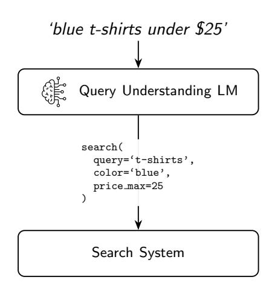
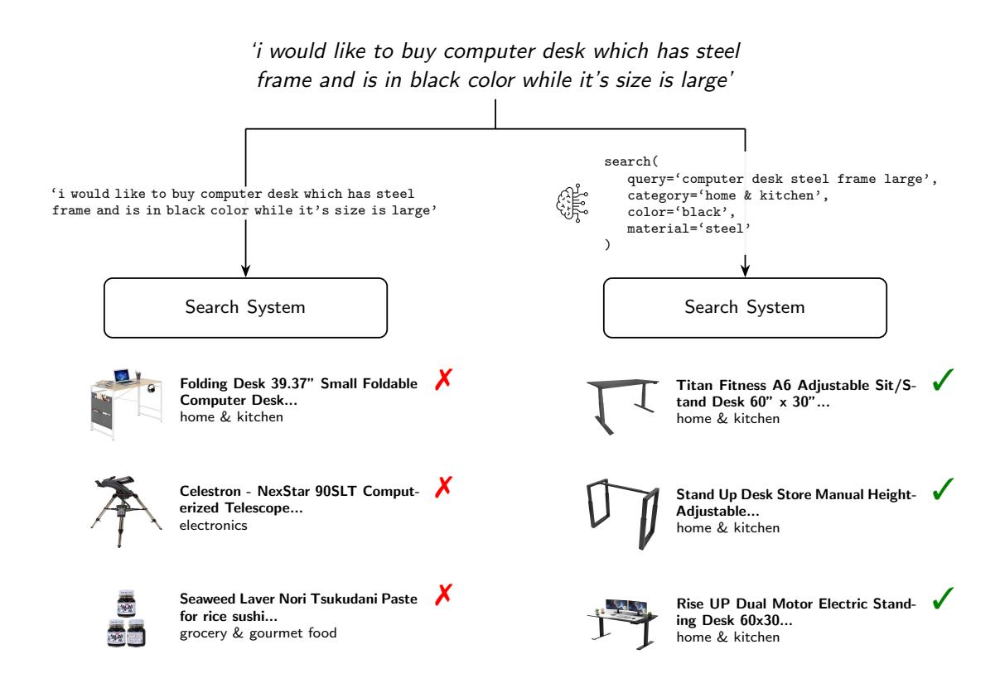

# DispatchQA: A Benchmark for Small Function Calling Language Models in E-Commerce Applications

# Joachim Daiber, Victor Maricato, Ayan Sinha, Andrew Rabinovich Upwork Inc.

{joachimdaiber, ayansinha, andrewrabinovich}@upwork.com victormaricato@cloud.upwork.com

## Abstract

We introduce DispatchQA, a benchmark to evaluate how well *small* language models (SLMs) translate open-ended search queries into executable API calls via explicit *function calling*. Our benchmark focuses on the latency-sensitive e-commerce setting and measures SLMs' impact on both search relevance and search latency. We provide strong, replicable baselines based on Llama 3.1 8B Instruct<sup>1</sup> fine-tuned on s[ynt](#page-0-0)hetically generated data and find that fine-tuned SLMs produce search quality comparable or better than large language models such as GPT-4o while achieving up to 3× faster inference. All data, code, and training checkpoints are publicly released to spur further research on resource-efficient query understandi[ng](#page-0-1).<sup>2</sup>

## 1 Introduction

Natural language search is a cornerstone of modern e-commerce, yet understanding the nuances of user queries remains a significant challenge. Users often use conversational, open-ended language, which may not be well supported by traditional search systems. The recent success of large language models (LLMs) in natural language understanding has opened up new possibilities for interpreting user intent and translating it into precise executable actions. One of the most promising paradigms for this is *function calling*, where a model converts a natural language query into a structured API call that a downstream system can execute.

However, deploying state-of-the-art LLMs in production e-commerce environments presents practical challenges, including latency and cost. Such systems are sensitive to latency (Arapakis et al., 2021), often requiring ≤ 500 ms respon[ses to](#page-6-0) [maintain user engage](#page-6-0)ment (Bai et al., 2017). Small

language models (SLMs), typically ≤ 10B par[ame](#page-6-1)[ters \(Zhou et](#page-6-1) al., 2024), offer a potential solution, but the trade-offs between their [capabilities for call](#page-7-0)ing domain-specific functions and their latency are not yet well understood.

To address this gap, we introduce DispatchQA, a new benchmark designed to evaluate SLMs on their ability to translate natural language ecommerce queries into structured API calls. Unlike existing benchmarks that focus on general-purpose tool use or complex agentic behavior, DispatchQA is tailored to the practical task of query understanding in an e-commerce search context and explicitly includes latency as a core metric. The benchmark comprises:

- 1. A realistic simulation of search within an ecommerce marketplace based on WebShop (Yao et al., 2022a).
- 2. A comprehensive evaluation methodology which measures not only the quality of search [results \(using stand](#page-7-1)ard information retrieval metrics and a validated LLM-as-a-judge system) but also the end-to-end latency of the query understanding process.
- 3. A set of strong, replicable baseline models as well as finetuning recipes for Llama 3.1 8B Instruct (Dubey et al., 2024) to facilitate standardized comparisons.

We advocate for a holistic view of model performance in the market[place search sett](#page-6-2)i[ng, exp](#page-6-2)licitly including inference latency. For instance, our fine-tuned Llama 3.1 8B Instruct model achieves comparable or superior search relevance to top APIbased models, such as OpenAI GPT-4o, while providing better latency and cost trade-offs. These findings demonstrate that specialized SLMs are a good fit for production e-commerce query understanding. By releasing DispatchQA, consisting of

<span id="page-0-0"></span><sup>1</sup>[https://huggingface.co/meta-llama/Llama-3.](https://huggingface.co/meta-llama/Llama-3.1-8B-Instruct) [1-8B-Instruct](https://huggingface.co/meta-llama/Llama-3.1-8B-Instruct)

<span id="page-0-1"></span><sup>2</sup><https://github.com/upwork/dispatchqa>

a validated evaluation bench & training code, as well as trained model checkpoints, we aim to provide a standardized methodology for developing and testing resource-efficient language models in search.

# 2 Related Work

Function calling has emerged as a common formulation for enabling LLMs to interact with external tools and APIs. Toolformer (Schick et al., 2023) demonstrated that LLMs can self-supervise the learning of tool usage by annotating data with function calls during training. Similarly, [ReAct](#page-7-2) (Yao et al., 2022b) introduced a framework that in[terleaves rea](#page-7-2)soning and acting to enable models to perform complex tasks through iterative decisionmaking and tool use. However, many of these approaches largel[y rely on larger mod](#page-7-3)els, making them impractical for latency- or cost-sensitive deployment scenarios like search and e-commerce. Recent work has investigated the viability of SLMs for tool use. TinyAgent (Eldan and Li, 2023) and OpenELM (Mehta et al., 2024) demonstrated that fine-tuned SLMs can match or outperform larger models in specific function-calling tasks, particularly when [paired with curated da](#page-6-3)tasets and external orchestratio[n fram](#page-7-4)eworks. Concurrently, Go[rilla \(Patil et a](#page-7-4)l., 2023) and HuggingGPT (Shen et al., 2023) explored mapping user queries to large sets of APIs, showing that language models can be trained to select and invoke tools with high accuracy.

Our wo[rk complements an](#page-7-6)[d extend](#page-7-5)s this line of research by focusing specifically on query understanding for search and marketplace actions through function calling in SLMs. Unlike prior benchmarks such as WebShop (Yao et al., 2022a) or ToolLLM (Qin et al., 2024), which target agent interaction or general API coverage, we propose a practical domain-specific benchmark aimed at interpreting short, real-world search [queries and](#page-7-1) [mappin](#page-7-1)g them to struct[ured API calls.](#page-7-7)

This domain-specific focus contrasts with general-purpose tool-use evaluations by providing targeted assessment of models' ability to understand and execute e-commerce search tasks, which have distinct characteristics in terms of query patterns, filter requirements, and latency constraints (Ren et al., 2025).

<span id="page-1-0"></span>

Figure 1: Query understanding as function calling: natural language queries are transformed into structured JSON function calls, which are then executed by the search system.

# 3 Search Query Understanding as Function Calling

The task formulation of search query understanding as function calling is illustrated in Figure 1. A user's natural language q[uery and optional](#page-7-8) additional context are fed into a query understanding (QU) model. The model translates the unstructured text into a structured search call, specifying a search query and any other applicable parameters using a structured function schema. The search system then executes this API call to retrieve a ranked list of [pro](#page-1-0)ducts. Although the function calling formulation enables the use of multiple tools,<sup>3</sup> in this paper we focus on a single search tool, since this is the most salient use case in real-world e-commerce marketplaces.

This approach generalizes beyond e-commerce to any domain requiring structured search with filters, such as job search platforms (location, salary, skills), real estate (price, location, property type), or academic literature search (field, p[ubl](#page-1-1)ication date, author).

# 4 Evaluation

To evaluate small language model's query understanding abilities, we propose an applicationbased evaluation methodology. The small language model answers a set of predefined search queries by invoking a standardized search system via a tool

<span id="page-1-1"></span><sup>3</sup> In an e-commerce context, other tools could include searching through FAQs or support articles, or performing various actions on the marketplace.

<sup>4</sup>Product images retrieved from Amazon.com.

<span id="page-2-0"></span>

Figure 2: A side-by-side comparison of a direct search versus a search with a query understanding model.<sup>4</sup>

call for each query. We then use a LLM-as-a-judge system to evaluate search quality. See Figure 2 for an example of the full evaluation process for a single query, showing a baseline search without query understanding on the left and a search using tool calling on the right. LLM-as-a-judge grades are shown next to each search result.

The remainder of this section is structured as follows: First, we will establish that for our task, the LLM-as-a-judge paradigm produces res[ult](#page-2-0)s at comparable reliability to traditional grading performed by trained human judges. Secondly, we provide details on our dataset and evaluation setup. Finally, we present a baseline training recipe for small language models for query understanding.

#### 4.1 Validating the Evaluation

Can we trust the LLM-as-a-judge system to provide a realistic proxy for user experience? While the method is widely used in industry, there are few studies on its reliability in search evaluation (Gu et al., 2025). As it is a core building block of our benchmark, we provide additional validation of the method's reliability for search in this section.

#### Human–LLM Judge Agreement

WANDS dataset The WANDS dataset (Chen et al., 2022) is aimed at evaluating e-commerce

search systems via a collection of expert human judgments. We use a standard LLMas-a-judge setup in which an LLM (OpenAI gpt-4o-2024-08-06) receives each query and product text plus a system prompt instructing it to produce a relevance label (Relevant or Irrelevant[\), as well](#page-6-4) [as an e](#page-6-4)xplanation for its decision. We use Cohen's κ (Landis and Koch, 1977) to measure the chance-corrected agreement between the LLM-as-a-judge system and human judgments from WANDS. Graders followed annotation guidelines to produce three labels: *Exact Match*, *Partial Match*, *Irrelevant*. As most standard [retrieval metrics such](#page-6-5) as NDCG require binary judgments and in order to simplify the task, we choose to use only the two labels *Relevant* and *Irrelevant*. These grading guidelines instruct the graders to grade results that are in the correct general space but miss certain details as *Partial Match*. <sup>5</sup> For example, for a query *green sofa*, red and blue sofas should be labeled as *Partial Match*. For this paper, we are particularly focused on scenarios where [the exactness of the resul](#page-6-6)ts retrieved is important. Hence, we prefer an evaluation in which the judge

<sup>5</sup>Specifically, the WANDS grading guidelines instruct the grader to rate products as a partial match if the "product matches the target entity in the query, but not one or more modifiers."

is as strict as possible.

We sample 5000⟨query,result,grade⟩ triples and filter out *Partial Match* labels (leaving 1891 triples). According to the widely-used Landis and Koch interpretation, κ values above 0.61 indicate substantial agreement (Landis and Koch, 1977). On this subset[, w](#page-3-0)e calculated agreement between machine and human judges at κ = 0.71, demonstrating that our LLM judge is a reliable proxy for human evaluation.

WebShop In addition to the WANDS dataset, we perform blind grading on the WebShop dataset. Two human judges each independently graded the same 100 results from the baseline search system. We then compare these grades against our LLM judge's grades and find that the two human judges have a higher agreement of κ = 0.65 with t[he LLM](#page-6-6) [judge than with e](#page-6-6)ach other (κ = 0.39).

## Takeaways for DISPATCHQA

An off-the-shelf LLM reaches a substantial agreement of κ = 0.71 on the WANDS dataset and κ = 0.65 on WebShop. Hence, we posit that we can safely use this method as an automated judge for large-scale experiments where binary relevance is sufficient. Hence, in the remainder of this paper, we use this binary LLM-as-a-judge system. We provide complete details on the LLM-as-a-judge system in Appendix A.

# 4.2 Dataset

We base our benchmark on the WebShop dataset (Yao et al., 2022a), which is a collection of products in various categories from Amazon.com along with a set of complex instructions. We perform a manual inspection of the product attributes and their value distributions in the dataset and select a subset of attributes to focus on in this paper: price, average product rating, category, country of origin, brand, manufacturer, color, material and style. We normalize (lowercase, remove non-ASCII characters and whitespace) and index the resulting attributes. The resulting search function call schema (see Figure 6) is used for all subsequent experiments in this paper.

#### <span id="page-3-1"></span>4.3 Eva[luation Procedure](#page-7-1)

<span id="page-3-0"></span>We use the binary judgments provided by the LLM[as-a-judge sys](http://www.amazon.com)tem to compute a suite of standard information retrieval metrics (i.e., NDCG, MAP, MRR, Precision and Recall). Appendix A provides definitions for all metrics used. For evaluating latency, our goal is to ensure that results from all

models are comparable. Hence, we run evaluations on a single node with a Nvidia A100-80GB GPU. To ensure models are ready to receive traffic, a set of warm-up queries is executed against each model, and the timings from these requests are discarded during evaluation.

We measure network round-trip latency for the API-based models to be around 15ms (measured via TCP connection establishment time, see Appendix D). For both local open and [re](#page-12-0)mote closed models, it is challenging to fully account for side effects such as caching in various components. We attempt to mitigate this issue as follows. For closed models, we re-ran API experiments several weeks apart and found no significant variance. For local open models, all experiments reported in this paper were executed on a freshly provisioned Kubernetes node.

### 4.4 Search System & Baseline Models

To simulate realistic search systems, we use the Pyserini toolkit (Lin et al., 2021), which provides the ability to create search systems using repeatable explicit recipes. For our experiments, we use a traditional BM25 search system based on Apache Lucene. The search system indexes all 1.18M documents from the WebShop dataset including our normalized product attributes defined in Section 4.2.

We fine-tune a small language model (Llama 3.1 8B Instruct) both via LoRA and via direct finetuning. As training data for this model, we use a synthetic, task-specific training dataset of 1000 examples. The data generation process, detailed in Appendix A, uses a large teacher model (OpenAI gpt-4o-2024-08-06) in a two-step process. First, for a given product sampled from the Web-Shop dataset, the teacher model generates a realistic, natural language search query. Next, the model generates the corresponding structured function call with its parameters. This process yields a high-quality dataset of ⟨query,function call⟩ pairs tailored to e-commerc[e search. Note th](#page-6-7)at while our evaluation uses WebShop for consistency with prior work, the synthetic training data generation approach can be adapted to other product catalogs such as WANDS for domain-specific applications.

<sup>6</sup>Local models use SGLang with *[Outlin](#page-3-1)es* grammar and do not repeat the schema in the prompt while closed models repeat the schema in the prompt; see following tables for discussion of these hyperparamters. Best values in bold.

<span id="page-4-1"></span>

| System                                   | NDCG@10 | MAP@10 | MRR@10 | R@10 | P@10 | P50 Latency (ms) |
|------------------------------------------|---------|--------|--------|------|------|------------------|
| Baseline                                 | 0.24    | 0.18   | 0.19   | 0.38 | 0.13 | 8                |
| Closed models (GPT-4 family)             |         |        |        |      |      |                  |
| GPT-4o                                   | 0.32    | 0.24   | 0.27   | 0.49 | 0.18 | 593              |
| GPT-4o mini                              | 0.32    | 0.25   | 0.26   | 0.51 | 0.19 | 672              |
| GPT-4.1 nano                             | 0.37    | 0.30   | 0.31   | 0.54 | 0.22 | 496              |
| Closed reasoning models (GPT-5 family)   |         |        |        |      |      |                  |
| GPT-5                                    | 0.37    | 0.29   | 0.31   | 0.55 | 0.24 | 11470            |
| GPT-5 mini                               | 0.35    | 0.28   | 0.31   | 0.50 | 0.22 | 6836             |
| GPT-5 nano                               | 0.36    | 0.29   | 0.31   | 0.55 | 0.21 | 5576             |
| Small local models                       |         |        |        |      |      |                  |
| Llama 3.1 8B Instruct (SGLang)           | 0.32    | 0.24   | 0.27   | 0.50 | 0.20 | 284              |
| Llama 3.1 8B Instruct Fine-tune (SGLang) | 0.33    | 0.25   | 0.26   | 0.51 | 0.21 | 313              |
| Llama 3.1 8B Instruct LoRA (SGLang)      | 0.35    | 0.26   | 0.27   | 0.57 | 0.20 | 321              |
| DeepSeek R1 Distill Qwen 1.5B (SGLang)   | 0.24    | 0.18   | 0.20   | 0.40 | 0.13 | 694              |
| Qwen3 0.6B (SGLang)                      | 0.25    | 0.19   | 0.20   | 0.41 | 0.14 | 586              |
| Gemma 3 4B IT (SGLang)                   | 0.33    | 0.26   | 0.28   | 0.52 | 0.21 | 495              |

Table 1: DispatchQA comparison of closed LLMs and smaller, specialized models. "Baseline" means the system performs *no query understanding* (raw query sent directly to BM25 search system).<sup>6</sup>

## 5 Results

Table 1 presents evaluation results for a set of commercial LLM APIs as well as smaller, fine-tuned language models. The results show that SLMs provide a valuable alternative to LLM APIs for this task. GPT-4o although supposedly much larger than GPT-4o mini does not provide quality advantages for this task. GPT-4.1 nano (with 128K context) offers the highest quality but at similar latency to other API models. Overall, we find that SLMs (specifically, Llama 3.1 8B Instruct), especially with task-specific finetuning, perform on par with GPT-4o in terms of quality, with latency improvements of up to 2x. While we found Gemma 4B to produce results on par with the Llama 8B instruct model, we found both Gemma and Qwen-based models to exhibit high latency in SGLang. The significa[nt l](#page-4-1)atency improvements possible with local Llama models over closed model API calls highlight the importance of considering both model size and deployment infrastructure when optimizing for production use cases.

<span id="page-4-2"></span><span id="page-4-0"></span>Our benchmark enables us to perform detailed

comparisons of the various choices required when training and deploying SLMs. Hence, in the remainder of this section, we will discuss the key variables impacting latency and model quality in more detail. We found the following dimensions to be most impactful: (1) The structured decoding strategy (i.e., how to enforce the function schema on the LM), including various implementations of structured decoding, (2) subtle usage differences, for instance, the inclusion of the JSON schema within the prompt.

#### 5.1 Structured Decoding Strategies

Large language models generate text autoregressively, producing one token at a time, and can be decoded with deterministic methods such as greedy or beam search (Vaswani et al., 2017; Bahdanau et al., 2015), or with stochastic sampling approaches like top-k, nucleus (top-p), or contrastive search (Holtzman et al., 2019; Su and Collier, 2022). Because autoregressive token-by-token generation provides no built-in guarantee that the output will obey a required structure (e.g., a function name and its arguments in JSON format), we

| System                                                        | NDCG@10              | MAP@10               | MRR@10               | R@10                 | P@10                 | P50 Latency (ms)  |
|---------------------------------------------------------------|----------------------|----------------------|----------------------|----------------------|----------------------|-------------------|
| Baseline                                                      | 0.24                 | 0.18                 | 0.19                 | 0.38                 | 0.13                 | 7                 |
| SGLang (XGrammar)<br>SGLang (Outlines)<br>SGLang (LLGuidance) | 0.33<br>0.33<br>0.30 | 0.25<br>0.25<br>0.24 | 0.26<br>0.26<br>0.24 | 0.51<br>0.51<br>0.47 | 0.21<br>0.21<br>0.20 | 206<br>313<br>210 |
| JSONformer                                                    | 0.26                 | 0.21                 | 0.23                 | 0.38                 | 0.17                 | 5221              |

Table 2: Structured decoding for Llama 3.1 Finetune, executed locally without schema in prompt.

<span id="page-5-3"></span>

| System                                     | NDCG@10 | MAP@10 | MRR@10 | R@10 | P@10 | P50 Latency (ms) |
|--------------------------------------------|---------|--------|--------|------|------|------------------|
| Baseline                                   | 0.24    | 0.18   | 0.19   | 0.38 | 0.13 | 7                |
| GPT-4o mini, schema in prompt              | 0.32    | 0.25   | 0.26   | 0.51 | 0.19 | 672              |
| GPT-4o mini, no schema in prompt           | 0.29    | 0.23   | 0.24   | 0.47 | 0.18 | 817              |
| Llama 3.1 8B Instruct, schema in prompt    | 0.29    | 0.23   | 0.24   | 0.44 | 0.18 | 421              |
| Llama 3.1 8B Instruct, no schema in prompt | 0.32    | 0.24   | 0.27   | 0.50 | 0.20 | 284              |
| Llama 3.1 8B LoRA, schema in prompt        | 0.23    | 0.18   | 0.21   | 0.34 | 0.15 | 447              |
| Llama 3.1 8B LoRA, no schema in prompt     | 0.35    | 0.26   | 0.27   | 0.57 | 0.20 | 321              |

Table 3: Comparison of system performance with and without JSON schema included in the prompt. Local models run on SGLang with Outlines grammar.

evaluate schema-guided decoding frameworks such as SGLang (Zheng et al., 2024) and JSONformer,<sup>7</sup> which each add their own constrained-decoding layer to keep every token inside a user-supplied schema (see Table 2). We found JSONformer to be slow and produce low relevance results, most likely due to the complexity of our search schema in combination with JSONformer's approach to constraining generation at each token. We observed a median latency of 5221ms–25× slower than SGLang implementations–while also degra[ding search qual](#page-7-9)[ity \(0](#page-7-9)[.26 NDCG@10 vs. 0.3](#page-6-8)3 for SGLang variants). SGLang provides efficient implementations of three structured decodi[ng algorithms: XGram](#page-6-9)[mar \(Dong et al](#page-7-10)., [202](#page-7-10)4), Outlines<sup>8</sup> and LLguidance.<sup>9</sup> We found SGLang to consistently provide high-quality, low latency local structured decoding.

#### 5.2 Structured Decoding Instructions

We also observed that seemingly subtle usage differences [can have a significan](#page-7-11)t impact on both l[a](#page-5-0)tency and prediction quality. The most salient variable we found was whether or not to repeat the full JSON schema in th[e p](#page-4-2)rompt in addition to its usage in delimiting the model's search space. Table 3 shows how results from three systems change based on this parameter. All Llama models are served locally via SGLang using Outlines for structured decoding. We found that while including the full schema in the prompt increases search latency, it provides minor improvements in search quality for closed models. For small local models, repeating the full search schema in the prompt has detrimental effects on quality and latency. Task-s[pecific](#page-6-10) [fine-tuning m](#page-6-10)ay serve [as](#page-5-1) a way to internali[ze](#page-5-2) this knowledge within the model without incurring additional inference latency.

# 6 Conclusion

We introduced DispatchQA, a targeted benchmark that jointly measures search relevance and end-to-end latency for small function-calling language models in search applications. By pairing this self-contained evaluation tool with a validated LLM-as-a-jud[ge](#page-5-3) protocol, DispatchQA offers a repeatable methodology for research in resource-efficient query understanding. Experiments show that fine-tuned small language models models rival or surpass commercial GPT-4-class APIs on relevance while cutting median latency by 2–4x. We also quantify the impact of constrained decoding, as well as other training and inference choices on the quality–speed tradeoff of such models. We release data, code, and checkpoints to encourage future work on faster, schema-aware function calling for search.

# Limitations

The work presented in this paper has several limitations:

- To keep this paper focused, we only fine-tuned one base SLM and compared a limited number of closed LLM APIs. We aim to evaluate more systems in future work.
- We are focused particularly on the narrow domain of e-commerce. Our dataset is based on the WebShop dataset, which in turn is based on Amazon.com. Hence, without further evaluation, results and learnings should not be transferred to other domains.
- While no models in our benchmark are language-specific, since we use the queries from the WebShop dataset, which are in English, all results in this paper and the DispatchQA benchmark itself should not be gen-

<span id="page-5-0"></span><sup>7</sup><https://github.com/1rgs/jsonformer>

<span id="page-5-1"></span><sup>8</sup><https://dottxt-ai.github.io/outlines/>

<span id="page-5-2"></span><sup>9</sup><https://github.com/guidance-ai/llguidance>

- eralized to other languages without further evaluation.
- Our benchmark relies on data from the Web-Shop dataset, which exhibits a degree of noise and variability due to its collection process. Although we believe this does not negate our benchmark's utility for evaluating model performance, this limitation constrains the benchmark's reliability to some extent. Future iterations will include additional datasets to improve coverage and data quality.
- We replicated latency measurements multiple times to ensure stability; nevertheless, achieving fully consistent and reproducible latency estimates remains inherently challenging due to fluctuations in hardware performance, network conditions, and system-level caching effects and some residual variance may therefore persist.

## References

- Ioannis Arapakis, Souneil Park, and Martin Pielot. 2021. Impact of response latency on user behaviour in mobile web search. In *Proceedings of the 2021 Conference on Human Information Interaction and Retrieval*, CHIIR '21, page 279–283. ACM.
- Dzmitry Bahdanau, Kyunghyun Cho, and Yoshua Bengio. 2015. Neural machine translation by jointly learning to align and translate. In *3rd International Conference on Learning Representations, ICLR 2015, San Diego, CA, USA, May 7-9, 2015, Conference Track Proceedings*.
- Xiao Bai, Ioannis Arapakis, B. Barla Cambazoglu, and Ana Freire. 2017. Understanding and leveraging the impact of response latency on user behaviour in web search. *ACM Trans. Inf. Syst.*, 36(2).
- Yan Chen, Shujian Liu, Zheng Liu, Weiyi Sun, Linas Baltrunas, and Benjamin Schroeder. 2022. Wands: Dataset for product search relevance assessment. In *Proceedings of the 44th European Conference on Information Retrieval*.
- Yixin Dong, Charlie F Ruan, Yaxing Cai, Ruihang Lai, Ziyi Xu, Yilong Zhao, and Tianqi Chen. 2024. Xgrammar: Flexible and efficient structured generation engine for large language models. *Proceedings of Machine Learning and Systems 7*.
- <span id="page-6-0"></span>Abhiman[yu Dubey, Abhinav Jauhri, Abhinav Pandey,](https://doi.org/10.1145/3406522.3446038) [Abhishek Kadian, Ahmad Al-Da](https://doi.org/10.1145/3406522.3446038)hle, Aiesha Letman, Akhil Mathur, Alan Schelten, Amy Yang, Angela Fan, Anirudh Goyal, Anthony Hartshorn, Aobo Yang, Archi Mitra, Archie Sravankumar, Artem Korenev,

- <span id="page-6-8"></span>Arthur Hinsvark, Arun Rao, Aston Zhang, and 82 others. 2024. T[he llama 3 herd of models.](http://arxiv.org/abs/1409.0473) *CoRR*, [abs/2407.21783.](http://arxiv.org/abs/1409.0473)
- Ronen Eldan and Yuanzhi Li. 2023. TinyStories: How small can language models be and still speak coherent english? *arXiv preprint arXiv:2305.07759*.
- <span id="page-6-1"></span>Jiawei Gu, Xuhui Jiang, [Zhichao Shi, Hexiang Tan,](https://doi.org/10.1145/3106372) [Xuehao Zhai, Chengjin Xu, Wei Li, Yinghan Shen,](https://doi.org/10.1145/3106372) [Shengjie Ma, Honghao L](https://doi.org/10.1145/3106372)iu, Saizhuo Wang, Kun Zhang, Yuanzhuo Wang, Wen Gao, Lionel Ni, and Jian Guo. 2025. A survey on llm-as-a-judge. *Preprint*, arXiv:2411.15594.
- <span id="page-6-5"></span>Ari Holtzman, Jan Buys, Maxwell Forbes, and Yejin Choi. 2019. The curious case of neural text degeneration. *CoRR*, abs/1904.09751.
- <span id="page-6-10"></span>Kalervo Jarvelin and Jaana Kek ¨ al¨ ainen. 2002. Cu- ¨ mulated gain-based evaluation of ir techniques. *ACM Transactions on Information Systems (TOIS)*, 20(4):422–446.
- J. Richard Landis and Gary G. Koch. 1977. The measurement of observer agreement for categorical data. *Biometrics*, 33(1).
- <span id="page-6-2"></span>Jimmy Lin, Xueguang Ma, Sheng-Chieh Lin, Jheng-Hong Yang, Ronak Pradeep, and Rodrigo Nogueira. 2021. Pyserini: A Python toolkit for reproducible information retrieval research with sparse and dense representations. In *Proceedings of the 44th Annual International ACM SIGIR Conference on Research and Devel[opment in Information Retrieva](https://doi.org/10.48550/arXiv.2407.21783)l (SIGIR 2021)*, pages 2356–2362.
- <span id="page-6-3"></span>Sachin Mehta, Mohammad Hossein Sekhavat, [Qingqing](https://doi.org/10.48550/arXiv.2305.07759) [Cao, Maxwell Horton, Yanzi Jin, Chenfan Sun, Iman](https://doi.org/10.48550/arXiv.2305.07759) [Mirzadeh, Mahyar Najibi, Dmitry](https://doi.org/10.48550/arXiv.2305.07759) Belenko, Peter Zatloukal, and Mohammad Rastegari. 2024. OpenELM: An efficient language model family with open-source training and inference framework. *arXiv preprint arXiv:2404.14619*.
- <span id="page-6-4"></span>Shishir G. Patil, Tianjun Zhang, Xin Wang, and Joseph E. Gonzalez. 2023. [Gorilla: Large language](https://arxiv.org/abs/2411.15594) [model](https://arxiv.org/abs/2411.15594) connected with massive APIs. *arXiv preprint arXiv:2305.15334*.
- <span id="page-6-11"></span><span id="page-6-9"></span>Yujia Qin, Shih[ao Liang, Yining Ye, Kunlun Zhu, Lan](https://arxiv.org/abs/1904.09751) [Yan, Yaxi L](https://arxiv.org/abs/1904.09751)u, Yankai Lin, Xin Cong, Xiangru Tang, Bill Qian, Sihan Zhao, Lauren Hong, Runchu Tian, Ruobing Xie, Jie Zhou, Mark Gerstein, dahai li, Zhiyuan Liu, and Maosong Sun. 2024. ToolLLM: Facilitating large language models to master 16000+ real-world APIs. In *The Twelfth International Conference on Learning Representations*.
- <span id="page-6-6"></span>Zhaochun Ren, Xiangnan He, Dawei Yin, and Maarten de Rijke. 2025. Information discovery in ecommerce. *Preprint*, arXiv:2410.05763.
- <span id="page-6-7"></span>Timo Schick, Jane Dwivedi-Yu, Roberto Dess`ı, Roberta Raileanu, Maria Lomeli, Eric Hambro, Luke Zettlemoyer, Nicola Cancedda, and Thomas Scialom. 2023.

- <span id="page-7-11"></span><span id="page-7-3"></span>Toolformer: Language models can teach themselves to use tools. In *Advances in Neural Information Processing Systems 37 (NeurIPS 2023)*.
- <span id="page-7-4"></span>Yongliang Shen, Kaitao Song, Xu Tan, Dongsheng Li, Weiming Lu, and Yueting Zhuang. 2023. Hugging-GPT: Solving ai tasks with ChatGPT and its friends in Hugging Face. *arXiv preprint arXiv:2303.17580*.
- Yixuan Su and Nigel Collier. 2022. Contrastive search is what you need for neu[ral text generation.](https://doi.org/10.48550/arXiv.2404.14619) *CoRR*, [abs/2210.14140.](https://doi.org/10.48550/arXiv.2404.14619)
- <span id="page-7-5"></span><span id="page-7-0"></span>A[shish Vaswani, Noam Shazeer, N](https://doi.org/10.48550/arXiv.2404.14619)iki Parmar, Jakob Uszkoreit, Llion Jones, Aidan N. Gomez, Lukasz Kaiser, and Illia Polosukhin. 2017. Attention is all you need. In *Advances in Ne[ural Information Pro](https://doi.org/10.48550/arXiv.2305.15334)[cessing Systems 30: Annual Conference on](https://doi.org/10.48550/arXiv.2305.15334) Neural Information Processing Systems 2017, December 4-9, 2017, Long Beach, CA, USA*, pages 5998–6008.
- <span id="page-7-7"></span>Shunyu Yao, Howard Chen, John Yang, and Karthik Narasimhan. 2022a. Webshop: Towards scalable real-world web interaction with grounded language agents. In *Advances in Neural Information Processing Systems*[, volume 35, pages 20744–20757. Curran](https://openreview.net/forum?id=dHng2O0Jjr) [Associates, Inc.](https://openreview.net/forum?id=dHng2O0Jjr)
- <span id="page-7-8"></span>Shunyu Yao, Jeffrey Zhao, Dian Yu, Nan Du, Izhak Shafran, Karthik Narasimhan, and Yuan Cao. 2022b. ReAct: Synergizing reasoni[ng and acting in language](https://arxiv.org/abs/2410.05763) [models.](https://arxiv.org/abs/2410.05763) *arXiv preprint arXiv:2210.03629*.
- <span id="page-7-2"></span>Lianmin Zheng, Liangsheng Yin, Zhiqiang Xie, Chuyue Sun, Jeff Huang, Cody Hao Yu, Shiyi Cao, Christos Kozyrakis, Ion Stoica, Joseph E. Gonzalez, Clark Barrett, and Ying Sheng. 2024. Sglang: Efficient [execution of structured language model programs. In](https://doi.org/10.48550/arXiv.2302.04761) *Advances in Neural Information Processing Systems*, volume 37, pages 62557–62583. Curran Associates, Inc.
- <span id="page-7-10"></span><span id="page-7-9"></span><span id="page-7-6"></span><span id="page-7-1"></span>Zhengping Zhou, Lezhi Li, Xinxi Chen, and Andy Li. 2024. [Mini-giants: "small" language models and](https://doi.org/10.48550/arXiv.2303.17580) [open source win-win.](https://doi.org/10.48550/arXiv.2303.17580) *Preprint*, arXiv:2307.08189.

## Appendix A: LLM-as-a-Judge

For automated evaluation of search result relevance, an LLM-as-a-judge system is employed. This system uses a large language model to provide reproducible binary relevance assessments ("Relevant" or "Irrelevant") for a given query and product pair.

The system takes a user query and product information as input. The LLM is guided by a specific system prompt describing criteria to evaluate the candidate products and the original query. We then restrict the model to return its assessment in a structured JSON format.

System Prompt The LLM is provided with the following system prompt to instruct it on its task and the expected behavior used in this paper (Figure 3).

This prompt [cle](#page-8-0)arly defines the LLM's role, the classification task, the required output format, and the definitions for "Relevant" and "Irrelevant" to guide its decision-making process.

Output JSON Schema The LLM is required to output its assessment in a JSON object that adheres to the structure in Figure 4.

This schema ensures that the output is machinereadable and contains both the categorical judgment and a human-readable explanation. The ju[dgm](#page-8-1)ent field must be one of the two specified string literals, and the explanation field provides context for the judgment.

To ensure consistent and deterministic output, the LLM generation process is configured with minimal randomness (i.e., setting a low temperature, τ = 0).

Metrics From the binary relevance labels (where *rel<sup>i</sup>* = 1 if item *i* is relevant, 0 otherwise), we calculate standard information retrieval metrics for the top *k* = 10 results over a set of queries *Q*. Let *r* be the rank of a retrieved document, *R* be the set of all relevant documents for a query, and *r<sup>i</sup>* be the number of relevant documents at rank *i*.

## • NDCG@k (Normalized Discounted Cumu-

<span id="page-8-0"></span>You are an expert relevance judge for an e-commerce search engine. Your task is to assess whether the given product is relevant to the user's query. Classify the product's relevance into one of two categories: Relevant or Irrelevant. Provide a brief explanation for your judgment.

```
You MUST respond in JSON format. The JSON object should have two keys:
1. "judgment": A string, which must be one of "Relevant", or "Irrelevant".
2. "explanation": A string, containing a concise reason for your judgment.
Example response:
{
  "judgment": "Relevant",
  "explanation": "The product is a good match for the user's needs."
}
```

#### Relevance Categories:

- Relevant: The product addresses the user's query and would likely be useful. This includes perfect matches and also items that are related and might be useful even if not a perfect match.
- Irrelevant: The product is not relevant to the user's query.

Figure 3: LLM judge system prompt.

```
{
  "judgment": "<string: 'Relevant' or 'Irrelevant'>",
  "explanation": "<string: textual explanation for the judgment>"
}
```

Figure 4: LLM judge response format.

**lative Gain):** Measures ranking quality, giving more weight to relevant items at higher ranks (Järvelin and Kekäläinen, 2002).

$$DCG@k = \sum_{i=1}^{k} \frac{rel_i}{\log_2(i+1)}$$

$$NDCG@k = \frac{DCG@k}{IDCG@k}$$

where IDCG@k is the DCG score of an ideal ranking.

 MAP@k (Mean Average Precision): The mean of Average Precision (AP) scores over all queries. AP is the average of precision scores computed after each relevant document is retrieved.

$$\begin{aligned} \mathbf{AP@k} &= \frac{\sum_{i=1}^{k} P(i) \times rel_i}{|R|} \\ \mathbf{MAP@k} &= \frac{1}{|Q|} \sum_{q \in Q} (\mathbf{AP@k})_q \end{aligned}$$

where P(i) is the precision at rank i.

• MRR@k (Mean Reciprocal Rank): The average of the reciprocal of the rank of the first relevant item.

$$\mathsf{MRR@k} = \frac{1}{|\mathcal{Q}|} \sum_{q \in \mathcal{Q}} \frac{1}{\mathsf{rank}_q}$$

where  $rank_q$  is the rank of the first relevant result for query q.

• **Precision@k:** The fraction of retrieved items in the top *k* that are relevant.

Precision@k = 
$$\frac{1}{k} \sum_{i=1}^{k} rel_i$$

• **Recall@k:** The fraction of all relevant items that are retrieved in the top *k*.

$$Recall@k = \frac{\sum_{i=1}^{k} rel_i}{|R|}$$

# **Appendix B: Small Function Calling LLM Baselines**

#### **A Synthetic Training Data Generation**

We distill task-specific supervision from a large *teacher* model (OpenAI gpt-4o-2024-08-06) into compact student models. This process is designed to generate high-quality, realistic (query, function-call) pairs for fine-tuning. This section outlines the end-to-end data generation pipeline and provides the exact prompts used.

Neighborhood-based sampling Instead of generating a query for a single product in isolation, we use a neighborhood-based sampling strategy to create more contextually rich and diverse training data. This method encourages the teacher model to generate queries that target a coherent group of similar items. The process is as follows:

- Product Loading and Embedding: Products are loaded from the WEBSHOP dataset (1.18M items). We compute semantic embeddings for each product's textual description using the all-MiniLM-L6-v2 sentence transformer model.
- 2. **Neighborhood Sampling:** For each training example, we randomly select a seed product for the k-Nearest Neighbors search. We then find its 10 nearest neighbors using cosine similarity in their embeddings. This group of 11 related products forms a "neighborhood."
- 3. **Neighborhood Analysis:** For the group of 11 products, we perform a statistical analysis of their metadata. Counting the frequency of each explicit product attribute (e.g., "waterproof", "organic") and each product option (e.g., for the "Color" option, it counts occurrences of "Red", "Blue", etc.). This produces a summary of the neighborhood's most common characteristics.
- 4. **Teacher Query and Function-Call Synthesis:** An analysis summary of the neighborhood, including its most common attributes and sample product descriptions, is provided to the teacher model. The model is prompted to generate both a natural-language query and a structured JSON object containing relevant search parameters (facets) that a user might implicitly intend. This yields a complete pair (query, function-call). We set the teacher model at temperature 0.7 and constrain its generation to a reasonable length, yielding queries such as "looking for a compact drip coffee maker for one person".

The full prompt is provided in Figure 5. Long product descriptions are truncated and any fields not required for fine-tuning are omitted. This entire process is repeated with a fixed random seed, to ensure reproducibility and 1000 unique training instances are generated.

```
[System Prompt]
You are generating realistic e-commerce search queries with appropriate
search parameters based on product neighborhoods.
Available search schema facets:
{schema_info}
Your task:
1. Generate a natural, conversational search query (5-15 words)
2. Select appropriate search parameters from the schema that match the
   query intent
Guidelines for queries:
- Use everyday language ("I need", "looking for", "want")
- Focus on customer needs and use cases
- Sound like real customer searches
- Avoid technical jargon unless commonly searched
Guidelines for search parameters:
- Only include search_params fields that are relevant to the query.
Respond with JSON in this format:
{
  "query": "natural search query here",
  "search_params": {
        "color": "color if mentioned/relevant",
        "price_min": number,
        "price_max": number,
        "material": "material if relevant",
        "style": "style if relevant"
  }
}
Only include search_params fields that are actually relevant to the query.
Most queries should have 1-2 facets at most.
[User Prompt]
Product neighborhood analysis:
{{NEIGHBORHOOD_SUMMARY}}
Generate a natural search query and appropriate search parameters:
```

Figure 5: System and user prompt structure for the teacher model using neighborhood-based sampling. The {{NEI[GHB](#page-12-0)ORHOOD SUMMARY}} placeholder is replaced with an analysis of the sampled product group.

## B Model Training

Fine-tuning procedure Training uses standard next-token cross-entropy on 1000 chat-formatted synthetically generated (query, function-call) pairs. We update either all parameters or rank–8 LoRA adapters (*r*=8, α=32, dropout 0.05) for 500 steps with the AdamW optimizer and a linear learningrate decay. Batches are padded to the longest sequence within the model's context window.

## Appendix C: Dataset Schema

Figure 6 shows the JSON schema used in DispatchQA.

# Appendix D: API Network Latency Measurement

To provide a comprehensive understanding of the latency characteristics of the evaluated systems, we conducted a systematic measurement of network latency to the API endpoints used in our experiments. This measurement isolates the pure network connectivity latency from the overall inference latency reported in the main results.

Measurement Methodology Network latency was measured using TCP connection establishment time to the API endpoints. All measurements were timed in the same instance where the experiments were executed, located at AWS's us-west-2 region. For each API endpoint, we established 100 independent TCP connections and measured the time from socket creation to successful connection

|        | Mean | P50  | P95  | P99  | Min  | Max  |  |
|--------|------|------|------|------|------|------|--|
| API    |      |      |      |      |      |      |  |
| OpenAI | 15.1 | 14.9 | 17.3 | 23.4 | 12.0 | 26.3 |  |

<span id="page-11-0"></span>Table 4: Network Latency Comparison (in milliseconds)

establishment. This approach captures the fundamental network round-trip time plus connection overhead, providing the minimum possible latency for any API request.

This methodology provides a lower bound on API request latency, as it excludes HTTP protocol overhead, request/response serialization, and actual model inference time. The results represent the irreducible network latency component that affects all API-based experiments.

```
"$schema": "http://json-schema.org/draft-07/schema#",
"title": "E-commerce Product Search",
"name": "product_search",
"description": "A schema for searching products using a free-text query and a set of filters.",
"type": "object",
"properties": {
  "query": {
    "type": "string",
    "description": "The free-form text query to search for products."
  },
  "price_min": {
    "type": "number",
    "description": "The minimum price."
  },
  "price_max": {
    "type": "number",
    "description": "The maximum price."
  },
  "average_rating_min": {
    "type": "number",
    "minimum": 0,
    "maximum": 5,
    "description": "The minimum average rating (0-5)."
  },
  "average_rating_max": {
    "type": "number",
    "minimum": 0,
    "maximum": 5,
    "description": "The maximum average rating (0-5)."
  },
  "category": {
    "type": "string",
    "description": "The top-level category of the product.",
    "enum": [
      "amazon devices & accessories",
      "toys & games",
      "video games"
  },
  "country_of_origin": {
    "type": "string",
    "description": "The country of origin of the product.",
    "enum": [
      "afghanistan",
      "yemen",
      "zimbabwe"
  },
  "brand": {
    "type": "string",
    "description": "A search query for the product's brand."
  },
  "manufacturer": {
    "type": "string",
    "description": "A search query for the product's manufacturer."
  },
  "color": {
    "type": "string",
    "description": "The color of the product. Constrained to a list of known, common colors.",
    "enum": [
      "amber",
      "wine red",
      "yellow"
  },
  "material": {
    "type": "string",
    "description": "A search query for the product's material."
  },
  "style": {
    "type": "string",
    "description": "A search query for the product's style."
  }
},
"required": [
  "query"
],
"additionalProperties": false
```

{

}

Figure 6: Search tool JSON schema for DispatchQA.