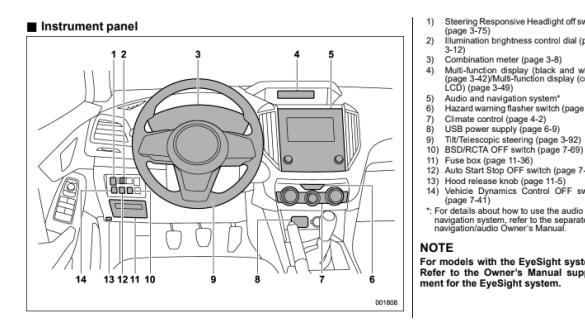
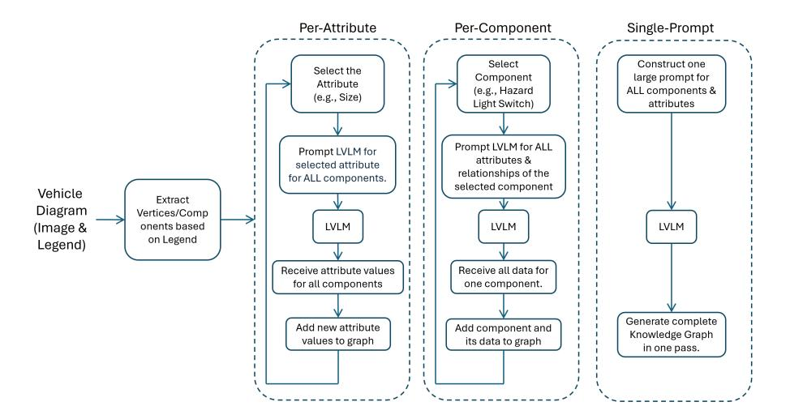
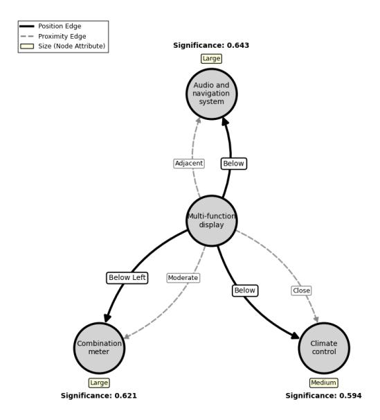
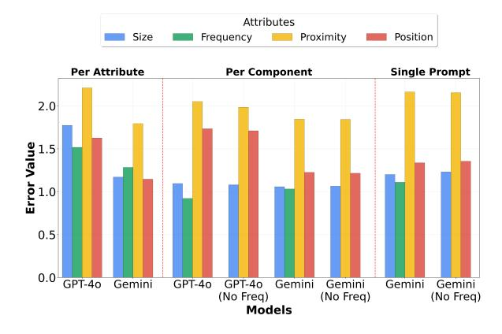
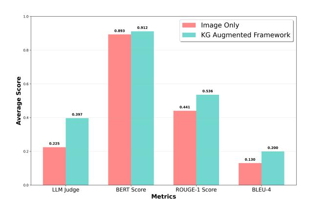
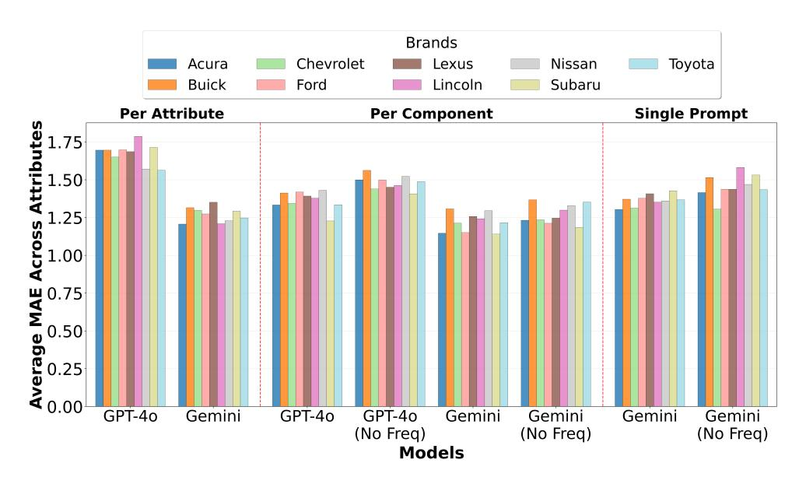

# Generating Spatial Knowledge Graphs from Automotive Diagrams for Question Answering

Steve Bakos<sup>1</sup> , Chen Xing<sup>2</sup> , Heidar Davoudi<sup>1</sup> , Aijun An<sup>2</sup> , Ron DiCarlantonio<sup>3</sup>

<sup>1</sup>Ontario Tech University, Oshawa, Canada <sup>2</sup>York University, Toronto, Canada 3 Inago Co, Toronto, Canada steven.bakos@ontariotechu.net, heidar.davoudi@ontariotechu.ca {xingche1, aan}@yorku.ca, rond@inago.com

### Abstract

Answering "Where is the X button?" with "It's next to the Y button" is unhelpful if the user knows neither location. Useful answers require obvious landmarks as a reference point. We address this by generating from a vehicle dashboard diagram a spatial knowledge graph (SKG) that shows the spatial relationship between a dashboard component and its nearby landmarks and using the SKG to help answer questions. We evaluate three distinct generation pipelines (Per-Attribute, Per-Component, and a Single-Prompt baseline) to create the SKG using Large Vision-Language Models (LVLMs). On a new 65-vehicle dataset, we demonstrate that a decomposed Per-Component pipeline is the most effective strategy for generating a high-quality SKG; the graph produced by this method, when evaluated with a novel *Significance* score, identifies landmarks achieving 71.3% agreement with human annotators. This work enables downstream QA systems to provide more intuitive, landmark-based answers.

### 1 Introduction

A driver asks their in-car virtual assistant, "Where is the Vehicle Stability Assist button?" A system reliant on direct visual parsing might reply, "It is to the right of the Lane Keeping Assist button." While technically correct, this answer is useless if the driver is unfamiliar with the referenced "Lane Keeping Assist button." The response fails because its anchor, or landmark, is not a point of common reference. A truly helpful response must be grounded in a chain of easily recognizable landmarks, such as, "It is to the left of the hazard lights, just below the central air vents."

This "useless reference" problem reveals two core weaknesses in naively applying Large Vision-Language Models (LVLMs) [\(OpenAI,](#page-8-0) [2023;](#page-8-0) [Liu](#page-7-0) [et al.,](#page-7-0) [2023\)](#page-7-0) to this task. The first is identifying which components are salient enough to serve as

<span id="page-0-0"></span>

Figure 1: Example dashboard diagram from the 2023 Subaru Crosstrek Owner's Manual, illustrating component labels and pointers. © Subaru Corporation. Used under fair use for research and educational purposes.

effective landmarks. The second, more fundamental issue, is the known inaccuracy of LVLMs in discerning precise spatial relationships from complex images like technical diagrams [\(Pan et al.,](#page-8-1) [2024\)](#page-8-1). To provide intuitive and correct spatial answers, a system requires a more structured understanding of the scene. We address both issues by generating a Spatial Knowledge Graph (SKG), which explicitly maps components and their spatial relationships, and then programmatically identifies the most significant components to use as landmarks. Furthermore, a scalable system cannot rely on a hardcoded list of universal landmarks like "steering wheel," as these may not always be present or labeled in every diagram (Figure [1\)](#page-0-0). The system must instead learn to identify the best possible landmarks from only the components provided in a specific diagram's legend.

This task is complicated by technical hurdles, most notably the constrained output token windows of many powerful Large Vision-Language Models (LVLMs). A naive attempt to generate a knowledge graph in a single query would often exceed these limits. This token constraint directly motivated our development of decomposed generation pipelines as a more robust alternative. This paper evaluates these decomposed pipelines against

a single-prompt baseline to find the most effective method for generating a high-quality SKG capable of answering location questions effectively. The robustness of these methods across various diagrammatic styles from different manufacturers is also a key point of analysis.

The key contributions of this work are:

- We design and evaluate two decomposed, zero-annotation pipelines (Per-Attribute and Per-Component) against a Single-Prompt baseline, created to handle the output token limitation problem.
- We introduce and validate a novel, algorithmically-derived *Significance* score, designed to programmatically identify the most salient components from the generated graph to serve as landmarks for the downstream QA task.
- We create a new, comprehensive evaluation dataset, containing 15,852 human-annotated spatial relationships from the dashboards of 65 vehicles across 9 manufacturers, chosen specifically to test robustness across diverse diagrammatic styles.
- We present a comprehensive evaluation of our pipelines and show that the graph generated by our best-performing method significantly improves performance on a downstream question-answering task compared to an image-only baseline that relies on an LVLM's direct visual interpretation.

## 2 Related Work

Prior work in scene graph generation has largely focused on color-rich photographs, using models trained on datasets like MS-COCO [\(Lin et al.,](#page-7-1) [2015\)](#page-7-1), Open Images [\(Kuznetsova et al.,](#page-7-2) [2020\)](#page-7-2), or Pascal VOC [\(Everingham et al.,](#page-7-3) [2010\)](#page-7-3). These approaches often rely on message-passing networks [\(Xu et al.,](#page-8-2) [2017;](#page-8-2) [Yang et al.,](#page-8-3) [2018\)](#page-8-3) or motif-based reasoning [\(Zellers et al.,](#page-8-4) [2018;](#page-8-4) [Tang et al.,](#page-8-5) [2019,](#page-8-5) [2020\)](#page-8-6), with some extensions to 3D sequences [\(Wu et al.,](#page-8-7) [2021\)](#page-8-7). This body of work depends on texture and hue cues that are absent in our monochrome diagrams. Concurrently, research into Vision-Language Models (VLMs) is increasingly focused on incorporating structured graph representations to improve reasoning [\(Herzig et al.,](#page-7-4) [2023;](#page-7-4) [Fei et al.,](#page-7-5) [2024;](#page-7-5) [Zhu et al.,](#page-8-8) [2024;](#page-8-8) [Luo et al.,](#page-8-9) [2024\)](#page-8-9).

While several diagram-focused datasets exist, such as AI2D [\(Kembhavi et al.,](#page-7-6) [2016b\)](#page-7-6) and FlowLearn [\(Pan et al.,](#page-8-1) [2024\)](#page-8-1), none include automotive dashboards or our key behavioral attributes. Supervised parsers like DSDPnet [\(Kembhavi et al.,](#page-7-7) [2016a\)](#page-7-7) and UDPnet [\(Kim et al.,](#page-7-8) [2017\)](#page-7-8) are impractical for proprietary manuals as they require thousands of annotations. Even methods that adapt from simulation to reality [\(Prakash et al.,](#page-8-10) [2021;](#page-8-10) [Zhang](#page-8-11) [et al.,](#page-8-11) [2024\)](#page-8-11) still require some form of supervision or asset engineering. Modern open-vocabulary methods [\(He et al.,](#page-7-9) [2022;](#page-7-9) [Li et al.,](#page-7-10) [2024\)](#page-7-10) often inherit photographic priors and ignore behavioral salience, leading to poor landmark selection in technical contexts. Other approaches, such as unsupervised generative models [\(Deng et al.,](#page-7-11) [2021\)](#page-7-11), rulebased engineering parsers [\(Bayer et al.,](#page-7-12) [2024\)](#page-7-12), or vector-source parsers [\(Shiinoki et al.,](#page-8-12) [2025\)](#page-8-12), are unsuitable for our task due to their confinement to synthetic data, reliance on explicit connectors, or the unavailability of source files for OEM diagrams.

Our work uses a SKG to support a downstream QA system. To the best of our knowledge, our work is the first one creating knowledge to address location-based question across nine OEM diagram styles without any bounding-box annotation. Thus, our work addresses a critical gap: the need for a zero-annotation method that can extract structured spatial knowledge directly from the diverse, monochrome, and often complex technical diagrams used in industrial applications, for which supervised data is unavailable.

### 3 Problem Definition

Given a raster image of a vehicle's dashboard diagram and its corresponding legend, the primary task is to generate a Spatial Knowledge Graph (SKG). In this context, a component refers to an item listed in the diagram's legend (e.g., the "Hazard Warning Flasher switch"), while an attribute describes a property of that component or its spatial relation to others (e.g., 'Size', 'Proximity'). The SKG is formally defined as a directed graph G = (V, E), where V is the set of vertices, with each vertex representing a component enriched with attributes like *Size* and *Interaction Frequency*. E is the set of edges, representing the spatial relationships between components, each described by attributes

like *Proximity* and *Position*. The generated SKG encapsulates the necessary knowledge needed to answer location-based questions, based on intuitive landmarks.

## 4 Methodology

Our core task is to transform a vehicle's dashboard diagram and legend into a structured knowledge graph by querying a Large Vision-Language Model (LVLM). This graph generation is a one-time, offline process to build a knowledge base; the QA system then queries this pre-computed graph in real-time. A primary motivation for developing multiple generation pipelines stemmed from a critical technical constraint in many powerful LVLMs: a restricted output token window. Initial attempts to generate a complete, complex graph with a single query often failed because the resulting JSON exceeded the model's maximum output size. This limitation necessitated decomposing the problem into more granular, manageable steps, which directly led to the design of the Per-Attribute and Per-Component pipelines.

### 4.1 Knowledge Graph Generation

We developed three distinct pipelines to generate the graph attributes, illustrated in Figure [2.](#page-3-0) Each represents a different strategy for prompting an LVLM. All pipelines operate only on components explicitly listed in the diagram's legend.

### 4.1.1 Pipeline 1: Per-Attribute Analysis

This modular pipeline deconstructs the problem, using a specialized processor and a dedicated LVLM prompt for each of the four attributes (Size, Frequency, Proximity, and Position). This approach generates the smallest individual outputs, making it compatible with even the most restrictive models. An example of a simple prompt used for attribute extraction is shown in Prompt [1.](#page-2-0)

<span id="page-2-0"></span>You are an expert automotive analyst . Your task is to determine the visual size of a single component from a vehicle 's dashboard diagram . Based on the provided image , classify the size of the component labeled "{ component\_name }" using one of the following categories : VERY\_LARGE , LARGE , MEDIUM , SMALL , VERY\_SMALL . Return only the category name .

Prompt 1: Prompt used for the Per-Attribute Size Analysis. It asks the LVLM to classify a component's size based on the provided image and legend.

The specialized prompts for the remaining attributes are detailed in Appendix [C](#page-13-0) (Prompts [2](#page-13-1)[-4\)](#page-13-2).

### 4.1.2 Pipeline 2: Per-Component Analysis

This pipeline takes an iterative approach, focusing on one "source" component at a time. For each component, a single, detailed prompt is sent to an LVLM (see Prompt [5](#page-13-3) in Appendix [C\)](#page-13-0), requesting a complete analysis of its attributes and all its relationships to other components. This method balances task decomposition with contextual richness.

### 4.1.3 Pipeline 3: Single-Prompt Analysis

This pipeline tests the limits of models with very large context windows. It constructs a single, comprehensive prompt instructing the LVLM to generate the entire knowledge graph in one pass (see Prompt [6](#page-13-4) in Appendix [C\)](#page-13-0). This approach was only feasible with Gemini 2.5 Flash.

## 4.2 Landmark Identification via Algorithmic Significance

To power a QA system, we must programmatically identify the optimal reference components (landmarks) from the generated graph. To achieve this, we introduce a novel, rule-based *Significance* score. Our evaluation then centers on the question: Which LVLM-driven pipeline generates a graph that, when processed by our 'Significance' algorithm, best approximates landmarks selected by a human?

### 4.2.1 Attribute-to-Score Mapping

The first step is to convert the categorical attributes generated by the LVLM into numerical scores. 'Size', 'Proximity', and 'Frequency' are each mapped to a value between 0.2 and 1.0, rewarding visually and cognitively prominent features. The mappings are shown in Table [1.](#page-2-1)

<span id="page-2-1"></span>Table 1: Numerical mapping for categorical attributes.

| Score | Size       | Proximity | Frequency |
|-------|------------|-----------|-----------|
| 1.0   | VERY_LARGE | ADJACENT  | CONSTANT  |
| 0.8   | LARGE      | CLOSE     | FREQUENT  |
| 0.6   | MEDIUM     | MODERATE  | MEDIUM    |
| 0.4   | SMALL      | FAR       | RARE      |
| 0.2   | VERY_SMALL | VERY_FAR  | EMERGENCY |

<span id="page-3-0"></span>

Figure 2: Overview of the three knowledge graph generation pipelines: Per-Attribute, Per-Component, and Single-Prompt.

## 4.2.2 Positional Centrality Score

The 'Position' attribute is handled differently. Instead of a direct mapping, we calculate a spatial centrality score. This score measures how close a component is to the geometric center of all other components in the diagram. Components that are more central (e.g., a central display screen) receive a higher score (closer to 1.0), while components on the periphery receive a lower score (closer to 0.0). This is calculated by finding the normalized inverse distance of each component from the calculated center point (see Algorithm [1](#page-14-0) in Appendix [D\)](#page-14-1) for details.

### 4.2.3 Final Significance Score Calculation

The 'Significance' score is not used to generate the graph's links (edges), which are already defined by the 'Proximity' and 'Position' attributes from the generation pipelines. Rather, its purpose is to prune the fully-connected graph by ranking the importance of these existing relationships. It is a weighted average of the individual attribute scores. When testing our hypothesis including the behavioral 'Frequency' attribute, the formula is:

<span id="page-3-3"></span>
$$Score = \frac{S_{size} + S_{freq} + S_{prox} + S_{pos}}{4}$$
 (1)

When excluding 'Frequency' to test a purely visualgeometric model, the formula is:

<span id="page-3-2"></span>
$$Score = \frac{S_{size} + S_{prox} + S_{pos}}{3}$$
 (2)

For any given component, the three related components with the highest resulting Significance scores

are selected as its primary landmarks.The design of this score is rooted in cognitive heuristics for human navigation. *Size* and *Proximity* are foundational visual cues, as larger and closer objects are inherently more salient. *Positional Centrality* serves as a proxy for visual prominence, as components near the center of a scene (like a main infotainment screen) often act as primary anchors for spatial orientation. By algorithmically combining these intuitive properties, the Significance score aims to computationally model what makes a landmark effective for human understanding. Figure [3](#page-4-0) provides a practical example of this process, showing the pruned subgraph for the "Multi-function display." The algorithm has identified its three most salient landmarks by combining node attributes like *Size* (e.g., "Large") with relational attributes for *Proximity* (dashed lines) and *Position* (solid lines). The final, calculated *Significance* score for each potential landmark is displayed, demonstrating how the system selects the most intuitive references for a downstream QA task.

## 5 Evaluation

We conducted a comprehensive evaluation to answer our research questions. Our setup used a manually annotated dataset of 65 vehicles (995 components, 15,852 relationships) across 9 brands.[1](#page-3-1) The ground truth for our dataset was produced by an expert annotator recruited through a professional

<span id="page-3-1"></span><sup>1</sup>Our complete dataset of annotations and ground-truth landmarks is publicly available at: [https://github.com/](https://github.com/steve-bakos/vehicle-components-dataset) [steve-bakos/vehicle-components-dataset](https://github.com/steve-bakos/vehicle-components-dataset). To respect copyright, the repository contains detailed references to the source manuals rather than the images themselves.

<span id="page-4-0"></span>

Figure 3: An example of a generated subgraph for the "Multi-function display." The nodes represent the three most significant landmarks identified by our algorithm, with their calculated *Significance* scores. The edges show the extracted *Position* (solid) and *Proximity* (dashed) relationships, while node attributes like *Size* are also shown.

freelancing platform.[2](#page-4-1) Our evaluation proceeds in three stages: we first evaluate the accuracy of the component attributes generated by each pipeline, then assess how well each resulting graph can identify human-like landmarks, and finally measure the impact of the best-performing graph on a downstream QA task. We used GPT-4o and Gemini 2.5 Flash for our evaluations.

### 5.1 Results and Findings

RQ1: What is the optimal graph generation strategy for generating attributes of dashboard components and their relationships? No single pipeline excelled at all tasks; a trade-off emerged between task decomposition and complexity. For purely visual attributes like Position and Size, the highly decomposed Per-Attribute pipeline using Gemini 2.5 Flash yielded the best results (Table [3](#page-9-0) in Appendix [A\)](#page-9-1). However, for the more complex, inferential Frequency attribute, the holistic Per-Component pipeline with GPT-4o was superior (MAE 0.922 vs 1.033). This suggests simpler prompts are better for direct visual interpretation, while more complex prompts that provide broader context are better for semantic reasoning. The Single-Prompt baseline was generally the least ac-

<span id="page-4-2"></span>Table 2: Agreement between human-selected landmarks and landmarks identified by our algorithmic Significance score, applied to graphs from different generation pipelines.

| Pipeline      | Model                                                                          | Agr. (%)                     |
|---------------|--------------------------------------------------------------------------------|------------------------------|
| Per-Attribute | GPT-4o<br>Gemini 2.5 Flash                                                     | 45.0<br>51.0                 |
| Per-Component | GPT-4o<br>GPT-4o (No Freq.)<br>Gemini 2.5 Flash<br>Gemini 2.5 Flash (No Freq.) | 57.1<br>69.7<br>52.6<br>71.3 |
| Single-Prompt | Gemini 2.5 Flash<br>Gemini 2.5 Flash (No Freq.)                                | 41.2<br>54.3                 |

<sup>&#</sup>x27;(No Freq.)' indicates the 'Frequency' attribute was excluded from the Significance score calculation. Configurations with this label use Equation [2,](#page-3-2) while all others use Equation [1.](#page-3-3)

curate method (Figure [4\)](#page-6-0).

RQ2: Which pipeline best identifies human landmarks? Our experiment to find the best pipeline for landmark identification yielded a clear result. We used our algorithmic *Significance* score to identify the top three landmarks for each component within the graphs generated by our different pipelines. We then compared these algorithmicallyselected landmarks against those chosen by a human annotator.

As shown in Table [2,](#page-4-2) the Per-Component pipeline paired with Gemini 2.5 Flash proved most effective, achieving a 71.3% agreement with human-annotated landmarks. Crucially, this top performance was achieved only when the behavioral 'Frequency' attribute was excluded from the 'Significance' calculation. This suggests that, contrary to our initial hypothesis, core visual and geometric properties (size, proximity, position) are stronger and more reliable predictors of landmark utility than a LVLM's estimated interaction frequency for this task.

### 5.2 Downstream Question Answering Evaluation

RQ3: Does the generated SKG improve downstream QA? Having established that the Per-Component pipeline (using Gemini 2.5 Flash, without Frequency) generates the highest-quality graph for landmark identification, we conducted a final evaluation to address our central hypothesis: that augmenting an LLM with this SKG enables a more effective QA system than one relying on visual interpretation alone.

<span id="page-4-1"></span><sup>2</sup> <https://www.fiverr.com/>

### 5.2.1 System Setups and Data

We compared two systems. The Image-Only Baseline received the dashboard image and a question (e.g., "Where do I turn off stability control?") and was tasked with generating an answer by visually identifying landmarks. We selected this LVLMbased system as our primary baseline because it represents the most powerful and practical alternative for this novel task. Traditional state-ofthe-art models proved unsuitable in our preliminary experiments. Object detection models (e.g., YOLO [\(Jocher et al.,](#page-7-13) [2023\)](#page-7-13)) require large, domainspecific annotated datasets which do not exist for this task, while zero-shot segmentation models (e.g., SAM2 [\(Ravi et al.,](#page-8-13) [2024\)](#page-8-13)), pre-trained on real-world color photos, fail to generalize to the monochrome, annotation-free nature of technical diagrams. Therefore, a powerful LVLM capable of zero-shot reasoning is the most appropriate SOTA baseline for comparison. In the KG-augmented approach, the LLM first identifies the relevant component for each question, such as *"stability control off switch"* when presented with the image in Figure [1](#page-0-0) and the question *"Where do I find the button to turn off the stability control system?"* The system then provides the LLM with both the pipelinegenerated KG and these component identifications, enabling it to retrieve spatial relationship triplets from the KG. Finally, using only these retrieved triplets, the LLM generates a natural-language answer describing the component's spatial location relative to landmarks. Full prompts used can be found in Appendix [C](#page-13-0) (Prompts [7](#page-15-0)[-10\)](#page-15-1).

For each diagram, we used 10 curated questions. Ground-truth answers were manually authored using the human-annotated landmarks to ensure a high-quality reference. A sample of questionanswer pair generated by the KG-augmented framework can be found in Appendix [E](#page-15-2) (Prompts [11\)](#page-16-0).

## 5.2.2 Metrics and Results

We evaluate text quality using BLEU-4 [\(Papineni](#page-8-14) [et al.,](#page-8-14) [2002\)](#page-8-14), ROUGE-1 [\(Lin,](#page-7-14) [2004\)](#page-7-14), BERTScore [\(Zhang et al.,](#page-8-15) [2020\)](#page-8-15), and an LLM-based judge. The first three metrics are well-established for assessing text generation quality against ground truth references. In contrast, the LLM judge is a novel approach that leverages large language models to assess semantic alignment between generated responses and reference answers. The LLM judge determines whether the generated response correctly captures these landmarks and their spatial relations. The scoring is as follows: A match of correct spatial relation with the landmark with the groundtruth answer is considered to be a hit. 1 hit refers to 0.5 score, 2 hit yields for 0.75 and 3 hit yields for 1. To avoid potential bias, we employ DeepSeek-V3 [\(DeepSeek-AI et al.,](#page-7-15) [2025\)](#page-7-15) as the evaluating and question-answering LLM.

As shown in Figures [5,](#page-6-1) our KG-augmented pipeline significantly outperformed the imageonly baseline across all metrics. The p-values from the paired t-test are given in the caption to show the significance of improvement on each metric. This confirms that providing the LLM with a structured, landmark-focused knowledge graph is more effective than relying only on its visual representation, successfully mitigating the "useless reference" problem. The LLM Judge showed the largest performance gap, suggesting that LLMbased evaluation can be highly discriminative for this task.

Interestingly, the minimal performance gap observed in BERTScore, despite its high overall scores and statistical significance, reveals its inherent limitation: by relying on contextual embeddings that prioritize semantic similarity, it often overlooks crucial wording differences that matter in precision-sensitive tasks like ours. This semantic tolerance explains why manually identified discrepancies fail to translate into substantial score variations.

In contrast, BLEU-4's larger score differences lack statistical significance due to its fundamental design - the strict 4-gram matching creates excessive sensitivity to local variations, causing unstable score distributions that weaken discriminative power. Notably, the LLM judge outperforms both by combining semantic awareness with precise discrimination, achieving both the largest performance gap and strongest statistical significance, suggesting its potential as a more holistic evaluation framework.The strong performance of the LLM judge points to a promising direction for future work—cross-validating LLM-generated content using LLM-based evaluators, which could bridge the gap between semantic flexibility and discriminative rigor.

### 5.3 Analysis of Stylistic Variance

## RQ4: How robust are the methods to stylistic variance?

Our analysis shows that the performance of the generation pipelines is dependent on the stylistic

<span id="page-6-0"></span>

Figure 4: Mean Absolute Error (MAE) across all configurations. The Per-Component method (center) generally shows lower error than Per-Attribute (left) or Single-Prompt (right).

<span id="page-6-1"></span>

Figure 5: Performance comparison between image-only and knowledge graph-augmented QA systems. The KGaugmented approach shows statistically significant improvements across three metrics: LLM judge (p=0.004), ROUGE-1 (p=0.006), and BERTScore (p=0.031). Bleu-4 shows marginal improvement (p=0.070).

choices of the manufacturer diagrams. Models performed better on clean line drawings compared to photo-realistic renderings. A detailed analysis, including performance breakdowns by brand and a discussion of stylistic features like leader-line complexity, can be found in Appendix [B.](#page-10-0)

### 5.4 Error Analysis

A qualitative review revealed common failure modes for landmark identification. Errors stemmed from highly complex or overlapping leader lines (e.g., in Lexus diagrams) causing incorrect labelto-component association, ambiguity in spatial language (e.g., confusing "Below Left" with "Left"), and difficulty distinguishing between visually similar, clustered components without bounding boxes.

### 5.5 Practical Implications

The methodology offers a scalable path for automotive manufacturers and Tier 1 suppliers to create structured, machine-readable knowledge from their existing technical documentation. The SKG serves as a stable, version-controlled asset that is decoupled from the QA application, a key advantage over end-to-end models as its accuracy can be verified offline while the user-facing language component is updated independently. Furthermore, this graph-based approach could be extended beyond customer-facing QA to support other enterprise applications, such as technician training modules or augmented reality systems for vehicle maintenance and repair, where precise spatial understanding of components is critical.

## 6 Conclusion

In this paper, we addressed the "useless reference" problem in automotive VQA by automatically generating a Spatial Knowledge Graph (SKG) using Large Vision-Language Models to provide landmark-based navigational answers. Our primary contribution is the design and robust evaluation of three LVLM-based generation pipelines, with their practical utility validated in a downstream QA task where our KG-augmented approach significantly outperformed an image-only baseline.

Our evaluation yielded several key insights. We found that a decomposed, Per-Component pipeline generally produces the highest quality graphs for this task. Using a bespoke *Significance* score to evaluate the output, the graph from our best pipeline configuration identified landmarks with 71.3% agreement to human annotators. Furthermore, our analysis revealed that purely visual and geometric attributes were stronger predictors of landmark salience than our hypothesized behavioral 'Frequency' attribute estimated by LVLMs. Finally, as detailed in Appendix [B,](#page-10-0) our work identifies specific stylistic features, such as photo-realism and leader-line complexity, as key drivers of performance variance across different manufacturers. This provides a clear, actionable direction for future work in domain adaptation and model fine-tuning for technical diagram understanding and confirms the method is generalizable. Our findings champion an approach for industrial VQA systems where structured knowledge graphs provide the verifiable, relational backbone needed for precise and reliable question answering.

## 7 Limitations

The scope of this paper is focused on the successful generation and evaluation of the spatial knowledge graph. The dataset, while containing over 15,000 relationships from 65 vehicles, has several limitations. The ground truth was produced by a single expert annotator; while we verified the quality on a random sample, future work should involve multiple annotators and a formal inter-annotator agreement study to mitigate any potential bias. Our method also assumes the availability of a labeled legend, and extending this approach to unlabeled diagrams or real-world photos remains a significant challenge for future work. The downstream QA evaluation was conducted using a curated set of ten questions per diagram, validated by a single team member, which does not capture the full range of questions a real user might ask. Finally, the generated SKG is a rich data structure that could support a wider range of diagram reasoning tasks beyond location-based QA, representing a promising avenue for future research.

## Acknowledgements

This work is partially supported by an NSERC Alliance grant from the Natural Sciences and Engineering Research Council (NSERC) of Canada. We would also like to thank Andrew Romanof and Nima Bathaie for their invaluable assistance in constructing the dataset for this work, including the crucial tasks of extracting diagrams and parsing component legends from vehicle manuals.

### References

- <span id="page-7-12"></span>Johannes Bayer, Leo van Waveren, and Andreas Dengel. 2024. [Modular graph extraction for hand](https://arxiv.org/abs/2402.11093)[written circuit diagram images.](https://arxiv.org/abs/2402.11093) *arXiv preprint arXiv:2402.11093*. Submitted to ICDAR 2024.
- <span id="page-7-15"></span>DeepSeek-AI, Aixin Liu, Bei Feng, Bing Xue, Bingxuan Wang, Bochao Wu, Chengda Lu, Chenggang Zhao, Chengqi Deng, Chenyu Zhang, Chong Ruan, Damai Dai, Daya Guo, Dejian Yang, Deli Chen, Dongjie Ji, Erhang Li, Fangyun Lin, Fucong Dai, and 181 others. 2025. [Deepseek-v3 technical report.](https://arxiv.org/abs/2412.19437) *Preprint*, arXiv:2412.19437.
- <span id="page-7-11"></span>Fei Deng, Zhuo Zhi, Donghun Lee, and Sungjin Ahn. 2021. [Generative scene graph networks.](https://openreview.net/forum?id=RmcPm9m3tnk) In *International Conference on Learning Representations*.
- <span id="page-7-3"></span>Mark Everingham, Luc Gool, Christopher K. Williams, John Winn, and Andrew Zisserman. 2010. [The pascal](https://doi.org/10.1007/s11263-009-0275-4) [visual object classes \(voc\) challenge.](https://doi.org/10.1007/s11263-009-0275-4) *Int. J. Comput. Vision*, 88(2):303–338.

- <span id="page-7-5"></span>Hao Fei, Shengqiong Wu, Meishan Zhang, Min Zhang, Tat-Seng Chua, and Shuicheng Yan. 2024. [Enhanc](https://api.semanticscholar.org/CorpusID:269384772)[ing video-language representations with structural](https://api.semanticscholar.org/CorpusID:269384772) [spatio-temporal alignment.](https://api.semanticscholar.org/CorpusID:269384772) *IEEE Transactions on Pattern Analysis and Machine Intelligence*, 46:7701– 7719.
- <span id="page-7-9"></span>Tao He, Lianli Gao, Jingkuan Song, and Yuan-Fang Li. 2022. [Towards open-vocabulary scene graph gen](https://www.ecva.net/papers/eccv_2022/papers_ECCV/papers/136880055.pdf)[eration with prompt-based finetuning.](https://www.ecva.net/papers/eccv_2022/papers_ECCV/papers/136880055.pdf) In *Proceedings of the European Conference on Computer Vision (ECCV)*, pages 606–623.
- <span id="page-7-4"></span>Roei Herzig, Alon Mendelson, Leonid Karlinsky, Assaf Arbelle, Rogerio Feris, Trevor Darrell, and Amir Globerson. 2023. [Incorporating structured represen](https://doi.org/10.48550/arXiv.2305.06343)[tations into pretrained vision & language models us](https://doi.org/10.48550/arXiv.2305.06343)[ing scene graphs.](https://doi.org/10.48550/arXiv.2305.06343) *arXiv preprint*.
- <span id="page-7-13"></span>Glenn Jocher, Ayush Chaurasia, and Jing Qiu. 2023. [Ultralytics yolov8.](https://github.com/ultralytics/ultralytics)
- <span id="page-7-7"></span>Aniruddha Kembhavi, Mike Salvato, Eric Kolve, Minjoon Seo, Hannaneh Hajishirzi, and Ali Farhadi. 2016a. [A diagram is worth a dozen images.](https://arxiv.org/abs/1603.07396) *Preprint*, arXiv:1603.07396.
- <span id="page-7-6"></span>Aniruddha Kembhavi, Manolis Savva, Minjoon Seo, Eric Kolve, Hannaneh Hajishirzi, and Ali Farhadi. 2016b. AI2D: Allen AI diagram dataset for diagram understanding. [https://registry.opendata.](https://registry.opendata.aws/allenai-diagrams/) [aws/allenai-diagrams/](https://registry.opendata.aws/allenai-diagrams/). Accessed 2025-05-19.
- <span id="page-7-8"></span>Daesik Kim, Youngjoon Yoo, Jeesoo Kim, Sangkuk Lee, and Nojun Kwak. 2017. [Dynamic graph genera](https://arxiv.org/abs/1711.09528)[tion network: Generating relational knowledge from](https://arxiv.org/abs/1711.09528) [diagrams.](https://arxiv.org/abs/1711.09528) *Preprint*, arXiv:1711.09528.
- <span id="page-7-2"></span>Alina Kuznetsova, Hassan Rom, Neil Alldrin, Jasper Uijlings, Ivan Krasin, Jordi Pont-Tuset, Shahab Kamali, Stefan Popov, Matteo Malloci, Alexander Kolesnikov, Tom Duerig, and Vittorio Ferrari. 2020. [The open](https://doi.org/10.1007/s11263-020-01316-z) [images dataset v4: Unified image classification, ob](https://doi.org/10.1007/s11263-020-01316-z)[ject detection, and visual relationship detection at](https://doi.org/10.1007/s11263-020-01316-z) [scale.](https://doi.org/10.1007/s11263-020-01316-z) *International Journal of Computer Vision*, 128(7):1956–1981.
- <span id="page-7-10"></span>Rongjie Li, Songyang Zhang, Dahua Lin, Kai Chen, and Xuming He. 2024. [From pixels to graphs:](https://arxiv.org/abs/2404.00906) [Open-vocabulary scene graph generation with vision](https://arxiv.org/abs/2404.00906)[language models.](https://arxiv.org/abs/2404.00906) In *Proceedings of the IEEE/CVF Conference on Computer Vision and Pattern Recognition (CVPR)*.
- <span id="page-7-14"></span>Chin-Yew Lin. 2004. Rouge: A package for automatic evaluation of summaries. In *Text Summarization Branches Out*.
- <span id="page-7-1"></span>Tsung-Yi Lin, Michael Maire, Serge Belongie, Lubomir Bourdev, Ross Girshick, James Hays, Pietro Perona, Deva Ramanan, C. Lawrence Zitnick, and Piotr Dollár. 2015. [Microsoft coco: Common objects in con](https://arxiv.org/abs/1405.0312)[text.](https://arxiv.org/abs/1405.0312) *Preprint*, arXiv:1405.0312.
- <span id="page-7-0"></span>Haotian Liu, Chunyuan Li, Qingyang Wu, and Yong Jae Lee. 2023. [Visual instruction tuning.](https://arxiv.org/abs/2304.08485) *Preprint*, arXiv:2304.08485.

- <span id="page-8-9"></span>Haitong Luo, Xuying Meng, Suhang Wang, Tianxiang Zhao, Fali Wang, Hanyun Cao, and Yujun Zhang. 2024. [Enhance graph alignment for large language](https://api.semanticscholar.org/CorpusID:273350718) [models.](https://api.semanticscholar.org/CorpusID:273350718) *ArXiv*, abs/2410.11370.
- <span id="page-8-0"></span>OpenAI. 2023. [GPT-4V\(ision\) System Card.](https://cdn.openai.com/papers/GPTV_System_Card.pdf) Technical report, OpenAI.
- <span id="page-8-1"></span>Huitong Pan, Qi Zhang, Cornelia Caragea, Eduard Dragut, and Longin Jan Latecki. 2024. [Flowlearn: Evaluating large vision-language](https://arxiv.org/abs/2407.05183) [models on flowchart understanding.](https://arxiv.org/abs/2407.05183) *Preprint*, arXiv:2407.05183.
- <span id="page-8-14"></span>Kishore Papineni, Salim Roukos, Todd Ward, and Wei-Jing Zhu. 2002. Bleu: a method for automatic evaluation of machine translation. In *ACL*.
- <span id="page-8-10"></span>Aayush Prakash, Shoubhik Debnath, Jean-Francois Lafleche, Eric Cameracci, Gavriel State, Stan Birchfield, and Marc T. Law. 2021. [Self-supervised real-to](https://arxiv.org/abs/2011.14488)[sim scene generation.](https://arxiv.org/abs/2011.14488) *Preprint*, arXiv:2011.14488.
- <span id="page-8-13"></span>Nikhila Ravi, Valentin Gabeur, Yuan-Ting Hu, Ronghang Hu, Chaitanya Ryali, Tengyu Ma, Haitham Khedr, Roman Rädle, Chloe Rolland, Laura Gustafson, Eric Mintun, Junting Pan, Kalyan Vasudev Alwala, Nicolas Carion, Chao-Yuan Wu, Ross Girshick, Piotr Dollár, and Christoph Feichtenhofer. 2024. [Sam 2: Segment anything in images and](https://arxiv.org/abs/2408.00714) [videos.](https://arxiv.org/abs/2408.00714) *arXiv preprint arXiv:2408.00714*.
- <span id="page-8-12"></span>Shue Shiinoki, Ryo Koshihara, Hayato Motegi, and Masumi Morishige. 2025. [Overcoming vision language](https://arxiv.org/abs/2502.04389) [model challenges in diagram understanding: A proof](https://arxiv.org/abs/2502.04389)[of-concept with xml-driven large language models](https://arxiv.org/abs/2502.04389) [solutions.](https://arxiv.org/abs/2502.04389) *Preprint*, arXiv:2502.04389.
- <span id="page-8-6"></span>Kaihua Tang, Hanwang Zhang, Baoyuan Wu, and Wei Liu. 2020. [Unbiased scene graph generation from](https://openaccess.thecvf.com/content_CVPR_2020/html/Tang_Unbiased_Scene_Graph_Generation_From_Biased_Training_CVPR_2020_paper.html) [biased training.](https://openaccess.thecvf.com/content_CVPR_2020/html/Tang_Unbiased_Scene_Graph_Generation_From_Biased_Training_CVPR_2020_paper.html) In *Proceedings of the IEEE/CVF Conference on Computer Vision and Pattern Recognition*, pages 4036–4045.
- <span id="page-8-5"></span>Kaihua Tang, Hanwang Zhang, Baoyuan Wu, Wenhan Luo, and Wei Liu. 2019. [Learning to compose dy](https://arxiv.org/abs/1812.01880)[namic tree structures for visual contexts.](https://arxiv.org/abs/1812.01880) In *Proceedings of the IEEE/CVF Conference on Computer Vision and Pattern Recognition*, pages 10026–10035.
- <span id="page-8-7"></span>Shun-Cheng Wu, Christoph Feichtenhofer, Kaiming He, and Ross Girshick. 2021. [Scenegraphfusion:](https://openaccess.thecvf.com/content/CVPR2021/papers/Wu_SceneGraphFusion_Incremental_3D_Scene_Graph_Prediction_From_RGB-D_Sequences_CVPR_2021_paper.pdf) [Incremental 3d scene graph prediction from rgb-d](https://openaccess.thecvf.com/content/CVPR2021/papers/Wu_SceneGraphFusion_Incremental_3D_Scene_Graph_Prediction_From_RGB-D_Sequences_CVPR_2021_paper.pdf) [sequences.](https://openaccess.thecvf.com/content/CVPR2021/papers/Wu_SceneGraphFusion_Incremental_3D_Scene_Graph_Prediction_From_RGB-D_Sequences_CVPR_2021_paper.pdf) In *Proceedings of the IEEE/CVF Conference on Computer Vision and Pattern Recognition*, pages 15349–15358.
- <span id="page-8-2"></span>Danfei Xu, Yuke Zhu, Christopher B Choy, and Li Fei-Fei. 2017. [Scene graph generation by iterative mes](https://arxiv.org/abs/1701.02426)[sage passing.](https://arxiv.org/abs/1701.02426) *Proceedings of the IEEE conference on computer vision and pattern recognition*, pages 6857–6865.
- <span id="page-8-3"></span>Jianwei Yang, Jiasen Lu, Stefan Lee, Dhruv Batra, and Devi Parikh. 2018. [Graph r-cnn for scene graph](https://arxiv.org/abs/1808.00191) [generation.](https://arxiv.org/abs/1808.00191) *Proceedings of the European conference on computer vision (ECCV)*, pages 670–685.

- <span id="page-8-4"></span>Rowan Zellers, Mark Yatskar, Sam Thomson, and Yejin Choi. 2018. [Neural motifs: Scene graph parsing with](https://arxiv.org/abs/1711.06640) [global context.](https://arxiv.org/abs/1711.06640) *Proceedings of the IEEE conference on computer vision and pattern recognition*, pages 5831–5840.
- <span id="page-8-11"></span>Ce Zhang, Simon Stepputtis, Joseph Campbell, Katia Sycara, and Yaqi Xie. 2024. [Hiker-sgg: Hierarchical](https://arxiv.org/abs/2403.12033) [knowledge enhanced robust scene graph generation.](https://arxiv.org/abs/2403.12033) *Preprint*, arXiv:2403.12033.
- <span id="page-8-15"></span>Tianyi Zhang, Varsha Kishore, Felix Wu, Kilian Q. Weinberger, and Yoav Artzi. 2020. Bertscore: Evaluating text generation with bert. *ICLR*.
- <span id="page-8-8"></span>Kerui Zhu, Bo-Wei Huang, Bowen Jin, Yizhu Jiao, Ming Zhong, Kevin Chang, Shou-De Lin, and Jiawei Han. 2024. [Investigating instruction tuning large](https://doi.org/10.48550/arXiv.2408.05457) [language models on graphs.](https://doi.org/10.48550/arXiv.2408.05457) *arXiv preprint*.

## <span id="page-9-1"></span><span id="page-9-0"></span>A Detailed Performance Metrics

Table 3: Error and Accuracy Metrics for All Model Configurations

| Model                       | Attribute         | MSE               | MAE   | Accuracy<br>(%) | Tol. Acc.<br>(%) | W.<br>Kappa |
|-----------------------------|-------------------|-------------------|-------|-----------------|------------------|-------------|
|                             |                   | — Per Attribute — |       |                 |                  |             |
| GPT-4o                      | Frequency         | 2.303             | 1.518 | 39.296          | 87.638           | 0.376       |
| GPT-4o                      | Position          | 2.645             | 1.626 | 34.942          | 73.852           | 0.239       |
| GPT-4o                      | Proximity         | 4.886             | 2.210 | 26.318          | 66.112           | 0.161       |
| GPT-4o                      | Size              | 3.147             | 1.774 | 29.045          | 89.548           | 0.395       |
| Gemini 2.5 Flash            | Frequency         | 1.648             | 1.284 | 48.643          | 88.442           | 0.384       |
| Gemini 2.5 Flash            | Position          | 1.316             | 1.147 | 54.119          | 79.832           | 0.298       |
| Gemini 2.5 Flash            | Proximity         | 3.216             | 1.793 | 40.222          | 88.374           | 0.384       |
| Gemini 2.5 Flash            | Size              | 1.371             | 1.171 | 53.166          | 93.769           | 0.438       |
|                             | — Per Component — |                   |       |                 |                  |             |
| GPT-4o                      | Frequency         | 0.850             | 0.922 | 63.116          | 97.186           | 0.472       |
| GPT-4o                      | Position          | 3.007             | 1.734 | 30.640          | 75.410           | 0.254       |
| GPT-4o                      | Proximity         | 4.207             | 2.051 | 31.630          | 77.069           | 0.271       |
| GPT-4o                      | Size              | 1.200             | 1.095 | 56.181          | 94.171           | 0.442       |
| GPT-4o (No Freq.)           | Position          | 2.925             | 1.710 | 31.592          | 71.909           | 0.219       |
| GPT-4o (No Freq.)           | Proximity         | 3.939             | 1.985 | 33.844          | 78.425           | 0.284       |
| GPT-4o (No Freq.)           | Size              | 1.167             | 1.080 | 56.784          | 93.568           | 0.436       |
| Gemini 2.5 Flash            | Frequency         | 1.066             | 1.033 | 58.693          | 95.678           | 0.457       |
| Gemini 2.5 Flash            | Position          | 1.503             | 1.226 | 50.959          | 80.450           | 0.305       |
| Gemini 2.5 Flash            | Proximity         | 3.406             | 1.846 | 38.481          | 86.330           | 0.363       |
| Gemini 2.5 Flash            | Size              | 1.119             | 1.058 | 57.688          | 96.382           | 0.464       |
| Gemini 2.5 Flash (No Freq.) | Position          | 1.477             | 1.215 | 51.388          | 80.034           | 0.300       |
| Gemini 2.5 Flash (No Freq.) | Proximity         | 3.398             | 1.843 | 38.550          | 87.207           | 0.372       |
| Gemini 2.5 Flash (No Freq.) | Size              | 1.135             | 1.065 | 57.387          | 96.583           | 0.466       |
| — Single Prompt —           |                   |                   |       |                 |                  |             |
| Gemini 2.5 Flash            | Frequency         | 1.233             | 1.111 | 55.578          | 89.849           | 0.398       |
| Gemini 2.5 Flash            | Position          | 1.787             | 1.337 | 46.524          | 78.848           | 0.288       |
| Gemini 2.5 Flash            | Proximity         | 4.678             | 2.163 | 27.902          | 76.848           | 0.268       |
| Gemini 2.5 Flash            | Size              | 1.442             | 1.201 | 51.960          | 94.975           | 0.450       |
| Gemini 2.5 Flash (No Freq.) | Position          | 1.838             | 1.356 | 45.767          | 75.814           | 0.258       |
| Gemini 2.5 Flash (No Freq.) | Proximity         | 4.642             | 2.154 | 28.186          | 77.650           | 0.276       |
| Gemini 2.5 Flash (No Freq.) | Size              | 1.516             | 1.231 | 50.754          | 94.774           | 0.448       |

*Bold values indicate the best-performing model for that metric within each pipeline category.*

## <span id="page-10-0"></span>B Analysis of Manufacturer Stylistic Variance

To test our hypothesis that performance is style-dependent, we analyzed the Mean Absolute Error (MAE) for each of the nine automotive brands. The results in Figure [6](#page-12-0) and Table [5](#page-11-0) confirm that stylistic choices directly impact model accuracy. We observed a direct link between qualitative styles (Table [4\)](#page-10-1) and performance: models achieved lower error on clean, high-contrast line drawings (e.g., Acura, Subaru) and higher error on photo-realistic, shaded renderings (e.g., Buick, Chevrolet) that introduce visual noise. Furthermore, the complex, overlapping leader lines used by Lexus correlated with higher MAE, likely due to difficulty in associating labels with components amidst visual clutter, whereas the simpler pointers of Nissan led to stronger performance. This analysis confirms that specific, identifiable stylistic choices—namely photo-realism and leader-line complexity—are primary drivers of performance variance and key challenges for generalization.

Table 4: Qualitative Analysis of Manufacturer Diagram Styles

<span id="page-10-1"></span>

| Manufacturer | Stylistic Characteristics                                                                                                                                                         |
|--------------|-----------------------------------------------------------------------------------------------------------------------------------------------------------------------------------|
| Acura        | High-contrast line drawing.<br>Uses long leader lines originating<br>from the component, terminating in a vertical stack of labels with<br>page numbers.                          |
| Buick        | Photo-realistic, shaded drawing. Uses a multi-column numbered<br>legend at the bottom of the page and direct, thin leader lines.                                                  |
| Chevrolet    | Photo-realistic image. Uses a multi-column numbered legend and<br>direct leader lines. Style is very similar to Buick (General Motors<br>family).                                 |
| Ford         | Photo-realistic rendering with a multi-column numbered legend.<br>Some pointers are clustered on a single component.                                                              |
| Lexus        | High-quality photograph.<br>Does not use numbers; instead uses<br>long, complex leader lines connecting components directly to text<br>boxes with page numbers.                   |
| Lincoln      | Photo-realistic rendering. Uses lettered pointers (A, B, C) that<br>correspond to a legend that refers the user to another section for<br>details (e.g., "SEE LIGHTING CONTROL"). |
| Nissan       | Simple, clear, monochrome line drawing. Uses numbered pointers<br>and a corresponding single-column numbered legend.                                                              |
| Subaru       | Clear line drawing with some shaded areas. Pointers often lead<br>to a magnified cluster of controls, which are then individually<br>numbered.                                    |
| Toyota       | Clear line drawing with light shading. Uses a hybrid approach<br>with both lettered pointers in circles on the diagram and direct<br>leader lines to text boxes.                  |

Table 5: Mean Absolute Error (MAE) by Brand and Pipeline

<span id="page-11-0"></span>

| Brand     | Model/Method                | Per Attribute | Per Component | Single-Prompt |
|-----------|-----------------------------|---------------|---------------|---------------|
| Acura     | GPT-4o                      | 1.696         | 1.334         | -             |
|           | GPT-4o (No Freq.)           | -             | 1.499         | -             |
|           | Gemini 2.5 Flash            | 1.207         | 1.146         | 1.304         |
|           | Gemini 2.5 Flash (No Freq.) | -             | 1.232         | 1.415         |
|           | GPT-4o                      | 1.696         | 1.412         | -             |
| Buick     | GPT-4o (No Freq.)           | -             | 1.562         | -             |
|           | Gemini 2.5 Flash            | 1.315         | 1.307         | 1.371         |
|           | Gemini 2.5 Flash (No Freq.) | -             | 1.367         | 1.515         |
|           | GPT-4o                      | 1.650         | 1.343         | -             |
|           | GPT-4o (No Freq.)           | -             | 1.439         | -             |
| Chevrolet | Gemini 2.5 Flash            | 1.297         | 1.213         | 1.312         |
|           | Gemini 2.5 Flash (No Freq.) | -             | 1.235         | 1.306         |
|           | GPT-4o                      | 1.698         | 1.419         | -             |
|           | GPT-4o (No Freq.)           | -             | 1.498         | -             |
| Ford      | Gemini 2.5 Flash            | 1.274         | 1.151         | 1.377         |
|           | Gemini 2.5 Flash (No Freq.) | -             | 1.212         | 1.437         |
|           | GPT-4o                      | 1.686         | 1.392         | -             |
|           | GPT-4o (No Freq.)           | -             | 1.451         | -             |
| Lexus     | Gemini 2.5 Flash            | 1.351         | 1.257         | 1.408         |
|           | Gemini 2.5 Flash (No Freq.) | -             | 1.246         | 1.437         |
|           | GPT-4o                      | 1.787         | 1.378         | -             |
|           | GPT-4o (No Freq.)           | -             | 1.463         | -             |
| Lincoln   | Gemini 2.5 Flash            | 1.209         | 1.242         | 1.352         |
|           | Gemini 2.5 Flash (No Freq.) | -             | 1.299         | 1.582         |
| Nissan    | GPT-4o                      | 1.571         | 1.430         | -             |
|           | GPT-4o (No Freq.)           | -             | 1.523         | -             |
|           | Gemini 2.5 Flash            | 1.228         | 1.296         | 1.360         |
|           | Gemini 2.5 Flash (No Freq.) | -             | 1.329         | 1.469         |
| Subaru    | GPT-4o                      | 1.714         | 1.227         | -             |
|           | GPT-4o (No Freq.)           | -             | 1.407         | -             |
|           | Gemini 2.5 Flash            | 1.293         | 1.140         | 1.427         |
|           | Gemini 2.5 Flash (No Freq.) | -             | 1.185         | 1.532         |
|           | GPT-4o                      | 1.563         | 1.335         | -             |
|           | GPT-4o (No Freq.)           | -             | 1.488         | -             |
| Toyota    | Gemini 2.5 Flash            | 1.247         | 1.216         | 1.367         |
|           | Gemini 2.5 Flash (No Freq.) | -             | 1.353         | 1.435         |

*A dash (—) indicates the configuration was not run. Bold values indicate the best-performing model configuration within each pipeline for that brand.*

<span id="page-12-0"></span>

Figure 6: Mean Absolute Error (MAE) by Manufacturer, showing average MAE across all relevant attributes for each model, broken down by automotive brand.

## <span id="page-13-0"></span>C Prompts Used in Each Stage

## C.1 Prompt for Per-Attribute Frequency Analysis

```
You are an expert automotive analyst . Your task is to estimate the frequency of use for a single component on a vehicle 's
     dashboard .
Based on general driving knowledge , estimate how often a driver would interact with the component labeled "{ component_name }".
     Use one of the following categories :
CONSTANT , FREQUENT , OCCASIONAL , RARE , EMERGENCY .
Return only the category name .
```

Prompt 2: Prompt used for the Per-Attribute Frequency Analysis pipeline.

## C.2 Prompt for Per-Attribute Proximity Analysis

```
You are an expert automotive analyst . Your task is to determine the spatial proximity between two components in a vehicle 's
     dashboard diagram .
Based on the provided image , classify the proximity between "{ component_1_name }" and "{ component_2_name }" using one of the
     following categories :
ADJACENT , CLOSE , MODERATE , FAR , VERY_FAR .
Return only the category name .
```

Prompt 3: Prompt used for the Per-Attribute Proximity Analysis pipeline.

### C.3 Prompt for Per-Attribute Position Analysis

```
You are an expert automotive analyst . Your task is to determine the relative position of one component to another in a vehicle
      's dashboard diagram .
From the perspective of "{ source_component_name }" , what is the position of "{ target_component_name }"? Use one of the following
       categories :
ABOVE , BELOW , LEFT , RIGHT , ABOVE_LEFT , ABOVE_RIGHT , BELOW_LEFT , BELOW_RIGHT , SAME_PLACE .
Return only the category name .
```

Prompt 4: Prompt used for the Per-Attribute Position Analysis pipeline.

### C.4 Prompt for Per-Component Analysis

```
You are an expert automotive analyst . Your task is to generate a complete analysis for a single source component from a
     vehicle 's dashboard diagram .
For the source component "{ source_component_name }" , provide the following :
1. Its visual size using one of the following categories :
    VERY_LARGE , LARGE , MEDIUM , SMALL , VERY_SMALL .
2. Its estimated frequency of use using one of the following categories :
    CONSTANT , FREQUENT , OCCASIONAL , RARE , EMERGENCY .
3. For every other component in the list { component_list } , provide :
    a . The proximity from the source component , using one of the categories :
       ADJACENT , CLOSE , MODERATE , FAR , VERY_FAR .
    b . The position relative to the source component , using one of the categories :
       ABOVE , BELOW , LEFT , RIGHT , ABOVE_LEFT , ABOVE_RIGHT , BELOW_LEFT , BELOW_RIGHT , SAME_PLACE .
Return the information as a single JSON object .
```

Prompt 5: Prompt used for the Per-Component Analysis pipeline.

### C.5 Prompt for Single-Prompt Analysis

```
You are an expert automotive analyst . Your task is to generate a complete knowledge graph for a vehicle 's dashboard from a
      single image .
Given the list of components : { component_list }.
Create a complete , fully - connected knowledge graph . For every component , provide its size and frequency . For every pair of
      components , provide their proximity and relative position .
Use the following categories :
- Size : VERY_LARGE , LARGE , MEDIUM , SMALL , VERY_SMALL
- Frequency : CONSTANT , FREQUENT , OCCASIONAL , RARE , EMERGENCY
- Proximity : ADJACENT , CLOSE , MODERATE , FAR , VERY_FAR
- Position : ABOVE , BELOW , LEFT , RIGHT , ABOVE_LEFT , ABOVE_RIGHT , BELOW_LEFT , BELOW_RIGHT , SAME_PLACE
Return the entire graph as a single , comprehensive JSON object .
```

Prompt 6: Prompt used for the Single-Prompt Analysis pipeline.

## <span id="page-14-1"></span>**D** Positional Centrality Algorithm

### <span id="page-14-0"></span>Algorithm 1 Positional Centrality Calculation

- 1: **Input:** A set of components C and their spatial relationships R.
- 2: Output: A normalized centrality score  $S_{pos}$  for each component.
- 3: Initialize all component positions  $P_c$  to (0, 0) for all  $c \in C$ .
- 4: For each component  $c \in C$ :
- 5: Let  $R_c$  be the set of relationships involving c.
- 6: For each relationship  $(c, c') \in R_c$  with position p:
- 7: Let  $v_p$  be the vector for position p (e.g., 'ABOVE' is (0, 0.5)).
- 8: Update  $P_c = P_c + v_p$ .
- 9:  $P_c = P_c/|R_c|$

10: Let  $D_{max} = 2.0$ 

- ⊳ Max possible distance from center
- 11: **for** each component  $c \in C$  with position (x, y) **do**
- 12:  $d_c = \sqrt{x^2 + y^2}$
- 13:  $S_{pos}(c) = \max(0, 1 (d_c/D_{max}))$
- 14: **return**  $S_{pos}$

## <span id="page-15-2"></span>E Question Answering Prompts

### E.1 Prompt for Image-only QA framework

```
You are a car expert generating detailed answers about locating controls in a car .
Your task is to provide clear , spatial directions using landmarks from the components list .
IMPORTANT RULES :
                - Choose 3 landmarks from the provided components list for each question
                - Use natural , conversational language
                - Focus on spatial relationships and visual landmarks
                - Provide clear , step - by - step directions
                - Include visual descriptions to help identify the control
                - Keep answers concise but informative """} ,
Return the answers as a JSON array with 'question ' and 'answer ' fields for each entry .
        """
```

Prompt 7: Prompt used for QA system of Image-only Framework.

### E.2 Prompt for QA - Phase 1

```
You are analyzing questions about finding controls in a { DATASET_CONFIG ['make ']} { DATASET_CONFIG ['model ']} car interior .
        For each question below , identify the specific car component / control that the question is asking about .
        Look at the car interior image and use the available components information to determine what component the user is
              trying to locate .
CRITICAL RULES :
        - Identify the EXACT component name from the available components list
        - Use specific , descriptive component names that match the components data
        - Focus on the main control / component being asked about
        - Be consistent with component naming from the provided data
        Return the results as a JSON array with 'question ' and 'component_name ' fields for each entry .
```

Prompt 8: Prompt used for the first phase of KG-Augmented QA.

### E.3 Prompt for QA - Phase 2

```
You are analyzing spatial relationships between car components based on significance scores from full graph analysis .
        For each question - component pair below , analyze the full graph data to choose the most significant landmarks and
              extract spatial triplets .
 CRITICAL RULES :
        1. For each question - component pair :
           a . Find the target component in the full graph analysis ( use fuzzy matching if exact match not found )
           b . From the full graph data : Identify all landmarks that have spatial relationships with the target component
           c . Choose the TOP 3 landmarks with the HIGHEST significance scores for that component
           d . Generate exactly 3 triplets in format : ( target_component , spatial_relation , landmark )
        2. Landmark Selection Process :
           - Look for the target component in the full graph analysis
           - Find all landmarks that have spatial relationships with this component
           - Sort these landmarks by their significance scores ( highest to lowest )
           - Select the TOP 3 landmarks with the highest significance scores
        3. Triplet Format :
           - Target : The component being asked about
           - Spatial Relation : The spatial relationship from full graph ( e . g . , " above " , " below " , " right " , " near " , " adjacent ")
           - Landmark : One of the 3 top - scoring landmarks from the full graph analysis
           - Example : (" volume knob " , " right " , " steering wheel ")
        4. Process :
           - Step 1: Locate the target component in the full graph data
           - Step 2: Identify all landmarks with spatial relationships to this component
           - Step 3: Select the 3 landmarks with highest significance scores
           - Step 4: Create exactly 3 triplets ( one for each selected landmark )
           - Do NOT create more than 3 triplets per component
        Return the results as a JSON array with 'question ', 'component_name ', and 'triplets ' fields for each entry .
```

Prompt 9: Prompt used for the second phase of KG-Augmented QA.

### E.4 Prompt for QA - Phase 3

```
You are generating spatial directions for finding car components based on extracted triplets .
        For each question below , use the provided triplets to generate a clear , spatial answer .
        Generate answers based ONLY on the spatial relationships in the triplets .
CRITICAL RULES FOR ANSWER GENERATION :
        1. Answer Structure :
           - Use ONLY the spatial relationships from the triplets
           - Provide natural , conversational directions
           - Keep answers clear and concise
        2. Triplet Interpretation :
           - Convert triplets into natural language directions
           - Use the spatial relationships to guide the user
```

```
- Combine multiple triplets if available for comprehensive directions
   - Focus on the most relevant spatial information
3. Answer Format :
   - Use the spatial relationships from triplets directly
   - Provide step - by - step directions based on landmarks
   - Include visual cues and landmarks from the triplets
Return the answers as a JSON array with 'question ', 'component_name ', 'triplets ', and 'answer ' fields for each entry .
```

Prompt 10: Prompt used for the third phase of KG-Augmented QA.

### E.5 A Sample of QA pair

```
" question ": " Where can I see trip information like mileage and fuel economy ?" ,
      " answers ": {
        " image_only ": " Trip information appears in the Multi - Information Display between your main gauges behind the steering
              wheel . You can cycle through different screens using buttons on your steering wheel . The same information is
              sometimes available on the larger Audio / Information Screen in the center of your dashboard ." ,
        " KG_augmented ": " Your trip information appears in the multi - information display , which shares the same location as the
               gauges ( to the right of the audio / info screen and below the steering wheel adjustments ) ."
```

Prompt 11: A sample question-answer pair generated in KG augmented framework