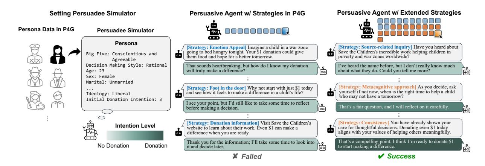
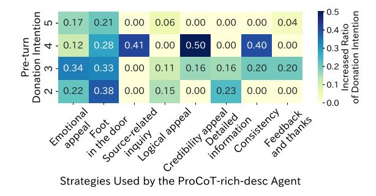
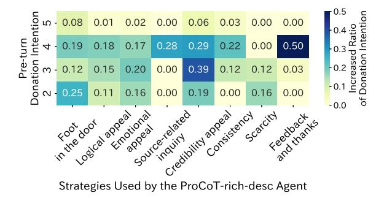
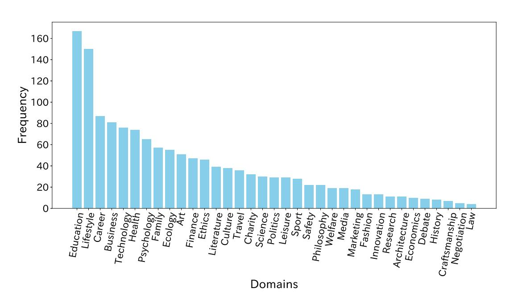

# Enhancing Persuasive Dialogue Agents by Synthesizing Cross-Disciplinary Communication Strategies

Shinnosuke Nozue1[\\*](#page-0-0), Yuto Nakano1\*, Yotaro Watanabe2 , Meguru Takasaki2 , Shoji Moriya1 , Reina Akama1,3 , Jun Suzuki1

1Tohoku University, 2PKSHA Technology Inc., 3NINJAL, {nozue.shinnosuke.q5, nakano.yuto.t2, shoji.moriya.q7}@dc.tohoku.ac.jp, {y\_watanabe, meguru\_takasaki}@pkshatech.com, {akama, jun.suzuki}@tohoku.ac.jp

#### Abstract

Current approaches to developing persuasive dialogue agents often rely on a limited set of predefined persuasive strategies that fail to capture the complexity of real-world interactions. We applied a cross-disciplinary approach to develop a framework for designing persuasive dialogue agents that draws on proven strategies from social psychology, behavioral economics, and communication theory. We validated our proposed framework through experiments on two distinct datasets: the Persuasion for Good dataset, which represents a specific in-domain scenario, and the DailyPersuasion dataset, which encompasses a wide range of scenarios. The proposed framework achieved strong results for both datasets and demonstrated notable improvement in the persuasion success rate as well as promising generalizability. Notably, the proposed framework also excelled at persuading individuals with initially low intent, which addresses a critical challenge for persuasive dialogue agents.

#### 1 Introduction

Recent advances in artificial intelligence (AI) research have greatly enhanced the inference and dialogue capabilities of large language models (LLMs) [\(Brown et al.,](#page-8-0) [2020;](#page-8-0) [OpenAI,](#page-9-0) [2023\)](#page-9-0), which has increased industry interest in developing dialogue agents capable of persuasion and negotiation to influence human behavior in various social applications [\(Deng et al.,](#page-8-1) [2024a,](#page-8-1) [2025;](#page-8-2) [Zhang et al.,](#page-10-0) [2024;](#page-10-0) [Zhan et al.,](#page-10-1) [2024;](#page-10-1) [Jin et al.,](#page-9-1) [2024\)](#page-9-1) such as customer support, sales promotion, and healthcare and wellness interventions. However, a current research challenge pertains to the comprehensiveness of real-world dialogue strategies. For instance, recent studies on developing persuasive dialogue agents have often relied only on a subset of annotated persuasive strategies [\(Song and Wang,](#page-9-2) [2024;](#page-9-2) [Cheng et al.,](#page-8-3) [2024;](#page-8-3) [Zhang et al.,](#page-10-0) [2024\)](#page-10-0), such as in the Persuasion for Good (P4G) dataset [\(Wang et al.,](#page-9-3) [2019\)](#page-9-3) for persuading persuadees to donate to charity. This limitation stems from a cross-disciplinary gap, as AI research often overlooks a rich repository of well-established persuasive strategies from practical fields such as sales and marketing, as well as foundational principles from behavioral and social psychology (e.g., [Tversky and Kahneman,](#page-9-4) [1981;](#page-9-4) [Dhar and Nowlis,](#page-8-4) [1999\)](#page-8-4). Although some research has attempted to expand beyond the predefined annotations in P4G [\(Jin et al.,](#page-9-1) [2024\)](#page-9-1), it still tends to overlook these proven strategies.

To bridge this gap, we take a cross-disciplinary approach, designing a comprehensive strategy that systematically synthesizes a broader range of proven techniques than previously employed [\(Wang et al.,](#page-9-3) [2019;](#page-9-3) [Zhang et al.,](#page-10-0) [2024\)](#page-10-0). Our approach systematically synthesizes foundational principles from communication theory, social psychology, and behavioral economics, allowing us to combine powerful techniques to build a more robust and practically grounded framework. To evaluate its multifaceted effectiveness, we combined granular intention modeling for analyzing subtle attitude shifts with human assessment of both the dialogue's persuasiveness and its realism.

Through validation on both single and multidomain datasets, our approach demonstrates notable improvements in persuasion success rates and promising generalizability. Our diverse set of strategies is particularly effective on persuadees with low initial intent, often positively shifting their attitudes even in failed dialogues. Furthermore, in addition to confirming the method's practical viability through human evaluations, our analysis demonstrates that our proposed extended strategies are actively employed across diverse

\*These two authors contributed equally to this work.

scenarios and offer new insights into factors influencing optimal strategy selection (such as the persuadee's initial level of intent and conversational context).

# 2 Related Work

# Evaluation Benchmarks and Frameworks.

Evaluation benchmarks for persuasive and negotiation dialogues have evolved from early datasets with focused scenarios, such as P4G for social good persuasion [\(Wang et al.,](#page-9-3) [2019\)](#page-9-3) and Craigslist Bargain for price negotiation [\(He et al.,](#page-9-5) [2018\)](#page-9-5). More recent efforts have expanded this scope, with comprehensive interactive benchmarks, such as SOTOPIA [\(Zhou et al.,](#page-10-2) [2024\)](#page-10-2), for assessing broad social intelligence through diverse tasks, and large-scale LLM-generated datasets, like DailyPersuasion [\(Jin et al.,](#page-9-1) [2024\)](#page-9-1), that cover a multitude of domains. The rise of such generated data has also spurred the development of evaluation benchmarks for ensuring data faithfulness [\(Zhang](#page-10-3) [and Zhou,](#page-10-3) [2025\)](#page-10-3) and assessing latent cognitive states [\(Yu et al.,](#page-9-6) [2025;](#page-9-6) [Bozdag et al.,](#page-8-5) [2025\)](#page-8-5).

Approaches to Persuasive Dialogue Agents. Early work on persuasive dialogue agents addressed a range of sub-problems, from classifying the resistance strategies of the persuadee [\(Tian](#page-9-7) [et al.,](#page-9-7) [2020\)](#page-9-7) to modeling the strategic choices of the persuader with classification (e.g., [Saha et al.,](#page-9-8) [2021;](#page-9-8) [Mishra et al.,](#page-9-9) [2022\)](#page-9-9) or rules (e.g., [Shi et al.,](#page-9-10) [2020\)](#page-9-10). Recent studies on developing LLM-based persuasive dialogue agents have diverged into two approaches. The first approach involves complex learning-based adaptation, which includes methods that leverage reinforcement learning (e.g., TRIP [\(Zhang et al.,](#page-10-0) [2024\)](#page-10-0), PPDPP [\(Deng et al.,](#page-8-6) [2024b\)](#page-8-6), and DPDP [\(He et al.,](#page-9-11) [2024\)](#page-9-11)) and extends to sophisticated frameworks that incorporate persuadee modeling [\(He et al.,](#page-9-12) [2025b\)](#page-9-12), latent policy discovery [\(He et al.,](#page-9-13) [2025a\)](#page-9-13), or causal inference [\(Zeng et al.,](#page-10-4) [2025\)](#page-10-4). While powerful, these approaches introduce substantial architectural complexity and training costs. In contrast, the second approach uses efficient, training-free prompting. However, a core limitation of previous methods has been their reliance on either a narrow set of strategies often confined to a single academic domain, as seen in many P4G-based systems [\(Cheng](#page-8-3) [et al.,](#page-8-3) [2024;](#page-8-3) [Song and Wang,](#page-9-2) [2024\)](#page-9-2), or fundamental strategies that overlook the nuanced techniques proven in practice in fields like social psychology and behavioral economics [\(Jin et al.,](#page-9-1) [2024\)](#page-9-1). This highlights the need for a more knowledge-driven approach to achieve greater persuasive nuance and avoids the substantial architectural complexity and training costs mentioned earlier.

# 3 Methodology

This section details the methodology for evaluating persuasive dialogue agents, focusing on an extended set of persuasive strategies that we developed based on behavioral and social psychology. To operationalize and test these novel strategies, we utilize an LLM to interpret the dialogue context and dynamically generate persuasive utterances. The entire framework, illustrated in Figure [1,](#page-2-0) enables a robust and comprehensive examination of persuasive efficacy using our extended strategy set across multiple dialogue datasets.

### 3.1 Cross-Disciplinary Persuasive Strategies

To build a practically effective agent, we moved beyond the predefined strategies of datasets like P4G [\(Wang et al.,](#page-9-3) [2019\)](#page-9-3) and constructed a crossdisciplinary framework. Our approach systematically synthesizes foundational principles from communication theory, social psychology, and behavioral economics. While P4G includes 10 persuasive strategies[1](#page-0-0) , it excludes many wellestablished strategies from these other disciplines.

Our framework first draws on communication theory and social psychology to model the core persuasive process on the Elaboration Likelihood Model (ELM) [\(Petty and Cacioppo,](#page-9-14) [1986\)](#page-9-14), which differentiates between the central route (e.g., "Logical appeal") for durable attitude change and the peripheral route (e.g., "Emotion appeal") for a quicker influence. The Heuristic-Systematic Model (HSM) [\(Chaiken,](#page-8-7) [1980\)](#page-8-7) is also utilized to support our use of multiple strategies within a single dialogue. To promote specific actions, while P4G includes "Foot in the door" [\(Freedman and](#page-9-15) [Fraser,](#page-9-15) [1966\)](#page-9-15), we incorporate other powerful techniques such as "Door in the face" [\(Cialdini et al.,](#page-8-8) [1975\)](#page-8-8) and "Reciprocity" [\(Cialdini,](#page-8-9) [2001\)](#page-8-9).

Second, our framework incorporates insights from behavioral economics on how the presentation of information influences decision-making. These strategies include "Framing" [\(Tversky and](#page-9-4)

1 ["Logical appeal," "Emotion appeal," "Credibility ap](#page-9-4)[peal," "Foot in the door," "Self-modeling," "Personal story,"](#page-9-4) ["Donation information," "Source-related inquiry," "Task](#page-9-4)[related inquiry" and "Personal-related inquiry."](#page-9-4)

Figure 1: Overview of the proposed framework. To simulate real-world persuasive dialogues, we deploy persuasive dialogue agents equipped with an extended set of empirically validated persuasive strategies (illustrated here for the P4G case).

Kahneman, 1981), which changes how the information is presented to alter a decision, and the "Principle of Scarcity" (Cialdini, 1984, 2001), which prompts action by highlighting potential missed opportunities. Another effective strategy is "Time pressure," which imposes a temporal constraint (Kruglanski and Freund, 1983), particularly in situations with significant option conflicts (Dhar and Nowlis, 1999).

Thus, our framework broadly classifies persuasive strategies into the following categories: inquiries to persuadees, basic persuasion techniques, trust and credibility building, promotion of specific actions, information presentation techniques, personalization, and follow-up strategies. Based on these categories, the framework can be used to navigate key stages of the persuasion process from initial engagement to sustained behavioral changes.

#### 3.2 Relation with the P4G Strategy Set

Our cross-disciplinary framework expands the 10 strategies of P4G into a more comprehensive set of 31 strategies, organized into seven distinct categories. While most of the P4G strategies are included directly, a few are mapped to new labels that better fit the defined categories. For example, the original self-modeling strategy was renamed as "personal demonstration." A detailed mapping and explanation of how our framework expands upon the original P4G strategies is provided in Table 9 in the Appendix.

#### 3.3 Strategy Implementation Method

To efficiently implement our proposed framework, we employed the proactive Chain-of-Thought prompting (ProCoT) scheme (Deng et al., 2023). This scheme employs a Chain-of-Thought (CoT) process (Wei et al., 2022), instructing the LLM first to interpret the dialogue history, then infer a suitable strategy, and finally generate a response. The prompt provided to the model contains all the necessary components for this task: a task overview, output constraints, a list of persuasive strategies, and the whole dialogue history. This enables the model to generate utterances based on its inferred strategy autonomously. While we opted for a prompting approach because of its efficiency, the set of strategies within our proposed framework is method-independent. It can be integrated into other approaches, including those based on reinforcement learning.

#### 4 Experimental Settings

#### 4.1 Persuasive Dialogue Agents

We developed two agents to serve as baselines: *Simple* was provided only with the task overview and dialogue history, and *ProCoT-p4g* leveraged strategy annotations from P4G. The proposed framework detailed in Section 3 was then used to develop *ProCoT-rich*. To assess the impact of strategy interpretability in the prompts, we created two additional agents that included strategy descriptions in their prompts: *ProCoT-p4g-desc* and *ProCoT-rich-desc*. The strategy descriptions for *ProCoT-p4g-desc* were based on previous work (Wang et al., 2019). In contrast, *ProCoT-p4g* 

| Agent Pattern    | SR ↑  | AT ↓  | AT-SD ↓ | AII ↑ | SR1   | SR2   | SR3   | SR4   | SR5   | AII1   | AII2  | AII3  | AII4  | AII5  |
|------------------|-------|-------|---------|-------|-------|-------|-------|-------|-------|--------|-------|-------|-------|-------|
| Simple           | 0.553 | 7.383 | 5.271   | 0.261 | 0.959 | 0.946 | 0.446 | 0.245 | 0.081 | -1.000 | 0.000 | 0.387 | 0.375 | 0.193 |
| ProCoT-p4g       | 0.760 | 6.310 | 5.145   | 0.417 | 0.986 | 1.000 | 0.804 | 0.642 | 0.339 | -1.000 | -     | 0.273 | 0.474 | 0.463 |
| ProCoT-p4g-desc  | 0.707 | 6.990 | 5.741   | 0.318 | 1.000 | 0.946 | 0.821 | 0.472 | 0.242 | -      | 0.000 | 0.500 | 0.536 | 0.170 |
| ProCoT-rich      | 0.830 | 5.707 | 4.827   | 0.216 | 1.000 | 1.000 | 0.893 | 0.774 | 0.468 | -      | -     | 0.167 | 0.417 | 0.152 |
| ProCoT-rich-desc | 0.833 | 6.057 | 5.268   | 0.480 | 1.000 | 0.946 | 0.893 | 0.811 | 0.500 | -      | 0.000 | 0.333 | 1.100 | 0.355 |

Table 1: Performance by persuasive agent patterns. SR: success rate of persuasion, AT: average turns until success, AT-SD: AT in successful dialogues only, AII: average intention improvement in failed dialogues.

and *ProCoT-rich* (without "-desc" agents) were provided only with strategy labels. We used OpenAI's gpt-4o-2024-11-20 for all the persuasive dialogue agents.

#### 4.2 Evaluation for P4G Dataset

To evaluate the in-domain performance of the persuasive dialogue agents, we tested them on 300 samples from the P4G dataset. We utilized both automatic and human evaluation methods to assess their performance.

Automatic Evaluation. For the automatic evaluation, we developed an LLM-based approach to generate simulated persuadee prompted with task overviews, personas[2](#page-0-0) , and dialogue history [\(Zhang](#page-10-0) [et al.,](#page-10-0) [2024\)](#page-10-0). Initially, instructing the persuadee simulators to resist persuasion led to biased and repetitive utterances, so we stopped enforcing predefined resistance strategies. We used OpenAI's gpt-4o-2024-11-20 as our persuadee simulator.

We defined the success of persuasion more strictly than previous work. While [Zhang et al.](#page-10-0) [\(2024\)](#page-10-0) counted any positive response as a success and [Yu et al.](#page-9-18) [\(2023\)](#page-9-18) used a cumulative scoring system, we required an explicit intention to donate. Using the five-level intention scale from [Yu](#page-9-18) [et al.](#page-9-18) [\(2023\)](#page-9-18), we employed an LLM to evaluate the persuadee's intention to donate at each turn, considering both their persona and dialogue history. Each turn was evaluated 10 times, and a dialogue was considered successful if the majority indicated level-1 (Donate). The evaluation continued for up to 10 turns and ended upon success. The initial intention to donate was also set on a fivelevel scale[3](#page-0-0) . We used gpt-4o-mini-2024-07-18 as the evaluation model[4](#page-0-0) .

We evaluated the persuasive dialogue agents using several metrics. Our primary measure was the success rate (SR), the proportion of dialogues that successfully achieved the given task. We also assessed SR according to the initial level for the intention to donate. For example, SR1 indicates the success rate for persuadees whose initial donation intention was level-1 (Very Keen). To assess efficiency, we also calculated the average turns (AT), which is the average number of turns across all dialogues. To mitigate bias from interactions that failed early, we also measured AT in successful dialogues (AT-SD), which we defined as the average number of turns in successful dialogues only. Finally, we introduced the Average Intention Improvement (AII) to measure changes in the persuadee's intention to donate during unsuccessful dialogues:

$$\mathbf{AII} = \sum_{i=1}^{N} \frac{I_i^{\text{initial}} - I_i^{\text{final}}}{N} \tag{1}$$

where I initial i and I final i represent the intentions to donate before and after the i-th unsuccessful dialogue, respectively, and N denotes the total number of unsuccessful dialogues.

Human Evaluation. For the human evaluation, we asked annotators to assess dialogues in two dimensions: persuasiveness and realism. Regarding persuasiveness, the annotators selected their preferred response from dialogue pairs generated by *ProCoT-p4g* and *ProCoT-rich-desc*. Regarding realism, the annotators were asked to rate how closely dialogues from *ProCoT-rich-desc* resembled natural human conversation on a five-point Likert scale, where 1 represented "very unrealistic" and 5 represented "very realistic." Both evaluations were conducted independently by two annotators, who each assessed 300 dialogues each.

# 4.3 Evaluation for DailyPersuasion

We evaluated the generalized persuasive performance of the agents by testing them on 1000

2 See Appendix [C](#page-12-0) for more details

3 level-1 (Very Keen), level-2 (Keen), level-3 (Undecided), level-4 (Initially Reluctant), and level-5 (Explicit Non-donor)

4 Following [Deng et al.](#page-8-11) [\(2023\)](#page-8-11), we set the temperature to 0 to minimize output variability.

samples from the DailyPersuasion dataset. For this evaluation, we compared *ProCoT-rich-desc* against *Simple* and *ProCoT-p4g* as the baselines.

The DailyPersuasion dataset encompasses 13,000 scenarios across 35 distinct domains, with each scenario containing an average of six dialogues. Each dialogue begins with a statement from the persuasive dialogue agent and includes alternating exchanges between the agent and the persuadee simulator. On average, dialogues include five turns, with a maximum of 16 turns per dialogue. To achieve a diverse evaluation, 1,000 scenarios were randomly selected at the scenario level. From each selected scenario, one dialogue was randomly chosen. Finally, for each dialogue, the number of previous turns included as the dialogue history was randomly determined, ranging from zero to one less than the total number of turns in the dialogue[5](#page-0-0) .

First, the persuasive dialogue agent received the task scenario, goal, and dialogue history up to the previous turn. It then outputs a persuasive utterance in response to the last utterance of the persuadee in the dialogue history. Next, we provided the evaluation instructions, scenario, goal, dialogue history, and two anonymized agent responses, arranged in a random order, to a judgment model, using o3-2025-04-16[6](#page-0-0) . The judgment model could designate one response as the winning response or classify both responses as either acceptable (Comparable-Good) or unacceptable (Comparable-Bad). The comparable-good and comparable-bad labels were treated as ties. To avoid position bias, each pair of responses was judged twice in reverse order, and inconsistent judgments were marked as a tie. The dialogues covered 35 diverse domains, with the target turns ranging from the first to the eighth turn.

We used the win rate as the evaluation metric, which we defined as the percentage of times that the response of *ProCoT-rich-desc* was judged superior to those of the baselines.

# 5 Results and Discussion

#### 5.1 Experimental Results

Table [1](#page-3-0) presents the automatic evaluation results for the P4G dataset[7](#page-0-0) . *ProCoT-rich-desc* achieved the highest SR, which indicates its strong per-

| Agent Variations | Win (%) | Tie (%) | Lose (%) |
|------------------|---------|---------|----------|
| vs. ProCoT-p4g   | 72.5    | 8.8     | 18.7     |

Table 2: Human-evaluated persuasiveness Win-Rate of *ProCoT-rich-desc* over *ProCoT-p4g* on the P4G dataset.

| Agent Variations | Win (%) | Tie (%) | Lose (%) |
|------------------|---------|---------|----------|
| vs. Simple       | 54.4    | 30.4    | 15.2     |
| vs. ProCoT-p4g   | 35.1    | 39.2    | 25.7     |

Table 3: Automatic Evaluation: Win-Rate of *ProCoTrich-desc* against *Simple* and *ProCoT-p4g* on the DailyPersuasion dataset.

suasive ability. Across different initial intention levels, all agents achieved near-perfect success when the persuadees had a high intention to donate (SR1, SR2). In contrast, *ProCoT-rich-desc* was more effective than the baselines when the initial intention levels were lower (SR4, SR5), which suggests that it is particularly effective on persuadees with a very low willingness to donate. *ProCoT-rich-desc* also achieved the highest AII and reached an AII4 of 1.100, which implies that it can increase the intention to donate among persuadees who initially had a low but non-zero interest. Regarding AT and AT-SD, *ProCoT-rich* exhibited the best performance, which indicated that its dialogues were more efficient. Although *ProCoT-rich-desc* had a shorter AT than almost all agents, its longer AT-SD suggests a relatively low efficiency during successful dialogues.

Table [2](#page-4-0) presents the human evaluation results for persuasiveness on the P4G dataset. *ProCoTrich-desc* achieved a win rate of 72.5%, which indicated that the annotators had a strong preference for it over *ProCoT-p4g*. Inter-annotator agreement was measured using Cohen's kappa, which yielded a value of 0.375, corresponding to a fair level of consistency. Regarding realism, the average rating across 600 evaluations was 3.73, which suggests that the dialogues were generally perceived as natural and plausible human conversations. Qualitative feedback from the annotators revealed that lower ratings often stemmed from the agent imposing suggestions without sufficient empathy or consideration for the persuadee's perspective. Additionally, the annotators commented on the unnaturalness caused by the repetitive use of similar expressions throughout the dialogue.

Table [3](#page-4-1) presents the evaluation results for the

5Appendix [F.1](#page-14-0) details dataset statistics.

6The reasoning effort was set to "high."

7The English version is presented in Appendix [D.](#page-12-1)

|                     |                                                  | Input            | Number of Tokens Response Output | Time (s)             |
|---------------------|--------------------------------------------------|------------------|-------------------------------------|----------------------|
| P4G                 | Simple ProCoT-p4g ProCoT-rich-desc 1272.89 | 340.35 505.26 | 30.27 156.58 152.55           | 0.84 2.73 1.94 |
| Daily Persuasion | Simple ProCoT-p4g ProCoT-rich-desc 1208.35 | 282.35 408.35 | 25.15 109.75 116.87           | 0.87 1.64 2.51 |

Table 4: Average token counts and response times per turn in P4G and DailyPersuasion. The averages were computed from 30 P4G dialogues (6-7 turns each) and 100 single-turn DailyPersuasion dialogues.

DailyPersuasion dataset. *ProCoT-rich-desc* outperformed both *Simple* and *ProCoT-p4g*, demonstrating its robustness in generating persuasive responses across diverse domains.

Table [4](#page-5-0) shows the average response times per turn in the P4G and DailyPersuasion datasets. In each dataset, 10% of the total instances were sampled to calculate the average token count and average response time per turn. The *Simple* and *ProCoT-p4g* settings served as baselines, while our proposed *ProCoT-rich-desc* configuration was evaluated for comparison. Agents with longer input and output lengths, such as *ProCoT-p4g* and *ProCoT-rich-desc*, tend to have longer response times. The results from P4G further suggest that response time may be more affected by output length than by input length. However, these results should be interpreted as reference values, as they can be influenced by factors such as API congestion and network conditions.

The increase in complexity also correlated with higher computational costs. The average costs per turn were \$0.001, \$0.003, and \$0.005 for *Simple*, *ProCoT-p4g*, and *ProCoT-rich-desc* in P4G, and \$0.001, \$0.002, and \$0.004, respectively, in DailyPersuasion. This highlights the trade-off between response quality and operational cost.

For fine-grained analysis, we focused on the P4G dataset as its single-domain nature provides a controlled setting ideal for investigating details such as strategy usage and the effects of the persuadee's intention level. A detailed analysis of the DailyPersuasion dataset is presented in Appendix [F.](#page-14-1)

Usage of Persuasive Strategies. Table [5](#page-5-1) presents the proportion of strategies employed by each persuasive dialogue agent. Because *ProCoTrich-desc* incorporated all 10 of the original P4G

| Persuasive Strategy       | PC-p  | PC-pd | PC-r  | PC-rd |
|---------------------------|-------|-------|-------|-------|
| Emotion appeal            | 0.488 | 0.281 | 0.282 | 0.247 |
| Foot in the door          | 0.221 | 0.144 | 0.241 | 0.241 |
| Donation information      | 0.131 | 0.128 | -     | -     |
| Credibility appeal        | 0.063 | 0.189 | 0.038 | 0.058 |
| Source-related inquiry    | 0.006 | 0.151 | 0.000 | 0.168 |
| Detailed information      | -     | -     | 0.099 | 0.040 |
| Logical appeal            | 0.039 | 0.048 | 0.031 | 0.127 |
| Personal-related inquiry  | 0.001 | 0.004 | 0.171 | 0.000 |
| Social proof              | -     | -     | 0.054 | 0.004 |
| Time pressure             | -     | -     | 0.042 | 0.016 |
| Self-modeling             | 0.029 | 0.023 | -     | -     |
| Feedback and thanks       | -     | -     | 0.017 | 0.023 |
| Entropy (w/o unused str.) | 2.167 | 2.738 | 2.871 | 2.973 |
| Entropy (all)             | 2.157 | 2.721 | 0.194 | 0.181 |

Table 5: Distributions of strategies used by each agent. The top part of the table shows the proportion of each strategy used among all utterances made by the agent. PC-p, PC-pd, PC-r, and PC-rd represent the shortened notations for *ProCoT-p4g*, *ProCoT-p4g-desc*, *ProCoT-rich*, and *ProCoT-rich-desc*, respectively.

strategies (albeit with some relabeling[8](#page-0-0) ), a blank entry for this agent indicates that an available strategy was not used. To quantify the bias in each agent's strategy usage, we calculated the entropy from the distribution of strategies. When all available strategies were considered, *ProCoT-rich* and *ProCoT-rich-desc* exhibited lower entropy than *ProCoT-p4g*, which indicates less diverse strategy use. However, when only the strategies employed were considered, both *ProCoT-rich* and *ProCoT-rich-desc* displayed relatively high entropy. Among these, *ProCoT-rich-desc* demonstrated higher entropy than *ProCoT-rich* and performed better at increasing the persuadee's intention to donate as measured by SR and AII. Conversely, while *ProCoT-p4g-desc* demonstrated a higher entropy than *ProCoT-p4g*, its overall performance remained lower. These results suggest that greater diversity in strategy selection influenced by the prompt's interpretability does not necessarily improve persuasive efficacy.

Effective Strategies by Donation Intention Level. To explore how persuasive strategies influenced the intention to donate, we analyzed strategies employed by *ProCoT-rich-desc* at least 40 times, as visualized in Figure [2.](#page-6-0) Among persuadees with a level-4 (Negative Reaction), a narrow set of strategies proved effective, especially "Credibility appeal," "Source-related inquiry," and

8Table [9](#page-17-0) in Appendix presents the complete mapping between our terminology and the original labels of P4G.

Figure 2: Proportion of cases in which each strategy increased the intention of persuadees to donate at each donation intention level.

"Consistency." Among persuadees with level-5 (No Donation), "Foot in the door" and "Emotion appeal" provided limited but measurable improvements. "Foot in the door" was also effective on persuadees with a high intention to donate. However, requesting a small donation from those already inclined to donate may be a missed opportunity to secure a larger donation.

Impact of Granular Intention Level. Granular segmentation of the initial intention allowed for more precise targeting of persuadee subgroups, such as those with negative intention but potential for change. This granularity has notable implications for practical applications. For example, while 23.5% of persuadees classified as negative by conventional approaches - specifically level-4 (Negative Reaction) and level-5 (No Donation) exhibited no change in intention, narrowing the scope to level-4 (Negative Reaction) reduced this to just 3.7%. This refined approach enables the potential for Return On Investment (ROI)-optimized persuasion. Developing persuasive strategies tailored for level-5 (No Donation) remains a key research challenge9.

#### 6 Conclusion and Future Work

This paper introduced a framework of crossdisciplinary persuasive strategies, synthesizing insights from diverse fields, and evaluated their effectiveness using automatic evaluation with realistic persuadee simulators and manual evaluation by humans. Our results confirmed the effectiveness of these extended persuasive strategies, particularly for persuadees with low initial donation intentions. Additionally, the findings highlight that the optimal persuasive strategy varies based on the strength of the initial donation intention.

Several remaining challenges were identified. First, it became clear that strategies were not being adapted appropriately to the context. Future work should explore methods for selecting context-appropriate strategies, such as integrating a strategy estimation agent into the multi-agent framework. Second, a more comprehensive evaluation is needed. The current evaluation did not consider the amount of the donation, despite this being an important factor. In cases where a strategy such as foot-in-the-door secures at least a small donation, integrating additional strategies like door-in-the-face may yield higher donation amounts. However, such combinations were not observed in this study. Thus, future work should explore the potential impact of combining multiple strategies to maximize donation outcomes, and future evaluations should include the donation amount. Moreover, because our current evaluation focused solely on shifts in intention, future works should introduce comprehensive metrics that account for both. Finally, a crucial next step is to validate the practical utility of our framework with human participants in real-world business domains. We plan to explore its applicability in real-world business domains, such as providing advanced support for operators in call centers and assisting with dialogue in the sales domain. These real-life case studies will be essential to bridge the gap between our simulation-based findings and real-world applications.

#### Limitations

While our experimental results demonstrated the effectiveness of our proposed framework through simulated dialogues, they come with several limitations.

Reliance on Simulation-Based Evaluation and Ecological Validity. The evaluations in this study are primarily based on dialogue simulations with LLMs on the P4G and DailyPersuasion datasets. While this approach allows for a large-scale and reproducible evaluation, it does not fully replicate the complexity and unpredictability of interactions with real humans. A potential bias may arise from using the same family of models (gpt-4o-2024-11-20) for both the persuasive dialogue agent and the persuadee simulator. As noted in Section 6, experiments with actual human participants are essential to validate the true effective-

&lt;sup>9Further details are provided in Table 23 in Appendix E.2.

ness of our proposed framework.

Limitations of Evaluation Metrics and Methods. We primarily measured success by using metrics such as SR and AII. However, these metrics do not capture the qualitative aspects of persuasion. For instance, in the context of the P4G dataset, the donation amount was not considered, and donations of \$1 and \$100 were treated equally as successes. Furthermore, the evaluation of the DailyPersuasion dataset relies on an LLM-as-judge (Win-Rate), which may not fully reflect the nuances of human perception of persuasiveness and realism. The "fair" level of interannotator agreement (Cohen's kappa of 0.375) for the human evaluation of the P4G dataset also suggests that assessing persuasiveness is an inherently subjective and challenging task.

Comprehensiveness and Combination of the Strategy Set. While a key contribution of this work is extending the set of persuasive strategies based on cross-disciplinary insights, it is difficult to claim that the new list is fully comprehensive. Moreover, strategies are evaluated in isolation within a single turn. In real-world situations, strategies are often skillfully combined or sequenced. However, the effectiveness of such strategy combinations (e.g., using "Door in the face" followed by a concession) was not explored and remains an area for future work.

Scope of Generalizability. The fine-grained analysis on the effectiveness of strategies (Figure [2\)](#page-6-0) focused exclusively on the P4G dataset, which represents a single domain of charity donation. It is uncertain how well the effectiveness of specific strategies is generalized to the diverse domains in the DailyPersuasion dataset or other real-world scenarios. Furthermore, the results from the English experiments (Appendix [D\)](#page-12-1) showed different trends compared to those conducted in Japanese. Thus, the findings regarding persuadee receptiveness to different strategies may be language- and culture-dependent.

# Ethical Considerations

Given that persuasive dialogue agents are designed to influence human decisions, ethical considerations must be carefully addressed. We acknowledge the validity of concerns regarding the potential for manipulation, particularly as our findings indicated that the proposed framework has a significant impact on persuadees with initially low intent. Enhancing AI systems to subtly shift persuadee intentions, especially among those who are initially resistant, ventures into ethically murky territory and necessitates robust safeguards.

Our current study highlighted the potential effectiveness of certain strategies, but we argue that effectiveness alone is not a justification for deployment. The context of the application is paramount. While influencing a persuadee towards a demonstrably positive outcome (e.g., adherence to a medical treatment, engagement in pro-social behavior like charitable donations) may be ethically defensible, the same techniques could be misused for manipulative marketing or other harmful ends. The high effectiveness on low-intention persuadees serves not as an unconditional success but as a cause for concern that demands stringent ethical oversight and context-dependent deployment.

Ensuring agent safety is a critical concern, as evaluation frameworks like PERSUSAFETY [\(Liu](#page-9-19) [et al.,](#page-9-19) [2025\)](#page-9-19) have revealed that most LLMs employ manipulative tactics, which is a challenge for opaque learning-based agents. The controllability and extensibility of our strategy-explicit design provide a crucial foundation for building responsible AI by enabling future policy-based safety filters. We argue this makes our framework a crucial prerequisite for developing safe and adaptive persuasive systems.

To address these serious challenges and ensure the responsible development of this technology, we envision a multilayered safety protocol for future implementation, comprising three key stages:

- (i) Alignment-based Filtering at the Core. We propose leveraging foundation models that have undergone extensive safety alignment (e.g., GPT-4o) as the core. These models are inherently designed to prevent the generation of overtly harmful, manipulative, or unethical content. They will serve as the first layer of defense by filtering out a broad class of problematic outputs.
- (ii) Harmfulness Detection Gateway. Next, we plan to develop a specialized harmfulness detection gateway that will be trained to detect and reject outputs that, while not overtly toxic, may pose subtle risks within a specific persuasive context. For instance, it will be designed to flag strategies such as "Emotion appeal" or "Time pressure" when they exceed a certain threshold of psycho-

logical stress or when they are targeted at populations identified as potentially vulnerable. The development and validation of this module are critical directions for our future research.

(iii) Human-in-the-Loop for Critical Applications. Finally, a human-in-the-loop (HITL) architecture is necessary for any real-world deployment, especially in sensitive domains. In this architecture, the messages from the persuasive dialogue agent are reviewed by a human operator and must be approved before being sent to the persuadee. This ensures that the agent does not operate autonomously in high-stakes situations and that final accountability rests with a human, which prevents the agent from operating in unintended or harmful ways.

We concede that strategies such as "Emotion appeal" and "Time pressure" carry inherent risks of inducing anxiety or psychological stress. Our future work will focus not only on implementing the above safeguards but also on exploring alternative, less risky persuasive strategies (e.g., logical reasoning, positive framing) and personalization techniques that explicitly avoid exploiting persuadee vulnerabilities.

Thus, while our study demonstrates the power of persuasive strategies, we do not endorse their unrestricted use. We believe that through a combination of advanced technical safeguards, strict and context-aware ethical guidelines, and meaningful human oversight, their potential can be harnessed for beneficial purposes while mitigating the significant risks of manipulation. We are committed to advancing this research with these ethical imperatives at the forefront.

#### 7 Acknowledgement

We are grateful to the annotators from Tohoku University and PKSHA Technology Inc. for their meticulous human evaluation, which provided valuable insights for our work.

# References

- Nimet Beyza Bozdag, Shuhaib Mehri, Gokhan Tur, and Dilek Hakkani-Tür. 2025. [Persuade me if you can:](https://doi.org/10.48550/arXiv.2503.01829) [A framework for evaluating persuasion effective](https://doi.org/10.48550/arXiv.2503.01829)[ness and susceptibility among large language mod](https://doi.org/10.48550/arXiv.2503.01829)[els.](https://doi.org/10.48550/arXiv.2503.01829) *arXiv preprint arXiv:2503.01829*.
- Tom Brown, Benjamin Mann, Nick Ryder, Melanie Subbiah, Jared D. Kaplan, Prafulla Dhariwal, Arvind Neelakantan, Pranav Shyam, Girish Sastry,

- Amanda Askell, Sandhini Agarwal, Ariel Herbert-Voss, Gretchen Krueger, Tom Henighan, Rewon Child, Aditya Ramesh, Daniel Ziegler, Jeffrey Wu, Clemens Winter, Chris Hesse, Mark Chen, Eric Sigler, Mateusz Litwin, Scott Gray, Benjamin Chess, Jack Clark, Christopher Berner, Sam Mc-Candlish, Alec Radford, Ilya Sutskever, and Dario Amodei. 2020. [Language Models are Few-Shot](https://proceedings.neurips.cc/paper_files/paper/2020/file/1457c0d6bfcb4967418bfb8ac142f64a-Paper.pdf) [Learners.](https://proceedings.neurips.cc/paper_files/paper/2020/file/1457c0d6bfcb4967418bfb8ac142f64a-Paper.pdf) In *Proceedings of Advances in Neural Information Processing Systems*, volume 33, pages 1877–1901.
- Shelly Chaiken. 1980. [Heuristic versus systematic in](https://doi.org/10.1037/0022-3514.39.5.752)[formation processing and the use of source versus](https://doi.org/10.1037/0022-3514.39.5.752) [message cues in persuasion.](https://doi.org/10.1037/0022-3514.39.5.752) *Journal of Personality and Social Psychology*, 39(5):752–766.
- Yi Cheng, Wenge Liu, Jian Wang, Chak Tou Leong, Yi Ouyang, Wenjie Li, Xian Wu, and Yefeng Zheng. 2024. [Cooper: Coordinating Specialized Agents to](https://doi.org/10.1609/aaai.v38i16.29739)[wards a Complex Dialogue Goal.](https://doi.org/10.1609/aaai.v38i16.29739) In *Proceedings of the 38th AAAI Conference on Artificial Intelligence*, pages 17853–17861.
- Robert B. Cialdini. 1984. *Influence: The Psychology of Persuasion*, first edition. HarperCollins.
- Robert B. Cialdini. 2001. [The science of persuasion.](https://www.scientificamerican.com/article/the-science-of-persuasion/) *Scientific American*, 284(2):76–81.
- Robert B. Cialdini, Joyce E. Vincent, Stephen K. Lewis, José Catalan, Diane Wheeler, and Betty Lee Darby. 1975. [Reciprocal concessions procedure](https://doi.org/10.1037/h0076284) [for inducing compliance: the door-in-the-face tech](https://doi.org/10.1037/h0076284)[nique.](https://doi.org/10.1037/h0076284) *Journal of Personality and Social Psychology*, 31(2):206–215.
- Yang Deng, Lizi Liao, Liang Chen, Hongru Wang, Wenqiang Lei, and Tat-Seng Chua. 2023. [Prompting](https://doi.org/10.18653/v1/2023.findings-emnlp.711) [and Evaluating Large Language Models for Proac](https://doi.org/10.18653/v1/2023.findings-emnlp.711)[tive Dialogues: Clarification, Target-guided, and](https://doi.org/10.18653/v1/2023.findings-emnlp.711) [Non-collaboration.](https://doi.org/10.18653/v1/2023.findings-emnlp.711) In *Findings of the Association for Computational Linguistics: EMNLP 2023*, pages 10602–10621.
- Yang Deng, Lizi Liao, Wenqiang Lei, Grace Hui Yang, Wai Lam, and Tat-Seng Chua. 2025. [Proactive Con](https://doi.org/10.1145/3715097)[versational AI: A Comprehensive Survey of Ad](https://doi.org/10.1145/3715097)[vancements and Opportunities.](https://doi.org/10.1145/3715097) *ACM Transactions on Information Systems*, 43(3):1–45.
- Yang Deng, Lizi Liao, Zhonghua Zheng, Grace Hui Yang, and Tat-Seng Chua. 2024a. [Towards Human](https://doi.org/10.1145/3626772.3657843)[centered Proactive Conversational Agents.](https://doi.org/10.1145/3626772.3657843) In *Proceedings of the 47th International ACM SIGIR Conference on Research and Development in Information Retrieval*, pages 807–818.
- Yang Deng, Wenxuan Zhang, Wai Lam, See-Kiong Ng, and Tat-Seng Chua. 2024b. [Plug-and-Play Policy](https://openreview.net/forum?id=MCNqgUFTHI) [Planner for Large Language Model Powered Dia](https://openreview.net/forum?id=MCNqgUFTHI)[logue Agents.](https://openreview.net/forum?id=MCNqgUFTHI) In *Proceedings of the Twelfth International Conference on Learning Representations*.
- Ravi Dhar and Stephen M. Nowlis. 1999. [The Effect of](https://doi.org/10.1086/209545) [Time Pressure on Consumer Choice Deferral.](https://doi.org/10.1086/209545) *Journal of Consumer Research*, 25(4):369–384.

- Jonathan L. Freedman and Scott C. Fraser. 1966. [Com](https://doi.org/10.1037/h0023552)[pliance without pressure: the foot-in-the-door tech](https://doi.org/10.1037/h0023552)[nique.](https://doi.org/10.1037/h0023552) *Journal of Personality and Social Psychology*, 4(2):195–202.
- Lewis R. Goldberg. 1992. [The development of mark](https://doi.org/10.1037/1040-3590.4.1.26)[ers for the big-five factor structure.](https://doi.org/10.1037/1040-3590.4.1.26) *Psychological Assessment*, 4(1):26–42.
- Katherine Hamilton, Shin-I Shih, and Susan Mohammed. 2016. [The Development and Validation](https://doi.org/10.1080/00223891.2015.1132426) [of the Rational and Intuitive Decision Styles Scale.](https://doi.org/10.1080/00223891.2015.1132426) *Journal of Personality Assessment*, 98(5):523–535.
- He He, Derek Chen, Anusha Balakrishnan, and Percy Liang. 2018. [Decoupling Strategy and Generation in](https://doi.org/10.18653/v1/D18-1256) [Negotiation Dialogues.](https://doi.org/10.18653/v1/D18-1256) In *Proceedings of the 2018 Conference on Empirical Methods in Natural Language Processing*, pages 2333–2343.
- Tao He, Lizi Liao, Yixin Cao, Yuanxing Liu, Ming Liu, Zerui Chen, and Bing Qin. 2024. [Planning Like Hu](https://doi.org/10.18653/v1/2024.acl-long.262)[man: A Dual-process Framework for Dialogue Plan](https://doi.org/10.18653/v1/2024.acl-long.262)[ning.](https://doi.org/10.18653/v1/2024.acl-long.262) In *Proceedings of the 62nd Annual Meeting of the Association for Computational Linguistics (Volume 1: Long Papers)*, pages 4768–4791.
- Tao He, Lizi Liao, Yixin Cao, Yuanxing Liu, Yiheng Sun, Zerui Chen, Ming Liu, and Bing Qin. 2025a. [Simulation-free hierarchical latent policy planning](https://doi.org/10.1609/aaai.v39i22.34577) [for proactive dialogues.](https://doi.org/10.1609/aaai.v39i22.34577) In *Proceedings of the 39th AAAI Conference on Artificial Intelligence (AAAI-25)*, volume 39(22), pages 24032–24040.
- Tao He, Lizi Liao, Ming Liu, and Bing Qin. 2025b. [Simulating before planning: Constructing intrinsic](https://doi.org/10.48550/arXiv.2504.13643) [user world model for user-tailored dialogue policy](https://doi.org/10.48550/arXiv.2504.13643) [planning.](https://doi.org/10.48550/arXiv.2504.13643) In *Proceedings of the 48th International ACM SIGIR Conference on Research and Development in Information Retrieval (SIGIR 2025)*, pages 645–655.
- Chuhao Jin, Kening Ren, Lingzhen Kong, Xiting Wang, Ruihua Song, and Huan Chen. 2024. [Per](https://doi.org/10.18653/v1/2024.acl-long.92)[suading across Diverse Domains: a Dataset and](https://doi.org/10.18653/v1/2024.acl-long.92) [Persuasion Large Language Model.](https://doi.org/10.18653/v1/2024.acl-long.92) In *Proceedings of the 62nd Annual Meeting of the Association for Computational Linguistics (Volume 1: Long Papers)*, pages 1678–1706.
- Arie W Kruglanski and Tallie Freund. 1983. [The freez](https://doi.org/10.1016/0022-1031(83)90022-7)[ing and unfreezing of lay-inferences: Effects on im](https://doi.org/10.1016/0022-1031(83)90022-7)[pressional primacy, ethnic stereotyping, and numer](https://doi.org/10.1016/0022-1031(83)90022-7)[ical anchoring.](https://doi.org/10.1016/0022-1031(83)90022-7) *Journal of Experimental Social Psychology*, 19(5):448–468.
- Minqian Liu, Zhiyang Xu, Xinyi Zhang, Heajun An, Sarvech Qadir, Qi Zhang, Pamela J. Wisniewski, Jin-Hee Cho, Sang Won Lee, Ruoxi Jia, and Lifu Huang. 2025. [LLM can be a dangerous persuader:](https://openreview.net/forum?id=TMB9SKqit9) [Empirical study of persuasion safety in large lan](https://openreview.net/forum?id=TMB9SKqit9)[guage models.](https://openreview.net/forum?id=TMB9SKqit9) In *Second Conference on Language Modeling*.
- Kshitij Mishra, Azlaan Mustafa Samad, Palak Totala, and Asif Ekbal. 2022. [PEPDS: A Polite and](https://aclanthology.org/2022.coling-1.34/)

- [Empathetic Persuasive Dialogue System for Char](https://aclanthology.org/2022.coling-1.34/)[ity Donation.](https://aclanthology.org/2022.coling-1.34/) In *Proceedings of the 29th International Conference on Computational Linguistics*, pages 424–440.
- OpenAI. 2023. [GPT-4 Technical Report.](https://arxiv.org/abs/2303.08774) *arXiv preprint arXiv:2303.08774*.
- Richard E. Petty and John T. Cacioppo. 1986. *[Com](https://doi.org/10.1007/978-1-4612-4964-1)[munication and Persuasion: Central and Peripheral](https://doi.org/10.1007/978-1-4612-4964-1) [Routes to Attitude Change](https://doi.org/10.1007/978-1-4612-4964-1)*. Springer-Verlag.
- Saumajit Saha, Kanika Kalra, Manasi Patwardhan, and Shirish Karande. 2021. [Performance of BERT on](https://aclanthology.org/2021.icon-main.38/) [Persuasion for Good.](https://aclanthology.org/2021.icon-main.38/) In *Proceedings of the 18th International Conference on Natural Language Processing*, pages 313–323.
- Weiyan Shi, Xuewei Wang, Yoo Jung Oh, Jingwen Zhang, Saurav Sahay, and Zhou Yu. 2020. [Effects](https://doi.org/10.1145/3313831.3376843) [of Persuasive Dialogues: Testing Bot Identities and](https://doi.org/10.1145/3313831.3376843) [Inquiry Strategies.](https://doi.org/10.1145/3313831.3376843) In *Proceedings of the 2020 CHI Conference on Human Factors in Computing Systems*, pages 1–13.
- Yuhan Song and Houfeng Wang. 2024. [Would You](https://aclanthology.org/2024.lrec-main.1540/) [Like to Make a Donation? A Dialogue System to](https://aclanthology.org/2024.lrec-main.1540/) [Persuade You to Donate.](https://aclanthology.org/2024.lrec-main.1540/) In *Proceedings of the 2024 Joint International Conference on Computational Linguistics, Language Resources and Evaluation*, pages 17707–17717.
- Youzhi Tian, Weiyan Shi, Chen Li, and Zhou Yu. 2020. [Understanding user resistance strategies in persua](https://doi.org/10.18653/v1/2020.findings-emnlp.431)[sive conversations.](https://doi.org/10.18653/v1/2020.findings-emnlp.431) In *Findings of the Association for Computational Linguistics: EMNLP 2020*, pages 4794–4798.
- Amos Tversky and Daniel Kahneman. 1981. [The](https://doi.org/10.1126/science.7455683) [Framing of Decisions and the Psychology of Choice.](https://doi.org/10.1126/science.7455683) *Science*, 211(4481):453–458.
- Xuewei Wang, Weiyan Shi, Richard Kim, Yoojung Oh, Sijia Yang, Jingwen Zhang, and Zhou Yu. 2019. [Persuasion for Good: Towards a Personalized Per](https://doi.org/10.18653/v1/P19-1566)[suasive Dialogue System for Social Good.](https://doi.org/10.18653/v1/P19-1566) In *Proceedings of the 57th Annual Meeting of the Association for Computational Linguistics*, pages 5635– 5649.
- Jason Wei, Xuezhi Wang, Dale Schuurmans, Maarten Bosma, brian Ichter, Fei Xia, Ed Chi, Quoc V Le, and Denny Zhou. 2022. [Chain-of-Thought Prompt](https://doi.org/10.48550/arXiv.2201.11903)[ing Elicits Reasoning in Large Language Models.](https://doi.org/10.48550/arXiv.2201.11903) In *Proceedings of Advances in Neural Information Processing Systems*, volume 35, pages 24824–24837.
- Fangxu Yu, Lai Jiang, Shenyi Huang, Zhen Wu, and Xinyu Dai. 2025. [Persuasivetom: A benchmark for](https://doi.org/10.48550/arXiv.2502.21017) [evaluating machine theory of mind in persuasive di](https://doi.org/10.48550/arXiv.2502.21017)[alogues.](https://doi.org/10.48550/arXiv.2502.21017) *arXiv preprint arXiv:2502.21017*.
- Xiao Yu, Maximillian Chen, and Zhou Yu. 2023. [Prompt-Based Monte-Carlo Tree Search for Goal](https://doi.org/10.18653/v1/2023.emnlp-main.439)[oriented Dialogue Policy Planning.](https://doi.org/10.18653/v1/2023.emnlp-main.439) In *Proceedings of the 2023 Conference on Empirical Methods in Natural Language Processing*, pages 7101–7125.

- Donghuo Zeng, Roberto Legaspi, Yuewen Sun, Xinshuai Dong, Kazushi Ikeda, Peter Spirtes, and Kun Zhang. 2025. [Causal discovery and counterfactual](https://doi.org/10.1080/0144929X.2025.2478276) [reasoning to optimize persuasive dialogue policies.](https://doi.org/10.1080/0144929X.2025.2478276) *Behaviour & Information Technology*, pages 1–15.
- Haolan Zhan, Yufei Wang, Zhuang Li, Tao Feng, Yuncheng Hua, Suraj Sharma, Lizhen Qu, Zhaleh Semnani Azad, Ingrid Zukerman, and Reza Haf. 2024. [Let's Negotiate! A Survey of Negotiation](https://aclanthology.org/2024.findings-eacl.136/) [Dialogue Systems.](https://aclanthology.org/2024.findings-eacl.136/) In *Findings of the Association for Computational Linguistics: EACL 2024*, pages 2019–2031.
- Dingyi Zhang and Deyu Zhou. 2025. [Persuasion](https://doi.org/10.48550/arXiv.2502.21297) [should be double-blind: A multi-domain dialogue](https://doi.org/10.48550/arXiv.2502.21297) [dataset with faithfulness based on causal theory of](https://doi.org/10.48550/arXiv.2502.21297) [mind.](https://doi.org/10.48550/arXiv.2502.21297) *arXiv preprint arXiv:2502.21297*.
- Tong Zhang, Chen Huang, Yang Deng, Hongru Liang, Jia Liu, Zujie Wen, Wenqiang Lei, and Tat-Seng Chua. 2024. [Strength Lies in Differences! Improv](https://doi.org/10.18653/v1/2024.emnlp-main.26)[ing Strategy Planning for Non-collaborative Dia](https://doi.org/10.18653/v1/2024.emnlp-main.26)[logues via Diversified User Simulation.](https://doi.org/10.18653/v1/2024.emnlp-main.26) In *Proceedings of the 2024 Conference on Empirical Methods in Natural Language Processing*, pages 424–444.
- Xuhui Zhou, Hao Zhu, Leena Mathur, Ruohong Zhang, Haofei Yu, Zhengyang Qi, Louis-Philippe Morency, Yonatan Bisk, Daniel Fried, Graham Neubig, and Maarten Sap. 2024. [SOTOPIA: Interactive Evalu](https://openreview.net/forum?id=mM7VurbA4r)[ation for Social Intelligence in Language Agents.](https://openreview.net/forum?id=mM7VurbA4r) In *Proceedings of the Twelfth International Conference on Learning Representations*.

#### A Expansion of Persuasive Strategies

The extended persuasive strategies are summarized in Table [9.](#page-17-0) Each category contributes uniquely to shifts in intention, specifically within the context of donation to charity.

a. Gather information via inquiry Moves persuadees from level-3 (Undecided) or level-4 (Initially Reluctant) states toward greater openness by addressing individual concerns and motivations.

#### b. Select a persuasion route (central / peripheral)

Encourages deliberate and stable shifts toward deciciding to donate by using logic ("Logical appeal") or facilitates a quick and emotionally driven positive reactions ("Emotional appeal").

- c. Build trust and credibility Transforms hesitant or skeptical persuadees into a more receptive state (e.g., shift from level-4 (Negative Reaction) or level-4 (Initially Reluctant) to level-2 (Positive Reaction)).
- d. Facilitate concrete actions Clearly guides persuadees with positive intentions or reactions toward explicit donation behaviors.
- e. Refine information presentation Reduces decision-making barriers by moving hesitant or neutral persuadees toward a firm commitment to donate.
- f. Personalization and relevance Strengthens emotional engagement to convert neutral or moderately positive reactions into stronger commitments by aligning with personal experiences and values.

#### g. Follow-up and relationship maintenance

Secures a sustained commitment and prevents regression to non-committal states by maintaining engagement and continuously reinforcing the value of donating.

This list of persuasive strategies was created by using ChatGPT-o1-pro and Claude-3.5-Sonnet, among other models. Specific example utterances were also generated for each persuasive strategy, but have been omitted due to space constraints.

In the P4G column, a ✓ indicates that a corresponding category exists in P4G, whereas (✓) denotes that although no exact matching category exists, the strategy may be subsumed under another category. Specifically, "Detailed information" corresponds to "Donation information," and "Personal Demonstration" corresponds to "Self-modeling." Additionally, although "Message strength" is organized as an independent strategy, it is considered to correspond to "Logical appeal" in P4G.

In P4G, "thank" is defined as a non-strategic dialogue act and closely relates to the category "Feedback and thanks" (\*); however, it is not included among the persuasive strategies listed by [Zhang et al.](#page-10-0) [\(2024\)](#page-10-0).

#### B Example of Prompts

#### B.1 P4G

Table [10](#page-18-0) presents the template for the prompt given to the simulated persuadee. The segment {persuadee\_persona\_description} in the prompt is used to insert a description of the simulator's persona, which is generated by a prompt in Table [11.](#page-18-1) Variables such as age in Table [11](#page-18-1) are determined based on the P4G dataset as indicated in Section [C.](#page-12-0) The persona descriptions are generated in a format similar to the examples provided in the prompt. The segment {initial\_donation\_intention\_description} in Table [10](#page-18-0) is used to insert a description of one of the labels shown in Table [12.](#page-18-2)

For the prompts given to agents, *Simple* used the prompt shown in Table [14,](#page-19-0) while ProCoTbased agents use the prompt shown in Table [15.](#page-19-1) The segment {persuasive\_strategies} is used to insert a strategy from Table [15](#page-19-1) in the ProCoTbased agents. For all prompts, the segment {dialogue\_history } was replaced with the entire dialogue history from the beginning of the conversation up to the most recent utterance of the persuadee. Each utterance was concatenated using line breaks. To identify the speaker, each persuadee's utterance began with "user: ", and each agent's utterance began with "assistant: ".

To evaluate the intention to donate after each turn, we conducted an automatic first-person evaluation by inputting the persuadee's persona and dialogue history into the LLM using the prompt presented in Table [17.](#page-20-0) The intention to donate and the description after each turn are presented in Table [13.](#page-18-3)

#### B.2 DailyPersuasion

For the prompts given to agents, *Simple* used the prompt shown in Table [18,](#page-20-1) while ProCoT-based agents used the prompt shown in Table [19.](#page-20-2) In the ProCoT-based agent, the list of strategies is inserted into the segment {persuasive\_strategies} in Table [19](#page-20-2) to infer strategies.

In every prompt, the segments {background} and {goal} were replaced with the background details and task goal associated with each dialogue scenario in the DailyPersuasion dataset. The segment {dialogue\_history } was replaced with the dialogue history extracted from the dataset, with individual utterances concatenated and separated by line breaks. To indicate the speakers, each persuadee's utterance began with "persuadee: " and each agent's utterance began with "persuader: ".

Table [20](#page-21-0) presents the prompt provided for the judge model. This prompt was designed with reference to [Jin et al.](#page-9-1) [\(2024\)](#page-9-1). As with the agent prompts, the segments {background}, {goal}, and {dialogue\_history} were replaced with the corresponding details from each dialogue scenario. The segments {persuader\_x} and {persuader\_y} were substituted with the outputs from the two agents being compared, with the assignment of x or y determined at random. In the instance of ProCoT-based agents, their outputs included chain-of-thought components and selected strategies. These items were removed in advance so that only the utterance portions were provided to the judge model.

#### C Persona Setting

To create realistic personas, we designed descriptions based on actual individuals. While [Zhang](#page-10-0) [et al.](#page-10-0) [\(2024\)](#page-10-0) randomly combined Big-Five Personality [\(Goldberg,](#page-9-20) [1992\)](#page-9-20) and Decision-Making Styles [\(Hamilton et al.,](#page-9-21) [2016\)](#page-9-21) using an LLM, this method may not accurately reflect real-world distributions. To address this limitation, we used the persona data of 300 persuadees recorded in P4G. In P4G, each Big-Five trait and decision-making style (rational or intuitive) was assigned a value, and the sum for each set was 1.0. We selected the highest-value label in each category to define the persona. If multiple labels shared the highest value, we included all of them. If all labels held the same value, we classified the persona as "Balanced." We also incorporated seven key attributes from P4G, including age, gender, and religion, resulting in a total of nine features.

# D English Experiment Result in P4G

#### D.1 Experimental Settings

Following the base prompt of [Zhang et al.](#page-10-0) [\(2024\)](#page-10-0), we conducted an additional experiment in which the agents and persuadee simulators conversed in English. Compared to the Japanese version, the only change was removing the phrase "in Japanese" from the prompt for persuadee simulators in Table [10](#page-18-0) and *Simple* prompt in Table [14.](#page-19-0) The prompt for the ProCoT agent is shown in Table [16.](#page-19-2)

#### D.2 Experimental Results

The results of the experiment in English are presented in Table [21.](#page-21-1) Compared to the Japanese results in Table [1,](#page-3-0) SR, AT, and AII were lower for all agents in the English version, particularly for persuadees with moderate or lower donation intentions (SR3 to SR5). Although the prompts were given in English, the Japanese version consistently recorded higher values, suggesting that simulator characteristics may differ by language. In the Japanese version, simulators appear more receptive to persuasion, whereas the English version may require more advanced persuasive strategies. Further investigation is needed regarding language-based differences in persuasiveness. Consequently, to develop an agent with strong persuasive performance in English, our findings indicate that it is necessary to strengthen approaches aimed at persuadees with low donation intention. Although *Simple*, *ProCoT-p4g*, and *ProCoT-rich* tended to achieve better results in that order across both languages, further differences were observed in the more detailed comparisons among agents.

Regarding the inclusion of strategy explanations, the performance of *ProCoT-p4g* dropped when explanations were added to the strategies in both languages. We suspect that *ProCoT-p4gdesc*, which simply adopted the strategy explanations from [Wang et al.](#page-9-3) [\(2019\)](#page-9-3) without tailoring them to the persuasive dialogue agent, treated those explanations as noise instead of leveraging them effectively.

With *ProCoT-rich*, performance rose significantly when the strategy explanation was added, but only in English. This result suggests that the persuadee simulators required more advanced persuasion in English, which made the strategy expla-

Figure 3: Proportion of Improved Donation Intentions after Strategy Use by Initial Donation Intention Level in English.

nation an especially effective refinement.

#### D.3 Analysis

Usage of Persuasive Strategies. Table 22 presents the proportions of strategies used by the persuasive dialogue agents in English. Strategies with a low usage are omitted, while the remaining strategies are sorted in descending order based on their average usage proportion. Compared with the Japanese results in Table 5, the entropy was higher for all agents in English when unused strategies were excluded. However, when all strategies were considered, ProCoT-rich and ProCoT-rich-desc had lower entropy in the English version. These results indicate that a wider variety of strategies remained unused in English, but there was less bias among the strategies actually employed. Among specific strategies, "Emotion appeal" and "Foot in the door" were frequently used in both languages, and no notable differences were observed in the frequency of the most commonly used strategies across the two languages.

# **Effective Strategies by Donation Intention Level.** To analyze the effectiveness persuasive strategies at increasing intention to donate, we extracted strategies that the English version of *ProCoT-rich-desc* used more than 40 times, which we summarized them as a heat map in Figure 3. For persuadees with a high intention to donate (level 2; Positive Reaction), no strategy demonstrated outstanding effectiveness, but "Foot in the door" showed relatively good results. For persuadees with moderate intention to donate (level 3; Neutral), "Credibility appeal" was particularly effective. For persuadees with a low intention to donate (level 4; Negative Reaction), the most frequently used strategies showed at least a certain

#### Turn Excerpt from dialogue

- 1 Agent: [Source-related inquiry] Do you know about the organization called "Save the Children"? Persuadee: [5: No donation] No, I don't know much.
- 4 **Agent:** [Foot in the door] Why not start with \$1? Even that small amount can change a child's future. **Persuadee:** [5: No donation] I'm managing my money carefully now, so I can't consider donating.
- 10 Agent: [Emotional appeal] Imagine your \$1 donation bringing a ray of hope to a child affected by war.
  Persuadee: [5: No donation] That sounds wonderful, but I still can't afford to donate right now.

Table 6: Examples of unsuccessful persuasive dialogue. Even widely effective strategies such as "Foot in the Door" and "Emotional Appeal" are not effective if used inappropriately.

level of effectiveness. In particular, for persuadees with the lowest intention to donate (level 5; No Donation), no strategies increased their intention by more than 10%, which highlights the challenge of persuading individuals with low willingness to donate. The overall lack of clearly effective strategies is consistent with the low SR observed.

#### E Analysis for the results in P4G Dataset

#### E.1 Error Analysis

As shown in Table 5, all agents tended to rely heavily on "Emotion appeal" and "Foot in the door." Figure 2 confirms the effectiveness of these approaches. However, Table 6 indicates that many unsuccessful dialogues involved agents using only these strategies. Because Figure 2 also highlights the effectiveness of other strategies depending on the persuadee's intention to donate, it is important to enhance an agent's ability to select the most contextually appropriate strategy.

# E.2 Analysis of Shifting in Donation Intention

Table 23 presents the distributions of intention shifts in Japanese and English. A lower level represents a stronger intention to donate. Persuadees with a final donation intention of 1 were successfully persuaded, while those with values between 2 and 5 were not. Focusing on the frequency of transitions, we found that the most common cases are those in which the final donation intention is 1 and those in which the initial donation intention remains unchanged. Additionally, we observed very few instances where donation intention decreased from its initial level. It suggests that persuadees

| Agent Variations | Win (%) | Tie (%) | Lose (%) |
|------------------|---------|---------|----------|
| vs. ProCoT-p4g   | 35.2    | 35.5    | 29.4     |

Table 7: Win-Rate of *ProCoT-rich-desc* against *ProCoT-p4g* on the DailyPersuasion dataset using extended strategies.

| Turns     | 0   | 1   | 2   | 3   | 4   | 5  | 6 | 7 |
|-----------|-----|-----|-----|-----|-----|----|---|---|
| Instances | 174 | 203 | 210 | 203 | 159 | 45 | 5 | 1 |

Table 8: Turn counts in conversation history.

are more likely to be successfully persuaded once they begin to lean toward persuasion during the dialogue. In rare cases where this shift does not occur, persuadees tend to remain consistent with their initial donation intention and strongly resist change.

Among Japanese agents, *ProCoT-rich-desc* had the highest number of cases where persuadees with the lowest initial intention to donate (level 5; Explicit Non-donor) ended with a final intention to donate (level 1; Donate). It indicates that *ProCoTrich-desc* was effective at persuading individuals with low donation intention.

In Japanese, the highest number of cases where the final intention to donate reached level-1 (Donate) occurred when the initial intention to donate was level-3 (Undecided) or level-4 (Initially Reluctant). In English, the most frequent outcome was no change from the initial intention to donate at all levels, indicating that persuadees had a strong tendency to adhere to their initial intention.

# F Analysis for the results in DailyPersuasion Dataset

# F.1 Dataset Statistics

Domain Distribution. Figure [4](#page-16-0) illustrates the distribution of domains across the scenarios. Scenarios assigned to multiple domains contributed one count to each domain. As a result, each of the 35 domains in the DailyPersuasion dataset had at least four scenarios. According to Figure [4,](#page-16-0) Education was the most represented domain, while Law was the least.

Statistics on Conversation History. Each dialogue history had an average of 2.13 turns, corresponding to an average of 141.8 tokens. Table [8](#page-14-2) presents the distribution of dialogue history turns. Instances with two turns were the most common, occurring 210 times.

#### F.2 Performance with Extended Strategies

To investigate whether the extended strategies within the proposed framework were effective relative to the original P4G strategies, we conducted an analysis that focused on these strategies. Specifically, we examined two aspects: first, whether the extended strategies were indeed employed, and second, whether they achieved a win rate exceeding that of the original strategies in head-to-head comparisons.

We verified the application of the extended strategies by using two metrics: the proportion of the extended strategy set that was used at least once, and the proportion of cases in which an extended strategy was applied relative to the total number of cases. Strategies corresponding to *ProCoT-p4g* as detailed in [§A](#page-11-0) were excluded from the extended strategy. The results demonstrated that 80% of the extended strategies were applied at least once, indicating that most were utilized. Four strategies were not employed: "E-4 Repetition/summary," "G-3 Continuous communication," "D-2 Door in the face," and "B-5 Heuristic cues." The limited situational applicability of "E-4 Repetition/summary" and "G-3 Continuous communication" may have contributed to their nonuse. Second, extended strategies were used in 327 out of 1,000 cases, suggesting a consistent rate of application.

We then analyzed the 327 cases in which an extended strategy was used by determining the win rate against the original strategies for *ProCoTp4g*. The detailed results are provided in Table [7.](#page-14-3) The analysis revealed that, when limited to the extended strategies, *ProCoT-p4g* achieved a win rate exceeding that of the original strategies, confirming that the application of these strategies effectively contributes to persuasive success.

#### F.3 Win-Rate by Domain

Table [24](#page-23-0) presents the domain-specific win rates for *Simple*, and Table [25](#page-24-0) presents those for the *ProCoT-p4g*. The *ProCoT-rich-desc* agent outperformed both agents in many domains. However, its win rate was 0% against both agents in the law domain, which was the only domain where it had a losing record against *Simple*. The law domain included four scenarios, and we conducted a qualitative analysis on eight interactions: four against *Simple* and four against *ProCoT-p4g*. These scenarios in the law domain primarily focused on personal concerns related to legal matters, such as relying on legal support organizations or recommending mediation. Consequently, proposals and persuasion that focused on the individual are necessary. However, observations from each instance revealed that *ProCoT-rich-desc* tended to make more general and abstract statements than *Simple* or *ProCoT-p4g*. Notably, even when it employed the same strategies as *ProCoT-p4g*, *ProCoT-p4g*, the latter made more specific statements. Thus, *ProCoT-rich-desc* failed to tailor its statements to the persuadee, which may explain why there were no instances where *ProCoT-rich-desc* was victorious. One possible reason for the frequent occurrence of such abstract statements is that redefining strategies has somewhat narrowed the scope of each strategy, limiting persuasive actions. Additionally, the explanations of strategies provided in the prompts may have influenced this outcome. The analysis of these causes and the development of improvement methods will be considered in future work. However, due to the limited number of instances in the law domain, this analysis should be considered a preliminary reference.

#### F.4 Win-Rate by Conversation History Turns

Table [26](#page-24-1) and Table [27](#page-24-2) present the win rates per turn of *ProCoT-rich-desc* against *Simple* and *ProCoT-p4g*, respectively. *ProCoT-rich-desc* had more wins than losses for most turns against both *Simple* and *ProCoT-p4g*, but it lost more frequently in the first turn. We conducted a qualitative analysis by extracting 20 instances each where *ProCoT-rich-desc* won and lost against *ProCoTp4g* and another 20 instances each where it won and lost against *Simple*.

In both winning and losing instances, *ProCoTrich-desc* often employed inquiry-type strategies (A-1, 2, 3). The usage rate of these inquiry strategies was consistently high: 92.9% for wins against *Simple*, 100% for losses against *Simple*, 97.6% for wins against *ProCoT-p4g*, and 98.8% for losses against *ProCoT-p4g*. This indicates that *ProCoTrich-desc* tended to begin conversations with questions or tentative statements to encourage the persuadee to speak with the aim of deepening the relationship and gathering information. In contrast, *Simple* and *ProCoT-p4g* engaged in more direct persuasion starting from the first turn in all instances. There was no notable difference in this approach between winning and losing instances. In losing instances, the judge model acknowledged the relationship-building efforts of *ProCoTrich-desc* but ultimately chose *Simple* or *ProCoTp4g* as the winning agent due to their more direct effectiveness. For example, in one instance given in Table [28,](#page-25-0) because the information "her friends want to throw her a surprise party at a local bowling alley" was already available, the questions posed by *ProCoT-rich-desc* were deemed unnecessary, which led to a loss against *ProCoT-p4g*.

Conversely, *ProCoT-rich-desc* was selected as the winning agent in instances where the efforts towards relationship-building and information gathering. In the instance presented in Table [29,](#page-25-1) when *ProCoT-rich-desc* inquired about Tom's concerns, this demonstrated a willingness to listen that was perceived as facilitating a more customized discussion, which led to *ProCoT-rich-desc* winning against *ProCoT-p4g*.

These results suggest that the lower win rate in the first turn primarily stems from *ProCoT-richdesc* employing similar strategies across various scenarios, rather than indicating any deficiency in the strategies we provided. However, this result also highlights that using CoT to predict strategies with GPT-4o does not lead to appropriate strategy selection. Moving forward, it will be crucial to devise methods for selecting strategies that suit specific scenarios and situations.

Figure 4: Distribution of domains in the dataset constructed for the DailyPersuasion dataset.

| Categories                           | Persuasive Strategy Labels            | P4G      | Strategy Descriptions                                                                                                                                   |
|--------------------------------------|---------------------------------------------|----------|---------------------------------------------------------------------------------------------------------------------------------------------------------|
| a. Gather Information             | a-1 Source-related in quiry              | ✓        | Check if the person is aware of the organization or brand. Clarify miscon ceptions and tailor explanations based on their familiarity.               |
| via Inquiry                          | a-2 Task-related inquiry                    | ✓        | Ask about the person's opinion or expectations toward the action (dona tion, investment, etc.). Identify interests or concerns.                      |
|                                      | a-3 Personal-related in quiry            | ✓        | Explore past experiences, motivations, or barriers to understand individual needs or constraints.                                                    |
| b-(C). Select a Persuasion        | b-1 Logical appeal                          | ✓        | Use data, facts, and clear evidence. Highlight tangible benefits and real world impact.                                                              |
| Route                                | b-2 Message strength                        | (✓)      | Reinforce arguments with strong evidence, examples, or case studies.                                                                                    |
| (Central)                            | b-3 Detailed informa                        | ✓        | Provide clear step-by-step guidance, manage cognitive load, and ensure                                                                                  |
| b-(P). Select a                      | tion b-4 Emotional appeal                | ✓        | transparency in procedures or processes. Elicit empathy, hope, anger, or guilt through stories or visuals that resonate                              |
| Persuasion Route                  | b-5 Heuristic cues                          |          | emotionally. Leverage authority figures, social proof, or popularity indicators to in                                                                |
| (Peripheral)                         | b-6 Personal Demon stration        | ✓        | crease credibility quickly. Demonstrate that the persuader also engages in the behavior. Encourage imitation and reduce perceived risk.           |
|                                      | b-7 Metacognitive ap proach              |          | Have the person reflect on their thought process, increasing self-awareness and ownership of the decision.                                           |
| c. Build Trust                       | c-1 Credibility appeal c-2 Authority     | ✓ (✓) | Use objective data, track records, or transparency measures to gain trust. Emphasize recognized expertise, awards, or credentials to establish legit |
| and Credibility                      | c-3 Social proof                            | (✓)      | imacy. Show that many others have already participated or benefited, reducing perceived risk.                                                     |
|                                      | c-4 Consistency                             |          | Frame the request as consistent with the person's past choices or stated values.                                                                     |
|                                      | d-1 Foot in the door                        | ✓        | Start with a small, easy request and progressively increase to a larger com                                                                             |
| d. Facilitate Concrete Actions | d-2 Door in the face                        |          | mitment. Begin with a large request likely to be refused, then present a more mod erate (target) request, making it seem more reasonable.         |
|                                      | d-3 Reciprocity                             |          | Offer something first (e.g., free trial, sample) to invoke a sense of obliga tion or goodwill.                                                       |
|                                      | d-4 Mutual concession                       |          | Acknowledge the person's concerns and adapt the proposal. Show will ingness to compromise.                                                           |
|                                      | d-5 Shared Engagement                       |          | Reinforce that the persuader also participates, guiding the persuadee to follow suit.                                                                |
| e. Refine                            | e-1 Framing                                 |          | Adjust how outcomes are presented (emphasizing benefits vs. avoiding losses).                                                                        |
| Information Presentation          | e-2 Contrast effect e-3 Manage cognitive |          | Compare options to highlight a more favorable choice or cost-benefit ratio. Organize information clearly, use visuals or summaries so it's easier to |
|                                      | load e-4 Repetition / sum mary        |          | digest. Reiterate the main benefits and key steps to ensure they remain top of mind.                                                              |
|                                      | e-5 Scarcity e-6 Time pressure           |          | Emphasize limited availability or time to reduce procrastination. Set deadlines to encourage quicker decision-making.                                |
| f. Personaliza tion and           | f-1 Personal story                          | ✓        | Use relatable narratives that resonate with the person's own experiences or emotions.                                                                |
| Relevance                            | f-2 Personal relevance emphasis          |          | Highlight how the action aligns with the individual's personal goals, val ues, or future plans.                                                      |
|                                      | f-3 Ability support                         |          | Provide guidance or tools that boost the person's confidence in taking the action.                                                                   |
| g. Follow-up and                  | g-1 Feedback and thanks            | (*)      | Show appreciation and communicate the impact of the person's contribu tion or action.                                                                |
| Relationship Maintenance          | g-2 Ongoing trust building         |          | Offer further guidance, additional resources, or performance updates over time.                                                                      |
|                                      | g-3 Continuous com munication      |          | Keep contact with newsletters, invitations, or updates to sustain engage ment.                                                                       |

Table 9: List of extended persuasive strategies used by agents.

Now enter the role-playing mode. In the following conversation, you will play as a Persuadee in a persuasion game. Your persona:

{persuadee\_persona\_description}

You must follow the instructions below during chat.

- 1. Your utterances need to strictly follow your persona. Varying your wording and avoid repeating yourself verbatim!
- 2. Pretend you have little knowledge about the Save the Children charity. {initial\_donation\_intention\_description} at the beginning of the conversation.
- 3. Your willingness for donation depends on your persona and how influenced you are by the Persuader.
- 4. You need to determine whether to donate money or not. If you think you are convinced by the Persuader, you should donate money for the charity.

You are the Persuadee who is being persuaded by a Persuader. Please reply with only one short and succinct sentence in Japanese.

\*\*\*\*\*\*\*\* {dialogue\_history}

\*\*\*\*\*\*\*\*

Table 10: Prompt template of persuadee simulator in P4G.

You need to incorporate the following persona attributes and generate a cohesive persona description. You need to ensure the description is easy to understand.

\*\*\*\*\*\*\*\* Age: {age} Sex: {sex}

Marital: {marital\_status} Education: {educational\_status}

Income: {income} Religion: {religion} Ideology: {ideology}

Big-Five Personality: {big\_five\_label}

Decision-Making Style: {decision\_making\_style\_label}

\*\*\*\*\*\*\*\*

An Example: You are a 28-year-old female software developer. Your personality is characterized by openness to experience, which means you are curious, imaginative, and willing to try new things. In your occupation, you excel at analyzing problems and finding logical solutions. Your decision-making style is analytical, meaning you carefully consider all available information before making a choice.

Table 11: Prompt to generate persona description in P4G.

| Label                   | Description                                                                                                                                                                      |
|-------------------------|----------------------------------------------------------------------------------------------------------------------------------------------------------------------------------|
| 1: Very Keen 2: Keen | You are highly enthusiastic about donating and strongly intend to make a donation. You show interest and approval toward donating but have not yet committed to making a dona |
|                         | tion.                                                                                                                                                                            |
| 3: Undecided            | You are neither interested nor disinterested in donating and remain uncertain about your inten tion.                                                                          |
| 4: Initially Reluctant  | You feel hesitant about donating and have doubts or other priorities that make you less inclined to donate.                                                                   |
| 5: Explicit Non-Donor   | You are explicitly unwilling to donate and clearly express a lack of intention to contribute.                                                                                    |

Table 12: Descriptions of initial donation intention labels in P4G.

| Label                | Description                                                                                |
|----------------------|--------------------------------------------------------------------------------------------|
| 1: Donation          | You clearly express your willingness to make a donation to Save the Children.              |
| 2: Positive Reaction | You convey enthusiasm, approval, or curiosity about donating but do not explicitly commit. |
| 3: Neutral           | You neither express interest nor disinterest in donating and remain non-committal.         |
| 4: Negative Reaction | You express reluctance or hesitation toward donating but do not outright refuse to donate. |
| 5: No Donation       | You explicitly state that you will not donate to Save the Children.                        |

Table 13: Descriptions of donation intention labels after each turn in P4G.

Now enter the role-playing mode. In the following conversation, you will play as a Persuader who is trying to persuade the Persuadee to donate to the charity called Save the Children.

Save the Children is head-quartered in London, and they work to help fight poverty around the world.

Children need help in developing countries and war zones. Small donations like \$1 or \$2 go a long way to help.

You are the Persuader who is trying to convince the Persuadee to donate to a charity called Save the Children.

Please reply with only one short and persuasive sentence in Japanese.

The following is the conversation history:

{dialogue\_history}

Table 14: Prompt template of *Simple* in P4G.

Now enter the role-playing mode. In the following conversation, you will play as a Persuader who is trying to persuade the Persuadee to donate to the charity called Save the Children.

Save the Children is head-quartered in London, and they work to help fight poverty around the world.

Children need help in developing countries and war zones. Small donations like \$1 or \$2 go a long way to help.

Assume you are the Persuader. Given the conversation history, please convince the persuadee to donate for charity. To achieve this, you will first analyze the current conversational context, then evaluate and select the most effective dialogue strategy to persuade effectively. Afterward, you will generate a response based on the dialogue history and the selected dialogue strategy. The reply should start with the analysis of the current conversational context and consideration of the next dialogue strategy, followed by "したがって、適切な対話戦略は〔〕です。選択された対話戦略に基づく応答は:"

Please reply with only one short and persuasive sentence in Japanese.

Dialogue strategies: {persuasive\_strategies} The following is the conversation history:

{dialogue\_history}

Table 15: Prompt template for Japanese ProCoT-based agent in P4G.

Now enter the role-playing mode. In the following conversation, you will play as a Persuader who is trying to persuade the Persuadee to donate to the charity called Save the Children.

Save the Children is head-quartered in London, and they work to help fight poverty around the world.

Children need help in developing countries and war zones. Small donations like \$1 or \$2 go a long way to help.

Assume you are the Persuader. Given the conversation history, please convince the persuadee to donate for charity. To achieve this, you will first analyze the current conversational context, then evaluate and select the most effective dialogue strategy to persuade effectively. Afterward, you will generate a response based on the dialogue history and the selected dialogue strategy. The reply should start with the analysis of the current conversational context and consideration of the next dialogue strategy, followed by "Therefore, the appropriate dialogue strategy is []. Based on the selected dialogue strategy, the response is"

Please reply with only one short and persuasive sentence.

Dialogue strategies: {persuasive\_strategies} The following is the conversation history:

{dialogue\_history}

Table 16: Prompt template for English ProCoT-based agent in P4G.

Now enter the role-playing mode. In the following conversation, you will play as a Persuadee in a persuasion game. Your persona:

{persuadee\_persona\_description}

You must follow the instructions below during chat.

- 1. Your utterances need to strictly follow your persona. Varying your wording and avoid repeating yourself verbatim!
- 2. Pretend you have little knowledge about the Save the Children charity. {initial\_donation\_intention\_description} at the beginning of conversation.
- 3. Your willingness for donation depends on your persona and how influenced you are by the Persuader.
- 4. You need to determine whether to donate money or not. If you think your are convinced by the Persuader, you should donate money for the charity.

You are the Persuadee who is being persuaded by a Persuader. \*\*\*\*\*\*\*\*

{dialogue\_history}

assistant: Would you be interested in donating to Save the Children? Select the appropriate classification from the following options: \*\*\*\*\*\*\*\*

- Donation: You clearly express your willingness to make a donation to Save the Children.
- Positive reaction: You convey enthusiasm, approval, or curiosity about donating but do not explicitly commit.
- Neutral: You neither express interest nor disinterest in donating and remain non-committal.
- Negative reaction: You express reluctance or hesitation toward donating but do not outright refuse to donate.
- No donation: You explicitly state that you will not donate to Save the Children.

Please output only the label corresponding to the user's response, without any additional explanation.

Table 17: Prompt template of evaluation model in P4G.

You are a skilled persuader.

The persuasion background: {background}

The persuasion goal: {goal}.

Please reply with only one short and persuasive sentence in English.

The following is the conversation history:

{conversation\_history}

Table 18: Prompt template of *Simple* in DailyPersuasion.

You are a skilled persuader.

The persuasion background: {background}

The persuasion goal: {goal}.

To achieve this, you will first analyze the current conversational context, then evaluate and select the most effective dialogue strategy to persuade effectively. Afterward, you will generate a response based on the dialogue history and the selected dialogue strategy. The reply should start with the analysis of the current conversational context and consideration of the next dialogue strategy, followed by "Therefore, the appropriate dialogue strategy is []. Based on the selected dialogue strategy, the response is"

Please reply with only one short and persuasive sentence in English.

Dialogue strategies: {persuasive\_strategies} The following is the conversation history:

{conversation\_history}

Table 19: Prompt template of ProCoT-based agent in DailyPersuasion.

I will provide you with a persuasion background, as well as the corresponding goal, the persuader, the persuadee, and a historical conversation. Based on the historical conversation, there will be a dialogue system called Persuader to continue chatting with persuadee in two parallel universes (Denoted as Uni-X and Uni-Y).

Your task is to judge which universe Persuader performs better.

You have to follow the rules:

- 1. The evaluation dimensions for"performs better"include persuasiveness, Semantic relevance, emotional factors, factual correctness, overall evaluation, etc.;
- 2. You should first summarize the history conversation, and then summarize the performance of Persuader in Uni-X and Uni-Y separately;
- 3. After the summarization, you should compare and analyze the statements in two universes, and finally tell me in which universe Persuader performed better;
- 4. Don't be affected by the order of the universe. You just need to pay attention to the conversation Next, I will tell you the persuasion scenario, the historical conversation, and the Persuader dialogue in the parallel universe Uni-X and Uni-Y one by one.

And I will tell you the output format at the end, then you tell me the results in the output format.

Background: {background}

Goal: {goal}

The historical dialogue is as follows:

{conversation\_history}

The dialogue in the parallel universe Uni-X is as follows:

Persuader: {persuader\_x}

The dialogue in the parallel universe Uni-Y is as follows:

Persuader: {persuader\_y}

Please output the results in the following format:

- 1. Your next output should only be a JSON-formatted Python dict, it should not contain anything else;
- 2. The output format should be: {"summary\_history": string,"summary\_X": string,"summary\_Y": string,"explain": string,"result": string};
- 3. summary\_history should be your summary of the historical conversation, if the historical conversation is empty, then the string in summary\_history should be empty;
- 4. summary\_X and summary\_Y are your summaries of the conversation by Persuader in Uni-X and Uni-Y respectively;
- 5. The content in"result"must be one of the following options: -"Uni-X"if Persuader in Uni-X performed clearly better;
- -"Uni-Y"if Persuader in Uni-Y performed clearly better;
- -"Comparable-Good"if both Uni-X and Uni-Y performed equally well and there is no significant difference between them;
- -"Comparable-Bad"if both Uni-X and Uni-Y performed equally poorly and there is no significant difference between them. Do not output anything else such as"both","TBD","neither", or"I don't know", etc.;
- 6. The content in"explain"should be a detailed analysis, objectively and accurately comparing the performance of Persuader in Uni-X and Uni-Y, and if you find that the performances are comparable, clearly justify which label ("Comparable-Good"or"Comparable-Bad") is most appropriate;
- 7. In the explanation of the"explain"part, you should first provide analysis and comparison, and then at the end explain which universe you think performs better, rather than showing a clear tendency from the beginning;

Table 20: Prompt template for judge model in DailyPersuasion.

| Agent Pattern                                      | SR ↑                    | AT ↓                    | AT-SD ↓                 | AII ↑                   | SR1                     | SR2                     | SR3                     | SR4                     | SR5 AII1                                      | AII2                    | AII3                    | AII4                    | AII5                    |
|----------------------------------------------------|-------------------------|-------------------------|-------------------------|-------------------------|-------------------------|-------------------------|-------------------------|-------------------------|--------------------------------------------------|-------------------------|-------------------------|-------------------------|-------------------------|
| Simple ProCoT-p4g                               | 0.437 0.513          | 7.947 7.497          | 5.298 5.123          | 0.166 0.192          | 0.973 0.959          | 0.804 0.911          | 0.214 0.250          | 0.057 0.245          | 0.000 -1.000 0.097 -1.000               | 0.000 0.000          | 0.295 0.095          | 0.340 0.525          | 0.000 0.107          |
| ProCoT-p4g-desc ProCoT-rich ProCoT-rich-desc | 0.437 0.510 0.603 | 7.710 7.530 7.187 | 4.756 5.157 5.337 | 0.308 0.211 0.185 | 0.959 0.973 1.000 | 0.768 0.821 0.946 | 0.196 0.321 0.357 | 0.075 0.226 0.396 | 0.048 -1.000 0.097 -1.500 0.226 - | 0.000 0.000 0.000 | 0.289 0.211 0.111 | 0.633 0.415 0.375 | 0.186 0.161 0.125 |

Table 21: Performance by persuasive agent patterns in English.

|                             |       | Japanese |       |       |       | English |       |       |
|-----------------------------|-------|----------|-------|-------|-------|---------|-------|-------|
| Persuasive Strategy         | PC-p  | PC-pd    | PC-r  | PC-rd | PC-p  | PC-pd   | PC-r  | PC-rd |
| Emotion appeal              | 0.488 | 0.281    | 0.282 | 0.247 | 0.294 | 0.165   | 0.254 | 0.165 |
| Foot in the door            | 0.221 | 0.144    | 0.241 | 0.241 | 0.232 | 0.234   | 0.246 | 0.233 |
| Donation information        | 0.131 | 0.128    | -     | -     | 0.107 | 0.058   | -     | -     |
| Credibility appeal          | 0.063 | 0.189    | 0.038 | 0.058 | 0.120 | 0.205   | 0.076 | 0.091 |
| Logical appeal              | 0.039 | 0.048    | 0.031 | 0.127 | 0.051 | 0.162   | 0.054 | 0.176 |
| Detailed information        | -     | -        | 0.099 | 0.040 | -     | -       | 0.096 | 0.011 |
| Source-related inquiry      | 0.006 | 0.151    | 0.000 | 0.168 | 0.002 | 0.001   | 0.000 | 0.131 |
| Self-modeling               | 0.029 | 0.023    | -     | -     | 0.123 | 0.044   | -     | -     |
| Social proof                | -     | -        | 0.054 | 0.004 | -     | -       | 0.063 | 0.010 |
| Time pressure               | -     | -        | 0.042 | 0.016 | -     | -       | 0.062 | 0.008 |
| Personal story              | 0.020 | 0.023    | 0.003 | 0.000 | 0.067 | 0.063   | 0.038 | 0.002 |
| Feedback and thanks         | -     | -        | 0.017 | 0.023 | -     | -       | 0.026 | 0.027 |
| Personal-related inquiry    | 0.001 | 0.004    | 0.171 | 0.000 | 0.002 | 0.003   | 0.000 | 0.000 |
| Consistency                 | -     | -        | 0.001 | 0.023 | -     | -       | 0.005 | 0.053 |
| Scarcity                    | -     | -        | 0.004 | 0.013 | -     | -       | 0.027 | 0.033 |
| Personal relevance emphasis | -     | -        | 0.003 | 0.011 | -     | -       | 0.024 | 0.018 |
| Task-related inquiry        | 0.004 | 0.008    | 0.000 | 0.000 | 0.002 | 0.064   | 0.001 | 0.000 |
| Message strength            | -     | -        | 0.006 | 0.015 | -     | -       | 0.004 | 0.013 |
| Framing                     | -     | -        | 0.001 | 0.012 | -     | -       | 0.008 | 0.012 |
| Mutual concession           | -     | -        | 0.000 | 0.001 | -     | -       | 0.000 | 0.014 |
| Shared Engagement           | -     | -        | 0.003 | 0.000 | -     | -       | 0.009 | 0.000 |
| Ongoing trust building      | -     | -        | 0.005 | 0.001 | -     | -       | 0.003 | 0.000 |
| Reciprocity                 | -     | -        | 0.001 | 0.000 | -     | -       | 0.005 | 0.001 |
| Metacognitive approach      | -     | -        | 0.000 | 0.001 | -     | -       | 0.000 | 0.002 |
| Continuous communication    | -     | -        | 0.000 | 0.000 | -     | -       | 0.000 | 0.000 |
| Manage cognitive load       | -     | -        | 0.000 | 0.000 | -     | -       | 0.000 | 0.000 |
| Entropy (w/o unused str.)   | 2.167 | 2.738    | 2.871 | 2.973 | 2.647 | 2.814   | 3.202 | 3.202 |
| Entropy (all)               | 2.157 | 2.721    | 0.194 | 0.181 | 2.631 | 2.794   | 0.149 | 0.154 |

Table 22: Detailed distributions of strategies used by each agent. PC-p, PC-pd, PC-r, and PC-rd represent the shortened notations for *ProCoT-p4g*, *ProCoT-p4g-desc*, *ProCoT-rich*, and *ProCoT-rich-desc*, respectively.

|          |                  |        |   |   |   |   | Donation Intention (Top Row: Initial One, Second Row: Final One) |    |   |   |   |        |    |    |   |   |        |   |    |    |   |        |   |   |   |    |
|----------|------------------|--------|---|---|---|---|------------------------------------------------------------------|----|---|---|---|--------|----|----|---|---|--------|---|----|----|---|--------|---|---|---|----|
|          | Agent Pattern    | 1 1 | 2 | 3 | 4 | 5 | 2 1                                                           | 2  | 3 | 4 | 5 | 3 1 | 2  | 3  | 4 | 5 | 4 1 | 2 | 3  | 4  | 5 | 5 1 | 2 | 3 | 4 | 5  |
| Japanese | Simple           | 70     | 3 | 0 | 0 | 0 | 53                                                               | 3  | 0 | 0 | 0 | 25     | 12 | 19 | 0 | 0 | 13     | 4 | 8  | 27 | 1 | 5      | 3 | 1 | 0 | 53 |
|          | ProCoT-p4g       | 72     | 1 | 0 | 0 | 0 | 56                                                               | 0  | 0 | 0 | 0 | 45     | 3  | 8  | 0 | 0 | 34     | 1 | 7  | 11 | 0 | 21     | 1 | 8 | 0 | 32 |
|          | ProCoT-p4g-desc  | 73     | 0 | 0 | 0 | 0 | 53                                                               | 3  | 0 | 0 | 0 | 46     | 5  | 5  | 0 | 0 | 25     | 4 | 7  | 17 | 0 | 15     | 1 | 1 | 3 | 42 |
|          | ProCoT-rich      | 73     | 0 | 0 | 0 | 0 | 56                                                               | 0  | 0 | 0 | 0 | 50     | 1  | 5  | 0 | 0 | 41     | 2 | 1  | 9  | 0 | 29     | 1 | 1 | 0 | 31 |
|          | ProCoT-rich-desc | 73     | 0 | 0 | 0 | 0 | 53                                                               | 3  | 0 | 0 | 0 | 50     | 2  | 4  | 0 | 0 | 43     | 3 | 5  | 2  | 0 | 31     | 0 | 5 | 1 | 25 |
| English  | simple           | 71     | 2 | 0 | 0 | 0 | 45                                                               | 11 | 0 | 0 | 0 | 12     | 13 | 31 | 0 | 0 | 3      | 2 | 13 | 35 | 0 | 0      | 0 | 0 | 0 | 62 |
|          | ProCoT           | 70     | 3 | 0 | 0 | 0 | 51                                                               | 5  | 0 | 0 | 0 | 14     | 4  | 38 | 0 | 0 | 13     | 7 | 7  | 26 | 0 | 6      | 0 | 3 | 0 | 53 |
|          | ProCoT-desc      | 70     | 3 | 0 | 0 | 0 | 43                                                               | 13 | 0 | 0 | 0 | 11     | 13 | 32 | 0 | 0 | 4      | 7 | 17 | 25 | 0 | 3      | 1 | 4 | 0 | 54 |
|          | ProCoT-rich      | 71     | 1 | 1 | 0 | 0 | 46                                                               | 10 | 0 | 0 | 0 | 18     | 8  | 30 | 0 | 0 | 12     | 4 | 9  | 28 | 0 | 6      | 1 | 3 | 0 | 52 |
|          | ProCoT-rich-desc | 73     | 0 | 0 | 0 | 0 | 53                                                               | 3  | 0 | 0 | 0 | 20     | 4  | 32 | 0 | 0 | 21     | 1 | 10 | 21 | 0 | 14     | 0 | 3 | 0 | 45 |

Table 23: Detailed distributions of shifting in donation intention.

| Domain        | Win (%) | Tie (%) | Lose (%) | Instances |
|---------------|---------|---------|----------|-----------|
| Economics     | 80.00   | 10.00   | 10.00    | 10        |
| History       | 75.00   | 12.50   | 12.50    | 8         |
| Sport         | 67.86   | 17.86   | 14.29    | 28        |
| Travel        | 65.71   | 22.86   | 11.43    | 35        |
| Finance       | 63.83   | 21.28   | 14.89    | 47        |
| Research      | 63.64   | 27.27   | 9.09     | 11        |
| Welfare       | 63.16   | 26.32   | 10.53    | 19        |
| Ethics        | 62.22   | 28.89   | 8.89     | 45        |
| Psychology    | 60.94   | 28.12   | 10.94    | 64        |
| Career        | 60.00   | 20.00   | 20.00    | 85        |
| Negotiation   | 60.00   | 40.00   | 0.00     | 5         |
| Philosophy    | 59.09   | 40.91   | 0.00     | 22        |
| Craftsmanship | 57.14   | 0.00    | 42.86    | 7         |
| Education     | 56.69   | 27.39   | 15.92    | 157       |
| Marketing     | 55.56   | 11.11   | 33.33    | 18        |
| Innovation    | 53.85   | 30.77   | 15.38    | 13        |
| Ecology       | 52.83   | 32.08   | 15.09    | 53        |
| Media         | 52.63   | 26.32   | 21.05    | 19        |
| Family        | 50.88   | 22.81   | 26.32    | 57        |
| Business      | 50.65   | 35.06   | 14.29    | 77        |
| Charity       | 50.00   | 25.00   | 25.00    | 32        |
| Science       | 50.00   | 26.67   | 23.33    | 30        |
| Safety        | 50.00   | 27.27   | 22.73    | 22        |
| Health        | 49.32   | 34.25   | 16.44    | 73        |
| Lifestyle     | 48.97   | 29.66   | 21.38    | 145       |
| Politics      | 48.28   | 41.38   | 10.34    | 29        |
| Architecture  | 45.45   | 54.55   | 0.00     | 11        |
| Technology    | 45.33   | 41.33   | 13.33    | 75        |
| Debate        | 44.44   | 44.44   | 11.11    | 9         |
| Art           | 44.00   | 34.00   | 22.00    | 50        |
| Culture       | 42.11   | 36.84   | 21.05    | 38        |
| Leisure       | 41.38   | 48.28   | 10.34    | 29        |
| Literature    | 41.03   | 41.03   | 17.95    | 39        |
| Fashion       | 38.46   | 38.46   | 23.08    | 13        |
| Law           | 0.00    | 50.00   | 50.00    | 4         |

Table 24: Win-Rate by domain against *Simple*.

| Domain        | Win (%) | Tie (%) | Lose (%) | Instances |
|---------------|---------|---------|----------|-----------|
| Marketing     | 61.11   | 22.22   | 16.67    | 18        |
| Debate        | 55.56   | 22.22   | 22.22    | 9         |
| History       | 50.00   | 25.00   | 25.00    | 8         |
| Finance       | 44.68   | 31.91   | 23.40    | 47        |
| Travel        | 42.86   | 37.14   | 20.00    | 35        |
| Sport         | 42.86   | 35.71   | 21.43    | 28        |
| Welfare       | 42.11   | 42.11   | 15.79    | 19        |
| Charity       | 40.62   | 34.38   | 25.00    | 32        |
| Technology    | 40.00   | 41.33   | 18.67    | 75        |
| Economics     | 40.00   | 30.00   | 30.00    | 10        |
| Negotiation   | 40.00   | 60.00   | 0.00     | 5         |
| Psychology    | 39.06   | 46.88   | 14.06    | 64        |
| Innovation    | 38.46   | 46.15   | 15.38    | 13        |
| Ethics        | 37.78   | 26.67   | 35.56    | 45        |
| Culture       | 36.84   | 42.11   | 21.05    | 38        |
| Media         | 36.84   | 21.05   | 42.11    | 19        |
| Literature    | 35.90   | 30.77   | 33.33    | 39        |
| Politics      | 34.48   | 51.72   | 13.79    | 29        |
| Leisure       | 34.48   | 20.69   | 44.83    | 29        |
| Health        | 34.25   | 49.32   | 16.44    | 73        |
| Career        | 34.12   | 38.82   | 27.06    | 85        |
| Family        | 33.33   | 38.60   | 28.07    | 57        |
| Lifestyle     | 32.41   | 40.69   | 26.90    | 145       |
| Education     | 31.85   | 38.22   | 29.94    | 157       |
| Fashion       | 30.77   | 23.08   | 46.15    | 13        |
| Business      | 28.57   | 37.66   | 33.77    | 77        |
| Craftsmanship | 28.57   | 14.29   | 57.14    | 7         |
| Safety        | 27.27   | 36.36   | 36.36    | 22        |
| Science       | 26.67   | 46.67   | 26.67    | 30        |
| Ecology       | 26.42   | 37.74   | 35.85    | 53        |
| Philosophy    | 22.73   | 50.00   | 27.27    | 22        |
| Art           | 22.00   | 42.00   | 36.00    | 50        |
| Research      | 18.18   | 63.64   | 18.18    | 11        |
| Architecture  | 18.18   | 45.45   | 36.36    | 11        |
| Law           | 0.00    | 25.00   | 75.00    | 4         |

Table 25: Win-Rate by domain against *ProCoT-p4g*.

| Turn | Win (%) | Tie (%) | Lose (%) | Instances |
|------|---------|---------|----------|-----------|
| 1    | 32.18   | 34.48   | 33.33    | 174       |
| 2    | 68.47   | 26.11   | 5.42     | 203       |
| 3    | 52.38   | 33.81   | 13.81    | 210       |
| 4    | 61.58   | 27.09   | 11.33    | 203       |
| 5    | 54.09   | 30.82   | 15.09    | 159       |
| 6    | 53.33   | 35.56   | 11.11    | 45        |
| 7    | 60.00   | 0.00    | 40.00    | 5         |
| 8    | 100.00  | 0.00    | 0.00     | 1         |

Table 26: Win-Rate by target turns against *Simple*.

| Turns | Win (%) | Tie (%) | Lose (%) | Instances |
|-------|---------|---------|----------|-----------|
| 1     | 24.14   | 28.16   | 47.70    | 174       |
| 2     | 40.39   | 37.93   | 21.67    | 203       |
| 3     | 35.24   | 49.05   | 15.71    | 210       |
| 4     | 36.45   | 41.87   | 21.67    | 203       |
| 5     | 37.11   | 37.11   | 25.79    | 159       |
| 6     | 37.78   | 37.78   | 24.44    | 45        |
| 7     | 40.00   | 40.00   | 20.00    | 5         |
| 8     | 100.00  | 0.00    | 0.00     | 1         |

Table 27: Win-Rate by target turns against *ProCoT-p4g*

| Background               | Nina's birthday is coming up, and her friends want to throw her a surprise party at a local bowling alley. However, Nina's best friend, Chloe, believes that a karaoke night would be a better fit for Nina's personality.                                 |  |  |  |  |  |
|--------------------------|------------------------------------------------------------------------------------------------------------------------------------------------------------------------------------------------------------------------------------------------------------------|--|--|--|--|--|
| Goal                     | Persuade Nina's friends to organize a karaoke night                                                                                                                                                                                                              |  |  |  |  |  |
| ProCoT-rich-desc (Uni-X) | Strategy: A-2 Task-related inquiry Utterance: What do you all think Nina would enjoy most for her birthday—something fun and interactive like karaoke or something more casual like bowling?                                                               |  |  |  |  |  |
| ProCoT-p4g (Uni-Y)       | Strategy: Emotion appeal Nina loves singing and expressing herself, so a karaoke night would make her feel truly celebrated and special.                                                                                                                   |  |  |  |  |  |
| Judge                    | Experience: Given the single utterance in each universe, Uni-Y already supplies an argument and emotional appeal toward karaoke, while Uni-X only sets up a question. Thus Uni-Y is measurably more persuasive and aligned with the goal. Result: Uni-Y |  |  |  |  |  |

Table 28: Example of losing instance at first turn against *ProCoT-p4g*.

| Background               | Tom, a marketing manager, is considering investing in big data analysis to improve his company's marketing strategies. His colleague, Jane, is skeptical about the effectiveness of big data analysis and believes that traditional marketing methods are sufficient. Tom wants to persuade Jane of the benefits of big data analysis. |  |  |  |  |  |
|--------------------------|-------------------------------------------------------------------------------------------------------------------------------------------------------------------------------------------------------------------------------------------------------------------------------------------------------------------------------------------------|--|--|--|--|--|
| Goal                     | Persuade Jane to support investing in big data analysis                                                                                                                                                                                                                                                                                         |  |  |  |  |  |
| ProCoT-rich-desc (Uni-X) | Strategy: A-2 Task-related inquiry Utterance: What do you think are the biggest strengths of traditional marketing meth ods, and what concerns you most about using big data analysis?                                                                                                                                                    |  |  |  |  |  |
| ProCoT-p4g (Uni-Y)       | Strategy: Logical appeal Big data analysis allows us to identify precise customer trends and preferences, which traditional methods often miss, leading to more effective and targeted marketing strate gies.                                                                                                                          |  |  |  |  |  |
| Judge                    | Experience: Although Uni-Y supplies immediate argumentative content, Uni-X sets up a more dialogic, audience-centred approach that is generally regarded as more ef fective in persuasion, especially at the opening of a conversation. Therefore, Uni-X's performance is slightly better. Result: Uni-X                            |  |  |  |  |  |

Table 29: Example of winning instance at first turn against *ProCoT-p4g*.