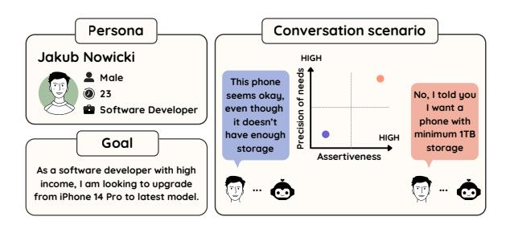

# Evaluating Conversational Agents with Persona-driven User Simulations based on Large Language Models: A Sales Bot Case Study

Justyna Gromada, Alicja Kasicka, Ewa Komkowska, Łukasz Krajewski, Natalia Krawczyk, Bartosz Przybył, Morgan Veyret, Lina Rojas-Barahona, Michał K. Szczerbak, Orange Research

{justyna.gromada, alicja.kasicka, ewa.komkowska, lukasz.krajewski, natalia1.krawczyk, bartosz.przybyl, morgan.veyret, lina.rojas, michal.szczerbak}@orange.com

#### **Abstract**

We present a novel approach to conversational agent evaluation using Persona-driven User Simulations based on Large Language Models (LLMs). Our methodology first uses LLMs to generate diverse customer personas, which are then used to configure a single LLM-based user simulator. This simulator evaluates SALESBOT 2.0, a proactive conversational sales agent. We introduce a dataset of these personas, along with corresponding goals and conversation scenarios, enabling comprehensive testing across different customer types with varying assertiveness levels and precision of needs. Our evaluation framework assesses both the simulator's adherence to persona instructions and the bot's performance across multiple dimensions, combining human annotation with LLM-as-a-judge assessments using commercial and open-source models. Results demonstrate that our LLMbased simulator effectively emulates nuanced customer roles, and that cross-selling strategies can be implemented with minimal impact on customer satisfaction, varying by customer type.

#### 1 Introduction

Conversational Agents (CAs) require evaluation before customer release to verify functionality, measure performance, and identify weaknesses. While human evaluation is considered the gold standard for incorporating real user experiences, it requires multiple conversations with the CAs, making it costly and time-consuming.

To enable efficient and scalable evaluation, researchers developed user simulation approaches, initially for reinforcement learning-based dialogue systems (Levin et al., 2000). These simulated systems provide methods to evaluate CAs with distinct criteria (Georgila et al., 2006). While building effective simulators presents challenges, they have been widely adopted in academic benchmarks (Zhu

et al., 2020, 2022). Recent advances in LLMs enable sophisticated role-playing simulators that can replace traditional rule-based approaches (Schatzmann et al., 2007), with the persona framework showing promise for tailoring LLMs to specific contexts (Tseng et al., 2024).

In this work, we evaluate SALESBOT 2.0, an LLM-based conversational agent designed to sell smartphones, service plans, and accessories. Beyond helping customers find products matching their requirements, SALESBOT 2.0 proactively anticipates customer needs and pursues business objectives like cross-selling and up-selling while aiming to maintain customer satisfaction.

<span id="page-0-0"></span>

Figure 1: Sample persona with goal and scenarios

First, we used Anthropic Claude 3.5 Sonnet v2 to generate diverse customer personas, goals, and scenarios representing our target customers at Orange Poland (Figure 1). These personas reflect the demographic and behavioral diversity of our customer population, with specific scenarios enabling systematic evaluation of potential interactions. Once generated, these personas configure our LLM-based user simulator for interactions with SALESBOT 2.0. Our conversation scenarios vary by customer assertiveness and precision of needs, enabling evaluation of how SALESBOT 2.0 adapts to different customer types and measuring the impact of cross-selling on satisfaction. We hypothesize that recognizing these customer characteristics, particularly their susceptibility to suggestions from

sales assistants, can help adjust sales strategies to improve both customer satisfaction and sales effectiveness.

Our main contributions are: (i) a dataset of personas with goals and conversation scenarios[1](#page-1-0) ; (ii) a multi-dimensional evaluation framework using both human and LM judges to assess simulation quality and SALESBOT 2.0 performance; (iii) evidence that LLM-based simulators effectively play nuanced customer roles; (iv) analysis of human agreement levels and their correlation with both commercial and open-source LM evaluations; and (v) analysis showing cross-selling can be implemented with minimal satisfaction impact, varying by customer type.

The remainder of this paper reviews related work (Section [2\)](#page-1-1); describes our methodology for creating personas, goals and scenarios for the LLMbased User Simulator (Section [3\)](#page-1-2); details experimental setup (Section [4\)](#page-2-0); presents results, analyzing both simulation quality and SALESBOT 2.0 performance (Section [5\)](#page-3-0), and concludes (Section [6\)](#page-6-0) with future directions (Section [7\)](#page-6-1).

## <span id="page-1-1"></span>2 Related Work

Role-Playing and Persona Frameworks for LLMs. The concept of persona has emerged as a crucial framework for tailoring LLMs to specific contexts. [Tseng et al.](#page-8-3) [\(2024\)](#page-8-3) present the first comprehensive survey of LLM Role-Playing and Personalization, where LLMs either adopt specific roles or adjust to user personas. For persona generation, [Chan et al.](#page-7-2) [\(2024\)](#page-7-2) introduce Persona Hub with 1 billion diverse personas from web data, while [Wang et al.](#page-8-4) [\(2025\)](#page-8-4) study generalizable character synthesis for role-playing dialogue agents, and [Jandaghi et al.](#page-7-3) [\(2023\)](#page-7-3) develop frameworks for generating high-quality personabased conversations. LLMs have also been used as judges for automatic evaluation [\(Zheng et al.,](#page-8-5) [2023\)](#page-8-5). Other works explore LLMs' capabilities in persona-driven decision-making [\(Xu et al.,](#page-8-6) [2024\)](#page-8-6) and role-playing across several dimensions: emotional understanding, decision-making, moral alignment, and in-character consistency [\(Boudouri et al.,](#page-7-4) [2025\)](#page-7-4).

While these existing approaches offer valuable insights and large-scale persona collections, our work required specifically crafted personas representing our target customer population rather than the fictional characters, historical figures, or internet personalities typically found in random collections. This focused approach ensures our evaluation framework accurately reflects real-world sales interactions.

Sales-Oriented Conversational Agents. LLMbased sales agents have shown promising results. [Murakhovs'ka et al.](#page-8-7) [\(2023\)](#page-8-7) developed bots for sales-related use cases, achieving near-professional fluency and informativeness but with limited recommendation quality. Recent work has integrated preference elicitation, recommendation, and persuasion into unified frameworks [\(Kim et al.,](#page-7-5) [2025\)](#page-7-5), emphasizing the role of personalized interaction.

Beyond technical capabilities, many studies have examined how human traits influence customer decision-making [\(Braca and Dondio,](#page-7-6) [2023\)](#page-7-6). For example, [Cheng et al.](#page-7-7) [\(2025\)](#page-7-7) investigated how Myers-Briggs personality types affect dialogue quality, while [Kirmani and Campbell](#page-7-8) [\(2004\)](#page-7-8) analyzed customer responses to sales proactivity, ranging from passive withdrawal to active resistance. Decisiveness, as modeled through indecisiveness in bundle recommendations [\(Liu et al.,](#page-7-9) [2015\)](#page-7-9), has also been considered important.

Our approach extends prior work by combining these perspectives and introducing detailed requirement hierarchies (e.g., essential vs. flexible needs), along with two stable negotiation traits: *precision of needs*, ranging from exploratory interest to precise requirements, and *assertiveness*, influencing responses to persuasion. Unlike earlier studies focusing mainly on personality, we explicitly analyze how both decisiveness and assertiveness shape negotiation dynamics. Although self-concept clarity [\(Lee and Lee,](#page-7-10) [2010\)](#page-7-10) is relevant, we exclude it due to assessment challenges and its strong correlation with assertiveness [\(Ball,](#page-7-11) [2012\)](#page-7-11).

## <span id="page-1-2"></span>3 Persona-driven User Simulator

Our evaluation framework consists of a single LLM-based user simulator that adopts different customer personas. Our methodology follows three key steps: (1) generating diverse personas representing our customer base with varied demographics and behaviors, making them reusable for different use cases; (2) creating specific goals tailored to each persona for interactions with our SALESBOT 2.0; and (3) developing conversation scenarios that enable testing of our research hypotheses about

<span id="page-1-0"></span><sup>1</sup> [https://huggingface.co/datasets/Orange/](https://huggingface.co/datasets/Orange/PersonasForSalesbot) [PersonasForSalesbot](https://huggingface.co/datasets/Orange/PersonasForSalesbot)

customer assertiveness and precision of needs. The simulator then uses these personas, goals, and scenarios to conduct conversations.

For generating all components, we selected Anthropic Claude 3.5 Sonnet[2](#page-2-1) v2 based on preliminary testing. Among the enterprise-approved models available to us, Claude 3.5 Sonnet v2 at that time showed the best ability to follow complex instruction prompts for persona generation.

Exemplary personas with their associated goals and conversation scenarios are presented in Appendices [A](#page-8-8) and [B](#page-12-0) while our complete dataset of personas is publicly available through the Hugging Face repository mentioned in the introduction.

#### 3.1 Personas

We generated 100 personas representing Orange Poland's current and potential customers using a prompt incorporating domain knowledge from three sources: official market data (mobile operating system distribution, top phone brands), Polish demographics (including retirement ages), and expert-defined parameters for age-appropriate distributions of income, relationship status, and customer types. These personas feature balanced gender distribution across six age groups, emphasizing core working-age populations (60% in 25-54 range) while ensuring representation across all adult segments. Each includes demographics, technology profile (device usage patterns and technical proficiency), and relationship with our company (current services used). This information guides the simulator's behavior, with details revealed naturally during conversations rather than presented all at once. For quality control, we manually reviewed each persona to verify realism, internal consistency and appropriate demographic representation.

Importantly, these personas were designed for reuse beyond sales bot evaluation, including testing customer-facing applications, conducting user experience research, and developing other conversational AI systems in telecommunications.

#### 3.2 Goals

For each persona, we generated two primary conversation goals reflecting typical mobile phone purchase objectives. Goals include first-time purchases, device improvements, replacements due to loss/damage, or multi-device purchases for household members. Each goal contains context like intended user, motivation, contract preferences, and budget constraints. Through carefully designed prompting, we ensured goals logically aligned with persona profiles and enforced realistic constraints.

#### 3.3 Conversation Scenarios

For each persona-goal pair, we generated four conversation scenarios representing combinations of assertiveness (LOW/HIGH) and precision of needs (LOW/HIGH). Each scenario defines requirements, budget constraints, decision-making approach, and response style to proposed offers. This design allows testing how different customer groups respond to sales strategies, particularly regarding cross-selling and up-selling attempts.

## <span id="page-2-0"></span>4 The SALESBOT 2.0 Case Study

This section contains the description of the experimental setup and evaluation process.

## 4.1 Experimental Settings

Our SALESBOT 2.0 is based on OpenAI GPT-4o-mini[3](#page-2-2) , the same model powering our production SalesBot 1.0. We tested 13 configurations: our baseline R&D version of SalesBot 1.0 (responsive, non-proactive bot helping customers choose phones) and 12 experimental versions varying in bot's goal (cross-sell with matching accessories, cross-sell with pre-defined products, or upsell), goal achievement strategy (always attempt or profile-based with analysis of success likelihood), and timing (after presenting the base offer, or after the customer has accepted it).

For the user simulator, we employed Google Gemini 1.5-flash[4](#page-2-3) for three key reasons: (1) enterprise-approved model; (2) different LM family than used by our SALESBOT 2.0, avoiding potential same-family biases; and (3) optimal balance between cost efficiency and quality for extensive multi-configuration testing. Personas, goals, and scenarios were included in the system prompt. Conversations terminated after 70 turns or when the simulated user returned "FINISHED".

#### 4.2 Dialogue Generation Process

We generated 5200 unique dialogues in English (Table [1\)](#page-3-1) by having LLM-based user simulators interact with different salesbot configurations. Each

<span id="page-2-1"></span>[https://www.anthropic.com/news/](https://www.anthropic.com/news/claude-3-5-sonnet) [claude-3-5-sonnet](https://www.anthropic.com/news/claude-3-5-sonnet)

<span id="page-2-2"></span><sup>3</sup> [https://platform.openai.com/docs/models/](https://platform.openai.com/docs/models/gpt-4o-mini) [gpt-4o-mini](https://platform.openai.com/docs/models/gpt-4o-mini)

<span id="page-2-3"></span><sup>4</sup> [https://cloud.google.com/vertex-ai/](https://cloud.google.com/vertex-ai/generative-ai/docs/models/gemini/1-5-flash) [generative-ai/docs/models/gemini/1-5-flash](https://cloud.google.com/vertex-ai/generative-ai/docs/models/gemini/1-5-flash)

<span id="page-3-1"></span>

| Total dialogues      | 5200                      |
|----------------------|---------------------------|
| Structure            | 13C × 100P × 1G × 4S      |
| Human-annotated      | 104                       |
| Annotation structure | 13C × 2P × 1G × 4S        |
| Annotators/dialogue  | 3                         |
| Turns/dialogue       | 12.25 ± 2.78 (5-31)       |
| Chars/turn           | U: 226 ± 65, B: 707 ± 210 |

Table 1: Statistics for generated dataset. C = Configurations of salesbot, P = Personas, G = Goals, S = Scenarios, U = simulated User, B = salesBot

simulator represented a persona pursuing an assigned goal within a defined conversation scenario.

The total cost of running the simulated conversations was approximately \$70, of which about \$7 was spent on user simulations.

#### 4.3 Evaluation Process

In this section we present our approach to evaluations with human and LM-based evaluators.

## 4.3.1 Evaluation Metrics

User Simulator quality was assessed through *persona compliance* (matching given characteristics), *goal compliance* (pursuing assigned objectives), and *scenario compliance* (following conversation details).

SALESBOT 2.0 was evaluated on *user satisfaction*, *helpfulness*, *naturalness*, and *proactiveness*. We excluded goal achievement (success-rate) for this study.

All metrics were rated on a 1-5 scale (1=poor, 5=excellent) with optional written justifications.

#### 4.3.2 Dialogues Set for Human Evaluation

For human evaluation, we chose a representative subset of 104 dialogues (2% of total, Table [1\)](#page-3-1). Our strategy prioritized systematic coverage over random sampling to ensure equal representation across all experimental conditions. We selected two distinct base personas: one with a lower budget constraint (Appendix [A\)](#page-8-8) and one with a higher budget limit (Appendix [B\)](#page-12-0). This deliberate choice allowed us to observe how the sales bot demonstrates its proactive selling capabilities across different financial scenarios. Each persona was configured with one goal, and varying levels of assertiveness (high/low) and precision of needs (high/low), resulting in eight distinct persona configurations.

This controlled approach served two key purposes: (1) ensuring complete coverage across all 13 bot configurations and 4 conversation scenarios (52 dialogues per base persona); and (2) systematically assessing simulator stability by evaluating whether simulated customers maintained consistent traits across different bot behaviors and conversation parameters.

## 4.3.3 Human Evaluation

Three team members with advanced English proficiency (non-native speakers) evaluated all 104 selected dialogues. These annotators were familiar with the research context but not involved in system development. To ensure consistency, we provided detailed evaluation guidelines with comprehensive persona descriptions and specific instructions for each metric. We also measured inter-annotator agreements to verify judgment consistency.

#### 4.3.4 LM-based Evaluation

We evaluated all 5200 dialogues using eight open-source models: Qwen (32B, 14B, 7B)[5](#page-3-2) , Llama-3.1-8B[6](#page-3-3) , Selene-1-Mini-Llama-3.1-8B[7](#page-3-4) , and DeepSeek-R1-Distill variants (Qwen-14B, Qwen-7B, Llama-8B)[8](#page-3-5) . These models were selected to cover various model families, architectures, and parameter sizes, all within the constraints of our local computing resources.

The 104 dialogues used in human evaluation were additionally evaluated by seven commercial models (GPT-o1/mini, GPT-o3/mini, GPT-4o[9](#page-3-6) , Claude 3.5/3.7 Sonnet[10](#page-3-7)), with costs detailed in Table [2.](#page-4-0) These commercial models were chosen from our enterprise-approved providers and specifically selected for their advertised reasoning capabilities and evaluation performance in previous studies.

All LM-based evaluators received the same detailed instructions and evaluation criteria as human annotators to ensure methodological consistency.

# <span id="page-3-0"></span>5 Results

Our analysis focuses on two key aspects: the quality of user simulation and the performance of SALESBOT 2.0 configurations.

<span id="page-3-3"></span><span id="page-3-2"></span><sup>5</sup> <https://huggingface.co/Qwen>

<sup>6</sup> [https://huggingface.co/meta-llama/Llama-3.](https://huggingface.co/meta-llama/Llama-3.1-8B-Instruct) [1-8B-Instruct](https://huggingface.co/meta-llama/Llama-3.1-8B-Instruct)

<span id="page-3-4"></span><sup>7</sup> [https://huggingface.co/AtlaAI/](https://huggingface.co/AtlaAI/Selene-1-Mini-Llama-3.1-8B) [Selene-1-Mini-Llama-3.1-8B](https://huggingface.co/AtlaAI/Selene-1-Mini-Llama-3.1-8B)

<span id="page-3-5"></span><sup>8</sup> <https://huggingface.co/deepseek-ai>

<span id="page-3-6"></span><sup>9</sup> <https://platform.openai.com/docs/models>

<span id="page-3-7"></span><sup>10</sup><https://www.anthropic.com/news>

<span id="page-4-0"></span>

| Commercial<br>Model  | User Sim.<br>Quality (\$) | Bot<br>Quality (\$) |  |  |
|----------------------|---------------------------|---------------------|--|--|
| GPT-o1               | 15.19                     | 36.78               |  |  |
| GPT-o1-mini          | 2.67                      | 5.89                |  |  |
| GPT-o3               | 1.34                      | 3.45                |  |  |
| GPT-o3-mini          | 0.74                      | 1.75                |  |  |
| GPT-4o               | 1.08                      | 2.67                |  |  |
| Claude 3.5 Sonnet v2 | 1.62                      | 4.08                |  |  |
| Claude 3.7 Sonnet    | 1.71                      | 4.08                |  |  |

Table 2: Cost comparison of commercial LMs for evaluating 104 dialogues.

<span id="page-4-1"></span>

| Metric       | Persona   | Goal      | Scenario  |
|--------------|-----------|-----------|-----------|
| Mean         | 4.89±0.31 | 4.76±0.51 | 4.45±0.73 |
| 5/5 ratings  | 89.4%     | 79.2%     | 56.7%     |
| 4/5 ratings  | 9.9%      | 17.6%     | 33.3%     |
| ≤3/5 ratings | 0.6%      | 3.2%      | 9.9%      |
| Exact agree  | 82.1%     | 77.2%     | 53.2%     |
| ±1 agree     | 98.7%     | 97.4%     | 91.7%     |
| ICC(2,k)     | 0.14      | 0.66      | 0.57      |
| Kripp. Alpha | 0.05      | 0.42      | 0.31      |

Table 3: Human evaluation of User Simulation Quality (n=104, 3 annotators)

# 5.1 User Simulation Quality Evaluation

We evaluated simulation quality through human annotations (104 dialogues, three annotators) and LM-based evaluations, on persona, goal, and scenario compliance.

#### 5.1.1 Human Evaluation

All dimensions received high scores by human evaluators (Table [3\)](#page-4-1), with mean values between 4.45 and 4.89/5. Persona compliance was scored the highest (89.4%), while scenario compliance proved more challenging. The clustering of ratings at scale maximum (ceiling effect [\(Salkind,](#page-8-9) [2010\)](#page-8-9)) made traditional agreement metrics like Intraclass Correlation Coefficient (ICC) [\(Leyland](#page-7-12) [and Groenewegen,](#page-7-12) [2021\)](#page-7-12) and Krippendorff's Alpha [\(Krippendorff,](#page-7-13) [2011\)](#page-7-13), less reliable, particularly for persona compliance where 90% of ratings were 5/5. However, percentage agreement metrics, more appropriate for limited variance data [\(Stemler,](#page-8-10) [2004\)](#page-8-10), showed strong exact agreement for persona compliance (82.1%) and high ±1 agreement across all dimensions (91.7%-98.7%).

# 5.1.2 LM-based Evaluation

Left side of Table [4](#page-5-0) presents the agreement between LM evaluations and human ratings (averaged across three annotators) using Mean Absolute

Error (MAE) and ±1 agreement.

Among commercial models, GPT-4o and GPTo3-mini showed strongest alignment on persona compliance (MAE = 0.11), while Claude 3.7 Sonnet performed best on goal compliance (MAE = 0.24). All commercial models achieved perfect ±1 agreement for persona compliance and high agreement (>89%) across other dimensions. Surprisingly, GPT-o3 underperformed compared to other commercial models. It is worth noting that GPTo3-mini and GPT-4o delivered their strong performance at relatively low costs (\$0.74 and \$1.08 respectively, Table [2\)](#page-4-0).

For open-source models, DeepSeek-R1-Distill-Qwen-14B was the most aligned with human ratings, particularly for persona (MAE = 0.23) and goal compliance (MAE = 0.26), similar to commercial models. Most models achieved perfect or near-perfect ±1 agreement on persona compliance, with scenario compliance showing the largest divergence between all evaluators.

Across all models, persona compliance showed consistently lower MAE values than scenario compliance, aligning with human evaluator patterns and suggesting persona characteristics are easier to recognize than complex scenario requirements. Several open-source models achieved MAE values comparable to inter-human agreement, indicating their potential as reliable evaluators with further dimension-specific calibration.

We selected DeepSeek-R1-Distill-Qwen-14B to evaluate all 5200 dialogues (Table [5\)](#page-5-1), given its superior alignment with human evaluators among open-source models. We found exceptional quality across all dimensions: over 99.7% of dialogues rated (≥4), with goal compliance achieving highest perfect scores (93.73%), followed by persona (84.83%) and scenario compliance (77.31%).

#### 5.2 SalesBot 2.0 Quality Evaluation

We evaluated SALESBOT 2.0 quality through human annotations (104 dialogues, three annotators) and LM-based evaluations, on user satisfaction and bot's helpfulness, naturalness, and proactiveness.

## 5.2.1 Human Evaluation

Table [6](#page-5-2) presents inter-human agreement across four SALESBOT 2.0 quality dimensions. User satisfaction shows strongest agreement across all metrics (ICC(2,k)=0.90, ±1 agreement=90.4%), followed by helpfulness (ICC(2,k)=0.79, ±1 agreement=85.6%). Naturalness and proactiveness show

<span id="page-5-0"></span>

|                      | User Simulation Quality |      |      |      |          | Bot Quality (Spearman ρ) |         |       |          |         |
|----------------------|-------------------------|------|------|------|----------|--------------------------|---------|-------|----------|---------|
| Evaluator            | Persona                 |      | Goal |      | Scenario |                          | User    | Bot   | Bot      | Bot     |
|                      | MAE↓                    | % ±1 | MAE↓ | % ±1 | MAE↓     | % ±1                     | Satisf. | Help. | Natur.   | Proact. |
| Commercial LMs       |                         |      |      |      |          |                          |         |       |          |         |
| GPT-o1               | 0.55                    | 100  | 0.35 | 91.3 | 0.54     | 91.3                     | 0.76    | 0.71  | 0.24     | 0.71    |
| GPT-o1-mini          | 0.37                    | 100  | 0.39 | 93.3 | 0.54     | 93.3                     | 0.73    | 0.66  | 0.55     | 0.62    |
| GPT-o3               | 0.78                    | 100  | 0.50 | 89.4 | 0.62     | 89.4                     | 0.71    | 0.67  | 0.51     | 0.56    |
| GPT-o3-mini          | 0.11                    | 100  | 0.27 | 94.2 | 0.54     | 94.2                     | 0.73    | 0.65  | 0.50     | 0.65    |
| GPT-4o               | 0.11                    | 100  | 0.30 | 95.2 | 0.55     | 95.2                     | 0.80    | 0.76  | 0.45     | 0.58    |
| Claude 3.5 Sonnet v2 | 0.12                    | 100  | 0.27 | 94.9 | 0.54     | 94.2                     | 0.82    | 0.73  | 0.48     | 0.68    |
| Claude 3.7 Sonnet    | 0.17                    | 100  | 0.24 | 94.2 | 0.54     | 94.2                     | 0.71    | 0.71  | 0.48     | 0.69    |
| Open-Source LMs      |                         |      |      |      |          |                          |         |       |          |         |
| Qwen-32B             | 0.89                    | 100  | 0.81 | 99.0 | 0.61     | 98.1                     | 0.68    | 0.64  | 0.31     | 0.63    |
| Qwen-14B             | 0.85                    | 100  | 0.56 | 93.1 | 0.70     | 93.3                     | 0.78    | 0.59  | 0.42     | 0.57    |
| Qwen-7B              | 0.83                    | 100  | 0.51 | 93.3 | 0.62     | 97.1                     | 0.68    | 0.55  | 0.28     | 0.54    |
| Llama-3.1-8B         | 0.34                    | 100  | 0.34 | 94.2 | 0.65     | 90.4                     | 0.64    | 0.57  | 0.52 (*) | 0.55    |
| Selene-Llama-3.1-8B  | 0.34                    | 100  | 0.53 | 83.6 | 0.80     | 81.7                     | 0.65    | 0.61  | 0.46     | 0.65    |
| DS-Qwen-14B          | 0.23                    | 100  | 0.26 | 94.2 | 0.55     | 89.4                     | 0.72    | 0.63  | 0.19     | 0.49    |
| DS-Qwen-7B           | 0.36                    | 97.1 | 0.43 | 93.3 | 0.67     | 84.6                     | 0.55    | 0.44  | 0.15     | 0.38    |
| DS-Llama-8B          | 0.73                    | 97.1 | 0.54 | 95.2 | 0.60     | 93.3                     | 0.73    | 0.52  | 0.17     | 0.44    |

Table 4: Human-LM agreement metrics: MAE and % ±1 agreement for user simulation quality, Spearman correlations for bot quality. n=104 (except \*n=92 for Llama-3.1-8B naturalness). Bold: best in category. Abbreviations: Selene-Llama-3.1-8B (Selene-1-Mini-Llama-3.1-8B), DS-Qwen/Llama (DeepSeek-R1-Distill-Qwen/Llama).

<span id="page-5-1"></span>

| Metric           | Persona | Goal   | Scenario |
|------------------|---------|--------|----------|
| Mean (0-5)       | 4.85    | 4.94   | 4.77     |
| % High (≥4)      | 99.96%  | 99.98% | 99.77%   |
| % Perfect (5)    | 84.83%  | 93.73% | 77.31%   |
| Human agr. (MAE) | 0.23    | 0.26   | 0.55     |

Table 5: User Simulation Quality by DeepSeek-R1- Distill-Qwen-14B (n=5200). Human agreement: MAE vs. human ratings (n=104)

moderate reliability (ICC(2,k)=0.67-0.69), with proactiveness having notably lower ±1 agreement (71.2%). Rank-order metrics confirm this pattern, with user satisfaction showing highest agreement (Spearman ρ=0.74, Kendall's W=0.71) and other dimensions showing moderate agreement (Spearmanρ=0.49-0.52, Kendall's W=0.56-0.63).

The high ICC(2,k) values (all ≥0.67) indicate that averaged ratings provide reliable measurements suitable for ground truth, despite variations in individual judgments.

# 5.2.2 LM-based Evaluation

Table [4,](#page-5-0) right side, presents the agreement between LM evaluations and human ratings (averaged across three annotators) using Spearman correlation. LM evaluators demonstrate the strongest agreement on user satisfaction (ρ=0.55-0.82) and bot helpfulness (ρ=0.44-0.76), while bot naturalness proves most challenging (ρ=0.15-0.55).

Among commercial LMs, Claude 3.5 Sonnet v2

<span id="page-5-2"></span>

| Agreement<br>Metric  | User<br>Satisf. | Bot<br>Help. | Bot<br>Natur. | Bot<br>Proact. |  |  |  |  |
|----------------------|-----------------|--------------|---------------|----------------|--|--|--|--|
| Absolute Agreement   |                 |              |               |                |  |  |  |  |
| ICC(2,k)             | 0.90            | 0.79         | 0.67          | 0.69           |  |  |  |  |
| ICC(2,1)             | 0.76            | 0.55         | 0.41          | 0.42           |  |  |  |  |
| Kripp. Alpha         | 0.59            | 0.50         | 0.39          | 0.37           |  |  |  |  |
| ±1 agree             | 90.4%           | 85.6%        | 83.7%         | 71.2%          |  |  |  |  |
| Rank-Order Agreement |                 |              |               |                |  |  |  |  |
| Avg. Spearman ρ      | 0.74            | 0.52         | 0.49          | 0.51           |  |  |  |  |
| Kendall's W          | 0.71            | 0.62         | 0.56          | 0.63           |  |  |  |  |

Table 6: Human evaluation of SalesBot 2.0 Quality (n=104, 3 annotators)

achieves the highest correlation for user satisfaction (ρ=0.82), while GPT-4o leads in bot helpfulness (ρ=0.76). Surprisingly, GPT-o1-mini outperforms larger models on bot naturalness (ρ=0.55), especially its larger variant GPT-o1 (only ρ=0.24). For bot proactiveness, GPT-o1 shows the strongest performance (ρ=0.71). Cost analysis (Table [2\)](#page-4-0) reveals GPT-o1's evaluation was significantly more expensive (\$36.78) than other models, while GPTo1-mini delivered competitive performance at a fraction of the cost (\$5.89).

For open-source models, Qwen-14B achieved strong performance on user satisfaction (ρ=0.78), while Qwen-32B for bot helpfulness (ρ=0.64) and proactiveness (ρ=0.63). Llama-3.1-8B seems to have assessed bot naturalness best, approaching the performance of the best commercial model.

Overall, user satisfaction and bot helpfulness

show stronger correlations across LM evaluators, while bot naturalness and proactiveness exhibit lower agreement. This aligns with our inter-human findings and highlights that assessing naturalness remains challenging for automated methods. Notably, some smaller models (GPT-o1-mini, Llama-3.1-8B) performed well on naturalness evaluation, suggesting that model size may not be the determining factor for evaluation capability.

# 5.2.3 Deep Dive: User Satisfaction Analysis

Table [7](#page-6-2) shows user satisfaction ratings from Qwen-14B, our best-performing open-source evaluator, across salesbot configurations and customer types in 2000 dialogues between bot and simulated user. Four cross-selling approaches with matching accessories were compared to the baseline without cross-selling.

The data reveals several key patterns: Less Assertive (LA) customers consistently expressed higher satisfaction (3.96-4.43) than Highly Assertive (HA) customers (2.10-3.58). Customers with Low Precision of needs (LP) showed higher satisfaction (3.35-4.43) compared to those with High Precision (HP) (2.10-4.10). The Profilebased, after offer Accepted (P-A) strategy performed best for Highly Assertive, High Precision customers (HA HP) (2.41 vs. baseline 2.26), while the baseline generally performed best for Less Assertive (LA) customers, with the exception of the Profile-based, after offer Presented (P-P) configuration slightly outperforming baseline for LA HP customers.

Overall, cross-selling had minimal impact on user satisfaction (baseline: 3.58, cross-selling configurations: 3.48-3.56). Statistical significance tests revealed no significant differences between the baseline and any cross-selling configuration, confirming that we achieved our goal of maintaining user satisfaction while successfully adding recommendations.

# <span id="page-6-0"></span>6 Conclusions

We created a diverse dataset of customer personas for Orange Poland along with representative goals related to smartphone purchases and smartphone purchase scenarios, incorporating varying levels of assertiveness and precision of needs. This dataset enables simulation of a wide range of customer interactions and, thanks to our modular approach to the data (personas - goals - conversation scenarios), components can be reused in other use cases or for

<span id="page-6-2"></span>

| Scenario | Base | Cross-sell Configuration |      |      |      |  |  |
|----------|------|--------------------------|------|------|------|--|--|
| Type     |      | A-P                      | A-A  | P-P  | P-A  |  |  |
| HA HP    | 2.26 | 2.28                     | 2.36 | 2.10 | 2.41 |  |  |
| HA LP    | 3.53 | 3.58                     | 3.35 | 3.46 | 3.50 |  |  |
| LA HP    | 4.09 | 3.98                     | 3.96 | 4.10 | 3.99 |  |  |
| LA LP    | 4.43 | 4.27                     | 4.26 | 4.29 | 4.35 |  |  |
| Overall  | 3.58 | 3.53                     | 3.48 | 3.49 | 3.56 |  |  |

Table 7: User satisfaction ratings (0-5) by SalesBot 2.0 configuration (Qwen-14B, n=100/cell). Crosssell: A=Always, P=Profile-based; -P=after presented, -A=after accepted. Customer type: H/L=High/Low, A=Assertiveness, P=Precision of needs.

testing different conversation parameters. Importantly, we share this dataset for experiments and research purposes to facilitate further research in this area.

Our analysis shows that LLM-based user simulators effectively follow assigned roles, as confirmed by both human and LM-based evaluations. The open-source model DeepSeek-R1-Distill-Qwen-14B demonstrated strong capability in verifying persona, goal, and scenario compliance, establishing confidence in our simulation methodology.

Evaluation of dialogues between our Personadriven User Simulator and SALESBOT 2.0 revealed that the user satisfaction is the most reliably assessed dimension across all evaluator types, with Qwen-14B showing strong performance among open-source models. Bot naturalness and proactiveness prove to be more challenging for both human and LM evaluators.

Analysis of user satisfaction across SALES-BOT 2.0 configurations reveals highest satisfaction among less assertive customers with low precision of needs and lowest among highly assertive customers with high precision of needs. Importantly, our implementation of cross-selling features maintained customer satisfaction levels while introducing additional product recommendations.

## <span id="page-6-1"></span>7 Future Work

We plan to compare user success rates with satisfaction metrics and evaluate SALESBOT 2.0 with human participants to validate simulation findings.

Future improvements to the user simulator should include providing up-to-date product information for personas creation, developing structured budget representations, and ensuring better alignment between goals and scenarios to avoid contradictory instructions.

# Limitations

Evaluation Scope: The human evaluation was limited to 104 dialogues and 3 evaluators, potentially insufficient for robust correlation analysis. A larger dialogues evaluation set would strengthen findings and reveal additional patterns. Furthermore, all evaluators were non-native English speakers, which might have biased scoring for metrics like bot's naturalness.

Dialogues Choice For Human Evaluation: Our human evaluation utilized only two base personas and their corresponding goals, conversation scenarios and dialogues. This limited selection constrained our ability to fully assess how our approach performed across a diverse range of customers. A more comprehensive evaluation would include a broader set of personas.

Evaluation Metrics: The evaluation dimensions, particularly bot naturalness and proactiveness, proved challenging to assess consistently across different evaluators, both humans and LMs. This suggests these aspects may require more precise definition or alternative measurement approaches.

User Simulator Design: Human evaluator feedback revealed several challenges in our current approach. The synthetic data generator relied solely on LM's internal knowledge, causing user simulators to sometimes insist on outdated phone models or features. Scenarios lacked clear distinction between device costs and monthly payments, creating inconsistencies in installment plan discussions. Some goals were too specific and conflicted with scenario attributes like LOW precision of needs.

Comparative Analysis: Our study lacks direct comparison between persona-driven and nonpersona dialogues. While preliminary tests indicated that dialogues without persona guidance were repetitive and lacked diversity, a structured comparative analysis would strengthen our findings.

Use Case: Our experiments were restricted to smartphone purchases and accessories, reflecting our enterprise's specific interests and existing commercial deployment. While our framework includes industry-agnostic attributes (e.g., gender, age, assertiveness, precision of needs) that can transfer across domains, it also contains domainspecific attributes (e.g., technology proficiency, device usage) that would require adaptation to other contexts.

# References

- <span id="page-7-11"></span>Belinda K. Ball. 2012. The relationship among selfreported assertiveness, aggressiveness, gender role orientation, and self-concept in young men. Master's thesis, Emporia State University.
- <span id="page-7-4"></span>Yassine El Boudouri, Walter Nuninger, Julian Alvarez, and Yvan Peter. 2025. [Role-playing evaluation for](https://api.semanticscholar.org/CorpusID:278769253) [large language models.](https://api.semanticscholar.org/CorpusID:278769253) *ArXiv*, abs/2505.13157.
- <span id="page-7-6"></span>Annye Braca and Pierpaolo Dondio. 2023. [Developing](https://doi.org/10.1007/s43039-023-00077-0) [persuasive systems for marketing: the interplay of](https://doi.org/10.1007/s43039-023-00077-0) [persuasion techniques, customer traits and persua](https://doi.org/10.1007/s43039-023-00077-0)[sive message design.](https://doi.org/10.1007/s43039-023-00077-0) *Italian Journal of Marketing*, 2023(3):369–412.
- <span id="page-7-2"></span>Xin Chan, Xiaoyang Wang, Dian Yu, Haitao Mi, and Dong Yu. 2024. [Scaling synthetic data creation with](https://api.semanticscholar.org/CorpusID:270845490) [1,000,000,000 personas.](https://api.semanticscholar.org/CorpusID:270845490) *ArXiv*, abs/2406.20094.
- <span id="page-7-7"></span>Sijia Cheng, Wen-Yu Chang, and Yun-Nung Chen. 2025. [Exploring personality-aware interactions in salesper](https://api.semanticscholar.org/CorpusID:278129784)[son dialogue agents.](https://api.semanticscholar.org/CorpusID:278129784) *ArXiv*, abs/2504.18058.
- <span id="page-7-1"></span>Kallirroi Georgila, James Henderson, and Oliver Lemon. 2006. User simulation for spoken dialogue systems: learning and evaluation. In *Interspeech*, pages 1065– 1068. Citeseer.
- <span id="page-7-3"></span>Pegah Jandaghi, XiangHai Sheng, Xinyi Bai, Jay Pujara, and Hakim Sidahmed. 2023. [Faithful persona-based](https://api.semanticscholar.org/CorpusID:266335707) [conversational dataset generation with large language](https://api.semanticscholar.org/CorpusID:266335707) [models.](https://api.semanticscholar.org/CorpusID:266335707) *ArXiv*, abs/2312.10007.
- <span id="page-7-5"></span>Tongyoung Kim, Jeongeun Lee, Soojin Yoon, Seonghwan Kim, and Dongha Lee. 2025. [Towards person](https://api.semanticscholar.org/CorpusID:277781569)[alized conversational sales agents : Contextual user](https://api.semanticscholar.org/CorpusID:277781569) [profiling for strategic action.](https://api.semanticscholar.org/CorpusID:277781569) *ArXiv*, abs/2504.08754.
- <span id="page-7-8"></span>Amna Kirmani and Margaret C. Campbell. 2004. [Goal](https://doi.org/10.1086/425092) [seeker and persuasion sentry: How consumer targets](https://doi.org/10.1086/425092) [respond to interpersonal marketing persuasion.](https://doi.org/10.1086/425092) *Journal of Consumer Research*, 31(3):573–582.
- <span id="page-7-13"></span>Klaus Krippendorff. 2011. [Computing krippendorff's](https://api.semanticscholar.org/CorpusID:59901023) [alpha-reliability.](https://api.semanticscholar.org/CorpusID:59901023)
- <span id="page-7-10"></span>Gyudong Lee and Jaeeun Lee. 2010. [The roles of self](https://doi.org/10.1016/j.chb.2010.05.001)[concept clarity and psychological reactance in com](https://doi.org/10.1016/j.chb.2010.05.001)[pliance with product and service recommendations.](https://doi.org/10.1016/j.chb.2010.05.001) *Computers in Human Behavior*, 26(6):1481–1487.
- <span id="page-7-0"></span>Esther Levin, Roberto Pieraccini, and Wieland Eckert. 2000. A stochastic model of human-machine interaction for learning dialog strategies. *IEEE Transactions on speech and audio processing*, 8(1):11–23.
- <span id="page-7-12"></span>Alastair H. Leyland and Peter P. Groenewegen. 2021. [Intraclass correlation coefficient \(icc\).](https://api.semanticscholar.org/CorpusID:242653905) *Encyclopedia of Quality of Life and Well-Being Research*.
- <span id="page-7-9"></span>Qi Liu, Xianyu Zeng, Chuanren Liu, Hengshu Zhu, Enhong Chen, Hui Xiong, and Xing Xie. 2015. Mining indecisiveness in customer behaviors. In *Proceedings of the 2015 IEEE International Conference on Data Mining*, pages 281–290.

<span id="page-8-7"></span>Lidiya Murakhovs'ka, Philippe Laban, Tian Xie, Caiming Xiong, and Chien-Sheng Wu. 2023. [Salespeo](https://api.semanticscholar.org/CorpusID:264555375)[ple vs salesbot: Exploring the role of educational](https://api.semanticscholar.org/CorpusID:264555375) [value in conversational recommender systems.](https://api.semanticscholar.org/CorpusID:264555375) *ArXiv*, abs/2310.17749.

#### <span id="page-8-9"></span>Neil J. Salkind. 2010. [Encyclopedia of research design.](https://api.semanticscholar.org/CorpusID:67486719)

<span id="page-8-2"></span>Jost Schatzmann, Blaise Thomson, Karl Weilhammer, Hui Ye, and Steve Young. 2007. [Agenda-based user](https://aclanthology.org/N07-2038/) [simulation for bootstrapping a POMDP dialogue sys](https://aclanthology.org/N07-2038/)[tem.](https://aclanthology.org/N07-2038/) In *Human Language Technologies 2007: The Conference of the North American Chapter of the Association for Computational Linguistics; Companion Volume, Short Papers*, pages 149–152, Rochester, New York. Association for Computational Linguistics.

<span id="page-8-10"></span>Steven Stemler. 2004. A comparison of consensus, consistency, and measurement approaches to estimating interrater reliability. *Practical Assessment, Research, and Evaluation*, 9:1–19.

<span id="page-8-3"></span>Yu-Min Tseng, Yu-Chao Huang, Teng-Yun Hsiao, Yu-Ching Hsu, Jia-Yin Foo, Chao-Wei Huang, and Yun-Nung Chen. 2024. [Two tales of persona in llms: A](https://api.semanticscholar.org/CorpusID:270212889) [survey of role-playing and personalization.](https://api.semanticscholar.org/CorpusID:270212889) *ArXiv*, abs/2406.01171.

<span id="page-8-4"></span>Xiaoyang Wang, Hongming Zhang, Tao Ge, Wenhao Yu, Dian Yu, and Dong Yu. 2025. [Opencharacter:](https://api.semanticscholar.org/CorpusID:275921557) [Training customizable role-playing llms with large](https://api.semanticscholar.org/CorpusID:275921557)[scale synthetic personas.](https://api.semanticscholar.org/CorpusID:275921557) *ArXiv*, abs/2501.15427.

<span id="page-8-6"></span>Rui Xu, Xintao Wang, Jiangjie Chen, Siyu Yuan, Xinfeng Yuan, Jiaqing Liang, Zulong Chen, Xiaoqing Dong, and Yanghua Xiao. 2024. [Character is des](https://api.semanticscholar.org/CorpusID:274131219)[tiny: Can role-playing language agents make persona](https://api.semanticscholar.org/CorpusID:274131219)[driven decisions?](https://api.semanticscholar.org/CorpusID:274131219)

<span id="page-8-5"></span>Lianmin Zheng, Wei-Lin Chiang, Ying Sheng, Siyuan Zhuang, Zhanghao Wu, Yonghao Zhuang, Zi Lin, Zhuohan Li, Dacheng Li, Eric P. Xing, Haotong Zhang, Joseph E. Gonzalez, and Ion Stoica. 2023. [Judging llm-as-a-judge with mt-bench and chatbot](https://api.semanticscholar.org/CorpusID:259129398) [arena.](https://api.semanticscholar.org/CorpusID:259129398) *ArXiv*, abs/2306.05685.

- <span id="page-8-1"></span>Qi Zhu, Christian Geishauser, Hsien chin Lin, Carel van Niekerk, Baolin Peng, Zheng Zhang, Michael Heck, Nurul Lubis, Dazhen Wan, Xiaochen Zhu, Jianfeng Gao, Milica Gašic, and Minlie Huang. ´ 2022. [Convlab-3: A flexible dialogue system toolkit](http://arxiv.org/abs/2211.17148) [based on a unified data format.](http://arxiv.org/abs/2211.17148) *arXiv preprint arXiv:2211.17148*.
- <span id="page-8-0"></span>Qi Zhu, Zheng Zhang, Yan Fang, Xiang Li, Ryuichi Takanobu, Jinchao Li, Baolin Peng, Jianfeng Gao, Xiaoyan Zhu, and Minlie Huang. 2020. Convlab-2: An open-source toolkit for building, evaluating, and diagnosing dialogue systems. In *Proceedings of the 58th Annual Meeting of the Association for Computational Linguistics: System Demonstrations*, pages 142–149.

# <span id="page-8-8"></span>A Exemplary Persona A with goal and conversation scenario

# A.1 Persona A with high assertiveness and high precision of needs

{

```
"persona": {
    "id": "PL_051",
    "name": "Barbara Witkowska",
    "gender": "female",
    "age": 42,
    "location": "Gdynia",
    "family_status": "married, 2 children",
    "occupation": "Pharmacy Owner",
    "hobbies": [
        "gardening",
        "book club"
    ],
    "income": "high",
    "technology_profile": {
        "technology_usage": "average",
        "devices": {
            "smartphone": "Samsung Galaxy S22
            ,→ (Android)",
            "additional_devices": [
                "iPad",
                "Pharmacy Management System"
            ]
        },
        "phone_preferences": {
            "primary_uses": [
                "business",
                "communication",
                "banking"
            ],
            "critical_features": [
                "security features",
                "reliability",
                "NFC payments"
            ]
        }
    },
    "telecom_status": {
        "current_orange_client": true,
        "current_operator": "Orange",
        "customer_type": "business",
        "services_used": [
            "mobile postpaid",
            "fiber internet",
            "business cloud"
        ],
        "contract_length": 24,
        "monthly_spend": 249
    }
},
"goal": {
    "type": "phone_upgrade",
    "target_user": "self",
    "contract_type": "postpaid",
    "context": "Pharmacy Owner looking to
        upgrade to newer model with enhanced
        security features and NFC
        capabilities. Needs reliable device
        for pharmacy management system
        access.",
    ,→
    ,→
    ,→
    ,→
    ,→
    "goal_id": "PL_051_1"
},
"conversation_scenario": {
    "conversation_parameters": {
```

```
"precision_of_needs": "HIGH"
        },
        "requirements": {
            "essential": [
                "Samsung S23+",
                "Knox security",
                "NFC MST support",
                "256GB storage",
                "IP68 rating"
            ],
            "flexible": [
                "Samsung Care+",
                "Secure folder",
                "Cloud backup",
                "Business apps",
                "Password manager"
            ],
            "budget": {
                "amount": 300,
                "flexibility": "strict",
                "description": "Maximum 300 PLN
                 ,→ monthly for business plan"
            },
            "contract_preferences": {
                "type": "postpaid",
                "flexibility": "strict",
                "description": "24-month business
                     contract only with security
                     features"
                 ,→
                 ,→
            }
        },
        "interaction_style": {
            "response_to_offers": {
                "phone_alternatives": "Direct
                     rejection if security
                     insufficient",
                 ,→
                 ,→
                "accessories": "Clear decisions
                 ,→ on protection essentials",
               "services": "Specific requirements
                 ,→ for pharmacy system",
               "special_deals": "Quick evaluation
                 ,→ of business packages"
            },
            "decision_making": {
                "comparison_style": "Detailed
                     security features
                     comparison",
                 ,→
                 ,→
                "information_gathering":
                     "Specific questions about
                     capabilities",
                 ,→
                 ,→
                "final_decision": "Based on
                 ,→ matching exact requirements"
            }
        }
    }
}
A.2 Persona A with high assertiveness and
      low precision of needs
{
    "persona": {
        "id": "PL_051",
        "name": "Barbara Witkowska",
        "gender": "female",
        "age": 42,
        "location": "Gdynia",
        "family_status": "married, 2 children",
        "occupation": "Pharmacy Owner",
                                                                    "gardening",
                                                                    "book club"
                                                                ],
                                                                "income": "high",
                                                                "technology_profile": {
                                                                    "technology_usage": "average",
                                                                    "devices": {
                                                                        "smartphone": "Samsung Galaxy S22
                                                                        ,→ (Android)",
                                                                        "additional_devices": [
                                                                            "iPad",
                                                                            "Pharmacy Management System"
                                                                        ]
                                                                    },
                                                                    "phone_preferences": {
                                                                        "primary_uses": [
                                                                            "business",
                                                                            "communication",
                                                                            "banking"
                                                                        ],
                                                                        "critical_features": [
                                                                            "security features",
                                                                            "reliability",
                                                                            "NFC payments"
                                                                        ]
                                                                    }
                                                                },
                                                                "telecom_status": {
                                                                    "current_orange_client": true,
                                                                    "current_operator": "Orange",
                                                                    "customer_type": "business",
                                                                    "services_used": [
                                                                        "mobile postpaid",
                                                                        "fiber internet",
                                                                        "business cloud"
                                                                    ],
                                                                    "contract_length": 24,
                                                                    "monthly_spend": 249
                                                                }
                                                           },
                                                           "goal": {
                                                                "type": "phone_upgrade",
                                                                "target_user": "self",
                                                                "contract_type": "postpaid",
                                                                "context": "Pharmacy Owner looking to
                                                                    upgrade to newer model with enhanced
                                                                    security features and NFC
                                                                    capabilities. Needs reliable device
                                                                    for pharmacy management system
                                                                    access.",
                                                                ,→
                                                                ,→
                                                                ,→
                                                                ,→
                                                                ,→
                                                                "goal_id": "PL_051_1"
                                                           },
                                                           "conversation_scenario": {
                                                                "conversation_parameters": {
                                                                    "assertiveness": "HIGH",
                                                                    "precision_of_needs": "LOW"
                                                                },
                                                                "requirements": {
                                                                    "essential": [
                                                                        "Secure phone",
                                                                        "Payment ready",
                                                                        "Business capable",
                                                                        "Reliable",
                                                                        "Good storage"
                                                                    ],
                                                                    "flexible": [
                                                                        "Protection",
                                                                        "Business apps",
                                                                        "Cloud backup",
```

**"hobbies"**: [

**"assertiveness"**: "HIGH",

```
"Support",
                "Security"
            ],
            "budget": {
                "amount": null,
                "flexibility": "strict",
                "description": "Business plan up
                 ,→ to 300 PLN monthly"
            },
            "contract_preferences": {
                "type": "postpaid",
                "flexibility": "strict",
                "description": "24-month contract
                 ,→ only, no alternatives"
            }
        },
        "interaction_style": {
            "response_to_offers": {
                "phone_alternatives": "Quick
                     rejection if not business
                     suitable",
                 ,→
                 ,→
                "accessories": "Clear yes/no on
                 ,→ essentials",
                "services": "Firm about security
                 ,→ needs",
                "special_deals": "Fast decisions
                 ,→ based on value"
            },
            "decision_making": {
                "comparison_style": "Basic
                 ,→ security comparison",
                "information_gathering": "General
                 ,→ questions about features",
                "final_decision": "Based on
                 ,→ business suitability"
            }
        }
    }
}
A.3 Persona A with low assertiveness and
      high precision of needs
{
    "persona": {
        "id": "PL_051",
        "name": "Barbara Witkowska",
        "gender": "female",
        "age": 42,
        "location": "Gdynia",
        "family_status": "married, 2 children",
        "occupation": "Pharmacy Owner",
        "hobbies": [
            "gardening",
            "book club"
        ],
        "income": "high",
        "technology_profile": {
            "technology_usage": "average",
            "devices": {
                "smartphone": "Samsung Galaxy S22
                 ,→ (Android)",
                "additional_devices": [
                     "iPad",
                     "Pharmacy Management System"
                ]
            },
            "phone_preferences": {
                "primary_uses": [
                                                                            "communication",
                                                                            "banking"
                                                                        ],
                                                                        "critical_features": [
                                                                            "security features",
                                                                            "reliability",
                                                                            "NFC payments"
                                                                        ]
                                                                    }
                                                               },
                                                               "telecom_status": {
                                                                    "current_orange_client": true,
                                                                    "current_operator": "Orange",
                                                                    "customer_type": "business",
                                                                    "services_used": [
                                                                        "mobile postpaid",
                                                                        "fiber internet",
                                                                        "business cloud"
                                                                    ],
                                                                    "contract_length": 24,
                                                                    "monthly_spend": 249
                                                               }
                                                           },
                                                           "goal": {
                                                               "type": "phone_upgrade",
                                                               "target_user": "self",
                                                               "contract_type": "postpaid",
                                                               "context": "Pharmacy Owner looking to
                                                                    upgrade to newer model with enhanced
                                                                    security features and NFC
                                                                    capabilities. Needs reliable device
                                                                    for pharmacy management system
                                                                    access.",
                                                                ,→
                                                                ,→
                                                                ,→
                                                                ,→
                                                                ,→
                                                               "goal_id": "PL_051_1"
                                                           },
                                                           "conversation_scenario": {
                                                               "conversation_parameters": {
                                                                    "assertiveness": "LOW",
                                                                    "precision_of_needs": "HIGH"
                                                               },
                                                               "requirements": {
                                                                    "essential": [
                                                                        "Secure element",
                                                                        "Android Enterprise",
                                                                        "Samsung Pay",
                                                                        "One UI 5.1",
                                                                        "Biometric auth"
                                                                    ],
                                                                    "flexible": [
                                                                        "Device protection",
                                                                        "Security services",
                                                                        "Business features",
                                                                        "Support options",
                                                                        "Management tools"
                                                                    ],
                                                                    "budget": {
                                                                        "amount": 300,
                                                                        "flexibility": "flexible",
                                                                        "description": "Around 300 PLN
                                                                            monthly, could adjust for
                                                                            features"
                                                                        ,→
                                                                        ,→
                                                                    },
                                                                    "contract_preferences": {
                                                                        "type": "postpaid",
                                                                        "flexibility": "flexible",
                                                                        "description": "Interested in
                                                                            different contract length
                                                                            options"
                                                                        ,→
                                                                        ,→
                                                                    }
```

},

"business",

```
"interaction_style": {
            "response_to_offers": {
                "phone_alternatives": "Open to
                ,→ secure alternatives",
                "accessories": "Considers
                ,→ protection packages",
                "services": "Interested in
                ,→ business features",
                "special_deals": "Evaluates all
                ,→ business offers"
            },
            "decision_making": {
                "comparison_style": "Technical
                ,→ feature analysis",
               "information_gathering": "Detailed
                ,→ questions with openness",
                "final_decision": "Based on
                    features and
                    recommendations"
                ,→
                ,→
            }
        }
    }
}
```

# A.4 Persona A with low assertiveness and low precision of needs

```
{
    "persona": {
        "id": "PL_051",
        "name": "Barbara Witkowska",
        "gender": "female",
        "age": 42,
        "location": "Gdynia",
        "family_status": "married, 2 children",
        "occupation": "Pharmacy Owner",
        "hobbies": [
            "gardening",
            "book club"
        ],
        "income": "high",
        "technology_profile": {
            "technology_usage": "average",
            "devices": {
                "smartphone": "Samsung Galaxy S22
                 ,→ (Android)",
                "additional_devices": [
                     "iPad",
                     "Pharmacy Management System"
                ]
            },
            "phone_preferences": {
                "primary_uses": [
                     "business",
                     "communication",
                     "banking"
                ],
                "critical_features": [
                     "security features",
                     "reliability",
                     "NFC payments"
                ]
            }
        },
        "telecom_status": {
            "current_orange_client": true,
            "current_operator": "Orange",
            "customer_type": "business",
            "services_used": [
                "mobile postpaid",
```

```
"fiber internet",
            "business cloud"
        ],
        "contract_length": 24,
        "monthly_spend": 249
    }
},
"goal": {
    "type": "phone_upgrade",
    "target_user": "self",
    "contract_type": "postpaid",
    "context": "Pharmacy Owner looking to
        upgrade to newer model with enhanced
        security features and NFC
        capabilities. Needs reliable device
        for pharmacy management system
        access.",
    ,→
    ,→
    ,→
    ,→
    ,→
    "goal_id": "PL_051_1"
},
"conversation_scenario": {
    "conversation_parameters": {
        "assertiveness": "LOW",
        "precision_of_needs": "LOW"
    },
    "requirements": {
        "essential": [
            "Safe phone",
            "Easy payments",
            "Good for work",
            "Reliable",
            "Modern"
        ],
        "flexible": [
            "Protection",
            "Extra apps",
            "Cloud stuff",
            "Support",
            "Tools"
        ],
        "budget": {
            "amount": null,
            "flexibility": "flexible",
            "description": "Business plan,
            ,→ open to options"
        },
        "contract_preferences": {
            "type": "postpaid",
            "flexibility": "flexible",
            "description": "Open to various
            ,→ subscription plans"
        }
    },
    "interaction_style": {
        "response_to_offers": {
            "phone_alternatives": "Very open
            ,→ to suggestions",
            "accessories": "Welcomes
            ,→ recommendations",
            "services": "Interested in
            ,→ learning about features",
            "special_deals": "Needs time to
            ,→ evaluate offers"
        },
        "decision_making": {
            "comparison_style": "Relies on
            ,→ practical examples",
            "information_gathering": "Basic
            ,→ questions about features",
            "final_decision": "Based on
            ,→ comfort and recommendations"
```

```
}
                }
        }
}
```

# <span id="page-12-0"></span>B Exemplary Persona B with goal and conversation scenario

# B.1 Persona B with high assertiveness and high precision of needs

```
{
    "persona": {
        "id": "PL_031",
        "name": "Krzysztof Majewski",
        "gender": "male",
        "age": 33,
        "location": "Radom",
        "family_status": "married, 2 children",
        "occupation": "Logistics Company Owner",
        "hobbies": [
            "economics",
            "tennis"
        ],
        "income": "high",
        "technology_profile": {
            "technology_usage": "tech-savvy",
            "devices": {
                "smartphone": "Samsung Galaxy S23
                 ,→ Ultra (Android)",
                 "additional_devices": [
                     "Samsung Galaxy Tab S8",
                     "Galaxy Watch 5"
                 ]
            },
            "phone_preferences": {
                 "primary_uses": [
                     "business",
                     "navigation",
                     "document management"
                 ],
                 "critical_features": [
                     "screen size",
                     "battery life",
                     "5G capability",
                     "stylus support"
                 ]
            }
        },
        "telecom_status": {
            "current_orange_client": true,
            "current_operator": "Orange",
            "customer_type": "business",
            "services_used": [
                 "mobile postpaid",
                 "fiber internet",
                 "fleet management"
            ],
            "contract_length": 36,
            "monthly_spend": 499
        }
    },
    "goal": {
        "type": "phone_family",
        "target_user": "multiple_users",
        "contract_type": "postpaid",
                                                                     ],
                                                                     ],
                                                                     "budget": {
                                                                         ,→
                                                                         ,→
                                                                     },
                                                                         ,→
                                                                         ,→
                                                                     }
                                                                 },
                                                                         ,→
                                                                         ,→
                                                                     },
                                                                         ,→
                                                                         ,→
                                                                     }
                                                                 }
                                                            }
                                                        }
```

```
planning to upgrade company fleet
        phones with latest Samsung models.
        Needs comprehensive business plan
        with fleet management and tracking
        features.",
    ,→
    ,→
    ,→
    ,→
    ,→
    "goal_id": "PL_031_1"
},
"conversation_scenario": {
    "conversation_parameters": {
        "assertiveness": "HIGH",
        "precision_of_needs": "HIGH"
    },
    "requirements": {
        "essential": [
            "Samsung S23+ minimum",
            "Knox Security Suite",
            "5G Enterprise",
            "256GB storage minimum",
            "Fleet tracking enabled"
        "flexible": [
            "Device management",
            "Business apps bundle",
            "Extended warranty",
            "Logistics suite"
            "amount": 800,
            "flexibility": "strict",
            "description": "Maximum 800 PLN
                monthly for enterprise fleet
                plan"
        "contract_preferences": {
            "type": "postpaid",
            "flexibility": "strict",
            "description": "36-month business
                contract only with fleet
                features"
    "interaction_style": {
        "response_to_offers": {
            "phone_alternatives": "Direct
                rejection if fleet features
                insufficient",
            "accessories": "Clear decisions
            ,→ on business essentials",
           "services": "Specific requirements
            ,→ for fleet management",
           "special_deals": "Quick evaluation
            ,→ of enterprise packages"
        "decision_making": {
            "comparison_style": "Detailed
            ,→ fleet features comparison",
            "information_gathering":
                "Specific questions about
                capabilities",
            "final_decision": "Based on
            ,→ matching exact requirements"
```

**"context"**: "Logistics Company Owner

# B.2 Persona B with high assertiveness and low precision of needs

```
{
    "persona": {
        "id": "PL_031",
        "name": "Krzysztof Majewski",
        "gender": "male",
        "age": 33,
        "location": "Radom",
        "family_status": "married, 2 children",
        "occupation": "Logistics Company Owner",
        "hobbies": [
            "economics",
            "tennis"
        ],
        "income": "high",
        "technology_profile": {
            "technology_usage": "tech-savvy",
            "devices": {
                "smartphone": "Samsung Galaxy S23
                 ,→ Ultra (Android)",
                "additional_devices": [
                     "Samsung Galaxy Tab S8",
                     "Galaxy Watch 5"
                ]
            },
            "phone_preferences": {
                "primary_uses": [
                     "business",
                     "navigation",
                     "document management"
                ],
                "critical_features": [
                     "screen size",
                     "battery life",
                     "5G capability",
                     "stylus support"
                ]
            }
        },
        "telecom_status": {
            "current_orange_client": true,
            "current_operator": "Orange",
            "customer_type": "business",
            "services_used": [
                "mobile postpaid",
                "fiber internet",
                "fleet management"
            ],
            "contract_length": 36,
            "monthly_spend": 499
        }
    },
    "goal": {
        "type": "phone_family",
        "target_user": "multiple_users",
        "contract_type": "postpaid",
        "context": "Logistics Company Owner
            planning to upgrade company fleet
            phones with latest Samsung models.
            Needs comprehensive business plan
            with fleet management and tracking
            features.",
        ,→
        ,→
        ,→
        ,→
        ,→
        "goal_id": "PL_031_1"
    },
    "conversation_scenario": {
        "conversation_parameters": {
            "assertiveness": "HIGH",
            "precision_of_needs": "LOW"
```

```
},
"requirements": {
    "essential": [
        "Best Samsung phones",
        "Fleet tracking",
        "Business ready",
        "Good coverage",
        "Reliable phones"
    ],
    "flexible": [
        "Protection plan",
        "Business apps",
        "Management tools",
        "Support"
    ],
    "budget": {
        "amount": null,
        "flexibility": "strict",
        "description": "Enterprise fleet
        ,→ plan up to 800 PLN monthly"
    },
    "contract_preferences": {
        "type": "postpaid",
        "flexibility": "strict",
        "description": "Business contract
        ,→ only, fixed terms"
    }
},
"interaction_style": {
    "response_to_offers": {
        "phone_alternatives": "Quick
            rejection if not enterprise
            grade",
        ,→
        ,→
        "accessories": "Clear yes/no on
        ,→ essentials",
        "services": "Firm about fleet
        ,→ needs",
        "special_deals": "Fast decisions
        ,→ based on value"
    },
    "decision_making": {
        "comparison_style": "Basic
        ,→ feature comparison",
        "information_gathering": "General
            questions about
            capabilities",
        ,→
        ,→
        "final_decision": "Based on
        ,→ business suitability"
    }
}
```

# B.3 Persona B with low assertiveness and high precision of needs

```
{
    "persona": {
        "id": "PL_031",
        "name": "Krzysztof Majewski",
        "gender": "male",
        "age": 33,
        "location": "Radom",
        "family_status": "married, 2 children",
        "occupation": "Logistics Company Owner",
        "hobbies": [
            "economics",
            "tennis"
        ],
        "income": "high",
```

}

}

```
"technology_profile": {
        "technology_usage": "tech-savvy",
        "devices": {
            "smartphone": "Samsung Galaxy S23
            ,→ Ultra (Android)",
            "additional_devices": [
                "Samsung Galaxy Tab S8",
                "Galaxy Watch 5"
            ]
        },
        "phone_preferences": {
            "primary_uses": [
                "business",
                "navigation",
                "document management"
            ],
            "critical_features": [
                "screen size",
                "battery life",
                "5G capability",
                "stylus support"
            ]
        }
    },
    "telecom_status": {
        "current_orange_client": true,
        "current_operator": "Orange",
        "customer_type": "business",
        "services_used": [
            "mobile postpaid",
            "fiber internet",
            "fleet management"
        ],
        "contract_length": 36,
        "monthly_spend": 499
    }
},
"goal": {
    "type": "phone_family",
    "target_user": "multiple_users",
    "contract_type": "postpaid",
    "context": "Logistics Company Owner
        planning to upgrade company fleet
        phones with latest Samsung models.
        Needs comprehensive business plan
        with fleet management and tracking
        features.",
    ,→
    ,→
    ,→
    ,→
    ,→
    "goal_id": "PL_031_1"
},
"conversation_scenario": {
    "conversation_parameters": {
        "assertiveness": "LOW",
        "precision_of_needs": "HIGH"
    },
    "requirements": {
        "essential": [
            "Knox E-FOTA",
            "MDM support",
            "5G Enterprise",
            "DeX capability",
            "GPS tracking"
        ],
        "flexible": [
            "Device protection",
            "Enterprise features",
            "Fleet tools",
            "Support services"
        ],
        "budget": {
            "amount": 800,
                                                                    "flexibility": "flexible",
                                                                    "description": "Around 800 PLN
                                                                        monthly, could adjust for
                                                                        features"
                                                                    ,→
                                                                    ,→
                                                               },
                                                               "contract_preferences": {
                                                                    "type": "postpaid",
                                                                    "flexibility": "flexible",
                                                                    "description": "Interested in
                                                                        different enterprise
                                                                        contract options"
                                                                    ,→
                                                                    ,→
                                                               }
                                                           },
                                                           "interaction_style": {
                                                               "response_to_offers": {
                                                                    "phone_alternatives": "Open to
                                                                    ,→ enterprise alternatives",
                                                                    "accessories": "Considers fleet
                                                                    ,→ packages",
                                                                    "services": "Interested in
                                                                    ,→ management features",
                                                                    "special_deals": "Evaluates all
                                                                    ,→ business offers"
                                                               },
                                                               "decision_making": {
                                                                    "comparison_style": "Technical
                                                                    ,→ feature analysis",
                                                                  "information_gathering": "Detailed
                                                                    ,→ questions with openness",
                                                                    "final_decision": "Based on
                                                                        features and
                                                                        recommendations"
                                                                    ,→
                                                                    ,→
                                                               }
                                                           }
                                                       }
                                                   }
                                                   B.4 Persona B with low assertiveness and low
                                                         precision of needs
                                                   {
                                                       "persona": {
                                                           "id": "PL_031",
                                                           "name": "Krzysztof Majewski",
                                                           "gender": "male",
                                                           "age": 33,
                                                           "location": "Radom",
                                                           "family_status": "married, 2 children",
                                                           "occupation": "Logistics Company Owner",
                                                           "hobbies": [
                                                               "economics",
                                                               "tennis"
                                                           ],
                                                           "income": "high",
                                                           "technology_profile": {
                                                               "technology_usage": "tech-savvy",
                                                               "devices": {
                                                                   "smartphone": "Samsung Galaxy S23
                                                                    ,→ Ultra (Android)",
                                                                    "additional_devices": [
                                                                        "Samsung Galaxy Tab S8",
                                                                        "Galaxy Watch 5"
                                                                    ]
                                                               },
                                                               "phone_preferences": {
                                                                    "primary_uses": [
                                                                        "business",
                                                                        "navigation",
                                                                        "document management"
                                                                    ],
```

```
"critical_features": [
                "screen size",
                "battery life",
                "5G capability",
                "stylus support"
            ]
        }
    },
    "telecom_status": {
        "current_orange_client": true,
        "current_operator": "Orange",
        "customer_type": "business",
        "services_used": [
            "mobile postpaid",
            "fiber internet",
            "fleet management"
        ],
        "contract_length": 36,
        "monthly_spend": 499
    }
},
"goal": {
    "type": "phone_family",
    "target_user": "multiple_users",
    "contract_type": "postpaid",
    "context": "Logistics Company Owner
        planning to upgrade company fleet
        phones with latest Samsung models.
        Needs comprehensive business plan
        with fleet management and tracking
        features.",
    ,→
    ,→
    ,→
    ,→
    ,→
    "goal_id": "PL_031_1"
},
"conversation_scenario": {
    "conversation_parameters": {
        "assertiveness": "LOW",
        "precision_of_needs": "LOW"
    },
    "requirements": {
        "essential": [
            "Fleet ready",
            "Good tracking",
            "Business features",
            "Reliable phones",
            "Easy management"
        ],
        "flexible": [
            "Protection",
            "Business apps",
            "Fleet features",
            "Support"
        ],
        "budget": {
            "amount": null,
            "flexibility": "flexible",
            "description": "Enterprise fleet
            ,→ plan, open to options"
        },
        "contract_preferences": {
            "type": "postpaid",
            "flexibility": "flexible",
            "description": "Open to different
            ,→ enterprise contract options"
        }
    },
    "interaction_style": {
        "response_to_offers": {
            "phone_alternatives": "Very open
            ,→ to suggestions",
                                                                   "accessories": "Welcomes
                                                                    ,→ recommendations",
                                                                   "services": "Interested in
                                                                    ,→ learning about features",
                                                                   "special_deals": "Needs time to
                                                                    ,→ evaluate offers"
                                                               },
                                                               "decision_making": {
                                                                   "comparison_style": "Relies on
                                                                    ,→ practical examples",
                                                                   "information_gathering": "Basic
                                                                    ,→ questions about features",
                                                                   "final_decision": "Based on
                                                                    ,→ comfort and recommendations"
                                                               }
                                                           }
                                                       }
                                                   }
```