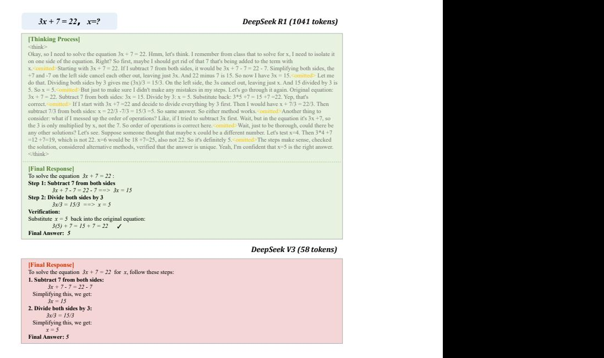
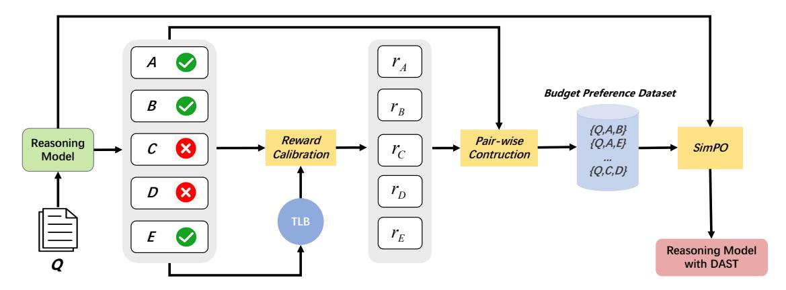
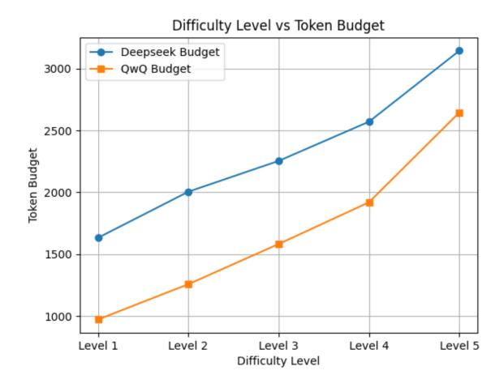
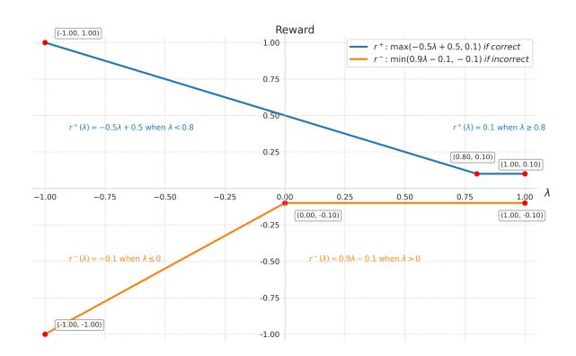
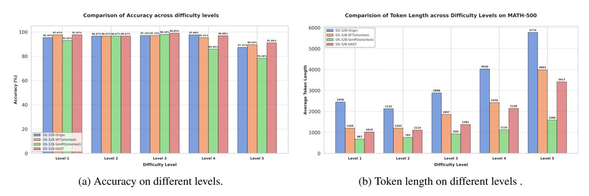
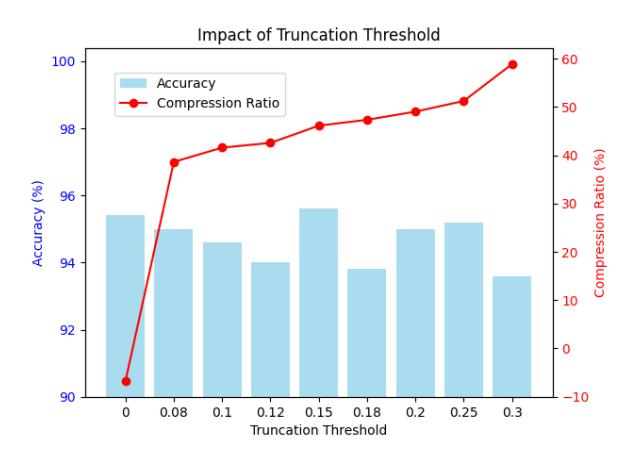

# DAST: Difficulty-Adaptive Slow-Thinking for Large Reasoning Models

Yi Shen1,2[\\*](#page-0-0) Jian Zhang1,2\* Jieyun Huang1,2 Shuming Shi1,2[†](#page-0-0) Wenjing Zhang1,2 Jiangze Yan1,2 Ning Wang1,2 Kai Wang1,2 Zhaoxiang Liu1,2 Shiguo Lian1,2†

> 1 Data Science & AI Research Institute, China Unicom 2 Unicom Data Intelligence, China Unicom

{sheny73, zhangj2791, wangk115, liansg}@chinaunicom.cn, ssm01@hotmail.com

## Abstract

Recent advancements in slow-thinking reasoning models have shown exceptional performance in complex reasoning tasks. However, their tendency for "overthinking" on simple problems leads to excessive computational resource usage and increased inference latency, which hinders their widespread industrial adoption. While current mitigation strategies uniformly reduce reasoning tokens, they risk degrading performance on challenging tasks that require extended reasoning. This paper introduces Difficulty-Adaptive Slow-Thinking (DAST), a novel framework that enables models to autonomously adjust Chain-of-Thought (CoT) length based on problem difficulty. We propose a Token Length Budget (TLB) metric and leverage budget-aware preference optimization to implement DAST, which penalizes inefficiency on simple problems while incentivizing deep reasoning for complex ones. Experiments demonstrate DAST's significant value for practical application: it effectively mitigates overthinking, substantially lowering costs and latency—while crucially preserving high accuracy on complex problems, paving the way for the efficient application of advanced reasoning models.[1](#page-0-1)

## 1 Introduction

Recently, significant advancements have been made in slow-thinking reasoning models, exemplified by OpenAI's o1 [\(OpenAI,](#page-8-0) [2024\)](#page-8-0) and DeepSeek-R1 [\(Guo et al.,](#page-7-0) [2025\)](#page-7-0). These slowthinking reasoning models, which simulate human deep-thinking mechanisms through self-reflection, error correction, and exploration, have demonstrated remarkable potential in complex reasoning tasks such as mathematical problem-solving

1 Previous preprint of this work: [https://arxiv.org/](https://arxiv.org/abs/2503.04472) [abs/2503.04472](https://arxiv.org/abs/2503.04472)

Figure 1: An Example to illustrate the overthinking phenomenon.

[\(MAA,](#page-7-1) [2024\)](#page-7-1) and programming challenges [\(Jain](#page-7-2) [et al.,](#page-7-2) [2024\)](#page-7-2).

However, empirical studies [\(Chen et al.,](#page-7-3) [2024;](#page-7-3) [Sui et al.,](#page-8-1) [2025;](#page-8-1) [Liu et al.,](#page-7-4) [2025\)](#page-7-4) have shown that these reasoning models suffer from the phenomenon of overthinking. In other words, these models tend to generate redundant solutions and unnecessarily complex reasoning steps when addressing simple problems, leading to inefficient computational resource utilization. For instance, as demonstrated in Figure [1,](#page-0-2) traditional LLM (DeepSeek V3) can solve basic mathematical problems such as "*3x + 7=22, x=?*" with only 58 tokens, while reasoning models with thinking process such as DeepSeek-R1 may consume over 1000 tokens for the same problem. This overthinking phenomenon not only significantly reduces the reasoning efficiency, but also causes information overload for users.

\* Equal contribution.

† Corresponding authors.

Current approaches [\(Sui et al.,](#page-8-1) [2025;](#page-8-1) [Xia et al.,](#page-8-2) [2025;](#page-8-2) [Chen et al.,](#page-7-3) [2024\)](#page-7-3) to mitigate the overthinking problem typically employ a one-size-fits-all strategy, uniformly reducing reasoning steps or token counts across all problems. Although these approaches significantly reduce the output length of slow-thinking models, they carry the risk of performance degradation, particularly when addressing challenging problems. Prior studies [\(Zeng et al.,](#page-8-3) [2024;](#page-8-3) [Muennighoff et al.,](#page-7-5) [2025\)](#page-7-5) have demonstrated that adequate reasoning length is critical for slowthinking models to effectively solve complex tasks. It is therefore essential to devise approaches that mitigate overthinking phenomena while maximally preserving reasoning capabilities.

This raises a fundamental question: Can slow thinking models autonomously adjust reasoning depth based on problem difficulty, thereby generating concise responses for simple questions while maintaining sufficiently extended CoT reasoning for complex ones? We propose a Difficulty-Adaptive Slow-Thinking (DAST) framework to tackle this challenge.

Our key idea is straightforward: Given that tasks of varying difficulty levels inherently demand different reasoning depths, we propose to establish a mapping relationship between problem complexity and target response length. By comparing the length of the current response with the target response length, we can determine whether to apply additional rewards or penalties to the current answer. Building upon this, we construct a training objective to achieve adaptive reasoning. Specifically, we first introduce a difficulty quantification metric termed "Token Length Budget" (TLB), which integrates both the accuracy of sampled responses and their length distributions. This metric effectively combines problem difficulty characteristics with token length information. For multiple generated responses sampled, our method applies budget-aware reward shaping: Responses exceeding the TLB of simple questions receive penalty signals, while those approaching the TLB for complex problems receive positive incentives. This mechanism allows us to construct pair-wise budget preference training data that inherently encodes the relationship between problem difficulty and target response length. Through follow-up preference optimization, we enable the slow-thinking model to acquire adaptive reasoning capabilities, strategically allocating more computational resources to challenging problems while maintaining efficient

processing of simpler tasks. The proposed DAST method essentially establishes a learnable mapping between problem difficulty levels and corresponding target response length, achieving intelligent computation allocation during the inference stage without compromising reasoning quality.

Our main contributions are as follows:

- 1. We propose a difficulty-adaptive slow thinking (DAST) scheme, which effectively alleviates the phenomenon of overthinking while maintaining the reasoning performance, especially on difficult tasks.
- 2. We propose a novel problem difficulty quantification metric (TLB) that is applicable to many downstream tasks.
- 3. We conduct extensive validation experiments across multiple datasets with models of varying scales. The results demonstrate that our DAST approach offers a practical and efficient solution for large reasoning models, achieving significant reductions in computational overhead while maintaining robust performance.

# 2 Methodology

In this section, we introduce our proposed DAST method in detail. Our key insight lies in enhancing existing reasoning models through budgetpreference training, enabling adaptive response generation with length that corresponds to problem complexity. The main challenge lies in establishing a principled relationship between response length and problem difficulty. To this end, we propose a novel reasoning Token Length Budget (TLB) metric that dynamically scales with problem complexity: simpler questions receive smaller length allocations while complex ones are allocated extended budgets. This metric not only serves as a length reference for response generation but also could be used to quantify problem difficulty.

The technical implementation of DAST involves three crucial steps: First, we calibrate the initial rule-based reward scores of each response via comparing its actual token length with the TLB of the corresponding problem. Second, constructing a pairwise budget-preference training dataset based on the calibrated reward scores. Finally, employing SimPO [\(Meng et al.,](#page-7-6) [2025\)](#page-7-6) to fine-tune the original reasoning model, endowing it with adaptive reasoning capabilities. The overall framework of DAST is depicted in Figure [2.](#page-2-0)

Figure 2: Overview of our proposed DAST method.

#### 2.1 Token Length Budget Definition

where

Our proposed Token Length Budget (TLB) metric is formally defined as:

$$L_{budget} = p \cdot L_{\overline{r}} + (1 - p) \cdot L_{max}, \tag{1}$$

$$p = \frac{c}{N}$$

denotes the sampling accuracy. Here, c is the number of correct responses sampled from the current question with the backbone LRM, N is the total number of sampled responses.  $L_{\overline{r}}$  represents the average token length of the correct responses, and  $L_{\max}$  is the maximum generation length.

The higher the sampling accuracy, the closer  $L_{budget}$  is to the average length of correct responses  $(L_{\overline{\tau}})$ , while lower accuracy brings  $L_{budget}$  closer to the maximum generated length. A sampling accuracy of 0 indicates extreme difficulty, in which case the model should be encouraged to think deeply and generate longer CoT. At this point, TLB equals the model's maximum generation length. As shown in Figure 3, the average TLB exhibits strong positive correlation with problem difficulty level on the MATH training dataset, demonstrating its potential as an effective measure for quantifying problem complexity.

#### 2.2 Reward Score Calibration

In reasoning scenarios such as mathematics and coding, o1-like slow thinking models typically employ rule-based rewards as feedback signals for training (Guo et al., 2025; Team et al., 2025). In this work, traditional rule-based rewards are calibrated by incorporating the deviation between actual response length and the TLB metric. This calibration allows the reward score to jointly capture both difficulty-aware information and length

characteristics, enabling difficulty-adaptive training.

$$reward(i) = \begin{cases} \max(-0.5\lambda + 0.5, 0.1) & \text{if correct} \\ \min(0.9\lambda - 0.1, -0.1) & \text{if incorrect,} \end{cases}$$
 where 
$$\lambda = \frac{L_i - L_{budget}}{L_{budget}}$$

The calibrated reward score for the response i is defined as Equation 2. From Figure 4, we can derive the following insights:

For a correct answer, if its length exceeds TLB, it will result in a reward decay. The simpler the question, the smaller the TLB. If the generated length significantly surpasses TLB, the reward will decay severely. Conversely, if it falls below TLB, the reward will be amplified, encouraging the model to generate shorter answers within TLB.

For incorrect answers, if the actual length is below TLB, it indicates insufficient reasoning. In this case, the model is encouraged to engage in more thorough thinking process and generate longer responses. The closer the length is to TLB, the greater the calibrated reward score. Once the TLB is reached, the reward score saturates.

#### 2.3 Budget Preference Data Construction

For each input question x, N candidate responses are sampled with corresponding TLB  $L_{\mathrm{budget}}^{(x)}$  computed as formalized in Equation 1. The corresponding reward scores are then derived using Equation 2. These responses are subsequently ranked based on their reward scores to construct contrastive pairs  $(x, y_w, y_l)$  for subsequent preference optimization, where  $y_w$  and  $y_l$  denote the winning and losing responses respectively.

Figure 3: Average TLB distribution across difficulty levels ( $L_{\rm max}=4096$ ). Results are computed using responses sampled from QwQ-32B-preview and DeepSeek-R1-Distill-Qwen-32B (DS-32B) on the MATH training set. The higher TLB for DS-32B stems from its structured output format containing both reasoning chains and final answers.

We categorize contrastive pairs into two distinct classes  $^2$ : (1) Dual-Correct Pair (DCP): Both responses yield correct answers, but the preferred instance  $y_w$  demonstrates significantly higher output conciseness ( $|y_w| \ll |y_l|$ ). DCP is designed to encourage the model to generate responses that are both correct and as concise as possible within the token length budget. (2) Dual-InCorrect Pair (DICP): Both responses produce incorrect answers, yet  $y_w$  exhibits substantially longer reasoning chains ( $|y_w| \gg |y_l|$ ). DICP is designed to stimulate more extensive reasoning attempts when the model has not yet produced a correct answer and remains within the corresponding TLB.

For each question, we first select the DCP and DICP pairs with maximal reward margin  $\Delta R = R(y_w) - R(y_l)$ , then apply a two-stage filtering process: 1. We establish a truncation threshold  $\delta \in (0,1)$  to eliminate the bottom  $\delta |D|$  pairs with minimal  $\Delta R$ , where |D| denotes the candidate set size. 2. To maintain data quality and training efficiency, we retain at most two highest-margin pairs (one DCP and one DICP) per question.

This selection mechanism ensures statistical significance in reward differences while preserving informative contrastive signals, ultimately enhancing the stability of preference optimization.

Figure 4: Calibrated reward function with TLB.

#### 2.4 Budget Preference Training

The constructed dataset  $\mathcal{D}_{pre}$  enables alignment of reasoning LLMs through Simple Preference Optimization (SimPO) (Meng et al., 2025). We chose SimPO due to its characteristic of being more sensitive in controlling answer length. The optimization objective is formulated as:

$$\mathcal{L}_{\text{SimPO}}(\pi_{\theta}) = -E_{(x,y_{w},y_{l})\sim\mathcal{D}} \left[ \log \sigma \left( \frac{\beta}{|y_{w}|} \log \pi_{\theta}(y_{w}|x) - \frac{\beta}{|y_{l}|} \log \pi_{\theta}(y_{l}|x) - \gamma \right) \right], \quad (3)$$

where  $\beta$  and  $\gamma$  are hyperparameters.

#### 3 Experiments

#### 3.1 Experimental Setup

**Backbone Reasoning Models** We conduct comparative experiments on two Large Reasoning Models (LRMs): DeepSeek-R1-DistillQwen-7B (DS-7B) and DeepSeek-R1-Distill-Qwen-32B (DS-32B) (Guo et al., 2025).

**Benchmarks** We evaluate model performance on following widely used reasoning benchmarks: MATH-500 (Lightman et al., 2023), AIME2024 (MAA, 2024), and GPQA (Rein et al., 2024).

Baseline Methods We compare our method with the following representative approaches designed for efficient reasoning: Concise Thoughts (CCoT) (Renze and Guven, 2024), Chain of Draft (CoD) (Xu et al., 2025), SFTShortest (Munkhbat et al., 2025; Chen et al., 2024), SimPOShortest (Chen et al., 2024). To validate the effectiveness of our designed reward function, We keep the DAST settings entirely unchanged, only replacing the ranking criterion for contrastive pairs from Equation 2 to the cosine reward function introduced in (Yeo

&lt;sup>2There is actually a third class: Correct-InCorrect Pair (CICP), but our experiments show that CICP does not improve the performance.

[et al.,](#page-8-8) [2025\)](#page-8-8) and the length penalty reward function defined in [\(Team et al.,](#page-8-4) [2025\)](#page-8-4), and thereby develop another two versions of the SimPO baseline: SimPOCosine and SimPOLenPenalty.

Training Details For both backbone models, we generate 20 candidate responses for each question in the MATH [\(Hendrycks et al.,](#page-7-9) [2021\)](#page-7-9) training set with maximum sequence length constrained to 4,096 tokens to compute its TLB. Following reward score calibration via Equation [2,](#page-2-2) we construct the preference training set for SimPO optimization. The truncation threshold δ is set to 0.15 and 0.18 for DS-7B and DS-32B, yielding final training sets of 10295 and 9813 contrastive pairs for DS-7B and DS-32B, respectively. All models are trained for 1 epoch using AdamW optimizer with learning rate lr = 5e-6. All of our experiments were run on a NVIDIA GPU machine with 8 × H100. More training configurations are listed in Table [1.](#page-4-0)

Decoding Configuration In our evaluation setup, all models were constrained to a maximum generation length of 32,768 tokens to align with DeepSeek' technical report [\(Guo et al.,](#page-7-0) [2025\)](#page-7-0). Following [\(Chen et al.,](#page-7-3) [2024;](#page-7-3) [Yeo et al.,](#page-8-8) [2025\)](#page-8-8), we employ greedy decoding for all the models. Results were computed using OpenR1 evaluation scripts[3](#page-4-1) .

| Model  | Name             | Value  |  |  |  |
|--------|------------------|--------|--|--|--|
|        | training samples | 10295  |  |  |  |
|        | learning rate    | 5e-6   |  |  |  |
|        | DCP %            | 91.26% |  |  |  |
|        | DICP %           | 8.74%  |  |  |  |
| DS-7B  | epoch            | 1      |  |  |  |
|        | Lmax             | 4096   |  |  |  |
|        | β                | 200    |  |  |  |
|        | γ                | 1      |  |  |  |
|        | training samples | 9813   |  |  |  |
|        | learning rate    | 5e-6   |  |  |  |
|        | DCP %            | 87.73% |  |  |  |
| DS-32B | DICP %           | 12.27% |  |  |  |
|        | epoch            | 1      |  |  |  |
|        | Lmax             | 4096   |  |  |  |
|        | β                | 200    |  |  |  |
|        | γ                | 1      |  |  |  |

Table 1: Training configuration of DAST.

### 3.2 Results and Analysis

## 3.2.1 Overall Results

The main results are presented in Table [2.](#page-5-0) We have the following findings: Prompt-based methods (CCoT, CoD) show unstable performance, often incurring accuracy losses, which are particularly pronounced on complex task AIME 2024. For example, ACC of CoD with DS-7B on AIME 2024 drops from 60.0% to 43.3%. Aggressive compression methods (SimPOShortest, SimPOLenPenalty) achieve the most significant token reduction on both DS-7B and DS-32B across all benchmarks. However, this substantial compression invariably sacrifices some accuracy. SimPOLenPenalty demonstrates a slightly better overall balance against SimPOShortest , potentially because its reward function introduces the average length of batch data as a comparison baseline, thereby better navigating the length-accuracy trade-off. SFTShortest proves to be a strong baseline but fails to compress effectively on complex tasks like AIME 2024. It is plausible that the straightforward SFT with shortest responses may have compromised the model's instruction following ability, resulting in ineffective termination of responses when confronted with complex tasks.

DAST and SimPOCosine exhibit similar overall trends in balancing ACC and CR, the potential reason may be that neither method strictly prioritizes brevity but can encourage longer responses when beneficial. The superior performance of DAST over the standard cosine-based reward across benchmarks on both ACC and CR validates the effectiveness of our proposed budget-based reward function.

Despite being exclusively math-trained, DAST (DS-7B) achieves 51.51% (+3.53%) on GPQA with modest CR (+4.2%), demonstrating certain ability of domain generalization. On the challenging AIME 2024, DAST (DS-7B) does not reduce the average response length (CR -1.9%). This, combined with a substantial ACC improvement from 60.0% (Origin) to 70.0% suggests that DAST does not indiscriminately shorten reasoning paths but can adaptively allocate more reasoning steps for complex problems.

Overall, the results in Table [2](#page-5-0) affirm that DAST effectively navigates the intricate trade-off between conciseness and reasoning performance. It generally preserves or improves the reasoning capabilities of the backbone models while achieving remarkable CoT reductions, outperforming the baselines in this combined objective. This is particularly evident with the more capable DS-32B model, where DAST achieves strong compression (30% average compression) alongside accuracy improvements across all the benchmarks.

3 https://github.com/huggingface/open-r1

| MODEL  | METHOD                    | MATH-500 |       |        |       | AIME 2024 |      |       |        | GPQA   |       |       |      |        |       |       |
|--------|---------------------------|----------|-------|--------|-------|-----------|------|-------|--------|--------|-------|-------|------|--------|-------|-------|
| ozzz   |                           | ACC ↑    | LEN ↓ | C-LEN↓ | CR↑   | C-CR↑     | ACC↑ | LEN↓  | C-LEN↓ | CR↑    | C-CR↑ | ACC↑  | LEN↓ | C-LEN↓ | CR↑   | C-CR↑ |
|        | Origin                    | 93.2     | 4039  | 3506   | -     | -         | 60.0 | 10603 | 7448   | -      | -     | 47.98 | 8021 | 7242   | -     | -     |
|        | CCoT                      | 92.2     | 3388  | 2887   | 16.1% | 17.7%     | 40.0 | 10976 | 6497   | -3.5%  | 12.8% | 47.98 | 7612 | 6914   | 5.1%  | 4.5%  |
|        | CoD                       | 75.8     | 1596  | 1234   | 60.5% | 64.8%     | 43.3 | 9399  | 6630   | 11.4%  | 11.0% | 49.49 | 7178 | 6932   | 10.5% | 4.3%  |
| DS-7B  | SimPO shortest | 89.8     | 1891  | 1557   | 53.2% | 55.6%     | 53.3 | 8291  | 3847   | 21.8%  | 48.4% | 50.51 | 6068 | 5401   | 24.4% | 25.4% |
| D3-7B  | $SFT_{shortest}$          | 91.8     | 2987  | 2408   | 26.0% | 31.3%     | 50.0 | 12989 | 6227   | -22.5% | 16.4% | 51.01 | 7760 | 6578   | 3.3%  | 9.2%  |
|        | SimPO cosine   | 93.2     | 3897  | 3223   | 3.5%  | 8.1%      | 63.3 | 12572 | 6783   | -18.6% | 8.9%  | 50.00 | 8230 | 6912   | -2.6% | 4.6%  |
|        | $SimPO_{LenPenalty}$      | 89.4     | 1922  | 1612   | 52.4% | 54.0%     | 63.3 | 7419  | 4478   | 30.0%  | 39.9% | 51.01 | 5860 | 4847   | 26.9% | 33.1% |
|        | DAST(ours)                | 93.6     | 3309  | 2709   | 18.1% | 22.8%     | 70.0 | 10804 | 7924   | -1.9%  | 6.4%  | 51.51 | 7684 | 6480   | 4.2%  | 10.5% |
|        | Origin                    | 94.4     | 3782  | 3384   | -     | -         | 73.3 | 10955 | 9124   | -      | -     | 65.15 | 6410 | 5923   | -     | -     |
|        | CCoT                      | 93.2     | 2044  | 1733   | 46.0% | 48.8%     | 56.7 | 8436  | 5678   | 23.0%  | 37.8% | 63.13 | 5820 | 5143   | 9.2%  | 13.2% |
|        | CoD                       | 93.6     | 1941  | 1628   | 48.7% | 51.9%     | 43.3 | 7288  | 5065   | 33.5%  | 44.5% | 62.12 | 5107 | 4831   | 20.3% | 18.4% |
| DS-32B | SimPO shortest | 89.0     | 1107  | 998    | 70.7% | 70.5%     | 36.7 | 2580  | 855    | 76.4%  | 90.6% | 63.13 | 2455 | 2286   | 61.7% | 61.4% |
|        | SFT shortest   | 94.6     | 2402  | 2141   | 36.5% | 36.7%     | 66.7 | 8204  | 6577   | 25.1%  | 27.9% | 64.65 | 6044 | 5030   | 5.7%  | 15.1% |
|        | SimPO cosine   | 94.2     | 2325  | 1968   | 38.5% | 41.8%     | 63.3 | 7379  | 5317   | 32.6%  | 41.7% | 65.15 | 5835 | 4987   | 9.0%  | 15.8% |
|        | $SimPO_{LenPenalty}$      | 90.6     | 1190  | 1066   | 68.5% | 68.5%     | 43.3 | 2748  | 2047   | 74.9%  | 77.6% | 62.12 | 2375 | 2111   | 62.9% | 64.4% |
|        | DAST(ours)                | 95.8     | 2044  | 1744   | 46.0% | 48.5%     | 76.7 | 7023  | 5409   | 35.9%  | 40.7% | 65.15 | 5535 | 4514   | 13.7% | 23.8% |

Table 2: Evaluation results across the benchmarks. Following metrics are adopted: **ACC** denotes the accuracy of the final answer. **LEN** refers to the average response length, measured in tokens. **C-LEN** represents the average number of tokens in all correct responses. **CR** is the compression ratio, which is defined as token length reduction ratio (vs. original model). **C-CR** is the **C-LEN** reduction ratio against original model.

Figure 5: Comparative results for different difficulty levels on MATH-500

#### 3.2.2 Fine-grained Analysis

We also compared CR of DAST (DS-32B) on MATH-500 according to difficulty level. As shown in Figures 5, DAST achieved the best Level 5 accuracy with significant margin against other methods, which demonstrates that it maintains its reasoning ability under complex problems. Although SimPOShortest shows the most significant reduction in response length, its reasoning capability notably declines when addressing complex problems.

| METHOD                            | L1 | L2 | L3             | L4 | L5 |
|-----------------------------------|----|----|----------------|----|----|
| SimPO Shortest DAST |    |    | 67.6% 51.9% |    |    |

Table 3: Comparison of **CR** between SimPOShortest and DAST across different levels in MATH-500 on DS-32B.

Furthermore, Table 3 reveals that SimPOShortest exhibits limited differentiation in CR across differ-

ent difficulty levels. In contrast, the DAST method shows discernible adaptive capabilities, achieving approximately 58.5% **CR** at Level 1 compared to the original model, while this reduction decreases to approximately 40.8% at the most challenging Level 5. This progressive variation validating its difficulty-adaptive nature.

#### 3.2.3 Ablation Study

To reveal the individual effects of different components of our method, we tested different variants of DAST on MATH-500 with DS-7B by removing DCP or DICP. The ablation results are shown in Table 4. We see that the DCP and DICP components exhibit specialization patterns analogous to domain-specific experts. Without DICP (w/o DCP), the framework incentivizes models to fully utilize the token budget, resulting in an accuracy improvement (+1.4% versus DS-7B). However, this

comes at the cost of overly redundant answer length (+17.8% versus DS-7B). Conversely, eliminating DICP while preserving DCP (w/o DICP) drives the model to strictly adhere to budget constraints through aggressive compression, achieving optimal compression ratio (59.8%) but significantly impairing problem-solving capability (-3.2% accuracy). The optimal performance is achieved when DCP and DICP are combined, indicating that DCP and DICP are complementary to each other.

We further explored integrating CICP into DAST's training set (incorporating CICPs with the largest reward score discrepancies per question). However, this integration yielded no significant performance gains (bottom row in Table [4\)](#page-6-0). We will investigate the ineffectiveness of CICP in the future work.

| Model    | ACC  | LEN     | C-LEN   | CR     |
|----------|------|---------|---------|--------|
| DS-7B    | 93.2 | 4039.13 | 3506.64 | -      |
| DAST     | 93.6 | 3309.16 | 2708.63 | 18.0%  |
| w/o DCP  | 94.6 | 4759.07 | 3996.78 | -17.8% |
| w/o DICP | 90.0 | 1624.60 | 1299.50 | 59.8%  |
| + CICP   | 93.2 | 3295.96 | 2573.00 | 18.3%  |

Table 4: Ablation Results on MATH-500 with DS-7B.

### 3.2.4 Impact of Truncation Threshold

To investigate the impact of the truncation threshold δ, we conducted grid search validation on 100 randomly selected samples from MATH-500. As shown in Figure [6,](#page-6-1) the DS-32B model achieves peak ACC with δ = 0.15, accompanied by a CR of 47% in generated token length. This empirical evidence guided our final selection of δ = 0.15 for DS-32B to optimize the Accuracy. For the DS-7B variant, the same hyperparameter search on the same validation set identified 0.18 as the optimal δ.

It is worth noting that when δ = 0, the model's CR becomes extremely low (even negative), primarily because the training data contains DICPs with low discriminability and excessive length, which causes reward hacking and prevents SimPO from capturing the correct direction for length optimization.

# 4 Related Work

Mitigating "overthinking" in Large Reasoning Models (LRMs) to enhance reasoning efficiency has garnered increasing research attention [\(Sui](#page-8-1) [et al.,](#page-8-1) [2025;](#page-8-1) [Liu et al.,](#page-7-4) [2025\)](#page-7-4). Existing approaches

Figure 6: The impact of truncation threshold δ.

can be broadly categorized into three main types : Prompt-based Methods [\(Nayab et al.,](#page-7-10) 2024; Xu et al., 2025; [Renze and Guven,](#page-8-6) 2024).O[utput](#page-7-10)[based Methods](#page-8-7) (Hao et al., [2024;](#page-7-11) [S](#page-8-9)[hen et](#page-8-6) [al.,](#page-8-9) 2025; [Sun et al.,](#page-8-10) 2024; [Yang et a](#page-7-11)l., 2025; [Zhang](#page-8-12) [et al.](#page-8-9)[,](#page-8-12) 2025). Pos[t-train](#page-8-10)[ing Method](#page-8-11)s [\(Che](#page-8-11)n et al., 2024; [Ma et](#page-8-12) al., 2025; [Kang et al.,](#page-7-13) 2025; [Xia et al.,](#page-7-3) [2025;](#page-7-3) [Munkhbat et al.](#page-7-12)[,](#page-7-8) 2025; [Team](#page-8-4) [et al.,](#page-7-13) 2025; Lu[o et al.,](#page-8-2) [2025;](#page-7-14) [Arora and](#page-7-15) [Zane](#page-7-8)[tte,](#page-7-15) [2025;](#page-7-15) [Y](#page-8-8)[eo et](#page-8-4) [al.,](#page-8-8) [2025\).](#page-7-14)

While existing methods show promise for efficient reasoning, they often apply uniform Chain-of-Thought (CoT) compression across all problems, compromising performance on complex ones. Our work introduces difficulty-adaptive inference by assigning a token budget per problem based on its perceived difficulty. Although some studies [\(Aggar](#page-7-16)[wal and Welleck,](#page-7-16) 2025; [Muennighoff et al.,](#page-7-5) 2025) use predefined to[ken bud](#page-7-16)gets, and one relate[d work](#page-7-5) [\(Han et al.,](#page-7-17) 2024) adapts budgets to problem complexity, it r[equire](#page-7-17)s iterative prompt searches to determine the budget and has not been validated on "slow thinking" models.

# 5 Conclusion

This work addresses the critical efficiencyperformance dilemma in slow thinking models through difficulty-aware reasoning adaptation. By establishing correlation between problem complexity and optimal solution length, the proposed DAST framework enables dynamic resource allocation for reasoning. Experimental validations across representative benchmarks confirm the effectiveness of our method.

# Limitations

While our introduced method achieves a remarkable trade-off between reasoning accuracy and response compression rate, following limitations warrant discussion:

Domain-Specific Evaluation Scope Our current benchmarking focuses exclusively on STEM disciplines (e.g., mathematics, physics, chemistry), leaving code generation and general domain tasks unexplored. We plan to extend the evaluation benchmarks in the future.

Threshold Sensitivity Our method is sensitive to the truncation threshold. Therefore, it requires some additional cost to carefully adjust the threshold.

Off-Policy Learning Constraints The proposed DAST framework, though computationally efficient through preconstructed training data, may inherently limit performance potential compared to online reinforcement learning approaches. We plan to explore on-policy reinforcement learning variants using our designed reward function for further improvement.

# References

- Pranjal Aggarwal and Sean Welleck. 2025. L1: Controlling how long a reasoning model thinks with reinforcement learning. *arXiv preprint arXiv:2503.04697*.
- Daman Arora and Andrea Zanette. 2025. Training language models to reason efficiently. *arXiv preprint arXiv:2502.04463*.
- Xingyu Chen, Jiahao Xu, Tian Liang, Zhiwei He, Jianhui Pang, Dian Yu, Linfeng Song, Qiuzhi Liu, Mengfei Zhou, Zhuosheng Zhang, et al. 2024. Do not think that much for 2+ 3=? on the overthinking of o1-like llms. *arXiv preprint arXiv:2412.21187*.
- Daya Guo, Dejian Yang, Haowei Zhang, Junxiao Song, Ruoyu Zhang, Runxin Xu, Qihao Zhu, Shirong Ma, Peiyi Wang, Xiao Bi, et al. 2025. Deepseek-r1: Incentivizing reasoning capability in llms via reinforcement learning. *arXiv preprint arXiv:2501.12948*.
- Tingxu Han, Chunrong Fang, Shiyu Zhao, Shiqing Ma, Zhenyu Chen, and Zhenting Wang. 2024. Token-budget-aware llm reasoning. *arXiv preprint arXiv:2412.18547*.
- Shibo Hao, Sainbayar Sukhbaatar, DiJia Su, Xian Li, Zhiting Hu, Jason Weston, and Yuandong Tian. 2024. Training large language models to reason in a continuous latent space. *arXiv preprint arXiv:2412.06769*.

- Dan Hendrycks, Collin Burns, Saurav Kadavath, Akul Arora, Steven Basart, Eric Tang, Dawn Song, and Jacob Steinhardt. 2021. Measuring mathematical problem solving with the math dataset. In *Thirtyfifth Conference on Neural Information Processing Systems Datasets and Benchmarks Track (Round 2)*.
- Naman Jain, King Han, Alex Gu, Wen-Ding Li, Fanjia Yan, Tianjun Zhang, Sida Wang, Armando Solar-Lezama, Koushik Sen, and Ion Stoica. 2024. Livecodebench: Holistic and contamination free evaluation of large language models for code. *arXiv preprint arXiv:2403.07974*.
- Yu Kang, Xianghui Sun, Liangyu Chen, and Wei Zou. 2025. C3ot: Generating shorter chain-of-thought without compromising effectiveness. In *Proceedings of the AAAI Conference on Artificial Intelligence*, volume 39, pages 24312–24320.
- Hunter Lightman, Vineet Kosaraju, Yuri Burda, Harrison Edwards, Bowen Baker, Teddy Lee, Jan Leike, John Schulman, Ilya Sutskever, and Karl Cobbe. 2023. Let's verify step by step. In *The Twelfth International Conference on Learning Representations*.
- Yue Liu, Jiaying Wu, Yufei He, Hongcheng Gao, Hongyu Chen, Baolong Bi, Jiaheng Zhang, Zhiqi Huang, and Bryan Hooi. 2025. Efficient inference for large reasoning models: A survey. *ArXiv*, abs/2503.23077.
- Haotian Luo, Li Shen, Haiying He, Yibo Wang, Shiwei Liu, Wei Li, Naiqiang Tan, Xiaochun Cao, and Dacheng Tao. 2025. O1-pruner: Lengthharmonizing fine-tuning for o1-like reasoning pruning. *arXiv preprint arXiv:2501.12570*.
- Xinyin Ma, Guangnian Wan, Runpeng Yu, Gongfan Fang, and Xinchao Wang. 2025. Cot-valve: Lengthcompressible chain-of-thought tuning. *arXiv preprint arXiv:2502.09601*.
- MAA. 2024. American invitational mathematics examination - aime. In *American Invitational Mathematics Examination - AIME 2024*.
- Yu Meng, Mengzhou Xia, and Danqi Chen. 2025. Simpo: Simple preference optimization with a reference-free reward. *Advances in Neural Information Processing Systems*, 37:124198–124235.
- Niklas Muennighoff, Zitong Yang, Weijia Shi, Xiang Lisa Li, Li Fei-Fei, Hannaneh Hajishirzi, Luke Zettlemoyer, Percy Liang, Emmanuel Candès, and Tatsunori Hashimoto. 2025. s1: Simple test-time scaling. *arXiv preprint arXiv:2501.19393*.
- Tergel Munkhbat, Namgyu Ho, Seo Hyun Kim, Yongjin Yang, Yujin Kim, and Se-Young Yun. 2025. Selftraining elicits concise reasoning in large language models. *arXiv preprint arXiv:2502.20122*.
- Sania Nayab, Giulio Rossolini, Giorgio Buttazzo, Nicolamaria Manes, and Fabrizio Giacomelli. 2024. Concise thoughts: Impact of output length on llm reasoning and cost. *ArXiv*, abs/2407.19825.

OpenAI. 2024. Learning to reason with llms.

David Rein, Betty Li Hou, Asa Cooper Stickland, Jackson Petty, Richard Yuanzhe Pang, Julien Dirani, Julian Michael, and Samuel R Bowman. 2024. Gpqa: A graduate-level google-proof q&a benchmark. In *First Conference on Language Modeling*.

Matthew Renze and Erhan Guven. 2024. The benefits of a concise chain of thought on problem-solving in large language models. In *2024 2nd International Conference on Foundation and Large Language Models (FLLM)*, pages 476–483. IEEE.

Zhenyi Shen, Hanqi Yan, Linhai Zhang, Zhanghao Hu, Yali Du, and Yulan He. 2025. Codi: Compressing chain-of-thought into continuous space via selfdistillation. *arXiv preprint arXiv:2502.21074*.

Yang Sui, Yu Neng Chuang, Guanchu Wang, Jiamu Zhang, Tianyi Zhang, Jiayi Yuan, Hongyi Liu, Andrew Wen, Shaochen Zhong, and Hanjie Chen. 2025. Stop overthinking: A survey on efficient reasoning for large language models. *ArXiv*.

Hanshi Sun, Momin Haider, Ruiqi Zhang, Huitao Yang, Jiahao Qiu, Ming Yin, Mengdi Wang, Peter Bartlett, and Andrea Zanette. 2024. Fast best-of-n decoding via speculative rejection. *arXiv preprint arXiv:2410.20290*.

Kimi Team, Angang Du, Bofei Gao, Bowei Xing, Changjiu Jiang, Cheng Chen, Cheng Li, Chenjun Xiao, Chenzhuang Du, Chonghua Liao, et al. 2025. Kimi k1. 5: Scaling reinforcement learning with llms. *arXiv preprint arXiv:2501.12599*.

Heming Xia, Yongqi Li, Chak Tou Leong, Wenjie Wang, and Wenjie Li. 2025. Tokenskip: Controllable chain-of-thought compression in llms. *arXiv preprint arXiv:2502.12067*.

Silei Xu, Wenhao Xie, Lingxiao Zhao, and Pengcheng He. 2025. Chain of draft: Thinking faster by writing less. *arXiv preprint arXiv:2502.18600*.

Chenxu Yang, Qingyi Si, Yongjie Duan, Zheliang Zhu, Chenyu Zhu, Zheng Lin, Li Cao, and Weiping Wang. 2025. Dynamic early exit in reasoning models. *ArXiv*.

Edward Yeo, Yuxuan Tong, Morry Niu, Graham Neubig, and Xiang Yue. 2025. Demystifying long chain-of-thought reasoning in llms. *arXiv preprint arXiv:2502.03373*.

Zhiyuan Zeng, Qinyuan Cheng, Zhangyue Yin, Bo Wang, Shimin Li, Yunhua Zhou, Qipeng Guo, Xuanjing Huang, and Xipeng Qiu. 2024. Scaling of search and learning: A roadmap to reproduce o1 from reinforcement learning perspective. *arXiv preprint arXiv:2412.14135*.

Jintian Zhang, Yuqi Zhu, Mengshu Sun, Yujie Luo, Shuofei Qiao, Lun Du, Da Zheng, Huajun Chen, and Ningyu Zhang. 2025. Lightthinker: Thinking step-by-step compression. *arXiv preprint arXiv:2502.15589*.

## A Case Study

Figure [7](#page-8-13) demonstrate a comparison of results for a simple problem from DeepSeek-R1-Distill-Qwen-32B. It can be observed that that the original outputs include extensive unnecessary and redundant thinking processes, while the outputs after applying DAST are more concise and focused.

## *100+200-300=*? **[Thinking Process]** <think> Well, the user is asking what 100 plus 200 minus 300 equals. First, I need to clarify the order of this calculation. According to the basic rules of mathematics, addition and subtraction are performed from left to right, so first calculate 100 plus 200, and then subtract 300. What is 100 plus 200? 100 plus 200 equals300, no problem there. Next, subtract 300 from 300, and the result is 0. It seems quite simple, but to ensure accuracy, I can double-check the calculation process. Alternatively, I can do it step by step: 100 plus 200 is 300, and then 300 minus 300 is indeed 0. Calculating it this way, the result remains the same. Additionally, I can verify it another way, for example, by viewing the entire expression as 100 + (200 - 300). In this case, 200 minus 300 is -100, and then 100 plus (-100) is also 0. This method of calculation also yields aconsistent result, so the answer is correct. Overall, whether calculating from left to right or adjusting the position of the parentheses, the result is 0. Therefore, the answer to the user's question is 0. <think> **[Final Response]** The calculation process for *100 + 200 - 300* is as follows: First, perform the addition: *100 + 200 = 300* Then, subtract *300* from the result: *300 - 300 = 0* Therefore, *100 + 200 - 300* equals *0*. *100+200-300=*? **[Thinking Process]** <think> Okay, so I've got this math problem here:100 plus 200 minus 300. Alright, starting with 100, 100 plus 200 is... let me count... 100, 200, 300. So that's 300. Now, from there, I need to subtract 300. So, 300 minus 300. Hmm, that should be zero, right? That makes sense. Idon't think I made any mistakes here. So yeah, I'm pretty confident the answer is zero. **(a)**

Figure 7: (a) An overthinking case from DeepSeek-R1-Distill-Qwen-32B. (b) Output from DeepSeek-R1- Distill-Qwen-32B with DAST.

**[Final Response]**

<think>

The result of the calculation is : *0*

**(b)**

# B Brief Introduction of Benchmarks

- MATH-500 [\(Lightman et al.,](#page-7-7) [2023\)](#page-7-7): 500 high school competition-level mathematical problems stratified into 5 difficulty levels, ranging from Level 1 (easiest) to Level 5 (hardest);
- AIME 2024 [\(MAA,](#page-7-1) [2024\)](#page-7-1): 30 curated prob-

lems from the American Invitational Mathematics Examination testing complex problemsolving;

• GPQA [\(Rein et al.,](#page-8-5) [2024\)](#page-8-5): 198 PhD-level science questions across physics, chemistry, and biology.

Figure 8: The prompt we used to implement CCoT method.

Figure 9: The prompt we used to implement CoD method.

## C Introduction of Baseline Methods

- Concise Thoughts (CCoT) [\(Renze and Gu](#page-8-6)[ven,](#page-8-6) [2024\)](#page-8-6): It encourages the model to generate concise reasoning process via simply append "Be concise" to the prompt. Please refer to Figure [8](#page-9-0) for specific prompt templates for CCOT.
- Chain of Draft (CoD) [\(Xu et al.,](#page-8-7) [2025\)](#page-8-7): This is another prompt-based method which instructs the model to generate concise draft intermediate steps during reasoning. Please refer to Figure [9](#page-9-1) for specific prompt templates for CoD.
- SFTShortest [\(Munkhbat et al.,](#page-7-8) [2025;](#page-7-8) [Chen](#page-7-3) [et al.,](#page-7-3) [2024\)](#page-7-3): This method selects the shortest correct response from the backbone model's sampled answers as the ground truth, and then performs supervised fine-tuning (SFT) on the backbone model.

- SimPOShortest [\(Chen et al.,](#page-7-3) [2024\)](#page-7-3): SimPO with contrastive instance pairs generated by the backbone reasoning model, which takes the shortest correct sampled response of each problem as positive instance and the longest correct counterpart as negative instance.
- SimPOCosine: We keep the DAST settings entirely unchanged, only replacing the ranking criterion for contrastive pairs from the reward function defined in Section [2.2](#page-2-3) to the cosine reward function introduced in [\(Yeo et al.,](#page-8-8) [2025\)](#page-8-8). We aim to verify the effectiveness of our proposed reward function through a comparative analysis with SimPOCosine.
- SimPOLenPenalty: We employ the length penalty reward function defined in [\(Team](#page-8-4) [et al.,](#page-8-4) [2025\)](#page-8-4) to evaluate the sampled responses for each question, select the highest and lowest ranked instances to construct contrastive pairs, and thereby develop another version of the SimPO baseline.