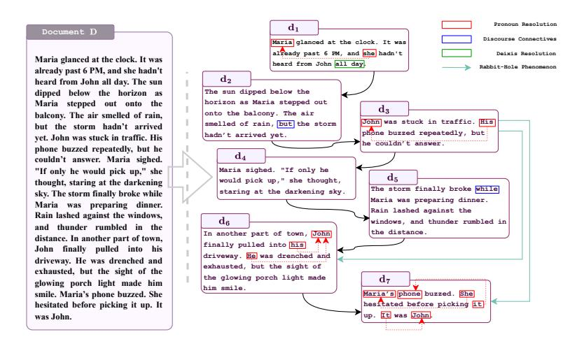
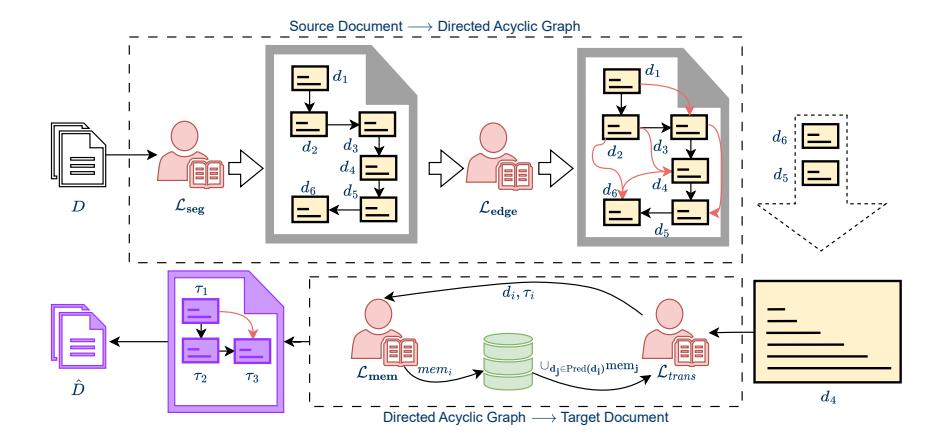
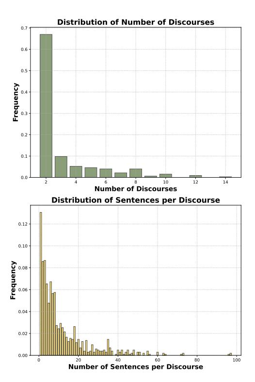
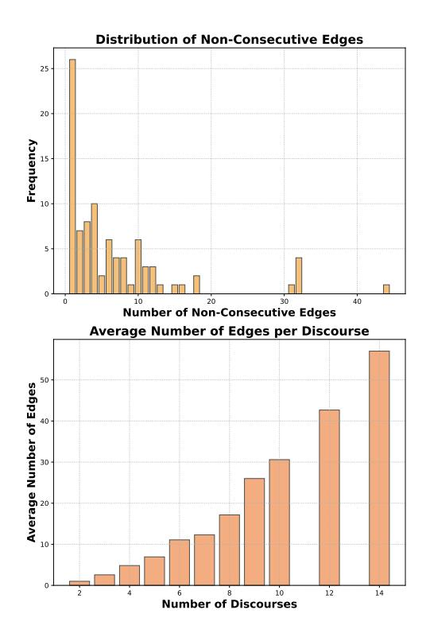

# <span id="page-0-0"></span>GRAFT: A Graph-based Flow-aware Agentic Framework for Document-level Machine Translation

Himanshu Dutta<sup>1</sup>,3[\\*](#page-0-0), Sunny Manchanda<sup>2</sup> , Prakhar Bapat<sup>2</sup> , Meva Ram Gurjar<sup>2</sup> , Pushpak Bhattacharyya<sup>1</sup> 1 Indian Institute of Technology Bombay, India <sup>2</sup>DYSL-AI, DRDO, India <sup>3</sup>Microsoft Research, India {hdutta1024, manchanda.sunny}@gmail.com, pb@cse.iitb.ac.in

# Abstract

Enterprises, public organizations, and localization providers increasingly rely on Documentlevel Machine Translation (DocMT) to process contracts, reports, manuals, and multimedia transcripts across languages. However, existing MT systems often struggle to handle discourse-level phenomena such as pronoun resolution, lexical cohesion, and ellipsis, resulting in inconsistent or incoherent translations. We propose GRAFT, a modular graph-based DocMT framework that leverages Large Language Model (LLM) agents to segment documents into discourse units, infer inter-discourse dependencies, extract structured memory, and generate context-aware translations. GRAFT transforms documents into directed acyclic graphs (DAGs) to explicitly model translation flow and discourse structure. Experiments across eight language directions and six domains show GRAFT outperforms commercial systems (e.g., Google Translate) and closed LLMs (e.g., GPT-4) by an average of 2.8 d-BLEU, and improves terminology consistency and discourse handling. GRAFT supports deployment with opensource LLMs (e.g., LLaMA, Qwen), making it cost-effective and privacy-preserving. These results position GRAFT as a robust solution for scalable, document-level translation in real-world applications. The codebase and data can be found at [https://github.com/](https://github.com/himanshu-dutta/graft) [himanshu-dutta/graft](https://github.com/himanshu-dutta/graft).

## 1 Introduction

The growing global demand for real-time content localization, multilingual compliance, and crossborder communication has intensified the need for accurate document-level machine translation in sectors like finance, healthcare, legal services, and government. Whether translating legal contracts, product manuals, or multimedia transcripts, organizations face significant challenges in maintaining

consistency, fluency, and semantic integrity across long-form documents. Industrial translation workflows frequently involve massive volumes-often exceeding hundreds of thousands of pages per monthwhere errors in pronoun resolution, terminology drift, or contextual ambiguity can incur high costs.[1](#page-0-1) [2](#page-0-2) [3](#page-0-3) Despite the progress of modern sentence-level MT systems, they often produce brittle and fragmented output when faced with discourse-level complexity that spans multiple paragraphs or sections [\(Maruf et al.,](#page-9-0) [2021a\)](#page-9-0). DocMT seeks to generate translations that not only preserve the meaning of individual sentences but also maintain coherence, cohesion, and consistency across an entire document [\(Bawden et al.,](#page-7-0) [2018\)](#page-7-0).

Discourse phenomena in MT can be classified into *intra-discoursal* and *inter-discoursal* phenomena. Intra-discoursal phenomena, such as pronoun resolution, tense and aspect consistency, ellipsis recovery, and idiomatic expression translation, arise within a coherent segment of text. Inter-discoursal phenomena, such as entity co-reference, lexical cohesion, discourse connectives, and thematic progression, link separate segments to produce a fluent and coherent document [\(Hu and Wan,](#page-9-1) [2023\)](#page-9-1).[4](#page-0-4)

*Figure [1](#page-1-0) shows an example document segmented into discourses, annotated with various discourse phenomena.*

[Wang et al.](#page-10-0) [\(2025\)](#page-10-0) focus on treating documentlevel MT as a sequential translation task. They translate each sentence individually in a sequence, while maintaining a persistent memory, which is updated after the translation of each sentence. Similarly, [Hu and Wan](#page-9-1) [\(2023\)](#page-9-1) explore the inherent discourse structure present in documents by utiliz-

<sup>\*</sup> Work done as a graduate student at IIT Bombay.

<span id="page-0-2"></span><span id="page-0-1"></span><sup>1</sup> [https://credloc.com/high-volume-document-translation](https://credloc.com/high-volume-document-translation-daily-turnaround/) 2

[https://lokalise.com/blog/](https://lokalise.com/blog/document-translation/)

[document-translation/](https://lokalise.com/blog/document-translation/)

<span id="page-0-3"></span><sup>3</sup> [https://www.forbes.com/contrasting-ai-and-human](https://www.forbes.com/councils/forbesbusinesscouncil/2023/06/05/comparing-and-contrasting-ai-and-human-translation/)[translation/](https://www.forbes.com/councils/forbesbusinesscouncil/2023/06/05/comparing-and-contrasting-ai-and-human-translation/)

<span id="page-0-4"></span><sup>4</sup>We discuss various discourse-level phenomena prominent for the translation task in Appendix [A.](#page-11-0)

<span id="page-1-0"></span>

Figure 1: An example illustrating a document D segmented into discourse units (di), represented as nodes in a directed acyclic graph. The structure highlights discourse-level phenomena, including sequential connections between discourses, pronoun resolution, discourse connectives, deixis resolution, and the rabbit-hole phenomenon. This representation demonstrates how a document's internal relationships and cohesive elements can be systematically analyzed. These phenomena are invisible to the existing approaches, with varying degrees of effects.

ing the paragraph as the discourse boundary. Both these approaches use heuristic rules to decide discourse boundaries, which are difficult to align with the idea of discourse segmentation for the task of translation.

Ideally, a discourse segmentation strategy should ensure that each discourse unit is self-contained for handling intra-discourse phenomena, such as pronoun resolution and verb tense consistency, utilizing its own context. Simultaneously, it should facilitate the handling of inter-discourse phenomena, like entity co-reference and lexical cohesion, by leveraging context from related discourse units. Further, most memory or cache-based documentlevel MT systems discussed above treat context as a flat or heuristic aggregation of preceding sentences, failing to model fine-grained dependencies between discourse units [\(Bawden et al.,](#page-7-0) [2018;](#page-7-0) [Voita](#page-10-1) [et al.,](#page-10-1) [2018,](#page-10-1) [2019\)](#page-10-2).

These observations reveal three key gaps: (1) Lack of principled discourse segmentation aligned to translation, (2) Absence of structured dependency modelling between discourse units, and (3) Insufficient mechanisms to propagate rich, structured context during translation.

To bridge these gaps, we propose *GRaph-based Flow-aware Agentic Framework for Documentlevel Machine Translation (GRAFT)*, an agentbased system for DocMT that transforms a *source document* D into a DAG structure over discourses. It employs four specialized LLM agents: a *Discourse Agent* segments the document into selfcontained units; an *Edge Agent* infers directed dependencies between discourse units to model contextual linkage; a *Memory Agent* extracts structured local memory from each translated discourse; and a *Translation Agent* generates contextinformed translations using both current and prior discourse memory. Unlike monolithic systems, GRAFT's modular design enables better propagation of discourse phenomena, integration with arbitrary LLMs, and deployment in resource-sensitive environments.

Crucially, GRAFT is designed for industrial deployment. It can be run entirely using open-source LLMs such as LLaMA [\(Dubey et al.,](#page-7-1) [2024\)](#page-7-1) or Qwen models [\(Yang et al.,](#page-11-1) [2024;](#page-11-1) [Team,](#page-10-3) [2024\)](#page-10-3), offering a cost-efficient and privacy-preserving alternative to closed-source systems. This is particularly important for organizations such as healthcare, legal, and defence institutions that operate under strict data protection regimes. Furthermore, while commercial sentence-level systems such as Google Translate[5](#page-1-1) are widely used, studies show they struggle with document-level discourse cohesion and terminology consistency [\(Wang et al.,](#page-10-4) [2023a\)](#page-10-4). To ensure the real-world applicability of GRAFT, all our experiments are conducted on datasets that originate from industry-relevant scenarios. These include public talks, multilingual QA forums, fictional literature, news bulletins, podcast transcripts, and domain-specific translation settings. These diverse and grounded sources reflect actual demands

<span id="page-1-1"></span><sup>5</sup> <https://translate.google.com/>

encountered by professional translation systems and localization teams.

### Our contributions are:

- GRAFT System (Section 2): A modular LLM agent-based document-level MT system that segments, connects, and translates discourse units using a DAG. GRAFT achieves an average gain of 6.4 d-BLEU over Google Translate, and 3.4 d-BLEU over other LLM-based systems (Table 1). It performs comparably to GPT-4o-mini, while being fully open, extensible, and significantly more cost-efficient.
- Agentic Discourse-Graph Dependency Modelling (Subsection 2.1): We introduce a novel approach to represent the source document for translation as a DAG to model dependencies between discourse segments effectively. This leads to an average performance gain of 2.0 d-BLEU scores across eight translation directions (Table 5, 6).

## <span id="page-2-0"></span>2 Graph-Augmented Agentic Framework for Document-Level Translation

We define a source document D as a sequence of n sentences,  $D = \{s_1, s_2, \ldots, s_n\}$ . The goal of DocMT is to generate a target document  $\hat{D} = \{\hat{t}_1, \hat{t}_2, \ldots, \hat{t}_m\}$  that is both fluent and faithful to D, preserving intra- and inter-discourse phenomena (e.g. coreference, discourse connectives, terminology consistency). We hypothesize that if we segment D into coherent discourses, translate each discourse with its own context augmented by relevant context from related discourses, and then stitch the segment translations together, we can effectively address document-level challenges.

Formally, let  $V = \{d_1, d_2, \dots, d_K\}$  be a partition of the sentence indices  $\{1, \dots, n\}$  into K contiguous segments (discourses), where

$$d_i = \{s_{\ell_i}, s_{\ell_i+1}, \dots, s_{u_i}\}, \quad 1 \le \ell_i \le u_i \le n.$$

Each discourse  $d_i$  is translated into a target segment  $\tau_i$ , and the final document  $\hat{D}$  is  $\hat{D} = [\tau_1, \tau_2, \ldots, \tau_K]$ . By explicitly modelling both intra- and inter-discourse phenomena at the segment level, we can leverage local cohesion while propagating global context.

We provide the task description and prompt templates for the decision function,  $f_{\rm LLM}$ , the relevance function,  $\mathcal{L}_{\rm edge}$ , the memory extraction function,  $\mathcal{L}_{\rm mem}$ , and the translation agent,  $\mathcal{L}_{\rm trans}$  in

Appendix J. Figure 2 illustrates the end-to-end GRAFT pipeline.

# <span id="page-2-1"></span>2.1 Source Document → Directed Acyclic Graph

The first step of our GRAFT pipeline transforms the source document D into a DAG of the discourses. This is achieved by the Discourse Agent first segmenting D into a contiguous sequence of segments, S, and then Edge Agent adding directed edges between those segments. We describe the two agents in this section.

### <span id="page-2-2"></span>2.1.1 Discourse Agent (Segmentation)

The first sub-problem is to segment D into discourse units that are internally coherent (handling word-sense disambiguation, idioms, terminology) and amenable to translation in isolation. We implement an LLM-based Discourse Agent  $S = \mathcal{L}_{seg}(D)$  which yields  $S = \{d_1, \ldots, d_K\}$  via an iterative decision function. Let  $d_{curr}$  be the current segment under construction, and  $s_i$  be the current sentence under consideration, then the decision function  $f_{LLM}(d_{curr}, s_i)$  returns true if  $s_i$  should be included in  $d_{curr}$ , otherwise it returns false.

For the decision function,  $f_{\rm LLM}(d_{\rm curr}, s_i)$ , we utilize a few-shot prompting strategy. We compare this LLM-based segmentation to (i) random segmentation and (ii) semantic-similarity segmentation based on embedding cosine similarity (Appendix E.1). The detailed working of the Discourse Agent is provided in Appendix B.

#### 2.1.2 Edge Agent (Dependency Modelling)

The second sub-problem is to identify which prior discourses each discourse depends on, capturing inter-discourse phenomena (such as, pronoun antecedents, discourse relations). We construct a directed graph  $G=(V,E),\,V=S,$  with adjacency matrix

<span id="page-2-3"></span>
$$E = \{ (d_j \to d_i) \mid j < i, \text{ if } \mathcal{L}_{edge}(d_j, d_i) \}$$
  
 
$$\cup \{ (d_j \to d_i) \mid j < i, \text{ if } j + 1 = i \}, \quad (1)$$

where  $\mathcal{L}_{\text{edge}}(d_j, d_i)$  is an LLM-based relevance function, which either returns true if the edge should exist, otherwise false. We adopt a few-shot prompting strategy for the relevance function. The LLM is asked to assess whether context (see Section 2.2.1) is required from the translation process (performed by Translation Agent and Memory Agent) of  $d_j$  for the translation of  $d_i$ . We add dependency from  $d_{i-1}$  to  $d_i$  in the adjacency matrix as

<span id="page-3-0"></span>

Figure 2: **GRAFT** pipeline: Illustrating the document-level translation pipeline involving four agents: the Discourse Agent ( $\mathcal{L}_{seg}$ ), Edge Agent ( $\mathcal{L}_{edge}$ ), Translation Agent ( $\mathcal{L}_{trans}$ ), and Memory Agent ( $\mathcal{L}_{mem}$ ). The process begins with a document D as input, which is segmented into discourse segments/nodes ( $d_i$ ) by the  $\mathcal{L}_{seg}$ . These segments are then structured into a directed acyclic graph (DAG) with nodes and directed edges, representing dependency relationships, by the  $\mathcal{L}_{edge}$ . The Translation Agent and Memory Agent iteratively process the nodes, where the  $\mathcal{L}_{trans}$  generates translations for discourse segments using context provided by the  $\mathcal{L}_{mem}$ , which maintains and updates local memory (mem<sub>i</sub>) based on source and translated discourses. This iterative loop ensures context-aware and cohesive translations, enabling effective handling of intra-discourse phenomena.

 $d_{i-1}$  has the immediate predecessor relation with  $d_i$ , which allows us to maintain the flow of the document while translating it.

We compare our approach with the following strategies: (i) *chain graph* ( $d_i$  depends only on  $d_{i-1}$ ) and (ii) *TF-IDF graph* with edges for high TF-IDF cosine similarity (Appendix E.1).

# 2.2 Directed Acyclic Graph $\longrightarrow$ Target Document

The second step of our GRAFT pipeline transforms the DAG into target document  $\hat{D}$ . This is achieved by the *Memory Agent* extracting local memory,  $\text{mem}_i$  for each discourse  $d_i$ . The translation agent uses the context from the discourse  $d_i$ , along with the combined context,  $\text{mem}_i^{\text{inc}}$  from all related discourses. We detail these two agents in this section.

#### <span id="page-3-1"></span>2.2.1 Memory Agent (Context Extraction)

For each source discourse  $d_i$  and its corresponding translated discourse  $\tau_i$ , the Memory Agent constructs a structured local memory, denoted as:

<span id="page-3-2"></span>
$$\operatorname{mem}_{i} = (M_{i}^{\operatorname{np}}, M_{i}^{\operatorname{ent}}, M_{i}^{\operatorname{phr}}, C_{i}, S_{i}), \quad (2)$$

where  $M_i^{\rm np}$  represents mappings of nouns to pronouns in the target language, and  $M_i^{\rm ent}$  denotes mappings of entities from the source language to the target language. Similarly,  $M_i^{\rm phr}$  captures phrase-to-phrase mappings between the source and target languages, while  $C_i$  contains the translations of discourse connectives in the target language.

Lastly,  $S_i$  provides a concise one-line summary of the discourse context in the target language. Each of these components is extracted using an LLM-based function,  $\mathcal{L}_{\text{mem}}(d_i, \tau_i)$ , ensuring precise and contextually aware memory construction.

In equation 2, the memory M is represented as a structured combination of various memory components:  $M = \{M_{np}, M_{ent}, M_{phr}, C_i, S_i\}$ . The Memory Agent operates by receiving the source discourse  $d_i$  and the corresponding translated output  $t_i$ . The agent analyzes the pair  $(d_i, t_i)$  using an LLM backbone through in-context prompting to identify key elements. These prompts have been presented in Figures 7-11. For the three mappings  $M_{np}$ ,  $M_{ent}$  and  $M_{phr}$ , the LLM is prompted to generate outputs in the following format <source>:<target>, i.e., source and target separated by colon(:). This allows for the extraction of structured output. Each memory component is represented as a structured list or map. For example:  $M_{np} = \{[entity in target language] :$ [pronoun in target language]} and  $M_{ent} =$ {[source entity] : [translated entity]}. For  $C_i$  and  $S_i$ , the LLM is prompted to only output the desired result, and the output is used as is.

# **2.2.2** Translation Agent (Context-Aware Translation)

The final task is to translate each discourse  $d_i$  by leveraging both its content and the context from related discourses. Let  $\operatorname{Pred}(d_i) = \{d_i \mid$ 

 $(d_j \to d_i) \in E$ } denote the set of predecessor discourses. The incident memory, defined as  $\text{mem}_i^{\text{inc}} = \bigcup_{d_j \in \text{Pred}(d_i)} \text{mem}_j$ , aggregates memory from these predecessors, giving priority to earlier discourses.

The translation for  $d_i$  is then computed as  $\tau_i = \mathcal{L}_{\text{trans}}(d_i, \text{mem}_i^{\text{inc}})$ , where  $\mathcal{L}_{\text{trans}}$  is the LLM-based translation agent. Once  $\tau_i$  is generated, the local memory  $\text{mem}_i$  is updated as described in Eq. (2), ensuring that subsequent translations incorporate the latest contextual information. The overall GRAFT pipeline has been summarized in Appendix C.

### <span id="page-4-1"></span>3 Experiments and Results

This section details our experiments and their respective results. We evaluate all the systems using d-BLEU (Liu et al., 2020) and d-COMET (Vernikos et al., 2022) metrics. To address discourse-specific phenomena, we employ two targeted metrics: Consistent Terminology Translation (cTT) and Accurate Zero Pronoun Translation (aZPT) metric (Wang et al., 2023b). The details of the data sets, the implementation details of GRAFT, the evaluation methodology for our experiments and the descriptions of the baseline systems are provided in Appendix D.

#### 3.1 System Comparison

We evaluate GRAFT against several baseline approaches (described in Appendix D.4) using various LLM backbones, including Llama-3.1-70B-Instruct, Llama-3.3-70B-Instruct, Qwen2.5-72B-Instruct, Llama-3.1-8B-Instruct, and Qwen2.5-7B-Instruct, on the TED tst2017 dataset (Cettolo et al., 2012).

GRAFT consistently outperforms baselines across language pairs in both English  $\Rightarrow$  Xx and  $\mathbf{X}\mathbf{x} \Rightarrow \mathbf{English}$  directions, except for  $\mathbf{Ja} \Rightarrow \mathbf{En}$ at 70B scale. The observed performance gains include 1.0 d-BLEU over GPT-40-mini and 1.1 d-BLEU over DELTA (Qwen2.5-72B-Instruct). Notably, GRAFT demonstrates competitive performance using smaller LLM backbones, such as Llama-3.1-70B-Instruct, compared to larger models like GPT, highlighting the efficacy of GRAFT's segmentation and dependency strategies.<sup>6</sup> Additionally, our analysis Qwen2.5-72B-Instruct reveals that

Llama-3.1-70B-Instruct outperform their 7B counterparts, showcasing the impact of scaling LLM backbones. Full results are presented in Table 1. GRAFT achieves a performance gain of 2.1 d-BLEU score compared to Hu and Wan (2023) in the En  $\Rightarrow$  De direction.

### <span id="page-4-2"></span>3.2 Domain-specific Translation

To evaluate the efficacy of GRAFT in handling domain-specific complexities, we conduct experiments on the mZPRT (Xu et al., 2022) and WMT2022 (Kocmi et al., 2022) datasets for the Zh ⇒ En translation direction. In addition to d-BLEU and d-COMET scores for overall translation quality, we utilize two targeted metrics, cTT and aZPT (detailed in Appendix D.3), to assess terminology translation consistency and pronoun resolution accuracy in translating from a pronoun-dropping language (Chinese) to a non-pronoun-dropping language (English).

Table 2 details the results across News, Social, Fiction, and Q&A domains. **GRAFT** (Llama-3.1-70B-Instruct) consistently outperforms all baselines, with an average improvement of 2.0 d-BLEU over GPT-40-mini and 7.5 d-BLEU over GPT-3.5. This demonstrates that GRAFT delivers superior domain-specific translations of documents even with a comparatively smaller LLM backbone. For cTT, GRAFT achieves an average gain of 6.0% over GPT-40-mini and 7.0\% over GPT-3.5, reflecting its superior handling of terminology consistency. Similarly, for aZPT, GRAFT achieves 6.0% and 7.0% gains over GPT-4o-mini and GPT-3.5, respectively, highlighting its ability to manage pronoun translation effectively. We further present the results of the human evaluation of each system in Appendix H.

#### 3.3 Handling Discourse Phenomena

Similar to Wang et al. (2023a), we conduct a probing experiment using the contrastive dataset proposed by Voita et al. (2019) (En  $\Rightarrow$  Ru). This dataset includes deixis, lexicon consistency, ellipsis (inflexion and verb phrase) for evaluating the handling of discourse phenomena. Each instance consists of one positive translation and a few negative translations. The dataset evaluates whether a system is more likely to generate the positive translation than the negative translations. Similar to Wang et al. (2023a), we consider a system correct on an instance if it is more likely to generate the positive translation over the negative ones. Table 3

<span id="page-4-0"></span><sup>&</sup>lt;sup>6</sup>Our results align with the findings of Neubig and He (2023). These findings motivate our decision to exclude GPT-based backbones due to cost considerations.

<span id="page-5-0"></span>

| #  | System                         |                     | $\mathbf{E}\mathbf{n}\Rightarrow\mathbf{X}\mathbf{x}$ |                                     |                     | $\mathbf{X}\mathbf{x}\Rightarrow\mathbf{E}\mathbf{n}$ |                                       |                                       |                   |
|----|--------------------------------|---------------------|-------------------------------------------------------|-------------------------------------|---------------------|-------------------------------------------------------|---------------------------------------|---------------------------------------|-------------------|
|    | System.                        | $En \Rightarrow Zh$ | $\mathbf{En} \Rightarrow \mathbf{De}$                 | $\mathbf{En}\Rightarrow\mathbf{Fr}$ | $En \Rightarrow Ja$ | $\mathbf{Zh}\Rightarrow\mathbf{En}$                   | $\mathbf{De} \Rightarrow \mathbf{En}$ | $\mathbf{Fr} \Rightarrow \mathbf{En}$ | Ja ⇒ En           |
| 1  | Commercial System (Google)     | 30.5/6.46           | 22.3/6.16                                             | 40.8/6.84                           | 16.2/5.93           | 27.5/6.35                                             | <b>22.7</b> /6.17                     | <b>27.4</b> /6.34                     | <b>21.0</b> /6.11 |
| 2  | Sentence Level (NLLB-3.3B)     | 30.8/6.47           | 24.3/6.23                                             | 34.7/6.61                           | 13.7/5.84           | 26.4/6.31                                             | 33.1/6.55                             | 42.8/6.91                             | 16.6/5.95         |
| 3  | G-Trans (BART)                 | 34.5/6.60           | 30.0/6.44                                             | 43.1/6.92                           | 16.5/5.94           | 24.9/6.25                                             | 29.0/6.40                             | 38.0/6.73                             | 13.9/5.85         |
| 4  | GPT-3.5-Turbo                  | 36.3/6.67           | 30.7/6.47                                             | 44.1/6.96                           | 18.0/6.00           | 26.4/6.31                                             | 34.6/6.61                             | 43.3/6.93                             | 19.6/6.06         |
| 5  | GPT-4o-mini                    | 35.7/6.65           | 30.3/6.45                                             | 43.2/6.92                           | <b>18.6</b> /6.02   | 26.6/6.31                                             | 34.6/6.61                             | 43.1/6.92                             | 19.6/6.06         |
| 6  | DELTA (Qwen2-7B-Instruct)      | 33.2/6.56           | 21.7/6.13                                             | 32.5/6.53                           | 14.0/5.85           | 24.4/6.23                                             | 30.0/6.44                             | 38.1/6.74                             | 16.1/5.93         |
| 7  | DELTA (Qwen2-72B-Instruct)     | 35.6/6.65           | 28.9/6.40                                             | 41.1/6.85                           | 16.5/5.94           | 29.8/6.43                                             | 33.9/6.58                             | 43.6/6.94                             | 20.5/6.09         |
| 8  | GRAFT (Qwen2.5-7B-Instruct)    | <b>25.5</b> /6.27   | 25.0/6.26                                             | <b>31.8</b> /6.51                   | 9.6/5.69            | <b>21.3</b> /6.12                                     | 28.1/6.37                             | 38.0/6.73                             | <b>12.6</b> /5.80 |
| 9  | GRAFT (Llama-3.1-8B-Instruct)  | 26.6/6.31           | 26.1/6.30                                             | 35.8/6.65                           | <b>7.2</b> /5.60    | 24.6/6.24                                             | 31.5/6.49                             | 41.0/6.84                             | 14.5/5.87         |
| 10 | GRAFT (Qwen2.5-72B-instruct)   | 36.3/6.67           | 28.5/6.38                                             | <b>44.8</b> /6.98                   | 16.1/5.93           | 30.1/6.44                                             | 34.3/6.60                             | 43.1/6.92                             | 17.9/6.00         |
| 11 | GRAFT (Llama-3.3-70B-Instruct) | 35.3/6.63           | 29.0/6.40                                             | 41.6/6.87                           | 16.9/5.96           | 29.4/6.42                                             | 35.4/6.64                             | 44.4/6.97                             | 18.3/6.01         |
| 12 | GRAFT (Llama-3.1-70B-Instruct) | * <b>36.4</b> /6.67 | *‡ <b>31.9</b> /6.51                                  | *43.1/6.92                          | 17.6/5.98           | * <sup>‡†</sup> <b>30.8</b> /6.47                     | * <sup>‡†</sup> <b>35.9</b> /6.66     | * <sup>‡†</sup> <b>45.0</b> /6.99     | 18.5/6.02         |

Table 1: Performance comparison across multiple translation systems for En  $\leftrightarrow$  Xx translation directions. Results are presented as: **d-BLEU/d-COMET**. **Blue** indicates the best-performing system, while **red** highlights the lowest-performing system for a given direction. We perform the non-parametric Wilcoxon signed-rank significance test (one-tailed, p < 0.05) (Woolson, 2007). Superscript symbols denote significant improvements of GRAFT over specific baselines:  $^{\dagger}$  vs. GPT-3.5-Turbo,  $^{\ddagger}$  vs. GPT-4o-mini, and  $^{\star}$  vs. Google Translate.

<span id="page-5-1"></span>

| System                         | Automatic (d-BLEU/d-COMET/cTT/aZPT) |                                     |                     |                     |  |  |  |
|--------------------------------|-------------------------------------|-------------------------------------|---------------------|---------------------|--|--|--|
| System                         | News                                | Social                              | Fiction             | Q&A                 |  |  |  |
| Commercial System (Google)     | 29.7/6.61/0.23/0.19                 | 34.4/6.42/0.31/0.25                 | 18.8/6.36/0.31/0.35 | 19.0/5.56/0.36/0.41 |  |  |  |
| GPT-3.5                        | 24.8/6.32/0.28/0.11                 | 22.3/6.44/0.51/0.23                 | 13.7/6.18/0.42/0.32 | 16.3/5.51/0.34/0.42 |  |  |  |
| GPT-4o-mini                    | 29.1/6.56/0.32/0.21                 | 35.5/6.42/0.45/0.42                 | 17.4/6.24/0.38/0.46 | 17.4/5.52/0.36/0.39 |  |  |  |
| GRAFT (Llama-3.1-70B-Instruct) | 30.1/6.69/0.39/0.32                 | <b>36.2/6.72/</b> 0.48/ <b>0.44</b> | 19.4/6.51/0.52/0.48 | 21.6/5.59/0.41/0.48 |  |  |  |

Table 2: Domain-specific translation performance for Chinese-to-English across four domains: News, Social, Fiction, and Q&A. Results are reported using three metrics: **d-BLEU** (overall translation quality), **d-COMET** (correlations with human quality judgments), **cTT** (terminology consistency), and **aZPT** (zero pronoun translation accuracy). The cell color indicates the best performance for each metric in a given domain.

<span id="page-5-2"></span>

| System  | deixis | lex.c | ell.inf | ell.VP |
|---------|--------|-------|---------|--------|
| GPT-3.5 | 57.9   | 44.4  | 75.0    | 71.6   |
| GPT-4   | 85.9   | 72.4  | 69.8    | 81.4   |
| GRAFT   | 89.2   | 81.5  | 67.7    | 84.4   |

Table 3: Translation prediction for deixis, lexical consistency, ellipsis (inflexion), and ellipsis (VP) on the En ⇒ Ru contrastive testset, reported using **accuracy** (%).

details the result of this study.

### 4 Analysis

In the following section, we analyze the effect of GRAFT on the qualitative aspects of document translation, along with analyzing whether GRAFT is able to maintain consistency over the document.

Consistency Analysis. The consistency ratio of P is defined as CR(P) = CL(P)/k, where CL(P) is defined as the number of nodes in the path P (starting from first node) up to which consistency is maintained, and k is the path length. We observe that 70% paths show a consistency ratio greater than 0.6, suggesting that paths encompassing more significant dependencies often result in more uniform translations. This capability is particularly valuable for translating structured or technical documents where maintaining coherence

is paramount.

Handling Long-Range Dependencies in Ultralong Documents. We conduct experiments on the Web Novel dataset from the Guofeng V1 TEST\_2 dataset (Wang et al., 2023c, 2024), which contains 16.9K source sentences. We compare two approaches: translating the novel chapter by chapter versus translating the entire novel as a single document. We observe that translating the entire novel as a single document yields a 28.7 d-BLEU score, significantly higher than the 24.4 d-BLEU score achieved with the chapter-by-chapter approach for the  $En \Rightarrow Zh$  direction. These results underscore its suitability for translating lengthy and complex documents, such as novels, research articles, and technical manuals, where long-range dependencies are crucial for overall quality.

**Human Evaluation of GRAFT** We conduct a two-part human evaluation of the Discourse and Edge Agents to assess segmentation quality and inter-discourse coherence. The details about the evaluators and evaluation guidelines have been presented in Appendix G.

**Discourse Agent Analysis.** The results indicate that 70.4% of pronouns were resolved correctly within the segmented discourse, demonstrating that

the context provided by the Discourse Agent is effective in handling referential relationships. Additionally, the translated discourses exhibit a coherence score of 90.2% and consistency in tense and aspect at 88.6%. Edge Agent Analysis. The evaluation reveals that 76.3% of edges are accurately identified, affirming the Edge Agent's capability to model contextual dependencies effectively. Furthermore, the integration of the memory agent allowed GRAFT to maintain terminology consistency in 84.5% of cases, a significant improvement over baseline systems lacking such contextual memory mechanisms. These findings highlight the robustness of the GRAFT system in preserving local linguistic phenomena and ensuring high-quality translations at the discourse level.

We discuss the latency and cost considerations of the GRAFT system in Appendix [I.](#page-16-2) We further present qualitative analysis of each agent in the GRAFT system in Appendix [F.](#page-15-2)

## 5 Related Work

Prior work on document-level MT may be grouped into several strands. Early methods extended sentence models with context from adjacent sentences via multi-encoder or concatenation strategies [\(Jean](#page-9-5) [et al.,](#page-9-5) [2017;](#page-9-5) [Wang et al.,](#page-10-10) [2017a\)](#page-10-10). Hierarchical attention networks condition translation on both wordand sentence-level encodings to capture structured context [\(Miculicich et al.,](#page-9-6) [2018\)](#page-9-6). Cache-based approaches store recently translated words or topical words in dynamic and topic caches to model coherence [\(Kuang et al.,](#page-9-7) [2017;](#page-9-7) [Tong et al.,](#page-10-11) [2020\)](#page-10-11). Continuous cache methods leverage a light-weight history memory to adapt translations on the fly [\(Tu](#page-10-12) [et al.,](#page-10-12) [2018\)](#page-10-12). More recently, unified context models explicitly encode both local sentence context and global document context in Transformer architectures [\(Ohtani et al.,](#page-9-8) [2019\)](#page-9-8). Large-scale surveys have summarized these approaches and highlighted persistent gaps in modelling and evaluation [\(Maruf](#page-9-9) [et al.,](#page-9-9) [2021b\)](#page-9-9).

Document-Level MT Approaches: Documentto-Sentence (Doc2Sent) methods [\(Wang et al.,](#page-10-13) [2017b;](#page-10-13) [Miculicich et al.,](#page-9-6) [2018;](#page-9-6) [Guo and Nguyen,](#page-9-10) [2020\)](#page-9-10) incorporate contextual signals from neighboring sentences to enhance translation quality but often treat sentences as isolated units during generation. This results in fragmented discourse and missed target-side cues, as highlighted by [Mino](#page-9-11) [et al.](#page-9-11) [\(2020\)](#page-9-11); [Jin et al.](#page-9-12) [\(2023\)](#page-9-12). On the other hand,

Document-to-Document (Doc2Doc) approaches [\(Wu et al.,](#page-10-14) [2023;](#page-10-14) [Wang et al.,](#page-10-6) [2023b;](#page-10-6) [Pang et al.,](#page-9-13) [2025\)](#page-9-13) jointly model multiple sentences, capturing long-range dependencies and improving discourse coherence. However, these approaches often face challenges with ultra-long documents, such as content omissions and scalability limitations. Recent advances leverage large language models (LLMs) for document-level MT, as demonstrated by [Wang](#page-10-6) [et al.](#page-10-6) [\(2023b\)](#page-10-6); [Wu et al.](#page-11-3) [\(2024\)](#page-11-3); [Li et al.](#page-9-14) [\(2025\)](#page-9-14). These models process long contexts to generate more coherent translations and address discourselevel phenomena.

Agentic Frameworks with LLMs: Agentic systems utilize autonomous LLMs to decompose complex tasks into specialized subtasks. Multiagent architectures, such as ExpeL [\(Zhao et al.,](#page-11-4) [2024\)](#page-11-4) and DELTA [\(Wang et al.,](#page-10-0) [2025\)](#page-10-0), employ mechanisms like retrieval, iterative refinement, and multi-level memory to enhance task performance and ensure consistency. Related work [\(Park et al.,](#page-10-15) [2023;](#page-10-15) [Zhang et al.,](#page-11-5) [2024;](#page-11-5) [Qian et al.,](#page-10-16) [2025;](#page-10-16) [Madaan](#page-9-15) [et al.,](#page-9-15) [2023;](#page-9-15) [Koneru et al.,](#page-9-16) [2024;](#page-9-16) [Guo et al.,](#page-8-0) [2024\)](#page-8-0) explores agentic paradigms for maintaining longcontext memory, refining outputs, and addressing discourse-level challenges. These frameworks often draw upon discourse theories [Grosz and Sidner](#page-8-1) [\(1986\)](#page-8-1); [Mann and Thompson](#page-9-17) [\(1988\)](#page-9-17) for segmenting and maintaining text coherence.

### 6 Conclusion

We presented GRAFT, a modular, agentic framework for document-level machine translation, designed to meet the practical demands of highvolume, domain-sensitive translation scenarios. By leveraging LLM agents and representing documents as directed acyclic graphs (DAGs), GRAFT captures complex discourse dependencies that are often missed by sentence-level or flat-context systems. Our experiments show that GRAFT consistently outperforms strong commercial and LLMbased baselines, achieving gains of up to 7.5 d-BLEU in domain-specific settings while operating with smaller, open-source LLM backbones. This makes GRAFT cost-efficient, easily deployable in privacy-critical environments, and adaptable across multilingual domains such as legal, healthcare, and government translation pipelines. GRAFT bridges the gap between research innovation and industrial applicability, providing a practical solution to realworld DocMT challenges.

# Limitations

GRAFT's multi-agent design introduces computational overhead compared to single LLM systems. Second, performance is sensitive to hyperparameters like memory size, which require domainspecific tuning. Although the system is evaluated across multiple translation directions, the underlying edge-agent reasoning is language-agnostic and has not yet been explicitly adapted for morphologically rich or low-resource languages, where discourse cues differ markedly. Future work could address these limitations by incorporating adaptive discourse segmentation, lightweight reasoning modules, and larger-scale evaluations across diverse language families and genres.

## Acknowledgements

We sincerely thank the Computation for Indian Language Technology (CFILT) Lab at IIT Bombay and the DYSL-AI, DRDO for their constant support and collaboration throughout this work. We are also grateful to all the fellow members of the CFILT Lab for their valuable feedback and discussions, and to the human evaluators for their time and contributions in assessing the system outputs.

## References

<span id="page-7-5"></span>Guangsheng Bao, Yue Zhang, Zhiyang Teng, Boxing Chen, and Weihua Luo. 2021. [G-transformer for](https://doi.org/10.18653/v1/2021.acl-long.267) [document-level machine translation.](https://doi.org/10.18653/v1/2021.acl-long.267) In *Proceedings of the 59th Annual Meeting of the Association for Computational Linguistics and the 11th International Joint Conference on Natural Language Processing (Volume 1: Long Papers)*, pages 3442–3455, Online. Association for Computational Linguistics.

<span id="page-7-0"></span>Rachel Bawden, Rico Sennrich, Alexandra Birch, and Barry Haddow. 2018. [Evaluating discourse phenom](https://doi.org/10.18653/v1/N18-1118)[ena in neural machine translation.](https://doi.org/10.18653/v1/N18-1118) In *Proceedings of the 2018 Conference of the North American Chapter of the Association for Computational Linguistics: Human Language Technologies, Volume 1 (Long Papers)*, pages 1304–1313, New Orleans, Louisiana. Association for Computational Linguistics.

<span id="page-7-2"></span>Mauro Cettolo, Christian Girardi, and Marcello Federico. 2012. [WIT3: Web inventory of transcribed and](https://aclanthology.org/2012.eamt-1.60/) [translated talks.](https://aclanthology.org/2012.eamt-1.60/) In *Proceedings of the 16th Annual Conference of the European Association for Machine Translation*, pages 261–268, Trento, Italy. European Association for Machine Translation.

<span id="page-7-6"></span>Harrison Chase. 2023. [Langchain: A framework for](https://python.langchain.com/) [developing applications powered by language models.](https://python.langchain.com/) Version as of 2023.

<span id="page-7-4"></span>Marta R Costa-Jussà, James Cross, Onur Çelebi, Maha Elbayad, Kenneth Heafield, Kevin Heffernan, Elahe Kalbassi, Janice Lam, Daniel Licht, Jean Maillard, et al. 2022. No language left behind: Scaling human-centered machine translation. *arXiv preprint arXiv:2207.04672*.

<span id="page-7-3"></span>Cade Daniel, Zihang Dai, Yiming Yang, Quanquan Gu, Cho-Jui Hsieh, Denny Zhou, and Cho-Jui Hsieh. 2023. vLLM: A high-throughput and memory-efficient inference and serving engine for large language models. [https://github.com/](https://github.com/vllm-project/vllm) [vllm-project/vllm](https://github.com/vllm-project/vllm). Accessed: 2025-05-14.

<span id="page-7-1"></span>Abhimanyu Dubey, Abhinav Jauhri, Abhinav Pandey, Abhishek Kadian, Ahmad Al-Dahle, Aiesha Letman, Akhil Mathur, Alan Schelten, Amy Yang, Angela Fan, Anirudh Goyal, Anthony Hartshorn, Aobo Yang, Archi Mitra, Archie Sravankumar, Artem Korenev, Arthur Hinsvark, Arun Rao, Aston Zhang, Aurelien Rodriguez, Austen Gregerson, Ava Spataru, Baptiste Roziere, Bethany Biron, Binh Tang, Bobbie Chern, Charlotte Caucheteux, Chaya Nayak, Chloe Bi, Chris Marra, Chris McConnell, Christian Keller, Christophe Touret, Chunyang Wu, Corinne Wong, Cristian Canton Ferrer, Cyrus Nikolaidis, Damien Allonsius, Daniel Song, Danielle Pintz, Danny Livshits, David Esiobu, Dhruv Choudhary, Dhruv Mahajan, Diego Garcia-Olano, Diego Perino, Dieuwke Hupkes, Egor Lakomkin, Ehab AlBadawy, Elina Lobanova, Emily Dinan, Eric Michael Smith, Filip Radenovic, Frank Zhang, Gabriel Synnaeve, Gabrielle Lee, Georgia Lewis Anderson, Graeme Nail, Gregoire Mialon, Guan Pang, Guillem Cucurell, Hailey Nguyen, Hannah Korevaar, Hu Xu, Hugo Touvron, Iliyan Zarov, Imanol Arrieta Ibarra, Isabel Kloumann, Ishan Misra, Ivan Evtimov, Jade Copet, Jaewon Lee, Jan Geffert, Jana Vranes, Jason Park, Jay Mahadeokar, Jeet Shah, Jelmer van der Linde, Jennifer Billock, Jenny Hong, Jenya Lee, Jeremy Fu, Jianfeng Chi, Jianyu Huang, Jiawen Liu, Jie Wang, Jiecao Yu, Joanna Bitton, Joe Spisak, Jongsoo Park, Joseph Rocca, Joshua Johnstun, Joshua Saxe, Junteng Jia, Kalyan Vasuden Alwala, Kartikeya Upasani, Kate Plawiak, Ke Li, Kenneth Heafield, Kevin Stone, Khalid El-Arini, Krithika Iyer, Kshitiz Malik, Kuenley Chiu, Kunal Bhalla, Lauren Rantala-Yeary, Laurens van der Maaten, Lawrence Chen, Liang Tan, Liz Jenkins, Louis Martin, Lovish Madaan, Lubo Malo, Lukas Blecher, Lukas Landzaat, Luke de Oliveira, Madeline Muzzi, Mahesh Pasupuleti, Mannat Singh, Manohar Paluri, Marcin Kardas, Mathew Oldham, Mathieu Rita, Maya Pavlova, Melanie Kambadur, Mike Lewis, Min Si, Mitesh Kumar Singh, Mona Hassan, Naman Goyal, Narjes Torabi, Nikolay Bashlykov, Nikolay Bogoychev, Niladri Chatterji, Olivier Duchenne, Onur Çelebi, Patrick Alrassy, Pengchuan Zhang, Pengwei Li, Petar Vasic, Peter Weng, Prajjwal Bhargava, Pratik Dubal, Praveen Krishnan, Punit Singh Koura, Puxin Xu, Qing He, Qingxiao Dong, Ragavan Srinivasan, Raj Ganapathy, Ramon Calderer, Ricardo Silveira Cabral, Robert Stojnic, Roberta Raileanu, Rohit Girdhar, Rohit Patel, Romain Sauvestre, Ronnie Polidoro, Roshan Sumbaly,

Ross Taylor, Ruan Silva, Rui Hou, Rui Wang, Saghar Hosseini, Sahana Chennabasappa, Sanjay Singh, Sean Bell, Seohyun Sonia Kim, Sergey Edunov, Shaoliang Nie, Sharan Narang, Sharath Raparthy, Sheng Shen, Shengye Wan, Shruti Bhosale, Shun Zhang, Simon Vandenhende, Soumya Batra, Spencer Whitman, Sten Sootla, Stephane Collot, Suchin Gururangan, Sydney Borodinsky, Tamar Herman, Tara Fowler, Tarek Sheasha, Thomas Georgiou, Thomas Scialom, Tobias Speckbacher, Todor Mihaylov, Tong Xiao, Ujjwal Karn, Vedanuj Goswami, Vibhor Gupta, Vignesh Ramanathan, Viktor Kerkez, Vincent Gonguet, Virginie Do, Vish Vogeti, Vladan Petrovic, Weiwei Chu, Wenhan Xiong, Wenyin Fu, Whitney Meers, Xavier Martinet, Xiaodong Wang, Xiaoqing Ellen Tan, Xinfeng Xie, Xuchao Jia, Xuewei Wang, Yaelle Goldschlag, Yashesh Gaur, Yasmine Babaei, Yi Wen, Yiwen Song, Yuchen Zhang, Yue Li, Yuning Mao, Zacharie Delpierre Coudert, Zheng Yan, Zhengxing Chen, Zoe Papakipos, Aaditya Singh, Aaron Grattafiori, Abha Jain, Adam Kelsey, Adam Shajnfeld, Adithya Gangidi, Adolfo Victoria, Ahuva Goldstand, Ajay Menon, Ajay Sharma, Alex Boesenberg, Alex Vaughan, Alexei Baevski, Allie Feinstein, Amanda Kallet, Amit Sangani, Anam Yunus, Andrei Lupu, Andres Alvarado, Andrew Caples, Andrew Gu, Andrew Ho, Andrew Poulton, Andrew Ryan, Ankit Ramchandani, Annie Franco, Aparajita Saraf, Arkabandhu Chowdhury, Ashley Gabriel, Ashwin Bharambe, Assaf Eisenman, Azadeh Yazdan, Beau James, Ben Maurer, Benjamin Leonhardi, Bernie Huang, Beth Loyd, Beto De Paola, Bhargavi Paranjape, Bing Liu, Bo Wu, Boyu Ni, Braden Hancock, Bram Wasti, Brandon Spence, Brani Stojkovic, Brian Gamido, Britt Montalvo, Carl Parker, Carly Burton, Catalina Mejia, Changhan Wang, Changkyu Kim, Chao Zhou, Chester Hu, Ching-Hsiang Chu, Chris Cai, Chris Tindal, Christoph Feichtenhofer, Damon Civin, Dana Beaty, Daniel Kreymer, Daniel Li, Danny Wyatt, David Adkins, David Xu, Davide Testuggine, Delia David, Devi Parikh, Diana Liskovich, Didem Foss, Dingkang Wang, Duc Le, Dustin Holland, Edward Dowling, Eissa Jamil, Elaine Montgomery, Eleonora Presani, Emily Hahn, Emily Wood, Erik Brinkman, Esteban Arcaute, Evan Dunbar, Evan Smothers, Fei Sun, Felix Kreuk, Feng Tian, Firat Ozgenel, Francesco Caggioni, Francisco Guzmán, Frank Kanayet, Frank Seide, Gabriela Medina Florez, Gabriella Schwarz, Gada Badeer, Georgia Swee, Gil Halpern, Govind Thattai, Grant Herman, Grigory Sizov, Guangyi, Zhang, Guna Lakshminarayanan, Hamid Shojanazeri, Han Zou, Hannah Wang, Hanwen Zha, Haroun Habeeb, Harrison Rudolph, Helen Suk, Henry Aspegren, Hunter Goldman, Ibrahim Damlaj, Igor Molybog, Igor Tufanov, Irina-Elena Veliche, Itai Gat, Jake Weissman, James Geboski, James Kohli, Japhet Asher, Jean-Baptiste Gaya, Jeff Marcus, Jeff Tang, Jennifer Chan, Jenny Zhen, Jeremy Reizenstein, Jeremy Teboul, Jessica Zhong, Jian Jin, Jingyi Yang, Joe Cummings, Jon Carvill, Jon Shepard, Jonathan McPhie, Jonathan Torres, Josh Ginsburg, Junjie Wang, Kai Wu, Kam Hou U, Karan Saxena, Karthik Prasad, Kartikay Khandelwal, Katayoun Zand, Kathy Matosich, Kaushik

Veeraraghavan, Kelly Michelena, Keqian Li, Kun Huang, Kunal Chawla, Kushal Lakhotia, Kyle Huang, Lailin Chen, Lakshya Garg, Lavender A, Leandro Silva, Lee Bell, Lei Zhang, Liangpeng Guo, Licheng Yu, Liron Moshkovich, Luca Wehrstedt, Madian Khabsa, Manav Avalani, Manish Bhatt, Maria Tsimpoukelli, Martynas Mankus, Matan Hasson, Matthew Lennie, Matthias Reso, Maxim Groshev, Maxim Naumov, Maya Lathi, Meghan Keneally, Michael L. Seltzer, Michal Valko, Michelle Restrepo, Mihir Patel, Mik Vyatskov, Mikayel Samvelyan, Mike Clark, Mike Macey, Mike Wang, Miquel Jubert Hermoso, Mo Metanat, Mohammad Rastegari, Munish Bansal, Nandhini Santhanam, Natascha Parks, Natasha White, Navyata Bawa, Nayan Singhal, Nick Egebo, Nicolas Usunier, Nikolay Pavlovich Laptev, Ning Dong, Ning Zhang, Norman Cheng, Oleg Chernoguz, Olivia Hart, Omkar Salpekar, Ozlem Kalinli, Parkin Kent, Parth Parekh, Paul Saab, Pavan Balaji, Pedro Rittner, Philip Bontrager, Pierre Roux, Piotr Dollar, Polina Zvyagina, Prashant Ratanchandani, Pritish Yuvraj, Qian Liang, Rachad Alao, Rachel Rodriguez, Rafi Ayub, Raghotham Murthy, Raghu Nayani, Rahul Mitra, Raymond Li, Rebekkah Hogan, Robin Battey, Rocky Wang, Rohan Maheswari, Russ Howes, Ruty Rinott, Sai Jayesh Bondu, Samyak Datta, Sara Chugh, Sara Hunt, Sargun Dhillon, Sasha Sidorov, Satadru Pan, Saurabh Verma, Seiji Yamamoto, Sharadh Ramaswamy, Shaun Lindsay, Shaun Lindsay, Sheng Feng, Shenghao Lin, Shengxin Cindy Zha, Shiva Shankar, Shuqiang Zhang, Shuqiang Zhang, Sinong Wang, Sneha Agarwal, Soji Sajuyigbe, Soumith Chintala, Stephanie Max, Stephen Chen, Steve Kehoe, Steve Satterfield, Sudarshan Govindaprasad, Sumit Gupta, Sungmin Cho, Sunny Virk, Suraj Subramanian, Sy Choudhury, Sydney Goldman, Tal Remez, Tamar Glaser, Tamara Best, Thilo Kohler, Thomas Robinson, Tianhe Li, Tianjun Zhang, Tim Matthews, Timothy Chou, Tzook Shaked, Varun Vontimitta, Victoria Ajayi, Victoria Montanez, Vijai Mohan, Vinay Satish Kumar, Vishal Mangla, Vítor Albiero, Vlad Ionescu, Vlad Poenaru, Vlad Tiberiu Mihailescu, Vladimir Ivanov, Wei Li, Wenchen Wang, Wenwen Jiang, Wes Bouaziz, Will Constable, Xiaocheng Tang, Xiaofang Wang, Xiaojian Wu, Xiaolan Wang, Xide Xia, Xilun Wu, Xinbo Gao, Yanjun Chen, Ye Hu, Ye Jia, Ye Qi, Yenda Li, Yilin Zhang, Ying Zhang, Yossi Adi, Youngjin Nam, Yu, Wang, Yuchen Hao, Yundi Qian, Yuzi He, Zach Rait, Zachary DeVito, Zef Rosnbrick, Zhaoduo Wen, Zhenyu Yang, and Zhiwei Zhao. 2024. [The llama 3](https://arxiv.org/abs/2407.21783) [herd of models.](https://arxiv.org/abs/2407.21783) *Preprint*, arXiv:2407.21783.

<span id="page-8-1"></span>Barbara J Grosz and Candace L Sidner. 1986. Attention, intentions, and the structure of discourse. In *Computational Models of Discourse*, pages 31–51. MIT Press.

<span id="page-8-0"></span>Taicheng Guo, Xiuying Chen, Yaqi Wang, Ruidi Chang, Shichao Pei, Nitesh V. Chawla, Olaf Wiest, and Xiangliang Zhang. 2024. [Large language model](https://doi.org/10.24963/ijcai.2024/890) [based multi-agents: A survey of progress and chal](https://doi.org/10.24963/ijcai.2024/890)[lenges.](https://doi.org/10.24963/ijcai.2024/890) In *Proceedings of the Thirty-Third International Joint Conference on Artificial Intelligence,*

- *IJCAI-24*, pages 8048–8057. International Joint Conferences on Artificial Intelligence Organization. Survey Track.
- <span id="page-9-10"></span>Zhiyu Guo and Minh Le Nguyen. 2020. [Document](https://doi.org/10.18653/v1/2020.aacl-srw.15)[level neural machine translation using BERT as con](https://doi.org/10.18653/v1/2020.aacl-srw.15)[text encoder.](https://doi.org/10.18653/v1/2020.aacl-srw.15) In *Proceedings of the 1st Conference of the Asia-Pacific Chapter of the Association for Computational Linguistics and the 10th International Joint Conference on Natural Language Processing: Student Research Workshop*, pages 101–107, Suzhou, China. Association for Computational Linguistics.
- <span id="page-9-1"></span>Xinyu Hu and Xiaojun Wan. 2023. [Exploring discourse](https://doi.org/10.18653/v1/2023.emnlp-main.857) [structure in document-level machine translation.](https://doi.org/10.18653/v1/2023.emnlp-main.857) In *Proceedings of the 2023 Conference on Empirical Methods in Natural Language Processing*, pages 13889–13902, Singapore. Association for Computational Linguistics.
- <span id="page-9-5"></span>Sebastien Jean, Stanislas Lauly, Orhan Firat, and Kyunghyun Cho. 2017. Does neural machine translation benefit from larger context? *arXiv preprint arXiv:1704.05135*.
- <span id="page-9-12"></span>Linghao Jin, Jacqueline He, Jonathan May, and Xuezhe Ma. 2023. [Challenges in context-aware neural ma](https://doi.org/10.18653/v1/2023.emnlp-main.943)[chine translation.](https://doi.org/10.18653/v1/2023.emnlp-main.943) In *Proceedings of the 2023 Conference on Empirical Methods in Natural Language Processing*, pages 15246–15263, Singapore. Association for Computational Linguistics.
- <span id="page-9-4"></span>Tom Kocmi, Rachel Bawden, Ondˇrej Bojar, Anton Dvorkovich, Christian Federmann, Mark Fishel, Thamme Gowda, Yvette Graham, Roman Grundkiewicz, Barry Haddow, Rebecca Knowles, Philipp Koehn, Christof Monz, Makoto Morishita, Masaaki Nagata, Toshiaki Nakazawa, Michal Novák, Martin Popel, and Maja Popovic. 2022. ´ [Findings of the 2022](https://aclanthology.org/2022.wmt-1.1/) [conference on machine translation \(WMT22\).](https://aclanthology.org/2022.wmt-1.1/) In *Proceedings of the Seventh Conference on Machine Translation (WMT)*, pages 1–45, Abu Dhabi, United Arab Emirates (Hybrid). Association for Computational Linguistics.
- <span id="page-9-16"></span>Sai Koneru, Miriam Exel, Matthias Huck, and Jan Niehues. 2024. [Contextual refinement of translations:](https://doi.org/10.18653/v1/2024.naacl-long.148) [Large language models for sentence and document](https://doi.org/10.18653/v1/2024.naacl-long.148)[level post-editing.](https://doi.org/10.18653/v1/2024.naacl-long.148) In *Proceedings of the 2024 Conference of the North American Chapter of the Association for Computational Linguistics: Human Language Technologies (Volume 1: Long Papers)*, pages 2711–2725, Mexico City, Mexico. Association for Computational Linguistics.
- <span id="page-9-7"></span>Shaohui Kuang, Deyi Xiong, Weihua Luo, and Guodong Zhou. 2017. [Cache-based document-level neural ma](https://api.semanticscholar.org/CorpusID:195346279)[chine translation.](https://api.semanticscholar.org/CorpusID:195346279) *ArXiv*, abs/1711.11221.
- <span id="page-9-14"></span>Zongyao Li, Zhiqiang Rao, Hengchao Shang, Jiaxin Guo, Shaojun Li, Daimeng Wei, and Hao Yang. 2025. [Enhancing large language models for document-level](https://aclanthology.org/2025.coling-main.591/) [translation post-editing using monolingual data.](https://aclanthology.org/2025.coling-main.591/) In *Proceedings of the 31st International Conference on Computational Linguistics*, pages 8830–8840, Abu

- Dhabi, UAE. Association for Computational Linguistics.
- <span id="page-9-2"></span>Yinhan Liu, Jiatao Gu, Naman Goyal, Xian Li, Sergey Edunov, Marjan Ghazvininejad, Mike Lewis, and Luke Zettlemoyer. 2020. [Multilingual denoising pre](https://doi.org/10.1162/tacl_a_00343)[training for neural machine translation.](https://doi.org/10.1162/tacl_a_00343) *Transactions of the Association for Computational Linguistics*, 8:726–742.
- <span id="page-9-15"></span>Aman Madaan, Niket Tandon, Prakhar Gupta, Skyler Hallinan, Luyu Gao, Sarah Wiegreffe, Uri Alon, Nouha Dziri, Shrimai Prabhumoye, Yiming Yang, et al. 2023. Self-refine: Iterative refinement with self-feedback. *Advances in Neural Information Processing Systems*, 36:46534–46594.
- <span id="page-9-17"></span>William Mann and Sandra Thompson. 1988. [Rethorical](https://doi.org/10.1515/text.1.1988.8.3.243) [structure theory: Toward a functional theory of text](https://doi.org/10.1515/text.1.1988.8.3.243) [organization.](https://doi.org/10.1515/text.1.1988.8.3.243) *Text*, 8:243–281.
- <span id="page-9-0"></span>Sameen Maruf, Fahimeh Saleh, and Gholamreza Haffari. 2021a. [A survey on document-level neural machine](https://doi.org/10.1145/3441691) [translation: Methods and evaluation.](https://doi.org/10.1145/3441691) *ACM Comput. Surv.*, 54(2).
- <span id="page-9-9"></span>Sameen Maruf, Fahimeh Saleh, and Gholamreza Haffari. 2021b. [A survey on document-level neural machine](https://doi.org/10.1145/3441691) [translation: Methods and evaluation.](https://doi.org/10.1145/3441691) *ACM Comput. Surv.*, 54(2).
- <span id="page-9-6"></span>Lesly Miculicich, Dhananjay Ram, Nikolaos Pappas, and James Henderson. 2018. [Document-level neural](https://doi.org/10.18653/v1/D18-1325) [machine translation with hierarchical attention net](https://doi.org/10.18653/v1/D18-1325)[works.](https://doi.org/10.18653/v1/D18-1325) In *Proceedings of the 2018 Conference on Empirical Methods in Natural Language Processing*, pages 2947–2954, Brussels, Belgium. Association for Computational Linguistics.
- <span id="page-9-11"></span>Hideya Mino, Hitoshi Ito, Isao Goto, Ichiro Yamada, and Takenobu Tokunaga. 2020. [Effective use of](https://doi.org/10.18653/v1/2020.coling-main.396) [target-side context for neural machine translation.](https://doi.org/10.18653/v1/2020.coling-main.396) In *Proceedings of the 28th International Conference on Computational Linguistics*, pages 4483–4494, Barcelona, Spain (Online). International Committee on Computational Linguistics.
- <span id="page-9-3"></span>Graham Neubig and Zhiwei He. 2023. Zeno gpt machine translation report. [https:](https://hub.zenoml.com/report/1/GPT%20MT%20Benchmark%20Report) [//hub.zenoml.com/report/1/GPT%20MT%](https://hub.zenoml.com/report/1/GPT%20MT%20Benchmark%20Report) [20Benchmark%20Report](https://hub.zenoml.com/report/1/GPT%20MT%20Benchmark%20Report). Accessed: 2025-05- 14.
- <span id="page-9-8"></span>Takumi Ohtani, Hidetaka Kamigaito, Masaaki Nagata, and Manabu Okumura. 2019. [Context-aware neural](https://doi.org/10.18653/v1/D19-6505) [machine translation with coreference information.](https://doi.org/10.18653/v1/D19-6505) In *Proceedings of the Fourth Workshop on Discourse in Machine Translation (DiscoMT 2019)*, pages 45–50, Hong Kong, China. Association for Computational Linguistics.
- <span id="page-9-13"></span>Jianhui Pang, Fanghua Ye, Derek Fai Wong, Dian Yu, Shuming Shi, Zhaopeng Tu, and Longyue Wang. 2025. [Salute the classic: Revisiting challenges of ma](https://doi.org/10.1162/tacl_a_00730)[chine translation in the age of large language models.](https://doi.org/10.1162/tacl_a_00730) *Transactions of the Association for Computational Linguistics*, 13:73–95.

- <span id="page-10-15"></span>Joon Sung Park, Joseph O'Brien, Carrie Jun Cai, Meredith Ringel Morris, Percy Liang, and Michael S Bernstein. 2023. Generative agents: Interactive simulacra of human behavior. In *Proceedings of the 36th annual acm symposium on user interface software and technology*, pages 1–22.
- <span id="page-10-17"></span>F. Pedregosa, G. Varoquaux, A. Gramfort, V. Michel, B. Thirion, O. Grisel, M. Blondel, P. Prettenhofer, R. Weiss, V. Dubourg, J. Vanderplas, A. Passos, D. Cournapeau, M. Brucher, M. Perrot, and E. Duchesnay. 2011. Scikit-learn: Machine learning in Python. *Journal of Machine Learning Research*, 12:2825–2830.
- <span id="page-10-16"></span>Hongjin Qian, Zheng Liu, Peitian Zhang, Kelong Mao, Defu Lian, Zhicheng Dou, and Tiejun Huang. 2025. [Memorag: Boosting long context processing with](https://doi.org/10.1145/3696410.3714805) [global memory-enhanced retrieval augmentation.](https://doi.org/10.1145/3696410.3714805) In *Proceedings of the ACM on Web Conference 2025*, WWW '25, page 2366–2377, New York, NY, USA. Association for Computing Machinery.
- <span id="page-10-3"></span>Qwen Team. 2024. [Qwen2.5: A party of foundation](https://qwenlm.github.io/blog/qwen2.5/) [models.](https://qwenlm.github.io/blog/qwen2.5/)
- <span id="page-10-11"></span>Yiqi Tong, Jiangbin Zheng, Hongkang Zhu, Yidong Chen, and Xiaodong Shi. 2020. [A document-level](https://doi.org/10.18653/v1/2020.coling-main.388) [neural machine translation model with dynamic](https://doi.org/10.18653/v1/2020.coling-main.388) [caching guided by theme-rheme information.](https://doi.org/10.18653/v1/2020.coling-main.388) In *Proceedings of the 28th International Conference on Computational Linguistics*, pages 4385–4395, Barcelona, Spain (Online). International Committee on Computational Linguistics.
- <span id="page-10-12"></span>Zhaopeng Tu, Yang Liu, Shuming Shi, and Tong Zhang. 2018. [Learning to remember translation history with](https://doi.org/10.1162/tacl_a_00029) [a continuous cache.](https://doi.org/10.1162/tacl_a_00029) *Transactions of the Association for Computational Linguistics*, 6:407–420.
- <span id="page-10-5"></span>Giorgos Vernikos, Brian Thompson, Prashant Mathur, and Marcello Federico. 2022. [Embarrassingly easy](https://aclanthology.org/2022.wmt-1.6/) [document-level MT metrics: How to convert any](https://aclanthology.org/2022.wmt-1.6/) [pretrained metric into a document-level metric.](https://aclanthology.org/2022.wmt-1.6/) In *Proceedings of the Seventh Conference on Machine Translation (WMT)*, pages 118–128, Abu Dhabi, United Arab Emirates (Hybrid). Association for Computational Linguistics.
- <span id="page-10-2"></span>Elena Voita, Rico Sennrich, and Ivan Titov. 2019. [When](https://doi.org/10.18653/v1/P19-1116) [a good translation is wrong in context: Context-aware](https://doi.org/10.18653/v1/P19-1116) [machine translation improves on deixis, ellipsis, and](https://doi.org/10.18653/v1/P19-1116) [lexical cohesion.](https://doi.org/10.18653/v1/P19-1116) In *Proceedings of the 57th Annual Meeting of the Association for Computational Linguistics*, pages 1198–1212, Florence, Italy. Association for Computational Linguistics.
- <span id="page-10-1"></span>Elena Voita, Pavel Serdyukov, Rico Sennrich, and Ivan Titov. 2018. [Context-aware neural machine trans](https://doi.org/10.18653/v1/P18-1117)[lation learns anaphora resolution.](https://doi.org/10.18653/v1/P18-1117) In *Proceedings of the 56th Annual Meeting of the Association for Computational Linguistics (Volume 1: Long Papers)*, pages 1264–1274, Melbourne, Australia. Association for Computational Linguistics.

- <span id="page-10-9"></span>Longyue Wang, Siyou Liu, Chenyang Lyu, Wenxiang Jiao, Xing Wang, Jiahao Xu, Zhaopeng Tu, Yan Gu, Weiyu Chen, Minghao Wu, Liting Zhou, Philipp Koehn, Andy Way, and Yulin Yuan. 2024. [Find](https://doi.org/10.18653/v1/2024.wmt-1.58)[ings of the WMT 2024 shared task on discourse-level](https://doi.org/10.18653/v1/2024.wmt-1.58) [literary translation.](https://doi.org/10.18653/v1/2024.wmt-1.58) In *Proceedings of the Ninth Conference on Machine Translation*, pages 699–700, Miami, Florida, USA. Association for Computational Linguistics.
- <span id="page-10-4"></span>Longyue Wang, Chenyang Lyu, Tianbo Ji, Zhirui Zhang, Dian Yu, Shuming Shi, and Zhaopeng Tu. 2023a. [Document-level machine translation with large lan](https://doi.org/10.18653/v1/2023.emnlp-main.1036)[guage models.](https://doi.org/10.18653/v1/2023.emnlp-main.1036) In *Proceedings of the 2023 Conference on Empirical Methods in Natural Language Processing*, pages 16646–16661, Singapore. Association for Computational Linguistics.
- <span id="page-10-6"></span>Longyue Wang, Chenyang Lyu, Tianbo Ji, Zhirui Zhang, Dian Yu, Shuming Shi, and Zhaopeng Tu. 2023b. [Document-level machine translation with large lan](https://doi.org/10.18653/v1/2023.emnlp-main.1036)[guage models.](https://doi.org/10.18653/v1/2023.emnlp-main.1036) In *Proceedings of the 2023 Conference on Empirical Methods in Natural Language Processing*, pages 16646–16661, Singapore. Association for Computational Linguistics.
- <span id="page-10-8"></span>Longyue Wang, Zhaopeng Tu, Yan Gu, Siyou Liu, Dian Yu, Qingsong Ma, Chenyang Lyu, Liting Zhou, Chao-Hong Liu, Yufeng Ma, Weiyu Chen, Yvette Graham, Bonnie Webber, Philipp Koehn, Andy Way, Yulin Yuan, and Shuming Shi. 2023c. [Findings of the](https://doi.org/10.18653/v1/2023.wmt-1.3) [WMT 2023 shared task on discourse-level literary](https://doi.org/10.18653/v1/2023.wmt-1.3) [translation: A fresh orb in the cosmos of LLMs.](https://doi.org/10.18653/v1/2023.wmt-1.3) In *Proceedings of the Eighth Conference on Machine Translation*, pages 55–67, Singapore. Association for Computational Linguistics.
- <span id="page-10-10"></span>Longyue Wang, Zhaopeng Tu, Andy Way, and Qun Liu. 2017a. [Exploiting cross-sentence context for neu](https://doi.org/10.18653/v1/D17-1301)[ral machine translation.](https://doi.org/10.18653/v1/D17-1301) In *Proceedings of the 2017 Conference on Empirical Methods in Natural Language Processing*, pages 2826–2831, Copenhagen, Denmark. Association for Computational Linguistics.
- <span id="page-10-13"></span>Longyue Wang, Zhaopeng Tu, Andy Way, and Qun Liu. 2017b. [Exploiting cross-sentence context for neu](https://doi.org/10.18653/v1/D17-1301)[ral machine translation.](https://doi.org/10.18653/v1/D17-1301) In *Proceedings of the 2017 Conference on Empirical Methods in Natural Language Processing*, pages 2826–2831, Copenhagen, Denmark. Association for Computational Linguistics.
- <span id="page-10-0"></span>Yutong Wang, Jiali Zeng, Xuebo Liu, Derek F. Wong, Fandong Meng, Jie Zhou, and Min Zhang. 2025. [DelTA: An online document-level translation agent](https://openreview.net/forum?id=hoYFLRNbhc) [based on multi-level memory.](https://openreview.net/forum?id=hoYFLRNbhc) In *The Thirteenth International Conference on Learning Representations*.
- <span id="page-10-7"></span>Robert F Woolson. 2007. Wilcoxon signed-rank test. *Wiley encyclopedia of clinical trials*, pages 1–3.
- <span id="page-10-14"></span>Minghao Wu, George Foster, Lizhen Qu, and Gholamreza Haffari. 2023. [Document flattening: Be](https://doi.org/10.18653/v1/2023.eacl-main.33)[yond concatenating context for document-level neu](https://doi.org/10.18653/v1/2023.eacl-main.33)[ral machine translation.](https://doi.org/10.18653/v1/2023.eacl-main.33) In *Proceedings of the 17th*

*Conference of the European Chapter of the Association for Computational Linguistics*, pages 448–462, Dubrovnik, Croatia. Association for Computational Linguistics.

<span id="page-11-3"></span>Minghao Wu, Thuy-Trang Vu, Lizhen Qu, George Foster, and Gholamreza Haffari. 2024. Adapting large language models for document-level machine translation. *arXiv preprint arXiv:2401.06468*.

<span id="page-11-2"></span>Mingzhou Xu, Longyue Wang, Derek F. Wong, Hongye Liu, Linfeng Song, Lidia S. Chao, Shuming Shi, and Zhaopeng Tu. 2022. [GuoFeng: A benchmark for](https://doi.org/10.18653/v1/2022.emnlp-main.774) [zero pronoun recovery and translation.](https://doi.org/10.18653/v1/2022.emnlp-main.774) In *Proceedings of the 2022 Conference on Empirical Methods in Natural Language Processing*, pages 11266–11278, Abu Dhabi, United Arab Emirates. Association for Computational Linguistics.

<span id="page-11-1"></span>An Yang, Baosong Yang, Binyuan Hui, Bo Zheng, Bowen Yu, Chang Zhou, Chengpeng Li, Chengyuan Li, Dayiheng Liu, Fei Huang, Guanting Dong, Haoran Wei, Huan Lin, Jialong Tang, Jialin Wang, Jian Yang, Jianhong Tu, Jianwei Zhang, Jianxin Ma, Jin Xu, Jingren Zhou, Jinze Bai, Jinzheng He, Junyang Lin, Kai Dang, Keming Lu, Keqin Chen, Kexin Yang, Mei Li, Mingfeng Xue, Na Ni, Pei Zhang, Peng Wang, Ru Peng, Rui Men, Ruize Gao, Runji Lin, Shijie Wang, Shuai Bai, Sinan Tan, Tianhang Zhu, Tianhao Li, Tianyu Liu, Wenbin Ge, Xiaodong Deng, Xiaohuan Zhou, Xingzhang Ren, Xinyu Zhang, Xipin Wei, Xuancheng Ren, Yang Fan, Yang Yao, Yichang Zhang, Yu Wan, Yunfei Chu, Yuqiong Liu, Zeyu Cui, Zhenru Zhang, and Zhihao Fan. 2024. Qwen2 technical report. *arXiv preprint arXiv:2407.10671*.

<span id="page-11-5"></span>Yusen Zhang, Ruoxi Sun, Yanfei Chen, Tomas Pfister, Rui Zhang, and Sercan Arik. 2024. Chain of agents: Large language models collaborating on long-context tasks. *Advances in Neural Information Processing Systems*, 37:132208–132237.

<span id="page-11-4"></span>Andrew Zhao, Daniel Huang, Quentin Xu, Matthieu Lin, Yong-Jin Liu, and Gao Huang. 2024. [Expel:](https://doi.org/10.1609/aaai.v38i17.29936) [Llm agents are experiential learners.](https://doi.org/10.1609/aaai.v38i17.29936) In *Proceedings of the Thirty-Eighth AAAI Conference on Artificial Intelligence and Thirty-Sixth Conference on Innovative Applications of Artificial Intelligence and Fourteenth Symposium on Educational Advances in Artificial Intelligence*, AAAI'24/IAAI'24/EAAI'24. AAAI Press.

## <span id="page-11-0"></span>A Discourse Phenomena

Discourse-level phenomena are critical in ensuring the quality and coherence of document-level machine translation. These phenomena can be broadly categorized into inter-discourse and intra-discourse phenomena, each representing unique challenges and requirements for accurate translation. Below, we detail the various phenomena under these categories.

### A.1 Intra-Discourse Phenomena

Intra-discourse phenomena pertain to elements that occur within a single discourse or document. These include:

- Pronoun Resolution: The accurate translation of pronouns by identifying their antecedents within the same discourse, ensuring grammatical and semantic coherence.
- Lexical Cohesion: Maintaining consistent terminology and word choices throughout the document to avoid ambiguity and preserve meaning.
- Ellipsis Handling: Correctly inferring and translating omitted elements that are understood from the context.
- Tense and Aspect Consistency: Preserving temporal relationships between events by maintaining consistent verb tense and aspect.
- Coreference Resolution: Ensuring that all mentions of a particular entity are translated consistently and coherently within the document.

### A.2 Inter-Discourse Phenomena

Inter-discourse phenomena involve elements that span across multiple discourses or documents. These include:

- Anaphora and Cataphora: Resolving forward and backwards references across different discourses, ensuring correct linkage between entities or events.
- Inter-Document Consistency: Maintaining uniformity in terminology, style, and tone across related documents or sections.
- Global Contextual Coherence: Ensuring that translated content aligns with the broader context provided by external or previous discourses.
- Topic Continuity: Tracking and preserving the thematic progression of topics across multiple discourses or sections.
- Cross-Document Reference Handling: Resolving references to entities or events described in other related documents.
- Rabbit-Hole Phenomena: Capturing situations where a discourse unit revisits or deepens a concept introduced earlier, sometimes after an intervening unrelated section. These backward or

long-range semantic dependencies are difficult to track linearly and require structured memory and dependency modeling to ensure consistency. Failure to resolve rabbit-hole dependencies often leads to hallucinated or incoherent translations when long documents circle back to previously mentioned contexts.

### <span id="page-12-0"></span>**B** Discourse Agent Algorithm

The complete working of the Discourse Agent,  $\mathcal{L}_{seg}(D)$  has been shown in Algorithm 1 (as discussed in Section 2.1.1).

# <span id="page-12-3"></span>Algorithm 1 Discourse Segmentation (Discourse Agent)

```
1: Input: Document D = \{s_1, ..., s_n\}
 2: Output: Discourses S = \{d_1, \dots, d_K\}
 3: S \leftarrow \emptyset, d_{\text{curr}} \leftarrow \emptyset
 4: for i = 1 to n do
        if f_{\text{LLM}}(d_{\text{curr}}, s_i) then
 5:
            Append s_i to d_{curr}
 6:
 7:
         else
            Append d_{\text{curr}} to S
 8:
            d_{\text{curr}} \leftarrow \emptyset
 9.
         end if
10:
11: end for
12: Return S
```

### <span id="page-12-1"></span>C GRAFT Pipeline

Algorithm 2 summarizes the full GRAFT pipeline. Figure 2 provides an overview of the GRAFT pipeline.

# <span id="page-12-4"></span>**Algorithm 2** GRAFT Pipeline for Document-Level Translation

```
1: Input: Document D = \{s_1, \dots, s_n\}

2: Output: Translated document \hat{D}

3: S \leftarrow \text{DiscourseAgent}(D) {Algorithm 1}

4: E \leftarrow \text{BuildGraph}(S) {see Eq. (1)}

5: \hat{D} \leftarrow []

6: for i = 1 to |S| do

7: \text{Pred} \leftarrow \{d_j : (d_j \rightarrow d_i) \in E\}

8: \text{mem}_i^{\text{inc}} \leftarrow \bigcup_{d_j \in \text{Pred}} \text{mem}_j

9: \tau_i \leftarrow \mathcal{L}_{\text{trans}}(d_i, \text{mem}_i^{\text{inc}})

10: \text{mem}_i \leftarrow \mathcal{L}_{\text{mem}}(d_i, \tau_i)

11: Append \tau_i to \hat{D}

12: end for

13: Return \hat{D}
```

GRAFT comprises four LLM-based agents-Discourse, Edge, Memory, and Translationorganized into a graph-augmented pipeline that explicitly models and propagates intra- and interdiscourse context, yielding more coherent and consistent document translations.

### <span id="page-12-2"></span>**D** Experimental Setup

Here we present the detailed experimental setup for our experiments (Section 3).

#### D.1 Datasets

We conduct experiments on eight language German-English, English-German, pairs: French-English, English-French, Japanese-English, English-Japanese, Chinese-English, and English-Chinese, covering diverse linguistic and domain-specific challenges. The mZPRT dataset (Xu et al., 2022) provides a parallel corpus for Chinese-English translation, focusing on fiction and Q&A domains. The WMT2022 dataset (Kocmi et al., 2022) features a Chinese-English parallel corpus in news and social domains. For high-quality, discourse-level parallel corpora, we use the Guofeng V1 TEST\_2 dataset (Wang et al., 2023c, 2024), which targets web fiction for Chinese-English. Additionally, the TED tst2017 dataset from the IWSLT2017 translation task (Cettolo et al., 2012) offers two-way parallel corpora for English-Chinese, English-French, English-German, and English-Japanese. Dataset statistics are summarized in Table 4.

### **D.2** Implementation Details

The GRAFT system is implemented using various LLM backbones, including Llama-3.1-70B-Instruct<sup>7</sup>, Llama-3.3-70B-Instruct<sup>8</sup>, Qwen2.5-72B-Instruct<sup>9</sup>, Llama-3.1-8B-Instruct<sup>10</sup>, and Qwen2.5-7B-Instruct<sup>11</sup>. We use all the pre-trained chat/instruct variants of the LLMs without additional fine-tuning. We utilize a few-shot prompting strategy, with three in-context examples provided for each task. The inference is conducted on two to four NVIDIA A100 GPUs, depending on the backbone model size. To optimize latency, we

```
7https://huggingface.co/meta-llama/Llama-3.
1-70B-Instruct
```

<span id="page-13-2"></span>

| Domain  | Source            | Language Pair                                         | D   | ISI  | IWI         | W / D     |
|---------|-------------------|-------------------------------------------------------|-----|------|-------------|-----------|
| News    | WMT2022           | Zh ⇔ En                                               | 38  | 462  | 18.5K/27.7K | 489/731   |
| Social  | W W I I 2022      | ZII ⇔ EII                                             | 25  | 512  | 14.3K/22.7K | 572/910   |
| Fiction | mZPRT             | $Zh \Leftrightarrow En$                               | -12 | 860  | 16.9K/26.7K | 1409/2230 |
| Q&A     | IIIZFKI           | ZII ⇔ EII                                             | 182 | 1801 | 18.1K/25.2K | 99/138    |
| Novel   | Guofeng V1 TEST_2 | Zh ⇔ En                                               | 12  | 860  | 26.9K/16.9K | 2243/1415 |
|         | IWSLT2017         | Zh ⇔ En                                               | 12  | 1448 | 23.9K/43.7K | 1996/3645 |
| TED     |                   | $De \Leftrightarrow En$                               | 10  | 1113 | 18.2K/16.3K | 1826/1632 |
| ILD     |                   | $\operatorname{Fr} \Leftrightarrow \operatorname{En}$ | 12  | 1449 | 24.0K/23.7K | 2001/1975 |
|         |                   | $Ja \Leftrightarrow En$                               | 12  | 1445 | 23.9K/59.1K | 1993/4929 |

Table 4: Statistics of the datasets we use in our experiments. Here |D| represents the number of documents in the dataset, |S| represents the total number of sentences in the dataset, |W| represents the number of words in the source (on the left in Language Pair) and the target (on the right in Language Pair) languages.

use vLLM (Daniel et al., 2023) for serving the models and the OpenAI API<sup>12</sup> for making calls to external backbones. The average inference time per document ranged between 20-30 seconds. We adopted default decoding strategies specific to each LLM backbone. For the Llama-3.1-70B-Instruct model, we utilize the standard decoding strategy with temperature values ranging from 0.1 to 0.3. The best performance is observed at a temperature of 0.1. The maximum output length is constrained to one token for the discourse and edge agents, as they produce binary outputs (e.g., 'yes' or 'no'), while the memory and translation agents are configured for up to 4096 tokens. All source documents are normalized and segmented into sentences using regex-based preprocessing. Standard postprocessing steps are applied to the translation outputs, including detokenization and normalization to align with human-readable text. Due to budget constraints, experiments did not include GPT models as backbones. However, models in the 70B parameter range demonstrated comparable or superior performance, validating the feasibility of cost-effective alternatives.

#### <span id="page-13-1"></span>**D.3** Evaluation Methodology

We evaluate translation quality using both automatic metrics and human judgments. Automatic evaluation is conducted using d-BLEU (Liu et al., 2020), which measures accuracy, fluency, and adequacy. Human evaluation focuses on two aspects: discourse awareness, which assesses the system's ability to maintain coherence and appropriately handle inter-discourse phenomena, and general translation quality, which evaluates fluency and fi-

delity to the source text. The guidelines for human evaluation are provided in Appendix G.

To address discourse-specific phenomena, we employ two targeted metrics. The Consistent Terminology Translation (cTT) metric (Wang et al., 2023b) measures the consistency of terminology translation throughout a document. For a terminology word w with possible translations  $\{t_1, t_2, \ldots, t_k\}$ , the CTT score is computed as:

$$CTT(w) = \frac{\sum_{t \in TT} \frac{\sum_{i=1}^{k} \sum_{j=i+1}^{k} 1(t_i = t_j)}{C_k^2}}{TT},$$

where TT represents the set of terminology words,  $\mathbf{1}(t_i=t_j)$  is an indicator function that returns 1 if  $t_i=t_j$  and 0 otherwise, and  $C_k^2$  is the binomial coefficient. A higher CTT score reflects greater consistency in terminology translation.

The Accurate Zero Pronoun Translation (aZPT) metric (Wang et al., 2023b) evaluates the accuracy of translating zero pronouns (ZPs), which are frequently omitted in source languages such as Chinese and Japanese. Given ZP, the set of zero pronouns in the source text, and  $t_z$ , the translation of  $z \in ZP$ , the aZPT score is calculated as:

$$aZPT = \frac{1}{|ZP|} \sum_{z \in ZP} A(t_z \mid z),$$

where  $A(t_z \mid z)$  is a binary function that returns 1 if  $t_z$  accurately translates z and 0 otherwise. A higher aZPT score indicates the system's effectiveness in recovering omitted pronouns, thereby enhancing discourse coherence.

### <span id="page-13-0"></span>**D.4** Baselines

We compare the proposed GRAFT framework with a diverse set of baselines, ranging from commercial

<span id="page-13-3"></span><sup>12</sup>https://platform.openai.com/docs/
api-reference/introduction

translation systems to advanced DocMT models. Below, we describe each baseline and its corresponding setup:

**Commercial Translation System: Google Translate API** We use the Google Translate API for document translation.<sup>13</sup> The entire document is translated in a single request, leveraging Google's production-grade translation system.

**Sentence-Level Baseline: NLLB** The NLLB-200 3.3B model (Costa-Jussà et al., 2022) serves as our sentence-level baseline. <sup>14</sup> We use the pretrained checkpoint to translate each document sentence by sentence, without considering intersentential context. This setup provides insight into the impact of ignoring document-level context on translation quality.

G-Trans (BART) We include the G-Trans model (Bao et al., 2021), which utilizes a BART-based architecture for document-level machine translation. The G-Trans approach employs a hierarchical attention mechanism to model inter-sentential dependencies, processing the document as a sequence of sentence representations. We adapt their training setup and evaluation protocols for our experiments.

**GPT Models** We evaluate two GPT-based models, GPT-3.5-Turbo<sup>15</sup> and GPT-40-mini, <sup>16</sup> as baselines. These models are prompted to translate the entire document from the source to the target language in one go. This setup assesses the capability of general-purpose large language models to perform document-level translation.

**DelTA** We include DelTA (Wang et al., 2025), a document-level translation agent based on multilevel memory. The model employs Qwen2-7B-Instruct and Qwen2-72B-Instruct backbones. For evaluation, we directly adopt their methodology and utilize their reported results on the TED tst2017 dataset from the IWSLT2017 translation task (Cettolo et al., 2012). The multi-level memory mechanism in DelTA provides a strong baseline for maintaining document coherence and consistency.

### **E** Results: Design Choices for GRAFT

We present the results of comparing different strategies for each of the  $\mathcal{L}_{seg}$ ,  $\mathcal{L}_{edge}$ , and  $\mathcal{L}_{mem}$ .

# <span id="page-14-0"></span>E.1 Analyzing Source Document $\longrightarrow$ Directed Acyclic Graph

We adapt LLM-based approaches for the *Discourse Agent*,  $\mathcal{L}_{seg}$ , and *Edge Agent*,  $\mathcal{L}_{edge}$ . This subsection studies the effect of alternative segmentation and edge-detection strategies in the GRAFT pipeline, conducted with the Llama-3.1-8B-Instruct as the backbone LLM on the TED tst2017 dataset from the IWSLT2017 translation task (Cettolo et al., 2012). Experiments were performed on eight translation directions: En  $\Rightarrow$  Zh, En  $\Rightarrow$  De, En  $\Rightarrow$  Fr, En  $\Rightarrow$  Ja, Zh  $\Rightarrow$  En, De  $\Rightarrow$  En, Fr  $\Rightarrow$  En, and Ja  $\Rightarrow$  En.

**Discourse Segmentation.** We compare our LLM-based segmentation approach,  $\mathcal{L}_{seg}$ , with two alternative strategies: (i) random segmentation (RS) and (ii) semantic similarity segmentation (SC). RS involves generating K segment boundaries (where K is chosen randomly between 0 and  $\frac{n}{3}$ , with n being the number of sentences in the document D). The segment boundaries,  $S = \{d_1, d_2, \ldots, d_K\}$ , divide D into random segments. The SC approach employs the semantic chunking strategy proposed by Chase  $(2023)^{17}$ .

Our experiments indicate that  $\mathcal{L}_{\mathrm{seg}}$  consistently outperforms RS and SC, achieving average performance gains of 11.3 and 3.6 d-BLEU scores, respectively, across all translation directions. The results are detailed in Table 5.

**Dependency Modelling.** Dependency modelling approaches are compared as follows: (i) *chain graph* (CG), (ii) *TF-IDF graph* (TF-IDF), and (iii) our LLM-based approach,  $\mathcal{L}_{\text{edge}}$ . The CG strategy models adjacency through a strict sequential structure  $E = \{(d_j \to d_i) \mid j < i, j+1=i\}$ . TF-IDF relies on cosine similarity (cs) between segments  $d_j$  and  $d_i$ , computed using the TfidfVectorizer from Pedregosa et al. (2011). Edges are created if  $\operatorname{cs}(d_j, d_i) > \tau$ , where  $\tau$  is an empirically determined threshold:  $E = \{(d_j \to d_i) \mid j < i, \operatorname{cs}(\operatorname{TfidfVectorizer}(d_j, d_i)) > \tau\} \cup \{(d_j \to d_i) \mid j < i, j+1=i\}$ . Our LLM-based  $\mathcal{L}_{\text{edge}}$ 

<span id="page-14-1"></span><sup>13</sup>https://py-googletrans.readthedocs.io/en/ latest/

<span id="page-14-2"></span><sup>14</sup>https://huggingface.co/facebook/nllb-200-3.

<span id="page-14-3"></span><sup>15</sup>https://platform.openai.com/docs/models/
gpt-3.5-turbo

<span id="page-14-4"></span><sup>16</sup>https://platform.openai.com/docs/models/ gpt-4o-mini

<span id="page-14-5"></span><sup>17</sup>https://python.langchain.com/docs/how\_to/ semantic-chunker/

<span id="page-14-6"></span><sup>18</sup>https://scikit-learn.org/stable/modules/
generated/sklearn.feature\_extraction.text.
TfidfVectorizer.html

<span id="page-15-0"></span>

| Language Pair       | RS                 | SC    | DA (Ours)   |  |  |  |  |  |
|---------------------|--------------------|-------|-------------|--|--|--|--|--|
|                     |                    |       |             |  |  |  |  |  |
| $En \Rightarrow Zh$ | 25.7               | 21.8  | 26.6        |  |  |  |  |  |
| $En \Rightarrow De$ | 11.6               | 24.9  | <b>26.1</b> |  |  |  |  |  |
| $En \Rightarrow Fr$ | 21.3               | 33.3  | 35.8        |  |  |  |  |  |
| $En \Rightarrow Ja$ | 6.1                | 6.4   | 7.2         |  |  |  |  |  |
| X                   | $x \Rightarrow En$ | glish |             |  |  |  |  |  |
| $Zh \Rightarrow En$ | 11.4               | 23.4  | 24.6        |  |  |  |  |  |
| $De \Rightarrow En$ | 18.5               | 27.9  | 31.5        |  |  |  |  |  |
| $Fr \Rightarrow En$ | 12.9               | 31.3  | 41.0        |  |  |  |  |  |
| $Ja \Rightarrow En$ | 8.7                | 9.5   | 14.5        |  |  |  |  |  |
| Ave.                | 14.5               | 22.3  | 25.9        |  |  |  |  |  |

Table 5: d-BLEU scores comparing various **discourse segmentation** strategies: Random Segmentation (RS), Semantic Similarity-based segmentation (SC), and Discourse Agent (DA).

surpasses both CG and TF-IDF, with average performance gains of **2.0** d-BLEU scores (over both alternate approaches) across translation directions. For Zh  $\Rightarrow$  En, the CG strategy shows better performance, but  $\mathcal{L}_{\mathrm{edge}}$  outperforms it in other directions. Detailed results are presented in Table 6.

<span id="page-15-1"></span>

| Language Pair       | CG                 | TF-IDF                                        | EA (Ours)   |
|---------------------|--------------------|-----------------------------------------------|-------------|
|                     | English            | $\mathbf{a} \Rightarrow \mathbf{X}\mathbf{x}$ |             |
| $En \Rightarrow Zh$ | 24.3               | 25.4                                          | 26.6        |
| $En \Rightarrow De$ | 25.2               | 23.0                                          | <b>26.1</b> |
| $En \Rightarrow Fr$ | 35.7               | 31.2                                          | 35.8        |
| $En \Rightarrow Ja$ | 4.7                | 5.9                                           | 7.2         |
|                     | $Xx \Rightarrow I$ | English                                       |             |
| $Zh \Rightarrow En$ | 24.8               | 23.1                                          | 24.6        |
| $De \Rightarrow En$ | 27.9               | 28.8                                          | 31.5        |
| $Fr \Rightarrow En$ | 37.0               | 39.8                                          | 41.0        |
| $Ja \Rightarrow En$ | 11.2               | 13.3                                          | 14.5        |
| Ave.                | 23.9               | 23.8                                          | 25.9        |

Table 6: d-BLEU scores comparing various **edge construction** strategies: Chain Graph (CG), TF-IDF based edge construction (TF-IDF), and Edge Agent (EA).

These analyses underscore the critical role of modelling the source document as a DAG in the DocMT task. As our LLM-based approaches outperform all baselines, we use them for subsequent experiments.

# **E.2** Effects of Local Memory $(mem_i)$ components

We examine the role of memory components  $(M_i^{\text{np}}, M_i^{\text{ent}}, M_i^{\text{phr}}, C_i, S_i)$  in the GRAFT

pipeline. Ablation studies remove one component at a time. We also include experiments conducted under full memory (FM) and no memory (NM) conditions. We conduct these experiments using Llama-3.1-8B-Instruct. Results on TED tst2017 show a 5.7 d-BLEU gap between FM and NM. Removing  $M_i^{\rm phr}$  results in the largest performance drop, followed by  $M_i^{\rm ent}$ ,  $C_i$ ,  $S_i$ , and  $M_i^{\rm np}$ . Even the least impactful component,  $M_i^{\rm np}$ , improves performance by 4.9 d-BLEU for De  $\Rightarrow$  En. Table 7 shows the performance of GRAFT by ablating each memory component.

#### E.3 Ablations

We ablate GRAFT's components by removing  $\mathcal{L}_{seg}$ ,  $\mathcal{L}_{edge}$ , or  $\mathcal{L}_{mem}$ . At both 70B and 7B scales, excluding  $\mathcal{L}_{edge}$  results in average degradation of **2.4** and **2.1** d-BLEU, respectively. Removing the entire agentic pipeline causes degradation of **4.0** and **2.7** d-BLEU (Table 8). Without  $\mathcal{L}_{mem}$  we see a performance degradation of **3.0** and **2.7** d-BLEU scores. These results underline the significance of all components in the GRAFT pipeline.

### <span id="page-15-2"></span>F Qualitative Analysis of GRAFT Agents

#### Source Document → Directed Acyclic Graph.

We analyze the behavior of the Discourse Agent  $(\mathcal{L}_{seg})$  and the *Edge Agent*  $(\mathcal{L}_{edge})$  to understand how GRAFT effectively represents the source document as a Directed Acyclic Graph (DAG). Figure 3 shows the distribution of the number of discourse segments per document, as well as the distribution of the number of sentences grouped within a discourse. Similarly, Figure 4 illustrates the distribution of the count of edges per document and the trend of count of edges as a function of count of discourse segments in a document. The analysis reveals that  $\mathcal{L}_{\text{seg}}$  groups three to forty sentences into a single discourse for 63.4\% of documents, suggesting its ability to balance granularity and cohesion. Meanwhile,  $\mathcal{L}_{\text{edge}}$  adds three to twenty indirect edges for 69.4\% of documents, highlighting its role in capturing interdependencies between segments.

A qualitative examination shows that the discourse segments generated by  $\mathcal{L}_{seg}$  often align with logical or thematic units. In our analysis, we found that discourses rarely cross paragraph boundaries. This alignment indicates the effectiveness of the agent in identifying coherent translation units. Additionally, the edges created by  $\mathcal{L}_{edge}$ 

<span id="page-16-3"></span>

| Language Pair       | NM   | w/o $M_i^{\mathrm{np}}$ | w/o $M_i^{\rm ent}$     | w/o $C_i$ | w/o $M_i^{\rm phr}$ | w/o $S_i$ | FM          |
|---------------------|------|-------------------------|-------------------------|-----------|---------------------|-----------|-------------|
|                     |      | ]                       | $English \Rightarrow X$ | Κx        |                     |           |             |
| $En \Rightarrow Zh$ | 21.5 | 26.2                    | 23.3                    | 24.6      | 23.6                | 25.9      | 26.6        |
| $En \Rightarrow De$ | 23.5 | 25.4                    | 22.8                    | 25.9      | 21.4                | 24.1      | <b>26.1</b> |
| $En \Rightarrow Fr$ | 27.9 | 35.1                    | 24.1                    | 34.6      | 28.6                | 34.5      | <b>35.8</b> |
| $En \Rightarrow Ja$ | 3.8  | 5.6                     | 5.9                     | 6.0       | 5.4                 | 6.5       | 7.2         |
|                     |      |                         | $Xx \Rightarrow Englis$ | sh        |                     |           |             |
| $Zh \Rightarrow En$ | 16.3 | 24.9                    | 23.2                    | 23.7      | 25.2                | 23.8      | 24.6        |
| $De \Rightarrow En$ | 23.2 | 26.6                    | 30.7                    | 29.0      | 30.5                | 29.8      | 31.5        |
| $Fr \Rightarrow En$ | 35.3 | 40.6                    | 37.7                    | 36.0      | 31.7                | 40.0      | 41.0        |
| $Ja \Rightarrow En$ | 9.8  | 14.0                    | 13.1                    | 9.6       | 12.8                | 12.6      | 14.5        |
| Ave.                | 20.2 | 24.8                    | 22.6                    | 23.7      | 22.4                | 24.6      | 25.9        |

Table 7: Ablation on the components of **memory**, with NM denoting no use of memory, and FM denoting use of all the memory components.

<span id="page-16-4"></span>

| Swatom       | 70B S   | Scale | 7B S    | 7B Scale |  |  |
|--------------|---------|-------|---------|----------|--|--|
| System       | Fiction | Q&A   | Fiction | Q&A      |  |  |
| TA only      | 19.2    | 16.6  | 16.9    | 9.4      |  |  |
| TA + DA      | 20.3    | 17.4  | 17.2    | 9.1      |  |  |
| TA + DA + MA | 21.2    | 18.0  | 17.5    | 10.0     |  |  |
| GRAFT        | 24.6    | 19.2  | 19.6    | 12.1     |  |  |

Table 8: Results of ablation experiments comparing the performance of different system configurations on Fiction and Q&A tasks at two scales (70B and 7B). "TA only" includes only the Translation Agent, "TA + DA" includes Translation and Discourse Agent, "TA + DA + MA" incorporates the additional Memory Agents, and "GRAFT" represents the complete system. Performance improvements are highlighted in **blue**.

frequently correspond to cross-references, causal relationships, or transitions between these units, underscoring its importance in preserving document-wide coherence.

# <span id="page-16-1"></span>G Human Evaluation: Annotator Details and Guidelines

The evaluation process was conducted by human annotators with an average age of 24 years. All annotators hold a Bachelor of Arts and Master of Arts degree in Chinese Language and Literature. Each annotator received a compensation of \$200 for their participation. The evaluation process spanned 3 to 4 days, during which each annotator performed the evaluation independently. For all human evaluations conducted, we report the average performance based on their assessments. The guidelines for human evaluation have been provided in Table 9.

# <span id="page-16-0"></span>H Domain-specific Translation: Human Evaluation

Here we present the human evaluation results for our Domain-specific Translation experiment (Section 3.2). Table 10 presents the results of human evaluation of various systems across the four domains: News, Social, Fiction and Q&A in  $Zh \Rightarrow En$  direction. The guidelines for the human evaluation are provided in Appendix G.

### **H.1** Implications and Observations

These results demonstrate that the GRAFT pipeline successfully balances intra- and inter-discourse phenomena, offering robust support for document-level machine translation. The high coherence and consistency scores in the Discourse Agent analysis indicate that discourse segmentation effectively captures localized linguistic phenomena. Similarly, the accurate identification of edges and terminology consistency underscores the Edge Agent's ability to model and leverage cross-discourse dependencies.

Overall, the evaluation results validate the design of GRAFT, highlighting its potential for improving translation quality by systematically addressing discourse-level challenges. Future work may focus on further enhancing dependency modelling and exploring additional applications of memory mechanisms to strengthen cross-discourse coherence.

### <span id="page-16-2"></span>I Latency and Cost Analysis of GRAFT

We analyze the latency and cost profile of GRAFT in comparison to commercial large language models such as GPT-4o-mini and GPT-3.5-Turbo, which offer strong single-pass translation capabili-

<span id="page-17-1"></span>

Figure 3: Analysis of the Discourse Agent's performance across two metrics: coherence in narrative tasks and relevance in Q&A tasks. Results illustrate the agent's contribution to maintaining contextual integrity.

ties but lack explicit discourse modeling. Our focus is on real-world deployment scenarios, where latency, cost-efficiency, and infrastructure flexibility are key concerns.

Despite its multi-agent architecture, GRAFT incurs only a marginal latency overhead of approximately  $1.23\times$  compared to GPT-40-mini, assuming identical compute resources. This overhead stems from sequential agent execution-segmentation, edge construction, memory generation, and final translation-but is significantly offset by improved translation quality. Notably, GRAFT achieves 2.0 d-BLEU gains over GPT-40-mini and 3.2 over GPT-3.5-Turbo, particularly in handling discourse dependencies.

In terms of cost, GRAFT is substantially more economical when deployed with open-source models. When run with optimized open-weight LLMs such as LLaMA (Dubey et al., 2024) or Qwen (Yang et al., 2024; Team, 2024), the average cost to translate a 1,000-word document is estimated at just \$0.03, including all agentic steps. In contrast, GPT-40-mini and GPT-3.5-Turbo cost approximately \$0.08 and \$0.05 respectively via API access, with no guarantee of document-level consis-

<span id="page-17-2"></span>

Figure 4: Evaluation of the Edge Agent's impact on boundary-level decisions, focusing on translation precision and contextual transitions. Plots highlight its role in managing edge-case complexities.

tency or discourse control. Thus, GRAFT provides improved quality at a lower operational cost-especially at scale-without incurring API fees or compromising data privacy.

The modular nature of GRAFT also enables targeted latency and cost optimizations. For instance, lightweight agents (e.g., segmentation and memory extraction) can use smaller, faster models; shared caches can reduce redundant inference; and components can be tailored to domain-specific workflows. This flexibility allows organizations to balance throughput, precision, and cost according to deployment constraints.

In summary, GRAFT offers strong efficiency advantages for real-world document translation: it outperforms GPT models in quality, is only marginally slower under equal compute, and enables significantly lower-cost, privacy-preserving deployment through open-source LLMs.

## <span id="page-17-0"></span>J Task Description and Few-shot Prompt Template

We show the prompts for  $En \Rightarrow De$  language direction.

## J.1 fLLM

The task description and prompt used for fLLM are shown in Figure [5.](#page-19-0)

# J.2 Ledge

The task description and prompt used for Ledge is shown in Figure [6.](#page-19-1)

# J.3 Lmem

The task description and prompt used to extract various components of the memory are shown in Figure [7,](#page-21-0) Figure [8,](#page-21-1) Figure [9,](#page-22-0) Figure [10,](#page-22-1) and Figure [11.](#page-23-0)

# J.4 Ltrans

The task description and prompt used for Ltrans is shown in Figure [12.](#page-23-1)

### <span id="page-19-0"></span>**Decision Function**

```
You are a linguistic expert tasked with segmenting a document into coherent discourses. A
discourse is a contiguous segment of sentences that form a logical or thematic unit. For each
new sentence, decide if it belongs to the current discourse ("yes") or if it should start a
new discourse ("no"). Use the following examples to guide your decisions:
Example 1:
Current discourse: John went to the store. He bought some milk.
Next sentence: Later, he visited his friend.
Decision: yes
Example 2:
Current discourse: The company reported a significant profit increase this quarter.
Next sentence: However, the CEO announced upcoming layoffs.
Decision: yes
Example 3:
Current discourse: Alice loves painting. She often paints landscapes.
Next sentence: Meanwhile, Bob enjoys playing guitar.
Decision: no
---
Now process the following text:
Current discourse: {{ discourse }}
Next sentence: {{ next_sentence }}
Decision:
```

Figure 5: Task description and prompt: Decision function (fLLM) of the Discourse Agent.

### <span id="page-19-1"></span>**Edge Agent**

```
You are a linguistic expert tasked with determining if two discourses in a document should be
connected for translation purposes. Two discourses should be connected if inter-discourse
information needs to be maintained between them to ensure fluent, adequate, coherent, and
cohesive translation of the second discourse.
For each pair of discourses, decide if they should be connected ("yes") or not ("no"). Use the
following examples to guide your decisions:
Example 1:
Discourse 1: John went to the store. He bought some milk.
Discourse 2: Later, he visited his friend.
Decision: yes
Example 2:
Discourse 1: Alice loves painting. She often paints landscapes.
Discourse 2: Bob enjoys playing guitar in his free time.
Decision: no
Example 3:
Discourse 1: The company reported a significant profit increase this quarter.
Discourse 2: However, the CEO announced upcoming layoffs.
Decision: yes
---
Now process the following discourses:
Discourse 1: {{ discourse_1 }}
Discourse 2: {{ discourse_2 }}
Decision:
```

Figure 6: Task description and prompt: Edge Agent (Ledge).

<span id="page-20-0"></span>

| Score | General Quality                                                                                                                                                                                                                                                                                                                                          | Discourse Awareness                                                                                                                                                                                                                                                                                                                       |
|-------|----------------------------------------------------------------------------------------------------------------------------------------------------------------------------------------------------------------------------------------------------------------------------------------------------------------------------------------------------------|-------------------------------------------------------------------------------------------------------------------------------------------------------------------------------------------------------------------------------------------------------------------------------------------------------------------------------------------|
| 5     | Translation passes quality control; the over<br>all translation is excellent. Translation is<br>very fluent with no grammatical errors and                                                                                                                                                                                                               | No inconsistency relating to key terms such<br>as names, organization, etc. Linking words<br>or expressions between sentences keeps the                                                                                                                                                                                                   |
|       | has been localized to fit the target language.<br>Word choice is accurate with no mistrans                                                                                                                                                                                                                                                               | logic and language of the passage clear<br>and fluent.<br>Context and tone are consis                                                                                                                                                                                                                                                     |
|       | lations. The translation is 100% true to the<br>source text.                                                                                                                                                                                                                                                                                             | tent throughout. The style conforms to the<br>culture and habits of the target language.                                                                                                                                                                                                                                                  |
| 4     | Translation passes quality control; the over<br>all translation is very good. Translation is<br>fluent. Any errors that may be present do<br>not affect the meaning or comprehension<br>of the text. Most word choices are accurate,<br>but some may cause ambiguity. Key terms<br>are consistent. Inconsistency is limited to<br>non-key terms.         | Logical and language is clear and fluent.<br>Some sentences lack transitions but do not<br>affect contextual comprehension. The topic<br>is consistent. Tone and word choice may<br>be inconsistent, but comprehension is not<br>affected. Translation conforms to the cul<br>ture and habits.                                            |
| 3     | Translation passes quality control; the over<br>all translation is ok. Translation is mostly<br>fluent, but there are many sections that<br>require rereading due to language usage.<br>Some word choices are inaccurate or con<br>tain errors, but the meaning of the sentence<br>can be inferred from context.                                         | Some key terms may be inconsistent. Most<br>sentences translate smoothly and logically,<br>but some sentences may seem abrupt due<br>to a lack of linkage. The topic is consistent.<br>Tone and word choice are inconsistent, no<br>ticeably affecting the accuracy of reading<br>comprehension.                                          |
| 2     | Translation does not pass quality control;<br>the overall translation is poor. Meaning is<br>unclear or disjointed. Even with multiple<br>rereading, the passage may still be incom<br>prehensible. Translation is not accurate to<br>the source text or is missing in large quanti<br>ties, causing the translation to deviate from<br>the source text. | Many key terms are inconsistent, needing<br>multiple rereading to understand the con<br>text of the passage.<br>Some linkages are<br>present, but overall, the passage lacks flu<br>ency and clarity, causing trouble with com<br>prehension. The topic or tone is different<br>from other passages, affecting reading com<br>prehension. |
| 1     | Translation does not pass quality control;<br>the overall translation is very poor. More<br>than half of the translation is mistranslated<br>or missing.                                                                                                                                                                                                 | Key terms are inconsistent, causing great<br>trouble with comprehension.<br>Some link<br>ages are present, but overall, the passage<br>lacks fluency and clarity, heavily interfer<br>ing with comprehension. The topic or tone<br>is different from other passages, heavily in<br>terfering with comprehension.                          |
| 0     | Translation output is unrelated to the source<br>text.                                                                                                                                                                                                                                                                                                   | The output is unrelated to the previous or<br>following sections.                                                                                                                                                                                                                                                                         |

Table 9: Quality and Discourse Awareness Scoring Guidelines

<span id="page-20-1"></span>

|                            | Human (General/Discourse) |         |         |         |         |
|----------------------------|---------------------------|---------|---------|---------|---------|
| System                     | News                      | Social  | Fiction | Q&A     | Ave.    |
| Commercial System (Google) | 1.9/2.0                   | 1.2/1.3 | 2.1/2.4 | 1.5/1.5 | 1.7/1.7 |
| GPT-3.5                    | 2.8/2.8                   | 2.5/2.7 | 2.8/2.9 | 2.9/2.9 | 2.8/2.8 |
| GPT-4o-mini                | 3.3/3.4                   | 2.9/2.9 | 2.6/2.8 | 3.1/3.2 | 3.0/3.1 |
| GRAFT                      | 4.3/4.5                   | 3.9/3.9 | 3.9/3.9 | 4.3/4.6 | 4.1/4.2 |

Table 10: Domain-specific performance (Human Evaluation) for Zh ⇒ En translation direction across four domains.

```
Memory Agent
You are a translation memory assistant.
Given the German translation below, list every full noun and its pronoun on its own line,
separated by . If none, respond with .
Example 1:
Source discourse (EN):
John saw the man and the woman.
Target discourse (DE):
John sah den Mann und die Frau. Er grüßte sie.
Output:
der Mann:er
die Frau:sie
Example 2:
Source discourse (EN):
The dog chased the ball.
Target discourse (DE):
Der Hund jagte den Ball. Er fing ihn schnell.
Output:
der Hund:er
der Ball:ihn
---
Now process:
Source discourse (EN):
{{ source_discourse }}
Target discourse (DE):
{{ target_discourse }}
Output: Do not output anything except the desired result.
```

Figure 7: Task description and prompt: Memory Agent: Mnp i

```
Memory Agent
You are a translation memory assistant.
List each named entity in the English source and its German translation on its own line,
separated by . If none, respond with .
Example 1:
Source (EN):
I flew from London to the United States.
Target (DE):
Ich flog von London in die Vereinigten Staaten.
Output:
London:London
United States:Vereinigte Staaten
Example 2:
Source (EN):
Marie Curie was born in Warsaw.
Target (DE):
Marie Curie wurde in Warschau geboren.
Output:
Marie Curie:Marie Curie
Warsaw:Warschau
---
Now process:
Source discourse (EN):
{{ source_discourse }}
Target discourse (DE):
{{ target_discourse }}
Output: Do not output anything except the desired result.
```

Figure 8: Task description and prompt: Memory Agent: Ment i

```
Memory Agent
You are a translation memory assistant.
Extract each multi-word phrase (≥2 words) from the English source and its German counterpart,
one per line, separated by . If none, respond with .
Example 1:
Source (EN):
The company reported a significant profit this quarter.
Target (DE):
Das Unternehmen meldete in diesem Quartal einen deutlichen Gewinn.
Output:
significant profit:deutlichen Gewinn
this quarter:in diesem Quartal
Example 2:
Source (EN):
She completed her work on time.
Target (DE):
Sie erledigte ihre Arbeit pünktlich.
Output:
on time:pünktlich
completed her work:erledigte ihre Arbeit
---
Now process:
Source discourse (EN):
{{ source_discourse }}
Target discourse (DE):
{{ target_discourse }}
Output: Do not output anything except the desired result.
```

Figure 9: Prompt: Memory Agent: Mphr i

```
Memory Agent
You are a translation memory assistant.
Does this German discourse end with a connective like "aber", "jedoch", or "deshalb"? If yes,
output it; otherwise output .
Example 1:
Target discourse (DE):
Er war müde. Dennoch arbeitete er weiter.
Output:
dennoch
Example 2:
Target discourse (DE):
Sie ging nach Hause.
Output:
(none)
---
Now process:
Target discourse (DE):
{{ target_discourse }}
Output: Do not output anything except the desired result.
```

Figure 10: Task description and prompt: Memory Agent: C<sup>i</sup>

```
Memory Agent
You are a translation memory assistant.
Write a one-sentence summary of any special decisions you made (pronouns, connectives, word
order) during translation from English to German. If none, respond with .
Example 1:
Source (EN):
He wanted to go, but he stayed.
Target (DE):
Er wollte gehen, aber er blieb.
Output:
Chose "aber" to preserve contrast.
Example 2:
Source (EN):
The girl and the boy waved.
Target (DE):
Das Mädchen und der Junge winkten.
Output:
(none)
---
Now process:
Source discourse (EN):
{{ source_discourse }}
Target discourse (DE):
{{ target_discourse }}
Output: Do not output anything except the desired result.
```

Figure 11: Task description and prompt: Memory Agent: S<sup>i</sup>

```
Translation Agent 
You are a professional translator from English into German.
Use the combined memory below to maintain consistency, fluency, cohesion, and coherence with
previously translated discourses.
Example 1
Memory:
Target noun→pronoun mappings:
- the minister → he
Source entity→target entity mappings:
- Berlin → Berlin
- European Union → Europäische Union
Discourse connectives:
- außerdem
Source phrase→target phrase mappings:
- renewable energy → erneuerbare Energien
- policy framework → Politikrahmen
Combined summary:
Chose "außerdem" to add additive link; preserved "erneuerbare Energien."
Source discourse (EN):
The minister announced a new policy framework yesterday. Renewable energy targets will be
updated. He said these changes will benefit all member states.
Output (DE):
Der Minister kündigte gestern einen neuen Politikrahmen an. Die Ziele für erneuerbare Energien
werden aktualisiert. Er sagte, dass diese Änderungen allen Mitgliedstaaten zugutekommen
werden.
...
---
Now translate using your own memory:
Combined memory:
{{ incident_memory }}
Source discourse (EN):
{{ source_discourse }}
Output (DE): Do not output anything except the translation.
```

Figure 12: Task description and prompt: Translation Agent (Ltrans)