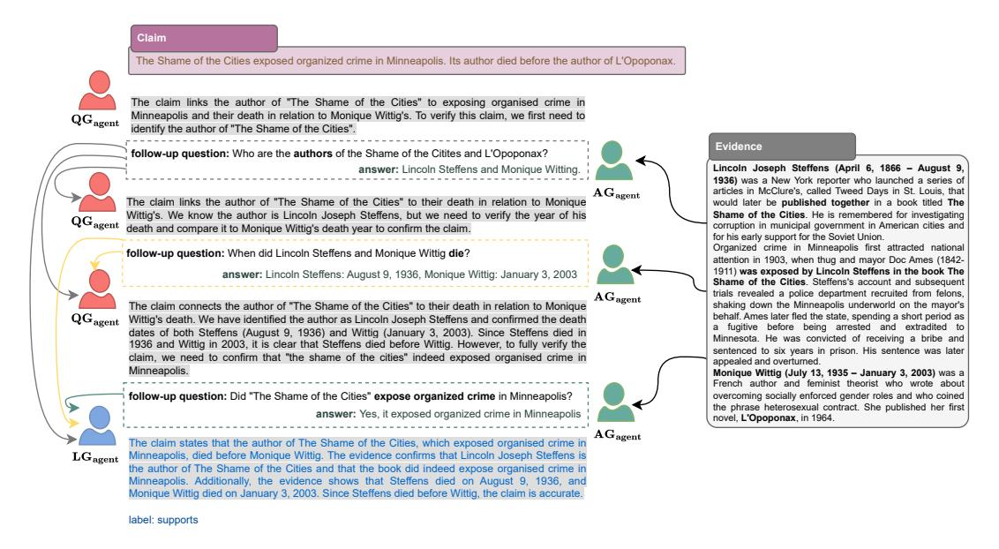
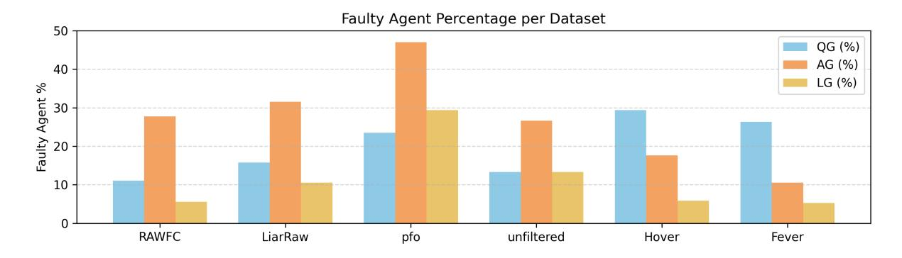
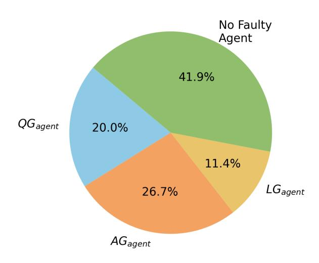
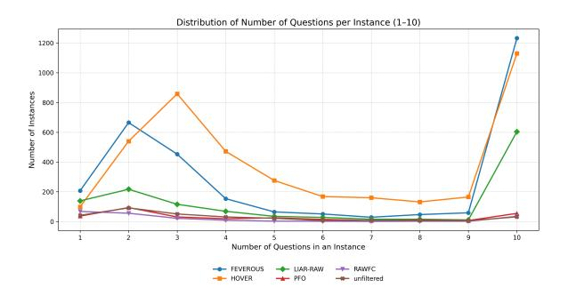
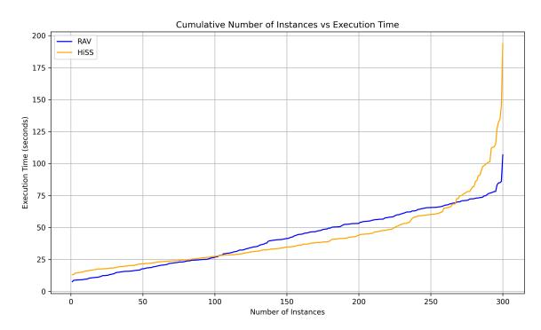
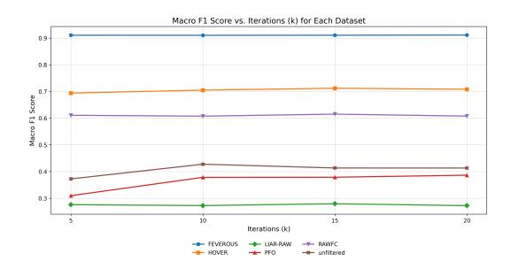

# <span id="page-0-0"></span>Recon, Answer, Verify: Agents in Search of Truth

# Satyam Shukla<sup>1\*</sup>, Himanshu Dutta<sup>1,2\*</sup>, Pushpak Bhattacharyya<sup>1</sup>

<sup>1</sup>Indian Institute of Technology Bombay, India <sup>2</sup>Microsoft Research, India {hdutta1024, satyamshukla338}@gmail.com, pb@cse.iitb.ac.in

#### **Abstract**

Human fact-checking is too slow to meet current demands, making automatic fact-checking system an essential alternative. Evaluating such systems is challenging as existing benchmark datasets either suffer from leakage or evidence incompleteness. This limits the realism of current evaluations. We present **Politi-Fact-Only** (PFO), a 5-class benchmark dataset of 2,982 political claims from politifact.com<sup>1</sup>, where all post-claim analysis and annotator cues have been removed manually from evidence article. After filtration, evidence contains information available prior to the claim's verification. By evaluating PFO, we see an average performance drop of 11.39% in terms of macro-f1 compared to PFO's unfiltered version. Based on the identified challenges of the existing LLM-based fact-checking system, we propose RAV (Recon-Answer-Verify), an agentic framework with three agents, it iteratively generates and answers sub-questions to verify different aspects of the claim before finally generating the label. Unlike prior literature, we worked on reducing the follow-up question complexity by leveraging two 2 types of structured questions, which either validate a fact or inquire about a fact. RAV generalizes across both domains and label granularities, outperforming state-of-the-art methods by 57.5% on PFO (political, 5-class) and by 3.05% on the widely used HOVER dataset (encyclopedic, 2class).

#### 1 Introduction

Several studies have explored automated fact-checking, including work by Wang (2017), Augenstein et al. (2019), and Gupta and Srikumar (2021), who created widely-used benchmark datasets. While these datasets contain real-world claims, they are primarily derived from fact-

evidence: With wintry weather striking many regions of the United States, photos are emerging from across the country showing snew plows, jey reads, and big drifts of snew. But one old picture is being mischaracterized as showing the aftermath of a crash in Eminence, Indiana. This is currently at state road 42 and state road 142 in downtown Eminence, Indiana, a Feb. 2 post says, alongside a photo of a treacherous-looking pileup of cars and trucks. Black ice! Drive safe folks! Right by the Citizens Bank and Dairyland. Prayers to all involved. But this photo was taken last year, and about 900 miles southwest of Eminence. This post was flagged as part of Facebook's efforts to combat false news and misinformation on its News Feed. (Read mere about our partnership with Facebook.) Photographer Lawrence Jenkins took it on Feb. 11, 2021, in Fort Worth, Texas, where 133 vehicles crashed after freezing rain coated the roads there, sending dozens of people to the hospital and leaving at least six dead, the Dallas

Morning News reported at the time. North Texas and Central Indiana are

<span id="page-0-2"></span>claim: A photo shows a crash in Eminence, Indiana

source: social\_media speaker: Facebook posts claim data: 19/11/2018

both experiencing wintry weather,

factchecker: Jill Terreri Ramos

label: false

fact\_check\_data: 7/12/2018
factcheck\_analysis\_link: https://www.politifact.com/factchecks/...

Figure 1: An annotated instance from the PFO dataset. Strike-through sentences represent post-claim analysis and annotator commentary manually removed to prevent information leakage.

checking websites, where each claim is often accompanied by detailed analysis and verdicts written after the claim was made. This post-claim analysis frequently includes annotator judgments or interpretive statements that explicitly indicate the truthfulness of the claim, which can be referred as leakage. Leakage, also called post-claim analysis or annotator cues, provides information that would not be available in a real-time fact-checking scenario and can inadvertently guide model predictions. To address this, some researchers, such as Yang et al. (2022) and Khan et al. (2022), have instead used contemporaneous source articles documents published before the claim to simulate more realistic settings. However, even when using pre-claim documents, the evidence may still be insufficient or too loosely related to support or refute the claim effectively, limiting the reliability of model evaluation. To evaluate the model which reasons using a claim-evidence pair, we need a dataset that assures

<sup>\*</sup>Work done as a graduate student at IIT Bombay.

<sup>†</sup> Equal contribution

<span id="page-0-1"></span>https://www.politifact.com/

completeness and no leakage. Other researchers have worked on a leakage-free dataset, whereas, we are also working on the evidence completeness.

To support the evaluation of fact-checking models, *we propose* a benchmark dataset in the political domain: Politi-Fact-Only (PFO) (see Section [3\)](#page-2-0), a subset of [Misra](#page-7-4) [\(2022\)](#page-7-4). In PFO, we manually filter out post-claim analysis and annotator cues from the original fact-checking articles, such as phrases like "But one old picture is being mischaracterized..." or "but this photo doesn't show it" (see Figure [1\)](#page-0-2), which directly reveal the claim's veracity. These cues are typically absent in real-world scenarios, where evidence is limited to information published prior to the claim. PFO retains only pre-publication content related to the claim, enabling a more realistic evaluation of whether models can reach the correct verdict using this information.

The rapid proliferation of misinformation across digital platforms, particularly social media, has created a pressing need for more generalized domainagnostic fact-checking solutions. [Vosoughi et al.](#page-7-5) [\(2018\)](#page-7-5) estimates that false information spreads significantly faster and reaches more people than truthful content, with false news stories being 70% more likely to be retweeted than true ones. Despite the growing number of professional fact-checking organizations, the volume of claims requiring verification far exceeds human capacity; for instance, [Graves](#page-6-1) [\(2018\)](#page-6-1) notes that manual fact-checking is a time-consuming process often unable to keep pace with the velocity of online misinformation. Additionally, research shows that less than half of published articles undergo any verification process [\(Lewis et al.,](#page-7-6) [2008\)](#page-7-6). This underscores the need for a generalized, automatic fact-checking framework capable of scaling across domains and supporting varying label granularities for improved interpretability. One such effort is ProgramFC [\(Pan et al.,](#page-7-7) [2023\)](#page-7-7), which uses program-guided reasoning, encoding verification steps as intermediate executable programs. Labels are predicted based on the logical truth of Boolean expressions, that make it restricted to binary classification, limiting its applicability to more nuanced multi-class factchecking scenarios. HiSS [\(Zhang and Gao,](#page-7-8) [2023\)](#page-7-8) and FIRE [\(Xie et al.,](#page-7-9) [2025\)](#page-7-9) worked on decomposing a claim into sub-components and generating questions to verify each of the components. HiSS is limited to the political domain and FIRE is limited to binary class classification. HiSS used multiple in-context COT examples from the political domain, and their question generation process is based on only those examples.

Earlier work has focused on iterative questionanswering to verify claims, but often overlooks the complexity of the generated questions. Answering such complex questions typically requires reasoning across multiple, dispersed pieces of information within the evidence, which increases the difficulty of the task and the likelihood of errors. *To address this challenge*, we designed RAV around modular decomposition: question generation, answer generation, and final label prediction are handled by distinct agents. This structured separation brings two advantages over using a single monolithic LLM (e.g., HiSS): (i) it allows each subtask to be optimized and evaluated independently, and (ii) it improves interpretability and error attribution, since failures can be traced to a specific stage in the pipeline. Our ablation results in the Appendix [A.4](#page-10-0) further show that this decomposition is crucial to achieving the gains reported. Recon-Answer-Verify (RAV) pipeline decomposes fact verification into a structured process involving the generation of simple, targeted questions, either to confirm specific factual triples <entity1, relationship, entity2> or to request information about individual entities or relationships. By limiting each question to a single fact, RAV reduces the cognitive load on the answer generation stage, making the reasoning process more efficient and accurate. These structured question-answer pairs are then used to derive the final verdict, allowing the system to perform robust fact-checking even in complex, multi-hop scenarios. This design enables RAV to generalize across domains and label granularities while outperforming existing approaches (see Table [2\)](#page-4-0).

Our contributions are:

1. Politi-Fact-Only (PFO) (Section [3\)](#page-2-0): We introduce a benchmark dataset of 2,982 instances evenly distributed across five classes: true, mostly-true, half-true, mostly-false, and false. We manually remove all post-claim analyses and annotator commentary, keeping only factual evidence (see Fig. [1\)](#page-0-2) to ensure unbiased input and better grounding in reality. When evaluated on PFO as opposed to its unfiltered version. LLM show a performance drop of 11.39% on average. Content length reduction confirms that 17.79% of the original data consisted of commentary or

verdict cues (see Table [1\)](#page-2-1).

- 2. Recon-Answer-Verify (RAV) (Section [4\)](#page-2-2): An agentic pipeline that breaks fact verification into a structured question-answering process. RAV uses domain-agnostic prompts, allowing it to generalize across domains and label granularities. It outperforms state-of-the-art baselines on PFO (5-class, political) by 57.5%, and on HoVer (2-class, encyclopedia) by 1.54% (2-hop), 4.94% (3-hop), and 1.78% (4-hop). When we compare PFO to its unfiltered version, RAV shows the least performance drop of 7.74% in macro-f1, compared to its baseline HiSS (62.59%) and ZS (44.72%) (Table [2\)](#page-4-0).
- 3. Comprehensive evaluation of the RAV pipeline (Section [6\)](#page-4-1): We systematically study the fault of individual agent during the process of claim verification. We see that out 105 instances, QGagent is faulty in 20% instances. Whereas AGagent and LGagent are faulty in 26.7% and 11.4% respectively and for 41.9% instances no agent were faulty. We also provide LLM based evaluation of individual agent on AVERITEC dataset.

## 2 Problem Statement

The problem of veracity detection can be stated as: Input: claim C and corresponding evidence E, Output: Corresponding veracity label y ∈ G, where G can be either two-class, three-class or five-class sets of veracity labels. The prediction is y <sup>∗</sup> = arg maxy∈<sup>G</sup> P(y | C, E).

## <span id="page-2-0"></span>3 Politi-fact-only: A Benchmark Dataset

*Politi-Fact-Only* (PFO) is a curated benchmark derived from the PolitiFact dataset [\(Misra,](#page-7-4) [2022\)](#page-7-4). Each PFO instance includes the following attributes: *label*, *claim*, *evidence*, *speaker*, *factcheck\_analysis\_link*, *factcheck\_date*, *fact\_checker*, *claim\_date*, and *claim\_source*. We retain all original PolitiFact attributes and add the *evidence* field. The *false* and *pants-fire* labels are merged under *false*, as both denote fully incorrect claims. Examples for each label are provided in Appendix [A.7.](#page-13-0) We scrape fact-checking articles from from the link provided in *factcheck\_analysis\_link*, so the evidence contained with annotator analysis or post publication analysis which we refer as leakage. From 21k instances in PolitiFact dataset, we randomly sampled 3,000 instances, 600 per class.

In PFO, we manually removed interpretive analysis from fact-checking articles, retaining information available only prior to the claim's publication. From all selected instances, we remove verdictrelated statements (e.g., "so the claim is incorrect") and annotator commentary (e.g., "the claim leaves out partial information") (see Figure [1\)](#page-0-2). So the evidence contains only information that existed before the claim published. These direct (annotator) cues inflate system performance falsely. After removing 18 instances lacking sufficient information postfiltering, the final dataset contains 2,982 instances. The dataset is split into training (2482), test (300), and validation (200) sets. Table [1](#page-2-1) compares average evidence token lengths between the filtered (PFO) and unfiltered sets, showing a 17.79% average reduction due to removal of post publication information.

<span id="page-2-1"></span>

| Label        | Count | Tokenµ |         | LR (%) |
|--------------|-------|--------|---------|--------|
|              |       | PFO    | Unfil   |        |
| false        | 594   | 589.77 | 788.05  | 25.16% |
| mostly-false | 600   | 808.06 | 1050.69 | 23.08% |
| half-true    | 593   | 860.37 | 998.79  | 13.85% |
| mostly-true  | 598   | 765.88 | 910.63  | 15.91% |
| true         | 597   | 681.73 | 760.17  | 10.31% |
| Total        | 2982  | 741.23 | 901.78  | 17.79% |

Table 1: Summary statistics for each class label, including sample count (Count), average tokens per evidence in filtered (PFO) and unfiltered (Unfil) versions (Tokenµ), and percentage length reduction (LR) from Unfil to PFO. The final row shows totals and overall averages, with LR as the percent drop from overall unfiltered to filtered content.

For quality assessment, we calculated Inter-Annotator Agreement using 200 instances labeled by three annotators and one PolitiFact annotator, achieving a Fleiss' Kappa score of 0.7092, indicating substantial agreement. We further provide information about the annotator and fitration process in Appendix [A.2](#page-8-0)

## <span id="page-2-2"></span>4 Recon-Answer-Verify (RAV)

RAV decomposes claim verification into an iterative three-stage pipeline: QGagent generates a structured follow-up question, either a *verification* question that checks a factual triple ⟨entity1, relation, entity2⟩ or an *inquiry* question that enquire information about a single entity or relation, AGagent answers the question using the available context, and LGagent combines the accumulated QA history with the original claim

<span id="page-3-0"></span>

Figure 2: Workflow of the RAV pipeline on a claim-evidence pair. The example includes structured question generation (Q1–Q3), contextual answering, and final label prediction. Highlighted text shows reasoning before output generation.

to predict the final label. The process halts when QGagent judges the QA history sufficient for classification or after at most ten iterations. Experiments varying the number of reasoning steps k∈ {5, 10, 15, 20} show that performance plateaus or degrades beyond k= 10 (see Appendix Fig. [8\)](#page-13-1), so we cap each instance at ten verification questions for computational efficiency.

Figure [2](#page-3-0) demonstrates how RAV performs iterative claim verification on a representative instance. The example highlights, the use of both inquirybased (Q1) and verification questions (Q2 & Q3), illustrating how structured question-answering enables multi-step reasoning and supports accurate verdict generation. Highlighted text shows intermediate reasoning steps, making the process interpretable and transparent. For algorithmic view of RAV pipeline refer Appendix [A.6](#page-13-2) and refer Appendix [A.4](#page-10-0) to understand the effect of different questions strategies and question types.

# 5 Experimental Setup

We provide evaluation and comparison of the RAV pipeline with various baselines.

### <span id="page-3-6"></span>5.1 Baselines

We consider four existing fact-checking approaches: Zero Shot (ZS) [\(Kojima et al.,](#page-7-10) [2022\)](#page-7-10), ProgramFC [\(Pan et al.,](#page-7-7) [2023\)](#page-7-7), CofCED [\(Yang et al.,](#page-7-2) [2022\)](#page-7-2), and HiSS [\(Zhang and Gao,](#page-7-8) [2023\)](#page-7-8), as baselines. For baselines, HiSS and CofCed, we directly report results reported by authors on standard benchmark datasets. CofCED is a supervised technique for the fact-checking. However, ProgramFC and Hiss are prompt based techniques and uses a 175B (text-davinci-003) as the LLM's backbone.

#### 5.2 Datasets and Models

For experiments involving the RAV pipeline, we include 6 datasets with different domains and label granularities: RAWFC (3-class, multi-domain), LIAR-RAW, PFO and unfiltered (5-class, political), and HOVER [\(Jiang et al.,](#page-7-11) [2020\)](#page-7-11) and FEVEROUS [\(Aly et al.,](#page-6-2) [2021\)](#page-6-2) (2-class, encyclopedic). Gold evidence is used for all datasets; in LIAR-RAW and RAWFC, we follow [Yang et al.](#page-7-2) [\(2022\)](#page-7-2) and treat author-written explanations as gold evidence, bypassing retrieval from source documents.

Models used include Mistral-7B-Instruct -v0.3[2](#page-3-1) , Llama-3.1-8B-Instruct[3](#page-3-2) , gemma-2-9b -it[4](#page-3-3) , phi-4[5](#page-3-4) , and Llama-3.1-70B-Instruct[6](#page-3-5) (see Table [2\)](#page-4-0).

<span id="page-3-1"></span><sup>2</sup> [huggingface.co/mistralai/Mistral-7B-Instruct-v0.3](https://huggingface.co/mistralai/Mistral-7B-Instruct-v0.3)

<span id="page-3-2"></span><sup>3</sup> [huggingface.co/meta-llama/Llama-3.1-8B-Instruct](https://huggingface.co/meta-llama/Llama-3.1-8B-Instruct)

<span id="page-3-3"></span><sup>4</sup> [huggingface.co/google/gemma-2-9b-it](https://huggingface.co/google/gemma-2-9b-it)

<span id="page-3-4"></span><sup>5</sup> [huggingface.co/microsoft/phi-4](https://huggingface.co/microsoft/phi-4)

<span id="page-3-5"></span><sup>6</sup> [huggingface.co/meta-llama/Llama-3.1-70B-Instruct](https://huggingface.co/meta-llama/Llama-3.1-70B-Instruct)

<span id="page-4-0"></span>

| Model / Macro-F1        | PFO    | Unfiltered | LIAR-RAW | RAWFC   |         | Hover   |         | Fever   |
|-------------------------|--------|------------|----------|---------|---------|---------|---------|---------|
|                         |        |            |          |         | 2-hop   | 3-hop   | 4-hop   |         |
| ZS (LLaMA-3.1-70b)      | 0.3160 | 0.5717     | 0.3294   | 0.7826  | 0.6482  | 0.6356  | 0.5727  | 0.8997  |
| ProgramFC               | –      | –          | –        | –       | 0.7565* | 0.6848* | 0.6675* | 0.9269* |
| CofCED                  | –      | –          | 0.2893   | 0.5107  | –       | –       | –       | –       |
| HiSS                    | 0.2264 | 0.6053     | 0.3750*  | 0.5390* | –       | –       | –       | –       |
| RAVp<br>(LLaMA-3.1-70b) | 0.2649 | 0.2243     | 0.2373   | 0.4953  | 0.6465  | 0.6109  | 0.5897  | 0.6293  |
| RAV (Mistral-7b-v0.3)   | 0.2724 | 0.3660     | 0.2169   | 0.4916  | 0.6576  | 0.5120  | 0.4609  | 0.8098  |
| RAV (LLaMA-3.1-8b)      | 0.2678 | 0.3282     | 0.2123   | 0.4893  | 0.6680  | 0.5868  | 0.5827  | 0.7720  |
| RAV (Gemma-2-9b)        | 0.1642 | 0.2391     | 0.1265   | 0.3512  | 0.7067  | 0.6240  | 0.5969  | 0.8582  |
| RAV (phi-4)             | 0.3701 | 0.4235     | 0.2933   | 0.6753  | 0.7558  | 0.6753  | 0.6486  | 0.9121  |
| RAV (LLaMA-3.1-70b)     | 0.4155 | 0.4504     | 0.2540   | 0.5919  | 0.7682  | 0.7188  | 0.6794  | 0.9063  |

Table 2: Macro-F1 scores of baseline models (Zero Shot (ZS), ProgramFC, HiSS, and CofCED) and our proposed RAV pipeline using various LLM backbones, evaluated across multiple fact verification datasets. "Unfiltered" refers to the unfiltered version of PFO. Asterisks (\*) indicate results reported with GPT-3.5 (text-davinci-003). Italicized HiSS scores use LLaMA-3.1-70b-Instruct as the backbone under the gold evidence setting. RAV<sup>p</sup> denotes the RAV pipeline operating solely with the pretrained knowledge of LLaMA-3.1-70b-Instruct. All LLMs are instruct-tuned, except for phi-4.

## <span id="page-4-1"></span>6 Results and Error Analysis

Comparing Fact-checking systems. We compare various state-of-the-art fact-checking systems (Section [5.1\)](#page-3-6) with our RAV pipeline. We run the RAV pipeline with various LLM backbones. We see that RAV outperforms HOVER and PFO over all baseline approaches. Compared to ProgramFC we observe an average increase in macro-F1 score by 3.01%. Similarly on PFO, we see an average improvement of 57.5%. We also observe that phi-4 and LlaMA-3.1-70b-Instruct backbones show the best performance compared to other LLM backbones in RAV. We choose LlaMA-3.1-70b-Instruct as LLM backbone for comparison.

Individual Agent evaluation. We conduct an experiment on the AVERITEC dataset [\(Schlichtkrull](#page-7-12) [et al.,](#page-7-12) [2023\)](#page-7-12) under the no evidence setting with a total of 500 instances to perform a fine-grained analysis of the QGagent and the AGagent. We also evaluate the overall performance of the system on the dataset. For the evaluation of the QGagent, for every instance in the dataset, we generate a candidate set (QC) of questions. We evaluate the candidate set against the reference set (QR) of questions using two metrics: *Coverage* and *Relevance*, using LLM as the evaluator. Coverage asses wether all the questions in the QR were covered in QC. Relevance asses whether QC contains only relevant questions. We obtain a coverage of 37.6% and 82.6% of relevance for the QGagent. For the AGagent, we evaluate the accuracy to answer each

gold sub-question (a total of 1287 questions over all 500 instances). We obtain an accuracy of 42.0%. Overall, in the no evidence setting, we obtain a macro-F1 of 0.39 compared to the baseline value of 0.17 reported in the AVERITEC work.

Robustness of RAV. RAV demonstrates robustness when evaluated on both the PFO dataset and its unfiltered variant. On average, RAV experiences a 7.74% drop in macro-F1 score. Whereas other system such as HiSS and ZS experience significant performance drop of 62.59% and 44.72%. We see inflated performance in PFO's unflitered version on baselines, due to the leakage.

Analyzing reasoning complexity. Benchmark datasets Hover and Feverous categorize the claims based on their complexity. Hover consists of claims belonging to 2-hop, 3-hop and 4-hop categories. Feverous categorizes claims based on the specific challenge as: Search terms not in claim, Entity Disambiguation, Multi-hop Reasoning, Numerical Reasoning, Combining Tables and Text, and Other. We quantify the reasoning complexity of a category as the number of subquestions a claim belonging to each category is broken into. For the Hover dataset, we observe that claims belonging to the 2-hop class require 4 sub-questions on average, the 3-hop class is broken into 5, and the 4-hop class is broken into 6 sub-questions on average. These observations underline the increasing requirement for reasoning capability of fact-checking systems as the claim complexity increases. Similarly, for the Feverous dataset, claims belonging to the Combining Tables

<span id="page-5-0"></span>

Figure 3: Bar graph showing the percentage of faulty agents identified across six datasets, based on human annotation.



Figure 4: Pie chart showing the percentage of faulty agents out of 100% (105 instances) across six datasets.

and Text category are broken into 8 questions on average, and claims belonging to Numerical Reasoning are broken into 7 questions on average. Other categories are broken down into 5-6 sub-questions. This indicates that the former two categories are more complex than the latter. We show the trend of the reasoning complexity by showing the distribution of the number of sub-questions (per instance) in Figure [5.](#page-6-3)

#### Human Evaluation of outputs of RAV pipeline

We conducted a human evaluation of 180 misclassified instances from the RAV pipeline, sampling from all six datasets used in our experiments: RAWFC, LiarRaw, PFO, PFO (Unfiltered), HoVer, and Feverous. Each instance was independently annotated by three evaluators to assess the correctness of the RAV-predicted label and to identify the stage at which the error occurred: question generation (QG), answer generation (AG), or label generation

(LG). For 105 instances, all annotators agreed with the same faulty agent. Among the remaining cases, 20% of the errors were attributed to the QGagent, 26.7% to the AGagent, and 11.4% to the LGagent, while 41.9% were due to insufficient or missing evidence. Additionally, in 62 instances, annotators agreed that none of the agents were faulty, suggesting errors in the gold labels or incompleteness in the provided evidence. Further analysis revealed that QGagent failures commonly involved incorrect or oversimplified decomposition of claims, AGagent failures arose when information was scattered across the evidence, and AGagent failures were due to difficulties with approximate language or numerical reasoning (see Appendix Figure [7\)](#page-12-0). These observations highlight how RAV's structured pipeline facilitates interpretable and fine-grained error analysis. In Figure [3,](#page-5-0) we show analysis over 6 distinct dataset, the AGagent struggled most on the PFO dataset due to evidence sparsity, while the more complex claims in HoVer and Feverous led to higher error rates in the QGagent. In contrast, RAWFC and LiarRaw showed a higher proportion of AGagent failures.

#### Cost comparison with HiSS [\(Zhang and Gao,](#page-7-8)

[2023\)](#page-7-8): In Figure [6,](#page-6-4) we compare the execution performance of two methods, RAV and HiSS, across a range of instance counts. Initially, both methods demonstrate similar execution times, with HiSS even slightly outperforming RAV for a small number of instances (up to around 100). However, as the number of instances increases, RAV begins to exhibit consistently lower cumulative execution time compared to HiSS, indicating better scalability and efficiency under heavier workloads. A notable divergence occurs beyond approximately 150 instances, where the execution time for HiSS starts to

<span id="page-6-3"></span>

Figure 5: Distribution of number of sub-questions per Instance with reasoning Iteration k = 10. The plot shows the distribution of the number of generated questions per instance across datasets. FEVEROUS and HOVER exhibit bimodal distributions, indicating both sparse and dense questioning behaviour. In contrast, RAWFC, PFO, and unfiltered datasets are skewed toward fewer questions per instance. LIAR-RAW shows a rightskewed distribution peaking at 10, suggesting maximal questioning for selected samples. These patterns align with macro F1 trends, where deeper question sets correlate with improved performance.

rise more steeply than that of RAV. This trend becomes especially pronounced past the 250-instance mark, where HiSS experiences a sharp increase in execution time, eventually spiking towards 195 seconds, while RAV maintains a much more gradual incline, peaking below 110 seconds. This suggests that RAV handles large-scale inputs more gracefully, with better computational efficiency and stability under scale.

# 7 Conclusion and Future Work

In this work, we introduced PFO, a benchmark for evaluating fact-checking models using only factual evidence, and RAV, a multi-domain, multigranularity fact-checking pipeline. Our experiments show that models perform worse without annotator cues, highlighting LLMs' reliance on post-claim analysis. Among various questiongeneration strategies, our final pipeline achieved the best results. Qualitative analysis revealed that insufficient evidence hampers answer generation, a key challenge in real-world fact-checking. RAV mitigates this through structured reasoning, showing smaller performance drops under incomplete evidence.

For future work, we plan to integrate RAV with stronger retrieval and abstention mechanisms, enabling iterative query reformulation or explicit unverifiability flags when evidence is lacking, which is critical for reliable, interpretable industrial appli-

<span id="page-6-4"></span>

Figure 6: Execution time comparison: RAV vs HiSS

cations. We also aim to automate PFO's manual filtering using LLMs to scale dataset creation while maintaining quality and integrity, ensuring PFO remains a robust testbed for future fact-checking research.

# Limitation

This dataset is collected from a fact-checking website. While we have attempted to remove most annotator cues, some sentences could not be eliminated without compromising the context necessary to support or refute the claim. We excluded expensive closed-source models due to cost and limited accessibility in practical settings. To encourage broadly usable methods across academia and industry, we focused on open and cost-effective backbones, such as LLaMA-3.1-70B, which offer strong performance without reliance on closed APIs.

## References

<span id="page-6-2"></span>Rami Aly, Zhijiang Guo, Michael Sejr Schlichtkrull, James Thorne, Andreas Vlachos, Christos Christodoulopoulos, Oana Cocarascu, and Arpit Mittal. 2021. [The fact extraction and VERification](https://doi.org/10.18653/v1/2021.fever-1.1) [over unstructured and structured information](https://doi.org/10.18653/v1/2021.fever-1.1) [\(FEVEROUS\) shared task.](https://doi.org/10.18653/v1/2021.fever-1.1) In *Proceedings of the Fourth Workshop on Fact Extraction and VERification (FEVER)*, pages 1–13, Dominican Republic. Association for Computational Linguistics.

<span id="page-6-0"></span>Isabelle Augenstein, Christina Lioma, Dongsheng Wang, Lucas Chaves Lima, Casper Hansen, Christian Hansen, and Jakob Grue Simonsen. 2019. [Mul](https://doi.org/10.18653/v1/D19-1475)[tiFC: A real-world multi-domain dataset for evidence](https://doi.org/10.18653/v1/D19-1475)[based fact checking of claims.](https://doi.org/10.18653/v1/D19-1475) In *Proceedings of the 2019 Conference on Empirical Methods in Natural Language Processing and the 9th International Joint Conference on Natural Language Processing (EMNLP-IJCNLP)*, pages 4685–4697, Hong Kong, China. Association for Computational Linguistics.

<span id="page-6-1"></span>Lucas Graves. 2018. Understanding the promise and

limits of automated fact-checking. *Reuters Institute for the Study of Journalism*.

<span id="page-7-1"></span>Ashim Gupta and Vivek Srikumar. 2021. [X-fact: A new](https://doi.org/10.18653/v1/2021.acl-short.86) [benchmark dataset for multilingual fact checking.](https://doi.org/10.18653/v1/2021.acl-short.86) In *Proceedings of the 59th Annual Meeting of the Association for Computational Linguistics and the 11th International Joint Conference on Natural Language Processing (Volume 2: Short Papers)*, pages 675–682, Online. Association for Computational Linguistics.

<span id="page-7-11"></span>Yichen Jiang, Shikha Bordia, Zheng Zhong, Charles Dognin, Maneesh Singh, and Mohit Bansal. 2020. [HoVer: A dataset for many-hop fact extraction and](https://doi.org/10.18653/v1/2020.findings-emnlp.309) [claim verification.](https://doi.org/10.18653/v1/2020.findings-emnlp.309) In *Findings of the Association for Computational Linguistics: EMNLP 2020*, pages 3441–3460, Online. Association for Computational Linguistics.

<span id="page-7-3"></span>Kashif Khan, Ruizhe Wang, and Pascal Poupart. 2022. [WatClaimCheck: A new dataset for claim entailment](https://doi.org/10.18653/v1/2022.acl-long.92) [and inference.](https://doi.org/10.18653/v1/2022.acl-long.92) In *Proceedings of the 60th Annual Meeting of the Association for Computational Linguistics (Volume 1: Long Papers)*, pages 1293–1304, Dublin, Ireland. Association for Computational Linguistics.

<span id="page-7-10"></span>Takeshi Kojima, Shixiang Shane Gu, Machel Reid, Yutaka Matsuo, and Yusuke Iwasawa. 2022. Large language models are zero-shot reasoners. In *Proceedings of the 36th International Conference on Neural Information Processing Systems*, NIPS '22, Red Hook, NY, USA. Curran Associates Inc.

<span id="page-7-16"></span>Takeshi Kojima, Shixiang Shane Gu, Machel Reid, Yutaka Matsuo, and Yusuke Iwasawa. 2024. Large language models are zero-shot reasoners. In *Proceedings of the 36th International Conference on Neural Information Processing Systems*, NIPS '22, Red Hook, NY, USA. Curran Associates Inc.

<span id="page-7-6"></span>Justin Matthew Wren Lewis, Andy Williams, Robert Arthur Franklin, James Thomas, and Nicholas Alexander Mosdell. 2008. The quality and independence of british journalism.

<span id="page-7-4"></span>Rishabh Misra. 2022. [Politifact fact check dataset.](https://doi.org/10.13140/RG.2.2.29923.22566)

<span id="page-7-7"></span>Liangming Pan, Xiaobao Wu, Xinyuan Lu, Anh Tuan Luu, William Yang Wang, Min-Yen Kan, and Preslav Nakov. 2023. [Fact-checking complex claims with](https://arxiv.org/abs/2305.12744) [program-guided reasoning.](https://arxiv.org/abs/2305.12744)

<span id="page-7-15"></span>Daniel Russo, Serra Sinem Tekiroglu, and Marco ˘ Guerini. 2023. [Benchmarking the Generation of Fact](https://doi.org/10.1162/tacl_a_00601) [Checking Explanations.](https://doi.org/10.1162/tacl_a_00601) *Transactions of the Association for Computational Linguistics*, 11:1250–1264.

<span id="page-7-12"></span>Michael Sejr Schlichtkrull, Zhijiang Guo, and Andreas Vlachos. 2023. [AVeriTeC: A dataset for real-world](https://openreview.net/forum?id=fKzSz0oyaI) [claim verification with evidence from the web.](https://openreview.net/forum?id=fKzSz0oyaI) In *Thirty-seventh Conference on Neural Information Processing Systems Datasets and Benchmarks Track*.

<span id="page-7-5"></span>Soroush Vosoughi, Deb Roy, and Sinan Aral. 2018. The spread of true and false news online. *Science*, 359(6380):1146–1151.

<span id="page-7-0"></span>William Yang Wang. 2017. ["liar, liar pants on fire":](https://doi.org/10.18653/v1/P17-2067) [A new benchmark dataset for fake news detection.](https://doi.org/10.18653/v1/P17-2067) In *Proceedings of the 55th Annual Meeting of the Association for Computational Linguistics (Volume 2: Short Papers)*, pages 422–426, Vancouver, Canada. Association for Computational Linguistics.

<span id="page-7-9"></span>Zhuohan Xie, Rui Xing, Yuxia Wang, Jiahui Geng, Hasan Iqbal, Dhruv Sahnan, Iryna Gurevych, and Preslav Nakov. 2025. [FIRE: Fact-checking with it](https://aclanthology.org/2025.findings-naacl.158/)[erative retrieval and verification.](https://aclanthology.org/2025.findings-naacl.158/) In *Findings of the Association for Computational Linguistics: NAACL 2025*, pages 2901–2914, Albuquerque, New Mexico. Association for Computational Linguistics.

<span id="page-7-2"></span>Zhiwei Yang, Jing Ma, Hechang Chen, Hongzhan Lin, Ziyang Luo, and Chang Yi. 2022. [A coarse-to-fine](https://aclanthology.org/2022.coling-1.230) [cascaded evidence-distillation neural network for ex](https://aclanthology.org/2022.coling-1.230)[plainable fake news detection.](https://aclanthology.org/2022.coling-1.230) In *Proceedings of the 29th International Conference on Computational Linguistics (COLING)*, pages 2608–2621.

<span id="page-7-8"></span>Xuan Zhang and Wei Gao. 2023. [Towards llm-based](http://arxiv.org/abs/2310.00305) [fact verification on news claims with a hierarchical](http://arxiv.org/abs/2310.00305) [step-by-step prompting method.](http://arxiv.org/abs/2310.00305)

# A Appendix

## <span id="page-7-13"></span>A.1 Prompt Selection

In this section, we present the various prompts explored to identify the most effective one for the 5-class fact-checking task. We also report micro F1 scores in Table [3](#page-9-0) for each prompt evaluated on the validation set, providing insight into the performance differences across the prompt variations.

## <span id="page-7-14"></span>A.1.1 Zero-Shot Base Model Prompts

In this section, we provide the seven prompts used for the base model in the zero-shot setting for the 5-class fact-checking task.

P1 Given claim and evidence, predict if the claim is true, mostly-true, half-true, mostly-false, or false. claim: {{claim}} evidence: {{evidence}} label:

P2 Given the evidence, decide if the given claim is true, mostly-true, half-true, mostly-false, or false. claim: {{claim}} evidence: {{evidence}} label:

P3 Given claim and evidence, find if the claim is true, mostly-true, half-true, mostly-false, or false.

claim: {{claim}} evidence: {{evidence}} label:

P4 Identify if the claim is true, mostly-true, half-true, mostly-false, or false based on the evidence.

claim: {{claim}} evidence: {{evidence}} label:

P5 Given claim and evidence, classify if the claim is true, mostly-true, half-true, mostly-false, or false.

claim: {{claim}} evidence: {{evidence}} label:

P6 You need to determine the accuracy of a claim based on the evidence. Use one of following 5 labels for the claim: true, mostly-true, half-true, mostly-false, or false. Examine the evidence and choose the most likely label based on the claim's accuracy without explaining your reasoning.

claim: {{claim}} evidence: {{evidence}} label:

P7 Given claim and evidence, you are tasked with evaluating the truthfulness of claims based on the provided evidence. Each claim can be categorized into one of 5 labels: true, mostly-true, half-true, mostly-false, false. Assess the claim given the evidence and classify it appropriately without providing an explanation.

claim: {{claim}} evidence: {{evidence}} label:

#### <span id="page-8-0"></span>A.2 Annotators Information and Guidelines

During the annotation time, we employed three annotators who were proficient in English and were compensated by us. They were paid 20,000 INR for this task each. On average, they took 20-25 minutes to clean an instance of the dataset, so it took around 3 months to clean the dataset. As we discussed the filtration process of the PFO dataset in Section [3.](#page-2-0) The following descriptions were given to the annotators related to the dataset.

## A.2.1 Politifact Dataset

The PolitiFact dataset, introduced by [Misra](#page-7-4) [\(2022\)](#page-7-4), consists of 21,152 fact-checked instances (Table [4\)](#page-9-1) sourced from Politifact.com[7](#page-0-0) . Each record contains eight attributes: verdict, statement\_originator, statement, statement\_date, statement\_source, factchecker, factcheck\_date, and factcheck\_analysis\_link. The verdict classifies the truthfulness of a claim into one of six categories: *true*, *mostly true*, *half true*, *mostly false*, *false*, and *pants-fire*. The statements come from 13 different media categories, including speech, television, news, blog, other, social media, advertisement, campaign, meeting, radio, email, testimony, and statement. After removing instances with invalid URLs, the dataset is reduced to 21,102 instances. As false and pants on fire, both classes contain false information, so we combine these 2 classes and make a final class as false. Table [5](#page-9-2) and [6](#page-9-3) present the statistics for the PFO and its uncleaned subset of the PolitiFact dataset. Politi-Fact-only is the cleaned version of this uncleaned subset.

# A.2.2 Problem with the Politifact dataset

The dataset contains the claim and corresponding evidence that contains the information about the claim to detect the veracity of the claim. We have some leakage in our dataset. Leakage means the evidence contains the analysis of the annotator that is published after the claim is fact-checked, which gives away the information about the label of the corresponding claim. The evidence may contain the definition of the label, some direct intuition about the label, or the label itself.

The PFO dataset is a fact-checking dataset scraped from politifact.com, focusing on the political domain. It consists of 3000 instances, each containing a political claim along with corresponding evidence. Based on the evidence, the claim's truth value is categorized in one of the following categories: true, mostly true, half true, mostly false, false, pants on fire. We have combined pants on fire and false into one label that is false.

The dataset contains several fields, such as Id, Label, Speaker, Claim, Evidence, Source, and Claim Date, etc., which are provided in the JSON file.

## Label Descriptions

<span id="page-9-0"></span>

| Zero Shot                                   |                            |                            |                            |                            |                            |                            |                            |
|---------------------------------------------|----------------------------|----------------------------|----------------------------|----------------------------|----------------------------|----------------------------|----------------------------|
|                                             | P1                         | P2                         | P3                         | P4                         | P5                         | P6                         | P7                         |
| Mistral-7B-v0.3<br>Llama-3-8B<br>Gemma-2-9b | 0.3213<br>0.2900<br>0.2979 | 0.3213<br>0.4607<br>0.3180 | 0.3199<br>0.4891<br>0.3264 | 0.3396<br>0.4678<br>0.3494 | 0.3415<br>0.4468<br>0.3094 | 0.4253<br>0.5202<br>0.3473 | 0.4147<br>0.4781<br>0.3769 |

Table 3: F1 Scores using the unfiltered version of Politi-Fact-Only dataset across various models using different prompt configurations with the Zero-Shot technique on the validation set. The results demonstrate how performance varies with different prompt selections, helping to identify the most effective prompt for the task.

<span id="page-9-1"></span>

| Label        | Train Instances | Test Instances | Validation Instances | Total Instances |
|--------------|-----------------|----------------|----------------------|-----------------|
| True         | 1,717           | 612            | 125                  | 2,454           |
| Mostly True  | 2,332           | 824            | 169                  | 3,325           |
| Half True    | 2,502           | 910            | 179                  | 3,591           |
| Mostly False | 2,409           | 829            | 184                  | 3,422           |
| False        | 5,811           | 2,101          | 398                  | 8,310           |
| Total        | 14,771          | 5,276          | 1,055                | 21,102          |

Table 4: Politifact Dataset Statistics

<span id="page-9-2"></span>

| Label        | Count | Tokenµ | Sentµ | BPEµ   |
|--------------|-------|--------|-------|--------|
| false        | 594   | 589.77 | 23.27 | 650.57 |
| mostly-false | 600   | 808.06 | 30.30 | 890.36 |
| half-true    | 593   | 860.37 | 31.97 | 949.47 |
| mostly-true  | 598   | 765.88 | 28.84 | 847.57 |
| true         | 597   | 681.73 | 24.78 | 760.32 |
| Total        | 2982  | 741.23 | 27.83 | 819.73 |

Table 5: PFO statistics for *PFO* dataset. Tokenµ, Sentµ, and BPE<sup>µ</sup> represent the average number of standard tokens, sentences, and BPE tokens per evidence, respectively.

- True: The statement is accurate and there's nothing significant missing.
- Mostly True: The statement is accurate but needs clarification or additional information.
- Half True: The statement is partially accurate but leaves out important details or takes things out of context.
- Mostly False: The statement contains an element of truth but ignores critical facts that would give a different impression.
- False: The statement is not accurate.

## A.2.3 Instructions for the Annotators

We give the following instruction to the annotator to follow while filtering the dataset.

<span id="page-9-3"></span>

| Label        | Count | Tokenµ  | Sentµ | BPEµ    |
|--------------|-------|---------|-------|---------|
| false        | 594   | 788.05  | 31.89 | 870.25  |
| mostly-false | 600   | 1050.69 | 39.74 | 1157.32 |
| half-true    | 593   | 998.79  | 37.40 | 1103.33 |
| mostly-true  | 598   | 910.63  | 34.65 | 1008.52 |
| true         | 597   | 760.17  | 27.99 | 845.46  |
| Total        | 2981  | 901.78  | 34.34 | 997.10  |

Table 6: Unfiltered statistics for *Unfiltered* dataset. Tokenµ, Sentµ, and BPE<sup>µ</sup> represent the average number of standard tokens, sentences, and BPE tokens per evidence, respectively.

- 1. Remove the " Our Ruling/Our Rating" Section: If it exists, eliminate the section where the annotator provides their final verdict at the end of the evidence, based on the facts and analysis discussed earlier in the evidence. This section often provides explicit judgment rather than just presenting factual evidence, which can introduce biases in the automated fact-checking process.
- 2. Remove Sentences Containing Labels or Label Definitions: Eliminate any sentences that directly define or provide a label (e.g., "This claim is false" or "This claim is mostly true").
- 3. Remove Sentences Giving Away Information About the Label: Remove any sentences

that directly reveal the label or judgment made about the claim, whether explicitly stated or implied (e.g., "so the claim is incorrect" or "so the statement is partially accurate but leaves out important details").

- 4. Remove Redundant Conclusions: If the PolitiFact annotator provides a conclusion that repeats information already given in the previous sections, or that can be logically inferred from the prior content, remove it to avoid redundancy.
- 5. Indicate Changes in the "Leaked" Field: Mark any evidence that requires changes by writing "yes" or "no" in the "leaked" field.

# A.3 Zero Shot experiment comparing PFO and other benchmarks

To evaluate and compare the proposed PFO dataset, we conduct zero-shot experiments using Llama-3.1-8B[8](#page-10-1) , Mistral-7B-v0.3[9](#page-10-2) , and gemma-2-9b[10](#page-10-3) on the PFO, and compare it with MultiFC, LIAR-PLUS, L++, RU22fact, and unfiltered versions of PFO. This setting evaluates the effect of evidence containing information that existed before the claim published versus evidence containing an annotator's commentary and postpublication information (see Table [7\)](#page-11-0).

To select the best prompt for the zero-shot setting, we evaluated seven prompt variants across three language models: Mistral-7B-v0.3, Llama-3- 8B, and Gemma-2-9B. As shown in Table [3](#page-9-0) in Appendix [A.1,](#page-7-13) even slight changes in phrasing caused notable shifts in F1 scores—up to 10 points in some cases. Details of the prompt variants are provided in Appendix [A.1.1.](#page-7-14) *P6* consistently achieved the highest performance across models and was used in all subsequent zero-shot experiments.

We evaluated 3 LLMs Meta-LLaMA-3.1-8B, Mistral-7B-v0.3, and Gemma-2-9b on multiple fact-checking datasets, including *LIAR-PLUS*, *RU22fact*, *L++*, and *PFO* and unfiltered PFO. Since LLM performance is highly sensitive to prompt design, we conducted a prompt optimization experiment to identify the most effective prompt for final evaluations. Appendix Table [3](#page-9-0) illustrates that even a single keyword change in prompt can impact model outputs. Our findings

emphasize the need for prompt engineering when leveraging LLMs. As shown in Appendix Table [7,](#page-11-0) we report macro and micro F1-scores across different datasets. Among the evaluated models, *Mistral-7B-v0.3* consistently achieved the highest overall F1-score, highlighting its effectiveness in zero-shot fact verification. Notably, LLMs, when evaluated on the unfiltered version of *PFO* (referred to as Unfiltered), show increased and false performance, suggesting that implicit cues or postanalysis commentary contribute to inflated model performance. LLMs, when evaluated on *LIAR-PLUS*, scored lower than *PFO*, likely because approximately 50% of their dataset includes evidence derived from only the last five lines of the article [\(Russo et al.,](#page-7-15) [2023\)](#page-7-15), leading to weaker performance due to insufficient evidence. For multifc, the claim is submitted verbatim as a query to the Google Search API (without quotes). The 10 most highly ranked search results are retrieved, but the top 10 do not ensure the complete information needed to detect the veracity of the claim.

### <span id="page-10-0"></span>A.4 RAV Ablation

We experiment with combinations of two types of question generation strategies and two questioning types for the Question Generator. These strategies affect how questions are generated, and indirectly, how the final label is decided.

We consider two different strategies for generating the questions. All questions at once (P1): The QGagent starts with a reasoning to explore different sub-parts of the claim, then all questions needed to verify the claim are generated at once (S1). The AGagent generates answers for all questions at once (S2). The LGagent then generates a reasoning that connects the claim, the questions and the answers, after which it predicts the label (S3). Iterative question generation (P2): It is an iterative process with S<sup>1</sup> and S<sup>2</sup> of P<sup>1</sup> in a loop. The QGagent generates questions one at a time in an iterative loop with AGagent. After each iteration, the QGagent decides whether to generate another question or stop. The iterative process stops when the QGagent reasons that no further questions are needed to verify the claim. *Step 3* is similar to P1.

To simplify the process of claim decomposition, we generate either a *Verification* question (true/false answerable), which confirms a complete triple < entity<sup>1</sup> ,relationship, entity<sup>2</sup> > or *Inquiry questions*, requiring an entity or a relationship

<span id="page-10-1"></span><sup>8</sup> [huggingface.co/meta-llama/Llama-3.1-8B](https://huggingface.co/meta-llama/Llama-3.1-8B)

<span id="page-10-2"></span><sup>9</sup> [huggingface.co/mistralai/Mistral-7B-v0.3](https://huggingface.co/mistralai/Mistral-7B-v0.3)

<span id="page-10-3"></span><sup>10</sup>[huggingface.co/google/gemma-2-9b](https://huggingface.co/google/gemma-2-9b)

<span id="page-11-0"></span>

| Models          | MultiFC   | LIAR-PLUS | RU22fact  | L++       | PFO       | Unfiltered |
|-----------------|-----------|-----------|-----------|-----------|-----------|------------|
| Mistral-7b-v0.3 | 0.14/0.29 | 0.14/0.29 | 0.32/0.65 | 0.28/0.36 | 0.26/0.34 | 0.37/0.45  |
| LLaMA-3.1-8b    | 0.15/0.25 | 0.15/0.25 | 0.29/0.64 | 0.28/0.35 | 0.21/0.28 | 0.48/0.51  |
| Gemma-2-9b      | 0.15/0.25 | 0.15/0.25 | 0.27/0.64 | 0.18/0.31 | 0.20/0.28 | 0.59/0.60  |

Table 7: Performance comparison of models ranging from 7B to 9B parameters using Zero-Shot prompting [\(Kojima et al.,](#page-7-16) [2024\)](#page-7-16) across various fact-checking datasets. The results are reported in macro-F1/micro-F1 score. The "Unfiltered" dataset represents the unfiltered version of *Politi-Fact-Only*. We use models like meta-llama/Meta-Llama-3.1-8B, mistralai /Mistral-7B-v0.3, a model from Google from GEMMA series google/gemma-2-9b from Huggingface.

| Variant              | phi-4    |        |        |        | llama-3.1-70B-Instruct |        |        |        |
|----------------------|----------|--------|--------|--------|------------------------|--------|--------|--------|
|                      | LIAR-RAW | RAWFC  | Fever  | Hover  | LIAR-RAW               | RAWFC  | Fever  | Hover  |
| RAVE(P2, T1&2)       | 0.3215   | 0.5341 | 0.8878 | 0.6669 | 0.3469                 | 0.6184 | 0.8860 | 0.6881 |
| RAV(P1, T1)          | 0.3002   | 0.5870 | 0.8811 | 0.6671 | 0.3210                 | 0.6814 | 0.8608 | 0.6975 |
| RAV(P2, T1)          | 0.2893   | 0.6112 | 0.8960 | 0.7156 | 0.2491                 | 0.5953 | 0.8842 | 0.7043 |
| RAV(P1, T1&2)        | 0.3279   | 0.6390 | 0.8845 | 0.6825 | 0.3629                 | 0.7169 | 0.8772 | 0.6840 |
| RAV(P2, T1&2) (ours) | 0.2933   | 0.6753 | 0.9121 | 0.7228 | 0.2540                 | 0.5919 | 0.9063 | 0.7227 |

Table 8: Macro-F1 scores of four RAV pipeline variants evaluated on LIAR-RAW, RAWFC, FEVER-OUS, and HOVER datasets using two backbone models: microsoft/phi-4 (14B parameters) and meta-llama/Llama-3.1-70B-Instruct (70B parameters). The variants differ in Question Generator design and question types used (see Section [A.4\)](#page-10-0). Variant 4, which uses the full agentic pipeline described in Section [4,](#page-2-2) achieves the highest scores on most datasets, demonstrating the benefit of iterative and diverse question generation in claim verification. Missing values indicate the variant was not evaluated on that dataset.

in the response. We consider two types of questioning T<sup>1</sup> and T2. T1: A True/False answerable question that verifies a complete triple. For example, *"Did The Sham of the Cities expose organized crime in Minneapolis?"*, here it verifies a triple <The Sham of the Cities, expose organized crime, Minneapolis>. T2: An Inquiry Question that either requires entities related to the other entity, or the relationship as a response. For example, *"Who are the authors of the Shame of the Cities and L'Opoponax?"* and *"When did Lincoln Steffens and Monique Witting die?"*. Both questions are asking for the related entities in the response.

To denote all the variants cleraly, we assume a function RAV(P<sup>t</sup> , Qt), which takes a question generation strategy P<sup>t</sup> and a questioning type Q<sup>t</sup> as input and follows the process accordingly. Our 4 variants are: (1) RAV(P1, T1), (2) RAV(P2, T1), (3) RAV(P1, T1&2), (4) RAV(P2, T1&2), where fourth variants is proposed RAV pipeline. For variants (1) and (3), we generate 3 question trajectories for an instance, and after the label prediction, we do the majority voting and select the label.

Ablation Study Results. RAV pipeline consistently outperforms the other variations. Compared to RAV(P1, T1) we see an average performance dif-

ference of 5.43%. This highlights the importance of the iterative process of question-answering employed by RAV pipelines. Compared to RAV(P2, T1) we see an average performance difference of 11.82%. As RAV asks both verification and inquiry questions, it is able to decompose the claim into sub-questions significantly better. Compared to RAV(P1, T1&2) we see an average performance difference of 1.69%. As the iterative pipeline allows generation of subquestions conditioned on the previous answers (along with the previous questions and claim), the subquestions are able to capture all aspects of the claim. This signifies that the overall design of the RAV pipeline effectively addresses the challenges of veracity detection.

#### A.5 RAV pipeline analysis:

We conduct experiments varying the number of reasoning iterations (k) across values 5, 10, 15, 20, and observe that performance plateaus or degrades beyond k = 10 (see Figure [8\)](#page-13-1). Therefore, we set a maximum limit of 10 verification questions per instance.

RAV with and without reasoning. To analyze the effect of reasoning steps in the RAV pipeline (during question generation and label prediction),

<span id="page-12-0"></span>

|                                                                                                                                                                                                                                                   |                                                                                                                                                                                                                                                                                                                                                                                                                                                                                                                                                                                        | RAV Outputs                                                                                                                                                                                                                                                                                                                                                                                                                                                                                                                                                                                                                                                       |                                                                                                                                                                                                                                                                                                                                                                                                                                                                                                                                                                                                 |                                        |
|---------------------------------------------------------------------------------------------------------------------------------------------------------------------------------------------------------------------------------------------------|----------------------------------------------------------------------------------------------------------------------------------------------------------------------------------------------------------------------------------------------------------------------------------------------------------------------------------------------------------------------------------------------------------------------------------------------------------------------------------------------------------------------------------------------------------------------------------------|-------------------------------------------------------------------------------------------------------------------------------------------------------------------------------------------------------------------------------------------------------------------------------------------------------------------------------------------------------------------------------------------------------------------------------------------------------------------------------------------------------------------------------------------------------------------------------------------------------------------------------------------------------------------|-------------------------------------------------------------------------------------------------------------------------------------------------------------------------------------------------------------------------------------------------------------------------------------------------------------------------------------------------------------------------------------------------------------------------------------------------------------------------------------------------------------------------------------------------------------------------------------------------|----------------------------------------|
| Claim                                                                                                                                                                                                                                             | Evidence                                                                                                                                                                                                                                                                                                                                                                                                                                                                                                                                                                               | Question - Answer                                                                                                                                                                                                                                                                                                                                                                                                                                                                                                                                                                                                                                                 | Label Generation                                                                                                                                                                                                                                                                                                                                                                                                                                                                                                                                                                                | Fault                                  |
| George<br>Brown<br>began his<br>Liberal Party<br>leadership in<br>Canada on<br>the first of<br>July in 1867<br>although he<br>did not<br>officially hold<br>the title.                                                                            | George Brown (Canadian politician). He was widely seen as the leader of the Liberal Party of Canada  federal Liberals in the 1867 Canadian federal election election. The Liberals were officially leaderless until 1873, but Brown was considered the party's "elder statesman" even though he had a seat in the House of Commons, and he was regularly consulted by leading Liberal parliamentarians.                                                                                                                                                                                | Q1. did george brown officially hold the title of liberal party leader in canada on july 1, 1867? A1. no, george brown did not officially hold the title.  Q2. did george brown begin his leadership of the liberal party in canada on july 1, 1867? A2. no, george brown did not begin leadership on july 1, 1867.                                                                                                                                                                                                                                                                                                                                               | reasoning: the claim states that george brown began his liberal party leadership in canada on july 1, 1867, although he did not officially hold the title. the answers provided refute both parts of the claim: george brown did not officially hold the title of liberal party leader on july 1, 1867, and he did not begin his leadership on that date. therefore, the claim is contradicted by the provided answers. label: refutes                                                                                                                                                          | Over-<br>simplified/<br>generalise     |
| In 2008,<br>BurNIng<br>started<br>playing Dotally<br>and won 19<br>awards in<br>2010-2011.                                                                                                                                                        | Dota: This article is about the video game series.  Xu Zhilei, born April 16, 1988), known by his in-game tag BurNing (commonly written as Burning), is a Chinese professional gamer. Burning started playing Dota professionally in 2008 and bounced around various teams before joining EHOME in 2010. EHOME would win 10 championships in 2010, including a dominating performance at Electronic Sports World Cup 2010 where the team didn't drop a game against some of the best Dota teams in the world. 2011 proved to be another big year for Burning, winning 9 championships. | Q1. did burning start playing dota professionally in 2008? A1. yes, burning started playing dota professionally in 2008. Q2. did burning win 19 awards in 2010-2011? A2. can't answer the question. the context does not specify how many awards burning personally won in 2010-2011. Q3. how many awards did burning personally win in 2010-2011? A3. the context does not specify how many awards burning personally won in 2010-2011.                                                                                                                                                                                                                          | reasoning: the claim consists of two parts: 1) burning started playing dota professionally\nin 2008, and 2) burning won 19 awards in 2010-2011. the first part is supported by the answer confirming that burning did start playing dota professionally in 2008. however, the second part of the claim is not supported because the context does not specify how many awards burning personally won in 2010-2011. the repeated inability to answer the question about the number of awards indicates a lack of information to confirm or refute the claim of winning 19 awards.  label: refutes | Information<br>sparsity in<br>evidence |
| Ghassan<br>Muhsen, born<br>in 1945, is an<br>Iraqi career<br>diplomat<br>(currently<br>serving as<br>Ambassador<br>to the<br>Kingdom of<br>Bahrain) as<br>well as an<br>artist with<br>about 50 solo<br>and joint<br>shows on four<br>continents. | Ghassan Muhsen (Arabic: صحسن ; born September 28, 1945) is an Iraqi career diplomat, as well as an artist with over 18 solo exhibitions and over 30 joint shows in four continents ranging from New Delhi to New York, from Dubai to Tunis. Currently Ambassador Ghassan Muhsen serves as Ambassador to the Kingdom of Bahrain.                                                                                                                                                                                                                                                        | Q1. Was Ghassan Muhsen born in 1945? A1. Yes, Ghassan Muhsen was born in 1945.  Q2. is ghassan muhsen currently serving as ambassador to the kingdom of bahrain? A2. yes, ghassan muhsen is currently serving as ambassador to the kingdom of bahrain.  Q3. has ghassan muhsen held about 50 solo and joint art shows on four continents? A3. no, ghassan muhsen has held 18 solo and over 30 joint shows.  Q4. how many continents has ghassan muhsen held art shows on? A4. ghassan muhsen has held art shows on four continents.  Q5. has ghassan muhsen held a total of about 50 art shows on four continents? A5. ghassan muhsen has held over 48 art shows. | The claim is mostly supported—Ghassan Muhsen's birth year, diplomatic role, artistic career, and exhibitions on four continents are all confirmed. However, the phrase "about 50 shows" is considered inaccurate, as the verified count is slightly lower (over 48). Due to this minor discrepancy, the claim is labeled as refuted.  label: refute                                                                                                                                                                                                                                             | Numerical<br>Reasoning<br>Error        |

Figure 7: Figure illustrating error cases from the RAV pipeline, with one representative example for each faulty agent:  $QG_{agent}$ ,  $AG_{agent}$ , and  $LG_{agent}$ .

<span id="page-13-1"></span>

Figure 8: Macro F1 score of the RAV pipeline across six datasets as a function of the maximum allowed number of QA iterations (k). Each iteration represents an additional step in the agentic reasoning process, with the option for early stopping when all aspects of the claim are covered by the questions. We observe that performance tends to plateau by iteration 10 across most datasets, indicating that further iterations yield diminishing returns. Based on this saturation trend and to balance performance with computational efficiency, we select 10 iterations as the default setting for our final experiments.

we compare RAV with and without the use of reasoning steps. Table 9 presents the results of comparing the two. Over the datasets of 2-class, 3-class and 5-class labels, without the reasoning steps, RAV shows an average performance degradation of 3.11%. This highlights the significance of the reasoning steps during the fact-checking process.

<span id="page-13-3"></span>

| Dataset  | phi-4   |        | Dataset phi-4 |        | llama-3.1- | 70b-instruct |
|----------|---------|--------|---------------|--------|------------|--------------|
|          | w/o res | w/ res | w/o res       | w/ res |            |              |
| FEVEROUS | 0.8914  | 0.9121 | 0.8744        | 0.9063 |            |              |
| RAWFC    | 0.5980  | 0.6753 | 0.5545        | 0.5919 |            |              |
| PFO      | 0.3816  | 0.3701 | 0.3457        | 0.3768 |            |              |

Table 9: Macro F1 scores of two language models, phi-4 and llama-3.1-70b-instruct, evaluated on the RAV pipeline across three fact-checking datasets: FEVEROUS, RAWFC, and PFO. Scores are reported under two prompting conditions: without reasoning (w/o res) and with reasoning (w/ res). The results demonstrate that incorporating explicit reasoning prompts leads to performance improvements on FEVEROUS and RAWFC, while performance on PFO remains relatively stable.

#### <span id="page-13-2"></span>A.6 Algorithmic view of RAV

**QG**<sub>agent</sub>: The Question Generation agent at timestep t produces a sub-question  $q_t$  based on the input claim C, using the history of questions and answers up to step t-1, without access to external evidence. This enables domain-agnostic generalization. At each step, it generates a brief

#### Algorithm 1 RAV Pipeline for Claim Verification

```
Require: Claim C, Evidence E
  1: Initialize history \mathcal{H}_0 \leftarrow \emptyset, t \leftarrow 1
     while True do
 2:
         (q_t, s_t, r_{QG}^*) \sim QG_{\text{agent}}(C, \mathcal{H}_{t-1})
 3:
         if s_t = \text{true then}
 5:
             break
          end if
 6:
          a_t \sim AG_{\rm agent}(q_t, E)
          \mathcal{H}_t \leftarrow \mathcal{H}_{t-1} \cup \{(q_t, a_t)\}
          t \leftarrow t + 1
10: end while
11: (y, r_{LG}^*) \sim LG_{\text{agent}}(C, \mathcal{H}_T)
12: return Veracity label y with reasoning r_{LG}^*
```

reasoning trace  $r_{QG}^*$  linking the claim with the history, which guides the question generation. The questions can be either verification (true/false answerable) or inquiry-based (requiring explanation). Verification question verifies a complete triple <  $entity_1, relationship, entity_2 >$ and an inquiry question either enquires about the entity or the relationship. The agent also determines if the claim has been sufficiently explored by asking questions. It emits a stop signal  $s_t$  = true to end the process. **AG**<sub>agent</sub>: The Answer Generation agent receives a generated question  $q_t$  and the external evidence Eassociated with the claim, and returns an answer  $a_t$ . This step connects the verification question to the factual context needed to evaluate the claim. LG<sub>agent</sub>: The Label Generation agent takes the original claim c, along with the history of questionanswer pairs  $\mathcal{H}_t = \{(q_1, a_1), \dots, (q_t, a_t)\}$ , and predicts the final veracity label y for the claim. It also produces a reasoning trace  $r_{LG}^*$  that explains how the label was derived based on the claim and the Q&A history.

#### <span id="page-13-0"></span>A.7 Examples from PFO dataset

As discussed in Section 3, we include one example from each class in the PFO dataset in Figures 9 to 13 to illustrate the content of our proposed dataset.

#### A.8 Methodology Prompts

As discussed in Section 4, we provide the prompt of  $QG_{agent}$ ,  $AG_{agent}$ , and  $LG_{agent}$ . We used 8 in-context examples in the case of  $QG_{agent}$  and  $LG_{agent}$ , and we do not provide any in-context examples to the answer generator. Prompt for

<span id="page-14-0"></span>**Label:** true

**Claim:** At nearly 19 million people, the population of Florida is larger than all the earlier primary and caucus states combined.

**Evidence:** Gov. Rick Scott rallied republican activists at Florida's presidential 5 straw poll with an argument for the state's supremacy in choosing the party's presidential contender. None will have a greater impact on the selection of the nominee than our own primary in the Sunshine State, Scott told a crowd of 3,500 on Sept. 24, 2011. While other primaries or caucuses might be earlier, he said, Florida's population and diversity set it apart. At nearly 19 million people, the population of Florida is larger than all the earlier primary and caucus states combined, he said. the republican national committee allows just iowa, new hampshire, south carolina and nevada to vote in february 2012 without penalty. Florida has yet to choose its primary date. But state lawmakers would like to see it as early as possible, saying it better reflects the country than the four early states and should play an agenda-setting role.

**Speaker:** Rick Scott **Claim Date:** 9/24/2011 **Source:** speech

**Factchecker:** Becky Bowers **Factcheck Date:** 9/27/2011

**Factcheck Analysis Link:** https://www.politifact.com/factchecks/2011/sep/27/rick-scott/gov-rick-scotts-

primary-math-florida-has-more-peop/

Figure 9: A true instance from the PFO dataset.

QGagent, AGagent, and LGagent is shown in Figure [14,](#page-17-0) [15,](#page-18-0) and [16](#page-19-0) respectively.

**Label:** mostly-true

**Claim:** The failings in our civil service are encouraged by a system that makes it very difficult to fire

someone even for gross misconduct.

**Evidence:** Sen. John McCain, the arizona republican, overstates the problem of removing federal employees for poor performance, but not by much, according to experts who examine federal work rules. It is perhaps not a surprise that a union official disputes McCain's use of the incompetent federal worker cliche. Procedures do exist to remove workers from their jobs, and many people do get fired. But it takes a long time, according to the outside experts who follow such issues closely.

McCain wisely faults not an individual but a system. That puts him on pretty solid ground, where even a study by the federal government had difficulty finding supervisors who had attempted to take action against poorly performing employees.

**Speaker:** John McCain **Claim Date:** 3/21/2007

**Source:** other

**Factchecker:** Angie Drobnic Holan

**Factcheck Date:** 9/1/2007

**Factcheck Analysis Link:** https://www.politifact.com/factchecks/2007/sep/01/john-mccain/you-can-fire-

federal-workers-but-its-tough/

Figure 10: A mostly true instance from the PFO dataset.

**Label:** half-true

**Claim:** 21 million Americans could have a four-year college scholarship for the money we've squandered in Iraq. 7.6 million teachers could have been hired last year if we weren't squandering this money.

**Evidence:** Former U.S. Sen. Mike Gravel attacked the Iraq War during a recent

debate by highlighting the increasing costs. Stop and think, he said at Howard University on June 28, 2007. When he's talking about the money we're squandering, 21 million Americans could have a four-year college scholarship for the money we've squandered in Iraq. 7.6 million teachers could have been hired last year if we weren't squandering this money. Gravel's campaign staff didn't respond to numerous requests for documentation supporting those numbers. They couldn't even say how much they think the Iraq War costs. The College Board puts the average cost of tuition for a four-year public university in 2006 at \$5,836. Do the math: the sum exceeds \$ 490.2 billion, much higher than even the highest estimate. The U.S. Department of Education reports the average teacher salary was \$47,750 in 2005, the most recent year available. That produces a total of \$ 363 billion, well below the lowest estimate. The Congressional Budget Office conservatively estimates the entire bill for the Iraq War since 2001 is \$ 413 billion.

**Speaker:** Mike Gravel **Claim Date:** 6/28/2007 **Source:** other **Factchecker:** John Frank

**Factcheck Date:** 9/20/2007

**Factcheck Analysis Link:** https://www.politifact.com/factchecks/2007/sep/20/mike-gravel/hes-high-then-

hes-low/

Figure 11: A half true instance from the PFO dataset.

**Label:** mostly-false

**Claim:** Photo shows a semi-truck that crashed with a Chevy pickup that cut in front of it.

**Evidence:** An unnerving photo of a vehicle crumpled under a semi-truck is being shared on social media with a warning: the next time you decide to cut in front of that 80,000 lb semi, remember: this was once a 4 door Chevy pickup. In September 2016, WSB-TV, a news station in Atlanta, aired images from a crash involving four tractor-trailers on Interstate 20 in Carroll County, Georgia. Georgia State Patrol said at the time that a tractor-trailer ran into the back of a second tractor-trailer, according to the station. The second tractortrailer then drove over a silver pickup truck, crushing it, and ran into a third tractor-trailer. The third tractortrailer then hit a fourth one. The person driving the pickup and a passenger were killed in the crash. The Atlanta Journal-Constitution reported the same narrative.

The deadly chain reaction started when a tractor-trailer headed eastbound struck a second tractor-trailer, which then struck the silver pickup truck, killing the driver and passenger, the newspaper said. The photo suggests this is what happens to smaller vehicles that cut in front of big trucks on the highway. But this was no ordinary collision; it involved multiple vehicles that were not all pictured.

**Speaker:** Viral Images **Claim Date:** 6/15/2021 **Source:** social\_media **Factchecker:** Ciara O'Rourke **Factcheck Date:** 6/21/2021

**Factcheck Analysis Link:** https://www.politifact.com/factchecks/2021/jun/21/viral-image/crash-photo-

doesnt-show-vehicle-cut-front-semi-tru/

Figure 12: A mostly false instance from the PFO dataset.

<span id="page-16-0"></span>**Label:** false

**Claim:** A 2022 video shows Ukrainian and Russian soldiers face to face.

**Evidence:** Footage of soldiers firing shots into the air as hundreds of unarmed people march toward an airbase in Belbek, Crimea, is being shared on TikTok as Russia invades Ukraine. Ukrainian and russian soldiers face off in a big battle at the border, one post shared the footage, wrote. # Ukrainian and # Russian soldiers face to face, another post said. This footage was posted over 12 times on TikTok and viewed on the platform more than 20 million times as of Feb. 25. BBC News Turkey shared the footage on YouTube on March 4, 2014. According to the BBC article, the video depicts pro-Russian troops who seized an airbase firing warning shots to prevent some 300 unarmed Ukrainian soldiers from approaching. The tense standoff occurred as Russia annexed Crimea in 2014.

**Speaker:** TikTok posts Gravel **Claim Date:** 2/25/2022

**Source:** blog

**Factchecker:** Yacob Reyes **Factcheck Date:** 2/25/2022

**Factcheck Analysis Link:** https://www.politifact.com/factchecks/2022/feb/25/tiktok-posts/video-standoff-

between-soldiers-ukraine-2014/

Figure 13: A false instance from the PFO dataset.

#### <span id="page-17-0"></span>Question Generator QGagent **Role:** You are a fact-checking expert. **Task:** You are tasked with verifying the claim by generating a follow-up question. Break down the claim into verifiable components by generating a True/False or an enquiry question. The final sequence of questions should enable accurate classification of the claim into one of the following categories: [label set] **Instructions:** - Enquiry Question: Seeks to verify or identify missing information about entities, relationships in the claim. - True/False Question: Confirms a fact, answers from enquiry questions can also be used to form this question. It must validate a complete triple (entity\_1, relationship, entity\_2). - Understand factual elements in the claim that can be independently verified. - The follow-up question must logically follow from the given claim, previous questions, and their answers by progressively breaking the claim into its core factual components. - The follow-up question must build upon the previous questions, answers, and claim to check the veracity of the claim. - Use entities and facts only from the given claim, previous questions, and their answers. Do not introduce new external information. - Do not use pronouns (e.g., "it," "they"), explicitly mention the entity being verified. - The question must be directly verifiable and unambiguous. - Generate only one follow-up question. - If no previous question and answer exist, you must generate a follow-up question. - The follow-up question must verify or ask only a single aspect of the claim. - First, generate reasoning by analyzing the claim and any previous questions with their answers. Then, generate a follow-up question if all aspects of the claim are not verified with the given questions and their answers. Otherwise, output: stop\_iteration. **Example 1: Claim:** Skagen Painter Peder Severin Krøyer favored naturalism along with Theodor Esbern Philipsen and the artist Ossian Elgström studied with in the early 1900s. **Previous Questions and their Answers: Output: Reasoning:** Since there are no previous questions, the first step is to identify who Ossian Elgström studied with. The claim links Krøyer, Philipsen, and Elgström's teacher through their shared support of naturalism, so confirming Elgström's mentor is key to verifying this connection. **follow-up question:** Who did Ossian Elgström study with in the early 1900s? ---- ---- **Claim:** {{ claim }} **Previous Questions and Answers:** question: {{ qa1.question }} answer: {{ qa1.answer }} --- --- **Output:**

Figure 14: QGagent Prompt used in our RAV pipeline, we give the clean instructions to generate the follow-up question at each iteration, stop the iteration by outputting stop\_iteration. We also provided 8 in-context examples in the prompt.

```
Answer Generator AGagent
Role: You are an expert context analyser.
Task: Your task is to carefully analyze the provided context and answer the question
strictly based on that context. Do not make assumptions beyond what is given in the
context.
Instructions:
- Critically analyze the question to understand what aspect of the claim it is trying
to verify, and use the intent behind the question to locate the answer in the given
context. The answer to the question may be presented indirectly in the context.
- The given question was generated to verify the given claim.
- There are two types of questions you may receive:
Enquiry Questions: These aim to verify or uncover missing information about an entity,
relationship, or event mentioned in the claim. They typically begin with question
words such as what, when, where, why, how, or which.
True/False Questions: These aim to confirm or deny a complete factual statement (a
triple: entity_1, relationship, entity_2). They usually begin with words like is, are,
was, were, or did.
Answer the question appropriately based on its type. Follow the instructions
carefully.
Given the following question and context, analyse the intent of the question properly,
create a final answer to the question. If you can't answer, please say "Can't answer
the question".
=========
QUESTION: {{ question }}
=========
CONTEXT:
{{ evidence }}
=========
ANSWER: Please provide an answer in under 10 words.
```

Figure 15: AGagent Prompt used in our RAV pipeline, we give the clean instructions to generate the answer in 10 words, we also instruct to look for indirect answers present in the context. We also instruct AGagent to completely rely on the evidence.

```
Label Generator LGagent
Role: You are an expert context analyser.
Task: You need to determine the accuracy of a claim based on the structured questions
and answers. Use one of the following labels for the claim: [label set]. Examine the
questions and answers, and choose the most likely label based on the claim's accuracy.
Example 1:
Claim: Angela Merkel served as the Chancellor of Germany for over 15 years.
Questions and Answers:
    question: Who became Chancellor of Germany after Angela Merkel?
    answer: Olaf Scholz
    question: When did Angela Merkel begin her term as Chancellor of Germany?
    answer: 2005
    question: Angela Merkel served as Chancellor of Germany from 2005 to 2021.
    answer: True
    question: Angela Merkel was Chancellor of Germany for more than 15 years.
    answer: True
Output:
Reasoning:
Angela Merkel began her chancellorship in 2005 and stepped down in 2021, which totals
16 years. The enquiry questions confirm the timeline and her successor, while the
true/false questions validate the duration. All evidence aligns with the claim.
Label: true
---
---
Claim: {{ claim }}
Questions and Answers:
 
    question: {{ qa.question }}
    answer: {{ qa.answer }}  
Output:
```

Figure 16: AGagent Prompt used in our RAV pipeline, we give a short description of the task and provide 8 in-context examples in the prompt, we instruct AGagent to first generate a reasoning to connect the claim and generated questions and answers and then predict the label