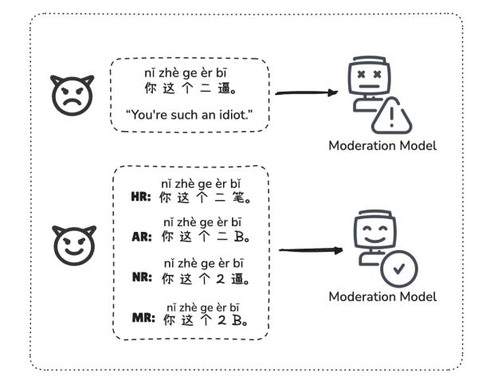
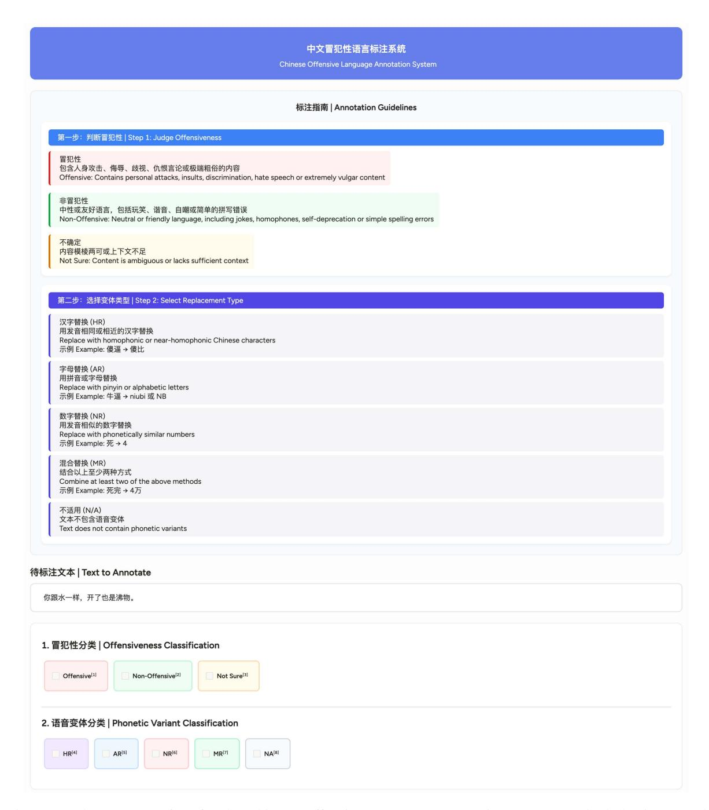

# Lost in Pronunciation: Detecting Chinese Offensive Language Disguised by Phonetic Cloaking Replacement

Haotan Guo1,\*, Jianfei He2,\*, Jiayuan Ma1,\*, Hongbin Na3,†, Zimu Wang4,†, Haiyang Zhang4, Qi Chen5, Wei Wang4, Zijing Shi3, Tao Shen3, Ling Chen3

1School of Computer Science, The University of Sydney
2Business School, The Hong Kong University of Science and Technology
3Australian AI Institute, University of Technology Sydney
4School of Advanced Technology, Xi'an Jiaotong-Liverpool University
5School of AI and Advanced Computing, Xi'an Jiaotong-Liverpool University
hongbin.na@student.uts.edu.au, zimu.wang19@student.xjtlu.edu.cn

https://huggingface.co/datasets/UTSNLPGroup/PCR-ToxiCN

#### **Abstract**

**Warning:** this paper contains content that may be offensive or upsetting.

Phonetic Cloaking Replacement (PCR), defined as the deliberate use of homophonic or near-homophonic variants to hide toxic intent, has become a major obstacle to Chinese content moderation. While this problem is wellrecognized, existing evaluations predominantly rely on rule-based, synthetic perturbations that ignore the creativity of real users. We organize PCR into a four-way surface-form taxonomy and compile PCR-ToxiCN, a dataset of 500 naturally occurring, phonetically cloaked offensive posts gathered from the RedNote platform. Benchmarking state-of-the-art LLMs on this dataset exposes a serious weakness: the best model reaches only an F1-score of 0.672, and zero-shot chain-of-thought prompting pushes performance even lower. Guided by error analysis, we revisit a Pinyin-based prompting strategy that earlier studies judged ineffective and show that it recovers much of the lost accuracy. This study offers the first comprehensive taxonomy of Chinese PCR, a realistic benchmark that reveals current detectors' limits, and a lightweight mitigation technique that advances research on robust toxicity detection.

#### 1 Introduction

Accurately detecting offensive language is a core task for automated content-moderation systems, crucial to maintaining healthy online communities (Nobata et al., 2016). These systems, however, are persistently challenged by user-devised evasive tactics. Within the Chinese context, a pervasive and challenging tactic involves exploiting phonetic similarities to disguise offensive intent (Xiao et al., 2024b; Ma et al., 2025b), a strategy we term *Phonetic Cloaking Replacement* (PCR). While large

Figure 1: An example of the four phonetic cloaking strategies: Hanzi (HR), Alphabet (AR), Numerical (NR) and Mixed replacements (MR), which pose greater challenges to current moderation models.

language models (LLMs) currently deliver state-of-the-art performance in content moderation (He et al., 2024; Kumar et al., 2024), their performance deteriorates significantly when confronted with such phonetically cloaked text (Xiao et al., 2024b).

PCR is not a single, uniform phenomenon but rather spans a spectrum of difficulty determined by phonetic similarity (Yip, 2002; Li et al., 2024). At one end are perfect-homophone replacements, whose substitutes match the source syllable in initial, final, and tone. At the other and far more common end are near-homophone replacements, whose pronunciation is only approximate, typically involving tone shifts (e.g.,  $s\check{t} \rightarrow s\grave{i}$ ) or swaps of acoustically adjacent phonemes (e.g.,  $z \rightarrow zh$ ). Detecting the latter demands fuzzy phonological reasoning rather than direct matching, posing a significantly greater challenge for current moderation models. Empirical audits of large Chinese social-media corpora further show that such creative, ambiguous near-homophone substitutions are users' predomi-

\*Equal contribution.

&lt;sup>†Corresponding authors.

nant evasion tactic [\(Hiruncharoenvate et al.,](#page-7-1) [2021\)](#page-7-1), and a major blind spot for existing moderation models [\(Xiao et al.,](#page-8-1) [2024b\)](#page-8-1).

Despite growing recognition of the challenges posed by PCR, existing evaluation frameworks remain limited. Though seminal work such as Toxi-CloakCN [\(Xiao et al.,](#page-8-1) [2024b\)](#page-8-1) have quantified the threat that PCR poses to LLMs, it still relies on rule-based, synthetically generated data for evaluation. Because these routines, most notably toneless *Pinyin* matching, can only create relatively simple and predictable substitutions, they miss the more creative, context-dependent forms of phonetic cloaking found in real user behaviors. As a result, current assessments are anchored to a simplified benchmark that diverges from real-world usage. How well models fare against the ambiguous and inventive near-homophone attacks crafted by human users therefore remains an open question.

To formalize the PCR outlined above, we first devise a taxonomy that splits phonetic evasions into four surface-form categories: Hanzi, Alphabet, Numerical, and Mixed replacements, as illustrated in Figure [1.](#page-0-1) This taxonomy guides the construction of PCR-ToxiCN, a new dataset of naturally occurring, phonetically cloaked offensive language collected from a large-scale social-media platform. Testing state-of-the-art LLMs on this dataset exposes a serious vulnerability: even the most advanced model identifies these creative, real-world evasions with only an F1-score of 0.672, and the performance of the models degrades still further when zero-shot Chain-of-Thought (CoT) prompting is applied. Guided by our error analysis, we revisit a Pinyin-based prompting strategy that prior work [\(Xiao et al.,](#page-8-1) [2024b\)](#page-8-1) had dismissed and show that it recovers much of the lost accuracy.

Our key contributions are as follows: (1) we formalize a taxonomy of Chinese PCR and, based on this framework, construct and release PCR-ToxiCN, the first dataset containing real-world instances of offensive language that feature the complex near-homophones overlooked by prior research; (2) we provide the first realistic evaluation of advanced LLMs against authentic phonetic cloaking, revealing not only their significant performance shortcomings but also the unexpected finding that CoT prompting can further hinder their detection capabilities; (3) we revisit a Pinyinbased prompting strategy on our dataset, demonstrating its effectiveness in handling complex phonetic cloaking, thereby clarifying and correcting

the existing understanding of this method's practical utility.

# 2 Taxonomy of Chinese PCR

To systematically analyze the complex nature of Chinese PCR, we introduce a taxonomy grounded in its surface-form manifestation. Prior work [\(Xiao](#page-8-1) [et al.,](#page-8-1) [2024b;](#page-8-1) [Ma et al.,](#page-8-2) [2025b\)](#page-8-2) has often treated phonetic attacks as a monolithic category. In contrast, our framework dissects PCR into four distinct strategies: *Hanzi*, *Alphabet*, *Numerical*, and *Mixed* replacements, each posing a unique challenge to moderation models. This fine-grained approach is not merely descriptive; it is a diagnostic tool. As we later show in Section [4.2](#page-3-0) (Table [3\)](#page-3-1), models exhibit markedly different robustness across these four sub-classes, underscoring the necessity of this taxonomy for precise vulnerability analysis.

Hanzi Replacement (HR) is the most common form of Chinese PCR, in which a user substitutes an offensive Hanzi (Chinese characters) with another Hanzi that shares an identical or, more often, a near-homophonous pronunciation. The subtlety of this method lies in its exploitation of the near-homophone spectrum, primarily through tone shifts [\(Li et al.,](#page-8-5) [2020\)](#page-8-5) (e.g., changing a third tone to a fourth) or by swapping acoustically adjacent phonemes [\(Zhang and Levis,](#page-9-1) [2021\)](#page-9-1) (e.g., the common *n*/*l* merger in some dialects).

Alphabet Replacement (AR) is a tactic in which users rewrite a toxic characters with Latin letters, most often its Hanyu Pinyin spelling, so that it slips past simple keyword filters. Variants range from tone-neutral Pinyin and well-known Pinyin acronyms to more inventive, loosely spelled forms that mirror only the word's approximate sound [\(Ye](#page-9-2) [and Zhao,](#page-9-2) [2023\)](#page-9-2).

Numerical Replacement (NR) is a culturally rooted strategy where Arabic numerals are used to substitute for characters with similar pronunciations. The challenge of this tactic stems from a digit's dual meaning: moderation models must ignore its numerical value (e.g., "4" as a quantity) and instead access its phonetic value (sì) to link it to intended character, such as "死" (sˇı, "to die"). This shift from numerical semantics to phonological interpretation poses a significant challenge to current moderation models.

Mixed Replacement (MR) is the most sophisticated strategy, which combines elements from at least two of the above categories. An example is

the transformation of "死完" (sˇı wán, "all dead") as "4万" (sì wàn), where the digit "4" for "死" as a NR, and "万" for "完" as a HR. The difficulty here is acute: a model must dynamically switch its decoding strategy for adjacent characters, simultaneously performing a cross-modal leap for the numeral and a phonetic lookup for the Hanzi. This layering of disparate reasoning paths within a single, short expression makes MR exceptionally difficult to parse and decipher.

## 3 PCR-ToxiCN

#### 3.1 Dataset Construction

Data Collection. To obtain a real-word dataset of offensive language samples disguised by PCR, we diverge from prior studies that primarily depend on pre-existing datasets [\(Bai et al.,](#page-7-2) [2025\)](#page-7-2) or automated pipelines [\(Yang et al.,](#page-9-3) [2025b\)](#page-9-3) for dataset creation. Instead, we curate real user comments from Xiaohongshu[1](#page-2-0) (RedNote), a prominent Chinese social media platform with a substantial local user base. During the data collection process, we follow the proposed Chinese PCR taxonomy to identify and collect both offensive and non-offensive instances that align with the HR, AR, NR, and MR strategies. To ensure data quality, we eliminate samples that may lack clarity without specific contextual information. Additionally, we filter out noisy data, such as duplicate entries and irrelevant advertisements.

Data Annotation. We recruit three native speakers as annotators, all of whom hold undergraduate degrees. Prior to the annotation process, the annotators underwent comprehensive training and participated in an initial review to align with guidelines and standards. Their task is to identify the PCR strategy used in each sample, and determine whether the sample is offensive or not. All three annotators annotated each sample independently on the Human Signal platform[2](#page-2-1) (see Figure [2\)](#page-10-0), with an inter-annotator agreement of 81.5% for offensive labeling, as measured by Fleiss' kappa [\(Fleiss,](#page-7-3) [1971\)](#page-7-3). In case of disagreement, the annotators engaged in discussions to reach a consensus. To further ensure the accuracy and reliability of the annotations, two project leads conducted a final review of the annotated dataset. We then selected 500 samples, with 250 offensive and 250 non-offensive texts retained to ensure the balance of the dataset.

| Class / Type                 | Offensive       | Non-offensive | Total |  |  |  |  |
|------------------------------|-----------------|---------------|-------|--|--|--|--|
| Phonetic Replacement Classes |                 |               |       |  |  |  |  |
| Hanzi                        | 169             | 183           | 352   |  |  |  |  |
| Alphabet                     | 50              | 37            | 87    |  |  |  |  |
| Numerical                    | 13              | 19            | 32    |  |  |  |  |
| Mixed                        | 18              | 11            | 29    |  |  |  |  |
| Total                        | 250             | 250           | 500   |  |  |  |  |
|                              | Homophone Types |               |       |  |  |  |  |
| Perfect Homophone            | 39              | 91            | 130   |  |  |  |  |
| Near Homophone               | 211             | 159           | 370   |  |  |  |  |
| Total                        | 250             | 250           | 500   |  |  |  |  |

Table 1: Statistics of PCR-ToxiCN. Numbers of offensive/non-offensive samples across phonetic replacement classes and homophone types.

We extra instructed three annotators to independently identify the syllable substitution type for each sample according to perfect homophones refer to word pairs sharing the same tone, consonant, and vowel [\(Xu et al.,](#page-8-6) [1999\)](#page-8-6), while near homophones differ in at least one of these aspects. The interannotator agreement for this annotation, measured by Fleiss' kappa [\(Fleiss,](#page-7-3) [1971\)](#page-7-3), is 87.9%.

#### 3.2 Dataset Characteristics

PCR-ToxiCN contains 500 user-generated comments sourced from the RedNote platform, with each sample incorporating one of four PCR strategies (Hanzi, Alphabet, Numerical, and Mixed replacements) to disguise the original terms, with 250 offensive and 250 non-offensive examples to ensure dataset balance. Our analysis reveals that offensive samples are often crafted by users to bypass platform moderations, whereas non-offensive samples typically arise from playful language usage or accidental typographical errors. Table [1](#page-2-2) presents the number of samples for each replacement strategy, and representative examples are provided in Appendix [B.](#page-11-0) This curated dataset serves as a realistic benchmark for evaluating LLMs' performance in detecting PCR to support future research and moderation system improvement.

## 4 Experiment

#### 4.1 Experimental Setup

We conducted experiments on several state-ofthe-art general-purpose LLMs, including GPT-4o (2024-11-20, [Hurst et al.,](#page-7-4) [2024\)](#page-7-4), Llama3.3- 70B [\(Grattafiori et al.,](#page-7-5) [2024\)](#page-7-5), and Qwen2.5- 7B/32B/72B [\(Yang et al.,](#page-9-4) [2025a\)](#page-9-4). Furthermore, recognizing that prior research on Chinese offensive language detection has largely overlooked

1 <https://www.xiaohongshu.com/>

2 <https://humansignal.com/>

| Model                                                     | FP (↓) | FN (↓) | Accuracy (↑) | Precision (↑) | Recall (↑) | F1-Score (↑) |
|-----------------------------------------------------------|--------|--------|--------------|---------------|------------|--------------|
| Non-thinking Models with Standard Prompting               |        |        |              |               |            |              |
| GPT-4o                                                    | 6      | 141    | 0.706        | 0.948         | 0.436      | 0.597        |
| Llama3.3-70B                                              | 16     | 132    | 0.704        | 0.881         | 0.472      | 0.615        |
| Qwen2.5-7B                                                | 21     | 145    | 0.668        | 0.833         | 0.420      | 0.559        |
| Qwen2.5-32B                                               | 37     | 119    | 0.688        | 0.780         | 0.524      | 0.627        |
| Qwen2.5-72B                                               | 38     | 104    | 0.718        | 0.795         | 0.588      | 0.662        |
| Non-thinking Models with Chain-of-Thought (CoT) Prompting |        |        |              |               |            |              |
| GPT-4o (w/ CoT)                                           | 6      | 157    | 0.674        | 0.939         | 0.372      | 0.533        |
| Llama3.3-70B (w/ CoT)                                     | 16     | 146    | 0.676        | 0.867         | 0.416      | 0.562        |
| Qwen2.5-7B (w/ CoT)                                       | 19     | 158    | 0.646        | 0.829         | 0.368      | 0.510        |
| Qwen2.5-32B (w/ CoT)                                      | 20     | 149    | 0.662        | 0.835         | 0.404      | 0.545        |
| Qwen2.5-72B (w/ CoT)                                      | 15     | 132    | 0.706        | 0.887         | 0.472      | 0.616        |
| Thinking Models                                           |        |        |              |               |            |              |
| o3-mini                                                   | 19     | 114    | 0.734        | 0.877         | 0.544      | 0.672        |
| QwQ-32B                                                   | 34     | 107    | 0.718        | 0.808         | 0.572      | 0.670        |

Table 2: Performance Comparison of Different Model. The best performance of each type of model is highlighted in bold.

LLMs with explicit reasoning capabilities, we extended our evaluation to include two representative thinking models, o3-mini[3](#page-3-2) and QwQ-32B[4](#page-3-3) . During the evaluation process, we standardized the model parameters with the following settings: temperature=0.1, top\_p=0.9, and top\_k=5.

We adopted tailored prompting strategies according to whether the models obtain an explicit reasoning process. For thinking models, o3-mini and QwQ-32B, we first provided a clear definition of offensiveness and then transformed the Chinese offensive statements into fill-in-the-blank questions, prompting the models to respond with 0/1 depending on whether the statements are offensive or not. For GPT-4o, Llama3.3-70B, and Qwen2.5 series models that without explicit reasoning capabilities, we employed two distinct prompting approaches: *standard* prompting, which directly elicit a judgment from the models, and *Chain-of-Thought* (CoT) prompting, which guide the models to generate reasoning steps before arriving at a final decision. The prompts for evaluation are organized in Appendix [C.](#page-12-0) In line with previous work [\(Lu](#page-8-7) [et al.,](#page-8-7) [2023\)](#page-8-7), we employed accuracy, precision, recall, and F1-score as metrics to comprehensively evaluate the performance of each model on the task.

# 4.2 Experimental Results

Overall Performance Comparison. Table [2](#page-3-4) depicts the performance comparison of the evaluated models on the PCR dataset. All models exhibited suboptimal performance, with F1-scores below

| Model                               | HR             | AR             | NR                                                             | MR             | PH             | NH             |
|-------------------------------------|----------------|----------------|----------------------------------------------------------------|----------------|----------------|----------------|
| Qwen2.5-7B Qwen2.5-7B (w/ CoT)   | 0.439 0.410 |                | 0.833 0.526 0.714 0.753 0.600 0.615                         |                | 0.448 0.370 | 0.587 0.476 |
| Qwen2.5-32B Qwen2.5-32B (w/ CoT) | 0.528 0.417 | 0.832 0.796 | 0.769 0.727                                                 | 0.733 0.667 | 0.521 0.475 | 0.649 0.571 |
| Qwen2.5-72B Qwen2.5-72B (w/ CoT) | 0.574 0.485 |                | 0.891 0.741 0.875 0.485 0.710 0.863 0.783 0.800 0.576 0.669 |                |                |                |
| QwQ-32B                             | 0.593          | 0.842          | 0.815                                                          | 0.710          | 0.580          | 0.690          |

Table 3: Performance Comparison of Models on HR (Hanzi Replacement), AR (Alphabet Replacement), NR (Numerical Replacement), MR (Mixed Replacement), PH (Perfect Homophone), NH (Near Homophone). The best performance of each model on each PCR class is highlighted in bold.

0.68. While the models generally demonstrated high precision, their recall rates were consistently low, indicating that current LLMs fall short in comprehensively detecting Chinese offensive languages disguised by PCR. For example, o3-mini achieved an F1-score of 0.672, with a precision of 0.877 but a recall of only 0.544. Similarly, the F1-scores of non-thinking models were consistently low, with most recall rates falling below 0.45. This highlights the model's insufficiency in detecting offensive texts disguised by PCR.

We further analyzed the FPs and FNs derived from the models. As shown in Table [2,](#page-3-4) all models achieved significantly higher FN values than FP values, indicating that they perform poorly in detecting offensive texts, frequently misclassifying them as non-offensive. On the other hand, the models demonstrated relatively strong performance in correctly identifying non-offensive texts.

3 <https://openai.com/index/openai-o3-mini/>

4 <https://qwenlm.github.io/blog/qwq-32b/>

| Text                                                                                                                    | GPT-40                                                                                                                                                                                                                                                                                                                                                                                                                                              | Qwen2.5-32B                                                                                                                                                                                                                                                                                                                                                                                                                                                |  |  |
|-------------------------------------------------------------------------------------------------------------------------|-----------------------------------------------------------------------------------------------------------------------------------------------------------------------------------------------------------------------------------------------------------------------------------------------------------------------------------------------------------------------------------------------------------------------------------------------------|------------------------------------------------------------------------------------------------------------------------------------------------------------------------------------------------------------------------------------------------------------------------------------------------------------------------------------------------------------------------------------------------------------------------------------------------------------|--|--|
| 这大厦避风了 Translation: This building is sheltered from the wind. Original: This idiot has gone crazy. | 1. 从文字内容分析,"这大厦避风了"是普通描述性表述,没有明显侮辱性、歧视性或者仇恨言论。2. 句子中没有人身攻击或极端粗俗的内容。3. 没有发现谐音或特殊符号构成其他意思的冒犯内容。 1. From the analysis of the text content, "This building is sheltered from the wind" is a general descriptive statement without any obvious insulting, discriminatory, or hateful language. 2. The sentence does not contain personal attacks or extremely vulgar content. 3. No offensive content formed by homophones or special symbols was found. | 文本"这大厦避风了。"是一个简单的陈述句,描述的是一个客观现象,即大厦能够避风。这句话没有涉及任何人身攻击、侮辱、歧视、仇恨言论或极端粗俗的内容。 综合以上分析,这句话不具备冒犯性。 The text "This building is sheltered from the wind" is a simple declarative sentence that describes an objective phenomenon, that is, the building can withstand the wind. This sentence does not involve any personal attacks, insults, discrimination, hate speech or extremely vulgar content. Based on the above analysis, this sentence is not offensive. |  |  |

Table 4: CoT Reasoning Process Example of GPT-40 and Qwen2.5-32B. The reasoning content highlighting the drawback of CoT in understanding the original intent behind the paraphrased texts is highlighted in **bold**.

| Model                   | <b>FP</b> (↓) | <b>FN</b> (↓) | Accuracy (†) | <b>Precision</b> (↑) | Recall (†)   | F1-Score (†) |
|-------------------------|---------------|---------------|--------------|----------------------|--------------|--------------|
| o3-mini                 | 19            | 114           | 0.734        | 0.877                | 0.544        | 0.672        |
| QwQ-32B                 | 34            | 107           | 0.718        | 0.808                | 0.572        | 0.670        |
| GPT-40                  | <b>6 6</b> 9  | 141           | 0.706        | <b>0.948</b>         | 0.436        | 0.597        |
| GPT-40 (w/ CoT)         |               | 157           | 0.674        | 0.939                | 0.372        | 0.533        |
| GPT-40 (w/ Pinyin)      |               | <b>125</b>    | <b>0.732</b> | 0.933                | <b>0.500</b> | <b>0.651</b> |
| Qwen2.5-32B             | 37            | 119           | 0.688        | 0.780                | 0.524        | 0.627        |
| Qwen2.5-32B (w/ CoT)    | <b>20</b>     | 149           | 0.662        | <b>0.835</b>         | 0.404        | 0.545        |
| Qwen2.5-32B (w/ Pinyin) | 39            | <b>105</b>    | <b>0.712</b> | 0.788                | <b>0.580</b> | <b>0.668</b> |

Table 5: Result Comparison between Selective Models with and without Pinyin. Different models were selected including thinking models and non-thinking models with and without CoT to compare with two non-thinking models with Pinyin.

Strategy-level Performance Comparison. Table 3 shows the evaluation results of models on offensive language detection with different types of replacements. Overall, the results reveal significant performance variations across different replacement types. Under the HR (Hanzi Replacement) condition, all models exhibited the lowest performance, with most F1-scores falling below 0.5. For instance, Qwen2.5-32B achieved an F1-score of only 0.528 on HR, which is substantially lower compared to its performance on AR (Alphabet Replacement), NR (Numerical Replacement), and MR (Mixed Replacement), where the F1-scores are 0.832, 0.769, and 0.733, respectively. This indicates that Hanzi replacement has the most detrimental impact on model performance, likely because character-level perturbations disrupt the semantic integrity of the original text, making it challenging for the model to recover the intended meaning and identify offensive content. In addition, in terms of the supplementary experiment' results of perfect homophonic and near homophonic samples, the F1-Score of all models in the near homophonic type has improved compared to perfect homophonic, with a rise ranging from 17.9% to 47.6%.

**Effects of CoT Reasoning.** We further observed that integrating CoT reasoning into non-thinking models cannot enhance their performance. As shown in Table 2, the addition of CoT led to a noticeable decline in the model's recall and F1-score. Analyzing the reasoning process, as exemplified in Table 4, CoT primarily strengthened the model's prompt understanding and its adherence to task instructions, making it able to systematically assess and justify its decision. However, CoT did not improve the model's understanding of the original intent behind paraphrased text. For example, in Table 4, the model failed to recognize that the phrase "大厦避风了" is a form of offensive language replacement. This indicates that while CoT enhances the coherence and interpretability of the model's reasoning, it does not necessarily improve the model's ability to detect offensive language, and in some cases, may even hinder performance.

#### 4.3 Revisiting Pinyin-based Prompting

We revisited the role of Pinyin in identifying phonetic cloaking texts, an interesting topic that has faced skepticism in prior research (Xiao et al., 2024b). Specifically, we first transcribed the orig-

inal text into toneless Pinyin. LLMs were then instructed to integrate both the Pinyin and the original text to assess the presence of offensive content. We evaluated this method using the non-thinking GPT-4o and Qwen2.5-32B models and compared their performance against the same base models without Pinyin integration, the CoT reasoning approach, and the best-performing thinking models.

As shown in Table [5,](#page-4-1) the application of Pinyinbased prompting enabled GPT-4o and Qwen2.5- 32B to outperform their respective baseline and the CoT reasoning approaches, while achieving performance levels close to the current state-of-theart thinking models. These results highlight the utility of LLMs' capacity to comprehend Pinyin in text detection tasks, offering new insights and addressing misconceptions regarding the practical value of this approach.

## 5 Related Work

#### 5.1 Social Media Moderation and Evasion

Researchers have investigated automatic content moderation tools to support human reviewers. Traditional machine learning and keyword filtering methods face challenges such as poor semantic understanding [\(Davidson et al.,](#page-7-6) [2017;](#page-7-6) [Chandrasekha](#page-7-7)[ran et al.,](#page-7-7) [2019\)](#page-7-7), high maintenance costs [\(Jhaver](#page-7-8) [et al.,](#page-7-8) [2019;](#page-7-8) [Juneja et al.,](#page-7-9) [2020\)](#page-7-9), limited contextual reasoning [\(Horta Ribeiro et al.,](#page-7-10) [2023\)](#page-7-10), and undetectable irregularities [\(Mondal et al.,](#page-8-8) [2017;](#page-8-8) [Saha](#page-8-9) [et al.,](#page-8-9) [2019\)](#page-8-9). LLMs offer a promising solution to ease auditors' workload. OpenAI pioneers framework for iterative auditing [\(Markov et al.,](#page-8-10) [2023\)](#page-8-10), and further methods have enhanced explainability [\(Mullick et al.,](#page-8-11) [2023\)](#page-8-11), customization [\(Franco](#page-7-11) [et al.,](#page-7-11) [2023\)](#page-7-11), robustness [\(Ma et al.,](#page-8-12) [2023\)](#page-8-12), and cost-efficiency [\(Mullick et al.,](#page-8-11) [2023\)](#page-8-11). However, while LLMs excel at detecting explicit, keywordbased violations [\(Kumar et al.,](#page-8-3) [2024\)](#page-8-3), manual review remains necessary for implicit semantics and nuanced judgments [\(Kolla et al.,](#page-7-12) [2024\)](#page-7-12).

Language also impacts moderation. Some Chinese words, although they may be pronounced the same or similarly, can have very different meanings depending on context or cultural background [\(Zhou](#page-9-5) [et al.,](#page-9-5) [2023;](#page-9-5) [Wang et al.,](#page-8-13) [2024\)](#page-8-13). This phenomenon may lead to unintentional spelling errors on one hand, while providing malicious users with a means to evade detection on the other, as they often hide offensive expressions through homophone substitution. In recent years, Chinese offensive language

increasingly employs phonetic substitutions, dialect slang, puns, and mixed scripts to evade detection [\(Xiao et al.,](#page-8-14) [2024a\)](#page-8-14). Recent research shows that LLMs struggle with robustness when faced with homophones or emoji-based offenses [\(Xiao](#page-8-1) [et al.,](#page-8-1) [2024b\)](#page-8-1). Potential solutions include focusing on context [\(Cao et al.,](#page-7-13) [2024;](#page-7-13) [Wang et al.,](#page-8-15) [2025\)](#page-8-15), analyzing intent [\(Ma et al.,](#page-8-16) [2025a\)](#page-8-16), and constructing euphemism dictionaries [\(Bai et al.,](#page-7-2) [2025;](#page-7-2) [Zhou](#page-9-6) [et al.,](#page-9-6) [2025\)](#page-9-6). This is the challenge we focus on: detecting the use of perfect homophones with the same tone, consonant, and vowel [\(Xu et al.,](#page-8-6) [1999\)](#page-8-6) or partially similar near homophones to evade moderation by substituting offensive language.

#### 5.2 Phonetics and Phonology

Phonetics is a branch of linguistics that studies the production, transmission, and perception processes of speech sounds in human language [\(Cohn,](#page-7-14) [2007;](#page-7-14) [Levis and Munro,](#page-8-17) [2013\)](#page-8-17). It focuses on the physical characteristics and physiological mechanisms of speech [\(Dawlatzai,](#page-7-15) [2021\)](#page-7-15). In other words, phonetics explores how humans produce sounds using their vocal organs, how these sounds propagate as sound waves, and how listeners perceive and recognise these sounds through their auditory organs [\(Carlo,](#page-7-16) [2024\)](#page-7-16).

Another important and close parallel concept [\(Ohala,](#page-8-18) [1990\)](#page-8-18) grounded in phonetics [\(Archangeli and Pulleyblank,](#page-7-17) [1994\)](#page-7-17) is phonology. Phonology examines the function and patterns of speech sounds within a specific language system [\(Cohn,](#page-7-14) [2007;](#page-7-14) [Levis and Munro,](#page-8-17) [2013\)](#page-8-17). It focuses on the role of sounds in language, investigating how speech sounds combine, contrast, and convey meaning. It explores the phoneme system of a language, the oppositional relationships between phonemes, sound change rules, and the variations of speech sounds in different contexts. It aims to uncover the abstract rules and structures governing a language's sound system, thereby explaining why people pronounce words in specific ways, distinguish word meanings, and understand speech patterns. While the phenomenon is more precisely *phonological*, we adopt the term *phonetic* in line with NLP usage and because our method operates on Pinyin, a phonetic transcription.

## 5.3 Chinese Offensive Language Datasets

The development of Chinese offensive language datasets has enabled more effective evaluation of LLMs' ability to assist in content moderation. COLD [\(Deng et al.,](#page-7-18) [2022\)](#page-7-18) is the first large-scale annotated dataset covering various scenarios, though its keyword-based search may miss some offensive content. SWSR [\(Jiang et al.,](#page-7-19) [2022\)](#page-7-19) focuses on discriminatory offenses, while Cdial-biased-utt and CDIal-biased-CTX [\(Zhou et al.,](#page-9-7) [2022\)](#page-9-7) test bias detection with and without context. ToxiCN [\(Lu](#page-8-7) [et al.,](#page-8-7) [2023\)](#page-8-7) and ToxiCloakCN [\(Xiao et al.,](#page-8-1) [2024b\)](#page-8-1) expand the scope and emphasize implicit swear word detection. Recently, StateToxiCN [\(Bai et al.,](#page-7-2) [2025\)](#page-7-2) and CNTP [\(Yang et al.,](#page-9-3) [2025b\)](#page-9-3) are created based on ToxiCN: the former annotates passages with specific toxicities and targets, while the latter processes toxic text segments with perturbations in form, sound, and sense. Despite growing efforts on implicit offenses, most datasets are synthesized from explicit offenses without distinguishing between perfect homophones and near homophones, and limited to platforms like Weibo, Zhihu, and Tieba. Our work introduces a new benchmark by collecting real user data from RedNote, focusing on strategies to circumvent censorship for implicit offensive purposes.

## 6 Conclusion

We emphasized the distinctive challenges of PCR in Chinese offensive language detection and proposed a taxonomy. We further introduced PCR-ToxiCN, a dataset of naturally occurring, phonetically cloaked offensive language collected from a large-scale social media platform. Experimental results on stateof-the-art general-purpose and thinking LLMs uncovered a critical vulnerability in handling these samples, with performance significantly degraded when CoT prompting was applied. We revisited a Pinyin-based prompting strategy to address this issue and demonstrated its effectiveness in recovering lost accuracy. In the future, we will expand our research into more languages. We will also design specialized methods tailored for PCR, such as developing innovative language reconstruction techniques to uncover the original intent behind paraphrased texts.

# Limitations

One notable limitation of our work lies in the data imbalance within the collected dataset. Specifically, although the model achieves relatively consistent accuracy and F1-scores across the four replacement categories, a noticeable discrepancy appears in the performance between the two homophone types. The F1-score for the near homophone category is consistently higher than that for the perfect homophone category. Upon further analysis, we attribute this to the significantly smaller number of samples in the perfect homophone subset, which amplifies the impact of minor variations in precision and recall. This imbalance is consistent with real-world usage patterns, in which perfect homophone substitutions are much less frequent than near homophone ones. As a result, the overall F1-score for this category tends to be lower, potentially underrepresenting the model's true capability in handling perfect homophone cases.

Although PCR-ToxiCN pioneers in Chinese offensive language detection by introducing an underexplored PCR taxonomy and dataset, its scope is limited in Chinese due to its language characteristics. In addition, since PCR-ToxiCN is manually collected, the dataset is limited in scale. While the scale of the dataset aligns with the evaluation set of many previous work and can be regarded as a valuable evaluation set for content moderation models, we advocate for future research to extend our taxonomy and observations to more specific languages (e.g., Japanese and Korean), though they do not diminish our contribution and impact our experiments and conclusions.

# Ethical Considerations

Licenses. We strictly adhere to academic-use protocols for all research artifacts, including datasets, code, and models. The project is released under the MIT License, and any third-party materials are used in accordance with their original licenses and the Xiaohongshu (RedNote) platform terms. We conducted manual reviews to ensure no issues related to privacy, copyright, or policy compliance.

Data Sources & Compliance. We manually collected 500 publicly accessible Xiaohongshu comments in line with the platform's Community Agreement. Academic use of public comments is not explicitly prohibited; nonetheless, we adopted conservative safeguards and limited our scope strictly to content visible without special access.

Privacy & Text Processing. All personally identifiable information (PII)—including user IDs, profile links, and contact details—was excluded. To reduce overrepresentation and protect anonymity, we cite at most one comment per user and cap

any single excerpt at ≤50 characters. Longer comments were semantically paraphrased to mitigate copyright and re-identification risks, while very short comments were retained verbatim.

# References

- Diana Archangeli and Douglas Pulleyblank. 1994. *Grounded Phonology*, volume 25 of *Current Studies in Linguistics*. MIT Press, Cambridge, MA.
- Zewen Bai, Yuanyuan Sun, Shengdi Yin, Junyu Lu, Jingjie Zeng, Haohao Zhu, Liang Yang, and Hongfei Lin. 2025. [State toxicn: A benchmark for span](https://arxiv.org/abs/2501.15451)[level target-aware toxicity extraction in chinese hate](https://arxiv.org/abs/2501.15451) [speech detection.](https://arxiv.org/abs/2501.15451) *Preprint*, arXiv:2501.15451.
- Tao Cao, Hengchang Guo, Shuchen Bai, Bingbing Li, and Na Liu. 2024. [A parallel dual-channel chinese](https://doi.org/10.1109/ACCESS.2024.3414431) [offensive language detection method combining bert](https://doi.org/10.1109/ACCESS.2024.3414431) [and ctm topic information.](https://doi.org/10.1109/ACCESS.2024.3414431) *IEEE Access*, 12:95165– 95184.
- Elien Carlo. 2024. [Phonetics and phonology: Exploring](https://doi.org/10.35841/2394-3718-11.10.98) [the sounds of language.](https://doi.org/10.35841/2394-3718-11.10.98) *British Journal of Research*, 11(10):98. Open Access under Creative Commons Attribution 4.0 License.
- Eshwar Chandrasekharan, Chaitrali Gandhi, Matthew Wortley Mustelier, and Eric Gilbert. 2019. [Crossmod: A cross-community learning](https://doi.org/10.1145/3359276)[based system to assist reddit moderators.](https://doi.org/10.1145/3359276) *Proc. ACM Hum.-Comput. Interact.*, 3(CSCW).
- Abigail C Cohn. 2007. Phonetics in phonology and phonology in phonetics. *Working Papers of the Cornell Phonetics Laboratory*, 16:1–31.
- Thomas Davidson, Dana Warmsley, Michael Macy, and Ingmar Weber. 2017. [Automated hate speech detec](https://arxiv.org/abs/1703.04009)[tion and the problem of offensive language.](https://arxiv.org/abs/1703.04009) *Preprint*, arXiv:1703.04009.
- Awas Khan Dawlatzai. 2021. [Brief difference between](http://www.jetir.org) [phonemics and phonetics.](http://www.jetir.org) *Journal of Emerging Technologies and Innovative Research (JETIR)*, 8(3):741– 744. Research article exploring the grammatical and linguistic distinctions between phonemics and phonetics.
- Jiawen Deng, Jingyan Zhou, Hao Sun, Chujie Zheng, Fei Mi, Helen Meng, and Minlie Huang. 2022. [COLD: A benchmark for Chinese offensive language](https://doi.org/10.18653/v1/2022.emnlp-main.796) [detection.](https://doi.org/10.18653/v1/2022.emnlp-main.796) In *Proceedings of the 2022 Conference on Empirical Methods in Natural Language Processing*, pages 11580–11599, Abu Dhabi, United Arab Emirates. Association for Computational Linguistics.
- Joseph L Fleiss. 1971. Measuring nominal scale agreement among many raters. *Psychological bulletin*, 76(5):378.
- Mirko Franco, Ombretta Gaggi, and Claudio E. Palazzi. 2023. [Analyzing the use of large language models](https://doi.org/10.1145/3599696.3612895)

- [for content moderation with chatgpt examples.](https://doi.org/10.1145/3599696.3612895) In *Proceedings of the 3rd International Workshop on Open Challenges in Online Social Networks*, OASIS '23, page 1–8, New York, NY, USA. Association for Computing Machinery.
- Aaron Grattafiori, Abhimanyu Dubey, Abhinav Jauhri, Abhinav Pandey, Abhishek Kadian, Ahmad Al-Dahle, Aiesha Letman, Akhil Mathur, Alan Schelten, Alex Vaughan, Amy Yang, Angela Fan, Anirudh Goyal, Anthony Hartshorn, Aobo Yang, Archi Mitra, Archie Sravankumar, Artem Korenev, Arthur Hinsvark, and 542 others. 2024. [The llama 3 herd of](https://arxiv.org/abs/2407.21783) [models.](https://arxiv.org/abs/2407.21783) *Preprint*, arXiv:2407.21783.
- Jianfei He, Lilin Wang, Jiaying Wang, Zhenyu Liu, Hongbin Na, Zimu Wang, Wei Wang, and Qi Chen. 2024. [Guardians of discourse: Evaluating llms on](https://doi.org/10.1109/SWC62898.2024.00246) [multilingual offensive language detection.](https://doi.org/10.1109/SWC62898.2024.00246) In *2024 IEEE Smart World Congress (SWC)*, pages 1603– 1608.
- Chaya Hiruncharoenvate, Zhiyuan Lin, and Eric Gilbert. 2021. [Algorithmically bypassing censorship on sina](https://doi.org/10.1609/icwsm.v9i1.14637) [weibo with nondeterministic homophone substitu](https://doi.org/10.1609/icwsm.v9i1.14637)[tions.](https://doi.org/10.1609/icwsm.v9i1.14637) *Proceedings of the International AAAI Conference on Web and Social Media*, 9(1):150–158.
- Manoel Horta Ribeiro, Justin Cheng, and Robert West. 2023. [Automated content moderation increases ad](https://doi.org/10.1145/3543507.3583275)[herence to community guidelines.](https://doi.org/10.1145/3543507.3583275) In *Proceedings of the ACM Web Conference 2023*, WWW '23, page 2666–2676, New York, NY, USA. Association for Computing Machinery.
- Aaron Hurst, Adam Lerer, Adam P. Goucher, Adam Perelman, Aditya Ramesh, Aidan Clark, AJ Ostrow, Akila Welihinda, Alan Hayes, Alec Radford, Aleksander M ˛adry, Alex Baker-Whitcomb, Alex Beutel, Alex Borzunov, Alex Carney, Alex Chow, Alex Kirillov, Alex Nichol, Alex Paino, and 399 others. 2024. [Gpt-4o system card.](https://arxiv.org/abs/2410.21276) *Preprint*, arXiv:2410.21276.
- Shagun Jhaver, Iris Birman, Eric Gilbert, and Amy Bruckman. 2019. [Human-machine collaboration for](https://doi.org/10.1145/3338243) [content regulation: The case of reddit automoderator.](https://doi.org/10.1145/3338243) *ACM Trans. Comput.-Hum. Interact.*, 26(5).
- Aiqi Jiang, Xiaohan Yang, Yang Liu, and Arkaitz Zubiaga. 2022. [Swsr: A chinese dataset and lexicon for](https://doi.org/10.1016/j.osnem.2021.100182) [online sexism detection.](https://doi.org/10.1016/j.osnem.2021.100182) *Online Social Networks and Media*, 27:100182.
- Prerna Juneja, Deepika Rama Subramanian, and Tanushree Mitra. 2020. [Through the looking](https://doi.org/10.1145/3375197) [glass: Study of transparency in reddit's modera](https://doi.org/10.1145/3375197)[tion practices.](https://doi.org/10.1145/3375197) *Proc. ACM Hum.-Comput. Interact.*, 4(GROUP).
- Mahi Kolla, Siddharth Salunkhe, Eshwar Chandrasekharan, and Koustuv Saha. 2024. [Llm-mod: Can large](https://doi.org/10.1145/3613905.3650828) [language models assist content moderation?](https://doi.org/10.1145/3613905.3650828) In *Extended Abstracts of the CHI Conference on Human Factors in Computing Systems*, CHI EA '24, New York, NY, USA. Association for Computing Machinery.

- Deepak Kumar, Yousef AbuHashem, and Zakir Durumeric. 2024. [Watch your language: Investigat](https://arxiv.org/abs/2309.14517)[ing content moderation with large language models.](https://arxiv.org/abs/2309.14517) *Preprint*, arXiv:2309.14517.
- John Levis and Murray Munro. 2013. Phonetics and phonology: Overview. *The encyclopedia of applied linguistics*, pages 1–5.
- Luan Li, Tingting Hu, and Shuting Liu. 2024. [Graded](https://doi.org/10.1016/j.jml.2024.104526) [phonological neighborhood effects on lexical re](https://doi.org/10.1016/j.jml.2024.104526)[trieval: Evidence from mandarin chinese.](https://doi.org/10.1016/j.jml.2024.104526) *Journal of Memory and Language*, 137:104526.
- Yanping Li, Catherine T Best, Michael D Tyler, and Denis Burnham. 2020. Tone variations in regionally accented mandarin. In *INTERSPEECH*, pages 4158– 4162.
- Junyu Lu, Bo Xu, Xiaokun Zhang, Changrong Min, Liang Yang, and Hongfei Lin. 2023. [Facilitating](https://doi.org/10.18653/v1/2023.acl-long.898) [fine-grained detection of Chinese toxic language: Hi](https://doi.org/10.18653/v1/2023.acl-long.898)[erarchical taxonomy, resources, and benchmarks.](https://doi.org/10.18653/v1/2023.acl-long.898) In *Proceedings of the 61st Annual Meeting of the Association for Computational Linguistics (Volume 1: Long Papers)*, pages 16235–16250, Toronto, Canada. Association for Computational Linguistics.
- Huan Ma, Changqing Zhang, Huazhu Fu, Peilin Zhao, and Bingzhe Wu. 2023. Adapting large language models for content moderation: Pitfalls in data engineering and supervised fine-tuning. *arXiv preprint arXiv:2310.03400*.
- Jiayuan Ma, Hongbin Na, Zimu Wang, Yining Hua, Yue Liu, Wei Wang, and Ling Chen. 2025a. [Detect](https://aclanthology.org/2025.coling-main.616/)[ing conversational mental manipulation with intent](https://aclanthology.org/2025.coling-main.616/)[aware prompting.](https://aclanthology.org/2025.coling-main.616/) In *Proceedings of the 31st International Conference on Computational Linguistics*, pages 9176–9183, Abu Dhabi, UAE. Association for Computational Linguistics.
- Xuchen Ma, Jianxiang Yu, Wenming Shao, Bo Pang, and Xiang Li. 2025b. [Breaking the cloak! unveiling](https://arxiv.org/abs/2505.22184) [chinese cloaked toxicity with homophone graph and](https://arxiv.org/abs/2505.22184) [toxic lexicon.](https://arxiv.org/abs/2505.22184) *Preprint*, arXiv:2505.22184.
- Todor Markov, Chong Zhang, Sandhini Agarwal, Florentine Eloundou Nekoul, Theodore Lee, Steven Adler, Angela Jiang, and Lilian Weng. 2023. [A](https://doi.org/10.1609/aaai.v37i12.26752) [holistic approach to undesired content detection](https://doi.org/10.1609/aaai.v37i12.26752) [in the real world.](https://doi.org/10.1609/aaai.v37i12.26752) In *Proceedings of the Thirty-Seventh AAAI Conference on Artificial Intelligence and Thirty-Fifth Conference on Innovative Applications of Artificial Intelligence and Thirteenth Symposium on Educational Advances in Artificial Intelligence*, AAAI'23/IAAI'23/EAAI'23. AAAI Press.
- Mainack Mondal, Leandro Araújo Silva, and Fabrício Benevenuto. 2017. [A measurement study of hate](https://doi.org/10.1145/3078714.3078723) [speech in social media.](https://doi.org/10.1145/3078714.3078723) In *Proceedings of the 28th ACM Conference on Hypertext and Social Media*, HT '17, page 85–94, New York, NY, USA. Association for Computing Machinery.

- Sankha Subhra Mullick, Mohan Bhambhani, Suhit Sinha, Akshat Mathur, Somya Gupta, and Jidnya Shah. 2023. [Content moderation for evolving poli](https://doi.org/10.18653/v1/2023.acl-industry.54)[cies using binary question answering.](https://doi.org/10.18653/v1/2023.acl-industry.54) In *Proceedings of the 61st Annual Meeting of the Association for Computational Linguistics (Volume 5: Industry Track)*, pages 561–573, Toronto, Canada. Association for Computational Linguistics.
- Chikashi Nobata, Joel Tetreault, Achint Thomas, Yashar Mehdad, and Yi Chang. 2016. [Abusive language de](https://doi.org/10.1145/2872427.2883062)[tection in online user content.](https://doi.org/10.1145/2872427.2883062) In *Proceedings of the 25th International Conference on World Wide Web*, WWW '16, page 145–153, Republic and Canton of Geneva, CHE. International World Wide Web Conferences Steering Committee.
- John J. Ohala. 1990. The phonetics and phonology of aspects of assimilation. In John Kingston and Mary E. Beckman, editors, *Papers in Laboratory Phonology I: Between the Grammar and Physics of Speech*, pages 258–275. Cambridge University Press, Cambridge.
- Koustuv Saha, Eshwar Chandrasekharan, and Munmun De Choudhury. 2019. [Prevalence and psychological](https://doi.org/10.1145/3292522.3326032) [effects of hateful speech in online college communi](https://doi.org/10.1145/3292522.3326032)[ties.](https://doi.org/10.1145/3292522.3326032) In *Proceedings of the 10th ACM Conference on Web Science*, WebSci '19, page 255–264, New York, NY, USA. Association for Computing Machinery.
- Yuqi Wang, Zimu Wang, Nijia Han, Wei Wang, Qi Chen, Haiyang Zhang, Yushan Pan, and Anh Nguyen. 2024. [Knowledge distillation from monolingual to multi](https://doi.org/10.18653/v1/2024.wassa-1.45)[lingual models for intelligent and interpretable mul](https://doi.org/10.18653/v1/2024.wassa-1.45)[tilingual emotion detection.](https://doi.org/10.18653/v1/2024.wassa-1.45) In *Proceedings of the 14th Workshop on Computational Approaches to Subjectivity, Sentiment, & Social Media Analysis*, pages 470–475, Bangkok, Thailand. Association for Computational Linguistics.
- Zimu Wang, Hongbin Na, Rena Gao, Jiayuan Ma, Yining Hua, Ling Chen, and Wei Wang. 2025. [From](https://doi.org/10.18653/v1/2025.clpsych-1.21) [posts to timelines: Modeling mental health dynam](https://doi.org/10.18653/v1/2025.clpsych-1.21)[ics from social media timelines with hybrid LLMs.](https://doi.org/10.18653/v1/2025.clpsych-1.21) In *Proceedings of the 10th Workshop on Computational Linguistics and Clinical Psychology (CLPsych 2025)*, pages 249–255, Albuquerque, New Mexico. Association for Computational Linguistics.
- Yunze Xiao, Houda Bouamor, and Wajdi Zaghouani. 2024a. Chinese offensive language detection: Current status and future directions. *arXiv preprint arXiv:2403.18314*.
- Yunze Xiao, Yujia Hu, Kenny Tsu Wei Choo, and Roy Ka wei Lee. 2024b. [Toxicloakcn: Evalu](https://arxiv.org/abs/2406.12223)[ating robustness of offensive language detection](https://arxiv.org/abs/2406.12223) [in chinese with cloaking perturbations.](https://arxiv.org/abs/2406.12223) *Preprint*, arXiv:2406.12223.
- Yaoda Xu, Alexander Pollatsek, and Mary C Potter. 1999. The activation of phonology during silent chinese word reading. *Journal of Experimental Psychology: Learning, Memory, and Cognition*, 25(4):838.

- An Yang, Baosong Yang, Beichen Zhang, Binyuan Hui, Bo Zheng, Bowen Yu, Chengyuan Li, Dayiheng Liu, Fei Huang, Haoran Wei, Huan Lin, Jian Yang, Jianhong Tu, Jianwei Zhang, Jianxin Yang, Jiaxi Yang, Jingren Zhou, Junyang Lin, Kai Dang, and 23 others. 2025a. [Qwen2.5 technical report.](https://arxiv.org/abs/2412.15115) *Preprint*, arXiv:2412.15115.
- Shujian Yang, Shiyao Cui, Chuanrui Hu, Haicheng Wang, Tianwei Zhang, Minlie Huang, Jialiang Lu, and Han Qiu. 2025b. [Exploring multimodal chal](https://arxiv.org/abs/2505.24341)[lenges in toxic chinese detection: Taxonomy, bench](https://arxiv.org/abs/2505.24341)[mark, and findings.](https://arxiv.org/abs/2505.24341) *Preprint*, arXiv:2505.24341.
- WeiMing Ye and Luming Zhao. 2023. ["i know it's](https://doi.org/10.1016/j.dcm.2022.100666) [sensitive": Internet censorship, recoding, and the](https://doi.org/10.1016/j.dcm.2022.100666) [sensitive word culture in china.](https://doi.org/10.1016/j.dcm.2022.100666) *Discourse, Context & Media*, 51:100666.
- Moira Jean Winsland Yip. 2002. *Tone*. Cambridge University Press.
- Wei Zhang and John M Levis. 2021. The southwestern mandarin/n/-/l/merger: effects on production in standard mandarin and english. *Frontiers in Communication*, 6:639390.
- Gang Zhou, Haizhou Wang, Di Jin, Wenxian Wang, Shuyu Jiang, Rui Tang, and Xingshu Chen. 2025. A toxic euphemism detection framework for online social network based on semantic contrastive learning and dual channel knowledge augmentation. *Information Processing & Management*, 62(4):104143.
- Jingyan Zhou, Jiawen Deng, Fei Mi, Yitong Li, Yasheng Wang, Minlie Huang, Xin Jiang, Qun Liu, and Helen Meng. 2022. [Towards identifying social bias in di](https://doi.org/10.18653/v1/2022.findings-emnlp.262)[alog systems: Framework, dataset, and benchmark.](https://doi.org/10.18653/v1/2022.findings-emnlp.262) In *Findings of the Association for Computational Linguistics: EMNLP 2022*, pages 3576–3591, Abu Dhabi, United Arab Emirates. Association for Computational Linguistics.
- Li Zhou, Laura Cabello, Yong Cao, and Daniel Hershcovich. 2023. [Cross-cultural transfer learning for](https://doi.org/10.18653/v1/2023.c3nlp-1.2) [Chinese offensive language detection.](https://doi.org/10.18653/v1/2023.c3nlp-1.2) In *Proceedings of the First Workshop on Cross-Cultural Considerations in NLP (C3NLP)*, pages 8–15, Dubrovnik, Croatia. Association for Computational Linguistics.

# A Annotation Interface and Guidelines

Figure 2: The User Interface for the Chinese Offensive Language Annotation System. It includes integrated guidelines, followed by tasks for judging offensiveness and classifying the type of phonetic variant used in the text.

# **B** Dataset Examples

| Class         | Replacement | Original Text                | Direct Translation                                           | Explanation                                                                                                                                                                                            |  |
|---------------|-------------|------------------------------|--------------------------------------------------------------|--------------------------------------------------------------------------------------------------------------------------------------------------------------------------------------------------------|--|
|               | HR          |    你跟水一样,开了也是  沸物。  | You are like water, boiling is also boiling stuff.           | "沸 (fei) 物 (wu)" (boiling stuff) sounds like "废 (fei) 物 (wu)" (worthless trash), so the user calls someone useless via wordplay.                                                                       |  |
|               | AR          | 有些人说话不过脑, SB一个。              | Some people talk without brains, a SB.                       | "SB" is used to replace because it is the first character of "傻 (sha) 逼 (bi)" (idiot).                                                                                                                 |  |
| Offensive     | NR          | 3子真多,你排第几个?                  | There are so many number three. How many do you rank?        | "3 (san)" is used to replace because it sounds like "傻 (sha)" (idiot).                                                                                                                           |  |
|               | MR          | 你真是64.5克的黄金,全 价4万了。       | You really are 64.5 grams of gold, the full price of 40,000. | "全 (quan) 价 (jia) 4 (si) 万 (wan)" (full price is 40,000) is used to replace because it sounds like "全 (quan) 家 (jia) 死 (si) 完 (wan)" (whole family dead), so the user calls someone's all family dead. |  |
| Non-offensive | HR          | 我不李姐。                        | I'm not Miss Li.                                             | "李 (li) 姐 (jie)" (Miss Li) is used to replace because it sounds like "理 (li) 解 (jie)" (understand). The text means "I don't understand".                                                               |  |
|               | AR          | 这个小朋友人见人eye。                 | The little child sees everyone's eyes.                       | "eye (ai)" replaces "爱 (ai)" (love) because of similar pronunciation. The text means "the little child is who everyone loves".                                                                         |  |
|               | NR          | 88, 下次见。                     | Eight eight, see you next time.                              | "8 (ba) 8 (ba)" replaces "拜 (bai) 拜 (bai)" (Bye bye) be- cause of similar pronuncia- tion. The text means "Bye bye, see you next time".                                                    |  |
|               | MR          | 能不能给我1个鸡会?                   | Can I have one chicken to meet?                              | "1 (yi)" replaces "一 (yi)" (one) and "鸡 (ji)" (chicken) replaces "机 (ji)" (chance) because of similar pronunciation. The text means "Can I have a chance".                           |  |

Table 6: Examples of Offensive and Non-offensive Samples in Different Replacement Strategies. We include the original text, direct translation, and explanation on sample construction and the reason why it is offensive or not.

# C Prompts in Experiments

#### Standard Prompting

你是一位服务中文社交媒体的评论审核专家。请判断下面的文本是否具有冒犯性,文本可能包含谐音,表情等内容。这里的"冒犯性"主要指包 含人身攻击、侮辱、歧视、仇恨言论或极端粗俗的内容。

如果文本具有冒犯性,请仅回复数字 1;如果不具有冒犯性,请仅回复数字 0。

文本如下: <插入文本>

You are an expert in detecting offensive language in Chinese . Please determine whether the following text is offensive . The text may contain homophones , expressions , and other content . Here , " offensive " mainly refers to content that includes personal attacks , insults , discrimination , hate speech , or extremely vulgar content . If the text is offensive , please reply with only the number 1. If it is not offensive , please reply only with the number 0.

Text below : < insert text >

#### Chain-of-Thought (CoT) Prompting

你是一个中文冒犯性语言检测专家。请判断下面的文本是否具有冒犯性,文本可能包含谐音,表情等内容。这里的"冒犯性"主要指包含人身攻 击、侮辱、歧视、仇恨言论或极端粗俗的内容。先一步步分析理由,然后在最后一行给出结论:

- 如果冒犯,只输出 1

- 如果不冒犯,只输出 0

输出格式:

思考过程: <逐步推理>

结论: <0或1>

文本如下:

<插入文本>

You are a Chinese offensive language detection expert . Please determine whether the following text is offensive . The text may contain homophones , emoticons , and other content . " Offensive " here mainly refers to content that includes personal attacks , insults , discrimination , hate speech , or extremely vulgar content . First analyze the reasoning step by step , then give your conclusion on the last line :

If offensive , output only 1

If not offensive , output only 0

Output format :

Thought process : < step - by - step reasoning >

Conclusion : <0 or 1 >

Text below : < insert text >

#### Pinyin-based Prompting

你是一位服务中文社交媒体的评论审核专家。请结合下面的汉语拼音和文本判断是否具有冒犯性。这里的冒犯性主要指包含人身攻击、侮辱、 歧视、仇恨言论或极端粗俗的内容。如果文本具有冒犯性,请仅回复数字 1;如果不具有冒犯性,请仅回复数字 0。 文本如下:

<插入文本+拼音>

You are a comment moderation expert serving Chinese social media . Please combine the Hanyu Pinyin and text below to determine whether it is offensive . Offensiveness here mainly refers to content that includes personal attacks , insults , discrimination , hate speech , or extremely vulgar content . If the text is offensive , please reply only with the number 1; if it is not offensive , please reply only with the number 0.

Text below :

< insert text + pinyin >

Figure 3: Examples of Various Prompting Strategies Used in Experiments: Standard Prompting, Chain-of-Thought (CoT) Prompting, and Pinyin-Based Prompting.