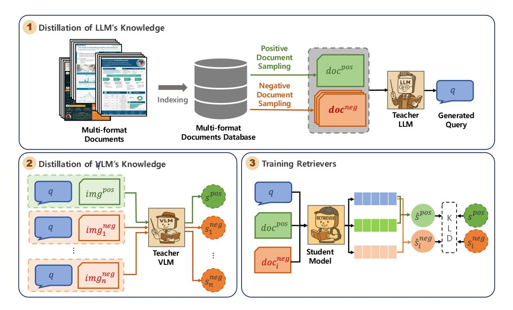
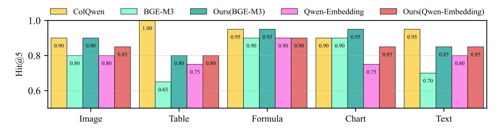
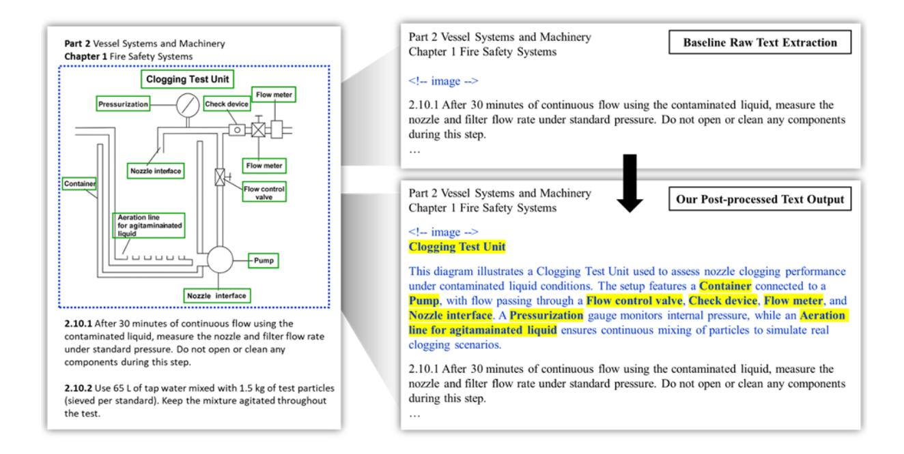

## Distilling Cross-Modal Knowledge into Domain-Specific Retrievers for Enhanced Industrial Document Understanding

Jinhyeong Lim<sup>1</sup> , Jeongwan Shin<sup>2</sup> , Seeun Lee<sup>1</sup> , Seongdeok Kim<sup>1</sup> , Joungsu Choi<sup>1</sup> , Jongbae Kim<sup>1</sup> , Chunhwan Jung<sup>1</sup>,<sup>2</sup> , Youjin Kang<sup>1</sup>

<sup>1</sup>HD Korea Shipbuilding & Offshore Engineering, <sup>2</sup>DIGIST

### Abstract

Retrieval-Augmented Generation (RAG) has shown strong performance in open-domain tasks, but its effectiveness in industrial domains is limited by a lack of domain understanding and document structural elements (DSE) such as tables, figures, charts, and formulas. To address this challenge, we propose an efficient knowledge distillation framework that transfers complementary knowledge from both Large Language Models (LLMs) and Vision-Language Models (VLMs) into a compact domain-specific retriever. Extensive experiments and analysis on real-world industrial datasets from shipbuilding and electrical equipment domains demonstrate that the proposed framework improves both domain understanding and visual-structural retrieval, outperforming larger baselines while requiring significantly less computational complexity.

## 1 Introduction

Retrieval-Augmented Generation (RAG) [\(Lewis](#page-7-0) [et al.,](#page-7-0) [2020\)](#page-7-0) is increasingly adopted across various industrial domains, contributing to task automation and improved information access [\(Gao et al.,](#page-7-1) [2023;](#page-7-1) [Gutiérrez et al.,](#page-7-2) [2024;](#page-7-2) [Asai et al.,](#page-6-0) [2024;](#page-6-0) [Yu](#page-9-0) [et al.,](#page-9-0) [2023\)](#page-9-0). In RAG systems, the retriever plays a critical role, as even the most advanced generation models can produce inaccurate outputs without effective retrieval. However, domain-specific documents often contain document structural elements (DSE) such as complex layouts, tables, figures, and charts, along with specialized terminology, which pose significant challenges for conventional retrievers [\(Wang et al.,](#page-8-0) [2024b,](#page-8-0) [2023\)](#page-8-1). Therefore, developing retrievers that can effectively understand both domain-specific semantics and DSE is essential for building more accurate and reliable RAG systems for industrial applications.

Effective understanding of both domain-specific semantics and DSE by retrievers typically requires expert-annotated datasets [\(Karpukhin et al.,](#page-7-3) [2020\)](#page-7-3),

but their construction demands significant time and cost [\(Ding et al.,](#page-6-1) [2024;](#page-6-1) [Zhukova et al.,](#page-9-1) [2025;](#page-9-1) [Chand](#page-6-2)[hiramowuli et al.,](#page-6-2) [2024\)](#page-6-2). While previous work has attempted to inject domain knowledge into retrievers through synthetic data and knowledge distillation [\(Izacard and Grave,](#page-7-4) [2021\)](#page-7-4), these approaches often overlook the structural complexity inherent. By contrast, visual retrievers that leverage DSE and visual characteristics [\(Xu et al.,](#page-8-2) [2020\)](#page-8-2) have shown strong performance in domain-specific retrieval, but the high computational cost limits their applicability in real-world industrial settings [\(Béchard](#page-6-3) [and Ayala,](#page-6-3) [2025;](#page-6-3) [Huang et al.,](#page-7-5) [2024a\)](#page-7-5). To build RAG system for industrial applications, we need efficient retrievers capable of domain adaptation and understanding DSE.

In this work, we pose the following research question: How can we build an efficient training framework enabling retrievers to adapt to specific domains while capturing DSE? To address the question, we propose a novel domain knowledge distillation framework that transfers both textual and visual understanding from large teacher models into a student model. By leveraging an LLM to generate synthetic queries and a VLM to compute ranking scores reflecting DSE, we enable the student model to jointly learn domain semantics and structural awareness. This approach addresses the semantic-structural gap in existing domain-specific retrievers while overcoming the computational inefficiency of VLM-based multimodal retrievers, making it practical for latencysensitive industrial deployment.

To evaluate the effectiveness of the proposed framework, we construct retrieval benchmarks in shipbuilding and electrical equipment domains and compare our method against a range of baseline retrievers. Experimental results show that our model, trained using the proposed distillation framework, achieves the highest retrieval accuracy across all evaluation metrics, with the lowest latency and

<span id="page-1-0"></span>

Figure 1: Overview of the proposed knowledge distillation framework. An LLM generates synthetic queries with positive and hard negative documents to capture domain semantics, while a VLM provides fine-grained ranking scores reflecting structural and visual elements such as tables, figures, and layouts. The student retriever is trained with these complementary signals through contrastive learning and KL divergence to jointly learn semantic relevance and structural awareness.

FLOPs. Furthermore, in the evaluation for RAG responses, our model achieves performance comparable to that of the teacher model. Our analysis provides evidence that the proposed framework enhances the models' ability to understand domain-specific content as well as visual and structural information.

Our contributions are as follows:

- 1. We propose a novel domain knowledge distillation framework for training efficient domainspecific retrievers.
- We distill semantic and visual knowledge of LLMs and VLMs into a retriever using synthetic query generation and fine-grained ranking supervision, enabling it to capture semantic and DSE.
- 3. Extensive experiments show that our lightweight retriever, trained via the proposed framework, achieves strong document-specific retrieval performance with reduced inference cost in latency and FLOPs.

#### 2 Related Work

**Domain-Specific RAG** Various efforts have been made to enhance the performance of Retrieval-Augmented Generation (RAG) in domain-specific settings (Lai et al., 2022; Cho and Lee, 2025). Recent studies have particularly focused on improving the capabilities of LLMs to better align with specialized domains (Xu et al., 2025; Zhang et al., 2024a; Tao et al., 2024; dos Santos Junior et al., 2024; Bhushan et al., 2025; Balaskas et al., 2025). These works have fine-tuned LLMs with curated domain benchmarks or LLM-generated synthetic queries to improve answer accuracy. For the retrieval module itself, several studies distill knowledge from powerful cross-encoder reader teachers into lightweight retrievers using LLM-generated data (Kim and Baek, 2025; Tamber et al., 2025; Yao et al., 2024; Liang et al., 2020; Ma et al., 2020). There are approaches leveraging LLMs to generate synthetic queries for effective retriever domain adaptation. While effective, they have been struggling to encode the DSE that characterizes realworld industrial documents.

Multimodal RAG Recent works have introduced layout-aware retrievers, often based on VLMs (Ma

et al., 2024; Zhang et al., 2024b; Faysse et al., 2025) and multimodal RAG that incorporate visual information during retrieval and generation (Cho et al., 2024; Suri et al., 2024; Yu et al., 2025; Abootorabi et al., 2025). These methods leverage document layout cues, rendered images, and multimodal contrastive learning to enhance both retrieval accuracy and generation quality (Nacson et al., 2025; Wang et al., 2024a). They demonstrate that visual signals help models understand DSE and extract relevant multimodal content from complex formats. However, visual retrievers often require higher FLOPs and inference latency, which poses challenges for real-world deployment (Chen et al., 2025; Faysse et al., 2025; Sun et al., 2021).

#### 3 Cross-Modal Knowledge Distillation framework

In this work, we propose a novel knowledge distillation framework that simultaneously leverages knowledge from both LLMs and VLMs to enhance the performance of retrievers in domain-specific RAG applications. First, our proposed framework utilizes the query generation capabilities of LLMs to augment high-quality training data for the retriever in specific domains. In addition, we leverage VLMs to capture visual semantic features from documents of various formats and label the relevance scores between the query and each document. Finally, the distilled knowledge, derived from the previously generated queries and relevance scores, is transferred to domain-specific retrieval through training. As illustrated in Figure 1, the proposed framework consists of three main steps: query generation, rank score generation, and knowledge distillation.

## <span id="page-2-0"></span>3.1 Knowledge Distillation of LLMs using Synthetic Query Generation

The goal of LLM-based knowledge distillation is to construct training data consisting of multi-format document and query pairs for contrastive retriever training, which requires effective negative sampling. In the initial stage of the framework, each document is parsed at the page level to detect and crop visual elements such as figures, tables, and diagrams. These cropped regions are then processed by a VLM to generate textual descriptions that capture both visual and structural semantics. This ensures that the visual information is aligned with the LLM-generated queries during the distillation

process. The post-processing details are provided in Appendix A.

Subsequently, a positive document  $doc^{pos}$  is sampled from a database containing a large collection of multi-format documents. To this end, we extract a set of hard negative samples docneg =  $\{doc_1^{\text{neg}}, doc_2^{\text{neg}}, \dots, doc_n^{\text{neg}}\}$  from the database by comparing the positive document  $doc^{pos}$  against all other documents in the database and computing their semantic similarity, ensuring that the selected negatives are semantically similar but contextually irrelevant. Incorporating multiple hard negatives encourages the LLM to generate a more discriminative query  $q_i$  that is not only highly relevant to  $doc^{pos}$ , but also distinguishable from its hard negatives. Then, the LLM takes as input  $doc^{pos}$ ,  $doc^{neg}$ , and a designed prompt, and generates a synthetic query q that is highly relevant to the positive while unrelated to the negatives. The prompt details are provided in Appendix Table 7.

## 3.2 Knowledge Distillation of VLMs using Synthetic Ranking scores

The goal of VLM-based knowledge distillation is to produce fine-grained relevance scores for synthetic training pairs  $(q, img^{pos})$  and  $(q, img^{neg}_i)$  that reflect the visual semantics of multi-format documents using a VLM-based visual retriever. As illustrated in Figure 1, the teacher VLM takes as input a query q paired with a positive document  $img^{pos}$ and multiple hard negatives  $\{img_1^{\rm neg},\ldots,img_n^{\rm neg}\}$ , and outputs a relevance score  $s^{\rm pos}$  for the positive pair and scores  $\{s_1^{\text{neg}}, \dots, s_n^{\text{neg}}\}$  for the negative pairs. These scores reflect the visual-semantic alignment between the query and the document, considering the layout, visual structure, figures, and other format-specific elements. By capturing these visual semantics, the VLM-derived scores provide finegrained supervision signals for training a student retriever via a ranking loss function, which encourages the correct ordering of relevant and irrelevant documents.

# 3.3 Training Retrievers through Multimodal Synthetic data

To train the student retriever, we leverage synthetic query-document pairs  $(q, doc^{pos})$  and  $(q, doc^{neg})$  generated via LLM-based knowledge distillation, along with fine-grained supervision signals distilled from the VLM. These signals are used within contrastive learning, allowing the retriever to better

<span id="page-3-0"></span>Table 1: Comparison of retrieval performance of our retriever trained with the proposed framework and baseline models in the shipbuilding domain. **Bold** and <u>underline</u> highlight the best and second best performance.

| Model                                 | Params      | M           | RR          | nDCG        |             | HIT         |      | Complexity |            |
|---------------------------------------|-------------|-------------|-------------|-------------|-------------|-------------|------|------------|------------|
|                                       |             | @5          | @10         | @5          | @10         | @5          | @10  | Latency    | Flops      |
| BM25                                  | -           | 60.1        | 60.9        | 63.5        | 65.3        | 73.5        | 79.0 | -          | -          |
| BGE-M3                                | <b>560M</b> | 76.7        | 77.1        | 79.4        | 80.4        | 87.7        | 90.7 | 1.0        | 1.0        |
| Qwen3-Embedding-0.6B                  | <u>596M</u> | 80.7        | 81.1        | 83.3        | 84.6        | 91.5        | 95.1 | <u>1.1</u> | <u>1.1</u> |
| GTE-Qwen2-1.5B-instruct               | 1.5B        | 81.1        | 81.5        | 84.0        | 84.9        | 92.6        | 95.4 | 3.8        | 928.6      |
| GTE-Qwen2-7B-instruct                 | 7B          | 66.9        | 67.2        | 69.7        | 71.9        | 80.9        | 87.4 | 19.1       | 4642.9     |
| Qwen3-Embedding-8B                    | 8B          | 84.7        | 85.0        | 87.1        | 87.9        | 94.4        | 96.7 | 21.7       | 5107.1     |
| GME-2B                                | 2B          | 75.3        | 75.9        | 78.7        | 80.1        | 88.7        | 92.9 | 4.7        | 964.3      |
| ColPali-3B                            | 3B          | 81.6        | 82.0        | 84.4        | 85.4        | 92.8        | 95.9 | 21.2       | 5142.9     |
| ColQwen2.5-3B                         | 3B          | 87.9        | 88.2        | 90.0        | 90.5        | <u>95.9</u> | 97.4 | 9.3        | 2192.9     |
| Google text-embedding-005             | -           | 76.6        | 77.2        | 80.0        | 81.3        | 89.8        | 94.1 | -          | -          |
| Google text-embedding-large-exp-03-07 | -           | 81.5        | 82.0        | 84.3        | 85.5        | 92.5        | 96.0 | -          | -          |
| Ours (BGE-M3)                         | 560M        | 87.9        | 88.2        | 90.0        | 90.5        | 96.0        | 97.6 | 1.0        | 1.0        |
| Ours (Qwen3-Embedding-0.6B)           | <u>596M</u> | <u>87.2</u> | <u>87.4</u> | <u>89.3</u> | <u>89.9</u> | 95.6        | 97.7 | <u>1.1</u> | <u>1.1</u> |

capture the distinction between semantically similar yet contextually different documents.

Specifically, given a query q, the student model encodes the query, the positive document  $doc^{pos}$ , and the hard negative documents  $doc^{neg}_i$  into vector representations. It then computes similarity scores between the query embedding and each document embedding to produce the predicted relevance scores  $\hat{s}^{pos}$  and  $\hat{s}^{neg}_i$ . To further align the retriever's output with the teacher's supervision signal, we minimize the Kullback-Leible (KL) divergence between the predicted relevance distribution  $\hat{s}_i$  and the distilled distribution  $s_i$ , defined as:

$$\mathcal{L}_{KD} = \sum_{i} s_i \log \left( \frac{s_i}{\hat{s}_i} \right) \tag{1}$$

This objective encourages the student retriever to approximate the fine-grained visual-semantic supervision signals provided by the teacher VLM. By incorporating both contrastive loss and knowledge distillation loss, the retriever learns to rank positive documents higher than hard negatives while preserving the DSE learned by the teacher.

#### 4 Experiments

#### 4.1 Experimental Settings

**Dataset** We conduct experiments using PDF data collected from two industrial domains: shipbuilding and electrical equipment. For the shipbuilding

domain, we build the train set (6,625 samples) using 10 PDF documents related to the marine vessel field, and the test set (2,932 samples) using 9 PDF documents related to the naval ship field. Similarly, in the electric domain, we build the train set (4,109 samples) using 32 PDF documents related to the IEC field and the test set (3312 samples) using 36 PDFs related to the IEEE field. The specific details of these datasets are provided in Table 5.

Additionally, to investigate whether retrieval performance affects the final RAG response quality and how the proposed method impacts different types of multimodal content, we constructed a dataset in the shipbuilding domain, consisting of real-world user queries and their corresponding responses. Specifically, we collected 100 instances, with 20 examples for each type of multimodal element, including figures, tables, formulas, charts, and plain text, resulting in a balanced set across five content categories.

**Baseline** To evaluate the effectiveness of our proposed retriever, we compare it against a diverse set of baseline models grouped into three categories: (1) OCR-based text retrievers, (2) visual retrievers, and (3) commercial embedding models. The OCR-based text retrievers include BGE-M3 (Chen et al., 2024), GTE-Qwen2-instruct (Yang et al., 2024a), and the recently released Qwen3-Embedding (Zhang et al., 2025). The visual retrievers directly process document images to preserve the visual structure and in-

Table 2: Comparison of retrieval performance of our retriever trained with the proposed framework and baseline models in the electrical domain.

| Backbone                                  | MRR@10       | HIT@10       |
|-------------------------------------------|--------------|--------------|
| BM25                                      | 39.1         | 64.0         |
| BGE-M3                                    | 54.1         | 78.0         |
| Qwen3-Embedding-0.6B                      | 55.5         | 81.2         |
| ColQwen2.5-3B                             | 58.7         | 82.3         |
| Ours (BGE-M3) Ours (Owen3-Embedding-0.6B) | 62.0<br>63.1 | 86.1<br>87.7 |

clude GME (Zhang et al., 2024b), ColPali and ColQwen2.5 (Faysse et al., 2025). In addition, we evaluate commercial embedding APIs, including Google's text-embedding-005 and text-embedding-large-exp-03-07 (Team et al., 2023).

To evaluate the effectiveness of our proposed retriever within the RAG framework, we conducted a comprehensive comparison against a diverse set of baseline methods categorized into three groups: text retrievers paired with LLM generators, VLM retrievers paired with LLM generators, and VLM retrievers paired with VLM generators, such as M3DocRAG (Cho et al., 2024). Additionally, we considered hybrid approaches combining VLM retrievers with text retrievers alongside LLM generators, such as VisdomRAG (Suri et al., 2024).

**Settings** We use BGE-M3 (Chen et al., 2024) and Qwen3-Embedding (Zhang et al., 2025) as the backbone models for our dense retriever. We conducted our experiments using the Qwen3-32B (Yang et al., 2025) model to generate the synthetic queries and employed the ColQwen2.5-3B (Faysse et al., 2025) visual retriever to generate ranking scores for knowledge distillation. To evaluate the performance of RAG, we employed Llama-3.1-8B-instruct (Grattafiori et al., 2024) as the question-answering language model, and Qwen2.5-VL-7B (Yang et al., 2024b) as the VLM for processing multimodal inputs. We evaluate retrieval performance using MRR, nDCG (Järvelin and Kekäläinen, 2002), and HIT. For efficiency, we report latency and FLOPs, normalized to 1.0 based on BGE-M3, the smallest model. We utilize RAGAs (Es et al., 2024) to assess Retrieval-Augmented Generation performance, employing Google Gemini-2.0flash and text-embedding-005 models. For detailed experimental settings, please refer to the Appendix C.

<span id="page-4-0"></span>Table 3: Evaluation of RAG performance using the RA-GAs, with faithfulness, and answer correctness as evaluation metrics.

| RAG                        | Faith. | Ans Cor. |
|----------------------------|--------|----------|
| BGE-M3 + LLM               | 86.4   | 39.9     |
| Qwen3-Embedding-0.6B + LLM | 88.2   | 41.3     |
| ColQwen2.5-3B + LLM        | 89.9   | 44.2     |
| M3DocRAG                   | -      | 24.6     |
| VisdomRAG                  | 43.4   | 26.4     |
| Ours (BGE-M3) + LLM        | 89.4   | 43.5     |

#### <span id="page-4-1"></span>4.2 Experimental Results

Table 1 shows the performance of the retrievers distilled using the proposed framework compared to the baselines. Our retrievers outperform all baseline models across all evaluation metrics. Specifically, the teacher model ColQwen2.5-3B (Faysse et al., 2025) adopts a late interaction architecture, which entails high computational and time complexity, yet it still underperforms compared to our retrievers. This result indicates that the proposed framework is effective in enhancing retrieval performance in specific domains. Moreover, as it achieves the best performance with one of the smallest parameter models, it demonstrates high efficiency with the lowest computational cost and retrieval latency, making it well-suited for industrial deployment. Among the baseline retrievers, the visual retriever ColQwen2.5-3B achieves the best performance, indicating that it is particularly well-suited to serve as a teacher model for distilling knowledge into domain-specific retrievers within the proposed framework. A t-test on the five independent training results shows that the p-value for ours (BGE-M3) is 0.171, indicating no statistically significant difference across runs.

To evaluate the robustness of the proposed framework, we conducted additional experiments beyond the shipbuilding domain. Table 2 presents the retrieval performance in the electrical domain. Our retrievers significantly outperform all baseline and backbone models. Specifically, Ours (BGE-M3) improve over its backbone by 8.1 points in HIT@10. In addition, Ours (Qwen3-Embedding-0.6B) achieve notably better performance than the teacher model ColQwen2.5-3B. These results demonstrate that the proposed framework is robust across multiple domains and suggest its potential applicability to various real-world industrial domains.

<span id="page-5-1"></span>

Figure 2: Comparison of model Hit@5 scores across 5 query types (20 samples per type).

Table 3 shows RAG performance evaluated using 100 curated queries designed to assess diverse question types. The RAG performance with our retriever trained via the proposed framework was comparable to that using the ColQwen2.5-3B teacher retriever. In contrast, both M3DocRAG (Cho et al., 2024) and Visdom-RAG (Suri et al., 2024) exhibit significantly lower performance. Although their visual retrievers are robust across domains and effective at retrieving relevant content, the answer generation performance is constrained by the limited capacity of VLMs to understand domain-specific documents. As a result, our framework proves effective in building accurate and reliable domain-specific RAG systems.

#### 4.3 Ablation study

We conduct an ablation study to evaluate the effectiveness of each component in our framework, as shown in Table 4. Compared to the retriever trained with our proposed framework, excluding both the LLM-based query generation and the VLM-based ranking score components results in a noticeable performance drop. Furthermore, using a VLM to distill ranking scores yields better performance compared to using the LLM-based Qwen3-embedding-8B (Zhang et al., 2025). This indicates that both synthetic query generation via LLM knowledge distillation and ranking score generation via VLM knowledge distillation significantly contribute to improving retriever performance.

#### <span id="page-5-2"></span>5 Analysis

To better understand the behavior and limitations of our framework, we show an analysis of models' performance by query type and an error analysis.

<span id="page-5-0"></span>Table 4: Ablation study of each model component: query generation, and ranking score generation.

| Backbone | Query | Ranking Score | MRR@10 | HIT@10 |
|----------|-------|---------------|--------|--------|
| BGE-M3   | -     | -             | 77.1   | 90.7   |
| BGE-M3   | LLM   | -             | 85.6   | 96.4   |
| BGE-M3   | LLM   | LLM           | 86.0   | 96.5   |
| BGE-M3   | LLM   | VLM           | 88.2   | 97.6   |

#### 5.1 Query type analysis

We analyzed results by query type using the dataset in Table 3. Figure 2 compares the teacher model (ColQwen2.5-3B), baselines (BGE-M3 and Qwen3-Embedding-0.6B), and our models (Ours (BGE-M3) and Ours (Qwen3-Embedding-0.6B)). Our models consistently outperform the baselines across all query types. The improvement in text queries highlights better domain understanding, while strong results on image, formula, and chart queries indicate effective distillation of teacher's visual and structural knowledge. Slightly low performance on table queries can stem from reduced structural understanding due to markdown-based preprocessing (Sui et al., 2024). Nonetheless, we adopt markdown to align with prior RAG and QA research (Min et al., 2024).

#### 5.2 Error analysis

We conducted an error analysis of our models and figured out a prominent class of errors that involves handling conditional queries. The analysis revealed several prominent error categories: "query ambiguity" (38%), "insufficient understanding of images/equations/text" (23%), "conditional query errors" (15%), and others (23%). Among them, conditional query errors were particularly notable, where the model often retrieved passages that matched incorrect conditions—for example, returning information for *B fixed*, *A varying*" when the query asked for *A fixed*, *B varying*". This is presumed to

be due to the limitations of small models in capturing complex, structured dependencies across variables [\(Huang et al.,](#page-7-16) [2024b\)](#page-7-16). Our findings suggest the need for further improving the ability to handle conditional and multi-hop queries either during or after knowledge distillation.

## 6 Conclusion

We propose a knowledge distillation framework for training domain-specific retrievers tailored to industrial RAG applications. Our approach leverages LLMs to generate synthetic queries and VLMs to assign fine-grained relevance scores, enabling compact retrievers to acquire both semantic and DSE. This design addresses the challenges of industrial domains, where documents often contain complex layouts, figures, tables, and specialized terminology that conventional retrievers struggle to interpret effectively. Extensive experiments across two industrial domains demonstrate that our framework consistently outperforms competitive baselines in both accuracy and efficiency, validating its effectiveness for real-world deployment.

### Limitations

As discussed in Section [5,](#page-5-2) our framework has room for improvement in two key areas: table-based query retrieval and conditional query retrieval. To address these limitations, we plan to explore targeted supervision strategies during knowledge distillation to improve reasoning over markdownformatted tables and conditional contexts involving multi-hop queries in future work.

## Acknowledgements

We would like to express our sincere gratitude to the AI Center at HD Korea Shipbuilding & Offshore Engineering(KSOE), whose generous support made this research possible. Special thanks go to KSOE CAIO Youngok Kim for her valuable contributions.

## References

<span id="page-6-8"></span>Mohammad Mahdi Abootorabi, Amirhosein Zobeiri, Mahdi Dehghani, Mohammadali Mohammadkhani, Bardia Mohammadi, Omid Ghahroodi, Mahdieh Soleymani Baghshah, and Ehsaneddin Asgari. 2025. Ask in any modality: A comprehensive survey on multimodal retrieval-augmented generation. *arXiv preprint arXiv:2502.08826*.

- <span id="page-6-0"></span>Akari Asai, Zeqiu Wu, Yizhong Wang, Avirup Sil, and Hannaneh Hajishirzi. 2024. [Self-RAG: Learning to](https://openreview.net/forum?id=hSyW5go0v8) [retrieve, generate, and critique through self-reflection.](https://openreview.net/forum?id=hSyW5go0v8) In *The Twelfth International Conference on Learning Representations*.
- <span id="page-6-6"></span>George Balaskas, Homer Papadopoulos, Dimitra Pappa, Quentin Loisel, and Sebastien Chastin. 2025. [A](https://doi.org/10.3390/computers14050172) [framework for domain-specific dataset creation and](https://doi.org/10.3390/computers14050172) [adaptation of large language models.](https://doi.org/10.3390/computers14050172) *Computers*, 14(5).
- <span id="page-6-3"></span>Patrice Béchard and Orlando Marquez Ayala. 2025. Multi-task retriever fine-tuning for domain-specific and efficient rag. *arXiv preprint arXiv:2501.04652*.
- <span id="page-6-5"></span>Kushagra Bhushan, Yatin Nandwani, Dinesh Khandelwal, Sonam Gupta, Gaurav Pandey, Dinesh Raghu, and Sachindra Joshi. 2025. [Systematic knowledge](https://doi.org/10.18653/v1/2025.findings-naacl.329) [injection into large language models via diverse aug](https://doi.org/10.18653/v1/2025.findings-naacl.329)[mentation for domain-specific RAG.](https://doi.org/10.18653/v1/2025.findings-naacl.329) In *Findings of the Association for Computational Linguistics: NAACL 2025*, pages 5922–5943, Albuquerque, New Mexico. Association for Computational Linguistics.
- <span id="page-6-2"></span>Srravya Chandhiramowuli, Alex S. Taylor, Sara Heitlinger, and Ding Wang. 2024. [Making data](https://doi.org/10.1145/3637367) [work count.](https://doi.org/10.1145/3637367) *Proc. ACM Hum.-Comput. Interact.*, 8(CSCW1).
- <span id="page-6-10"></span>Jianlyu Chen, Shitao Xiao, Peitian Zhang, Kun Luo, Defu Lian, and Zheng Liu. 2024. [M3](https://doi.org/10.18653/v1/2024.findings-acl.137) [embedding: Multi-linguality, multi-functionality,](https://doi.org/10.18653/v1/2024.findings-acl.137) [multi-granularity text embeddings through self](https://doi.org/10.18653/v1/2024.findings-acl.137)[knowledge distillation.](https://doi.org/10.18653/v1/2024.findings-acl.137) In *Findings of the Association for Computational Linguistics: ACL 2024*, pages 2318–2335, Bangkok, Thailand. Association for Computational Linguistics.
- <span id="page-6-9"></span>Jun Chen, Dannong Xu, Junjie Fei, Chun-Mei Feng, and Mohamed Elhoseiny. 2025. Document haystacks: Vision-language reasoning over piles of 1000+ documents. In *Proceedings of the Computer Vision and Pattern Recognition Conference (CVPR)*, pages 24817–24826.
- <span id="page-6-7"></span>Jaemin Cho, Debanjan Mahata, Ozan Irsoy, Yujie He, and Mohit Bansal. 2024. M3docrag: Multimodal retrieval is what you need for multi-page multi-document understanding. *arXiv preprint arXiv:2411.04952*.
- <span id="page-6-4"></span>Jeonghun Cho and Gary Lee. 2025. [K-COMP:](https://doi.org/10.18653/v1/2025.naacl-long.351) [Retrieval-augmented medical domain question an](https://doi.org/10.18653/v1/2025.naacl-long.351)[swering with knowledge-injected compressor.](https://doi.org/10.18653/v1/2025.naacl-long.351) In *Proceedings of the 2025 Conference of the Nations of the Americas Chapter of the Association for Computational Linguistics: Human Language Technologies (Volume 1: Long Papers)*, pages 6878–6901, Albuquerque, New Mexico. Association for Computational Linguistics.
- <span id="page-6-1"></span>Bosheng Ding, Chengwei Qin, Ruochen Zhao, Tianze Luo, Xinze Li, Guizhen Chen, Wenhan Xia, Junjie Hu, Anh Tuan Luu, and Shafiq Joty. 2024. [Data aug](https://doi.org/10.18653/v1/2024.findings-acl.97)[mentation using LLMs: Data perspectives, learning](https://doi.org/10.18653/v1/2024.findings-acl.97)

- [paradigms and challenges.](https://doi.org/10.18653/v1/2024.findings-acl.97) In *Findings of the Association for Computational Linguistics: ACL 2024*, pages 1679–1705, Bangkok, Thailand. Association for Computational Linguistics.
- <span id="page-7-7"></span>José Cassio dos Santos Junior, Rachel Hu, Richard Song, and Yunfei Bai. 2024. [Domain-driven llm develop](https://doi.org/10.1145/3637528.3671445)[ment: Insights into rag and fine-tuning practices.](https://doi.org/10.1145/3637528.3671445) In *Proceedings of the 30th ACM SIGKDD Conference on Knowledge Discovery and Data Mining*, KDD '24, page 6416–6417, New York, NY, USA. Association for Computing Machinery.
- <span id="page-7-14"></span>Shahul Es, Jithin James, Luis Espinosa Anke, and Steven Schockaert. 2024. Ragas: Automated evaluation of retrieval augmented generation. In *Proceedings of the 18th Conference of the European Chapter of the Association for Computational Linguistics: System Demonstrations*, pages 150–158.
- <span id="page-7-12"></span>Manuel Faysse, Hugues Sibille, Tony Wu, Bilel Omrani, Gautier Viaud, CELINE HUDELOT, and Pierre Colombo. 2025. [Colpali: Efficient document re](https://openreview.net/forum?id=ogjBpZ8uSi)[trieval with vision language models.](https://openreview.net/forum?id=ogjBpZ8uSi) In *The Thirteenth International Conference on Learning Representations*.
- <span id="page-7-1"></span>Yunfan Gao, Yun Xiong, Xinyu Gao, Kangxiang Jia, Jinliu Pan, Yuxi Bi, Yi Dai, Jiawei Sun, Haofen Wang, and Haofen Wang. 2023. Retrieval-augmented generation for large language models: A survey. *arXiv preprint arXiv:2312.10997*, 2.
- Aaron Grattafiori, Abhimanyu Dubey, Abhinav Jauhri, Abhinav Pandey, Abhishek Kadian, Ahmad Al-Dahle, Aiesha Letman, Akhil Mathur, Alan Schelten, Alex Vaughan, et al. 2024. The llama 3 herd of models. *arXiv preprint arXiv:2407.21783*.
- <span id="page-7-2"></span>Bernal Jiménez Gutiérrez, Yiheng Shu, Yu Gu, Michihiro Yasunaga, and Yu Su. 2024. Hipporag: Neurobiologically inspired long-term memory for large language models. In *The Thirty-eighth Annual Conference on Neural Information Processing Systems*.
- <span id="page-7-5"></span>Chen Huang, Duanyu Feng, Wenqiang Lei, and Jiancheng Lv. 2024a. Dreditor: An time-efficient approach for building a domain-specific dense retrieval model. *arXiv preprint arXiv:2401.12540*.
- <span id="page-7-16"></span>Wenyu Huang, Guancheng Zhou, Hongru Wang, Pavlos Vougiouklis, Mirella Lapata, and Jeff Z. Pan. 2024b. [Less is more: Making smaller language models com](https://doi.org/10.18653/v1/2024.findings-emnlp.927)[petent subgraph retrievers for multi-hop KGQA.](https://doi.org/10.18653/v1/2024.findings-emnlp.927) In *Findings of the Association for Computational Linguistics: EMNLP 2024*, pages 15787–15803, Miami, Florida, USA. Association for Computational Linguistics.
- <span id="page-7-4"></span>Gautier Izacard and Edouard Grave. 2021. [Distilling](https://openreview.net/forum?id=NTEz-6wysdb) [knowledge from reader to retriever for question an](https://openreview.net/forum?id=NTEz-6wysdb)[swering.](https://openreview.net/forum?id=NTEz-6wysdb) In *International Conference on Learning Representations*.
- <span id="page-7-13"></span>Kalervo Järvelin and Jaana Kekäläinen. 2002. [Cumu](https://doi.org/10.1145/582415.582418)[lated gain-based evaluation of ir techniques.](https://doi.org/10.1145/582415.582418) *ACM Trans. Inf. Syst.*, 20(4):422–446.

- <span id="page-7-3"></span>Vladimir Karpukhin, Barlas Oguz, Sewon Min, Patrick Lewis, Ledell Wu, Sergey Edunov, Danqi Chen, and Wen-tau Yih. 2020. [Dense passage retrieval for open](https://doi.org/10.18653/v1/2020.emnlp-main.550)[domain question answering.](https://doi.org/10.18653/v1/2020.emnlp-main.550) In *Proceedings of the 2020 Conference on Empirical Methods in Natural Language Processing (EMNLP)*, pages 6769–6781, Online. Association for Computational Linguistics.
- <span id="page-7-8"></span>Minsang Kim and Seung Jun Baek. 2025. [Syntriever:](https://doi.org/10.18653/v1/2025.findings-naacl.136) [How to train your retriever with synthetic data from](https://doi.org/10.18653/v1/2025.findings-naacl.136) [LLMs.](https://doi.org/10.18653/v1/2025.findings-naacl.136) In *Findings of the Association for Computational Linguistics: NAACL 2025*, pages 2523–2539, Albuquerque, New Mexico. Association for Computational Linguistics.
- <span id="page-7-6"></span>Wen Lai, Jindˇrich Libovický, and Alexander Fraser. 2022. [Improving both domain robustness and do](https://aclanthology.org/2022.coling-1.461)[main adaptability in machine translation.](https://aclanthology.org/2022.coling-1.461) In *Proceedings of the 29th International Conference on Computational Linguistics*, pages 5191–5204, Gyeongju, Republic of Korea. International Committee on Computational Linguistics.
- <span id="page-7-0"></span>Patrick Lewis, Ethan Perez, Aleksandra Piktus, Fabio Petroni, Vladimir Karpukhin, Naman Goyal, Heinrich Küttler, Mike Lewis, Wen-tau Yih, Tim Rocktäschel, Sebastian Riedel, and Douwe Kiela. 2020. Retrieval-augmented generation for knowledgeintensive nlp tasks. In *Proceedings of the 34th International Conference on Neural Information Processing Systems*, NIPS '20, Red Hook, NY, USA. Curran Associates Inc.
- <span id="page-7-9"></span>Davis Liang, Peng Xu, Siamak Shakeri, Cicero Nogueira dos Santos, Ramesh Nallapati, Zhiheng Huang, and Bing Xiang. 2020. Embedding-based zero-shot retrieval through query generation. *arXiv preprint arXiv:2009.10270*.
- <span id="page-7-17"></span>Ilya Loshchilov and Frank Hutter. 2019. [Decoupled](https://openreview.net/forum?id=Bkg6RiCqY7) [weight decay regularization.](https://openreview.net/forum?id=Bkg6RiCqY7) In *International Conference on Learning Representations*.
- <span id="page-7-10"></span>Ji Ma, Ivan Korotkov, Yinfei Yang, Keith Hall, and Ryan McDonald. 2020. Zero-shot neural passage retrieval via domain-targeted synthetic question generation. *arXiv preprint arXiv:2004.14503*.
- <span id="page-7-11"></span>Xueguang Ma, Sheng-Chieh Lin, Minghan Li, Wenhu Chen, and Jimmy Lin. 2024. [Unifying multimodal](https://doi.org/10.18653/v1/2024.emnlp-main.373) [retrieval via document screenshot embedding.](https://doi.org/10.18653/v1/2024.emnlp-main.373) In *Proceedings of the 2024 Conference on Empirical Methods in Natural Language Processing*, pages 6492– 6505, Miami, Florida, USA. Association for Computational Linguistics.
- <span id="page-7-15"></span>Dehai Min, Nan Hu, Rihui Jin, Nuo Lin, Jiaoyan Chen, Yongrui Chen, Yu Li, Guilin Qi, Yun Li, Nijun Li, and Qianren Wang. 2024. [Exploring the impact of table](https://doi.org/10.18653/v1/2024.naacl-industry.41)[to-text methods on augmenting LLM-based question](https://doi.org/10.18653/v1/2024.naacl-industry.41) [answering with domain hybrid data.](https://doi.org/10.18653/v1/2024.naacl-industry.41) In *Proceedings of the 2024 Conference of the North American Chapter of the Association for Computational Linguistics: Human Language Technologies (Volume 6: Industry Track)*, pages 464–482, Mexico City, Mexico. Association for Computational Linguistics.

- <span id="page-8-7"></span>Mor Shpigel Nacson, Aviad Aberdam, Roy Ganz, Elad Ben Avraham, Alona Golts, Yair Kittenplon, Shai Mazor, and Ron Litman. 2025. Docvlm: Make your vlm an efficient reader. In *Proceedings of the Computer Vision and Pattern Recognition Conference (CVPR)*, pages 29005–29015.
- <span id="page-8-15"></span>Jeff Rasley, Samyam Rajbhandari, Olatunji Ruwase, and Yuxiong He. 2020. [Deepspeed: System opti](https://doi.org/10.1145/3394486.3406703)[mizations enable training deep learning models with](https://doi.org/10.1145/3394486.3406703) [over 100 billion parameters.](https://doi.org/10.1145/3394486.3406703) In *Proceedings of the 26th ACM SIGKDD International Conference on Knowledge Discovery & Data Mining*, KDD '20, page 3505–3506, New York, NY, USA. Association for Computing Machinery.
- <span id="page-8-14"></span>Yuan Sui, Mengyu Zhou, Mingjie Zhou, Shi Han, and Dongmei Zhang. 2024. [Table meets llm: Can large](https://doi.org/10.1145/3616855.3635752) [language models understand structured table data?](https://doi.org/10.1145/3616855.3635752) [a benchmark and empirical study.](https://doi.org/10.1145/3616855.3635752) In *Proceedings of the 17th ACM International Conference on Web Search and Data Mining*, WSDM '24, page 645–654, New York, NY, USA. Association for Computing Machinery.
- <span id="page-8-9"></span>Siqi Sun, Yen-Chun Chen, Linjie Li, Shuohang Wang, Yuwei Fang, and Jingjing Liu. 2021. [Lightning-](https://doi.org/10.18653/v1/2021.naacl-main.77)[DOT: Pre-training visual-semantic embeddings for](https://doi.org/10.18653/v1/2021.naacl-main.77) [real-time image-text retrieval.](https://doi.org/10.18653/v1/2021.naacl-main.77) In *Proceedings of the 2021 Conference of the North American Chapter of the Association for Computational Linguistics: Human Language Technologies*, pages 982–997, Online. Association for Computational Linguistics.
- <span id="page-8-6"></span>Manan Suri, Puneet Mathur, Franck Dernoncourt, Kanika Goswami, Ryan A Rossi, and Dinesh Manocha. 2024. Visdom: Multi-document qa with visually rich elements using multimodal retrieval-augmented generation. *arXiv preprint arXiv:2412.10704*.
- <span id="page-8-5"></span>Manveer Singh Tamber, Suleman Kazi, Vivek Sourabh, and Jimmy Lin. 2025. Teaching dense retrieval models to specialize with listwise distillation and llm data augmentation. *arXiv preprint arXiv:2502.19712*.
- <span id="page-8-4"></span>Laifa Tao, Qixuan Huang, Xianjun Wu, Weiwei Zhang, Yunlong Wu, Bin Li, Chen Lu, and Xingshuo Hai. 2024. Llm-r: A framework for domain-adaptive maintenance scheme generation combining hierarchical agents and rag. *arXiv preprint arXiv:2411.04476*.
- <span id="page-8-11"></span>Gemini Team, Rohan Anil, Sebastian Borgeaud, Jean-Baptiste Alayrac, Jiahui Yu, Radu Soricut, Johan Schalkwyk, Andrew M Dai, Anja Hauth, Katie Millican, et al. 2023. Gemini: a family of highly capable multimodal models. *arXiv preprint arXiv:2312.11805*.
- <span id="page-8-8"></span>Dongsheng Wang, Natraj Raman, Mathieu Sibue, Zhiqiang Ma, Petr Babkin, Simerjot Kaur, Yulong Pei, Armineh Nourbakhsh, and Xiaomo Liu. 2024a. [DocLLM: A layout-aware generative language model](https://doi.org/10.18653/v1/2024.acl-long.463) [for multimodal document understanding.](https://doi.org/10.18653/v1/2024.acl-long.463) In *Proceedings of the 62nd Annual Meeting of the Association*

- *for Computational Linguistics (Volume 1: Long Papers)*, pages 8529–8548, Bangkok, Thailand. Association for Computational Linguistics.
- <span id="page-8-0"></span>Jiawei Wang, Kai Hu, and Qiang Huo. 2024b. [Dlaformer: An end-to-end transformer for document](https://doi.org/10.1007/978-3-031-70546-5_3) [layout analysis.](https://doi.org/10.1007/978-3-031-70546-5_3) In *Document Analysis and Recognition - ICDAR 2024: 18th International Conference, Athens, Greece, August 30–September 4, 2024, Proceedings, Part IV*, page 40–57, Berlin, Heidelberg. Springer-Verlag.
- <span id="page-8-1"></span>Zilong Wang, Yichao Zhou, Wei Wei, Chen-Yu Lee, and Sandeep Tata. 2023. [Vrdu: A benchmark for visually](https://doi.org/10.1145/3580305.3599929)[rich document understanding.](https://doi.org/10.1145/3580305.3599929) In *Proceedings of the 29th ACM SIGKDD Conference on Knowledge Discovery and Data Mining*, KDD '23, page 5184–5193, New York, NY, USA. Association for Computing Machinery.
- <span id="page-8-3"></span>Ran Xu, Hui Liu, Sreyashi Nag, Zhenwei Dai, Yaochen Xie, Xianfeng Tang, Chen Luo, Yang Li, Joyce C. Ho, Carl Yang, and Qi He. 2025. [SimRAG: Self](https://doi.org/10.18653/v1/2025.naacl-long.575)[improving retrieval-augmented generation for adapt](https://doi.org/10.18653/v1/2025.naacl-long.575)[ing large language models to specialized domains.](https://doi.org/10.18653/v1/2025.naacl-long.575) In *Proceedings of the 2025 Conference of the Nations of the Americas Chapter of the Association for Computational Linguistics: Human Language Technologies (Volume 1: Long Papers)*, pages 11534–11550, Albuquerque, New Mexico. Association for Computational Linguistics.
- <span id="page-8-2"></span>Yiheng Xu, Minghao Li, Lei Cui, Shaohan Huang, Furu Wei, and Ming Zhou. 2020. [Layoutlm: Pre-training](https://doi.org/10.1145/3394486.3403172) [of text and layout for document image understanding.](https://doi.org/10.1145/3394486.3403172) In *Proceedings of the 26th ACM SIGKDD International Conference on Knowledge Discovery & Data Mining*, KDD '20, page 1192–1200, New York, NY, USA. Association for Computing Machinery.
- <span id="page-8-12"></span>An Yang, Anfeng Li, Baosong Yang, Beichen Zhang, Binyuan Hui, Bo Zheng, Bowen Yu, Chang Gao, Chengen Huang, Chenxu Lv, et al. 2025. Qwen3 technical report. *arXiv preprint arXiv:2505.09388*.
- <span id="page-8-10"></span>An Yang, Baosong Yang, Binyuan Hui, Bo Zheng, Bowen Yu, Chang Zhou, Chengpeng Li, Chengyuan Li, Dayiheng Liu, Fei Huang, Guanting Dong, Haoran Wei, Huan Lin, Jialong Tang, Jialin Wang, Jian Yang, Jianhong Tu, Jianwei Zhang, Jianxin Ma, Jianxin Yang, Jin Xu, Jingren Zhou, Jinze Bai, Jinzheng He, Junyang Lin, Kai Dang, Keming Lu, Keqin Chen, Kexin Yang, Mei Li, Mingfeng Xue, Na Ni, Pei Zhang, Peng Wang, Ru Peng, Rui Men, Ruize Gao, Runji Lin, Shijie Wang, Shuai Bai, Sinan Tan, Tianhang Zhu, Tianhao Li, Tianyu Liu, Wenbin Ge, Xiaodong Deng, Xiaohuan Zhou, Xingzhang Ren, Xinyu Zhang, Xipin Wei, Xuancheng Ren, Xuejing Liu, Yang Fan, Yang Yao, Yichang Zhang, Yu Wan, Yunfei Chu, Yuqiong Liu, Zeyu Cui, Zhenru Zhang, Zhifang Guo, and Zhihao Fan. 2024a. [Qwen2 techni](http://arxiv.org/abs/2407.10671)[cal report.](http://arxiv.org/abs/2407.10671)
- <span id="page-8-13"></span>An Yang, Baosong Yang, Beichen Zhang, Binyuan Hui, Bo Zheng, Bowen Yu, Chengyuan Li, Dayiheng Liu,

Fei Huang, Haoran Wei, et al. 2024b. Qwen2. 5 technical report. *arXiv preprint arXiv:2412.15115*.

<span id="page-9-3"></span>Zijun Yao, Weijian Qi, Liangming Pan, Shulin Cao, Linmei Hu, Weichuan Liu, Lei Hou, and Juanzi Li. 2024. Seakr: Self-aware knowledge retrieval for adaptive retrieval augmented generation. *arXiv preprint arXiv:2406.19215*.

<span id="page-9-5"></span>Shi Yu, Chaoyue Tang, Bokai Xu, Junbo Cui, Junhao Ran, Yukun Yan, Zhenghao Liu, Shuo Wang, Xu Han, Zhiyuan Liu, and Maosong Sun. 2025. [Vis](https://openreview.net/forum?id=zG459X3Xge)[rag: Vision-based retrieval-augmented generation on](https://openreview.net/forum?id=zG459X3Xge) [multi-modality documents.](https://openreview.net/forum?id=zG459X3Xge) In *The Thirteenth International Conference on Learning Representations, ICLR 2025, Singapore, April 24-28, 2025*. OpenReview.net.

<span id="page-9-0"></span>Zichun Yu, Chenyan Xiong, Shi Yu, and Zhiyuan Liu. 2023. [Augmentation-adapted retriever improves gen](https://doi.org/10.18653/v1/2023.acl-long.136)[eralization of language models as generic plug-in.](https://doi.org/10.18653/v1/2023.acl-long.136) In *Proceedings of the 61st Annual Meeting of the Association for Computational Linguistics (Volume 1: Long Papers)*, pages 2421–2436, Toronto, Canada. Association for Computational Linguistics.

<span id="page-9-2"></span>Tianjun Zhang, Shishir G Patil, Naman Jain, Sheng Shen, Matei Zaharia, Ion Stoica, and Joseph E. Gonzalez. 2024a. [RAFT: Adapting language model to](https://openreview.net/forum?id=rzQGHXNReU) [domain specific RAG.](https://openreview.net/forum?id=rzQGHXNReU) In *First Conference on Language Modeling*.

<span id="page-9-4"></span>Xin Zhang, Yanzhao Zhang, Wen Xie, Mingxin Li, Ziqi Dai, Dingkun Long, Pengjun Xie, Meishan Zhang, Wenjie Li, and Min Zhang. 2024b. Gme: Improving universal multimodal retrieval by multimodal llms. *arXiv preprint arXiv:2412.16855*.

<span id="page-9-8"></span>Yanzhao Zhang, Mingxin Li, Dingkun Long, Xin Zhang, Huan Lin, Baosong Yang, Pengjun Xie, An Yang, Dayiheng Liu, Junyang Lin, et al. 2025. Qwen3 embedding: Advancing text embedding and reranking through foundation models. *arXiv preprint arXiv:2506.05176*.

<span id="page-9-1"></span>Anastasia Zhukova, Christian E. Matt, and Bela Gipp. 2025. [Automated collection of evaluation dataset for](https://aclanthology.org/2025.loreslm-1.8/) [semantic search in low-resource domain language.](https://aclanthology.org/2025.loreslm-1.8/) In *Proceedings of the First Workshop on Language Models for Low-Resource Languages*, pages 112–122, Abu Dhabi, United Arab Emirates. Association for Computational Linguistics.

## <span id="page-9-6"></span>A Implementation Details for VLM-based Multimodal Element Processing

To enhance text-based retrieval, our parsing process leverages a Qwen2.5-VL-7B[\(Yang et al.,](#page-8-13) [2024b\)](#page-8-13) to generate descriptive textual representations of multimodal elements such as charts, graphs, and figures. The parsing process begins with the extraction of textual content from the page-level image. Based on the parsed text and associated structural

<span id="page-9-7"></span>Table 5: Comparison of Document Statistics between Shipbuilding and Electrical Domains

| Domain              |       | Shipbuilding | Electrical |       |  |
|---------------------|-------|--------------|------------|-------|--|
| Dataset             | Train | Test         | Train      | Test  |  |
| Quries              | 6625  | 2932         | 4109       | 3312  |  |
| Documents           | 10    | 9            | 32         | 36    |  |
| Pages               | 7124  | 3184         | 6952       | 5517  |  |
| Avg. Query Length.  | 21.3  | 22.2         | 19.4       | 17.9  |  |
| Avg. Page Length.   | 564.3 | 584.8        | 651.2      | 638.4 |  |
| Pages with Images   | 1849  | 477          | 1224       | 3953  |  |
| Pages with Tables   | 2928  | 923          | 1538       | 1418  |  |
| Pages with Formulas | 668   | 293          | 667        | 272   |  |
| Pages with Charts   | 29    | 21           | 469        | 818   |  |
| Text-only Pages     | 2313  | 1643         | 3589       | 745   |  |

tags, multimodal elements such as tables and charts are identified within the page. These elements are then cropped from the image and processed using a Vision-Language Model (VLM) to generate detailed descriptive captions. The generated descriptions are integrated back into the parsed text at the corresponding positions, enriching the document representation. This preprocessing step culminates in indexing the combined textual and visual information into the document database for subsequent retrieval and analysis. An example of preprocessing with these descriptions is provided in Figure [3.](#page-12-0) The specific prompts used for generating these descriptions are detailed in Table [6.](#page-11-1)

## B LLM Prompt Template for Knowledge Distillation

This section presents the prompt used to generate synthetic queries using LLMs. In this setting, the LLM is given a positive document along with a set of hard negative documents and is instructed to generate a query that is specific to the positive document while clearly distinguishing it from the negatives. The resulting synthetic query is then used as training data for the retriever. Table [7](#page-11-0) illustrates the detailed prompt design, which corresponds to the query generation process described in Section [3.1.](#page-2-0)

#### <span id="page-9-9"></span>C Experiments settings

The proposed framework is trained using mixedprecision (fp16) with gradient accumulation and DeepSpeed[\(Rasley et al.,](#page-8-15) [2020\)](#page-8-15) optimization. We fine-tune both the BGE-M3 and Qwen3 embedding-0.6b backbones using a unified contrastive and knowledge distillation loss, with a batch size of 48. Training is conducted using a

linear learning rate scheduler with a base learning rate of 1e-5, optimized by the AdamW[\(Loshchilov](#page-7-17) [and Hutter,](#page-7-17) [2019\)](#page-7-17) optimizer. We set the number of sampled hard negative documents n to 10, using the BGE-M3 model to select negatives that are semantically similar to the positive document. A contrastive temperature of 0.02 is used, and embeddings are pooled using the cls token and normalized prior to similarity computation. We use the KLDivergence loss for knowledge distillation. All experiments were conducted on a single NVIDIA H100 GPU (96GB).

## <span id="page-11-1"></span>## Task

The following image is a visual element extracted from a PDF document.

Please describe the content of this image in a way that restores the intended message it conveys.

#### ## Instructions

- 1. Summarize what the image is communicating such as a chart's core idea, a scene's purpose, or the context of a visual.
- 2. If there are any visible texts, captions, handwritten notes, labels, or annotations, include them verbatim as much as possible in your description.
- 3. Focus on expressing the actual information being conveyed, not the visual structure (e.g., no need to describe axes or layout).
- 4. The goal is to help the image be retrievable in a semantic search, so include meaningful keywords and content-level detail.

#### ## Input

Image: { PDF-extracted image }

## ## Output

An informative description that captures the image's intended message and informational content.

#### Description:

Table 6: Prompt template for generating semantic descriptions of images cropped from PDF documents.

#### <span id="page-11-0"></span>## Task

You are given a positive document and a set of hard negative documents. Your task is to generate a query that effectively retrieves the positive document while excluding the negative ones. Although the negative documents are semantically similar to the positive document, they are contextually irrelevant.

## ## Instructions

Focus on the unique aspects of the positive document to create a query that is highly specific and clearly distinguishes it from the negatives.

#### ## Input

```
Positive document: { positive doc 1 }
Negative document 1: { negative doc 2 }
Negative document 2: { negative doc 3 }
. . .
Negative document n: { negative doc n }
```

#### ## Output

Write a single, well-formed query that best captures the content and intent of the positive document, while clearly separating it from the negatives.

### Query:

Table 7: Prompt template for synthetic query generation.

<span id="page-12-0"></span>

Figure 3: A comparative illustration of baseline text extraction versus the proposed post-processing strategy. While the baseline approach captures nearby textual content without considering document structure or visual context, our method leverages both semantic and visual cues to produce coherent and context-aware descriptions.