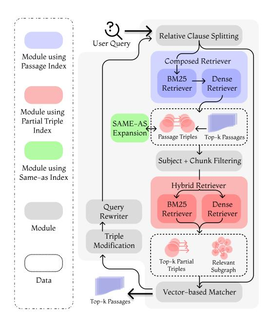
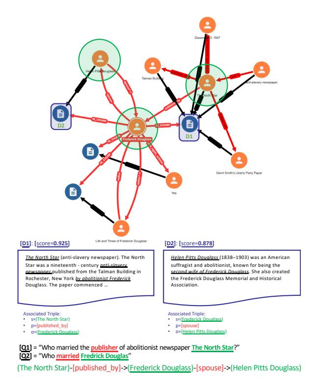

# Don't Forget the Base Retriever! A Low-Resource Graph-based Retriever for Multi-hop Question Answering

André Melo§ Enting Chen¶† Pavlos Vougiouklis§ Chenxin Diao§ Shriram Piramanayagam§ Ruofei Lai§ Jeff Z. Pan§

§Huawei UK R&D Technologies, Poisson Lab, CSI ¶Baillie Gifford [{andre.melo,](mailto:andre.melo@huawei.com) [pavlos.vougiouklis,](mailto:pavlos.vougiouklis@huawei.com) [chenxindiao}](mailto:chenxindiao@h-partners.com)@huawei.com [enting.chen@](enting.chen@bailliegifford.com)bailliegifford.com

[{shriram.piramanayagam,](mailto:shriram.piramanayagam@h-partners.com) [lairuofei,](mailto:lairuofei@huawei.com) [jeff.pan}](mailto:jeff.pan@huawei.com)@huawei.com

## Abstract

Traditional Retrieval-augmented Generation systems struggle with complex multi-hop questions, which often require reasoning over multiple passages. While GraphRAG approaches address these challenges, most of them rely on expensive LLM calls. In this paper, we propose GRIEVER, a lightweight, low-resource, multistep graph-based retriever for multi-hop QA. Unlike prior work, GRIEVER does not rely on LLMs and can perform multi-step retrieval in a few hundred milliseconds. It efficiently indexes passages alongside an associated knowledge graph and employs a hybrid retriever combined with aggressive filtering to reduce retrieval latency. Experiments on multi-hop QA datasets demonstrate that GRIEVER outperforms conventional retrievers and shows strong potential as a base retriever within multi-step agentic frameworks.

## 1 Introduction

Recent efforts have highlighted the benefits of combining Large Language Models' (LLMs) parametric memory with non-parametric sources of knowledge to address complex user queries. The Retrieval-augmented Generation (RAG) paradigm exemplifies this approach, using non-parametric memory to guide LLMs towards more accurate responses [\(Lewis et al.,](#page-6-0) [2020\)](#page-6-0). While effective for simpler queries, multi-hop question answering (QA) remains a more demanding task, requiring reasoning across multiple passages or documents.

Recent GraphRAG approaches have proposed more sophisticated retrieval strategies that bridge the semantic meaning of passages (or *documents*) by interlinking the entities they contain [\(Fang et al.,](#page-6-1) [2024;](#page-6-1) [Li et al.,](#page-7-0) [2024;](#page-7-0) [Gutierrez et al.,](#page-6-2) [2024;](#page-6-2) [Shen](#page-7-1) [et al.,](#page-7-1) [2025\)](#page-7-1). They usually work by leveraging

an alignment of an index of passages with an index of triples extracted from these passages [\(Fang](#page-6-1) [et al.,](#page-6-1) [2024;](#page-6-1) [Gutierrez et al.,](#page-6-2) [2024;](#page-6-2) [Li et al.,](#page-7-0) [2024;](#page-7-0) [Shen et al.,](#page-7-1) [2025\)](#page-7-1). However, such methods often rely on expensive LLM calls, incurring significant deployment costs, limiting their applicability in resource-constrained environments.

In this work, we focus on efficient retrieval and we propose: GRIEVER, a graph-based retriever that resolves multi-hop challenges without relying on online LLM calls. We take the alignment between a passage and triples index to the extreme, and we propose a hybrid indexing paradigm on top of the structure of the extracted graph tailored to the needs of *partial* triples retrieval and synonym expansion. We build a lightweight, graph-based retrieval strategy using this hybrid index that expands triple reasoning chains to approximate suitable relevant passages across distant semantic hops. Low-latency and results filtering considerations are applied to reduce the computational retrieval load.

We evaluate GRIEVER on popular multi-hop QA datasets: MuSiQue, 2Wiki and HotpotQA. GRIEVER achieves superior passage recall performance compared to other conventional base retrievers, and in many cases comparable to LLM-based GraphRAG approaches, while running at least an order of magnitude faster. Furthermore, we find that in settings with more flexible runtime requirements, when GRIEVER can be combined with agentic frameworks (i.e. GEAR) to provide relative recall gains of up to 4.9%. Our contributions can be summarised as follows:

- We refine the GraphRAG paradigm of aligning a passage and triples index by introducing efficiency and robustness considerations for hybrid passage and *partial* triple retrieval.
- We propose an iterative methodology for expanding triples associated with a preliminary

<sup>†</sup>Work done while at Huawei Edinburgh Research Centre.

set of retrieved passages by considering filtering unsuitable candidate entity nodes.

• We demonstrate the value of GRIEVER within multi-step, agentic frameworks enabling performance convergence within less iterations.

# 2 Related Work

Our work draws inspiration from multi-hop QA using combinations of LLMs with graphical structures. In recent years, several architectures introduced a separate, offline indexing phase during which they form a hierarchical representation of the information included in a knowledge of textual passages [\(Chen et al.,](#page-6-3) [2023;](#page-6-3) [Sarthi et al.,](#page-7-2) [2024;](#page-7-2) [Edge et al.,](#page-6-4) [2024\)](#page-6-4).

[Fang et al.](#page-6-1) construct reasoning chains through an auto-regressive reasoning chain constructor, and generate answers either directly from these reasoning chains or by retrieving original context documents. [Li et al.](#page-7-0) use an LLM agent that is capable of selecting between a set of predefined actions on how to traverse the nodes of the extracted knowledge graph given an input question, in real-time. HippoRAG leverages an alignment of passages and extracted triples in order to retrieve passages based on the Personalised PageRank algorithm [\(Gutier](#page-6-2)[rez et al.,](#page-6-2) [2024\)](#page-6-2). While the proposed retriever results in considerable improvements for single- and multi-step retrieval (i.e. when coupled with IR-CoT [\(Trivedi et al.,](#page-7-3) [2023\)](#page-7-3)), it remains agnostic to the semantic relationships of the extracted triples. [Shen et al.](#page-7-1) introduce a new graph-based retrieval framework that uses a small semantic model for exploring multi-hop relationships. While the proposed system: GEAR leads to a reduction in LLM token utilisation, similarly to HippoRAG, it still relies on an LLM for its retrieval step—leading to significant runtimes.

In this paper, we build upon a similar alignment of passages and extracted triples, refining the approach by incorporating retrieval efficiency considerations and enabling the retrieval of partial triples, without relying on LLMs for addressing multihop QA scenarios. Our revision of conventional GraphRAG approaches enables retrieval runtimes of under one second while maintaining competitive performance compared to significantly more computationally expensive alternatives.

## 3 Problem Setting

The problem involves multi-step passage retrieval, where a given question requires the information from multiple passages to be combined in order to answer a question [\(Trivedi et al.,](#page-7-4) [2022;](#page-7-4) [Yang](#page-7-5) [et al.,](#page-7-5) [2018;](#page-7-5) [Ho et al.,](#page-6-5) [2020\)](#page-6-5). Additionally, we assume an alignment of an index containing these passages with an index of triples extracted from these passages [\(Trivedi et al.,](#page-7-3) [2023;](#page-7-3) [Gutierrez et al.,](#page-6-2) [2024;](#page-6-2) [Shen et al.,](#page-7-1) [2025\)](#page-7-1). These triples represent atomic facts within their source passages. They are subsequently organised into a graph bridging passages sharing common entities.

We approach the problem from a low-resource perspective, where multi-hop capabilities are required but results must be returned within hundreds of milliseconds (100 − 500 ms).

## 4 GRIEVER

Similar to other works in the RAG space, GRIEVER relies on the existence of a corpus of passages and associated graph triples, which can be extracted directly from the passages. GRIEVER introduces an offline index building step (described in detail in Section [4.1\)](#page-1-0). The relevant considerations go beyond conventional alignments of passages and triples indices, ensuring efficient retrieval capabilities during online, querying time, which is subsequently described in Section [4.2.](#page-2-0)

## <span id="page-1-0"></span>4.1 Offline Index Construction

The overall architecture of GRIEVER includes an initial offline step, where the index structure is created. GRIEVER uses three different indices:

- **passages**: contains the uniquely identified passages with their document title, passage content and associated triples information;
- **partial\_triples**: contains partial triples, i.e., subject-predicate or predicate-object pairs alongside the passage ids from which the triple partials were extracted and the list of partial's complement entities; and,
- **same\_as**: contains a list of synonyms along with a list of passage ids from which these synonyms are extracted.

Further information about the structure of the indices used by GRIEVER is provided in Appendix [A.1.](#page-7-6) The role each index plays within the

<span id="page-2-1"></span>

Figure 1: The architecture of GRIEVER.

retrieval framework is shown in Figure [1](#page-2-1) and explained in details in Section [4.2](#page-2-0)

#### <span id="page-2-0"></span>4.2 Online Multi-Step Retrieval

Once the offline index construction is concluded, the indices can be used by an online multi-step iterative retrieval system, c.f. Figure [1.](#page-2-1) Algorithm [1](#page-8-0) shows the iterative retrieval process in further detail. Figure [2](#page-2-2) shows an example of a multi-hop query requiring information from two different passages. Each online iteration of GRIEVER achieves its functionality following three retrieval steps.

- The first retrieves the passages alongside their associated triples given a query by relying on the passages index.
- The second step retrieves synonyms of entities using the same\_as index to improve path recall by enabling the joining of entities that appear in triples connected to the sub-graph retrieved in the preceding step.
- The third one shortlists the triples obtained with passages using the partial\_triples by selecting those scored the highest with respect to the original text query.

## 4.2.1 Relative Clause Splitting

The first part of the pipeline is a lightweight relative clause splitter. Relative clause connectors (shown in bold in the example query below) are used to split the query and the split parts, e.g.:

<span id="page-2-2"></span>

Figure 2: Example of an input query for GRIEVER.

q ="When did Napolean occupy the city where the mother of the woman who brought Louis XV style to the court died?"

Then for each split point, a new sub-query is generated by joining the parts from the split point until the end. Those sub-queries are fired in parallel and their results are combined at the end.

The benefit of splitting the query is that for queries with multiple relative clauses, each clause may correspond to a different passage to be retrieved. Using the entire query in the first iteration can introduce mixed signals, making it difficult to retrieve the first hop. This is a lightweight yet effective way of addressing this issue.

#### <span id="page-2-3"></span>4.2.2 Passage Retrieval

Given a query, the first step is to retrieve the set of best-matching passages. Hybrid retrievers are able to combine the benefits of both sparse and dense retrievers. Reciprocal Rank Fusion (RRF) is the most widely used method to combine results from both dense and sparse retrievers [\(Cormack et al.,](#page-6-6) [2009\)](#page-6-6). While the underlying retrievers are independent and can be called in parallel, the dense retriever is normally much slower than the sparse one. The latency of the dense retriever primarily depends on the dimensionality of the embedding vectors and the number of candidates for which similarity is computed [\(Malkov and Yashunin,](#page-7-7) [2020\)](#page-7-7).

In order to minimise the latency of the dense retriever, we propose a Composed retrieval strategy which is presented in detail below.

Optimising Hybrid Retrieval Latency In order to further optimise the runtime of each base retrieval call within GRIEVER, we minimise the number of candidates that will be considered by the dense retrieval by relying on a candidate set filter based on the results of the sparse retriever. As we show in our experiments (see Table [1\)](#page-4-0), the overall runtime is often lower, as the benefit of parallelising the sparse retriever does not compensate for the speed-up due to filtering.

When aggregating results from the dense and sparser retrievers, RRF is a robust popular option, which ignores scores and relies on rankings only. Since the passage retrieval scores can be used in the final ranking and combined with other types of scoring, it makes sense to use more meaningful and comparable scores. The details about the passage scoring are presented in the next section.

In the first iteration, the only input is the query itself. After the first iteration, there are filtering opportunities which can be used to further reduce the passages query runtime. The first iteration produces a sub-graph, which can be extended given a rewritten query at a subsequent iteration (c.f. Section [4.5\)](#page-4-1). For the sub-graph extension, it is assumed that any *new passages* should contain triples that connect them with the existing sub-graph. That is, the subjects or objects of the triples should match those in the edges of the sub-graph. The set of *joinable entities* in the sub-graph can be used to filter the passages, ensuring that at least one of them is contained in the subjects or objects field in the passage index (see Appendix [A.1\)](#page-7-6). Additionally, the passage\_id set can be used as an inverse filter to ensure passage novelty.

#### 4.2.3 Join Entities Synonym Expansion

In the context where the graph is formed by text triplets, the aforementioned subjects or objects filter would miss cases where the join entity appears on different triples as different aliases, e.g., "LeBron James" and "LeBron Raymone James Sr.".

In order to address such cases and improve coverage, we consider the same\_as index in order to expand the sub-graph of the joined entities with their synonyms. The set of already retrieved passage\_ids can be used to filter the same\_as query, so that only synonyms relevant to the in-

tended meaning of the entity (i.e. based on the context in those passages) are retrieved. This helps avoid retrieving synonyms related to an alternative or incorrect sense of the entity name. For instance, without passage\_id filtering, the name Orange may be expanded with synonyms corresponding to different entities, such as a company, a fruit, or something else entirely.

## 4.2.4 Triples Shortlisting

Once the top-k passages are retrieved, their associated triples can be directly obtained without an extra query, since they are included in triples field of the partial\_triples index. Since each passage may contain several triples, the total number of triples retrieved can be quite high. This may be problematic, as the final triple scoring relies on an efficient vector-based matcher that requires the entities in each triple to be encoded [\(Stoilos et al.,](#page-7-8) [2022\)](#page-7-8). Consequently, the encoding operation can become costly if too many triples are considered.

The partial\_triples is used to shortlist the set of triples considered in the unsupervised tagger, c.f. Algorithm [2](#page-8-1) for further details. This index is used instead of a full triples\_index, since in the QA setting the whole triple is not expected to appear within an input natural language query [\(Mohammed et al.,](#page-7-9) [2018\)](#page-7-9). Instead, only a combination of a predicate (or property) and a subject or object is expected to be contained in the original query. The example in Figure [2](#page-2-2) illustrates this. The first hop information of "Who married the publisher of abolitionist newspaper The North Star?" is supposed to be addressed by the triple (The North Star)-[published\_by]->(Frederick Douglass). The entity Frederick Douglas is the example of the required joining entity, which is originally unknown and will be included to join the first hop triples with the ones for the next hop (Frederick Douglass)-[spouse]->(Helen Pitts Douglass).

In the partial\_triples index, the concatenation of subject + predicate and predicate + object (if an inverse partial triple) is indexed for computing the relevant dense retriever embeddings.

## <span id="page-3-0"></span>4.3 Vector-based Entity Matcher

We use a lightweight vector-based matcher on the token-level embeddings, enc q t , of a sentence encoder. The embeddings for an n-gram, ng, derived from q, are computed after aggregating the corresponding n<sup>g</sup> token-level embeddings as follows:

<span id="page-4-0"></span>

|          |           |       | - 0   |       |         | 0.11          |               |
|----------|-----------|-------|-------|-------|---------|---------------|---------------|
|          | Retriever | R@5   | R@10  | R@15  | ms@5    | ms@10         | ms@15         |
|          | BM25      | 0.351 | 0.41  | 0.442 | 23±5    | 25±6          | 27±6          |
| ne l     | Dense     | 0.319 | 0.383 | 0.420 | 294±12  | $292 \pm 11$  | $292 \pm 11$  |
| 0.10     | RRFHybrid | 0.394 | 0.472 | 0.505 | 295±11  | $295 \pm 10$  | $294 \pm 10$  |
| MuSiQue  | Composed  | 0.417 | 0.492 | 0.533 | 135±8   | $134 \pm 7$   | $168 \pm 13$  |
| 2        | GRIEVER   | 0.456 | 0.539 | 0.573 | 425±122 | $441 \pm 135$ | $509 \pm 127$ |
|          | BM25      | 0.64  | 0.668 | 0.68  | 38±15   | 44±16         | 48±17         |
|          | Dense     | 0.467 | 0.515 | 0.539 | 467±24  | $467 \pm 24$  | $472\pm23$    |
| 2Wiki    | RRFHybrid | 0.64  | 0.673 | 0.685 | 469±24  | $472 \pm 25$  | $475 \pm 24$  |
| 2        | Composed  | 0.624 | 0.662 | 0.677 | 159±22  | $229 \pm 26$  | $297 \pm 29$  |
|          | GRIEVER   | 0.676 | 0.738 | 0.751 | 435±93  | $476 \pm 77$  | $603 \pm 77$  |
|          | BM25      | 0.668 | 0.82  | 0.887 | 18±3    | 21±3          | 24±3          |
| S        | Dense     | 0.728 | 0.799 | 0.842 | 61±3    | 61±3          | $62 \pm 3$    |
| HotpotQA | RRFHybrid | 0.776 | 0.879 | 0.917 | 63±3    | 61±3          | 63±3          |
| otp      | Composed  | 0.784 | 0.886 | 0.919 | 76±5    | 96±8          | 115±7         |
| Ĭ        | GRIEVER   | 0.813 | 0.909 | 0.937 | 273±59  | 300±49        | 337±53        |

Table 1: Retrieval performance and runtime comparison on MuSiQue, 2Wiki and HotpotQA.

enc  $(n_g|\mathbf{q})$ . This means that the rather expensive encoding step happens once for each  $\mathbf{q}$ . enc  $(\mathbf{q})$  is used for dense retrieval and the intermediary  $\mathrm{enc}_t^{\mathbf{q}}$  are reused to compute the n-gram embeddings.

The resulting n-gram embeddings are used to compute similarity scores against the embeddings of the named entities. The candidate named entities come from the subjects or objects of shortlisted triples. If synonyms exist for a given entity e, each synonym is encoded separately. We denote the *entity matching score*,  $s_e^{\bf q}$ , as the maximum similarity score observed for an entity and its synonyms across all candidate n-grams derived from  ${\bf q}$ .

# **4.4** Scoring: From Triples to Paths and Passages

Let a triple  $t_j$  be denoted as  $t_j = (s_j, p_j, o_j)$ , its corresponding partial triples as  $t'_j = \{(s_j, p_j), (p_j, o_j)\}$  and  $\{s_j, o_j\}$  be the set containing the two entities in  $t_j$ . The score of a partial triple  $u \in t'_j$  can be computed as the average of its predicate score,  $s_{p_j}^{\mathbf{q}}$  and its entity score  $s_{e_j}^{\mathbf{q}}$  s.t.  $e_j \in \{s_j, o_j\}$  multiplied by the inverse partial triple frequency:

$$s_u^{\mathbf{q}} = \frac{s_{e_j}^{\mathbf{q}} + s_{p_j}^{\mathbf{q}}}{2(1 + \log \operatorname{freq}(e_j, p_j))},$$
 (1)

where  $e_j \in u \cap \{s_j, o_j\}$ . The triple scores are computed as the maximum score across their corresponding partial triples, as follows:

$$s_{t_j}^{\mathbf{q}} = \max\left(\left\{s_u^{\mathbf{q}} \,\forall u \in t_j'\right\}\right) \tag{2}$$

The multi-hop path scores are updated every time a new triple is added to the path chain. The running score of a path is defined as the average of the scores of the triples composing the path. For determining the score of a passage, we iterate over all the paths containing a triple associated with it. The score of a passage is the maximum score of the multiplication of the triple score itself with the score of each path in which this triple participates. Those passage scores are used to rank the final GRIEVER results.

#### <span id="page-4-1"></span>4.5 Heuristic-based Query Re-writing

After identifying the highest-scoring entities using the vector-based matcher (see Section 4.3), we attempt to rewrite the query from the previous iteration by removing mentions of matched entities, along with relations from the shortlisted triples when they are matched. If successful, we replace the identified mention in the query with the remaining unmatched entity in the corresponding triples.

<span id="page-4-2"></span>

| Retriever | MuS  | iQue | 2W   | /iki | HotpotQA |      |  |
|-----------|------|------|------|------|----------|------|--|
| Kenievei  | EM   | F1   | EM   | F1   | EM       | F1   |  |
| BM25      | 18.4 | 27.6 | 42.4 | 47.7 | 43.8     | 57.2 |  |
| Dense     | 15.2 | 25.4 | 23.6 | 28.4 | 42.1     | 55.0 |  |
| RRFHybrid | 20.0 | 30.2 | 43.8 | 48.0 | 45.4     | 58.5 |  |
| Composed  | 19.0 | 29.5 | 43.8 | 47.7 | 43.3     | 57.1 |  |
| GRIEVER   | 21.6 | 32.6 | 42.0 | 48.2 | 46.2     | 59.8 |  |

Table 2: End-to-end QA performance with top- 5 retrieved passages.

#### 5 Experiments

We conduct experiments on three popular public multi-hop question answering benchmarks: MuSiQue (Trivedi et al., 2022), HotpotQA (Yang

<span id="page-5-0"></span>

|                                                                                     | MuSiQue                          |                                  |                                  | 2Wiki                            |                                  |                                  | HotpotQA                         |                                  |                                  |
|-------------------------------------------------------------------------------------|----------------------------------|----------------------------------|----------------------------------|----------------------------------|----------------------------------|----------------------------------|----------------------------------|----------------------------------|----------------------------------|
| Setup                                                                               | R@5                              | R@10                             | R@15                             | R@5                              | R@10                             | R@15                             | R@5                              | R@10                             | R@15                             |
| w/ partial_triples<br>w/ full_triples<br>w/o shortlisting<br>w/o composed_retriever | 0.456<br>0.457<br>0.452<br>0.438 | 0.539<br>0.536<br>0.532<br>0.514 | 0.573<br>0.570<br>0.574<br>0.555 | 0.676<br>0.667<br>0.594<br>0.672 | 0.738<br>0.722<br>0.695<br>0.733 | 0.751<br>0.740<br>0.713<br>0.731 | 0.813<br>0.787<br>0.739<br>0.792 | 0.909<br>0.900<br>0.870<br>0.887 | 0.937<br>0.932<br>0.916<br>0.920 |

Table 3: Ablation study of GRIEVER's performance across different index configurations; with a partial triples index, with a full instead of a partial triples index, without triples shortlisting and with RRFHybrid instead of Composed retriever for passage retrieval.

<span id="page-5-1"></span>

|                   | MuSiQue |       |       | 2Wiki |       |      | HotpotQA |       |      |
|-------------------|---------|-------|-------|-------|-------|------|----------|-------|------|
| Retriever         | R@5     | R@10  | R@15  | R@5   | R@10  | R@15 | R@5      | R@10  | R@15 |
| GEAR + RRFHybrid  | 55.6    | 66.1  | 69.3  | 88.4  | 94.5  | 95.2 | 93.1     | 96.3  | 96.7 |
| GEAR + GRIEVER    | 55.7    | 66.6  | 69.8  | 88.3  | 94.7  | 95.7 | 92.5     | 95.7  | 96.9 |
| IRCOT + RRFHybrid | 52.57   | 58.30 | 59.98 | 76.00 | 80.60 | −    | 79.55    | 82.55 | −    |
| IRCOT + GRIEVER   | 54.98   | 61.03 | 62.58 | 77.00 | 83.80 | −    | 80.10    | 86.60 | −    |

Table 4: Retrieval performance of GRIEVER against RRFHybrid as base retriever within agentic, multi-step frameworks (i.e. GEAR and IRCOT).

[et al.,](#page-7-5) [2018\)](#page-7-5), and 2WikiMultiHopQA (2Wiki) [\(Ho](#page-6-5) [et al.,](#page-6-5) [2020\)](#page-6-5). For MuSiQue and 2Wiki, we use the data provided in the IRCoT paper [\(Trivedi et al.,](#page-7-3) [2023\)](#page-7-3) which includes the full corpus, while for HotpotQA, we follow the same setting as HippoRAG [\(Gutierrez et al.,](#page-6-2) [2024\)](#page-6-2) to limit experimental costs.

We measure both retrieval and QA performance. For retrieval evaluation, we use Recall@k (R@k) for k ∈ {5, 10, 15}. Following standard practices, QA performance is evaluated with Exact Match (EM) and F1 scores [\(Trivedi et al.,](#page-7-3) [2023\)](#page-7-3).

## 5.1 Baselines

We evaluate GRIEVER against stand-alone, singlestep retrievers: (i) BM25, (ii) Dense (using SBERT), (iii) a hybrid approach combining BM25 and SBERT through RRF (i.e. RRFHybrid) and (iv) the Composed retrieval strategy described in Section [4.2.2.](#page-2-3)

#### 5.2 Retrieval and QA

The retrieval results in Table [1](#page-4-0) indicate that GRIEVER with two iterations (i.e. with a single query re-writing step) is able to consistently outperform base retrievers across all settings and datasets. This is achieved, without a major difference in average runtime, especially when compared with the base Dense retriever. In fact, in one of the settings (top-5 on 2Wiki), GRIEVER is on average faster than Dense. It is important to note that the GRIEVER results include two dense

retrieval queries to both the passages and the partial\_triples indices.

Moreover, GRIEVER's retrieval performance is not far from that of some agentic approaches for graph-based retrieval. When comparing the retrieval results in Table [1](#page-4-0) against the results reported by [\(Shen et al.,](#page-7-1) [2025\)](#page-7-1), we observe that GRIEVER performs comparably to, and in some settings even surpasses, IRCoT+ColBERT and HippoRAG on the MuSiQue, and HotpotQA datasets.

Table [2](#page-4-2) confirms the hypothesis that better retrieval performance can translate into better performance in the subsequent QA phase.

Ablation Study Table [3](#page-5-0) shows that using the partial\_triples index within GRIEVER for triple shortlisting appears to improve retrieval performance. When attempting to match the entire triple against the query (by using full\_triples), the absent joining entity can negatively impact the similarity score. When removing the triples shortlisting entirely (wo/ shortlisting) results in about 20–30% longer runtimes and using triples index instead of partial triples around 10–20% longer runtimes. Replacing the Composed retriever with RRFHybrid (wo/ composed\_retriever) resulted in performance drop and led to about twice the runtime on average for the larger datasets MuSiQue and 2Wiki.

## 5.3 GRIEVER as a Base Retriever

Table [4](#page-5-1) shows the impact of using GRIEVER as a base retriever within agentic retrieval frameworks[1](#page-6-7) : IRCOT and GEAR. GEAR uses RRFHybrid as a base retriever by default. Based on the default length of their maximum reasoning chains, the maximum number of iterations is set to 4 for MuSiQue and 2 for the HotpotQA and 2Wiki datasets. Swapping their base retriever for GRIEVER results in better retrieval performance overall.

## 6 Conclusion

In this paper, we introduced GRIEVER, a graphbased retriever that addresses multi-hop retrieval challenges without relying on online LLM calls. Our lightweight design leverages an alignment between a textual passage index and an index of schema-free triples, providing both efficiency and robustness.

GRIEVER streamlines passage retrieval by traversing high-scoring triple paths, enabling more effective multi-hop reasoning within hundreds of milliseconds. On popular multi-hop QA datasets, GRIEVER achieves strong performance compared to conventional base retrievers and, in many cases, rivals LLM-based GraphRAG approaches.

Finally, we demonstrate the effectiveness of GRIEVER in multi-step, agentic frameworks, where it reduces the number of iterations required to reach peak retrieval performance.

## Limitations

Since GRIEVER is designed with a focus on low response time and resource efficiency, in order to remain comparable with popular baseline retrievers, it exhibits certain limitations when used in isolation. The simplicity of the query splitting, rewriting, and entity matching mechanisms can occasionally lead to incorrect triple chains and, consequently, incorrect answers. However, by relying on unsupervised methods, we ensure that the retriever remains lightweight and easily integrable into existing RAG or agentic retrieval systems.

With this in mind, there is an inherent tradeoff between latency and performance when selecting sentence encoders for the query, passages, and entity matcher. Encoding constitutes the primary latency bottleneck, and the use of more complex

models can significantly impact runtime. We leave the exploration of performance using more powerful, auto-regressive semantic models to future work [\(Lee et al.,](#page-6-8) [2025\)](#page-6-8).

## References

<span id="page-6-3"></span>Howard Chen, Ramakanth Pasunuru, Jason Weston, and Asli Celikyilmaz. 2023. [Walking down the mem](https://arxiv.org/abs/2310.05029)[ory maze: Beyond context limit through interactive](https://arxiv.org/abs/2310.05029) [reading.](https://arxiv.org/abs/2310.05029) *Preprint*, arXiv:2310.05029.

<span id="page-6-6"></span>Gordon V. Cormack, Charles L A Clarke, and Stefan Buettcher. 2009. [Reciprocal rank fusion outperforms](https://doi.org/10.1145/1571941.1572114) [condorcet and individual rank learning methods.](https://doi.org/10.1145/1571941.1572114) In *Proceedings of the 32nd International ACM SIGIR Conference on Research and Development in Information Retrieval*, SIGIR '09, page 758–759, New York, NY, USA. Association for Computing Machinery.

<span id="page-6-4"></span>Darren Edge, Ha Trinh, Newman Cheng, Joshua Bradley, Alex Chao, Apurva Mody, Steven Truitt, and Jonathan Larson. 2024. [From local to global: A](https://www.microsoft.com/en-us/research/publication/from-local-to-global-a-graph-rag-approach-to-query-focused-summarization/) [graph RAG approach to query-focused summariza](https://www.microsoft.com/en-us/research/publication/from-local-to-global-a-graph-rag-approach-to-query-focused-summarization/)[tion.](https://www.microsoft.com/en-us/research/publication/from-local-to-global-a-graph-rag-approach-to-query-focused-summarization/)

<span id="page-6-1"></span>Jinyuan Fang, Zaiqiao Meng, and Craig MacDonald. 2024. [TRACE the evidence: Constructing](https://doi.org/10.18653/v1/2024.findings-emnlp.496) [knowledge-grounded reasoning chains for retrieval](https://doi.org/10.18653/v1/2024.findings-emnlp.496)[augmented generation.](https://doi.org/10.18653/v1/2024.findings-emnlp.496) In *Findings of the Association for Computational Linguistics: EMNLP 2024*, pages 8472–8494, Miami, Florida, USA. Association for Computational Linguistics.

<span id="page-6-2"></span>Bernal Jimenez Gutierrez, Yiheng Shu, Yu Gu, Michihiro Yasunaga, and Yu Su. 2024. [HippoRAG: Neu](https://openreview.net/forum?id=hkujvAPVsg)[robiologically inspired long-term memory for large](https://openreview.net/forum?id=hkujvAPVsg) [language models.](https://openreview.net/forum?id=hkujvAPVsg) In *The Thirty-eighth Annual Conference on Neural Information Processing Systems*.

<span id="page-6-5"></span>Xanh Ho, Anh-Khoa Duong Nguyen, Saku Sugawara, and Akiko Aizawa. 2020. [Constructing a multi](https://doi.org/10.18653/v1/2020.coling-main.580)[hop QA dataset for comprehensive evaluation of](https://doi.org/10.18653/v1/2020.coling-main.580) [reasoning steps.](https://doi.org/10.18653/v1/2020.coling-main.580) In *Proceedings of the 28th International Conference on Computational Linguistics*, pages 6609–6625, Barcelona, Spain (Online). International Committee on Computational Linguistics.

<span id="page-6-8"></span>Chankyu Lee, Rajarshi Roy, Mengyao Xu, Jonathan Raiman, Mohammad Shoeybi, Bryan Catanzaro, and Wei Ping. 2025. [NV-embed: Improved techniques](https://openreview.net/forum?id=lgsyLSsDRe) [for training LLMs as generalist embedding models.](https://openreview.net/forum?id=lgsyLSsDRe) In *The Thirteenth International Conference on Learning Representations*.

<span id="page-6-0"></span>Patrick Lewis, Ethan Perez, Aleksandra Piktus, Fabio Petroni, Vladimir Karpukhin, Naman Goyal, Heinrich Küttler, Mike Lewis, Wen-tau Yih, Tim Rocktäschel, Sebastian Riedel, and Douwe Kiela. 2020. Retrieval-augmented generation for knowledgeintensive NLP tasks. In *Proceedings of the 34th*

<span id="page-6-7"></span><sup>1</sup>GRIEVER is called with k = 5. For IRCOT, we set max\_iter=2 for 2Wiki and HotpotQA. Therefore we do not report R@15 on those datasets for IRCOT.

*International Conference on Neural Information Processing Systems*, NIPS '20, Red Hook, NY, USA. Curran Associates Inc.

<span id="page-7-0"></span>Shilong Li, Yancheng He, Hangyu Guo, Xingyuan Bu, Ge Bai, Jie Liu, Jiaheng Liu, Xingwei Qu, Yangguang Li, Wanli Ouyang, Wenbo Su, and Bo Zheng. 2024. [GraphReader: Building graph-based agent to](https://aclanthology.org/2024.findings-emnlp.746) [enhance long-context abilities of large language mod](https://aclanthology.org/2024.findings-emnlp.746)[els.](https://aclanthology.org/2024.findings-emnlp.746) In *Findings of the Association for Computational Linguistics: EMNLP 2024*, pages 12758–12786, Miami, Florida, USA. Association for Computational Linguistics.

<span id="page-7-7"></span>Yu A. Malkov and D. A. Yashunin. 2020. [Efficient and](https://doi.org/10.1109/TPAMI.2018.2889473) [robust approximate nearest neighbor search using](https://doi.org/10.1109/TPAMI.2018.2889473) [hierarchical navigable small world graphs.](https://doi.org/10.1109/TPAMI.2018.2889473) *IEEE Trans. Pattern Anal. Mach. Intell.*, 42(4):824–836.

<span id="page-7-9"></span>Salman Mohammed, Peng Shi, and Jimmy Lin. 2018. [Strong baselines for simple question answering over](https://doi.org/10.18653/v1/N18-2047) [knowledge graphs with and without neural networks.](https://doi.org/10.18653/v1/N18-2047) In *Proceedings of the 2018 Conference of the North American Chapter of the Association for Computational Linguistics: Human Language Technologies, Volume 2 (Short Papers)*, pages 291–296, New Orleans, Louisiana. Association for Computational Linguistics.

<span id="page-7-2"></span>Parth Sarthi, Salman Abdullah, Aditi Tuli, Shubh Khanna, Anna Goldie, and Christopher D Manning. 2024. [RAPTOR: Recursive abstractive processing](https://openreview.net/forum?id=GN921JHCRw) [for tree-organized retrieval.](https://openreview.net/forum?id=GN921JHCRw) In *The Twelfth International Conference on Learning Representations*.

<span id="page-7-1"></span>Zhili Shen, Chenxin Diao, Pavlos Vougiouklis, Pascual Merita, Shriram Piramanayagam, Enting Chen, Damien Graux, Andre Melo, Ruofei Lai, Zeren Jiang, Zhongyang Li, Ye Qi, Yang Ren, Dandan Tu, and Jeff Z. Pan. 2025. [GeAR: Graph-enhanced agent](https://doi.org/10.18653/v1/2025.findings-acl.624) [for retrieval-augmented generation.](https://doi.org/10.18653/v1/2025.findings-acl.624) In *Findings of the Association for Computational Linguistics: ACL 2025*, pages 12049–12072, Vienna, Austria. Association for Computational Linguistics.

<span id="page-7-8"></span>Giorgos Stoilos, Nikos Papasarantopoulos, Pavlos Vougiouklis, and Patrik Bansky. 2022. [Type linking for](https://doi.org/10.1145/3534678.3539067) [query understanding and semantic search.](https://doi.org/10.1145/3534678.3539067) In *Proceedings of the 28th ACM SIGKDD Conference on Knowledge Discovery and Data Mining*, KDD '22, page 3931–3940, New York, NY, USA. Association for Computing Machinery.

<span id="page-7-4"></span>Harsh Trivedi, Niranjan Balasubramanian, Tushar Khot, and Ashish Sabharwal. 2022. [MuSiQue: Multi](https://doi.org/10.1162/tacl_a_00475)[hop questions via single-hop question composition.](https://doi.org/10.1162/tacl_a_00475) *Transactions of the Association for Computational Linguistics*, 10:539–554.

<span id="page-7-3"></span>Harsh Trivedi, Niranjan Balasubramanian, Tushar Khot, and Ashish Sabharwal. 2023. [Interleaving retrieval](https://doi.org/10.18653/v1/2023.acl-long.557) [with chain-of-thought reasoning for knowledge](https://doi.org/10.18653/v1/2023.acl-long.557)[intensive multi-step questions.](https://doi.org/10.18653/v1/2023.acl-long.557) In *Proceedings of the 61st Annual Meeting of the Association for Computational Linguistics (Volume 1: Long Papers)*, pages 10014–10037, Toronto, Canada. Association for Computational Linguistics.

<span id="page-7-5"></span>Zhilin Yang, Peng Qi, Saizheng Zhang, Yoshua Bengio, William Cohen, Ruslan Salakhutdinov, and Christopher D. Manning. 2018. [HotpotQA: A dataset for](https://doi.org/10.18653/v1/D18-1259) [diverse, explainable multi-hop question answering.](https://doi.org/10.18653/v1/D18-1259) In *Proceedings of the 2018 Conference on Empirical Methods in Natural Language Processing*, pages 2369–2380, Brussels, Belgium. Association for Computational Linguistics.

## A Implementation Details

All indices are implemented using Elasticsearch. For the dense retriever, we use the all-mpnet-base-v2 SBERT model with approximate k-nearest neighbour search and cosine similarity for computing vector comparisons.

We employ GPT-4o mini for all methods that require an LLM, including triple extraction. For triple extraction, we reproduce the methodology proposed by [Gutierrez et al.;](#page-6-2) [Shen et al..](#page-7-1)

#### <span id="page-7-6"></span>A.1 GRIEVER's Offline Indexing

GRIEVER uses three different indices: (i) passages, (ii) partial\_triples, and (iii) same\_as. The fields included in these indices are presented below:

- passsages:

- id: uid - doc\_id: id - title: text

- content: text

- triples: list[tuple[keyword]] - subjects: list[keyword] - objects: list[keyword]

- partial\_triples:

- id: uid

- passage\_ids: list[id]

- embedding: list[float]

- content: text - subject: keyword - predicate: keyword - in\_inverse: boolean - objects: list[keyword] - embedding: list[float]

- same\_as:

- id: uid

- passage\_ids: list[id]

- content: text

- aliases: list[keyword] - embedding: list[float]

#### A.2 GRIEVER Iterative Retrieval

Algorithms [1](#page-8-0) and [2](#page-8-1) illustrate the online retrieval process and triples shortlisting using the partial\_triples index.

#### <span id="page-8-0"></span>Algorithm 1 The Iterative Multi-step Retrieval Process of GRIEVER

```
function GRIEVER_RETRIEVAL(q, k, n_i)
     F \leftarrow \emptyset
     G_q \leftarrow \emptyset
     R \leftarrow \emptyset
     for i \in \text{range}(n_i) do
          if \neg F then
               R_i \leftarrow \text{composed\_retrieval}(q, k, \text{"passages\_index"}, F)
          else
                R_i \leftarrow \text{rrf\_retrieval}(q, k, \text{"passages\_index"}, F)
          end if
          R \leftarrow R \vee R_i
          T \leftarrow \text{shortlist\_triples}(q, R_i)
          (scored\_triples, E_i) \leftarrow score\_triples(q, T)
          q \leftarrow \text{rewrite\_query}(q, \text{scored\_triples}, E_i)
           F \leftarrow \text{filter("passage\_ids", } \{d.\text{passage\_id} \mid d \in \text{R}_i\}) \land \text{filter("subject|object", E}_i)
           G_q \leftarrow \text{extend\_subgraph}(G_q + T)
     return rank_passages(R, G_q)
end function
```

#### <span id="page-8-1"></span>**Algorithm 2** Shortlisting Triples with the Partial Triples Index

```
 \begin{aligned} & \text{function } \text{SHORTLIST\_TRIPLES}(q,r,t\_max) \\ & \text{$T \leftarrow \{t \mid d \in r,t \in d. \text{triples}\}$} \\ & \text{$E \leftarrow \{t. \text{subject} \mid t \in T\} \mid \{t. \text{object} \mid t \in T\}$} \\ & \text{$E \leftarrow E \lor \text{expand\_same\_as}(E)$} \\ & F \leftarrow \text{filter}(\text{``passage\_id''}, \{d. \text{passage\_id} \mid d \in r\}) \land \\ & \text{filter}(\text{``subject''}, \{t. \text{subject} \mid t \in T\} \mid \{t. \text{object} \mid t \in T\})$} \\ & \text{$P_T \leftarrow \text{rrf\_retrieval}(q, \text{``partial\_triples''}, t\_max, F)$} \\ & \text{$T \leftarrow \{t \mid (t \in T) \land ((t.s, t.p) \in P_T \lor (t.o, t.p) \in P_T)\}$} \\ & \text{$E_j \leftarrow \{o \mid p \in P_T, (o \in p. \text{objects}) \land ((p.s, p.p, p.o) \in T \lor (p.o, p.p, p.s))\}$} \\ & \text{$\textbf{return}$} \left(T, \text{expand\_same\_as}(E_j)\right)$} \\ & \text{$\textbf{end function}} \end{aligned}
```