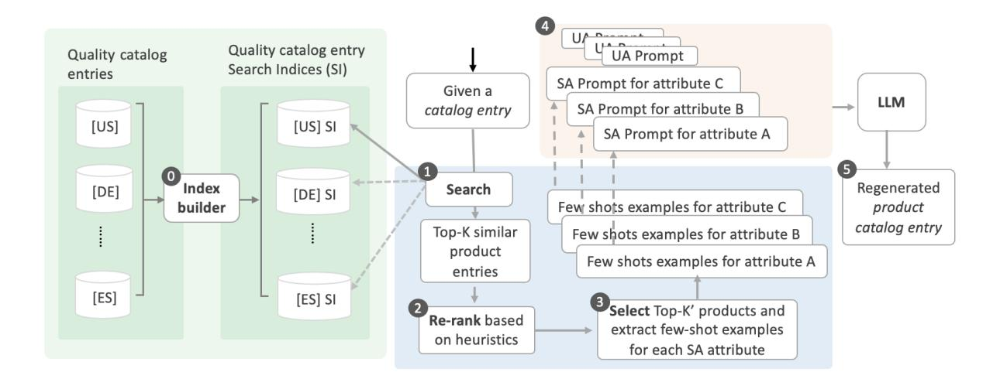
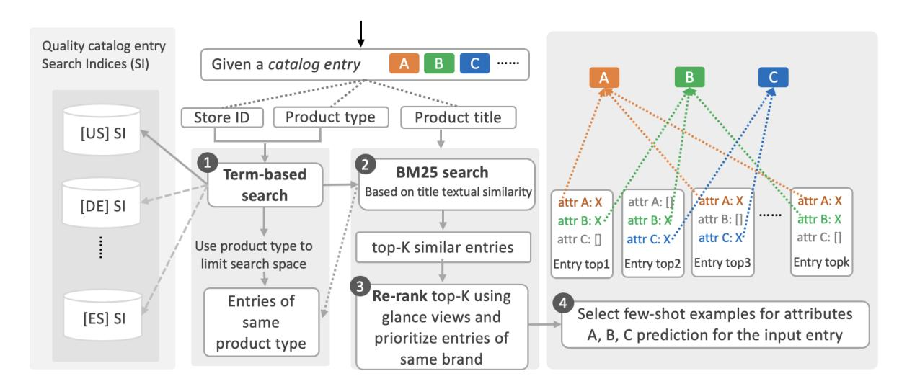

# Leveraging Product Catalog Patterns for Multilingual E-commerce Product Attribute Prediction

Bryan Zhang

Amazon bryzhang@amazon.com

#### Suleiman Khan

Amazon suleimkh@amazon.com Stephan Walter

Amazon sstwa@amazon.de

# Abstract

E-commerce stores increasingly use Large Language Models (LLMs) to enhance catalog data quality through automated regeneration. A critical challenge is accurately predicting missing structured attribute values across multilingual product catalogs, where LLM performance varies significantly by language. While existing approaches leverage general knowledge through prompt engineering and external retrieval, more effective and accurate signals for attribute prediction can exist within the catalog ecosystem itself-similar products often share consistent patterns and structural relationships, and may have the missing attributes filled. Therefore, this paper introduces PatternRAG, a novel retrieval-augmented system that strategically leverages existing product catalog entries to guide LLM predictions for missing attributes. Our approach introduces a multi-stage retrieval framework that progressively refines the search space based on product type, uses textual similarity, glance views and brand relationships to identify the most relevant attribute-filled examples for LLM prediction guidance. Experiments on test sets across three major e-commerce stores in different languages (US, DE, FR) demonstrate substantial improvements in catalog data quality, achieving up to 34% increase in recall and 0.8% in precision for attribute value prediction. At catalog entry level, it also achieves up to +43.32% increase in completeness and up to +2.83% in correctness.

#### 1 Introduction

Product catalogs are the backbone of e-commerce stores, serving as crucial resources for customers, sellers, and internal teams. They play a pivotal role in enhancing user experience, facilitating product discovery, and driving sales. The use of Large Language Models (LLMs) to regenerate and improve

these catalogs has gained significant traction. A typical catalog product entry primarily consists of two textual parts: unstructured attributes (UAs) such as product titles, and structured attributes (SAs) like *color* and *material*. One major challenge in this process is accurately predicting missing values for the SAs of the catalog entries. Our observations indicate that, on average, nearly half of the relevant SA values are missing (empty) for a given entry across product types, highlighting the widespread nature of incomplete information in e-commerce product catalogs.

Predicting missing structured attributes (SA) in multilingual e-commerce catalogs presents several significant challenges: (1) Given the global nature of e-commerce, catalogs often span multiple languages to serve worldwide stores and enable multilingual product discovery [\(Rücklé et al.,](#page-7-0) [2019;](#page-7-0) [Nie,](#page-7-1) [2010;](#page-7-1) [Saleh and Pecina,](#page-7-2) [2020;](#page-7-2) [Bi et al.,](#page-7-3) [2020;](#page-7-3) [Jiang](#page-7-4) [et al.,](#page-7-4) [2020;](#page-7-4) [Lowndes and Vasudevan,](#page-7-5) [2021\)](#page-7-5). While LLMs typically excel in widely-used languages like English, they may exhibit reduced performance in less common languages or those with limited training data, leading to inconsistent attribute prediction quality across different stores. (2) Although it is common to incorporate all available product information such as titles and descriptions to predict attributes, not all missing attributes can be easily predicted or inferred solely from this information and static metadata, even with the model's latent knowledge—particularly as new products and attributes emerge constantly in worldwide e-commerce. (3) Furthermore, while recent efforts have explored Retrieval-Augmented Generation (RAG) to address the inherent limitations of LLMs in accessing specialized knowledge, external knowledge sources cannot effectively capture the specific conventions and norms that exist within product types, stores, and seller practices in constantly growing catalogs.

For effective attribute prediction using LLM in e-commerce catalogs, retrieved information

Figure 1: Overview of PatternRAG

needs to capture specific structural relationships and conventions that exist within product listings, especially where attributes follow store-specific patterns. Examining product listings in ecommerce catalogs, we observe a common pattern: while individual products may have missing attribute values, similar product entries within the same category often have this information filled. Moreover, such a focused set of similar entries naturally encodes business rules, category conventions, and brand-specific patterns through their complete listings. These patterns, when strategically leveraged, can guide LLM predictions more effectively than external knowledge sources, particularly in multilingual environments where maintaining language/store-specific conventions is crucial.

Therefore, in this paper, we introduce PatternRAG, a system that strategically leverages existing product entries to guide LLM predictions for missing structured attributes in e-commerce catalogs. Our system implements a multi-level filtering strategy to identify and utilize implicit patterns from similar products within the store of same language. This approach not only can improve prediction performance but also ensure consistency with existing catalog patterns while adapting to language-specific nuances. Our proposed PatternRAG includes a term-based and probabilistic text-based retrieval mechanism that efficiently identifies similar products based on product title similarities within identical product categories. This is followed by an novel

heuristics-based reranking mechanism that utilizes brand and glance view to optimize the search results by balancing brand consistency with overall similarity scores. The system then performs selective sampling, extracting up to three highly relevant few-shot examples per missing attribute from the reranked list of the identified similar products. These examples are carefully curated and integrated into attribute-specific prompts for contextually-informed predictions using LLM.

#### 2 Method: PatternRAG system

PatternRAG consistently outperforms the baseline prompting approach across three major e-commerce stores (US, DE, FR). At the structured attribute level, it achieves improvements of up to 34% in recall and 0.8% in precision. At the catalog entry level, it achieves substantial improvements of up to +43.32% in *completeness* and up to +2.83% in *correctness*[1](#page-1-0) .

Contributions: We have two contributions in this paper: (1) A novel pattern-aware approach to RAG that strategically leverages similar products within the catalog ecosystem, demonstrating that internal catalog patterns can be more effective than general knowledge sources for structured attribute prediction, particularly in multilingual environments. (2) A catalog-aware framework within PatternRAG for identifying and utilizing implicit patterns through strategic few-shot examples, combining product type constraints, title similarity, glance views and

1Details on the catalog entry-level evaluation metrics is provided in Section [3.3](#page-4-0)

Figure 2: Multi-Stage Retrieval Framework

brand alignment to guide LLM predictions.

The rest of this paper is organized as follows: Section [2](#page-1-1) details our approach, including the retrieval framework selection and the multi-stage prediction process. Section [3](#page-3-0) describes our experimental setup, including dataset characteristics, system implementation details, and evaluation metrics. In Section [4,](#page-4-1) we present and analyze our results. Finally, we conclude with a discussion of our findings and potential directions for future work.

#### 2.1 System Overview

Our approach leverages the inherent patterns within the catalog ecosystem - where similar products within the same language store share consistent attribute structures, brand-specific conventions, and category-specific value formats. For example, running shoes from the same brand in the German store often follow similar pattern in describing their sport type, while fashion items within the same category in the French store share consistent terminology for materials and styles. This stems from a fundamental observation: similar products, particularly those sharing the same product type and brand within a language store, often exhibit consistent patterns in their attribute values. PatternRAG combines efficient retrieval mechanisms with strategic example selection to identify these informative patterns for predicting missing structured attributes.

As illustrated in Figure [1,](#page-1-2) PatternRAG operates in two phases - offline index building and run-time attribute prediction, with the runtime workflow consisting of five key stages. First, the system builds store (language)-specific search indices (SI) from

quality catalog entries (stage 0). At runtime, given a catalog entry with missing attributes, the system queries the relevant language's index to retrieve similar products (stage 1). The retrieved results undergo heuristic-based reranking to prioritize entries from the same brand and having higher glance views (stage 2). For each missing structured attribute, the system then selects relevant few-shot examples from these reranked entries (stage 3). These examples are incorporated into attribute-specific prompts (stage 4), which guide the LLM in generating predictions for the missing values (stage 5). By leveraging these patterns through strategically selected examples, PatternRAG enables more accurate and consistent attribute prediction.

#### 2.2 Multi-Stage Retrieval Framework

Retrieval Process: PatternRAG employs a multistage retrieval framework to identify relevant pattern-aware examples for attribute prediction. The process combines term-based and text-based search strategies to efficiently navigate the catalog ecosystem while ensuring high-quality example selection as shown in Figure [2:](#page-2-0)

Given a catalog entry e with missing structured attributes M = {A, B, C} for prediction. The system first uses Store ID s to select the language-specific search index. The retrieval process begins with term-based search and uses Product Type p to constrain the search space Sp,s. This initial filtering step significantly reduces the computational overhead by focusing subsequent operations on a relevant subset of the catalog. The system then employs BM25 textbased search on product titles within Sp,s to return a result of the ordered set R of top-k similar entries.

Retrieval Framework-BM25: Our selection of BM25 as the retrieval framework for PatternRAG is grounded in both practical and theoretical considerations. First, BM25 effectively can capture product similarities through surface-level textual patterns, which is particularly valuable in e-commerce where similar products often share consistent terminology and brand-specific language. Second, given the common occurrence of noisy catalog data in industrial settings (such as entries in incorrect languages or spam listings), BM25's text-based retrieval approach can effectively filter out such noise through token matching, an advantage over dense retrieval methods, which are more susceptible to multilingual noise. Finally, BM25 combines operational advantages in maintainability and minimal infrastructure requirements with robust retrieval quality for our attribute prediction task, making it particularly effective in identifying products with related features, styles, and use cases.

Heuristic-based re-ranking: To enhance relevance, the system employs two heuristic features for re-ranking: glance views (GV) and brand alignment. The re-ranking process consists of two steps:

First, the top-k retrieved entries in R are sorted by glance views in descending order to obtain R′ . Glance views typically refers to the number of times customers view a product's detail page, which indicates the popularity or visibility of a product in the catalog. Hence higher glance views of a catalog entry typically indicates better entry quality and more reliable attribute values.

Second, if brand b is available from the input entry e, entries in R′ are reordered to obtain R′′ as equation [1.](#page-3-1) This brand-aware reranking preserves the original ordering within each group while prioritizing entries from the same brand.

$$R'' = \{d_i \in R' \mid \operatorname{brand}(d_i) = b\}$$
  
 
$$\oplus \{d_j \in R' \mid \operatorname{brand}(d_j) \neq b\}$$
 (1)

Few-shot example construction: Finally, for each missing attribute m ∈ M in the given catalog entry e, the system selects up to n entries N from the reranked list R′′ where the attribute m has filled value. Then we extract product title and its corresponding attribute-value pair as a few-shot example from each entry in N and incorporate those examples into attribute-specific prompts.

This multi-stage approach offers several key advantages. First, term-based filtering significantly reduces the search space by focusing on structurally and categorically relevant items, thereby improving both computational efficiency and matching accuracy. Second, the BM25 text-based search captures nuanced similarities in product features and descriptions. Third, the heuristics-based reranking, particularly through brand alignment and glance views, maintains consistency with brand-specific attribute patterns while prioritizing high-quality entries. Fourth, the flexible example selection mechanism adapts to the availability of relevant information, ensuring optimal use of available data. Furthermore, the use of language-specific indices allows PatternRAG to adapt seamlessly to different linguistic and cultural contexts across various ecommerce stores.

# 3 Experimental setup

### 3.1 Dataset

Index corpus: For our experiments, we sampled from our production catalog about 30 million entries for US store, and about 20 million respectively for German (DE) and French (FR) stores, serving as the total search space for each store for similar product retrieval.

Test dataset: For evaluation, we constructed test sets of 3,000 catalog entries from each store by sampling across different product types, ensuring comprehensive coverage of the catalog's diversity. The test dataset consists of catalog entries with approximately half missing structured attributes having missing values that require prediction, making it suitable for evaluating our attribute completion task.

SA relevance tag: structured attributes vary in their significance within each product type. To reflect this hierarchy, we annotate each SA in the test datasets with a relevance tag which is either *VRel* ("very relevant") for high-priority attributes or *Rel* ("relevant") for standard attributes[2](#page-3-2) . This clas-

2The same attribute in catalog entries of different product types can be classified with different tags, because its significance vary in different product type categories.

sification, determined by business requirements, enables granular performance analysis across relevance groups and informs entry-level metric calculations (detailed in the metrics section).

#### 3.2 LLM

We use Mixtral-8x7B-Instruct[3](#page-4-2) , a publicly available LLM, for both structured attribute (SA) prediction and evaluation tasks. For prediction, we employ attribute-specific prompts, where each SA is processed independently to maximize prediction accuracy. For evaluation, we utilize the same model with an optimized evaluation prompt that assesses the quality of predicted SA values and returns standardized evaluation labels.

#### 3.3 Evaluation metrics

Evaluation metrics: With the labels from evaluator, we calculate the following evaluation metrics: (1) Attribute-level precision, recall and F1 are calculated for all SA predictions.

- Precision (P): Measures the number of correctly generated attributes divided by the number of generated attributes.
- Recall (R): Measures the number of generated attributes divided by the number of required attributes
- F1: The F1 score is calculated as 2P R/(P + R).

(2) Catalog entry-level Completeness and Correctness: we define the catalog entry-level *Completeness* and *Correctness* to assess the precision and recall of overall relevant SA quality respectively at catalog entry-level. The correctness (or completeness) of a given catalog entry is considered as high-quality when the precision (or recall) of all the "very relevant" SAs (SAs annotated with *VRel*) of a catalog entry meets the product type (PT)-specific thresholds determined by the business needs.

#### 3.4 Retrieval system and few-shot examples

We implement the term-based and OKAPI BM25 Probabilistic retrieval framework for similar product discovery using Lucene 8.11[4](#page-4-3) . The system

uses product title textual similarity between query catalog entry and entries in the index to rank the retrieved entries within the same product type (PT). For each query catalog entry, we first retrieve the top-100 similar entries from the respective entry index (1) based on title textual similarity (2) from the same PT search space, (3) we rerank the top-100 entries and prioritize the entries of the same brand as the query entry while maintaining the overall ranking (4) For each SA prediction, the system processes the reranked top-100 entries to select few-shot examples from the top rank.

Up to three entries with filled values for the target attribute are selected, where each example consists of the product title and its corresponding attribute-value pair. These examples are then integrated into the attribute-specific prompt. For this experiment, we ensure none of the chosen examples is same as the given entry.

### 3.5 Experimental configurations

We evaluate two distinct configurations for our experiments:

Base Prompt: Utilizes our iteratively improved prompt to predict missing values for given structured attributes. This prompt contains the entire product information of the given product catalog entry including both UA (e.g. title, description) and all the SAs, as well as general external knowledge such as the attribute and product definition, etc.

Base Prompt + PatternRAG: Builds upon the previous configuration by adding few-shot examples and explicit instructions on using the few-shot examples. We added the following instruction in our prompt to inform the LLM of usage of the few-shot examples:

The examples below are the titles of similar products along with the values of the attribute you are going to predict. You can use these examples as reference to help with your prediction.

# 4 Results and analysis

PatternRAG demonstrates consistent improvements over the base prompt alone across different metrics and stores as shown in Table [1.](#page-5-0) At the structured attribute level, we observe significant recall improvements across all stores (up to

3 [https://huggingface.co/mistralai/](https://huggingface.co/mistralai/Mixtral-8x7B-Instruct-v0.1) [Mixtral-8x7B-Instruct-v0.1](https://huggingface.co/mistralai/Mixtral-8x7B-Instruct-v0.1) (Apache 2.0 licensed)

4 <https://lucene.apache.org/core/> (Apache 2.0 licensed)

| Store | Structured attr. |         | Catalog entry |              |  |
|-------|------------------|---------|---------------|--------------|--|
|       | Precision        | Recall  | Correctness   | Completeness |  |
| FR    | +0.88%           | +34.41% | +0.98%        | +43.32%      |  |
| DE    | +0.74%           | +4.00%  | +2.83%        | +2.36%       |  |
| US    | -0.16%           | +5.08%  | +0.37%        | +2.94%       |  |

Table 1: Base prompt with PatternRAG improvements (%) over base prompt alone: Attribute-level (precision, recall) and catalog entry-level (completeness, correctness) metrics

+34.41% for FR), while maintaining or slightly improving precision (up to +0.88% for FR, with a minor decrease of -0.16% for US). The FR shows particularly strong improvements, especially in recall metrics, indicating that LLM can benefit significantly from PatternRAG for non-English predictions. Meanwhile, DE and US demonstrate consistent gains.

Catalog entry-level metrics of *completeness* and *correctness* also shown consistent improvements on our test datasets. The FR store shows the most substantial gains in *completeness* with a +43.32% improvement, indicating that PatternRAG can enhance the overall attribute coverage of catalog entries. This is accompanied by a modest but positive increase in *correctness* (+0.98%), suggesting that the improved coverage does not come at the expense of precision. The DE store demonstrates balanced improvements in both metrics, with a +2.83% increase in *correctness* and a +2.36% gain in *completeness*. For the US store, while the improvements are more modest, we still observe positive gains with +0.37% in *correctness* and +2.94% in *completeness*. These results indicate that even in English-language catalogs, where the base LLM performance is typically stronger, PatternRAG can still provide improvements in overall catalog quality.

|    | Group | ∆Precision% | ∆Recall% | ∆F1%    | SA%    |
|----|-------|-------------|----------|---------|--------|
| US | VRel  | -0.14%      | +3.58%   | +1.83%  | 59.80% |
|    | Rel   | -0.11%      | +9.62%   | +5.76%  | 40.20% |
| DE | VRel  | +0.57%      | +2.39%   | +1.56%  | 60.36% |
|    | Rel   | +1.16%      | +5.54%   | +4.05%  | 39.64% |
| FR | VRel  | +0.91%      | +28.27%  | +15.86% | 61.18% |
|    | Rel   | +0.79%      | +49.35%  | +32.67% | 38.82% |

Table 2: Precision, Recall, and F1 score improvements when using PatternRAG compared to base prompt across marketplaces, grouped by attribute relevance (VRel: Very Relevant, Rel: Relevant)

The effectiveness of PatternRAG varies across

attribute relevance groups, as detailed in Table [2.](#page-5-1) *Very Relevant (VRel)* attributes constitute the majority (~60%) of structured attributes across stores, while *Relevant (Rel)* attributes make up the remaining ~40%. As Table [2](#page-5-1) shows, column SA% represents the percentage of structured attributes for each relevance group within the test dataset for each store. Both groups show substantial improvements, with *Rel* attributes demonstrating stronger gains overall. For *VRel* attributes, FR shows the highest recall improvement (+28.27%), also with substantial gains in DE and US, accompanied by slight precision improvements in European stores and a minimal decrease in US. *Rel* attributes show even more substantial improvements, with recall gains up to +49.35% (FR) and consistent precision improvements across most stores. The stronger performance in *Rel* attributes might indicate that these attributes benefit more from the contextual information provided by similar product examples, possibly because they are more standardized or follow more consistent patterns within product categories.

PatternRAG's few-shot example coverage at the Product Type Attribute level varies across test datasets: 33% (DE), 43% (US) and 37% (FR) of the empty structured attributes (SAs) in the test dataset have up to three relevant few-shot examples available for prompt regeneration. Notably, these SAs with few-shot examples represent products from more than 92% of the catalog entries in the test dataset across the stores.

# 5 Related work

Attribute value prediction in e-commerce has traditionally been approached as an information extraction problem. Early extraction-based methods rely on rule-based systems that use handcrafted patterns and domain-specific heuristics to find attribute values in product text [\(Chiticariu et al.,](#page-7-6) [2010\)](#page-7-6). When an attribute value is missing, these methods attempt to locate it in other parts of product information such as titles and descriptions. However, this approach struggles with scalability and adaptability across constantly growing multilingual product categories in modern e-commerce. As neural extraction methods emerge, they offer more flexibility and better handling of natural language variations: Previous study [\(Yan et al.,](#page-8-0) [2021a\)](#page-8-0) treats the challenge as a Named Entity Recognition (NER) task, enabling more flexible identification of attribute

values within product descriptions. Parallel developments see the emergence of sequence tagging models [\(Yan et al.,](#page-8-1) [2021b\)](#page-8-1), which improves the ability to capture contextual relationships in product descriptions and specifications. However, these methods remain fundamentally limited by their extraction nature - they can typically only identify values explicitly mentioned in the product text.

A significant paradigm shift occurs with the introduction of Google's MAVEQA system [\(Yang et al.,](#page-8-2) [2022\)](#page-8-2), which reformulates the extraction task as a question-answering problem, where each attribute becomes a question to be answered from the product's textual information. This novel approach allows for more natural interaction with product data and improves the handling of complex attribute relationships. The recent SAGE model [\(Nikolakopou](#page-7-7)[los et al.,](#page-7-7) [2023\)](#page-7-7) introduces a generative approach to the task, enabling the inference of implicit values and demonstrating capability in zero-shot predictions for previously unseen product-attribute combinations. With the advent of Large Language Models (LLMs), the scope of attribute prediction expands beyond pure extraction. LLMs can be prompted with more product information and attribute definitions to generate predictions, potentially inferring values even when not explicitly stated. However, not all missing attributes can be predicted or inferred solely from product information and static metadata, even with the model's latent knowledge. This has led to the exploration of Retrieval-Augmented Generation (RAG) to incorporate external knowledge sources due to the inherent limitations of LLMs in accessing specialized knowledge [\(Gao et al.,](#page-7-8) [2024;](#page-7-8) [Jiang et al.,](#page-7-9) [2024;](#page-7-9) [Su et al.,](#page-8-3) [2024;](#page-8-3) [Ram et al.,](#page-7-10) [2023\)](#page-7-10). While RAG has shown success in general question-answering tasks [\(Guinet et al.,](#page-7-11) [2024;](#page-7-11) [Hsia et al.,](#page-7-12) [2024;](#page-7-12) [Siriward](#page-8-4)[hana et al.,](#page-8-4) [2023\)](#page-8-4) and various studies [\(Guu et al.,](#page-7-13) [2020;](#page-7-13) [Agrawal et al.,](#page-7-14) [2022;](#page-7-14) [Jiang et al.,](#page-7-15) [2023;](#page-7-15) [Luo](#page-7-16) [et al.,](#page-7-16) [2023;](#page-7-16) [Shi et al.,](#page-8-5) [2023\)](#page-8-5), external knowledge sources are suboptimal for attribute prediction in ecommerce for two key reasons: (1) external sources cannot effectively capture the specific catalog conventions and norms that exist within product types, stores, and seller practices, and (2) they struggle to keep pace with the constant emergence of new products and attributes in worldwide e-commerce.

PatternRAG takes a novel approach by leveraging the catalog ecosystem itself as the source of relevant information. Instead of relying on external knowledge bases, we retrieve similar products

from within the catalog and transform this information into few-shot examples to guide LLM predictions. This approach naturally captures product type-specific patterns, store-specific conventions, and brand relationships. To our knowledge, this is the first work to propose a retrievalaugmented approach that utilizes internal catalog patterns for multilingual attribute value prediction in e-commerce.

# 6 Conclusion

In this paper, we introduce PatternRAG, a novel pattern-aware retrieval-augmented generation system for predicting missing structured attributes in e-commerce catalogs. Our approach addresses the challenge of accurately predicting missing attribute values, a problem affecting nearly half of the relevant attributes across product types. By strategically leveraging similar products within the catalog ecosystem, PatternRAG provides LLMs with contextually relevant examples for attribute prediction. Evaluation on experimentation catalog samples across three major language stores (US, DE, FR) demonstrated significant improvements in catalog data quality. PatternRAG achieved substantial gains in attribute-level metrics, with recall improvements of up to 34.41% and precision improvements of up to 0.88%. At the catalog entry level, we observe increases up to 43.32% in completeness and up to 2.83% in correctness.

For future research directions, we propose integrating successfully enhanced, high-quality catalog entries back into the search indices. This direction could create a self-improving ecosystem where the system continuously learns from its own successes, potentially leading to compounding improvements over time. Additionally, investigating adaptive example selection techniques that dynamically adjust based on product category complexity could further optimize both performance and computational efficiency.

### 7 Limitations

PatternRAG has two major limitations in its current form. First, the approach is primarily suited for mature e-commerce stores with established product catalogs, as its effectiveness depends on the existence of similar, attribute-filled product entries within the same store (language). This presents a challenge for new or emerging stores where the catalog ecosystem is still developing, as the absence

of sufficient similar products with filled attributes would severely limit the system's ability to generate relevant few-shot examples. In the future work, we will explore creating or increasing the entries for the new and emerging stores through localizing catalog entries from the established stores. Second, even in mature stores, the system's coverage is constrained by example availability - our analysis shows that only up to 43% of the empty structured attributes in the test datasets had valid few-shot examples available for prediction guidance. While these cases showed significant improvements in prediction quality, the system must still rely on basic prompting for the remaining 57% of missing attributes where similar product examples cannot be found. For the future direction, we will explore the catalog schema and examine the relevance of the attributes for each product type, so potentially we could also identify a group of less relevant products. Therefore, we could further improve our approach on the those "very relevant" and "relevant" attributes and make bigger business impact.

### References

- Sweta Agrawal, Chunting Zhou, Mike Lewis, Luke Zettlemoyer, and Marjan Ghazvininejad. 2022. [In](https://arxiv.org/abs/2212.02437)[context examples selection for machine translation.](https://arxiv.org/abs/2212.02437) *Preprint*, arXiv:2212.02437.
- Tianchi Bi, Liang Yao, Baosong Yang, Haibo Zhang, Weihua Luo, and Boxing Chen. 2020. [Constraint](https://arxiv.org/abs/2010.13658) [translation candidates: A bridge between neural](https://arxiv.org/abs/2010.13658) [query translation and cross-lingual information re](https://arxiv.org/abs/2010.13658)[trieval.](https://arxiv.org/abs/2010.13658) *Preprint*, arXiv:2010.13658.
- Laura Chiticariu, Rajasekar Krishnamurthy, Yunyao Li, Frederick Reiss, and Shivakumar Vaithyanathan. 2010. [Domain adaptation of rule-based annotators](https://www.aclweb.org/anthology/D10-1098) [for named-entity recognition tasks.](https://www.aclweb.org/anthology/D10-1098) In *Proceedings of the 2010 Conference on Empirical Methods in Natural Language Processing*, pages 1002–1012, Cambridge, MA. Association for Computational Linguistics.
- Yunfan Gao, Yun Xiong, Xinyu Gao, Kangxiang Jia, Jinliu Pan, Yuxi Bi, Yi Dai, Jiawei Sun, Meng Wang, and Haofen Wang. 2024. [Retrieval-augmented gener](https://arxiv.org/abs/2312.10997)[ation for large language models: A survey.](https://arxiv.org/abs/2312.10997) *Preprint*, arXiv:2312.10997.
- Gauthier Guinet, Behrooz Omidvar-Tehrani, Anoop Deoras, and Laurent Callot. 2024. [Automated](https://arxiv.org/abs/2405.13622) [evaluation of retrieval-augmented language mod](https://arxiv.org/abs/2405.13622)[els with task-specific exam generation.](https://arxiv.org/abs/2405.13622) *Preprint*, arXiv:2405.13622.
- Kelvin Guu, Kenton Lee, Zora Tung, Panupong Pasupat, and Ming-Wei Chang. 2020. [Realm: Retrieval-](https://arxiv.org/abs/2002.08909)

- [augmented language model pre-training.](https://arxiv.org/abs/2002.08909) *Preprint*, arXiv:2002.08909.
- Jennifer Hsia, Afreen Shaikh, Zhiruo Wang, and Graham Neubig. 2024. [Ragged: Towards informed](https://arxiv.org/abs/2403.09040) [design of retrieval augmented generation systems.](https://arxiv.org/abs/2403.09040) *Preprint*, arXiv:2403.09040.
- Wenqi Jiang, Shuai Zhang, Boran Han, Jie Wang, Bernie Wang, and Tim Kraska. 2024. [Piperag: Fast](https://arxiv.org/abs/2403.05676) [retrieval-augmented generation via algorithm-system](https://arxiv.org/abs/2403.05676) [co-design.](https://arxiv.org/abs/2403.05676) *Preprint*, arXiv:2403.05676.
- Zhengbao Jiang, Frank F. Xu, Luyu Gao, Zhiqing Sun, Qian Liu, Jane Dwivedi-Yu, Yiming Yang, Jamie Callan, and Graham Neubig. 2023. [Active retrieval](https://arxiv.org/abs/2305.06983) [augmented generation.](https://arxiv.org/abs/2305.06983) *Preprint*, arXiv:2305.06983.
- Zhuolin Jiang, Amro El-Jaroudi, William Hartmann, Damianos Karakos, and Lingjun Zhao. 2020. [Cross](https://aclanthology.org/2020.clssts-1.5)[lingual information retrieval with BERT.](https://aclanthology.org/2020.clssts-1.5) In *Proceedings of the workshop on Cross-Language Search and Summarization of Text and Speech (CLSSTS2020)*, pages 26–31, Marseille, France. European Language Resources Association.
- Mike Lowndes and Aditya Vasudevan. 2021. Market guide for digital commerce search.
- Hongyin Luo, Yung-Sung Chuang, Yuan Gong, Tianhua Zhang, Yoon Kim, Xixin Wu, Danny Fox, Helen Meng, and James Glass. 2023. [Sail:](https://arxiv.org/abs/2305.15225) [Search-augmented instruction learning.](https://arxiv.org/abs/2305.15225) *Preprint*, arXiv:2305.15225.
- Jian-Yun Nie. 2010. Cross-language information retrieval. *Synthesis Lectures on Human Language Technologies*, 3(1):1–125.
- Athanasios N Nikolakopoulos, Swati Kaul, Siva Karthik Gade, Bella Dubrov, Umit Batur, and Suleiman Ali Khan. 2023. Sage: Structured attribute value generation for billion-scale product catalogs. *arXiv preprint arXiv:2309.05920*.
- Ori Ram, Yoav Levine, Itay Dalmedigos, Dor Muhlgay, Amnon Shashua, Kevin Leyton-Brown, and Yoav Shoham. 2023. [In-context retrieval-augmented lan](https://arxiv.org/abs/2302.00083)[guage models.](https://arxiv.org/abs/2302.00083) *Preprint*, arXiv:2302.00083.
- Andreas Rücklé, Krishnkant Swarnkar, and Iryna Gurevych. 2019. [Improved cross-lingual question](https://doi.org/10.1145/3308558.3313502) [retrieval for community question answering.](https://doi.org/10.1145/3308558.3313502) In *The World Wide Web Conference*, WWW '19, page 3179–3186, New York, NY, USA. Association for Computing Machinery.
- Shadi Saleh and Pavel Pecina. 2020. [Document transla](https://doi.org/10.18653/v1/2020.acl-main.613)[tion vs. query translation for cross-lingual informa](https://doi.org/10.18653/v1/2020.acl-main.613)[tion retrieval in the medical domain.](https://doi.org/10.18653/v1/2020.acl-main.613) In *Proceedings of the 58th Annual Meeting of the Association for Computational Linguistics*, pages 6849–6860, Online. Association for Computational Linguistics.

- Weijia Shi, Sewon Min, Michihiro Yasunaga, Minjoon Seo, Rich James, Mike Lewis, Luke Zettlemoyer, and Wen tau Yih. 2023. [Replug: Retrieval](https://arxiv.org/abs/2301.12652)[augmented black-box language models.](https://arxiv.org/abs/2301.12652) *Preprint*, arXiv:2301.12652.
- Shamane Siriwardhana, Rivindu Weerasekera, Elliott Wen, Tharindu Kaluarachchi, Rajib Rana, and Suranga Nanayakkara. 2023. [Improving the Do](https://doi.org/10.1162/tacl_a_00530)[main Adaptation of Retrieval Augmented Generation](https://doi.org/10.1162/tacl_a_00530) [\(RAG\) Models for Open Domain Question Answer](https://doi.org/10.1162/tacl_a_00530)[ing.](https://doi.org/10.1162/tacl_a_00530) *Transactions of the Association for Computational Linguistics*, 11:1–17.
- Weihang Su, Yichen Tang, Qingyao Ai, Zhijing Wu, and Yiqun Liu. 2024. [Dragin: Dynamic retrieval aug](https://arxiv.org/abs/2403.10081)[mented generation based on the information needs of](https://arxiv.org/abs/2403.10081) [large language models.](https://arxiv.org/abs/2403.10081) *Preprint*, arXiv:2403.10081.
- Hang Yan, Tao Gui, Junqi Dai, Qipeng Guo, Zheng Zhang, and Xipeng Qiu. 2021a. [A unified generative](https://doi.org/10.48550/ARXIV.2106.01223) [framework for various ner subtasks.](https://doi.org/10.48550/ARXIV.2106.01223) *arXiv preprint*.
- Jun Yan, Nasser Zalmout, Yan Liang, Christan Grant, Xiang Ren, and Xin Luna Dong. 2021b. [Adatag:](https://www.amazon.science/publications/adatag-multi-attribute-value-extraction-from-product-profiles-with-adaptive-decoding) [Multi-attribute value extraction from product profiles](https://www.amazon.science/publications/adatag-multi-attribute-value-extraction-from-product-profiles-with-adaptive-decoding) [with adaptive decoding.](https://www.amazon.science/publications/adatag-multi-attribute-value-extraction-from-product-profiles-with-adaptive-decoding) In *ACL-IJCNLP 2021*.
- Li Yang, Qifan Wang, Zac Yu, Anand Kulkarni, Sumit Sanghai, Bin Shu, Jon Elsas, and Bhargav Kanagal. 2022. [Mave: A product dataset for multi-source](https://doi.org/10.1145/3488560.3498377) [attribute value extraction.](https://doi.org/10.1145/3488560.3498377) In *Proceedings of the Fifteenth ACM International Conference on Web Search and Data Mining*, WSDM '22, page 1256–1265, New York, NY, USA. Association for Computing Machinery.