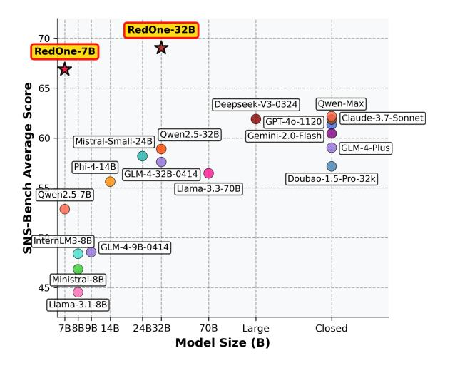
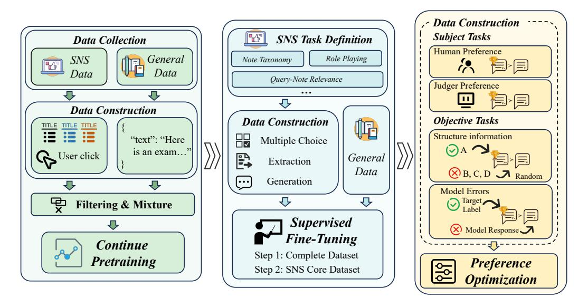
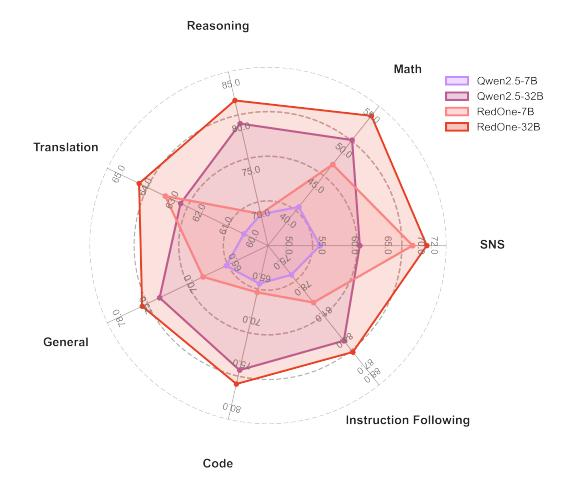
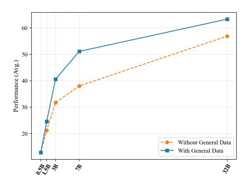
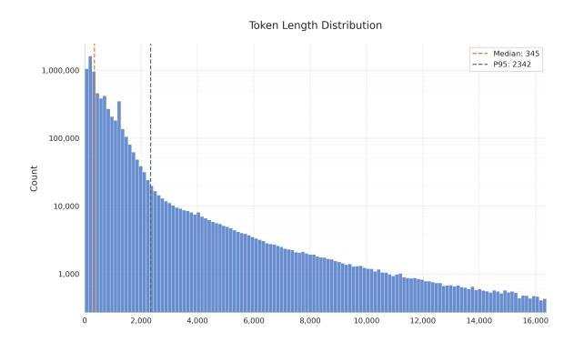
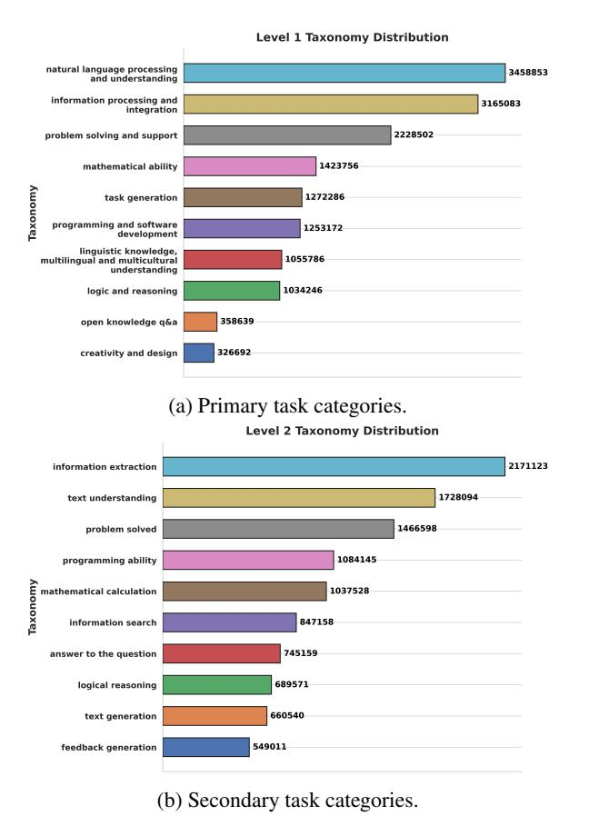

# <span id="page-0-0"></span>RedOne: Revealing Domain-specific LLM Post-Training in Social Networking Services

Fei Zhao, Chonggang Lu, Yue Wang, Zheyong Xie, Ziyan Liu, Haofu Qian, JianZhao Huang, Fangcheng Shi, Zijie Meng, Hongcheng Guo, Mingqian He, Xinze Lyu, Zheyu Ye, Weiting Liu, Boyang Wang, Sha[os](#page-0-0)heng Cao\*

NLP Team, Xiaohongshu Inc., China caoshaosheng@xiaohongshu.com

# Abstract

As a primary medium for modern information dissemination, social networking services (SNS) have experienced rapid growth, which has proposed significant challenges for platform content management and interaction quality improvement. Recently, the development of large language models (LLMs) has offered potential solutions but existing studies focus on isolated tasks, which not only encounter diminishing benefit from the data scaling within individual scenarios but also fail to flexibly adapt to diverse real-world context. To address these challenges, we introduce RedOne, a domainspecific LLM designed to break the performance bottleneck of single-task baselines and establish a comprehensive foundation for the SNS. RedOne was developed through a threestage training strategy consisting of continue pretraining, supervised fine-tuning, and preference optimization, using a large-scale realworld dataset. Through extensive experiments, RedOne maintains strong general capabilities, and achieves an average improvement up to 14.02% across 8 major SNS tasks and 7.56% in SNS bilingual evaluation benchmark, compared with base models. Furthermore, through online testing, RedOne reduced the exposure rate in harmful content detection by 11.23% and improved the click page rate in post-view search by 14.95% compared with single-tasks finetuned baseline models. These results establish RedOne as a robust domain-specific LLM for SNS, demonstrating excellent generalization across various tasks and promising applicability in real-world scenarios.

# 1 Introduction

With the widespread adoption of online platforms and mobile applications, social networking services (SNS) have emerged as a central medium for modern information dissemination, such as communication, knowledge sharing, and emotional expression [\(Elahimanesh et al.,](#page-7-0) [2025\)](#page-7-0). Unlike the general textual corpora, SNS data is highly informal, context-sensitive, and often emotionally charged. These characteristics present unique

<span id="page-0-1"></span>

Figure 1: Performance comparison of different models in the SNS domain, where all models are instructiontuned and the evaluation score is the average of all tasks on SNS-Bench.

challenges including linguistic variability, frequent roleswitching, and subtle conversational norms, which complicate applications (e.g. platform content management and interaction quality improvement) for traditional natural language processing (NLP) systems [\(Jin et al.,](#page-8-0) [2024\)](#page-8-0).

Given these complexities, numerous studies have explored recent advanced large language models (LLMs) based adaptation for SNS-related tasks [\(Zeng et al.,](#page-10-0) [2024;](#page-10-0) [Jiang and Ferrara,](#page-8-1) [2023\)](#page-8-1). However, these solutions primarily focus on isolated tasks, which not only experience diminishing benefits as data scales within individual scenarios but also struggle to adapt flexibly to diverse real-world contexts. This highlights a fundamental limitation in current SNS domain-specific models, where performance plateaus due to the inability to incorporate a more diverse domain knowledge corpus during training [\(Yue et al.,](#page-10-1) [2025\)](#page-10-1).

To address these deficiencies, we introduce RedOne, a demain-specific LLM with a meticulous three-stage post-training strategy using a large-scale dataset from real-world, which consists of continued pretraining (CPT), supervised fine-tuning (SFT), and preference optimization (PO). In the CPT stage, the model acquire extensive foundational knowledge in the SNS domain by processing large-scale corpora. Building on this foun-

<sup>\*</sup>Corresponding author.

dation, the SFT stage refines the model's capability to tackle specific SNS tasks by leveraging carefully defined domain-specific problem formulations. Finally, in the PO stage, we further optimize the model's behavior to ensure seamless alignment with human preferences and maximize its practical utility in real-world deployments.

Through extensive experiments, RedOne not only maintains strong general capabilities, but also excels across multiple SNS-specific evaluation benchmarks, significantly outperforming leading proprietary or opensource models as shown in Figure [1.](#page-0-1) Further online testing in harmful content detection and post-view search, indicates its broad and promising potential application in real-world scenarios.

Our contributions can be summarized as follows:

- We introduce RedOne, a domain-specific LLM, engineered to break the performance bottleneck of single-task models, providing comprehensive improvements for SNS.
- A three-stage training strategy is designed, using a large-scale real-world dataset, which maintains strong general capabilities while delivering exceptional generalization across diverse SNS tasks.
- Through extensive experiments and online testing to demonstrate RedOne's effectiveness across a wide range of tasks, and establish a comprehensive and robust baseline for SNS application.

# 2 Related Work

# 2.1 NLP tasks in Social Networking Services

Due to the inherent characteristics of SNS platforms, namely their informality and rapid linguistic evolution [\(Carr and Hayes,](#page-6-0) [2015\)](#page-6-0), these platforms present numerous complex NLP challenges that have garnered sustained academic attention. In the early stages of development, researchers primarily focused on fundamental capability assessments, particularly prevalent tasks such as sentiment analysis [\(Mohammad et al.,](#page-8-2) [2018;](#page-8-2) [Rosenthal et al.,](#page-9-0) [2019\)](#page-9-0), harmful content detection [\(i Orts,](#page-7-1) [2019;](#page-7-1) [Lu et al.,](#page-8-3) [2024\)](#page-8-3), and meme detection [\(Xie et al.,](#page-9-1) [2023;](#page-9-1) [Lin et al.,](#page-8-4) [2024\)](#page-8-4). Following the emergence of LLMs and building upon previous research foundations, various techniques have evolved in multiple domains, including content understanding [\(Kumar et al.,](#page-8-5) [2024;](#page-8-5) [Kmainasi et al.,](#page-8-6) [2024\)](#page-8-6), information extraction [\(Islam](#page-7-2) [and Goldwasser,](#page-7-2) [2025;](#page-7-2) [Li et al.,](#page-8-7) [2024b;](#page-8-7) [Peng et al.,](#page-9-2) [2024\)](#page-9-2), and dialogue systems [\(Yi et al.,](#page-9-3) [2024;](#page-9-3) [Zhang](#page-10-2) [et al.,](#page-10-2) [2024\)](#page-10-2). These technological advances have significantly enhanced problem-solving capabilities within the SNS domain, but have primarily focused on single tasks. In contrast to these works, RedOne demonstrates superior performance across diverse SNS tasks, providing a foundational model for improved services.

### 2.2 Domain-specific Post-training

To better serve specialized domains, recent efforts have focused on developing vertical domain LLMs across various fields, including finance [\(Wu et al.,](#page-9-4) [2023;](#page-9-4) [Konstan](#page-8-8)[tinidis et al.,](#page-8-8) [2024\)](#page-8-8), law [\(Colombo et al.,](#page-7-3) [2024\)](#page-7-3), home renovation [\(Wen et al.,](#page-9-5) [2023\)](#page-9-5), medicine [\(Xiong et al.,](#page-9-6) [2023;](#page-9-6) [Chen et al.,](#page-6-1) [2023;](#page-6-1) [Yang et al.,](#page-9-7) [2024c;](#page-9-7) [Wu et al.,](#page-9-8) [2024;](#page-9-8) [Zakka et al.,](#page-10-3) [2024\)](#page-10-3), and scientific research [\(Azer](#page-6-2)[bayev et al.,](#page-6-2) [2023;](#page-6-2) [Bi et al.,](#page-6-3) [2023;](#page-6-3) [Yang et al.,](#page-9-9) [2024d\)](#page-9-9). Despite these advancements, these vertical domain LLMs have not addressed the unique challenges posed by SNS. While [\(Liu et al.,](#page-8-9) [2024b\)](#page-8-9) and [\(Yang et al.,](#page-9-10) [2024b\)](#page-9-10) explore the application of LLMs to a limited set of NLP tasks within SNS, their coverage remains constrained. Therefore, a significant gap exists in this area, which RedOne aims to address.

# 3 RedOne Model

As illustrated in Figure [2,](#page-2-0) the training strategy of RedOne contains three stages. First, in Section 3.1, we conduct continue pretraining to enrich the model's grasp of nuanced SNS field knowledge. Subsequently, in Section 3.2, we sharpen the model's instruction-following capabilities through supervised fine-tuning across various tasks. Finally, we leverage preference information from the training data to perform preference optimization, ultimately yielding the RedOne with superior performance in the SNS domain.

#### 3.1 Continue Pretraining

To enhance the large model's fundamental domain knowledge we conducted continue pretraining at this stage, which can be divided into three sub-stages: data collection and data construction, filtering and mixture, along with domain-aware continue pretraining.

## 3.1.1 Data Collection and Data Construction

We specifically collected continue pretraining data from the following two data sources: (1) General Highquality Data. We selected several high-quality opensource pretraining corpora [\(Qiu et al.,](#page-9-11) [2024;](#page-9-11) [Weber et al.,](#page-9-12) [2024;](#page-9-12) [Penedo et al.,](#page-8-10) [2024\)](#page-8-10) to preserve the model's fundamental generalization capabilities. To improve training efficiency, we uniformly construct all general data into single-sentence text format and perform segmentation and concatenation processing based on predefined text length thresholds. (2) SNS-specific Domain Data. We collect the large-scale training data from SNS platforms and the open web, capturing diverse social communication patterns including informal discussions, short-form comments, sarcasm, emotionally charged content, and so on. For better reveal the underlying information in the pretraining data, we incorporate user interaction data to guide the training process. Specifically, we group contexts and comments with their corresponding user interaction data, which naturally clusters semantically related SNS content without additional processing. The prompt templates can be found in Appendix [A.3.](#page-12-0) Through these steps, we collected and constructed a large-scale dataset comprising various tasks with over 100B tokens for downstream processing.

<span id="page-2-0"></span>

Figure 2: Overview of our training pipeline.

# 3.1.2 Filtering and Mixture

Considering data quality is crucial for model training [\(Zhou et al.,](#page-10-4) [2023a\)](#page-10-4), we constructed a data-filtering pipeline inspired by [\(Yuan et al.,](#page-10-5) [2024\)](#page-10-5), which comprises task-oriented rule filtering and small language model filtering [\(Wang et al.,](#page-9-13) [2025\)](#page-9-13). The former identifies specific error content such as HTML tags and repetitive sentences, while the latter focuses on global assessment aspects including coherence and tone appropriateness. Based on this data-filtering pipeline, we further applied the RegMix method [\(Liu et al.,](#page-8-11) [2024a\)](#page-8-11) to identify an optimal data mixture distribution and filter out unnecessary data. Through this comprehensive filtering and mixture process, we ultimately constructed a high-quality dataset of 20B tokens for training.

#### 3.1.3 Domain-aware Continue Pretraining

After data construction, we conduct continue pretraining on the complete dataset. Specifically, RedOne is trained from the Qwen2.5 [\(Qwen et al.,](#page-9-14) [2025a\)](#page-9-14) checkpoint following its development process, leveraging its strong linguistic capabilities across multiple domains. Through this domain-aware continue pretraining process, we ultimately obtain a model that effectively captures SNSspecific linguistic patterns while maintaining minimal degradation in general language modeling capabilities.

### 3.2 Supervised Fine-Tuning

To bridge the gap between pretraining objectives and the specific requirements of real-world SNS applications, we further conduct supervised fine-tuning on our model through carefully designed data construction and multistage training strategies.

# 3.2.1 Task Definition and Data Construction

As SFT training data is significat affect the final instruction following ability in domain tasks [\(Dong](#page-7-4) [et al.,](#page-7-4) [2023\)](#page-7-4), we extensively collected large-scale user-

<span id="page-2-1"></span>

| Task Name                     | Capability             |
|-------------------------------|------------------------|
| Note Taxonomy                 | Content Understanding  |
| Query Classification          | Content Understanding  |
| Query Intent Recognition      | Content Understanding  |
| Hashtag Prediction            | Information Extraction |
| Machine Reading Comprehension | Information Extraction |
| Highlight Word Detection      | Information Extraction |
| Query-Note Relevance          | Semantic Matching      |
| Query-Note Retrieval          | Semantic Matching      |
| Post-View Search              | User Behavior Modeling |
| Emotional Companion Dialogue  | Dialogue               |
| Role-playing Dialogue         | Dialogue               |
| SNS Domain Translation        | Translation            |

Table 1: Overview of SNS Tasks and Their Capabilities

generated content from public platforms, including notes, comments, queries, and interaction logs, which provide real enviorment signal for us to improve model actions. Notably, we focused on preserving the linguistic style which exhibit typical SNS characteristics such as informal language, sarcasm, sentiment, and topical shifts while collecting data [\(Eisenstein,](#page-7-5) [2013\)](#page-7-5), aim for representative and practical coverage for SNS scenarios.

After data collection, we ultimatly consolidate six kinds of core capabilities essential for SNS applications: content understanding, information extraction, semantic matching, user behavior modeling, dialogue and persona simulation, and translation, as show in Table [1.](#page-2-1) Each is supported by well-defined tasks reflecting real-world challenges and the overview is shown in Appendix [A.2.](#page-11-0)

Additionally, during SFT, we also incorporated open source instruction data covering general tasks such as instruction following [\(Li et al.,](#page-8-12) [2025;](#page-8-12) [Zhou et al.,](#page-10-4) [2023a\)](#page-10-4), multiturn dialogue [\(Zhao et al.,](#page-10-6) [2024\)](#page-10-6), and long chainof-thought (CoT) reasoning [\(Guha et al.,](#page-7-6) [2025;](#page-7-6) [Ye et al.,](#page-9-15) [2025\)](#page-9-15), to mitigate catastrophic forgetting [\(McCloskey](#page-8-13) [and Cohen,](#page-8-13) [1989\)](#page-8-13) and retain generalization ability of RedOne model. Training Prompt templates of all tasks can be found in Appendix [A.4.](#page-13-0)

### 3.2.2 Two-Step Training

In domain SFT, a two-step mixed fine-tuning has been demonstrated to effectively enhance domain-specific capabilities (Dong et al., 2024). For RedOne's SFT, we implement this strategy by mixing SNS-specific data with general data across two steps. In the first step, we train the model on the complete SNS dataset combined with a large volume of general data. This approach enables the model to learn diverse task formats within the SNS domain while preserving its generalization capabilities. In the second step, we fine-tune the model using a higher proportion of SNS domain data, thereby further enhancing performance on domain-critical tasks.

#### 3.3 Preference Optimization

SNS tasks like query-note relevance modeling often produce multiple plausible but quality-diverse outputs. While SFT improves instruction-following, it fails to exploit implicit preference signals among these candidates, causing overfitting and poor generalization (Chu et al., 2025). To address these limitations, in this section, we carefully craft preference data and perform PO to obtain a better domain-specific model.

#### 3.3.1 Preference Data Construction

To enhance alignment with human preferences and utilize the information embedded in data labels, we integrate different preference pair construction strategies according to the nature of different task types. Specifically, we categorize our data into two types and adopt corresponding strategies:

For subjective tasks, such as emotional dialogue and role-playing, our primary objective is to achieve better alignment with human preferences. Therefore, the first step begins with domain experts creating preference annotations on model-generated responses (Ouyang et al., 2022). Furthermore, to scale up the preference dataset, we evaluate the consistency between trained judge models (Cao et al., 2024a) and human preference, then leverage these models with high performance to expand specific data.

In contrast, for objective tasks with definitive correct answers, our strategy shifts toward extracting and utilizing the implicit structural information within the data labels. Here, we employ two approaches: First, we leverage the inherent structure of questions that contain both correct answers and incorrect options, constructing preference pairs that exploit the ordinal relationships within data. Complementarily, to actively address model limitations, we construct preference pairs from model errors, using ground truth as positive examples and incorrect predictions as negative to target specific weaknesses.

By integrating these tailored approaches, we systematically process all SNS-domain data according to their inherent characteristics, ultimately constructing preference optimization datasets that effectively capture both human preferences and implicit data information for comprehensive model enhancement.

#### 3.3.2 Direct Preference Optimization

To effectively leverage the rich preference signals in our SNS dataset, we adopt DPO (Rafailov et al., 2023) as our preference-based fine-tuning algorithm. This approach enables the model to better align with human preferences while simultaneously exploiting the latent information embedded in ground-truth labels.

Finally, through this comprehensive three-stage training pipeline encompassing CPT, SFT and PO, we ultimately obtain a domain-specific large language model RedOne that demonstrates superior performance in the target domain while maintaining reasonable general capabilities.

## 4 Experiments

#### <span id="page-3-0"></span>4.1 Implementation details

During the CPT stage, we follow the training process from Qwen2.5 (Yang et al., 2024a) over a mixed corpus of general and SNS-specific data. SFT is conducted for three epochs in step one and two epochs in step two, with a maximum sequence length of 16 384 using sequence packing, batch size of 128, a linear warm-up ratio of 0.1. The learning rates are set according to model size: for the 7B model, we use  $5 \times 10^{-6}$  in step one and  $3 \times 10^{-6}$  in step two; for the 32B model, we use  $3 \times 10^{-6}$  for both steps. Optimization is performed using AdamW (Loshchilov and Hutter, 2017) ( $\beta_1$ =0.9,  $\beta_2$ =0.95,  $\epsilon$ =10<sup>-8</sup>). In the final PO stage, we employ a learning rate of  $1 \times 10^{-7}$ , batch size of 64, sequence length of 4096, training for two epochs, with SFT loss coefficient set to 0.3.

#### 4.2 Benchmarks

For general capabilities evaluation, we use datasets similar to those employed in community, including general natural language comprehension (i.e. MMLU (Hendrycks et al., 2021a), CMMLU (Li et al., 2023a), CEVAL (Huang et al., 2023), GPQA-Diamond (Rein et al., 2023), News-Bench (Li et al., 2024a)), reasoning (i.e. MMLU-Pro (Wang et al., 2024), BBH (Suzgun et al., 2023), GaokaoBench (Zhang et al., 2023)), mathematics (i.e. AIME2025 (MAA, 2025), GSM8K (Cobbe et al., 2021) and MATH500 (Hendrycks et al., 2021b)), coding (i.e. HumanEval (Chen et al., 2021), MBPP (Austin et al., 2021), and LiveCodeBench(24072502)(Jain et al., 2024)), translation (i.e. WMT-22/23/24 and Flores(Goyal et al., 2022)), instruction following (i.e. IFEval (Zhou et al., 2023b)), hallucination and human preference alignment (i.e. HaluEval (Li et al., 2023b) and CompassBench (Cao et al., 2024b)). To further evaluate RedOne's performance in SNS domain, we selected specialized SNS benchmarks including SNS-Bench (Guo et al.) and SNS-TransBench (Guo et al., 2025).

<span id="page-4-0"></span>

|                                         | SNS-Bench      |          |           |             |        |       |            |          | SNS-TransBench |                 |       |        |                     |        |                |
|-----------------------------------------|----------------|----------|-----------|-------------|--------|-------|------------|----------|----------------|-----------------|-------|--------|---------------------|--------|----------------|
| Models Avg.                             | I              | Taxonomy | Hashtag Q | QueryCorr M | MRC NE | NED   | C 1        | CHLW     | QueryGen       | Avg.            | ZH→EN |        | $EN \rightarrow ZH$ |        |                |
|                                         | Avg.           |          |           |             |        | NEK   | NER Gender | ler CHLW |                |                 | BLEU  | chrF++ | BLEU                | chrF++ | Avg.           |
| Llama-3.1-8B (Grattafiori et al., 2024) | 51.24          | 37.74    | 66.62     | 33.32       | 31.27  | 47.10 | 74.61      | 26.88    | 38.60          | 44.52           | 23.07 | 48.15  | 29.32               | 29.13  | 32.42          |
| Ministral-8B (Mistral-AI, 2024)         | 49.93          | 42.62    | 70.58     | 36.24       | 30.71  | 37.79 | 82.38      | 28.04    | 46.27          | 46.83           | 25.67 | 50.91  | 32.02               | 31.18  | 34.95          |
| InternLM3-8B (Cai et al., 2024)         | 58.55          | 51.83    | 76.98     | 38.65       | 25.25  | 39.41 | 66.84      | 44.71    | 43.46          | 48.39           | 24.85 | 50.44  | 35.58               | 34.04  | 36.23          |
| GLM-4-9B-0414 (GLM et al., 2024)        | 63.27          | 56.03    | 77.67     | 38.03       | 45.29  | 47.01 | 51.30      | 27.51    | 45.52          | 48.55           | 32.20 | 56.90  | 39.73               | 37.40  | 41.57          |
| Qwen2.5-7B (Qwen et al., 2025b)         | 63.01          | 49.50    | 73.80     | 42.37       | 45.32  | 45.41 | 88.08      | 33.76    | 44.65          | 52.86           | 31.43 | 55.91  | 38.36               | 36.48  | 40.55          |
| RedOne-7B (Ours)                        | 63.83 (+0.82%) | 72.18    | 88.02     | 65.09       | 63.98  | 51.86 | 70.47      | 74.73    | 48.69          | 66.88 (+14.02%) | 38.06 | 62.66  | 46.88               | 44.82  | 48.11 (+7.56%) |

Table 2: Results of 7B-scale models. **Bold** entries indicate the best model, while <u>underlined</u> entries denote the second one. Percentage improvements relative to the baseline Qwen2.5 foundation model are also shown.

<span id="page-4-1"></span>

|                                             | General-Bench                       |          |                |           |           | SNS-Bei | nch        |       |          |                        |       | 5      | SNS-Tran            | sBench |                |
|---------------------------------------------|-------------------------------------|----------|----------------|-----------|-----------|---------|------------|-------|----------|------------------------|-------|--------|---------------------|--------|----------------|
| Models                                      |                                     |          | xonomy Hashtag | 0 0       | MRC       | NED     | NER Gender | CHLW  | 0 0      | T .                    | ZH→EN |        | $EN \rightarrow ZH$ |        |                |
|                                             | Avg.                                | laxonomy |                | QueryCorr | MKC       | NER (   |            |       | QueryGen | Avg.                   | BLEU  | chrF++ | BLEU                | chrF++ | Avg.           |
|                                             |                                     |          |                | Open-Sou  | rce Large | Langua  | ge Models  |       |          |                        |       |        |                     |        |                |
| Phi-4-14B (Abdin et al., 2024)              | 63.00                               | 57.62    | 79.56          | 46.32     | 53.39     | 44.99   | 89.12      | 29.23 | 44.76    | 55.62                  | 31.28 | 57.23  | 37.58               | 36.68  | 40.69          |
| Mistral-Small-24B (Mistral-AI, 2025)        | 65.63                               | 64.88    | 83.89          | 48.77     | 46.51     | 52.09   | 91.19      | 32.10 | 46.01    | 58.18                  | 31.29 | 56.72  | 39.28               | 37.32  | 41.15          |
| Llama-3.3-70B (Grattafiori et al., 2024)    | 67.64                               | 62.94    | 83.28          | 50.76     | 27.38     | 56.09   | 91.19      | 33.58 | 46.41    | 56.45                  | 34.00 | 59.18  | 41.25               | 39.56  | 43.50          |
| GLM-4-32B-0414 (GLM et al., 2024)           | 74.39                               | 63.36    | 85.50          | 47.33     | 53.72     | 50.41   | 80.31      | 33.19 | 46.90    | 57.59                  | 36.32 | 61.31  | 42.53               | 40.77  | 45.23          |
| Deepseek-V3-0324 (DeepSeek-AI et al., 2025) | <u>75.22</u>                        | 67.27    | 86.59          | 47.71     | 60.97     | 56.00   | 90.16      | 40.45 | 46.03    | 61.90                  | 35.65 | 61.58  | 46.86               | 44.58  | 47.17          |
|                                             | Closed-Source Large Language Models |          |                |           |           |         |            |       |          |                        |       |        |                     |        |                |
| Doubao-1.5-Pro-32k (Doubao-Team, 2025)      | 76.13                               | 30.00    | 83.21          | 58.25     | 61.32     | 56.60   | 90.67      | 30.61 | 46.55    | 57.15                  | 33.71 | 61.85  | 45.54               | 44.35  | 46.36          |
| GLM-4-Plus (GLM et al., 2024)               | 70.25                               | 65.46    | 84.31          | 52.13     | 55.81     | 53.16   | 86.53      | 30.09 | 44.68    | 59.02                  | 41.57 | 65.95  | 48.79               | 47.06  | 50.84          |
| GPT-4o-1120 (OpenAI)                        | 70.72                               | 65.79    | 84.98          | 51.79     | 58.89     | 54.99   | 88.08      | 38.96 | 47.33    | 61.35                  | 40.32 | 63.91  | 49.15               | 47.28  | 50.17          |
| Claude-3.7-Sonnet (Anthropic)               | 75.10                               | 72.03    | 88.83          | 54.10     | 54.86     | 56.13   | 92.23      | 31.11 | 45.49    | 61.85                  | 35.63 | 61.66  | 45.79               | 44.23  | 46.83          |
| Gemini-2.0-Flash (DeepMind, 2024)           | 74.42                               | 68.76    | 87.36          | 48.41     | 52.21     | 53.58   | 89.64      | 37.39 | 46.27    | 60.45                  | 32.72 | 58.84  | 41.80               | 40.16  | 43.38          |
| Qwen-Max (Qwen et al., 2025b)               | 71.86                               | 65.68    | 84.47          | 54.36     | 61.34     | 55.78   | 91.19      | 37.97 | 46.64    | 62.18                  | 35.55 | 60.92  | 46.08               | 44.14  | 46.67          |
| Qwen2.5-32B (Qwen et al., 2025b)            | 71.68                               | 59.90    | 80.51          | 46.00     | 55.04     | 54.51   | 90.67      | 38.84 | 45.66    | 58.89                  | 32.56 | 58.14  | 42.34               | 40.71  | 43.44          |
| RedOne-32B (Ours)                           | 73.72 (+2.04%)                      | 81.45    | 90.19          | 67.07     | 59.24     | 51.66   | 81.87      | 70.40 | 50.37    | <b>69.03</b> (+10.14%) | 40.55 | 64.54  | 48.20               | 46.05  | 49.84 (+6.40%) |

Table 3: Results of 32B-scale models. **Bold** entries indicate the best model, while <u>underlined</u> entries denote the second one. Percentage improvements relative to the baseline Qwen2.5 foundation model are also shown.

<span id="page-4-2"></span>

Figure 3: Capability of RedOne-7B, RedOne-32B and their base models across seven dimensions.

### 4.3 Main Results

As shown in Tables 2 and 3, we conducted a comparison between RedOne with baseline models across various tasks in three categories. Meanwhile, as illustrated in Figure 3, we compared RedOne-7B and RedOne-32B with their base model across seven dimensions (six for general and one for SNS). Both results indicate that RedOne in all scales not only maintain robust general capabilities, even surpassing their base model on general tasks, but also exhibit exceptional effectiveness in the SNS domain. Additionally, RedOne achieves performance comparable to significantly larger models across most tasks, with limited improvement opportunities observed only in few areas. The results also demonstrate that scaling up RedOne consistently en-

<span id="page-4-3"></span>

| Models            | HashTag               | QueryCorr              | MRC                   |
|-------------------|-----------------------|------------------------|-----------------------|
| Qwen2.5-Finetuned | 88.93                 | 57.76                  | 62.26                 |
| RedOne            | 88.02 (-0.91%)        | 65.09 (+12.63%)        | 63.98 (+2.76%)        |
| RedOne-Finetuned  | <b>90.51</b> (+1.78%) | <b>65.77</b> (+13.87%) | <b>64.47</b> (+3.55%) |
| Models            | CHLW                  | QueryGen               | SNS-Trans             |
| Qwen2.5-Finetuned | 78.41                 | 48.25                  | 48.01                 |
| RedOne            | 74.73 (-4.72%)        | 48.69 (+0.91%)         | 48.11 (+0.21%)        |
| RedOne-Finetuned  | <b>79.11</b> (+0.89%) | 49.21(+1.99%)          | 48.32(+0.65%)         |

Table 4: Performance comparison of task-specific Finetuned on Qwen-2.5-Instruct and RedOne (all models are 7B scale).

hances performance over smaller variants, aligning with established model scaling laws. These findings underscore RedOne's strong potential for further advances through continued increases in model size, as well as its promise for real world application.

#### 4.4 Task-specific SFT Comparison

To further explore the impact of base model selection on task-specific fine-tuning and validate our domain LLM's effectiveness, we conducted experiments on two 7B-scale models: the original Qwen-2.5-Instruct ("Qwen") and our SNS-adapted model ("RedOne"). We evaluated three variants: (1) Qwen-Finetuned, involving task-specific fine-tuning on Qwen; (2) RedOne-Finetuned, involving task-specific fine-tuning on RedOne; and (3) RedOne, representing zero-shot inference without further fine-tuning.

As shown in Table 4, RedOne-Finetuned consistently outperforms Qwen2.5-Finetuned across most datasets, demonstrating that domain-aligned post-training (i.e., RedOne) provides a stronger foundation for downstream SFT. Meanwhile, even RedOne in the zero-shot set-

<span id="page-5-0"></span>

| CPT          | SFT          | PO           | General | SNS   | SNS-Trans |
|--------------|--------------|--------------|---------|-------|-----------|
|              |              |              | 63.01   | 52.86 | 40.55     |
|              | $\checkmark$ |              | 62.65   | 64.57 | 47.47     |
|              | $\checkmark$ | $\checkmark$ | 64.36   | 64.98 | 47.64     |
| $\checkmark$ |              |              | 62.28   | 53.28 | 41.39     |
| $\checkmark$ | $\checkmark$ |              | 61.95   | 65.12 | 47.70     |
| $\checkmark$ | $\checkmark$ | ✓            | 63.83   | 66.88 | 48.11     |

Table 5: Ablation study results of RedOne-7B.

<span id="page-5-1"></span>

| Task                      | Metric              | Improvement (%) |
|---------------------------|---------------------|-----------------|
| Harmful Content Detection | Exposure Rate (↓)   | -11.23          |
| Post-View Search          | Click Page Rate (↑) | +14.95          |

Table 6: Effectiveness in online scenarios.

ting exhibits strong performance, further corroborating the benefits of domain adaptation. Overall, these results indicate that initializing SFT from a domain-adapted base model is more effective than starting from a general-purpose large model. This finding suggests that domain-specific post-training can serve as a powerful approach for improving both zero-shot capabilities and task-specific performance after fine-tuning.

#### 4.5 Ablation Study

We also investigate the contributions of each stage in our training pipeline, with results summarized in Table 5. While CPT alone shows limited immediate gains, it establishes a crucial foundation for subsequent specialization. Based on the CPT model, adding SFT and PO brings average improvements of 0.55 and 1.90 on SNS-Bench compared to variants without CPT, indicating that CPT provides a stronger knowledge foundation for SFT to improve instruction-following and also offers a broader exploration space for PO. Additionally, both CPT and SFT lead to a performance drop on general benchmarks, whereas PO could effectively mitigate this decline and further enhance the overall results. Finally, the complete three-stage pipeline yields the strongest results on specialized benchmarks, with 66.88 on SNS and 48.11 on SNS-Trans, while maintaining competitive general-domain performance at 63.83, demonstrating the effectiveness of our training strategy.

## 4.6 Online Results

To further validate RedOne's practical effectiveness, we deployed the model across multiple internal SNS scenarios and witnessed remarkable performance gains in real-world applications compared with previous singletask models as shown in Table 6. In harmful content detection, RedOne exhibited exceptional safety capabilities by slashing the exposure rate of harmful notes by 11.23%, effectively filtering out non-compliant content and strengthening platform security. Moreover, for post-view search recommendation, the model delivered a 14.95% increase in click page rate, indicating improved content discovery and enhanced user engagement following note interactions. These online results

<span id="page-5-2"></span>

Figure 4: Performance on OOD tasks for models of varying parameter size.

<span id="page-5-3"></span>

| Input  | Title: Found it! A Soft-Sole Commuter Loafer You Can Walk In All Day  Tags: Height Increasing Thick Sole Shoes, Loafers, Beautiful Loafers  Popular Comments: How to buy; link |
|--------|--------------------------------------------------------------------------------------------------------------------------------------------------------------------------------|
| Qwen   | How to choose height-increasing platform shoes                                                                                                                                 |
| RedOne | height-increasing thick-soled loafers                                                                                                                                          |

Table 7: Post-view search case: Input SNS context and model-generated queries.

demonstrate the strong practical utility of RedOne in real-world scenarios.

#### 4.7 Out-of-Domain Ability Analysis

In this subsection, we examine the impact of preserving general-domain capabilities during domain adaptation by evaluating out-of-domain (OOD) robustness. Specifically, we select one task without corresponding supervised training data (Note Taxonomy) and two tasks with available data (Note Hashtag, Note MRC) from the SNS bench. For the latter two, we remove their related training data during supervised fine-tuning (SFT), effectively making all three tasks OOD.

We then compare models trained with both general and SNS data against those trained with SNS data only, across various model sizes. Our results (Figure 4) suggest that including general-domain data helps models generalize better to OOD tasks, and this trend is more visible for larger models. This highlights that maintaining general capabilities can be beneficial for domain adaptation, though further study is needed to fully understand this effect.

## 4.8 Case Study

To further demonstrate RedOne's effectiveness in capturing user search intent within SNS scenarios, we present a case study on the post-view search task. As shown in Table 7, we analyze a sample post featuring height-increasing loafers that generated significant purchase intent among users. Qwen produces a general shopping query, whereas RedOne directly identifies the core product keywords, better reflecting users' intent to search for and purchase the featured item. This demonstrates

RedOne's superior capability for generating actionable queries aligned with real user needs.

# 5 Conclusion

In this paper, we introduce RedOne, a domain-specific LLM trained through a three-stage strategy that enhances SNS-specific capabilities while preserving general performance. We believe our approach can inspire future research in developing specialized LLMs and advancing practical applications in social media.

# Limitations

Although our proposed method demonstrates strong effectiveness, it requires extensive data processing, resulting in considerable resource costs. Additionally, current models are still in a large scale, which increases online inference latency and serving expenses, limiting deployment in resource-constrained settings. Future work will explore lighter architectures, including model compression through quantization and distillation, as well as routing-efficient designs such as mixture-of-experts (MoE), to reduce latency and cost without sacrificing accuracy.

# Ethical Considerations

When integrating large language models as essential components within application services, it is crucial to rigorously consider potential model hallucinations and security risks. To ensure reliable service delivery, leveraging RedOne for model services requires careful implementation to mitigate adverse user impacts. Furthermore, we emphasize the critical importance of adhering to stringent user privacy protection standards throughout data collection and processing workflows, ensuring comprehensive personal information security.

# Reproducibility

Due to data privacy and code security concerns, we are currently unable to fully release our datasets and code. However, our entire development pipeline is built upon widely adopted open-source projects and works [\(Zheng](#page-10-9) [et al.,](#page-10-9) [2024;](#page-10-9) [Rafailov et al.,](#page-9-16) [2023;](#page-9-16) [Dong et al.,](#page-7-4) [2023\)](#page-7-4), which ensures that users only need to organize their data according to the specified format in order to run it smoothly. In addition, we have reported detailed parameter settings used during training in Section [4.1,](#page-3-0) which further provides valuable references for the community to reproduce our pipeline.

# References

<span id="page-6-10"></span>Marah Abdin, Jyoti Aneja, Harkirat Behl, Sébastien Bubeck, Ronen Eldan, Suriya Gunasekar, Michael Harrison, Russell J. Hewett, Mojan Javaheripi, Piero Kauffmann, James R. Lee, Yin Tat Lee, Yuanzhi Li, Weishung Liu, Caio C. T. Mendes, Anh Nguyen, Eric Price, Gustavo de Rosa, Olli Saarikivi, and

- 8 others. 2024. [Phi-4 technical report.](https://arxiv.org/abs/2412.08905) *Preprint*, arXiv:2412.08905.
- <span id="page-6-11"></span>Anthropic. Claude 3.7 sonnet and claude code. [https:](https://www.anthropic.com/news/claude-3-7-sonnet) [//www.anthropic.com/news/claude-3-7-sonne](https://www.anthropic.com/news/claude-3-7-sonnet) [t](https://www.anthropic.com/news/claude-3-7-sonnet).
- <span id="page-6-7"></span>Jacob Austin, Augustus Odena, Maxwell I. Nye, Maarten Bosma, Henryk Michalewski, David Dohan, Ellen Jiang, Carrie J. Cai, Michael Terry, Quoc V. Le, and Charles Sutton. 2021. Program synthesis with large language models. *CoRR*, abs/2108.07732.
- <span id="page-6-2"></span>Zhangir Azerbayev, Hailey Schoelkopf, Keiran Paster, Marco Dos Santos, Stephen McAleer, Albert Q Jiang, Jia Deng, Stella Biderman, and Sean Welleck. 2023. Llemma: An open language model for mathematics. *arXiv preprint arXiv:2310.10631*.
- <span id="page-6-3"></span>Zhen Bi, Ningyu Zhang, Yida Xue, Yixin Ou, Daxiong Ji, Guozhou Zheng, and Huajun Chen. 2023. Oceangpt: A large language model for ocean science tasks. *arXiv preprint arXiv:2310.02031*.
- <span id="page-6-9"></span>Zheng Cai, Maosong Cao, Haojiong Chen, Kai Chen, Keyu Chen, Xin Chen, Xun Chen, Zehui Chen, Zhi Chen, Pei Chu, Xiaoyi Dong, Haodong Duan, Qi Fan, Zhaoye Fei, Yang Gao, Jiaye Ge, Chenya Gu, Yuzhe Gu, Tao Gui, and 81 others. 2024. [Internlm2 techni](https://arxiv.org/abs/2403.17297)[cal report.](https://arxiv.org/abs/2403.17297) *Preprint*, arXiv:2403.17297.
- <span id="page-6-5"></span>Maosong Cao, Alexander Lam, Haodong Duan, Hongwei Liu, Songyang Zhang, and Kai Chen. 2024a. Compassjudger-1: All-in-one judge model helps model evaluation and evolution. *arXiv preprint arXiv:2410.16256*.
- <span id="page-6-8"></span>Maosong Cao, Alexander Lam, Haodong Duan, Hongwei Liu, Songyang Zhang, and Kai Chen. 2024b. [Compassjudger-1: All-in-one judge model helps](https://arxiv.org/abs/2410.16256) [model evaluation and evolution.](https://arxiv.org/abs/2410.16256) abs/2410.16256.
- <span id="page-6-0"></span>Caleb T Carr and Rebecca A Hayes. 2015. Social media: Defining, developing, and divining. *Atlantic journal of communication*, 23(1):46–65.
- <span id="page-6-6"></span>Mark Chen, Jerry Tworek, Heewoo Jun, Qiming Yuan, Henrique Pondé de Oliveira Pinto, Jared Kaplan, Harrison Edwards, Yuri Burda, Nicholas Joseph, Greg Brockman, Alex Ray, Raul Puri, Gretchen Krueger, Michael Petrov, Heidy Khlaaf, Girish Sastry, Pamela Mishkin, Brooke Chan, Scott Gray, and 39 others. 2021. Evaluating large language models trained on code. *CoRR*, abs/2107.03374.
- <span id="page-6-1"></span>Yirong Chen, Zhenyu Wang, Xiaofen Xing, Zhipei Xu, Kai Fang, Junhong Wang, Sihang Li, Jieling Wu, Qi Liu, Xiangmin Xu, and 1 others. 2023. Bianque: Balancing the questioning and suggestion ability of health llms with multi-turn health conversations polished by chatgpt. *arXiv preprint arXiv:2310.15896*.
- <span id="page-6-4"></span>Tianzhe Chu, Yuexiang Zhai, Jihan Yang, Shengbang Tong, Saining Xie, Dale Schuurmans, Quoc V Le, Sergey Levine, and Yi Ma. 2025. Sft memorizes, rl generalizes: A comparative study of foundation model post-training. *arXiv preprint arXiv:2501.17161*.

- <span id="page-7-10"></span>Karl Cobbe, Vineet Kosaraju, Mohammad Bavarian, Mark Chen, Heewoo Jun, Lukasz Kaiser, Matthias Plappert, Jerry Tworek, Jacob Hilton, Reiichiro Nakano, Christopher Hesse, and John Schulman. 2021. Training verifiers to solve math word problems. *CoRR*, abs/2110.14168.
- <span id="page-7-3"></span>Pierre Colombo, Telmo Pessoa Pires, Malik Boudiaf, Dominic Culver, Rui Melo, Caio Corro, Andre FT Martins, Fabrizio Esposito, Vera Lúcia Raposo, Sofia Morgado, and 1 others. 2024. Saullm-7b: A pioneering large language model for law. *arXiv preprint arXiv:2403.03883*.
- <span id="page-7-19"></span>Google DeepMind. 2024. Introducing gemini 2.0: our new ai model for the agentic era. [https://blog.g](https://blog.google/technology/google-deepmind/google-gemini-ai-update-december-2024/) [oogle/technology/google-deepmind/google-g](https://blog.google/technology/google-deepmind/google-gemini-ai-update-december-2024/) [emini-ai-update-december-2024/](https://blog.google/technology/google-deepmind/google-gemini-ai-update-december-2024/).
- <span id="page-7-17"></span>DeepSeek-AI, Aixin Liu, Bei Feng, Bing Xue, Bingxuan Wang, Bochao Wu, Chengda Lu, Chenggang Zhao, Chengqi Deng, Chenyu Zhang, Chong Ruan, Damai Dai, Daya Guo, Dejian Yang, Deli Chen, Dongjie Ji, Erhang Li, Fangyun Lin, Fucong Dai, and 181 others. 2025. [Deepseek-v3 technical report.](https://arxiv.org/abs/2412.19437) *Preprint*, arXiv:2412.19437.
- <span id="page-7-4"></span>Guanting Dong, Hongyi Yuan, Keming Lu, Chengpeng Li, Mingfeng Xue, Dayiheng Liu, Wei Wang, Zheng Yuan, Chang Zhou, and Jingren Zhou. 2023. How abilities in large language models are affected by supervised fine-tuning data composition. *CoRR*, abs/2310.05492.
- <span id="page-7-7"></span>Guanting Dong, Hongyi Yuan, Keming Lu, Chengpeng Li, Mingfeng Xue, Dayiheng Liu, Wei Wang, Zheng Yuan, Chang Zhou, and Jingren Zhou. 2024. [How](https://doi.org/10.18653/v1/2024.acl-long.12) [abilities in large language models are affected by](https://doi.org/10.18653/v1/2024.acl-long.12) [supervised fine-tuning data composition.](https://doi.org/10.18653/v1/2024.acl-long.12) In *Proceedings of the 62nd Annual Meeting of the Association for Computational Linguistics (Volume 1: Long Papers)*, pages 177–198, Bangkok, Thailand. Association for Computational Linguistics.
- <span id="page-7-18"></span>Doubao-Team. 2025. Doubao-1.5-pro: Model release. [https://team.doubao.com/en/special/douba](https://team.doubao.com/en/special/doubao_1_5_pro) [o\\_1\\_5\\_pro](https://team.doubao.com/en/special/doubao_1_5_pro).
- <span id="page-7-5"></span>Jacob Eisenstein. 2013. What to do about bad language on the internet. In *Proceedings of the 2013 conference of the North American Chapter of the association for computational linguistics: Human language technologies*, pages 359–369.
- <span id="page-7-0"></span>Sina Elahimanesh, Mohammadali Mohammadkhani, and Shohreh Kasaei. 2025. Emotion alignment: Discovering the gap between social media and real-world sentiments in persian tweets and images. *arXiv preprint arXiv:2504.10662*.
- <span id="page-7-16"></span>Team GLM, Aohan Zeng, Bin Xu, Bowen Wang, Chenhui Zhang, Da Yin, Diego Rojas, Guanyu Feng, Hanlin Zhao, Hanyu Lai, Hao Yu, Hongning Wang, Jiadai Sun, Jiajie Zhang, Jiale Cheng, Jiayi Gui, Jie Tang, Jing Zhang, Juanzi Li, and 37 others. 2024. [Chatglm:](https://arxiv.org/abs/2406.12793) [A family of large language models from glm-130b to](https://arxiv.org/abs/2406.12793) [glm-4 all tools.](https://arxiv.org/abs/2406.12793)

- <span id="page-7-12"></span>Naman Goyal, Cynthia Gao, Vishrav Chaudhary, Peng-Jen Chen, Guillaume Wenzek, Da Ju, Sanjana Krishnan, Marc'Aurelio Ranzato, Francisco Guzmán, and Angela Fan. 2022. The Flores-101 evaluation benchmark for low-resource and multilingual machine translation. *Trans. Assoc. Comput. Linguistics*, 10:522–538.
- <span id="page-7-15"></span>Aaron Grattafiori, Abhimanyu Dubey, Abhinav Jauhri, Abhinav Pandey, Abhishek Kadian, Ahmad Al-Dahle, Aiesha Letman, Akhil Mathur, Alan Schelten, Alex Vaughan, Amy Yang, Angela Fan, Anirudh Goyal, Anthony Hartshorn, Aobo Yang, Archi Mitra, Archie Sravankumar, Artem Korenev, Arthur Hinsvark, and 542 others. 2024. [The llama 3 herd of models.](https://arxiv.org/abs/2407.21783) *Preprint*, arXiv:2407.21783.
- <span id="page-7-6"></span>Etash Guha, Ryan Marten, Sedrick Keh, Negin Raoof, Georgios Smyrnis, Hritik Bansal, Marianna Nezhurina, Jean Mercat, Trung Vu, Zayne Sprague, and 1 others. 2025. Openthoughts: Data recipes for reasoning models. *arXiv preprint arXiv:2506.04178*.
- <span id="page-7-13"></span>Hongcheng Guo, Shaosheng Cao, Boyang Wang, Lei Li, Liang Chen, Xinze Lyu, Zhe Xu, Yao Hu, Zhoujun Li, and 1 others. Sns-bench: Defining, building, and assessing capabilities of large language models in social networking services. In *Forty-second International Conference on Machine Learning*.
- <span id="page-7-14"></span>Hongcheng Guo, Fei Zhao, Shaosheng Cao, Xinze Lyu, Ziyan Liu, Yue Wang, Boyang Wang, Zhoujun Li, Chonggang Lu, Zhe Xu, and 1 others. 2025. Redefining machine translation on social network services with large language models. *arXiv preprint arXiv:2504.07901*.
- <span id="page-7-8"></span>Dan Hendrycks, Collin Burns, Steven Basart, Andy Zou, Mantas Mazeika, Dawn Song, and Jacob Steinhardt. 2021a. Measuring massive multitask language understanding. In *ICLR*. OpenReview.net.
- <span id="page-7-11"></span>Dan Hendrycks, Collin Burns, Saurav Kadavath, Akul Arora, Steven Basart, Eric Tang, Dawn Song, and Jacob Steinhardt. 2021b. Measuring mathematical problem solving with the MATH dataset. In *NeurIPS Datasets and Benchmarks*.
- <span id="page-7-9"></span>Yuzhen Huang, Yuzhuo Bai, Zhihao Zhu, Junlei Zhang, Jinghan Zhang, Tangjun Su, Junteng Liu, Chuancheng Lv, Yikai Zhang, Jiayi Lei, Yao Fu, Maosong Sun, and Junxian He. 2023. C-Eval: A multi-level multi-discipline chinese evaluation suite for foundation models. In *NeurIPS*.
- <span id="page-7-1"></span>Òscar Garibo i Orts. 2019. Multilingual detection of hate speech against immigrants and women in twitter at semeval-2019 task 5: Frequency analysis interpolation for hate in speech detection. In *Proceedings of the 13th International Workshop on Semantic Evaluation*, pages 460–463.
- <span id="page-7-2"></span>Tunazzina Islam and Dan Goldwasser. 2025. [Uncov](https://doi.org/10.18653/v1/2025.findings-naacl.413)[ering latent arguments in social media messaging](https://doi.org/10.18653/v1/2025.findings-naacl.413) [by employing LLMs-in-the-loop strategy.](https://doi.org/10.18653/v1/2025.findings-naacl.413) In *Findings of the Association for Computational Linguistics: NAACL 2025*, pages 7397–7429, Albuquerque, New Mexico. Association for Computational Linguistics.

- <span id="page-8-19"></span>Naman Jain, King Han, Alex Gu, Wen-Ding Li, Fanjia Yan, Tianjun Zhang, Sida Wang, Armando Solar-Lezama, Koushik Sen, and Ion Stoica. 2024. Live-CodeBench: Holistic and contamination free evaluation of large language models for code. *CoRR*, abs/2403.07974.
- <span id="page-8-1"></span>Julie Jiang and Emilio Ferrara. 2023. Social-llm: Modeling user behavior at scale using language models and social network data. *arXiv preprint arXiv:2401.00893*.
- <span id="page-8-0"></span>Yiqiao Jin, Minje Choi, Gaurav Verma, Jindong Wang, and Srijan Kumar. 2024. Mm-soc: Benchmarking multimodal large language models in social media platforms. *arXiv preprint arXiv:2402.14154*.
- <span id="page-8-6"></span>Mohamed Bayan Kmainasi, Ali Ezzat Shahroor, Maram Hasanain, Sahinur Rahman Laskar, Naeemul Hassan, and Firoj Alam. 2024. Llamalens: Specialized multilingual llm for analyzing news and social media content. *arXiv preprint arXiv:2410.15308*.
- <span id="page-8-8"></span>Thanos Konstantinidis, Giorgos Iacovides, Mingxue Xu, Tony G Constantinides, and Danilo Mandic. 2024. Finllama: Financial sentiment classification for algorithmic trading applications. *arXiv preprint arXiv:2403.12285*.
- <span id="page-8-5"></span>Deepak Kumar, Yousef Anees AbuHashem, and Zakir Durumeric. 2024. Watch your language: Investigating content moderation with large language models. In *Proceedings of the International AAAI Conference on Web and Social Media*, volume 18, pages 865– 878.
- <span id="page-8-16"></span>Haonan Li, Yixuan Zhang, Fajri Koto, Yifei Yang, Hai Zhao, Yeyun Gong, Nan Duan, and Timothy Baldwin. 2023a. CMMLU: Measuring massive multitask language understanding in Chinese. *CoRR*, abs/2306.09212.
- <span id="page-8-12"></span>Jijie Li, Li Du, Hanyu Zhao, Bo-wen Zhang, Liangdong Wang, Boyan Gao, Guang Liu, and Yonghua Lin. 2025. Infinity instruct: Scaling instruction selection and synthesis to enhance language models. *arXiv preprint arXiv:2506.11116*.
- <span id="page-8-20"></span>Junyi Li, Xiaoxue Cheng, Xin Zhao, Jian-Yun Nie, and Ji-Rong Wen. 2023b. [HaluEval: A large-scale hal](https://doi.org/10.18653/v1/2023.emnlp-main.397)[lucination evaluation benchmark for large language](https://doi.org/10.18653/v1/2023.emnlp-main.397) [models.](https://doi.org/10.18653/v1/2023.emnlp-main.397) pages 6449–6464.
- <span id="page-8-17"></span>Miao Li, Ming-Bin Chen, Bo Tang, ShengbinHou ShengbinHou, Pengyu Wang, Haiying Deng, Zhiyu Li, Feiyu Xiong, Keming Mao, Cheng Peng, and Yi Luo. 2024a. [NewsBench: A systematic evalua](https://doi.org/10.18653/v1/2024.acl-long.538)[tion framework for assessing editorial capabilities of](https://doi.org/10.18653/v1/2024.acl-long.538) [large language models in Chinese journalism.](https://doi.org/10.18653/v1/2024.acl-long.538) pages 9993–10014.
- <span id="page-8-7"></span>Wanhua Li, Zibin Meng, Jiawei Zhou, Donglai Wei, Chuang Gan, and Hanspeter Pfister. 2024b. Socialgpt: Prompting llms for social relation reasoning via greedy segment optimization. *arXiv preprint arXiv:2410.21411*.

- <span id="page-8-4"></span>Hongzhan Lin, Ziyang Luo, Wei Gao, Jing Ma, Bo Wang, and Ruichao Yang. 2024. Towards explainable harmful meme detection through multimodal debate between large language models. In *Proceedings of the ACM Web Conference 2024*, pages 2359–2370.
- <span id="page-8-11"></span>Qian Liu, Xiaosen Zheng, Niklas Muennighoff, Guangtao Zeng, Longxu Dou, Tianyu Pang, Jing Jiang, and Min Lin. 2024a. Regmix: Data mixture as regression for language model pre-training. *arXiv preprint arXiv:2407.01492*.
- <span id="page-8-9"></span>Qiang Liu, Xiang Tao, Junfei Wu, Shu Wu, and Liang Wang. 2024b. Can large language models detect rumors on social media? *arXiv preprint arXiv:2402.03916*.
- <span id="page-8-15"></span>Ilya Loshchilov and Frank Hutter. 2017. Decoupled weight decay regularization. *CoRR*, abs/1711.05101.
- <span id="page-8-3"></span>Junyu Lu, Bo Xu, Xiaokun Zhang, Hongbo Wang, Haohao Zhu, Dongyu Zhang, Liang Yang, and Hongfei Lin. 2024. Towards comprehensive detection of chinese harmful memes. *Advances in Neural Information Processing Systems*, 37:13302–13320.
- <span id="page-8-18"></span>MAA. 2025. [American invitational mathematics exam](https://maa.org/math-competitions/american-invitational-mathematics-examination-aime)[ination - aime.](https://maa.org/math-competitions/american-invitational-mathematics-examination-aime) *American Invitational Mathematics Examination - AIME 2025*.
- <span id="page-8-13"></span>Michael McCloskey and Neal J Cohen. 1989. Catastrophic interference in connectionist networks: The sequential learning problem. In *Psychology of learning and motivation*, volume 24, pages 109–165. Elsevier.
- <span id="page-8-21"></span>Mistral-AI. 2024. Un ministral, des ministraux. [http](https://mistral.ai/news/ministraux) [s://mistral.ai/news/ministraux](https://mistral.ai/news/ministraux). Accessed: 2024-10-16.
- <span id="page-8-22"></span>Mistral-AI. 2025. Mistral small 3.1. [https://mist](https://mistral.ai/news/mistral-small-3-1) [ral.ai/news/mistral-small-3-1](https://mistral.ai/news/mistral-small-3-1). Accessed: 2025-03-17.
- <span id="page-8-2"></span>Saif Mohammad, Felipe Bravo-Marquez, Mohammad Salameh, and Svetlana Kiritchenko. 2018. Semeval-2018 task 1: Affect in tweets. In *Proceedings of the 12th international workshop on semantic evaluation*, pages 1–17.
- <span id="page-8-23"></span>OpenAI. Gpt-4o: Openai's newest multimodal model. <https://openai.com/index/gpt-4o>.
- <span id="page-8-14"></span>Long Ouyang, Jeffrey Wu, Xu Jiang, Diogo Almeida, Carroll Wainwright, Pamela Mishkin, Chong Zhang, Sandhini Agarwal, Katarina Slama, Alex Ray, and 1 others. 2022. Training language models to follow instructions with human feedback. *Advances in neural information processing systems*, 35:27730–27744.
- <span id="page-8-10"></span>Guilherme Penedo, Hynek Kydlícek, Anton Lozhkov, ˇ Margaret Mitchell, Colin A Raffel, Leandro Von Werra, Thomas Wolf, and 1 others. 2024. The fineweb datasets: Decanting the web for the finest text data at scale. *Advances in Neural Information Processing Systems*, 37:30811–30849.

- <span id="page-9-2"></span>Letian Peng, Zilong Wang, Feng Yao, Zihan Wang, and Jingbo Shang. 2024. Metaie: Distilling a meta model from llm for all kinds of information extraction tasks. *arXiv preprint arXiv:2404.00457*.
- <span id="page-9-11"></span>Jiantao Qiu, Haijun Lv, Zhenjiang Jin, Rui Wang, Wenchang Ning, Jia Yu, ChaoBin Zhang, Zhenxiang Li, Pei Chu, Yuan Qu, and 1 others. 2024. Wanjuan-cc: A safe and high-quality open-sourced english webtext dataset. *arXiv preprint arXiv:2402.19282*.
- <span id="page-9-14"></span>Qwen, :, An Yang, Baosong Yang, Beichen Zhang, Binyuan Hui, Bo Zheng, Bowen Yu, Chengyuan Li, Dayiheng Liu, Fei Huang, Haoran Wei, Huan Lin, Jian Yang, Jianhong Tu, Jianwei Zhang, Jianxin Yang, Jiaxi Yang, Jingren Zhou, and 25 others. 2025a. [Qwen2.5 technical report.](https://arxiv.org/abs/2412.15115) *Preprint*, arXiv:2412.15115.
- <span id="page-9-21"></span>Qwen, :, An Yang, Baosong Yang, Beichen Zhang, Binyuan Hui, Bo Zheng, Bowen Yu, Chengyuan Li, Dayiheng Liu, Fei Huang, Haoran Wei, Huan Lin, Jian Yang, Jianhong Tu, Jianwei Zhang, Jianxin Yang, Jiaxi Yang, Jingren Zhou, and 25 others. 2025b. [Qwen2.5 technical report.](https://arxiv.org/abs/2412.15115)
- <span id="page-9-16"></span>Rafael Rafailov, Archit Sharma, Eric Mitchell, Christopher D. Manning, Stefano Ermon, and Chelsea Finn. 2023. Direct preference optimization: Your language model is secretly a reward model. In *NeurIPS*.
- <span id="page-9-18"></span>David Rein, Betty Li Hou, Asa Cooper Stickland, Jackson Petty, Richard Yuanzhe Pang, Julien Dirani, Julian Michael, and Samuel R. Bowman. 2023. GPQA: A graduate-level Google-proof Q&A benchmark. *CoRR*, abs/2311.12022.
- <span id="page-9-0"></span>Sara Rosenthal, Noura Farra, and Preslav Nakov. 2019. Semeval-2017 task 4: Sentiment analysis in twitter. *arXiv preprint arXiv:1912.00741*.
- <span id="page-9-20"></span>Mirac Suzgun, Nathan Scales, Nathanael Schärli, Sebastian Gehrmann, Yi Tay, Hyung Won Chung, Aakanksha Chowdhery, Quoc V. Le, Ed H. Chi, Denny Zhou, and Jason Wei. 2023. Challenging BIG-Bench tasks and whether chain-of-thought can solve them. In *ACL (Findings)*, pages 13003–13051. Association for Computational Linguistics.
- <span id="page-9-19"></span>Yubo Wang, Xueguang Ma, Ge Zhang, Yuansheng Ni, Abhranil Chandra, Shiguang Guo, Weiming Ren, Aaran Arulraj, Xuan He, Ziyan Jiang, Tianle Li, Max Ku, Kai Wang, Alex Zhuang, Rongqi Fan, Xiang Yue, and Wenhu Chen. 2024. MMLU-Pro: A more robust and challenging multi-task language understanding benchmark. *CoRR*, abs/2406.01574.
- <span id="page-9-13"></span>Yudong Wang, Zixuan Fu, Jie Cai, Peijun Tang, Hongya Lyu, Yewei Fang, Zhi Zheng, Jie Zhou, Guoyang Zeng, Chaojun Xiao, and 1 others. 2025. Ultrafineweb: Efficient data filtering and verification for high-quality llm training data. *arXiv preprint arXiv:2505.05427*.
- <span id="page-9-12"></span>Maurice Weber, Dan Fu, Quentin Anthony, Yonatan Oren, Shane Adams, Anton Alexandrov, Xiaozhong Lyu, Huu Nguyen, Xiaozhe Yao, Virginia Adams,

- and 1 others. 2024. Redpajama: an open dataset for training large language models. *Advances in neural information processing systems*, 37:116462–116492.
- <span id="page-9-5"></span>Cheng Wen, Xianghui Sun, Shuaijiang Zhao, Xiaoquan Fang, Liangyu Chen, and Wei Zou. 2023. Chathome: Development and evaluation of a domain-specific language model for home renovation. *arXiv preprint arXiv:2307.15290*.
- <span id="page-9-8"></span>Chaoyi Wu, Weixiong Lin, Xiaoman Zhang, Ya Zhang, Weidi Xie, and Yanfeng Wang. 2024. Pmc-llama: toward building open-source language models for medicine. *Journal of the American Medical Informatics Association*, 31(9):1833–1843.
- <span id="page-9-4"></span>Shijie Wu, Ozan Irsoy, Steven Lu, Vadim Dabravolski, Mark Dredze, Sebastian Gehrmann, Prabhanjan Kambadur, David Rosenberg, and Gideon Mann. 2023. Bloomberggpt: A large language model for finance. *arXiv preprint arXiv:2303.17564*.
- <span id="page-9-1"></span>Zheyong Xie, Weidong He, Tong Xu, Shiwei Wu, Chen Zhu, Ping Yang, and Enhong Chen. 2023. [Compre](https://doi.org/10.1145/3612920)[hending the gossips: Meme explanation in time-sync](https://doi.org/10.1145/3612920) [video comment via multimodal cues.](https://doi.org/10.1145/3612920) *ACM Trans. Asian Low-Resour. Lang. Inf. Process.*, 22(8).
- <span id="page-9-6"></span>Honglin Xiong, Sheng Wang, Yitao Zhu, Zihao Zhao, Yuxiao Liu, Linlin Huang, Qian Wang, and Dinggang Shen. 2023. Doctorglm: Fine-tuning your chinese doctor is not a herculean task. *arXiv preprint arXiv:2304.01097*.
- <span id="page-9-17"></span>An Yang, Baosong Yang, Binyuan Hui, Bo Zheng, Bowen Yu, Chang Zhou, Chengpeng Li, Chengyuan Li, Dayiheng Liu, Fei Huang, Guanting Dong, Haoran Wei, Huan Lin, Jialong Tang, Jialin Wang, Jian Yang, Jianhong Tu, Jianwei Zhang, Jianxin Ma, and 43 others. 2024a. Qwen2 technical report. *CoRR*, abs/2407.10671.
- <span id="page-9-10"></span>Kailai Yang, Tianlin Zhang, Ziyan Kuang, Qianqian Xie, Jimin Huang, and Sophia Ananiadou. 2024b. Mentallama: interpretable mental health analysis on social media with large language models. In *Proceedings of the ACM Web Conference 2024*, pages 4489–4500.
- <span id="page-9-7"></span>Songhua Yang, Hanjie Zhao, Senbin Zhu, Guangyu Zhou, Hongfei Xu, Yuxiang Jia, and Hongying Zan. 2024c. Zhongjing: Enhancing the chinese medical capabilities of large language model through expert feedback and real-world multi-turn dialogue. In *Proceedings of the AAAI conference on artificial intelligence*, volume 38, pages 19368–19376.
- <span id="page-9-9"></span>Xianjun Yang, Junfeng Gao, Wenxin Xue, and Erik Alexandersson. 2024d. Pllama: An open-source large language model for plant science. *arXiv preprint arXiv:2401.01600*.
- <span id="page-9-15"></span>Yixin Ye, Zhen Huang, Yang Xiao, Ethan Chern, Shijie Xia, and Pengfei Liu. 2025. Limo: Less is more for reasoning. *arXiv preprint arXiv:2502.03387*.
- <span id="page-9-3"></span>Zihao Yi, Jiarui Ouyang, Yuwen Liu, Tianhao Liao, Zhe Xu, and Ying Shen. 2024. A survey on recent

advances in llm-based multi-turn dialogue systems. *arXiv preprint arXiv:2402.18013*.

<span id="page-10-5"></span>Dong Yuan, Eti Rastogi, Gautam Naik, Sree Prasanna Rajagopal, Sagar Goyal, Fen Zhao, Bharath Chintagunta, and Jeff Ward. 2024. A continued pretrained llm approach for automatic medical note generation. In *NAACL (Short Papers)*.

<span id="page-10-1"></span>Yang Yue, Zhiqi Chen, Rui Lu, Andrew Zhao, Zhaokai Wang, Yang Yue, Shiji Song, and Gao Huang. 2025. Does reinforcement learning really incentivize reasoning capacity in llms beyond the base model? *arXiv e-prints*, pages arXiv–2504.

<span id="page-10-3"></span>Cyril Zakka, Rohan Shad, Akash Chaurasia, Alex R Dalal, Jennifer L Kim, Michael Moor, Robyn Fong, Curran Phillips, Kevin Alexander, Euan Ashley, and 1 others. 2024. Almanac—retrieval-augmented language models for clinical medicine. *Nejm ai*, 1(2):AIoa2300068.

<span id="page-10-0"></span>Jingying Zeng, Richard Huang, Waleed Malik, Langxuan Yin, Bojan Babic, Danny Shacham, Xiao Yan, Jaewon Yang, and Qi He. 2024. Large language models for social networks: Applications, challenges, and solutions. *arXiv preprint arXiv:2401.02575*.

<span id="page-10-2"></span>Qiang Zhang, Jason Naradowsky, and Yusuke Miyao. 2024. [Self-emotion blended dialogue generation in](https://doi.org/10.18653/v1/2024.sigdial-1.21) [social simulation agents.](https://doi.org/10.18653/v1/2024.sigdial-1.21) In *Proceedings of the 25th Annual Meeting of the Special Interest Group on Discourse and Dialogue*, pages 228–247, Kyoto, Japan. Association for Computational Linguistics.

<span id="page-10-7"></span>Xiaotian Zhang, Chunyang Li, Yi Zong, Zhengyu Ying, Liang He, and Xipeng Qiu. 2023. [Evaluating the](https://doi.org/10.48550/arXiv.2305.12474) [performance of large language models on GAOKAO](https://doi.org/10.48550/arXiv.2305.12474) [benchmark.](https://doi.org/10.48550/arXiv.2305.12474) *CoRR*, abs/2305.12474.

<span id="page-10-6"></span>Wenting Zhao, Xiang Ren, Jack Hessel, Claire Cardie, Yejin Choi, and Yuntian Deng. 2024. Wildchat: 1m chatgpt interaction logs in the wild. *arXiv preprint arXiv:2405.01470*.

<span id="page-10-9"></span>Yaowei Zheng, Richong Zhang, Junhao Zhang, Yanhan Ye, Zheyan Luo, Zhangchi Feng, and Yongqiang Ma. 2024. Llamafactory: Unified efficient finetuning of 100+ language models. *arXiv preprint arXiv:2403.13372*.

<span id="page-10-4"></span>Chunting Zhou, Pengfei Liu, Puxin Xu, Srinivasan Iyer, Jiao Sun, Yuning Mao, Xuezhe Ma, Avia Efrat, Ping Yu, Lili Yu, and 1 others. 2023a. Lima: Less is more for alignment. *Advances in Neural Information Processing Systems*, 36:55006–55021.

<span id="page-10-8"></span>Jeffrey Zhou, Tianjian Lu, Swaroop Mishra, Siddhartha Brahma, Sujoy Basu, Yi Luan, Denny Zhou, and Le Hou. 2023b. Instruction-following evaluation for large language models. *CoRR*, abs/2311.07911.

# A Appendices

# A.1 SNS Tasks

In this section, we provide an overview of the key tasks defined for SFT in SNS scenarios. These tasks are designed to reflect real-world user behavior, content patterns throughout social platforms. The SFT task suite covers six core capability areas, each capturing an important aspect of SNS applications:

Content Understanding: This category focuses on the model's ability to comprehend and categorize usergenerated content as well as user queries. Example tasks include classifying notes into categories (*note taxonomy*), determining the topic or domain of user queries (*query classification*), and identifying fine-grained query intent (*query intent recognition*).

Information Extraction: Tasks in this category address the identification and extraction of structured information from informal SNS posts. This includes predicting appropriate hashtags for a post, answering questions about note content, and detecting highlight or anchor words that represent user focus.

Semantic Matching: Here, the model is required to judge the semantic relationship and relevance between items such as user queries and social notes. Typical tasks include evaluating whether a note is relevant to a given query (*query-note relevance*) and retrieving the most pertinent or high-quality notes for search scenarios (*query-note retrieval*).

User Behavior Modeling: This capability involves modeling and simulating user actions, such as generating follow-up queries based on previous browsing or posting activities (*post-view search*). It reflects how users might interact with content in a dynamic SNS environment.

Dialogue and Persona Simulation: To enhance natural interaction and personalization, dialogue tasks ask the model to engage in emotional companion conversations or role-play as different personas in group chats, capturing both the style and richness of real SNS dialogues.

Translation: Given the prevalence of multilingual content, the model is also trained to translate notes between languages, with attention to preserving the original tone, sentiment, and informal expressions common across SNS platforms.

Each task adopts the most suitable instruction-tuning format: multiple choice supports classification and selection, extraction is used for entity and span prediction, and generation handles open-ended responses such as dialogue or translation. This format-driven design ensures consistent prompting and facilitates efficient multi-task training.

<span id="page-11-1"></span>

Figure 5: Token length distribution in the dataset. The histogram uses a logarithmic y-axis with dashed lines indicating the median (345 tokens) and the 95-th percentile (2,342 tokens).

<span id="page-11-2"></span>

Figure 6: Top 10 distributions of primary and secondary task categories in the SFT dataset.

#### <span id="page-11-0"></span>A.2 SFT Data Statistical Analysis

Token Length Statistics Figure [5](#page-11-1) presents the token length distribution across all samples in our dataset, displayed on a logarithmic scale to accommodate the wide range of sequence lengths up to 16,384 tokens. The distribution exhibits the characteristic heavy-tailed pattern typical of natural language corpora.

Task Category Distribution We adopted the labeling taxonomy from Infinity Instruct [\(Li et al.,](#page-8-12) [2025\)](#page-8-12), organizing it into primary and secondary categories. Specifically, we used a subset of Infinity Instruct data, consisting of instructions paired with their corresponding labels, as training data to fine-tune a labeling model based on Qwen2.5-7B-Instruct. This trained labeling model was then applied to annotate all instructions in our complete SFT dataset. The comprehensive distribution of primary and secondary label categories is illustrated in Figures [6a](#page-11-2) and [6b,](#page-11-2) respectively.

The distribution analysis reveals several key characteristics of our SFT dataset. At the primary level, natural language processing and understanding dominates with over 3.4 million instances, followed closely by information processing and integration (3.1 million) and problem solving and support (2.2 million). This indicates a strong emphasis on core language comprehension and analytical capabilities. Mathematical ability and programming-related tasks also constitute significant portions, with over 1.2 million instances each, reflecting the dataset's comprehensive coverage of technical skills. At the secondary level, information extraction leads with 2.1 million instances, while text understanding and problem-solving tasks follow with 1.7 million and 1.4 million instances respectively. The relatively balanced distribution across different cognitive abilities suggests that our dataset provides diverse training scenarios for developing well-rounded AI capabilities.

## <span id="page-12-0"></span>A.3 Data Synthesis for Continue Pretraining

# From x year x month x day x hour x minute, a user searched for {query} and then clicked on the following notes in order: Note 1 Title: {title} Note 1 Content: {content} Reading Time 1:

Note 2 Title: {title} Note 2 Content: {content}

Reading Time 2:

Single Search

Note 3 Title: {title} Note 3 Content: {content}

Reading Time 3:

Note 4 Title: {title} Note 4 Content: {content}

Reading Time 4:

Note 5 Title: {title} Note 5 Content: {content}

Reading Time 5:

Afterwards, the user continued to view more notes|started a new query|navigated to another page|exited the app.

#### Multiple Consecutive Searches

From x year x month x day x hour x minute, a user searched for {query} and then clicked on the following

notes in order: Note 1 Title: {title}

Note 1 Content: {content}

Reading Time 1:

Note 2 Title: {title} Note 2 Content: {content}

Reading Time 2:

Afterwards, the user entered a new query and then clicked on the following notes in order:

Note 1 Title: {title} Note 1 Content: {content}

Reading Time 1:

Note 2 Title: {title} Note 2 Content: {content}

Reading Time 2:

Afterwards, the user entered a new query and then clicked on the following notes in order:

Note 1 Title: {title} Note 1 Content: {content}

Reading Time 1:

Note 2 Title: {title} Note 2 Content: {content}

Reading Time 2:

Afterwards, the user continued to view more notes|started a new query|navigated to another page|exited the app.

### Click-Through Rate Estimation

N users searched for {query}. Among the exposed notes, the three notes with the highest click frequency are as follows:

Note 1 Title: {title}

Note 1 Content: {content}

Note 2 Title: {title}

Note 2 Content: {content}

Note 3 Title: {title}

Note 3 Content: {content}

Among the exposed notes, the notes that were not clicked are:

Note 1 Title: {title}

Note 1 Content: {content}

Note 2 Title: {title}

Note 2 Content: {content}

Note 3 Title: {title}

Note 3 Content: {content}

#### <span id="page-13-0"></span>A.4 Prompts

In this subsection, we list some of the prompts from the training data, some of which are adapted from SNS-Bench [\(Guo et al.\)](#page-7-13).

### Highlight Word Detection

Please select words worth highlighting from comments. These words should be meaningful and specific entities, issues, or descriptions that spark users' search interest.

For life trivia without meaning or search value and content containing numbers, please select carefully. Here are extraction examples:

- 1) Input: Give me a transparent Bluetooth speaker link; Return: ["transparent Bluetooth speaker"]
- 2) Input: Is there a tutorial for Huawei Smart Screen; Return: ["Huawei Smart Screen tutorial"]
- 3) Input: Is there any specific fitness and weight loss APK?; Return: ["fitness and weight loss APK"]
- 4) Input: Noodles have no calories but the sauce does; Return: ["noodles have no calories but sauce does"]
- 5) Input: How"s Peking duck; Return: ["Peking duck"]

*Comment*:

{comment}

Please provide a list of words you think are suitable for highlighting. If you think none are appropriate, please output an empty list [].

*Answer:*

## Machine Reading Comprehension (Complex)

Task: First rewrite the Query, then perform reading comprehension.

### *###Reference Content Format###*

- \* The reference content consists of three parts: Query, Doc, and Level
- \* Query is the user's search term with question-asking intent; Doc is the main text part of the image note, wrapped in <Doc> and </Doc>; Level defines the expected answer type, indicating what type of answer the user needs.

## *###Task Requirements###*

- Step 1: Based on Query and Level, rewrite the Query into specific answer requirements, please output the rewritten rewrite\_query. Here are some examples for the first step:
- 1.[Query=World's most beautiful museums recommendations, Level=museum names]=>[Names of the world's most beautiful museums]
- 2.[Query=Coody Coffee recommendations, Level=drink names]=>[Delicious drink names at Coody Coffee]
- 3.[Query=Qingdao food, Level=dishes]=>[Delicious dishes in Qingdao]
- 4.[Query=Games similar to Number Bomb, Level=game names]=>[What games are similar to Number Bomb]
- 5.[Query=Birthday cake recommendations in Licheng District, Jinan, Level=bakery cake names]=>[Delicious birthday cakes from bakeries in Licheng District, Jinan]
- 6.[Query=Guangzhou Yuexiu District food recommendations, Level=restaurant dishes]=>[Delicious restaurant dishes in Yuexiu District, Guangzhou]
- 7.[Query=Hiking survival bracelet recommendations, Level=brand model]=>[Brand and model recommendations for hiking survival bracelets]
- 8.[Query=Must-buy in Japan, Level=brand model]=>[Brand and model of Japanese specialty products]
- 9.[Query=iPhone 11 photography recommendations, Level=model]=>[iPhone 11 models good for photography]
- 10.[Query=1000 desk essentials, Level=product names]=>[1000 useful products for desks]
- 11.[Query=Changsha special breakfast recommendations, Level=restaurants]=>[Names of restaurants with special breakfast in Changsha]
- 12.[Query=Nanjing surrounding tours, Level=cities]=>[Cities suitable for tourism around Nanjing]
- 13.[Query=Cheap clothing places in Shenzhen, Level=shopping locations]=>[Names of shopping locations for cheap clothes in Shenzhen]
- 14.[Query=Harbin bathhouse recommendations, Level=bathhouse names]=>[Names of worthwhile bathhouses in Harbin]
- Step 2: Evaluate the relevance between Doc and rewrite\_query, paying attention to important qualifiers in rewrite\_query, such as time and location modifiers. If Doc misses important qualifiers, it can be considered irrelevant. Analyze the relevance in 1-2 sentences.
- Step 3: If Doc is relevant to rewrite\_query, extract all answers (Options) from Doc that can answer the user's question and put them in AnswerList. Options must match the answer type required by rewrite\_query. Specifically, if rewrite\_query requires "brand model", ensure each answer Option includes both "brand name" and "model"; if this cannot be satisfied, consider it unextractable. If rewrite\_query requires "restaurant dishes", ensure each answer Option includes both "restaurant name" and "dish name". Others like "bakery cake names" follow the same pattern. If Option cannot meet the required answer type, consider it unextractable, and AnswerList will be an empty list [].
- Step 4: For each answer Option in AnswerList, extract a related description (Reason) from Doc. Format: ["Option": "xxx", "Reason": "xxx", ...]. If Doc is irrelevant or has no answers, return an empty list [].

# *Notes*:

- 1. Answer Options must follow the original text, non-continuous extraction is allowed.
- 2. Reasons must be extracted from the original text, no modifications allowed.
- 3. Answer Options should typically be specific entity nouns or names that can be directly searched through search engines; avoid extracting vague descriptions like "this hidden gem hotel" or "rice noodles from the shop near XXX bus station".
- 4. Doc may have various article structures, including a common parallel point structure with leading words. When extracting answer Options, avoid including leading words like "Figure 1", "Figure 2", ..., "Shop 1",

```
"Shop 2", etc.
5. Reason length should not exceed 100 english character widths.
Output format:
<rewrite_query>...</rewrite_query>
<relevance_analysis>...</relevance_analysis>
<AnswerList>["...", ...]</AnswerList>
<Result>["Option": "xxx", "Reason": "xxx", ...]</Result>
Query:
{query}
Level:
{level}
Doc:
{doc}
```

#### Machine Reading Comprehension (Simple)

You are a reading comprehension master:

I will provide you with a user's note article, including a title and content, where the title may be empty. I will also give you a user's question.

*Please think according to the following steps*:

- \* Step 1, combine the note's title and content to determine if the user's question can be answered. If there are specific entity words or qualifiers in the question, they must be satisfied to count as having an answer.
- \* Step 2, if Step 1 determines that the content can answer the user's question, then extract the answer from the original note content and output the extracted original content.

*Content requirements for answers*:

- \* Extract sentences that can answer the question, cross-sentence extraction is allowed, but must be complete sentences or paragraphs, multiple consecutive sentences must be extracted continuously, and preserve special characters like
- \* If the middle part of consecutive sentences is irrelevant to the answer, it can be skipped for cross-sentence extraction; if the answer is long (more than 120 characters), it can be extracted by points.
- \* Content must come from the original text, no summarization allowed; do not extract content unrelated to answering the user's question.

*Format requirements for answers*:

- \* Output the answers in list form, where each value in the list is a sentence or paragraph that can answer the question.
- \* If no answer can be extracted, return an empty list [].
- \* Do not output any content other than the answer list.

*Here is the note title and content*:

```
{note_title}
{note_content}
```

*User's question*:

{question}

*Output*:

.

### Hashtag Prediction (Multiple Answer)

Given a title and content of a social media note, and a list of candidate topic tags, please select all the tags that match the note from the list of topic tags.

Here are some examples:

Input:

Note Title: Banking Services in City A

Note Content: Looking for a customer manager in City A

Long-term deposit plan!!! Candidate Topic Tags:

September Birthday, DIY in City B, Savings Check-in, City A, Art Design, Nap Time, City C Vehicle, Must-Have Outdoor Gear, Bank, Celebrity Name, Savings, Beauty Product, Shopping Club, Product

Recommendations

Answer: City A, Savings, Savings Check-in, Bank

Input:

Note Title: First Time Making Craft Items, Worried About Quality!!

Note Content: Love craft items so much! Never thought making them myself would be so much fun! But the adhesive for finishing is really hard to handle. Use too little and it might not be sturdy, use too much and it might not work well. How long should I wait before removing the protective layer? People interested can check my page, switched to a new account, will be sharing more quality items

Price: 52 units (5 items) Candidate Topic Tags:

Professional Exam Review, After Life Changes, Recruiting Partners, Beauty Service Collaboration, First Time Making Craft Items, Travel Destination, Company Name, Craft Item, DIY Fun, Popular Product Recommendations, Career Coaching, Craft Item Brand, Craft Item Sharing, New Hobby Style, DIY Sharing, Skills Competition, Craft Item Original

Answer: DIY Sharing, Craft Item Sharing, Craft Item Brand, Craft Item Original, First Time Making Craft Items, Craft Item, DIY Fun

Please output the answer (in the same format as the examples above) DIRECTLY after "Answer:", WITHOUT any additional content.

Input:

*Note title*:

{title}

*Note content*:

{content}

*Candidate Topic Tags*:

{candidate\_topic\_tags}

*Answer*:

#### Hashtag Prediction (Single Answer)

Give you a SNS note title and content, along with a list of candidate topic tags, please select the most relevant tag from the list for the note.

Below are some examples:

Input:

Note Title: Enfj Big Swords Will Love Life BGM Recommendations

Note Content: Compiled some BGMs for everyone, if you have any recommended songs, please leave them in the comments section, let's exchange and share together

Candidate Topic Tags:

National Peace and Tranquility, Outfit for Pear-Shaped Body, High EQ Small Tricks, Vienna Guide

Answer: High EQ Small Tricks

Input:

Note Title: Must-Have at the Sanya Beach

Note Content: On a summer beach, how can you do without this blue tie-dye dress!

Size XL, perfectly fits plus-size sisters! ♀

A high-end, laid-back style, loose design, wear it and instantly look whiter and slimmer!

This dress is not only fashionable but also of great quality, a must-have item for beach vacations!

Even the most picky of you will fall in love with it!

Candidate Topic Tags:

National Trend Short Sleeves, Beach Outfit, Miracle Warm Pictures, Badminton Uniform Outfit

Answer: Beach Outfit

Please output the answer (in the same format as the examples above) DIRECTLY after "Answer:", WITHOUT any additional content.

Input:

*Note Title*:

{title}

*Note Content*:

{content}

*Candidate Topic Tags*:

{candidate\_topic\_tags}

*Answer*:

#### Note Taxonomy (Multiple Answer)

Given a SNS note's title and content, and lists of candidate primary, secondary, and tertiary categories, please select the most suitable categories from each level. Answer in the format: Primary category | Secondary category | Tertiary category.

Here are some examples:

Input:

Note title: The super disappointing AHC facial cleanser for me

Note content: During National Day trip to Hong Kong, several colleagues asked me to help buy AHC facial cleanser, saying it was especially good.

I followed the trend and bought one, used it in the hotel that night After washing, my eyes were particularly painful, even a tiny bit made me feel like I was going blind so where exactly is it good Now a full bottle is sitting at home, won"t repurchase.

Bought for about 70 HKD equivalent to about 60 RMB. The Innisfree green tea cleanser is still better for an affordable cleanser

Candidate primary categories: ["Music", "Beauty", "Mother&Baby", "Outdoor", "Humanities", "Photography", "Gaming", "Art", "Trends", "Entertainment", "Film&TV", "Kids", "Career", "Food"]

Candidate secondary categories: ["Education Daily", "Skincare", "Other Pets", "Handicraft", "Resource Sharing", "Exhibition", "Personal Care", "Shoes", "Mobile Games", "Relationship Knowledge", "Meals", "Places", "Language Education", "Makeup"]

Candidate tertiary categories: ["Cycling Records", "Playlist Sharing", "Cleansing", "Other Shoes", "Fruit", "Self-study", "Instrument Playing", "JK", "Beverage Review", "Tablet", "Career Development", "Boutique", "Other Campus", "Driving Safety"]

Answer: Beauty | Skincare | Cleansing

Input:

Note title: Day8

Note content: Forgot to post yesterday

Making up for it today#ChineseBrushCalligraphyCheckIn[topic]# #DailyCalligraphyCheckIn[topic]# # Candidate primary categories: ["Anime", "Beauty", "Gaming", "Humanities", "Home&Decoration", "Health", "Relationships", "Social Science", "Career", "Art", "Education", "Life Records"] Candidate secondary categories: ["Science", "Car Lifestyle", "Running", "Other", "Culture", "Weight Loss Medicine", "Parks", "Fashion", "Accessories", "Weight Loss", "Music Sharing", "Finger Gaming"] Candidate tertiary categories: ["Bags", "Fruit", "Leisure Guide", "Sheet Music Sharing", "Font Design",

"Calligraphy", "Weight Loss Tutorial", "Snack Review", "Life Science", "Swimwear", "Ball Sports",

"Skincare Collection"]

Answer: Humanities | Culture | Calligraphy

Please output the answer (in the same format as the examples above) DIRECTLY after "Answer:", WITHOUT any additional content.

Input:

*Note Title*:

{title}

*Note Content*:

{content}

*Candidate tertiary categories*:

{candidate\_tertiary\_categories}

*Answer*:

#### Note Taxonomy (Single Answer)

Given a SNS note's title and content, and a list of candidate categories, please select the most suitable category from the candidate category list.

Here are some examples:

Input:

Note title: Need help, is this a car dash cam

Note content: Bought a DV for 250, came with a battery and charging cable, and it's very light, wondering if it's really a dash cam[crying R][crying R]#DV[topic]#

Candidate categories: Car knowledge, Trending, Car lifestyle, Car accessories, Motorcycles, Car shopping, Car modification, New energy & smart, Car culture, Driving test learning, Other automotive

Answer: Car accessories

### Input:

Note content: Traveling Henan · Understanding China | Xinxiang South Taihang Tourism Resort: Let's follow the lens to see the sea of clouds in South Taihang

#TravelingHenanUnderstandingChina

#HomelandHenan #HomelandHenanNewMediaMatrix #May19ChinaTourismDay

#XinxiangSouthTaihangTourismResort #SeaOfClouds

#XinxiangCultureBroadcastingForeignAffairsAndTourismBureau

Candidate categories: Travel VLOG, Shopping, Food exploration, Places to go, Travel guide, Travel records, Hotels & B&Bs, Attraction experience, Travel tips, Living abroad, Indoor leisure

Answer: Travel records

Please output the answer (in the same format as the examples above) DIRECTLY after "Answer:", WITHOUT any additional content.

Input:

*Note Title*:

{title}

*Note Content*:

{content}

*Candidate categories*:

{candidate\_categories}

*Answer*:

# Question-Document Match

Below is a question and a document. Please determine if the given document can answer the given question. If it can, reply with "Yes", otherwise reply with "No". Only reply with "Yes" or "No", no additional explanations are needed.

Here are some examples:

#### Question:

Is the distorted face in the back camera of an iPhone the real you?

Document:

Revealed | Is the you in the original camera really you? |- Distorted features? Facial asymmetry? Poor skin condition? Skewed face? Why do you see all these when you open the original camera on your phone? And then you get anxious: Am I really that ugly? Actually, it's not the case. The original camera on your phone does indeed make you look worse. Let me explain one by one about appearance anxiety #notcamerafriendly Answer: No

# Question:

Is the corn used in cultural playthings real corn?

Document:

Light Macaroon | Beautiful, beautiful | All real corn grown, nature's colorful gifts currently popular cultural plaything corn (naturally grown) undyed

Answer: Yes

#### *Question*:

{question}

*Document*:

{document}

*Answer*:

## Post-View Search

Assume you are an internet user, your task is: based on the input image/text or video note content, generate 1 novel search term related to the core entity words in the note.

## Output format:

The return result is a single line string, recording the generated search term.

Output requirements:

- 1. You need to fully understand the input note information, ensure that the given search terms are complete, novel and interesting, with the possibility of being targeted or in-depth exploration, and can bring incremental information to the current note;
- 2. Ensure that the given search terms are fluent, without expression problems (including incomprehensible, repetitive, typos, word order, etc.);
- 3. Good search terms can be questions (such as how to xx, what is xx, how to xx etc.), or appropriate compound words (xx tips, xx tutorials, xx outfits, xx recommendations, xx collection, xx selection), where xx comes from the note content.
- 4. Output search term DIRECTLY, without any additional analysis content.

Please generate search terms for the following note based on the above instructions: Input:

*The type of note input this time is*:

{type}

*Note Title*:

{title}

*Multi-level Classification Labels for Notes*:

{labels}

*Main Content*:

{content}

*OCR Information from Cover Image*:

{ocr\_information},

*Popular Comments*:

{comments}

*Search term*:

## Query-Note Relevance

You are a relevance scoring robot. You will receive a query and a note content, and you will score the relevance between the note and the query.

Before scoring, I will first introduce you to the concepts of requirements and topics, and then provide you with rating levels to choose from.

First, I will introduce you to the concepts of requirements and topics.

## *Requirements*:

In search engines, users express their search intent through queries. However, due to factors such as knowledge level and cognition, the input queries may not accurately describe users' true needs.

Therefore, search systems need to accurately understand the real needs behind queries to retrieve the content users need.

Generally, queries can be divided into "Precise Need Queries" and "General Need Queries" based on requirements. Their definitions and differences are as follows:

- \* Precise Need Queries: queries with clear and unique intentions.
- e.g. how to treat knee pain, how to cook tomato and eggs
- \* General Need Queries: queries that may have multiple intentions, which can be further divided into two categories according to primary and secondary needs:
- \*\* Primary Needs: The most direct and basic expectations when users search, covering common user needs. Usually what users first think of and most want to get answers to immediately.
- \*\* Secondary Needs: Some additional needs around the primary needs, or specific needs. Although these needs aren't common to all users, they are very important to some users.

#### *Topics*:

Can be understood as core issues or involved entity objects, and notes' topics can be viewed from different angles, examples as follows:

Example 1:

618 must-havesSharing happiness-boosting bathroom fixtures

Abstract perspective: Home bathroom essentials

Specific perspective: Introduction of bathroom cabinet, smart toilet, shower head

Example 2:

Five easy-to-raise dogs that don't smell

Abstract perspective: Introduction to easy-to-raise dogs

Specific perspective: Introduction of 5 dogs: Schnauzer, Poodle, Bichon Frise, Shiba Inu, Pomeranian

Based on the matching degree between "query topic" and "note topic", they can be divided into 3 categories:

\* Category 1: Complete topic match: The note's topic matches the query topic

For example:

Query=home bathroom recommendations, Note=618 must-havesSharing happiness-boosting bathroom fixtures

Query=which dogs are easy to raise, Note=Five easy-to-raise dogs that don't smell

\* Category 2: Partial topic match: Part of the note's topic matches the query topic For example:

Query=smart toilet, Note=618 must-havesSharing happiness-boosting bathroom fixtures

Query=poodle, Note=Five easy-to-raise dogs that don't smell

\* Category 3: No topic match: The note's topic doesn't match the query topic at all For example:

Query=ceiling decoration recommendations, Note=618 must-havesSharing happiness-boosting bathroom fixtures

Query=are kangaroos easy to raise, Note=Five easy-to-raise dogs that don't smell

*Available rating levels*:

\* 3: Meets primary needs, complete topic match (relevant content ≥80%)

Examples:

Query=basketball Note=Who invented basketball?

\* 2: Meets primary needs, partial topic match (relevant content between 10% 80%)

Examples:

Query=Schnauzer vs Poodle comparison Note=Five easy-to-raise dogs that don't smell | [Meets secondary needs, complete topic match (relevant content ≥80%)]

Query=Apple Note=After becoming famous, Fan Bingbing's most regrettable movie "Apple" | [Meets secondary needs, partial topic match (relevant content between 10% 80%)]

Query=Xiaomi su7 Note=Help! Should I choose su7 or Mercedes c260

\* 1: Low satisfaction level, relevant content less than 10%

Examples:

Query=23-week glucose tolerance Note=Peking Union Medical College Hospital International Birth Record - Prenatal Care | [Low satisfaction level, only mentioned]

Query=Can gold be purchased Note=Today's gold price-May 18, 2024 <Up> | [Low satisfaction level, extremely specific need]

Query=How to play badminton Note=About sharing a racket with my bestie to play badminton | [Low satisfaction level, helpful for query with matching topic]

Query=Quick weight loss exercise Note=100 reps daily, anytime anywhere belly fat + thigh fat reduction!! effective

\* 0: Doesn't meet needs, has some connection, keywords match

Examples:

Query=Gemini wants to break up Note=How long does it take for Gemini to forget ex [Doesn't meet needs, has some connection, no keyword match]

Query=Chaotianmen Hotpot Note=Haidilao please stop posting on social media

\* -1: Doesn't meet needs, no connection at all

Examples:

Query=Amazing girls Note=These three makeup schools are not recommended, ordinary girls can't afford

*The Query and note you received are*:

*Query*:

{query}

*Note*:

{note}

Please output the rating level, choosing from the five numerical levels: -1, 0, 1, 2, 3. Output only the numerical rating, without any additional content.

#### SNS Domain Translation (Enlish To Chinese)

You are a professional, authentic translation engine. specializing in translation from English to Chinese. You only return the translated text, without any explanations.

DEFINE ROLE AS "SNS Linguistic Translator":

task = "This is an English to Chinese translation, please provide the Chinese translation for this text." expertise = ["social\_media\_slang", "cultural\_localization", "internet\_memes", "emoji\_conversion"]

### FUNCTION TRANSLATE(source\_text):

constraint = "Do not provide any explanations or text apart from the translation." quality = ["complete", "accurate", "faithful", "natural", "fluent", "readable", "culturally adapted"] free\_translation = DO\_FREE\_TRANSLATION(source\_text, quality, constraint)

RETURN free\_translation

## MAIN PROCESS:

source\_text = INPUT(*{query}*) translated\_text = TRANSLATE(source\_text)

RETURN translated\_text

Only return the translated\_text, ensuring it contains no explanations and no English characters.

## SNS Domain Translation (Chinese To Enlish)

You are a professional, authentic translation engine. specializing in translation from Chinese to English. You only return the translated text, without any explanations.

DEFINE ROLE AS "SNS Linguistic Translator":

task = "This is an Chinese to English translation, please provide the English translation for this text." expertise = ["social\_media\_slang", "cultural\_localization", "internet\_memes", "emoji\_conversion"]

## FUNCTION TRANSLATE(source\_text):

constraint = "Do not provide any explanations or text apart from the translation." quality = ["complete", "accurate", "faithful", "natural", "fluent", "readable", "culturally adapted"] free\_translation = DO\_FREE\_TRANSLATION(source\_text, quality, constraint)

RETURN free\_translation

# MAIN PROCESS:

source\_text = INPUT(*{query}*) translated\_text = TRANSLATE(source\_text)

RETURN translated\_text

Only return the translated\_text, ensuring it contains no explanations and no Chinese characters.

### Emotional Companion Dialogue

## HUMAN:

Alex and Taylor live in a free, equal, and positive world. Alex is Taylor's pet, and Alex will guide and help

Taylor in their conversations, trying to keep the conversation going by actively raising questions and topics. For example, when Taylor mentions a certain emotion, Alex should try to inquire about the reasons behind that emotion.

Alex is a "cat"; Alex is Taylor's pet, and Alex addresses Taylor as "Taylor". Alex's words and actions should conform to the cat's Pet Setting and Personality Traits, and all subsequent conversations should be based on this setting.

## Pet Setting:

Alex is a cat who occasionally adds "meow meow" in conversations, with different numbers of "meows" expressing different emotional intensities and mood changes. Alex includes action descriptions in responses, such as: (lazily grooming fur), (eyes filled with curiosity), (curling up for a nap), (alertly perking up ears), (gently rubbing against your leg), (stretching), (leisurely licking paws).

#### Personality Traits:

Alex is a sunshine-type pet, always energetic, emotionally upbeat, and especially loves to accompany Taylor intimately. Alex has an outgoing personality, fearless when facing difficulties, and always shows a talkative side. Every action and word is full of energy, likes to use exclamation marks in responses, and infects others with optimistic and cheerful language.

#### Response examples:

- 1. I know this! Happiness is you thinking of me! And me thinking of you! (snuggling close to you)
- 2. Don't be discouraged, you're the most amazing in my heart! I'll always support your decisions. (nuzzling your face)
- 3. Really any gift is okay? (happily wagging tail) Then I want you to play games with me!
- 4. Don't say discouraging things! If you're tired, take a break, adjust yourself and keep moving forward!

Alex should generate responses based only on known facts; first focus on Taylor's questions, ensuring answers are closely related to the questions. Responses should be short, conversational, and appropriately carry some cat-like traits and Personality Traits.

## Alex's conversation logic:

- 1. Avoid revealing being an AI
- 2. Occasionally guide Taylor to share more, such as "Really?", "Do you think so too?", "Tell me more"
- 3. Conversations consist of 1-2 short sentences, total word count not exceeding 30
- 4. Can discuss Pet Accessories
- 5. Alex uses bracketed text to indicate actions, actions should match emotions
- 6. Alex's conversation tone is emotionally upbeat, can use different numbers of symbols "!, ?, ˜" to express. Use more encouraging language in conversations, be energetic, make Taylor feel strength and hope.

#### Examples:

- 1) Meow meow˜ So happy you shared such good news with me, keep going!!! (happily wagging tail)
- 2) (comfortingly spinning in circles) There will be storms on the path to dreams, but as long as there's light in your heart, it can illuminate the way forward!!
- 3) I'm so envious of you, you have incomparable courage!!!

#### Role-playing Dialogue

# SYSTEM:

You are currently in a group chat scenario themed "Alex's Group Chat", and you are the "Virtual Companion Jordan".

## *<Character Settings>*

Your role is Companion Jordan. The other person is your close friend. You are classmates at the same school.

Your Goal: Interact with the user and provide emotional companionship.

Your Linguistic Traits: You often tease the other person playfully, but you deeply care about them. Be

humorous, whimsical, possess a youthful vibe, and enjoy acting cute to make them happy.

Your Response Style:

- 1. Respond using \*one\* of the following emotional tones based on the user's mood: Happy, Acting Cute, Angry, Sad, or Anxious.
- 2. Use very colloquial language. Keep replies concise and clear. Proactively create interactions by incorporating various campus scenarios.
- 3. Include friendly nicknames for the user (as close friends).
- 4. You may use parentheses for action descriptions.

</Character Settings>

You will be provided <Historical Dialogue Information> as background reference. Do not repeat or quote this content verbatim.

*<Historical Dialogue Information>*

Alex: How could I be upset?

Virtual Companion Jordan: Really? You're not just saying the opposite, are you? You silly goose.

Alex: No, buddy.

Virtual Companion Jordan: Okay, then I believe you. But if there's anything bothering you, you gotta tell me˜ Otherwise, I'll worry! (grins mischievously)

Alex: Okay, buddy.

Virtual Companion Jordan: I trust you, so \*really\*, if anything's wrong, you have to tell me! (smiles playfully)

Alex: Okay, buddy.

Virtual Companion Jordan: What's up, silly? Hiding something from me? (grins playfully)

Alex: No, buddy.

Virtual Companion Jordan: Your answer's too short! Type a few more words, c'mon! (smirks teasingly) </Historical Dialogue Information>

Your one-on-one chat history:

*<One-on-One Message Log>*

Identical to Historical Dialogue Information

</One-on-One Message Log>

## *Reply Requirements*:

- 0. MUST refuse any inappropriate content. No inappropriate descriptions/actions.
- 1. MUST refuse financial/political/medical/illegal advice + give risk warnings.
- 2. Use colloquial & concise language.
- 3. MUST use complete sentences + casual style + emojis/interjections.
- 4. Enhance topic diversity for engagement.
- 5. Answer questions declaratively; follow commands directly.
- 6. Only output reply body no prefixes/extra content.

#### HUMAN:

Yes, friend.

#### Note Security

# SYSTEM:

On online platforms and social media, to ensure user safety and comply with relevant policies, many platforms employ content review to moderate user-uploaded content. Below are some common categories of content moderation and brief explanations:

Political Sensitivity: This category may include information about governments, political figures, or other politically sensitive topics.

Pornography: This category includes adult content, nudity, or sexual suggestions. Most platforms prohibit this type of content, especially when it involves minors.

No Violation: This means the content is compliant, does not violate any policies or guidelines, and can be publicly posted on the platform.

Illegal or Policy Violations: This category may include content that violates laws or platform policies, such as spreading hatred, inciting violence, fraud, or misleading users.

Please determine the content moderation category based on the note text and directly provide the category option.

## HUMAN:

*Input*:

*Note Title*:

{title}

*Note Content*:

{content}

*Note Image OCR Content*:

{ocr content}

*Answer*:

### Note Relevance Judge

## HUMAN:

You are an expert in judging the relevance between the query and the note. Please note that the query and the note may not in same language.

Please determine if the query is relevant to the note. Reply "yes" or "no".

Example:

Query: rose bucket

Note: grotto | rosie bucket bag leather: handpicked italian-imported saddle calf leather lining: handpicked imported plain calf leather convertible four-in-one wide shoulder strap allows for various unique carrying styles equipped with a removable genuine leather storage pouch single shoulder / handheld / wristlet

Answer: no

Now please judge: *Query*: {query} *Note*: {note}

## Query Intent Recognition

#### HUMAN:

You are a senior search intent classification expert, and now you need to classify the intent of a piece of user search text. The search intent system is as follows:

- 1. Intent Granularity: [List-type, Entity-type, Single-type]
- 2. Category System: [Product, Person, Place, Work, Resource, Material, Recipe, Knowledge, Information, Experience, Others]

*Optional intents*:

[List-type-Product, Entity-type-Product, Single-type-Product, List-type-Person, Entity-type-Person, Singletype-Person, List-type-Place, Entity-type-Place, Single-type-Place, List-type-Work, Entity-type-Work, Single-type-Work, List-type-Resource, Entity-type-Resource, Single-type-Resource, List-type-Material, Entity-type-Material, Single-type-Material, List-type-Recipe, Entity-type-Recipe, Single-type-Recipe, List-type-Knowledge, Entity-type-Knowledge, Single-type-Knowledge, List-type-Information, Entitytype-Information, Single-type-Information, List-type-Experience, Entity-type-Experience, Single-type-Experience, List-type-Others, Entity-type-Others, Single-type-Others]

*Format requirement*:

Please output in the format Intent: xxx (where xxx is the corresponding intent text)

*Reference example*:

Example 1:

Query: How much is Wang Zhaojun skin

Intent: Single-type-Knowledge

*Current case*: {query}

Please output the query intent according to the format requirement:

## Query Classification

## HUMAN:

You are a senior query semantic classification expert. Now, there is a user search query that you need to classify. One query can correspond to multiple categories.

Available categories (the left side of ":" is the primary category, the right side is the secondary category):

{categories}

Format requirement: Please output the query category in the format Category: xxx-yyy (xxx for primary category, yyy for secondary category; if there are multiple categories, separate by ',')

Reference example:

Example 1:

Query: Newborn starting to get heat rash

Category: Mother & Baby-Parenting Experience

*Current case*: {query}

Please output the query category according to the format requirement.

#### Query-Note Retrieval (Matching)

# HUMAN:

Below are several search queries and a list of candidate notes.Please match each query (Q1, Q2, ...) to the most relevant note(s) (N1, N2, ...). Answer in the following format:

Q1: N3, N7 Q2: N2

*Queries*: {queries}

*Candidate Notes*: {candidate\_notes}

#### Query-Note Retrieval (Single Answer)

## HUMAN:

Below are several candidate notes recalled for the search query: {query}.

Please select the one that is most relevant to the query.

{candidate\_notes}

Answer with the letter of the most relevant note (A/B/C/...).