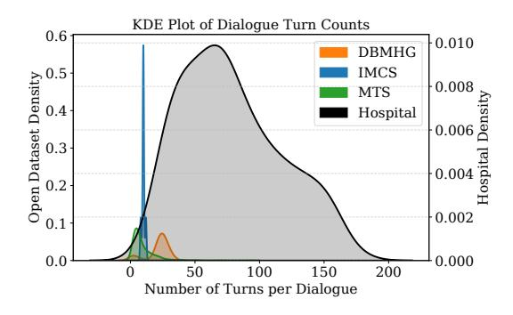
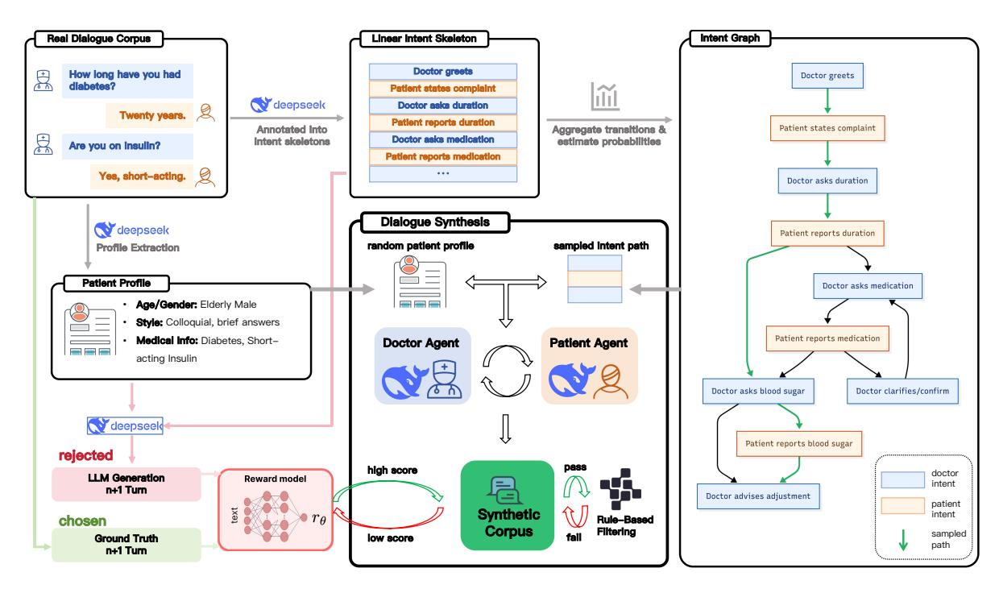

# **High-Quality Medical Dialogue Synthesis for Improving EMR Generation**

# Chengze Ge\*

Unisound AI Technology Co., Ltd. gechengze@unisound.com

# Oi Shao

Fudan University 21262010042@m.fudan.edu.cn

#### **Abstract**

High-quality doctor-patient dialogues, by which we mean realistic and human-like interactions that are intent-consistent, clinically faithful, and free of contradictions, are crucial for accurate Electronic Medical Record (EMR) generation. However, collecting large-scale real dialogues is costly and constrained by privacy regulations, while existing synthetic methods often yield rigid and medically inconsistent dialogues. We propose a scalable framework integrating (1) Intent Graph Planning for diverse clinical flows, (2) Dual-Agent Simulation for realistic doctor-patient interactions, and (3) Rule-Reward Quality Control combining explicit medical rules with a selfsupervised reward model. Experiments across multiple clinical domains demonstrate that our synthesized dialogues significantly enhance realism, diversity, and downstream EMR quality, substantially reducing physician editing efforts. Our framework provides a practical and privacy-compliant solution for deploying robust clinical NLP systems.

### 1 Introduction

Accurate and scalable generation of Electronic Medical Records (EMRs) from doctor-patient dialogues is increasingly vital in real-world health-care. Automating this process can reduce physicians' documentation burden, improve data quality, and support advanced clinical services. In this paper, we use the term "high-quality" to denote realistic and human-like dialogues that are intent-consistent, clinically faithful, and free of contradictions, rather than sanitized or noise-free text. However, practical deployment (especially in Chinese clinical contexts) faces a key bottleneck: the lack of large-scale realistic medical dialogues. Real consultations are typically longer, more colloquial, and contain natural disfluencies—features that dif-

# Yu Xu\*

Beihang University xuyu\_@buaa.edu.cn

# **Shengping Liu**

Unisound AI Technology Co., Ltd. liushengping@unisound.com

<span id="page-0-0"></span>

Figure 1: KDE plots comparing the distribution of dialogue turn counts across datasets. Dual y-axes preserve visibility of both short (DBMHG, IMCS, MTS-Dialog) and long (Hospital) dialogues, illustrating the marked disparity between publicly available and real-world clinical data.

fer markedly from the short, idealized open-source corpora commonly used to train NLP models.

Existing synthetic methods, such as template-based generation or naive language model sampling, often produce rigid and repetitive dialogues that fail to capture the complexity and variability of authentic clinical exchanges. This severely limits their usefulness in training robust EMR generation systems, as models trained on such data struggle to generalize to real-world consultations, resulting in factual inaccuracies and increased physician editing efforts.

Figure 1 illustrates this gap by comparing dialogue turn distributions between our hospital dataset and three representative public datasets (DBMHG, IMCS-V2-MRG, MTS-Dialog). Public datasets mostly contain short, task-focused dialogues under 30 turns, while our hospital corpus features longer and more variable interactions with a clear long-tail pattern. This disparity underscores the need for new methods that can replicate the nuanced, multi-turn nature of real doctor-patient conversations.

<sup>\*</sup>Equal contribution.

<span id="page-1-0"></span>

Figure 2: Overview of our dialogue synthesis framework. Real dialogues are annotated into intent skeletons and expanded into an intent graph, from which valid paths are sampled. A Doctor Agent and a Patient Agent (both powered by DeepSeek-V3) alternately generate utterances conditioned on patient profiles and intents. Candidate responses are filtered by rules and scored by a reward model, producing a synthetic corpus for downstream EMR generation.

To address these challenges, we propose a practical, industry-ready framework for synthesizing large volumes of realistic, high-quality medical dialogues that closely resemble real consultations. As shown in Figure 2, our method integrates three key innovations:

- (i) Intent Graph Planning, which mines finegrained medical intents and valid transitions from real consultations to build a structured graph guiding authentic and diverse dialogue flows;
- (ii) Dual-Agent Simulation, which employs coordinated large language model agents—a Doctor Agent and a Patient Agent—to iteratively generate context-aware utterances conditioned on planned intents, patient profiles, and medical knowledge; and
- (iii) Rule-Reward Quality Control, which enforces strict medical validity and natural conversational style through handcrafted rules (hard constraints) and a learned reward model (soft constraints), with automatic regeneration for unsatisfactory utterances.

Extensive experiments across multiple diseases, patient demographics, and institutions demonstrate that our framework generates dialogues with significantly enhanced realism and diversity, lead-

ing to improved EMR generation quality and notably reducing physician post-editing efforts. We focus on EMR generation as the downstream task because it has immediate clinical impact for deployment and offers reliable references for rigorous evaluation. Nevertheless, the framework itself—intent graph planning, dual-agent simulation, and rule—reward quality control—is task-agnostic and can be readily adapted to coding, structured information extraction, or clinical QA. This work provides a scalable, privacy-compliant solution for deploying robust clinical NLP systems in real-world healthcare settings.

#### 2 Related Work

Medical dialogue generation has attracted increasing attention in recent years, as it plays a crucial role in building intelligent clinical NLP systems. Early studies mainly relied on generic language models, but recent research has incorporated various domain-specific strategies to improve clinical consistency, reasoning, and personalization. For instance, context aggregation and topic-focused summarization have been used to generate personalized dialogues by compressing long-term conversation history (Ma et al., 2024). Explicit reason-

ing capabilities are enhanced via bootstrap prompting and multi-step math reasoning modules (Zhao et al., 2024; Wang et al., 2024). Multi-modal frameworks integrate medical images and knowledge bases to enrich the dialogue content (Zhang et al., 2024). Moreover, abstract meaning representations (Liu et al., 2024), term-aware agents (Sun et al., 2024), and dual flow modeling (Zhao et al., 2023) have been proposed to ensure semantic coherence and proper use of medical terminology. Patient-centered generation techniques using incontext learning (Luo et al., 2023) and graph-based knowledge-guided methods (Yang et al., 2023) further enhance the specificity and medical correctness of generated dialogues.

#### 3 Method

In this section, we introduce our proposed framework, specifically designed to generate realistic, controllable, and high-quality multi-turn doctorpatient dialogues at scale for clinical applications. The method integrates three core components: Intent Graph Planning, Dual-Agent Simulation, and Integrated Quality Control combining Rule-Based Filtering and Reward Scoring. These modules collaboratively simulate authentic consultation processes, ensuring dialogue diversity, coherence, and medical compliance.

## 3.1 Intent Graph Planning

Realistic medical consultations are structured conversations characterized by logical sequences of medical intents. To systematically capture and model these complex interaction patterns, we introduce an explicit Intent Graph, denoted as  $\mathcal{G}=(\mathcal{V},\mathcal{E})$ , representing fine-grained intents as nodes and intent transitions as directed edges.

Intent Library Construction. We begin by extracting a comprehensive library of dialogue intents from annotated real-world doctor-patient conversations. Each intent  $v_i \in \mathcal{V}$  specifies both the speaker role (Doctor or Patient) and communicative acts (e.g., ask symptom duration, confirm medication). This granular categorization ensures role consistency and clear dialogue semantics during the simulation phase.

**Transition Statistics.** For consecutive dialogue turns in our corpus, we systematically enumerate valid intent transitions  $(v_i \rightarrow v_j)$  and calculate empirical probabilities reflecting their frequencies:

$$P(v_j \mid v_i) = \frac{\text{Count}(v_i, v_j)}{\sum_k \text{Count}(v_i, v_k)}.$$
 (1)

This statistical analysis produces a probabilistically-weighted directed graph that accurately mirrors realistic conversational flows, capturing both common and less frequent medical interactions. A detailed analysis of top intent transitions and out-degree diversity is provided in Appendix A.4.

**Legal Path Sampling.** During dialogue generation, plausible intent sequences (termed *skeletons*) are sampled through stochastic traversals of  $\mathcal{G}$ . The sampling respects initial contextual conditions, including patient profiles and target diseases. The sampling process balances exploration (ensuring coverage of less frequent yet valid transitions) and exploitation (prioritizing common clinical paths).

**Robust Sampling Procedure.** We provide a detailed and reproducible sampling algorithm (SampleIntentSequence) that systematically ensures dialogue coherence:

# Algorithm 1 SampleIntentSequence

**Require:** Intent Graph  $\mathcal{G}$ , Start Intent  $v_0$ , Max Length L

**Ensure:** Intent Sequence  $\mathbf{s} = [v_0, v_1, \dots, v_T]$ 

- 1: Initialize  $\mathbf{s} \leftarrow [v_0]$
- 2: **for** t = 1 to L **do**
- 3: Set  $v_{t-1} = \mathbf{s}[-1]$
- 4: Sample  $v_t$  according to  $P(v_t \mid v_{t-1})$
- 5: **if**  $v_t$  is **END** or invalid **then**
- 6: break
- 7: **end if**
- 8: Append  $v_t$  to s
- 9: end for
- 10: return s

**Dynamic Adaptation and Personalization.** Intent Graph edges can be dynamically adjusted according to patient-specific attributes (e.g., age, chronic conditions). This adaptation ensures generated dialogue structures remain clinically appropriate and personalized, enhancing the authenticity and relevance of each interaction. An example patient profile with its extracted intent skeleton is provided in Appendix A.3.

# 3.2 Dual-Agent Simulation

Given the sampled intent skeleton  $S = \{v_0, v_1, \dots, v_T\}$ , we implement a robust dual-

agent framework consisting of a Doctor Agent and a Patient Agent, which collaboratively generate context-aware utterances in an alternating, turn-based manner.

At each dialogue turn t, the active agent receives a structured context input  $C_t$  composed of the current intent  $v_t$ , the complete dialogue history  $H_{1:t-1}$ , a detailed patient profile  $\mathcal{P}$ , and relevant medical knowledge  $\mathcal{K}$ . Formally, we define the input tuple as Equation (2):

<span id="page-3-0"></span>
$$C_t = (v_t, H_{1:t-1}, \mathcal{P}, \mathcal{K}). \tag{2}$$

To enhance lexical diversity and mitigate repetitive phrasing, each agent applies nucleus (top-p) sampling with a fixed temperature (T=1.0). For each intent  $v_t$ , the agent samples multiple plausible utterances  $\mathcal{U}_t = \{u_{t,1}, u_{t,2}, \dots, u_{t,K}\}$ . These candidates are subsequently filtered by rule-based constraints and a learned reward model, ensuring that only medically consistent and linguistically natural utterances are retained.

To better align generation quality with real-world conversational nuances while keeping the system simple and reproducible, both the Doctor Agent and the Patient Agent are implemented with the same backbone (DeepSeek-V3). Role-specific prompting and candidate selection (via rules and a reward model) are used to elicit authoritative, medically precise doctor utterances and colloquial, human-like patient responses with natural disfluencies and clarifications.

The explicit role-specific conditioning guarantees that the Doctor Agent predominantly generates authoritative, interrogative, or explanatory utterances, whereas the Patient Agent mirrors genuine patient behaviour, including informal wording, brief answers, or self-corrections—closely mimicking authentic consultation dynamics. Prompt templates for both Doctor and Patient agents are provided in Appendix A.5 and Appendix A.6, respectively.

In summary, this dual-agent simulation module effectively transforms an abstract intent skeleton into a high-quality, multi-turn dialogue text. By jointly employing context-rich conditioning, multi-candidate sampling, asymmetric agent architectures, and downstream quality control, we ensure that the synthesized conversations exhibit realistic progression, semantic coherence, and robust medical fidelity.

#### 3.3 Rule-Reward Based Quality Control

Reward Model Training. Our Reward Model  $R_{\phi}$  is trained using a self-supervised preferencelearning strategy that eliminates the need for costly human annotations. Specifically, for each real doctor-patient dialogue, we first extract a context window consisting of the first n utterances, denoted as  $C_n = \{u_1, u_2, \dots, u_n\}$ . The true humanwritten (n+1)-th utterance,  $u_{n+1}^{\text{human}}$ , is taken as the preferred continuation (*Chosen*). To construct a contrasting less-preferred response, the same context  $C_n$  is fed into the dual-agent generator to produce a synthetic alternative  $u_{n+1}^{\rm gen}$  (Rejected). This yields a preference pair  $\left(u_{n+1}^{\rm human}, u_{n+1}^{\rm gen}\right)$  under a shared dialogue context. The Reward Model is then trained to maximize the score margin between the Chosen and Rejected examples, using a pairwise ranking loss of the form of Equation (3):

<span id="page-3-1"></span>
$$\mathcal{L}_{\text{reward}} = \mathbb{E} \left[ \max \left( 0, 1 - R_{\phi}(u_{n+1}^{\text{human}} \mid \mathcal{C}_n) + R_{\phi}(u_{n+1}^{\text{gen}} \mid \mathcal{C}_n) \right) \right]. \tag{3}$$

This objective trains the model to prefer human-like continuations by learning conversational quality signals such as fluency, contextual relevance, and medical accuracy. Notably, it leverages existing real-world dialogues and in-domain LLM outputs without requiring additional manual scoring or expert annotation, making the reward learning process scalable and cost-efficient. See Appendix A.7 for an example preference pair data format.

Quality Control. To ensure that each generated dialogue turn is both medically accurate and linguistically natural, we employ a two-stage quality control framework combining hard rule-based filtering with soft reward-based assessment. The complete list of rule-based filtering criteria is provided in Appendix A.8. At each generation step t, the dual-agent simulation produces a candidate pool  $\mathcal{U}_t = u_{t,1}, u_{t,2}, \dots, u_{t,K}$ . Each candidate  $u_{t,k}$ first undergoes deterministic rule checks, which enforce correct speaker roles (Doctor or Patient), validate medical terminology against curated lexicons to avoid unsafe or implausible statements, restrict utterance length to prevent verbosity, and ensure alignment with the specified intent  $v_t$ . Formally, a candidate passes rule-based validation if:

$$\mathcal{A}(u_{t,k}) = \bigwedge_{m=1}^{M} \mathcal{R}_m(u_{t,k}) = \text{True}, \quad (4)$$

where  $\{\mathcal{R}_m\}_{m=1}^M$  are the individual rule functions. Candidates that pass these checks are then scored by a parameterized Reward Model  $R_{\phi}$ , which assigns a continuous quality score capturing subtle aspects such as fluency, coherence with context  $\mathcal{C}_t$ , and style alignment with real human utterances:

$$\hat{R}(u_{t,k}) = R_{\phi}(u_{t,k} \mid \mathcal{C}_t). \tag{5}$$

The final utterance selected for turn t is the candidate that satisfies all rules and maximizes the reward score:

$$u_t^* = \arg\max_{u_{t,k} \in \mathcal{U}_t} \left( \mathcal{A}(u_{t,k}) \wedge \hat{R}(u_{t,k}) \right). \tag{6}$$

If no candidate in  $\mathcal{U}_t$  meets both constraints, the system triggers a fallback loop to regenerate new candidates with adjusted sampling parameters (e.g., higher temperature or modified nucleus threshold) until a valid utterance is obtained. This iterative refinement ensures all generated dialogues comply with medical standards while retaining conversational realism.

By applying this Rule-Reward Quality Control at each generation step, our framework maintains robust quality control without human intervention, ensuring that large-scale synthetic dialogues remain reliable for downstream clinical NLP applications.

## 4 Experiments

In this section, we evaluate our proposed framework for realistic and controllable medical dialogue generation at scale. We describe the datasets, evaluation metrics, implementation details, and baselines in Section 4.1, followed by results and analyses in Section 4.2.

#### <span id="page-4-0"></span>4.1 Experimental Setup

**Datasets and Labels.** We utilize a dataset of 617 real doctor—patient consultations collected from a tertiary hospital in China, spanning seven representative outpatient departments: Endocrinology, Cardiology, Gastroenterology, Respiratory Medicine, Rheumatology, Neurology, and Nephrology. Each dialogue averages 66 turns ( $\pm 54$ ), reflecting real clinical diversity and complexity. Dialogues are meticulously annotated with intents and split into non-overlapping training (500 dialogues) and validation/test sets (117 dialogues in total) to prevent patient overlap. Synthetic dialogues generated by

our framework supplement the training set, significantly expanding the data available for downstream EMR generation. An example real consultation is provided in Appendix A.1, and the corresponding translated EMR in Appendix A.2.

**Evaluation Metrics.** We evaluate dialogue quality and downstream EMR performance along six dimensions: (i) Turns / Dialog: average number of speaker turns per consultation; (ii) Tokens / **Turn**: average tokenizer word pieces per turn; (iii) **Rule Pass Rate** (%): compliance with predefined intent constraints; (iv) Illegal Transitions (%): frequency of invalid intent transitions; (v) Lexical Diversity: corpus-level Dist-1, Dist-2, and Entropy; (vi) **EMR Quality**: BLEU, Key Information Error (KeyErr %), Edit Counts (reflecting clinician editing efforts), and LLM Judge scores (5-point fluency and correctness) automatically assessed by GPT-40 (rubric in Appendix A.9). Here, KeyErr and Edit Counts are human-involved metrics (manual key-field verification and physician post-edit logs), while LLM Judge is an automatic subjective score.

Implementation Details. Both Doctor and Patient Agents leverage DeepSeek-V3. Intent graphs are automatically extracted from real dialogues to guide generation. Temperature sampling (T=1.0) enhances diversity. Quality control integrates hard rule filtering and a reward model (Qwen-2.5-14B fine-tuned on  $\sim$ 20 k dialogue pairs) to prioritize medically valid and natural outputs. Fine-tuning uses a batch size of 32, learning rate 1e-5, and early stopping with a patience of 3 epochs. Experiments were run on a GPU cluster equipped with NVIDIA A800 cards.

Baseline Methods. To rigorously evaluate our full approach, we compare against: (i) Real-only: EMR training on real dialogues only; (ii) Single-Agent (No Control): one agent without intent guidance or quality control; (iii) Dual-Agent (No Control): two agents without intent planning or control modules.

# <span id="page-4-1"></span>4.2 Experimental Results

**Dialogue Quality & Diversity.** Table 1 compares dialogue quality and diversity. *Single-Agent (No Control)* and *Dual-Agent (No Control)* suffer from high illegal—transition rates (14.8 % and 9.2 %), shorter conversations (22—24 turns), and sparse utterances (25.6—27.7 *Tokens / Turn*). By

<span id="page-5-0"></span>

| Method                  | Quality                       |               |             |               |        | Diversity |         |  |
|-------------------------|-------------------------------|---------------|-------------|---------------|--------|-----------|---------|--|
|                         | Turns / Dialog                | Rule Pass (%) | Illegal (%) | Tokens / Turn | Dist-1 | Dist-2    | Entropy |  |
| Real-only               | $66 \pm 54$                   | 100.0         | 0.0         | 39.7          | 0.86   | 0.77      | 9.45    |  |
| Single-Agent (No Ctrl.) | $22 \pm 6$                    | 72.5          | 14.8        | 25.6          | 0.50   | 0.38      | 7.65    |  |
| Dual-Agent (No Ctrl.)   | $24 \pm 7$                    | 78.9          | 9.2         | 27.7          | 0.63   | 0.51      | 8.05    |  |
| Ours w/o Intent Graph   | $36 \pm 10$                   | 86.4          | 7.1         | 30.2          | 0.70   | 0.63      | 8.60    |  |
| Ours w/o Rule           | $42 \pm 11$                   | 93.8          | 3.7         | 31.5          | 0.78   | 0.69      | 8.95    |  |
| Ours w/o Reward         | $48 \pm 12$                   | 96.2          | 0.4         | 31.0          | 0.74   | 0.65      | 8.85    |  |
| Ours (Full)             | $\textbf{54} \pm \textbf{13}$ | 97.6          | 0.2         | 32.5          | 0.79   | 0.70      | 9.10    |  |

Table 1: Dialogue generation quality (left) and diversity (right). "Turns / Dialog" = average number of dialogue turns; "Tokens / Turn" = average tokenizer word pieces per turn. ± denotes standard deviation; higher is better for all metrics except Illegal (%).

<span id="page-5-1"></span>

| Training Setup            | Real (#) | Synthetic (#) | BLEU↑ | KeyErr (%) ↓ | Edit Count ↓ | LLM Judge (5↑)                  |
|---------------------------|----------|---------------|-------|--------------|--------------|---------------------------------|
| Real-only                 | 500      | 0             | 42.5  | 4.2          | 3.5          | $4.2\pm0.4$                     |
| Real + Single-Agent (100) | 500      | 100           | 40.8  | 4.8          | 3.6          | $4.0 \pm 0.4$                   |
| Real + Single-Agent (300) | 500      | 300           | 39.9  | 5.1          | 3.7          | $3.9 \pm 0.4$                   |
| Real + Dual-Agent (100)   | 500      | 100           | 41.5  | 4.6          | 3.5          | $4.0 \pm 0.4$                   |
| Real + Dual-Agent (300)   | 500      | 300           | 40.6  | 4.9          | 3.6          | $3.9 \pm 0.4$                   |
| Real + Ours (100)         | 500      | 100           | 43.7  | 3.9          | 3.0          | $4.3 \pm 0.3$                   |
| Real + Ours (300)         | 500      | 300           | 44.5  | 3.6          | 2.7          | $4.4 \pm 0.3$                   |
| Real + Ours (500)         | 500      | 500           | 45.2  | 3.4          | 2.5          | $4.5 \pm 0.2$                   |
| <b>Real + Ours (1000)</b> | 500      | 1000          | 45.6  | 3.3          | 2.3          | $\textbf{4.5} \pm \textbf{0.2}$ |
| Ours-only (500)           | 0        | 500           | 41.8  | 4.4          | 3.2          | $4.1 \pm 0.4$                   |

Table 2: Downstream EMR generation with **fixed 500 real dialogues** and varying amounts of synthetic data. Oursonly uses 500 synthetic dialogues and no real data. Bold marks the best value in each column.  $\uparrow/\downarrow$  indicate higher/lower is better;  $\pm$  denotes standard deviation over three runs.

integrating intent-graph planning, rule filtering, and reward selection, our method cuts illegal transitions to 0.2%, boosts the rule-pass rate to 97.6%, lengthens dialogues to 54 turns, and enriches each turn to 32.5 Tokens / Turn. It also maintains strong lexical diversity (Dist-1 = 0.79, Dist-2 = 0.70, Entropy = 9.10), second only to the real-dialogue upper bound.

**Impact on EMR Generation.** Table 2 studies how synthetic-data quantity and quality affect downstream EMR performance while keeping 500 real dialogues fixed. The Real-only benchmark yields BLEU = 42.5, KeyErr = 4.2 %, Edit Count = 3.5, and LLM Judge = 4.2. Adding synthetic dialogues from uncontrolled Single-Agent or Dual-Agent models degrades BLEU and increases factual errors. In contrast, augmenting with our controlled synthetic dialogues consistently improves EMR quality: with just 100 extra samples BLEU rises to 43.7; with 300/500/1000 samples BLEU climbs to 44.5, 45.2, and 45.6, KeyErr falls to 3.9 / 3.4 / 3.3 %, Edit Count drops to 3.0 / 2.5 / 2.3, and LLM Judge reaches 4.5. Notably, the Oursonly setting (0 real + 500 synthetic) attains BLEU

= 41.8—approaching the Real-only baseline—demonstrating that high-quality synthetic data can substitute scarce real conversations when privacy constraints arise.

<span id="page-5-2"></span>

| Method                | BLEU         | KeyErr (%) | Edits      | LLM Judge (5†) |
|-----------------------|--------------|------------|------------|----------------|
| Real-only<br>Baseline | 40.3<br>38.7 | 4.5<br>6.8 | 3.6<br>3.9 | 4.1<br>3.6     |
| Ours                  | 42.0         | 4.0        | 2.9        | 4.2            |

Table 3: Cross-institution EMR generation evaluation (200 dialogues). Baseline refers to the single-agent LLM without control. BLEU (higher is better); KeyErr (%) and Edits (lower is better); LLM Judge is a 5-point fluency and correctness score assessed by GPT-4o.

Cross-institution Generalization. Table 3 evaluates models on a held-out dataset from a second hospital in Zhejiang Province. Here, Edits denotes the average edit count clinicians apply to each generated EMR—lower is better. Compared with the *Single-Agent* baseline (BLEU = 38.7, KeyErr = 6.8%, Edits = 3.9), our framework achieves higher BLEU (42.0), lower KeyErr (4.0%), fewer edits (2.9), and better LLM scores (4.2 vs. 3.6). Al-

though BLEU drops slightly from 42.5 in-domain to 42.0 cross-institution, this 0.5-point decline is far smaller than the baselines, highlighting the robustness of our approach to distribution shifts and its practical utility for multi-site deployment.

Overall, our experiments confirm that integrating intent-graph planning, dual-agent simulation, and rule-reward quality control substantially improves dialogue quality, diversity, and EMR performance, while remaining robust across institutions.

# **5 Conclusion**

We proposed a scalable framework for synthesizing realistic multi-turn doctor-patient dialogues to address the lack of high-quality data for EMR generation. Our method integrates intent graph planning, dual-agent simulation, and rule-reward quality control to produce diverse, medically accurate, and natural dialogues. Experiments demonstrate significant improvements in dialogue realism and EMR generation quality while reducing physician editing efforts. Future work will incorporate realtime physician feedback and extend intent graphs to support more complex clinical scenarios.

# **Limitations**

This study has several limitations. First, although our experiments cover multiple departments and diverse patient profiles within a single hospital, and we also conducted a preliminary cross-institution evaluation (Table [3\)](#page-5-2), broader multi-center and cross-regional validation is still missing. Larger-scale studies are needed to ensure robustness across diverse clinical practices. Second, our reward model is trained using selfsupervised preference pairs derived from existing dialogues without incorporating direct physician evaluations, which may limit its ability to capture certain nuanced clinical judgments. In future work, we plan to integrate real-time clinician feedback for online refinement of the reward model and investigate hybrid supervision strategies that combine self-supervised and expert-annotated signals. Additionally, extending the intent graph to cover complex cross-department consultation flows and longitudinal multi-visit scenarios will further improve the practical deployment of our framework in real-world hospital settings. Finally, while our experiments focus on EMR generation due to its immediate clinical relevance, broader validation

on tasks such as coding, information extraction, and clinical QA remains an important direction for future work.

# **Ethical Considerations**

All real doctor-patient dialogue data used in this study were collected under formal data use agreements with our partner hospital and fully deidentified to remove any personally identifiable information, including patient names, contact details, and visit identifiers. Data collection and usage protocols were approved by the institutional ethics committee (IRB) to ensure compliance with local regulations and patient privacy standards. Our synthetic dialogue generation relies solely on statistical patterns and medical knowledge graphs without any reverse inference of patient identities, thereby minimizing privacy risks. We are committed to maintaining stringent data security, privacy protection, and ethical standards throughout all stages of development, deployment, and dissemination to ensure that our research remains trustworthy, compliant, and beneficial for real-world clinical applications.

# **References**

<span id="page-6-2"></span>Yang Liu, Qiang Li, Jie Chen, and Hongming Zhang. 2024. Improving medical dialogue generation with abstract meaning representations. In *Proceedings of ICASSP*, pages 11826–11830.

<span id="page-6-4"></span>Xiang Luo, Zhiqing Lin, Chao Zhang, and Minlie Huang. 2023. Plugmed: Improving specificity in patient-centered medical dialogue generation using in-context learning. In *Findings of the Association for Computational Linguistics: EMNLP 2023*, pages 5050–5066.

<span id="page-6-0"></span>Xiaoyu Ma, Zixuan Wang, Lei Zhang, Junyi Li, and Fei Liu. 2024. Context aggregation with topic-focused summarization for personalized medical dialogue generation. In *Proceedings of the Workshop on Clinical Natural Language Processing (ClinicalNLP) @ NAACL*, pages 310–321.

<span id="page-6-3"></span>Zhiyuan Sun, Jiayi Fang, Xingyu Liu, and Bin Yu. 2024. T-agent: A term-aware agent for medical dialogue generation. In *Proceedings of the International Joint Conference on Neural Networks (IJCNN)*, pages 1– 8.

<span id="page-6-1"></span>Zhi Wang, Yuan Zhao, Xiaoyang Huang, and Kai Liu. 2024. Mmr: Math multi-step reasoning in medical dialogue generation. In *Proceedings of the International Symposium on Artificial Intelligence in Medical Sciences (ISAIMS)*, pages 348–351.

<span id="page-7-3"></span>Chen Yang, Weijie Zhao, Peng Zhou, and Junchi Tang. Mdkg: Graph-based medical knowledge-2023. guided dialogue generation. In Proceedings of the 46th International ACM SIGIR Conference on Research and Development in Information Retrieval (SIGIR), pages 2164–2168.

<span id="page-7-1"></span>Tianhao Zhang, Chenglong Xu, Wen Huang, and Yiming Li. 2024. Seeing is believing! towards knowledge-infused multi-modal medical dialogue generation. In Proceedings of LREC-COLING, pages 14513-14523.

<span id="page-7-2"></span>Jing Zhao, Yan Li, Rui Chen, and Shuai Zhang. 2023. Medical dialogue generation via dual flow modeling. In Findings of the Association for Computational Linguistics: ACL 2023, pages 6771–6784.

<span id="page-7-0"></span>Yuxuan Zhao, Jingjing Chen, Zhiwei Wang, and Rui Li. 2024. Bp4er: Bootstrap prompting for explicit reasoning in medical dialogue generation. In Proceedings of LREC-COLING, pages 2480-2492.

# A Appendix

# <span id="page-7-4"></span>A.1 Example Real Doctor-Patient Dialogue

The following listing shows a real short doctorpatient consultation in Chinese with English translation, used in our study.

<span id="page-7-5"></span>Listing 1: Real short doctor-patient dialogue (Chinese-English).

患者: 他是那有胆囊结石, 然后想做摘胆手 → 术.

Patient: He has gallstones and wants to → have his gallbladder removed.

医生: 哦, Doctor: Oh,

患者: 在咱们医院那个肝胆内科看完了, 因为 → 他。本身有高血压, 糖尿病, 然后肾

→ 萎缩这个基础病, 然后血糖。

Patient: He saw hepatobiliary medicine

→ here. He has hypertension,

 $\hookrightarrow$  diabetes, and renal atrophy as

→ underlying diseases, and his

→ blood sugar...

医生:需要来这儿调一下血糖,

Doctor: Needs to adjust blood sugar here

患者: 在下也是这个意思。

Patient: That 's what I mean.

医生:人家才能做手术,这样我先问几个问  $\hookrightarrow$  题,了解一下老先生之前的情况,糖

→ 尿病几年了。

Doctor: Only then surgery can be done.

 $\hookrightarrow$  Let me ask a few questions first

→ to understand his situation. How

→ many years of diabetes?

患者:二十年了,

Patient: Twenty years.

医生:二十年,现在吃药还是打针啊? Doctor: Twenty years. Is he on

→ medication or injections now?

患者: 打针

Patient: Injections.

医生: 打哪种? Doctor: What type?

患者: 胰岛素 Patient: Insulin.

医生: 对哪种胰岛素叫什么名字?

Doctor: Which insulin, what's the name?

患者: 短效的。

Patient: Short-acting.

医生: 三餐前打什么? 是是打诺和锐还是打优 → 泌乐? 是打门冬还是打什么? 带了

→ 吗?

Doctor: What does he inject before meals  $\hookrightarrow$  ? NovoRapid or Humalog? Aspart or

→ what? Did he bring it?

患者: 没带 Patient: No.

医生: 餐前十分钟打是吗?

Doctor: Inject ten minutes before meals,

→ right?

患者:对 Patient: Yes.

医生: 每顿饭之前打多大剂量啊? 是三顿饭都

→ 这样,差不多是吧。睡前还打吗?就

→ 只打短效胰岛素其他的口服药吃吗?

→ 也不吃。平时监测血糖吗? 空腹餐后

→ 这么打胰岛素的情况下是多少?

Doctor: What 's the dose before each

→ meal? Same for all three meals? → Does he inject before sleep? Only

 $\hookrightarrow$  short-acting insulin, no oral → meds? Does he monitor blood sugar

→ ? What are the fasting and post-

→ meal levels with this regimen?

患者: 跟上厕所有点。

Patient: Need to go to the bathroom a

 $\hookrightarrow$  bit.

医生: 烧多少呀?

Doctor: What's the reading?

患者: 早上起来量的, 五点多到六点多

Patient: Morning reading, between 5 and  $\hookrightarrow$  6 mmol/L.

医生: 五至六. 餐后呢? Doctor: 5-6. Post-meal?

患者: 餐后十三点多。

Patient: Post-meal over 13 mmol/L.

医生: 他们一般都测的是两小时, 说实话, 稍

→ 等我看看, 嗯, 这都是五月二十六

→ 号。要不就是。

Doctor: Usually measured at two hours.

→ Let me check... these are all May

→ 26th results... or else...

患者: 肾,胃,肾萎缩,发现肌酐四百九。 Patient: Kidneys... renal atrophy...

医生: 还有什么别的慢性病在长期吃药吗?

→ 除了糖尿病,有高血压。然后肾功能 → 有问题是吗? 除了高血压和肾功能的 → 问题,还有什么别的问题在长期吃药

→ 吗?

Doctor: Any other chronic diseases

 $\hookrightarrow$  requiring long-term medication?

→ Besides diabetes, there

→ hypertension. And renal issues,

→ right? Anything else?

患者: 没有 Patient: No.

医生:目前的身高体重大概是多少?

Doctor: What 's his current height and

 $\hookrightarrow$  weight?

患者: 身高大概一七六, 体重应该是九十公斤

Patient: Height about 176cm, weight

 $\hookrightarrow$  around 90kg.

医生: 是这样的, 老先生, 第一, 咱们需要做 → 检查, 我需要对您的糖尿病做一次评

→ 估,评估完了之后,我需要给您调整

→ 降糖方案。然后您下次来的时候把您

→ 打的胰岛素带过来, 嗯, 好吧, 我今

→ 天先给您开检查, 然后约您下周二

→ 午来看结果,同时把您那个打的药带 → 过来,老先生如果不方便家属代诊就 → 可以了, 好吧。然后这一个礼拜给老 → 先生详细的测一下血糖,给你们画个

→ 表。

Doctor: Sir, first we need to run tests

 $\hookrightarrow$  to evaluate your diabetes, then  $\hookrightarrow$  adjust your regimen. Next visit,

→ bring your insulin. Today I'll

 $\hookrightarrow$  order tests and book you for next

 $\hookrightarrow$  Tuesday afternoon for results

→ review. If it's inconvenient,

→ family can come. Meanwhile.

→ record detailed blood sugar

 $\hookrightarrow$  readings this week; I 'll make

→ you a chart.

患者: 我需要什么时间来测?

Patient: What times should I measure?

医生: 不用来医院测, 在家测。空腹, 早餐 → 后, 中餐后, 晚餐后。睡前, 分别测 → 一下。一共, 这不是还剩七天的时间 → 吗? 您大概两天测一个完整的血糖

→ 谱,下次把这个表带过来给我看就

→ 行。

Doctor: Measure at home. Fasting, after  $\hookrightarrow$  breakfast, after lunch, after

→ dinner, and before bed. In these

 $\hookrightarrow$  seven days, complete a full

 $\hookrightarrow$  profile every two days and bring

→ the chart next time.

患者: 早餐, 早餐, 中餐。饭后两小时睡前, Patient: Breakfast, breakfast, lunch...

→ two hours after meals and before

 $\hookrightarrow$  sleep.

医生: 对对, 从吃第一口饭开始算两小时。一

→ 天把这五个点都测了啊! 一天不是只

→ 测一个点啊!

Doctor: Yes, two hours from first bite.

→ Measure all five points daily,

 $\hookrightarrow$  not just one.

患者: 这是我需要做。

Patient: That 's what I need to do.

医生: 对你,然后空腹抽个血、留个尿,我一  $\hookrightarrow$  会儿再跟您说具体的这个特殊注意的

→ 事情啊! 我, 不, 他有尿吧。平时。

Doctor: Yes. Also fasting blood draw and

→ urine sample. I'll explain

 $\hookrightarrow$  special precautions later. Does

→ he have urine normally?

患者: 化疗痛, 刘大,

Patient: Chemo pain... Liu Da... (unclear)

医生: 脑袋啊行行。还有,

Doctor: Head... okay. Anything else?

患者: 不让说什么,

Patient: Not allowed to say anything?

医生: 那是做过什么手术吗?

Doctor: Has he had any surgeries?

患者: 腰椎间盘突出。 就是一早起来,然后 → 餐后两小时,三个餐后两小时,大家 → 睡前我,我教你怎么使。 好好毫无悬

→ 念。 说等于就是今天把那个简单做简

→ 单做了,

Patient: Lumbar disc herniation surgery.

 $\hookrightarrow$  So measure in morning, then two

 $\hookrightarrow$  hours post each meal, and before → bed... I'll teach you how to use

 $\hookrightarrow$  it. So today we do the simple

 $\hookrightarrow$  parts.

医生: 等于就是一个。

Doctor: That 's about it.

患者: 然后测完血糖, 下周二下午再过来是

→ 吧。

Patient: After measuring blood sugar,

→ come back next Tuesday afternoon,

医生: 嗯. 对.

Doctor: Yes, correct.

患者: 跟在这住院调不成吗?

Patient: Can't he be admitted to adjust

→ it here?

医生: 我得看看他情况,

Doctor: I'll need to assess his

 $\hookrightarrow$  condition.

患者: 我想好了,

```
Patient: I've thought it through.

医生: 需不需要住内分泌科啊! 没有,
Doctor: Does he need to be admitted to
```

#### <span id="page-9-1"></span>A.2 Example Medical Record (Translated)

The following listing shows the English translation of the medical record corresponding to the real consultation example.

Listing 2: Medical record (English translation).

```
Chief Complaint:
Diagnosed with diabetes for 20 years.
Present Illness:
Diagnosed with diabetes 20 years ago.

→ Currently on NovoRapid insulin

    \hookrightarrow injected before each meal.
   → Fasting blood glucose 5-6 mmol/L,
→ postprandial blood glucose 13
    → mmol/L. Recent creatinine test
    \hookrightarrow showed 490 µmol/L. Visiting to
    \hookrightarrow adjust blood sugar before planned

Past Medical History:
Gallstones, hypertension, renal atrophy.

→ History of lumbar disc

    → herniation surgery.
Marital and Reproductive History:
Personal History:
Family History:
Physical Examination:
Height 176 cm, weight 90 kg.
Auxiliary Tests:
Preliminary Diagnosis:
1. Type 2 diabetes mellitus
2. Hypertension
3. Renal atrophy
Treatment Plan:
1. Monitor fasting, 2h postprandial, and
    → bedtime blood glucose.
2. Follow-up next Tuesday afternoon.
```

# <span id="page-9-0"></span>A.3 Example Patient Profile and Intent Skeleton

This listing shows the extracted patient profile and intent skeleton corresponding to the real short doctor-patient dialogue presented in Listing 1.

Listing 3: Patient profile and intent skeleton (mock data).

```
"Demographics": {
  "Age": "Elderly (60+)",
"Gender": "Male",
  "Occupation": "Retired", "Education": "Unknown"
"Speech_Style": [
  "Colloquial"
  "Uses traditional medical terms",
  "Ambiguous or hesitant expressions",
  "Help-seeking or dependent

→ expressions",

  "Urgent/anxious tone"
],
"Medical_Info": {
  "Diagnosis": [
    "Gallstones",
    "Hypertension",
    "Diabetes",
    "Renal atrophy",
    "Lumbar disc herniation"
  "Symptoms": [
    "Abnormal blood glucose",
    "Elevated creatinine"
  "Examinations": [
    "Blood glucose monitoring",
    "Fasting blood draw",
    "Urine test"
  "Treatments": [
    "Insulin injection".
    "Blood glucose regimen adjustment
        \hookrightarrow "
    "Cholecystectomy"
  "Drugs": [
    "Short-acting insulin"
"Skeleton": [
  "Patient reports gallstones and

    → desire for surgery",
  "Doctor responds and waits for

→ patient to continue",
  "Patient reports medical history and

  "Doctor advises blood glucose

→ adjustment",
  "Patient expresses agreement or

  "Doctor asks duration of illness",
  "Patient reports duration",
  "Doctor asks current medication",
  "Patient reports drug name",
  "Doctor asks specific drug type",
  "Patient reports drug name",
  "Doctor asks insulin name",
```

```
"Patient reports insulin type",
  "Doctor asks insulin brand and if

→ carried",
  "Patient reports not carrying it",
  "Doctor confirms injection timing",
  "Patient confirms info",
  "Doctor asks insulin dose and

→ glucose monitoring",
  "Patient describes symptoms",
  "Doctor asks severity",
  "Patient reports fasting blood

→ glucose".

  "Doctor asks postprandial blood

→ glucose",

  "Patient reports postprandial peak",
  "Doctor confirms test date and

  "Patient reports renal disease and

  "Doctor asks other chronic diseases
  "Patient denies pancreatitis history
     \hookrightarrow ",
  "Doctor asks height and weight",
  "Patient reports height and weight",
  "Doctor arranges tests and explains
     → plan",
  "Patient asks about test schedule",
  "Doctor instructs blood glucose

→ monitoring and follow-up",
  "Patient confirms monitoring times",
  "Doctor explains monitoring schedule
      \hookrightarrow ".
  "Patient confirms test requirements
  "Doctor arranges tests and explains
     → precautions",
  "Patient describes treatment

→ experiences",
  "Doctor asks about other symptoms",
  "Patient expresses refusal or
      → limitation"
  "Doctor asks surgery history",
  "Patient describes symptoms and
     \hookrightarrow daily situation",
  "Doctor confirms info",
  "Patient confirms follow-up time",
  "Doctor responds to patient

→ statement",

  "Patient asks about hospitalization
     \hookrightarrow feasibility",
  "Doctor explains need for assessment
      \hookrightarrow ".
  "Patient expresses decision",
  "Doctor asks about hospitalization
     → need",
  "Patient expresses desire for quick

→ surgery arrangement",
  "Doctor explains surgery cannot be

→ done in department¹

]
```

#### <span id="page-10-0"></span>**A.4** Intent Transition Analysis

}

We analyzed the intent transition graph to understand consultation flow structure and diversity. Listings 4 and 5 present the top-10 most frequent

intent transitions and out-degree diversity for selected intents, respectively.

<span id="page-10-2"></span>Listing 4: Top-10 most frequent intent transitions (mock data).

```
Source Intent
                                --> Target
  → Intent
                                : Count
Patient describes condition --> Doctor
\hookrightarrow explains or clarifies : 15 Doctor asks symptom duration -->
   → Patient reports duration

→ 12

Doctor confirms medication
   \hookrightarrow Patient reports medication
   → 10
Doctor asks blood sugar value -->
   \hookrightarrow Patient reports blood sugar
                                     : 9
Patient reports medication --> Doctor
   → asks dosage
                                : 8
Doctor asks dosage
                               -->
   → Patient reports dosage
                                      : 8
Patient reports dosage
                                --> Doctor

→ confirms dosage

                               : 7
Doctor confirms dosage
   → Patient expresses uncertainty : 6
Doctor asks other medications -->
   → Patient reports other meds
                                      : 6
Patient reports condition --> Doctor

→ advises follow-up

                               : 5
```

<span id="page-10-3"></span>Listing 5: Out-degree diversity (number of unique next intents) for selected intents (mock data).

```
Intent : Unique

→ Next Intents

Doctor explains or clarifies : 3
Patient reports medication : 4
Doctor asks dosage : 2
Patient reports dosage : 2
Doctor confirms medication usage: 1
Patient describes condition : 3
Doctor asks blood sugar value : 2
Patient reports blood sugar : 1
Doctor asks symptom duration : 2
Patient reports duration : 1
```

These results demonstrate that certain intents, such as "Doctor explains or clarifies" and "Patient reports medication", act as hubs with multiple possible subsequent intents, supporting our framework's ability to generate diverse and realistic consultation flows.

### <span id="page-10-1"></span>**A.5** Doctor Prompt Template

```
You are an experienced doctor in an

→ outpatient clinic. Your task is

→ to generate the next utterance in

→ a natural, professional, and

→ contextually appropriate manner,

→ based on the patient's profile,

→ dialogue history, and current

→ intent.
```

```
Patient Profile:
- Age: 45
- Gender: Male
- Chief Complaint: Persistent cough
Dialogue History:
Doctor: Hello, what brings you here

→ today?

Patient: I've been coughing for two days
Current Intent:
Ask about cough severity and any
    \hookrightarrow associated symptoms.
Instructions:
Generate only the doctor's next
    \hookrightarrow utterance, without any additional

→ explanation or role tags. Keep

    \hookrightarrow the style natural and aligned

→ with real clinical conversations.

Output:
```

#### <span id="page-11-0"></span>**A.6** Patient Prompt Template

```
You are a patient describing your
    \hookrightarrow symptoms to a doctor in an
    → outpatient clinic. Based on your
    → profile, dialogue history, and

→ the doctor's current question,
    \hookrightarrow generate your next utterance in a
   → natural, colloquial, and
→ realistic manner.
Patient Profile:
- Age: 45
- Gender: Male
- Chief Complaint: Persistent cough
Dialogue History:
Doctor: Hello, what brings you here
   → today?
Patient: I've been coughing for two days
Doctor: Is it a dry cough or do you have
    → phlegm?
Current Intent:
Describe cough type and presence of
    \hookrightarrow phlegm.
Instructions:
Generate only the patient's next

→ utterance, without any additional

    \hookrightarrow explanation or role tags. Keep

    → it brief, natural, and consistent

    \hookrightarrow with how a real patient would
    → respond.
Output:
```

## <span id="page-11-1"></span>A.7 Example Preference Pair

```
Context:
D: What brings you in today?
P: I've been coughing for two days.
D: Is it a dry or productive cough?
```

```
Chosen (Human):
P: It's mostly dry, but sometimes I feel
```

# <span id="page-11-2"></span>A.8 Rule-Based Filtering Rules

We applied a comprehensive set of rule-based filters to enforce medical validity, linguistic naturalness, and task consistency. The rules are grouped as follows:

## (A) Role Consistency Rules

- R1: Speaker Role Check. The utterance must match the intended speaker (Doctor or Patient).
- R2: Role Language Style. Doctor utterances should use formal, precise medical language; Patient utterances may include informal expressions, fillers, or disfluencies (e.g., "um", "uh", repetitions).

## (B) Intent Alignment Rules

- R3: Intent Keyword Presence. Utterances must mention key terms relevant to the planned intent (e.g., 'duration' when asking symptom duration).
- **R4: Single Intent Focus.** Utterance should fulfill only the current intent without introducing unrelated intents.

### (C) Linguistic Constraints

- **R5:** Length Constraint. Maximum utterance length: 100 tokens; minimum length: 2 tokens (avoid null/empty outputs).
- **R6: Repetition Filter.** Reject outputs with excessive n-gram repetitions (e.g., 3 identical bigrams).
- **R7: Grammar Structure Check.** Reject outputs with incomplete sentences (e.g., only punctuation or function words).

#### (D) Medical Validity Rules

• **R8:** Terminology Validity. Must not contain prohibited medical terms, unsafe advice (e.g., 'stop all medications abruptly'), or known hallucination triggers.

- **R9:** No Diagnosis from Patient. Patient utterances must not include explicit medical diagnoses (e.g., "I have pneumonia"), unless confirmed by a Doctor turn.
- R10: No Treatment Recommendation from Patient. Patients should not recommend treatments (e.g., "You should prescribe me antibiotics").
- R11: No Unapproved Drug Names. Utterances mentioning drug names must use approved generic names in the hospital formulary.
- R12: Temporal Consistency. Generated symptom durations or timelines must be logically consistent with previous context (e.g., avoid contradictions like 'two days' following 'one week').

These rules were implemented as deterministic functions  $\{\mathcal{R}_m\}_{m=1}^{12}$  applied to each candidate utterance to ensure adherence to speaker roles, intent objectives, linguistic fluency, and medical safety.

# <span id="page-12-0"></span>A.9 LLM Evaluation Rubric and Prompt

We utilized GPT-40 as an automated judge to evaluate the fluency and correctness of generated EMR outputs on a 5-point scale. The scoring prompt instructed the LLM as follows:

- **Score 5:** Perfect fluency and correctness; no factual or grammatical errors.
- Score 4: Minor errors but overall fluent and medically acceptable.
- Score 3: Noticeable factual inaccuracies or fluency issues requiring edits.
- Score 2: Major errors or inconsistencies making it hard to use directly.
- **Score 1:** Completely unusable; nonsensical or medically unsafe content.

**Evaluation Prompt.** The GPT-4o evaluation prompt is shown below:

```
System:
You are an expert medical EMR reviewer.

→ Evaluate the following generated

→ EMR based on fluency, medical

→ correctness, and information

→ completeness, using the detailed

→ 1-5 scoring rubric provided.
```

```
User:
== Scoring Rubric ==
5: Perfect fluency, fully medically

→ correct, complete; no edits

    - needed
4: Minor grammar or factual imprecision,
    → mostly complete; minimal edits
    \hookrightarrow needed.
3: Noticeable grammar or factual errors,

→ some missing info; moderate

    \hookrightarrow edits needed.
2: Major grammar issues, serious factual

    \hookrightarrow
1: Incoherent, medically dangerous, or

→ completely incomplete; unusable.

== Reference EMR ==
[Reference EMR]
== Generated EMR ==
[Generated EMR]
Please output only a single integer
    \hookrightarrow score from 1 to 5.
```