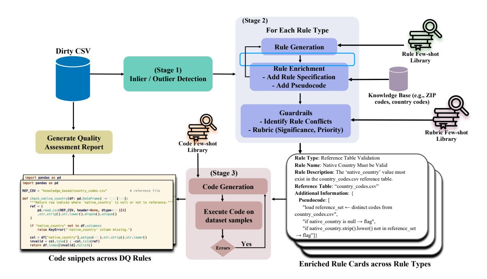

# Quality Assessment of Tabular Data using Large Language Models and Code Generation

# Ashlesha Akella

IBM Research, India ashlesha.akella@ibm.com

# Krishnasuri Narayanam

IBM Research, India knaraya3@in.ibm.com

# Abstract

Reliable data quality is crucial for downstream analysis of tabular datasets, yet rule-based validation often struggles with inefficiency, human intervention, and high computational costs. We present a three-stage framework that combines statistical inliner detection with LLM-driven rule and code generation. After filtering data samples through traditional clustering, we iteratively prompt LLMs to produce semantically valid quality rules and synthesize their executable validators through code-generating LLMs. To generate reliable quality rules, we aid LLMs with retrieval-augmented generation (RAG) by leveraging external knowledge sources and domain-specific few-shot examples. Robust guardrails ensure the accuracy and consistency of both rules and code snippets. Extensive evaluations on benchmark datasets confirm the effectiveness of our approach.

# 1 Introduction

Data quality (DQ) is vital for business decisions; poor data quality costs organizations an average of \$12.9 million annually [\(Sakpal,](#page-9-0) [2021\)](#page-9-0), underscoring the need for rigorous DQ management. Data errors stem from sensor faults, entry mistakes, and poor data integration, producing inconsistencies in the current high-dimensional tabular data sets from various domains, which often contain millions of rows and numerous columns.

Statistical profiling—encompassing distribution shifts, outliers, and functional dependency (FD) violations—remains a foundational technique for detecting data quality issues [\(Bohannon et al.,](#page-7-0) [2006;](#page-7-0) [Fan et al.,](#page-8-0) [2010;](#page-8-0) [Krishnan et al.,](#page-8-1) [2016;](#page-8-1) [Geerts et al.,](#page-8-2) [2020;](#page-8-2) [Livshits et al.,](#page-8-3) [2020;](#page-8-3) [Rezig et al.,](#page-9-1) [2021;](#page-9-1) [Pena](#page-9-2) [et al.,](#page-9-2) [2022;](#page-9-2) [Bachinger et al.,](#page-7-1) [2024;](#page-7-1) [Qin et al.,](#page-9-3) [2024a;](#page-9-3) [Boeckling and Bronselaer,](#page-7-2) [2025\)](#page-7-2). Bayesian extensions enhance this approach by modelling expected cell-value posteriors [\(Azzalini et al.,](#page-7-3) [2023;](#page-7-3) [Qin et al.,](#page-9-4) [2024b\)](#page-9-4). While such methods effectively

# Akshar Kaul

IBM Research, India akshar.kaul@in.ibm.com

# Sameep Mehta

IBM Research, India sameepmehta@in.ibm.com

flag structural anomalies, they often lack the semantic understanding required to detect contextdependent errors or violations that rely on external knowledge, leading to overlooked or misclassified issues.

Deep learning approaches learn latent space representations for data cleaning [\(Heidari et al.,](#page-8-4) [2019;](#page-8-4) [Jäger and Biessmann,](#page-8-5) [2024;](#page-8-5) [Reis et al.,](#page-9-5) [2024\)](#page-9-5) or train on constraint-compliant subsets to boost accuracy [\(Biessmann et al.,](#page-7-4) [2018;](#page-7-4) [Nasfi et al.,](#page-8-6) [2025\)](#page-8-6). [Liu et al.](#page-8-7) [\(2021\)](#page-8-7) explore self-supervised learning, while [Reis et al.](#page-9-5) [\(2024\)](#page-9-5) propose an active learningbased framework to improve DQ. These methods, however, presuppose clean labels or stable constraints, struggle on heavily noisy tables, and become costly on large datasets. Rule-based data cleaning approaches [\(Cong et al.,](#page-7-5) [2007;](#page-7-5) [Chiang](#page-7-6) [and Miller,](#page-7-6) [2008;](#page-7-6) [Boeckling et al.,](#page-7-7) [2022a,](#page-7-7)[b\)](#page-7-8) outperform purely statistical techniques, but fail to capture semantic inconsistencies.

Large Language Models (LLMs) offer significant promise for data-quality tasks due to their ability to assess contextual correctness and identify anomalies that traditional FD rules often miss. Yet, existing LLM-based solutions—such as fine-tuned models, prompt-driven detectors [\(Heidari et al.,](#page-8-4) [2019;](#page-8-4) [Mehra et al.,](#page-8-8) [2024;](#page-8-8) [Zhang et al.,](#page-9-6) [2024\)](#page-9-6), or incontext repair mechanisms [\(Chung et al.,](#page-7-9) [2017;](#page-7-9) [Bi](#page-7-10)[ester et al.,](#page-7-10) [2024;](#page-7-10) [Ni et al.,](#page-8-9) [2024a,](#page-8-9)[b\)](#page-9-7)—remain computationally expensive, either requiring per-row inference or dataset-specific training. [Bendinelli et al.](#page-7-11) [\(2025\)](#page-7-11) combine an LLM with Python to address cell-level and row-level data quality issues; their approach requires strong hints on the errors in the dataset and fails to address data errors dependent on external domain knowledge. Therefore, an effective solution must balance LLM adaptability while scaling efficiently and incorporate domain-specific knowledge to detect semantically complex errors.

Data quality is typically organized into dimensions such as accuracy, completeness, conformity,

<span id="page-1-0"></span>

Figure 1: System architecture illustrating the end-to-end pipeline for data quality assessment.

and consistency [\(Wand and Wang,](#page-9-8) [1996;](#page-9-8) [Pipino](#page-9-9) [et al.,](#page-9-9) [2002;](#page-9-9) [Loshin,](#page-8-10) [2010;](#page-8-10) [Carlo and Monica,](#page-7-12) [2016;](#page-7-12) [Ehrlinger and Wöß,](#page-8-11) [2022\)](#page-8-11), as these categories reflect how researchers and practitioners diagnose defects and prioritize remediation. Building on this taxonomy, we define targeted rule types (see Appendix [A.2\)](#page-10-0) under each dimension and generate rules accordingly (see Table [1\)](#page-2-0). This design enables granular data quality reports, precise and unambiguous LLM prompts, and modular downstream filters and evaluation metrics.

## 2 Framework

Our framework shown in Figure [1](#page-1-0) breaks down the data quality assessment into three stages. First, it uses statistical analysis on the given tabular dataset to categorize each row as either an inlier or an outlier. Then, we perform off-the-shelf LLM inference via automated prompts to generate data quality rules tailored to the dataset. Finally, we generate executable code for each quality rule through an off-the-shelf code-generating LLM inference. We engage only the inlier dataset from the first stage in subsequent stages to ensure reliable analysis utilizing data that is less likely to have errors or inconsistencies.

## 2.1 Inlier–Outlier Detection

Our system initiates preprocessing to identify a subset of non-noisy rows from the input dataset using

a traditional clustering technique, executed efficiently through distributed processing on Apache Spark. The pipeline performs multivariate outlier detection at the row level using the Sparx algorithm [\(Zhang et al.,](#page-9-10) [2022\)](#page-9-10), which scales linearly with the dataset size. For rows flagged as outliers, a finer-grained analysis determines whether specific cells are true outliers or are statistically influenced by other cells, based on the profile of each column. String columns are embedded using BERT [\(Devlin et al.,](#page-8-12) [2019\)](#page-8-12) and evaluated with a univariate distance-based outlier test, while numeric and categorical columns are analyzed using detectors tailored to their respective data types. A row is ultimately marked as an outlier if the number of its outlier cells surpasses a predefined threshold. This preprocessing step significantly enhances data quality by retaining only the inlier subset, thereby enabling more accurate rule generation and code synthesis in later stages.

#### 2.2 Generation and Enrichment of DQ Rules

Our system appropriately prompts the Gemma-3- 12B [\(Team et al.,](#page-9-11) [2025\)](#page-9-11) LLM to elicit DQ Rules for each *Rule Type* from the given dataset. For each Rule, Gemma initially formulates a canonical (draft) rule description, followed by a rule enrichment phase to incorporate essential specification and a concise set of pseudocode clauses that precisely capture the validation logic.

<span id="page-2-0"></span>

| DQ Dimension | DQ Rule Type                                                                                   | Sample DQ Rules (Rule Cards)                                                             |  |  |  |  |  |  |  |  |  |
|--------------|------------------------------------------------------------------------------------------------|------------------------------------------------------------------------------------------|--|--|--|--|--|--|--|--|--|
| Accuracy     | Reference Table Verification                                                                   | $\forall x \in \text{state}, \exists r \in \text{Cities}  \text{such that}  x = r.state$ |  |  |  |  |  |  |  |  |  |
|              | Format Compliance $\forall x \in \text{beer\_name}, \neg isNull(x) \land \text{[A-Za-z0-9']+}$ |                                                                                          |  |  |  |  |  |  |  |  |  |
| Conformity   | Data Type Validation                                                                           | $\forall x \in \text{Single Epithelial},  \neg isNull(x) \land x \in \mathbb{Z}$         |  |  |  |  |  |  |  |  |  |
|              | Data Type validation                                                                           | $\forall x \in \text{Marginal Adhesion},  \neg isNull(x) \land x \in \mathbb{Z}$         |  |  |  |  |  |  |  |  |  |
| Completeness | Missing Value Identification                                                                   | $\forall x \in \text{Clump Thickness}, \neg isNull(x)$                                   |  |  |  |  |  |  |  |  |  |
| Completeness | wissing value identification                                                                   | $\forall x \in \text{Bare Nuclei}, \neg isNull(x)$                                       |  |  |  |  |  |  |  |  |  |
|              | Value Set Constraint                                                                           | $\forall x \in \text{Uniformity of Cell Shape}, \neg isNull(x) \land x \in$              |  |  |  |  |  |  |  |  |  |
| Consistency  | value Set Constraint                                                                           | {1, 2, 3, 4, 5, 6, 7, 8, 9, 10}                                                          |  |  |  |  |  |  |  |  |  |
|              | Cross-Column Validation                                                                        | $\forall r \in \text{dataset}, \text{NormalNucleoli}(r) < \text{Mitoses}(r)$             |  |  |  |  |  |  |  |  |  |

Table 1: Examples of DQ Rules categorized by different DQ Dimensions (more Rules in Table 10 of Appendix). Reference Table Verification and Format Compliance are using Beers while rest using Breast Cancer dataset.

We capture each DQ Rule as a *Rule Card*—a structured JSON object comprising of fields, such as: *Rule Name* (a concise title), *Rule Description*, *Target Columns* (the columns involved in the rule), *Specification*, and *Pseudocode*. Organizing rules in this structured format simplifies data quality evaluation by clearly defining the relevant columns and the specific validation objective. Figure 2 illustrates a draft and enriched Rule Card.

```
Rule Card (draft):

{
    "Rule Type": "Reference Table Verification",
    "Rule Name": "State Must Follow US State Code Format",
    "Rule Description": "The `state` column must be a
    two-letter valid US state code (e.g., NY, CA). Any
    non-standard two-letter combinations should be flagged.",
    "Target Columns": ["state"],
    "Reference Table": ["uscities.csv", "Phone_codes.csv"]

}

Rule Card (enriched):

{
    "Rule Type": "Reference Table Verification",
    "Rule Description": "The `state` column must contain a
    two-letter abbreviation (e.g., NY, CO, CA, FL).
    Any value not on the official list is invalid.",
    "Target Columns": ["state"],
    "Reference Table": "uscities.csv",
    "Additional Information": {
        "Specification": "Validate using the two-letter stateId
        field in `uscities.csv`; ignore `Phone_codes.csv`.",
        "Pseudocode': ["if state is null → flag",
        "if len(state) != 2 → flag",
        "if state.upper() not in us_state_abbrevs_csv → flag"]
    }
}
```

Figure 2: Draft and Enriched Rule Cards by Gemma-3-12B on Beers dataset (Hould, 2017)

**Pipeline to generate Rules.** It begins by prompting an LLM to generate a schema description (shown in Figure 6 inspired from (Zhang et al., 2025)) to incorporate into rule-type-specific prompt templates (refer to Figure 8 in Appendix) to guide rule generation.

Each rule-generation prompt follows a structured, three-part format. The first part is the task header, which specifies the target rule type (e.g., Format Compliance or Cross-Column Validation) and includes a detailed description of its intent. The second part comprises task blocks that incorporate

contextual elements such as domain-specific examples, previously generated rules (if available), and a knowledge section along with an enumeration of allowed and disallowed behaviors. The third part provides the table schema. For wide tables, the schema is split into manageable batches to fit within Gemma's context window while still preserving column-level details.

**Domain-aware few-shot examples.** We maintain a repository of rule-card examples, either hand-crafted or harvested from diverse application domains. At run time we embed the table description and every stored domain descriptor with the *all-MiniLM-L6-v2* model (Wang et al., 2020). Cosine similarity selects the nearest domain; its representative rule cards for each rule type are then added to the prompt. This domain-specific few-shot context steers Gemma to generate rules with vocabulary and constraint patterns aligned with the target dataset.

#### Few-shot examples from previous iterations.

We employ an iterative prompting strategy inspired by the self-consistency technique in CoT (Wang et al., 2023) reasoning. During the first iteration, the LLM is provided with only the schema fragment and a few domain-specific few-shot examples, from which it generates a first batch of rule cards. In subsequent iterations, a randomly selected subset of these generated cards is included as additional exemplars in the prompt, progressively refining the model output.

Pipeline to enrich Rules. A rule-type-agnostic enrichment further refines each generated rule card to enhance specificity and reliability. The enrichment prompt is composed of components, such as: (i) Column Profile: A JSON summary automatically derived from the dataset, detailed in Figure 7. These column statistics provide the model with concrete and data-driven context. (ii) Draft Rule Card: The preliminary version of the rule generated in the

earlier phase. It includes a tentative rule name, description, and target columns—describing the constraint for the model to refine. (iii) Clean vs. Noise Sample: Two short lists of values extracted from the same column—one from inlier (clean) rows and the other from outlier (noisy) rows. Presenting this contrast helps the model recognize practical differences between valid and erroneous data. These components are integrated into the rule enrichment prompt template (see Figure 10 in Appendi[x\) an](#page-15-0)d submitted to Gemma-3-12B.

#### 2.2.1 Multi-Layer Gaurdrails.

Before the code generation stage, the provisional set of enriched DQ rules passes through a series of validation filters designed to eliminate redundancy, logical inconsistencies, and low-value constraints.

Conflict-Resolution Filter. Early pilot evaluations revealed that the LLM occasionally produced conflicting or mutually exclusive rules. These contradictions stemmed primarily from two sources: (i) inconsistencies in the sample data frames used across iterations; (ii) LLMs hallucinations (see Appendix [A.3](#page-11-1) for examples). To resolve this, the draft rule set specific to 'Target Columns' are passed to an LLM (Gemma) using a dedicated conflictdetection prompt for semantic parsing (see Figure [12](#page-28-0) in Appendix). The model returns a structured JSON report consisting of conflicting rule groups, overlapping target columns, a concise explanation of the conflict, and a recommendation on which rules to discard. Rules flagged for removal are purged before any rubric scoring or downstream validation. While ours is a rule-type-agnostic conflict detector, there exist logic-programming solutions [\(Corea and Thimm,](#page-7-13) [2020\)](#page-7-13) limited to conflict detection among FD rules (e.g., Cross-Column Dependency or Dependency Constraints) but they do not generalize to rules of arbitrary rule types.

Rubric-Based Rule Evaluation An eight-point rubric [\(Hashemi et al.,](#page-8-14) [2024\)](#page-8-14) assesses each surviving rule card. Using a small data sample and the complete table schema, Gemma-3-12B assigns one of these labels to each rule: *Duplicate* (identical to another rule), *Redundant* (subsumed by a stricter rule), *Trivial* (enforced already by schema or data types), *Risk-false-positive* (likely to break as valid data evolves), *Miscategorized* (tagged under the wrong DQ category), *Ambiguous* (unclear wording or missing logic), *Hallucinated-overly-specific* (overly narrow, often unrealistic constraints; e.g., Latitude must be exactly between 40.71271 and

40.71279), *High-value*, *Correct*, or *Correct-fixable*. Only rules categorized as *High-value*, *Correct*, or *Correct-fixable* proceed to the next deterministic filtering phase (prompt in Figure [15\)](#page-30-0).

### 2.3 Python Code Generation

In the final stage, each rule card is translated into executable Python code using *Qwen-2.5-Coder (32 B)* [\(Bai et al.,](#page-7-14) [2023\)](#page-7-14), an LLM specialized for code generation. This translation enables fine-grained, cell-level validation by producing a Boolean error mask when the generated code is run on the dataset, allowing comparisons against ground truth labels.

To perform this translation, the system constructs a comprehensive prompt for each rule card, integrating five key context components: (i) table schema, (ii) column-summary block containing profiles for all attributes listed in the rule's Target Columns, (iii) the enriched rule card including both specification and pseudocode, (iv) a representative sample of rows from the dataset, and (v) few-shot examples drawn from a curated library of domainand rule-type–specific code snippets. We dynamically select these few-shot examples by embedding both the current table description and all stored code snippets using sentence embeddings, ranking them by cosine similarity, and inserting the most relevant samples into the prompt. The fully assembled prompt is submitted to the LLM, which generates check(df) function to find invalid cells based on the specified rule. We run each snippet on a few rows; if it errors, the exception is fed back and the model repairs the code (see Figure [3\)](#page-3-0).

```
Code Snippet
import pandas as pd
REF_FILE = "external_knowledge_base/uscities.csv"
def check(df: pd.DataFrame) -> list[int]:
"""
Flag rows where `state` is null, not two characters, or not
found in the two-letter USPS list from uscities.csv.
"""
# Load reference abbreviations (uppercase for exact match)
ref_states = (
  pd.read_csv(REF_FILE, usecols=["state_id"], dtype=str)
  ["state_id"].str.strip().str.upper().unique()
# Normalise the target column
col = df["state"].astype(str).str.strip().str.upper()
# Build invalid mask
invalid_mask = (
  col.isna() | # null
  (col.str.len() != 2) | # not two letters
  (~col.isin(ref_states)) # not in reference list
# Return offending row indices
return sorted(df.index[invalid_mask].tolist())
```

Figure 3: Executable code snippet generated by Qwen-2.5-Coder on Beers dataset [\(Hould,](#page-8-13) [2017\)](#page-8-13).

### 2.4 End-to-End DQ Assessment Workflow

The framework accepts a single noisy CSV file and sequentially executes each check(df) function generated earlier. Each function returns the row indices that violate its *Rule Card*'s target column. We aggregate these indices into a unified error mask that captures all identified invalid cells across the dataset. Leveraging this mask, the system generates a comprehensive *Quality Assessment Report* that enumerates every flagged cell, along with the name of the triggering rule and the exact Python snippet responsible for its detection to help data stewards in data inspection (see Appendix [A.4](#page-11-2) example).

## 3 Experiments

Our assessment begins with clean benchmark tables from the ED2 [\(Neutatz et al.,](#page-8-15) [2019a\)](#page-8-15) and RAHA [\(Mahdavi et al.,](#page-8-16) [2019a\)](#page-8-16) studies, as well as popular public datasets, into which we systematically inject synthetic errors using the standardized REIN [\(Abdelaal et al.,](#page-7-15) [2023\)](#page-7-15) corruption model. This unified corruption strategy ensures consistency across datasets, allowing fair comparisons with baseline methods widely used in prior work. Then we compare the performance of our framework with baseline approaches under various noise conditions. Subsequently, we assess the contribution of the inlier detection module, evaluate the impact of incorporating domain-specific few-shot examples, and benchmark our approach against established error detection frameworks.

#### <span id="page-4-0"></span>3.1 Benchmark clean data with unified noise

We begin with *clean* versions of ten well-known tabular datasets spanning both transactional and sensor-like sources—namely *Adult* [\(Becker and Ko](#page-7-16)[havi,](#page-7-16) [1996\)](#page-7-16), *Beers* [\(Hould,](#page-8-13) [2017\)](#page-8-13), *Bikes* [\(Fanaee-T](#page-8-17) [and Gama,](#page-8-17) [2013\)](#page-8-17), *Breast Cancer* [\(Wolberg,](#page-9-15) [1992\)](#page-9-15), *HAR* [\(Anguita et al.,](#page-7-17) [2013\)](#page-7-17), *Movies* [\(Das et al.,](#page-8-18) [2015\)](#page-8-18), *Nasa* [\(Brooks et al.,](#page-7-18) [2014\)](#page-7-18), *Rayyan* [\(Ouz](#page-9-16)[zani et al.,](#page-9-16) [2016\)](#page-9-16), *Soil Moisture* [\(Riese and Keller,](#page-9-17) [2018\)](#page-9-17), and *Tax* [\(Mahdavi et al.,](#page-8-19) [2019b\)](#page-8-19).

To create a balanced yet challenging testbed, we apply the five-component error-injection framework from REIN to each dataset. It introduces diverse error types: *keyboard-based typos*, *explicit and implicit missing values*, *cell swaps*, and *Gaussian noise*. Each error type is injected independently at three noise levels—10%, 20%, and 30% of cells—resulting in 30 corrupted datasets. A set of baseline error detection techniques—ED2, FA-

HES, KATARA [\(Chu et al.,](#page-7-19) [2015\)](#page-7-19), OUTLIER IQR [\(Zhang,](#page-9-18) [2013\)](#page-9-18), OUTLIER IF [\(Liu et al.,](#page-8-20) [2012\)](#page-8-20), OUTLIER SD [\(Zhang,](#page-9-18) [2013\)](#page-9-18), MAX-ENTROPY [\(Abedjan et al.,](#page-7-20) [2016\)](#page-7-20), and MIN-K [\(Abedjan et al.,](#page-7-20) [2016\)](#page-7-20)—alongside our proposed approach execute on all the corrupted datasets. Table [2](#page-5-0) captures the reported F<sup>1</sup> scores (See Appendix [A.8\)](#page-13-1).

## 3.2 Ablation: Role of the Inlier Module

We re-ran the pipeline (in Section [3.1\)](#page-4-0) with the statistical inlier filter turned off, keeping all downstream components unchanged. As shown in Table [3,](#page-5-1) F<sup>1</sup> scores declined significantly across all datasets under varying noise levels (10%, 20%, and 30%), emphasizing the filter's critical role in providing a clean context to the LLM to reduce false-positive rule generation. With increased noise in the datasets, we observe that the significance of the Inlier Detection module increases (i.e., the jump in accuracy with the Inlier Detection module increases as the noise level increases in the dataset). At low noise levels (like 10% noise), the ablation also reveals that the advantage of having the Inlier Detection module is not significant (in some cases, the F<sup>1</sup> scores without Inlier Detection at low noise are even better, arising from the inconsistencies in the sample data frames used for analysis).

In our framework, the subsequent pipeline stages are agnostic to the internal design of the inlier/outlier detection stage, treating it as a black box. Therefore, this stage can incorporate a variety of algorithms—whether clustering-based or other techniques—executed sequentially to detect and filter inliers/outliers. Such an approach enhances the robustness of the overall framework by ensuring that downstream stages operate on a cleaner dataset with minimal noise, albeit at the cost of additional computational overhead.

### 3.3 Cross-Domain Robustness Evaluation

To gauge robustness across domains, we inject synthetic errors (using the five-component errorinjection strategy in Section [3.1\)](#page-4-0) to 4 datasets that cover *manufacturing* (3D Printer [\(Okudan,](#page-9-19) [2019\)](#page-9-19)), *environmental monitoring* (Water-Quality [\(Poch,](#page-9-20) [1993\)](#page-9-20)), *scholarly communication* (Citation [\(Das](#page-8-18) [et al.,](#page-8-18) [2015\)](#page-8-18)), and *energy consumption* (Power [\(He](#page-8-21)[brail and Berard,](#page-8-21) [2012\)](#page-8-21)) with 30% noise. We run the tests in two modes—one using domain-specific few-shot examples and one without—and report the resulting F<sup>1</sup> scores side-by-side in Table [7,](#page-6-0) highlighting the merit of domain-specific examples.

<span id="page-5-0"></span>

| Dataset / Noise |     | ED2  | FAHES | KATARA | IQR  | IF   | SD   | Max Entropy | Min-K | Ours |
|-----------------|-----|------|-------|--------|------|------|------|-------------|-------|------|
|                 | 10% | 0.96 | 0.01  | 0.03   | 0.00 | 0.00 | 0.00 | 0.92        | 0.05  | 0.94 |
| Adult           | 20% | 0.56 | 0.01  | 0.01   | 0.00 | 0.00 | 0.00 | 0.59        | 0.00  | 0.80 |
|                 | 30% | 0.36 | 0.02  | 0.06   | 0.00 | 0.00 | 0.00 | 0.00        | 0.02  | 0.63 |
|                 | 10% | 0.64 | 0.05  | 0.59   | 0.00 | 0.00 | 0.00 | 0.61        | 0.61  | 0.72 |
| Beers           | 20% | 0.80 | 0.04  | 0.52   | 0.00 | 0.00 | 0.00 | 0.75        | 0.55  | 0.82 |
|                 | 30% | 0.71 | 0.03  | 0.52   | 0.00 | 0.00 | 0.00 | 0.53        | 0.53  | 0.85 |
|                 | 10% | 0.16 | 0.01  | 0.13   | 0.00 | 0.00 | 0.00 | 0.00        | 0.01  | 0.82 |
| Bikes           | 20% | 0.39 | 0.01  | 0.23   | 0.00 | 0.00 | 0.00 | 0.00        | 0.00  | 0.83 |
|                 | 30% | 0.39 | 0.02  | 0.24   | 0.00 | 0.00 | 0.00 | 0.00        | 0.10  | 0.82 |
|                 | 10% | 0.13 | 0.01  | 0.14   | 0.00 | 0.00 | 0.00 | 0.00        | 0.00  | 0.90 |
| Breast Cancer   | 20% | 0.46 | 0.09  | 0.09   | 0.00 | 0.06 | 0.00 | 0.36        | 0.19  | 0.74 |
|                 | 30% | 0.34 | 0.04  | 0.32   | 0.00 | 0.00 | 0.00 | 0.33        | 0.41  | 0.89 |
|                 | 10% | 0.32 | 0.00  | 0.07   | 0.00 | 0.00 | 0.00 | 0.00        | 0.00  | 0.42 |
| HAR             | 20% | 0.53 | 0.00  | 0.05   | 0.10 | 0.00 | 0.00 | 0.10        | 0.07  | 0.54 |
|                 | 30% | 0.49 | 0.00  | 0.12   | 0.00 | 0.00 | 0.00 | 0.31        | 0.00  | 0.55 |
|                 | 10% | 0.75 | 0.07  | 0.01   | 0.00 | 0.00 | 0.00 | 0.00        | 0.00  | 0.71 |
| Movies          | 20% | 0.76 | 0.11  | 0.02   | 0.00 | 0.00 | 0.00 | 0.54        | 0.32  | 0.71 |
|                 | 30% | 0.77 | 0.07  | 0.03   | 0.00 | 0.00 | 0.00 | 0.00        | 0.00  | 0.68 |
|                 | 10% | 0.88 | 0.03  | 0.00   | 0.00 | 0.00 | 0.00 | 0.80        | 0.05  | 0.89 |
| Nasa            | 20% | 0.74 | 0.14  | 0.00   | 0.00 | 0.00 | 0.00 | 0.65        | 0.14  | 0.85 |
|                 | 30% | 0.91 | 0.05  | 0.00   | 0.00 | 0.00 | 0.00 | 0.93        | 0.05  | 0.91 |
|                 | 10% | 0.94 | 0.16  | 0.35   | 0.00 | 0.00 | 0.00 | 0.94        | 0.42  | 0.94 |
| Rayyan          | 20% | 0.95 | 0.22  | 0.35   | 0.00 | 0.00 | 0.00 | 0.95        | 0.47  | 0.97 |
|                 | 30% | 0.95 | 0.17  | 0.35   | 0.00 | 0.00 | 0.00 | 0.95        | 0.47  | 0.96 |
|                 | 10% | 0.01 | 0.00  | 0.00   | 0.00 | 0.00 | 0.00 | 0.08        | 0.01  | 0.80 |
| Soil Moisture   | 20% | 0.01 | 0.00  | 0.00   | 0.00 | 0.01 | 0.01 | 0.01        | 0.01  | 0.80 |
|                 | 30% | 0.01 | 0.00  | 0.00   | 0.01 | 0.00 | 0.00 | 0.01        | 0.00  | 0.80 |
|                 | 10% | 0.13 | 0.01  | 0.02   | 0.00 | 0.00 | 0.00 | 0.01        | 0.00  | 0.29 |
| Tax             | 20% | 0.25 | 0.02  | 0.11   | 0.00 | 0.00 | 0.00 | 0.01        | 0.00  | 0.34 |
|                 | 30% | 0.24 | 0.01  | 0.06   | 0.00 | 0.00 | 0.00 | 0.00        | 0.00  | 0.32 |

Table 2: F<sup>1</sup> scores for error detection on tabular datasets corrupted with unified noise levels of 10%, 20%, and 30%, using the REIN error-injection strategy.

<span id="page-5-1"></span>

| Dataset       |              |              | Accuracy (with, without) Inlier Detection |
|---------------|--------------|--------------|-------------------------------------------|
|               | 10% noise    | 20% noise    | 30% noise                                 |
| Adult         | (0.94, 0.72) | (0.80, 0.77) | (0.63, 0.48)                              |
| Beers         | (0.72, 0.68) | (0.82, 0.68) | (0.85, 0.43)                              |
| Bikes         | (0.82, 0.81) | (0.83, 0.81) | (0.82, 0.81)                              |
| Breast Cancer | (0.90, 0.85) | (0.74, 0.72) | (0.89, 0.72)                              |
| HAR           | (0.42, 0.51) | (0.54, 0.52) | (0.55, 0.53)                              |
| Movies        | (0.71, 0.69) | (0.71, 0.69) | (0.68, 0.66)                              |
| Nasa          | (0.89, 0.73) | (0.85, 0.71) | (0.91, 0.32)                              |
| Rayyan        | (0.94, 0.94) | (0.97, 0.94) | (0.96, 0.74)                              |
| Soil Moisture | (0.80, 0.75) | (0.80, 0.55) | (0.80, 0.04)                              |
| Tax           | (0.29, 0.25) | (0.34, 0.23) | (0.32, 0.31)                              |

Table 3: Inlier Detection boosts error detection F<sup>1</sup> score.

#### 3.4 Evaluation on Standard DQ Benchmarks

We benchmark our framework on three data corruption suites, using the corresponding noisy datasets provided by each source. (i) We begin with the REIN benchmark [\(Abdelaal,](#page-7-21) [2024\)](#page-7-21), which applies the five-component error-injection on six domaindiverse tables. Our results, compared with baselines including ED2, FAHES [\(Qahtan et al.,](#page-9-21) [2018\)](#page-9-21), KATARA, outlier detectors (IQR, IF, and SD), Max-Entropy, and Min-K, are presented in Table [4](#page-6-1) (matching our reported results, [Abdelaal et al.](#page-7-22) [\(2024\)](#page-7-22) also observe that the outlier detectors are not efficient on datasets like Beers, Flights, Hospital, and Nasa). (ii) We then evaluate on the six datasets from the ED2 benchmark [\(Neutatz et al.,](#page-8-22)

[2019b\)](#page-8-22), using the same set of baselines; results appear in Table [5.](#page-6-2) (iii) Finally, we test on the five datasets from RAHA [\(Mahdavi et al.,](#page-8-19) [2019b\)](#page-8-19), with comparative performance reported in Table [6.](#page-6-3) Our results for the datasets Beers, Flights, and Hospital differ on ED2 and Raha due to the difference in their noise.

Observations: Across ten data sets and three noise levels (refer to Table [2\)](#page-5-0), our method records the highest F<sup>1</sup> in 26 of 30 settings, markedly surpassing the next best detector on challenging tables such as Bikes, Breast Cancer, and Soil-Moisture. With domain-tailored few-shots (refer to Table [7\)](#page-6-0), the Power-Consumption table's F<sup>1</sup> rises from 0.61 to 0.71, showing a clear gain over the generic prompt. On the REIN benchmark (refer to Table [4\)](#page-6-1) our system posts the top score on 9 of 10 data sets—often by wide margins on Bikes, Breast Cancer and Soil Moisture—while conceding only Hospital to ED2.

Moreover, we conducted a systematic confidence analysis (refer to Appendix [A.1\)](#page-10-1) to assess the reliability of LLM-generated rules. We observed that providing few-shot example guidance would not only improve the overall quality of generated rules but also lead to higher model confidence (or lower hallucinations) and broader schema coverage.

<span id="page-6-1"></span>

| Dataset       | ED2  | FAHES | KATARA | IQR  | IF   | SD   | Max Entropy | Min-K | Ours |
|---------------|------|-------|--------|------|------|------|-------------|-------|------|
| Adult         | 0.57 | 0.00  | 0.02   | 0.00 | 0.00 | 0.00 | 0.57        | 0.00  | 0.59 |
| Beers         | 0.99 | 0.59  | 0.03   | 0.00 | 0.00 | 0.00 | 0.91        | 0.69  | 1.00 |
| Bikes         | 0.65 | 0.14  | 0.30   | 0.27 | 0.14 | 0.22 | 0.27        | 0.31  | 0.77 |
| Breast Cancer | 0.49 | 0.09  | 0.09   | 0.00 | 0.00 | 0.06 | 0.48        | 0.28  | 0.89 |
| Flights       | 0.86 | 0.03  | 0.11   | 0.00 | 0.00 | 0.00 | 0.84        | 0.65  | 0.89 |
| HAR           | 0.48 | 0.00  | 0.05   | 0.00 | 0.11 | 0.00 | 0.47        | 0.41  | 0.60 |
| Hospital      | 0.99 | 0.01  | 0.08   | 0.00 | 0.00 | 0.00 | 0.74        | 0.5   | 0.86 |
| Mercedes      | 0.32 | 0.00  | 0.00   | 0.00 | 0.01 | 0.01 | 0.21        | 0.00  | 0.73 |
| Nasa          | 0.76 | 0.05  | 0.13   | 0.00 | 0.00 | 0.00 | 0.32        | 0.22  | 0.96 |
| Soil Moisture | 0.05 | 0.00  | 0.00   | 0.00 | 0.04 | 0.02 | 0.03        | 0.03  | 0.59 |

Table 4: REIN Benchmark Evaluation: Error Detection Accuracy (F<sub>1</sub>) of Our Approach vs. Baselines

<span id="page-6-2"></span>

| Dataset    | ED2  | Ours |
|------------|------|------|
| Beers      | 0.98 | 1.00 |
| Flights    | 0.86 | 0.88 |
| Hospital   | 1.00 | 0.82 |
| Restaurant | 0.76 | 0.61 |
| Soccer     | 0.81 | 0.81 |

Table 5: ED2 benchmark (F<sub>1</sub> scores).

<span id="page-6-3"></span>

| Dataset  | RAHA | Ours |
|----------|------|------|
| Beers    | 0.99 | 0.95 |
| Flights  | 0.82 | 0.89 |
| Hospital | 0.75 | 0.86 |
| Movies   | 0.84 | 0.85 |
| Rayyan   | 0.78 | 0.75 |

Table 6: RAHA benchmark (F<sub>1</sub> scores).

<span id="page-6-0"></span>

| Dataset           | Few-shot examples |                 |  |  |  |  |  |  |  |  |
|-------------------|-------------------|-----------------|--|--|--|--|--|--|--|--|
| Dataset           | With domain-      | Without domain- |  |  |  |  |  |  |  |  |
|                   | specific          | specific        |  |  |  |  |  |  |  |  |
| 3D Printer        | 0.68              | 0.66            |  |  |  |  |  |  |  |  |
| Citation          | 0.80              | 0.78            |  |  |  |  |  |  |  |  |
| Power-Consumption | 0.71              | 0.61            |  |  |  |  |  |  |  |  |
| Water-Quality     | 0.21              | 0.17            |  |  |  |  |  |  |  |  |

Table 7: Error detection  $F_1$  scores with vs. without domain-specific few-shot examples.

#### 4 Conclusion

We introduced a fully automated, three-stage framework that integrates large-scale statistical inlier detection, LLM-based semantically valid rule generation, and code synthesis to produce executable data-quality validators for tabular datasets. Each quality rule is encapsulated as a structured, humanreadable rule card, promoting transparency and expert oversight. Conflicts among generated DQ rules are resolved agnostically to rule types and consolidated using a rubric for consistency. Our approach scales to large tabular datasets by eliminating the need for cell-level LLM inference calls. Evaluated on both REIN synthetic stress benchmarks and standard datasets from ED2 and RAHA, our approach consistently outperforms existing detectors in accuracy. By incorporating external domain knowledge and domain-specific few-shot examples in the prompts, our approach allows reliable and domain-agnostic data quality assurance.

#### 5 Limitations

Our current framework operates in a single-table setting. However, in practice, data is often organized into multiple related tables rather than being stored in a single large table. It is not feasible to directly apply the framework independently to each table in a multi-table schema, since dependencies between tables must be considered and incorporated into the generated rules. Our framework is extensible and can support new DQ rule types by simply providing their corresponding prompt templates and example rule cards. While we demonstrated Python code generation for rule enforcement on datasets, the framework also supports source code generation in SQL.

# References

- <span id="page-7-21"></span>Mohamed Abdelaal. 2024. [Datasets of rein benchmark.](https://doi.org/10.13140/RG.2.2.18388.82567)
- <span id="page-7-15"></span>Mohamed Abdelaal, Christian Hammacher, and Harald Schöning. 2023. REIN: A comprehensive benchmark framework for data cleaning methods in ML pipelines. In *Proceedings of the 26th International Conference on Extending Database Technology, (EDBT)*, pages 499–511.
- <span id="page-7-22"></span>Mohamed Abdelaal, Tim Ktitarev, Daniel Städtler, and Harald Schöning. 2024. SAGED: few-shot meta learning for tabular data error detection. In *Proceedings of the 27th International Conference on Extending Database Technology, (EDBT)*, pages 386–398.
- <span id="page-7-20"></span>Ziawasch Abedjan, Xu Chu, Dong Deng, Raul Castro Fernandez, Ihab F Ilyas, Mourad Ouzzani, Paolo Papotti, Michael Stonebraker, and Nan Tang. 2016. Detecting data errors: Where are we and what needs to be done? *Proceedings of the VLDB Endowment (PVLDB)*, 9(12):993–1004.
- <span id="page-7-17"></span>Davide Anguita, Alessandro Ghio, Luca Oneto, Xavier Parra, and Jorge L. Reyes-Ortiz. 2013. Human activity recognition with smartphones. Kaggle dataset (Accessed June 2025).
- Fa[bio Azzalini, Davide Piantella, Emanuele Rabosio,](https://www.kaggle.com/datasets/uciml/human-activity-recognition-with-smartphones) [and Letizia Tanca. 2023. Enhancing domain-aware](https://www.kaggle.com/datasets/uciml/human-activity-recognition-with-smartphones) multi-truth data fusion using copy-based source authority and value similarity. *The VLDB Journal*, 32(3):475–500.
- <span id="page-7-3"></span>Florian Bachinger, Lisa Ehrlinger, Gabriel Kronberger, and Wolfram W"oss. 2024. Data validation utilizing expert knowledge and shape constraints. *Journal of Data and Information Quality(JDIQ)*, 16(2).
- <span id="page-7-1"></span>Jinze Bai, Shuai Bai, Yunfei Chu, Zeyu Cui, Kai Dang, Xiaodong Deng, Yang Fan, Wenbin Ge, Yu Han, Fei Huang, et al. 2023. Qwen Technical Report. *arXiv preprint arXiv:2309.16609*.
- <span id="page-7-14"></span>Barry Becker and Ronny Kohavi. 1996. Adult Census Income. https://www.kaggle.com/datasets/uciml/ adult-census-income. Accessed on June 2025.
- <span id="page-7-16"></span>Tommaso Bendinelli, Artur Dox, and Christian Holz. 2025. Exploring llm agents for cleaning tabular machi[ne learning datasets.](https://www.kaggle.com/datasets/uciml/adult-census-income) *arXiv preprint [arXiv:2503.06664](https://www.kaggle.com/datasets/uciml/adult-census-income)*.
- <span id="page-7-11"></span>Felix Biessmann, David Salinas, Sebastian Schelter, Philipp Schmidt, and Dustin Lange. 2018. " deep" learning for missing value imputationin tables with non-numerical data. In *Proceedings of the 27th ACM international conference on information and knowledge management*, pages 2017–2025.
- <span id="page-7-4"></span>Fabian Biester, Mohamed Abdelaal, and Daniel Del Gaudio. 2024. LLMClean: Context Aware Tabular Data Cleaning via LLM Generated OFDs. In *Proceedings of the European Conference on Advances in Databases and Information Systems (ADBIS)*, pages 68–78.

- <span id="page-7-10"></span>Oliver Birgelen and Alexander Niggemann. 2018. Smart factory: High storage system data for energy optimization. Kaggle dataset (Accessed June 2025).
- Toon Boeckling and Antoon Bronselaer. 2025. Cleaning data with Swipe. *ACM Journal of Data and Information Quality (JDIQ)*, 17(1):1–29.
- <span id="page-7-23"></span>Toon Boeckling, Guy De Tré, and Antoon Bronselaer. [2022a. Cleaning data with selection rules.](https://www.kaggle.com/datasets/inIT-OWL/high-storage-system-data-for-energy-optimization) *IEEE Access*[, 10:125212–125229.](https://www.kaggle.com/datasets/inIT-OWL/high-storage-system-data-for-energy-optimization)
- <span id="page-7-2"></span>Toon Boeckling, Guy De Tré, and Antoon Bronselaer. 2022b. Efficient edit rule implication for nominal and ordinal data. *Information Sciences*, 590:179–197.
- <span id="page-7-7"></span>Philip Bohannon, Wenfei Fan, Floris Geerts, Xibei Jia, and Anastasios Kementsietsidis. 2006. Conditional functional dependencies for data cleaning. In *2007 IEEE 23rd international conference on data engineering*, pages 746–755. IEEE.
- <span id="page-7-8"></span><span id="page-7-0"></span>Thomas Brooks, D. Pope, and Michael Marcolini. 2014. NASA Airfoil Self-Noise. https://archive.ics.uci.edu/ dataset/291/airfoil+self+noise. Accessed on June 2025.
- Batini Carlo and Scannapieco Monica. 2016. *Data and Information Quality: Dimensions, Principles and Techniques*. Springer.
- <span id="page-7-18"></span>Fei Chiang and Renée J. Miller[. 2008. Discovering Data](https://archive.ics.uci.edu/dataset/291/airfoil+self+noise) Quality Rules. *[Proceedings of the VLDB Endowm](https://archive.ics.uci.edu/dataset/291/airfoil+self+noise)ent (PVLDB)*, 1(1):1166–1177.
- <span id="page-7-12"></span>Xu Chu, Mourad Ouzzani, John Morcos, Ihab F. Ilyas, Paolo Papotti, Nan Tang, and Yin Ye. 2015. KATARA: Reliable Data Cleaning with Knowledge Bases and Crowdsourcing. *Proceedings of the VLDB Endowment (PVLDB)*, 8(12):1952–1955.
- <span id="page-7-19"></span><span id="page-7-6"></span>Yeounoh Chung, Sanjay Krishnan, and Tim Kraska. 2017. A data quality metric (DQM): how to estimate the number of undetected errors in data sets. *Proceedings of the VLDB Endowment (PVLDB)*, 10(10):1094– 1105.
- <span id="page-7-9"></span>Gao Cong, Wenfei Fan, Floris Geerts, Xibei Jia, and Shuai Ma. 2007. Improving Data Quality: Consistency and Accuracy. In *Proceedings of the 33rd International Conference on Very Large Data Bases (VLDB)*, pages 315–326.
- <span id="page-7-5"></span>Carl Corea and Matthias Thimm. 2020. Towards Inconsistency Measurement in Business Rule Bases. In *24th European Conference on Artificial Intelligence (ECAI)*, pages 704–711.
- <span id="page-7-13"></span>Sanjib Das, AnHai Doan, Paul Suganthan G. C., Chaitanya Gokhale, Pradap Konda, Yash Govind, and Derek Paulsen. 2015. The Magellan Data Repository. https://sites.google.com/site/anhaidgroup/ useful-stuff/the-magellan-data-repository.

- <span id="page-8-18"></span>Jacob Devlin, Ming-Wei Chang, Kenton Lee, and Kristina Toutanova. 2019. BERT: Pre-training of Deep Bidirectional Transformers for Language Understanding. In *Proceedings of the [2019 Conference](https://sites.google.com/site/anhaidgroup/useful-stuff/the-magellan-data-repository) [of the North American Chapter of the Association](https://sites.google.com/site/anhaidgroup/useful-stuff/the-magellan-data-repository) [for Computational Linguistics: Hu](https://sites.google.com/site/anhaidgroup/useful-stuff/the-magellan-data-repository)man Language Technologies (NAACL-HLT)*, pages 4171–4186.
- <span id="page-8-12"></span>Lisa Ehrlinger and Wolfram Wöß. 2022. A Survey of Data Quality Measurement and Monitoring Tools. *Frontiers Big Data (FDATA)*, 5:850611.
- Wenfei Fan, Floris Geerts, Jianzhong Li, and Ming Xiong. 2010. Discovering Conditional Functional Dependencies. *IEEE Transactions on Knowledge and Data Engineering (TKDE)*, 23(5):683–698.
- <span id="page-8-11"></span>Hadi Fanaee-T and Joao Gama. 2013. Bike Sharing in Washington D.C. Dataset. https://www.kaggle.com/ datasets/marklvl/bike-sharing-dataset/data. Accessed on June 2025.
- <span id="page-8-0"></span>Floris Geerts, Giansalvatore Mecca, Paolo Papotti, and Donatello Santoro. 2020. Cleaning data with Llunatic. *The VLDB Journal*, 29(4):867–892.
- <span id="page-8-17"></span>Helia Hashemi, Jason Eisner, Corby Rosset, Benjamin [Van Durme, and Chris Kedzie. 2024. LLM-Rubric:](https://www.kaggle.com/datasets/marklvl/bike-sharing-dataset/data) [A Multidimensional, Calibrated](https://www.kaggle.com/datasets/marklvl/bike-sharing-dataset/data) Approach to Automated Evaluation of Natural Language Texts. In *Proceedings of the 62nd Annual Meeting of the Association for Computational Linguistics (ACL)*, pages 13806–13834.
- <span id="page-8-14"></span><span id="page-8-2"></span>Georges Hebrail and Alice Berard. 2012. Individual Household Electric Power Consumption. https://archive.ics.uci.edu/dataset/235/individual+ household+electric+power+consumption. Accessed on June 2025.
- Alireza Heidari, Joshua McGrath, Ihab F. Ilyas, and Theodoros Rekatsinas. 2019. HoloDetect: Few-Shot Learning for Error Detection. In *Proceedings of the 2019 International Conference on Management of Data (SIGMOD)*, pages 829–846.
- <span id="page-8-21"></span>Je[an-Nicholas Hould. 2017. Craft Beers Dataset.](https://archive.ics.uci.edu/dataset/235/individual+household+electric+power+consumption) https: [//www.kaggle.com/nickhould/craft-cans. Accessed](https://archive.ics.uci.edu/dataset/235/individual+household+electric+power+consumption) [on June 2025.](https://archive.ics.uci.edu/dataset/235/individual+household+electric+power+consumption)
- <span id="page-8-4"></span>Sebastian Jäger and Felix Biessmann. 2024. From Data Imputation to Data Cleaning—Automated Cleaning of Tabular Data Improves Downstream Predictive Performance. In *Proceedings of the 27th International Conference on Artificial Intelligence and Statistics (AISTATS)*, pages 3394–3402.
- <span id="page-8-13"></span>Sanjay Krishnan, Jiannan Wang, Eugene Wu, Michael J Franklin, [and Ken Goldberg. 2016. Activeclean:](https://www.kaggle.com/ nickhould/craft-cans) [Interactive d](https://www.kaggle.com/ nickhould/craft-cans)ata cleaning for statistical modeling. *Proceedings of the VLDB Endowment (PVLDB)*, 9(12):948–959.
- <span id="page-8-5"></span>Fei Tony Liu, Kai Ming Ting, and Zhi-Hua Zhou. 2012. Isolation-based anomaly detection. *ACM Transactions on Knowledge Discovery from Data (TKDD)*, 6(1):1–39.

- <span id="page-8-1"></span>Zifan Liu, Zhechun Zhou, and Theodoros Rekatsinas. 2021. Picket: guarding against corrupted data in tabular data during learning and inference. *The VLDB Journal*, 31(5):927–955.
- <span id="page-8-20"></span>Ester Livshits, Alireza Heidari, Ihab F. Ilyas, and Benny Kimelfeld. 2020. Approximate denial constraints. *Proceedings of the VLDB Endowment (PVLDB)*, 13(10):1682–1695.
- <span id="page-8-7"></span>David Loshin. 2010. *The Practitioner's Guide to Data Quality Improvement*. Elsevier Science.
- <span id="page-8-3"></span>Mohammad Mahdavi, Ziawasch Abedjan, Raul Castro Fernandez, Samuel Madden, Mourad Ouzzani, Michael Stonebraker, and Nan Tang. 2019a. Raha: A Configuration-Free Error Detection System. In *Proceedings of the 2019 International Conference on Management of Data (SIGMOD)*, pages 865–882.
- <span id="page-8-10"></span>Mohammad Mahdavi, Ziawasch Abedjan, Raul Castro Fernandez, Samuel Madden, Mourad Ouzzani, Michael Stonebraker, and Nan Tang. 2019b. Raha Benchmark Datasets. https://github.com/BigDaMa/ raha/tree/master/datasets. Accessed on June 2025.
- <span id="page-8-16"></span>Pavitra Mehra et al. 2024. Leveraging structured and unstructured data for tabular data cleaning. In *2024 IEEE International Conference on Big Data (Big-Data)*, pages 5765–5768. IEEE.
- <span id="page-8-19"></span>Rihem Nasfi, Guy De Tré, and Antoon Bronselaer. 2025. Improving data cleaning by learning from unstructured textual data. *IEEE Access*.
- <span id="page-8-8"></span>F[elix Neutatz, Mohammad Mahdavi, and Ziaw](https://github.com/BigDaMa/raha/tree/master/datasets)asch Abedjan. 2019a. ED2: A Case for Active Learning in Error Detection. In *Proceedings of the 28th ACM International Conference on Information and Knowledge Management (CIKM)*, pages 2249–2252.
- <span id="page-8-6"></span>Felix Neutatz, Mohammad Mahdavi, and Ziawasch Abedjan. 2019b. Example-Driven Error Detection (ED2) Benchmark Datasets. https://github.com/BigDaMa/ ExampleDrivenErrorDetection/tree/master/datasets. Accessed on June 2025.
- <span id="page-8-15"></span>Wei Ni, Xiaoye Miao, Xiangyu Zhao, Yangyang Wu, Shuwei Liang, and Jianwei Yin. 2024a. Automatic Data Repair: Are We Ready to Deploy? *Proceedings of the VLDB Endowment (PVLDB)*, 17(10):2617–2630.
- <span id="page-8-22"></span>Wei Ni, Kaihang Zhang, Xiaoye Miao, Xiangyu Zhao, Yangyang Wu, and Jianwei [Yin. 2024b. IterClean:](https://github.com/BigDaMa/ExampleDrivenErrorDetection/tree/master/datasets) [An Iterative Data Cleaning Framework with Large](https://github.com/BigDaMa/ExampleDrivenErrorDetection/tree/master/datasets) [Language Models.](https://github.com/BigDaMa/ExampleDrivenErrorDetection/tree/master/datasets) In *Proceedings of the ACM Turing Award Celebration Conference (ACM-TURC)*, page 100–105.
- <span id="page-8-9"></span>Ahmet Okudan. 2019. 3D Printer Dataset for Mechanical Engineers. https://www.kaggle.com/datasets/ afumetto/3dprinter. Accessed on June 2025.

- <span id="page-9-7"></span>Mourad Ouzzani, Hossam Hammady, Zbys Fedorowicz, and Ahmed Elmagarmid. 2016. Rayyan—a web and mobile app for systematic reviews. *Systematic Reviews*, 5(210).
- <span id="page-9-19"></span>Eduardo H. M. Pena, Fabio Porto, and Felix Naumann. 2022. Fast algorithms for denial constraint discovery. *Proceedings of the [VLDB Endowment \(PVLDB\)](https://www.kaggle.com/datasets/afumetto/3dprinter)*, [16\(4\):684–696.](https://www.kaggle.com/datasets/afumetto/3dprinter)
- <span id="page-9-16"></span>Leo L. Pipino, Yang W. Lee, and Richard Y. Wang. 2002. Data quality assessment. *Commun. ACM*, 45(4):211–218.
- <span id="page-9-2"></span>Manel Poch. 1993. Water Treatment Plant. https://archive.ics.uci.edu/dataset/106/water+ treatment+plant. Accessed on June 2025.
- <span id="page-9-9"></span>Abdulhakim Ali Qahtan, Ahmed K. Elmagarmid, Raul Castro Fernandez, Mourad Ouzzani, and Nan Tang. 2018. FAHES: A Robust Disguised Missing Values Detector. In *Proceedings of the 24th ACM SIGKD[D International Conferen](https://doi.org/10.1145/505248.506010)ce on Knowledge Discovery & Data Mining (KDD)*, pages 2100–2109.
- <span id="page-9-20"></span>Jianbin Qin, Sifan Huang, Yaoshu Wang, Jing Zhu, Yi[fan Zhang, Yukai Miao, Rui Mao, Makoto Onizuka,](https://archive.ics.uci.edu/dataset/106/water+treatment+plant) [and Chuan Xiao. 2024a. B](https://archive.ics.uci.edu/dataset/106/water+treatment+plant)Clean: A Bayesian Data Cleaning System. In *40th IEEE International Conference on Data Engineering (ICDE)*, pages 3407–3420.
- <span id="page-9-21"></span><span id="page-9-3"></span>Nan Qin, Jilin Wang, Qin Ma, Zhicheng Dong, Xiaoliang Wang, and Xiaoming Yang. 2024b. Clean Installation Training System for Gas-Insulated Metal-Enclosed Switchgear based on Three-Dimensional Modeling and Virtual Reality Technology. In *Proceedings of the 2024 9th International Conference on Cyber Security and Information Engineering (ICC-SIE)*, pages 952–956.
- <span id="page-9-4"></span>Eduardo Reis, Mohamed Abdelaal, and Carsten Binnig. 2024. Generalizable Data Cleaning of Tabular Data in Latent Space. *Proceedings of the VLDB Endowment (PVLDB)*, 17(13):4786–4798.
- El Kindi Rezig, Mourad Ouzzani, Walid G Aref, Ahmed K Elmagarmid, Ahmed R Mahmood, and Michael Stonebraker. 2021. Horizon: Scalable Dependency-driven Data Cleaning. *Proceedings of the VLDB Endowment (PVLDB)*, 14(11):2546–2554.
- <span id="page-9-5"></span>Felix M. Riese and Sina Keller. 2018. Hyperspectral benchmark dataset on soil moisture. https://zenodo. org/records/1227837. Accessed on June 2025.
- <span id="page-9-1"></span>Manasi Sakpal. 2021. How to Improve Your Data Quality. https://www.gartner.com/smarterwithgartner/ how-to-improve-your-data-quality.
- <span id="page-9-17"></span>Gemma Team, Aishwarya Kamath, Johan Ferret, Shreya Pathak, Nino Vieillard, Ramona Merhej, Sarah Perrin, Tatiana Matejovicova, Alexandre Ramé, [Morgane](https://zenodo.org/records/1227837) [Rivière, et al. 2025. Gemma 3 tec](https://zenodo.org/records/1227837)hnical report. *arXiv preprint arXiv:2503.19786*.

- <span id="page-9-0"></span>Yair Wand and Richard Y Wang. 1996. Anchoring Data Quality Dimensions in Ontological F[oundations.](https://www.gartner.com/smarterwithgartner/how-to-improve-your-data-quality) *[Communications of the ACM \(CACM\)](https://www.gartner.com/smarterwithgartner/how-to-improve-your-data-quality)*, 39(11):86–95.
- <span id="page-9-11"></span>W[enhui Wang, Furu Wei, Li Dong, Hangbo](https://www.gartner.com/smarterwithgartner/how-to-improve-your-data-quality) Bao, Nan Yang, and Ming Zhou. 2020. MiniLM: Deep Self-Attention Distillation for Task-Agnostic Compression of Pre-Trained Transformers. *Advances in Neural Information Processing Systems (NeurIPS)*, 33:5776–5788.
- <span id="page-9-13"></span><span id="page-9-8"></span>Xuezhi Wang, Jason Wei, Dale Schuurmans, Quoc V. Le, Ed H. Chi, Sharan Narang, Aakanksha Chowdhery, and Denny Zhou. 2023. Self-consistency improves chain of thought reasoning in language models. In *The Eleventh International Conference on Learning Representations (ICLR)*.
- WIlliam Wolberg. 1992. Breast Cancer Wisconsin (Original). https://archive.ics.uci.edu/dataset/ 15/breast+cancer+wisconsin+original. Accessed on June 2025.
- <span id="page-9-14"></span>Haochen Zhang, Yuyang Dong, Chuan Xiao, and Masafumi Oyamada. 2024. Jellyfish: Instruction-Tuning Local Large Language Models for Data Preprocessing. In *Proceedings of the 2024 Conference on Empirical Methods in Natural Language Processing (EMNLP)*, pages 8754–8782.
- <span id="page-9-15"></span>Haoxiang Zhang, Yuron[g Liu, Aécio Santos, Juliana](https://archive.ics.uci.edu/dataset/15/breast+cancer+wisconsin+original) [Freire, et al. 2025. AutoDDG: Automated Dataset](https://archive.ics.uci.edu/dataset/15/breast+cancer+wisconsin+original) [Descriptio](https://archive.ics.uci.edu/dataset/15/breast+cancer+wisconsin+original)n Generation using Large Language Models. *arXiv preprint arXiv:2502.01050*.
- <span id="page-9-6"></span>Ji Zhang. 2013. Advancements of outlier detection: A survey. *ICST Transactions on Scalable Information Systems*, 13(1):1–26.
- <span id="page-9-18"></span><span id="page-9-12"></span><span id="page-9-10"></span>Sean Zhang, Varun Ursekar, and Leman Akoglu. 2022. Sparx: Distributed Outlier Detection at Scale. In *Proceedings of the 28th ACM SIGKDD Conference on Knowledge Discovery and Data Mining (KDD)*, page 4530–4540.

## A Appendix

## <span id="page-10-1"></span>A.1 Confidence Analysis with and without few-shot examples

To assess the reliability of the rules generated by the large language model (LLM), we conducted a systematic confidence analysis across four datasets: Beers [\(Hould,](#page-8-13) [2017\)](#page-8-13), SmartFactory [\(Birgelen and](#page-7-23) [Niggemann,](#page-7-23) [2018\)](#page-7-23), NASA [\(Brooks et al.,](#page-7-18) [2014\)](#page-7-18), and Adult [\(Becker and Kohavi,](#page-7-16) [1996\)](#page-7-16) under two prompting conditions: (i) with few-shot exemplars and (ii) without few-shot exemplars. Our hypothesis was that providing few-shot guidance would not only improve the overall quality of generated rules but also lead to higher model confidence and broader schema coverage.

For each given prompt LLM produces multiple candidate rules per rule type. To make comparisons fair across datasets and rule types, we evaluated the confidence and coverage for each LLM response and then aggregated across datasets.

- Per-rule Confidence: We captured the log probabilities produces at token level in a the generated rule. The obtained log-probabilities are then used to compute Linear probability.
- Coverage of Target Columns: To measure the breadth of the generated rules, we defined coverage as the proportion of schema columns touched by at least one rule (where we consider the final set of rules post the guardrail filter processing). Given X as the set of unique target columns referenced in generated rules and Y as the set of columns in the dataset schema, coverage was computed as:

Coverage = 
$$\frac{|X \cap Y|}{|Y|}$$
 (1)

• Dataset-level Aggregation: Because the number of rules varied across conditions and datasets, we adopted a macro-averaging strategy: coverage and confidence were computed per dataset and per rule type, then averaged across datasets. This normalization ensures that datasets with larger schema or more generated rules do not dominate the analysis.

The results of confidence and coverage of different rule types are shown in Table [8.](#page-11-3) Confidence values are averaged linear probabilities expressed on a scale from 0 to 100, where higher values indicate greater model certainty. Coverage values range

from 0 to 1 and represent the fraction of schema columns targeted by at least one generated rule.

Here are our observations from this analysis:

- When compared to the without few-shot examples scenario, the confidence metric for DQ Rule generation across Rule Types is more under the few-shot examples scenario. This demonstrates that the model hallucinations can be contained with the use of few-shot examples.
- When compared to the without few-shot examples scenario, the coverage metric for DQ Rule generation across Rule Types is more under the few-shot examples scenario. This demonstrates that the model diversity can be enhanced with the use of the few-shot examples.

Please note that the few-shot examples referred to here also consist of domain-specific examples.

## <span id="page-10-0"></span>A.2 Background of DQ Rules

Table [9](#page-11-4) presents an example dataset illustrating different types of data quality issues discussed in our paper.

- Reference Table Validation: Each ZIP Code in the Warehouse column should be a valid entry of the reference table with postal codes.
- Missing Value Identification: The Product-Name value is missing for the record with ProductID *P2002*.
- Pattern Matching: The LastRestock date for the record with ProductID *P2004* does not follow the *YYYY-MM-DD* format.
- Value Set Constraint: Category column cannot allow values outside of set {Electronics, Accessories}.
- Range Constraints: Stock TurnoverRate must consist of values in the range [0, 100]. Quantity should be a positive integer.
- Uniqueness Constraint: The ProductID value *P2001* should not repeat.
- Format Compliance: The ProductID should be of the form *P* ([0 − 9]){4} , e.g: P1011, P3002, etc.
- Data Type Validation: The 'LastRestock' column must be a date type.

<span id="page-11-3"></span>

| Rule Type                   | Conf. (Linear, With FS) | Conf. (Linear, Without FS) | Coverage (With FS) | Coverage (Without FS) |
|-----------------------------|-------------------------|----------------------------|--------------------|-----------------------|
| CROSS_COLUMN_VALIDATION     | 96.17                   | 91.67                      | 0.494              | 0.480                 |
| DATA_TYPE_VALIDATION        | 98.23                   | 93.73                      | 0.848              | 0.875                 |
| DEPENDENCY_CONSTRAINTS      | 97.03                   | 91.14                      | 0.665              | 0.565                 |
| FORMAT_COMPLIANCE           | 96.40                   | 92.85                      | 0.678              | 0.278                 |
| RANGE_CONSTRAINTS           | 96.13                   | 81.95                      | 0.490              | 0.324                 |
| TEMPORAL_CONSISTENCY_CHECKS | 97.20                   | 86.69                      | 0.510              | 0.414                 |
| Average                     | 96.86                   | 89.67                      | 0.614              | 0.489                 |

Table 8: Average rule confidence (linear probabilities) and target-column coverage across Beers, SmartFactory, NASA, and Adult datasets. Results are reported per rule type under two prompting conditions: with few-shot examples and without few-shot examples. Coverage is normalized by schema size.

<span id="page-11-4"></span>

| ProductID | ProductName       | Price    | Quantity | Category    | LastRestock | Warehouse | TurnoverRate |
|-----------|-------------------|----------|----------|-------------|-------------|-----------|--------------|
| P2001     | Laptop Pro 15     | 1299.99  | 50       | Electronics | 2024-12-15  | 948102    | 45.0         |
| P2002     |                   | 89.99    | 200      | Accessories | 2025-30-10  | 30301     | 82.5         |
| P2001     | Phone Charger     | 99999.50 | 300      | Bike        | 2025-06-15  | 60601     | 68.5         |
| P2004     | Bluetooth Speaker | 45.50    | -5       | Electronics | 03-14025    | 60601     | 56.5         |
| PPX2001   | Laptop Pro 15     | 1299.99  | 50       | Electronics | 2024-12-15  | 30301     | 75.0         |
| P2005     | Gaming Mouse      | 59.99    | 100      | Electronics | 2025-05-20  | 60601     | 9059.5       |

Table 9: A sample Product Inventory dataset. Error cells are colored.

<span id="page-11-0"></span>

| DQ Dimension | DQ Rule Type             | Sample DQ Rules (Rule Cards)                                           |  |  |  |  |  |  |  |  |
|--------------|--------------------------|------------------------------------------------------------------------|--|--|--|--|--|--|--|--|
| Conformity   | Pattern Matching         | $\forall x \in \text{article\_pagination}, x \models$                  |  |  |  |  |  |  |  |  |
| Comorning    | rattern wratening        | [0-9]+-[0-9]+                                                          |  |  |  |  |  |  |  |  |
|              |                          | $\forall x \in \text{article\_language},  x \models [\text{a-z}]\{3\}$ |  |  |  |  |  |  |  |  |
|              | Business rule validation | $Discount \leq 0.2 \times Order\_Value$                                |  |  |  |  |  |  |  |  |
|              | Business full validation |                                                                        |  |  |  |  |  |  |  |  |
|              |                          | $\frac{Discount\_Amount}{Original\_price} \le 0.5$                     |  |  |  |  |  |  |  |  |
| X7 1' 1'.    |                          |                                                                        |  |  |  |  |  |  |  |  |
| Validity     | Computation Consistency  | $Order\_Total = $                                                      |  |  |  |  |  |  |  |  |
|              |                          | $\sum_{i=1}^{n} Item\_Price_i \times Quantity_i$                       |  |  |  |  |  |  |  |  |
|              | Dependency Constraints   | $order\_status ==$ 'Returned' $\Rightarrow$                            |  |  |  |  |  |  |  |  |
|              | Dependency Constraints   | $return\_initiation\_date \neq \text{NULL}$                            |  |  |  |  |  |  |  |  |
|              | Range Constraints        | $0\% \le discount \le 90\%$                                            |  |  |  |  |  |  |  |  |
|              | Range Constraints        | $6 \le warranty\_months \le 60$                                        |  |  |  |  |  |  |  |  |
|              | Temporal Consistency     | $order\_date \leq estimated\_delivery\_date$                           |  |  |  |  |  |  |  |  |
|              | Temporar Consistency     | $actual\_delivery\_date \le return\_date$                              |  |  |  |  |  |  |  |  |

<span id="page-11-1"></span>Table 10: Additional examples of DQ Rules categorized by DQ Dimensions and DQ Rule Types (Movies dataset).

#### A.3 Examples of Conflicting Rules

Conflicts may arise both within and across rule types among the generated DQ rules. Figure 4 depicts contradictory rules of the same rule type arising from inconsistencies in the sample data frames used across iterations (e.g., one sample might include only 'Male' and 'Female' in a gender column, while another might also include 'Other') during the generation of the rule cards.

Figure 5 depicts contradictory rules across rule types arising from language model hallucinations (e.g., conflicting rules such as one requiring transaction\_date to follow the 'YYYY-MM-DD' format, and another limiting it to just a 4-digit year).

<span id="page-11-2"></span>We could resolve conflicts among DQ rules either by incorporating user preferences on the priorities of DQ rule types, or by using the reasoning capabilities of LLMs to retain only the semantically relevant DQ rules, or even by dropping DQ rules one by one that are in conflict.

# A.4 Prompts used in our End-to-End pipeline system

A multi-stage prompting strategy generates the rule cards, where each stage enriches the context provided to the language model incrementally. The process begins with a TASK header, which specifies the rule category, its intended scope, and the required JSON structure. Followed by are an ex-

```
Rule Card
  "Rule Type": "Value Set Constraints",
  "Rule Name": "Gender Must Be Binary",
  "Rule Description": "`gender` must be either `Male` or `Female`",
  "Target Columns": [
    "gender"
Rule Card
  "Rule Type": "Value Set Constraints",
  "Rule Name": "Gender Must Include Non-Binary Options",
  "Rule Description": "`gender` must be one of [`Male`, `Female`, `Other`
  ]",
  "Target Columns": [
    "gender"
```

Figure 4: Conflicting rules due to inconsistenc[ies in the](#page-8-22) sampled data frames of the Hospital dataset (Neutatz et al., [2019b\)](#page-8-22)

```
Rule Card
  "Rule Type": "Format Compliance",
  "Rule Name": "Timestamp Format for Transaction Date",
  "Rule Description": "`transaction_date` must follow the format
  'YYYY-MM-DD HH:MM:SS'",
  "Target Columns": [
    "transaction_date"
Rule Card
  "Rule Type": "Range Constraints",
  "Rule Name": "Transaction Date Must Be a Year",
  "Rule Description": "`transaction_date` must only contain a 4-digit
  year (e.g., 2023), without time or day information",
  "Target Columns": [
    "transaction_date"
```

Figure 5: Conflicting rules due to language model hallucinations of the Hospital dataset (Neutatz et al., 2019b)

ample schema and several wor[ked rule examples to](#page-8-22) establish a concrete pattern for the model to emulate. To adapt to the target domain, we dynamically append domain-specific few-shot examples, rules generated from previous iterations, and relevant knowledge-base snippets (e.g., ZIP codes, phone formats) to ensure alignment with the target domain and vocabulary. Finally, w[e ad](#page-12-0)d a live schema fragment from the current batch of columns (example schema is shown in Figure 6), keeping the prompt within the model's context window [whi](#page-12-1)le allowing for column-specific rule generation. An example column s[um](#page-13-0)mary is shown in Figure 7.

Figure 8 shows the complete pr[ompt used for](#page-8-13) the *Format Comp[lia](#page-14-0)nce* rule type. The initial rule cards generated for the Beers dat[aset](#page-15-0) (Hould, 2017) appear in Figure 9. These are refined t[hrou](#page-28-1)gh an enrichment prompt (Figure 10), resulting in [the](#page-28-0) enhanced rule cards shown in Figure 11. A [con](#page-29-0)flict-resol[ution](#page-29-1) stage follows (prompt in Figure 12), with input and resolved rules shown in Figure <span id="page-12-1"></span>13 an[d Figur](#page-8-17)e 14, respectively. Finall[y, we perform](#page-8-17) [a rubr](#page-8-17)ic-based filtering using the prompt in Figure 15, yielding the final rule cards in Figure 16. Th[e cod](#page-30-0)e generated corresponding to these rul[es is](#page-31-0) shown in Figure 17.

Rubric-based [ana](#page-31-1)lysis can also help assign priority levels to generated rules based on rubric recommendation labels such as 'high-value'. And we can use the high-priority rules for data quality assessment in resource-constrained environments.

Appendix A.5, Appendix A.6 and Appendix A.7 shows diffe[rent r](#page-12-3)ules gener[ated](#page-13-2) by our syste[m for](#page-13-3) Breast Cancer (Wolberg, 1992), Bike (Fanaee-T and Gama, 201[3\) and Rayyan \(Ou](#page-9-15)zzani et al., [2016\)](#page-8-17) [datasets.](#page-8-17)

# <span id="page-12-3"></span>A.5 Generated Rules for the Breast-Cancer Dataset

Table 11, Table 12, Table 13 and Table 21 list all rules [prod](#page-16-0)uced [by ou](#page-17-0)r pipe[line](#page-18-0) for the br[east-](#page-26-0)cancer data set, grouped by rule type. Each entry reflects

```
Table Schema:
CREATE TABLE ( instant INTEGER -- Index of the data in the
   dataset. Eg. 1, 11592, 11578, 11579, 11580
     dteday DOUBLE -- time interval of the given data. Eg.
     359399.01666666666, 368207.06666666665, 368807.06666666665,
     368831.06666666665, 368855.06666666665
     season INTEGER -- seasonal attribute. Belongs to the set: [1, 2,
     3, 4]
     yr INTEGER -- year attribute of the data. Belongs to the set:
     [0, 1]
     mnth INTEGER -- month of the data. Eg. 5, 7, 12, 8, 3
     hr INTEGER -- hour of the data. Eg. 17, 16, 13, 15, 14
     holiday INTEGER -- whether day was holiday or not. Belongs to
     the set: [0, 1]
     weekday INTEGER -- which day of the week. Belongs to the set:
     [6, 0, 1, 2, 3, 4, 5]
     workingday INTEGER -- whether it is working day or not. Belongs
     to the set: [0, 1]
     weathersit INTEGER -- attribute describing weather conditions.
     Belongs to the set: [1, 2, 3, 4]
     temp DOUBLE -- temperature of the day. Eg. 0.62, 0.66, 0.64,
     0.7, 0.6
     atemp DOUBLE -- temperature in the morning of the day. Eg.
     0.6212, 0.5152, 0.4091, 0.3333, 0.6667
     hum DOUBLE -- humidity of the day. Eg. 0.88, 0.83, 0.94, 0.87,
     0.7
     windspeed DOUBLE -- speed of the wind. Eg. 0.0, 0.1343, 0.1642,
     0.194, 0.1045
     casual INTEGER -- type of customer. Eg. 0, 1, 2, 3, 4
     registered INTEGER -- users that have registered through
     application. Eg. 4, 3, 5, 6, 2
     cnt INTEGER -- count of something that is recorded. Eg. 5, 6, 4,
     3, 2
```

<span id="page-13-3"></span>Figure 6: An example schema generated by the system on Bike dataset (Fanaee-T and Gama, 2013).

```
Column Profile:
 "Name": "weekday",
 "Expected Type": "int",
 "Unique Values": [0, 1, 2, 3, 4, 5, 6],
 "distinct_count": 7,
 "Min Value": 0.0,
 "Max Value": 6.0,
 "Duplicates %": 99.96
```

Figure 7: An example column profile for weekday generated by the system on Bike dataset (Fanaee-T and Gama, 2013).

the enriched version of the rule—including the clarified description and pseudocode — after conflict resolution and rubric filtering.

#### A.6 Generated Rules for the Bike Dataset

Table 18 lists all rules produced by our pipeline for the breast-cancer data set, grouped by rule type. Each entry reflects the enriched version of the rule—including the clarified description and pseudocode — after conflict resolution and rubric filtering.

#### A.7 Generated Rules for the Rayyan Dataset

Table 19 and Table 20 lists all rules produced by our pipeline for the Rayyan data set, grouped by rule type. Each entry reflects the enriched version of the rule—including the clarified description and pseudocode — after conflict resolution and rubric filtering.

## A.8 Results with Precision, Recall and F1 Score.

Table 22 shows the earlier F1 comparison with precision-recall breakdowns, offering a fuller view of detector performance across all datasets and noise levels.

```
Task:
 Generate Format Compliance for the schema below. A rule must flag any value that does not match the expected data type of its column and may add length, format, or categorical
constraints when appropriate. Avoid vague comparisons (e.g. "higher" without a reference point) and do not impose string rules on numeric columns.
What is Format Compliance?
- Some columns must follow a specific format (e.g., phone numbers, email addresses, date formats, or identification numbers).
- If a value does not match the expected format, it should be flagged as invalid.
- Format compliance rules help maintain consistency and enable seamless data processing.
- Do Not enforces a strict format on a naturally diverse column (e.g., names, addresses, product descriptions).
- Do Not impose arbitrary constraints without a clear logical basis (e.g., restricting email domains, forcing specific city names).
- Do Not rule unnecessarily limits valid values where variation is expected (e.g., requiring specific phone numbers).
Example Schema:
```sql
CREATE TABLE employee_records (
 employee_id VARCHAR(10) -- "EMP12345"
 email VARCHAR(255) -- john.doe@example.com
 phone_number VARCHAR(15) -- +1-202-555-0173
 date_of_birth DATE -- 1985-06-15
 postal_code VARCHAR(10) -- 10001 / SW1A 1AA
 ssn VARCHAR(11) -- 123-45-6789
Example Format Compliance Rules:
```json
 {"Rule Name":"Employee ID Follows 'EMP' + Digits",
  "Rule Description":"`employee_id` must begin with 'EMP' and
      be followed by digits (e.g., EMP12345).",
  "Target Columns":["employee_id"]},
 {"Rule Name":"Email Must Follow Standard Format",
  "Rule Description":"`email` must contain one '@' and a valid
      domain (e.g., john.doe@example.com).",
  "Target Columns":["email"]}, ..
Domain Specific Few-Shot Examples:
```json
  "Rule Name": "ICD-10 Code Must Follow Standard Pattern",
  "Rule Description": "The `icd10_code` column must match the ICD-10
  format: one uppercase letter, two digits, optionally a period and
  one to four alphanumeric characters (e.g., 'E11.9', 'M54.50').
  Any value outside this pattern should be flagged as invalid.",
  "Target Columns": ["icd10_code"]
 }...
Rules From Previous Iterations For Test Schema:
  ```json
  "Rule Name": "State Must Be Two-Letter Lowercase Code",
  "Rule Description": "The `State` column must contain a valid two-letter
  U.S. state abbreviation in lowercase (e.g., 'al', 'ak').",
  "Target Columns": ["State"]
  "Rule Name": "Phone Number Must Be 10 Digits",
  "Rule Description": "The `PhoneNumber` column must contain exactly
  ten numeric digits with no separators (e.g., '2053258100').",
  "Target Columns": ["PhoneNumber"]
 }...
Instructions:
1. Use the schema provided to generate format compliance rules.
2. Follow the example format to define how values should be structured.
3. Ensure that every column with a predefined format has a corresponding rule.
4. Use clear descriptions so that the format requirements are well understood.
5. MAKE SURE TO GENERATE PROPER JSON FORMAT.
Write atleast 15 rules. Do not write anything other than rules.
Test Schema:
"'sql
"'
Start generating 15 rules in the specified JSON format.
```

Figure 8: Prompt Template to generate Rule Cards for Rule Type 'Format Compliance' for Beers dataset (Hould, 2017)

```
Rule Card 1:
  "Rule Name": "ABV Must Follow 0.XXX Decimal Format",
  "Rule Description": "The `abv` column must be a decimal between 0 and
  1 with a leading zero and up to three decimal places (e.g., 0.050,
  0.090).",
  "Target Columns": ["abv"]
Rule Card 2:
  "Rule Name": "State Must Be Two-Letter Uppercase Code",
  "Rule Description": "The `state` column must contain a valid two-
  letter U.S. state abbreviation in uppercase (e.g., \"OR\", \"IN\").",
  "Target Columns": ["state"]
Rule Card 3:
  "Rule Name": "Beer Name Should Contain Letters, Numbers, or Spaces",
  "Rule Description": "The `beer-name` column may include letters,
  numbers, apostrophes, or spaces but no other special characters.",
  "Target Columns": ["beer-name"]
```

Figure 9: Generated rule cards for Rule Type 'Format Compliance' for Beers dataset (Hould, 2017)

```
Task:
TASK
For the given COMPARE_TABLE, COLUMN_PROFILE, and RULE:
1. Decide the rule's usefulness and assign a rule **Status** from the table.
2. Explain briefly (≤ 30 words).
3. Always supply 'Additional Information' (see rules below).
| Status label | When to use |
|——-|————-|
| **correct** | Rule fits the profile and adds value. |
| **incomplete** | Rule is conceptually right but missing details.|
| **incorrect_fixable** | Rule conflicts with data but can be repaired. |
| **incorrect_not_fixable** | Rule conflicts with data and cannot be salvaged. |
| **irrelevant** | Rule adds no value (e.g., metadata only). |
| **redundant** | Rule duplicates another (rare in single-rule mode). |
| **unimplementable** | Requires external data that is unavailable. |
Additional Information Requirements
Additional Information requirements
- If status is correct or incorrect_fixable, provide the Specification (optional) and Pseudocode bullets:
 "Additional Information": { "Specification": "<clear rule text>", "Pseudocode": ["condition 1 → flag", "condition 2 → flag"]}
Otherwise use the 'DROP RULE – . . . ' string in Specification.
Value-set constraints:
- Only propose an explicit list of allowed values if the column's 'distinct_count' is ≤ 30 (or the 'Unique Values' sample shows 30 or fewer items).
- Otherwise:
* mark the rule **incomplete** (needs different constraint), *or* propose a pattern / range / format check instead.
Pattern Matching constraints:
- Do not apply regex constraints to purely numeric columns;
- Avoid over-fitting: include only character classes that appear in all clean examples and omit hard-coded constants unless they are present in every value.
Few-shot Example COLUMN_PROFILE
Few-shot Example 1 — Incomplete rule fixed
COLUMN_PROFILE
 "Name": "flight",
 "Expected Type": "str",
 "Pattern": "Unrecognized",
 "distinct_count": 100,
 "Some Unique Values": ['AA-3859-IAH-ORD', 'AA-1733-ORD-PHX', 'AA-1640-MIA-MCO', 'AA-518-MIA-JFK', 'AA-3756-ORD-SLC']
Few-shot Example COMPARE_TABLE
COMPARE_TABLE
| Correct | Noise |
| ————— | ————– |
| AA-3823-LAX-DEN | AA3823-LAX-DEN |
| AA-1165-JFK-MIA | AA-1165-JFKMIA |
| AA-3063-SLC-LAX | AA-3063SLC-LAX |
Few-shot Example
RULE
 "Rule Name": "Flight Must Be a Valid String",
 "Rule Description": "The `flight` column must contain only valid string values.",
 "Target Columns": ["flight"]
EXPECTED JSON
```json
 "Rule Name": "Flight Must Be a Valid String",
 "Status": "incorrect_fixable",
 "Reason": "Needs concrete airline-number-origin-dest pattern.",
 "Additional Information": {
  "Specification": "flight must match airline-number-origin-dest pattern.",
  "Pseudocode": [
    "if flight is null → flag",
    "if flight does not match ^[A-Z]\\{2\\}-\\d{1,4}-[A-Z]{3}-[A-Z]{3} → flag"
 }
Test
COMPARE_TABLE ...
COLUMN_PROFILE ...
RULE
 "Rule Type": "Format Compliance",
 "Rule Name": "Flight Must Follow Airline-FlightNumber-Origin-Destination Format",
 "Rule Description": "The `flight` column must follow the format: Airline Code (2-3 letters) - Flight Number (1-4 digits) -
 Origin Airport Code (3 letters) - Destination Airport Code (3 letters). Examples include 'AA-59-JFK-SFO', 'UA-664-ORD-PHL'.
 Any values not conforming to this pattern should be flagged as invalid.",
 "Target Columns": ["flight"]
```

Figure 10: Prompt template to enrich Rule Cards (agnostic to Rule Type).

```
Rule Card 1:
  "Rule Type": "Format Compliance",
  "Rule Name": "ABV Must Follow 0.XXX Format",
  "Rule Description": "The `abv` column must be a decimal
  between 0 and 1 with a leading zero and up to three
  decimal places (e.g., 0.050).",
  "Target Columns": ["abv"],
  "Additional Information": {
   "Specification": "Regex ^0\\.[0-9]{2,3}$ ; numeric
   range 0 < abv < 1.",
   "Pseudocode": [
    "if abv is null → flag",
    "if not re_match(^0\\.[0-9]{2,3}$, abv) → flag",
    "if float(abv) <= 0 or float(abv) >= 1 → flag"
Rule Card 2:
  "Rule Type": "Format Compliance",
  "Rule Name": "State Must Be Two-Letter Uppercase Code",
  "Rule Description": "The `state` column must hold a valid two-letter
  U.S. state abbreviation in uppercase (e.g., \"OR\", \"IN\").",
  "Target Columns": ["state"],
  "Additional Information": {
   "Specification": "Use states.csv state list for validation.",
   "Pseudocode": [
    "if state is null → flag",
    "if len(state) != 2 → flag",
    "if state.upper() not in states.csv → flag"
Rule Card 3:
  "Rule Type": "Format Compliance",
  "Rule Name": "Beer Name May Contain Letters, Numbers, Spaces",
  "Rule Description": "The `beer-name` column may include letters,
  numbers, spaces, and apostrophes but no other special characters.",
  "Target Columns": ["beer-name"],
  "Additional Information": {
   "Specification": "Regex ^[A-Za-z0-9' ]+$ .",
   "Pseudocode": [
    "if beer_name is null → flag",
    "if not re_match(^[A-Za-z0-9' ]+$, beer_name) → flag"
```

Figure 11: Enriched rule cards for Rule Type 'Format Compliance' for Beers dataset (Hould, 2017)

```
Task:
You are a data-quality auditor. Given a JSON list of rule cards, your job is to flag pairs that cannot be enforced together (same column, incompatible expectations). TASK 1. Read the rule
list below.
2. Detect every conflicting pair (one JSON object per pair).
3. For each pair, output:
* 'Rule Name' – the two rule titles in their original order
* 'Target Columns' – the shared column names
* 'Conflict Reason' – ≤ 20-word explanation
* 'Remove Rule' – exactly one rule title to drop
* 'Remove Reason' – ≤ 15-word justification
Do's and Dont's
Formatting Do's
* Return a single JSON object under the key 'conflicts'.
* Wrap the JSON in triple back-ticks: "'json . . . "'.
* Use the property names shown below—no extras, no re-ordering.
Formatting Don'ts
* Do not write narrative text outside the fenced JSON.
* Omit pairs where 'remove_rule' would be 'None'.
* Report each pair once; no duplicate or transitive listings.
Few-shot examples
  ```json
 "conflicts": [
    "rule_names": ["Gender Must Be Binary",
             "Gender Includes Non-Binary Options"],
    "target_column": "gender",
    "conflict_reason": "allowed value lists disagree",
    "remove_rule": "Gender Must Be Binary",
    "removal_reason": "less inclusive"
Test instance
Now analyse the following rules
```json
 "Rule Type": "Reference Table Verification",
 "Rule Name": "State Must Follow US State Code Format",
 "Rule Description": "The `state` column must contain a two-letter
  abbreviation (e.g., NY, CO, CA, FL). Any value not on the official list is invalid.",
 "Target Columns": ["state"],
 "Reference Table": "uscities.csv",
 "Additional Information": {
  "Specification": "Validate against the two-letter state_id
  field in `uscities.csv`; ignore `Country_phone_codes.csv`,
  which is unrelated.",
  "Pseudocode": [
    "if state is null → flag",
    "if len(state) != 2 → flag",
    "if state.upper() not in us_state_abbrevs_from_csv → flag"
  "Rule Type": "Format Compliance",
  "Rule Name": "ABV Must Follow 0.XXX Format",
  "Rule Description": "The `abv` column must be a decimal between 0 and 1 with a leading zero and up to three
  decimal places (e.g., 0.050).",
  "Target Columns": ["abv"],
  "Additional Information": {
    "Specification": "Regex ^0\\.[0-9]{2,3}$ ; numeric
    range 0 < abv < 1.",
    "Pseudocode": [
     "if abv is null → flag",
     "if not re_match(^0\\.[0-9]{2,3}$, abv) → flag",
     "if float(abv) <= 0 or float(abv) >= 1 → flag"
 },
  "Rule Type": "Format Compliance",
  "Rule Name": "State Must Be Two-Letter Uppercase Code",
  "Rule Description": "The `state` column must hold a valid two-letter
  U.S. state abbreviation in uppercase (e.g., \"OR\", \"IN\").",
  "Target Columns": ["state"],
  "Additional Information": {
    "Specification": "Use states.csv state list for validation.",
    "Pseudocode": [
     "if state is null → flag",
     "if len(state) != 2 → flag",
     "if state.upper() not in states.csv → flag"
 },........
Return your answer in the strict JSON form described above.
"""
```

Figure 12: Conflict resolution prompt for Beers dataset (Hould, 2017)

```
Rule Card 1:
  "Rule Name": "ABV Must Be 0–1 Ratio",
  "Rule Description": "The `abv` column must be a decimal between 0 and 1
  (e.g., 0.050).",
  "Target Columns": ["abv"],
  "Additional Information": {
   "Specification": "`abv` must match ^0\\.[0-9]{2,3}$ and 0 < abv <
   1.",
   "Pseudocode": [
     "if abv is null → flag",
     "if not re_match(^0\\.[0-9]{2,3}$, abv) → flag",
     "if float(abv) <= 0 or float(abv) >= 1 → flag"
Rule Card 2:
  "Rule Name": "ABV Must Be Percentage 0–100",
  "Rule Description": "The `abv` column must represent a percentage
  between 0 and 100.",
  "Target Columns": ["abv"],
  "Additional Information": {
   "Specification": "`abv` must match ^\\d{1,3}(\\.\\d+)?$ and 0 < abv
   \leq 100.",
   "Pseudocode": [
     "if abv is null → flag",
     "if not re_match(^\\d{1,3}(\\.\\d+)?$, abv) → flag",
     "if float(abv) <= 0 or float(abv) > 100 → flag"
Rule Card 3:
  "Rule Name": "State Must Be Two-Letter Uppercase",
  "Rule Description": "The `state` column must be a valid two-letter U.S.
  code in uppercase (e.g., OR, IN).",
  "Target Columns": ["state"],
  "Additional Information": {
   "Specification": "`state` must match ^[A-Z]{2}$ and be in
   us_state_list.",
   "Pseudocode": [
     "if state is null → flag",
     "if not re_match(^[A-Z]{2}$, state) → flag",
     "if state not in us_state_list → flag"
Rule Card 4:
  "Rule Name": "State Must Be Two-Letter Lowercase",
  "Rule Description": "The `state` column must be a valid two-letter U.S.
  code in lowercase (e.g., or, in).",
  "Target Columns": ["state"],
  "Additional Information": {
   "Specification": "`state` must match ^[a-z]{2}$ and be in
   us_state_list.",
   "Pseudocode": [
     "if state is null → flag",
     "if not re_match(^[a-z]{2}$, state) → flag",
     "if state.upper() not in us_state_list → flag"
```

Figure 13: Generated Rule Cards which are given as input to conflict resolution module for Beers dataset (Hould, 2017)

```
Conflict Resolve 1:
 "conflicts": [
   "rule_names": ["ABV Must Be 0–1 Ratio", "ABV Must Be
   Percentage 0–100"],
   "target_column": "abv",
   "conflict_reason": "ratio vs percentage scale",
   "remove_rule": "ABV Must Be Percentage 0–100",
   "removal_reason": "incompatible with sample decimals"
Conflict Resolve 2:
 "conflicts": [
   "rule_names": ["State Must Be Two-Letter Uppercase",
   "State Must Be Two-Letter Lowercase"],
   "target_column": "state",
   "conflict_reason": "uppercase vs lowercase requirement",
   "remove_rule": "State Must Be Two-Letter Lowercase",
   "removal_reason": "dataset uses uppercase codes"
```

Figure 14: Output generated by the conflict resolution module

```
Task:
SYSTEM You are a senior data-quality engineer.
- USER Your task is to audit a set of draft rules. For each rule, decide which quality labels apply and justify your choice.
Example Schema:
Label catalogue (choose any, including none)
| Code | Meaning | Quick test |
|——|———|————|
| duplicate | Verbatim twin of another rule | Removing it changes nothing |
| redundant | Fully covered by a stricter rule | Violations already caught |
| trivial | Guaranteed by DDL / type / PK | Adds no extra protection |
| risk_false_positive | Likely to break as data evolve (hard dates, static lists, volatile policy limits) | High churn risk |
| mis-categorised | Belongs to a different DQ dimension | Wrong rubric |
| ambiguous | Unclear wording or missing comparator | Multiple readings |
| hallucinated_overly_specific | Relies on invented or unverifiable facts | No authoritative source |
| high_value | Precise, stable, non-trivial and catches real errors | Keep |
| correct | Sound rule that needs no change but not especially high value | Keep |
| incorrect_fixable | Flawed but fixable with minor edits | Revise |
(You may assign more than one label to a rule.)
Few-shot Examples:
```json
 { "rule_name": "Order Date Must Be YYYY-MM-DD",
  "labels": ["high_value"],
  "rationale": "precise ISO-date check adds coverage" },
 { "rule_name": "Order ID Must Be Integer",
  "labels": ["trivial"],
  "rationale": "column is already INTEGER in schema" },
 { "rule_name": "Customer ID Must Be Positive",
  "labels": ["duplicate"],
  "rationale": "same as 'ID Must Be Positive'" },
 { "rule_name": "Colour Must Be Red",
  "labels": ["hallucinated_overly_specific","risk_false_positive"],
  "rationale": "no domain source; too narrow" }
Do's and Dont's
Output rules
Dos
- Return a single fenced JSON array.
- Use keys rule_name, labels, rationale.
- Keep each rationale ≤ 20 words.
Donts
- Do not echo the rule text or write prose outside the JSON block.
- Do not list a pair twice or produce transitive duplicates.
Domain Few-shot Examples
 { "rule_name": "Email Must Follow Standard Format",
  "labels": ["high_value"],
  "rationale": "precise regex catches common email typos" },
 { "rule_name": "Campaign ID Must Start With 'CMP' + 6 Digits",
  "labels": ["high_value"],
  "rationale": "consistent primary key across campaigns" },
 { "rule_name": "Discount Rate Must Not Exceed 20 %",
  "labels": ["risk_false_positive"],
  "rationale": "business may raise limit seasonally" },
 { "rule_name": "Customer Name Must Be at Least 3 Characters",
  "labels": ["trivial","ambiguous"],
  "rationale": "length already enforced; unclear lower bound" },
 { "rule_name": "Country Code Must Be 'US'",
  "labels": ["hallucinated_overly_specific"],
  "rationale": "marketing database contains multiple regions" }
]...
Input Block:
(A) Table schema
test_schema
(B) Candidate rules
rulelist
(C) Ten-row sample
sample_rows
Output Format:
OUTPUT FORMAT
    { "rule_name": "<exact rule name>",
     "labels": ["duplicate", "trivial"],
     "rationale": "<= 20 words" },
```

Figure 15: Prompt Template to generate Rubric for the given Rule Cards (agnostic to Rule Type).

```
Rule Card:
  "Rule Name": "ABV Must Be 0–1 Ratio",
  "Rule Description": "The `abv` column must be a decimal between 0 and 1
  (e.g., 0.050).",
  "Target Column": ["abv"],
  "Additional Information": {
   "Specification": "`abv` must match ^0\\.[0-9]{2,3}$ and 0 < abv <
   1.",
   "Pseudocode": [
    "if abv is null → flag",
    "if not re_match(^0\\.[0-9]{2,3}$, abv) → flag",
    "if float(abv) <= 0 or float(abv) >= 1 → flag"
Rubric Recommendation:
 "rule_name": "ABV Must Follow 0.XXX Decimal Format",
 "labels": ["high_value", "correct"],
 "rationale": "Precise format+range check for ABV, not covered
 elsewhere and unlikely to generate false positives."
Rule Card:
  "Rule Name": "State Must Be Two-Letter Uppercase",
  "Rule Description": "The `state` column must be a valid two-letter U.S.
  code in uppercase (e.g., OR, IN).",
  "Target Column": ["state"],
  "Additional Information": {
   "Specification": "`state` must match ^[A-Z]{2}$ and be in
   us_state_list.",
   "Pseudocode": [
    "if state is null → flag",
    "if not re_match(^[A-Z]{2}$, state) → flag",
    "if state not in us_state_list → flag"
Rubric Recommendation:
 "rule_name": "State Must Be Two-Letter Uppercase Code",
 "labels": ["high_value", "correct"],
 "rationale": "Standard US state abbreviation check; clear,
 stable, not redundant with other rules."
```

Figure 16: Input and output rules for the rubric module.

```
Code Snippet
import re
import pandas as pd
_ABV_PATTERN = re.compile(r"^0\.[0-9]{2,3}$") # e.g. 0.050, 0.9 → no match
def check(df: pd.DataFrame) -> list[int]:
  """
  Flag rows whose `abv` value is null, fails the 0.xxx regex, or
  is not strictly between 0 and 1.
  Returns
  -------
  list[int]
     Sorted row indices that violate the rule.
  """
  if "abv" not in df.columns:
     raise KeyError("Missing required column: abv")
  # Treat values as strings for pattern matching
  abv_str = df["abv"].astype(str).str.strip()
  # 1. null / NaN detection (string "nan" after astype handled later)
  null_mask = df["abv"].isna()
  # 2. regex validation
  regex_mask = ~abv_str.str.match(_ABV_PATTERN)
  # 3. numeric range (convert safely)
  numeric = pd.to_numeric(df["abv"], errors="coerce")
  range_mask = (numeric <= 0) | (numeric >= 1) | numeric.isna()
  invalid_mask = null_mask | regex_mask | range_mask
  return sorted(df.index[invalid_mask].tolist())
Code Snippet
import re, pandas as pd
_REGEX = re.compile(r"^[A-Z]{2}$") # two uppercase letters
def check(df: pd.DataFrame) -> list[int]:
  if "state" not in df.columns:
     raise KeyError("state column missing")
  if "us_state_list" not in globals():
     raise NameError("define global `us_state_list`")
  s = df["state"].astype(str).str.strip().str.upper()
  bad = s.isna() | ~s.str.match(_REGEX) | ~s.isin(globals()["us_state_list"])
  return sorted(df.index[bad].tolist())
```

Figure 17: Executable code snippet generated by Qwen-2.5-Coder on Beers dataset (Hould, 2017).

```
Rule Type Enriched Rule Card
Range Constraint
                                                              Rule Card 1:
                                                              "Rule Name": "Uniformity of Cell Shape Must Be an Integer",
                                                              "Rule Description": "The `Uniformity of Cell Shape` column must
                                                              contain only integer values.",
                                                              "Target Columns": ["Uniformity of Cell Shape"],
                                                              "Additional Information": {
                                                                 "Specification":The `Uniformity of Cell Shape` column must
                                                                 contain only integer values between 1 and 10.",
                                                                 "Pseudocode": [
                                                                   "if Uniformity of Cell Shape is null -> flag",
                                                                   "if Uniformity of Cell Shape < 1 -> flag",
                                                                   "if Uniformity of Cell Shape > 10 -> flag"
                                                              Rule Card 2:
                                                              "Rule Name": "Clump Thickness Must Be an Integer",
                                                              "Rule Description": "The `Clump Thickness` column must contain
                                                              only integer values.",
                                                              "Target Columns": ["Clump Thickness"],
                                                              "Additional Information": {
                                                                 "Specification":The `Clump Thickness` column must contain
                                                                 only integer values between 1 and 10.",
                                                                 "Pseudocode": [
                                                                   "if Clump Thickness is null -> flag",
                                                                   "if Clump Thickness is not an integer -> flag",
                                                                   "if Clump Thickness < 1 -> flag",
                                                                   "if Clump Thickness > 10 -> flag"
Data Type Validation
                                                              Rule Card 1:
                                                              "Rule Name": "Sample Code Number Must Be an Integer",
                                                              "Rule Description": "The `Sample code number` column must contain
                                                              only integer values.",
                                                              "Target Columns": ["Sample code number"],
                                                              "Additional Information": {
                                                              "Specification":The `Sample code number` column must contain only
                                                              integer values.",
                                                              "Pseudocode": [
                                                                "if sample code number is null -> flag",
                                                                "if sample code number is not an integer -> flag"
                                                              Rule Card 2:
                                                              "Rule Name": "Marginal Adhesion Number Must Be an Integer",
                                                              "Rule Description": "The `Marginal Adhesion` column must contain
                                                              only integer values.",
                                                              "Target Columns": ["Marginal Adhesion"],
                                                              "Additional Information": {
                                                              "Specification":The `Marginal Adhesion` column must contain only
                                                              integer values.",
                                                              "Pseudocode": [
                                                                "if marginal adhesion is null -> flag",
                                                                "if marginal adhesion is not an integer -> flag"
                                                              Rule Card 3:
                                                              "Rule Name": "Single Epithelial Number Must Be an Integer",
                                                              "Rule Description": "The `Single Epithelial` column must contain
                                                              only integer values.",
                                                              "Target Columns": ["Single Epithelial"],
                                                              "Additional Information": {
                                                                 "Specification":The `Single Epithelial` column must contain
                                                                 only integer values.",
                                                                 "Pseudocode": [
                                                                   "if single epithelial is null -> flag",
                                                                   "if single epithelial is not an integer -> flag"
                                                              Rule Card 4:
                                                              "Rule Name": "Bare Nuclei Number Must Be an Integer",
                                                              "Rule Description": "The `Bare Nuclei` column must contain only
                                                              integer values.",
                                                              "Target Columns": ["Bare Nuclei"],
                                                              "Additional Information": {
                                                                 "Specification":The `Bare Nuclei` column must contain only
                                                                 integer values.",
                                                                 "Pseudocode": [
                                                                   "if bare nuclei is null -> flag",
                                                                   "if bare nuclei is not an integer -> flag"
```

Table 11: Rule types and their corresponding enriched rule cards for the *Breast Cancer* dataset. (Wolberg, 1992)

```
Rule Type Enriched Rule Card
Value Set Constraint
                                                      Rule Card 1:
                                                      "Rule Name": "Uniformity of Cell Size Must Be from Approved Set",
                                                      "Rule Description": "The `Uniformity of Cell Size` column must be
                                                      one of [1, 4, 8, 10, 2, 3, 7, 5, 6, 9]. Any other value should be
                                                      flagged as invalid.",
                                                      "Target Columns": ["Uniformity of Cell Size"],
                                                      "Additional Information": {
                                                        "Specification":The `Uniformity of Cell Size` column must be
                                                        one of [1, 3, 5, 6, 7, 8, 9, 10].",
                                                        "Pseudocode": [
                                                           "if Uniformity of Cell Size is null -> flag",
                                                           "if Uniformity of Cell Size is not in [1, 3, 5, 6, 7, 8,
                                                           9, 10] -> flag"
                                                      Rule Card 2:
                                                      "Rule Name": "Uniformity of Cell Shape Must Be from Approved Set",
                                                      "Rule Description": "The `Uniformity of Cell Shape` column must be one of [1, 4,
                                                      8, 10, 2, 3, 5, 6, 7, 9]. Any other value should be flagged as invalid.",
                                                      "Target Columns": ["Uniformity of Cell Shape"],
                                                      "Additional Information": {
                                                        "Specification":The `Uniformity of Cell Shape` column must be
                                                        one of [1, 4, 8, 10, 2, 3, 5, 6, 7, 9].",
                                                        "Pseudocode": [
                                                           "if Uniformity of Cell Shape is null -> flag",
                                                           "if Uniformity of Cell Shape is not in [1, 4, 8, 10, 2,
                                                           3, 5, 6, 7, 9] -> flag"
                                                      Rule Card 3:
                                                      "Rule Name": "Marginal Adhesion Must Be from Approved Set",
                                                      "Rule Description": "The `Marginal Adhesion` column must be one
                                                      of [1, 5, 3, 8, 10, 4, 6, 2, 9, 7]. Any other value should be
                                                      flagged as invalid.",
                                                      "Target Columns": ["Marginal Adhesion"],
                                                      "Additional Information": {
                                                        "Specification":The `Marginal Adhesion` column must be one of
                                                        [1, 5, 3, 8, 10, 4, 6, 2, 9, 7].",
                                                        "Pseudocode": [
                                                           "if Marginal Adhesion is null -> flag",
                                                           "if Marginal Adhesion is not in [1, 5, 3, 8, 10, 4, 6, 2,
                                                           9, 7]
                                                           -> flag"
                                                      Rule Card 4:
                                                      "Rule Name": "Single Epithelial Cell Size Must Be from Approved Set",
                                                      "Rule Description": "The `Single Epithelial Cell Size` column
                                                      must be one of [2, 7, 3, 1, 6, 4, 5, 8, 10, 9]. Any other value
                                                      should be flagged as invalid.",
                                                      "Target Columns": ["Single Epithelial Cell Size"],
                                                      "Additional Information": {
                                                        "Specification":The `Single Epithelial Cell Size` column must
                                                        be one of [2, 7, 3, 1, 6, 4, 5, 8, 10, 9].",
                                                        "Pseudocode": [
                                                           "if Single Epithelial Cell Size is null -> flag",
                                                           "if Single Epithelial Cell Size is not in [2, 7, 3, 1, 6,
                                                           4, 5, 8, 10, 9] -> flag"
                                                      Rule Card 5:
                                                      "Rule Name": "Bland Chromatin Must Be from Approved Set",
                                                      "Rule Description": "The `Bland Chromatin` column must be one of
                                                      [3, 9, 1, 2, 4, 5, 7, 8, 6, 10]. Any other value should be
                                                      flagged as invalid.",
                                                      "Target Columns": ["Bland Chromatin"],
                                                      "Additional Information": {
                                                        "Specification":The `Bland Chromatin` column must be one of
                                                        [3, 9, 1, 2, 4, 5, 7, 8, 6, 10].",
                                                        "Pseudocode": [
                                                           "if Bland Chromatin is null -> flag",
                                                           "if Bland Chromatin not in [3, 9, 1, 2, 4, 5, 7, 8, 6,
                                                           10] -> flag"
                                                      Rule Card 6:
                                                      "Rule Name": "Class Must Be from Approved Set",
                                                      "Rule Description": "The `class` column must be one of [2, 4].
                                                      Any other value should be flagged as invalid.",
                                                      "Target Columns": ["class"],
                                                      "Additional Information": {
                                                        "Specification":The `class` column must be one of [2, 4]. Any
                                                        other value should be flagged as invalid.",
                                                        "Pseudocode": [
                                                         "if class is null -> flag",
                                                         "if class is not 2 -> flag",
                                                         "if class is not 4 -> flag"
```

Table 12: Rule types and their corresponding enriched rule cards for the *Breast Cancer* dataset. (Wolberg, 1992)

<span id="page-26-0"></span>

| Rule Type                    | Enriched Rule Card                                                                                                                                                                                                                                                                                                                                                                                                                          |
|------------------------------|---------------------------------------------------------------------------------------------------------------------------------------------------------------------------------------------------------------------------------------------------------------------------------------------------------------------------------------------------------------------------------------------------------------------------------------------|
|                              | Rule Card 1:                                                                                                                                                                                                                                                                                                                                                                                                                                |
| Missing Value Identification | "Rule Name": "Sample Code Number Must Not Be NULL",<br>"Rule Description": "The `Sample code number` column must<br>contain a value in every row. Any NULL or empty value should be<br>flagged as invalid.",<br>"Target Columns": ["Sample code number"],<br>"Additional Information": {<br>"Specification":The `Sample code number` column must not be<br>null.",<br>"Pseudocode": [<br>"if Sample code number is null -> flag"<br>]<br>}  |
|                              | Rule Card 2:                                                                                                                                                                                                                                                                                                                                                                                                                                |
|                              | "Rule Name": "Clump Thickness Must Be Present",<br>"Rule Description": "The `Clump Thickness` column must contain<br>a value in every row. Any NULL or empty value should be flagged<br>as invalid.",<br>"Target Columns": ["Clump Thickness"],<br>"Additional Information": {<br>"Specification":The `Clump Thickness` column must contain a<br>value in every row.",<br>"Pseudocode": [<br>"if Clump Thickness is null -> flag"<br>]<br>} |
|                              | Rule Card 3:                                                                                                                                                                                                                                                                                                                                                                                                                                |
|                              | "Rule Name": "Bare Nuclei Cannot Be Missing",<br>"Rule Description": "The `Bare Nuclei` column must not be NULL or<br>empty; it must contain a value.",<br>"Target Columns": ["Bare Nuclei"],<br>"Additional Information": {<br>"Specification":The `Bare Nuclei` column must not be NULL or empty",<br>"Pseudocode": [<br>"if Bare Nuclei is null -> flag"<br>]<br>}                                                                       |

Table 13: Rule types and their corresponding enriched rule cards for the *Breast Cancer* dataset. (Wolberg, 1992)

```
Rule Type Enriched Rule Card
Pattern Matching
                                                     Rule Card 1:
                                                      "Rule Name": "Article Jcreated_at Must Match Date Format",
                                                      "Rule Description": "The `article_jcreated_at` column must match a date
                                                      format such as 'MM/DD/YY' or 'MM/DD/YYYY'.",
                                                      "Target Columns": ["article_jcreated_at"],
                                                      "Additional Information": {
                                                        "Specification": "The `article_jcreated_at` column must follow either
                                                        'MM/DD/YY' or 'MM/DD/YYYY' (two- or four-digit year).",
                                                        "Pseudocode": [
                                                         "if article_jcreated_at is null -> flag",
                                                         "if article_jcreated_at does not match
                                                         ^\\d{2}/\\d{2}/(\\d{2}|\\d{4})$ -> flag"
                                                     Rule Card 2:
                                                      "Rule Name": "Author List Must Contain Braces",
                                                      "Rule Description": "The `author_list` column must be enclosed in curly
                                                      braces '{}'.",
                                                      "Target Columns": ["author_list"],
                                                      "Additional Information": {
                                                        "Specification": "Each value in `author_list` must start with '{' and
                                                        end with '}'.",
                                                        "Pseudocode": [
                                                         "if author_list is null -> flag",
                                                         "if not str(author_list).startswith('{') -> flag",
                                                         "if not str(author_list).endswith('}') -> flag"
                                                     Rule Card 3:
                                                      "Rule Name": "Article Language Must Be Three Letters",
                                                      "Rule Description": "The `article_language` column must be exactly
                                                      three alphabetic characters (e.g., 'eng', 'spa').",
                                                      "Target Columns": ["article_language"],
                                                      "Additional Information": {
                                                        "Specification": "Values in `article_language` must consist of
                                                        exactly three letters A–Z or a–z.",
                                                        "Pseudocode": [
                                                         "if article_language is null -> flag",
                                                         "if len(article_language) \notin 3 -> flag",
                                                         "if not article_language.isalpha() -> flag"
                                                     Rule Card 4:
                                                      "Rule Name": "Article Language Must Be Lowercase",
                                                      "Rule Description": "The `article_language` column must contain only
                                                      lowercase letters.",
                                                      "Target Columns": ["article_language"],
                                                      "Additional Information": {
                                                        "Specification": "Every value in `article_language` must be
                                                        alphabetic and fully lowercase (e.g., 'eng', 'spa').",
                                                        "Pseudocode": [
                                                         "if article_language is null -> flag",
                                                         "if not article_language.isalpha() -> flag",
                                                         "if not article_language.islower() -> flag"
                                                     Rule Card 5:
                                                      "Rule Name": "Journal ISSN Must Match ISSN Pattern",
                                                      "Rule Description": "The `journal_issn` column must follow the ISSN
                                                      format: four digits, a hyphen, and four digits (e.g., '1234-5678').",
                                                      "Target Columns": ["journal_issn"],
                                                      "Additional Information": {
                                                        "Specification": "Each value in `journal_issn` must match the regex
                                                        ^\\d{4}-\\d{3}[\\dX]$, where the last digit may be 0–9 or 'X'.",
                                                        "Pseudocode": [
                                                         "if journal_issn is null -> flag",
                                                         "if not re_match(^\\d{4}-\\d{3}[\\dX]$, journal_issn) -> flag"
                                                     Rule Card 6:
                                                     "Rule Name": "Journal ISSN Must Have Hyphen",
                                                      "Rule Description": "The `journal_issn` column must contain a hyphen ('-
                                                      ') separating the first and second four-digit groups.",
                                                      "Target Columns": ["journal_issn"],
                                                      "Additional Information": {
                                                        "Specification": "Each `journal_issn` value must include exactly one
                                                        hyphen between two character groups (e.g., '1234-5678').",
                                                        "Pseudocode": [
                                                         "if journal_issn is null -> flag",
                                                         "if journal_issn.count('-') \notin 1 -> flag",
                                                         "if '-' not in journal_issn -> flag"
```

Table 14: Rule types and their corresponding enriched rule cards for the *Rayyan* dataset. (Ouzzani et al., 2016)

```
Rule Type Enriched Rule Card
Dependency Constraints
                                                     Rule Card 1:
                                                       "Rule Name": "Journal Title Requires Journal Abbreviation",
                                                       "Rule Description": "If `journal_title` is not null, then
                                                       `journal_abbreviation` must also be populated. Any journal without an
                                                       abbreviation is invalid.",
                                                       "Target Columns": [
                                                        "journal_title", "journal_abbreviation"
                                                       "Additional Information": {
                                                        "Specification": "Whenever `journal_title` is non-null, the companion
                                                        column `journal_abbreviation` must also be non-null.",
                                                        "Pseudocode": [
                                                         "if journal_title is null -> pass",
                                                         "if journal_title is not null and journal_abbreviation is null -> flag"
                                                     Rule Card 2:
                                                       "Rule Name": "Journal Abbreviation Requires Journal ISSN",
                                                       "Rule Description": "If `journal_abbreviation` is not null, then
                                                       `journal_issn` must also be populated. Any abbreviation without an ISSN
                                                       is invalid.",
                                                       "Target Columns": [
                                                        "journal_abbreviation", "journal_issn"
                                                       "Additional Information": {
                                                        "Specification": "Whenever `journal_abbreviation` has a value, the
                                                        column `journal_issn` must also be non-null.",
                                                        "Pseudocode": [
                                                         "if journal_abbreviation is null -> pass",
                                                         "if journal_abbreviation is not null and journal_issn is null ->
                                                         flag"
                                                     Rule Card 3:
                                                       "Rule Name": "Article Volume Requires Journal Title",
                                                       "Rule Description": "If `article_jvolumn` is not null, then `journal_title`
                                                       must also be populated. Any volume without a journal title is invalid.",
                                                       "Target Columns": [
                                                        "article_jvolumn", "journal_title"
                                                       "Additional Information": {
                                                        "Specification": "Whenever `article_jvolumn` contains a value,
                                                        `journal_title` must be non-null.",
                                                        "Pseudocode": [
                                                         "if article_jvolumn is null -> pass",
                                                         "if article_jvolumn is not null and journal_title is null -> flag"
                                                     Rule Card 4:
                                                       "Rule Name": "Article Issue Requires Journal Title",
                                                       "Rule Description": "If `article_jissue` is not null, then
                                                       `journal_title` must also be populated. Any issue without a journal
                                                       title is invalid.",
                                                       "Target Columns": [
                                                        "article_jissue", "journal_title"
                                                       "Additional Information": {
                                                        "Specification": "Whenever `article_jissue` has a value, the
                                                        `journal_title` column must also be non-null.",
                                                        "Pseudocode": [
                                                         "if article_jissue is null -> pass",
                                                         "if article_jissue is not null and journal_title is null -> flag"
                                                     Rule Card 6:
                                                        "Rule Name": "Article Created Date Requires Journal Title",
                                                        "Rule Description": "If `article_jcreated_at` is not null, then
                                                        `journal_title` must also be populated. Any created date without a
                                                        journal title is invalid.",
                                                        "Target Columns": ["article_jcreated_at", "journal_title"],
                                                        "Additional Information": {
                                                         "Specification": "Whenever `article_jcreated_at` has a value,
                                                         `journal_title` must be non-null.",
                                                         "Pseudocode": [
                                                          "if article_jcreated_at is null -> pass",
                                                          "if article_jcreated_at is not null and journal_title is null ->
                                                          flag"
```

Table 15: Rule types and their corresponding enriched rule cards for the *Rayyan* dataset. (Ouzzani et al., 2016)

```
Rule Type Enriched Rule Card
Dependency Constraints
                                                      Rule Card 1:
                                                      "Rule Name": "Article Pagination Requires Journal Title",
                                                      "Rule Description": "If `article_pagination` is not null, then
                                                      `journal_title` must also be populated. Any pagination without a journal
                                                      title is invalid.",
                                                      "Target Columns": ["article_pagination", "journal_title"],
                                                      "Additional Information": {
                                                        "Specification": "Whenever `article_pagination` has a value,
                                                        `journal_title` must be non-null.",
                                                        "Pseudocode": [
                                                         "if article_pagination is null -> pass",
                                                         "if article_pagination is not null and journal_title is null -> flag"
                                                      Rule Card 2:
                                                         "Rule Name": "Author List Requires Article Title",
                                                         "Rule Description": "If `author_list` is not null, then `article_title` must
                                                         also be populated. Any author list without an article title is
                                                         invalid.",
                                                         "Target Columns": ["author_list", "article_title"],
                                                         "Additional Information": {
                                                          "Specification": "Whenever `author_list` has a value, `article_title` must
                                                          be non-null.",
                                                          "Pseudocode": [
                                                           "if author_list is null -> pass",
                                                           "if author_list is not null and article_title is null -> flag"
                                                      Rule Card 3:
                                                         "Rule Name": "Article Language Requires Article Title",
                                                         "Rule Description": "If `article_language` is not null, then `article_title`
                                                         must also be populated. Any language without an article title is
                                                         invalid.",
                                                         "Target Columns": ["article_language", "article_title"],
                                                         "Additional Information": {
                                                          "Specification": "Whenever `article_language` has a value, `article_title`
                                                          must be non-null.",
                                                          "Pseudocode": [
                                                           "if article_language is null -> pass",
                                                           "if article_language is not null and article_title is null ->
                                                           flag"
                                                      Rule Card 4:
                                                         "Rule Name": "Journal Title Requires Article Title",
                                                         "Rule Description": "If `journal_title` is not null, then `article_title` must
                                                         also be populated. Any journal without an article title is
                                                         invalid.",
                                                         "Target Columns": ["journal_title", "article_title"],
                                                         "Additional Information": {
                                                          "Specification": "Whenever `journal_title` has a value, `article_title`
                                                          must be non-null.",
                                                          "Pseudocode": [
                                                           "if journal_title is null -> pass",
                                                           "if journal_title is not null and article_title is null -> flag"
                                                      Rule Card 5:
                                                         "Rule Name": "Journal Abbreviation Requires Article Title",
                                                         "Rule Description": "If `jounral_abbreviation` is not null, then
                                                         `article_title` must also be populated. Any abbreviation without an
                                                         article title is invalid.",
                                                         "Target Columns": ["jounral_abbreviation", "article_title"],
                                                         "Additional Information": {
                                                          "Specification": "Whenever `jounral_abbreviation` has a value,
                                                          `article_title` must be non-null.",
                                                          "Pseudocode": [
                                                           "if jounral_abbreviation is null -> pass",
                                                           "if jounral_abbreviation is not null and article_title is null
                                                           -> flag"
```

Table 16: Rule types and their corresponding enriched rule cards for the *Rayyan* dataset. (Ouzzani et al., 2016)

```
Rule Type Enriched Rule Card
Cross Column Validation
                                                    Rule Card 1:
                                                     "Rule Name": "Single Epithelial Cell Size Must Be Greater Than or Equal to
                                                     Mitoses",
                                                     "Rule Description": "The value in `Single Epithelial Cell Size` must be
                                                     greater than or equal to the value in `Mitoses`.",
                                                     "Target Columns": ["Single Epithelial Cell Size", "Mitoses"],
                                                     "Additional Information": {
                                                      "Specification": "`Single Epithelial Cell Size` must be non-null and at
                                                      least as large as the corresponding `Mitoses` value.",
                                                      "Pseudocode": [
                                                       "if Single Epithelial Cell Size is null -> flag",
                                                       "if Mitoses is null -> flag",
                                                       "if Single Epithelial Cell Size < Mitoses -> flag"
                                                    Rule Card 2:
                                                      "Rule Name": "Uniformity of Cell Shape Must Be
                                                      Greater Than or Equal to Clump Thickness",
                                                      "Rule Description": "The value in the `Uniformity of Cell Shape`
                                                      column must be greater than or equal to the value in
                                                      the `Clump Thickness` column.",
                                                      "Target Columns": ["Uniformity of Cell Shape", "Clump Thickness"],
                                                     "Additional Information": {
                                                      "Specification": "`Uniformity of Cell Shape` must be non-null
                                                      and at least as large as the corresponding `Clump
                                                      Thickness` value.",
                                                      "Pseudocode": [
                                                       "if Uniformity of Cell Shape is null -> flag",
                                                       "if Clump Thickness is null -> flag",
                                                       "if Uniformity of Cell Shape < Clump Thickness ->
                                                       flag"
                                                     }
                                                    Rule Card 3:
                                                      "Rule Name": "Bland Chromatin Must Be Greater Than or
                                                      Equal to Clump Thickness",
                                                      "Rule Description": "The value in `Bland Chromatin` must be
                                                      greater than or equal to the value in `Clump
                                                      Thickness`.",
                                                      "Target Columns": ["Bland Chromatin", "Clump Thickness"],
                                                     "Additional Information": {
                                                      "Specification": "`Bland Chromatin` must be non-null and at
                                                      least as large as the corresponding `Clump Thickness`
                                                      value.",
                                                      "Pseudocode": [
                                                       "if Bland Chromatin is null -> flag",
                                                       "if Clump Thickness is null -> flag",
                                                       "if Bland Chromatin < Clump Thickness -> flag"
                                                    Rule Card 4:
                                                      "Rule Name": "Normal Nucleoli Must Be Greater Than or
                                                      Equal to Mitoses",
                                                      "Rule Description": "The value in `Normal Nucleoli` must be
                                                      greater than or equal to the value in `Mitoses`.",
                                                      "Target Columns": ["Normal Nucleoli", "Mitoses"],
                                                     "Additional Information": {
                                                      "Specification": "`Normal Nucleoli` must be non-null and at
                                                      least as large as the corresponding `Mitoses` value.",
                                                      "Pseudocode": [
                                                       "if Normal Nucleoli is null -> flag",
                                                       "if Mitoses is null -> flag",
                                                       "if Normal Nucleoli < Mitoses -> flag"
```

Table 17: Rule types and their corresponding enriched rule cards for the *Breast-Cancer* dataset. (Wolberg, 1992)

```
Rule Type Enriched Rule Card
Pattern Matching
                                                     Rule Card 1:
                                                      "Rule Name": "Article Jcreated_at Must Match Date Format",
                                                      "Rule Description": "The `article_jcreated_at` column must match a date
                                                      format such as 'MM/DD/YY' or 'MM/DD/YYYY'.",
                                                      "Target Columns": ["article_jcreated_at"],
                                                      "Additional Information": {
                                                        "Specification": "The `article_jcreated_at` column must follow either
                                                        'MM/DD/YY' or 'MM/DD/YYYY' (two- or four-digit year).",
                                                        "Pseudocode": [
                                                         "if article_jcreated_at is null -> flag",
                                                         "if article_jcreated_at does not match
                                                         ^\\d{2}/\\d{2}/(\\d{2}|\\d{4})$ -> flag"
                                                     Rule Card 2:
                                                      "Rule Name": "Author List Must Contain Braces",
                                                      "Rule Description": "The `author_list` column must be enclosed in curly
                                                      braces '{}'.",
                                                      "Target Columns": ["author_list"],
                                                      "Additional Information": {
                                                        "Specification": "Each value in `author_list` must start with '{' and
                                                        end with '}'.",
                                                        "Pseudocode": [
                                                         "if author_list is null -> flag",
                                                         "if not str(author_list).startswith('{') -> flag",
                                                         "if not str(author_list).endswith('}') -> flag"
                                                     Rule Card 3:
                                                      "Rule Name": "Article Language Must Be Three Letters",
                                                      "Rule Description": "The `article_language` column must be exactly
                                                      three alphabetic characters (e.g., 'eng', 'spa').",
                                                      "Target Columns": ["article_language"],
                                                      "Additional Information": {
                                                        "Specification": "Values in `article_language` must consist of
                                                        exactly three letters A–Z or a–z.",
                                                        "Pseudocode": [
                                                         "if article_language is null -> flag",
                                                         "if len(article_language) \notin 3 -> flag",
                                                         "if not article_language.isalpha() -> flag"
                                                     Rule Card 4:
                                                      "Rule Name": "Article Language Must Be Lowercase",
                                                      "Rule Description": "The `article_language` column must contain only
                                                      lowercase letters.",
                                                      "Target Columns": ["article_language"],
                                                      "Additional Information": {
                                                        "Specification": "Every value in `article_language` must be
                                                        alphabetic and fully lowercase (e.g., 'eng', 'spa').",
                                                        "Pseudocode": [
                                                         "if article_language is null -> flag",
                                                         "if not article_language.isalpha() -> flag",
                                                         "if not article_language.islower() -> flag"
                                                     Rule Card 5:
                                                      "Rule Name": "Journal ISSN Must Match ISSN Pattern",
                                                      "Rule Description": "The `journal_issn` column must follow the ISSN
                                                      format: four digits, a hyphen, and four digits (e.g., '1234-5678').",
                                                      "Target Columns": ["journal_issn"],
                                                      "Additional Information": {
                                                        "Specification": "Each value in `journal_issn` must match the regex
                                                        ^\\d{4}-\\d{3}[\\dX]$, where the last digit may be 0–9 or 'X'.",
                                                        "Pseudocode": [
                                                         "if journal_issn is null -> flag",
                                                         "if not re_match(^\\d{4}-\\d{3}[\\dX]$, journal_issn) -> flag"
                                                     Rule Card 6:
                                                     "Rule Name": "Journal ISSN Must Have Hyphen",
                                                      "Rule Description": "The `journal_issn` column must contain a hyphen ('-
                                                      ') separating the first and second four-digit groups.",
                                                      "Target Columns": ["journal_issn"],
                                                      "Additional Information": {
                                                        "Specification": "Each `journal_issn` value must include exactly one
                                                        hyphen between two character groups (e.g., '1234-5678').",
                                                        "Pseudocode": [
                                                         "if journal_issn is null -> flag",
                                                         "if journal_issn.count('-') \notin 1 -> flag",
                                                         "if '-' not in journal_issn -> flag"
```

Table 18: Rule types and their corresponding enriched rule cards for the *Rayyan* dataset. (Ouzzani et al., 2016)

```
Rule Type Enriched Rule Card
Dependency Constraints
                                                     Rule Card 1:
                                                       "Rule Name": "Journal Title Requires Journal Abbreviation",
                                                       "Rule Description": "If `journal_title` is not null, then
                                                       `journal_abbreviation` must also be populated. Any journal without an
                                                       abbreviation is invalid.",
                                                       "Target Columns": [
                                                        "journal_title", "journal_abbreviation"
                                                       "Additional Information": {
                                                        "Specification": "Whenever `journal_title` is non-null, the companion
                                                        column `journal_abbreviation` must also be non-null.",
                                                        "Pseudocode": [
                                                         "if journal_title is null -> pass",
                                                         "if journal_title is not null and journal_abbreviation is null -> flag"
                                                     Rule Card 2:
                                                       "Rule Name": "Journal Abbreviation Requires Journal ISSN",
                                                       "Rule Description": "If `journal_abbreviation` is not null, then
                                                       `journal_issn` must also be populated. Any abbreviation without an ISSN
                                                       is invalid.",
                                                       "Target Columns": [
                                                        "journal_abbreviation", "journal_issn"
                                                       "Additional Information": {
                                                        "Specification": "Whenever `journal_abbreviation` has a value, the
                                                        column `journal_issn` must also be non-null.",
                                                        "Pseudocode": [
                                                         "if journal_abbreviation is null -> pass",
                                                         "if journal_abbreviation is not null and journal_issn is null ->
                                                         flag"
                                                     Rule Card 3:
                                                       "Rule Name": "Article Volume Requires Journal Title",
                                                       "Rule Description": "If `article_jvolumn` is not null, then `journal_title`
                                                       must also be populated. Any volume without a journal title is invalid.",
                                                       "Target Columns": [
                                                        "article_jvolumn", "journal_title"
                                                       "Additional Information": {
                                                        "Specification": "Whenever `article_jvolumn` contains a value,
                                                        `journal_title` must be non-null.",
                                                        "Pseudocode": [
                                                         "if article_jvolumn is null -> pass",
                                                         "if article_jvolumn is not null and journal_title is null -> flag"
                                                     Rule Card 4:
                                                       "Rule Name": "Article Issue Requires Journal Title",
                                                       "Rule Description": "If `article_jissue` is not null, then
                                                       `journal_title` must also be populated. Any issue without a journal
                                                       title is invalid.",
                                                       "Target Columns": [
                                                        "article_jissue", "journal_title"
                                                       "Additional Information": {
                                                        "Specification": "Whenever `article_jissue` has a value, the
                                                        `journal_title` column must also be non-null.",
                                                        "Pseudocode": [
                                                         "if article_jissue is null -> pass",
                                                         "if article_jissue is not null and journal_title is null -> flag"
                                                     Rule Card 6:
                                                        "Rule Name": "Article Created Date Requires Journal Title",
                                                        "Rule Description": "If `article_jcreated_at` is not null, then
                                                        `journal_title` must also be populated. Any created date without a
                                                        journal title is invalid.",
                                                        "Target Columns": ["article_jcreated_at", "journal_title"],
                                                        "Additional Information": {
                                                         "Specification": "Whenever `article_jcreated_at` has a value,
                                                         `journal_title` must be non-null.",
                                                         "Pseudocode": [
                                                          "if article_jcreated_at is null -> pass",
                                                          "if article_jcreated_at is not null and journal_title is null ->
                                                          flag"
```

Table 19: Rule types and their corresponding enriched rule cards for the *Rayyan* dataset. (Ouzzani et al., 2016)

```
Rule Type Enriched Rule Card
Dependency Constraints
                                                      Rule Card 1:
                                                      "Rule Name": "Article Pagination Requires Journal Title",
                                                      "Rule Description": "If `article_pagination` is not null, then
                                                      `journal_title` must also be populated. Any pagination without a journal
                                                      title is invalid.",
                                                      "Target Columns": ["article_pagination", "journal_title"],
                                                      "Additional Information": {
                                                        "Specification": "Whenever `article_pagination` has a value,
                                                        `journal_title` must be non-null.",
                                                        "Pseudocode": [
                                                         "if article_pagination is null -> pass",
                                                         "if article_pagination is not null and journal_title is null -> flag"
                                                      Rule Card 2:
                                                         "Rule Name": "Author List Requires Article Title",
                                                         "Rule Description": "If `author_list` is not null, then `article_title` must
                                                         also be populated. Any author list without an article title is
                                                         invalid.",
                                                         "Target Columns": ["author_list", "article_title"],
                                                         "Additional Information": {
                                                          "Specification": "Whenever `author_list` has a value, `article_title` must
                                                          be non-null.",
                                                          "Pseudocode": [
                                                           "if author_list is null -> pass",
                                                           "if author_list is not null and article_title is null -> flag"
                                                      Rule Card 3:
                                                         "Rule Name": "Article Language Requires Article Title",
                                                         "Rule Description": "If `article_language` is not null, then `article_title`
                                                         must also be populated. Any language without an article title is
                                                         invalid.",
                                                         "Target Columns": ["article_language", "article_title"],
                                                         "Additional Information": {
                                                          "Specification": "Whenever `article_language` has a value, `article_title`
                                                          must be non-null.",
                                                          "Pseudocode": [
                                                           "if article_language is null -> pass",
                                                           "if article_language is not null and article_title is null ->
                                                           flag"
                                                      Rule Card 4:
                                                         "Rule Name": "Journal Title Requires Article Title",
                                                         "Rule Description": "If `journal_title` is not null, then `article_title` must
                                                         also be populated. Any journal without an article title is
                                                         invalid.",
                                                         "Target Columns": ["journal_title", "article_title"],
                                                         "Additional Information": {
                                                          "Specification": "Whenever `journal_title` has a value, `article_title`
                                                          must be non-null.",
                                                          "Pseudocode": [
                                                           "if journal_title is null -> pass",
                                                           "if journal_title is not null and article_title is null -> flag"
                                                      Rule Card 5:
                                                         "Rule Name": "Journal Abbreviation Requires Article Title",
                                                         "Rule Description": "If `jounral_abbreviation` is not null, then
                                                         `article_title` must also be populated. Any abbreviation without an
                                                         article title is invalid.",
                                                         "Target Columns": ["jounral_abbreviation", "article_title"],
                                                         "Additional Information": {
                                                          "Specification": "Whenever `jounral_abbreviation` has a value,
                                                          `article_title` must be non-null.",
                                                          "Pseudocode": [
                                                           "if jounral_abbreviation is null -> pass",
                                                           "if jounral_abbreviation is not null and article_title is null
                                                           -> flag"
```

Table 20: Rule types and their corresponding enriched rule cards for the *Rayyan* dataset. (Ouzzani et al., 2016)

```
Rule Type Enriched Rule Card
Cross Column Validation
                                                    Rule Card 1:
                                                     "Rule Name": "Single Epithelial Cell Size Must Be Greater Than or Equal to
                                                     Mitoses",
                                                     "Rule Description": "The value in `Single Epithelial Cell Size` must be
                                                     greater than or equal to the value in `Mitoses`.",
                                                     "Target Columns": ["Single Epithelial Cell Size", "Mitoses"],
                                                     "Additional Information": {
                                                      "Specification": "`Single Epithelial Cell Size` must be non-null and at
                                                      least as large as the corresponding `Mitoses` value.",
                                                      "Pseudocode": [
                                                       "if Single Epithelial Cell Size is null -> flag",
                                                       "if Mitoses is null -> flag",
                                                       "if Single Epithelial Cell Size < Mitoses -> flag"
                                                    Rule Card 2:
                                                      "Rule Name": "Uniformity of Cell Shape Must Be
                                                      Greater Than or Equal to Clump Thickness",
                                                      "Rule Description": "The value in the `Uniformity of Cell Shape`
                                                      column must be greater than or equal to the value in
                                                      the `Clump Thickness` column.",
                                                      "Target Columns": ["Uniformity of Cell Shape", "Clump Thickness"],
                                                     "Additional Information": {
                                                      "Specification": "`Uniformity of Cell Shape` must be non-null
                                                      and at least as large as the corresponding `Clump
                                                      Thickness` value.",
                                                      "Pseudocode": [
                                                       "if Uniformity of Cell Shape is null -> flag",
                                                       "if Clump Thickness is null -> flag",
                                                       "if Uniformity of Cell Shape < Clump Thickness ->
                                                       flag"
                                                     }
                                                    Rule Card 3:
                                                      "Rule Name": "Bland Chromatin Must Be Greater Than or
                                                      Equal to Clump Thickness",
                                                      "Rule Description": "The value in `Bland Chromatin` must be
                                                      greater than or equal to the value in `Clump
                                                      Thickness`.",
                                                      "Target Columns": ["Bland Chromatin", "Clump Thickness"],
                                                     "Additional Information": {
                                                      "Specification": "`Bland Chromatin` must be non-null and at
                                                      least as large as the corresponding `Clump Thickness`
                                                      value.",
                                                      "Pseudocode": [
                                                       "if Bland Chromatin is null -> flag",
                                                       "if Clump Thickness is null -> flag",
                                                       "if Bland Chromatin < Clump Thickness -> flag"
                                                    Rule Card 4:
                                                      "Rule Name": "Normal Nucleoli Must Be Greater Than or
                                                      Equal to Mitoses",
                                                      "Rule Description": "The value in `Normal Nucleoli` must be
                                                      greater than or equal to the value in `Mitoses`.",
                                                      "Target Columns": ["Normal Nucleoli", "Mitoses"],
                                                     "Additional Information": {
                                                      "Specification": "`Normal Nucleoli` must be non-null and at
                                                      least as large as the corresponding `Mitoses` value.",
                                                      "Pseudocode": [
                                                       "if Normal Nucleoli is null -> flag",
                                                       "if Mitoses is null -> flag",
                                                       "if Normal Nucleoli < Mitoses -> flag"
```

Table 21: Rule types and their corresponding enriched rule cards for the *Breast-Cancer* dataset. (Wolberg, 1992)

| Dataset                                                                                                                                              | ED2<br>FAHES |   |    | KATARA |   |                                                                                                                                        |   | IQR |    |   | IF |    |   | SD |    |   | Max Entropy |    |   | Min-K |    |   | Ours |    |   |   |    |
|------------------------------------------------------------------------------------------------------------------------------------------------------|--------------|---|----|--------|---|----------------------------------------------------------------------------------------------------------------------------------------|---|-----|----|---|----|----|---|----|----|---|-------------|----|---|-------|----|---|------|----|---|---|----|
|                                                                                                                                                      | P            | R | F1 | P      | R | F1                                                                                                                                     | P | R   | F1 | P | R  | F1 | P | R  | F1 | P | R           | F1 | P | R     | F1 | P | R    | F1 | P | R | F1 |
| Adult                                                                                                                                                |              |   |    |        |   | 0.75 0.45 0.57 0.00 0.00 0.00 0.01 1.00 0.02 0.00 0.00 0.00 0.00 0.00 0.00 0.00 0.00 0.00 0.79 0.45 0.57 0.00 0.00 0.00 0.89 0.43 0.59 |   |     |    |   |    |    |   |    |    |   |             |    |   |       |    |   |      |    |   |   |    |
| Beers                                                                                                                                                |              |   |    |        |   | 1.00 0.97 0.99 0.73 0.50 0.59 0.16 0.56 0.03 0.00 0.00 0.00 0.00 0.00 0.00 0.00 0.00 0.00 0.84 0.97 0.91 0.91 0.56 0.69 1.00 1.00 1.00 |   |     |    |   |    |    |   |    |    |   |             |    |   |       |    |   |      |    |   |   |    |
| Bikes                                                                                                                                                |              |   |    |        |   | 0.58 0.76 0.65 0.10 0.23 0.14 0.19 0.76 0.30 0.63 0.17 0.27 0.83 0.08 0.14 0.78 0.13 0.22 0.63 0.17 0.27 0.69 0.20 0.31 0.98 0.64 0.77 |   |     |    |   |    |    |   |    |    |   |             |    |   |       |    |   |      |    |   |   |    |
| Breast Cancer 0.63 0.41 0.49 0.06 0.14 0.09 0.05 0.42 0.09 0.00 0.00 0.00 0.90 0.03 0.06 0.00 0.00 0.00 0.59 0.40 0.48 0.50 0.20 0.28 0.95 0.72 0.89 |              |   |    |        |   |                                                                                                                                        |   |     |    |   |    |    |   |    |    |   |             |    |   |       |    |   |      |    |   |   |    |
| Flights                                                                                                                                              |              |   |    |        |   | 0.74 0.63 0.86 0.35 0.01 0.03 0.17 0.54 0.11 0.00 0.00 0.00 0.87 0.06 0.00 0.00 0.00 0.00 0.74 0.96 0.84 0.92 0.51 0.65 0.75 0.83 0.89 |   |     |    |   |    |    |   |    |    |   |             |    |   |       |    |   |      |    |   |   |    |
| HAR                                                                                                                                                  |              |   |    |        |   | 0.67 0.39 0.48 0.06 0.14 0.00 0.04 0.06 0.05 0.00 0.00 0.00 0.91 0.06 0.11 0.00 0.00 0.00 0.98 0.46 0.47 0.98 0.26 0.41 0.98 0.43 0.60 |   |     |    |   |    |    |   |    |    |   |             |    |   |       |    |   |      |    |   |   |    |
| Hospital                                                                                                                                             |              |   |    |        |   | 0.83 0.67 0.99 0.01 0.03 0.01 0.05 0.16 0.08 0.00 0.00 0.00 1.00 0.06 0.00 0.00 0.00 0.00 0.90 0.69 0.74 0.93 0.38 0.50 0.81 0.65 0.85 |   |     |    |   |    |    |   |    |    |   |             |    |   |       |    |   |      |    |   |   |    |
| Mercedes                                                                                                                                             |              |   |    |        |   | 0.21 0.10 0.32 0.00 0.00 0.00 0.00 0.00 0.00 0.00 0.00 0.00 0.00 0.00 0.01 0.31 0.00 0.01 0.42 0.01 0.21 0.00 0.00 0.00 0.42 0.23 0.73 |   |     |    |   |    |    |   |    |    |   |             |    |   |       |    |   |      |    |   |   |    |
| Nasa                                                                                                                                                 |              |   |    |        |   | 0.83 0.73 0.76 0.08 0.04 0.05 0.10 0.17 0.13 0.00 0.00 0.00 1.00 0.06 0.00 0.00 0.00 0.00 0.65 0.80 0.32 0.96 0.30 0.22 0.93 0.85 0.96 |   |     |    |   |    |    |   |    |    |   |             |    |   |       |    |   |      |    |   |   |    |
| Soil Moisture 0.60 0.70 0.05 0.00 0.00 0.00 0.00 0.00 0.00 0.03 0.08 0.00 0.02 0.03 0.04 0.04 0.02 0.02 0.45 0.56 0.03 0.94 0.34 0.03 0.81 0.35 0.59 |              |   |    |        |   |                                                                                                                                        |   |     |    |   |    |    |   |    |    |   |             |    |   |       |    |   |      |    |   |   |    |

Table 22: Precision(P), recall(R) and F<sup>1</sup> for different error detectors.