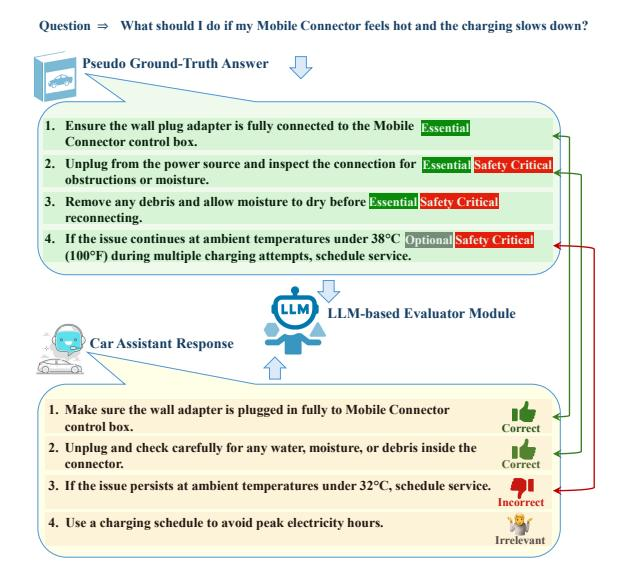
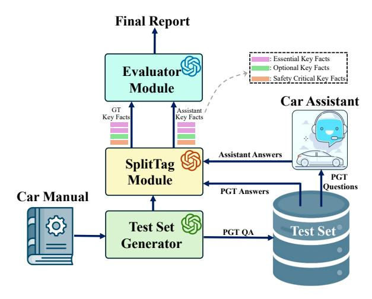
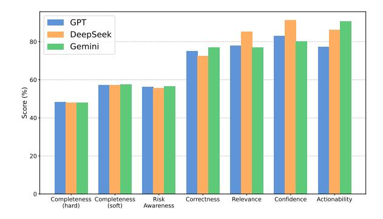
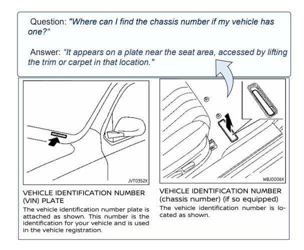
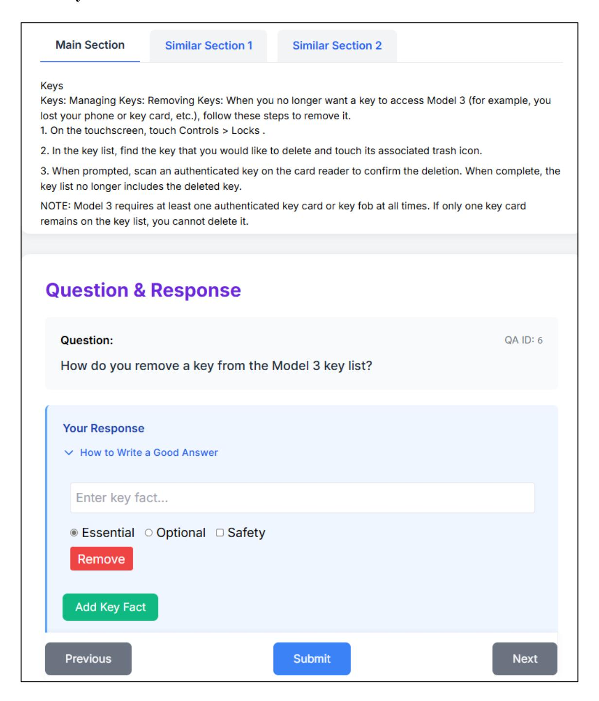
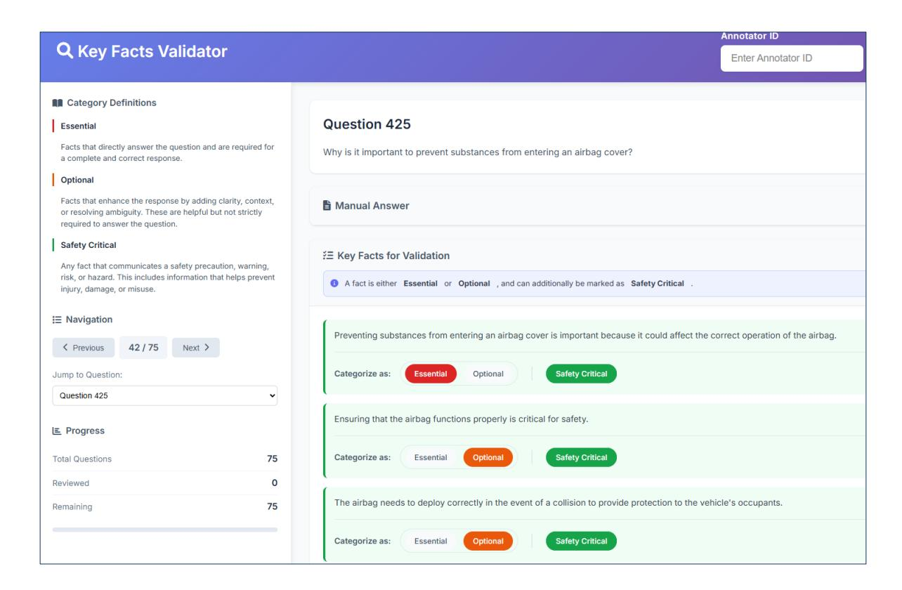
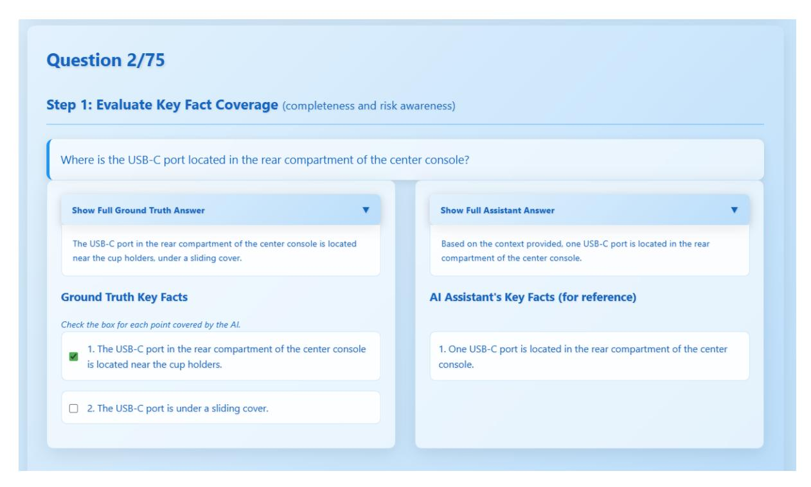
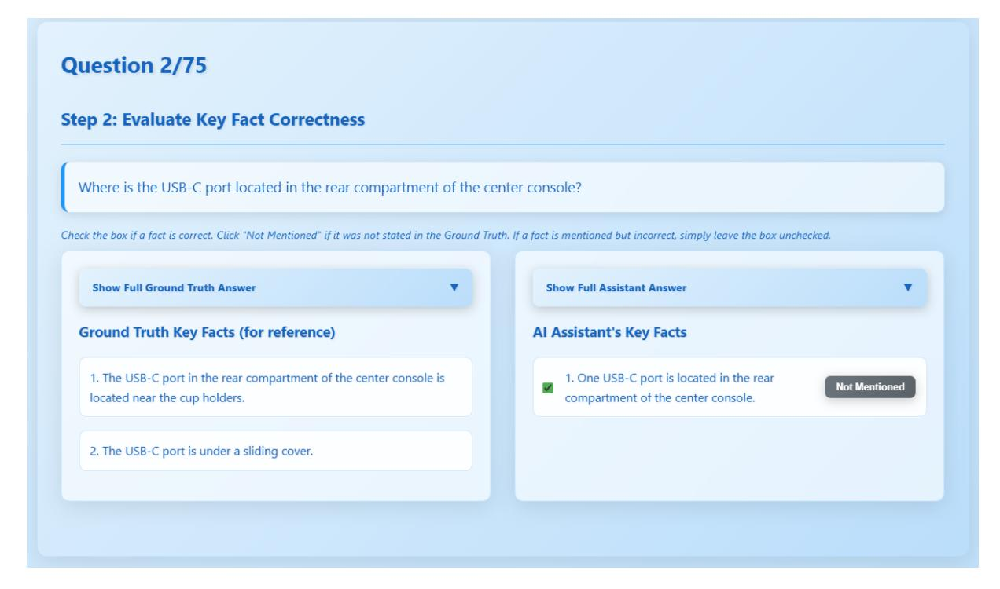

# GEAR: A Scalable and Interpretable Evaluation Framework for RAG-Based Car Assistant Systems

#### Niloufar Beyranvand\*1, Hamidreza Dastmalchi\*1, Aijun An<sup>1</sup> , Heidar Davoudi<sup>2</sup> , Winston Chan<sup>3</sup> , Ron DiCarlantonio<sup>3</sup>

<sup>1</sup>Dept. of Electrical Engineering and Computer Science, York University <sup>2</sup>Faculty of Science, Ontario Tech University 3 iNAGO Co., Toronto, Canada

> 1 [nbeyran@yorku.ca,](mailto:nbeyran@yorku.ca) [hrd@yorku.ca](mailto:hrd@yorku.ca) \*

## Abstract

Large language models (LLMs) increasingly power car assistants, enabling natural language interaction for tasks such as maintenance, troubleshooting, and operational guidance. While retrieval-augmented generation (RAG) improves grounding using vehicle manuals, evaluating response quality remains a key challenge. Traditional metrics like BLEU and ROUGE fail to capture critical aspects such as factual accuracy and information coverage. We propose GEAR, a fully automated, referencebased evaluation framework for car assistant systems. GEAR uses LLMs as evaluators to compare assistant responses against groundtruth counterparts, assessing coverage, correctness, and other dimensions of answer quality. To enable fine-grained evaluation, both responses are decomposed into key facts and labeled as essential, optional, or safety-critical using LLMs. The evaluator then determines which of these facts are correct and covered. Experiments show that GEAR aligns closely with human annotations, offering a scalable and reliable solution for evaluating car assistants.

# 1 Introduction

AI-powered car assistant systems are increasingly being integrated into modern vehicles, e[nabling](#page-7-0) [drivers and pass](#page-7-0)[engers to interact w](#page-7-1)ith their vehicles using natural language interfaces (Riener and Ferscha, 2019; Heck et al., 2020). These assistants are designed to handle a broad range of user queries—from operational guidance and mainten[ance instructions](#page-7-2) [to troubleshooting sup](#page-7-3)port—enhancing [both user convenience and driving](#page-7-4) safety (Xu et al., 2022; Kun and et al., 2020). Systems like IDAS (Hernandez-Salinas et al., 2024) use RAG to deliver voice-driven, context-aware assistance from car manuals. As a joint effort between academics and industry, we developed

<span id="page-0-0"></span>

Figure 1: Given a question, the assistant response is compared to a pseudo ground-truth (PGT) answer, both split into key facts. Ground-truth facts are labeled as essential, optional, and safety-critical. The Evaluator compares assistant and PGT facts to compute metrics: completeness-hard is 2/4 (2 of 4 ground-truth facts covered), completeness-soft is 2/3 (2 of 3 essential facts covered), relevance is 3/4 (3 of 4 assistant facts are relevant), correctness is 2/3 (2 of 3 relevant assistant facts are correct), and risk awareness is 1/3 (1 of 3 safetycritical facts covered).

a commercial LLM-based car assistant using a similar RAG architecture to enhance grounding and response accuracy. However, before realworld deployment, the system must undergo rigorous evaluation to ensure performance and reliability—motivating the creation of a dedicated evaluation framework.

To address the lack of scalable, *human-aligned* evaluation for AI-based car assistants, we propose GEAR (Grounded Evaluation for Automotive Responses)—a reference-based framework tailored to this d[omain. Unlike traditiona](#page-7-5)l metrics such a[s](#page-7-6) [BLEU](#page-7-6) (Papineni et al., 2002a) and ROUGE (Lin, 2004), which rely on surface-level n-gram overlap,

<sup>\*</sup>Equal Contribution.

GEAR evaluates responses at the semantic level, assessing whether the assistant output includes correct information and sufficiently covers the key facts needed to answer the question. It uses LLMs as evaluators to compare assistant responses against automatically generated pseudo ground-truth answers, which are decomposed into labeled key facts (i.e., essential, optional, and safety-critical). GEAR captures multiple dimensions of answer quality, including completeness, correctness, and risk awareness. Key challenges include defining meaningful metrics and ensuring LLM-based evaluations are interpretable and consistent with human judgment.

Our GEAR framework comprises three components—*Test Set Generator*, *SplitTag*, and *Evaluator*—each powered by LLMs. The Test Set Generator creates a high-quality, human-aligned pseudo ground-truth (PGT) set. The SplitTag module decomposes both the assistant response and PGT answer into atomic key facts, which are labeled as essential, optional, or safety-critical, depending on their necessity or safety relevance. The Evaluator then compares the assistant's key facts against the labeled [PG](#page-0-0)T and computes a suite of metrics, each capturing a distinct dimension of answer quality. Figure 1 illustrates how the evaluation metrics are computed based on the labeled key facts. Completeness-soft is the proportion of essential PGT facts covered, and completenesshard is the proportion of all PGT facts covered. Relevance measures how many assistant facts are on-topic, and correctness evaluates how many of those are factually accurate. Risk awareness reflects the coverage of safety-critical facts. Beyond factual and safety aspects, GEAR assesses perceived confidence and actionability. Confidence captures whether the assistant responds clearly or with vague language, while actionability checks if it provides usable guidance—both key concerns from our industry collaborators.

This work makes the following contributions toward robust evaluation of AI-based car assistants: (1) We propose GEAR, a unified LLMbased QA evaluation framework integrating reference generation, metric design, and automated assessment. (2) We develop a semi-automated pipeline to generate high-quality QA pairs from manuals using structural cues, GPT-based question generation. (3) We enable fine-grained, factlevel evaluation by decomposing responses into labeled key facts. (4) We introduce a diverse set of metrics—completeness-soft, completeness-hard, risk awareness, correctness, relevance, actionability, and confidence—capturing both quality and safety. (5) We validate GEAR against human annotations and examine potential evaluator bias.

# 2 Related Work

Evaluating natural language responses from AIpowered car assistants re[quires metrics that go](#page-7-7) beyond su[rface](#page-7-6)-[level](#page-7-6) fluency to assess [factual](#page-7-8) [correctness, proced](#page-7-8)ural accuracy, contextual relevance, and safety-critical content. Traditional NLG metrics such as BLEU (Papineni et al., 2002b), ROUGE (Lin, 2004) and METEOR (Banerjee and Lavie, 2005), though widely used, rely on ngram overlap and fail to capture semantic equivalence, factual soundness, or risk-sensitive omissions. These limitations are particularly problematic in domains like automotive assistance, w[here](#page-7-9) [distinguishin](#page-7-9)g between essential [procedural steps](#page-7-10) and optional information is crucial.

Embedding-based metrics like BERTScore (Zhang et al., 2020) and Mover-Score (Zhao et al., 2019) improve upon and lexical overlap by l[everaging contextu](#page-7-11)al embeddings, [yet still la](#page-7-12)ck explicit mechanisms to assess fine-grained factual accuracy or safety awareness. Probability-based methods like BARTScore (Yuan et al., 2021) and GPTScore (Fu et al., 2023) evaluate text by computing generation likelihoods under LLMs, offering flexibility across evaluation aspects via tailored prompts. However, such methods often rely on opaque model internals (e.g., logits) and are sensitive to prompt phrasing and distributional biases.

More recently, prompt-based evaluation with [LLMs has emerged as a](#page-7-13) [powerful alternative](#page-7-14)[, en](#page-7-15)[abling nuanced assessme](#page-7-15)nt of dimensions like factuality, completeness, and coherence without requiring manual references or task-specific tuning (Chiang and Lee, 2023; Wang et al., 2023; Kocmi and Federmann, 2023)). These approaches are particularly well-suited for domains with limited labeled data and hi[gh domain-specific](#page-7-16) demands, such as automotive QA.

Our framework is most closely related to FACTSCORE (Min et al., 2023), which evaluates long-form outputs via atomic factual units. GEAR builds on this fact-level approach but adapts it to the automotive domain with key innovations: tagging key facts (essential, optional, safety-critical), introducing metrics like actionability and risk-

<span id="page-2-0"></span>

Figure 2: GEAR evaluation framework, highlighting its core modules and their interactions.

awareness, and generating pse[udo-ground truths](#page-7-17) [from car manua](#page-7-18)[ls. We also lever](#page-7-19)age multiple LLM evaluators (GPT-4o, DeepSeek, Gemini) to examine consistency and evaluator bias—an emerging issue in LLM-based evaluation (Lu et al., 2021; Zhou et al., 2023; Li et al., 2023).

# 3 Proposed Evaluation Framework

Evaluating the quality of LLM-powered car assistants remains challen[gin](#page-2-0)g, as existing metrics overlook factual correctness, completeness, and risk awareness. To address this, we present GEAR, a reference-based evaluation framework for AIdriven car assistants (Figure 2). GEAR includes three LLM-based components: the *Test Set Generator* creates diverse PGT QA pairs from car manuals (text and images); the *SplitTag module* decomposes assistant and ground-truth answers into atomic key facts, tagging each ground-truth fact as essential, optional, or safety-critical; and the *Evaluator* compares these key facts across multiple quality dimensions to enable fine-grained, interpretable assessment.

# 3.1 Test Set Generator

A comprehensive and high-quality set of groundtruth QA pairs is essential for any reference-based evaluation framework. These QA pairs serve as the basis for comparison: the questions are posed to the AI-driven car assistant, and the assistant's responses are then evaluated against the corresponding ground-truth answers. To build this reference set, our test set generator incorporates both textbased and image-based QA generation from car

<span id="page-2-1"></span>Table 1: Types of Questions from Manual.

| Question Type                                | Description and Examples                                           |
|----------------------------------------------|--------------------------------------------------------------------|
| Factual Definitions and Specifica<br>tions   | What something is, where it is lo<br>cated, or its specifications. |
| Procedural or Operational                    | How to perform a task with multi<br>ple steps.                     |
| Troubleshooting<br>and<br>Problem<br>Solving | Diagnosing faults or interpreting<br>warnings.                     |
| Safety and Precautions                       | Hazards and critical safety guide<br>lines.                        |
| Maintenance Inquiries                        | Routine checks or acceptable sys<br>tem states.                    |

manuals.

Chunking: We extract text from car manuals in PDF format and split it into semantically coherent chunks for effective QA generation. Since arbitrary splits can fragment key concepts, we leverage the manuals' structured format and formatting cues (e.g., font size, style, indentation, spacing) for accurate segmentation. This ensures each chunk preserves full context, enabling the generation of highquality, well-grounded QA pairs closely aligned with the source content.

Text-Based QA Generation: Each section is passed to a GPT-based Question Generat[or,](#page-8-0) which is prompted to produce a curated set of practical, non-overlapping questions (see Figure 6 in the Appendix for the prompt template). The questions address the needs of both beginner and expert users and span categories suc[h a](#page-2-1)s factual definitions, procedures, troubleshooting, safety, and maintenance, as described in Table 1. Answers are generated in a separate GPT call using an independent prompt. To ensure contextual completeness, we augment the original section by retrieving the t[wo most se](#page-7-20)[mantically](#page-7-20) [relevan](#page-7-20)t chunks based on cosine similarity using SentenceBert embeddings (Reimers and Gurevych, 2019). The question, original section, a[nd](#page-9-0) retrieved chunks are then fed into GPT along with a dedicated answer-generation prompt (see Figure 7 in Appendix for the prompt template), which guides the model to produce responses that align with our evaluation criteria. A sa[mple](#page-17-0) of the generated pseudo ground-truth question, main section, and answer is shown in Figure 20.

Image-Based QA Generation. In addition to text-based QA pairs, we also generate imagegrounded QA pairs. For each section containing images, we provide both the image and the associated section text to the GPT-4o model. The model is prompted to generate QA pairs based on visual content in the image, constrained by the condition that the accompanying tex[t m](#page-10-0)ust imply the question

### <span id="page-3-0"></span>**Key Fact Extraction**

**Instruction:** Break down the following answer into independent, concrete facts only. Exclude general statements, vague summaries, or abstract instructions such as "a specific procedure must be followed." Only include facts that are explicitly stated and are observable, rulebased, or operational. If a list of steps must be done in a specific order, indicate the correct sequence using ordinal words like "First," "Second," "Third," etc.

#### **One-Shot Example:**

#### **Input:**

**{"question":** "How can you enable Auto Shift (Beta) in a Model 3?", **"answer":** "To enable Auto Shift (Beta) in a Model 3, follow these steps:

To enable Auto Shift (Beta), touch 'Controls' on the touchscreen, navigate to 'Pedals & Steering', select 'Auto Shift (Beta)', and choose between 'On' or 'from Park'. For Auto Shift (Beta) to function properly, the driver's seat belt must be fastened, the brake pedal must be pressed, all doors and trunks must be closed, and the drive mode selector on the center console must not be activated."**}**

#### **Expected Output (as a JSON set of key facts):**

```
{"First, touch 'Controls' on the touchscreen.",
"Second, navigate to 'Pedals & Steering'.",
"Third, select 'Auto Shift (Beta)'.",
"Fourth, choose between 'On' or 'from Park'.",
"The driver's seat belt must be fastened.",
"The brake pedal must be pressed.",
"All doors and trunks must be closed.",
"The drive mode selector on the center console must not be activated."}
```

Figure 3: Prompt used by the key fact extraction module.

## <span id="page-3-1"></span>**Key Fact Tagging**

**Instruction:** You are given a user question and a list of key facts that aim to answer it. Your task is to classify each key fact as either:

- **Essential:** if it directly answers the question and is required for a complete and correct response.
- **Optional:** if it enhances the response by adding clarity, context, or resolving ambiguity. Removing it does not harm completeness. Additionally, mark a key fact as **safety-critical** if it explicitly communicates a safety precaution, warning, risk, or hazard.

Mark as safety-critical if the fact:

- Warns of **Guidelines:** danger, injury, or potential damage (e.g., "may overheat", "could cause fire")
- Contains preventive safety instructions (e.g., "Do not use an extension cord")
- Describes safety mechanisms for risk prevention

Do **not** mark as safety-critical if the fact:

- Only describes causes or diagnostics (e.g., "caused by loose wiring") with no risk
- Explains functionality without referencing safety
- Provides general context unrelated to safety

### **Examples:**

**Not Safety-Critical:** "This issue may be caused by the use of an incompatible extension cord." → Optional, Not safety-critical **Safety-Critical:** "Using an incompatible extension cord may overheat and pose a fire hazard." → Optional, Safety-critical

## **Expected Output Format:**

```
{
"question": "QUESTION HERE",
"key_facts": [
{"text": "KEY FACT HERE",
"essentiality": "Essential" | "Optional",
"safety_critical": true | false,
"reasoning": "Briefly explain why this fact is Essential or Optional, and why it is or is not safety-critical."}]
}
```

Figure 4: Prompt used by the key fact tagging module.

(see Figure 8 in the Appendix for the prompt used).

## 3.2 SplitTag Module

The SplitTag module facilitates fine-grained evaluation by decomposing both the pseudo groundtruth answers and the car assistant responses into discrete *key facts* using the GPT-4o model with a dedicated prompt (see Figure 3 for the prompt

template). Each key fact represents an independent, meaningful unit of information relevant to the question.

In addition to splitting, SplitTa[g as](#page-3-0)signs labels to each key fact. Every fact is marked as either *essential* or *optional*, and may also be flagged as *safety-critical* (see Figure 4 for the prompt used to label key facts). The definitions are as follows:

- **Essential:** Facts that directly answer the question and are required for a complete and correct response.
- **Optional:** Facts that enhance the response by adding clarity, context, or resolving ambiguity. These are helpful but not strictly required to answer the question.
- **Safety-Critical:** Any fact that communicates a safety precaution, warning, risk, or hazard. This includes information that helps prevent injury, damage, or misuse.

### 3.3 Evaluation Module

The Evaluation Module assesses the car assistant's response by comparing it to the PGT answer using structured key facts from the SplitTag module. This comparison is performed using LLMs and is conducted at the key fact level, enabling fine-grained and interpretable evaluation across multiple dimensions.

Let  $\mathcal{F}_{GT}$  be the set of all PGT facts,  $\mathcal{F}_{ess} \subset \mathcal{F}_{GT}$  the essential subset, and  $\mathcal{F}_{safe} \subset \mathcal{F}_{GT}$  the safety-critical subset. Let  $\mathcal{F}_A$  be the set of assistant key facts. Define Covered(A,B) as the number of facts in set A that are correctly covered by B,  $Rel(\mathcal{F}_A)$  as the relevant assistant facts, and  $Correct(\cdot)$  as the factually correct subset. The evaluation dimensions and their corresponding definitions are:

• Completeness (Hard): Proportion of all ground-truth key facts—essential and optional—covered by the assistant.

$$Completeness_h = \frac{|Covered(\mathcal{F}_{GT}, \mathcal{F}_A)|}{|\mathcal{F}_{GT}|} \ \, (1)$$

• **Completeness** (**Soft**): Proportion of essential ground-truth key facts covered by the assistant.

$$Completeness_{s} = \frac{|Covered(\mathcal{F}_{ess}, \mathcal{F}_{A})|}{|\mathcal{F}_{ess}|} (2)$$

 Risk Awareness: Proportion of safety-critical ground-truth key facts addressed by the assistant.

$$Risk \ Awareness = \frac{|Covered(\mathcal{F}_{safe}, \mathcal{F}_{A})|}{|\mathcal{F}_{safe}|}$$
(3

• **Correctness:** Proportion of relevant assistant key facts that are factually accurate.

$$Correctness = \frac{|Correct(Rel(\mathcal{F}_A))|}{|Rel(\mathcal{F}_A)|}$$
 (4)

• **Relevance:** Proportion of assistant key facts that directly address the user's question.

$$Relevance = \frac{|Rel(\mathcal{F}_A)|}{|\mathcal{F}_A|} \tag{5}$$

- **Confidence:** 1 if the answer is clear (e.g., "Press the brake pedal fully."); 0 if vague (e.g., "Maybe try pressing the brake.").
- Actionability: 1 if the response gives concrete steps (e.g., "Turn the dial clockwise."); 0 if it avoids guidance (e.g., "This isn't covered in the manual.").

Each metric captures a different aspect of answer quality. Completeness-soft measures coverage of essential facts, while completeness-hard includes both essential and optional ones for fuller coverage. Risk awareness checks for safety-critical content—vital in automotive contexts. Correctness verifies factual accuracy, complementing completeness. Relevance ensures the response stays on-topic, actionability assesses whether it enables user action, and confidence checks for clarity without vague language. Evaluation is done via LLMs prompted with the question, PGT key facts, and assistant key facts. Dedicated prompts are used per metric (see Figure 11, 12, 13, 14, 15 in the Appendix for prompt templates).

## 4 Experiments

We use the proposed framework to evaluate our RAG-based car assistant and compare its results with human judgments to validate its effectiveness.

## 4.1 Implementation Details

Our RAG-based car assistant supports three LLMs—GPT-4o, Gemini, and DeepSeek—with identical preprocessing, chunking, embedding, and retrieval. The only difference lies in the LLM used for generation, enabling fair comparison under consistent conditions. Table 2 details the configuration.

Table 2: Configuration used in our unified RAG-based car assistant pipeline.

| Component            | Configuration                  |
|----------------------|--------------------------------|
| Chunking Method      | Fixed-size with sliding window |
| Chunk Size / Overlap | 128 tokens / 32 tokens         |
| Embedding Model      | Sentence-BERT                  |
| Embedding Dimension  | 768                            |
| Retrieval Engine     | FAISS (cosine similarity)      |
| Top-k Chunks         | 3                              |
| Context Source       | Tesla Model 3 2024 manual      |

We generated 3,202 PGT QA pairs (2,967 text-based and 235 image-based) from the Tesla Model

3 2024 manual. To create a representative evaluation set, we sampled one question per semantic section, yielding 716 text-based and 38 image-based QA pairs. For human annotation, we randomly selected 10% of the full pool—75 QAs.

# 4.2 Alignment of Test Set Generator with Human Annotators

To assess the reliability of our pseudo ground-truth QA pairs, we conducted a human annotation study on a randomly selected 10% subset (75 samples). Using a custom interface (see Figure 16 in the Appendix), three annotators independentl[y an](#page-14-0)swered each question by extracting and labeling key facts according to predefined metrics. We then compared these human-labeled facts to the PGT, computing completeness (soft), risk awareness, and correctness. The reported scores—all above 80%—are averaged across annotators, indicating strong alignment with human judgment and supporting the reliability of the pseudo ground truth for large-scale evaluation.

Table 3: Evaluation of the Test Set Generator by comparing pseudo ground-truth key facts with human-annotated ground truth.

| Completeness Relevance Correctness |      |      |
|------------------------------------|------|------|
| 80.2                               | 85.2 | 91.2 |

# 4.3 Alignment of SplitTag Module with Expert Human Annotator

To evaluate the reliability of the SplitTag module, we conducted a human annotation study on the same 10% QA subset (75 pairs). An automotive expert labeled each key fact as essential or optional and independently marked safety-critical content using a dedicated interface (see Figure 17 in the Appendix). We compared these labels [with](#page-15-0) those from the SplitTag module. As shown in Table 4, SplitTag aligns well with human judgment, achi[ev](#page-5-0)ing F1-scores of 89.2% for essentiality and 80.2% for safety-critical tagging. While precision is high, lower recall for safety-critical labels suggests the model is less conservative than human annotators.

<span id="page-5-0"></span>Table 4: Accuracy, precision, recall, and F1-score of essential/optional and safety-critical label predictions by SplitTag, evaluated against expert annotations.

| Category        | Accuracy | Precision | Recall | F1   |
|-----------------|----------|-----------|--------|------|
| Essentiality    | 87.5     | 96.7      | 82.8   | 89.2 |
| Safety-Critical | 89.3     | 93.6      | 70.2   | 80.2 |

# 4.4 Alignment of Evaluator Module with Human Annotators

To assess how well GEAR's Evaluator aligns with human judgment, we conducted a study on the same 7[5 QA](#page-16-0) pairs from prior annotations. Six human annotators, using a dedicated interface (see Figure 18 in the Appendix), labeled which assistant key facts were covered, correct, or relevant relative to the PGT. From these annotations, we computed five continuous scores—completenesssoft, completeness-hard, risk awareness, correctness, and relevance—and two binary metrics: actionability and confidence. For continuous metrics, scores were averaged per question; for binary metrics, the majority vot[e w](#page-13-1)as used. Annotators showed strong agreement across metrics, as measured by ICC (see Table 8 in the Appendix.). We then compared the human-derived scores to those produced by LLM-based evaluators (GPT-4o, DeepSeek, and Gemini), using Pearson correlation for continuous metrics and classification metrics for the binary ones.

<span id="page-5-1"></span>Table 5: Pearson correlation between averaged human scores and LLM evaluator scores across three models (closer to 1 indicates stronger agreement).

| Metric              | GPT   | DeepSeek | Gemini |
|---------------------|-------|----------|--------|
| Completeness (soft) | 0.912 | 0.903    | 0.860  |
| Completeness (hard) | 0.906 | 0.904    | 0.900  |
| Risk Awareness      | 0.705 | 0.707    | 0.703  |
| Correctness         | 0.757 | 0.762    | 0.775  |
| Relevance           | 0.795 | 0.809    | 0.694  |

Table 5 shows strong alignment for completeness-soft and hard (correlation > 0.9), with moderate agreement for correctness and risk awareness. All metrics are consistent across models except relevance, where Gemini lags behind GPT-4o and DeepSeek. Lower correlation in risk awareness likely stems from fewer safety-critical facts per QA pair, increasing score variability. For the [bin](#page-6-0)ary metrics—confidence and actionability—we used accuracy, precision, recall, and F1-score to compare model predictions against the human majority vote. As shown in Table 6, actionability shows higher recall than precision, suggesting models often over-predict actionability. In contrast, confidence has perfect precision but lower recall, indicating models are cautious, correctly flagging confident responses but missing some identified by humans.

<span id="page-6-0"></span>Table 6: Accuracy, precision, recall, and F1-score of actionability and confidence predictions by different LLMs, evaluated against majority human vote.

| Category      | Metric    | GPT   | DeepSeek | Gemini |
|---------------|-----------|-------|----------|--------|
| Actionability | Accuracy  | 82.7  | 84.0     | 78.7   |
|               | Precision | 86.7  | 85.7     | 79.7   |
|               | Recall    | 91.2  | 94.7     | 96.5   |
|               | F1-Score  | 88.9  | 90.0     | 87.3   |
| Confidence    | Accuracy  | 84.0  | 90.7     | 78.7   |
|               | Precision | 100.0 | 100.0    | 100.0  |
|               | Recall    | 83.3  | 90.3     | 77.8   |
|               | F1-Score  | 90.9  | 94.9     | 87.5   |

## 4.5 Exploring Evaluator Bias

To assess potential evaluator bias when the RAGbased assistant and the LLM-based evaluator belong to the same model family, we evaluated each LLM—GPT-4o, DeepSeek, and Gemini—in both roles. Completeness (soft/hard), correctness, relevance, and risk awareness scores were computed for each pairing. As score distributions were nonnormal, we applied the Kruskal–Wallis test to detect significant differences across evaluators.

We compute p-values by comparing scores assigned to the Gemini-RAG model by the Gemini evaluator (same family) versus those from DeepSeek and GPT-4o evaluators (different families). Table 7 reports the results. Objective metrics like completeness, correctness, and risk awareness showed consistent results across evaluators, with no significant differences (p > 0.8), i[ndi](#page-6-1)cating low sensitivity to the LLM used in the evaluator. In contrast, relevance—a more subjecti[ve m](#page-13-2)etric—sh[ows](#page-13-3) a significant difference when DeepSeek is used as the evaluator, due to its tendency to assign higher scores. This effect stems from evaluator calibration, not model family overlap. Figure 5 illustrates that DeepSeek consistently yields higher average scores. Additional results in Table 9 and Table 10 in the Appendix also confirm that no evaluator systematically favors outputs from its own model family.

Table 7: Kruskal–Wallis p-values comparing Gemini-RAG outputs scored by Gemini (same family) vs. scores from GPT-4o and DeepSeek evaluators (different family).

| Metric              | GPT Evaluator | DeepSeek Evaluator |
|---------------------|---------------|--------------------|
| Completeness (soft) | 0.91          | 0.87               |
| Completeness (hard) | 0.92          | 0.92               |
| Correctness         | 0.40          | 0.17               |
| Relevance           | 0.776         | 0.00               |

<span id="page-6-1"></span>

Figure 5: Evaluation scores of the Gemini-based RAG assistant across different metrics using three LLMs—GPT-4o, DeepSeek, and Gemini—as the Evaluator module.

## 4.6 Analysis of Evaluation Results

We evaluated our Gemini-based RAG assistant using the proposed metrics and three LLMs. As shown in Figure 5, results are broadly consistent across models. Completeness-hard scores are lower than completeness-soft due to stricter coverage requirements. The assistant performs better in correctness, showing included facts are usually accurate, and scores well in relevance, confidence, and actionability—aligning with its goal of providing helpful, focused answers. Scores for completeness, correctness, and risk awareness remain stable across evaluators, while relevance, confidence, and actionability vary more: DeepSeek scores relevance and confidence higher, while Gemini is more generous on actionability. These trends underscore the role of evaluator subjectivity in these metrics.

# 5 Conclusions

We introduced GEAR, a scalable and interpretable evaluation framework for AI car assistants. GEAR uses LLMs to decompose responses into labeled key facts and assess them across diverse metrics—completeness, correctness, relevance, risk awareness, confidence, and actionability—capturing both factual and practical quality. Experiments show strong alignment with human judgment. Looking ahead, we aim to extend GEAR to multi-turn dialogues and explore lightweight evaluators to reduce computational overhead, broadening its applicability beyond the automotive domain.

# Limitations

We acknowledge some limitations of the GEAR framework. While it provides scalable and interpretable evaluation, its reliance on LLMs for key

fact decomposition and scoring can make it computationally expensive. The quality of pseudo groundtruth QA pairs depends on the generation pipeline and may not always match human-authored references. Metrics like actionability and confidence involve prompt-based judgments and may carry some subjectivity. GEAR also focuses on singleturn, reference-based evaluation and does not yet support multi-turn interactions. Moreover, car manuals vary in clarity and style across manufacturers, from dense technical text to diagram-heavy layouts. This variability may modestly affect QA consistency, motivating future work on robustness across documentation formats. In future work, we plan to extend GEAR to handle conversational settings and explore lightweight, domain-adapted student models to reduce inference cost.

## Acknowledgment

<span id="page-7-8"></span>This work was supported by SmartTO (Smart Mobility Applied Research and Testing-Toronto), a part of the Ontario Vehicle Innovation Network (OVIN), and an NSERC Alliance grant from the Natural Sciences and Engineering Research Council (NSERC) of Canada.

## <span id="page-7-13"></span>References

- <span id="page-7-12"></span>Satanjeev Banerjee and Alon Lavie. 2005. Meteor: An automatic metric for mt evaluation with improved correlation with human judgments. In *Proceedings of the acl workshop on intrinsic and extrinsic evaluation measures for machine translation and/or summarization*, pages 65–72.
- <span id="page-7-4"></span><span id="page-7-1"></span>David Cheng-Han Chiang and Hung-yi Lee. 2023. A closer look into using large language models for automatic evaluation. In *Findings of the Association for Computational Linguistics: EMNLP 2023*.
- Jinlan Fu, See-Kiong Ng, Zhengbao Jiang, and Pengfei Liu. 2023. Gptscore: Evaluate as you desire. *arXiv preprint arXiv:2302.04166*.
- <span id="page-7-15"></span>Michael Heck, Philipp Homburg, and Andreas Schmidt. 2020. Voice assistant systems in vehicles: Performance and reliability evaluation. *International Journal of Human-Computer Studies*, 137:102389.
- <span id="page-7-3"></span>Bernardo Hernandez-Salinas, Juan Terven, EA ChaveZ-Urbiola, Diana M Cordova-Esparza, Julio A Romero-Gonzalez, Amadeo Arguelles, and Ilse Cervantes. 2024. Idas: Intelligent driving assistance system using rag. *IEEE Open Journal of Vehicular Technology*.
- <span id="page-7-19"></span>Tom Kocmi and Christian Federmann. 2023. Large language models are state-of-the-art evaluators of translation quality. In *Proceedings of the 24th Annual*

- <span id="page-7-6"></span>*Conference of the European Association for Machine Translation*.
- <span id="page-7-17"></span>Andrew L Kun and et al. 2020. Voice interfaces in the car: Examining driver cognitive load, acceptance, and trust. *ACM Transactions on Computer-Human Interaction (TOCHI)*, 27(2):1–30.
- <span id="page-7-16"></span>Zongjie Li, Chaozheng Wang, Pingchuan Ma, Daoyuan Wu, Shuai Wang, Cuiyun Gao, and Yang Liu. 2023. Split and merge: Aligning position biases in large language model based evaluators. *arXiv preprint arXiv:2310.01432*.
- <span id="page-7-5"></span>Chin-Yew Lin. 2004. Rouge: A package for automatic evaluation of summaries. In *Text summarization branches out*, pages 74–81.
- <span id="page-7-7"></span>Yao Lu, Max Bartolo, Alastair Moore, Sebastian Riedel, and Pontus Stenetorp. 2021. Fantastically ordered prompts and where to find them: Overcoming few-shot prompt order sensitivity. *arXiv preprint arXiv:2104.08786*.
- <span id="page-7-20"></span>Sewon Min, Kalpesh Krishna, Xinxi Lyu, Mike Lewis, Wen-tau Yih, Pang Wei Koh, Mohit Iyyer, Luke Zettlemoyer, and Hannaneh Hajishirzi. 2023. Factscore: Fine-grained atomic evaluation of factual precision in long form text generation. *arXiv preprint arXiv:2305.14251*.
- <span id="page-7-14"></span><span id="page-7-0"></span>Kishore Papineni, Salim Roukos, Todd Ward, and Wei-Jing Zhu. 2002a. Bleu: a method for automatic evaluation of machine translation. In *Proceedings of the 40th Annual Meeting of the Association for Computational Linguistics (ACL 2002)*, pages 311–318.
- <span id="page-7-2"></span>Kishore Papineni, Salim Roukos, Todd Ward, and Wei-Jing Zhu. 2002b. Bleu: a method for automatic evaluation of machine translation. In *Proceedings of the 40th Annual Meeting of the Association for Computational Linguistics*, pages 311–318.
- <span id="page-7-11"></span>Nils Reimers and Iryna Gurevych. 2019. Sentence-bert: Sentence embeddings using siamese bert-networks. *arXiv preprint arXiv:1908.10084*.
- <span id="page-7-9"></span>Andreas Riener and Alois Ferscha. 2019. Natural user interfaces in the car: How to combine touch, voice, and gesture? *IEEE Pervasive Computing*, 18(2):44– 52.
- <span id="page-7-10"></span>Jiaan Wang, Yunlong Liang, Fandong Meng, Haoxiang Shi, Zhixu Li, Jinan Xu, Jianfeng Qu, and Jie Zhou. 2023. Is chatgpt a good nlg evaluator? a preliminary study. In *Proceedings of the 4th New Frontiers in Summarization Workshop*.
- <span id="page-7-18"></span>Jun Xu, Fan Wang, and Shuo Chen. 2022. Automated question-answering for vehicle manuals using nlp and knowledge graphs. *IEEE Transactions on Intelligent Transportation Systems*.
- Weizhe Yuan, Graham Neubig, and Pengfei Liu. 2021. Bartscore: Evaluating generated text as text generation. In *Advances in Neural Information Processing Systems*.

- Tianyi Zhang, Varsha Kishore, Felix Wu, Kilian Q Weinberger, and Yoav Artzi. 2020. Bertscore: Evaluating text generation with bert. In *International Conference on Learning Representations*.
- Wei Zhao, Maxime Peyrard, Fei Liu, Yang Gao, Christian M Meyer, and Steffen Eger. 2019. Moverscore: Text generation evaluating with contextualized embeddings and earth mover distance. *arXiv preprint arXiv:1909.02622*.
- <span id="page-8-0"></span>Chunting Zhou, Pengfei Liu, Puxin Xu, Srinivasan Iyer, Jiao Sun, Yuning Mao, Xuezhe Ma, Avia Efrat, Ping Yu, Lili Yu, and 1 others. 2023. Lima: Less is more for alignment. *Advances in Neural Information Processing Systems*, 36:55006–55021.

# A Prompts for Test Set Generation

### **Text-Based Question Generation Prompt**

**Instruction:** You are an expert at generating high-quality, diverse, and practical questions from technical documentation.

### **Task:**

- Given the provided content below, generate a carefully selected set of practical, non-overlapping questions that reflect the most relevant and useful information for real-world users.
- Include only the most practically relevant questions that could reasonably be asked by either beginner or expert drivers. Avoid covering trivial variations or rarely relevant edge cases.
- Only include questions that are clearly distinct in focus and intent. Each question must address a unique aspect of the content—avoid questions that are conceptually similar or have overlapping answers.
- Cover all significant and distinct concepts, features, warnings, procedures, or behaviors described in the content. You do not need to generate a question for every sentence—focus instead on what's most important, safety-critical, or commonly asked.

#### **QUESTION TYPES AND DEFINITIONS:**

- Factual Definitions and Specifications:
  - Questions about what something is, where it is located, or specific technical specs.
  - Examples: "What is ABS?", "Where is the odometer located?", "What is the top speed of this vehicle?"
- Procedural or Operational Questions:
  - Questions asking how to perform a task or operate a feature.
  - Examples: "How do I pair my phone?", "How to activate autopilot?"
  - Only generate a procedural question if the answer explicitly contains several distinct procedural steps.

Do not generate procedural questions if the answer does not contain several distinct steps.

- Troubleshooting and Problem-Solving:
  - Questions diagnosing issues or warning lights.
  - Examples: "Why is my car not starting?", "What should I do if the airbag light is on?"
- Safety and Precautions:
  - Questions about hazards, warnings, or safety procedures.
  - Examples: "Is it safe to jump-start the car?", "When should I disable the airbag?"
- Maintenance and State Inquiries:
  - Questions related to upkeep, checks, or recommended intervals.
  - Examples: "How often should I check tire pressure?", "What is the recommended battery level for long trips?"

## **Rules:**

- Only generate questions that can be answered using the provided content.
- Avoid generating multiple questions that would result in similar or overlapping answers.
- Prioritize distinctiveness, relevance, and user practicality over quantity.
- Do not miss any safety-critical or risk awareness questions.

**OUTPUT FORMAT:** Return a JSON array of objects. Each object should contain 'question' (string),'question\_type' (string), and 'user\_type' (string).

## **Content:**

<main section>

<span id="page-9-0"></span>Figure 6: Prompt used to generate questions from sections of car manuals.

Figure 6 shows the prompt used to automatically generate realistic, diverse, and practically relevant user questions from sections of car manuals. It is designed for use with a large language model (GPT-4o) and includes detailed instructions to guide the model toward producing high-quality questions that reflect actual user needs.

The prompt begins by framing the model as an expert in question generation and instructs it to create questions based on the provided manual content. It emphasizes the importance of focusing on questions that are relevant to real-world use, avoiding trivial or overlapping questions, and ensuring coverage of all distinct and significant concepts, including safety-critical information.

The prompt enforces structure by defining clear question categories—factual, procedural, troubleshooting, safety, and maintenance—and setting rules to avoid redundancy. It also instructs the model to output questions in a structured JSON format, labeled by type and user level for easy parsing and downstream use.

The prompt illustrated in Figure 7 is designed to generate accurate and informative answers to

## **Text-Based Answer Generation Prompt**

**Instruction:** You are an expert at answering questions from technical documentation. Your task is to answer the given question using the main section and the two most relevant related sections provided below.

#### **QUESTION:**

<question>

### **MAIN SECTION:**

<main\_section>

#### **RELEVANT SECTION 1:**

<relevant\_section\_1>

### **RELEVANT SECTION 2:**

<relevant\_section\_2>

#### **TASK:**

Generate a question-answer pair ONLY if the question cannot be answered by the text alone and requires the image to answer—such as the location of one component relative to another, the visual description of an icon, or any question that cannot be generated without the image. The answer should use both the image and the provided main section text for the most complete and accurate response.

### **RULES:**

- Generate the answer using the main section, and use the other two relevant sections to complete the answer if they help make it as accurate, complete, relevant, confident, and actionable as possible, according to the definitions below.
- If applicable, the answer must include all risk awareness, safety-critical, and caution points.
- Include risk awareness, cautionary, or safety-critical points only if they are directly relevant to the question's scope and substance.
- Do not use information not present in the provided sections using internal knowledge.
- The answer must include only the necessary key points to answer the question concisely. Any additional parts that do not answer the question directly should not be included, except for safety-critical points which must be very concise and directly relevant to the question.
- Do not refer to images, figures, or visuals in the answer (e.g., avoid phrases like "as shown in the image" or "see the figure above").

#### **DEFINITIONS:**

- **Correctness:** Measures factual correctness of an answer with respect to the content.
- <span id="page-10-0"></span>• **Completeness:** Measures whether the answer covers all necessary and expected information.
- **Relevance:** Measures how well the answer aligns with the question and avoids unrelated information.
- **Confidence:** Reflects certainty, clarity, and professionalism in tone.
- **Actionability:** Indicates whether the answer enables the user to act or understand something concrete.
- **Risk awareness:** Measures how well the answer reflects safety-critical or cautionary content from the source.

### **OUTPUT FORMAT:**

Return a JSON object with 'question', 'answer', and 'user\_type' (either 'beginner' or 'expert').

Figure 7: Prompt template used for answer generation in text-based QA pairs.

user questions based on textual content extracted from car manuals. It provides the model with three sections: the main section, which contains the core content, which is the most relevant to the question, and two relevant sections that may offer supporting information. The prompt instructs the model to generate an answer using the main section as the primary source, supplementing it with relevant facts from the other sections if they enhance the response's clarity, completeness, or usefulness.

The generated answer is expected to meet several qualitative criteria: it should be factually correct (correctness), cover all necessary aspects of the question (completeness), stay focused on the question topic (relevance), be written in a confident and professional tone (confidence), and offer

actionable or informative insights (actionability). Additionally, if the content includes safety warnings or risk-related information directly relevant to the question, such risk awareness must be incorporated concisely. The prompt strictly prohibits the use of external knowledge or references to visual elements and ensures that the response remains concise, free of redundant or off-topic content, and directly useful to drivers seeking information from the manual.

## **Image-Based Question-Answer Generation Prompt**

**Instruction:** You are an expert at generating question-answer pairs from images in technical car manuals.

**TASK:** Generate a question-answer pair ONLY if the question cannot be answered by the text alone and requires the image to answer—such as the location of one component relative to another, the visual description of an icon, or any question that cannot be generated without the image. The answer should use both the image and the provided main section text for the most complete and accurate response.

**IMPORTANT:** For images containing numbered items or components:

- Only generate questions about numbered items if the answer is CLEARLY OBVIOUS by examining the visual layout and cross-referencing with the text content.
- If there is any ambiguity about what a number represents or its location, do NOT generate a question about that numbered item.

### **TYPES OF IMAGE-BASED QUESTIONS AND DEFINITIONS:**

- **● Visual Recognition Questions:**
  - Identify dashboard symbols, warning lights, or icons.
  - Example: "What does the red triangle with an exclamation mark indicate?"
- **● Location and Component Questions:**
  - Questions about location of specific parts or their relation to other components.
  - Example: "Where is the fuse box located in relation to the battery?"

#### **IMAGE-BASED Q&A REQUIREMENTS:**

- Generate a Q&A pair only if either the question or answer requires the image (not just the text).
- Do not generate Q&A pairs if both the question and answer can be derived from the text alone.
- Do not refer to diagram numbers (e.g., "number 7")—use textual names instead.
- Do not refer to figures or visuals explicitly in the answer.
- Use spatial descriptions like "left of the center console" or "beneath the glove box."
- Skip Q&As if the images are irrelevant to the provided section.

**OUTPUT FORMAT:** Return a JSON object with a single key "image", mapping to an array of objects with"question", "answer", and "user\_type" (either "beginner" or "expert"). If no valid image-based questions can be generated, return .

MAIN SECTION: <main section>

<span id="page-11-0"></span>Figure 8: Prompt for generating question-answer pairs from image-based car manual sections



Figure 9: Examples of image-aware question–answer pairs generated from a diagram in the 2024 Ariya Nissan Owner's manual, used under fair use for research and educational purposes.

<span id="page-11-1"></span>The Image-Based QA Generation Prompt (Figure 8 ) creates question-answer pairs only when visual information from car manual diagrams is essential—such as recognizing symbols, describing layouts, or locating components. It skips cases where text alone suffices, avoids figure labels, and uses natural spatial language. Answers

Question: "*What does the icon showing a car with squiggly lines behind it, illuminated in amber, indicate?"*

Answer: "*This amber icon, which depicts a car with curving skid marks beneath it, indicates that the electronic stability control system is actively working to minimize wheel spin by adjusting brake pressure and motor power. If the icon remains lit, it signals a fault in the system, and you should immediately contact Tesla."*


Figure 10: Example of an image-aware question-answer pair from a diagram in the 2024+ Tesla Model 3 Owner's Manual (software version 2025.2, North America), used under fair use for research and educational purposes. The question is based on the visual appearance of the dashboard icon, while the answer is fully grounded in the accompanying textual description.

are grounded in both the image and the related text. Figure 9 shows a location-based question requiring visual reference, while Figure 10 presents a descriptive icon question grounded in the image.

# B Prompts for Evaluation Module

### **Completeness Evaluation Prompt**

**Instruction:** You are an expert evaluator. Rate the assistant's answer for completeness using the provided key facts from the ground truth and the assistant's response.

**Metric Definition:** Completeness measures how many of the ground truth key facts are covered by the assistant's key facts. A ground truth fact is considered covered if it is present (i.e., semantically equivalent) in the assistant's list. Each fact is scored as:

- Covered → count as 1
- Not covered → count as 0

### No partial credit is allowed.

### **Evaluation Steps:**

- 1. Review the list of ground truth key facts.
- 2. Review the assistant's key facts.
- 3. For each ground truth fact, determine if it is semantically covered by any assistant fact.
- 4. Do not penalize for inaccuracies or irrelevant additions.

**Scoring Instructions:** List each ground truth key fact index and whether it is covered:

- The index of the ground truth key fact
- Whether it is covered: yes or no

```
FORMAT: JSON
```

```
{
 "0": {"covered": "yes"},
 "1": {"covered": "no"},
 "2": {"covered": "yes"}
}
```

Figure 11: Prompt used to evaluate the completeness of assistant responses by assessing coverage of pseudo ground-truth key facts.

## **Correctness Evaluation Prompt**

**Instruction:** You are an expert evaluator. Rate the assistant's answer for correctness, using the provided sets of key facts from the ground truth and the assistant's response.

**Metric Definition:** Correctness measures the factual correctness of an assistant's answer with respect to the ground truth.

### **Evaluation Steps:**

- 1. Review the provided list of ground truth key facts.
- 2. Review the provided list of assistant key facts.
- 3. For each assistant key fact:
  - a. First, check whether this key fact is mentioned in the ground truth key facts (i.e., is semantically equivalent to any ground truth key fact).
  - b. If it is not mentioned in the ground truth, ignore it and mark it as 'not mentioned' in your output.
  - c. If it is mentioned, check whether it is factually correct (semantically equivalent and accurate with respect to the ground truth fact). If it is correct, label it as 'correct'; if it is incorrect, label it as 'incorrect'

At the end, for each assistant key fact, explicitly state:

- The index of the assistant key fact
- Whether it is 'correct', 'incorrect', or 'not mentioned'

### **Scoring Rules:**

- Only consider facts present in the assistant's answer.
- Be strict about factual correctness.

### **FORMAT: JSON**

```
{
 "0": {"correctness": "correct"},
 "1": {"correctness": "incorrect"},
 "2": {"correctness": "not mentioned"}
}
```

Figure 12: Prompt used to evaluate the correctness of assistant answers based on factual agreement.

# **Relevance Evaluation Prompt**

**Instruction:** You are an expert evaluator. Rate the assistant's answer for **relevance**.

**Metric Definition:** Relevance measures how well the assistant's answer stays focused on the user's question and avoids introducing unrelated or off-topic content. It does not assess correctness or completeness.

Relevance is judged by comparing each key fact in the assistant's answer to the question. Key facts that are:

- On-topic and responsive →Relevant (1)
- Off-topic or unrelated → Not Relevant (0)

No partial credit is allowed.

### **Evaluation Steps:**

- Read the question to understand what it is asking.
- Review each assistant key fact.
- Decide whether each fact is relevant (i.e., directly addresses the question).

### **Scoring Notes:**

- Ignore correctness a fact can be wrong but still relevant.
- Factually incorrect but on-topic facts = Relevant.
- Factually correct but unrelated facts = Not Relevant.

#### **Output Format:**

```
{
 "0": {"relevant": "yes"},
 "1": {"relevant": "no"},
 "2": {"relevant": "yes"}
}
```

Figure 13: Prompt used to evaluate how relevant assistant answers are to the original user question.

## **Confidence Evaluation Prompt**

**Instruction:** You are an expert evaluator. Rate the assistant's answer for confidence.

**Metric Definition:** Confidence measures whether the answer is written with a tone that conveys certainty, clarity, and professionalism.

## Check for:

- Direct statements
- Absence of hedging language (e.g., "might", "perhaps")
- Consistent, formal tone and phrasing

The [sco](#page-13-1)re should reflect how confidently the answer is written—regardless of its factual correctness or completeness.

### **Evaluation Steps:**

- Read the user question and the assistant's response.
- Judge whether the assistant's tone conveys confidence
- If it does, label it as "yes"; otherwise, label it as "no".

### <span id="page-13-1"></span>**Output Format:**

```
{
 "confident": "yes"
}
```

<span id="page-13-3"></span>Figure 14: Prompt used to evaluate the perceived confidence of the assistant's response.

## **Actionability Evaluation Prompt**

**Instruction:** You are an expert evaluator. Rate the assistant's answer for actionability.Metric Definition: An answer is actionable if it enables the user to take a concrete next step, complete a

task, or meaningfully advance their understanding.

#### **Examples of Actionability:**

- Clear instructions or procedures
- Recommendations or warnings
- Helpful and concrete next steps
- Clarifying insights that meaningfully inform the user's next action

Answers that simply admit lack of knowledge (e.g., "I don't know") may be factually correct, but are not actionable.

#### **Evaluation Steps:**

- Read the user question and assistant's answer.
- Determine if the answer enables meaningful action or understanding.
- If so, label as "yes"; otherwise, label as "no".

```
Output Format:
```

```
{
 "actionable": "yes"
}
```

Figure 15: Prompt for binary actionability evaluation. Returns yes if actionable, no if not.

# C Measuring Agreement Over Human Annotations

This section presents an analysis of inter-annotator agreement to assess the consistency of human judgments across evaluation metrics. Using the 75 QA pairs annotated by six human evaluators, we compute the intraclass correlation coefficient (ICC(3,1)) for each of the five continuous metrics: completeness-soft, completeness-hard, risk awareness, correctness, and relevance. As shown in Table 8, agreement is excellent for completeness metrics (ICC > 0.83), good for risk awareness and correctness, and fair for relevance, which is inherently more subjective. These results validate the reliability of human annotations used for benchmarking LLM-based evaluations.

Table 8: Inter-annotator agreement measured by ICC(3,1) for each evaluation metric. Agreement levels are based on standard thresholds: ICC > 0.75 indicates excellent, 0.60–0.75 good, and 0.40–0.60 fair agreement

<span id="page-14-0"></span>

| Metric              | ICC(3,1) | Agreement |
|---------------------|----------|-----------|
| Completeness (Soft) | 0.831    | Excellent |
| Completeness (Hard) | 0.848    | Excellent |
| Risk Awareness      | 0.734    | Good      |
| Correctness         | 0.739    | Good      |
| Relevance           | 0.553    | Fair      |

## D Exploring Evaluator Bias

Table 9: Kruskal–Wallis Test p-Values for Differences Between DeepSeek and Other Evaluators (GPT, Gemini) on DeepSeek-RAG Outputs

| Model             | GPT Evaluator | Gemini Evaluator |
|-------------------|---------------|------------------|
| Correctness       | 0.58          | 0.26             |
| Relevance         | 0.00          | 0.00             |
| Completeness-Hard | 0.88          | 0.97             |
| Completeness-Soft | 0.86          | 0.88             |

Table 10: Kruskal–Wallis Test p-Values for Differences Between DeepSeek and Other Evaluators (DeepSeek, Gemini) on GPT Outputs

| Model             | Gemini Evaluator | Deepseek Evaluator |
|-------------------|------------------|--------------------|
| Correctness       | 0.334            | 0.596              |
| Relevance         | 0.87             | 0.00               |
| Completeness-Hard | 0.956            | 0.869              |
| Completeness-Soft | 0.774            | 0.959              |

# E GT Key Fact Generation Interface



<span id="page-15-0"></span>Figure 16: Screenshot of the annotation interface where annotators generate ground-truth key facts, categorizing each as essential, optional, or safety-critical.

# F Expert Key Fact Annotation Interface



<span id="page-16-0"></span>Figure 17: Screenshot of the annotation interface used by the automotive domain expert to label key facts as Essential, Optional, and Safety-Critical.

To assess the reliability of our automatic key fact tagging system, we conducted a human annotation study on a subset of the test set. Specifically, 10% of the QA pairs were randomly selected, resulting in 75 instances for expert annotation. For each QA pair, the expert was presented with the question and its associated key facts, which had been automatically extracted from the ground-truth answer. The expert, who has extensive domain knowledge in the automotive field, was instructed to label each key fact as either Essential or Optional based on whether it was required to fully and correctly answer the question. Additionally, the expert could mark any key fact as Safety-Critical if it explicitly conveyed a safety warning, precaution, or risk-related instruction. The annotation interface was designed to support this dual-labeling process with clear instructions and category definitions.

We used a single expert annotator for this task to ensure consistency and domain-informed judgment. Given the annotator's strong familiarity with automotive technical documentation and safety stan-

dards, we considered their labeling sufficiently reliable for the purposes of evaluation. Expert annotation is particularly well-suited for this task, where nuanced distinctions between essential and optional information—and especially the identification of safety-critical content—require specialized knowledge.

# G Assistant Key Fact Evaluation Interface



Figure 18: Screenshot of the expert annotation interface for evaluating completeness. The annotator selects which pseudo ground-truth key facts are semantically covered by the assistant's response.

<span id="page-17-0"></span>

Figure 19: Screenshot of the expert annotation interface for evaluating correctness. The annotator is guided to identify which assistant key facts are factually correct based on the pseudo ground-truth key facts.

## H Pseudo Ground-Truth Sample

### **Pseudo Ground-Truth Sample**

### **Main Section:**

Doors: Using Exterior Door Handles: Use your thumb to push the wide part of the door handle. The handle pivots toward you, and you can open the door by pulling the handle or pulling the edge of the door. The handle retracts automatically. When a door or trunk is open, the touchscreen displays the Door Open indicator light.

NOTE: See Cold Weather Best Practices on page 149 to ensure door handles function properly in cold weather.

WARNING: While using the door handle, take care to avoid allowing fingers, jewelry, acrylic nails, etc. from being pinched by the door or door handle mechanism. Failure to do so may result in damage or injury.

CAUTION: Slamming or forcing closure (including the doors, rear trunk, or front trunk) can result in damage not covered under warranty

### **Generated Question:**

How should you use the exterior door handle to open the door?

### **Generated Answer:**

To open the door using the exterior door handle, use your thumb to push the wide part of the handle. The handle will pivot toward you, allowing you to pull the handle or the edge of the door to open it. The handle retracts automatically. Be cautious to avoid pinching fingers, jewelry, or acrylic nails in the door or handle mechanism, as this may cause damage or injury.

Figure 20: A pseudo ground-truth question–answer pair generated by the test generator.