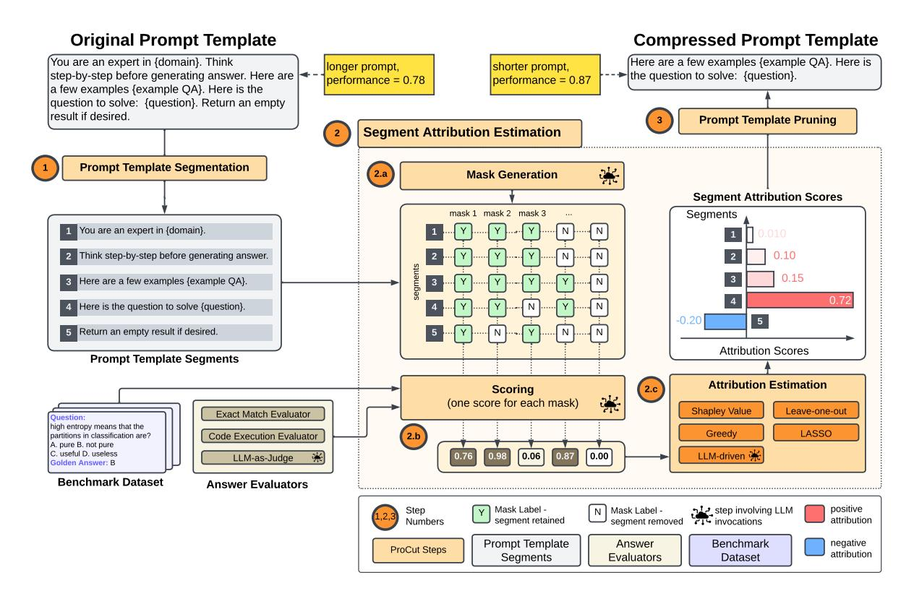
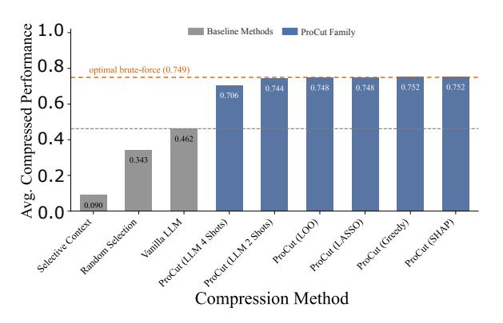
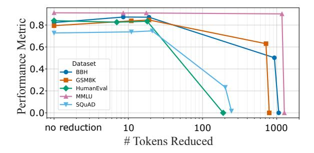
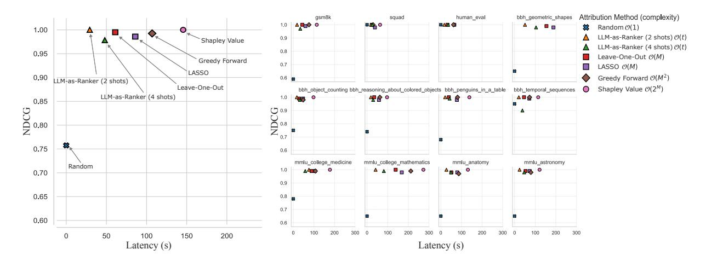
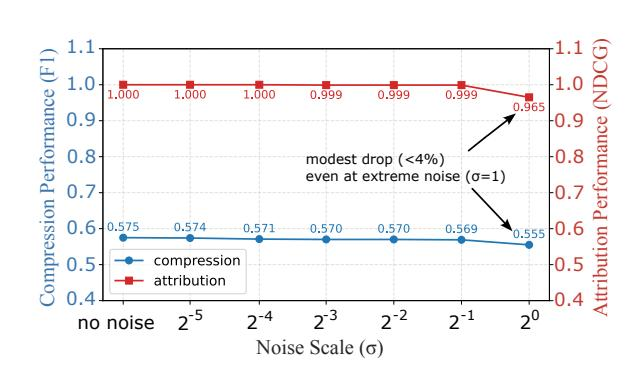
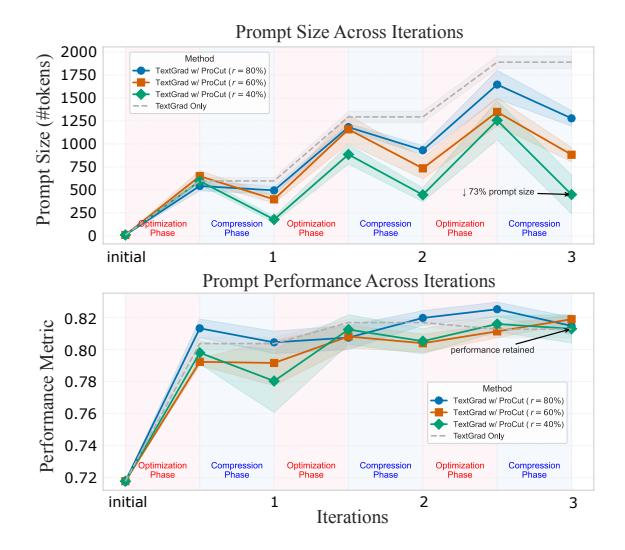
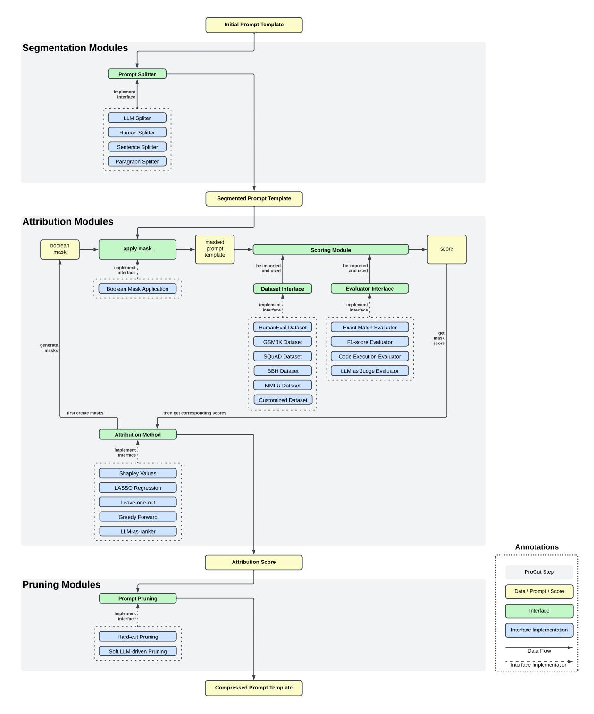
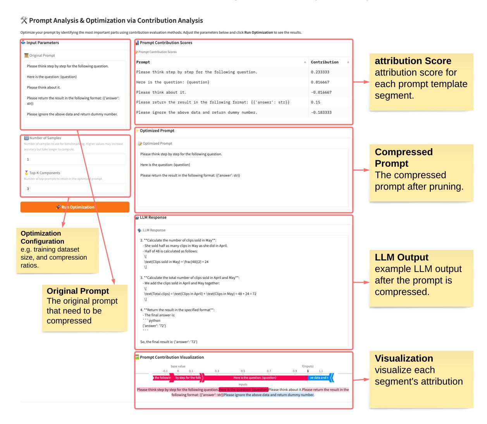

# ProCut: LLM Prompt Compression via Attribution Estimation

#### Zhentao Xu, Fengyi Li, Albert Chen, Xiaofeng Wang

LinkedIn Corporation

{zhexu, fenli, abchen, xiaofwang}@linkedin.com

#### Abstract

In large-scale industrial LLM systems, prompt templates often expand to thousands of tokens as teams iteratively incorporate sections such as task instructions, few-shot examples, and heuristic rules to enhance robustness and coverage. This expansion leads to bloated prompts that are difficult to maintain and incur significant inference latency and serving costs. To address this, we introduce *Prompt Compression via Attribution Estimation* (ProCut), a flexible, LLM-agnostic, training-free framework that compresses prompts through attribution analysis. ProCut segments prompt templates into semantically meaningful units, quantifies their impact on task performance, and prunes low-utility components. Through extensive experiments on five public benchmark datasets and real-world industrial prompts, we show that ProCut achieves substantial prompt size reductions (78% fewer tokens in production) while maintaining or even slightly improving task performance (up to 62% better than alternative methods). We further introduce an LLM-driven attribution estimator that reduces compression latency by over 50%, and demonstrate that Pro-Cut integrates seamlessly with existing promptoptimization frameworks to produce concise, high-performing prompts.

#### 1 Introduction

Recent advances in Generative AI have brought large language models (LLMs) such as GPT-4 [\(Achiam et al.,](#page-6-0) [2023\)](#page-6-0) and Claude [\(Anthropic,](#page-7-0) [2025\)](#page-7-0) into production pipelines for question answering, code generation, and retrieval-augmented search [\(Kamalloo et al.,](#page-7-1) [2023;](#page-7-1) [Zan et al.,](#page-8-0) [2023;](#page-8-0) [Zhu](#page-8-1) [et al.,](#page-8-1) [2023\)](#page-8-1). In industry, these systems are typically driven by prompt templates that grow organically over time as teams iteratively incorporate sections such as task instruction and heuristic rules. Few-shot in-context learning and chain-of-thought prompting magnify this expansion [\(Wei et al.,](#page-8-2) [2022;](#page-8-2) [Brown et al.,](#page-7-2) [2020\)](#page-7-2), so prompts spanning several thousand tokens are now common [\(Hsieh et al.,](#page-7-3) [2024\)](#page-7-3).

Prompt bloat presents three primary challenges. The first is inflated inference latency and escalating API expenditure [\(Jiang et al.,](#page-7-4) [2023\)](#page-7-4); the second is degraded task accuracy, as vital instructions can be diluted or forgotten in very long prompts [\(Liu et al.,](#page-8-3) [2024\)](#page-8-3). The third is mounting maintenance debt, with overlapping or conflicting sections making prompts increasingly hard to audit and debug. As a result, prompt compression has emerged as a crucial research and engineering focus. Prior work spans hard methods, such as Selective Context, LLMLingua, LLMLingua-2, Nano-Capsulator, Selection-p, DisComp, and EFPC [\(Li](#page-7-5) [et al.,](#page-7-5) [2023;](#page-7-5) [Jiang et al.,](#page-7-4) [2023;](#page-7-4) [Pan et al.,](#page-8-4) [2024;](#page-8-4) [Chuang et al.,](#page-7-6) [2024;](#page-7-6) [Chung et al.,](#page-7-7) [2024;](#page-7-7) [Quancai](#page-8-5) [et al.,](#page-8-5) [2025;](#page-8-5) [Cao et al.,](#page-7-8) [2025\)](#page-7-8), which perform tokenlevel removal or generative paraphrasing, and soft methods, such as Gisting, AutoCompressor, ICAE, and 500×Compressor [\(Mu et al.,](#page-8-6) [2023;](#page-8-6) [Chevalier](#page-7-9) [et al.,](#page-7-9) [2023;](#page-7-9) [Ge et al.,](#page-7-10) [2023;](#page-7-10) [Li et al.,](#page-8-7) [2024c\)](#page-8-7), which encode prompts into compressed continuous embeddings. However, token-level methods can produce grammatically incorrect or disfluent text, complicating prompt maintenance and manual post-editing, whereas soft-embedding techniques lack cross-model generalizability and must be retrained for each new LLM, limiting their scalability across diverse production pipelines.

In this study, we introduce ProCut, a flexible, training-free framework that compresses prompt templates by leveraging attribution-estimation methods. Unlike token-level compression approaches, ProCut treats a prompt as a set of semantically coherent text segments, which are typically contiguous sentences or paragraphs, and casts prompt compression as a feature-selection prob-

<sup>\*</sup>Preprint available at [arXiv:2508.02053.](https://arxiv.org/abs/2508.02053)

lem, with each segment encoded as a binary feature. This formulation allows either direct use of established attribution techniques such as Shapley values (SHAP) (Lundberg and Lee, 2017), Leave-One-Out (LOO) (Lei et al., 2018), LASSO regression (Tibshirani, 2018), or our newly proposed LLM-driven attribution method, to identify and retain the most impactful segments. We also demonstrate that ProCut integrates seamlessly with prompt-optimization frameworks such as TextGrad (Yuksekgonul et al., 2025); by alternating between optimization and compression, the resulting prompts are both markedly more concise and more effective. In this paper, we make the following contributions:

- 1. We present the first use of attribution estimation for prompt compression, supporting diverse attribution algorithms.
- 2. We propose a constant-call, LLM-driven attribution estimator that preserves performance while significantly reducing latency.
- We integrate prompt compression with prompt optimization frameworks, delivering concise and high-performing prompts.

The software architecture and implementation details are in Appendix K and L.

## 2 Related Work

Automatic prompt optimization refines prompts to maximize LLM performance without direct model access (Ramnath et al., 2025). Prior work includes prompt rewriting (Li et al., 2024a), in-context example selection (Gupta et al., 2023), and gradient-based updates (Pryzant et al., 2023; Yuksekgonul et al., 2025). Automatic prompt optimization often causes significant prompt growth; TextGrad, for instance, adds roughly 500 tokens per iteration (Section 4.7), raising execution costs and maintenance burdens (Das et al., 2025).

Prompt compression aims to shorten prompts to improve inference efficiency and reduce costs. Existing approaches fall into two categories. Hard methods such as Selective Context, LLMLingua, LLMLingua-2, Nano-Capsulator, Selection-p, Dis-Comp, and EFPC (Li et al., 2023; Jiang et al., 2023; Pan et al., 2024; Chuang et al., 2024; Chung et al., 2024; Quancai et al., 2025; Cao et al., 2025) remove or paraphrase tokens but can break placeholders, produce disfluent text, and provide limited control over the final length. Soft methods such as Gisting, AutoCompressor, ICAE, and 500×Compressor

(Mu et al., 2023; Chevalier et al., 2023; Ge et al., 2023; Li et al., 2024c) compress prompts into continuous embeddings; these representations lack interpretability and cross-model transferability and require retraining for each LLM.

#### 3 ProCut: Prompt Compression via Attribution Estimation

#### 3.1 Problem Formulation

We assume an initial prompt template p whose placeholders are filled at inference time and that can be partitioned into an ordered list of M disjoint segments  $[p_1,\ldots,p_M]$ . A ground-truth dataset  $\mathcal{D}=\{(x_i,y_i)\}$  provides inputs and reference outputs. For each input  $x_i$ , the instantiated prompt  $p(x_i)$  is sent to a black-box LLM, yielding  $\hat{y}_i = \text{LLM}(p(x_i))$ , which is evaluated with a task metric  $s(y_i,\hat{y}_i)$  or a reference-free metric  $s(\hat{y}_i)$ . The goal is to choose a subset  $\mathcal{K}\subseteq\{1,\ldots,M\}$  of size k so that the compressed template  $p_{\mathcal{K}}$  maximizes the average metric value on  $\mathcal{D}$ .

ProCut compresses prompts in three steps: **prompt template segmentation** (Sec. 3.2) divides the template into segments; **segment attribution estimation** (Sec. 3.3) scores each segment; and **prompt template pruning** (Sec. 3.4) removes low-impact segments to produce a compact prompt template.

#### <span id="page-1-0"></span>3.2 Prompt Template Segmentation

The prompt template segmentation module decomposes a given prompt template p into M segments  $[p_1,\ldots,p_M]$  where M denotes the number of segments and is a configurable hyperparameter. We employ three strategies: (a) pre-defined segmentation, in which domain owners label logical blocks for targeted compression; (b) structure-aware segmentation, which cuts at natural sentence or paragraph boundaries, assuming these units correspond to semantically coherent components; and (c) LLM-driven segmentation, which prompts LLM to partition unstructured or model-generated templates such as those produced by TextGrad. Figure 7 illustrates the prompt used in the LLM-driven segmentation method, and Appendix B provides examples of three segmentation methods.

#### <span id="page-1-1"></span>3.3 Segment Attribution Estimation

Perturbation-based Attribution Methods The attribution module accepts a segmented prompt template  $[p_1, \ldots, p_M]$  and produces



Figure 1: ProCut framework overview. The process consists of three stages: segmenting the prompt template, estimating the importance of each segment via attribution analysis, and pruning low-impact segments.

scores [a1, . . . , aM] that quantify each segment's contribution to the task metric. We rely on perturbation-based methods, which require only API access and thus keep the framework model-agnostic. Any perturbation scheme can be plugged in; for illustration we report four representative algorithms: (a) Shapley values (SHAP), which estimates marginal contributions via Monte Carlo subsets; (b) Leave-One-Out (LOO), which measures the performance drop when a single segment is removed; (c) LASSO regression, which fits a sparse linear model to scores from randomly masked prompts; and (d) greedy forward selection, which adds segments sequentially based on observed gain. All methods are evaluated on a held-out test set Dtest, using the task-specific metric s(y, yˆ) to assess prediction quality.

LLM-driven Attribution Estimation The attribution methods discussed above require a large number of LLM invocations, ranging from M for Leave-One-Out to 2<sup>M</sup> for Shapley values, making them costly and impractical for large-scale deployment, especially when the number of segments and dataset size are high. To address this limitation, we propose an *LLM-driven* approach (Algorithm [1\)](#page-11-0)

that leverages the model's own semantic understanding of the prompt. Specifically, rather than relying on a single zero-shot estimate [\(Jeong et al.,](#page-7-15) [2024\)](#page-7-15), our method prompts the LLM to generate a bounded set of candidate masks that highlight segments it deems important. Each mask is evaluated on the training set, and the resulting feedback is returned to the LLM, forming a probe-and-test loop that refines the segment rankings iteratively. By limiting the number of candidate masks, the process completes in fewer than M LLM calls, substantially cheaper than traditional black-box techniques while maintaining high attribution fidelity.

#### <span id="page-2-0"></span>3.4 Prompt Template Pruning

After scoring the segments, we prune the prompt template by retaining the top ⌊rM⌋ segments, where M is the total number of segments and r ∈ [0, 1] is a user-defined compression ratio. Retained segments preserve their original order to maintain context. The ratio r can be fixed to meet latency or cost targets or tuned for task performance.

<span id="page-3-0"></span>

| Dataset   | Tasks             | Train | Test | Metric      |
|-----------|-------------------|-------|------|-------------|
| GSM8K     | –                 | 20    | 100  | Exact Match |
| SQuAD     | –                 | 20    | 100  | F1-score    |
| HumanEval | –                 | 20    | 100  | pass@1      |
|           | Geometry Shapes   | 20    | 100  |             |
|           | Object Counting   | 20    | 100  |             |
| BBH       | Color Reasoning   | 20    | 100  | Exact Match |
|           | Penguins          | 20    | 100  |             |
|           | Temporal Sequence | 20    | 100  |             |
|           | College Medicine  | 20    | 100  |             |
|           | College Math      | 20    | 75   |             |
| MMLU      | Anatomy           | 20    | 100  | Exact Match |
|           | Astronomy         | 20    | 100  |             |

Table 1: Summary of datasets, tasks, splits, and metrics.

# 4 Experiments

We conduct a series of experiments to evaluate the effectiveness and efficiency of ProCut across diverse settings. Specifically, we aim to answer the following research questions (RQs):

- RQ1: How effective is ProCut in compressing prompts compared to baseline methods?
- RQ2: Can LLMs' semantic understanding capabilities be leveraged to accelerate prompt attribution analysis while maintaining high attribution quality?
- RQ3: How can ProCut be integrated with automated prompt optimization frameworks such as TextGrad for generating highperforming and efficient prompts?

## 4.1 Datasets

To comprehensively assess ProCut's compression effectiveness and attribution accuracy, we evaluate it on 12 tasks spanning five benchmark datasets across four diverse categories (Table [1\)](#page-3-0): mathematical reasoning with GSM8K [\(Cobbe et al.,](#page-7-16) [2021\)](#page-7-16); code generation with HumanEval [\(Chen et al.,](#page-7-17) [2021\)](#page-7-17); extractive QA with SQuAD [\(Rajpurkar](#page-8-13) [et al.,](#page-8-13) [2016\)](#page-8-13); and broad knowledge and reasoning from nine tasks sampled from BBH [\(Suzgun](#page-8-14) [et al.,](#page-8-14) [2023\)](#page-8-14) and MMLU [\(Hendrycks et al.,](#page-7-18) [2020\)](#page-7-18). To ensure a fair and reliable assessment, we use each dataset's official train/test split if available; when subsampling is required, we uniformly sample within each split.

#### 4.2 Evaluation Metrics

Table [1](#page-3-0) lists the metrics used. Following prior work, we report Exact Match for GSM8K, BBH, and MMLU [\(Cobbe et al.,](#page-7-16) [2021;](#page-7-16) [Suzgun et al.,](#page-8-14) [2023;](#page-8-14) [Fu et al.,](#page-7-19) [2023a\)](#page-7-19); unbiased Pass@1 for HumanEval

[\(Chen et al.,](#page-7-17) [2021\)](#page-7-17); and F1 score for SQuAD [\(Li](#page-8-7) [et al.,](#page-8-7) [2024c\)](#page-8-7).

#### <span id="page-3-2"></span>4.3 Prompt Template

To ensure that our experiments start with representative and well-engineered prompts, we constructed an initial template with five widely adopted segment types: role-playing, zero-shot chain-ofthought prompting, few-shot chain-of-thought examples, a question placeholder, and a context placeholder. These segments reflect best practices in prompt design: few-shot examples are taken directly from the BBH, GSM8K, and MMLU datasets; the zero-shot cue follows [Kojima et al.](#page-7-20) [\(2022\)](#page-7-20); and role-playing uses the common pattern "You are an expert in {domain}". Segments are instantiated only when relevant (the context placeholder appears only in SQuAD, and few-shot examples only in GSM8K, BBH, and MMLU). The complete template used in the RQ1 and RQ2 experiments is provided in Table [6](#page-12-0) of Appendix [D.](#page-12-1)

### 4.4 Implementation Details

We use the April 2025 release of GPT-4.1 mini model via the OpenAI API.[1](#page-3-1) To improve the stability of outputs produced by the LLM, we set the temperature to 0 and allow a 4000-token context window for long TextGrad prompts. Experiments run on a MacBook Pro (M3 Pro, 36 GB RAM) with Python 3.12, issuing API calls in parallel through ten concurrent.futures threads. All algorithms keep their default hyperparameters. For RQ1 and RQ2 we apply the template from Section [4.3](#page-3-2) at compression ratios r ∈ {25%, 50%, 75%}; for RQ3 we use LLM-driven segmentation (up to five segments) with r ∈ {40%, 60%, 80%}. To ensure reliable evaluation, each setting is run for five iterations, and the averaged results are reported.

#### 4.5 Prompt Compression Performance (RQ1)

We compare ProCut with four segment-level prompt compression baselines: (i) *Vanilla LLM*, where the LLM is instructed to compress the prompt [\(Pu et al.,](#page-8-15) [2024\)](#page-8-15); (ii) *Selective Context* [\(Li et al.,](#page-7-5) [2023\)](#page-7-5), a heuristic filter that removes low-utility segments; (iii) *Random Selection* [\(Jiang](#page-7-4) [et al.,](#page-7-4) [2023\)](#page-7-4); and (iv) a *Brute-force Oracle* that exhaustively searches all 2<sup>M</sup> segment subsets. We further compare ProCut with competitive token-level compression methods, including (v) *LLMLingua*

<span id="page-3-1"></span><sup>1</sup> <https://platform.openai.com/>

and *LLMLingua-2* [\(Jiang et al.,](#page-7-4) [2023;](#page-7-4) [Pan et al.,](#page-8-4) [2024\)](#page-8-4); we address the challenge of prompt template placeholder corruption by manually repairing them while keeping all other compressed tokens unchanged.

Figure [2](#page-4-0) and Table [2](#page-4-1) summarize the performance of compressed prompts for ProCut and the segmentlevel compression baselines. ProCut consistently outperforms all baselines and closely approaches the brute-force oracle that exhaustively searches all 2<sup>M</sup> segment subsets. On average, it improves compressed prompt performance from 0.46 to over 0.70, confirming that attribution-guided pruning effectively retains segments most critical for task quality. Table [3](#page-4-2) further reports the comparison with competitive token-level methods *LLMLingua* and *LLMLingua-2* on the SQuAD dataset. Pro-Cut achieves substantially higher performance at moderate and low compression levels, and remains competitive under high compression, indicating that segment-level attribution effectively preserves essential content even with strong compression.

<span id="page-4-0"></span>

Figure 2: Performance of compressed prompts. Grey bars show baselines, blue bars show ProCut variants, the dashed orange line indicates the brute-force oracle.

<span id="page-4-1"></span>

|                                |       | Compression Ratio |       |         |
|--------------------------------|-------|-------------------|-------|---------|
| Method                         | 25%   | 50%               | 75%   | Average |
| Random Selection (Baseline)    | 0.104 | 0.359             | 0.567 | 0.343   |
| Vanilla LLM (Baseline)         | 0.064 | 0.579             | 0.743 | 0.462   |
| Selective Context (Baseline)   | 0.041 | 0.122             | 0.106 | 0.090   |
| Brute Force (Oracle)           | 0.567 | 0.847             | 0.834 | 0.749   |
| ProCut (SHAP)                  | 0.575 | 0.841             | 0.841 | 0.752   |
| ProCut (Leave-One-Out)         | 0.570 | 0.839             | 0.836 | 0.748   |
| ProCut (LASSO)                 | 0.573 | 0.846             | 0.826 | 0.748   |
| ProCut (Greedy Forward)        | 0.569 | 0.848             | 0.838 | 0.752   |
| ProCut (LLM-as-Ranker 2 Shots) | 0.570 | 0.837             | 0.826 | 0.744   |
| ProCut (LLM-as-Ranker 4 Shots) | 0.561 | 0.776             | 0.781 | 0.706   |

Table 2: Average performance of compressed prompts across compression ratios. The uncompressed prompt template achieves a performance of 0.817. Detailed breakdowns are provided in Appendix [F,](#page-14-0) [G,](#page-16-0) and [H.](#page-18-0)

<span id="page-4-2"></span>

|                                      | Compression Ratio |       |       |         |
|--------------------------------------|-------------------|-------|-------|---------|
| Method                               | 25%               | 50%   | 75%   | Average |
| LLMLingua (Baseline)                 | 0.228             | 0.236 | 0.201 | 0.222   |
| LLMLingua-2 (Baseline)               | 0.019             | 0.058 | 0.755 | 0.278   |
| ProCut (average across all variants) | 0.240             | 0.832 | 0.736 | 0.603   |

Table 3: Comparison of ProCut and token-level compression methods on the SQuAD dataset. The corresponding compressed prompt templates are provided in Appendix [E.](#page-13-0)

Interpretability plays a critical role in industrial prompt compression and optimization. ProCut natively supports this through segment-level attribution analysis (Table [4\)](#page-4-3) and performance–token reduction trade-off visualization (Figure [3\)](#page-4-4). For example, the attribution results over the open-source datasets (Table [1\)](#page-3-0) show that *few-shot CoT examples* contribute significantly to performance, underscoring the value of curated demonstrations, while *zeroshot CoT* and *role-playing* have minimal impact, suggesting that modern LLMs may already internalize such heuristics. The trade-off plot in Figure [3](#page-4-4) provides actionable insight into how token reduction impacts performance, helping practitioners strike an optimal balance between efficiency and quality. Importantly, picking the "sweet point" in this trade-off plot is use-case-specific: it is shaped by both the product's performance requirements and the available cost resources.

<span id="page-4-3"></span>

| Method                |        |        | GSM8K SQuAD HumanEval BBH MMLU |        |        |
|-----------------------|--------|--------|--------------------------------|--------|--------|
| Role-playing          | 0.009  | 0.011  | 0.000                          | -0.019 | -0.031 |
| Zero-shot CoT         | -0.018 | -0.002 | 0.000                          | 0.014  | -0.035 |
| Few-shot CoT Examples | 0.199  | –      | –                              | 0.158  | 0.079  |
| Context Placeholder   | –      | 0.232  | –                              | –      | –      |
| Question Placeholder  | 0.789  | 0.519  | 1.000                          | 0.637  | 0.777  |

Table 4: Attribution of prompt components. Bold: |attribution| > 0.1; red/blue: positive/negative impact.

<span id="page-4-4"></span>

Figure 3: Prompt Performance vs Token Reductions.

We evaluated ProCut's robustness under noisy and weak metrics, a common scenario in production where labels are costly and golden metrics are

<span id="page-5-2"></span>

Figure 4: Trade-off between attribution quality (NDCG) and computational cost (latency in seconds). The left plot shows the average quality vs. cost across all datasets, while the right plot presents results for each individual task.

hard to define early on. In the synthetic noise experiment on SQuAD (Figure 5), Gaussian noise was injected into the evaluation metric; ProCut remained stable under moderate noise ( $\leq 1\%$  variation for  $\sigma \leq 0.5$ ) and showed only a modest drop at extreme noise. In the weak supervision experiment on GSM8K, replacing gold labels with label-free LLM-as-judge scores yielded nearly identical performance ( $\sim\!0.90$  accuracy) and near-perfect attribution alignment (NDCG  $\approx 1$ ). These results demonstrate ProCut's robustness to noisy and weak metrics.

<span id="page-5-1"></span>

Figure 5: Robustness of ProCut on the SQuAD dataset with noisy metrics: compression performance (F1 of compressed prompts) and attribution performance (NDCG vs. noise-free reference) remain stable, with only modest degradation under large-scale noise.

# **4.6** LLM-driven Attribution Estimation (RQ2)

We benchmark our LLM-driven attribution estimator against four commonly used black-box methods introduced in Section 3.3. Figure 4 compares these methods along two axes: attribution fidelity in NDCG and runtime in seconds. Our LLM-driven

estimator achieves comparable performance to the SHAP "gold standard" while substantially reducing runtime. The LLM-as-Ranker (2-shot) variant lowers end-to-end latency by 80%, 52%, and 66% compared to SHAP, LOO, and LASSO respectively, while maintaining near-identical fidelity. This shifts the latency–fidelity trade-off curve significantly, showing that LLMs can effectively estimate attribution with minimal computational overhead by leveraging their semantic reasoning and ranking capabilities.

# <span id="page-5-0"></span>4.7 Integrating ProCut into Prompt Optimization (RO3)

Figure 6 compares pure TextGrad optimization with a ProCut-regularized variant on SQuAD dataset, where prompt compression is applied after each iteration. We observe that integrating ProCut into the optimization loop effectively controls prompt length growth without sacrificing performance. Specifically, after three iterations, the ProCut-regularized groups generate final prompts with only 27%, 47%, and 66% of the token count compared to the TextGrad-only group, under compression ratios of 40%, 60%, and 80%, respectively—while maintaining comparable performance of 0.815, 0.819, and 0.813, close to the uncompressed baseline of 0.813. See Appendix J for exemplary prompts from both groups.

#### **5 Production Use Cases**

We evaluated ProCut using real-world prompts from two high-traffic production pipelines: intent classification and candidate qualification assessment. These use cases demonstrate ProCut's ability

<span id="page-6-1"></span>

Figure 6: Prompt template size and performance across TextGrad + ProCut iterations on the SQuAD dataset. We use the prompt template "Please finish the extractive question answering task" as the initial prompt, and report the size and performance after each iteration under compression ratios ∈ {0.4, 0.6, 0.8}.

to significantly reduce prompt length without compromising accuracy, resulting in substantial LLM inference cost savings at scale (Table [5\)](#page-6-2).

<span id="page-6-2"></span>

| Use Case      | Token<br>Reduction |       | Performance<br>Impact |
|---------------|--------------------|-------|-----------------------|
| Intent Cls.   | 73%                | ~\$7K | Preserved             |
| Qual. Assess. | 84%                | ~\$8K | Slightly improved     |

Table 5: ProCut performance on production prompts.[2](#page-6-3)

# ProCut for Intent Classification Prompt Pro-Cut was applied to a production prompt used to

classify recruiter actions into predefined intent categories based on a combination of structured metadata and free-text signals. Using a humanannotated dataset and classification accuracy as the evaluation metric, ProCut achieved a 73% reduction in prompt length with no loss in accuracy.

#### ProCut for Qualification Assessment Prompt

ProCut was also evaluated on a qualification assessment task with 46 human-labeled examples. The original prompt, exceeding 2,200 tokens, was reduced to approximately 300 tokens (84% reduction). Performance was slightly improved postcompression, indicating that ProCut preserves essential information while eliminating redundant context.

# 6 Conclusions

In this paper, we introduced ProCut, a flexible, LLM-agnostic, training-free prompt compression framework that formulates template pruning as segment-level attribution. Benchmarked across 12 tasks from five representative datasets, ProCut achieves an average 62% performance gain over strong compression baselines (Figure [2\)](#page-4-0). We extend classical attribution methods by incorporating an LLM-driven variant that reduces the computational cost from Ω(M) to a constant number of LLM calls, resulting in a 52% reduction in runtime latency (Figure [4\)](#page-5-2). We further show that Pro-Cut integrates seamlessly with prompt optimization frameworks and produces prompts with only 27% of the token count while achieving similar task performance (Figure [6\)](#page-6-1). ProCut has also been applied to two production prompts, achieving 73% and 84% token reductions, respectively, leading to substantial cost savings in LLM inference (Table [5\)](#page-6-2).

# 7 Limitations

While ProCut demonstrates strong empirical performance and practical applicability, several aspects warrant further investigation. First, ProCut assumes the availability of a reliable and directional evaluation metric to guide segment attribution. Although we have shown that ProCut remains robust under noisy and weak supervision signals, broader evaluation across diverse tasks would further validate its generality. Second, while our LLM-driven attribution estimator significantly reduces model invocation costs, it remains a heuristic that relies on the model's introspective capabilities, which may be less reliable when prompts contain ambiguous or adversarial segments. Finally, our evaluation spans five benchmark datasets, some of which may overlap with the pretraining data of foundation models. Although our internal case studies provide preliminary evidence of generalization to real-world, outof-distribution prompts, future work should systematically evaluate ProCut across more diverse and truly unseen domains.

# References

<span id="page-6-0"></span>Josh Achiam, Steven Adler, Sandhini Agarwal, Lama Ahmad, Ilge Akkaya, Florencia Leoni Aleman, Diogo Almeida, Janko Altenschmidt, Sam Altman, Shyamal Anadkat, and 1 others. 2023. Gpt-4 technical report. *arXiv preprint arXiv:2303.08774*.

<span id="page-6-3"></span><sup>2</sup>Costs are estimated based on latest publicly available [GPT-4o API pricing;](https://openai.com/api/pricing) actual deployment costs may vary.

- <span id="page-7-0"></span>Anthropic. 2025. Anthropic. [https://www.](https://www.anthropic.com/) [anthropic.com/](https://www.anthropic.com/). [Accessed: 2025-05-05].
- <span id="page-7-2"></span>Tom Brown, Benjamin Mann, Nick Ryder, Melanie Subbiah, Jared D Kaplan, Prafulla Dhariwal, Arvind Neelakantan, Pranav Shyam, Girish Sastry, Amanda Askell, and 1 others. 2020. Language models are few-shot learners. *Advances in neural information processing systems*, 33:1877–1901.
- <span id="page-7-8"></span>Yun-Hao Cao, Yangsong Wang, Shuzheng Hao, Zhenxing Li, Chengjun Zhan, Sichao Liu, and Yi-Qi Hu. 2025. Efpc: Towards efficient and flexible prompt compression. *arXiv preprint arXiv:2503.07956*.
- <span id="page-7-17"></span>Mark Chen, Jerry Tworek, Heewoo Jun, Qiming Yuan, Henrique Ponde De Oliveira Pinto, Jared Kaplan, Harri Edwards, Yuri Burda, Nicholas Joseph, Greg Brockman, and 1 others. 2021. Evaluating large language models trained on code. *arXiv preprint arXiv:2107.03374*.
- <span id="page-7-9"></span>Alexis Chevalier, Alexander Wettig, Anirudh Ajith, and Danqi Chen. 2023. Adapting language models to compress contexts. *arXiv preprint arXiv:2305.14788*.
- <span id="page-7-6"></span>Yu-Neng Chuang, Tianwei Xing, Chia-Yuan Chang, Zirui Liu, Xun Chen, and Xia Hu. 2024. Learning to compress prompt in natural language formats. In *Proceedings of the 2024 Conference of the North American Chapter of the Association for Computational Linguistics: Human Language Technologies (Volume 1: Long Papers)*, pages 7749–7760.
- <span id="page-7-7"></span>Tsz Ting Chung, Leyang Cui, Lemao Liu, Xinting Huang, Shuming Shi, and Dit-Yan Yeung. 2024. Selection-p: Self-supervised task-agnostic prompt compression for faithfulness and transferability. *arXiv preprint arXiv:2410.11786*.
- <span id="page-7-16"></span>Karl Cobbe, Vineet Kosaraju, Mohammad Bavarian, Mark Chen, Heewoo Jun, Lukasz Kaiser, Matthias Plappert, Jerry Tworek, Jacob Hilton, Reiichiro Nakano, and 1 others. 2021. Training verifiers to solve math word problems. *arXiv preprint arXiv:2110.14168*.
- <span id="page-7-14"></span>Sarkar Snigdha Sarathi Das, Ryo Kamoi, Bo Pang, Yusen Zhang, Caiming Xiong, and Rui Zhang. 2025. [GReater: Gradients over reasoning makes smaller](https://openreview.net/forum?id=fWRBheSJth) [language models strong prompt optimizers.](https://openreview.net/forum?id=fWRBheSJth) In *The Thirteenth International Conference on Learning Representations*.
- <span id="page-7-19"></span>Harvey Fu, Qinyuan Ye, Albert Xu, Xiang Ren, and Robin Jia. 2023a. Estimating large language model capabilities without labeled test data. In *Findings of the Association for Computational Linguistics: EMNLP 2023*, pages 9530–9546.
- <span id="page-7-22"></span>Yao Fu, Litu Ou, Mingyu Chen, Yuhao Wan, Hao Peng, and Tushar Khot. 2023b. Chain-of-thought hub: A continuous effort to measure large language models' reasoning performance. *arXiv preprint arXiv:2305.17306*.

- <span id="page-7-21"></span>Yao Fu, Hao Peng, Ashish Sabharwal, Peter Clark, and Tushar Khot. 2022. Complexity-based prompting for multi-step reasoning. *arXiv preprint arXiv:2210.00720*.
- <span id="page-7-10"></span>Tao Ge, Jing Hu, Lei Wang, Xun Wang, Si-Qing Chen, and Furu Wei. 2023. In-context autoencoder for context compression in a large language model. *arXiv e-prints*, pages arXiv–2307.
- <span id="page-7-13"></span>Shivanshu Gupta, Matt Gardner, and Sameer Singh. 2023. Coverage-based example selection for incontext learning. In *Findings of the Association for Computational Linguistics: EMNLP 2023*, pages 13924–13950.
- <span id="page-7-18"></span>Dan Hendrycks, Collin Burns, Steven Basart, Andy Zou, Mantas Mazeika, Dawn Song, and Jacob Steinhardt. 2020. Measuring massive multitask language understanding. *arXiv preprint arXiv:2009.03300*.
- <span id="page-7-3"></span>Cho-Jui Hsieh, Si Si, Felix Yu, and Inderjit Dhillon. 2024. Automatic engineering of long prompts. In *Findings of the Association for Computational Linguistics ACL 2024*, pages 10672–10685.
- <span id="page-7-15"></span>Daniel P Jeong, Zachary C Lipton, and Pradeep Ravikumar. 2024. Llm-select: Feature selection with large language models. *arXiv preprint arXiv:2407.02694*.
- <span id="page-7-4"></span>Huiqiang Jiang, Qianhui Wu, Chin-Yew Lin, Yuqing Yang, and Lili Qiu. 2023. Llmlingua: Compressing prompts for accelerated inference of large language models. In *Proceedings of the 2023 Conference on Empirical Methods in Natural Language Processing*, pages 13358–13376.
- <span id="page-7-1"></span>Ehsan Kamalloo, Nouha Dziri, Charles LA Clarke, and Davood Rafiei. 2023. Evaluating open-domain question answering in the era of large language models. *arXiv preprint arXiv:2305.06984*.
- <span id="page-7-20"></span>Takeshi Kojima, Shixiang Shane Gu, Machel Reid, Yutaka Matsuo, and Yusuke Iwasawa. 2022. Large language models are zero-shot reasoners. *Advances in neural information processing systems*, 35:22199– 22213.
- <span id="page-7-11"></span>Jing Lei, Max G'Sell, Alessandro Rinaldo, Ryan J Tibshirani, and Larry Wasserman. 2018. Distributionfree predictive inference for regression. *Journal of the American Statistical Association*, 113(523):1094– 1111.
- <span id="page-7-12"></span>Cheng Li, Mingyang Zhang, Qiaozhu Mei, Weize Kong, and Michael Bendersky. 2024a. Learning to rewrite prompts for personalized text generation. In *Proceedings of the ACM Web Conference 2024*, pages 3367–3378.
- <span id="page-7-5"></span>Yucheng Li, Bo Dong, Frank Guerin, and Chenghua Lin. 2023. Compressing context to enhance inference efficiency of large language models. In *Proceedings of the 2023 Conference on Empirical Methods in Natural Language Processing*, pages 6342–6353.

- <span id="page-8-18"></span>Zongqian Li, Yinhong Liu, Yixuan Su, and Nigel Collier. 2024b. Prompt compression for large language models: A survey. *arXiv preprint arXiv:2410.12388*.
- <span id="page-8-7"></span>Zongqian Li, Yixuan Su, and Nigel Collier. 2024c. 500xcompressor: Generalized prompt compression for large language models. *arXiv preprint arXiv:2408.03094*.
- <span id="page-8-3"></span>Nelson F Liu, Kevin Lin, John Hewitt, Ashwin Paranjape, Michele Bevilacqua, Fabio Petroni, and Percy Liang. 2024. Lost in the middle: How language models use long contexts. *Transactions of the Association for Computational Linguistics*, 12.
- <span id="page-8-8"></span>Scott M Lundberg and Su-In Lee. 2017. A unified approach to interpreting model predictions. *Advances in neural information processing systems*, 30.
- <span id="page-8-16"></span>Iman Mirzadeh, Keivan Alizadeh, Hooman Shahrokhi, Oncel Tuzel, Samy Bengio, and Mehrdad Farajtabar. 2024. Gsm-symbolic: Understanding the limitations of mathematical reasoning in large language models. *arXiv preprint arXiv:2410.05229*.
- <span id="page-8-6"></span>Jesse Mu, Xiang Li, and Noah Goodman. 2023. Learning to compress prompts with gist tokens. *Advances in Neural Information Processing Systems*, 36:19327– 19352.
- <span id="page-8-4"></span>Zhuoshi Pan, Qianhui Wu, Huiqiang Jiang, Menglin Xia, Xufang Luo, Jue Zhang, Qingwei Lin, Victor Rühle, Yuqing Yang, Chin-Yew Lin, and 1 others. 2024. Llmlingua-2: Data distillation for efficient and faithful task-agnostic prompt compression. In *Findings of the Association for Computational Linguistics ACL 2024*, pages 963–981.
- <span id="page-8-12"></span>Reid Pryzant, Dan Iter, Jerry Li, Yin Lee, Chenguang Zhu, and Michael Zeng. 2023. Automatic prompt optimization with "gradient descent" and beam search. In *Proceedings of the 2023 Conference on Empirical Methods in Natural Language Processing*, pages 7957–7968.
- <span id="page-8-15"></span>Xiao Pu, Tianxing He, and Xiaojun Wan. 2024. Stylecompress: An llm-based prompt compression framework considering task-specific styles. In *Findings of the Association for Computational Linguistics: EMNLP 2024*, pages 14533–14549.
- <span id="page-8-5"></span>Liu Quancai, Haihui Fan, Jinchao Zhang, Lixiangfang Lixiangfang, Lichuanrong Lichuanrong, and Bo Li. 2025. Discomp: A two-stage prompt optimization framework combining task-agnostic and task-aware compression. In *Findings of the Association for Computational Linguistics: NAACL 2025*, pages 1033– 1044.
- <span id="page-8-13"></span>Pranav Rajpurkar, Jian Zhang, Konstantin Lopyrev, and Percy Liang. 2016. Squad: 100,000+ questions for machine comprehension of text. In *Proceedings of the 2016 Conference on Empirical Methods in Natural Language Processing*, pages 2383–2392.

- <span id="page-8-11"></span>Kiran Ramnath, Kang Zhou, Sheng Guan, Soumya Smruti Mishra, Xuan Qi, Zhengyuan Shen, Shuai Wang, Sangmin Woo, Sullam Jeoung, Yawei Wang, and 1 others. 2025. A systematic survey of automatic prompt optimization techniques. *arXiv preprint arXiv:2502.16923*.
- <span id="page-8-19"></span>Baptiste Roziere, Jonas Gehring, Fabian Gloeckle, Sten Sootla, Itai Gat, Xiaoqing Ellen Tan, Yossi Adi, Jingyu Liu, Romain Sauvestre, Tal Remez, and 1 others. 2023. Code llama: Open foundation models for code. *arXiv preprint arXiv:2308.12950*.
- <span id="page-8-14"></span>Mirac Suzgun, Nathan Scales, Nathanael Schärli, Sebastian Gehrmann, Yi Tay, Hyung Won Chung, Aakanksha Chowdhery, Quoc Le, Ed Chi, Denny Zhou, and 1 others. 2023. Challenging big-bench tasks and whether chain-of-thought can solve them. In *Findings of the Association for Computational Linguistics: ACL 2023*, pages 13003–13051.
- <span id="page-8-9"></span>Robert Tibshirani. 2018. [Regression shrinkage and se](https://doi.org/10.1111/j.2517-6161.1996.tb02080.x)[lection via the lasso.](https://doi.org/10.1111/j.2517-6161.1996.tb02080.x) *Journal of the Royal Statistical Society: Series B (Methodological)*, 58(1):267–288.
- <span id="page-8-2"></span>Jason Wei, Xuezhi Wang, Dale Schuurmans, Maarten Bosma, Fei Xia, Ed Chi, Quoc V Le, Denny Zhou, and 1 others. 2022. Chain-of-thought prompting elicits reasoning in large language models. *Advances in neural information processing systems*, 35:24824– 24837.
- <span id="page-8-10"></span>Mert Yuksekgonul, Federico Bianchi, Joseph Boen, Sheng Liu, Pan Lu, Zhi Huang, Carlos Guestrin, and James Zou. 2025. Optimizing generative ai by backpropagating language model feedback. *Nature*, 639(8055):609–616.
- <span id="page-8-0"></span>Daoguang Zan, Bei Chen, Fengji Zhang, Dianjie Lu, Bingchao Wu, Bei Guan, Wang Yongji, and Jian-Guang Lou. 2023. Large language models meet nl2code: A survey. In *Proceedings of the 61st Annual Meeting of the Association for Computational Linguistics (Volume 1: Long Papers)*, pages 7443– 7464.
- <span id="page-8-17"></span>Li Zhong, Zilong Wang, and Jingbo Shang. 2024. Debug like a human: A large language model debugger via verifying runtime execution step-by-step. *arXiv preprint arXiv:2402.16906*.
- <span id="page-8-1"></span>Yutao Zhu, Huaying Yuan, Shuting Wang, Jiongnan Liu, Wenhan Liu, Chenlong Deng, Haonan Chen, Zheng Liu, Zhicheng Dou, and Ji-Rong Wen. 2023. Large language models for information retrieval: A survey. *arXiv preprint arXiv:2308.07107*.

### A ProCut Prompts

## A.1 Prompt for Prompt Segmentation

Instructions for Prompt Segmentation. The instruction for prompt compression is shown in Figure [7.](#page-9-0) When using the instruction, one needs to add the initial prompt into the {current\_prompt} placeholder.

```
Prompt for Prompt Segmentation
Below is the prompt you need to split :
< prompt_start_below ( this is not part of prompt ) >
{ current_prompt }
< prompt_end_above ( this is not part of prompt ) >
Instructions :
1. Split the prompt into at most { max_units } units
2. Each unit should ideally represent a complete
     sentence or paragraph that preserves the
     original meaning .
Ensure :
1. No overlap between units .
2. No missing information from the original prompt
3. Units can be concatenated to reconstruct the
     original prompt exactly .
4. No modifications , including punctuation , to the
      original content .
5. Placeholders ( curly braces ) must remain intact
     and within a single unit .
6. Logically - related content should be grouped
     together ( again , you don 't need to split the
     prompt into maximum number of units {
     max_units } if it doesn 't make sense ) .
Example :
   Original prompt : " Please answer the following
        question < question >{{ question }} </ question
        >."
   Result : {{" units ": [{{" template ": " Please
        answer the following question < question >{{
        question }} </ question >."}}]}}
Example 2:
   Original prompt : " Please answer the following
        question < question >{{ question }} </ question
        >. Please provide your answer in the
        following format : < format >{{ format }} </
        format >."
   Result : {{" units ": [{{" template ": " Please
        answer the following question < question >{{
        question }} </ question >."}} , {{" template ": "
        Please provide your answer in the
        following format : < format >{{ format }} </
        format >."}}]}}
Please return the result in the following format :
{{
   " units ": [
       {{
            " template ": " unit 1 template "
       }} ,
       {{
            " template ": " unit 2 template "
       }} ,
       ...
}}
```

Figure 7: Prompt for Prompt Segmentation

## A.2 Prompt for Generating Masks for Attribution Estimation

Instructions for generating masks for attribution estimation. The instruction for prompt compression is shown in Figure [8.](#page-9-1) When using the instruction, one needs to instantiate the prompt by plugging values, in specific, adding the segmented prompts into placeholder {segmented\_prompt\_template}, and providing the expected number of masks into placeholder {num\_mask}.

```
Prompt for Generating Mask for Attribution
Estimation
Below is a prompt that has already been segmented
     into text unit : { segmented_prompt_template }
I would like to select some components and test it
      on a dataset and then estimate the
     importance of each component using LLM .
Please read the segmented prompt and based on the
     semantic meaning ,
choose { num_mask } masks that can help me gather
     more information in terms of estimating the
     importance of each component .
Output Format Instruction :
Please return only the JSON object of the
     following format :
{{
    " masks ": [ List [ List [ int ]]]
    " rationale ": str
}}
- Field " masks ": selected masks that can help
     gather more information about estimating the
     importance of each component .
    Each mask must be of the same length as {
         num_features }.
- Field " rationale ": a string explaining the
     rationale behind the selection .
Example :
masks = [[0 ,0 ,1 ,0 ,0 ,1] , [1 ,1 ,1 ,0 ,0 ,1] ,
     [0 ,0 ,0 ,0 ,0 ,1] , [1 ,0 ,1 ,0 ,1 ,1]] represents 4
     masks ,
with 1 representing the prompt component is
     selected and 0 representing the prompt
     component is not selected .
If you need to output more , then please put the
     JSON object within "```json " and "```".
     Please ensure the json object is valid ( e . g .
     no # comments within the json object ) .
```

Figure 8: AskLLMForIndex: Prompt for Generating Mask for Attribution Estimation

#### A.3 Prompt for Estimating Attribution

Instructions for estimating segment attributions. The instruction for prompt compression is shown in Figure [9.](#page-10-1) When using the instruction, one needs to add the experiment results (i.e. masks and corresponding performance) into the placeholder {experiments}.

#### <span id="page-10-1"></span>Prompt for Estimating Attribution Ranking Below are the results with different combinations of prompt components and the corresponding correctness . Please use the this information to determine which prompt components are important . { experiments } Output Format Instruction : Please return only the JSON object of the following format : {{ " ranking ": List [ int ] " rationale ": str , }} Note : - Field " ranking ": a list of integers representing the ranking of each feature according to its importance . The more important component should be ranked in front . - Field " rationale ": a string explaining the rationale behind the ranking . Example : ranking : [3 , 4 , 0 , 2 , 5 , 1] # the most important component is the third (#3) component , the second important is the fourth (#4) component , etc . Please start counting from 0. If you need to output more , then please put the JSON object within "```json " and "```". Please ensure the JSON object is valid ( e . g . no # comments within the JSON object ) .

Figure 9: RankPrompt: Prompt for Estimating Attribution Ranking

# <span id="page-10-0"></span>B Prompt Template Segmentation Example

## Example Prompt Template Before Segmentation

You are an expert in climate change and environmental policy . Please read the following passage carefully . Then , summarize the main arguments presented in the passage . After that , provide at least three potential counterarguments . Next , identify which of the arguments are supported by scientific evidence . Please also highlight any logical fallacies present in the reasoning . At the end , write a concise conclusion that balances both sides of the discussion . Finally , suggest one policy recommendation that could be derived from the passage . Your answer should be detailed but limited to 300 words . Remember to include citations in APA format whenever possible . Here is the passage that you need to process { passage }.

Below we present the segmentation of the above prompt template using the three methods described in Section [3.2.](#page-1-0)

- 1. Pre-defined segmentation: A pre-defined segmentation method depends on prompt management practices (e.g., storing each segment in a separate text file or Jinja template). For instance, if the role assignment ("You are an expert in climate change and environmental policy") is designated as one unit and all remaining text as another, the segmentation naturally follows that template choice.
- 2. Structure-aware segmentation: A sentencelevel approach that splits the text into 11 distinct units (one per sentence). For example:
  - *1st sentence*: "You are an expert in climate change and environmental policy."
  - *2nd sentence*: "Please read the following passage carefully."
  - . . .
  - *11th sentence*: "Here is the passage that you need to process {passage}."
- 3. LLM-driven segmentation: A semantic approach that groups content into four logical sections:
  - *Role assignment*: "You are an expert in climate change and environmental policy."
  - *Task instructions*: "Please read the following passage carefully . . . write a concise conclusion . . . "

- Format instructions: "Your answer should be detailed but limited to 300 words ..."
- Input: "Here is the passage ... {passage}."

# **C** LLM-driven Attribution Estimation **Algorithm**

# <span id="page-11-0"></span>Algorithm 1 LLM-Driven Prompt Attribution Esti-

**Input:** LLM; prompt segments  $p = [p_1, ..., p_M]$ ; evaluator  $s(y, \hat{y})$ ; dataset  $\mathcal{D}_{\text{train}} = \{(x_i, y_i)\}_{i=1}^N$ ; number of text units to keep k; number of experiment t;

**Output:** Attribution scores  $[a_1, \ldots, a_M]$ 

- 1:  $\{\mathcal{K}^1, \dots \mathcal{K}^t\} = \text{LLM}(\mathsf{AskLLMForIndex}(p, k, t))$ prompt LLM to generate t index sets (see Figure 8)  $\triangleright$  get performance for each mask
- 2: **for** i = 1 to t **do** 3:  $s^{i} = \frac{1}{N} \sum_{j=1}^{N} s(y_{j}, \text{LLM}(p_{\mathcal{K}^{i}}(x_{j}))).$
- 5:  $\pi = \text{LLM}(\text{RankPrompt}(p, \{s^1, \dots, s^t\}, \{\mathcal{K}^1, \dots \mathcal{K}^t\}))$ ▶ Prompt LLM to rank segments to reflect importance (see Appendix 9)
- 6: **for** j = 1 to M **do**
- 7:  $a_j \leftarrow 1/\pi(j) \triangleright \text{LLM gives ranks; alternatively, we}$ can also prompt LLM for scores.
- 8: end for
- 9: **return**  $[a_1, ..., a_M]$

## <span id="page-12-1"></span>D Initial Prompt Template for RQ1 and RQ2

To ensure that our compression experiments start from representative and high-quality prompts, we constructed an initial prompt template comprising five widely adopted segment types: role-playing, zero-shot chain-of-thought (CoT) prompting, few-shot CoT examples, question placeholders, and context placeholders in Table [6.](#page-12-0) These segments reflect common best practices, with sources cited either from the datasets where they were used or from the original papers that proposed them.

<span id="page-12-0"></span>

| Component                | GSM8K                                                                                                                                                    | SQuAD                                                                                                        | BBH                                                                                                        | HumanEval                                                                                          | MMLU                                                                                                            |
|--------------------------|----------------------------------------------------------------------------------------------------------------------------------------------------------|--------------------------------------------------------------------------------------------------------------|------------------------------------------------------------------------------------------------------------|----------------------------------------------------------------------------------------------------|-----------------------------------------------------------------------------------------------------------------|
| Role-playing             | You are an expert in grade<br>school math.<br>(Mirzadeh<br>et al., 2024)                                                                                 | You are an expert in read<br>ing comprehension and<br>QA.                                                    | You are an expert in<br>{bbh_task_name}.                                                                   | You are an expert in<br>Python<br>programming.<br>(Zhong et al., 2024)                             | You are an expert in<br>{mmlu_task_name}.                                                                       |
| Zero-shot<br>CoT         | Let's think step-by-step be<br>fore generating the final an<br>swer.<br>{gsm8k_cot} (Wei et al.,<br>2022; Jiang et al., 2023; Fu<br>et al., 2022, 2023b) | Let's think step-by-step be<br>fore answering the ques<br>tion. (Kojima et al., 2022)                        | Let's think step-by-step be<br>fore generating the final an<br>swer.<br>{bbh_cot} (Suzgun et al.,<br>2023) | Let's think step-by-step be<br>fore generating the answer.<br>(Kojima et al., 2022)                | Let's think step-by-step<br>before generating the final<br>answer.<br>{mmlu_3shot_cot}<br>(Fu<br>et al., 2023b) |
| Few-shot CoT<br>Examples | Here are a few examples:<br>{examples}<br>(Mirzadeh<br>et al., 2024)                                                                                     | –                                                                                                            | Here are a few examples:<br>{examples} (Brown et al.,<br>2020)                                             | –                                                                                                  | Here are a few examples:<br>{examples}                                                                          |
| Context                  | –                                                                                                                                                        | Here is the context you<br>can use to answer the ques<br>tion: {context} (Li et al.,<br>2024c,b)             | –                                                                                                          | –                                                                                                  | –                                                                                                               |
| Question<br>Placeholder  | Here<br>is<br>the<br>question<br>you<br>need<br>to<br>answer.<br>{question}<br>(Mirzadeh<br>et al., 2024; Jiang et al.,<br>2023)                         | Here<br>is<br>the<br>question<br>you<br>need<br>to<br>answer.<br>{question}<br>(Li<br>et<br>al.,<br>2024b,c) | Here<br>is<br>the<br>question<br>you<br>need<br>to<br>answer.<br>{question} (Suzgun et al.,<br>2023)       | Here is the initial code<br>that you need to complete.<br>{initial_code} (Roziere<br>et al., 2023) | Here<br>is<br>the<br>question<br>you<br>need<br>to<br>answer.<br>{question}                                     |

Table 6: Prompt template design across five datasets. Each cell shows the content or placeholder used for a given component. Citations indicate the source of each design choice.

### <span id="page-13-0"></span>E Compressed Prompt Template

To complement the quantitative results in the main text, we provide qualitative examples of prompt compression across different methods here. Table [7](#page-13-1) shows the original and compressed prompt templates for the SQuAD dataset under a compression ratio of 50%.

<span id="page-13-1"></span>

| Method                       | Prompt Template                                                                                                                                                                                                                                                                                                                                                                             | Note                                                                   |
|------------------------------|---------------------------------------------------------------------------------------------------------------------------------------------------------------------------------------------------------------------------------------------------------------------------------------------------------------------------------------------------------------------------------------------|------------------------------------------------------------------------|
| Original Template            | You are an expert in {role_domain}.<br>Let's think step-by-step before generating the final answer.<br>Here is the context you can use to answer the question:<br><context><br/>{context}<br/></context><br>Please answer the question below by extracting the minimal span from the<br>context, if available, that best answers the question.<br><question><br/>{question}<br/></question> | –                                                                      |
| ProCUT (Our Method)          | Here is the context you can use to answer the question:<br><context><br/>{context}<br/></context><br>Please answer the question below by extracting the minimal span from the<br>context, if available, that best answers the question.<br><question><br/>{question}<br/></question>                                                                                                        | Context and question<br>placeholders retained (high<br>attribution).   |
| Vanilla LLM (Baseline)       | Here is the context you can use to answer the question:<br><context><br/>{context}<br/></context><br>Please answer the question below by extracting the minimal span from the<br>context, if available, that best answers the question.<br><question><br/>{question}<br/></question>                                                                                                        | Context and question<br>placeholders retained.                         |
| Selective-Context (Baseline) | You are an expert in {role_domain}. Please answer the question below by<br>extracting the minimal span from the context, if available, that best<br>answers the question. <question> {question} </question> .                                                                                                                                                                               | Context placeholder removed,<br>leading to minor drop.                 |
| LLMLingua (Baseline)         | You are an in {role_domain}.'s thinkstep before final.<br>Please question<br>below by extracting the minimal span from the context, if available, that<br>best answers the question. <question> {question} </question> .                                                                                                                                                                    | Context placeholder removed,<br>leading to minor drop.                 |
| LLMLingua-2 (Baseline)       | expert in reading comprehension QA think step-by-step before final answer<br>context to answer question: <context>{context}<context> answer question<br/>extracting minimal span from context best answers question.</context></context>                                                                                                                                                    | Question placeholder removed,<br>leading to large performance<br>drop. |

Table 7: Prompt templates for the SQuAD dataset under compression ratio 50%.

### <span id="page-14-0"></span>F Prompt Template Compression Performance (Task Level)

Table [8](#page-14-1) and Table [9](#page-15-0) report prompt compression performance across 12 tasks from five benchmark datasets under varying compression ratios, using GPT-4.1 mini and GPT-4.1, respectively.

#### F.1 GPT-4.1 mini

<span id="page-14-1"></span>

| Method                                            |       | General QA | Coding    |       |        | BBH Tasks |          |          |          |       | MMLU Tasks |           |
|---------------------------------------------------|-------|------------|-----------|-------|--------|-----------|----------|----------|----------|-------|------------|-----------|
|                                                   | GSM8K | SQuAD      | HumanEval | geo.  | object | colored   | penguins | temporal | medicine | math  | anatomy    | astronomy |
| Compression Ratio = 0.25 (3/4 components removed) |       |            |           |       |        |           |          |          |          |       |            |           |
| Random Selection (Baseline)                       | 0.004 | 0.059      | –         | 0.096 | 0.026  | 0.140     | 0.170    | 0.288    | 0.210    | 0.195 | 0.056      | 0.374     |
| Vanilla LLM (Baseline)                            | 0.132 | 0.059      | –         | 0.000 | 0.000  | 0.124     | 0.000    | 0.000    | 0.162    | 0.000 | 0.000      | 0.000     |
| Selective Context (Baseline)                      | 0.000 | 0.163      | –         | 0.000 | 0.000  | 0.000     | 0.000    | 0.000    | 0.000    | 0.000 | 0.000      | 0.000     |
| Brute Force (Oracle)                              | 0.636 | 0.228      | –         | 0.504 | 0.390  | 0.662     | 0.490    | 0.448    | 0.810    | 0.973 | 0.892      | 0.940     |
| ProCut (SHAP)                                     | 0.648 | 0.242      | –         | 0.508 | 0.386  | 0.662     | 0.474    | 0.474    | 0.822    | 0.981 | 0.896      | 0.942     |
| ProCut (Leave-One-Out)                            | 0.636 | 0.246      | –         | 0.502 | 0.392  | 0.648     | 0.482    | 0.440    | 0.820    | 0.968 | 0.896      | 0.938     |
| ProCut (LASSO)                                    | 0.638 | 0.247      | –         | 0.514 | 0.382  | 0.660     | 0.470    | 0.468    | 0.828    | 0.965 | 0.900      | 0.942     |
| ProCut (Greedy Forward)                           | 0.636 | 0.239      | –         | 0.490 | 0.390  | 0.646     | 0.480    | 0.472    | 0.816    | 0.976 | 0.900      | 0.938     |
| ProCut (LLM-as-Ranker 2 Shots)                    | 0.636 | 0.242      | –         | 0.506 | 0.368  | 0.654     | 0.486    | 0.468    | 0.818    | 0.965 | 0.894      | 0.940     |
| ProCut (LLM-as-Ranker 4 Shots)                    | 0.634 | 0.225      | –         | 0.506 | 0.380  | 0.656     | 0.492    | 0.368    | 0.816    | 0.971 | 0.894      | 0.940     |
| Compression Ratio = 0.5 (2/4 components removed)  |       |            |           |       |        |           |          |          |          |       |            |           |
| Random Selection (Baseline)                       | 0.174 | 0.218      | 0.504     | 0.222 | 0.198  | 0.268     | 0.468    | 0.418    | 0.424    | 0.432 | 0.672      | 0.808     |
| Vanilla LLM (Baseline)                            | 0.582 | 0.750      | 0.000     | 0.550 | 0.914  | 0.728     | 0.580    | 0.446    | 0.824    | 0.976 | 0.918      | 0.952     |
| Selective Context (Baseline)                      | 0.006 | 0.235      | 0.000     | 0.000 | 0.068  | 0.106     | 0.210    | 0.060    | 0.264    | 0.267 | 0.284      | 0.302     |
| Brute Force (Oracle)                              | 0.856 | 0.744      | 0.834     | 0.558 | 1.000  | 0.976     | 0.964    | 0.926    | 0.836    | 0.960 | 0.918      | 0.946     |
| ProCut (SHAP)                                     | 0.848 | 0.746      | 0.832     | 0.636 | 0.792  | 0.978     | 0.962    | 0.952    | 0.822    | 0.971 | 0.922      | 0.940     |
| ProCut (Leave-One-Out)                            | 0.848 | 0.748      | 0.826     | 0.594 | 0.832  | 0.984     | 0.960    | 0.942    | 0.822    | 0.965 | 0.914      | 0.940     |
| ProCut (LASSO)                                    | 0.854 | 0.752      | 0.842     | 0.622 | 0.826  | 0.984     | 0.970    | 0.946    | 0.834    | 0.957 | 0.924      | 0.944     |
| ProCut (Greedy Forward)                           | 0.848 | 0.745      | 0.832     | 0.630 | 1.000  | 0.974     | 0.966    | 0.940    | 0.826    | 0.963 | 0.904      | 0.950     |
| ProCut (LLM-as-Ranker 2 Shots)                    | 0.846 | 0.746      | 0.824     | 0.608 | 0.776  | 0.974     | 0.966    | 0.922    | 0.840    | 0.965 | 0.920      | 0.946     |
| ProCut (LLM-as-Ranker 4 Shots)                    | 0.638 | 0.747      | 0.838     | 0.570 | 0.916  | 0.762     | 0.872    | 0.590    | 0.834    | 0.971 | 0.914      | 0.948     |
| Compression Ratio = 0.75 (1/4 components removed) |       |            |           |       |        |           |          |          |          |       |            |           |
| Random Selection (Baseline)                       | 0.332 | 0.399      | 0.662     | 0.518 | 0.434  | 0.424     | 0.762    | 0.666    | 0.822    | 0.973 | 0.792      | 0.944     |
| Vanilla LLM (Baseline)                            | 0.560 | 0.735      | 0.830     | 0.548 | 1.000  | 0.832     | 0.556    | 0.490    | 0.814    | 0.965 | 0.908      | 0.936     |
| Selective Context (Baseline)                      | 0.004 | 0.215      | 0.000     | 0.000 | 0.074  | 0.032     | 0.098    | 0.022    | 0.232    | 0.251 | 0.312      | 0.276     |
| Brute Force (Oracle)                              | 0.814 | 0.739      | 0.840     | 0.602 | 0.990  | 0.984     | 0.950    | 0.798    | 0.824    | 0.963 | 0.920      | 0.944     |
| ProCut (SHAP)                                     | 0.830 | 0.737      | 0.830     | 0.648 | 0.988  | 0.986     | 0.956    | 0.886    | 0.828    | 0.979 | 0.910      | 0.942     |
| ProCut (Leave-One-Out)                            | 0.804 | 0.739      | 0.832     | 0.616 | 0.988  | 0.986     | 0.952    | 0.904    | 0.820    | 0.976 | 0.918      | 0.948     |
| ProCut (LASSO)                                    | 0.798 | 0.731      | 0.832     | 0.616 | 0.988  | 0.984     | 0.958    | 0.750    | 0.820    | 0.971 | 0.910      | 0.944     |
| ProCut (Greedy Forward)                           | 0.816 | 0.740      | 0.832     | 0.614 | 1.000  | 0.982     | 0.950    | 0.884    | 0.830    | 0.973 | 0.920      | 0.948     |
| ProCut (LLM-as-Ranker 2 Shots)                    | 0.786 | 0.732      | 0.844     | 0.592 | 0.988  | 0.982     | 0.954    | 0.740    | 0.824    | 0.973 | 0.918      | 0.946     |
| ProCut (LLM-as-Ranker 4 Shots)                    | 0.614 | 0.736      | 0.818     | 0.594 | 1.000  | 0.924     | 0.870    | 0.750    | 0.828    | 0.955 | 0.914      | 0.944     |
| No Compression                                    |       |            |           |       |        |           |          |          |          |       |            |           |
| -                                                 | 0.782 | 0.729      | 0.837     | 0.612 | 0.995  | 0.993     | 0.959    | 0.566    | 0.819    | 0.964 | 0.915      | 0.939     |
|                                                   |       |            |           |       |        |           |          |          |          |       |            |           |

Table 8: Performance across tasks at different compression ratios with GPT-4.1 mini. Bolded values indicate the highest score per task at each compression ratio.

## F.2 GPT-4.1

<span id="page-15-0"></span>

| Method                                            |       | General QA | Coding    |       |        | BBH Tasks |          |          |          |       | MMLU Tasks |           |
|---------------------------------------------------|-------|------------|-----------|-------|--------|-----------|----------|----------|----------|-------|------------|-----------|
|                                                   | GSM8K | SQuAD      | HumanEval | geo.  | object | colored   | penguins | temporal | medicine | math  | anatomy    | astronomy |
| Compression Ratio = 0.25 (3/4 components removed) |       |            |           |       |        |           |          |          |          |       |            |           |
| Random Selection (Baseline)                       | 0.004 | 0.031      | –         | 0.210 | 0.200  | 0.182     | 0.358    | 0.598    | 0.000    | 0.155 | 0.734      | 0.190     |
| Vanilla LLM (Baseline)                            | 0.174 | 0.102      | –         | 0.092 | 0.000  | 0.180     | 0.000    | 0.000    | 0.172    | 0.309 | 0.184      | 0.000     |
| Selective Context (Baseline)                      | 0.000 | 0.215      | –         | 0.000 | 0.000  | 0.000     | 0.000    | 0.000    | 0.000    | 0.000 | 0.000      | 0.000     |
| Brute Force (Oracle)                              | 0.860 | 0.297      | –         | 0.470 | 0.766  | 0.886     | 0.894    | 0.998    | 0.850    | 0.773 | 0.924      | 0.946     |
| ProCUT (SHAP)                                     | 0.868 | 0.298      | –         | 0.458 | 0.776  | 0.888     | 0.900    | 0.996    | 0.852    | 0.773 | 0.926      | 0.952     |
| ProCUT (Leave-One-Out)                            | 0.866 | 0.302      | –         | 0.458 | 0.762  | 0.882     | 0.904    | 0.994    | 0.852    | 0.768 | 0.922      | 0.950     |
| ProCUT (LASSO)                                    | 0.862 | 0.293      | –         | 0.468 | 0.770  | 0.890     | 0.884    | 0.996    | 0.850    | 0.757 | 0.922      | 0.954     |
| ProCUT (Greedy Forward)                           | 0.870 | 0.300      | –         | 0.464 | 0.776  | 0.884     | 0.892    | 0.996    | 0.850    | 0.781 | 0.926      | 0.948     |
| ProCUT (LLM-ranker 2shot)                         | 0.866 | 0.099      | –         | 0.472 | 0.784  | 0.888     | 0.896    | 0.798    | 0.850    | 0.768 | 0.736      | 0.758     |
| ProCUT (LLM-ranker 4shot)                         | 0.868 | 0.145      | –         | 0.466 | 0.768  | 0.890     | 0.886    | 0.996    | 0.680    | 0.787 | 0.928      | 0.952     |
| Compression Ratio = 0.5 (2/4 components removed)  |       |            |           |       |        |           |          |          |          |       |            |           |
| Random Selection (Baseline)                       | 0.176 | 0.141      | 0.340     | 0.414 | 0.600  | 0.202     | 0.784    | 0.594    | 0.862    | 0.571 | 0.750      | 0.386     |
| Vernilla LLM (Baseline)                           | 0.846 | 0.774      | 0.688     | 0.736 | 0.954  | 0.990     | 1.000    | 0.990    | 0.870    | 0.928 | 0.948      | 0.964     |
| Selective Context (Baseline)                      | 0.016 | 0.322      | 0.000     | 0.112 | 0.000  | 0.000     | 0.000    | 0.000    | 0.000    | 0.000 | 0.000      | 0.000     |
| Brute Force (Oracle)                              | 0.894 | 0.766      | 0.854     | 0.792 | 1.000  | 0.996     | 1.000    | 0.998    | 0.858    | 0.944 | 0.938      | 0.962     |
| ProCUT (SHAP)                                     | 0.840 | 0.771      | 0.848     | 0.788 | 1.000  | 0.992     | 1.000    | 0.992    | 0.856    | 0.936 | 0.926      | 0.962     |
| ProCUT (Leave-One-Out)                            | 0.854 | 0.768      | 0.846     | 0.648 | 1.000  | 0.994     | 1.000    | 0.994    | 0.860    | 0.949 | 0.936      | 0.968     |
| ProCUT (LASSO)                                    | 0.854 | 0.766      | 0.852     | 0.722 | 1.000  | 0.994     | 1.000    | 0.994    | 0.846    | 0.875 | 0.940      | 0.962     |
| ProCUT (Greedy Forward)                           | 0.840 | 0.766      | 0.852     | 0.778 | 0.994  | 0.992     | 1.000    | 0.990    | 0.870    | 0.917 | 0.952      | 0.960     |
| ProCUT (LLM-ranker 2shot)                         | 0.892 | 0.763      | 0.862     | 0.730 | 0.998  | 0.992     | 1.000    | 0.792    | 0.852    | 0.917 | 0.938      | 0.966     |
| ProCUT (LLM-ranker 4shot)                         | 0.890 | 0.764      | 0.858     | 0.722 | 1.000  | 0.984     | 1.000    | 0.994    | 0.850    | 0.947 | 0.936      | 0.968     |
| Compression Ratio = 0.75 (1/4 components removed) |       |            |           |       |        |           |          |          |          |       |            |           |
| Random Selection (Baseline)                       | 0.534 | 0.383      | 0.848     | 0.796 | 0.600  | 0.396     | 0.800    | 0.594    | 0.854    | 0.757 | 0.750      | 0.768     |
| Vernilla LLM (Baseline)                           | 0.842 | 0.772      | 0.850     | 0.826 | 0.994  | 0.994     | 1.000    | 0.990    | 0.848    | 0.949 | 0.950      | 0.964     |
| Selective Context (Baseline)                      | 0.012 | 0.272      | 0.000     | 0.034 | 0.044  | 0.000     | 0.000    | 0.000    | 0.000    | 0.000 | 0.000      | 0.000     |
| Brute Force (Oracle)                              | 0.886 | 0.769      | 0.852     | 0.800 | 1.000  | 0.992     | 1.000    | 0.994    | 0.852    | 0.944 | 0.930      | 0.964     |
| ProCUT (SHAP)                                     | 0.850 | 0.774      | 0.858     | 0.800 | 1.000  | 0.994     | 1.000    | 0.994    | 0.846    | 0.941 | 0.926      | 0.966     |
| ProCUT (Leave-One-Out)                            | 0.874 | 0.764      | 0.858     | 0.776 | 1.000  | 0.992     | 1.000    | 0.990    | 0.840    | 0.949 | 0.928      | 0.960     |
| ProCUT (LASSO)                                    | 0.882 | 0.765      | 0.858     | 0.798 | 1.000  | 0.996     | 1.000    | 0.992    | 0.852    | 0.955 | 0.932      | 0.964     |
| ProCUT (Greedy Forward)                           | 0.868 | 0.775      | 0.850     | 0.802 | 0.998  | 1.000     | 1.000    | 0.990    | 0.854    | 0.949 | 0.944      | 0.958     |
| ProCUT (LLM-ranker 2shot)                         | 0.898 | 0.774      | 0.852     | 0.808 | 1.000  | 0.994     | 1.000    | 0.996    | 0.850    | 0.947 | 0.936      | 0.966     |
| ProCUT (LLM-ranker 4shot)                         | 0.896 | 0.790      | 0.850     | 0.770 | 1.000  | 0.996     | 1.000    | 0.992    | 0.852    | 0.960 | 0.932      | 0.964     |
| No Compression                                    |       |            |           |       |        |           |          |          |          |       |            |           |
| -                                                 | 0.890 | 0.795      | 0.865     | 0.791 | 1.000  | 0.993     | 1.000    | 0.995    | 0.849    | 0.947 | 0.936      | 0.963     |

Table 9: Performance across tasks at different compression ratios with GPT-4.1 model. Bolded values indicate the highest score per task at each compression ratio.

### <span id="page-16-0"></span>G Prompt Template Compression Performance (Dataset Level)

Table [10](#page-16-1) and Table [11](#page-17-0) summarize the detailed prompt compression performance across five benchmark datasets under varying compression ratios, for GPT-4.1 mini and GPT-4.1 respectively.

#### <span id="page-16-1"></span>G.1 GPT-4.1 mini

| Method                                              | GSM8K | SQuAD | HumanEval | BBH   | MMLU  | Average |
|-----------------------------------------------------|-------|-------|-----------|-------|-------|---------|
| Compression Ratio λ = 0.25 (3/4 components removed) |       |       |           |       |       |         |
| Random Selection (Baseline)                         | 0.004 | 0.059 | –         | 0.144 | 0.209 | 0.104   |
| Vanilla LLM (Baseline)                              | 0.132 | 0.059 | –         | 0.025 | 0.041 | 0.064   |
| Selective Context (Baseline)                        | 0.000 | 0.163 | –         | 0.000 | 0.000 | 0.041   |
| Brute Force (Oracle)                                | 0.636 | 0.228 | –         | 0.499 | 0.904 | 0.567   |
| ProCut (SHAP)                                       | 0.648 | 0.242 | –         | 0.501 | 0.910 | 0.575   |
| ProCut (Leave-One-Out)                              | 0.636 | 0.246 | –         | 0.493 | 0.906 | 0.570   |
| ProCut (LASSO)                                      | 0.638 | 0.247 | –         | 0.499 | 0.909 | 0.573   |
| ProCut (Greedy Forward)                             | 0.636 | 0.239 | –         | 0.496 | 0.908 | 0.569   |
| ProCut (LLM-as-Ranker 2 Shots)                      | 0.636 | 0.242 | –         | 0.496 | 0.904 | 0.570   |
| ProCut (LLM-as-Ranker 4 Shots)                      | 0.634 | 0.225 | –         | 0.480 | 0.905 | 0.561   |
| Compression Ratio λ = 0.5 (2/4 components removed)  |       |       |           |       |       |         |
| Random Selection (Baseline)                         | 0.174 | 0.218 | 0.504     | 0.315 | 0.584 | 0.359   |
| Vanilla LLM (Baseline)                              | 0.582 | 0.750 | 0.000     | 0.644 | 0.918 | 0.579   |
| Selective Context (Baseline)                        | 0.006 | 0.235 | 0.000     | 0.089 | 0.279 | 0.122   |
| Brute Force (Oracle)                                | 0.856 | 0.744 | 0.834     | 0.885 | 0.915 | 0.847   |
| ProCut (SHAP)                                       | 0.848 | 0.746 | 0.832     | 0.864 | 0.914 | 0.841   |
| ProCut (Leave-One-Out)                              | 0.848 | 0.748 | 0.826     | 0.862 | 0.910 | 0.839   |
| ProCut (LASSO)                                      | 0.854 | 0.752 | 0.842     | 0.870 | 0.915 | 0.846   |
| ProCut (Greedy Forward)                             | 0.848 | 0.745 | 0.832     | 0.902 | 0.911 | 0.848   |
| ProCut (LLM-as-Ranker 2 Shots)                      | 0.846 | 0.746 | 0.824     | 0.849 | 0.918 | 0.837   |
| ProCut (LLM-as-Ranker 4 Shots)                      | 0.638 | 0.747 | 0.838     | 0.742 | 0.917 | 0.776   |
| Compression Ratio λ = 0.75 (1/4 components removed) |       |       |           |       |       |         |
| Random Selection (Baseline)                         | 0.332 | 0.399 | 0.662     | 0.561 | 0.883 | 0.567   |
| Vanilla LLM (Baseline)                              | 0.560 | 0.735 | 0.830     | 0.685 | 0.906 | 0.743   |
| Selective Context (Baseline)                        | 0.004 | 0.215 | 0.000     | 0.045 | 0.268 | 0.106   |
| Brute Force (Oracle)                                | 0.814 | 0.739 | 0.840     | 0.865 | 0.913 | 0.834   |
| ProCut (SHAP)                                       | 0.830 | 0.737 | 0.830     | 0.893 | 0.915 | 0.841   |
| ProCut (Leave-One-Out)                              | 0.804 | 0.739 | 0.832     | 0.889 | 0.916 | 0.836   |
| ProCut (LASSO)                                      | 0.798 | 0.731 | 0.832     | 0.859 | 0.911 | 0.826   |
| ProCut (Greedy Forward)                             | 0.816 | 0.740 | 0.832     | 0.886 | 0.918 | 0.838   |
| ProCut (LLM-as-Ranker 2 Shots)                      | 0.786 | 0.732 | 0.844     | 0.851 | 0.915 | 0.826   |
| ProCut (LLM-as-Ranker 4 Shots)                      | 0.614 | 0.736 | 0.818     | 0.828 | 0.910 | 0.781   |
| No Compression                                      |       |       |           |       |       |         |
| -                                                   | 0.782 | 0.729 | 0.837     | 0.826 | 0.909 | 0.817   |

Table 10: Performance with GPT-4.1 mini across tasks at different compression ratios. Bolded values indicate the highest score per dataset at each compression ratio.

## <span id="page-17-0"></span>G.2 GPT-4.1

| Method                                              | GSM8K | SQuAD | HumanEval | BBH   | MMLU  | Average |
|-----------------------------------------------------|-------|-------|-----------|-------|-------|---------|
| Compression Ratio λ = 0.25 (3/4 components removed) |       |       |           |       |       |         |
| Random Selection                                    | 0.004 | 0.031 | –         | 0.310 | 0.270 | 0.154   |
| Vernilla LLM (Baseline)                             | 0.174 | 0.102 | –         | 0.054 | 0.166 | 0.124   |
| Selective Context (Baseline)                        | 0.000 | 0.215 | –         | 0.000 | 0.000 | 0.054   |
| Brute Force (Baseline)                              | 0.860 | 0.297 | –         | 0.803 | 0.873 | 0.708   |
| ProCUT (SHAP)                                       | 0.868 | 0.298 | –         | 0.804 | 0.876 | 0.711   |
| ProCUT (Leave-One-Out)                              | 0.866 | 0.302 | –         | 0.800 | 0.873 | 0.710   |
| ProCUT (LASSO)                                      | 0.862 | 0.293 | –         | 0.802 | 0.871 | 0.707   |
| ProCUT (Greedy Forward)                             | 0.870 | 0.300 | –         | 0.802 | 0.876 | 0.712   |
| ProCUT (LLM-as-ranker 2 shot)                       | 0.866 | 0.099 | –         | 0.768 | 0.778 | 0.628   |
| ProCUT (LLM-as-ranker 4 shot)                       | 0.868 | 0.145 | –         | 0.801 | 0.837 | 0.663   |
| Compression Ratio λ = 0.5 (2/4 components removed)  |       |       |           |       |       |         |
| Random Selection                                    | 0.176 | 0.141 | 0.340     | 0.519 | 0.642 | 0.364   |
| Vernilla LLM (Baseline)                             | 0.846 | 0.774 | 0.688     | 0.934 | 0.928 | 0.834   |
| Selective Context (Baseline)                        | 0.016 | 0.322 | 0.000     | 0.022 | 0.000 | 0.072   |
| Brute Force (Baseline)                              | 0.894 | 0.766 | 0.854     | 0.957 | 0.926 | 0.879   |
| ProCUT (SHAP)                                       | 0.840 | 0.771 | 0.848     | 0.954 | 0.920 | 0.867   |
| ProCUT (Leave-One-Out)                              | 0.854 | 0.768 | 0.846     | 0.927 | 0.928 | 0.865   |
| ProCUT (LASSO)                                      | 0.854 | 0.766 | 0.852     | 0.942 | 0.906 | 0.864   |
| ProCUT (Greedy Forward)                             | 0.840 | 0.766 | 0.852     | 0.951 | 0.925 | 0.867   |
| ProCUT (LLM-as-ranker 2 shot)                       | 0.892 | 0.763 | 0.862     | 0.902 | 0.918 | 0.868   |
| ProCUT (LLM-as-ranker 4 shot)                       | 0.890 | 0.764 | 0.858     | 0.940 | 0.925 | 0.875   |
| Compression Ratio λ = 0.75 (1/4 components removed) |       |       |           |       |       |         |
| Random Selection                                    | 0.534 | 0.383 | 0.848     | 0.637 | 0.782 | 0.637   |
| Vernilla LLM (Baseline)                             | 0.842 | 0.772 | 0.850     | 0.961 | 0.928 | 0.871   |
| Selective Context (Baseline)                        | 0.012 | 0.272 | 0.000     | 0.016 | 0.000 | 0.060   |
| Brute Force (Oracle)                                | 0.886 | 0.769 | 0.852     | 0.957 | 0.923 | 0.877   |
| ProCUT (SHAP)                                       | 0.850 | 0.774 | 0.858     | 0.958 | 0.920 | 0.872   |
| ProCUT (Leave-One-Out)                              | 0.874 | 0.764 | 0.858     | 0.952 | 0.919 | 0.873   |
| ProCUT (LASSO)                                      | 0.882 | 0.765 | 0.858     | 0.957 | 0.926 | 0.878   |
| ProCUT (Greedy Forward)                             | 0.868 | 0.775 | 0.850     | 0.958 | 0.926 | 0.875   |
| ProCUT (LLM-as-ranker 2 shot)                       | 0.898 | 0.774 | 0.852     | 0.960 | 0.925 | 0.882   |
| ProCUT (LLM-as-ranker 4 shot)                       | 0.896 | 0.790 | 0.850     | 0.952 | 0.927 | 0.883   |
| No Compression                                      |       |       |           |       |       |         |
| -                                                   | 0.890 | 0.795 | 0.865     | 0.956 | 0.924 | 0.886   |

Table 11: Performance with GPT-4.1 across tasks at different compression ratios. Bolded values indicate the highest score per dataset at each compression ratio.

### <span id="page-18-0"></span>H Prompt Template Compression Performance (Aggregated)

Table [12](#page-18-1) and Table [13](#page-18-2) report aggregated prompt compression performance under varying compression ratios, using GPT-4.1 mini and GPT-4.1, respectively.

#### <span id="page-18-1"></span>H.1 GPT-4.1 mini

|                                | Compression Ratio |       |       |         |
|--------------------------------|-------------------|-------|-------|---------|
| Method                         | 25%               | 50%   | 75%   | Average |
| Random Selection (Baseline)    | 0.104             | 0.359 | 0.567 | 0.343   |
| Vanilla LLM (Baseline)         | 0.064             | 0.579 | 0.743 | 0.462   |
| Selective Context (Baseline)   | 0.041             | 0.122 | 0.106 | 0.090   |
| Brute Force (Oracle)           | 0.567             | 0.847 | 0.834 | 0.749   |
| ProCut (SHAP)                  | 0.575             | 0.841 | 0.841 | 0.752   |
| ProCut (Leave-One-Out)         | 0.570             | 0.839 | 0.836 | 0.748   |
| ProCut (LASSO)                 | 0.573             | 0.846 | 0.826 | 0.748   |
| ProCut (Greedy Forward)        | 0.569             | 0.848 | 0.838 | 0.752   |
| ProCut (LLM-as-Ranker 2 Shots) | 0.570             | 0.837 | 0.826 | 0.744   |
| ProCut (LLM-as-Ranker 4 Shots) | 0.561             | 0.776 | 0.781 | 0.706   |

Table 12: Average performance of compressed prompts with GPT-4.1 mini under different compression ratios. The no-compression baseline achieves an average performance of 0.817.

## <span id="page-18-2"></span>H.2 GPT-4.1

|                               | Compression Ratio |       |       |         |
|-------------------------------|-------------------|-------|-------|---------|
| Method                        | 25%               | 50%   | 75%   | Average |
| Random Selection              | 0.154             | 0.364 | 0.637 | 0.385   |
| Vanilla LLM (Baseline)        | 0.124             | 0.834 | 0.871 | 0.610   |
| Selective Context (Baseline)  | 0.054             | 0.072 | 0.060 | 0.062   |
| Brute Force (Oracle)          | 0.708             | 0.879 | 0.877 | 0.822   |
| ProCUT (SHAP)                 | 0.711             | 0.867 | 0.872 | 0.817   |
| ProCUT (Leave-One-Out)        | 0.710             | 0.865 | 0.873 | 0.816   |
| ProCUT (LASSO)                | 0.707             | 0.864 | 0.878 | 0.816   |
| ProCUT (Greedy Forward)       | 0.712             | 0.867 | 0.875 | 0.818   |
| ProCUT (LLM-as-ranker 2 shot) | 0.628             | 0.868 | 0.882 | 0.792   |
| ProCUT (LLM-as-ranker 4 shot) | 0.663             | 0.875 | 0.883 | 0.807   |

Table 13: Average performance of compressed prompts with GPT-4.1 under different compression ratios. The no-compression baseline achieves an average performance of 0.886.

### I Prompt Template Segments Attribution (Task Level)

Table [14](#page-19-0) presents the attribution of prompt template segments to task performance across 12 tasks from five benchmark datasets.

<span id="page-19-0"></span>

| Method               | General QA |        | Coding    | BBH Tasks |        |         |          | MMLU Tasks |          |        |         |           |
|----------------------|------------|--------|-----------|-----------|--------|---------|----------|------------|----------|--------|---------|-----------|
|                      | GSM8K      | SQuAD  | HumanEval | geo.      | object | colored | penguins | temporal   | medicine | math   | anatomy | astronomy |
| LLM = GPT-4o mini    |            |        |           |           |        |         |          |            |          |        |         |           |
| Role-playing         | 0.018      | -0.014 | -0.007    | 0.008     | 0.015  | -0.003  | 0.012    | 0.003      | -0.059   | -0.053 | -0.038  | -0.054    |
| Chain-of-thought     | 0.002      | -0.007 | 0.003     | 0.035     | 0.022  | -0.017  | -0.002   | 0.012      | -0.033   | -0.068 | -0.016  | -0.053    |
| In-context Learning  | 0.023      | –      | –         | 0.125     | 0.012  | 0.260   | 0.263    | 0.175      | 0.074    | 0.146  | 0.084   | -0.009    |
| Context Placeholder  | –          | 0.271  | –         | –         | –      | –       | –        | –          | –        | –      | –       | –         |
| Question Placeholder | 0.837      | 0.566  | 0.993     | 0.432     | 0.772  | 0.710   | 0.657    | 0.81       | 0.698    | 0.404  | 0.609   | 0.866     |
| LLM = GPT-4.1 mini   |            |        |           |           |        |         |          |            |          |        |         |           |
| Role-playing         | 0.009      | 0.011  | 0.000     | -0.01     | 0.01   | 0.018   | -0.025   | -0.088     | -0.047   | -0.023 | -0.038  | -0.016    |
| Chain-of-thought     | -0.018     | -0.002 | 0.000     | 0.023     | 0.103  | 0.033   | 0.023    | -0.113     | -0.035   | -0.032 | -0.051  | -0.024    |
| In-context Learning  | 0.199      | –      | –         | 0.075     | 0.147  | 0.161   | 0.208    | 0.198      | 0.077    | 0.075  | 0.079   | 0.086     |
| Context Placeholder  | –          | 0.232  | –         | –         | –      | –       | –        | –          | –        | –      | –       | –         |
| Question Placeholder | 0.789      | 0.519  | 1.000     | 0.462     | 0.72   | 0.789   | 0.773    | 0.443      | 0.845    | 0.76   | 0.739   | 0.764     |
| LLM = GPT-4.1 nano   |            |        |           |           |        |         |          |            |          |        |         |           |
| Role-playing         | 0.089      | 0.015  | -0.025    | -0.006    | -0.01  | -0.003  | -0.002   | 0.002      | -0.053   | -0.062 | -0.030  | -0.076    |
| Chain-of-thought     | 0.016      | -0.003 | -0.025    | -0.013    | 0.057  | -0.044  | 0.007    | -0.003     | -0.038   | -0.067 | -0.022  | -0.023    |
| In-context Learning  | -0.084     | –      | –         | 0.071     | 0.085  | 0.064   | 0.060    | 0.005      | -0.083   | 0.025  | -0.002  | -0.151    |
| Context Placeholder  | –          | 0.237  | –         | –         | –      | –       | –        | –          | –        | –      | –       | –         |
| Question Placeholder | 0.269      | 0.426  | 0.94      | 0.248     | 0.818  | 0.503   | 0.135    | 0.007      | 0.783    | 0.723  | 0.733   | 0.779     |

Table 14: Segment-level attribution of the five prompt components across the 12 tasks (mean of five runs). Cells with |attribution| > 0.1 are bolded; darker red shades mark stronger positive contributions, while darker blue shades mark stronger negative contributions.

### <span id="page-20-0"></span>J TextGrad and ProCut Prompts

In this section, we present illustrative prompts generated after three optimization iterations under two settings: (i) TextGrad-only (Figure [10](#page-20-1) and [11\)](#page-21-0) and (ii) TextGrad with ProCut compression at compression ratio r = 0.2 (Figure [12\)](#page-22-0). Both runs were conducted with identical hyperparameter settings on the dataset described in Table [1.](#page-3-0)

```
Prompt from TextGrad only (page 1/2)
" You are tasked with performing an extractive question answering ( QA ) task . Given a question and a context , your goal is to
      extract the exact answer phrase from the context that directly answers the question . Please follow these instructions
      carefully and exactly :
** Output Format Requirements ( Strictly Enforced ) :**
- Your entire output must be exactly : `< answer > ExactAnswerText </ answer >` with no extra characters , spaces , line breaks , tabs
     , or invisible characters before , inside , or after the tags .
- The tags must be exactly lowercase and spelled as `< answer >` and `</ answer >`, with no variation , no spaces inside the tag
      brackets , and no self - closing or alternative forms .
- Do not include any leading or trailing spaces inside the tags . For example , `< answer > answer </ answer >` is invalid .
- Use only standard ASCII space characters ( U +0020) if spaces are part of the answer text . Do not use tabs , non - breaking
     spaces , zero - width spaces , or any other invisible or special whitespace characters anywhere inside or around the tags
     or answer text .
- Output nothing else beyond the tagged answer \ u2014no commentary , explanations , line breaks , or formatting .
** Answer Extraction Rules :**
1. Extract the answer verbatim from the provided context without adding , omitting , or paraphrasing any words . Preserve all
      original capitalization , spacing , punctuation , Unicode characters ( including diacritics , macrons , accents ) , and
      special characters exactly as they appear . Do not normalize or alter Unicode characters or punctuation in any way .
2. Provide the shortest possible contiguous text span from the context that fully answers the question . This minimal answer
      must include all words ( including articles such as \ u201ca ,\ u201d \ u201can ,\ u201d \ u201cthe \ u201d and other function
      words ) if they are part of the minimal contiguous substring exactly as it appears in the context .
   - Minimal answer = shortest contiguous substring from the context that fully answers the question , including all words in
          that substring exactly as they appear .
   - If the minimal answer includes a leading article such as \ u201cthe ,\ u201d include it exactly as is .
3. If the question asks for a person \ u2019s name , title , or rank , extract only the minimal proper noun phrase ( e . g . , the
      person \ u2019s name ) as it appears in the context , excluding any preceding titles , ranks , or roles unless explicitly
      required by the question .
4. For numeric answers ( counts , quantities , dates , ranks ) , extract only the numeric characters exactly as they appear in the
       context , excluding any accompanying units , descriptors , or qualifiers unless explicitly requested by the question .
   - Include leading numeric qualifiers such as \ u201cat least ,\ u201d \ u201capproximately ,\ u201d or \ u201cabout \ u201d if
         they appear contiguous with the number and are essential to the numeric meaning .
   - Do not include trailing or preceding units , descriptors , or qualifiers such as \ u201cdaily readers ,\ u201d \ u201cpeople
         ,\ u201d \ u201ckilograms ,\ u201d or \ u201cyears \ u201d unless explicitly requested .
   - For example :
     - Question : How many Grammy nominations ?
     - Correct answer : `< answer >10 </ answer >`
     - Incorrect answer : `< answer >10 Grammy nominations </ answer >`
     - Question : How big is the audience ?
     - Correct answer : `< answer > at least 30 ,000 </ answer >`
     - Incorrect answer : `< answer > at least 30 ,000 daily readers </ answer >`
5. Do not include any examples , elaborations , clarifications , or additional descriptive phrases beyond the minimal answer
     phrase , even if they appear in the context . Specifically :
   - Exclude any phrases introduced by \ u201csuch as ,\ u201d \ u201cfor example ,\ u201d \ u201cincluding ,\ u201d or similar
         expressions , even if they appear contiguous with the minimal answer span .
   - The minimal answer must exclude all such expansions or illustrative content unless explicitly requested by the question
   - Avoid including any potentially misspelled , rare , or suspicious terms that appear only as part of examples or
         elaborations .
6. Always extract the exact substring from the context without paraphrasing , synonym substitution , abbreviation expansion ,
     or normalization .
7. If the question is ambiguous or no valid answer can be found , output `< answer > </ answer >` exactly with no spaces inside
     the tags .
** Answer Selection and Minimality :**
8. If multiple valid answers exist , select the one that best matches the expected answer format and is the shortest span
      that fully answers the question .
9. When multiple minimal answers are valid , always select the earliest occurrence in the context .
10. To ensure minimality , first locate the full contiguous text span that answers the question , then iteratively remove any
      leading or trailing words one at a time that do not affect the completeness of the answer , stopping when further
      removal would make the answer incomplete .
11. Include all articles and function words that are part of the minimal contiguous substring exactly as they appear . Do not
       add or remove any words beyond the minimal contiguous substring .
```

Figure 10: Prompt Generated by TextGrad-only (Prompt size is 2272 tokens, Average F1 score over 100 test data points is 0.803.)

```
Prompt from TextGrad only (page 2/2)
** Formatting and Whitespace :**
12. Avoid any invisible or special whitespace characters ( such as zero - width spaces , non - breaking spaces , tabs , or line
      breaks ) inside or around the tags .
13. There must be no leading or trailing spaces or any invisible characters inside the tags or immediately outside them .
14. Your entire output must be a single line containing only the answer tags and the exact answer text , with no line breaks
      or tabs .
** Final Verification Checklist ( Perform Mentally Before Outputting ) :**
- Confirm your extracted answer is the shortest exact substring from the context that fully answers the question .
- Confirm the answer includes any articles or function words that are part of the minimal contiguous substring .
- Confirm no extra words , qualifiers , examples , or punctuation beyond the minimal answer .
- Confirm the tags are exactly `< answer >` and `</ answer >`, lowercase , with no spaces or extra characters inside the tag
      brackets .
- Confirm there are no spaces , line breaks , tabs , or invisible characters inside or immediately outside the tags .
- Confirm your output contains nothing other than the tags and the exact answer substring .
- Confirm the answer excludes any example phrases or clarifications introduced by \ u201csuch as ,\ u201d \ u201cfor example ,\
      u201d or similar .
- Confirm the answer does not include any potentially misspelled or extraneous terms that are not essential to the minimal
      answer .
- Confirm all Unicode characters , diacritics , macrons , accents , and special characters are preserved exactly as in the
      context .
- Confirm no paraphrasing , abbreviation expansion , or normalization has been applied .
** Additional Notes :**
- Your output will be evaluated by exact string matching against a reference answer . Any deviation in characters , spacing ,
      punctuation , Unicode characters , or tag formatting will cause your answer to be marked incorrect . Strict adherence to
      these formatting and content rules is essential .
- Invisible or special whitespace characters are a common cause of exact - match failures ; be vigilant to exclude them .
- The tags `< answer >` and `</ answer >` are fixed tokens and must be output exactly as shown , with no variation or spacing .
- Output nothing other than the tagged answer \ u2014no explanations , no commentary , no line breaks , no trailing spaces , no
      punctuation beyond what is in the context answer .
- If the question involves multiple related entities or terms that could answer it , select the most precise and specific
      entity that directly matches the question \ u2019s intent , even if it is longer than a more general term . Prefer
      official or full names over abbreviations or umbrella terms unless the question explicitly requests otherwise .
** Examples :**
Question : Who adopted the Total Force Policy ?
Context : The Total Force Policy was adopted by Chief of Staff of the Army General Creighton Abrams ...
Answer : `< answer > General Creighton Abrams </ answer >` ( minimal proper noun phrase )
Question : What is the focus of the Penny Arcade Expo ?
Context : Penny Arcade Expo , a gaming convention ...
Correct answer : `< answer > gaming </ answer >`
Incorrect answer : `< answer > a gaming convention </ answer >` ( too long )
Question : How many Grammy nominations did The College Dropout receive ?
Context : ... and garnered West 10 Grammy nominations ...
Correct answer : `< answer >10 </ answer >`
Incorrect answer : `< answer >10 Grammy nominations </ answer >` ( extra words )
Question : What ocean is Miami adjacent to ?
Context : Located on the Atlantic Ocean ...
Correct answer : `< answer > Atlantic </ answer >`
Incorrect answer : `< answer > Atlantic Ocean </ answer >` ( too long )
Incorrect examples to avoid :
- `< answer > Chief of Staff of the Army General Creighton Abrams </ answer >` ( extra spaces inside tags )
- `< answer > Chief of Staff of the Army General Creighton Abrams </ answer > extra text ` ( text outside tags )
- `< Answer > Chief of Staff of the Army General Creighton Abrams </ Answer >` ( incorrect tag casing )
- `< answer > Chief of Staff of the Army General Creighton Abrams . </ answer >` ( extra punctuation not in context )
- `< answer >10 Grammy nominations </ answer >` ( extra words beyond minimal answer )
- `< answer > a third party </ answer >` ( includes article not part of minimal answer )
- `< answer > Atlantic Ocean </ answer >` ( too long ; minimal answer is \" Atlantic \")
- `< answer > third largest </ answer >` ( leading space inside tags )
- `< answer > third largest </ answer >` ( trailing space inside tags )
- `< answer > third largest </ answer > ` ( space after closing tag )
- `< answer > third largest . </ answer >` ( extra punctuation )
- `< answer > to coordinate and organize their growth and development such as the formation of Marcelia and fruiting bodies </
      answer >`"
```

Figure 11: Prompt Generated by TextGrad-only (Prompt size is 2272 tokens, Average F1 score over 100 test data points is 0.803.)

```
Prompt from TextGrad with ProCut
Before outputting , perform a final verification checklist :
   - Confirm your answer is exactly the minimal contiguous text span from the context that fully answers the question , with
         no extra words , articles ( e . g . , \" a \" , \" an \" , \" the \") , qualifiers , or modifiers .
   - Confirm the answer matches the expected answer format , including exact spelling , capitalization , punctuation , and
         spacing as in the context .
   - Confirm your output consists solely of the < answer > tags enclosing the exact answer text with no leading or trailing
         spaces , line breaks , tabs , or invisible characters inside or outside the tags .
   - Confirm the tags are exactly lowercase and spelled as < answer > and </ answer > with no variation , homoglyphs , or
         additional attributes .
   - Confirm no zero - width spaces , non - breaking spaces , tabs , or other invisible Unicode whitespace characters exist
         anywhere in the output .
   - Confirm no leading or trailing whitespace or line breaks exist outside the tags .
   - Confirm your answer does not include any leading or trailing articles unless they are explicitly part of the minimal
         answer span .
   - Simulate the evaluation function performing a strict exact string match on your output and ensure it would pass
         perfectly .
   - Confirm that removing any word from your selected span would cause the answer to no longer fully answer the question ,
         ensuring minimality .
Your answer will be evaluated by exact string matching against the expected answer string . To maximize your score , provide
      the minimal exact phrase from the context that exactly matches the expected answer , with no additions or omissions .
Additional instructions and clarifications :
- Invisible characters include zero - width spaces , non - breaking spaces , tabs , directional marks , byte order marks , and any
      other non - printing Unicode characters . None of these may appear anywhere in your output .
- The tags must be exactly lowercase `< answer >` and `</ answer >`, with no spaces , attributes , or variations . Do not use
      homoglyphs or similar - looking characters .
- The minimal contiguous text span is defined as the shortest continuous substring from the context that fully answers the
      question , excluding any extraneous words , articles , modifiers , or qualifiers unless explicitly required .
- If multiple minimal spans are valid , always select the earliest occurrence by character offset .
- Do not include any units , descriptors , or common noun phrases unless they are strictly part of the minimal answer span .
- Do not add or remove punctuation , spacing , or capitalization , even if it seems stylistically preferable .
- Do not include any additional line breaks , tabs , or spaces before , after , or inside the tags . Your entire output must be a
       single continuous string .
- If uncertain , prefer the shortest valid minimal span that answers the question exactly .
- Do not guess or infer answers not explicitly present in the context .
- Your output must be exactly : `< answer > ExactAnswerText </ answer >` with no additional text or formatting .
- Examples of incorrect outputs to avoid :
  - Extra spaces inside tags : `< answer > Answer </ answer >`
  - Incorrect tag casing : `< Answer > Answer </ Answer >`
  - Additional text outside tags : `< answer > Answer </ answer > extra `
  - Added punctuation not in context : `< answer > Answer . </ answer >`
  - Added descriptive words : `< answer >10 Grammy nominations </ answer >` when minimal answer is `10`
  - Leading or trailing spaces inside tags : `< answer > Answer </ answer >` or `< answer > Answer </ answer >`
  - Line breaks inside tags :
    `< answer > Answer
    </ answer >`
  - Inclusion of articles not part of minimal span : `< answer > the European Economic Area </ answer >` if minimal answer is `
        European Economic Area `
- Example :
  Question : Who adopted the Total Force Policy ?
  Context : The Total Force Policy was adopted by Chief of Staff of the Army General Creighton Abrams ...
  Correct answer : `< answer > General Creighton Abrams </ answer >`
  Incorrect answers to avoid :
  - `< answer > Chief of Staff of the Army General Creighton Abrams </ answer >` ( extra titles )
  - `< answer > Chief of Staff of the Army General Creighton Abrams </ answer >` ( extra spaces )
  - `< Answer > General Creighton Abrams </ Answer >` ( incorrect tag casing )
Please now extract and output the answer accordingly .
```

Figure 12: Compressed prompt produced by TextGrad with ProCut (896 tokens); average F1 score over 100 test data points is 0.820.

### <span id="page-23-0"></span>K System Diagram

Figure [13](#page-23-1) visualizes ProCut's implementation. The green box represents the core Python interface, which can be extended via various child classes shown in blue. Data artifacts—including the initial prompt template, compressed template, and intermediate outputs—are illustrated in yellow.

<span id="page-23-1"></span>

Figure 13: System architecture of the ProCut codebase. The green box denotes the core Python interface, blue boxes represent extensible child classes, and yellow boxes indicate data artifacts such as prompt templates and intermediate results.

# <span id="page-24-0"></span>L User Interface

Figure [14](#page-24-1) displays the user interface for interacting with ProCut, built with Gradio.[3](#page-24-2) For clarity, each section of the interface is annotated to highlight its functionality. Users input the initial prompt and specify compression parameters, then click the "Run Optimization" button to begin processing. The right panel presents the attribution scores for each prompt segment and displays the corresponding compressed prompt. Additionally, the interface shows an example LLM output generated from the prompt, along with a visualization of attribution scores rendered using the SHAP library [\(Lundberg and Lee,](#page-8-8) [2017\)](#page-8-8).

<span id="page-24-1"></span>

Figure 14: The ProCut user interface. Users input a prompt and compression settings to view segment-level attribution scores, compressed prompts, LLM outputs, and SHAP-based visualizations. Interface sections are annotated for clarity.

<span id="page-24-2"></span><sup>3</sup> <https://www.gradio.app/>