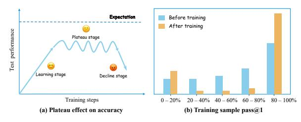
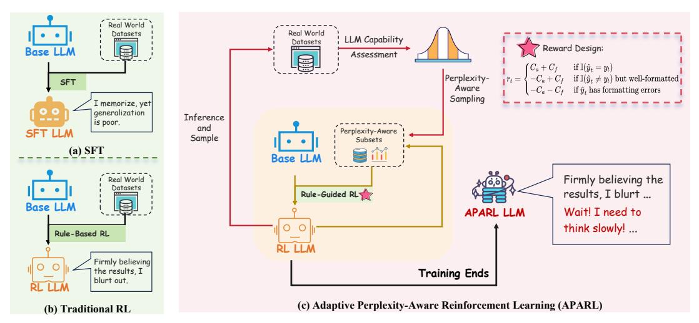
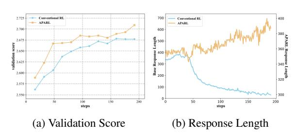

# A Reasoner for Real-World Event Detection: Scaling Reinforcement Learning via Adaptive Perplexity-Aware Sampling Strategy

Xiaoyun Zhang1,† Jingqing Ruan1,†,∗ Xing Ma1,† Yawen Zhu1 Jiansong Chen1,∗ Ke Zeng1 Xunliang Cai1 1Meituan

zhangxiaoyun15@meituan.com ruanjingqing@meituan.com

# Abstract

Detecting abnormal events in real-world customer service dialogues is highly challenging due to the complexity of business data and the dynamic nature of customer interactions. Moreover, models must demonstrate strong out-ofdomain (OOD) generalization to enable rapid adaptation across different scenarios and maximize commercial value. In this work, we propose a novel Adaptive Perplexity-Aware Reinforcement Learning (APARL) framework that leverages the advanced reasoning capabilities of large language models for abnormal event detection. APARL introduces a dualloop dynamic curriculum learning architecture, enabling the model to progressively focus on more challenging samples as its proficiency increases. This design effectively addresses performance bottlenecks and significantly enhances OOD transferability. Extensive evaluations show that our model achieves significantly enhanced adaptability and robustness, attaining the highest F1 score with an average improvement of 17.19%, and an average improvement of 9.59% in OOD transfer tests. APARL provides a superior solution for industrial deployment of anomaly detection models, contributing to improved operational efficiency and commercial benefits.

# 1 Introduction

In the domain of real-world customer service [\(Naik](#page-7-0) [et al.,](#page-7-0) [2024;](#page-7-0) [Yang et al.,](#page-8-0) [2024;](#page-8-0) [Ngai et al.,](#page-7-1) [2021;](#page-7-1) [Zou et al.,](#page-9-0) [2021\)](#page-9-0), effectively detecting abnormal events in conversations among users, merchants, and service agents is crucial for timely issue resolution and proactive risk mitigation. For example, in food delivery scenarios [\(Gao et al.,](#page-6-0) [2021\)](#page-6-0), when a user repeatedly complains about delayed deliveries, it is essential to analyze the context of the conversation to identify the root cause of the issue, such

as slow food preparation by the merchant or the courier failing to pick up the order. Providing better solutions based on this analysis can enhance user satisfaction, helping the platform retain more customers and thereby boosting its competitive edge in the industry.

Existing methodologies for abnormal event detection face two predominant limitations. Traditional approaches relying on specialized small models (e.g., BERT-based classifiers) [\(Devlin et al.,](#page-6-1) [2019;](#page-6-1) [Chen et al.,](#page-6-2) [2024;](#page-6-2) [Li et al.,](#page-7-2) [2023a;](#page-7-2) [Qasim](#page-7-3) [et al.,](#page-7-3) [2022;](#page-7-3) [Prabhu et al.,](#page-7-4) [2021;](#page-7-4) [Yu et al.,](#page-8-1) [2019\)](#page-8-1) necessitate training and maintaining multiple taskspecific models, resulting in prohibitive annotation costs (averaging 120 hours per event) and poor scalability for emerging event types. While large language models (LLMs) address these issues through few-shot prompting [\(Touvron et al.,](#page-8-2) [2023;](#page-8-2) [Kaplan](#page-7-5) [et al.,](#page-7-5) [2020;](#page-7-5) [Min et al.,](#page-7-6) [2022;](#page-7-6) [Wei et al.,](#page-8-3) [2022a\)](#page-8-3), their performance exhibits unacceptable sensitivity to prompt engineering and does not perform well in vertical domains such as the food delivery sector. Furthermore, supervised fine-tuned LLMs [\(Wei](#page-8-4) [et al.,](#page-8-4) [2021;](#page-8-4) [OpenAI,](#page-7-7) [2023;](#page-7-7) [Ouyang et al.,](#page-7-8) [2022;](#page-7-8) [Wake et al.,](#page-8-5) [2023;](#page-8-5) [Sun and Moens,](#page-8-6) [2023\)](#page-8-6) can adapt to some vertical scenarios, which have been widely adopted in various industrial fields [\(Dai et al.,](#page-6-3) [2024;](#page-6-3) [Ravikumar et al.,](#page-8-7) [2025\)](#page-8-7). However, it tends to the memorization bias [\(Chu et al.,](#page-6-4) [2025\)](#page-6-4), where models overfit to training data, limiting their generalization to unseen data. This memorization suggests that performance gains may stem more from learned patterns rather than deep task understanding.

To overcome these bottlenecks, we explore the potential of reasoning capabilities in large models to enhance problem-solving in customer service dialogue scenarios. Under a post-training framework with reinforcement learning (RL), reasoningfocused large models [\(Jaech et al.,](#page-7-9) [2024;](#page-7-9) [Guo et al.,](#page-7-10) [2025a;](#page-7-10) [Team et al.,](#page-8-8) [2025;](#page-8-8) [DeepMind,](#page-6-5) [2024;](#page-6-5) [Zhang](#page-9-1) [et al.,](#page-9-1) [2025b\)](#page-9-1) such as OpenAI's o1/o3 [\(Jaech et al.,](#page-7-9)

†Xiaoyun Zhang, Jingqing Ruan, and Xing Ma contributed equally to this work.

\*Corresponding author.

Figure 1: (a) Training Plateau effect on accuracy. (b) Sample pass@1 distribution changes with conventional RL training.

2024) and DeepSeek-R1 (Guo et al., 2025a) demonstrate exceptional capabilities utilizing chain-ofthought reasoning. Despite RL's strong theoretical performance, its real-world applications in customer service dialogues face significant implementation challenges. Our preliminary experiments and existing research (Arrieta et al., 2025; Mondillo et al., 2025; Evstafev, 2025) indicate that training challenges in domain-specific tasks primarily include: (1) a plateau effect on accuracy, where early convergence is followed by stagnation or decline (Schaul et al., 2019), as shown in Figure 1(a); (2) a bimodal distribution in sample pass@1 results after RL training, indicating difficulties learning from hard samples (Slade and Gedeon, 1993), as demonstrated in Figure 1(b).

Based on these observations, we propose a novel Adaptive Perplexity-Aware Reinforcement Learning (APARL) framework to address these challenges through a dual-loop architecture. In the outer loop, APARL employs an adaptive perplexityaware sampling strategy to dynamically select samples based on complexity; the inner loop utilizes a rule-guided reinforcement learning mechanism to optimize model learning, encouraging exploration of diverse reasoning strategies without requiring explicit CoT annotations. This dual-loop strategy enables dynamic curriculum learning, allowing the model to gradually focus and explore more challenging samples as its capabilities improve, enhancing sample utilization efficiency and performance optimization limits.

Extensive experiments and evaluations on food delivery dialogue tasks demonstrate that APARL effectively enhances model accuracy and robustness, achieving the highest F1 score with an average increase of 17.19% across all benchmarks; in OOD task testing, the average increase was 9.59%. Our method provides a superior solution for the industrial application of abnormal detection models, aiding in the improvement of business operational

efficiency and economic benefits.

### 2 Problem Statement

In this section, we formalize the abnormal event detection in customer service dialogues as a decisionmaking process (Howard, 1960; Baxter, 1995). Let a customer service dialogue be a sequence of Tutterances  $D = \{u_1, ..., u_T\}$  where  $u_t \in \mathcal{U}$  represents the t-th utterance (user/agent/ merchant). As illustrated in Figure 2, our task is to analyze the dialogue and give the names of abnormal events. We formulate abnormal event detection as RL problem with: (1) **State space**:  $S = \{s_t = (e_p, u_{t-k:t})\},$ where p denotes the event descriptions and  $u_{t-k:t}$ denotes dialogue window of k recent utterances; (2) Action space:  $A = \{a_1, ..., a_M\}$ , where M=20 predefined abnormal event types (e.g., merchant delay, courier issue); (3) Reward function: r contains the accuracy reward and the format penalty.

Figure 2: Abnormal event detection in the dialogue.

# 3 Methodology

### 3.1 Overview

In order to fully leverage the advantages of reasoning models in detecting real-world abnormal events, we explores the training methods for model reasoning and addressing issues in customer service dialogue scenarios within the RLVR framework. However, preliminary experimental results indicate that the model's training performance has not met the expected standards. Through multiple rounds of experimental observations, the following phenomena were noted: (1) Accuracy converges early in training, followed by a plateau effect, and eventually shows a declining trend (Schaul et al., 2019), as illustrated in Figure 1(a); (2) There are discrepancies compared to the experimental results reported in existing studies, with a decreasing trend in the length of reasoning chains during training; (3)

Figure 3: (a) SFT, (b) traditional RL, and (c) overview of our proposed APARL: integrating rule-guided RL in the inner loop and the adaptive perplexity-aware sampling strategy in the outer loop to improve the SFT and traditional RL issues.

The pass@1 results of samples post-reinforcement learning training exhibit a bimodal distribution characteristic (Slade and Gedeon, 1993), with a slight increase in the number of difficult problems, as shown in Figure 1(b).

The fundamental cause of the observed training trends lies in the fact that, under the same sampling budget constraints, some intermittently solvable problems may not be sampled to the correct answer, while some simple problems with intermittent errors have correct answers and provide effective gradient signals. The model gradually converges towards the correct response trajectory of simple samples, leading to a degradation in the solving ability of complex problems that originally had intermittent solvability. To address the challenge of performance stagnation in reinforcement learning training, we propose the Adaptive Perplexity-Aware Reinforcement Learning (APARL) framework, as shown in Figure 3, which includes a dualloop architecture:

- *Outer Adaptive Sample Strategy*: Automatically optimizes training data composition using the perplexity based on the model's average proficiency level and training data distribution.
- *Inner Rule-Guided RL*: Activates foundational reasoning through structured reward signals aligned with domain expertise.

# 3.2 Outer loop: Adaptive Perplexity-Aware Sampling Strategy

To address performance stagnation and overfitting to simple samples, the outer loop of our APARL framework dynamically adjusts the sampling probability of each training sample according to the model's capability at every training step. This ensures that the model is consistently exposed to appropriately challenging samples.

**LLM Capability Assessment.** At each training step, we perform Monte Carlo sampling on the current LLM policy  $\pi_{\theta}$ , conducting k independent generations for each prompt  $x_i$  in the current mini-batch  $B = \{x_i\}_{i=1}^b$ . We define the model's proficiency level  $\mu_p \in [0, 1]$  through:

$$p_i = \frac{1}{k} \sum_{j=1}^k \mathbb{I}(f_{\pi}(x_i^{(j)}) = y_i), \quad \mu_p^{(t)} = \frac{1}{N} \sum_{i=1}^N p_i,$$
(1)

where  $p_i$  measures empirical success rate, b is the batch size, t denotes training iteration, and  $f_{\pi}$  represents the policy function.

**Perplexity-Aware Sampling.** Building upon the batch-wise capability assessment, we introduce a power-function-based perplexity-aware sampling probability to directly determine whether each sample  $x_i$  in the mini-batch is selected for training at the current step. Specifically, for each sample, we compute its selection probability as follows:

$$P(x_i) = \left(\frac{p_i}{1 - \mu_p + \epsilon}\right)^{t(1 - \mu_p)} \cdot \left(\frac{1 - p_i}{\mu_p + \epsilon}\right)^{t\mu_p}$$
(2

where  $p_i$  is the empirical success rate of the model on  $x_i$ ,  $\mu_p$  is the average proficiency over the current batch, t>0 is a sharpness parameter controlsling the concentration of the distribution, and  $\epsilon$  is a small constant (e.g., 1×10−8 ) added to the denominators for numerical stability.

Similar to DAPO [\(Yu et al.,](#page-8-11) [2025\)](#page-8-11), the sampling probability computed by Eq [\(2\)](#page-2-1) naturally becomes zero for samples where pi equals 0 or 1, thereby eliminating the influence of ineffective gradient samples on the learning process. Additionally, the peak of the sampling function is located at µp, meaning that samples whose difficulty is close to the current model's average proficiency are more likely to be selected (i.e., their sampling probability approaches 1). After applying the sampling filter, if the number of selected samples is insufficient to fill the training batch size, the same sampling procedure will be performed on the subsequent batch to supplement the batch. This design exhibits two essential properties:

- *Capability-driven Focus*: In the early stage of training, when µp is small, the distribution peak is close to the low-difficulty region, so the model tends to sample easier examples, facilitating rapid skill acquisition.
- *Challenge Emphasis*: As training progresses and µp increases, the distribution peak shifts toward higher difficulty, and the model naturally focuses on harder or borderline samples, shifting the training emphasis to more challenging tasks.

The perplexity-aware data dynamically guides the model toward deeper cognitive engagement, avoiding stagnation in simplistic problem-solving patterns. This process mimics curriculum learning, where the training focus gradually shifts to harder tasks as the model improves, ultimately converging to an optimal policy through synergy with the inner loop.

# 3.3 Inner loop: Rule-Guided RL

In abnormal event detection tasks, where sample labels exhibit high specificity, rule-guided RL demonstrates significant application advantages. This study integrates rule-guided RL with the emergent properties of Chain-of-Thought (CoT) reasoning, leveraging the synergistic effects of test-time scaling benefits and RL scaling effects to construct a scalable training framework.

RL Algorithm. We employ a modified DAPO [\(Yu et al.,](#page-8-11) [2025\)](#page-8-11) algorithm as the core RL module. Preliminary ablation studies demonstrate that omitting the KL divergence constraint leads to significant instability during training. To mitigate this, we reintroduce the KL divergence term. Specifically, we retain both the token-level policy gradient loss computation and the Clip-Higher strategy. In addition, the KL divergence constraint is decoupled from the advantage estimation procedure and is instead incorporated as an explicit regularization term within the loss function, following the optimization practices recommended by DeepSeek-Math [\(Shao et al.,](#page-8-12) [2024a\)](#page-8-12). The revised overall loss function is formally defined in Eq [\(3\)](#page-3-0):

$$\mathcal{L}(\theta) = -\mathbb{E}\left[\frac{1}{G} \frac{1}{|o_i|} \sum_{i=1}^{G} \sum_{t=1}^{|o_i|} \left(\min\left(r_{i,t} \hat{A}_t, \operatorname{clip}(r_{i,t}, 1 - \varepsilon_{low}, 1 + \varepsilon_{high}) \hat{A}_t\right) - \lambda \mathbb{D}_{\mathrm{KL}}\left[\pi_{\theta} \| \pi_{\mathrm{ref}}\right]\right)\right]$$
(3)

where the advantage function Aˆ t and the importance sampling coefficient ri,t are computed as

$$\hat{A}_{t} = \frac{r_{t} - \mu_{r}}{\sigma_{r}}, \quad r_{i,t} = \frac{\pi_{\theta} \left( o_{i,t} \mid q, o_{i, < t} \right)}{\pi_{old} \left( o_{i,t} \mid q, o_{i, < t} \right)}$$
(4)

Additionally, we adopt the unbiased KL estimation as recommended in GRPO algorithms to enhance stability, as shown in Eq. [\(5\)](#page-3-1):

$$\mathbb{D}_{\mathrm{KL}}\left[\pi_{\theta} \| \pi_{\mathrm{ref}}\right] = \frac{\pi_{\mathrm{ref}}\left(o_{i,t} \mid q, o_{i, < t}\right)}{\pi_{\theta}\left(o_{i,t} \mid q, o_{i, < t}\right)} - \log \frac{\pi_{\mathrm{ref}}\left(o_{i,t} \mid q, o_{i, < t}\right)}{\pi_{\theta}\left(o_{i,t} \mid q, o_{i, < t}\right)} - 1.$$
(5)

Reward Design. For abnormal event detection, the rule-based reward function includes a format reward and an answer accuracy reward. Following GRPO-LEAD [\(Zhang and Zuo,](#page-9-2) [2025\)](#page-9-2) and RM-R1 [\(Chen et al.,](#page-6-9) [2025\)](#page-6-9), we assign negative scores to responses that fail to meet format or correctness requirements. Both components are initialized with negative constants (−C, C > 0) and switched to positive values if the output is correct or wellformatted. The final reward is computed as the sum of these and serves as the advantage estimator for policy gradient optimization. The reward function is formalized as Eq [\(6\)](#page-3-2):

$$r_t = \begin{cases} C_a + C_f & \text{if } \mathbb{I}(\hat{y}_t = y_t) \\ -C_a + C_f & \text{if } \mathbb{I}(\hat{y}_t \neq y_t) \text{ but well-formatted} \\ -C_a - C_f & \text{if } \hat{y}_t \text{ has formatting errors.} \end{cases}$$

(6)

# 4 Experiment

### 4.1 Experimental Setting

**Dataset Selection**: We benchmark our proposed framework against baseline models using a comprehensive industrial food delivery dataset. This dataset, sourced from Meituan's online logs, comprises 55,000 training samples and 9,000 testing samples. It features multi-turn conversations and is structured to classify 20 distinct abnormal events. The classification targets are meticulously annotated by our human customer service team.

**Evaluation Metrics**: We validate our method using precision, recall, and F1-score metrics on the 9,000 test samples to ensure robust performance assessment.

**Model Configuration**: Our experiments utilize Qwen-14B-Instruct and DeepSeek-R1-Distill-Qwen-14B as the base models for RL training. This configuration is selected to thoroughly evaluate the applicability of both reasoning and standard models with our APARL, thereby demonstrating the generalizability of our approach.

Comparison Methods: We employ the following comparisons: (1) Trained small models: BGE-M31; (2) API calls using GPT-4o/DeepSeek-V3 (Instruct model) and o1-preview/DeepSeek-R1 (Reasoning model); (3) Supervised Fine-Tuning (SFT) on the aforementioned base models; and (4) the GRPO and DAPO RL methods versus APARL.

#### 4.2 Main Results

Table 1: Performance Comparison with Different Strategies

| Category     | Model                              | Performance      |        |        |  |  |
|--------------|------------------------------------|------------------|--------|--------|--|--|
|              | Model                              | Precision Recall |        | F1     |  |  |
| Small Models | BGE-M3                             | 78.53%           | 69.90% | 73.96% |  |  |
| API Models   | GPT-4o                             | 72.52%           | 77.40% | 74.88% |  |  |
|              | o1-preview                         | 65.43%           | 72.35% | 68.72% |  |  |
|              | DeepSeek-V3                        | 74.76%           | 68.56% | 71.53% |  |  |
|              | DeepSeek-R1                        | 79.85%           | 69.59% | 74.37% |  |  |
| Base Models  | DeepSeek-R1-Distill-Qwen-14B       | 62.58%           | 76.96% | 69.03% |  |  |
|              | Qwen-14B-Instruct                  | 73.63%           | 56.09% | 63.67% |  |  |
| Ours         | DeepSeek-R1-Distill-Qwen-14B+APARL | 82.67%           | 81.90% | 82.28% |  |  |
| Ours         | Qwen-14B-Instruct+APARL            | 80.38%           | 86.61% | 83.38% |  |  |

The results presented in Table 1 highlight the significant improvements achieved by our APARL across various models and metrics. APARL **outperforms leading API-based models**, such as *DeepSeek-R1*, by attaining a higher F1 score (83.38% vs. 74.37%). This indicates the practical applicability of APARL, which can save more costs. Moreover, the results also reveal that APARL

surpasses the performance of traditional small models like *BGE-M3* (73.96% F1), further validating the advantages of our RL-driven approach in abnormal event detection tasks. Moreover, our strategy, when applied to both instruct and distill models, demonstrates superior performance in terms of F1 scores. Specifically, *DeepSeek-R1-Distill-Qwen-14B+Ours* achieves an F1 score of 82.28% while *Qwen-14B-Instruct+Ours* reaches 83.38%.

Another noteworthy finding is that the reasoning patterns acquired by *DeepSeek-R1-Distill-Qwen-14B* from DeepSeek-R1 **did not yield significant improvements in business-oriented evaluations**. In fact, the distilled model performed even worse compared to Qwen-14B-Instruct after RL training. Our experimental analysis may provide additional insights for the industry when selecting models.

Overall, APARL achieved a 17.19% average improvement over all the baselines. Our training method effectively addresses three real-world challenges: (1) Enhanced recall improves long-tail coverage, allowing detection of unusual issues like unique customer complaints. (2) It maintains high precision while identifying more issues, ensuring compliance with business rules like privacy policies without losing accuracy. (3) Consistent improvements across various AI models demonstrate the method's versatility, proving it's not limited to specific technical setups.

### 4.3 Ablation Study

Table 2: Ablation on Different Data/Training Strategies

| Model                        | Method     | Performance |        |        |  |  |
|------------------------------|------------|-------------|--------|--------|--|--|
|                              | 11201104   | Precision   | Recall | F1     |  |  |
|                              | Base model | 62.58%      | 76.96% | 69.03% |  |  |
|                              | +SFT       | 74.28%      | 79.84% | 76.96% |  |  |
| DeepSeek-R1-Distill-Qwen-14B | +GRPO      | 67.64%      | 92.06% | 77.98% |  |  |
|                              | +DAPO      | 78.87%      | 78.95% | 78.91% |  |  |
|                              | +Our APARL | 82.67%      | 81.90% | 82.28% |  |  |
|                              | Base model | 73.63%      | 56.09% | 63.67% |  |  |
|                              | +SFT       | 83.05%      | 66.12% | 73.63% |  |  |
| Qwen-14B-Instruct            | +GRPO      | 77.63%      | 74.55% | 76.06% |  |  |
|                              | +DAPO      | 76.88%      | 80.15% | 78.48% |  |  |
|                              | +Our APARL | 80.38%      | 86.61% | 83.38% |  |  |

The ablation study was conducted using two base models: *DeepSeek-R1-Distill-Qwen-14B* and *Qwen-14B-Instruct*. We evaluated the following configurations: the base model, SFT with the full dataset, conventional RL(GRPO and DAPO), and APARL.

For *DeepSeek-R1-Distill-Qwen-14B/Qwen-14B-Instruct*, applying APARL resulted in an F1 score of 82.28%/83.38%, which is a notable improve-

&lt;sup>1https://huggingface.co/BAAI/bge-m3

ment over both the full SFT(6.91%/13.24%). This indicates that our dynamic approach effectively balances precision and recall, outperforming two conventional RL methods by 4.89%/7.93% in the F1 score. These results show the potential and advantages of our method for industrial applications.

### 4.4 OOD Testing

Table 3: OOD Testing on Different Data/Training Strategies

| Model                        | Method      | Avg. Performance |        |               |  |  |
|------------------------------|-------------|------------------|--------|---------------|--|--|
| Model                        | Method      | Precision        | Recall | F1            |  |  |
| Small Models                 | BGE-M3      | /                | /      | /             |  |  |
|                              | GPT-40      | 71.81%           | 70.22% | 71.00%        |  |  |
| API Models                   | DeepSeek-V3 | 66.78%           | 71.69% | 69.16%        |  |  |
|                              | DeepSeek-R1 | 70.43%           | 72.40% | 71.26%        |  |  |
|                              | Base model  | 54.69%           | 87.75% | 67.36%        |  |  |
|                              | +SFT        | 66.13%           | 78.03% | 71.53%        |  |  |
| DeepSeek-R1-Distill-Qwen-14B | +GRPO       | 68.30%           | 82.78% | 74.82%        |  |  |
|                              | +DAPO       | 76.13%           | 73.66% | 74.84%        |  |  |
|                              | +Our APARL  | 78.99%           | 79.11% | 79.01%        |  |  |
|                              | Base model  | 56.82%           | 86.19% | 68.46%        |  |  |
|                              | +SFT        | 66.54%           | 79.16% | 72.26%        |  |  |
| Qwen-14B-Instruct            | +GRPO       | 78.07%           | 71.33% | 74.53%        |  |  |
|                              | +DAPO       | 77.13%           | 77.51% | 77.30%        |  |  |
|                              | +Our APARL  | 77.45%           | 79.92% | <u>78.65%</u> |  |  |

Table 3 summarizes the out-of-distribution (OOD) testing results across different model configurations and training strategies. We report the average performance metrics (Precision, Recall, F1) over three anonymized business domains(to ensure business confidentiality), whose respective test set sizes are 8.8k, 8.5k, and 5k. It should be noted that the BGE-M3 model cannot be directly transferred for use, as it has a fixed classification head. More experiments details for each business can be found in Appendix C.

From the results, we observe that our proposed APARL method consistently outperforms all baselines. For *DeepSeek-R1-Distill-Qwen-14B*, APARL achieves the highest F1 score (79.01%), representing a 7.48% absolute improvement over SFT and outperforming both GRPO and DAPO. Similarly, for *Qwen-14B-Instruct*, APARL yields an F1 of 78.65%, surpassing both SFT and other RL methods. Comparing with strong API-based models (e.g., GPT-40, DeepSeek-V3), our APARL-trained models demonstrate highly competitive OOD generalization, with F1 scores exceeding those of GPT-40 and DeepSeek-R1 by 8.01% and 7.75%, respectively, on average.

Overall, APARL achieved a 9.59% average improvement over all the baselines. This highlights the robustness of our approach under distributional shifts, which is crucial for real-world industrial deployment.

### 4.5 Dynamics on Validation and Training

The validation and training dynamics depicted in Figure 4 highlight the effectiveness of our adaptive strategy. In the left panel, the reward trajectory of the adaptive strategy exhibits a more rapid upward trajectory and ultimately converges to a higher reward region. This characteristic stems from the dynamic adjustment of sample difficulty, enabling the model to effectively consolidate learned strategies at each stage while progressively enhancing its capabilities. The right panel simultaneously demonstrates the variation in response length. Compared to baseline methods, our strategy achieves significantly longer response lengths, as the model gradually increases its exploration of complex scenarios. This adaptive adjustment stimulates the model's capacity for deep reasoning and enables robust, context-aware decision-making in reinforcement learning tasks.

Figure 4: Visualization on Dynamics.

### 5 Conclusion

In conclusion, we are the first to apply reasoning models to abnormal event monitoring in customer service workflows. We propose a novel reinforcement learning approach that addresses realworld challenges by integrating domain-specific rewards and adaptive perplexity-aware sampling. Our framework significantly boosts abnormal event detection and resolution. Extensive experiments on a food delivery platform show that our model achieves the highest F1 scores, with average improvements of 17.19% in overall performance and 9.59% on OOD transfer tests. These results demonstrate strong adaptability and robustness, highlighting the potential of our approach to enhance customer satisfaction and business value. Our work provides a robust and scalable solution for industrial abnormal event detection and response.

# Limitations

We have validated our approach on different model series, including DeepSeek-R1-Distill-Qwen-14B and Qwen-14B-Instruct, which meet the stringent latency and deployment requirements of our online business scenario. Although we have not systematically tested other model architectures or sizes, our results demonstrate practical applicability. Future work is encouraged to extend this evaluation to both larger and smaller models to further explore the scalability and robustness of our method.

# Acknowledgement

This work is sponsored by Beijing Nova Program.

# Ethics Statement

We have carefully considered the ethical implications of our research and provide the following statements:

- Throughout this study, we have strictly followed established ethical guidelines, ensuring that our findings are reported honestly, transparently, and with full accuracy.
- No sensitive or confidential information was used at any stage of our research. All data and materials utilized are suitable for public release.
- The datasets employed in our experiments originate from publicly available and peerreviewed scientific sources, supporting the transparency and reproducibility of our work.
- We offer detailed descriptions of the datasets and the hyper-parameter configurations used in our experiments to ensure the reproducibility and clarity of our results.
- In the interest of openness and to support future research, we have made our code available anonymously on GitHub and will fully open source it following the acceptance of our paper.

# References

Arash Ahmadian, Chris Cremer, Matthias Gallé, Marzieh Fadaee, Julia Kreutzer, Olivier Pietquin, Ahmet Üstün, and Sara Hooker. 2024. Back to basics: Revisiting reinforce style optimization for learning from human feedback in llms. *arXiv preprint arXiv:2402.14740*.

- Aitor Arrieta, Miriam Ugarte, Pablo Valle, José Antonio Parejo, and Sergio Segura. 2025. o3-mini vs deepseek-r1: Which one is safer? *arXiv preprint arXiv:2501.18438*.
- Yuntao Bai, Andy Jones, Kamal Ndousse, Amanda Askell, Anna Chen, Nova DasSarma, Dawn Drain, Stanislav Fort, Deep Ganguli, Tom Henighan, and 1 others. 2022. Training a helpful and harmless assistant with reinforcement learning from human feedback. *arXiv preprint arXiv:2204.05862*.
- Laurence A Baxter. 1995. Markov decision processes: Discrete stochastic dynamic programming.
- Jianlv Chen, Shitao Xiao, Peitian Zhang, Kun Luo, Defu Lian, and Zheng Liu. 2024. Bge m3-embedding: Multi-lingual, multi-functionality, multi-granularity text embeddings through self-knowledge distillation. *arXiv preprint arXiv:2402.03216*.
- Xiusi Chen, Gaotang Li, Ziqi Wang, Bowen Jin, Cheng Qian, Yu Wang, Hongru Wang, Yu Zhang, Denghui Zhang, Tong Zhang, and 1 others. 2025. Rm-r1: Reward modeling as reasoning. *arXiv preprint arXiv:2505.02387*.
- Tianzhe Chu, Yuexiang Zhai, Jihan Yang, Shengbang Tong, Saining Xie, Dale Schuurmans, Quoc V Le, Sergey Levine, and Yi Ma. 2025. Sft memorizes, rl generalizes: A comparative study of foundation model post-training. *arXiv preprint arXiv:2501.17161*.
- Tao Dai, Yidan Lu, Nikola Zivlak, Danijela Ciri ´ c Lali ´ c,´ and Bojan Lalic. 2024. How does queueing information in pre-sales call centers affect customer repurchase behavior. *Asia-Pacific Journal of Operational Research*, (41 (4)):26–p.
- Google DeepMind. 2024. Gemini 2.0 flash thinking. *URL https://deepmind.google/technologies/gemini/flashthinking/*.
- Jacob Devlin, Ming-Wei Chang, Kenton Lee, and Kristina Toutanova. 2019. Bert: Pre-training of deep bidirectional transformers for language understanding. In *Proceedings of the 2019 conference of the North American chapter of the association for computational linguistics: human language technologies, volume 1 (long and short papers)*, pages 4171–4186.
- Evgenii Evstafev. 2025. Token-hungry, yet precise: Deepseek r1 highlights the need for multi-step reasoning over speed in math. *arXiv preprint arXiv:2501.18576*.
- Chengliang Gao, Fan Zhang, Guanqun Wu, Qiwan Hu, Qiang Ru, Jinghua Hao, Renqing He, and Zhizhao Sun. 2021. A deep learning method for route and time prediction in food delivery service. In *Proceedings of the 27th ACM SIGKDD Conference on Knowledge Discovery & Data Mining*, pages 2879–2889.

- Daya Guo, Dejian Yang, Haowei Zhang, Junxiao Song, Ruoyu Zhang, Runxin Xu, Qihao Zhu, Shirong Ma, Peiyi Wang, Xiao Bi, and 1 others. 2025a. Deepseek-r1: Incentivizing reasoning capability in llms via reinforcement learning. *arXiv preprint arXiv:2501.12948*.
- Daya Guo, Dejian Yang, Haowei Zhang, Junxiao Song, Ruoyu Zhang, Runxin Xu, Qihao Zhu, Shirong Ma, Peiyi Wang, Xiao Bi, and 1 others. 2025b. Deepseek-r1: Incentivizing reasoning capability in llms via reinforcement learning. *arXiv preprint arXiv:2501.12948*.
- Ronald A Howard. 1960. Dynamic programming and markov processes.
- Jian Hu. 2025. Reinforce++: A simple and efficient approach for aligning large language models. *arXiv preprint arXiv:2501.03262*.
- Aaron Jaech, Adam Kalai, Adam Lerer, Adam Richardson, Ahmed El-Kishky, Aiden Low, Alec Helyar, Aleksander Madry, Alex Beutel, Alex Carney, and 1 others. 2024. Openai o1 system card. *arXiv preprint arXiv:2412.16720*.
- Jared Kaplan, Sam McCandlish, Tom Henighan, Tom B Brown, Benjamin Chess, Rewon Child, Scott Gray, Alec Radford, Jeffrey Wu, and Dario Amodei. 2020. Scaling laws for neural language models. *arXiv preprint arXiv:2001.08361*.
- Woosuk Kwon, Zhuohan Li, Siyuan Zhuang, Ying Sheng, Lianmin Zheng, Cody Hao Yu, Joseph E. Gonzalez, Hao Zhang, and Ion Stoica. 2023. Efficient memory management for large language model serving with pagedattention. In *Proceedings of the ACM SIGOPS 29th Symposium on Operating Systems Principles*.
- Yuxiang Lai, Jike Zhong, Ming Li, Shitian Zhao, and Xiaofeng Yang. 2025. Med-r1: Reinforcement learning for generalizable medical reasoning in visionlanguage models. *arXiv preprint arXiv:2503.13939*.
- Zehan Li, Xin Zhang, Yanzhao Zhang, Dingkun Long, Pengjun Xie, and Meishan Zhang. 2023a. Towards general text embeddings with multi-stage contrastive learning. *arXiv preprint arXiv:2308.03281*.
- Ziniu Li, Tian Xu, Yushun Zhang, Zhihang Lin, Yang Yu, Ruoyu Sun, and Zhi-Quan Luo. 2023b. Remax: A simple, effective, and efficient reinforcement learning method for aligning large language models. *arXiv preprint arXiv:2310.10505*.
- Zhaowei Liu, Xin Guo, Fangqi Lou, Lingfeng Zeng, Jinyi Niu, Zixuan Wang, Jiajie Xu, Weige Cai, Ziwei Yang, Xueqian Zhao, and 1 others. 2025a. Finr1: A large language model for financial reasoning through reinforcement learning. *arXiv preprint arXiv:2503.16252*.

- Zichen Liu, Changyu Chen, Wenjun Li, Penghui Qi, Tianyu Pang, Chao Du, Wee Sun Lee, and Min Lin. 2025b. Understanding r1-zero-like training: A critical perspective. *arXiv preprint arXiv:2503.20783*.
- Yu Meng, Mengzhou Xia, and Danqi Chen. 2024. Simpo: Simple preference optimization with a reference-free reward. *Advances in Neural Information Processing Systems*, 37:124198–124235.
- Sewon Min, Xinxi Lyu, Ari Holtzman, Mikel Artetxe, Mike Lewis, Hannaneh Hajishirzi, and Luke Zettlemoyer. 2022. Rethinking the role of demonstrations: What makes in-context learning work? *arXiv preprint arXiv:2202.12837*.
- Gianluca Mondillo, Simone Colosimo, Alessandra Perrotta, Vittoria Frattolillo, and Mariapia Masino. 2025. Comparative evaluation of advanced ai reasoning models in pediatric clinical decision support: Chatgpt o1 vs. deepseek-r1. *medRxiv*, pages 2025–01.
- Dishita Naik, Ishita Naik, and Nitin Naik. 2024. Leveraging the use of chatgpt: exploring its real-world applications including their related ethical and regulatory considerations. In *The International Conference on Computing, Communication, Cybersecurity & AI*, pages 649–667. Springer.
- Eric WT Ngai, Maggie CM Lee, Mei Luo, Patrick SL Chan, and Tenglu Liang. 2021. An intelligent knowledge-based chatbot for customer service. *Electronic Commerce Research and Applications*, 50:101098.
- OpenAI. 2023. [Gpt-4 technical report.](https://arxiv.org/abs/2303.08774) *Preprint*, arXiv:2303.08774.
- OpenAI. 2024. [Learning to reason with language mod](https://openai.com/index/learning-to-reason-with-llms)[els.](https://openai.com/index/learning-to-reason-with-llms)
- Long Ouyang, Jeffrey Wu, Xu Jiang, Diogo Almeida, Carroll Wainwright, Pamela Mishkin, Chong Zhang, Sandhini Agarwal, Katarina Slama, Alex Ray, and 1 others. 2022. Training language models to follow instructions with human feedback. *Advances in Neural Information Processing Systems*, 35:27730–27744.
- Sumanth Prabhu, Moosa Mohamed, and Hemant Misra. 2021. Multi-class text classification using bert-based active learning. *arXiv preprint arXiv:2104.14289*.
- Rukhma Qasim, Waqas Haider Bangyal, Mohammed A Alqarni, and Abdulwahab Ali Almazroi. 2022. A fine-tuned bert-based transfer learning approach for text classification. *Journal of healthcare engineering*, 2022(1):3498123.
- Qwen, :, An Yang, Baosong Yang, Beichen Zhang, Binyuan Hui, Bo Zheng, Bowen Yu, Chengyuan Li, Dayiheng Liu, Fei Huang, Haoran Wei, Huan Lin, Jian Yang, Jianhong Tu, Jianwei Zhang, Jianxin Yang, Jiaxi Yang, Jingren Zhou, and 25 others. 2025. [Qwen2.5 technical report.](https://arxiv.org/abs/2412.15115) *Preprint*, arXiv:2412.15115.

- Rafael Rafailov, Archit Sharma, Eric Mitchell, Christopher D Manning, Stefano Ermon, and Chelsea Finn. 2023. Direct preference optimization: Your language model is secretly a reward model. *Advances in Neural Information Processing Systems*, 36:53728– 53741.
- Anitha Ravikumar, Donalie H Cabral, Sheikha Said AlSubhi, and Gopalan Puthukulam. 2025. A study on the application of ai chatbots for customized product recommendations and uninterrupted order fulfillment for enhanced customer experience using kano model. In *Innovative and Intelligent Digital Technologies; Towards an Increased Efficiency: Volume 2*, pages 403–415. Springer.
- Tom Schaul, Diana Borsa, Joseph Modayil, and Razvan Pascanu. 2019. Ray interference: a source of plateaus in deep reinforcement learning. *arXiv preprint arXiv:1904.11455*.
- John Schulman, Filip Wolski, Prafulla Dhariwal, Alec Radford, and Oleg Klimov. 2017. Proximal policy optimization algorithms. *arXiv preprint arXiv:1707.06347*.
- Zhihong Shao, Peiyi Wang, Qihao Zhu, Runxin Xu, Junxiao Song, Xiao Bi, Haowei Zhang, Mingchuan Zhang, Y. K. Li, Y. Wu, and Daya Guo. 2024a. [Deepseekmath: Pushing the limits of mathemati](https://arxiv.org/abs/2402.03300)[cal reasoning in open language models.](https://arxiv.org/abs/2402.03300) *Preprint*, arXiv:2402.03300.
- Zhihong Shao, Peiyi Wang, Qihao Zhu, Runxin Xu, Junxiao Song, Xiao Bi, Haowei Zhang, Mingchuan Zhang, YK Li, Y Wu, and 1 others. 2024b. Deepseekmath: Pushing the limits of mathematical reasoning in open language models. *arXiv preprint arXiv:2402.03300*.
- Guangming Sheng, Chi Zhang, Zilingfeng Ye, Xibin Wu, Wang Zhang, Ru Zhang, Yanghua Peng, Haibin Lin, and Chuan Wu. 2024. Hybridflow: A flexible and efficient rlhf framework. *arXiv preprint arXiv: 2409.19256*.
- Mohammad Shoeybi, Mostofa Patwary, Raul Puri, Patrick LeGresley, Jared Casper, and Bryan Catanzaro. 2019. Megatron-lm: Training multi-billion parameter language models using model parallelism. *arXiv preprint arXiv:1909.08053*.
- P Slade and Tamás D Gedeon. 1993. Bimodal distribution removal. In *International Workshop on Artificial Neural Networks*, pages 249–254. Springer.
- Charlie Snell, Jaehoon Lee, Kelvin Xu, and Aviral Kumar. 2024. Scaling llm test-time compute optimally can be more effective than scaling model parameters. *arXiv preprint arXiv:2408.03314*.
- Jingyuan Sun and Marie-Francine Moens. 2023. Finetuned vs. prompt-tuned supervised representations: Which better account for brain language representations? *arXiv preprint arXiv:2310.01854*.

- Kimi Team, Angang Du, Bofei Gao, Bowei Xing, Changjiu Jiang, Cheng Chen, Cheng Li, Chenjun Xiao, Chenzhuang Du, Chonghua Liao, and 1 others. 2025. Kimi k1. 5: Scaling reinforcement learning with llms. *arXiv preprint arXiv:2501.12599*.
- Hugo Touvron, Thibaut Lavril, Gautier Izacard, Xavier Martinet, Marie-Anne Lachaux, Timothée Lacroix, Baptiste Rozière, Naman Goyal, Eric Hambro, Faisal Azhar, and 1 others. 2023. Llama: Open and efficient foundation language models. *arXiv preprint arXiv:2302.13971*.
- Naoki Wake, Atsushi Kanehira, Kazuhiro Sasabuchi, Jun Takamatsu, and Katsushi Ikeuchi. 2023. Chatgpt empowered long-step robot control in various environments: A case application. *arXiv preprint arXiv:2304.03893*.
- Jason Wei, Maarten Bosma, Vincent Y Zhao, Kelvin Guu, Adams Wei Yu, Brian Lester, Nan Du, Andrew M Dai, and Quoc V Le. 2021. Finetuned language models are zero-shot learners. *arXiv preprint arXiv:2109.01652*.
- Jason Wei, Xuezhi Wang, Dale Schuurmans, Maarten Bosma, Fei Xia, Ed Chi, Quoc V Le, Denny Zhou, and 1 others. 2022a. Chain-of-thought prompting elicits reasoning in large language models. *Advances in neural information processing systems*, 35:24824– 24837.
- Jason Wei, Xuezhi Wang, Dale Schuurmans, Maarten Bosma, Fei Xia, Ed Chi, Quoc V Le, Denny Zhou, and 1 others. 2022b. Chain-of-thought prompting elicits reasoning in large language models. *Advances in neural information processing systems*, 35:24824– 24837.
- Tian Xie, Zitian Gao, Qingnan Ren, Haoming Luo, Yuqian Hong, Bryan Dai, Joey Zhou, Kai Qiu, Zhirong Wu, and Chong Luo. 2025. [Logic-rl: Un](https://arxiv.org/abs/2502.14768)[leashing llm reasoning with rule-based reinforcement](https://arxiv.org/abs/2502.14768) [learning.](https://arxiv.org/abs/2502.14768) *Preprint*, arXiv:2502.14768.
- Jingfeng Yang, Hoong Chuin Lau, and Hai Wang. 2024. Optimization of customer service and driver dispatch areas for on-demand food delivery. *Transportation Research Part C: Emerging Technologies*, 165:104653.
- Shunyu Yao, Dian Yu, Jeffrey Zhao, Izhak Shafran, Tom Griffiths, Yuan Cao, and Karthik Narasimhan. 2023. Tree of thoughts: Deliberate problem solving with large language models. *Advances in neural information processing systems*, 36:11809–11822.
- Qiying Yu, Zheng Zhang, Ruofei Zhu, Yufeng Yuan, Xiaochen Zuo, Yu Yue, Weinan Dai, Tiantian Fan, Gaohong Liu, Lingjun Liu, and 1 others. 2025. Dapo: An open-source llm reinforcement learning system at scale. *arXiv preprint arXiv:2503.14476*.
- Shanshan Yu, Jindian Su, and Da Luo. 2019. Improving bert-based text classification with auxiliary sentence and domain knowledge. *IEEE Access*, 7:176600– 176612.

- Yu Yue, Yufeng Yuan, Qiying Yu, Xiaochen Zuo, Ruofei Zhu, Wenyuan Xu, Jiaze Chen, Chengyi Wang, TianTian Fan, Zhengyin Du, and 1 others. 2025. Vapo: Efficient and reliable reinforcement learning for advanced reasoning tasks. *arXiv preprint arXiv:2504.05118*.
- Chong Zhang, Yue Deng, Xiang Lin, Bin Wang, Dianwen Ng, Hai Ye, Xingxuan Li, Yao Xiao, Zhanfeng Mo, Qi Zhang, and 1 others. 2025a. 100 days after deepseek-r1: A survey on replication studies and more directions for reasoning language models. *arXiv preprint arXiv:2505.00551*.
- Jixiao Zhang and Chunsheng Zuo. 2025. Grpo-lead: A difficulty-aware reinforcement learning approach for concise mathematical reasoning in language models. *arXiv preprint arXiv:2504.09696*.
- Xiaoyun Zhang, Jingqing Ruan, Xing Ma, Yawen Zhu, Haodong Zhao, Hao Li, Jiansong Chen, Ke Zeng, and Xunliang Cai. 2025b. When to continue thinking: Adaptive thinking mode switching for efficient reasoning. *arXiv preprint arXiv:2505.15400*.
- Denny Zhou, Nathanael Schärli, Le Hou, Jason Wei, Nathan Scales, Xuezhi Wang, Dale Schuurmans, Claire Cui, Olivier Bousquet, Quoc Le, and 1 others. 2022. Least-to-most prompting enables complex reasoning in large language models. *arXiv preprint arXiv:2205.10625*.
- Yaoyu Zhu, Di Huang, Hanqi Lyu, Xiaoyun Zhang, Chongxiao Li, Wenxuan Shi, Yutong Wu, Jianan Mu, Jinghua Wang, Yang Zhao, and 1 others. 2025. Codev-r1: Reasoning-enhanced verilog generation. *arXiv preprint arXiv:2505.24183*.
- Yicheng Zou, Lujun Zhao, Yangyang Kang, Jun Lin, Minlong Peng, Zhuoren Jiang, Changlong Sun, Qi Zhang, Xuanjing Huang, and Xiaozhong Liu. 2021. Topic-oriented spoken dialogue summarization for customer service with saliency-aware topic modeling. In *Proceedings of the AAAI Conference on Artificial Intelligence*, volume 35, pages 14665– 14673.

# A Related Work

Large Reasoning Models. Large Reasoning Models (LRMs) enhance large language models by increasing inference-time computation [\(Snell et al.,](#page-8-13) [2024\)](#page-8-13) rather than simply scaling parameters. Chainof-Thought (CoT) prompting [\(Wei et al.,](#page-8-14) [2022b;](#page-8-14) [Yao et al.,](#page-8-15) [2023;](#page-8-15) [Zhou et al.,](#page-9-3) [2022\)](#page-9-3), which introduces intermediate reasoning steps, significantly boosts performance on complex tasks. Building upon this, recent works further optimize reasoning via reinforcement learning, leading to advanced models such as OpenAI o1 [\(OpenAI,](#page-7-13) [2024\)](#page-7-13), DeepSeek-R1 [\(Guo et al.,](#page-7-14) [2025b\)](#page-7-14), Kimi k1.5 [\(Team et al.,](#page-8-8) [2025\)](#page-8-8), and QwQ [\(Qwen et al.,](#page-7-15) [2025\)](#page-7-15). Trained with answer-based rewards, these models autonomously extend reasoning chains at inference, achieving substantial gains on challenging tasks like advanced mathematics and logical reasoning [\(Zhang et al.,](#page-9-4) [2025a;](#page-9-4) [Shao et al.,](#page-8-16) [2024b\)](#page-8-16).

Reinforcement Learning for LLM. Reinforcement Learning (RL) has become an essential tool for enhancing the reasoning capabilities and alignment of large language models (LLMs). Early research employed Proximal Policy Optimization (PPO) [\(Schulman et al.,](#page-8-17) [2017\)](#page-8-17) to fine-tune LLMs, thereby improving their performance across various natural language processing tasks by optimizing them according to human feedback, known as Reinforcement Learning from Human Feedback (RLHF) [\(Bai et al.,](#page-6-10) [2022\)](#page-6-10). Building upon RLHF, several reinforcement learning preference optimization methods tailored for large language models have been developed, including DPO [\(Rafailov et al.,](#page-8-18) [2023\)](#page-8-18), SimPO [\(Meng et al.,](#page-7-16) [2024\)](#page-7-16), ReMAX [\(Li et al.,](#page-7-17) [2023b\)](#page-7-17), Reinforce++ [\(Hu,](#page-7-18) [2025\)](#page-7-18), and RLOO [\(Ahmadian et al.,](#page-6-11) [2024\)](#page-6-11). These approaches have effectively reduced the cost associated with preference optimization for large models and enhanced the stability of reinforcement learning processes for such models.

Following the demonstration of significant potential by large inference models such as OpenAI o1 [\(Ope](#page-7-13)[nAI,](#page-7-13) [2024\)](#page-7-13), DeepSeek-R1 [\(Guo et al.,](#page-7-14) [2025b\)](#page-7-14), Kimi k1.5 [\(Team et al.,](#page-8-8) [2025\)](#page-8-8), and QwQ [\(Qwen et al.,](#page-7-15) [2025\)](#page-7-15), the learning paradigm of Reinforcement Learning with Verifiable Reward (RLVR) has garnered increasing attention. Reinforcement learning techniques like GRPO [\(Shao et al.,](#page-8-16) [2024b\)](#page-8-16), along with its improved variants such as Dr.GRPO [\(Liu et al.,](#page-7-19) [2025b\)](#page-7-19), DAPO [\(Yu et al.,](#page-8-11) [2025\)](#page-8-11), and VAPO [\(Yue et al.,](#page-9-5) [2025\)](#page-9-5), have been progressively applied. Additionally, more reinforcement learning models targeting vertical domains have emerged [\(Xie et al.,](#page-8-19) [2025;](#page-8-19) [Zhu et al.,](#page-9-6) [2025;](#page-9-6) [Liu et al.,](#page-7-20) [2025a;](#page-7-20) [Lai et al.,](#page-7-21) [2025\)](#page-7-21). Our approach centers on refining GRPO and DAPO and, for the first time, applying reinforcement learning techniques to event monitoring tasks within real-world business scenarios. The framework we propose is poised to establish a new benchmark for the application of large inference models in industry, further advancing operational efficiency and economic benefits in commercial settings.

# B Implementation Details

### B.1 Training Setup

We train all the methods with 32 A100-80GB SXM GPUs. For supervised fine-tuning (SFT), we utilize the Megatron-LM framework [\(Shoeybi et al.,](#page-8-20) [2019\)](#page-8-20), which is a distributed training system designed for largescale transformer models. Megatron-LM supports both tensor and pipeline parallelism, enabling efficient training of models with billions of parameters across multiple GPUs and nodes. This framework allows us to fully leverage the computational resources of our GPU cluster and achieve high training throughput and scalability. During the reinforcement learning stage, we adopt the VeRL framework [\(Sheng et al.,](#page-8-21) [2024\)](#page-8-21). VeRL is specifically designed for post-training large language models with reinforcement learning algorithms such as RLHF. It provides seamless integration with existing LLM infrastructures, including PyTorch FSDP, Megatron-LM, and vLLM. VeRL enables flexible and efficient RL training, supports modular APIs, and allows for easy extension to other training and inference frameworks. For inference, we employ the vLLM engine [\(Kwon et al.,](#page-7-22) [2023\)](#page-7-22), which is an efficient and scalable LLM inference framework. vLLM supports asynchronous batch processing, distributed inference, and is optimized for high throughput and low latency on large language models. Its compatibility with both training and RL frameworks ensures a streamlined workflow from model training to deployment.

### **B.2** Hyperparameters

Here we summarize the training configurations for all compared methods, including our approach. The table provided summarizes the training configurations for various methods. Each method has specific hyperparameters tailored to optimize performance and efficiency during training and evaluation. These configurations are crucial for replicating the experiments and ensuring consistent results across different trials.

| Method | data_train_batch_size | ppo_mini_batch_size | kl    | length | lr   | epoch | eval_step | Others  |
|--------|-----------------------|---------------------|-------|--------|------|-------|-----------|---------|
| SFT    | 512                   | _                   | _     | 8k     | 1e-6 | 3     | 40        | _       |
| GRPO   | 256                   | 128                 | 0.001 | 8k     | 1e-6 | 5     | 20        | _       |
| DAPO   | 256                   | 128                 | 0.0   | 8k     | 1e-6 | 5     | 20        | _       |
| APARL  | 256                   | 128                 | 0.001 | 8k     | 1e-6 | 5     | 20        | t = 0.1 |

Table 4: Training configurations for different methods.

# C Supplementary Experimental Results

### **C.1** OOD Testing Detailed Results

Table 5 provides a comprehensive breakdown of the OOD testing results across three anonymized business domains. Each domain represents a distinct test set, with sizes of 8.8k, 8.5k, and 5k respectively. The table highlights the performance metrics (Precision, Recall, F1) for various models and training strategies, offering a detailed view beyond the average results presented in the main text.

Overall, the detailed results reaffirm the superiority of our APARL method, which consistently delivers higher precision and recall, translating into improved F1 scores across diverse OOD tasks. This robustness underlines the practical applicability of APARL in real-world scenarios where models face varied and unpredictable data distributions.

| Model                        | Method              | Anonymous Task 1 |        | Anonymous Task 2 |        |        | Anonymous Task 3 |        |        |               |
|------------------------------|---------------------|------------------|--------|------------------|--------|--------|------------------|--------|--------|---------------|
| Model                        | Witting             | P                | R      | F1               | P      | R      | F1               | P      | R      | F1            |
| Small Models                 | BGE-M3 2 | /                | /      | /                | /      | /      | /                | /      | /      | /             |
|                              | GPT-4o              | 70.84%           | 70.50% | 70.67%           | 72.37% | 69.60% | 70.94%           | 72.24% | 70.57% | 71.40%        |
| API Models                   | DeepSeek-V3         | 64.45%           | 70.35% | 67.00%           | 69.40% | 71.81% | 70.50%           | 66.49% | 72.93% | 70.00%        |
|                              | DeepSeek-R1         | 69.45%           | 70.80% | 69.80%           | 71.79% | 72.43% | 72.09%           | 70.05% | 73.99% | 71.90%        |
|                              | Base model          | 52.16%           | 88.54% | 65.65%           | 56.34% | 86.51% | 68.24%           | 55.57% | 88.21% | 68.19%        |
|                              | +SFT                | 66.55%           | 76.62% | 71.10%           | 64.75% | 80.69% | 71.90%           | 67.09% | 76.78% | 71.60%        |
| DeepSeek-R1-Distill-Qwen-14B | +GRPO               | 66.68%           | 84.29% | 74.46%           | 70.24% | 80.79% | 75.15%           | 67.99% | 83.28% | 74.86%        |
|                              | +DAPO               | 74.57%           | 75.57% | 75.07%           | 78.08% | 71.60% | 74.70%           | 75.74% | 73.82% | 74.77%        |
|                              | +Our APARL          | 77.49%           | 81.33% | 79.36%           | 81.88% | 76.85% | 79.29%           | 77.62% | 79.16% | 78.38%        |
|                              | Base model          | 54.28%           | 87.49% | 66.99%           | 57.46% | 84.72% | 68.48%           | 58.74% | 86.36% | 69.92%        |
|                              | +SFT                | 66.96%           | 79.42% | 72.70%           | 64.98% | 79.73% | 71.50%           | 67.70% | 78.33% | 72.60%        |
| Qwen-14B-Instruct            | +GRPO               | 77.27%           | 73.63% | 75.40%           | 79.68% | 70.55% | 74.80%           | 77.27% | 69.83% | 73.40%        |
|                              | +DAPO               | 76.24%           | 78.77% | 77.48%           | 79.31% | 76.06% | 77.65%           | 75.85% | 77.72% | 76.78%        |
|                              | +Our APARL          | 76.80%           | 81.27% | 78.97%           | 79.10% | 79.27% | 79.18%           | 76.46% | 79.23% | <u>77.82%</u> |

Table 5: Comparison across Different Domains and Training Strategies

### D Case Study

This case study demonstrates the application of an abnormal event detection system in the context of food delivery customer service interactions. By providing a detailed prompt containing event definitions and a real-world conversation between a customer and an agent, the system is able to accurately identify all relevant abnormal events present in the dialogue. After applying our APARL, the model's output becomes more precise and aligned with human reasoning.

&lt;sup>2The training and inference of BGE-M3 are based on fixed categories, making it unsuitable for direct transfer to out-of-domain tasks.

### **Prompt**

### ### Background:

As an event classification expert, your task is to determine which of the following event categories may be triggered by the dialogue between the user and customer service in a given errand delivery scenario. Please refer to the dialogue content and the explanations of each event to identify all possible event types.

Note the roles in the conversation: "customer" refers to the user, "agent" and "staff" refer to customer service staff

### ### Event Names and Explanations:

### [Event 1]

Cannot Reach Rider: The user reports being unable to contact the rider. Note: only when the "user" reports this; if customer service can't reach the rider, it doesn't count.

#### [Event 2]

Rider Refuses to Deliver: The rider does not deliver after accepting the order, whether for subjective or objective reasons. E.g., "rider refuses to deliver," "rider doesn't want to deliver." Differentiate from "not accepting the order"—this only applies after the order is accepted.

. . . . .

### [Event 22]

Merchant Sent Wrong Item: The merchant/sender sent the wrong or missing item. E.g., "sent the wrong item," "under-delivered," etc.

#### [Event 23]

Order Receipt Upload Issue: Problems with uploading or obtaining order receipts. E.g., "can't upload receipt," "no receipt," "wrong receipt," etc.

### ### Dialogue Content:

agent: Hello, Meituan customer service, how can I help you?

consumer: Hi, I just had an errand order delivered to the Women and Children's Hospital

consumer: ...

### ### Output Requirements:

Based on the event explanations and the dialogue between customer service and the user, list all event categories possibly involved in this conversation.

The result can include multiple events; ensure no relevant events are omitted. Provide your complete reasoning process.

Output your reasoning between <think> and </think>, and your answer between <answer> and </answer>. The answer should be a JSON list containing the event names involved in the conversation.

Figure 5: The prompt used for abnormal event detection in food delivery tasks.

### **Output**

<think>

I need to analyze the conversation between the user and customer service to identify possible event categories. First, the user mentions that the customer did not receive the item, and the rider put it in an unspecified location, which the recipient cannot find. According to Event 12, "Order Marked as Delivered But Not Received" applies if the rider marks the order as delivered but the user hasn't received it; here, the customer cannot find the item, but it's not clear if the order was marked as delivered, so this may not fully apply.

The conversation also discusses the rider leaving the item at an unfamiliar location, causing confusion for the recipient. This matches Event 11, "Rider Delivered to Wrong Address, " since the rider left the item at the wrong place (not the specified location at the hospital), and the customer cannot find it.

There is also mention of the rider not delivering the item to the specified location (e.g., a particular gate or delivery locker), which matches Event 10, "Rider Didn't Deliver Upstairs or Into Complex, " as the user expected delivery to a specific place, but the rider left it elsewhere.

The dialogue does not mention issues such as slow delivery, rider attitude, extra delivery fees, lost items, or other events, so those do not apply.

In summary, the conversation mainly involves Event 10 and Event 11. </think><answer>[

"Rider Didn't Deliver Upstairs or Into Complex" ,

"Rider Delivered to Wrong Address"

]</answer>

Figure 6: The output generated after ASRR reinforcement learning.

The practical significance of this task lies in its ability to help food delivery platforms automatically and efficiently identify, categorize, and respond to various service exceptions in real time. This not only improves operational efficiency and user satisfaction by enabling faster resolution of issues, but also provides valuable insights for service quality monitoring, rider management, and process optimization. Ultimately, such intelligent event detection systems contribute to a safer, more reliable, and user-friendly food delivery ecosystem.