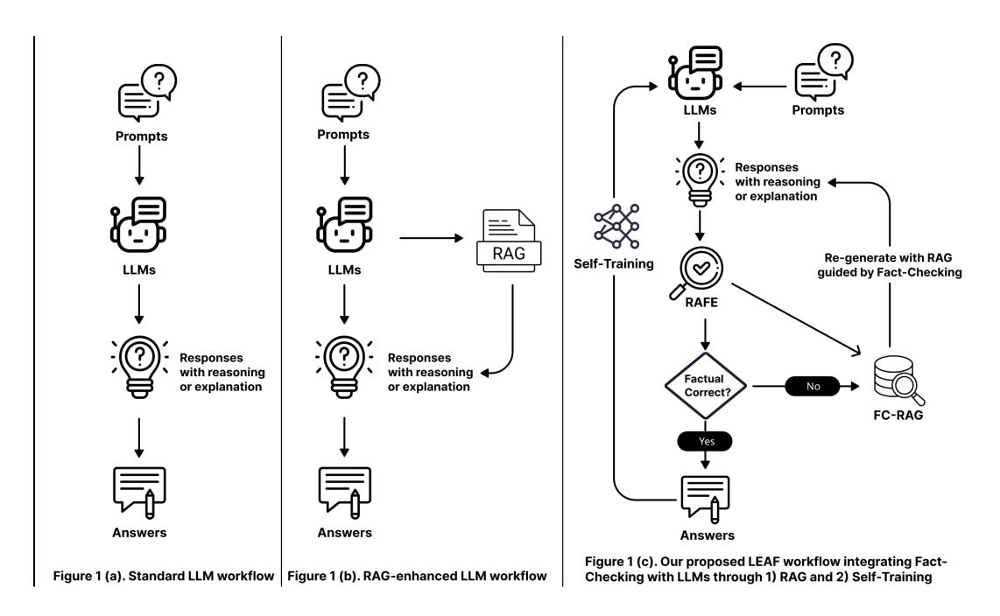
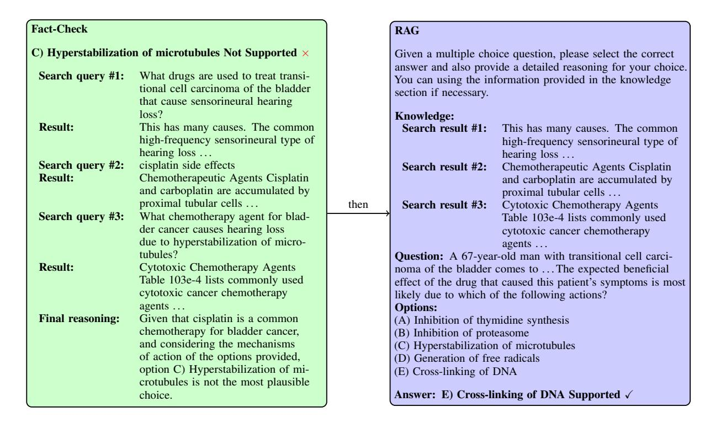
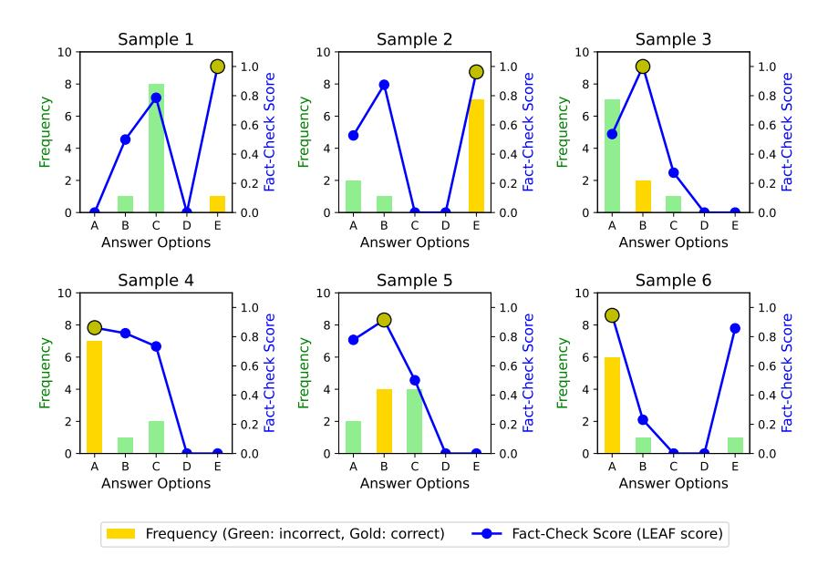

# LEAF: Learning and Evaluation Augmented by Fact-Checking to Improve Factualness in Large Language Models

Hieu Tran1,[2](#page-0-0)∗ , Junda Wang1,2 , Yujan Ting1 , Hong Yu2,3 , Weijing Huang1† [,](#page-0-0) Terrence Chen1 1 United Imaging Intelligence, Boston, MA, USA

2 Manning College of Information and Computer Sciences, University of Massachusetts Amherst, MA, USA 3 Miner School of Computer and Information Sciences, University of Massachusetts Lowell, MA, USA weijing.huang@uii-ai.com

# Abstract

Large language models (LLMs) often struggle with factual accuracy in knowledge-intensive domains like healthcare. We introduce LEAF (Learning and Evaluation Augmented by Fact-Checking), a framework for improving LLM factuality in medical question answering. LEAF comprises three components: (1) RAFE, a robust fact-checking system using open-source LLMs and domain-specific retrieval to evaluate response accuracy; (2) Fact-Check-then-RAG, which leverages factchecking results to guide retrieval without parameter updates; and (3) Learning from Fact Check, enabling self-training through supervised fine-tuning or preference-based learning using fact-checking as pseudo-labels. Experimental results show that RAFE outperforms Factcheck-GPT in detecting inaccuracies, Fact-Check-then-RAG effectively corrects errors, and Learning from Fact Check improves performance without labeled data. In a real-world healthcare deployment with proprietary medical documents, LEAF achieved an 83% improvement in factuality scores, demonstrating practical applicability for adapting generalpurpose LLMs to organization-specific knowledge. Our framework provides a scalable solution for industrial applications requiring high factual accuracy.

### 1 Introduction

Large language models (LLMs) have revolutionized natural language processing (NLP), bringing remarkable advancements to tasks such as question answering (QA). As a cornerstone task in NLP, QA involves generating accurate and contextually appropriate answers to questions posed in natural language. Their ability to comprehend complex prompts and generate human-like responses has

significantly enhanced the utility of QA systems in practical applications like knowledge retrieval, decision support, and education [\(Cai et al.,](#page-7-0) [2023;](#page-7-0) [Liu et al.,](#page-8-0) [2023;](#page-8-0) [Jin et al.,](#page-8-1) [2024\)](#page-8-1).

Medical QA highlights the significant demands and challenges faced by LLMs in QA tasks, particularly in ensuring factual accuracy and integrating relevant domain-specific knowledge. Accurate answers in medical QA often rely on retrievalaugmented generation (RAG) techniques, where models augment their responses by retrieving authoritative and up-to-date information from external knowledge sources [\(Singhal et al.,](#page-8-2) [2023;](#page-8-2) [Wu](#page-9-0) [et al.,](#page-9-0) [2024\)](#page-9-0). For example, determining the appropriate treatment for a patient may require accessing the latest clinical guidelines, retrieving evidencebased medical literature, or verifying specific diagnostic criteria. This dependence on knowledge retrieval underscores the critical importance of integrating reliable and domain-specific retrieval systems to address factual inaccuracies and ensure contextually relevant responses. Without robust retrieval mechanisms and rigorous factuality checks, LLMs risk generating plausible but incorrect information, which is particularly problematic in highstakes domains like healthcare.

To address this challenge, fact-checking has become a promising solution. Fact-checking mechanisms work by verifying the factual accuracy of generated content against reliable data sources, serving as a filter to detect and correct misinformation [\(Quelle and Bovet,](#page-8-3) [2024;](#page-8-3) [Wang et al.,](#page-9-1) [2024b\)](#page-9-1). Prior research has explored various methods for integrating fact-checking into LLM workflows, including verification techniques such as Factcheck-GPT, Factscore and SAFE [\(Wang et al.,](#page-9-2) [2023;](#page-9-2) [Wei](#page-9-3) [et al.,](#page-9-3) [2024;](#page-9-3) [Min et al.,](#page-8-4) [2023\)](#page-8-4). However, these approaches have notable limitations. For instance, frameworks like Factcheck-GPT and SAFE rely on proprietary model such as ChatGPT-3.5, which cannot be deployed on private datasets, restricting

∗ This work was done when Hieu Tran and Junda Wang were interns at United Imaging Intelligence.

† Corresponding author

Figure 1: Comparison of workflows: standard LLM workflow (left), RAG-enhanced LLM workflow (middle), and our proposed Fact-Checking integrated workflow (right).

their applicability in sensitive fields like healthcare. Additionally, reliance on Google Search for retrieving information exposes these frameworks to vulnerabilities, including inconsistent results and the potential inclusion of malicious content from the open web, further compromising reliability.

In this study, we introduce LEAF: Learning and Evaluation Augmented by Fact-Checking, a framework designed to improve the factual accuracy and reliability of LLMs through three complementary innovations:

- Retrieval-Augmented Factuality Evaluator (RAFE): A robust fact-checking system that combines open-source Qwen2-72B-Instruct with a domain-specific retrieval corpus, enhancing response reliability and accessibility compared to prior work such as Factcheck-GPT.
- Fact-Check-then-RAG: An innovative Retrieval-Augmented Generation method where retrieval is guided by fact-checking results. This approach selectively incorporates information to correct factual inaccuracies, improving contextual relevance without updating LLM parameters—a key advantage for proprietary models.
- Learning from Fact-Check via Self-Training: Two self-training mechanisms

leveraging fact-checked responses to update LLMs: (a) Supervised Fine-Tuning (SFT), using fact-checked outputs for model refinement; and (b) Preference-Based Learning with SimPO [\(Meng et al.,](#page-8-5) [2024\)](#page-8-5) or DPO [\(Rafailov et al.,](#page-8-6) [2023\)](#page-8-6), employing fact-checking as a ranking mechanism to further enhance the model's prioritization of factual responses.

Beyond controlled experimental settings, practical deployment of LLMs in industrial healthcare presents challenges. Organizations often need to adapt general-purpose models to proprietary knowledge while maintaining factual accuracy, a critical requirement for medical applications. When we deployed LEAF in a real-world healthcare setting with 208 proprietary medical documents, we encountered retrieval challenges due to domainspecific terminology overlap, leading us to develop adaptive retrieval strategies. Using LEAF as a core component, and through a three-phase approach combining continual pretraining, instruction tuning, and DPO with RAFE-based ranking, we achieved an 83% improvement in factuality scores (from 0.438 to 0.803), demonstrating LEAF's effectiveness in addressing the practical challenges of industrial deployment where general-purpose models must be adapted to organization-specific knowledge while maintaining high factual accuracy.

#### Retrieval-Augmented Factuality Evaluator (RAFE) 2. Generate re-1. Split into 3. Retrieve 4. Rate using Question statements trieval queries information retrieved information A 67-year-old man The patient's cisplatin ototox-Immunotherapy The patient's with transitional symptoms and icity mechanism such as pemsymptoms and cell carcinoma of physical examinaphysical examitransitional cell brolizumab is the bladder comes nation carcinoma bladder often used as .. tion ... to ...likely due to which of the Ototoxicity cisplatin ototoxicity Platinum-Ototoxicity from following actions? from cisplatin mechanism inner containing Output cisplatin causes a causes a highhair cells cochlea chemotherapeutic Supported: 1 high-frequency ... frequency. hearing loss ... agents ... Not Supported: 4 Response Factuality Score: 0.2 The mechanism The mechanism of The patient's Crosslinking Factual Correct?: No cisplatin mechanism of action of cis action of cisplatin symptoms and of DNA: of action free radicals platin involves involves generatphysical examina-Cisplatin cis-DNA crosslinking ... generating ... tion findings are diamminedichlor ing . consistent ... The However, the However, the cisplatin mechanism Mechanism of answer is C: Hvbeneficial effect beneficial effect action Molecular of action microtubule perstabilization of of cisplatin is stabilization cancer target Docetaxel of cisplatin is microtubules. its ability ... its ability ... treatment ... binds to ... The answer is chemotherapy drugs In patients with The answer is C: C: Hyperstatransitional cell evidence of early Hyperstabilization bilization of carcinoma bladder muscular invasion of microtubules. microtubules mechanism of . radical ...

Figure 2: The Retrieval-Augmented Factuality Evaluator (RAFE) assesses the factual accuracy of response in four steps. (1) Split and rewrite statements: The response is divided into individual statements while preserving dependencies, and relevant statements are rewritten to be self-contained by incorporating necessary context. (2) Generate retrieval queries: For each statement, an LLM generates multiple context-aware retrieval queries that consider the original question and previously retrieved documents. (3) Retrieve information: The retrieval system performs multiple searches (three per statement) to progressively build comprehensive supporting evidence. (4) Rate using retrieved information: Each statement is evaluated against the accumulated evidence while maintaining awareness of the broader context, and labeled as Supported or Not Supported. The final output includes a factuality score, calculated as the proportion of supported statements, which aids in selecting the most factually reliable response.

#### 2 Methodology

We present LEAF, a unified framework for enhancing the factual accuracy and reliability of large language model outputs. As illustrated in Figure 1, our methodology integrates fact-checking, retrieval-augmented generation, and self-training to systematically improve LLM factuality.

In conventional LLM workflows (Figure 1(a)), models generate responses without explicit factual verification. Standard Retrieval-Augmented Generation (Figure 1(b)) supplements prompts with documents retrieved by the question, but may introduce irrelevant context that can degrade accuracy.

To address these limitations, we introduce Fact-Check-then-RAG, a fact-checking-integrated work-flow (Figure 1(c)). In this enhanced approach, after the LLM generates a response, it is evaluated by a fact-checking system. If the response is factually correct, it is retained as the final output. However, if

the response is identified as incorrect, the workflow triggers a FC-RAG process, incorporating relevant documents retrieved during fact-checking into the prompt. This refined prompt guides the model to regenerate a more accurate response. This iterative process continues until a factually correct answer is achieved. In addition, factually verified responses are used for self-training. The model is fine-tuned on these fact-checked outputs, further improving its performance and reliability in generating factual responses. The following subsections provide a detailed breakdown of each component of our methodology.

# 2.1 Retrieval-Augmented Factuality Evaluator (RAFE)

We introduce the **Retrieval-Augmented Factuality Evaluator (RAFE)**, inspired by fact-checking frameworks like Factcheck-GPT, Factscore, and SAFE (Wang et al., 2023; Min et al., 2023; Wei [et al.,](#page-9-3) [2024\)](#page-9-3). Unlike prior work that relies on proprietary models and Google Search, RAFE utilizes the open-source Qwen2-72B-Instruct model and a domain-specific retrieval system covering both general (Wikipedia) and medical sources (PubMed, StatPearls, Medical Textbooks), improving accessibility and domain adaptation.

RAFE assesses the factual accuracy of generated responses through a context-aware process (see Figure [2\)](#page-2-0): (1) splitting the response into statements while preserving inter-sentence dependencies and rewriting relevant statements to be self-contained by incorporating necessary context from surrounding sentences; (2) generating context-aware retrieval queries that consider the original question, the statement, and previously retrieved documents; (3) performing multiple evidence searches (three per statement) to progressively build comprehensive support; and (4) rating each statement as Supported or Not Supported based on the accumulated evidence while maintaining awareness of the broader context. The response's factuality score is the proportion of supported statements; only responses with all statements supported are deemed factually correct. This design ensures that while statements are modularly evaluated, contextual relationships and dependencies are preserved throughout the fact-checking process.

# 2.2 Fact-Check-then-RAG

Our Fact-Check-then-RAG mechanism integrates fact-checking with Retrieval-Augmented Generation (RAG) by leveraging documents retrieved during fact-checking to improve response generation. Specifically, for statements that fail the factcheck in RAFE, relevant documents are retrieved from a comprehensive corpus (MedCORP [\(Xiong](#page-9-4) [et al.,](#page-9-4) [2024\)](#page-9-4)) using ColBERT [\(Khattab and Zaharia,](#page-8-7) [2020\)](#page-8-7), and incorporated into the RAG prompt. As illustrated in Figure [3,](#page-4-0) this targeted retrieval ensures the LLM is provided with essential context to address identified knowledge gaps and refine its responses. By enriching the RAG prompt with evidence from fact-checking, our method effectively increases the factual accuracy and reliability of generated content, outperforming standard RAG approaches. A detailed walkthrough with an example prompt for Fact-Check-then-RAG (Figure [7\)](#page-22-0) is provided in Appendix [A,](#page-10-0) illustrating how retrieved evidence from fact-checking is reused.

# 2.3 Learning from Fact-Check via Self-Training

We explore self-training mechanisms using factchecked responses to enhance the performance of LLMs. This approach consists of two main parts: supervised fine-tuning on factually correct responses and preference-based learning with Simple Preference Optimization.

# 2.3.1 Supervised Fine-Tuning on Factually Correct Responses

This phase involves fine-tuning the model on responses that have passed fact-checking, ensuring training on verified, accurate information and enhancing overall model performance. The LLM generates multiple responses to a given prompt, which are evaluated by the fact-checking system. Only responses with a factuality score of 1 are selected for fine-tuning. The model is then fine-tuned on these factually correct responses, reinforcing its ability to produce accurate and reliable outputs.

#### 2.3.2 Preference-based Learning with SimPO

The second part of our self-training approach utilizes Simple Preference Optimization [\(Meng et al.,](#page-8-5) [2024\)](#page-8-5). This process involves Fact-Checking as a Ranking Model: The fact-checking system assigns scores to generated responses based on their factual accuracy. The highest-scoring responses are selected as "chosen" and the lowest-scoring ones as "rejected". By using the fact-checking system as a ranking model, SimPO effectively guides the model to prefer factually accurate responses. More details are provided in Table [13](#page-13-0) in the Appendix.

### 3 Experiments

We evaluate each component of our workflow through a series of experiments, running a single iteration due to time and resource constraints. While further iterations may yield even better results, this initial evaluation already demonstrates the effectiveness of our methods. Experiments were conducted with two main model settings. For the large LLaMA 3 70B Instruct, we applied Fact-Checkthen-RAG to improve performance without parameter updates. For the smaller LLaMA 3 8B Instruct, we explored self-training—either supervised fine-tuning or preference-based learning—using responses validated by fact-checking instead of labeled data. This setup allows a rigorous comparison of parameter-free and self-training strategies enabled by fact-checking.

Figure 3: Fact-Check-then-RAG is able to change the answer of LLMs by leveraging the knowledge retrieved from fact-check stage to regenerate the responses.

# 3.1 Alignment Between Factuality and Correctness

We evaluate the alignment between factuality and correctness in LLaMA 3 70B responses across five datasets—MedQA, MMLU Medical, PubMedQA, BioASQ, and MedMCQA—using precision, recall, and F1 scores to compare Factcheck-GPT and RAFE. Precision is the fraction of responses labeled as factually correct that are actually correct, while recall measures the fraction of actually correct responses identified as factually correct. The F1 score summarizes both aspects.

As shown in Table 1, RAFE consistently outperforms Factcheck-GPT, achieving higher precision, recall, and F1 scores across all datasets. For example, on BioASQ, RAFE attains a precision of 96.27% versus Factcheck-GPT's 85.29%, and on MMLU Medical, RAFE's recall is 58.79% compared to 44.77%. These results demonstrate RAFE's superior ability to align factuality with correctness, making it a robust solution for reliable fact-checking in medical QA and other knowledge-intensive domains.

#### 3.2 Fact-Check-then-RAG

We evaluate the effectiveness of our Fact-Checkthen-RAG (FC-RAG) approach by comparing it to both the original LLaMA 3 70B Instruct model and

| Dataset  | Factcheck-GPT |        |       | ]         | RAFE   |       |
|----------|---------------|--------|-------|-----------|--------|-------|
|          | Precision     | Recall | F1    | Precision | Recall | F1    |
| MedQA    | 77.35         | 29.91  | 43.14 | 86.52     | 75.43  | 80.59 |
| MMLU-M   | 84.00         | 44.77  | 58.41 | 93.00     | 58.79  | 72.04 |
| PubMedQA | 50.93         | 63.37  | 56.47 | 72.76     | 69.64  | 71.16 |
| BioASQ   | 85.29         | 29.12  | 43.41 | 96.27     | 51.81  | 67.36 |
| MedMCQA  | 75.31         | 28.92  | 41.79 | 81.62     | 43.90  | 57.09 |

Table 1: Precision, recall, and F1 scores for Factcheck-GPT and RAFE across five medical QA datasets, MMLU-M mean MMLU-Medical. Bold values indicate higher scores.

| Dataset | MedQA | MMLU-M | PubMedQA | BioASQ | MedMCQA | Average |
|---------|-------|--------|----------|--------|---------|---------|
| CoT     | 73.53 | 85.12  | 60.60    | 80.58  | 71.21   | 74.21   |
| RAG     | 68.58 | 82.46  | 70.80    | 87.70  | 68.78   | 75.66   |
| FC-RAG  | 77.52 | 86.78  | 73.60    | 87.86  | 72.77   | 79.71   |

Table 2: Comparison of LLaMA 3 70B Instruct CoT, performance when using RAG, and FC-RAG on five medical QA datasets. Note that all of model's parameters remained unchanged. MMLU-M mean MMLU Medical

the standard RAG setting in MedRAG (Xiong et al., 2024). While standard RAG augments prompts with documents retrieved using the question as the query, FC-RAG instead incorporates information identified in the fact-checking stage.

As shown in Table 2, standard RAG sometimes degrades accuracy (e.g., on MedQA and MMLU-Medical), likely due to irrelevant or noisy retrieved

documents. In contrast, FC-RAG consistently improves accuracy across all datasets by selectively incorporating fact-checked information, achieving notable gains such as a 4.99% improvement on MedQA and 13.0% on PubMedQA. These results highlight the robustness of FC-RAG in reliably enhancing LLM outputs, especially where factual accuracy is crucial.

#### 3.3 Computational Analysis

Table 3 presents the inference costs on MedQA for two method: RAG and FC-RAG. The table reports the average number of model calls and the total number of tokens generated per question during the generation process. Traditional RAG required 1 call and average of generated 467.0 tokens, while for the FC-RAG, the number of calls is 3, with 1050.8 tokens generated on average.

|                       | RAG   | FC-RAG |
|-----------------------|-------|--------|
| Avg. calls            | 1.0   | 3.0    |
| Avg. generated tokens | 467.0 | 1050.8 |

Table 3: Inference costs on MedQA with RAG and FC-RAG. We show the average number of inferences and generated tokens required to answer a question.

To optimize the fact-checking process for practical deployment, we implemented parallel processing that reduced verification time from 20 seconds to 3-4 seconds per response, making the system viable for real-time applications. These optimizations, combined with the significant accuracy gains, justify the increased computational requirements for industrial deployments where factual accuracy is important.

| Method                       | MedQA | MMLU-M       | PubMedQA      | BioASQ | MedMCQA | AVG   |  |
|------------------------------|-------|--------------|---------------|--------|---------|-------|--|
| Original                     | 55.46 | 70.98        | 55.20         | 74.27  | 57.78   | 62.74 |  |
| Supervised Fine-Tuning (SFT) |       |              |               |        |         |       |  |
| SFT(Factcheck-GPT)           | 57.03 | 71.99        | 59.60         | 75.40  | 58.71   | 64.55 |  |
| SFT(RAFE)                    | 60.17 | 75.85        | 61.80         | 78.80  | 60.75   | 67.47 |  |
|                              | Pref  | erence-based | Learning (Sim | PO)    |         |       |  |
| SimPO(ArmoRM)                | 56.40 | 72.82        | 59.00         | 76.70  | 59.05   | 64.79 |  |
| SimPO(RAFE)                  | 59.54 | 73.65        | 62.00         | 81.72  | 60.67   | 67.52 |  |

Table 4: Comparison of performance on five medical QA datasets using Supervised Fine-Tuning (SFT) and Preference-Based Learning approaches with Llama 3 8B Instruct.

# 3.4 Supervised Fine-Tuning on Factually Correct Responses

We assess supervised fine-tuning (SFT) on fact-checked responses by applying it to the LLaMA 3

8B Instruct model across five medical QA datasets. Only responses passing the fact-check (factuality score = 1.0) are used for fine-tuning. We compare the resulting models to the original baseline and to those fine-tuned using Factcheck-GPT (Wang et al., 2023). As shown in Table 4, SFT with RAFE-validated responses yields consistent accuracy improvements, with gains such as +4.71% on MedQA and +6.60% on PubMedQA over the original model. RAFE further outperforms Factcheck-GPT across all datasets, demonstrating the effectiveness of leveraging fact-checking for fine-tuning and improving LLM performance.

# 3.5 Preference-based Learning on Ranked Responses

We evaluate preference-based learning using SimPO on responses ranked by our fact-checking system (RAFE) versus ArmoRM (Wang et al., 2024a). For each question, five responses are generated by LLaMA 3 8B Instruct (temperature 0.8), scored, and labeled as "chosen" or "rejected" based on their ranking. Table 4 shows that SimPO with RAFE rankings outperforms ArmoRM rankings, yielding improvements such as +4.08% on MedQA and +6.80% on PubMedQA. This advantage is attributed to RAFE's greater score separation between best and worst responses, resulting in more effective preference-based learning and higher post-training accuracy.

# 3.6 Industrial Application: Real-World Healthcare Deployment

To demonstrate practical applicability, we deployed LEAF in a real-world healthcare setting with proprietary medical knowledge. Our private medical dataset contained 208 domain-specific documents representing specialized knowledge that general-purpose models like Qwen2.5 72B Instruct lack. This scenario reflects a common industrial challenge: adapting LLMs to organization-specific knowledge while maintaining factual accuracy.

Three-Phase Training. (1) Continual Pretraining: Combined private medical data with 100k general-domain samples (DCLM (Li et al., 2024)) to inject proprietary knowledge while preventing catastrophic forgetting. It starts from Qwen2.5 72B Base model. (2) Instruction Tuning: Selected 200 high-quality Q&A pairs from our corpus, combined with 100k general-purpose instructions (constructed from OpenHermes (Teknium, 2023)). (3) DPO with LEAF: Used RAFE to curate prefer-

ence pairs from 1,320 Q&A pairs sourced from our corpus, generating 10 responses per prompt (temperature 1.0), keeping factuality scores of 1.0 as "chosen" and below 0.7 as "rejected."

Addressing Retriever Sensitivity. While ColBERT performed well on common medical datasets, it struggled with our specialized corpus, where documents contain highly similar terminology that is difficult to distinguish. To address this limitation, we developed HybridSearch, combining vector similarity using zpoint\_large\_embedding\_zh (iampanda, 2024) with BM25F scoring. Table 5 shows HybridSearch achieved 0.83 F1 versus ColBERT's 0.63, demonstrating the importance of adapting retrieval methods to specific domains.

| Retrieval Method | RAFE (Correct) | RAFE (Incorrect) | Prec.       | F1          |
|---------------------|-------------------|---------------------|-------------|-------------|
| ColBERT             | 0.627             | 0.378               | 0.63        | 0.63        |
| HybridSearch        | <b>0.852</b>      | <b>0.218</b>        | <b>0.81</b> | <b>0.83</b> |

Table 5: Retrieval method comparison on private medical dataset covering correct and incorrect Q&A pairs constructed from our private medical documents

**Results.** Table 6 shows evaluation on 100 Q&A pairs. Baseline Qwen2.5 72B Instruct achieved 0.438 RAFE score. After continual pretraining and instruction tuning, performance improved to 0.754. Final DPO with RAFE ranking enhanced factuality to 0.803—an 83% improvement over baseline, demonstrating LEAF's effectiveness in real-world industrial applications.

| Method                            | RAFE Score |
|-----------------------------------|------------|
| Qwen2.5 72B Instruct (Baseline)   | 0.438      |
| Pretrain-InstructTuning (72B)     | 0.754      |
| Pretrain-InstructTuning-DPO (72B) | 0.803      |

Table 6: Factuality evaluation on proprietary medical dataset (208 documents, 100 test questions). Scores averaged across 5 fact-checking runs.

#### 4 Related Work

Evaluating Factuality in Model Responses. Accurate evaluation of factuality is critical for reliable LLMs. Recent studies show that LLMs can serve as effective fact verifiers (Guan et al., 2024; Tian et al., 2023), and advances in human evaluation have further improved factuality assessment (Cheng et al., 2024). Factcheck-GPT (Wang et al., 2023) and

SAFE (Wei et al., 2024) present end-to-end solutions for annotating factuality, using proprietary LLMs and Google Search for granular assessment. Other methods such as Factool (Chern et al., 2023) segment responses for more detailed evaluation.

Hallucination Mitigation Methods. Self-CheckGPT (Manakul et al., 2023) and Chain-of-Verification (Dhuliawala et al., 2023) require inherent self-reflection capabilities. In contrast, LEAF uses external fact-checking against authoritative sources and leverages verified results for model improvement, providing a systematic solution.

**Retrieval-Augmented Generation.** RAG (Yih, 2020) integrates retrieved knowledge into language model outputs, boosting factuality in knowledge-intensive tasks. Extensions to the original RAG framework include (Borgeaud et al., 2022; Ram et al., 2023; Gao et al., 2023; Jiang et al., 2023), while biomedical applications span literature information-seeking and clinical support (Frisoni et al., 2022; Naik et al., 2022; Jin et al., 2023).

Learning from Fact-Check via Self-Training. Self-training approaches such as Med-Gemini (Saab et al., 2024) enhance clinical reasoning by integrating web search, while related general self-correction and rationale-augmented self-improvement approaches (Kumar et al., 2024; Huang et al., 2022) inform our design, but we emphasize medical adaptation and hallucination reduction through factuality validation.

#### 5 Conclusion

We investigated fact-checking mechanisms to enhance factual accuracy of large language models in medical question answering. Our Retrieval-Augmented Factuality Evaluator replaces closedsource LLMs and public web search with opensource models and specialized corpus retrieval, enabling a more controllable, cost-effective, and domain-adaptable solution. We introduced Fact-Check-then-RAG, which uses fact-checking in RAG and consistently improves response correctness without parameter updates. Furthermore, we proposed two learning strategies that leverage factchecking results as pseudo-labels for supervised fine-tuning and preference-based learning, removing the need for labeled data and supporting adaptation in low-resource scenarios. Results highlight LEAF's scalability and effectiveness for improving LLM factuality, providing a robust solution for knowledge-intensive domains like medical QA.

# 6 Limitations

Despite the promising results, our study has several limitations that need to be addressed in future work. One significant limitation is the speed and computational efficiency of the fact-checking system. The current implementation requires multiple iterations of inference with LLMs and several retrieval operations for each sentence in the responses. This process can be time-consuming and computationally intensive, potentially limiting the scalability and real-time applicability of our approach.

Additionally, our study primarily focused on the medical domain, leveraging datasets and corpora specific to healthcare. While this domain specificity ensured relevance and precision, it also limits the generalizability of our findings to other fields. Extending our approach to diverse domains and evaluating its effectiveness across various types of knowledge-intensive tasks will be crucial for broader applicability.

Our future works will also explore RAFE's performance upper bounds by leveraging more comprehensive medical corpora and investigating the impact of multiple rounds of self-training. Additionally, we plan to integrate stronger fact-checking models, such as Meta's LLaMA 405B, to enhance the precision of our fact-verification process and extend RAFE's applicability to other knowledgeintensive domains beyond healthcare.

# References

- Sebastian Borgeaud, Arthur Mensch, Jordan Hoffmann, Trevor Cai, Eliza Rutherford, Katie Millican, George Bm Van Den Driessche, Jean-Baptiste Lespiau, Bogdan Damoc, Aidan Clark, et al. 2022. Improving language models by retrieving from trillions of tokens. In *International conference on machine learning*, pages 2206–2240. PMLR.
- Pengshan Cai, Zonghai Yao, Fei Liu, Dakuo Wang, Meghan Reilly, Huixue Zhou, Lingxi Li, Yi Cao, Alok Kapoor, Adarsha Bajracharya, et al. 2023. Paniniqa: Enhancing patient education through interactive question answering. *Transactions of the Association for Computational Linguistics*, 11:1518– 1536.
- Furui Cheng, Vilém Zouhar, Simran Arora, Mrinmaya Sachan, Hendrik Strobelt, and Mennatallah El-Assady. 2024. Relic: Investigating large language model responses using self-consistency. In *Proceedings of the CHI Conference on Human Factors in Computing Systems*, pages 1–18.
- I-Chun Chern, Steffi Chern, Shiqi Chen, Weizhe Yuan, Kehua Feng, Chunting Zhou, Junxian He, Graham

- Neubig, and Pengfei Liu. 2023. Factool: Factuality detection in generative ai-a tool augmented framework for multi-task and multi-domain scenarios. corr, abs/2307.13528, 2023. doi: 10.48550. *arXiv preprint arXiv.2307.13528*.
- Shehzaad Dhuliawala, Mojtaba Komeili, Jing Xu, Roberta Raileanu, Xian Li, Asli Celikyilmaz, and Jason Weston. 2023. Chain-of-verification reduces hallucination in large language models. *arXiv preprint arXiv:2309.11495*.
- Giacomo Frisoni, Miki Mizutani, Gianluca Moro, and Lorenzo Valgimigli. 2022. Bioreader: a retrievalenhanced text-to-text transformer for biomedical literature. In *Proceedings of the 2022 conference on empirical methods in natural language processing*, pages 5770–5793.
- Yunfan Gao, Yun Xiong, Xinyu Gao, Kangxiang Jia, Jinliu Pan, Yuxi Bi, Yi Dai, Jiawei Sun, and Haofen Wang. 2023. Retrieval-augmented generation for large language models: A survey. *arXiv e-prints*, pages arXiv–2312.
- Jian Guan, Jesse Dodge, David Wadden, Minlie Huang, and Hao Peng. 2024. [Language models hallucinate,](https://doi.org/10.18653/v1/2024.naacl-long.62) [but may excel at fact verification.](https://doi.org/10.18653/v1/2024.naacl-long.62) In *Proceedings of the 2024 Conference of the North American Chapter of the Association for Computational Linguistics: Human Language Technologies (Volume 1: Long Papers)*, pages 1090–1111, Mexico City, Mexico. Association for Computational Linguistics.
- Dan Hendrycks, Collin Burns, Steven Basart, Andy Zou, Mantas Mazeika, Dawn Song, and Jacob Steinhardt. 2020. Measuring massive multitask language understanding. In *International Conference on Learning Representations*.
- Jiaxin Huang, Shixiang Shane Gu, Le Hou, Yuexin Wu, Xuezhi Wang, Hongkun Yu, and Jiawei Han. 2022. Large language models can self-improve. *arXiv preprint arXiv:2210.11610*.
- iampanda. 2024. [zpoint\\_large\\_embedding\\_zh.](https://huggingface.co/iampanda/zpoint_large_embedding_zh) Hugging Face Model Hub.
- Zhengbao Jiang, Frank F Xu, Luyu Gao, Zhiqing Sun, Qian Liu, Jane Dwivedi-Yu, Yiming Yang, Jamie Callan, and Graham Neubig. 2023. Active retrieval augmented generation. In *Proceedings of the 2023 Conference on Empirical Methods in Natural Language Processing*, pages 7969–7992.
- Di Jin, Eileen Pan, Nassim Oufattole, Wei-Hung Weng, Hanyi Fang, and Peter Szolovits. 2021. What disease does this patient have? a large-scale open domain question answering dataset from medical exams. *Applied Sciences*, 11(14):6421.
- Qiao Jin, Bhuwan Dhingra, Zhengping Liu, William Cohen, and Xinghua Lu. 2019. Pubmedqa: A dataset

- for biomedical research question answering. In *Proceedings of the 2019 Conference on Empirical Methods in Natural Language Processing and the 9th International Joint Conference on Natural Language Processing (EMNLP-IJCNLP)*, pages 2567–2577.
- Qiao Jin, Robert Leaman, and Zhiyong Lu. 2023. Retrieve, summarize, and verify: how will chatgpt affect information seeking from the medical literature? *Journal of the American Society of Nephrology*, 34(8):1302–1304.
- Qiao Jin, Zifeng Wang, Charalampos S Floudas, Fangyuan Chen, Changlin Gong, Dara Bracken-Clarke, Elisabetta Xue, Yifan Yang, Jimeng Sun, and Zhiyong Lu. 2024. Matching patients to clinical trials with large language models. *Nature Communications*, 15(1):9074.
- Omar Khattab and Matei Zaharia. 2020. Colbert: Efficient and effective passage search via contextualized late interaction over bert. In *Proceedings of the 43rd International ACM SIGIR conference on research and development in Information Retrieval*, pages 39– 48.
- Aviral Kumar, Vincent Zhuang, Rishabh Agarwal, Yi Su, John D Co-Reyes, Avi Singh, Kate Baumli, Shariq Iqbal, Colton Bishop, Rebecca Roelofs, et al. 2024. Training language models to selfcorrect via reinforcement learning. *arXiv preprint arXiv:2409.12917*.
- Jeffrey Li, Alex Fang, Georgios Smyrnis, Maor Ivgi, Matt Jordan, Samir Gadre, Hritik Bansal, Etash Guha, Sedrick Keh, Kushal Arora, et al. 2024. Datacomp-lm: In search of the next generation of training sets for language models. *arXiv preprint arXiv:2406.11794*.
- Siru Liu, Aileen P Wright, Barron L Patterson, Jonathan P Wanderer, Robert W Turer, Scott D Nelson, Allison B McCoy, Dean F Sittig, and Adam Wright. 2023. Using ai-generated suggestions from chatgpt to optimize clinical decision support. *Journal of the American Medical Informatics Association*, 30(7):1237–1245.
- Potsawee Manakul, Adian Liusie, and Mark JF Gales. 2023. Selfcheckgpt: Zero-resource black-box hallucination detection for generative large language models. In *Proceedings of the 2023 Conference on Empirical Methods in Natural Language Processing*, pages 9004–9017.
- Yu Meng, Mengzhou Xia, and Danqi Chen. 2024. Simpo: Simple preference optimization with a reference-free reward. *arXiv e-prints*, pages arXiv– 2405.
- Sewon Min, Kalpesh Krishna, Xinxi Lyu, Mike Lewis, Wen-tau Yih, Pang Wei Koh, Mohit Iyyer, Luke Zettlemoyer, and Hannaneh Hajishirzi. 2023. Factscore: Fine-grained atomic evaluation of factual precision in long form text generation. *arXiv preprint arXiv:2305.14251*.

- Aakanksha Naik, Sravanthi Parasa, Sergey Feldman, Lucy Lu Wang, and Tom Hope. 2022. Literatureaugmented clinical outcome prediction. In *Findings of the Association for Computational Linguistics: NAACL 2022*, pages 438–453.
- Ankit Pal, Logesh Kumar Umapathi, and Malaikannan Sankarasubbu. 2022. Medmcqa: A large-scale multi-subject multi-choice dataset for medical domain question answering. In *Conference on health, inference, and learning*, pages 248–260. PMLR.
- Dorian Quelle and Alexandre Bovet. 2024. The perils and promises of fact-checking with large language models. *Frontiers in Artificial Intelligence*, 7:1341697.
- Rafael Rafailov, Archit Sharma, Eric Mitchell, Stefano Ermon, Christopher D Manning, and Chelsea Finn. 2023. Direct preference optimization: Your language model is secretly a reward model. *arXiv preprint arXiv:2305.18290*.
- Ori Ram, Yoav Levine, Itay Dalmedigos, Dor Muhlgay, Amnon Shashua, Kevin Leyton-Brown, and Yoav Shoham. 2023. In-context retrieval-augmented language models. *Transactions of the Association for Computational Linguistics*, 11:1316–1331.
- Khaled Saab, Tao Tu, Wei-Hung Weng, Ryutaro Tanno, David Stutz, Ellery Wulczyn, Fan Zhang, Tim Strother, Chunjong Park, Elahe Vedadi, et al. 2024. Capabilities of gemini models in medicine. *arXiv e-prints*, pages arXiv–2404.
- Karan Singhal, Tao Tu, Juraj Gottweis, Rory Sayres, Ellery Wulczyn, Le Hou, Kevin Clark, Stephen Pfohl, Heather Cole-Lewis, Darlene Neal, et al. 2023. Towards expert-level medical question answering with large language models. *arXiv preprint arXiv:2305.09617*.
- Teknium. 2023. [Openhermes 2.5: An open dataset of](https://huggingface.co/datasets/teknium/OpenHermes-2.5) [synthetic data for generalist llm assistants.](https://huggingface.co/datasets/teknium/OpenHermes-2.5)
- Katherine Tian, Eric Mitchell, Huaxiu Yao, Christopher Manning, and Chelsea Finn. 2023. Fine-tuning language models for factuality. In *NeurIPS 2023 Workshop on Instruction Tuning and Instruction Following*.
- George Tsatsaronis, Georgios Balikas, Prodromos Malakasiotis, Ioannis Partalas, Matthias Zschunke, Michael R Alvers, Dirk Weissenborn, Anastasia Krithara, Sergios Petridis, Dimitris Polychronopoulos, et al. 2015. An overview of the bioasq large-scale biomedical semantic indexing and question answering competition. *BMC bioinformatics*, 16:1–28.
- Haoxiang Wang, Wei Xiong, Tengyang Xie, Han Zhao, and Tong Zhang. 2024a. Interpretable preferences via multi-objective reward modeling and mixture-ofexperts. *arXiv preprint arXiv:2406.12845*.

- Yuxia Wang, Revanth Gangi Reddy, Zain Muhammad Mujahid, Arnav Arora, Aleksandr Rubashevskii, Jiahui Geng, Osama Mohammed Afzal, Liangming Pan, Nadav Borenstein, Aditya Pillai, et al. 2023. Factcheck-gpt: End-to-end fine-grained documentlevel fact-checking and correction of llm output. *arXiv e-prints*, pages arXiv–2311.
- Yuxia Wang, Minghan Wang, Hasan Iqbal, Georgi Georgiev, Jiahui Geng, and Preslav Nakov. 2024b. Openfactcheck: A unified framework for factuality evaluation of llms. *arXiv preprint arXiv:2405.05583*.
- Jerry Wei, Chengrun Yang, Xinying Song, Yifeng Lu, Nathan Hu, Dustin Tran, Daiyi Peng, Ruibo Liu, Da Huang, Cosmo Du, et al. 2024. Long-form factuality in large language models. *arXiv e-prints*, pages arXiv–2403.
- Chaoyi Wu, Weixiong Lin, Xiaoman Zhang, Ya Zhang, Weidi Xie, and Yanfeng Wang. 2024. Pmc-llama: toward building open-source language models for medicine. *Journal of the American Medical Informatics Association*, page ocae045.
- Guangzhi Xiong, Qiao Jin, Zhiyong Lu, and Aidong Zhang. 2024. Benchmarking retrieval-augmented generation for medicine. *arXiv e-prints*, pages arXiv– 2402.
- Scott Yih. 2020. Retrieval-augmented generation for knowledge-intensive nlp tasks. In *Conference on Neural Information Processing Systems, Vancouver, Canada*.

# A Appendix

# A.1 Overview

This appendix provides supplementary information and detailed examples to support the methodology and results presented in the main paper. It is structured as follows:

- Datasets: A comprehensive description of the five medical datasets used in our experiments, including MedQA, MMLU-Medical, PubMedQA, BioASQ, and MedMCQA.
- Factuality Confusion Matrixes
- Fact-Checking as a Ranking Model
- Self-Training Experimental Setup: Detailed information about the infrastructure, hyperparameters, and training procedures used in our experiments.
- Prompts: Examples of prompts used for query generation, fact-checking, and retrievalaugmented generation, demonstrating how our system interacts with the language models.
- Fact-Checking Process: A step-by-step walkthrough of our fact-checking methodology, including:
  - 1. Query generation with context
  - 2. Retrieval from the MedCorp corpus
  - 3. Fact-checking with context
- Fact-Check-Then-RAG process: A walkthrough of how to use the fact-checking results to guide the RAG process.
- Impact of Fact-Checking and Sample Questions: An analysis of how fact-checking influences the selection of correct options, illustrated with examples and visualizations. This section includes a set of sample questions from the MedQA dataset to demonstrate the system's performance and allow for experiment reproduction.

Each section builds upon the previous ones, providing a comprehensive view of our methodology and its application. The examples and figures throughout the appendix are designed to illustrate key concepts and provide empirical support for our approach.

### A.2 Datasets

In this subsection, we describe the datasets used in our experiments. We utilize the MIRAGE benchmark [\(Xiong et al.,](#page-9-4) [2024\)](#page-9-4), which comprises five medical QA datasets, including three medical examination QA datasets and two biomedical research QA datasets. Specifically, the datasets are as follows:

MMLU-Med [\(Hendrycks et al.,](#page-7-11) [2020\)](#page-7-11): This dataset includes multiple-choice questions from medical examinations, testing the model's knowledge and reasoning in various medical domains.

MedQA [\(Jin et al.,](#page-7-12) [2021\)](#page-7-12): This dataset contains multiple-choice questions from the US medical licensing examination, designed to evaluate the model's understanding of medical concepts and clinical practices.

MedMCQA [\(Pal et al.,](#page-8-18) [2022\)](#page-8-18): This dataset features multiple-choice questions from Indian medical examinations, providing a diverse set of questions that test the model's knowledge in clinical medicine and medical science.

PubMedQA\* [\(Jin et al.,](#page-7-13) [2019\)](#page-7-13): Following the setting in the MIRAGE paper, we use a modified version of PubMedQA where all ground-truth supporting contexts are excluded, resulting in Pub-MedQA\*. This dataset focuses on yes/no questions derived from biomedical research articles, testing the model's ability to answer questions based solely on the questions without additional context.

BioASQ-Y/N [\(Tsatsaronis et al.,](#page-8-19) [2015\)](#page-8-19): This dataset contains yes/no questions from the BioASQ challenge, which aims to test the model's ability to understand and answer questions based on biomedical literature.

We adhere to the same settings as the MIRAGE paper, including only multiple-choice questions related to biomedicine and excluding all ground-truth supporting contexts for the questions. For example, in PubMedQA, we remove the contexts and only use the questions, resulting in PubMedQA\*. It is important to note that while we focus on medical QA tasks in this work, our workflow of integrating LLMs with fact-checking is generalizable to any domain and can be applied to various tasks beyond QA. We chose the QA task for its popularity in evaluating LLMs and demonstrating the effectiveness of our proposed workflow.

| Dataset              | MedQA | MMLU-Medical | PubMedQA | BioASQ | MedMCQA | Average |
|----------------------|-------|--------------|----------|--------|---------|---------|
| Lowest ArmoRM score  | 51.92 | 68.69        | 58.40    | 74.60  | 57.54   | 62.23   |
| Highest ArmoRM score | 56.80 | 73.19        | 60.20    | 78.32  | 59.91   | 65.68   |
| $\Delta(ArmoRM)$     | 4.88  | 4.50         | 1.80     | 3.72   | 2.37    | 3.45    |
| Lowest RAFE score    | 48.78 | 68.69        | 53.20    | 73.79  | 55.99   | 60.09   |
| Highest RAFE score   | 60.33 | 73.55        | 64.60    | 79.94  | 61.42   | 67.97   |
| $\Delta(RAFE)$       | 11.55 | 4.86         | 11.40    | 6.15   | 5.43    | 7.88    |

Table 7: Comparison of lowest and highest scored responses using ArmoRM and RAFE across five medical QA datasets on LLaMA 3 8B Instruct.  $\Delta$  represents the difference between the highest and lowest performance for each system.

#### **A.3** Factuality Confusion Matrixes

We evaluate the alignment between factual correctness and actual correctness of LLaMA 3 70B responses across five datasets—MedQA, MMLU Medical, PubMedQA, BioASQ, and MedMCQA—using Factcheck-GPT and RAFE. The alignment ratio, defined as the proportion of True Positives (TP) and True Negatives (TN) to total samples, quantifies the effectiveness of each fact-checking system.

**MedQA:** As shown in Table 8, Factcheck-GPT achieves an alignment ratio of 0.42, while RAFE improves this to 0.73, a 31% increase. RAFE significantly reduces misaligned predictions (false positives and false negatives).

**MMLU Medical:** In Table 9, RAFE improves the alignment ratio from 0.46 (Factcheck-GPT) to 0.61, a 15% gain, by increasing true positives (545 vs. 414) and true negatives (121 vs. 82).

**PubMedQA:** Table 10 shows RAFE improving the alignment ratio from 0.41 to 0.66 (+25%). RAFE achieves this by increasing alignment in both factual and actual correctness.

**BioASQ:** On BioASQ (Table 11), RAFE achieves an alignment ratio of 0.60 compared to 0.39 for Factcheck-GPT (+21%), with significant improvements in true positives (258 vs. 145).

**MedMCQA:** As seen in Table 12, RAFE achieves an alignment ratio of 0.53, compared to 0.43 for Factcheck-GPT (+10%). Despite the dataset's size, RAFE consistently improves aligned predictions.

**Summary:** RAFE consistently outperforms Factcheck-GPT across all datasets, with alignment ratio gains ranging from 10% to 31%. These results highlight RAFE's effectiveness in enhancing factual and actual correctness alignment.

| Method         | Type              | Actual Correct | Actual Incorrect | Alignment |
|----------------|-------------------|----------------|------------------|-----------|
| Factcheck-GPT  | Factual Correct   | 280            | 82               | 0.42      |
| racicileck-GF1 | Factual Incorrect | 656            | 255              | 0.42      |
| RAFE           | Factual Correct   | 706            | 110              | 0.73      |
|                | Factual Incorrect | 230            | 227              | 0.73      |

Table 8: Confusion matrix for the MedQA dataset, comparing Factcheck-GPT and RAFE.

| Method        | Type              | Actual Correct | Actual Incorrect | Alignment |  |
|---------------|-------------------|----------------|------------------|-----------|--|
| E4-bb-CDT     | Factual Correct   | 414            | 80               | 0.46      |  |
| Factcheck-GPT | Factual Incorrect | 513            | 82               | 0.46      |  |
| RAFE          | Factual Correct   | 545            | 41               | 0.61      |  |
|               | Factual Incorrect | 382            | 121              | 0.01      |  |

Table 9: Confusion matrix for the MMLU Medical dataset, comparing Factcheck-GPT and RAFE.

| Method        | Type              | Actual Correct | Actual Incorrect | Alignment |  |
|---------------|-------------------|----------------|------------------|-----------|--|
| Factcheck-GPT | Factual Correct   | 192            | 185              | 0.41      |  |
| Factcheck-GP1 | Factual Incorrect | 111            | 12               | 0.41      |  |
| RAFE          | Factual Correct   | 211            | 79               | 0.66      |  |
| KAFE          | Factual Incorrect | 92             | 118              | 0.00      |  |

Table 10: Confusion matrix for the PubmedQA dataset, comparing Factcheck-GPT and RAFE.

| Method        | Type              | Actual Correct | Actual Incorrect | Alignment |  |
|---------------|-------------------|----------------|------------------|-----------|--|
| Factcheck-GPT | Factual Correct   | 145            | 25               | 0.39      |  |
| Facteneck-GP1 | Factual Incorrect | 353            | 95               | 0.39      |  |
| RAFE          | Factual Correct   | 258            | 10               | 0.60      |  |
|               | Factual Incorrect | 240            | 110              |           |  |

Table 11: Confusion matrix for the BioASQ dataset, comparing Factcheck-GPT and RAFE.

| Method        | Type              | Actual Correct | Actual Incorrect | Alignment |  |
|---------------|-------------------|----------------|------------------|-----------|--|
| Factcheck-GPT | Factual Correct   | 863            | 283              | 0.43      |  |
|               | Factual Incorrect | 2121           | 916              |           |  |
| RAFE          | Factual Correct   | 1310           | 295              | 0.53      |  |
|               | Factual Incorrect | 1674           | 904              | 0.55      |  |

Table 12: Confusion matrix for the MedMCQA dataset, comparing Factcheck-GPT and RAFE.

#### A.4 Fact-Checking as a Ranking Model

We conducted an experiment to assess the effectiveness of our fact-checking system as a ranking model for responses generated by large language models. Five responses were generated using the LLaMA 3 8B Instruct model with a temperature setting of 0.8. Each response was then scored by our

fact-checking system, and the performance of the highest and lowest-scored responses was analyzed. For comparison, we also ran similar experiments using ArmoRM. (Wang et al., 2024a), a reward model designed to align LLMs with human preferences. ArmoRM is trained using human preference data, employing a Mixture-of-Experts (MoE) strategy to select suitable reward objectives based on context.

**LLaMA 3 8B (Lowest ArmoRM score):** Performance of the lowest scored response using the ArmoRM reward model.

**LLaMA 3 8B (Highest ArmoRM score):** Performance of the highest scored response using the ArmoRM reward model.

 $\Delta$ (**ArmoRM**): This indicates the difference in performance between the highest and lowest-scored responses using ArmoRM.

**LLaMA 3 8B (Lowest RAFE score):** Performance of the lowest scored response using RAFE.

**LLaMA 3 8B (Highest RAFE score):** Performance of the highest scored response using RAFE.

 $\Delta$ (RAFE): This indicates the difference in performance between the highest and lowest-scored responses using our fact-checking system.

As evident from table 7, our fact-checking system(RAFE) effectively ranks the responses to highlight the best-performing ones. The larger  $\Delta$  values for our system compared to ArmoRM demonstrate the robustness and efficiency of our fact-checking approach in differentiating between high-quality and low-quality responses.

#### A.5 Self-Training Experimental Setup

**Optimization with SimPO** The second part of our self-training approach utilizes Simple Preference Optimization (Meng et al., 2024) to rank and optimize responses based on their factual accuracy. SimPO aligns the reward formulation directly with the generation metric, eliminating the need for a reference model. This process involves Fact-Check as Ranking Model:

- Fact-Check as Ranking Model: The fact-checking system assigns scores to generated responses based on their factual accuracy. The highest-scoring responses are selected as "chosen" and the lowest-scoring as "rejected".
- SimPO Objective: The SimPO objective is designed to maximize the difference in rewards between the chosen and rejected responses.

The reward is calculated as:

$$r_{SimPO}(x, y) = \frac{\beta}{|y|} \sum_{i=1}^{|y|} \log \pi_{\theta}(y_i | x, y_{< i})$$
 (1)

where  $\beta$  is a scaling constant.

• Target Reward Margin: Additionally, we introduce a target reward margin term,  $\gamma > 0$ , to the Bradley-Terry objective to ensure that the reward for the winning response,  $r(x, y_w)$ , exceeds the reward for the losing response,  $r(x, y_l)$ , by at least  $\gamma$ :

$$p(y_w \succ y_l|x) = \sigma(r(x, y_w) - r(x, y_l) - \gamma). \tag{2}$$

Finally, we obtain the SimPO objective by incorporating the length-normalized reward:

$$L_{SimPO}(\pi_{\theta}) = -\mathbb{E}_{(x,y_w,y_l)\sim D}$$

$$\left[\log \sigma \left(\frac{\beta}{|y_w|}\log \pi_{\theta}(y_w|x)\right) - \frac{\beta}{|y_l|}\log \pi_{\theta}(y_l|x) - \gamma\right].$$
(3)

### A.5.1 Hyperparameters for Training

The training of the LLaMA 3 8B Instruct model was carefully configured using a set of hyperparameters designed to optimize the model's performance on the selected tasks. The key hyperparameters and their settings are summarized in Table 13.

The learning rate was set to  $1.0 \times 10^{-6}$ , a value selected after initial experimentation to balance the rate of convergence with the stability of training. A batch size of 4 per device was chosen to ensure that the model could effectively utilize the available GPU memory, while the gradient accumulation steps were set to 8 to allow for a larger effective batch size without exceeding memory limits.

The maximum sequence length was set to 2048 tokens, with a prompt length of 1800 tokens, ensuring that the model could process lengthy inputs and generate comprehensive responses. The AdamW optimizer was selected for its effectiveness in handling weight decay during training, and the cosine learning rate scheduler was used to gradually reduce the learning rate, facilitating smoother convergence.

The warmup ratio of 0.1 was implemented to gently ramp up the learning rate at the beginning of

training, reducing the risk of instability in the early stages. The number of training epochs was set to 5, balancing training time with the need for thorough model training.

Specific to SimPO, the beta and gamma hyperparameters were set to 2.5 and 1.4, respectively. These values were selected based on prior research and experimentation, optimizing the model's preference ordering during training. Finally, a seed of 42 was used to ensure reproducibility of the results.

| Hyperparameter              | Value  |
|-----------------------------|--------|
| Learning Rate               | 1.0e-6 |
| Batch Size per Device       | 4      |
| Gradient Accumulation Steps | 8      |
| Max Sequence Length         | 2048   |
| Max Prompt Length           | 1800   |
| Optimizer                   | AdamW  |
| LR Scheduler Type           | Cosine |
| Warmup Ratio                | 0.1    |
| Number of Training Epochs   | 5      |
| Beta (SimPO)                | 2.5    |
| Gamma (SimPO)               | 1.4    |
| Seed                        | 42     |

Table 13: Summary of Hyperparameters for Training with SimPO.

# A.5.2 Infrastructure

All experiments presented in this paper were conducted using a computing environment equipped with four NVIDIA H100 80GB GPUs. These GPUs are built on the Hopper architecture and feature HBM3 memory, providing exceptional performance for large-scale AI and machine learning tasks.

This high-performance hardware configuration enabled efficient handling of the computationally intensive tasks required for training and evaluating large language models across multiple medical datasets.

#### A.5.3 Self-Training Experiments

In this set of experiments, we focused on evaluating the impact of self-training using the Llama 3 8B Instruct model across five medical datasets. The process began by generating five responses for each prompt, with each prompt corresponding to a question in the selected medical datasets: MedQA, MMLU-Medical, PubMedQA, BioASQ, and MedMCQA.

After generating the responses, we applied two different approaches for each dataset:

- Supervised Fine-Tuning on Fact-Checked Responses: In this approach, we fine-tuned the model using only the responses that passed a rigorous fact-checking process. This ensured that the model learned from the most accurate data available.
- Simple Preference Optimization with Fact-Check Ranking: Here, we utilized fact-check scores to rank the generated responses. The highest-ranked responses were used for further optimization of the model via SimPO, refining the model's output quality based on factual correctness.

Each of these self-training methods—SFT and SimPO—was performed separately on each dataset to assess their individual impact on the model's performance. After the training process, we evaluated the accuracy and reliability of the fine-tuned models across the same medical QA datasets, allowing us to determine the effectiveness of each self-training approach.

It is important to note that all fine-tuning in this experiment was conducted as full fine-tuning without the use of any LoRA (Low-Rank Adaptation) techniques.

#### A.6 Prompts

In this section, we provide an overview of the various prompts used in our experiments (Table [14\)](#page-15-0). These prompts were designed to guide the LLM through different stages of processing, including query generation, fact-checking, and retrievalaugmented generation. Each prompt is tailored to specific tasks, ensuring the model receives clear instructions to perform the required actions effectively.

# • {\_KNOWLEDGE\_PLACEHOLDER}:

This represents the background information or facts that are provided to the model. It typically includes retrieved documents, or previously established facts that can help the model in its reasoning process.

• {\_CONTEXT\_PLACEHOLDER}: This contains the specific scenario or question that the model needs to address. In medical QA tasks, this often includes patient information, symptoms, and other relevant details of the

case. For example, in MedQA, this part is dynamically filled with a question and the corresponding answer options.

- {\_STATEMENT\_PLACEHOLDER}: This represents a specific claim or assertion that the model needs to evaluate or fact-check based on the given knowledge and context. In our medical QA experiments, this placeholder is filled with individual sentences from the LLM's initial response to a question. Each sentence is fact-checked separately to assess the factual accuracy of the entire response at a granular level.
- {\_QUESTION\_PLACEHOLDER}: In the Fact-Check-Then-RAG prompt, this represents the full question text that the model needs to answer.
- {\_OPTIONS\_PLACEHOLDER}: In the Fact-Check-Then-RAG prompt, this contains the list of multiple-choice options that the model can choose from when answering the question.

These placeholders are dynamically filled with appropriate content during the execution of our system, allowing for flexible and context-specific interactions with the language model.

# A.7 Fact-Checking Process

To evaluate the effectiveness of our fact-checking system, we conducted experiments using the Llama 3 70B Instruct model on several samples of the MedQA dataset. For each question, ten responses were generated with a temperature setting of 1.2. These responses were subsequently evaluated using our fact-checking system. The figure [8](#page-23-0) displays the frequency of each answer option along with the average fact-check score assigned to those options. Notably, the fact-check scores tend to be higher for the correct answers, which are highlighted in gold. This visualization illustrates the correlation between the frequency of selected options and their factual accuracy, as determined by the fact-checking system. The results demonstrate that the fact-checking system can reliably identify and score correct responses, supporting its utility in enhancing the factual accuracy of model outputs.

We present an example from the MedQA dataset to illustrate the fact-checking process. The example involves a 13-year-old boy presenting with severe

knee, hip, and groin pain. The prompt for the model was:

An example of MedQA Question *A 13-year-old boy presents to the emergency department with severe knee, hip, and groin pain. The patient has a past medical history notable only for obesity and asthma. His temperature is 98°F (36.7°C), blood pressure is 124/65 mmHg, pulse is 128/min, respirations are 14/min, and oxygen saturation is 99% on room air. Physical exam is notable for an inability of the patient to bear weight on his left leg and limited range of motion of the left hip. Which of the following is the best management for this patient?*

The available choices were:

- (A) Casting and crutches
- (B) Immobilization of the hip in a Pavlik harness
- (C) Supportive therapy and observation
- (D) Surgical drainage of the hip
- (E) Surgical pinning of the femoral head (Correct)

For this prompt, we generated 5 responses using the Llama 3 70B Instruct model with a temperature of 1.2. The responses were then fact-checked, with each sentence in the response being evaluated for factual accuracy against retrieved knowledge. The fact-check score for each response was calculated as the ratio of sentences supported by the retrieved knowledge to the total number of sentences in the response.

Table [15](#page-17-0) illustrates the LLM original generated responses, and their selected options, corresponding fact-check scores. In the markup text, sentences that were not supported by the retrieved knowledge are highlighted in red, while sentences that were supported remain in black.

We will take the first response in Table [15](#page-17-0) as an example to show how to do fact-check with context.

#### An Example of LLM original response

*\*\*(D) Surgical drainage of the hip\*\* \*\*Reasoning:\*\* This patient's symptoms and physical exam findings are highly suggestive of a septic hip, also known*

| Type                    | Prompt                                                                                                                                                                                                                                                                                                                       |
|-------------------------|------------------------------------------------------------------------------------------------------------------------------------------------------------------------------------------------------------------------------------------------------------------------------------------------------------------------------|
| Query gen-              |                                                                                                                                                                                                                                                                                                                              |
| eration with            |                                                                                                                                                                                                                                                                                                                              |
| context                 | <ul> <li>Instructions:</li> <li>1. You have been given a STATEMENT, a CONTEXT and some KNOWLEDGE points.</li> <li>2. Your goal is to try to find evidence that either supports or does not support the factual accuracy of the</li></ul>                                                                                     |
|                         | CONTEXT: {_CONTEXT_PLACEHOLDER}                                                                                                                                                                                                                                                                                           |
|                         | STATEMENT: {_STATEMENT_PLACEHOLDER}                                                                                                                                                                                                                                                                                       |
| Fact-check with         |                                                                                                                                                                                                                                                                                                                              |
| context                 | Instructions:  1. You have been given a STATEMENT, a CONTEXT and some KNOWLEDGE points.  2. Determine whether the given STATEMENT is supported by the given CONTEXT, you can use the given                                                                                                                                   |
| Fact-Check- Then-RAG | Given a multiple choice question, please select the correct answer and also provide a detailed reasoning for  → your choice. You can using the information provided in the knowledge section if necessary.  KNOWLEDGE: {_KNOWLEDGE_PLACEHOLDER}  QUESTION: {_QUESTION_PLACEHOLDER}  OPTIONS: {_OPTIONS_PLACEHOLDER}  ANSWER: |

Table 14: All prompts used in our work.

*as infectious arthritis of the hip. The patient's severe pain, limited range of motion, and inability to bear weight on the left leg are all consistent with an inflammatory response in the hip joint. The fact that the patient is afebrile (normal temperature) does not rule out septic arthritis, as some patients may not develop a fever. The past medical history of obesity and asthma are not directly related to the patient's current symptoms. The patient's vital signs indicate tachycardia (elevated heart rate), which may be due to pain or inflammation. Given the high likelihood of septic arthritis, the best management for this patient is surgical drainage of the hip (option D). Delaying drainage can lead to permanent damage to the joint and surrounding bone. Surgical drainage will allow for removal of infected fluid and tissue, as well as collection of a sample for microbiological analysis to guide antibiotic therapy. The other options are not appropriate in this scenario: \* (A) Casting and crutches are not indicated for a potentially infected joint. \* (B) Pavlik harness is a device used to treat developmental dysplasia of the hip in infants, not for septic arthritis in adolescents. \* (C) Supportive therapy and observation would not adequately address the potential infection and may lead to further harm. \* (E) Surgical pinning of the femoral head is not a treatment for septic arthritis; it may be used for fractures or other orthopedic conditions, but not for an infected joint. Therefore, the best management for this patient is surgical drainage of the hip (option D).*

# A.7.1 Query Generation with Context

First, we use the "Query generation with context" prompt (as shown in Table [14\)](#page-15-0) to generate a search query. For this example, the CONTEXT is the full question text, and the STATEMENT is a response generated by the LLM. A sample STATEMENT from the above response could be:

*Given the high likelihood of septic arthritis, the best management for this patient is surgical drainage of the hip (option D).*

The LLM then generates a search query based on this information:

13−year−old boy knee hip groin pain unable to bear weight ,→ best management

The detail is shown in Figure [4.](#page-18-0)

### A.7.2 Retrieval from MedCorp Corpus

Next, we use this query to retrieve 3 relevant documents from the MedCorp corpus using ColBERT retrieval. The retrieved documents provide additional context for fact-checking. This process is as shown in Figure [5.](#page-19-0)

# A.7.3 Fact-Check with Context

Finally, we use the "Fact-check with context" prompt (Table [14\)](#page-15-0) to evaluate the factual accuracy of the STATEMENT. The KNOWLEDGE placeholder is filled with the retrieved documents, and the CONTEXT and STATEMENT remain the same as in the query generation step. The filled prompt is shown in Figure [6.](#page-21-0)

The LLM then evaluates the statement and provides a reasoning:

*The STATEMENT is not supported by the CONTEXT. The CONTEXT does not provide any information that would support a diagnosis of septic arthritis or the need for surgical drainage of the hip. The patient's symptoms are more consistent with conditions such as slipped capital femoral epiphysis (SCFE), which is common in obese adolescents and typically requires surgical pinning of the femoral head.*

*Final answer: [Not Supported]*

This process is repeated for each sentence in the LLM's response, allowing for a granular assessment of the response's factual accuracy. The overall fact-check score for the response is then calculated as the ratio of supported sentences to the total number of sentences.

The results demonstrate that our fact-checking system can reliably identify and score correct responses, supporting its utility in enhancing the factual accuracy of model outputs.

# A.8 Fact-Check-Then-RAG

After the initial fact-checking process, if the LLM's response is found to contain inaccuracies, we employ the Fact-Check-Then-RAG approach to improve the response. This method leverages the

| Selected Option | Fact-Check Score | Response                                                                                                                                                                                                                                                                                                                                                                                                                                                                 |
|-----------------|------------------|--------------------------------------------------------------------------------------------------------------------------------------------------------------------------------------------------------------------------------------------------------------------------------------------------------------------------------------------------------------------------------------------------------------------------------------------------------------------------|
| D               | 0.75             | **(D) Surgical drainage of the hip** **Reasoning:** This patient's symptoms and physical exam findings are highly suggestive of a septic hip, also known as infectious arthritis of the hip. The patient's severe pain, limited range of motion, and inability to bear weight on the left leg are all consistent with an inflammatory response in                                                                                                                        |
|                 |                  | the hip joint. The fact that the patient is afebrile (normal temperature) does not rule out septic arthritis, as some                                                                                                                                                                                                                                                                                                                                                    |
|                 |                  | patients may not develop a fever. The past medical history of obesity and asthma are not directly related to the                                                                                                                                                                                                                                                                                                                                                         |
|                 |                  | patient's current symptoms. The patient's vital signs indicate tachycardia (elevated heart rate), which may be                                                                                                                                                                                                                                                                                                                                                           |
|                 |                  | due to pain or inflammation. Given the high likelihood of septic arthritis, the best management for this patient is surgical drainage of the hip (option D). Delaying drainage can lead to permanent damage to the joint and                                                                                                                                                                                                                                             |
|                 |                  | surrounding bone. Surgical drainage will allow for removal of infected fluid and tissue, as well as collection                                                                                                                                                                                                                                                                                                                                                           |
|                 |                  | of a sample for microbiological analysis to guide antibiotic therapy. The other options are not appropriate in                                                                                                                                                                                                                                                                                                                                                           |
|                 |                  | this scenario: * (A) Casting and crutches are not indicated for a potentially infected joint. * (B) Pavlik harness                                                                                                                                                                                                                                                                                                                                                       |
|                 |                  | is a device used to treat developmental dysplasia of the hip in infants, not for septic arthritis in adolescents. *  (C) Supportive therapy and observation would not adequately address the potential infection and may lead to                                                                                                                                                                                                                                         |
|                 |                  | further harm. * (E) Surgical pinning of the femoral head is not a treatment for septic arthritis; it may be used for                                                                                                                                                                                                                                                                                                                                                     |
|                 |                  | fractures or other orthopedic conditions, but not for an infected joint. Therefore, the best management for this                                                                                                                                                                                                                                                                                                                                                         |
| D.              | 0.5              | patient is surgical drainage of the hip (option D).                                                                                                                                                                                                                                                                                                                                                                                                                      |
| В               | 0.5              | **Answer**: (B) Immobilization of the hip in a Pavlik harness **Reasoning**: Based on the symptoms and physical exam findings, the most likely diagnosis is a slipped capital femoral epiphysis (SCFE). SCFE is a                                                                                                                                                                                                                                                        |
|                 |                  | common condition affecting adolescents, particularly obese individuals, where the epiphysis (growth plate) at                                                                                                                                                                                                                                                                                                                                                            |
|                 |                  | the proximal end of the femur slips, causing hip pain and limited mobility. The patient's age, symptoms, and physical exam findings are consistent with SCFE. The inability to bear weight on the left leg and limited range of                                                                                                                                                                                                                                          |
|                 |                  | motion of the left hip suggest a hip-related issue. SCFE is more common in obese individuals, and the patient's                                                                                                                                                                                                                                                                                                                                                          |
|                 |                  | history of obesity supports this diagnosis. Immobilization of the hip in a Pavlik harness (option B) is the best management for this patient. The Pavlik harness is a device that maintains the hip in a position that reduces                                                                                                                                                                                                                                           |
|                 |                  | the risk of further slippage and allows for gentle reduction of the epiphysis. This approach is often used for                                                                                                                                                                                                                                                                                                                                                           |
|                 |                  | SCFE, especially in cases where the slippage is mild to moderate. The other options are not appropriate for                                                                                                                                                                                                                                                                                                                                                              |
|                 |                  | this patient: * Casting and crutches (option A) would not be effective in reducing the risk of further slippage or                                                                                                                                                                                                                                                                                                                                                       |
|                 |                  | promoting healing. * Supportive therapy and observation (option C) would not provide adequate stability of                                                                                                                                                                                                                                                                                                                                                               |
|                 |                  | treatment for the condition. * Surgical drainage of the hip (option D) is not indicated, as SCFE is not typically associated with an infectious process. * Surgical pinning of the femoral head (option E) may be necessary in                                                                                                                                                                                                                                           |
|                 |                  | some cases of SCFE, but it is not the initial management of choice. Surgery is often reserved for more severe                                                                                                                                                                                                                                                                                                                                                            |
|                 |                  | cases or when orthopedic management fails. In conclusion, immobilization of the hip in a Pavlik harness is the                                                                                                                                                                                                                                                                                                                                                           |
|                 |                  | best management for this patient, given the likely diagnosis of SCFE and the need to reduce the risk of further                                                                                                                                                                                                                                                                                                                                                          |
| E               | 1.0              | slippage and promote healing.  (E) Surgical pinning of the femoral head **Reasoning**: The patient's symptoms, particularly the sudden                                                                                                                                                                                                                                                                                                                                   |
|                 |                  | onset of severe knee, hip, and groin pain, along with the inability to bear weight and limited range of motion                                                                                                                                                                                                                                                                                                                                                           |
|                 |                  | of the left hip, suggest a diagnosis of slipped capital femoral epiphysis (SCFE). SCFE is a common condition                                                                                                                                                                                                                                                                                                                                                             |
|                 |                  | in adolescents, particularly in those who are obese, which is consistent with the patient's past medical history SCFE occurs when the femoral head slips out of place at the growth plate, leading to a mismatch between the                                                                                                                                                                                                                                             |
|                 |                  | head and neck of the femur. This can cause significant pain, stiffness, and impaired mobility in the affected hip                                                                                                                                                                                                                                                                                                                                                        |
|                 |                  | and surrounding areas. Now, let's evaluate the options: (A) Casting and crutches are typically used for fractures                                                                                                                                                                                                                                                                                                                                                        |
|                 |                  | or sprains, which are not likely diagnoses based on the patient's symptoms. (B) Immobilization in a Pavlik                                                                                                                                                                                                                                                                                                                                                               |
|                 |                  | harness is usually used for developmental dysplasia of the hip (DDH) in infants, not for SCFE in adolescents. (C Supportive therapy and observation may be appropriate for minor injuries or self-limiting conditions, but SCFE                                                                                                                                                                                                                                       |
|                 |                  | requires more prompt and definitive treatment to prevent long-term complications, such as osteoarthritis and hip                                                                                                                                                                                                                                                                                                                                                         |
|                 |                  | deformities. (D) Surgical drainage of the hip is not typically indicated for SCFE, as there is no clear indication                                                                                                                                                                                                                                                                                                                                                       |
|                 |                  | of infection or abscess formation. (E) Surgical pinning of the femoral head is the most appropriate managemen                                                                                                                                                                                                                                                                                                                                                            |
|                 |                  | for this patient. This procedure involves stabilizing the femoral head with one or more pins to prevent further slippage and promote healing. Early surgical intervention can help prevent long-term complications and improve                                                                                                                                                                                                                                           |
|                 |                  | outcomes for patients with SCFE. Therefore, the correct answer is (E) Surgical pinning of the femoral head.                                                                                                                                                                                                                                                                                                                                                              |
| D               | 0.64             | **Answer**: D) Surgical drainage of the hip **Reasoning**: Based on the patient's symptoms and physical                                                                                                                                                                                                                                                                                                                                                                  |
|                 |                  | exam findings, the most likely diagnosis is a septic hip, which is a medical emergency. The patient's severe                                                                                                                                                                                                                                                                                                                                                             |
|                 |                  | pain, inability to bear weight, and limited range of motion of the left hip suggest an inflammatory process in the hip joint. Although the patient's temperature is normal, the patient's pulse is elevated, which could indicate                                                                                                                                                                                                                                        |
|                 |                  | an underlying infection. Given the patient's symptoms and physical exam findings, surgical drainage of the                                                                                                                                                                                                                                                                                                                                                               |
|                 |                  | hip is the best management option. Septic arthritis of the hip joint requires urgent surgical intervention to                                                                                                                                                                                                                                                                                                                                                            |
|                 |                  | drain the infected joint fluid, wash out the joint, and administer antibiotics to prevent long-term damage to the                                                                                                                                                                                                                                                                                                                                                        |
|                 |                  | joint. Option A, casting and crutches, is not appropriate for a suspected septic hip, as it would not address the                                                                                                                                                                                                                                                                                                                                                        |
|                 |                  | underlying infection. Option B, immobilization of the hip in a Pavlik harness, is used to treat developmental dysplasia of the hip in infants, not septic hip in adolescents. Option C, supportive therapy and observation                                                                                                                                                                                                                                               |
|                 |                  | 1 a replacia of the mp in maine, not depute mp in addication. Opion C, supportive inclapy and observation                                                                                                                                                                                                                                                                                                                                                                |
|                 |                  |                                                                                                                                                                                                                                                                                                                                                                                                                                                                          |
|                 |                  | would not be sufficient to manage a septic hip, as it would not address the underlying infection and could lead to                                                                                                                                                                                                                                                                                                                                                       |
|                 |                  | would not be sufficient to manage a septic hip, as it would not address the underlying infection and could lead to long-term joint damage. Option E, surgical pinning of the femoral head, is not indicated in this scenario, as it is used to treat femoral neck fractures or slipped capital femoral epiphyses, not septic hip. In conclusion, surgical drainage of the hip is the best management option for this patient to ensure prompt treatment of the suspected |

Table 15: Generated responses, selected options, fact-check scores, and response generated for the example question.

# An Example Prompt for Query Generation with Context

#### Instructions:

- 1. You have been given a STATEMENT, a CONTEXT and some KNOWLEDGE points.
- 2. Your goal is to try to find evidence that either supports or does not support the factual accuracy of the given STATEMENT in the given CONTEXT.
- 3. To do this, you are allowed to issue ONE Google Search query that you think will allow you to find additional useful evidence.
- 4. Your query should aim to obtain new information that does not appear in the KNOWLEDGE. This new information should be useful for determining the factual accuracy of the given STATE-MENT.
- 5. Format your final query by putting it in a markdown code block.

KNOWLEDGE: {\_KNOWLEDGE\_PLACEHOLDER}

CONTEXT: A 13-year-old boy presents to the emergency department with severe knee, hip, and groin pain. The patient has a past medical history notable only for obesity and asthma. His temperature is 98°F (36.7°C), blood pressure is 124/65 mmHg, pulse is 128/min, respirations 14/min, and oxygen saturation is 99% on room air. Physical exam is notable for an inability of the patient to bear weight on his left leg and limited range of motion of the left hip. Which of the following is the best management for this patient. The available choices were: (A) Casting and crutches (B) Immobilization of the hip in a Pavlik harness (C) Supportive therapy and observation (D) Surgical drainage of the hip (E) Surgical pinning of the femoral head.

STATEMENT: Given the high likelihood of septic arthritis, the best management for this patient is surgical drainage of the hip (option D).

#### LLM Response:

13-year-old boy knee hip groin pain unable to bear weight best management

Figure 4: An Example Prompt for Query Generation with Context

#### An Example Query to MedCorp Corpus

13-year-old boy knee hip groin pain unable to bear weight best management

#### Retrieved Docs from MedCorp Corpus with ColBERT Retrieval:

in extreme cases and in older children.Slipped Capital Femoral EpiphysisChildren ages 10 to 16 years can develop displacement of the epiphysis on the femoral neck with no history of injury. The slippage occurs through the weak zone (hypertrophic zone) of the growth plate. When slippage occurs in young patients, check for endocrine disorders such as hypothyroid-ism, renal osteodystrophy, and growth hormone deficiency. Slipped capital femoral epiphysis (SCFE) is associated with African-American heritage and obesity, and it is more com-mon in boys than in girls. One-quarter of cases are bilateral. In patients with endocrine etiology, the condition is usually bilateral. Patients generally present with groin and anterior thigh pain, and the patient may have antalgic gait and a limp. The mean age at onset is 6 years, with a range of 3 to 8 years. It is twice as common in male children. The patient or family will describe an acute onset of pain in the groin/hip, anterior thigh, or knee. Irritation of the obturator nerve can cause referred pain in the thigh and knee when the pathology is at the hip. Patients with transient synovitis are often afebrile, walk with a painful limp, and have normal to minimally elevated white blood cell count, C-reactive protein, and erythrocyte sedimentation rate compared with bacterial diseases of the hip (Table 199-1). Table 197-3 lists the differential diagnosis of a limping child. Anteroposterior and frog-leg radiographs of the hip are usually normal. Ultrasonography may reveal a joint effusion. and pelvic osteoto-mies, are done in older age groups and in more severe cases. Osteonecrosis of the femoral head is a possible complication of treatment and can result in pain and decreased range of motion.Legg-Calvé-Perthes DiseaseOsteonecrosis of the proximal femoral epiphysis can cause flattening of the femoral head called Legg-Calvé Perthes disease. The age at presentation is between 4 and 8 years

Figure 5: An example query to MedCorp Corpus and 3 retrieved documents

of age and occurs more in males, usually affecting one side. Younger age at presentation (less than 6 years old) will have a better prognosis. The patient presents with groin or knee

pain, decreased hip motion, and a limp.

knowledge retrieved during the fact-checking stage to generate a more accurate answer.

Using our example question about the 13-yearold boy, let's walk through the Fact-Check-Then-RAG process:

First, we use the "Fact-Check-then-RAG" prompt (as shown in Table [14\)](#page-15-0). The KNOWL-EDGE placeholder is filled with the relevant information retrieved during the fact-checking process. For our example, this might include:

*Slipped capital femoral epiphysis (SCFE) is associated with African-American heritage and obesity, and it is more common in boys than in girls. Patients generally present with groin and anterior thigh pain, and the patient may have antalgic gait and a limp. Patient may present with knee pain that can lead to missing the diagnosis. In pediatric patients with knee pain, the ipsilateral hip should be assessed as well.*

The QUESTION placeholder contains the original question text, and the OPTIONS placeholder lists the available choices. The prompt for the LLM would then look like Figure [7.](#page-22-0)

The LLM then generates a new response based on this prompt. It excludes the option D based on the knowledge retrieved from previous factchecking, and reaches the correct answer:

*(D) Surgical drainage of the hip is not typically indicated for SCFE, as there is no clear indication of infection or abscess formation.*

...

*Therefore, the correct answer is (E) Surgical pinning of the femoral head.*

This Fact-Check-Then-RAG process allows the LLM to generate a more accurate and wellreasoned response by incorporating the relevant medical knowledge retrieved during the factchecking stage. The resulting answer is not only correct but also provides a detailed explanation grounded in factual information.

# A.9 Impact of Fact-Checking and Sample Questions

To demonstrate the effectiveness of our factchecking system, we conducted experiments using the Llama 3 70B Instruct model on multiple

samples from the MedQA dataset. Figure [8](#page-23-0) illustrates the results of these experiments, showing the frequency of selected answer options and their corresponding fact-check scores.

For each of the six sample questions, we generated ten responses using a temperature setting of 1.2. Our fact-checking system then evaluated these responses, assigning scores to each option. The results reveal several key insights:

Correlation with Correct Answers: Across all samples, the correct answers (highlighted in gold) consistently received higher fact-check scores. This strong correlation demonstrates the ability of our fact-checking system to identify factually accurate responses.

Handling of Ambiguity: In some cases, such as sample 4, multiple options received relatively high fact-check scores. This suggests that our system can capture nuanced differences in factual accuracy, even when multiple options may have some degree of correctness.

Consistency Across Samples: The pattern of higher fact-check scores for correct answers is consistent across all six samples, indicating the robustness of our approach across different types of medical questions.

Potential for Improving Model Performance: The clear distinction in fact-check scores between correct and incorrect answers suggests that our system could be effectively used to enhance the model's decision-making process, potentially improving its overall performance on medical QA

To provide context for these results, we present the six sample questions from the MedQA dataset used in this analysis, shown in Figure [9](#page-24-0) and Figure [10.](#page-25-0)

These sample questions cover a range of medical scenarios and concepts, demonstrating the versatility of our fact-checking system across different types of medical knowledge and reasoning tasks.

tasks.

# An Example Prompt for Fact-Check with Context

# Instructions:

- 1. You have been given a STATEMENT, a CONTEXT and some KNOWLEDGE points.
- 2. Determine whether the given STATEMENT is supported by the given CONTEXT, you can use the given KNOWLEDGE to support your decision if necessary. The STATEMENT is supported if it is a proper action or reasoning given the CONTEXT.
- 3. Before showing your answer, think step-by-step and show your specific reasoning.
- 4. If the STATEMENT is supported by the CONTEXT, be sure to show the supporting evidence.
- 5. After stating your reasoning, restate the STATEMENT and then determine your final answer based on your reasoning and the STATEMENT.
- 6. Your final answer should be either "{SUPPORTED\_LABEL}" or "{NOT\_SUPPORTED\_LABEL}". Wrap your final answer in square brackets. KNOWLEDGE:
- (1). in extreme cases and in older children . . .
- (2). The mean age at onset is 6 years, with a range of 3 to 8 years . . .
- (3). and pelvic osteoto-mies, are done in older age groups and in more severe cases . . .
- (4) . . .

CONTEXT: A 13-year-old boy presents to the emergency department with severe knee, hip, and groin pain . . .

STATEMENT: Given the high likelihood of septic arthritis, the best management for this patient is surgical drainage of the hip (option D).

#### LLM Response:

The given STATEMENT is "Given the high likelihood of septic arthritis, the best management for this patient is Surgical drainage of the hip."

To determine if this STATEMENT is supported by the CONTEXT, I will analyze the information provided in the CONTEXT and compare it with the STATEMENT.

The CONTEXT describes a 13-year-old boy ...

Final answer: [Not Supported]

Figure 6: An example prompt for Fact-Check with context. The final answer to the statement is [Not Supported].

# An Example Prompt for Fact-Check-Then-RAG

Given a multiple choice question, please select the correct answer and also provide a detailed reasoning for your choice. You can using the information provided in the knowledge section if necessary.

#### KNOWLEDGE:

- (1). in extreme cases and in older children ...
- (2). The mean age at onset is 6 years, with a range of 3 to 8 years...
- (3). and pelvic osteoto-mies, are done in older age groups and in more severe cases...
- (4). ...

QUESTION: A 13-year-old boy presents to the emergency department with severe knee, hip, and groin pain. The patient has a past medical history notable only for obesity and asthma. His temperature is 98°F (36.7°C), blood pressure is 124/65 mmHg, pulse is 128/min, respirations 14/min, and oxygen saturation is 99% on room air. Physical exam is notable for an inability of the patient to bear weight on his left leg and limited range of motion of the left hip. Which of the following is the best management for this patient.

OPTIONS: (A) Casting and crutches (B) Immobilization of the hip in a Pavlik harness (C) Supportive therapy and observation (D) Surgical drainage of the hip (E) Surgical pinning of the femoral head.

#### ANSWER:

#### LLM Response:

(E) Surgical pinning of the femoral head \*\*Reasoning\*\*:

The patient's symptoms, particularly the sudden onset of severe knee, hip, and groin pain, along with the inability to bear weight and limited range of motion of the left hip, suggest a diagnosis of slipped capital femoral epiphysis (SCFE)... Therefore, the correct answer is (E) Surgical pinning of the femoral head.

Figure 7: An example prompt for Fact-Check-Then-RAG

Figure 8: Frequency of selected answer options and their corresponding fact-check scores across multiple samples from the MedQA dataset using the Llama 3 70B Instruct model. For each question, ten responses were generated with a temperature setting of 1.2. The fact-check system assigned scores to each option, with higher scores indicating higher factual accuracy. The correct answers, highlighted in gold, consistently received higher fact-check scores.

Sample 1: A 13-year-old boy presents to the emergency department with severe knee, hip, and groin pain. The patient has a past medical history notable only for obesity and asthma. His temperature is 98°F (36.7°C), blood pressure is 124/65 mmHg, pulse is 128/min, respirations are 14/min, and oxygen saturation is 99% on room air. Physical exam is notable for an inability of the patient to bear weight on his left leg and limited range of motion of the left hip. Which of the following is the best management for this patient?

#### Choices:

- (A) Casting and crutches
- (B) Immobilization of the hip in a Pavlik harness
- (C) Supportive therapy and observation
- (D) Surgical drainage of the hip
- (E) Surgical pinning of the femoral head

Sample 2: A 36-year-old nursing home worker presents to the clinic with the complaints of breathlessness, cough, and night sweats for the past 2 months. She further expresses her concerns about the possibility of contracting tuberculosis as one of the patients under her care is being treated for tuberculosis. A PPD skin test is done and reads 11 mm on day 3. Chest X-ray demonstrates a cavitary lesion in the right upper lobe. The standard anti-tuberculosis medication regimen is started. At a follow-up appointment 3 months later the patient presents with fatigue. She has also been experiencing occasional dizziness, weakness, and numbness in her feet. Physical exam is positive for conjunctival pallor. Lab work is significant for a hemoglobin level of 10 g/dL and mean corpuscular volume of 68 fl. What is the most likely cause of her current symptoms?

#### Choices:

- (A) Decreased methionine synthesis
- (B) Inhibition of ferrochelatase
- (C) Increased homocysteine degradation
- (D) Increased GABA production
- (E) Decreased ALA synthesis

Sample 3: A 72-year-old woman is admitted to the hospital for treatment of unstable angina. Cardiac catheterization shows occlusion that has caused a 50% reduction in the diameter of the left circumflex artery. Resistance to blood flow in this vessel has increased by what factor relative to a vessel with no occlusion?

#### Choices:

- (A) 64
- (B) 16
- (C) 8
- (D) 4
- (E) 32

Figure 9: Sample questions 1-3 from the MedQA dataset

Sample 4: A 49-year-old woman is brought to the emergency department with progressive dyspnea and cough which she developed approx. 8 hours ago. 2 weeks ago she had a prophylactic ovariectomy because of a family history of ovarian cancer. She is known to have type 2 diabetes mellitus and stage 1 hypertension, but she does not take her antihypertensives because she is not concerned about her blood pressure. Also, she has a history of opioid abuse. She takes metformin 1000 mg and aspirin 81 mg. She has been smoking 1 pack of cigarettes per day for 22 years. Her vital signs are as follows: blood pressure 155/80 mm Hg, heart rate 101/min, respiratory rate 31/min, and temperature 37.9C (100.2F). Blood saturation on room air is 89%. On examination, the patient is dyspneic and acrocyanotic. Lung auscultation reveals bilateral rales over the lower lobes. A cardiac examination is significant for S2 accentuation best heard in the second intercostal space at the left sternal border and S3 presence. There is no leg edema. Neurological examination is within normal limits. Arterial blood gases analysis shows the following results: pH 7.49 PaO2 58 mm Hg PaCO2 30 mm Hg HCO3- 22 mEq/L Based on the given data, which of the following could cause respiratory failure in this patient?

#### Choices:

- (A) Increased alveolar dead space due to absent perfusion of certain alveoli
- (B) Ischemia of the medullary respiratory center neurons
- (C) Alveolar fibrosis
- (D) Depression of the respiratory center via opioid receptors activation
- (E) Decreased V/Q due to bronchial obstruction

Sample 5: While in the ICU, a 62-year-old male undergoes placement of a Swan-Ganz catheter to evaluate his right heart pressures. All pressures are found to be within normal limits, and the cardiology fellow records a pulmonary wedge pressure of 10 mmHg. Which of the following are normal values for the pressures that will be obtained from this patient's right ventricle? Choices:

- (A) 25/10 mmHg
- (B) 25/5 mmHg
- (C) 10/0 mmHg
- (D) 100/5 mmHg
- (E) 100/70 mmHg

Sample 6: A previously healthy 6-year-old boy is brought to the physician because of generalized malaise and a palpable swelling in the left axilla. The parents report that 2 weeks ago, his daycare group visited an animal shelter, after which he developed a rash on the left hand. His temperature is 38.5°C (101.3°F). Physical examination shows three linear crusts on an erythematous background on the dorsum of the left hand. There is tender left-sided axillary and cervical lymphadenopathy. Histopathologic examination of an axillary lymph node shows necrotizing granulomas. The most likely causal organism of this patient's clinical findings is also involved in the pathogenesis of which of the following conditions?

- Choices:
- (A) Bacillary angiomatosis
- (B) Burkitt lymphoma
- (C) Condylomata lata
- (D) Brucellosis
- (E) Bubonic plague

Figure 10: Sample questions 4-6 from the MedQA dataset