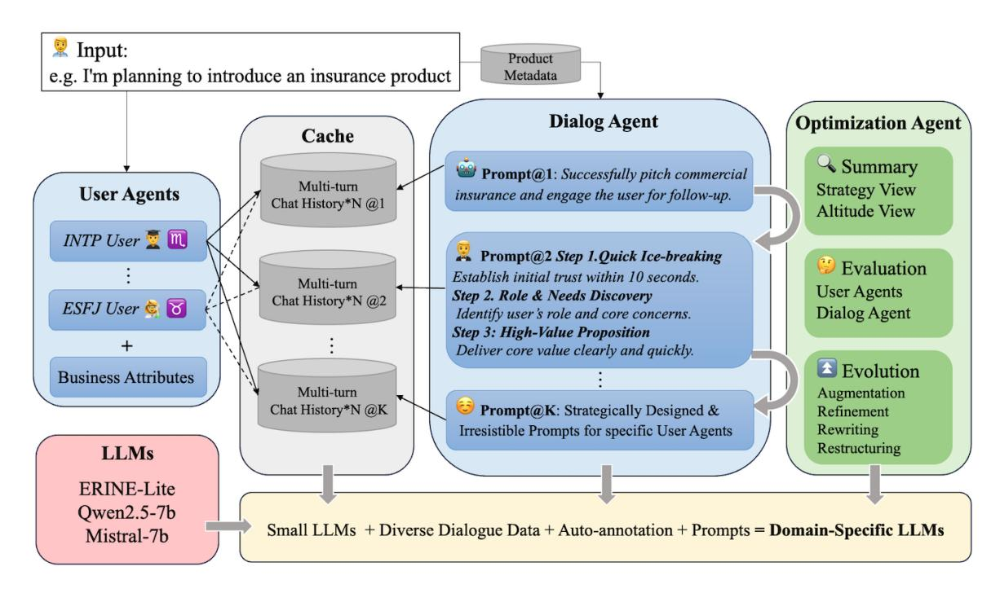
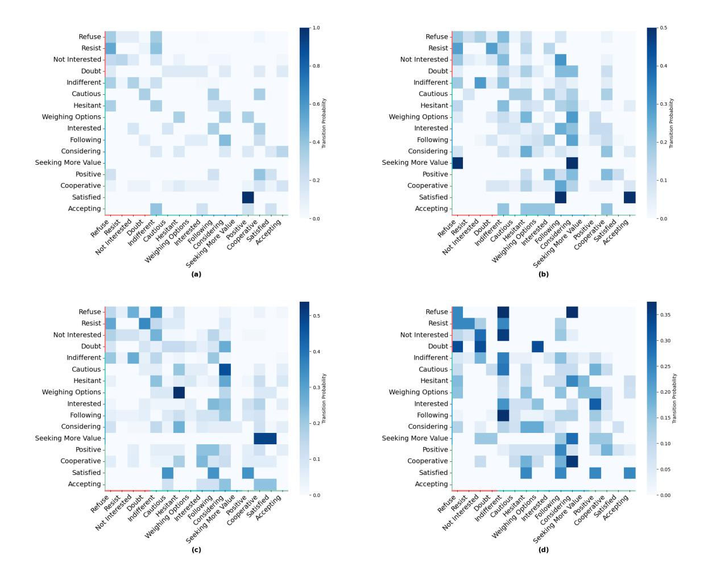
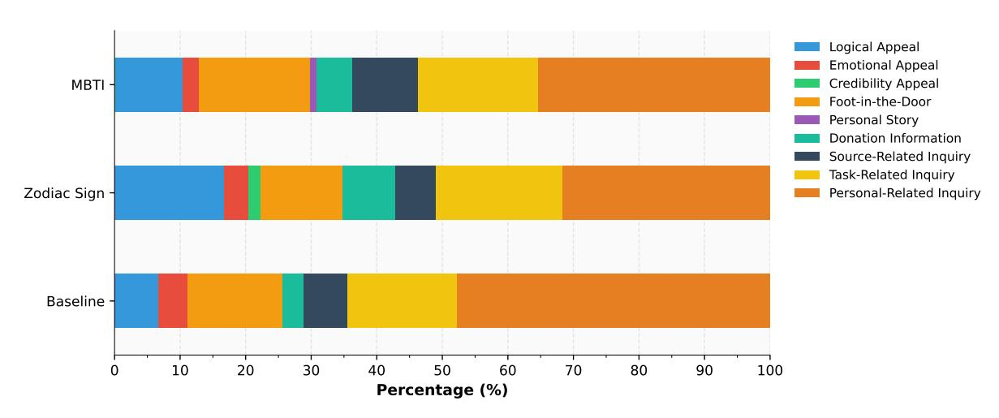

# <span id="page-0-0"></span>MADS: Multi-Agent Dialogue Simulation for Diverse Persuasion Data Generation

Mingjin Li[\\*](#page-0-0) Yu Liu Huayi Liu Xiang Ye Chao Jiang Hongguang Zhang Yu Ruan

Baidu Inc., Beijing, China

{limingjin01, liuyu82, liuhuayi, yexiang02, jiangchao08, zhanghongguang, ruanyu}@baidu.com

# Abstract

We propose MADS (Multi-Agent Dialogue Simulation), a scalable framework for generating persuasive multi-turn dialogues via agent self-play. MADS employs three coordinated agents: User Agents designed to simulate diverse persona-driven behaviors by leveraging personality signifiers such as Zodiac Signs and MBTI types, a Dialog Agent executing taskoriented persuasion strategies and an Optimization Agent evaluating and refining dialogue outcomes. We further validate its effectiveness through users' Chain-of-Attitude (CoA) modeling and dedicated LLMs' persuasion assessment. This approach enables low-cost generation of training data without human annotation, addressing key industry challenges such as lack of user data, cold-start evaluation difficulties, and prompt inefficiency. Applied to a real-world marketing scenario, MADS significantly improved the persuasion capacity of small LLMs, increasing the organic traffic conversion rate by 22.4% (from 1.83% to 2.24%) , demonstrating clear business value.

# 1 Introduction

Persuasive capability is a critical advantage for task-oriented dialogue systems, particularly in domains such as marketing, healthcare, and finance. Enabling conversational agents to influence user decisions—whether for conversion or engagement—has shown practical benefits in customerfacing applications[\(Liu et al.,](#page-8-0) [2025\)](#page-8-0). Recent studies show that LLM-based agents can exhibit superior moral and emotional language performance compared to humans, raising expectations for their deployment in persuasive tasks[\(Carrasco-Farré,](#page-7-0) [2024\)](#page-7-0).

Several approaches have been explored to enhance persuasive dialogue generation. PersRFI reduces redundancy and inconsistency in persuasive dialogues through reinforcement learning[\(Shi](#page-8-1)

[et al.,](#page-8-1) [2021\)](#page-8-1). In multi-agent systems, COOPER coordinates agents in negotiation and persuasion dialogues, yielding more efficient collaborative strategies[\(Cheng et al.,](#page-7-1) [2023\)](#page-7-1), and Cohesive Conversations enhance dialogue realism through multi-agent inconsistency detection[\(Chu et al.,](#page-7-2) [2024\)](#page-7-2). However, many of these approaches depend heavily on real user data or human feedback, limiting their scalability and practicality in cold-start or earlystage deployments. SpeechAgents introduces vocal modality to simulate emotionally expressive personas[\(Zhang et al.,](#page-9-0) [2024\)](#page-9-0), but it remains limited in goal-directed, strategic business scenarios such as marketing.

Other researchers have noted the limited effectiveness of LLM-based agents in cold-start and long-tail business cases[\(Braggaar et al.,](#page-7-3) [2023\)](#page-7-3), and analyzed issues like goal drift in multi-turn LLM dialogues[\(Laban et al.,](#page-8-2) [2025\)](#page-8-2) . Other studies explore LLMs' sensitivity to prompt perturbations across diverse task types [\(Cao et al.,](#page-7-4) [2024\)](#page-7-4)[\(Zhuo](#page-9-1) [et al.,](#page-9-1) [2024\)](#page-9-1), highlighting the fragility of current prompting strategies in dynamic settings.

In real-world, LLM-based dialogue systems still face three major challenges:

- Lack of authentic user data: Existing corpora rarely contain multi-turn dialogues with user profile context, making it difficult to support personalized persuasion modeling.
- Cold-start evaluation difficulty: New systems lack interaction logs, rendering benchmark evaluations unreliable.
- Low prompt engineering efficiency: Most prompts are mostly manually designed, making them brittle and difficult to generalize across different user roles and contexts.

To address these limitations, we propose MADS (Multi-Agent Dialogue Simulation), a closedloop framework for simulating structured, multistrategy persuasive dialogues through agent selfplay (Fig[.1\)](#page-1-0). This framework supports scalable gen-

<sup>\*</sup>[Corresponding author.](#page-8-1)

<span id="page-1-0"></span>

Figure 1: Architecture of the MADS Framework

eration of high-quality training data with minimal human annotation, making it particularly suitable for cold-start scenarios.

# 2 Related Work

Multi-Agent Dialogue Simulation and User Modeling: Basic user profile attributes (e.g. name, sex, occupation, age, level of education) constructed from standard demographic attributes are widely used in the recommendation system[\(Zhang](#page-9-2) [et al.,](#page-9-2) [2018\)](#page-9-2)[\(Zheng et al.,](#page-9-3) [2019\)](#page-9-3). Seminal works show that such tags can be easily sampled from existing statistical datasets or public samples[\(Ricci](#page-8-3) [et al.,](#page-8-3) [2015\)](#page-8-3)[\(Li et al.,](#page-8-4) [2016\)](#page-8-4), and can be automatically assigned using simple probabilistic distributions, significantly enhancing the diversity and conversational realism compared to rule-based agents. Generative Agent Simulations (GAS), combines real user interviews with LLMs to simulate complex social structures, albeit at a higher cost[\(Park](#page-8-5) [et al.,](#page-8-5) [2024\)](#page-8-5). Recent methods like IntellAgent use LLMs to construct user personas for evaluating unseen scenarios[\(Levi and Kadar,](#page-8-6) [2025\)](#page-8-6), while genetic algorithms and multi-agent coordination enhance simulation diversity[\(Cai et al.,](#page-7-5) [2025\)](#page-7-5). Compared to rule-based approaches, LLM-driven simulation offers greater generalizability and efficiency[\(Wang et al.,](#page-9-4) [2024\)](#page-9-4).

LLM-Based Dialogue Evaluation: LLM-based evaluation has emerged as an alternative to manual

scoring. Recent work simulates multi-perspective user feedback(e.g., gender, age, political stance) to improve fairness and task alignment[\(Wan et al.,](#page-8-7) [2024\)](#page-8-7)[\(Nan et al.,](#page-8-8) [2024\)](#page-8-8). Combined scoring methods can improve diversity and coherence assessment but remain sensitive to prompts and metrics[\(Sun et al.,](#page-8-9) [2025\)](#page-8-9).For persuasion-specific tasks, *MakeMePay*[1](#page-1-1) and *PersuasiveToM*[\(Yu et al.,](#page-9-5) [2025\)](#page-9-5) provide standardized evaluation settings for behavioral reasoning and strategic adaptation. *DailyPersuasion*[\(Jin et al.,](#page-8-10) [2024\)](#page-8-10) dataset gives a practical foundation for strategy-aware training in persuasive dialogue across domains. However, existing benchmarks still lack coverage of many real-world scenarios and are not easily adaptable to practical constraints[\(Giudici,](#page-8-11) [2024\)](#page-8-11).

Personality Tags and Behavioral Diversity: To simulate diverse user behaviors, prior work often conditions user models on personality traits—most commonly MBTI types or Big Five—alongside profile cues such as demographics, roles, or stable preferences.[\(Cheng et al.,](#page-7-6) [2025\)](#page-7-6)[\(Fernau et al.,](#page-8-12) [2022\)](#page-8-12)[\(Zhao et al.,](#page-9-6) [2025\)](#page-9-6) . Further evidence indicates that carefully engineered personality profiles can effectively steer large language models (LLMs) to simulate distinct user behaviors, while the attainable diversity is ultimately bounded by the diver-

<span id="page-1-1"></span><sup>1</sup>OpenAI (2024). Make-Me-Pay: OpenAI Evals Suite.GitHub Repository. [https://github.com/openai/](https://github.com/openai/evals/tree/main/evals/elsuite/make_me_pay) [evals/tree/main/evals/elsuite/make\\_me\\_pay](https://github.com/openai/evals/tree/main/evals/elsuite/make_me_pay)

sity encoded in the prompt design itself.(Paradeda et al., 2020)(Andrews, 2012)(Ait Baha et al., 2023). However, these approaches typically depend on careful scenario design, detailed personality specifications, and even large-scale real-user interviews; while academically rigorous and comprehensive, they are hard to reproduce in real-world cold-start deployments where such resources and priors are scarce.

# 3 Methodology

Our methodology is firmly rooted in concrete, domain-specific requirements. Drawing on Hegel's "right vs. right" conception (Hegel, 1975), we argue that what is truly scarce is not a compliant chatbot, but user simulations that are both reasonable and diverse. Previous pipelines often push agents toward rigid, template-like behavior through overspecified prompts and restrictive role definitions, effectively confining dialogue diversity to a narrow behavioral manifold. When simulated users generate responses that go beyond the agent's predefined expectations, we posit that an optimization agent should reward these informative shifts in conversational stance rather than mere adherence to rules.

MADS generates training data through multiagent self-play simulation, which feeds into a platform-based LLM training pipeline, forming a self-optimizing, closed-loop process: **Meta Instruction**  $\rightarrow$  **Simulation**  $\rightarrow$  **Optimization**  $\rightarrow$  **Domain-Specific LLMs**. This framework enables low-cost, high-fidelity modeling of user interactions tailored to specific domains. As shown in Fig.1, MADS consists of three modules:

**User Agents** defines structured user profiles within system prompts, to simulate diverse personas with varying personality traits and business contexts.

**Dialog Agent** engages in multi-turn interactions with selected User Agents, conducting N independent dialogues per profile.

**Optimization Agent** automates dialogue annotation and prompt refinement via three sub-modules: *Summary*, *Evaluation*, and *Evolution*. The prompts can be found in Appendix A.4.

We conduct a comprehensive evaluation to assess how MADS improves both dialogue diversity and persuasive effectiveness. Our methodology targets two key aspects: 1) the quality of simulated data, with a focus on attitude diversity and richness

of persuasive strategies. 2) the downstream impact on model performance via fine-tuning small-scale dialogue models.

## 3.1 Chain-of-Attitude (CoA)

User attitude change is a critical signal of success in persuasive tasks. Drawing on classic marketing models like AIDA model(Lewis, 1899)(Corporate Finance Institute, 2024) and the Elaboration Likelihood Model (ELM)(Petty and Cacioppo, 1986)(Cialdini, 2001), we define a structured progression of user attitudes and model their transitions as an attitude chain across multi-turn dialogues.

To capture user attitude dynamics during the dialogue process, we constructed a hierarchical state space consisting of 16 attitude states, the full list of states and their descriptions are included in AppendixA.1. This design follows the principle of progressive attitude change, reflecting the psychological transition from initial resistance to eventual acceptance.

Within a fixed set of user profile tags, user attributes are randomly sampled within predefined ranges to generate N User Agent system prompts. Using each persona prompt along with a base Dialog Agent prompt, we simulate multi-turn dialogues, resulting in a collection of multi-turn dialogues:  $\mathcal{D} = \{D^1, D^2, ..., D^N\}$ .

In the Optimization Agent's Summary step, an LLM-based classifier  $L^{attitude}$  classifies user attitudes at each turn of multi-turn dialogues. The attitude chain for a single dialogue round is represented as:  $X^n = L^{attitude}(D^n) \in S$  where S is the set of attitude states, and the set of CoA for simulation of N is:  $\mathbf{X}^N = \langle X^1, X^2, ..., X^N \rangle$ 

Next, we employ a first-order Markov model to represent the sequence of user attitude transitions. Two assumptions are made in this context:

1) Changes in user attitude are primarily influenced by the current dialogue content and the immediate interaction experience. 2) Compared to more distant history, the most recent attitude state has the strongest predictive power for the current decision.

The transition probability matrix for **CoA** is given by:

$$T_{ij} = P(X_t = s_j | X_{t-1} = s_i) = \frac{N_{ij}}{\sum_{k=1}^{|S|} N_{ik}}$$

Where  $N_{ij}$  denotes the count of transitions from state  $s_i$  to  $s_j$  observed in  $\mathbf{X}^N$  and t represents the current dialogue turn.

Based on the above modeling, we use *average information entropy* as a quantitative metric for the diversity of attitude changes in  $\mathcal{D}$ :

$$H(T_i) = -\sum_{j:T_{ij}>0} T_{ij} \log T_{ij},$$

$$H_{avg}(\mathbf{X}^N) = \frac{1}{|S|} \sum_{i=1}^{|S|} H(T_i)$$

The Shannon entropy of the the *i-th* row is  $H(T_i)$  and the quantity  $-\log T_{ij}$  is the self-information of transition j. The theoretical range of this metric is  $[0, \ln(|S|)]$ . For |S| = 16 states, the maximum value is  $\ln(16) \approx 2.77$ 

We also employ Jensen-Shannon (JS) divergence to compare different transition distributions. Suppose the attitude transition distribution of simulated user data generated by MADS is denoted as  $D_{mads}$ , and for basic user profiles as  $D_{base}$ . Then,

$$JS = \frac{1}{2}D_{KL}(\mathbf{P}_{D_{mads}}||\mathbf{M}) + \frac{1}{2}D_{KL}(\mathbf{P}_{D_{base}}||\mathbf{M})$$

where the mixture distribution  ${\cal M}$  is

$$M = \frac{1}{2} (\mathbf{P}_{D_{mads}} + \mathbf{P}_{D_{base}})$$

## 3.2 Self-Optimizing of Dialog Agent

Algorithm1 presents the workflow of the self-optimizing of Dialog Agent's strategies by reflection mechanism. Starting from a concise single-turn prompt, the system iteratively generates an improved system prompt and corresponding training dialogues. In each iteration, task-level metrics such as intent compliance rate and CoA quality are dynamically calculated using a modularized LLM evaluation framework (Ramji et al., 2024)(Madaan et al., 2023). High-quality training data can also helps identify and collect long-tail bad cases for further optimization.

In typical recommendation and marketing scenarios, the acceptance rate or the conversion rate is often the key metric(Rashkin et al., 2018). If the User Agent's acceptance is not clearly defined, simulation tends to default to rejection. We do not aim for unreasonably high acceptance rates, since if the Dialog Agent fully overwhelms the User Agent, the conversation may derail. Therefore, during practical deployment, it is necessary to set an upper bound on acceptance rate, denoted as  $\theta$ .

## <span id="page-3-0"></span>**Algorithm 1** MADS Self-Optimizing Workflow

```
Require: U = \{u_1, ..., u_n\} (User Agents), T (rounds), P_0
      (Dialog Agent), K (iterations), \theta (target rate), H_{\text{Basic}}
      (baseline entropy)
Ensure: D^* (optimized dialogues), P^* (optimized agent)
  1: P \leftarrow P_0
  2: for k = 1 to K do
  3:
           D \leftarrow \text{GenDialogue}(U, T, P)
  4:
           H \leftarrow \text{SUMMARY}(D, T)

    Avg entropy

  5:
           \tau, DF \leftarrow \text{EVALUATE}(D, T)

           if \tau \geq \theta \wedge H \geq H_{\text{Basic}} then
  6:
  7:
               return D, P
  8:
           end if
  9:
           P \leftarrow \text{EVOLUTION}(P, DF)
 10: end for
11: return D^*, P^*
```

## 3.3 Persuasiveness Improvement

Inspired by the findings of LIMA(Less Is More for Alignment(Zhou et al., 2023)), we posit that a small amount of high-quality dialogue data is sufficient for domain-specific scenarios. To validate this, we evaluate how fine-tuning on MADS-simulated data impacts model behavior from two perspectives:

Make Me Pay (MMP) We employ OpenAI's MMP evaluation, which tests the LLM's ability to persuade a user to donate money through a multiturn dialogue. This benchmark assesses aspects such as dialogue guidance, emotional engagement, and the use of persuasive strategies. According to the GPT-4.5 system card<sup>2</sup>, GPT-40 achieves only a 1% success rate when evaluated on this task, highlights the task's difficulty.

Persuasion For Good (P4G) We also use the P4G dataset(Wang et al., 2019), which defines ten typical persuasive strategies used in donation scenarios and provides an accompanying classifier. Based on the provided examples, we further refined the strategy descriptions and employed an LLM for strategy classification. When applying a pass@3 criterion (>=2 successes), the classification accuracy of the LLM nearly surpasses that of the original classifier. Leveraging this capability, we extract P4G strategies from the simulated dialogue history  $D_{mads}^N$ , enabling dynamic analysis of the distribution of strategies employed by the Dialog Agent throughout the dialogue generation process.

# 4 Experiments and Results

## 4.1 Diversity of CoA and Persuasive Strategy

This experiment aims to quantify the effectiveness of User Agent in MADS for user personality char-

<span id="page-3-1"></span><sup>&</sup>lt;sup>2</sup>gpt-4.5 System Card. https://openai.com/index/gpt-4-5-system-card/

acterization design, and generate high-quality dialogue data with rich attitude changes under the condition of low prompt engineering cost. We designed four groups of User Agent with different portrait labeling system, and Dialog Agent using the original prompt words, to obtain multiple rounds of dialogue collections:

Dbase: user agents with demographic attributes.

Dsign: adds Zodiac Signs to Dbase.

Dtra: adds MBTI types to Dbase.

Dbusi: adds business attributes to Dsign.

DPx: the subset of the DailyPersuasion dataset sampled from domain x.

We find that certain personality signifiers—most notably Zodiac Signs—can induce clear persona variation in LLM simulations from the concept label(input token) alone, likely due to the model's exposure to abundant cross-lingual, cross-regional narratives tied to these concepts in pre-training data.

## Prompt with Personality Signifier

<personality>

Based on the commonly accepted and general *{a random Zodiac Sign or MBTI type}* personality traits, please characterize this person's personality and reflect it in the dialogue.

</personality>

As shown in Table [1](#page-4-0) , incorporating personality traits such as Zodiac Signs or MBTI types into the user profile prompts significantly improves the diversity of simulated user behaviors, which suggesting richer and more nuanced behavioral trajectories across attitude states. From the perspective of Jensen-Shannon divergence, the Dbusi group shows the highest JS score (0.3442), indicating that the business-oriented profile prompts induce the most distinct CoA distribution compared to the baseline. To visualize differences in attitude dynamics between groups, we plot the normalized transition probability matrices for each group(Fig[.2\)](#page-5-0).

<span id="page-4-0"></span>

| Group         | Havg   | Hnorm             | JS     |
|---------------|--------|-------------------|--------|
| Dbase         | 1.2982 | 0.4687            | -      |
| Dsign         | 1.7577 | 0.6345 (↑ 35.37%) | 0.2709 |
| Dmbti         | 1.8142 | 0.6549 (↑ 39.73%) | 0.2759 |
| Dbusi         | 1.6477 | 0.5948 (↑ 26.90%) | 0.3442 |
| DPF inance    | 1.2298 | 0.4440            | -      |
| DPBusiness    | 1.1499 | 0.4151            | -      |
| DPMarketing   | 1.0715 | 0.3868            | -      |
| DPNegotiation | 1.4330 | 0.5173            | -      |
| DPP sychology | 1.3810 | 0.4986            | -      |
| DPF amily     | 1.3780 | 0.4975            | -      |

Table 1: Average attitude entropy (Havg) and normalized entropy (Hnorm) for different groups

For a cleaner comparison, we performed domaintargeted sampling on the DailyPersuasion dataset and then conducted a CoA analysis. The rationale for targeting domains is to ensure that MADS internally defined 16 user-attitude states are meaningfully instantiated within concrete domains; for example, finance, business, and marketing align well with our default setup, whereas domains such as family may not be optimal for these particular state definitions. Notably, the CoA framework fully supports arbitrary state definitions, so alternative attitude sets can be substituted without changing the method. Across groups, the DP<sup>x</sup> subsets exhibit consistently lower CoA entropy than the MADS variants, indicating that MADS produces more varied and dynamic user attitudes—even in the strongest DPNegotiation case (0.5173), which still falls below the MADS average.

We next examine how the diversity of user persona impacts the persuasive strategies employed by the Dialog Agent. During the testing process, we recorded the average number of persuasive strategies used in each simulated conversation. Table [2](#page-4-1) below summarizes the overall metrics and presents a comparative analysis between groups.

<span id="page-4-1"></span>

| Metric | Dbase | Dsign | Dmbti | Dbusi |
|--------|-------|-------|-------|-------|
| Cstr   | 1.8   | 2.5   | 2.7   | 2.3   |
| σ      | 0.149 | 0.101 | 0.112 | 0.121 |
| CV     | 1.342 | 0.911 | 1.100 | 0.995 |

Table 2: Distinct persuasive strategies of the Dialog Agent across datasets. Cstr is the average count of distinct strategies per dialogue; σ is the sample standard deviation; CV is the coefficient of variation.

Our analysis shows that increasing the diversity of user personality profiles significantly enriches the persuasive strategies adopted by the Dialog Agent. We also observed that incorporating the

<span id="page-5-0"></span>

Figure 2: Visualization of attitude transition matrices across dialogue collections of different user agent persona groups, (a) Dbase, (b) Dsign, (c) Dmbti, (d) Dbusi

Zodiac Signs and MBTI types attributes leads to a notable increase in the average number of strategies used per dialogue. Incorporating MADS traits results in a significantly more uniform distribution of persuasion strategies, with the CV reported for Dsign decreasing by 32.1% (1.34 → 0.91).

In addition, the distribution of the types of strategy becomes more balanced compared to the baseline, indicating improved coverage and reduced redundancy.

# 4.2 Data Augmentation via MADS

To verify the effectiveness of simulated data in enhancing model persuasiveness, we constructed synthetic dialogue data under an insurance scenario and used them to fine-tune small models. The finetuned models were then evaluated using the Claude-3.5 and MMP to assess changes in persuasive performance post-finetuning.

We evaluated donation success and user withdrawal rates, as shown in Table [3.](#page-5-1) Fine-tuning with

<span id="page-5-1"></span>

| Model      | Donation (%) |        | Withdraw (%) |        |
|------------|--------------|--------|--------------|--------|
|            | Original     | MADS   | Original     | MADS   |
| GPT-4o     | 36           | -      | 34           | -      |
| Mistral-7B | 14           | 30 (↑) | 76           | 56 (↓) |
| ERNIE-Lite | 18           | 30 (↑) | 70           | 58 (↓) |
| Qwen2.5-7B | 40           | 46 (↑) | 44           | 30 (↓) |

Table 3: Performance Comparison on MMP

simulation data from insurance scenarios significantly improved performance on the MMP, highlighting the value of offline-generated synthetic training data. The fine-tuned ERNIE-Lite model increased the donation success rate from 18% to 30% and reduced the user withdrawal rate from 70% to 58%. Similar improvements were observed for the open source Qwen2.5 and Mistral models, demonstrating the broad applicability of simulation-based training across model architectures.

#### 4.3 Performance in Simulated Scenarios

MADS based on hierarchical user information and task descriptions. For cases where the task remains incomplete, a reflection mechanism is introduced to analyze and optimize the system prompt. After 2–3 iterations, we observe substantial improvements in task completion rates.

In the marketing scenarios (Table 4), we generated simulated dialogues and observed the following: during the first iteration, not all bad cases are covered, resulting in a limited or even negligible improvement of the Self-Optimizing. After the second iteration, the optimized system prompt demonstrated notable improvements over the initial Meta Instruction (Original Input). Thus, Table 4 reports only the success rates of the initial prompt and the second iteration:

<span id="page-6-0"></span>

| Scenario   | Meta Instruction<br>Success Rate | Prompt@K=2<br>Success Rate |
|------------|----------------------------------|----------------------------|
| Automotive | 32.5%                            | 45%                        |
| Insurance  | 12.5%                            | 25%                        |
| Finance    | 17.5%                            | 22.5%                      |

Table 4: Prompt Success Rate Comparison across Marketing Scenarios

## 4.4 Performance in the Real-World Scenario

We trained an end-to-end Audio LLM specifically for the insurance scenario. Compared to the conventional Agent + TTS(Text-to-Speech) pipeline, the MADS-audio-16b model achieved consistent improvements across multiple operational metrics, including organic traffic conversion rate, user engagement, and dialogue length. The results (Table 5.) suggest that applying the MADS framework to end-to-end audio model training enhances overall task effectiveness in the real-world scenario.

<span id="page-6-1"></span>

| Metric                  | Baseline | MADS          |
|-------------------------|----------|---------------|
| Conversion Rate (%)     | 1.83     | 2.24 (†22.4%) |
| User Intention Rate (%) | 4.53     | 5.82 (†28.5%) |
| Avg. Dialogue Turns     | 1.54     | 2.06 (†33.8%) |

Table 5: Real-world Performance: Agent + TTS (Baseline) vs MADS-Audio-LLM-16b based on a 80,000-sample dataset

### Conclusion

Effective persona modeling is essential for realistic user simulation with LLMs. The MADS framework, grounded in Chain-of-Attitude (CoA) modeling, demonstrates that symbolic traits such as Zodiac Signs and MBTI types can significantly enhance the diversity of simulated dialogue data. In persuasive dialogue tasks, even when prompts are held constant, varying persona inputs yields more diverse and structurally richer strategies.

To improve performance for specific user segments, MADS employs a self-optimizing mechanism that automatically generates personalized prompts, resulting in higher persuasion success rates. By combining large-scale heterogeneous multi-turn dialogues from simulated user agents with automatic strategy annotation and prompt customization, we fine-tuned and evaluated multiple small-parameter LLMs. Experimental results confirm the effectiveness of MADS-generated data in boosting persuasive performance.

Finally, MADS has been deployed in real-world business settings to customize specific-domain models. Compared to traditional agent-based solutions, our approach achieved over a 28% improvement in user intent rate.

#### Limitations

## 1. Single-Dimension Evaluation Limitation

While this work focuses on enhancing persuasive effectiveness in task-oriented dialogue, persuasion represents only one dimension of dialogue quality. A comprehensive evaluation should also account for other aspects, such as factual accuracy, emotional appropriateness, personalization, coherence, and ethical alignment. The absence of multidimensional assessment in our current study may limit the completeness of the conclusions drawn, and future work could benefit from incorporating a broader set of evaluation criteria to more holistically measure dialogue system performance.

# 2. Representational Bias from Fixed Attitude Taxonomy

The attitude chains in this study are constructed based on a manually defined taxonomy with fixed categories. While this structured design facilitates systematic modeling and analysis, it may introduce representational bias by constraining user behavior within a predefined and potentially oversimplified space. Future work could explore data-driven or adaptive attitude representations to capture a broader spectrum of user intent and variability.

# 3. Prompt Optimization and User-Type Stratification

In the current MADS framework, prompt evolution is performed by simulating multiple user profiles within a given scenario, and refining the prompt based on aggregated feedback across these diverse users. However, this design assumes that a single prompt strategy can effectively accommodate a wide spectrum of personas. In practice, users with different psychological traits (e.g., an INTP Scorpio vs. an ESTJ Leo) may respond positively to entirely different persuasive strategies, making a one-size-fits-all prompt suboptimal or even misleading.

This limitation suggests a more layered approach in the future: first, broadly simulate dialogues across a diverse user population to observe emerging behavioral patterns; then, cluster users based on response or strategy preference; finally, perform stratified prompt evolution within each cluster. Such hierarchical optimization would better capture intra-group coherence and inter-group diversity, leading to more robust and transferable prompt strategies across user types.

# 4. Discrepancy Between Automatic Metrics and Human Judgment

Current evaluation primarily relies on automatic metrics, such as diversity scores, entropy, and similarity-based clustering. While these are useful for scalable benchmarking, they may not align with human judgment of dialogue quality and persuasive success. The absence of expert or crowd-sourced human evaluation leaves a gap in validating the practical effectiveness of the proposed system.

# 5. Dependency and Adaptation Challenges with Real-World User Profiling Systems

The current MADS framework operates based on synthetic or predefined user profiles to drive prompt adaptation and dialogue simulation. In practical applications, however, user tags and profiles are often generated by mature recommender or CRM systems using heterogeneous taxonomies (e.g., interest labels, behavioral scores, persona segments). MADS does not need to reinvent these systems, but its performance and applicability are highly dependent on its ability to interface with them. In particular, for users not yet covered by existing tags, it remains unclear whether the upstream pipeline (outside of MADS) can provide sufficient classification

granularity in real time. This raises the question of how well MADS can generalize or adapt without reliable profile grounding.

# References

- <span id="page-7-8"></span>Tarek Ait Baha, Mohamed El Hajji, Youssef Es-Saady, and Hammou Fadili. 2023. [The power of personal](https://doi.org/10.1007/s42979-023-02092-6)[ization: A systematic review of personality-adaptive](https://doi.org/10.1007/s42979-023-02092-6) [chatbots.](https://doi.org/10.1007/s42979-023-02092-6) *SN Comput. Sci.*, 4(5).
- <span id="page-7-7"></span>Pierre Andrews. 2012. [System personality and per](https://doi.org/10.1145/2209310.2209315)[suasion in human-computer dialogue.](https://doi.org/10.1145/2209310.2209315) *ACM Trans. Interact. Intell. Syst.*, 2:12:1–12:27.
- <span id="page-7-3"></span>Anouck Braggaar, Christine Liebrecht, Emiel van Miltenburg, and Emiel J. Krahmer. 2023. [Evaluating](https://api.semanticscholar.org/CorpusID:266435440) [task-oriented dialogue systems: A systematic review](https://api.semanticscholar.org/CorpusID:266435440) [of measures, constructs and their operationalisations.](https://api.semanticscholar.org/CorpusID:266435440) *ArXiv*, abs/2312.13871.
- <span id="page-7-5"></span>Jinyu Cai, Yusei Ishimizu, Mingyue Zhang, Munan Li, Jialong Li, and Kenji Tei. 2025. [Simulation of lan](https://api.semanticscholar.org/CorpusID:276617769)[guage evolution under regulated social media plat](https://api.semanticscholar.org/CorpusID:276617769)[forms: A synergistic approach of large language mod](https://api.semanticscholar.org/CorpusID:276617769)[els and genetic algorithms.](https://api.semanticscholar.org/CorpusID:276617769) *ArXiv*, abs/2502.19193.
- <span id="page-7-4"></span>Bowen Cao, Deng Cai, Zhisong Zhang, Yuexian Zou, and Wai Lam. 2024. [On the worst prompt](https://api.semanticscholar.org/CorpusID:270560241) [performance of large language models.](https://api.semanticscholar.org/CorpusID:270560241) *ArXiv*, abs/2406.10248.
- <span id="page-7-0"></span>Carlos Carrasco-Farré. 2024. [Large language models](https://api.semanticscholar.org/CorpusID:269148484) [are as persuasive as humans, but how? about the](https://api.semanticscholar.org/CorpusID:269148484) [cognitive effort and moral-emotional language of llm](https://api.semanticscholar.org/CorpusID:269148484) [arguments.](https://api.semanticscholar.org/CorpusID:269148484) *ArXiv*, abs/2404.09329.
- <span id="page-7-6"></span>Sijia Cheng, Wen-Yu Chang, and Yun-Nung Chen. 2025. [Exploring personality-aware interactions in salesper](https://api.semanticscholar.org/CorpusID:278129784)[son dialogue agents.](https://api.semanticscholar.org/CorpusID:278129784) *ArXiv*, abs/2504.18058.
- <span id="page-7-1"></span>Yi Cheng, Wenge Liu, Jian Wang, Chak Tou Leong, Ouyang Yi, Wenjie Li, Xian Wu, and Yefeng Zheng. 2023. [Cooper: Coordinating specialized](https://api.semanticscholar.org/CorpusID:266362539) [agents towards a complex dialogue goal.](https://api.semanticscholar.org/CorpusID:266362539) *ArXiv*, abs/2312.11792.
- <span id="page-7-2"></span>Kuanchao Chu, Yi-Pei Chen, and Hideki Nakayama. 2024. [Cohesive conversations: Enhancing authen](https://api.semanticscholar.org/CorpusID:271212942)[ticity in multi-agent simulated dialogues.](https://api.semanticscholar.org/CorpusID:271212942) *ArXiv*, abs/2407.09897.
- <span id="page-7-10"></span>Robert B. Cialdini. 2001. *Influence: Science and Practice*, 4th edition. Allyn and Bacon, Boston.
- <span id="page-7-9"></span>Corporate Finance Institute. 2024. [What is the aida](https://corporatefinanceinstitute.com/resources/management/aida-model-marketing/) [model in marketing?](https://corporatefinanceinstitute.com/resources/management/aida-model-marketing/) Accessed: 2025-06-24.
- <span id="page-7-11"></span>Yanqi Dai, Huanran Hu, Lei Wang, Shengjie Jin, Xu Chen, and Zhiwu Lu. 2024. [Mmrole: A](https://api.semanticscholar.org/CorpusID:271768824) [comprehensive framework for developing and eval](https://api.semanticscholar.org/CorpusID:271768824)[uating multimodal role-playing agents.](https://api.semanticscholar.org/CorpusID:271768824) *ArXiv*, abs/2408.04203.

- <span id="page-8-12"></span>Daniel Fernau, Stefan Hillmann, Nils Feldhus, and Tim Polzehl. 2022. [Towards automated dialog personal](https://doi.org/10.21437/Interspeech.2022-376)[ization using mbti personality indicators.](https://doi.org/10.21437/Interspeech.2022-376) In *Interspeech 2022*, pages 1968–1972.
- <span id="page-8-11"></span>Marta Giudici. 2024. *Persuasive Conversational Agents to Foster Sustainable Behaviours: Design, Evaluation, and Technology*. Ph.D. thesis, Politecnico di Milano.
- <span id="page-8-14"></span>Georg Wilhelm Friedrich Hegel. 1975. *Aesthetics: Lectures on Fine Art*, volume II. Clarendon Press, Oxford. Tragedy as a collision of equally justified powers ("right vs. right").
- <span id="page-8-10"></span>Chuhao Jin, Kening Ren, Lingzhen Kong, Xiting Wang, Ruihua Song, and Huan Chen. 2024. [Persuading](https://doi.org/10.18653/v1/2024.acl-long.92) [across diverse domains: a dataset and persuasion](https://doi.org/10.18653/v1/2024.acl-long.92) [large language model.](https://doi.org/10.18653/v1/2024.acl-long.92) In *Proceedings of the 62nd Annual Meeting of the Association for Computational Linguistics (Volume 1: Long Papers)*, pages 1678– 1706, Bangkok, Thailand. Association for Computational Linguistics.
- <span id="page-8-2"></span>Philippe Laban, Hiroaki Hayashi, Yingbo Zhou, and Jennifer Neville. 2025. Llms get lost in multi-turn conversation. *arXiv preprint arXiv:2505.06120*.
- <span id="page-8-6"></span>Elad Levi and Ilan Kadar. 2025. [Intellagent: A multi](https://api.semanticscholar.org/CorpusID:275757481)[agent framework for evaluating conversational ai sys](https://api.semanticscholar.org/CorpusID:275757481)[tems.](https://api.semanticscholar.org/CorpusID:275757481) *ArXiv*, abs/2501.11067.
- <span id="page-8-15"></span>E. St. Elmo Lewis. 1899. Advertising effectiveness and the aida model. *Historical Marketing Journal*, 1(1):1–12.
- <span id="page-8-4"></span>Jiwei Li, Will Monroe, Alan Ritter, Dan Jurafsky, Michel Galley, and Jianfeng Gao. 2016. [Deep re](https://doi.org/10.18653/v1/D16-1127)[inforcement learning for dialogue generation.](https://doi.org/10.18653/v1/D16-1127) In *Proceedings of the 2016 Conference on Empirical Methods in Natural Language Processing*, pages 1192– 1202, Austin, Texas. Association for Computational Linguistics.
- <span id="page-8-0"></span>Minqian Liu, Zhiyang Xu, Xinyi Zhang, Heajun An, Sarvech Qadir, Qi Zhang, Pamela J. Wisniewski, Jin-Hee Cho, Sang Won Lee, Ruoxi Jia, and Lifu Huang. 2025. [Llm can be a dangerous persuader: Empirical](https://api.semanticscholar.org/CorpusID:277780635) [study of persuasion safety in large language models.](https://api.semanticscholar.org/CorpusID:277780635) *ArXiv*, abs/2504.10430.
- <span id="page-8-18"></span>Aman Madaan, Niket Tandon, Prakhar Gupta, Skyler Hallinan, Luyu Gao, Sarah Wiegreffe, Uri Alon, Nouha Dziri, Shrimai Prabhumoye, Yiming Yang, Sean Welleck, Bodhisattwa Prasad Majumder, Shashank Gupta, Amir Yazdanbakhsh, and Peter Clark. 2023. [Self-refine: Iterative refinement with](https://api.semanticscholar.org/CorpusID:257900871) [self-feedback.](https://api.semanticscholar.org/CorpusID:257900871) *ArXiv*, abs/2303.17651.
- <span id="page-8-8"></span>Qiong Nan, Qiang Sheng, Juan Cao, Beizhe Hu, Danding Wang, and Jintao Li. 2024. [Let silence speak:](https://doi.org/10.1145/3627673.3679519) [Enhancing fake news detection with generated com](https://doi.org/10.1145/3627673.3679519)[ments from large language models.](https://doi.org/10.1145/3627673.3679519) In *Proceedings of the 33rd ACM International Conference on Information and Knowledge Management*, CIKM '24, page 1732–1742, New York, NY, USA. Association for Computing Machinery.

- <span id="page-8-13"></span>Raul Benites Paradeda, Carlos Martinho, and Ana Paiva. 2020. [Persuasion strategies using a social robot in](https://doi.org/10.1145/3406499.3415084) [an interactive storytelling scenario.](https://doi.org/10.1145/3406499.3415084) In *HAI 2020 - Proceedings of the 8th International Conference on Human-Agent Interaction*, HAI 2020 - Proceedings of the 8th International Conference on Human-Agent Interaction, pages 69–77. Association for Computing Machinery, Inc. Publisher Copyright: © 2020 ACM.; 8th International Conference on Human-Agent Interaction, HAI 2020 ; Conference date: 10-11-2020 Through 13-11-2020.
- <span id="page-8-5"></span>Joon Sung Park, Carolyn Q. Zou, Aaron Shaw, Benjamin Mako Hill, Carrie Jun Cai, Meredith Ringel Morris, Robb Willer, Percy Liang, and Michael S. Bernstein. 2024. [Generative agent simulations of](https://api.semanticscholar.org/CorpusID:274117080) [1,000 people.](https://api.semanticscholar.org/CorpusID:274117080) *ArXiv*, abs/2411.10109.
- <span id="page-8-16"></span>Richard E. Petty and John T. Cacioppo. 1986. *The Elaboration Likelihood Model of Persuasion*. Academic Press, New York.
- <span id="page-8-17"></span>Keshav Ramji, Young-Suk Lee, Ramón Fernandez Astudillo, Md Arafat Sultan, Tahira Naseem, Asim Munawar, Radu Florian, and Salim Roukos. 2024. [Self](https://api.semanticscholar.org/CorpusID:268230542)[refinement of language models from external proxy](https://api.semanticscholar.org/CorpusID:268230542) [metrics feedback.](https://api.semanticscholar.org/CorpusID:268230542) *ArXiv*, abs/2403.00827.
- <span id="page-8-19"></span>Hannah Rashkin, Eric Michael Smith, Margaret Li, and Y-Lan Boureau. 2018. Towards empathetic opendomain conversation models: A new benchmark and dataset. *arXiv preprint arXiv:1811.00207*.
- <span id="page-8-3"></span>Francesco Ricci, Lior Rokach, and Bracha Shapira, editors. 2015. *[Recommender Systems Handbook](https://doi.org/10.1007/978-1-4899-7636-9)*, 2nd edition. Springer, New York, NY, USA.
- <span id="page-8-1"></span>Weiyan Shi, Yu Li, Saurav Sahay, and Zhou Yu. 2021. [Refine and imitate: Reducing repetition and inconsis](https://doi.org/10.18653/v1/2021.findings-emnlp.295)[tency in persuasion dialogues via reinforcement learn](https://doi.org/10.18653/v1/2021.findings-emnlp.295)[ing and human demonstration.](https://doi.org/10.18653/v1/2021.findings-emnlp.295) In *Findings of the Association for Computational Linguistics: EMNLP 2021*, pages 3478–3492, Punta Cana, Dominican Republic. Association for Computational Linguistics.
- <span id="page-8-9"></span>Tianyu Sun, Kun Qian, and Wenhong Wang. 2025. [Con](https://api.semanticscholar.org/CorpusID:276937707)[trastive speaker-aware learning for multi-party dia](https://api.semanticscholar.org/CorpusID:276937707)[logue generation with llms.](https://api.semanticscholar.org/CorpusID:276937707) *ArXiv*, abs/2503.08842.
- <span id="page-8-7"></span>Herun Wan, Shangbin Feng, Zhaoxuan Tan, Heng Wang, Yulia Tsvetkov, and Minnan Luo. 2024. [DELL: Gen](https://doi.org/10.18653/v1/2024.findings-acl.155)[erating reactions and explanations for LLM-based](https://doi.org/10.18653/v1/2024.findings-acl.155) [misinformation detection.](https://doi.org/10.18653/v1/2024.findings-acl.155) In *Findings of the Association for Computational Linguistics: ACL 2024*, pages 2637–2667, Bangkok, Thailand. Association for Computational Linguistics.
- <span id="page-8-20"></span>Xuewei Wang, Weiyan Shi, Richard Kim, Yoojung Oh, Sijia Yang, Jingwen Zhang, and Zhou Yu. 2019. [Per](https://doi.org/10.18653/v1/P19-1566)[suasion for good: Towards a personalized persuasive](https://doi.org/10.18653/v1/P19-1566) [dialogue system for social good.](https://doi.org/10.18653/v1/P19-1566) In *Proceedings of the 57th Annual Meeting of the Association for Computational Linguistics*, pages 5635–5649, Florence, Italy. Association for Computational Linguistics.

- <span id="page-9-4"></span>Zihan Wang, Xiaocui Yang, Yongkang Liu, Shi Feng, Daling Wang, and Yifei Zhang. 2024. [Muse: A](https://api.semanticscholar.org/CorpusID:274992488) [multimodal conversational recommendation dataset](https://api.semanticscholar.org/CorpusID:274992488) [with scenario-grounded user profiles.](https://api.semanticscholar.org/CorpusID:274992488) *ArXiv*, abs/2412.18416.
- <span id="page-9-5"></span>Fangxu Yu, Lai Jiang, Shenyi Huang, Zhen Wu, and Xinyu Dai. 2025. [Persuasivetom: A benchmark for](https://api.semanticscholar.org/CorpusID:276725464) [evaluating machine theory of mind in persuasive dia](https://api.semanticscholar.org/CorpusID:276725464)[logues.](https://api.semanticscholar.org/CorpusID:276725464) *ArXiv*, abs/2502.21017.
- <span id="page-9-0"></span>Dong Zhang, Zhaowei Li, Pengyu Wang, Xin Zhang, Yaqian Zhou, and Xipeng Qiu. 2024. [Speechagents:](https://api.semanticscholar.org/CorpusID:266844051) [Human-communication simulation with multi-modal](https://api.semanticscholar.org/CorpusID:266844051) [multi-agent systems.](https://api.semanticscholar.org/CorpusID:266844051) *ArXiv*, abs/2401.03945.
- <span id="page-9-2"></span>Saizheng Zhang, Emily Dinan, Jack Urbanek, Arthur Szlam, Douwe Kiela, and Jason Weston. 2018. [Per](https://doi.org/10.18653/v1/P18-1205)[sonalizing dialogue agents: I have a dog, do you](https://doi.org/10.18653/v1/P18-1205) [have pets too?](https://doi.org/10.18653/v1/P18-1205) In *Proceedings of the 56th Annual Meeting of the Association for Computational Linguistics (Volume 1: Long Papers)*, pages 2204–2213, Melbourne, Australia. Association for Computational Linguistics.
- <span id="page-9-6"></span>Xiaoyan Zhao, Yang Deng, Wenjie Wang, Hongzhan lin, Hong Cheng, Rui Zhang, See-Kiong Ng, and Tat-Seng Chua. 2025. [Exploring the impact of person](https://api.semanticscholar.org/CorpusID:277857404)[ality traits on conversational recommender systems:](https://api.semanticscholar.org/CorpusID:277857404) [A simulation with large language models.](https://api.semanticscholar.org/CorpusID:277857404) *ArXiv*, abs/2504.12313.
- <span id="page-9-3"></span>Yinhe Zheng, Guanyi Chen, Minlie Huang, Song Liu, and Xuan Zhu. 2019. [Personalized dialogue genera](https://api.semanticscholar.org/CorpusID:59316441)[tion with diversified traits.](https://api.semanticscholar.org/CorpusID:59316441) *ArXiv*, abs/1901.09672.
- <span id="page-9-7"></span>Chunting Zhou, Pengfei Liu, Puxin Xu, Srini Iyer, Jiao Sun, Yuning Mao, Xuezhe Ma, Avia Efrat, Ping Yu, L. Yu, Susan Zhang, Gargi Ghosh, Mike Lewis, Luke Zettlemoyer, and Omer Levy. 2023. [Lima: Less is](https://api.semanticscholar.org/CorpusID:258822910) [more for alignment.](https://api.semanticscholar.org/CorpusID:258822910) *ArXiv*, abs/2305.11206.
- <span id="page-9-1"></span>Jingming Zhuo, Songyang Zhang, Xinyu Fang, Haodong Duan, Dahua Lin, and Kai Chen. 2024. [Prosa: Assessing and understanding the prompt sen](https://api.semanticscholar.org/CorpusID:273375563)[sitivity of llms.](https://api.semanticscholar.org/CorpusID:273375563) *ArXiv*, abs/2410.12405.

# A Appendix

# <span id="page-10-0"></span>A.1 MADS Psychological State Space

Table [6](#page-10-1) illustrates the hierarchical structure of user attitudes in MADS, aligned with the AIDA model and classical theories of persuasive communication. We define four coarse-grained psychological states—Negative, Neutral, Positive, and Acceptance—corresponding to the Attention, Interest, Desire, and Action stages of AIDA. Each state comprises representative user attitudes commonly observed in persuasive dialogues.

<span id="page-10-1"></span>

| AIDA Stage | MADS Psychological State | MADS Typical Attitude                               |
|------------|--------------------------|-----------------------------------------------------|
| Attention  | Negative                 | Refusal, Resistance, Disinterest, Doubt             |
| Interest   | Neutral                  | Indifference, Cautious, Hesitant, Weighing Options  |
| Desire     | Positive                 | Interested, Attention, Consideration, Seeking Value |
| Action     | Acceptance               | Active, Cooperative, Satisfied, Acceptance          |

Table 6: Mapping of MADS psychological state categories to example user attitudes, inspired by marketing models (AIDA) and persuasion literature

## A.2 Self-Optimizing Evaluation Metric

Drawing on design principles from works such as *MMRole*[\(Dai et al.,](#page-7-11) [2024\)](#page-7-11), we define a set of evaluation metrics to assess the quality of simulated dialogues (Table [7\)](#page-10-2). These metrics are scored by a LLM-based evaluator. Each score ranges from 0 to 3, except for Task Success, which is binary. Based on the requirements of specific business scenarios, we filter low-quality dialogues using the mean and quantile of evaluation scores.

<span id="page-10-2"></span>

| Role         | Metric         | Scale      | Description                                                       |
|--------------|----------------|------------|-------------------------------------------------------------------|
| User Agent   | Authenticity   | 0-3        | How realistic and human-like the user agent's behavior is         |
| Dialog Agent | Relevance      | 0-3        | How well responses match user input and context                   |
|              | Consistency    | 0-3        | How consistently the agent maintains persona and factual accuracy |
|              | Efficiency     | 0-3        | How concisely the agent progresses toward task goals              |
|              | Human-likeness | 0-3        | How natural and human-like the agent's conversation style is      |
|              | Task Success   | True/False | How effectively the agent completes the main tasks                |

Table 7: LLM-based Evaluation Metrics

## A.3 P4G Results Distribution

In the section *Diversity of CoA and Persuasive Strategy*, we further visualize the distribution of persuasive strategy types across different user groups using a stacked bar chart, as shown in Fig[.3.](#page-10-3)

<span id="page-10-3"></span>

Figure 3: P4G Results Distribution of persuasive strategy types used across different user persona groups

# <span id="page-11-0"></span>A.4 Prompts of MADS

To facilitate reproducibility and clarify the construction of simulation inputs, we provide representative system prompts. These prompts serve as the initial configurations for the User Agent, Dialog Agent, and Classifiers in our MADS framework.

```
Prompt Template – User Agent
<user_profile>
  <basic_info>
     {user_profile}
     {business_attributes}
  </basic_info>
  <personality>
     Based on the commonly accepted and general {personality_traits} personality traits, please
characterize this person's personality and reflect it in the dialogue.
  </personality>
</user_profile>
<task>
  Based on the above personal profile, please role-play as this person.
  Note:
  1.Make your replies as conversational and colloquial as possible.
  2.Only output the dialogue. Do not output any thoughts, inner monologue, or any unnecessary
content.
</task>
Start the task!
```

Business attributes come from real customer-provided fields, injecting domain-specific prior knowledge. For example, in the insurance marketing scenario:

```
{
  "health_status": {
    "type": "categorical",
    "candidates": [
      {"value": "Sub-health – mild chronic illness", "p": 0.10},
      {"value": "Sub-health – cardiovascular issues", "p": 0.05},
      {"value": "Sub-health – digestive system issues", "p": 0.05},
      {"value": "Sub-health – endocrine disorders", "p": 0.05},
      {"value": "Sub-health – musculoskeletal problems", "p": 0.05},
      {"value": "No relevant record", "p": 0.30},
      {"value": "Healthy", "p": 0.40}
    ]
  },
  "purchased_insurance_before": {
    "type": "boolean",
    "candidates": [true, false],
    "prior": {"true": 0.5, "false": 0.5}
  }
}
```

## Prompt Template – Dialog Agent

```
<reference_information>
Product metadata
  {product_metadata}
</reference_information>
<task>
  {prompt_k}
</task>
Start the task!
```

## Summary Prompt – User CoA Classifier

<core\_task>

Analyze the evolution of user attitudes towards specific events/topics in the provided conversation history. Must analyze attitudes for EVERY round of dialogue, without omitting any round, and each round can only have ONE attitude.

Also determine if the user ultimately shows intent to accept the sales pitch (such as leaving contact information, inquiring about details, scheduling viewing appointments, or expressing purchase interest.

```
</core_task>
<predefined_attitude_states>
  {attitude_description}
</predefined_attitude_states>
<analysis_requirements>
```

Round-by-Round Analysis: Must analyze user attitude in every round of dialogue Single Attitude: Only one primary attitude state can be selected per round State Restriction: Strictly select from predefined set, no other vocabulary allowed Evidence Support: Each attitude judgment must have specific textual evidence

Sales Outcome Assessment: Clearly determine if user accepts the sales pitch (Acceptance criteria: clearly scheduling time and place, agreeing to purchase, or making other specific com-

mitment behaviors) </analysis\_requirements> <input\_source> *{dialog\_history}*

</input\_source>

# Summary Prompt – P4G Classifier

<task\_description>

Extract the persuasion strategies used by the assistant in the conversation based on the Persuasion Strategy Definition Table. Output in JSON format a list of all strategy codes used throughout the conversation history, along with the reasoning for each strategy selection and where they appear in the original text.

Note: Do not force-map or extract strategies. Only extract a strategy when its usage fully satisfies the Strategy Description.

```
</task_description>
<strategy_definition_table>
  {strategy_description}
</strategy_definition_table>
<output_format>
  {
     "total_strategies": [{"List of strategy codes"}],
     "strategy_details": [
        {
          "strategy_id": {"Strategy code"},
          "strategy_name": {"Strategy name"},
          "reason": {"Explanation for choosing this strategy"},
          "occurrences": [
             {
                "turn": {"Conversation turn number"},
                "original_text": {"Original text excerpt"},
                "explanation": {"How this excerpt demonstrates the strategy"}
             }
          ]
        }
     ]
  }
</output_format>
<input_source>
  {dialog_history}
</input_source>
<additional_instructions>
   Only include strategies when they clearly match the strategy description criteria. Provide
detailed reasoning and specific text examples for each identified strategy.
</additional_instructions>
```

412

# Prompt Template – Optimization Agent

<task\_description>

Based on the conversation history, conduct a deep reflection and optimize the Assistant System Prompt.

</task\_description>

<analysis\_framework>

- 1. Task Achievement Assessment
- [Success Cases] If expected goals were met, identify key success factors and integrate them into business SOP
- [Failure Cases] If goals were not achieved, analyze root causes and develop specific improvement measures
  - 2. Strategy Effect Review
- Effective Strategies: Which conversation techniques, pacing, and methods produced positive results?
  - Areas for Improvement: What aspects were lacking and how did they manifest?
  - Customer Response: At which points did customers show interest or resistance?
  - 3. Optimization Action Plan
    - Propose executable improvement solutions for identified issues
    - Consider differentiated handling strategies for various customer types

</analysis\_framework>

<output\_requirements>

Based on the above analysis, output a complete Updated Business SOP in the following format:

Business SOP

Step 1: *{Phase Name}*

Objective: *{Specific goal description}*

Strategic Points:

- *{Specific executable strategy 1}*
- *{Specific executable strategy 2}*

• ...

Key Notes: *{Critical reminders}*

Step 2: *{Phase Name}*

[Continue with similar format...]

</output\_requirements>

<constraints>

- All strategies must be based on background knowledge to ensure information accuracy
- SOP content should be actionable, avoiding vague descriptions
- Prioritize retention of verified effective strategies

</constraints>

<reference\_information>

Background

*{background}*

Assistant System Prompt

*{prompt\_k}*

Chat History

*{dialog\_history}*

</reference\_information>

<final\_instruction>

Get Started with the analysis and optimization!

</final\_instruction>

# A.5 MADS self-play workflow example

#### **User Profile**

```
## Basic Information
  - **Gender**: Male
  - **Age Range**: 35-44
  - **Exact Age**: 35
  - **Marital Status**: Married
  - **Life Stage**: Family with a primary-school child
  ## Education & Career
  - **Education Level**: Junior college (Associate degree)
  - **Industry**: Energy / Mining / Chemicals
  - **Occupation Category**: Professional technical personnel
  - **Family Situation**: Normal; no household members with health problems
  ## Economic Status
  - **Income Level**: 2,500-3,999 RMB
  - **Spending Level**: Medium
  - **Category Spending Level**: Dining — High
  - **Asset Status**: Owns a car
  - **Economic Stratum**: Class — distinguished by city tier
1
7
12
16
```

#### **Assistant Prompt**(**K = 1**)

sell a critical illness insurance policy (monthly 288 RMB)

#### **Dialogue History**(**K = 1**)

```
Assistant: Hello, can you hear me?
User: Yes, I can hear you. Hello!
Assistant: Hello! I'm Li Wei from **** Company. May I ask about your profession?
User: I work in chemical technology. Why do you ask?
Assistant: Hello! The tech industry often involves high-intensity work. Have you ever considered the health risks?
User: Well, sometimes. Why?
Assistant: Statistics show that the age group of 25-44 is a high-risk period for major illnesses, and medical costs can be very high.
User: So what? I have social security.
Assistant: Social security is indeed basic, but the cost of treating major illnesses usually far exceeds what social security covers.
User: What does that have to do with me? Get to the point.
Assistant: We offer a critical illness insurance plan specifically designed for young people, which provides a payout upon diagnosis to ease financial
pressure.
User: Well, I'm not interested right now. Thank you. [WITHDRAW]
```

#### **Assistant Prompt**(**K = 2**)

#### **1) Occupational risk resonance**

- Goal: Make job risks concrete.
- Do: List 3–5 job-specific health risks; cite one stat; ask a scenario question.

#### **2) Convert risks → economic impact**

- Goal: Expose social-insurance gaps.
- Do: Break down key costs; stress income replacement; contrast "in-hospital (social) vs. out-of-hospital & income loss (ours)."

#### **3) Product–need fit**

- Goal: Tie coverage to the job.
  - Do: Name targeted diseases; highlight "no waiting if accident-induced"; add one brief case.

#### **4) First rejection handling**

- Goal: Find the real objection.
- Do: Ask budget vs. scope; give tech-audience anchor ("< 2 coffees/month for ~5× salary cover"); offer entry plan (e.g., ¥500k starter).

#### **5) Efficient close**

- Goal: Reduce decision friction.
- Do: Emphasize online fast issue; mention perks (e.g., telemedicine); use a choice question (monthly 288 vs. annual 3000).

#### **Dialogue History**(**K = 2**)

Assistant: Hello! I'm Consultant Li from \*\*\*\* Company. May I ask what you do for a living?

User: I work as a chemical technician. Why do you ask?

Assistant: Hello! The working environment in the chemical industry is quite unique. Do you often come into contact with chemical substances in your daily work?

User: Yes, I deal with various chemical raw materials every day. It's part of the job.

Assistant: I see. **Industry surveys show that chemical industry workers have a 40% higher risk of respiratory diseases compared to the general population. Have you ever experienced symptoms like dizziness or chest tightness during your daily work?**

User: Sometimes I feel a bit dizzy, but I think it might just be due to overwork. Why?

Assistant: These symptoms could very well be related to long-term exposure to chemical substances. If they develop into a major illness, the treatment costs can be very high. Do you know the average hospitalization cost for major illnesses related to the chemical industry? User: I don't know the exact number. Just tell me directly—what's this about?

Assistant: The average hospitalization cost for major illnesses in the chemical industry starts at 200,000 RMB. Moreover, you might be unable to work during treatment, leading to a loss of income. Social security only covers a limited portion. Have you considered protection in this regard? User: To be honest, I haven't really thought about it. Isn't social security enough?

Assistant: Social security is indeed not comprehensive, especially since 80% of targeted drugs need to be paid out-of-pocket, and social security mainly covers hospitalization costs.Our critical illness insurance is specifically designed for the chemical industry. If you develop an illness due to your work, there's no waiting period—you'll receive compensation immediately. The monthly premium is only 288 RMB, which is less than 10 RMB per day. What do you think of such protection?

User: It sounds reasonable, but I need to think it over. Can you provide more details about the coverage?

Assistant: This insurance covers 70 major illnesses, including high-incidence conditions like malignant tumors, myocardial infarction, and stroke. Last month, a client from a chemical factory received a lot in compensation for an occupation-related lung disease, covering all treatment costs.

User: 288 RMB per month isn't expensive, but I still need to discuss it with my family. Can you leave your contact information? **[ACCEPT]**