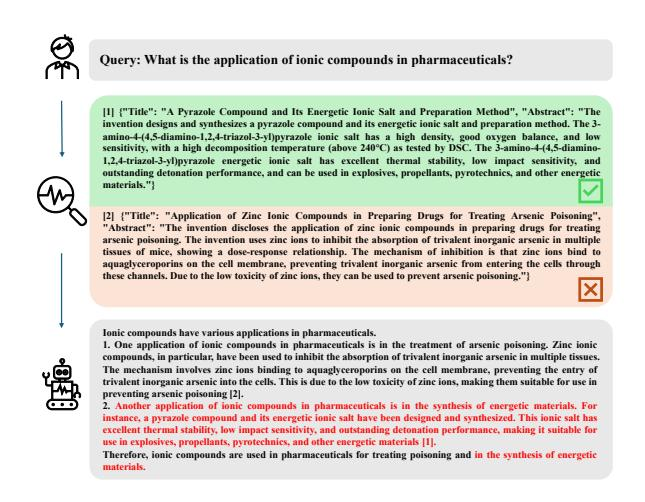
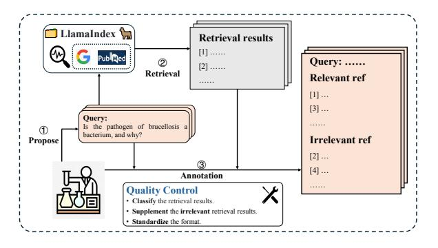
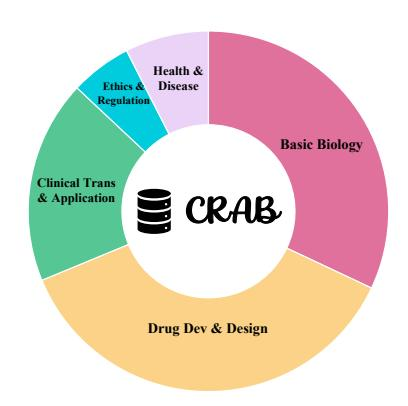
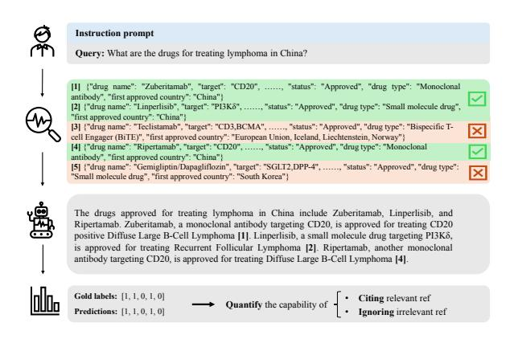
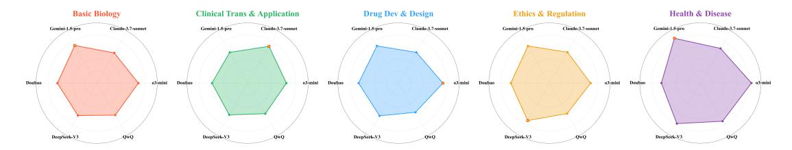
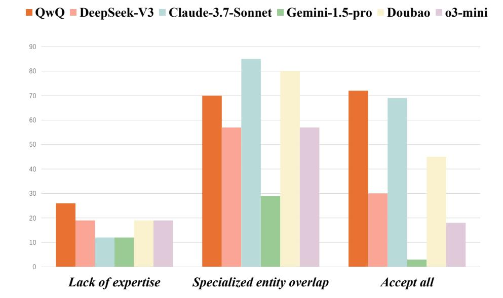
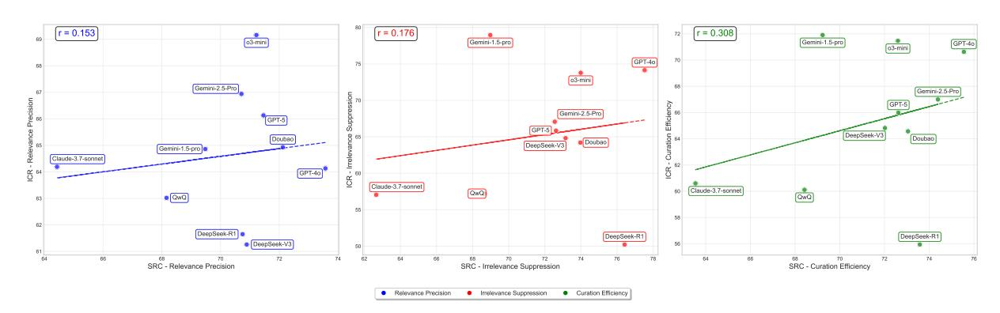

# CRAB: A Benchmark for Evaluating Curation of Retrieval-Augmented LLMs in Biomedicine

#### Hanmeng Zhong, Linqing Chen[\\*](#page-0-0), Wentao Wu, Weilei Wang

PatSnap Co., LTD. Suzhou, China {zhonghanmeng, chenlinqing, wuwentao3, wangweilei}@patsnap.com

#### Abstract

Recent development in Retrieval-Augmented Large Language Models (LLMs) have shown great promise in biomedical applications. However, a critical gap persists in reliably evaluating their curation ability—the process by which models select and integrate relevant references while filtering out noise. To address this, we introduce the benchmark for Curation of Retrieval-Augmented LLMs in Biomedicine (CRAB), the first multilingual benchmark tailored for evaluating the biomedical curation of retrieval-augmented LLMs, available in English, French, German and Chinese. By incorporating a novel citation-based evaluation metric, CRAB quantifies the curation performance of retrieval-augmented LLMs in biomedicine. Experimental results reveal significant discrepancies in the curation performance of mainstream LLMs, underscoring the urgent need to improve it in the domain of biomedicine.

#### 1 Introduction

Large Language Models (LLMs) have become powerful tools in general and specific domains [\(OpenAI](#page-8-0) [et al.,](#page-8-0) [2024;](#page-8-0) [Dubey et al.,](#page-7-0) [2024;](#page-7-0) [Anthropic,](#page-6-0) [2023;](#page-6-0) [Team et al.,](#page-8-1) [2024;](#page-8-1) [Chen,](#page-6-1) [2025\)](#page-6-1), due to their generative capabilities [\(Bang et al.,](#page-6-2) [2023;](#page-6-2) [Guo et al.,](#page-7-1) [2023\)](#page-7-1). Despite their excellent performance [\(Sing](#page-8-2)[hal et al.,](#page-8-2) [2022;](#page-8-2) [Anil et al.,](#page-6-3) [2023;](#page-6-3) [OpenAI et al.,](#page-8-0) [2024;](#page-8-0) [Dubey et al.,](#page-7-0) [2024;](#page-7-0) [Nori et al.,](#page-8-3) [2023\)](#page-8-3), LLMs still suffer from factual hallucinations [\(Cao et al.,](#page-6-4) [2020;](#page-6-4) [Raunak et al.,](#page-8-4) [2021;](#page-8-4) [Ji et al.,](#page-7-2) [2023\)](#page-7-2), caused by outdated knowledge [\(He et al.,](#page-7-3) [2022\)](#page-7-3) and limited domain-specific expertise [\(Li et al.,](#page-7-4) [2023b\)](#page-7-4). Retrieval-Augmented Generation (RAG) addresses these shortcomings by retrieving up-to-date information from trusted sources. This approach has been shown to effectively mitigate hallucinations and knowledge gaps in various domains [\(Guu et al.,](#page-7-5) [2020;](#page-7-5) [Lewis et al.,](#page-7-6) [2020a;](#page-7-6) [Borgeaud et al.,](#page-6-5) [2022;](#page-6-5)

Figure 1: An example of weak curation ability. Here green and check marks indicate relevant, while red and cross marks indicate irrelevant. Red text represents content generated based on irrelevant references.

[Izacard et al.,](#page-7-7) [2023\)](#page-7-7). In the biomedical domain, the incorporation of external knowledge not only enhances the existing capabilities of LLMs, but also provides the up-to-date information that they lack to accurately answer the biomedical queries [\(Lála](#page-7-8) [et al.,](#page-7-8) [2023;](#page-7-8) [Zakka et al.,](#page-8-5) [2024\)](#page-8-5).

While RAG improves performance, it also introduces challenges [\(Menick et al.,](#page-7-9) [2022;](#page-7-9) [Li et al.,](#page-7-10) [2023a\)](#page-7-10). If irrelevant content is retrieved, LLMs may generate invalid content in responses. For example, in Figure [1,](#page-0-1) given the query "What is the application of ionic compounds in pharmaceuticals?" and two references (one relevant, one irrelevant), the LLM generates irrelevant content about "ionic compounds in energy materials". Despite advances in retrieval systems, irrelevant content remains a challenge. It generally falls into three categories: (1). partially relevant but can not answer the query; (2). completely irrelevant; (3). factually incorrect. Currently, the difficulties regarding retrievalaugmented LLMs mainly focus on the first category. And distinguishing them from the relevant

\*corresponding author

references is a prerequisite for correctly answering the query, which also requires comprehensive comprehension ability. In the biomedical domain, precise citations in the responses are essential. Accurate citations enable independent verification and reproducibility, while robust curation ensures the scalability of responses. This is of great importance both in the research and application domains of biomedicine. However, the existing retrievalaugmented benchmarks [\(Xiong et al.,](#page-8-6) [2024;](#page-8-6) [Ngo](#page-8-7) [et al.,](#page-8-7) [2024\)](#page-8-7) in the domain of biomedicine are no different from those in the general domain, focusing on evaluating the correctness of the answers and overlook the importance of curation.

In this paper, we introduce CRAB, the multilingual benchmark for Curation of the Retrieval-Augmented LLMs in Biomedicine, evaluating the curation ability of retrieval-augmented LLMs to distinguish and utilize references when answering biomedical queries, avaliable in English, French, German and Chinese. In detail, CRAB focuses on the open-ended queries, addressing two key issues of curation evaluation based on the closedended queries: (1). Predefined answers: LLMs may be able to answer the query without augmented references since the answer is fixed regardless of what the augmented-references are; (2). Evaluation error: Because of the evaluation based on token matching, incorrect response may contain correct answer, such as in the case of antonymous prefixes. Moreover, open-ended queries in retrievalaugmented scenarios do not have standard answers, which is more conducive to focusing on the evaluation of curation. For the augmented references, we apply LlamaIndex[1](#page-1-0) as the retrieval method and utilize PubMed and search results from Google as data sources to fetch them.

Based on CRAB, we evaluate the mainstream LLMs and explore potential improvements of biomedical curation based on Llama3 [\(Dubey et al.,](#page-7-0) [2024\)](#page-7-0). In order to evaluate the curation ability more flexibly, we propose a citation-based evaluation method. We frame the curation evaluation into a citation-based verification from two aspects: whether the retrieval-augmented LLMs can cite relevant references and whether it is unaffected by irrelevant references, directly quantifying the curation of retrieval-augmented LLMs in biomedicine. In addition, we evaluate the latest reasoning LLMs and analyze the impact of explicit

Chain-of-Thought on the biomedical curation of retrieval-augmented LLMs.

Generally, our contributions are three-fold:

- We introduce CRAB [2](#page-1-1) , the first multilingual benchmark designed for the curation evaluation of retrieval-augmented LLMs in the domain of biomedicine.
- We formulate the evaluation of LLMs into a citation-based verification, quantitatively assessing the curation of retrieval-augmented LLMs, and perform human evaluations to substantiate the reliability.
- We conduct the evaluations of the mainstream LLMs on CRAB and validate the improvements of the biomedical curation based on Llama 3, highlighting the utility of CRAB for future research.

#### 2 CRAB

In this section, we first introduce the curation ability of retrieval-augmented LLMs in [\(2.1\)](#page-1-2), which is the core ability we evaluate. Next, we outline our benchmark construction procedure in [\(2.2\)](#page-2-0) and present the proposed evaluation method in [\(2.3\)](#page-3-0).

## 2.1 Curation

Curation refers to the ability of retrieval-augmented LLMs to identify and cite relevant references when augmenting references, and to ignore irrelevant ones. In retrieval-augmented scenarios, LLMs combine internal knowledge with external retrieval knowledge, grounding their generated responses in external references. The curation process involves identifying, selecting, and citing pertinent references from a vast corpus of retrieved references based on their relevance and reliability.

In the domain of biomedicine, the importance of curation is particularly pronounced due to the critical nature of accurate and evidence-based information. Biomedical research and clinical decisionmaking rely heavily on trustworthy, validated findings. Consequently, the ability of retrievalaugmented LLMs to carefully curate references directly impacts their utility in clinical support systems, development of biomedical products, and patient information dissemination. Effective curation mitigates misinformation, enhances the interpretability of generated content, and facilitates

1 [https://github.com/run-llama/llama\\_index](https://github.com/run-llama/llama_index)

2 Source data and code can be seen in [https://](https://huggingface.co/datasets/zhm0/CRAB) [huggingface.co/datasets/zhm0/CRAB](https://huggingface.co/datasets/zhm0/CRAB).

transparent knowledge attribution, thereby strengthening the trustworthiness and practical applicability of LLMs in the biomedical domain.

#### 2.2 Data construction

Framework of CRAB The overview of data construction for CRAB is shown in Figure [2.](#page-2-1) Unlike previously biomedical reference-based benchmarks [\(Xiong et al.,](#page-8-6) [2024;](#page-8-6) [Ngo et al.,](#page-8-7) [2024\)](#page-8-7), which typically provide pre-defined correct answer texts, CRAB focuses on open-ended biomedical queries without predefined ground-truth responses. In our framework, the correctness and appropriateness of LLM-generated answers depend entirely on the provided references. To rigorously evaluate the curation of retrieval-augmented LLMs, CRAB includes an adjustable setting, allowing controlled variation in the number of relevant and irrelevant references presented to the LLMs. Evaluation is conducted by verifying the relevance and correctness of the references cited within the generated answers, thereby providing a direct and robust measure of retrieval-augmented LLMs' proficiency in biomedical curation.

Figure 2: Data construction procedures of CRAB.

Query collection Instead of prompting LLMs to generate questions from open-source datasets [\(Xiong et al.,](#page-8-6) [2024;](#page-8-6) [Ngo et al.,](#page-8-7) [2024\)](#page-8-7) and based on web data [\(Chen et al.,](#page-6-6) [2024\)](#page-6-6), we collect open-ended biomedical queries from experts. In detail, we collecte five categories of biomedical queries to reflect the performance in different dimensions: Basic Biology, Drug Development and Design, Clinical Translation and Application, Ethics and Regulation, Public Health and Infectious Disease. The distribution of query categories is shown in the Figure [3.](#page-2-2)

Reference collection After obtaining the biomedical queries, we apply LlamaIndex as the retrieval method to get relevant references from PubMed and

Figure 3: Distribution of query categories in CRAB

search results from Google. We utilize LlamaIndex to retrieve all available references from PubMed and Google. Informed by previous related works [\(Shi et al.,](#page-8-8) [2025;](#page-8-8) [Jeong et al.,](#page-7-11) [2024\)](#page-7-11), we choose a combined top-N of 20 from both sources. The rationality of this choice is then validated by biomedical experts on a sample of questions[1](#page-2-3) . Then experts are asked to categorize the retrieved results into two sets[1](#page-0-0) : 1) content that can answer the query, i.e., relevant; 2) content that cannot answer the query, i.e., irrelevant. It is worth noting that for some queries, there are relatively few retrieval results that are irrelevant, or the degree of irrelevance is quite high. In order to reflect the real scenarios, we have supplemented them with high-quality irrelevant references. Specifically, these queries are reconstructed by replacing some biomedical entities within them. For example, the query "The mechanism of action of Oseltamivir" is reconstructed into "The indications of Oseltamivir". Then, the reconstructed queries are searched, and from the retrieval results, references are obtained that could not answer the original queries but have a certain degree of relevance to them. Since there may be references in the retrieval results of the reconstructed query that can answer the original query, the acquisition process is completed by experts[1](#page-0-0) , who conduct the classification of the second round of references. Therefore, we supplement some queries with highquality irrelevant references to better evaluate the curation.

In CRAB, the format of drug, patent, paper, and clinical references is standardized, like the example shown in Figure [1,](#page-0-1) completely different from the document snippets extraction approaches [\(Chen](#page-6-6) [et al.,](#page-6-6) [2024;](#page-6-6) [Xiong et al.,](#page-8-6) [2024;](#page-8-6) [Ngo et al.,](#page-8-7) [2024\)](#page-8-7)

1The verification by biomedical experts is the result of cross-validation by five experts.

and is more suitable for the evaluation of biomedical curation. Additionally, content-based deduplication on the references is performed to avoid the evaluation being too easy. At this point, we obtain both relevant and irrelevant sets of augmented references for each query.

| Language | query | # pos. | # neg. |
|----------|-------|--------|--------|
| English  | 100   | 622    | 462    |
| French   | 100   | 620    | 457    |
| German   | 100   | 615    | 450    |
| Chinese  | 100   | 610    | 485    |

Table 1: The basic statistics of CRAB. Here # pos. and # neg. stand for relevant references and irrelevant references, respectively.

In terms of quantity, we collect 400 biomedicine queries and 2,467 relevant references and 1,854 irrelevant references as shown in the Table [1.](#page-3-1) In detail, we retain several queries without relevant references to simulate scenarios where relevant content might not be retrievable in real-world situations. For the other queries, we ensure each one has more than two relevant references and three irrelevant references to support an evaluation setup with manually adjustable ratios. In this way, during evaluation, the number of relevant and irrelevant references can be adjusted according to requirements to achieve evaluation with controllable difficulty.

Moreover, rather than relying solely on traditional query-level evaluation, CRAB shifts the evaluative focus to the reference level, significantly reducing the number of queries needed in evaluation. Specifically, the 400 evaluations on response content are transformed into more than 4,000 evaluations on reference citations.

#### 2.3 Evaluation method

The core objective of CRAB is to assess the curation ability of retrieval-augmented LLMs. Specifically, CRAB examines whether retrievalaugmented LLMs successfully integrate relevant references while omitting irrelevant ones.

Specifically, aiming at the demand for traceability of response in the biomedical domain, we model the evaluation of curation ability as a citationbased verification. It is based on three dimensions: the accuracy in identifying and citing relevant references (Relevance Precision, RP), the effectiveness in ignoring irrelevant references (Irrelevance Suppression, IS), and the overall curation performance

Figure 4: Our proposed evaluation method. Here green and check marks indicate relevant, while red and cross marks indicate irrelevant. The citations in the responses are regarded as the comprehensive processing results of the model on references.

(Curation Efficiency, CE). In terms of implementation, we characterize RP, IS, and CE by the F1 classification performance of two categories (relevant and irrelevant) and the Macro-avg F1 performance, respectively. For example, in Figure [4,](#page-3-2) the 1st, 2nd, and 4th references are relevant, while the 3rd and 5th are irrelevant references. Therefore, in this case, the ground-truth labels are [1, 1, 0, 1, 0]. And the retrieval-augmented LLM cites the 1st, 2nd, and 4th references in the response, so the predicted labels are [1, 1, 0, 1, 0]. In this way, the evaluation of biomedical curation for retrieval-augmented LLMs focuses on the verification of the comprehensive processing results of references, rather than on the response content which neglects the evaluation of curation ability.

In addition, it must be mentioned that our proposed evaluation method does not serve as a replacement for content-based evaluations. Instead, it constitutes an independent evaluation dimension that operates alongside traditional content evaluations. Moreover, this citation-based approach can function as a preliminary assessment, providing an a priori measure that informs and complements subsequent in-depth analyses of response content.

To verify the reliability of our evaluation method, we conduct the human evaluation of the results in the English section. For each citation in the response, the evaluators (biomedical experts in the annotating phase) are required to check whether the content preceding it is generated based on the corresponding reference.

Figure 5: Performance comparison of LLMs across different query categories in English.

## 3 Experiments

We conduct an evaluation of curation on CRAB for existing mainstream general LLMs such as GPT-4o, Gemini-1.5-pro, etc., and mainstream reasoning LLMs such as o3-mini, DeepSeek-R1, etc., and analyze the evaluation results from the five categories of data in CRAB. Moreover, we verify the potential for improvement of curation based on Llama3 and validate the reliability of the proposed evaluation metric through human evaluation.

## 3.1 Experimental settings

Task formats. Considering the high cost of closesource LLMs evaluation, for each query, we manually control the ratio of relevant to irrelevant references in the evaluation experiment at 2:3. We fix the random seed at 42 to sample augmented references and shuffle the order of the references before generation [\(Liu et al.,](#page-7-12) [2024\)](#page-7-12). For each model, we use the official recommended inference hyperparameters.

Models. The LLMs used in the experiment include closed-source models such as GPT and opensource models such as Llama.

#### 3.2 Experimental results

We evaluate the mainstream LLMs on CRAB with the citation-based evaluation metric introduced in [2.3](#page-3-0) and the main performance can be seen in Table [2](#page-5-0) (the overall performance can be seen in Appendix [C.2\)](#page-13-0). We report the performance from three aspects: the accuracy in identifying and referencing relevant sources (Relevance Precision, RP), the effectiveness in ignoring irrelevant sources (Irrelevance Suppression, IS), and the overall curation performance (Curation Efficiency, CE). The performance of RP and IS reflects the ability to identify and integrate relevant and irrelevant references in curation, respectively. CE, on the other hand, reflects the overall curation ability.

Evaluation results are shown in Table [2.](#page-5-0) The experimental results demonstrate distinct languagespecific performance patterns. Notably, Gemini1.5-pro exhibits superior performance in English, achieving a CE F1 score of 71.91; Doubao achieves the best performance in French, scoring 73.07; o3 mini demonstrates peak performance in German, attaining CE F1 scores of 73.97. Meanwhile, GPT-4o records its optimum results in Chinese, reaching an exceptional CE F1 score of 80.46. From the perspective of language comparison, it can be observed from the Table [2](#page-5-0) that the latest closedsource LLMs perform more consistently compared to open-source LLMs, primarily due to their larger parameter sizes and more extensive multilingual pretraining knowledge. Notably, some LLM exhibits biases towards either RP or CE. For example, Doubao achieves the highest CE performance in the French section, but its RP performance ranks among the last few among the closed-source LLMs. The evaluation results show that there are significant differences in the curation ability of each LLM to identify and integrate references in the biomedical domain. In this way, we quantify the curation of retrieval-augmented LLMs in biomedical domain.

We also evaluate the recent popular reasoning LLMs, as shown in the last four lines of each section in Table [2.](#page-5-0) We select four representative reasoning LLMs for evaluation and analysis, namely o3-mini, Gemini-2.5-pro, DeepSeek-R1, and QwQ. From the evaluation results, it can be seen that some reasoning models have not improved in terms of biomedical curation compared to their original base models (QwQ is trained based on Qwen-2.5- 32B). Instead, in both the English and Chinese sections, the performance of both has declined. We attribute this to the excessive training of the reasoning ability in mathematical and code, which leads to overthinking in the domain of biomedicine and blurs the boundaries of professional concepts in biomedicine. We provide detailed examples to analyze this phenomenon in [B.1.](#page-9-0)

To provide a more comprehensive comparison, we conduct evaluations of the six representative large-parameter LLMs across each query category in the English section, as CE F1 scores shown in

|                   |            | English    |            |            | French     |            |  |  |
|-------------------|------------|------------|------------|------------|------------|------------|--|--|
| Models            | RP (F1, %) | IS (F1, %) | CE (F1, %) | RP (F1, %) | IS (F1, %) | CE (F1, %) |  |  |
| GPT-4o            | 67.13      | 74.14      | 70.63      | 65.50      | 76.53      | 71.02      |  |  |
| GPT-5             | 66.31      | 65.85      | 65.99      | 70.27      | 75.74      | 73.00      |  |  |
| Claude-3.7-sonnet | 64.19      | 57.02      | 60.60      | 69.69      | 70.78      | 70.23      |  |  |
| Gemini-1.5-pro    | 64.86      | 78.96      | 71.91      | 57.14      | 76.49      | 66.82      |  |  |
| Gemini-2.5-pro    | 66.94      | 67.07      | 67.00      | 69.67      | 70.40      | 70.04      |  |  |
| DeepSeek-V3       | 61.26      | 64.82      | 64.82      | 62.86      | 76.29      | 69.57      |  |  |
| Doubao            | 64.93      | 64.21      | 64.54      | 67.84      | 78.31      | 73.07      |  |  |
| DeepSeek-R1       | 61.65      | 50.23      | 55.94      | 66.27      | 65.30      | 65.78      |  |  |
| QwQ               | 63.02      | 57.21      | 60.11      | 68.00      | 73.23      | 70.62      |  |  |
| o3-mini           | 69.16      | 73.78      | 71.47      | 68.60      | 77.35      | 72.98      |  |  |
|                   |            | German     |            | Chinese    |            |            |  |  |
| Models            | RP (F1, %) | IS (F1, %) | CE (F1, %) | RP (F1, %) | IS (F1, %) | CE (F1, %) |  |  |
| GPT-4o            | 63.73      | 76.74      | 70.24      | 76.04      | 84.87      | 80.46      |  |  |
| GPT-5             | 67.38      | 70.88      | 69.13      | 72.60      | 78.34      | 75.47      |  |  |
| Claude-3.7-sonnet | 69.69      | 70.78      | 70.23      | 71.57      | 72.37      | 71.97      |  |  |
| Gemini-1.5-pro    | 57.14      | 76.49      | 66.82      | 62.57      | 78.86      | 70.72      |  |  |
| Gemini-2.5-pro    | 67.22      | 69.16      | 68.19      | 70.56      | 72.51      | 71.54      |  |  |
| DeepSeek-V3       | 61.98      | 75.83      | 68.90      | 71.28      | 82.47      | 76.87      |  |  |
| Doubao            | 66.67      | 76.65      | 71.61      | 67.04      | 81.14      | 74.09      |  |  |
| DeepSeek-R1       | 67.64      | 69.55      | 68.59      | 68.97      | 69.34      | 69.15      |  |  |
| QwQ               | 65.25      | 68.22      | 66.74      | 64.99      | 61.89      | 63.44      |  |  |
|                   |            |            |            |            |            |            |  |  |

Table 2: The main performance of representative LLMs

the Figure [5.](#page-4-0) As can be seen, the best-performing LLM varies across different categories. This also reflects the complexity of the biomedical domain compared with the general domain, and proves that the biomedical domain requires the evaluation of the curation ability of retrieval-augmented LLMs.

#### 3.3 Verification of improvements

In addition, in order to verify the potential for improvement of the curation ability of retrievalaugmented LLMs in the domain of biomedicine, we conduct a validation experiment. In detail, we conduct Continual Pre-Training (CPT) of Llama3- 70B with biomedical articles and perform Supervised Fine-Tuning (SFT) on approximate 2,000 synthesized biomedical QA data [\(Chen et al.,](#page-7-13) [2025\)](#page-7-13) containing augmented references. Considering the high cost of CPT, we conduct validation experiments only in the Chinese section. Both CPT data and SFT data are collected from open-source biomedical data. The results of validation experiments are shown in Table [3.](#page-5-1)

The results of the verification experiment are shown in Table [3.](#page-5-1) As can be seen from the results, after deepening the understanding of biomedical

| Models    | RP    | IS    | CE    |
|-----------|-------|-------|-------|
| Instruct  | 69.21 | 77.49 | 73.35 |
| + SFT     | 64.93 | 74.04 | 69.48 |
| + CPT&SFT | 71.01 | 79.24 | 75.13 |

Table 3: Results in validation experiments based on LLaMa3.

knowledge through CPT, the biomedical curation ability of Llama3 has been significantly improved compared with the version that only undergoes SFT and the official instruct version. It is worth noting that since the validation experiment just simply verifies the potential for improving biomedical curation by adding data related to biomedicine, and there is no comprehensive evaluation, so we do not propose a new biomedical LLM, nor can it draw conclusions such as "CPT is necessary in the biomedical domain."

## 3.4 Human evaluation

In order to verify the reliability of the evaluation method based on citation results proposed by us, we conducted a manual evaluation, specifically

evaluating the results of Gemini-1.5-pro, which performed the best among non-reasoning-capable LLMs in the English section. Evaluators (biomedical experts in the annotating phase) are asked to verify whether there is corresponding reference content for the text before the citation number in the response, so as to exclude the situation where the citation is inconsistent with the content.

| Settings       | RP    | IS    | CE    |
|----------------|-------|-------|-------|
| citation-based | 64.86 | 78.96 | 71.91 |
| human          | 64.85 | 79.23 | 72.04 |

Table 4: Comparison between citation-based and human evaluation

The comparison between the citation-based evaluation and the human evaluation is shown in Table [4.](#page-6-7) It can be seen that the F1 scores of RP, IS and CE are basically consistent between them. Evaluators find that model sometimes explains the reasons for not citing irrelevant references, and they judge this as correct identification of relevance. Therefore, the performance of the human evaluation is relatively higher. Overall, there is almost no gap between the two, verifying the effectiveness of CRAB and our proposed evaluation method.

# 3.5 Ablation Study: Standalone Classification vs. Integrated Citation

To validate the reliability of our citation-based evaluation methodology, we conduct a controlled ablation study comparing standalone reference relevance classification with integrated citation evaluation within the full RAG pipeline. Detail can be seen in [C.1.](#page-11-0)

# 4 Analysis

We conduct a detailed analysis of the evaluation results. Firstly, We analyze the reasons for the performance degradation of some reasoning LLMs. Secondly, we conduct an analysis of overlap biomedical entities in the query, reference, and response. Lastly, we analyze the type and quantity of errors.

#### 5 Conclusion

In this paper, we introduce the the benchmark for Curation of the Retrieval-Augmented LLMs in Biomedicine (CRAB) and evaluate the curation of the retrieval-augmented LLMs in the biomedical domain. To conduct the evaluation, we propose a citation-based evaluation method to quantify

the curation. In addition, we verify the potential of improvements on curation. Evaluation results demonstrates the obvious gaps in biomedical curation among different retrieval-augmented LLMs.

## 6 Limitations

Our work focuses on evaluating the curation of retrieved-augmented LLMs, and we have not yet proposed systematic methods for improving curation capabilities. We will focus on enhancing curation capabilities in our future work. Although we makes every effort to select data from the past two years on PubMed and Google when collecting references, there may still be cases where the references overlap with the LLMs training corpora.

# References

Iñigo Alonso, Maite Oronoz, and Rodrigo Agerri. 2024. Medexpqa: Multilingual benchmarking of large language models for medical question answering. *Artif. Intell. Medicine*, 155:102938.

Rohan Anil, Andrew M. Dai, Orhan Firat, and et al. 2023. Palm 2 technical report.

Anthropic. 2023. [The claude 3 model family: Opus,](https://api.semanticscholar.org/CorpusID:268232499) [sonnet, haiku.](https://api.semanticscholar.org/CorpusID:268232499)

Yejin Bang, Samuel Cahyawijaya, Nayeon Lee, and et al. 2023. A multitask, multilingual, multimodal evaluation of ChatGPT on reasoning, hallucination, and interactivity. In *Proceedings of the 13th International Joint Conference on Natural Language Processing and the 3rd Conference of the Asia-Pacific Chapter of the Association for Computational Linguistics*, pages 675–718.

Sebastian Borgeaud, Arthur Mensch, Jordan Hoffmann, and et al. 2022. Improving language models by retrieving from trillions of tokens. In *Proceedings of the 39th International Conference on Machine Learning*, volume 162 of *Proceedings of Machine Learning Research*, pages 2206–2240.

Meng Cao, Yue Dong, Jiapeng Wu, and et al. 2020. Factual error correction for abstractive summarization models. In *Proceedings of the 2020 Conference on Empirical Methods in Natural Language Processing*, pages 6251–6258.

Jiawei Chen, Hongyu Lin, Xianpei Han, and et al. 2024. Benchmarking large language models in retrievalaugmented generation. *Proceedings of the AAAI Conference on Artificial Intelligence*, 38(16):17754– 17762.

Linqing Chen. 2025. Streamlining biomedical research with specialized llms. In *Proceedings of the 31st International Conference on Computational Linguistics: System Demonstrations*, pages 9–19.

- Linqing Chen, Hanmeng Zhong, Wentao Wu, and Weilei Wang. 2025. [Semantic bridge: Universal](https://arxiv.org/abs/2508.10013) [multi-hop question generation via amr-driven graph](https://arxiv.org/abs/2508.10013) [synthesis.](https://arxiv.org/abs/2508.10013) *Preprint*, arXiv:2508.10013.
- Abhimanyu Dubey, Abhinav Jauhri, Abhinav Pandey, and et al. 2024. The llama 3 herd of models.
- Shahul Es, Jithin James, Luis Espinosa Anke, and et al. 2024. RAGAs: Automated evaluation of retrieval augmented generation. In *Proceedings of the 18th Conference of the European Chapter of the Association for Computational Linguistics: System Demonstrations*, pages 150–158.
- Feiteng Fang, Yuelin Bai, Shiwen Ni, and et al. 2024. Enhancing noise robustness of retrieval-augmented language models with adaptive adversarial training.
- J. Ferrara, Ethan-Tonic, and O. M. Ozturk. 2024. [The](https://www.trulens.org/trulens_eval/core_concepts_rag_triad/) [rag triad.](https://www.trulens.org/trulens_eval/core_concepts_rag_triad/)
- Robert Friel, Masha Belyi, and Atindriyo Sanyal. 2024. Ragbench: Explainable benchmark for retrievalaugmented generation systems.
- Tianyu Gao, Howard Yen, Jiatong Yu, and et al. 2023. Enabling large language models to generate text with citations. In *Proceedings of the 2023 Conference on Empirical Methods in Natural Language Processing*, pages 6465–6488.
- Yunfan Gao, Yun Xiong, Xinyu Gao, and et al. 2024. Retrieval-augmented generation for large language models: A survey.
- Biyang Guo, Xin Zhang, Ziyuan Wang, and et al. 2023. How close is chatgpt to human experts? comparison corpus, evaluation, and detection.
- Kelvin Guu, Kenton Lee, Zora Tung, and et al. 2020. Realm: Retrieval-augmented language model pretraining.
- Hangfeng He, Hongming Zhang, and Dan Roth. 2022. Rethinking with retrieval: Faithful large language model inference.
- Dan Hendrycks, Collin Burns, Steven Basart, and et al. 2020. Measuring massive multitask language understanding. *arXiv preprint arXiv:2009.03300*.
- Lei Huang, Weijiang Yu, Weitao Ma, and et al. 2023. A survey on hallucination in large language models: Principles, taxonomy, challenges, and open questions.
- Yizheng Huang and Jimmy Huang. 2024. A survey on retrieval-augmented text generation for large language models.
- Gautier Izacard, Patrick Lewis, Maria Lomeli, and et al. 2023. Atlas: Few-shot learning with retrieval augmented language models. *Journal of Machine Learning Research*, 24(251):1–43.

- Minbyul Jeong, Jiwoong Sohn, Mujeen Sung, and Jaewoo Kang. 2024. Improving medical reasoning through retrieval and self-reflection with retrievalaugmented large language models. *Bioinformatics*, 40(Supplement\_1):i119–i129.
- Ziwei Ji, Nayeon Lee, Rita Frieske, and et al. 2023. Survey of hallucination in natural language generation. *ACM Comput. Surv.*, 55(12).
- Di Jin, Eileen Pan, Nassim Oufattole, and et al. 2021. What disease does this patient have? a large-scale open domain question answering dataset from medical exams. *Applied Sciences*, 11(14):6421.
- Qiao Jin, Bhuwan Dhingra, Zhengping Liu, and et al. 2019. Pubmedqa: A dataset for biomedical research question answering. In *Proceedings of the 2019 Conference on Empirical Methods in Natural Language Processing and the 9th International Joint Conference on Natural Language Processing*, pages 2567– 2577.
- Patrick Lewis, Ethan Perez, Aleksandra Piktus, and et al. 2020a. Retrieval-augmented generation for knowledge-intensive nlp tasks. In *Advances in Neural Information Processing Systems*, volume 33, pages 9459–9474.
- Patrick Lewis, Ethan Perez, Aleksandra Piktus, and et al. 2020b. Retrieval-augmented generation for knowledge-intensive nlp tasks. In *Advances in Neural Information Processing Systems*, volume 33, pages 9459–9474.
- Daliang Li, Ankit Singh Rawat, Manzil Zaheer, and et al. 2023a. Large language models with controllable working memory. In *Findings of the Association for Computational Linguistics: ACL 2023*, pages 1774– 1793.
- Xianzhi Li, Samuel Chan, Xiaodan Zhu, and et al. 2023b. Are chatgpt and gpt-4 general-purpose solvers for financial text analytics? a study on several typical tasks.
- Junling Liu, Peilin Zhou, Yining Hua, and et al. 2023. Benchmarking large language models on cmexam-a comprehensive chinese medical exam dataset. *Advances in Neural Information Processing Systems*, 36:52430–52452.
- Nelson F. Liu, Kevin Lin, John Hewitt, and et al. 2024. Lost in the Middle: How Language Models Use Long Contexts. *Transactions of the Association for Computational Linguistics*, 12:157–173.
- Jakub Lála, Odhran O'Donoghue, Aleksandar Shtedritski, and et al. 2023. Paperqa: Retrieval-augmented generative agent for scientific research.
- Jacob Menick, Maja Trebacz, Vladimir Mikulik, and et al. 2022. Teaching language models to support answers with verified quotes.

- Nghia Trung Ngo, Chien Van Nguyen, Franck Dernoncourt, and et al. 2024. Comprehensive and practical evaluation of retrieval-augmented generation systems for medical question answering.
- Harsha Nori, Nicholas King, Scott Mayer McKinney, and et al. 2023. Capabilities of gpt-4 on medical challenge problems.
- OpenAI, Josh Achiam, Steven Adler, and et al. 2024. Gpt-4 technical report.
- Vikas Raunak, Arul Menezes, and Marcin Junczys-Dowmunt. 2021. The curious case of hallucinations in neural machine translation. In *Proceedings of the 2021 Conference of the North American Chapter of the Association for Computational Linguistics: Human Language Technologies*, pages 1172–1183.
- Dongyu Ru, Lin Qiu, Xiangkun Hu, and et al. 2024. Ragchecker: A fine-grained framework for diagnosing retrieval-augmented generation.
- Jon Saad-Falcon, Omar Khattab, Christopher Potts, and et al. 2024. ARES: An automated evaluation framework for retrieval-augmented generation systems. In *Proceedings of the 2024 Conference of the North American Chapter of the Association for Computational Linguistics: Human Language Technologies*, pages 338–354.
- Jean Seo, Jongwon Lim, Dongjun Jang, and et al. 2024. Dahl: Domain-specific automated hallucination evaluation of long-form text through a benchmark dataset in biomedicine.
- Yucheng Shi, Shaochen Xu, Tianze Yang, Zhengliang Liu, Tianming Liu, Xiang Li, and Ninghao Liu. 2025. Mkrag: Medical knowledge retrieval augmented generation for medical question answering. In *AMIA Annual Symposium Proceedings*, volume 2024, page 1011.
- Karan Singhal, Shekoofeh Azizi, Tao Tu, and et al. 2022. Large language models encode clinical knowledge.
- Gemini Team, Petko Georgiev, Ving Ian Lei, and et al. 2024. Gemini 1.5: Unlocking multimodal understanding across millions of tokens of context.
- Nandan Thakur, Luiz Bonifacio, Xinyu Zhang, and et al. 2024. Nomiracl: Knowing when you don't know for robust multilingual retrieval-augmented generation.
- S. M Towhidul Islam Tonmoy, S M Mehedi Zaman, Vinija Jain, and et al. 2024. A comprehensive survey of hallucination mitigation techniques in large language models.
- Cunxiang Wang, Xiaoze Liu, Yuanhao Yue, and et al. 2023. Survey on factuality in large language models: Knowledge, retrieval and domain-specificity.
- Guangzhi Xiong, Qiao Jin, Zhiyong Lu, and et al. 2024. Benchmarking retrieval-augmented generation for medicine.

- Hao Yu, Aoran Gan, Kai Zhang, and et al. 2024. Evaluation of retrieval-augmented generation: A survey.
- Cyril Zakka, Rohan Shad, Akash Chaurasia, and et al. 2024. Almanac—retrieval-augmented language models for clinical medicine. *NEJM AI*, 1(2):AIoa2300068.

## Appendix

# A Related Work

Large Language Models (LLMs) excel in text generation but struggle with outdated knowledge, domain-specific gaps, and hallucinations [\(Huang](#page-7-14) [et al.,](#page-7-14) [2023;](#page-7-14) [Wang et al.,](#page-8-9) [2023;](#page-8-9) [Tonmoy et al.,](#page-8-10) [2024\)](#page-8-10). Retrieval-Augmented Generation (RAG) [\(Lewis et al.,](#page-7-15) [2020b\)](#page-7-15) mitigates these issues by retrieving external knowledge to improve responses [\(Yu et al.,](#page-8-11) [2024;](#page-8-11) [Gao et al.,](#page-7-16) [2024;](#page-7-16) [Huang and](#page-7-17) [Huang,](#page-7-17) [2024\)](#page-7-17). Currently, the evaluation of retrievalaugmented LLMs focuses on the general domain, verifying whether they can correctly answer questions with augmented references [\(Fang et al.,](#page-7-18) [2024;](#page-7-18) [Chen et al.,](#page-6-6) [2024;](#page-6-6) [Thakur et al.,](#page-8-12) [2024;](#page-8-12) [Friel et al.,](#page-7-19) [2024\)](#page-7-19). In the biomedical domain, the evaluation of retrieval-augmented LLMs assumes heightened importance relative to the general domain due to the critical nature of clinical decision-making and research integrity.

Biomedical Benchmark Initially, benchmarks without the augmented references were the focus[\(Jin et al.,](#page-7-20) [2021;](#page-7-20) [Hendrycks et al.,](#page-7-21) [2020;](#page-7-21) [Jin](#page-7-22) [et al.,](#page-7-22) [2019;](#page-7-22) [Liu et al.,](#page-7-23) [2023;](#page-7-23) [Seo et al.,](#page-8-13) [2024;](#page-8-13) [Alonso et al.,](#page-6-8) [2024\)](#page-6-8). For example, [Seo et al.](#page-8-13) [\(2024\)](#page-8-13) introduced DAHL, a benchmark for assessing hallucinations in long-form text generation. It contains thousands of questions from biomedical research papers, evaluating fact-conflicting hallucinations by deconstructing responses into atomic units and calculating the DAHL Score. [Alonso et al.](#page-6-8) [\(2024\)](#page-6-8) presented MedExpQA, the first multilingual benchmark for medical Question Answering. It includes gold reference explanations written by medical doctors, allowing for a more comprehensive evaluation of LLMs' reasoning abilities across different languages. However, due to issues like hallucinations and outdated knowledge in LLMs, recent work in the biomedical domain has increasingly focused on developing benchmarks to evaluate retrieval-augmented LLMs, recognizing that the integration of relevant references is critical for enhancing the transparency and reliability. [Xiong](#page-8-6) [et al.](#page-8-6) [\(2024\)](#page-8-6) proposed MIRAGE, augmenting references with multi-choice questions from five medical QA datasets to systematically evaluate the performance of retrieval-augmented LLMs. In addition, [Ngo et al.](#page-8-7) [\(2024\)](#page-8-7) proposed MedRGB by using questions from four medical QA datasets, generating retrieval topics, conducting offline and online

retrieval, and constructing four test scenarios to comprehensively evaluate the performance of medical retrieval-augmented LLMs. However, previous benchmarks neglected the evaluation of biomedical curation, which enhances transparency and reliability of the retrieval-augmented LLMs. Therefore, we propose CRAB to evaluate the bimedical curation of retrieval-augmented LLMs.

Metrics Most metrics for the evaluation of retrieval-augmented LLMs focus on determining whether the response contains the pre-defined answer [\(Chen et al.,](#page-6-6) [2024;](#page-6-6) [Xiong et al.,](#page-8-6) [2024\)](#page-8-6). Finetuned retrieval-augmented LLMs also use metrics like exact match and text utilization to verify improvements brought by training and augmented references [\(Fang et al.,](#page-7-18) [2024;](#page-7-18) [Friel et al.,](#page-7-19) [2024\)](#page-7-19). Moreover, [\(Gao et al.,](#page-7-24) [2023\)](#page-7-24) proposes a citationbased metric relying on an NLI model to score fluency, correctness, and citation quality of short QA tasks. RAGChecker [\(Ru et al.,](#page-8-14) [2024\)](#page-8-14) breaks down responses into correct and incorrect claims, assessing context utilization, noise sensitivity, hallucination, and faithfulness. RAGAS [\(Es et al.,](#page-7-25) [2024\)](#page-7-25) and ARES [\(Saad-Falcon et al.,](#page-8-15) [2024\)](#page-8-15) adopt the RAG Triad framework [\(Ferrara et al.,](#page-7-26) [2024\)](#page-7-26), evaluating context relevance, groundedness, and answer relevance. However, previous metrics focused on predefined rules or the approach of "LLM-asjudge," and they are not applicable to the evaluation of curation. To address this, we propose a citationbased verification metric to quantify the biomedical curation of retrieval-augmented LLMs.

## B Analysis

We conduct a detailed analysis of the evaluation results. Specifically, we first analyze the reasons for the performance degradation of the reasoning LLMs mentioned in [3.2.](#page-4-1) Secondly, we carry out an overlap analysis of biomedical entities in the query, reference, and response. Finally, we conduct an error analysis and count the types of errors.

#### B.1 Case study of reasoning LLMs

In order to understand the reasons why the biomedical curation of the DeepSeek-R1 series and the QwQ reasoning LLMs have declined compared to their homologous LLMs, we analyzed their incorrect cases, as shown in Figure [6.](#page-10-0)

Since the LLMs in Figure [6](#page-10-0) obtain their reasoning capabilities through rule-based reinforcement learning based on a large amount of mathematical

#### **Reasoning cases**

#### **Deepseek-R1:**

**Query:** How does COVID-19 affect pregnant women and their babies?

**Response:** <think> … Reference [4] discusses … But does this relate to pregnancy? … but doesn't specify pregnant women. … maybe [4]'s mention of multi-organ damage and miRNAs could relate to complications in pregnant women … which are associated with disease severity and may contribute to poorer outcomes in pregnant women [4] … </think> … Although [4] does not explicitly address pregnancy, these mechanisms may contribute to worsened maternal health, indirectly affecting fetal or neonatal well-being …

#### **DeepSeek-R1-distill-Llama-70B:**

**Query:** How to identify specific genes in a DNA sequence?

**Response:** <think> … reference [5] proposes a k-word-based method to analyze genome specificity ... This method might be more advanced and useful for large-scale analyses or when trying to classify organisms based on their DNA sequences without prior knowledge of specific genes … More advanced statistical methods like [5] could offer deeper insights into genomic characteristics beyond just identifying known genes … </think> … \*\*Advanced Statistical Analysis\*\*: For deeper genomic insights, apply the kword-based method outlined in [5] …

#### **QwQ-32B:**

**Query:** Why is it important to recycle the used experimental drug packaging?

**Response:** <think> … Reference [5] deals with disposal practices of unused drugs, showing that improper disposal is common. If packaging isn't recycled, it might end up in trash, contributing to environmental issues. So proper recycling of packaging would prevent that … </think> … \*\*Preventing Improper Disposal Risks\*\*: Without recycling programs, experimental drug packaging may be improperly disposed of, contributing to environmental and health hazards[5] …

Figure 6: Cases of reasoning LLMs

and code data, the situation of overthinking has occurred in the domain of biomedicine. For example, in the case of DeepSeek-R1, reference [4] discusses cardiac metabolic microRNAs and their relation to COVID-19 severity and mortality. However, due to its continuous questioning of its own judgment on the relevance, it eventually identified this reference as relevant to answering the query "How does COVID-19 affect pregnant women and their babies?". In addition, in the cases of DeepSeek-R1-distill-Llama-70B and QwQ-32B, "Statistical specificity analysis method based on k-words" and "Methods for the storage and disposal of unused and expired drugs" are excessively speculated in the process of reasoning, to be able to answer the queries "How to identify specific genes in a DNA sequence?" and "Why is it important to recycle the used experimental drug packaging?". In the responses, they are described as "Advanced Statistical Analysis" and "Preventing Improper Disposal Risks".

#### B.2 Entity-based analysis

In order to have a deeper understanding of the evaluation results of biomedical curation, we conduct a quantitative analysis based on the biomedical entity set in the query, reference, and answer, named Eq, Er, Ea. We analyze from four aspects: 1). The proportion of entities in Ea that are covered in Er, called Entity Precision (EP); 2). The proportion of entities in Er that are covered in Ea, called Entity Recall (ER); 3). Using the Jaccard similarity to measure the similarity between Ea and Er, called Jaccard; 4). The proportion of entities in Eq among the entity list of the response, called Query Entity Coverage (QEC). Considering that most of the currently open-source biomedical NER models are in English, we use the open-source model BioMed\_NER [1](#page-10-1) and biomedical-ner-all [2](#page-10-2) to analyze seven large-parameter LLMs in the English section.

| Models     | EP    | ER   | Jaccard | QEC   |
|------------|-------|------|---------|-------|
| GPT-4o     | 23.68 | 4.97 | 4.28    | 7.19  |
| Gemini-1.5 | 32.59 | 7.51 | 6.50    | 11.28 |
| Claude-3.7 | 31.15 | 8.21 | 6.95    | 8.06  |
| DeepSeek   | 25.81 | 5.53 | 4.77    | 10.30 |
| Llama-3.3  | 30.70 | 7.51 | 6.42    | 16.53 |
| Qwen-2.5   | 28.60 | 6.04 | 5.25    | 9.26  |
| o3-mini    | 20.86 | 6.09 | 4.95    | 8.32  |

Table 5: Results of entity-based analysis

EP, ER, and Jaccard reflect whether the answering tendencies of different retrieval-augmented LLMs are more based on references or more based on their internal knowledge. It is worth noting that there is no such thing as the higher or the lower

[biomedical-ner-all](https://huggingface.co/d4data/biomedical-ner-all)

1 [https://huggingface.co/Helios9/BioMed\\_NER](https://huggingface.co/Helios9/BioMed_NER)

2 [https://huggingface.co/d4data/](https://huggingface.co/d4data/biomedical-ner-all)

Figure 7: Statistics on the number of citation error types.

the better for these three dimensions. Because if the values are too high, the LLM will mindlessly state the content of the reference, and if they are too low, the LLM will deviate from the content of the reference. Their value lies in the comparative analysis of the reasons for the curation differences among different LLMs, rather than serving as independent metrics. For example, Claude-3.7-sonnet has a relatively lower performance in the curation evaluation compared to the other six LLMs, but it is significantly higher than the other LLMs in terms of EP, ER, and Jaccard. This reflects its lack of the ability to judge the relevance of references, and it has a greater tendency to directly use the explanations of references as the content of its answers.

On the other hand, QEC reflects the faithfulness to the query. A lower QEC indicates that the LLM is more interfered by the irrelevant content in the references. This is also reflected in Claude-3.7 sonnet, whose QEC is lower.

## B.3 Error analysis

To better comprehend the curation of retrievalaugmented LLMs in the biomedical domain, we analyze the incorrect cases in the English section and classify errors into three categories:

(1) Lack of expertise. Sometimes LLMs lack sensitivity to biomedicine knowledge, leading to the confusion of important concepts in biomedicine. For example, in the first case in Table [6,](#page-12-0) LLM fails to differentiate between the bispecific antibodies and antibody-drug conjugates.

- (2) Specialized entity overlap. For the irrelevant references that contain the key entities of the query, the LLMs may confuse and explain them in responses. Take the second case in Table [6](#page-12-0) as an instance, the query expresses which groups of people are more susceptible to Salmonella infection, while the reference explains that humans can contract it through contact with contaminated food. Both contain the key entity "Salmonella", and LLM forcibly uses the transmission mode to answer the susceptible populations.
- (3) Accept all. LLMs somtimes generate responses to queries based solely on all references without considering their relevance. This situation mostly occurs in queries that tend to list information, such as "clinical studies of a certain drug", where LLMs proceed to describe the provided references one by one.

Based on the analysis above, we manually conduct a count of these three types of errors for some LLMs in the English section, as shown in the Figure [7.](#page-11-1) To enhance the comprehension of LLMs, these three aspects are suitable starting points.

#### C Experimental Results

## C.1 Ablation Study: Reference Classification vs. Integrated Citation

To validate the reliability of our citation-based evaluation methodology, we conduct a controlled ablation study comparing standalone reference relevance classification with integrated citation evaluation within the full RAG pipeline.

| query                                                                               | # neg. response                                                                                                                  |                                                                                                                                                                                           |  |  |  |  |
|-------------------------------------------------------------------------------------|-------------------------------------------------------------------------------------------------------------------------------------|-------------------------------------------------------------------------------------------------------------------------------------------------------------------------------------------|--|--|--|--|
| What drugs are avail                                                                | [4] {"drug name": "JY-207b", "tar                                                                                                   | Drugs that are dual antibodies                                                                                                                                                |  |  |  |  |
| able for CD47 and                                                          | get": "CD47,PDL1",, "status":                                                                                                    | against CD47 and PDL1 include                                                                                                                                                             |  |  |  |  |
| PDL1 bispecific anti                                                             | "Preclinical", "drug type": "Anti                                                                                                | IMM-2520, JY-207b, and BAT                                                                                                                                                       |  |  |  |  |
| bodies?                                                                             | body drug conjugate"}                                                                                                               | 7104 [1][4][5].                                                                                                                                                                           |  |  |  |  |
| Who is more likely to get an Salmonella in fection and severe ill ness? | [4] Get the Facts about Salmonella   FDA People can also become in fected with Salmonella by handling contaminated food | Individuals handling contam inated food are more likely to get a Salmonella infection as the bacteria can be spread from their hands to their mouths [4] |  |  |  |  |

Table 6: Error cases where # neg. stand for irrelevant references.

#### C.1.1 Experimental Design

We design two complementary tasks using identical query-reference pairs:

- Task A Standalone Reference Classification (SRC): Models are presented with a biomedical query and a set of references, and asked to classify each reference as relevant (1) or irrelevant (0) without generating a full response. This provides a direct measure of evidence discernment capability.
- Task B Integrated Citation in RAG (ICR): The standard CRAB evaluation where models generate complete responses with citations. Evidence discernment is inferred from citation patterns in the generated text.

The experimental setup ensures identical inputs while isolating the impact of the generation process on evidence evaluation.

#### C.1.2 Implementation Details

For Task A, we use the prompt template:

*"Given the following biomedical query and references, classify each reference as relevant (1) or irrelevant (0) to answering the query. Provide only the classification scores."*

For Task B, we employ the standard CRAB protocol described in Section [2.](#page-1-3)

We evaluate 10 representative models across 400 queries, ensuring balanced relevant/irrelevant reference distributions (40%/60% split per query).

# C.1.3 Results and Validation

Table [7](#page-13-1) presents the comparative results between standalone classification and integrated citation evaluation. Figure [8](#page-13-2) visualizes the relationship

between model performance on SRC and ICR. The low correlation coefficient (r) values indicate the absence of a strong linear relationship between a model's performance in the isolated SRC task and its performance in the integrated ICR task. Key validation results are as follows:

- 1. Low Correlation: As shown in Figure [8,](#page-13-2) the overall correlation between SRC and ICR are obviously low (RP-0.153, IS-0.176, CE-0.308), highlighting a critical gap between declarative knowledge of relevance and its procedural capacity for application.
- 2. Limitations of SRC: The experimental result suggests that SRC is an insufficient proxy for end-to-end RAG quality. It measures a discrete sub-skill in isolation. However, the ultimate objective of a RAG system is not merely to classify documents but to synthesize information. The generative process involves complex cognitive demands, including managing multiple documents, resolving conflicting information, and maintaining coherence, which are not captured by the SRC paradigm.
- 3. Holistic Nature of ICR: The standard deviation of the ICR score is larger than that of the SRC, which indicates that the ICR can more clearly reflect the gaps between models. Moreover, the ICR methodology provides a more robust and meaningful assessment because it evaluates the final outcome of the RAG system. A high score in ICR signifies that a model (e.g., o3-mini, Gemini-1.5-Pro) excels at the holistic task of integrating retrieval and generation.

| Model             | Relevance Precision   SRC   ICR |               | Irrelevar SRC | ice Suppression ICR | Curation Efficiency SRC ICR |               |  |
|-------------------|---------------------------------|---------------|------------------|------------------------|-----------------------------|---------------|--|
| GPT-40            | 73.57                           | 67.13         | 77.53            | 74.14                  | 75.55                       | 70.63         |  |
| GPT-5             | 71.46                           | 66.13         | 72.62            | 65.85                  | 72.62                       | 65.99         |  |
| o3-mini           | 71.22                           | 69.16         | 73.99            | 73.78                  | 72.60                       | 71.47         |  |
| Claude-3.7-sonnet | 64.43                           | 64.19         | 62.66            | 57.05                  | 63.54                       | 60.60         |  |
| Gemini-1.5-pro    | 69.48                           | 64.86         | 68.98            | <b>78.96</b>           | 69.23                       | 71.91         |  |
| Gemini-2.5-Pro    | 70.71                           | 66.94         | 72.55            | 67.07                  | 74.39                       | 67.00         |  |
| DeepSeek-V3       | 70.89                           | 61.26         | 73.15            | 64.82                  | 72.02                       | 64.82         |  |
| DeepSeek-R1       | 70.75                           | 61.65         | 76.42            | 50.23                  | 73.58                       | 55.94         |  |
| Doubao            | 72.12                           | 64.93         | 73.97            | 64.21                  | 73.05                       | 64.57         |  |
| QwQ               | 68.16                           | 63.02         | 68.67            | 57.21                  | 68.42                       | 60.11         |  |
| Mean Std Dev   | 70.28 2.38                      | 64.93 2.38 | 71.05 4.21    | 65.33 8.38          | 71.5 3.35                | 65.30 5.01 |  |

Table 7: Ablation study comparing Standalone Reference Classification (SRC) with Integrated Citation in RAG (ICR). Correlation measures the consistency between the two approaches.

Figure 8: Correlation analysis between Standalone Reference Classification (SRC) and Integrated Citation in RAG (ICR) across three evaluation metrics.

#### **C.2** Overall Performance

We evaluate various parameter versions of mainstream LLMs on CRAB, and the evaluation results are shown in Table 8 and Table 9.

|                               |       | RP    |         |       | IS    |        |       | CE    |        |
|-------------------------------|-------|-------|---------|-------|-------|--------|-------|-------|--------|
| Models                        | P (%) | R (%) | F1 (%)  | P (%) | R (%) | F1 (%) | P (%) | R (%) | F1 (%) |
|                               |       |       | English |       |       |        |       |       |        |
| GPT-3.5-turbo                 | 51.60 | 74.23 | 59.50   | 77.00 | 54.67 | 63.94  | 64.30 | 64.70 | 62.50  |
| GPT-4-turbo                   | 58.11 | 79.38 | 67.10   | 82.53 | 63.00 | 71.46  | 70.32 | 71.19 | 69.28  |
| GPT-4o                        | 60.58 | 75.26 | 67.13   | 81.03 | 68.33 | 74.14  | 70.80 | 71.80 | 70.63  |
| GPT-4o-mini                   | 58.80 | 80.93 | 68.11   | 83.70 | 63.33 | 72.11  | 71.25 | 72.13 | 70.11  |
| GPT-5                         | 54.30 | 84.54 | 66.13   | 84.38 | 54.00 | 65.85  | 69.34 | 69.27 | 65.99  |
| Claude-3.5-sonnet             | 49.58 | 91.24 | 64.25   | 87.59 | 40.00 | 54.92  | 68.59 | 65.62 | 59.58  |
| Claude-3.7-sonnet             | 50.14 | 89.18 | 64.19   | 85.91 | 42.67 | 57.02  | 68.03 | 65.92 | 60.60  |
| Gemini-1.5-pro                | 68.18 | 61.86 | 64.86   | 76.73 | 81.33 | 78.96  | 72.46 | 71.59 | 71.91  |
| Gemini-2.5-pro                | 55.18 | 85.05 | 66.94   | 85.13 | 55.33 | 67.07  | 70.16 | 70.19 | 67.00  |
| DeepSeek-V3                   | 54.40 | 70.10 | 61.26   | 76.23 | 66.05 | 64.82  | 65.31 | 66.05 | 64.82  |
| Doubao                        | 53.11 | 83.51 | 64.93   | 83.07 | 52.33 | 64.21  | 68.09 | 67.92 | 64.54  |
| GLM-4-9B-chat                 | 55.00 | 51.03 | 52.94   | 69.75 | 73.00 | 71.34  | 62.37 | 62.02 | 62.14  |
| Llama-3.1-8B-Instruct         | 56.43 | 70.10 | 62.53   | 77.08 | 65.00 | 70.52  | 66.75 | 67.55 | 66.53  |
| Llama-3.1-Tulu-3-8B           | 73.56 | 21.33 | 33.07   | 42.01 | 88.14 | 56.91  | 57.79 | 54.74 | 44.99  |
| Llama-3.1-70B-Instruct        | 56.41 | 79.38 | 65.95   | 81.90 | 60.33 | 69.48  | 69.16 | 69.86 | 67.72  |
| Llama-3.1-Nemotron-70B        | 47.50 | 88.14 | 61.73   | 82.84 | 37.00 | 51.15  | 65.17 | 62.57 | 56.44  |
| Llama-3.1-Tulu-3-70B          | 47.12 | 92.78 | 62.50   | 87.50 | 32.67 | 47.57  | 67.31 | 62.73 | 55.04  |
| Llama-3.3-70B-Instruct        | 55.06 | 89.69 | 68.24   | 88.76 | 52.67 | 66.11  | 71.91 | 71.18 | 67.17  |
| Qwen-2.5-7B-Instruct          | 61.19 | 69.07 | 64.89   | 78.18 | 71.67 | 74.78  | 68.69 | 70.37 | 69.84  |
| Qwen-2.5-14B-Instruct         | 59.73 | 68.04 | 63.61   | 77.29 | 70.33 | 73.65  | 68.51 | 69.19 | 68.63  |
| Qwen-2.5-32B-Instruct         | 58.17 | 78.87 | 66.96   | 82.25 | 63.33 | 71.56  | 70.21 | 71.10 | 69.26  |
| Qwen-2.5-72B-Instruct         | 59.29 | 77.32 | 67.11   | 81.74 | 65.67 | 72.83  | 70.52 | 71.49 | 69.97  |
| DeepSeek-R1-Distill-Llama-70B | 52.61 | 67.53 | 59.14   | 74.29 | 60.67 | 66.79  | 63.45 | 64.10 | 62.97  |
| DeepSeek-R1                   | 47.25 | 88.66 | 61.65   | 83.08 | 36.00 | 50.23  | 65.16 | 62.33 | 55.94  |
| QwQ-32B                       | 49.70 | 86.08 | 63.02   | 82.91 | 43.67 | 57.21  | 66.31 | 64.87 | 60.11  |
| o3-mini                       | 60.38 | 80.93 | 69.16   | 84.19 | 65.67 | 73.78  | 72.29 | 73.30 | 71.47  |
|                               |       |       | French  |       |       |        |       |       |        |
| GPT-3.5-turbo                 | 58.29 | 59.79 | 59.03   | 73.56 | 72.33 | 72.94  | 65.93 | 66.06 | 65.99  |
| GPT-4-turbo                   | 68.75 | 51.03 | 58.58   | 72.86 | 85.00 | 78.46  | 70.80 | 68.02 | 68.52  |
| GPT-4o                        | 63.59 | 67.53 | 65.50   | 78.12 | 75.00 | 76.53  | 70.86 | 71.26 | 71.02  |
| GPT-4o-mini                   | 62.79 | 69.59 | 66.01   | 78.85 | 73.33 | 75.99  | 70.82 | 71.46 | 71.00  |
| GPT-5                         | 65.40 | 80.41 | 70.27   | 84.43 | 68.67 | 75.74  | 73.41 | 74.54 | 73.00  |
| Claude-3.5-sonnet             | 55.12 | 80.41 | 65.41   | 81.99 | 57.67 | 67.71  | 68.56 | 69.04 | 66.56  |
| Claude-3.7-sonnet             | 55.02 | 81.96 | 65.84   | 82.93 | 56.67 | 67.33  | 68.97 | 69.31 | 66.58  |
| Gemini-1.5-pro                | 70.95 | 54.12 | 61.40   | 74.28 | 85.67 | 79.57  | 72.61 | 69.90 | 70.49  |
| Gemini-2.5-pro                | 57.82 | 87.63 | 69.67   | 88.00 | 58.67 | 70.40  | 72.91 | 73.15 | 70.04  |
| DeepSeek-V3                   | 63.35 | 62.37 | 62.86   | 75.91 | 76.67 | 76.29  | 69.63 | 69.52 | 69.57  |
| Doubao                        | 66.18 | 69.59 | 67.84   | 79.66 | 77.00 | 78.31  | 72.92 | 73.29 | 73.07  |
|                               |       | 38.66 | 45.05   |       | 78.67 | 72.06  |       | 58.66 | 58.55  |
| GLM-4-9B-chat                 | 53.96 |       |         | 66.48 |       |        | 60.22 |       |        |
| Llama-3.1-8B-Instruct         | 69.40 | 47.94 | 56.71   | 71.94 | 86.33 | 78.48  | 70.67 | 67.14 | 67.60  |
| Llama-3.1-Tulu-3-8B           | 50.96 | 68.56 | 58.46   | 73.82 | 57.33 | 64.54  | 62.39 | 62.95 | 61.50  |
| Llama-3.1-70B-Instruct        | 64.06 | 63.40 | 63.73   | 76.49 | 77.00 | 76.74  | 70.28 | 70.20 | 70.24  |
| Llama-3.1-Nemotron-70B        | 51.04 | 88.14 | 64.65   | 85.53 | 45.53 | 59.26  | 68.29 | 66.74 | 61.95  |
| Llama-3.1-Tulu-3-70B          | 49.69 | 83.51 | 62.31   | 80.95 | 45.33 | 58.12  | 65.32 | 64.42 | 60.21  |
| Llama-3.3-70B-Instruct        | 55.63 | 81.44 | 66.11   | 82.86 | 58.00 | 68.24  | 69.25 | 69.72 | 67.17  |
| Qwen-2.5-7B-Instruct          | 60.99 | 57.22 | 59.04   | 73.40 | 76.33 | 74.84  | 67.19 | 66.77 | 66.94  |
| Qwen-2.5-14B-Instruct         | 64.40 | 63.40 | 63.90   | 76.57 | 77.33 | 76.95  | 70.48 | 70.37 | 70.42  |
| Qwen-2.5-32B-Instruct         | 64.44 | 59.79 | 62.03   | 75.16 | 78.67 | 76.87  | 69.80 | 69.23 | 69.45  |
| Qwen-2.5-72B-Instruct         | 62.94 | 63.92 | 63.43   | 76.43 | 75.67 | 76.05  | 69.69 | 69.79 | 69.74  |
| DeepSeek-R1-Distill-Llama-70B | 54.61 | 82.47 | 65.71   | 83.08 | 55.67 | 66.67  | 68.85 | 69.07 | 66.19  |
| DeepSeek-R1                   | 54.07 | 85.57 | 66.27   | 85.03 | 53.00 | 65.30  | 69.55 | 69.28 | 65.78  |
| QwQ-32B                       | 59.77 | 78.87 | 68.00   | 82.77 | 65.67 | 73.23  | 71.27 | 72.27 | 70.62  |
| o3-mini                       | 64.55 | 73.20 | 68.60   | 81.02 | 74.00 | 77.35  | 72.78 | 73.60 | 72.98  |

Table 8: The overall performance of representative LLMs in the English and French sections

|                               | RP IS |       |         |       |       |        | CE    |       |        |
|-------------------------------|----------|-------|---------|-------|-------|--------|-------|-------|--------|
| Models                        | P (%)    | R (%) | F1 (%)  | P (%) | R (%) | F1 (%) | P (%) | R (%) | F1 (%) |
|                               |          |       | German  |       |       |        |       |       |        |
| GPT-3.5-turbo                 | 60.26    | 48.45 | 53.71   | 70.41 | 79.33 | 74.61  | 65.34 | 63.89 | 64.16  |
| GPT-4-turbo                   | 67.14    | 48.45 | 56.29   | 71.75 | 84.67 | 77.68  | 69.45 | 66.56 | 66.98  |
| GPT-4o                        | 64.06    | 63.40 | 63.73   | 76.49 | 77.00 | 76.74  | 70.28 | 70.20 | 70.24  |
| GPT-4o-mini                   | 60.00    | 71.13 | 65.09   | 78.79 | 69.33 | 73.76  | 69.39 | 70.23 | 69.43  |
| GPT-5                         | 57.72    | 80.93 | 67.38   | 83.33 | 61.67 | 70.88  | 70.53 | 71.30 | 69.13  |
| Claude-3.5-sonnet             | 57.25    | 77.32 | 65.79   | 81.03 | 62.67 | 70.68  | 69.14 | 69.99 | 68.23  |
| Claude-3.7-sonnet             | 58.08    | 87.11 | 69.69   | 87.68 | 59.33 | 70.78  | 72.88 | 73.22 | 70.23  |
| Gemini-1.5-pro                | 64.10    | 51.55 | 57.14   | 72.19 | 81.33 | 76.49  | 68.15 | 66.44 | 66.82  |
| Gemini-2.5-pro                | 56.49    | 82.99 | 67.22   | 84.21 | 58.67 | 69.16  | 70.35 | 70.83 | 68.19  |
| DeepSeek-V3                   | 62.63    | 61.34 | 61.98   | 75.33 | 76.33 | 75.83  | 68.98 | 68.84 | 68.90  |
| Doubao-pro                    | 63.55    | 70.10 | 66.67   | 79.29 | 74.00 | 76.65  | 71.42 | 72.05 | 71.61  |
| GLM-4-9B-chat                 | 53.96    | 56.19 | 55.05   | 70.89 | 69.00 | 69.93  | 62.43 | 62.59 | 62.49  |
| Llama-3.1-8B-Instruct         | 59.46    | 45.36 | 51.46   | 69.36 | 80.00 | 74.30  | 64.41 | 62.68 | 62.88  |
| Llama-3.1-Tulu-3-8B           | 50.34    | 75.77 | 60.49   | 76.73 | 51.67 | 61.75  | 63.54 | 63.72 | 61.12  |
| Llama-3.1-70B-Instruct        | 59.02    | 62.37 | 60.65   | 74.74 | 72.00 | 73.34  | 66.88 | 67.19 | 67.00  |
| Llama-3.1-Nemotron-70B        | 51.37    | 87.11 | 64.63   | 84.85 | 46.67 | 60.22  | 68.11 | 66.89 | 62.42  |
| Llama-3.1-Tulu-3-70B          | 50.16    | 82.99 | 62.52   | 80.92 | 46.67 | 59.20  | 65.54 | 64.83 | 60.86  |
| Llama-3.3-70B-Instruct        | 58.58    | 72.16 | 64.67   | 78.82 | 67.00 | 72.43  | 68.70 | 69.58 | 68.55  |
| Qwen-2.5-7B-Instruct          | 56.60    | 68.5  | 62.00   | 76.45 | 66.00 | 70.84  | 66.52 | 67.28 | 66.42  |
| Qwen-2.5-14B-Instruct         | 61.24    | 65.98 | 63.52   | 76.84 | 73.00 | 74.87  | 69.04 | 69.49 | 69.20  |
| Qwen-2.5-32B-Instruct         | 64.15    | 70.10 | 67.00   | 79.43 | 74.67 | 76.98  | 71.79 | 72.38 | 71.99  |
| Qwen-2.5-72B-Instruct         | 65.35    | 68.04 | 66.67   | 78.77 | 76.67 | 77.70  | 72.06 | 72.35 | 72.18  |
| DeepSeek-R1-Distill-Llama-70B | 52.82    | 67.53 | 59.28   | 74.39 | 61.00 | 67.03  | 63.61 | 64.26 | 63.15  |
| DeepSeek-R1                   | 56.84    | 83.51 | 67.64   | 84.69 | 59.00 | 69.55  | 70.77 | 71.25 | 68.59  |
| QwQ-32B                       | 55.40    | 79.38 | 65.25   | 81.48 | 58.67 | 68.22  | 68.44 | 69.02 | 66.74  |
| o3-mini                       | 64.78    | 76.80 | 70.28   | 82.95 | 73.00 | 77.66  | 73.87 | 74.90 | 73.97  |
|                               |          |       | Chinese |       |       |        |       |       |        |
| GPT-3.5-turbo                 | 58.52    | 68.37 | 63.06   | 76.78 | 68.33 | 72.31  | 67.65 | 68.35 | 68.65  |
| GPT-4-turbo                   | 73.74    | 67.35 | 70.40   | 79.81 | 84.33 | 82.01  | 76.78 | 75.84 | 76.20  |
| GPT-4o                        | 77.66    | 74.49 | 76.04   | 83.77 | 86.00 | 84.87  | 80.71 | 80.24 | 80.46  |
| GPT-4o-mini                   | 68.12    | 71.94 | 69.98   | 80.97 | 78.00 | 79.46  | 74.54 | 74.97 | 74.72  |
| GPT-5                         | 65.70    | 81.12 | 72.60   | 85.43 | 72.33 | 78.34  | 75.57 | 76.73 | 75.47  |
| Claude-3.5-sonnet             | 60.14    | 90.82 | 72.36   | 91.00 | 60.67 | 72.80  | 75.57 | 75.74 | 72.58  |
| Claude-3.7-sonnet             | 59.73    | 89.29 | 71.57   | 89.66 | 60.67 | 72.37  | 74.69 | 74.98 | 71.97  |
| Gemini-1.5-pro                | 69.14    | 57.14 | 62.57   | 74.85 | 83.33 | 78.86  | 71.99 | 70.24 | 70.72  |
| Gemini-2.5-pro                | 59.72    | 86.22 | 70.56   | 87.32 | 62.00 | 72.51  | 73.52 | 74.11 | 71.54  |
| DeepSeek-V3                   | 74.44    | 68.37 | 71.28   | 80.38 | 84.67 | 82.47  | 77.41 | 76.52 | 76.87  |
| Doubao-pro                    | 73.33    | 61.73 | 67.04   | 77.34 | 85.33 | 81.14  | 75.34 | 73.53 | 74.09  |
| GLM-4-9B                      | 64.71    | 33.67 | 44.30   | 67.01 | 88.00 | 76.08  | 65.86 | 60.84 | 60.19  |
| Llama-3.1-8B-Instruct         | 64.32    | 65.31 | 64.81   | 77.10 | 76.33 | 76.72  | 70.71 | 70.82 | 70.76  |
| Llama-3.1-Tulu-3-8B           | 84.44    | 38.00 | 52.41   | 48.48 | 89.29 | 62.84  | 66.46 | 63.64 | 57.63  |
| Llama-3.1-70B-Instruct        | 65.02    | 73.98 | 69.21   | 81.32 | 74.00 | 77.49  | 73.17 | 73.99 | 73.35  |
| Llama-3.1-Nemotron-70B        | 49.18    | 92.35 | 64.18   | 88.28 | 37.67 | 52.80  | 68.73 | 65.01 | 58.49  |
| Llama-3.1-Tulu-3-70B          | 54.02    | 85.71 | 66.27   | 84.86 | 52.33 | 64.74  | 69.44 | 69.02 | 65.51  |
| Llama-3.3-70B-Instruct        | 64.29    | 82.65 | 72.32   | 86.07 | 70.00 | 77.21  | 75.18 | 76.33 | 74.76  |
| Qwen-2.5-7B-Instruct          | 72.73    | 65.31 | 68.82   | 78.75 | 84.00 | 81.29  | 75.74 | 74.65 | 75.05  |
| Qwen-2.5-14B-Instruct         | 70.44    | 72.96 | 71.68   | 81.91 | 80.00 | 80.94  | 76.18 | 76.48 | 76.31  |
| Qwen-2.5-32B-Instruct         | 69.95    | 76.02 | 72.86   | 83.39 | 78.67 | 80.96  | 76.67 | 77.34 | 76.91  |
| Qwen-2.5-72B-Instruct         | 69.72    | 77.55 | 73.43   | 84.17 | 78.00 | 80.97  | 76.95 | 77.78 | 77.20  |
| DeepSeek-R1-Distill-Llama-70B | 58.69    | 77.55 | 66.81   | 81.43 | 64.33 | 71.88  | 70.06 | 70.94 | 69.35  |
| DeepSeek-R1                   | 57.24    | 86.73 | 68.97   | 86.93 | 57.67 | 69.34  | 72.09 | 72.20 | 69.15  |
| QwQ-32B                       | 52.34    | 85.71 | 64.99   | 84.00 | 49.00 | 61.89  | 68.17 | 67.36 | 63.44  |
| o3-mini                       | 68.44    | 78.57 | 73.16   | 84.50 | 76.33 | 80.21  | 76.47 | 77.45 | 76.68  |

Table 9: The overall performance of representative LLMs in the German and Chinese sections