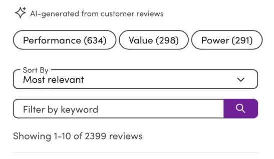
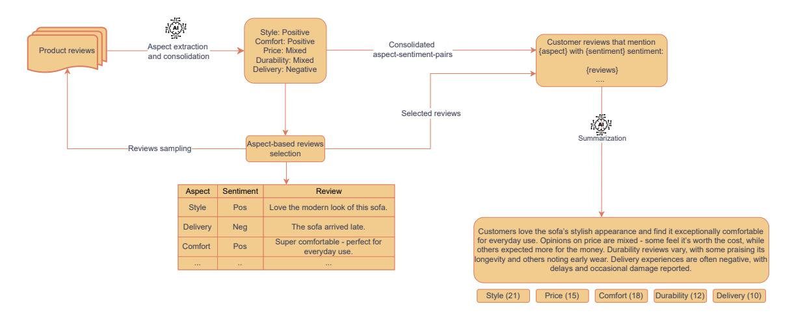
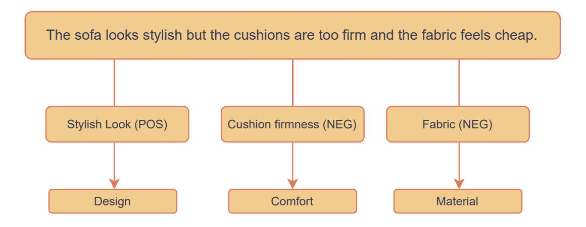

# End-to-End Aspect-Guided Review Summarization at Scale

Ilya Boytsov, Vinny DeGenova, Mikhail Balyasin, Joseph Walt Caitlin Eusden, Marie-Claire Rochat, Margaret Pierson

#### Wayfair

{iboytsov, vdegenova, mbalyasin, jwalt, ceusden, mrochat, mpierson1}@wayfair.com

#### Abstract

We present a scalable large language model (LLM)-based system that combines aspectbased sentiment analysis (ABSA) with guided summarization to generate concise and interpretable product review summaries for the Wayfair platform. Our approach first extracts and consolidates aspect–sentiment pairs from individual reviews, selects the most frequent aspects for each product, and samples representative reviews accordingly. These are used to construct structured prompts that guide the LLM to produce summaries grounded in actual customer feedback. We demonstrate the real-world effectiveness of our system through a largescale online A/B test. Furthermore, we describe our real-time deployment strategy and release a dataset[1](#page-0-0) of 11,8 million anonymized customer reviews covering 92,000 products, including extracted aspects and generated summaries, to support future research in aspect-guided review summarization.

#### 1 Introduction

In e-commerce platforms, customer reviews offer valuable insights into product quality and user experience. However, the overwhelming volume and repetitive nature of these reviews often make it difficult for customers to quickly find the information most relevant to their needs. To address this, platforms can leverage LLMs to automatically generate concise summaries of review content, helping customers more easily discover relevant product information. At the same time, LLMs are prone to hallucination, omission of important facts, and misrepresentation of products, particularly when summarizing large and noisy customer reviews. In addition, review sets for popular products can exceed the effective context window of current models, further increasing the risk of factual errors, as

Figure 1: Product Summary example from wayfair.com

demonstrated in multiple long-context summarization applications (Kim et al., 2024; Bai et al., 2024; Liu et al., 2024).

Previous work has proposed methods to mitigate these issues. Bra[žinskas et a](#page-5-0)l. [\(202](#page-5-0)[1\) jointly train a](#page-5-1) [review selector](#page-6-0) and summarizer, enabling the system to focus on the most informative content and produce m[ore accurate summaries.](#page-5-2) Soltan et al. (2022) propose a hybrid approach that combines extractive and abstractive summarization: they first apply Latent Semantic Analysis (Ste[inberger and](#page-6-1) [Jezek,](#page-6-1) 2004) to select the top-k most informative sentences from reviews, and then use these as input to train an abstractive summariz[er. However, the](#page-6-2) [creation of h](#page-6-2)igh-quality labeled datasets is costly, and retraining models to handle new or evolving review content adds operational overhead in production environments.

Aspect-guided review summarization offers a more controllable alternative by building on ABSA, a well-established task focused on identifying specific aspects mentioned in text and determining the

1 https://huggingface.co/collections/IeBoytsov/reviewsummaries-68dab02e7b6a5bc8e29e81fa

Figure 2: The figure shows an example output generated by the system. It illustrates the aspect-guided review summarization pipeline, which extracts and consolidates aspect–sentiment pairs from customer reviews to identify the top 5 most frequent aspects. The system then generates a product summary using prompts built from representative reviews for each selected aspect-sentiment pair. The output includes selected aspects with counts and supporting reviews, along with a summary grounded in them.

sentiment expressed toward each (Pontiki et al., 2014). Earlier work on ABSA relied on rule-based approaches that leveraged linguistic patterns to identify aspect terms, often by ext[racting promi](#page-6-3)[nent n](#page-6-3)ouns from the text (Pavlopoulos and Androutsopoulos, 2014). Another early direction involved the use of topic models to uncover latent aspects across reviews (Lakkaraju et al., [2011\). With the](#page-6-4) [rise of deep lear](#page-6-4)ning, neural network-based methods gained popularity, including approaches based on recurrent n[eural networks \(Tang et](#page-5-3) al., 2016; Chen et al., 2017) and convolutional neural networks (Xue and Li, 2018). With advances in LLMs and their in-context learning c[apabilities \(Brown](#page-6-5) et al., [2020\), ABSA](#page-5-4) can now be formulated as a language [generation task \(H](#page-6-6)osseini-Asl et al., 2022), enabling scalable aspect extraction that ca[n guide](#page-5-5) [and structu](#page-5-5)re the summarization process. (Gunel et al., 2023) utilize asp[ects to construct structured](#page-5-6) summaries, but their approach does not incorporate sentiment information, which limits the co[ntrolla](#page-5-7)[bility and nu](#page-5-7)ance of the generated summaries.

Our pipeline first extracts aspect-sentiment pairs from individual reviews to identify frequently discussed product attributes along with their sentiment polarity. We then select the most frequent aspects and sample supporting reviews to construct targeted prompts that guide the summarization model to focus on specific product dimensions. This structured approach generates concise, consistent summaries while mitigating hallucination and factual inconsistency issues. Importantly, the pipeline is

model-agnostic and can be applied with any pretrained LLM, making it adaptable to a wide range of deployment scenarios. Our contributions are as follows:

- A production system architecture for real-time aspect-guided review summarization.
- Large-scale A/B test results demonstrating real-world impact on customer experiences.
- An open-sourced dataset with 92,000 products with total 11,8 million reviews, annotated aspects, and generated product summaries.

## 2 Method

Our pipeline illustrated in Figure 2 consists of the following stages, each described in detail in the following sections:

- Aspect extraction: Identify product aspects and associated sentiment from individual reviews.
- Aspect consolidation: Map fine-grained or specific aspect terms to broader, high-level canonical forms.
- Aspect-based review selection: Select the most salient aspects per product and sample representative reviews mentioning each aspect.

Figure 3: Illustration of the aspect extraction and consolidation process. Starting from a raw customer review, fine-grained aspect-sentiment pairs are extracted. These aspects are then mapped to broader canonical terms, resulting in a consolidated set of aspect-sentiment pairs.

• Aspect-guided summarization: Generate a concise product-level summary using targeted prompts constructed from the consolidated aspects and selected reviews.

We use Gemini 1.5 Flash to perform all LLMbased components of the pipeline, including aspect extraction, aspect consolidation, and final summarization. The overall architecture is modular and model-agnostic, making it straightforward to replace the LLM backbone or customize individual components as needed.

We provide representative prompt templates used in our pipeline in Appendix. Figure 4 shows the prompt used for extracting aspect–sentiment pairs from customer reviews. Figure 5 illustrates the prompt for aspect consolidation. Figure 6 presents the prompt for generating prod[uc](#page-7-0)t-level summaries.

#### 2.1 Aspect extraction

The first stage of the pipeline performs aspect-lev[el](#page-7-1) information extraction from individual customer reviews. Each review is independently processed using a pretrained LLM, prompted to extract up to five relevant product aspects and their associated sentiment labels (positive, mixed, or negative). The LLM is guided via a structured prompt and outputs a JSON object for each review.

#### 2.2 Aspect consolidation

Due to the variability of natural language, the raw extracted aspects often exhibit lexical variation and differences in granularity. For example, *value for* *money* may be mapped to the broader concept *price*, *assembly time* generalized to *assembly*, while already high-level aspects like *comfort* remain unchanged. In other cases, fine-grained terms such as *shipping speed* and *packaging condition* can be grouped under a shared category like *delivery*.

To address this, we introduce an aspect consolidation step implemented as a second LLM-based prompting stage. We first collect all unique aspects extracted from an initial batch of data. To preserve interpretability of common terms, we compute the 95th percentile of aspect frequency - which in our case corresponds to 30 occurrences - and keep all aspects with frequencies above this threshold unchanged. Aspects with frequencies below this cutoff are consolidated by mapping them to broader canonical forms. This approach ensures that only less frequent, potentially noisy or overly specific aspects are merged, while well-established aspects remain intact. The model is prompted to map each of these to a broader or more canonical form, without relying on a fixed ontology. The resulting mappings are stored and applied across all reviews and products in the batch.

When processing new data, we reuse the cached mappings: if an aspect has already been seen, we apply its existing canonical form; otherwise, the new aspect is added to the mapping through the same consolidation process. This caching mechanism ensures consistent vocabulary over time while allowing for efficient and scalable updates as new review data becomes available. An example of this transformation is shown in the Figure 3.

#### 2.3 Aspect-based review selection

To prepare inputs for aspect-guided summarization, we first identify the top five most fre[que](#page-2-0)ntly mentioned aspects for each product after consolidation. For each selected aspect–sentiment pair, we sample a subset of reviews in which the aspect is mentioned with the corresponding sentiment label. To maintain a reasonable context length for the summarization model, we cap the total number of input reviews at 200 per product - a hyperparameter chosen to balance coverage and efficiency. If a product has fewer than 200 reviews, all are included; otherwise, we perform random weighted sampling, drawing reviews proportionally to the frequency of each aspect–sentiment pair. This helps preserve the relative prominence of different opinions in the input to the summarization model. For algorithmic flexibility, our framework supports business criteria-based sampling such as prioritizing recent reviews or verified purchaser feedback, allowing adaptation to specific application requirements.

#### 2.4 Aspect-Guided Summarization

The final stage of the pipeline generates the productlevel summary based on the set of aspects and the selected supporting reviews. We frame the summarization task as an instance of aspect-guided multi-review summarization, where the model is instructed to produce a coherent, concise summary that covers the most frequent product aspects and accurately reflects the underlying customer feedback. The resulting summary is a natural language text of approximately 300–500 characters in length.

## 3 Evaluation

We evaluate our aspect-guided review summarization pipeline both offline and online to assess its quality and real-world impact. Offline, we conduct a manual review of generated summaries to measure their factual consistency and alignment with extracted aspects. Online, we deploy the system in a large-scale randomized A/B test on a live ecommerce platform, measuring its effect on key customer engagement and experience metrics.

This combination of offline and online evaluation allows us to assess both the linguistic quality of the generated summaries and their practical value to end users.

#### 3.1 Offline evaluation

Our offline evaluation serves as a quality validation checkpoint before production deployment. The evaluation dataset comprises 341 products with at least 10 customer reviews each, totaling approximately 50,000 reviews. The products were strategically sampled to ensure representativeness in multiple dimensions: product categories, bestsellers, high customer engagement items, and products with varying sentiment distributions (positive-only, negative-only, and mixed reviews).

We generate aspect-guided summaries for all 341 products and perform a manual evaluation against the original review sets using the following error taxonomy:

- No errors: The summary accurately represents all aspects with the correct sentiment.
- Exaggeration / Understatement: The summary misrepresents the overall sentiment of the customer about the product.
- Minor Misrepresentation: The summary inaccurately describes exactly one aspect of the product.
- Major Misrepresentation: The summary inaccurately describes more than one aspect of the product.
- Minor Omission: The summary fails to mention exactly one aspect of the product.
- Major Omission: The summary fails to mention more than one aspect of the product.

We initially conducted triple annotation on (10%) of the dataset with three trained domain experts to establish reliability and identify potential subjectivity issues. Intercoder agreement measured via majority vote (at least 2 out of 3 annotators agreeing) was 70%, with most disagreements concerning whether an error should be classified as major or minor. Following this phase, we conducted consensus discussions to refine our error taxonomy definitions and develop clearer annotation guidelines that addressed the main sources of subjectivity. The remaining 90% of products were then independently annotated by single trained evaluators using the refined guidelines.

The evaluation revealed strong performance across quality dimensions. Of 341 summaries, 285 (84%) had no errors. Minor problems were found in 33 summaries (11%), including 12 cases of minor misrepresentation and 21 cases of minor omission. The main issues were identified in 15 summaries (5%), consisting of 5 cases of exaggeration or understatement, 9 cases of major misrepresentation, and 6 cases of major omission. A few examples of evaluation can be found in the table 2 of the Appendix. The input reviews are omitted due to their length; only the model-generated outputs are shown to illustrate the reasoning behind th[e h](#page-8-0)uman judgments.

#### 3.2 Online evaluation

We conduct an A/B test on a large e-commerce platform comparing two versions of the product page. The control version shows the usual customer reviews without any additional features. The treatment version adds an aspect-guided summary above the reviews, along with the top n most frequently mentioned aspects. Each aspect is clickable, allowing users to filter reviews related to that specific aspect.

The primary hypothesis was that providing summaries would improve the visit-level Add to Cart Rate (ATCR) by increasing user confidence through easier access to relevant customer feedback. Secondary key performance indicators (KPIs) included the visit-level conversion rate (CVR) and the customer-level bounce rate.2 The experiment also monitored potential negative impacts on session-level gross revenue (GRS) and page speed index to ensure that overall site [pe](#page-4-0)rformance was not degraded.

The A/B test was conducted over a three-week period in March 2025, spanning 493,208 products across 2,329 product classes, where each product class is a large categorical grouping such as wall art, area rugs, or coffee accessories. The experiment was carried out on English-language customer reviews. All reported metrics were statistically significant with p = 0.10. The ATCR increased by 0.3%. Secondary metrics also improved: CVR increased by 0.5%, and the bounce rate at the customer level decreased by 0.13%. No statistically significant negative effects were observed on GRS or the page speed index.

#### 4 Real-Time System Deployment

The pipeline is deployed in a real-time production environment to automatically generate and main-

tain up-to-date product review summaries. For newly listed products, a pipeline is triggered once the product accumulates at least 10 customer reviews, ensuring sufficient input for meaningful aspects extraction and summarization. For products that already have a summary, the system monitors review growth and re-triggers the pipeline whenever the number of new reviews reaches 10% of the existing review count. This threshold-based refresh mechanism allows the summaries to dynamically adapt to evolving customer feedback without requiring manual intervention. Scalability is achieved in two ways: (1) by reusing cached aspect mappings, which eliminates the need to run the aspect consolidation step for previously seen aspects; and (2) by sampling reviews, which limits the input context length for the summarizer LLM.

### 5 Dataset

To support further research in aspect-guided review summarization, we are open-sourcing a subset of the anonymized production data used in our A/B test. The dataset covers 92,000 products from the 1000 most frequent product classes as observed in our A/B test sample. Each product includes between 100 and 300 reviews, resulting in 11,8 million reviews in total. The dataset features an average review length of 124 characters and an average of 129 reviews per product. Unlike other open-source datasets that provide customer reviews e.g., (Hou et al., 2024), ours pairs reviews with high-quality, production-level summaries, making it particularly valuable for training and evaluating summarization models in real-world settings.

Th[e dataset released](#page-5-8) includes two tables. The customer reviews table contains review\_id, product\_id, review\_text, and a JSON field with extracted aspect-sentiment pairs. Before aspect consolidation, the data contained 178,054 distinct aspects. After consolidation, this number was reduced to 19,014, significantly improving consistency of the aspects extracted between products. Only the consolidated aspects are included in the data release. The most frequent are presented in Table 1. The product summaries table contains product\_id, product\_class and the corresponding natural language summary generated by our pipeline.

#### 6 [L](#page-5-9)imitations

Although effective, the performance of the pipeline depends on the quality of its individual compo-

2Lower bounce rate indicates better user engagement.

| Aspect     | Count     | Pos.  | Neg.  | Mix. |
|------------|-----------|-------|-------|------|
| Quality    | 2,751,718 | 90.24 | 8.43  | 1.33 |
| Assembly   | 2,580,429 | 76.35 | 17.28 | 6.37 |
| Appearance | 2,524,263 | 96.49 | 2.46  | 1.05 |
| Color      | 1,637,444 | 78.07 | 12.85 | 9.08 |
| Size       | 1,624,931 | 74.73 | 16.12 | 9.15 |
| Style      | 1,566,926 | 98.18 | 0.70  | 1.12 |
| Comfort    | 1,561,803 | 87.17 | 8.42  | 4.41 |
| Aesthetics | 1,550,268 | 98.84 | 0.68  | 0.48 |
| Sturdiness | 1,530,147 | 91.61 | 7.13  | 1.26 |
| Value      | 1,477,811 | 89.05 | 8.45  | 2.50 |

Table 1: Top 10 most frequent aspects with sentiment distribution (%).

nents, including aspect extraction, consolidation, review selection and summarization. Inconsistent or noisy outputs at any stage can degrade the overall quality of the summaries. Crucially, the choice of the underlying LLM also plays a central role, as it drives all LLM-based stages and directly impacts accuracy, fluency, and alignment with customer sentiment. Performance may further decline for rare product classes with limited review coverage or highly domain-specific terminology. Future work could explore improved robustness across a broader range of domains, languages, and product categories, as well as better alignment between extracted aspects and user intent.

## 7 Conclusions

We present a production-grade end-to-end pipeline for generating product review summaries grounded in key product aspects. The modular and flexible design of the system enables experimentation with individual components and supports real-time adaptation as new reviews are added. The approach demonstrated effectiveness in an online A/B test, yielding statistically significant improvements in key customer engagement metrics. We hope that the open source dataset will support future research at the intersection of aspect-based sentiment analysis and summarization tasks.

### Acknowledgments

We thank our colleagues across multiple teams at Wayfair. In particular, we acknowledge the valuable contributions of John Soltis, Kyle Buday, Alsida Dizdari, Karan Manchanda, Karan Bhatia, Trevor Truog, Vipul Dalsukrai, Leo Kin, Kanika Sawhney, Kaitlyn Yan, Dan Lachapelle, and Nick Coleman.

## References

Yushi Bai, Xin Lv, Jiajie Zhang, Hongchang Lyu, Jiankai Tang, Zhidian Huang, Zhengxiao Du, Xiao Liu, Aohan Zeng, Lei Hou, Yuxiao Dong, Jie Tang, and Juanzi Li. 2024. LongBench: A bilingual, multitask benchmark for long context understanding. In *Proceedings of the 62nd Annual Meeting of the Association for Computational Linguistics (Volume 1: Long Papers)*, pages 3119–3137, Bangkok, Thailand. [Association for Computational Linguistics.](https://doi.org/10.18653/v1/2024.acl-long.172)

Arthur Bražinskas, Mirella Lapata, and Ivan Titov. 2021. Learning opinion summarizers by selecting informative reviews. In *Proceedings of the 2021 Conference on Empirical Methods in Natural Language Processing*, pages 9424–9442, Online and Punta Cana, Dominican Republic. Association for Computational [Linguistics.](https://doi.org/10.18653/v1/2021.emnlp-main.743)

T[om B Brown,](https://doi.org/10.18653/v1/2021.emnlp-main.743) Benjamin Mann, Nick Ryder, Melanie Subbiah, Jared Kaplan, Prafulla Dhariwal, Arvind Neelakantan, Pranav Shyam, Girish Sastry, Amanda Askell, and 1 others. 2020. Language models are few-shot learners. *arXiv preprint arXiv:2005.14165*.

Peng Chen, Zhongqian Sun, Lidong Bing, and Wei Yang. 2017. Recurrent attention network on memory for aspect sentiment analysis. In *Proceedings of the 2017 Conference on Empirical Methods in Natural Language Processing*, pages 452–461, Copenhagen, Denmark. Association for Computational Linguistics.

B[eliz Gunel, Sandeep Tata,](https://doi.org/10.18653/v1/D17-1047) and Marc Najork. 2023. Strum: Extractive aspect-based contrastive summarization. In *Companion Proceedings of the ACM Web Conference 2023*, page 28–31.

Ehsan Hosseini-Asl, Wenhao Liu, and Caiming Xiong. 2022. A generative language model for few-shot aspect-based sentiment analysis. In *Findings of the Association for Computational Linguistics: NAACL 2022*, pages 770–787, Seattle, United States. Association for Computational Linguistics.

Yupeng [Hou, Jiacheng Li, Zhankui He, An Yan, Xiusi](https://doi.org/10.18653/v1/2022.findings-naacl.58) [Chen, and Julian McAuley. 2024.](https://doi.org/10.18653/v1/2022.findings-naacl.58) Bridging language and items for retrieval and recommendation. *arXiv preprint arXiv:2403.03952*.

Yekyung Kim, Yapei Chang, Marzena Karpinska, Aparna Garimella, Varun Manjunatha, Kyle Lo, Tanya Goyal, and Mohit Iyyer. 2024. Fables: Evaluating faithfulness and content selection in book-length summarization. *Preprint*, arXiv:2404.01261.

Hima Lakkaraju, Chiranjib Bhattacharyya, and Indrajit Bhattacharya. 2011. Exploiting coherence for the simultaneous discovery of latent facet[s and associated](https://arxiv.org/abs/2404.01261) sentiments. In *[Proceedings of the 2011 SIAM Inter](https://arxiv.org/abs/2404.01261)[national Confe](https://arxiv.org/abs/2404.01261)rence on Data Mining (SDM)*, pages 498–509.

Nelson F. Liu, Kevin [Lin, John Hewitt, Ashwin Paran](https://doi.org/10.1137/1.9781611972818.43)[jape, Michele Bevilacqua, Fabio Petroni, and Percy](https://doi.org/10.1137/1.9781611972818.43)

- [Liang. 2024](https://doi.org/10.1137/1.9781611972818.43). Lost in the middle: How language models use long contexts. *Transactions of the Association for Computational Linguistics*, 12:157–173.
- John Pavlopoulos and Ion Androutsopoulos. 2014. Aspect term extraction for sentiment analysis: New datasets, ne[w evaluation measures and an improved](https://doi.org/10.1162/tacl_a_00638) [unsupervised metho](https://doi.org/10.1162/tacl_a_00638)d. In *Proceedings of the 5th Workshop on Language Analysis for Social Media (LASM)*, pages 44–52, Gothenburg, Sweden. As[soci](https://doi.org/10.3115/v1/W14-1306)[ation for Computational Linguistics.](https://doi.org/10.3115/v1/W14-1306)
- M[aria Pontiki, Dimitris Galanis, John Pavlopoulos, Har](https://doi.org/10.3115/v1/W14-1306)[ris Papageorgiou, Ion A](https://doi.org/10.3115/v1/W14-1306)ndroutsopoulos, and Suresh Manandhar. 2014. SemEval-2014 task 4: Aspect based sentiment analysis. In *Proceedings of the 8th International Workshop on Semantic Evaluation (SemEval 2014)*, pages 27–35, Dublin, Ireland. Association for Computational Linguistics.
- Saleh Soltan, Victor S[oto, Ke Tran, and Wael Hamza.](https://doi.org/10.3115/v1/S14-2004) 2022. [A hybrid approach](https://doi.org/10.3115/v1/S14-2004) to cross-lingual product review summarization. In *Proceedings of the 2022 Conference on Empirical Methods in Natural Language Processing: Industry Track*, pages 18–28, Abu Dhabi, UAE. Association for Computational Linguistics.
- J. [Steinberger and Karel J](https://doi.org/10.18653/v1/2022.emnlp-industry.3)ezek. 2004. Using latent semantic analysis in text summarization and summary evaluation. *Proceedings of ISIM'04*, pages 93–100.
- Duyu Tang, Bing Qin, Xiaocheng Feng, and Ting Liu. 2016. Effective LSTMs for target-dependent sentiment classification. In *Proceedings of COLING 2016, the 26th International Conference on Computational Linguistics: Technical Papers*, pages 3298– 3307, Osaka, Japan. The COLING 2016 Organizing Committee.
- W[ei Xue and Tao Li. 2](https://aclanthology.org/C16-1311/)018. [Aspect based sentiment](https://aclanthology.org/C16-1311/) analysis with gated convolutional networks. In *Proceedings of the 56th Annual Meeting of the Association for Computational Linguistics (Volume 1: Long Papers)*, pages 2514–2523, Melbourne, Australia. Association for Computation[al Linguistics.](https://doi.org/10.18653/v1/P18-1234)

#### Appendix A. Prompt Templates

You are a helpful assistant and an expert in understanding product reviews. Your task is to extract product aspects and their associated sentiments from customer reviews, if any are mentioned. A product aspect refers to a specific feature, attribute, or component of a product or service that customers mention and evaluate. The sentiment should be classified as one of: "POSITIVE", "MIXED", or "NEGATIVE". Below are examples of customer reviews and the corresponding extracted aspects: {EXAMPLES} Now, you are given a customer review. Extract up to 5 product aspects mentioned in the review along with their corresponding sentiments. Each aspect can be a single word or a multi-word phrase. Respond with a valid JSON. {REVIEW}

Figure 4: Prompt template for aspect extraction.

You are given a list of product aspects extracted from customer reviews. Some aspects are very specific (low-level), while others are broader and more general (high-level). Whenever possible, merge low-level aspects into more general high-level ones. If an aspect is already high-level, leave it unchanged. Respond with valid JSON where the keys are the original (low-level) aspects and the values are their corresponding high-level forms. Below are examples of low-level aspects and their high-level counterparts: {EXAMPLES} Now, normalize the following list of aspects: {ASPECTS}

Figure 5: Prompt template for aspect consolidation.

The product belongs to the {product\_class} category and has been annotated with several aspects and their corresponding sentiments based on customer reviews. You are given review data that includes which aspects were extracted from each review. The data is formatted as follows: Each product includes up to 5 aspects. For each aspect, there is a line indicating the number of reviews that mention the aspect along with its sentiment. The format is: "Below are N customer reviews that mention aspect 'aspect name' with 'sentiment type' sentiment." This is followed by the actual reviews that were tagged with the given aspect and sentiment. Please write a concise product summary based on the reviews and extracted aspects. Follow these guidelines when generating the summary: {DOMAIN-SPECIFIC INSTRUCTIONS} {EXAMPLES} Below is the reviews/aspects data. Respond with a brief summary. {ASPECT-GUIDED REVIEWS}

Figure 6: Prompt template for summarization.

#### Appendix B. Evaluation Examples

| Summary                                 | Aspects              | Decision          | Reason                        |
|-----------------------------------------|----------------------|-------------------|-------------------------------|
| Customers praise this prod              | Value: POS           | Minor misrepre    | 35 reviews stating the        |
| uct for its excellent value | Thickness: NEG       | sentation         | mattress is firm and |
| and supportive firmness, find           | Support: POS         |                   | one stating it is softer      |
| ing it comfortable and pain             | Style: POS           |                   | than expected. The      |
| relieving. Many appreciate           | Softness: MIX        |                   | softness aspect is mis        |
| its thickness and stylish de            |                      |                   | represented.                  |
| sign. However, some experi              |                      |                   |                               |
| enced inconsistencies in firm           |                      |                   |                               |
| ness, with some reporting it            |                      |                   |                               |
| softer than expected, and oth           |                      |                   |                               |
| ers noting that the mattress            |                      |                   |                               |
| didn't fully expand to its ad           |                      |                   |                               |
| vertised thickness.                     |                      |                   |                               |
| Customers love the product's            | Value: POS           | Minor omission    | Multiple customers         |
| softness and thickness, prais           | Texture: POS         |                   | questioned product         |
| ing its luxurious feel and sub          | Style: POS           |                   | durability after wash         |
| stantial weight. The style is           | Softness: POS        |                   | ing, but the durability       |
| also highly regarded, comple            |                      |                   | aspect despite being    |
| menting various decor styles.           |                      |                   | mentioned in the        |
| Many find it to be good value           |                      |                   | summary was not         |
| for the price. However, some            |                      |                   | extracted as one of the       |
| note that the rug sheds ex              |                      |                   | key aspects.                  |
| cessively and its durability is         |                      |                   |                               |
| questionable after washing.             |                      |                   |                               |
| This product offers good       | Wind Resistance: POS | Exaggeration / | The product issues are        |
| value and weather resistance,           | Weatherproof: POS    | Understatement    | much more major than          |
| with customers praising its             | Value: POS           |                   | just leaks and mis   |
| sturdiness and ability to with          |                      |                   | aligned parts. Some        |
| stand strong winds and rain.            |                      |                   | of the customers men          |
| Assembly can be challenging,            |                      |                   | tioned how it collapses       |
| requiring multiple people and           |                      |                   | with minor snowfalls          |
| careful attention to instruc            |                      |                   | and other issues with         |
| tions. Some users reported           |                      |                   | rain / wind.                  |
| minor issues with leaks and             |                      |                   |                               |
| misaligned parts.                       |                      |                   |                               |

Table 2: Different types of errors during evaluation.