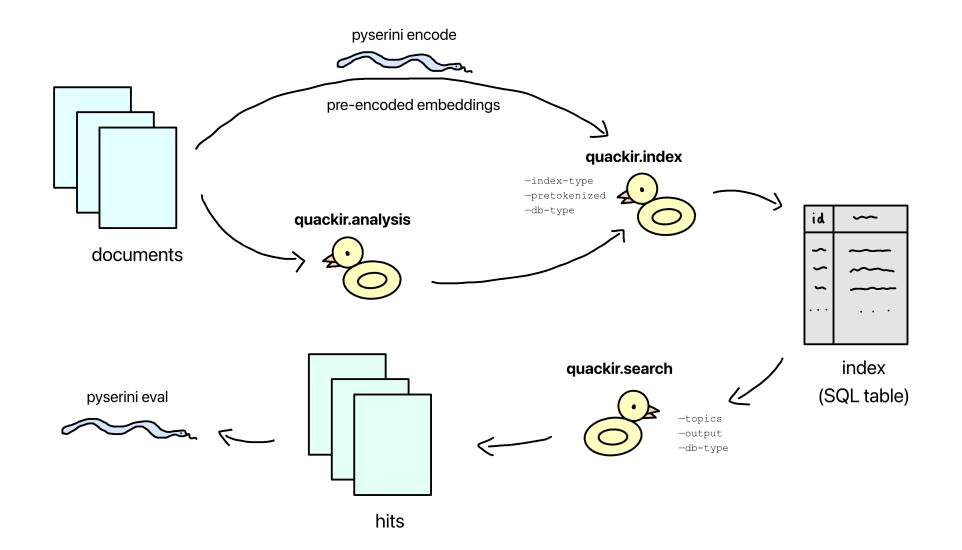

# QuackIR: Retrieval in DuckDB and Other Relational Database Management Systems

# Yijun Ge, Zijian Chen, Jimmy Lin

David R. Cheriton School of Computer Science, University of Waterloo {l2ge, s42chen, jimmylin}@uwaterloo.ca

### Abstract

Enterprises today are increasingly compelled to adopt dedicated vector databases for retrievalaugmented generation (RAG) in applications based on large language models (LLMs). As a potential alternative for these vector databases, we propose that organizations leverage existing relational databases for retrieval, which many have already deployed in their enterprise data lakes, thus minimizing additional complexity in their software stacks. To demonstrate the simplicity and feasibility of this approach, we present QuackIR, an information retrieval (IR) toolkit built on relational database management systems (RDBMSes), with integrations in DuckDB, SQLite, and PostgreSQL. Using QuackIR, we benchmark the sparse and dense retrieval capabilities of these popular RDBMSes and demonstrate that their effectiveness is comparable to baselines from established IR toolkits. Our results highlight the potential of relational databases as a simple option for RAG scenarios due to their established widespread usage and the easy integration of retrieval abilities. Our implementation is available at <quackir.io>.

### 1 Introduction

With the rise of large language models (LLMs) and retrieval-augmented generation (RAG) [\(Lewis](#page-8-0) [et al.,](#page-8-0) [2020;](#page-8-0) [Ram et al.,](#page-8-1) [2023\)](#page-8-1), where search results are incorporated into prompts to provide additional context for LLMs, a variety of vector stores dedicated to vector search have emerged. The dominant narrative is that these vector stores are necessary for enterprises as part of their "AI stack" [\(Lin et al.,](#page-8-2) [2023\)](#page-8-2). The goal of this paper is to provide a potential alternative for the vector stores used in RAG with relational databases by introducing QuackIR, a retrieval toolkit dedicated to this approach of search using relational databases.

Relational databases are an established fixture in the "data stacks" of many, if not most, enterprises, forming an integral component of existing data lakes. Having successfully withstood the test of time and numerous challengers, they have shown themselves to be indispensable, and it follows that many companies have already invested heavily in them [\(Lin et al.,](#page-8-2) [2023\)](#page-8-2). Thus, performing search directly using relational databases in the context of RAG applications is advantageous as it adds minimal additional complexity compared to integrating a separate dedicated vector store.

To demonstrate the retrieval capabilities of relational databases, we explore three relational database management systems (RDBMSes) with QuackIR: DuckDB[1](#page-0-0) for its powerful analytics capabilities, SQLite[2](#page-0-1) for being the "go-to" embedded database, and PostgreSQL[3](#page-0-2) for its popular deployment in production.

Our contribution is QuackIR, a toolkit for information retrieval (IR) with RDBMSes. Using QuackIR, we evaluate the retrieval effectiveness of various RDBMSes and draw comparisons against established baselines, exhibiting the potential of relational databases in retrieval. Based on our results, we highlight DuckDB as a particularly promising candidate. QuackIR's pipeline mirrors widely used IR toolkits such as Anserini [\(Yang et al.,](#page-8-3) [2018,](#page-8-3) [2017;](#page-8-4) [Lin et al.,](#page-8-5) [2016\)](#page-8-5) and Pyserini [\(Lin et al.,](#page-8-6) [2021\)](#page-8-6), achieving feature parity and offering a modular architecture conducive to extension and integration. We hope that QuackIR enables enterprises to build effective RAG systems directly on top of their existing relational database infrastructure.

# 2 Architecture

We discuss our design and RDBMS-specific technical details. QuackIR is open source; the full implementation is available at <quackir.io>.

1

<span id="page-0-1"></span>2

<span id="page-0-0"></span><duckdb.org> <sqlite.org>

<span id="page-0-2"></span><sup>3</sup> <postgresql.org>

<span id="page-1-0"></span>

Figure 1: Diagram of QuackIR's pipeline.

QuackIR supports sparse, dense, and hybrid retrieval [\(Lin,](#page-8-7) [2021\)](#page-8-7). Sparse retrieval is based on keyword matching, where the terms in a document and their respective frequencies are represented by sparse vectors. This is also called full-text search. BM25 is the "classic" sparse retrieval algorithm, calculating the relevance scores of documents in regards to query tokens based on various factors such as the number of documents, document lengths, and given parameters that can be tuned to adjust the weight of said factors [\(Robertson and Zaragoza,](#page-8-8) [2009\)](#page-8-8). Dense retrieval uses special models, e.g., transformers, to embed documents and queries into vectors that capture the semantic meaning of the text, hence the name vector search [\(Karpukhin](#page-7-0) [et al.,](#page-7-0) [2020\)](#page-7-0). Relevance scores are calculated by the cosine distance of document and query vectors. We implement dense retrieval with "flat" indexes in QuackIR, which is brute-force search for the exact nearest neighbour by scanning all the vectors and finding the top results based on the cosine distance.

Hybrid retrieval fuses results from different retrieval techniques, such as sparse and dense retrieval, in an effort to create a list of results that improves upon both. We implement reciprocal rank fusion (RRF) in QuackIR, a popular hybrid retrieval method that combines together documents rescored according to their respective ranks in the base retrieval results [\(Cormack et al.,](#page-7-1) [2009\)](#page-7-1).

The pipeline and features of QuackIR parallel those of Anserini and Pyserini, comprising preprocessing, indexing, retrieval, and evaluation, with a modular design that is convenient to integrate

```
java -cp anserini-1.0.0-fatjar.jar \
  io.anserini.search.SearchCollection \
  -index indexes/index_path \
  -topics path/to/queries \
  -output runs/output.txt \
  -bm25 -removeQuery
python -m pyserini.search.lucene \
  --threads 16 --batch-size 128 \
  --index indexes/index_path \
  --topics path/to/queries \
  --output runs/output.txt \
  --output-format trec \
  --hits 1000 --bm25 --remove-query
python -m quackir.search \
  --index index_name \
  --topics path/to/queries \
  --output runs/output.txt \
  --db-type duckdb \
  --db-path duck.db
```

Figure 2: Sample search commands in Anserini, Pyserini, and QuackIR, in that order from top to bottom.

into existing enterprise workflows. A diagram of this pipeline can be found in Figure [1.](#page-1-0) Anserini and Pyserini are widely used IR toolkits that support the full retrieval pipeline through powerful utilities implemented in Java and Python, respectively. They offer various retrieval modes, including sparse, dense, and hybrid.

Given Anserini and Pyserini's widespread adoption within the IR research community, we use them as primary references when designing QuackIR. By conforming to their interface and design patterns, we aim to bridge the gap between academic IR toolkits and RDBMS-based industry applications. An example retrieval command in QuackIR, alongside corresponding commands in Anserini and Pyserini, is shown in Figure [2.](#page-1-1)

```
def fts_search(self, query_string, top_n=5, table_name="corpus"):
    query = f"""WITH fts AS (SELECT *,
    COALESCE(fts_main_{table_name}.match_bm25(id, ?, k:=0.9, b:=0.4), 0) AS score FROM {table_name})
    SELECT id, score FROM fts WHERE score IS NOT NULL
    ORDER BY score DESC LIMIT {top_n};
    return self.conn.execute(query, [query_string]).fetchall()
```

Figure 3: QuackIR's internal implementation of sparse retrieval with DuckDB, using Python wrapping SQL.

### 2.1 Design

QuackIR wraps the SQL logic required for retrieval within the integrated RDBMSes; for instance, Figure [3](#page-2-0) illustrates QuackIR's sparse retrieval implementation using DuckDB's full-text search. While the RDBMSes already provide the primary retrieval capabilities, e.g., the SQL query shown, the usage across different systems varies and can be difficult to master. QuackIR presents a natural Python interface that interoperates with Anserini and Pyserini, matching research-level effectiveness while being fully implemented within RDBMSes, reducing production complexity for industry practitioners and their existing relational database systems.

Pre-Processing To generate terms for sparse retrieval, text is put through a tokenizer for stemming and to remove stopwords. QuackIR wraps Pyserini's Lucene analyzer to use its Porter tokenizer for convenient tokenization. The built-in text processing functionalities of the RDBMSes are disabled wherever possible to ensure that retrieval effectiveness is evaluated without the interference of database-specific tokenization or normalization. That is, for our experiments, all documents and queries used for sparse retrieval are pre-tokenized with QuackIR. For dense retrieval, we use documents and queries pre-encoded with BGE-base-env1.5 [\(Xiao et al.,](#page-8-9) [2024\)](#page-8-9).

Indexing Documents are indexed to facilitate efficient computation of relevance scores and fast retrieval. For indexing, QuackIR takes the path of the collection and inserts the contents of the file, or of all the files inside for a directory, into the specified database. QuackIR accepts jsonl files for sparse and dense indexes, and parquet files for dense indexes. A table with the appropriate columns is created based on the type of index: a text column for contents in a sparse index or an RDBMS-specific vector column for embeddings in a dense index. For dense indexes, simply loading the data into the database table is enough. For sparse indexes, there is an additional step for the actual indexing to make the collection statistics used for retrieval easily ac-

```
from quackir.index import DuckDBIndexer
from quackir import IndexType
table_name = "corpus"
index_type = IndexType.SPARSE
indexer = DuckDBIndexer()
indexer.init_table(table_name, index_type)
indexer.load_table(table_name, corpus_file)
indexer.fts_index(table_name)
indexer.close()
```

Figure 4: Code snippet for creating and loading a sparse index in DuckDB, where corpus\_file is the path to the corpus in the appropriate format.

```
from quackir.search import DuckDBSearcher
from quackir import SearchType
table_name = "corpus"
query = "what are ducks"
search_type = SearchType.SPARSE
searcher = DuckDBSearcher()
results = searcher.search(
    search_type,
    query_string=query,
    table_names=[table_name]
)
print(results)
searcher.close()
```

Figure 5: Code snippet for searching a sparse index with QuackIR in DuckDB.

cessible. An example code snippet for indexing in QuackIR with DuckDB is shown in Figure [4.](#page-2-1) We do not consider the cost of the entire indexing process in our results; we assume a static corpus, as is the case with benchmarks, which makes indexing a one-time operation [\(Lin,](#page-8-10) [2025\)](#page-8-10).

Retrieval QuackIR supports a variety of retrieval needs, offering sparse, dense, and hybrid retrieval. An example code snippet for searching a sparse index in QuackIR with DuckDB is shown in Figure [5.](#page-2-2) For sparse retrieval, DuckDB and SQLite both attempt to implement BM25, but PostgreSQL does not. Even then, as described by [Kamphuis et al.](#page-7-2) [\(2020\)](#page-7-2), there are many variants of BM25, and the RDBMSes have implementation differences from Lucene's formula used by Anserini, the baseline we compare against. For dense retrieval, supported by DuckDB and PostgreSQL, we use brute-force search with flat indexes to get the "baseline" effec-

<span id="page-3-2"></span>
$$\log\left(1 + \frac{N - df_t + 0.5}{df_t + 0.5}\right) \cdot \left(\frac{tf_{td}}{k_1 \cdot \left(1 - b + b \cdot \left(\frac{L_{lossy}}{L_{ava}}\right)\right) + tf_{td}}\right) \tag{1}$$

$$\log\left(1 + \frac{N - df_t + 0.5}{df_t + 0.5}\right) \cdot \left(\frac{tf_{td} \cdot (k_1 + 1)}{k_1 \cdot \left(1 - b + b \cdot \left(\frac{L_d}{Lavg}\right)\right) + tf_{td}}\right) \tag{2}$$

$$\log\left(\frac{N - df_t + 0.5}{df_t + 0.5}\right) \cdot \left(\frac{tf_{td} \cdot (k_1 + 1)}{k_1 \cdot \left(1 - b + b \cdot \left(\frac{L_d}{L_{avg}}\right)\right) + tf_{td}}\right) \quad (3)$$

Figure 6: BM25 formulas for the score of term t in Lucene, DuckDB, and SQLite from top to bottom where N is the number of documents,  $df_t$  is the number of documents containing t,  $tf_{td}$  is the term frequency of t in document d,  $L_d$  is length of document d,  $L_{lossy}$  is document length with loss,  $L_{avg}$  is average length of documents in collection, and  $k_1$  and  $k_2$  are parameters.

tiveness. Hybrid retrieval is implemented directly with SQL, querying both a sparse and a dense index and combining results by RRF. Following Cormack et al. (2009), we set k=60 as the default value used in RRF for our experiments. As hybrid retrieval uses dense retrieval, it is also only supported in DuckDB and PostgreSQL.

#### 2.2 DuckDB

QuackIR supports sparse retrieval in DuckDB with its fts extension,<sup>4</sup> one of DuckDB's many powerful core extensions. DuckDB's sparse index is called a "fts\_index", which is comprised of several tables in the same database but with another schema, similar to an inverted index used by Lucene.<sup>5</sup>

With DuckDB's extensive configurability, we are able to fully disable the built-in text processing by setting no stemmer, no stopwords, no regular expression parsing, no accent-stripping, and no lowercasing. We are also able to set the values of the BM25 parameters  $k_1$  and b to 0.9 and 0.4, respectively, following the Anserini defaults. However, the BM25 formula DuckDB uses differs from that of Lucene's in that it multiplies the score by  $(k_1+1)$  and does not use caching for the document length metric. The formula is shown in row (2) of Figure 6.

QuackIR has dense retrieval in DuckDB as well. DuckDB is well-suited for vector search, as the required functionalities are natively available without additional extensions. Dense indexes use DuckDB's built-in ARRAY datatype, and scoring uses its array\_cosine\_similarity function.

#### 2.3 SQLite

Sparse retrieval is available in QuackIR with SQLite using its FTS5 extension. SQLite's sparse index is a virtual table, which is an object that resembles a table but is in fact made of methods. Disabling the tokenizer is not an option, so we proceed with its Porter tokenizer. The BM25 parameters  $k_1$  and b have their values hard-coded at 1.2 and 0.75, respectively, so we cannot set them to match Anserini. The differences between the BM25 formulas of SQLite and Lucene consist of the same  $(k_1 + 1)$  multiplier and precise document length accuracy as DuckDB. It also does not add 1 before taking the logarithm in the IDF term. The formula is shown in row (3) of Figure 6.

QuackIR does not support dense retrieval with SQLite. While there exist vector extensions for SQLite, none are widespread. Specifically, none are as established as pgvector, so we choose not to incorporate any, as it would be less applicable.

#### 2.4 PostgreSOL

QuackIR offers sparse retrieval in PostgreSQL with its built-in full-text search.8 Its sparse index is a generalized inverted index (GIN),9 which is an index designed for searching composite items, implemented as a B-tree. We use the "simple" configuration with no stopwords, resulting in tokens being lowercased without any other processing. While this evaluates PostgreSOL's "default" fulltext search capabilities and mirrors the setup of the other RDBMSes, since this approach does not use BM25 like DuckDB and SQLite, it is not necessarily a "fair" comparison for optimal effectiveness. Therefore, we also run experiments using the "english" configuration, which uses Snowball stemming for English, a natural choice for English retrieval, along with a document length normalization option that divides the score of a document by 1 + the logarithm of its length. 10 We will refer to this as the "modified" configuration. Additionally, there is the option to configure how strongly tokens

<span id="page-3-0"></span><sup>&</sup>lt;sup>4</sup>duckdb.org/docs/stable/core\_extensions/full\_ text\_search.html

<span id="page-3-1"></span><sup>&</sup>lt;sup>5</sup>motherduck.com/blog/search-using-duckdb-part-3/

<span id="page-3-3"></span><sup>&</sup>lt;sup>6</sup>sqlite.org/fts5.html

<span id="page-3-4"></span><sup>&</sup>lt;sup>7</sup>sqlite.org/vtab.html

<span id="page-3-5"></span><sup>\*</sup>postgresql.org/docs/current/textsearch.html

<span id="page-3-6"></span><sup>9</sup>postgresql.org/docs/current/gin.html

<span id="page-3-7"></span><sup>10</sup>postgresql.org/docs/current/
textsearch-controls.html

are bound together in the query. We choose the "OR" operator, which matches when at least one of the tokens in the query appears in the document, as it is the weakest binding. For fusion purposes, we use PostgreSQL with the "simple" configuration for the sparse component.

QuackIR's dense retrieval with PostgreSQL uses PostgreSQL's popular pgvector extension,[11](#page-4-0) which integrates the vector datatype and adds support for vector similarity search to PostgreSQL. We use pgvector's cosine distance for scoring.

# 3 Experiments

Experiments are performed on an Azure instance equipped with 64 AMD EPYC 9V74 80-Core Processors, running Ubuntu 24.04.2 with 503 GB of memory. We evaluate on the BEIR dataset [\(Thakur](#page-8-11) [et al.,](#page-8-11) [2021\)](#page-8-11), a widely adopted benchmark comprising a diverse set of real-world retrieval tasks across multiple domains, with established baselines for comparison [\(Lin,](#page-8-10) [2025\)](#page-8-10). Specifically, the "flat" variant is used, where fields are concatenated prior to indexing [\(Kamalloo et al.,](#page-7-3) [2024\)](#page-7-3). Latency is measured in queries per second (QPS). Retrieval effectiveness is evaluated with Pyserini and the qrels integrated into the tools submodule it shares with QuackIR, which provides relevance judgements for document–query pairs. We measure effectiveness with the nDCG@10 metric, which is calculated by the relevance and ranks of the top ten retrieved documents, where a higher score is better.

The retrieval effectiveness results for the three RDBMSes currently supported by QuackIR are shown in Table [1.](#page-5-0) Their respective latencies are shown in Table [2.](#page-6-0) We group the datasets by the size of their corpus and into three rough subsections as done by [Lin](#page-8-10) [\(2025\)](#page-8-10). The number of documents and the number of queries for each dataset are also present in the table to examine scalability, indicated by |C| and |Q|, respectively. The effectiveness results from [Lin](#page-8-10) [\(2025\)](#page-8-10) are used as baseline for our comparisons, shown under the "Anserini" column. Some larger datasets are not evaluated with QuackIR due to the latency being too high for practicality with the current implementation.

#### 3.1 Sparse

We begin by examining sparse retrieval. The effectiveness of DuckDB and SQLite come close to Anserini's baseline with slight variations, and PostgreSQL underperforms. The differences between the scores that DuckDB and SQLite achieve from baseline are small enough for us to attribute them to the formula variations discussed earlier.

DuckDB results are very close to baseline for almost all of the datasets, with less than 0.01 of difference, which is fairly minor. The exceptions to this are TREC-NEWS, Climate-FEVER, and ArguAna, being lower than baseline by 0.010, 0.016, and 0.079, respectively, and Signal-1M, which is higher than baseline by 0.01.

SQLite achieves good effectiveness also, and results are near baseline for the most part, with 10 datasets exceeding baseline by less than 0.01, 13 datasets exceeding baseline by more than 0.01, and 6 datasets below baseline. Remarkably, the datasets below baseline are all below by 0.01 or more, indicating a non-trivial deviation. The datasets where SQLite underperforms, Touché 2020, NQ, HotpotQA, FEVER, Climate-FEVER, and BioASQ, are all large collections, with the exception of Touché 2020, which falls in the "medium" subsection and has the biggest difference, almost 0.1 below baseline. Among the "large" datasets, Signal-1M and DBpedia achieve results close to baseline but also contain the fewest queries in this group. Although DBpedia and BioASQ differ by only about one hundred queries, BioASQ includes more than three times as many documents and shows the smallest deviation from baseline among the below-baseline datasets. This suggests some loss of effectiveness in SQLite over many queries in very large corpora.

Since PostgreSQL does not implement BM25, it would be unfair to expect it to conform to baseline. Nevertheless, from the perspective of effectiveness, the scores of its full-text search using the "simple" configuration are around 0.1–0.15 lower than baseline on average, except SCIDOCS and NFCorpus, where the difference is smaller, and ArguAna, where the difference is much larger. Compared to the "simple" configuration, results are consistently better with our "modified" configuration, though still below baselines. The amount of improvement gained by the different configuration varies considerably across datasets, ranging from less than 0.01 in NFCorpus to almost 0.19 in ArguAna. This brings scores with the "modified" configuration to about 0.04 less than baseline on average, which is still nonnegligible.

In terms of efficiency, shown in Table 2 under the sparse subsection, SQLite is the fastest, followed

<span id="page-4-0"></span><sup>11</sup><github.com/pgvector/pgvector>

<span id="page-5-0"></span>

|                 |                 |        | Sparse   |       |        |        |        | Dense    |       |       | Hybrid   |       |       |
|-----------------|-----------------|--------|----------|-------|--------|--------|--------|----------|-------|-------|----------|-------|-------|
| Dataset         | $ \mathcal{C} $ | Q      | Anserini | Duck  | SQLite | PSQL S | PSQL M | Anserini | Duck  | PSQL  | Anserini | Duck  | PSQL  |
| NFCorpus        | 3,633           | 323    | 0.322    | 0.321 | 0.322  | 0.297  | 0.306  | 0.374    | 0.374 | 0.374 | 0.373    | 0.362 | 0.363 |
| SciFact         | 5,183           | 300    | 0.679    | 0.680 | 0.686  | 0.569  | 0.606  | 0.741    | 0.741 | 0.741 | 0.742    | 0.744 | 0.680 |
| ArguAna         | 8,674           | 1,406  | 0.397    | 0.318 | 0.481  | 0.069  | 0.255  | 0.636    | 0.636 | 0.636 | 0.559    | 0.506 | 0.345 |
| CQA Mathematica | 16,705          | 804    | 0.202    | 0.204 | 0.219  | 0.122  | 0.185  | 0.316    | 0.316 | 0.316 | 0.275    | 0.274 | 0.233 |
| CQA webmasters  | 17,405          | 506    | 0.306    | 0.307 | 0.308  | 0.232  | 0.287  | 0.407    | 0.407 | 0.407 | 0.371    | 0.372 | 0.339 |
| CQA Android     | 22,998          | 699    | 0.380    | 0.381 | 0.394  | 0.261  | 0.342  | 0.508    | 0.508 | 0.508 | 0.465    | 0.465 | 0.412 |
| SCIDOCS         | 25,657          | 1,000  | 0.149    | 0.150 | 0.154  | 0.091  | 0.117  | 0.217    | 0.217 | 0.217 | 0.195    | 0.194 | 0.175 |
| CQA programmers | 32,176          | 876    | 0.280    | 0.280 | 0.297  | 0.187  | 0.250  | 0.424    | 0.424 | 0.424 | 0.372    | 0.373 | 0.329 |
| CQA GIS         | 37,637          | 885    | 0.290    | 0.289 | 0.300  | 0.186  | 0.262  | 0.413    | 0.413 | 0.413 | 0.368    | 0.368 | 0.329 |
| CQA physics     | 38,316          | 1,039  | 0.321    | 0.321 | 0.347  | 0.205  | 0.300  | 0.472    | 0.472 | 0.472 | 0.414    | 0.414 | 0.359 |
| CQA English     | 40,221          | 1,570  | 0.345    | 0.344 | 0.367  | 0.225  | 0.238  | 0.486    | 0.486 | 0.486 | 0.446    | 0.444 | 0.391 |
| CQA stats       | 42,269          | 652    | 0.271    | 0.273 | 0.284  | 0.183  | 0.259  | 0.373    | 0.373 | 0.373 | 0.341    | 0.340 | 0.313 |
| CQA gaming      | 45,301          | 1,595  | 0.482    | 0.483 | 0.488  | 0.344  | 0.412  | 0.597    | 0.597 | 0.597 | 0.562    | 0.563 | 0.502 |
| CQA UNIX        | 47,382          | 1,072  | 0.275    | 0.278 | 0.287  | 0.168  | 0.255  | 0.422    | 0.422 | 0.422 | 0.360    | 0.362 | 0.330 |
| CQA Wordpress   | 48,605          | 541    | 0.248    | 0.249 | 0.258  | 0.128  | 0.241  | 0.355    | 0.355 | 0.355 | 0.335    | 0.336 | 0.281 |
| FiQA-2018       | 57,638          | 648    | 0.236    | 0.238 | 0.252  | 0.092  | 0.181  | 0.407    | 0.407 | 0.407 | 0.367    | 0.368 | 0.288 |
| CQA tex         | 68,184          | 2,906  | 0.224    | 0.226 | 0.242  | 0.130  | 0.211  | 0.312    | 0.312 | 0.312 | 0.293    | 0.293 | 0.258 |
| Average         | -               | -      | 0.318    | 0.314 | 0.334  | 0.205  | 0.277  | 0.439    | 0.439 | 0.439 | 0.402    | 0.399 | 0.349 |
| TREC-COVID      | 171,332         | 50     | 0.595    | 0.595 | 0.601  | -      | -      | 0.781    | 0.781 | 0.781 | 0.804    | -     | -     |
| Touché 2020     | 382,545         | 49     | 0.442    | 0.435 | 0.347  | -      | -      | 0.257    | 0.257 | 0.257 | 0.377    | -     | -     |
| Quora           | 522,931         | 10,000 | 0.789    | 0.789 | 0.806  | -      | -      | 0.889    | 0.889 | 0.889 | 0.868    | -     | -     |
| Robust04        | 528,155         | 249    | 0.407    | 0.408 | 0.424  | -      | -      | 0.447    | 0.447 | 0.447 | 0.509    | -     | -     |
| TREC-NEWS       | 594,977         | 57     | 0.395    | 0.385 | 0.403  | -      | -      | 0.443    | 0.443 | 0.443 | 0.486    | -     | -     |
| Average         | -               | -      | 0.526    | 0.522 | 0.516  | -      | -      | 0.563    | 0.563 | 0.563 | -        | -     | -     |
| NQ              | 2,681,468       | 3,452  | 0.306    | 0.305 | 0.292  | -      | -      | 0.541    | -     | -     | 0.483    | -     | -     |
| Signal-1M       | 2,866,316       | 97     | 0.330    | 0.340 | 0.331  | -      | -      | 0.289    | -     | -     | 0.353    | -     | -     |
| DBpedia         | 4,635,922       | 400    | 0.318    | 0.318 | 0.319  | -      | -      | 0.407    | -     | -     | 0.419    | -     | -     |
| HotpotQA        | 5,233,329       | 7,405  | 0.633    | 0.636 | 0.593  | -      | -      | 0.726    | -     | -     | 0.739    | -     | -     |
| FEVER           | 5,416,568       | 6,666  | 0.651    | 0.648 | 0.559  | -      | -      | 0.863    | -     | -     | 0.811    | -     | -     |
| Climate-FEVER   | 5,416,593       | 1,535  | 0.165    | 0.149 | 0.134  | -      | -      | 0.312    | -     | -     | 0.281    | -     | -     |
| BioASQ          | 14,914,603      | 500    | 0.523    | 0.521 | 0.513  | -      | -      | 0.415    | -     | -     | 0.528    | -     | -     |
| Average         | -               | -      | 0.418    | 0.416 | 0.392  | -      | -      | -        | -     | -     | -        | -     | -     |

Table 1: Main results comparing DuckDB, SQLite, and PostgreSQL over sparse, dense, and hybrid retrieval in terms of effectiveness (nDCG@10). "Duck" refers to DuckDB, "PSQL" refers to PostgreSQL, where "PSQL S" is PostgreSQL with the "simple" configuration and "PSQL M" is PostgreSQL with the "modified" configuration. The last row of each block, "Average", shows the average score over the datasets in that block.

by DuckDB, with PostgreSQL being considerably slower. The speed difference between SQLite and DuckDB is large for smaller datasets, but closes as the size of the corpora grows. PostgreSQL's speed is slow to the point where we do not evaluate it on the medium or large datasets, as it takes longer than one second to process a query by the end of the small datasets. We only show the latency of PostgreSQL with the "simple" configuration as the "modified" configuration takes more than one second per query for all datasets, and we include its effectiveness only as a reference for what PostgreSQL's full-text search is capable of achieving.

#### 3.2 Dense

Cosine similarity seems to be a much less disputed formula than BM25, as DuckDB and PostgreSQL both match the Anserini baseline exactly for dense retrieval tasks. PostgreSQL is initially faster on the smallest datasets, but this advantage quickly disappears within the "small" subset. For larger datasets, neither system performs practically, with query latency exceeding one second per query.

#### 3.3 Hybrid

Fusion results are typically better than both individual runs when two strong runs are combined. However, when the two base runs differ too much in effectiveness, the score is usually in between the two and thus lower than the maximum of the two original runs. This trend is present for the baselines 12 and the DuckDB and PostgreSQL results, where we use the "simple" configuration for PostgreSQL. Unfortunately, this also comes with worse latency, so we only evaluate the effectiveness for the small subset.

Since DuckDB's sparse results are close to baseline and the dense results matched exactly, it makes sense that the hybrid results are close to the hybrid baseline. The difference between results and baseline for sparse retrieval does not appear to have a large effect on the difference between hybrid results and baseline. That is, a large effectiveness difference in sparse runs does not necessarily lead

<span id="page-5-1"></span><sup>12</sup>github.com/castorini/anserini/blob/master/docs/\nexperiments-beir-fusion.md

<span id="page-6-0"></span>

|                 |                 |        | Sparse |        | Dense |      |       |
|-----------------|-----------------|--------|--------|--------|-------|------|-------|
| Dataset         | $ \mathcal{C} $ | Q      | Duck   | SQLite | PSQL  | Duck | PSQL  |
| NFCorpus        | 3,633           | 323    | 83.5   | 676.2  | 3.0   | 65.1 | 111.4 |
| SciFact         | 5,183           | 300    | 59.4   | 158.8  | 1.7   | 53.6 | 79.7  |
| ArguAna         | 8,674           | 1,406  | 24.9   | 17.7   | 1.0   | 36.4 | 47.0  |
| CQA Mathematica | 16,705          | 804    | 37.4   | 84.8   | 1.2   | 22.5 | 23.2  |
| CQA webmasters  | 17,405          | 506    | 38.2   | 76.6   | 1.9   | 21.7 | 22.2  |
| CQA Android     | 22,998          | 699    | 32.0   | 58.2   | 1.5   | 17.3 | 16.8  |
| SCIDOCS         | 25,657          | 1,000  | 34.4   | 63.5   | 0.9   | 15.5 | 15.2  |
| CQA programmers | 32,176          | 876    | 24.9   | 45.2   | 0.7   | 12.9 | 10.8  |
| CQA GIS         | 37,637          | 885    | 23.1   | 43.3   | 0.6   | 11.3 | 8.4   |
| CQA physics     | 38,316          | 1,039  | 30.3   | 56.5   | 0.8   | 11.1 | 8.1   |
| CQA English     | 40,221          | 1,570  | 29.8   | 57.2   | 1.4   | 10.6 | 7.9   |
| CQA stats       | 42,269          | 652    | 24.4   | 40.1   | 0.8   | 10.1 | 7.6   |
| CQA gaming      | 45,301          | 1,595  | 21.6   | 38.8   | 1.0   | 8.3  | 7.1   |
| CQA UNIX        | 47,382          | 1,072  | 20.2   | 36.4   | 0.7   | 7.9  | 6.9   |
| CQA Wordpress   | 48,605          | 541    | 18.7   | 31.1   | 0.6   | 7.5  | 6.7   |
| FiQA-2018       | 57,638          | 648    | 20.0   | 32.6   | 0.8   | 7.6  | 5.7   |
| CQA tex         | 68,184          | 2,906  | 16.5   | 30.6   | 0.4   | 5.6  | 4.8   |
| TREC-COVID      | 171,332         | 50     | 6.2    | 11.1   | -     | 3.1  | 2.9   |
| Touché 2020     | 382,545         | 49     | 4.5    | 8.3    | -     | 3.1  | 1.8   |
| Quora           | 522,931         | 10,000 | 14.9   | 8.5    | -     | 3.1  | 1.4   |
| Robust04        | 528,155         | 249    | 2.3    | 3.4    | -     | 3.1  | 1.4   |
| TREC-NEWS       | 594,977         | 57     | 1.6    | 2.7    | -     | 3.0  | 1.2   |
| NQ              | 2,681,468       | 3,452  | 1.9    | 2.8    | -     | -    | -     |
| Signal-1M       | 2,866,316       | 97     | 6.2    | 8.9    | -     | -    | -     |
| DBpedia         | 4,635,922       | 400    | 2.3    | 3.6    | -     | -    | -     |
| HotpotQA        | 5,233,329       | 7,405  | 1.1    | 1.3    | -     | -    | -     |
| FEVER           | 5,416,568       | 6,666  | 1.1    | 2.0    | -     | -    | -     |
| Climate-FEVER   | 5,416,593       | 1,535  | 0.8    | 1.0    | -     | -    | -     |
| BioASQ          | 14,914,603      | 500    | 0.6    | 0.3    | -     | -    | -     |

Table 2: Latency of DuckDB, SQLite, and PostgreSQL over sparse and dense retrieval in terms of queries per second (QPS).

to a large effectiveness difference in hybrid runs. Notably, the difference for NFCorpus increases from 0.001 for sparse to 0.011 for hybrid. On the other hand, the difference for ArguAna decreases from 0.079 to 0.053, likely due to its strong dense retrieval results. The remaining outliers from sparse retrieval with large differences are not evaluated with hybrid retrieval due to latency. All other datasets have reasonably small differences.

With PostgreSQL's lacklustre results in sparse retrieval, it makes sense that hybrid retrieval is not as effective. Most results are lower than baseline by roughly 0.05, which is an improvement over the 0.1 difference with sparse retrieval, likely balanced by the effectiveness of dense retrieval. Exceptions are NFCorpus, which has a small difference of 0.01, and ArguAna, with a particularly large difference of 0.214, likely due to the gap in the scores of sparse results. Even then, by fusing with dense results, the gap between PostgreSQL's results and baseline for ArguAna closes by around 0.1 compared to the gap in sparse results alone.

Overall, we believe DuckDB demonstrates the most potential. In sparse retrieval, it has the most consistent scores compared to baselines, and its speed is competitive with SQLite when scaling. It

also has the most flexible configurations for text processing, which is promising for future development. In dense retrieval, it boasts equal effectiveness and superior speed compared to PostgreSQL. Thus, we recommend DuckDB as especially worthy of interest for retrieval in relational databases.

### 4 Conclusion

We introduce QuackIR, an IR toolkit with RDBMSes. Using QuackIR, we run experiments on DuckDB, SQLite, and PostgreSQL, drawing comparisons against existing baselines and demonstrating the viability of RDBMSes in retrieval. We hope QuackIR can be useful for industry practitioners to take full advantage of their existing relational databases for their RAG applications.

#### 5 Limitations

We believe QuackIR is the first RDBMS-based IR toolkit, so there is much to be explored in this space. Some limitations are worth addressing.

We do not consider the cost of indexing in our evaluation. After the indexing operation, sparse indexes in SQLite and PostgreSQL update automatically upon updates to the original table, while DuckDB requires explicit re-indexing to reflect any

changes. This is not applicable in our experiments as we run the indexing operation once after all documents have been inserted into the table, but it would be worth considering for use cases where the collection is frequently updated.

As is the case with many industry applications, scaling is an issue that needs to be addressed to create practical, deployable solutions. Both sparse and dense retrieval in QuackIR exhibit increases in query latency for large datasets across all the RDBMSes, with dense retrieval suffering a more pronounced degradation in performance even through the medium datasets, so improvements with speed would be helpful to the user experience. More efficient sparse and dense retrieval would also allow fusion retrieval to become practical.

For the sake of establishing a baseline, we do not investigate many other extensions available. For example, we have only explored "flat" dense indexes with brute-force retrieval in QuackIR so far, but pgvector and DuckDB's vss extension[13](#page-7-4) both offer hierarchical navigable small worlds (HNSW) indexes [\(Malkov and Yashunin,](#page-8-12) [2020\)](#page-8-12) , which performs approximate nearest neighbor search, sacrificing recall for speed. Additionally, we use pgvector for dense retrieval in PostgreSQL for simplicity and as a "fair" comparison against DuckDB, but there exists pgvectorscale,[14](#page-7-5) a complement of pgvector built for scaling. It is shown[15](#page-7-6) to have better throughput than Qdrant, a dedicated vector store, though worse latency. PostgreSQL even has a variant dedicated to search, ParadeDB,[16](#page-7-7) claiming to be an alternative to Elasticsearch. All of this is to say, given the popularity of relational databases, there are many extensions for RDBMSes and related applications worth studying that may be able to improve upon what we present here. They present opportunities that would further affirm our point of relational databases being sufficient for RAG, and also help address the scaling issues we identified.

QuackIR focuses on retrieval in RDBMSes and does not currently have a complete set of "peripherals". For example, it lacks its own vector encoding capabilities. This can be addressed by developments such as FlockMTL [\(Dorbani et al.,](#page-7-8) [2025\)](#page-7-8), a DuckDB extension that offers deep integration of LLM capabilities and retrieval-augmented generation. It further demonstrates the promise of

DuckDB in retrieval and the power of the relational database's popularity that resulted in the development of all these extensions. The current lack of integrations also opens opportunities to explore additional retrieval approaches, such as learned sparse retrieval [\(Lin,](#page-8-7) [2021\)](#page-8-7) with SPLADE [\(Lassance et al.,](#page-7-9) [2024\)](#page-7-9) for term expansion and reweighting. Such techniques could likely be incorporated into QuackIR's existing sparse pipeline using Anserini's "fake words" strategy, which encodes term weights as duplicate occurrences of the term. There is still a lot to explore in this direction.

# Acknowledgements

This research was supported in part by the Natural Sciences and Engineering Research Council (NSERC). We would like to thank Vivek Alamuri for his early contributions.

# References

<span id="page-7-1"></span>Gordon V. Cormack, Charles L. A. Clarke, and Stefan Buettcher. 2009. Reciprocal rank fusion outperforms Condorcet and individual rank learning methods. In *Proceedings of the 32nd Annual International ACM SIGIR Conference on Research and Development in Information Retrieval (SIGIR 2009)*, pages 758–759.

<span id="page-7-8"></span>Anas Dorbani, Sunny Yasser, Jimmy Lin, and Amine Mhedhbi. 2025. Beyond quacking: Deep integration of language models and RAG into DuckDB. *Proceedings of the VLDB Endowment*, 18(12):5415–5418.

<span id="page-7-3"></span>Ehsan Kamalloo, Nandan Thakur, Carlos Lassance, Xueguang Ma, Jheng-Hong Yang, and Jimmy Lin. 2024. Resources for brewing BEIR: Reproducible reference models and statistical analyses. In *Proceedings of the 47th International ACM SIGIR Conference on Research and Development in Information Retrieval (SIGIR 2024)*.

<span id="page-7-2"></span>Chris Kamphuis, Arjen P. de Vries, Leonid Boytsov, and Jimmy Lin. 2020. Which bm25 do you mean? A large-scale reproducibility study of scoring variants. In *Advances in Information Retrieval: 42nd European Conference on IR Research, ECIR 2020, Lisbon, Portugal, April 14–17, 2020, Proceedings, Part II*, page 28–34, Berlin, Heidelberg. Springer-Verlag.

<span id="page-7-0"></span>Vladimir Karpukhin, Barlas Oguz, Sewon Min, Patrick Lewis, Ledell Wu, Sergey Edunov, Danqi Chen, and Wen-tau Yih. 2020. Dense passage retrieval for opendomain question answering. In *Proceedings of the 2020 Conference on Empirical Methods in Natural Language Processing (EMNLP)*, pages 6769–6781, Online. Association for Computational Linguistics.

<span id="page-7-9"></span>Carlos Lassance, Hervé Déjean, Thibault Formal, and Stéphane Clinchant. 2024. SPLADE-v3: New Baselines for SPLADE. *arXiv:2403.06789*.

<span id="page-7-4"></span><sup>13</sup>[duckdb.org/docs/stable/core\\_extensions/vss.html](duckdb.org/docs/stable/core_extensions/vss.html)

<span id="page-7-5"></span><sup>14</sup><github.com/timescale/pgvectorscale>

<span id="page-7-6"></span><sup>15</sup><tigerdata.com/blog/pgvector-vs-qdrant>

<span id="page-7-7"></span><sup>16</sup><github.com/paradedb/paradedb>

- <span id="page-8-0"></span>Patrick Lewis, Ethan Perez, Aleksandra Piktus, Fabio Petroni, Vladimir Karpukhin, Naman Goyal, Heinrich Küttler, Mike Lewis, Wen-tau Yih, Tim Rocktäschel, Sebastian Riedel, and Douwe Kiela. 2020. Retrieval-augmented generation for knowledgeintensive NLP tasks. In *Proceedings of the 34th International Conference on Neural Information Processing Systems*, NIPS '20, Red Hook, NY, USA. Curran Associates Inc.
- <span id="page-8-7"></span>Jimmy Lin. 2021. A Proposed Conceptual Framework for a Representational Approach to Information Retrieval. *arXiv:2110.01529*.
- <span id="page-8-10"></span>Jimmy Lin. 2025. Operational advice for dense and sparse retrievers: HNSW, flat, or inverted indexes? In *Proceedings of the 63rd Annual Meeting of the Association for Computational Linguistics (Volume 6: Industry Track)*, pages 865–872, Vienna, Austria.
- <span id="page-8-5"></span>Jimmy Lin, Matt Crane, Andrew Trotman, Jamie Callan, Ishan Chattopadhyaya, John Foley, Grant Ingersoll, Craig Macdonald, and Sebastiano Vigna. 2016. Toward reproducible baselines: The open-source IR reproducibility challenge. In *Advances in Information Retrieval*, pages 408–420, Cham. Springer International Publishing.
- <span id="page-8-6"></span>Jimmy Lin, Xueguang Ma, Sheng-Chieh Lin, Jheng-Hong Yang, Ronak Pradeep, and Rodrigo Nogueira. 2021. Pyserini: A Python toolkit for reproducible information retrieval research with sparse and dense representations. In *Proceedings of the 44th Annual International ACM SIGIR Conference on Research and Development in Information Retrieval (SIGIR 2021)*, pages 2356–2362.
- <span id="page-8-2"></span>Jimmy Lin, Ronak Pradeep, Tommaso Teofili, and Jasper Xian. 2023. Vector search with OpenAI embeddings: Lucene is all you need. *arXiv:2308.14963*.

- <span id="page-8-12"></span>Yu A. Malkov and D. A. Yashunin. 2020. Efficient and robust approximate nearest neighbor search using hierarchical navigable small world graphs. *Transactions on Pattern Analysis and Machine Intelligence*, 42(4):824–836.
- <span id="page-8-1"></span>Ori Ram, Yoav Levine, Itay Dalmedigos, Dor Muhlgay, Amnon Shashua, Kevin Leyton-Brown, and Yoav Shoham. 2023. In-context Retrieval-Augmented Language Models. *Transactions of the Association for Computational Linguistics*, 11:1316–1331.
- <span id="page-8-8"></span>Stephen E. Robertson and Hugo Zaragoza. 2009. The probabilistic relevance framework: BM25 and beyond. *Foundations and Trends in Information Retrieval*, 3(4):333–389.
- <span id="page-8-11"></span>Nandan Thakur, Nils Reimers, Andreas Rücklé, Abhishek Srivastava, and Iryna Gurevych. 2021. BEIR: A heterogeneous benchmark for zero-shot evaluation of information retrieval models. In *Proceedings of NeurIPS 2021, Datasets and Benchmarks*.
- <span id="page-8-9"></span>Shitao Xiao, Zheng Liu, Peitian Zhang, Niklas Muennighoff, Defu Lian, and Jian-Yun Nie. 2024. C-Pack: Packaged resources to advance general Chinese embedding. *arXiv:2309.07597*.
- <span id="page-8-4"></span>Peilin Yang, Hui Fang, and Jimmy Lin. 2017. Anserini: Enabling the use of Lucene for information retrieval research. In *Proceedings of the 40th International ACM SIGIR Conference on Research and Development in Information Retrieval (SIGIR 2017)*, pages 1253–1256, Tokyo, Japan.
- <span id="page-8-3"></span>Peilin Yang, Hui Fang, and Jimmy Lin. 2018. Anserini: Reproducible ranking baselines using Lucene. *Journal of Data and Information Quality*, 10(4):Article 16.