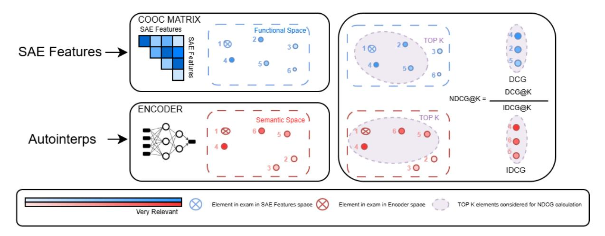
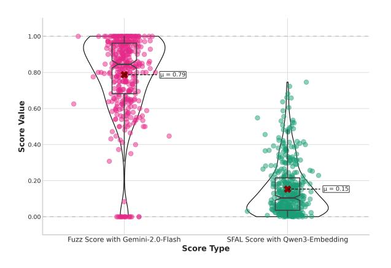
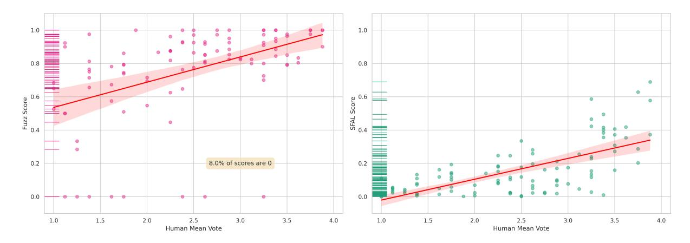

# **SFAL**: Semantic-Functional Alignment Scores for Distributional Evaluation of Auto-Interpretability in Sparse Autoencoders

Fabio Mercorio1,3, Filippo Pallucchini1,3, Daniele Potertì2 , Antonio Serino2 , Andrea Seveso1,3

1Dept of Statistics and Quantitative Methods, University of Milano-Bicocca, Italy, 2Dept of Economics, Management and Statistics, University of Milano-Bicocca, Italy, 3CRISP Research Centre <crispresearch.eu>, University of Milano-Bicocca, Italy

## Abstract

Interpreting the internal representations of large language models (LLMs) is crucial for their deployment in real-world applications, impacting areas such as AI safety, debugging, and compliance. Sparse Autoencoders facilitate interpretability by decomposing polysemantic activation into a latent space of monosemantic features. However, evaluating the autointerpretability of these features is difficult and computationally expensive, which limits scalability in practical settings. In this work, we propose SFAL, an alternative evaluation strategy that reduces reliance on LLM-based scoring by assessing the alignment between the semantic neighbourhoods of features (derived from autointerpretation embeddings) and their functional neighbourhoods (derived from co-occurrence statistics). Our method enhances efficiency, enabling fast and cost-effective assessments. We validate our approach on large-scale models, demonstrating its potential to provide interpretability while reducing computational overhead, making it suitable for real-world deployment.

# 1 Introduction

Interpreting the internal representations of large language models (LLMs) is a key challenge in research and real-world applications [\(Sharkey et al.,](#page-7-0) [2025\)](#page-7-0). Sparse Autoencoders (SAEs) are neural networks designed to learn interpretable feature representations from high-dimensional activations in LLMs [\(Cunningham et al.,](#page-6-0) [2023\)](#page-6-0). They provide a structured latent feature space where semantically similar features are mapped closely, enabling potential improvements in model transparency [\(Räuker](#page-7-1) [et al.,](#page-7-1) [2023\)](#page-7-1). In practical deployments, understanding what a given feature represents is crucial for debugging, safety, and compliance [\(Temple](#page-7-2)[ton et al.,](#page-7-2) [2024\)](#page-7-2). Auto-interpretability (autointerp) [\(Bills et al.,](#page-6-1) [2023\)](#page-6-1) methods attempt to generate human-readable descriptions of these features by

analysing their activations and prompting LLMs to create explanations. However, current evaluation approaches for autointerp rely on scoring methods that compare a feature's activation examples with the generated interpretation using other LLMs [\(Paulo et al.,](#page-7-3) [2024\)](#page-7-3). This process is prone to noise and computationally expensive, requiring multiple queries per feature, making it costly for large-scale, real-world systems.

This work explores Semantic-Functional Alignment Scores (SFAL), an alternative evaluation strategy that reduces dependence on LLM-based scoring, improving efficiency while maintaining scoring quality. By leveraging the SAE feature space's structural properties, we propose a more scalable and deployable method in real-world settings, enabling more cost-effective interpretability assessments. Unlike existing approaches, SFAL introduces a principled alignment metric between the latent structure of functional behaviour and the semantic space derived from auto-interpretations; a formulation that, to our knowledge, has not been previously applied to evaluating feature interpretability in sparse autoencoders.

Contribution. Our main contributions are as follows: (i) We propose SFAL, a novel approach to evaluating autointerp quality that reduces dependence on expensive LLM-based scoring. We aim for auto-interpretability to be more efficient, less noisy, and feasible for real-world deployments. (ii) We validate our approach in a user study, comparing its robustness with previous methods and considering practical constraints such as computational cost and resource limitations. (iii) To support reproducibility, we release all code, processed data, and scores produced in our experiments[1](#page-0-0) .

1 <https://github.com/Crisp-Unimib/SFAL>

# 2 Preliminaries and State of the Art

Sparse Autoencoders (SAEs). SAEs distil highdimensional outputs of large language models into interpretable representations [\(Cunningham et al.,](#page-6-0) [2023\)](#page-6-0). They reconstruct input activations through a sparse bottleneck layer to promote monosemantic features, each representing a distinct, understandable concept [\(Bills et al.,](#page-6-1) [2023\)](#page-6-1). This architecture aims to mitigate the superposition phenomenon, where single neurons encode multiple unrelated concepts [\(Bricken et al.,](#page-6-2) [2023\)](#page-6-2). Monosemanticity is believed to promote better separation of feature representations, leading to clearer conceptual neighbourhoods and forming a basis for mechanistic interpretability efforts to identify computational circuits within LLMs. Recent work reveals that SAE feature spaces exhibit structured organisation at multiple scales, with functionally related features clustering together and forming meaningful geometric patterns [\(Li et al.,](#page-7-4) [2025b\)](#page-7-4). Features that frequently co-activate are likely functionally related, suggesting that co-occurrence statistics can reveal functional relationships. Beyond interpretability, one can also perform targeted interventions on features to steer the model toward specific behaviours [\(Potertì et al.,](#page-7-5) [2025\)](#page-7-5). Given the potential scale of SAEs, which can learn millions of features, there is a need for automated methods to generate human-understandable textual explanations for these features, known as auto-interpretations [\(Bills](#page-6-1) [et al.,](#page-6-1) [2023\)](#page-6-1).

Auto-Interpretations. Auto-interpretability methods generate human-readable explanations of SAE features by analysing their activations [\(Bills](#page-6-1) [et al.,](#page-6-1) [2023\)](#page-6-1). Current evaluation approaches rely heavily on LLM-based scoring methods that compare feature activations with generated interpretations. LLM-based methods include *fuzzy scoring* [\(Paulo et al.,](#page-7-3) [2024\)](#page-7-3), where LLMs classify whether highlighted tokens should activate features based on their explanations, showing a strong correlation with human judgments. Other methods include detection scoring (LLM identifies whether a sequence activates a latent representation based on its explanation), surprisal scoring (improvement in predicting contexts given an interpretation), and embedding scoring (semantic relevance of an interpretation to the activating data). However, these methods face significant limitations, including computational expense, potential noise in LLM judgments,

scalability issues with millions of features, and the risk of *"deceptive interpretability"*, where plausible explanations may mislead evaluators [\(Lermen](#page-6-3) [et al.,](#page-6-3) [2025\)](#page-6-3). Alternative approaches have emerged to address these limitations. Intervention-based evaluation assesses an explanation's ability to predict the consequences of actively manipulating a feature's activation (e.g., ablation) [\(Bhalla et al.,](#page-6-4) [2024\)](#page-6-4). However, this approach faces challenges such as the complexity of designing meaningful interventions and the *"predict/control discrepancy"*, where features good for prediction may not be effective for control, and vice versa. There is also a growing interest in non-LLM-centric metrics. Examples include classification-based metrics [\(Cesarini et al.,](#page-6-5) [2024;](#page-6-5) [Malandri et al.,](#page-7-6) [2024\)](#page-7-6), utilising SAE features for downstream tasks such as toxicity detection [\(Gallifant et al.,](#page-6-6) [2025\)](#page-6-6), hallucination mitigation [\(Abdaljalil et al.,](#page-6-7) [2025\)](#page-6-7), and probing-based evaluation, where linear probes are trained on SAE features to predict known concepts (e.g., sentiment, specific n-grams) [\(Gao](#page-6-8) [et al.,](#page-6-8) [2024\)](#page-6-8).

While human evaluation remains a gold standard for nuance and correctness, its inherent subjectivity, cost, and slow pace make it impractical for the vast number of features in large-scale SAEs. Our work contributes by proposing an evaluation strategy that leverages structural properties of the SAE feature space itself, reducing reliance on expensive LLMbased scoring while maintaining evaluation quality.

Open Platforms. Neuronpedia [\(Lieberum et al.,](#page-7-7) [2024a\)](#page-7-7) is an open platform for mechanistic interpretability research. It serves as both a public database containing valuable data for researchers (including activations, SAE features, their autointerpretations, metadata, and scores from various methods) and a suite of tools facilitating the storage and management of these interpretability artefacts.

# 3 Methods

Our core objective is to quantify the alignment between the semantic interpretation of an SAE feature and its functional interactions with other features. The core assumption is that meaningful auto-interpretations should be consistent with the feature's behaviour in the model [\(Olah et al.,](#page-7-8) [2020\)](#page-7-8). This reflects a principle of internal coherence also found in mechanistic interpretability: features with distinct and well-described semantic content should exhibit functionally cohesive patterns

Figure 1: Pipeline for generating Semantic-Functional Alignment Scores (SFAL). SAE features are processed via a co-occurrence matrix to derive representations in a functional space. Auto-interpretations are passed through an encoder to generate representations in a semantic space. Top K-ranked lists of elements from these respective spaces are used to calculate Discounted Cumulative Gain (DCG) and Ideal Discounted Cumulative Gain (IDCG), yielding the final SFAL score that quantifies the alignment between the semantic and functional characteristics of the elements.

of co-activation. To achieve this, for each SAE feature, we define and compare its semantic neighbourhood and its functional neighbourhood. This comparison results in a Semantic-Functional Alignment Score (SFAL). An overview of our methodology is presented in Fig 1.

#### 3.1 Representations of SAE Features

Let  $S = \{s_1, s_2, \dots, s_n\}$  denote a set of n SAE features. For each feature  $s_i \in S$ , we aim to capture both its semantic meaning and its functional behaviour. This involves defining appropriate representations.

Semantic Representations. Each SAE feature  $s_i$  is associated with an *auto-interpretation*, a textual description of its learned function. The *semantic representation* of feature  $s_i$  is the auto-interpretation vector  $\mathbf{a}_i \in \mathbb{R}^d$ . These d-dimensional real-valued vectors are generated by encoding the textual auto-interpretations using an encoder language model. The set of all such vectors,  $\mathbf{A} = \{\mathbf{a}_1, \mathbf{a}_2, \dots, \mathbf{a}_n\}$ , constitutes the *semantic space*.

Functional Representations. The functional behaviour of feature  $s_i$  is characterised by how often it co-activates with other features. We capture this through *co-occurrence statistics* between feature pairs  $(s_i, s_j)$ , following (Li et al., 2025b), resulting in a *co-occurrence matrix*. For each pair, we construct a  $2 \times 2$  contingency table m(i, j) with

entries  $m_{11}$ ,  $m_{10}$ ,  $m_{01}$ , and  $m_{00}$  representing the joint activation counts, along with their marginal totals  $m_{1\bullet}$ ,  $m_{0\bullet}$ ,  $m_{\bullet 1}$ , and  $m_{\bullet 0}$ . For example,  $m_{11}$  is the number of instances where both  $s_i$  and  $s_j$  are active,  $m_{00}$  is the number of cases where neither is active, and  $m_{1\bullet}$  is the total number of instances where  $s_i$  is active, regardless of whether  $s_j$  is active.

# 3.2 Defining Semantic and Functional Neighbourhoods

Based on the representations above, we define semantic and functional neighbourhoods for each SAE feature  $s_i$ .

Semantic Neighbourhood  $(N_S)$ . The semantic neighbourhood  $N_S(i)$  of an SAE feature  $s_i$  consists of other features  $s_j$   $(j \neq i)$  whose autointerpretations are semantically similar to that of  $s_i$ . This similarity is measured using their autointerpretation vectors  $\mathbf{a}_i$  and  $\mathbf{a}_j$  from the semantic space. We use cosine similarity to quantify the likeness between two auto-interpretation vectors.

For a given feature  $s_i$ , its semantic neighbourhood  $N_S(i)$  is formally defined as the set of  $K_S$  features  $s_j$  (for  $j \neq i$ ) with the highest  $\mathrm{sim}_{\cos}(\mathbf{a}_i, \mathbf{a}_j)$  scores. While we employ a fixed top-K neighbourhood for clarity and reproducibility, SFAL is not restricted to this setting; adaptive strategies (e.g., thresholds based on feature sparsity) are feasible and will be explored in future work.

Functional Neighbourhood  $(N_F)$ . The functional neighbourhood  $N_F(i)$  of an SAE feature  $s_i$  comprises other features  $s_j$   $(j \neq i)$  that exhibit a strong functional association with  $s_i$ , based on the co-occurrence table m(i,j).

To measure the strength of association between a pair of features  $s_i$  and  $s_j$  from their  $2 \times 2$  co-occurrence counts and associated marginals (previously defined as  $m_{1\bullet}, m_{0\bullet}, m_{\bullet 1}, m_{\bullet 0}$ ), we employ the *phi coefficient*  $(\phi_{ij})$  (Yule, 1912), also utilised in (Li et al., 2025b):

$$\phi_{ij} = \frac{m_{11}(i,j)m_{00}(i,j) - m_{10}(i,j)m_{01}(i,j)}{\sqrt{m_{1\bullet}m_{0\bullet}m_{\bullet 1}m_{\bullet 0}}}$$

This coefficient  $\phi_{ij}$  ranges from -1 (perfect negative association) to +1 (perfect positive association), with 0 indicating no association, and it is well-suited for measuring the association between binary variables (the active/inactive states of features).

For a feature  $s_i$ , its functional neighbourhood  $N_F(i)$  is formally defined as the set of  $K_F$  features  $s_j$  (for  $j \neq i$ ) with the highest positive  $\phi_{ij}$  values.

#### 3.3 Computing SFAL

We introduce the Semantic-Functional Alignment Score (SFAL) to quantify for each SAE feature  $s_i$  how well its semantic neighbourhood  $N_S(i)$  aligns with its functional neighbourhood  $N_F(i)$ . This score is calculated using Normalised Discounted Cumulative Gain (NDCG) (Järvelin and Kekäläinen, 2002), a well-established measure for evaluating the consistency between two rankings (Malandri et al., 2025; Pallucchini et al., 2025). A score close to 1 indicates strong alignment between the feature's semantic interpretation and its functional co-occurrence behaviour, while a score near 0 suggests divergence.

#### 3.4 Computational Efficiency

Our method is designed to scale efficiently with the number of SAE features n. For each feature  $s_i \in S$ , we compute the semantic and the functional neighbourhood.

Computing the cosine similarity between all pairs of n auto-interpretation vectors (each of dimension d) requires  $\mathcal{O}(n^2d)$  operations. Since d is fixed (determined by the embedding model, e.g., 768 or 1024), this simplifies to  $\mathcal{O}(n^2)$ . To compute functional neighbourhoods, we build a cooccurrence histogram from a corpus and then calculate the phi coefficient  $(\phi)$  for every feature pair. The co-occurrence histogram is built by processing

a corpus of D documents with an average token length of T. The text is segmented into chunks of length k. Since only a small subset of features is active in any given chunk, we can compute the outer product over sparse binary vectors. For each chunk, we identify the set of  $K_{chunk}$  active features, where  $K_{chunk} \ll n$  (e.g., typically 20–50). The number of required updates per chunk is only  $\mathcal{O}(K_{chunk}^2)$ . This optimisation makes the construction of the histogram significantly more scalable, with an effective complexity of:

$$\mathcal{O}\left(\frac{D \cdot T}{k} \cdot \mathbb{E}[K_{chunk}^2]\right)$$

where  $\mathbb{E}[K_{chunk}^2]$  is the average squared number of active features per chunk. After the histogram is populated, calculating the  $\phi_{ij}$  coefficient for all  $\approx n^2/2$  pairs is an  $\mathcal{O}(n^2)$  operation.

With the semantic and functional matrices computed, we rank the neighbours for each feature with a complexity of  $\mathcal{O}(n\log K)$ , leading to a total of  $\mathcal{O}(n^2\log K)$ . Given  $K\ll n$ , this term is effectively  $\mathcal{O}(n^2)$ . The final step, computing the NDCG@K score for each feature, takes  $\mathcal{O}(K)$ , for a negligible total cost of  $\mathcal{O}(nK)$ .

Therefore, the overall computational bottleneck is the  $\mathcal{O}(n^2)$  cost of the pairwise matrix computations. This framework offers a substantial efficiency improvement over LLM-based evaluation pipelines, which, while scaling linearly with n, incur prohibitively high per-feature overhead due to the financial costs associated with using large models. For the millions of features in large-scale SAEs, these combined expenses become intractable. In contrast, our approach is far more scalable and cost-effective.

In practice, our experiments required just 2 GPU hours on a single NVIDIA A100 GPU, underscoring the practical scalability and low resource requirements of our approach.

#### 4 Results

Our study focused on the 16k features version of the SAEs for gemma-2-9b2 (Lieberum et al., 2024b) and the 32k features version of llama-3.1-8b3 (He et al., 2024). To ensure a robust comparison, encoder models used to compute the semantic neighbourhood were selected from the top performers on the MTEB leaderboard (Muennighoff et al., 2022) at the time of our experiments.

&lt;sup>2gemma-scope-9b-pt-res

&lt;sup>3Llama3\_1-8B-Base-LXR-8x

Different layers within a transformer architecture learn features at varying levels of abstraction, from simple, local patterns in the early layers to complex, semantic concepts in the deeper layers. The interpretability of these features is hypothesised to vary accordingly [\(Paulo et al.,](#page-7-3) [2024\)](#page-7-3). We select five layers from each model: the initial layer (0), three intermediate layers (8, 17, and 25), and the final layer (41 for Gemma-2-9 b and 31 for Llama-3.1-8 b). For the Gemma-2-9 b model, we computed the fuzzy score ourselves since it was not available on Neuronpedia, employing Gemini-2.0-flash, which at the time of execution offered the best performance-to-cost ratio among closedsource models. The process amounted to about \$100 in API fees. We computed the co-occurrence matrices for both models by processing 50k documents from their respective SAE training datasets, using a chunk size of 256 tokens.

In Fig. [2,](#page-4-0) we show the distribution of fuzzing scores with Gemini-2.0-Flash against SFAL. Our scoring system generally assigns lower values overall, reflecting a more selective approach in recognising autointerpretations as the correct interpretations of features.

User study design. To evaluate the practical efficacy of our proposed scoring method, we conducted a user study following the human evaluation methodology outlined by [\(Paulo et al.,](#page-7-3) [2024\)](#page-7-3). A pool of four expert users participated in the assessment. We sampled 100 examples of autointerpretations and their corresponding top activations, following [\(Paulo et al.,](#page-7-3) [2024\)](#page-7-3). These examples were drawn from five distinct layers (20 examples for each layer) of the Gemma-2-9b and Llama-3.1-8b models. Stratification by SFAL scores

Figure 2: Comparison of score overall distribution between SOTA methods and SFAL.

was employed during sampling to deliberately include examples spanning the full range of potential scores, thus preventing bias towards predominantly positive or negative evaluations and ensuring raters encountered varied levels of interpretation quality. The expert users reviewed the auto-interpretations and the associated top activations for each of the 100 sampled features. Users rated the alignment between the feature's interpretation and activations on a 1-to-4 Likert scale for the soundness and completeness metrics proposed by [Sokol and](#page-7-14) [Flach](#page-7-14) [\(2020\)](#page-7-14). *Soundness* refers to how truthful and aligned the generated auto-interpretation is with the actual behaviour and activations of the SAE feature it's meant to explain. *Completeness* describes how well that auto-interpretation covers and explains all or most significant top activations for that particular feature. To be complete, an auto interpretation must be sufficiently broad to encompass the feature's diverse manifestations in the data, rather than being narrowly focused on just a few activation examples. Additionally, users reported a confidence score for each rating. The overall median confidence from users was *3* with an interquartile range of *1* for both Gemma and Llama evaluation sets. To ensure the robustness of our human evaluations, the inter-rater agreement level was quantified using Krippendorff's ordinal α. The calculated agreement was *0.64* for the gemma-2-9b set, and *0.57* for the llama-3.1-8b set, indicating substantial agreement between the evaluators.

User scores (soundness and completeness) for each feature were averaged to create a composite human rating. A visual comparison of the score distributions in Fig. [2](#page-4-0) shows that fuzz scores appear more skewed and potentially over-optimistic in their assessment of feature interpretability compared to SFAL scores. We analysed the correlation (Spearman, Pearson, Kendall) between the two sets of averaged human judgments and seven sets of automated scores: those from fuzz scoring and those generated by our proposed alignment-based scoring method, varying the embedding model to assess the consistency of our process. As Table [1](#page-5-0) shows, SFAL demonstrated a stronger positive correlation compared to the fuzzing score for all the embedding models tested on the Gemma-2-9b SAEs human evaluation set. However, SFAL slightly underperforms the fuzzing score for Llama-3.1-8b.

Figure 3: Comparison of score distribution against human judgement. On the left, we show the computed fuzz score, while on the right, we show the SFAL results.

|                                                   | Gemma-2-9b |            |            | Llama-3.1-8b |            |            |
|---------------------------------------------------|------------|------------|------------|--------------|------------|------------|
| Metric                                            | Pearson    | Spearman   | Kendall    | Pearson      | Spearman   | Kendall    |
| Fuzz score (Paulo et al., 2024)                   | 0.47 (***) | 0.56 (***) | 0.40 (***) | 0.59 (***)   | 0.60 (***) | 0.44 (***) |
| SFAL Bilingual Emb (Thakur et al., 2020)          | 0.63 (***) | 0.62 (***) | 0.45 (***) | 0.53 (***)   | 0.56 (***) | 0.41 (***) |
| SFAL gte-Qwen2-7B-instruct (Li et al., 2023)      | 0.53 (***) | 0.50 (***) | 0.37 (***) | 0.48 (***)   | 0.53 (***) | 0.39 (***) |
| SFAL Qwen3-Emb-8B (prompted) (Zhang et al., 2025) | 0.66 (***) | 0.63 (***) | 0.46 (***) | 0.56 (***)   | 0.60 (***) | 0.43 (***) |
| SFAL Qwen3-Emb-8B (Zhang et al., 2025)            | 0.66 (***) | 0.63 (***) | 0.47 (***) | 0.49 (***)   | 0.55 (***) | 0.39 (***) |
| SFAL Qwen3-Emb-0.6B (Zhang et al., 2025)          | 0.64 (***) | 0.62 (***) | 0.46 (***) | 0.45 (***)   | 0.53 (***) | 0.37 (***) |
| SFAL Qwen3-Emb-4B (Zhang et al., 2025)            | 0.64 (***) | 0.61 (***) | 0.44 (***) | 0.52 (***)   | 0.58 (***) | 0.41 (***) |

Table 1: Correlation coefficients (Pearson, Spearman, Kendall) between fuzz, SFAL scores and human evaluation conducted by expert raters on the Gemma-2-9b and Llama-3.1-8b SAEs. The prompted version of Qwen3 uses an instruction to specialise the embedding for retrieval queries, while the normal version is for general similarity. Significance markers: (∗)p ≤ 0.05, (∗∗)p ≤ 0.01, (∗∗∗)p ≤ 0.001, (N.S.) = not significant (p > 0.05).

## 5 Discussion

Autointerpretation quality. As shown in Fig. [2,](#page-4-0) the distributions of SFAL and the fuzz score differ substantially. SFAL tends to assign lower values overall, showing a more selective behaviour in identifying autointerpretations as the correct interpretation of features.

## Bridging semantic and functional evaluation.

Our method's correlation with human judgments validates our framework. Instead of relying on costly LLM "oracles," we enforce internal consistency by aligning a feature's semantic meaning with its functional behaviour, derived from cooccurrence statistics. This captures a functional signal that purely semantic checks, often focused on static human-understandability, can overlook [\(Li](#page-7-18) [et al.,](#page-7-18) [2025a\)](#page-7-18). We note that the semantic–functional alignment assumption can fail in cases where features are functionally correlated yet semantically dissimilar (e.g., a transitive predicate and its direct object), which explains some of the observed

noise and highlights the complementary role of SFAL alongside more precise causal methods.

Impact of embedding models employed. Table [1](#page-5-0) shows the correlations of the human evaluation with both the fuzz score and SFAL, computed using several embedding models. We assess the consistency of SFAL, varying the encoder used to create the auto-interpretation embedding. Results show that scores are consistently significant across all tested embedding models for both SAE evaluations. Model size appears to be a minor factor in scoring performance, as indicated by the small differences between models within the Qwen family.

# 6 Conclusion

In this work, we introduced a novel, distributional approach for evaluating the auto-interpretations of SAE features by quantifying the alignment between a feature's semantic and functional neighbourhoods. Unlike traditional methods that rely heavily on expensive and often opaque LLM-based scoring,

our approach grounds interpretability assessment in the model's internal structure by capturing functional relationships through co-activation patterns and semantic intent through auto-interpretation embeddings. We demonstrated that this alignmentbased metric is not only computationally efficient and scalable but also correlates well with human judgment. By reducing evaluation costs and improving scalability, this work opens the door to more practical and widespread assessments of interpretability in large-scale language models. Future work will explore more expressive similarity metrics and investigate how our generalises across architectures and domains.

## Acknowledgements

Evaluation of the open-source models was conducted on the Leonardo supercomputer with the support of CINECA-Italian Super Computing Resource Allocation, class C project IsCc9\_MI-PLE (HP10CIQUBQ).

# Limitations

Co-occurrence is a powerful but imperfect proxy for true functional linkage. However, the core contribution of this work is a significant *lowering of the cost-utility frontier* for auto-interpretation evaluation. We demonstrate performance comparable to expensive, closed-source LLM-based metrics while operating at a fraction of the computational and financial cost. Ultimately, by making robust evaluation economically feasible, our method enables the field to systematically and comprehensively assess millions of features, a critical step toward genuinely understanding and trusting these complex systems. Beyond the reliance on co-activation as a proxy for function, SFAL has two additional limitations: (i) the fixed-K neighbourhoods may not fully adapt to varying sparsity across features, and (ii) our human evaluation involved only a small pool of expert raters, motivating future work on adaptive neighbourhood selection and larger-scale, more diverse user studies.

# References

Samir Abdaljalil, Filippo Pallucchini, Andrea Seveso, Hasan Kurban, Fabio Mercorio, and Erchin Serpedin. 2025. Safe: A sparse autoencoder-based framework for robust query enrichment and hallucination mitigation in llms. In *Findings of the Association for Computational Linguistics: EMNLP 2025*.

Usha Bhalla, Suraj Srinivas, Asma Ghandeharioun, and Himabindu Lakkaraju. 2024. Towards unifying interpretability and control: Evaluation via intervention. *arXiv preprint arXiv:2411.04430*.

Steven Bills, Nick Cammarata, Dan Mossing, Henk Tillman, Leo Gao, Gabriel Goh, Ilya Sutskever, Jan Leike, Jeff Wu, and William Saunders. 2023. Language models can explain neurons in language models. [https://openaipublic.blob.core.windows.](https://openaipublic.blob.core.windows.net/neuron-explainer/paper/index.html) [net/neuron-explainer/paper/index.html](https://openaipublic.blob.core.windows.net/neuron-explainer/paper/index.html).

Trenton Bricken, Adly Templeton, Joshua Batson, Brian Chen, Adam Jermyn, Tom Conerly, Nick Turner, Cem Anil, Carson Denison, Amanda Askell, Robert Lasenby, Yifan Wu, Shauna Kravec, Nicholas Schiefer, Tim Maxwell, Nicholas Joseph, Zac Hatfield-Dodds, Alex Tamkin, Karina Nguyen, Brayden McLean, Josiah E Burke, Tristan Hume, Shan Carter, Tom Henighan, and Christopher Olah. 2023. Towards monosemanticity: Decomposing language models with dictionary learning. *Transformer Circuits Thread*. Https://transformercircuits.pub/2023/monosemanticfeatures/index.html.

Mirko Cesarini, Lorenzo Malandri, Filippo Pallucchini, Andrea Seveso, and Frank Xing. 2024. Explainable ai for text classification: Lessons from a comprehensive evaluation of post hoc methods. *Cognitive Computation*, 16(6):3077–3095.

Hoagy Cunningham, Aidan Ewart, Logan Riggs, Robert Huben, and Lee Sharkey. 2023. Sparse autoencoders find highly interpretable features in language models. *arXiv preprint arXiv:2309.08600*.

Jack Gallifant, Shan Chen, Kuleen Sasse, Hugo Aerts, Thomas Hartvigsen, and Danielle S Bitterman. 2025. Sparse autoencoder features for classifications and transferability. *arXiv preprint arXiv:2502.11367*.

Leo Gao, Tom Dupré la Tour, Henk Tillman, Gabriel Goh, Rajan Troll, Alec Radford, Ilya Sutskever, Jan Leike, and Jeffrey Wu. 2024. Scaling and evaluating sparse autoencoders. *arXiv preprint arXiv:2406.04093*.

Zhengfu He, Wentao Shu, Xuyang Ge, Lingjie Chen, Junxuan Wang, Yunhua Zhou, Frances Liu, Qipeng Guo, Xuanjing Huang, Zuxuan Wu, Yu-Gang Jiang, and Xipeng Qiu. 2024. [Llama scope: Extracting](https://arxiv.org/abs/2410.20526) [millions of features from llama-3.1-8b with sparse](https://arxiv.org/abs/2410.20526) [autoencoders.](https://arxiv.org/abs/2410.20526) *Preprint*, arXiv:2410.20526.

Kalervo Järvelin and Jaana Kekäläinen. 2002. Cumulated gain-based evaluation of ir techniques. *ACM Transactions on Information Systems (TOIS)*, 20(4):422–446.

Simon Lermen, Mateusz Dziemian, and Natalia Pérez-Campanero Antolín. 2025. Deceptive automated interpretability: Language models coordinating to fool oversight systems. *arXiv preprint arXiv:2504.07831*.

- Aaron J Li, Suraj Srinivas, Usha Bhalla, and Himabindu Lakkaraju. 2025a. Interpretability illusions with sparse autoencoders: Evaluating robustness of concept representations. *arXiv preprint arXiv:2505.16004*.
- Yuxiao Li, Eric J Michaud, David D Baek, Joshua Engels, Xiaoqing Sun, and Max Tegmark. 2025b. The geometry of concepts: Sparse autoencoder feature structure. *Entropy*, 27(4):344.
- Zehan Li, Xin Zhang, Yanzhao Zhang, Dingkun Long, Pengjun Xie, and Meishan Zhang. 2023. Towards general text embeddings with multi-stage contrastive learning. *arXiv preprint arXiv:2308.03281*.
- Tom Lieberum, Senthooran Rajamanoharan, Arthur Conmy, Lewis Smith, Nicolas Sonnerat, Vikrant Varma, János Kramár, Anca Dragan, Rohin Shah, and Neel Nanda. 2024a. Gemma scope: Open sparse autoencoders everywhere all at once on gemma 2. *arXiv preprint arXiv:2408.05147*.
- Tom Lieberum, Senthooran Rajamanoharan, Arthur Conmy, Lewis Smith, Nicolas Sonnerat, Vikrant Varma, János Kramár, Anca Dragan, Rohin Shah, and Neel Nanda. 2024b. [Gemma scope: Open sparse](https://arxiv.org/abs/2408.05147) [autoencoders everywhere all at once on gemma 2.](https://arxiv.org/abs/2408.05147) *Preprint*, arXiv:2408.05147.
- Lorenzo Malandri, Fabio Mercorio, Mario Mezzanzanica, and Filippo Pallucchini. 2025. Sense: embedding alignment via semantic anchors selection. *International Journal of Data Science and Analytics*, 20(1):167–181.
- Lorenzo Malandri, Fabio Mercorio, Mario Mezzanzanica, and Andrea Seveso. 2024. Model-contrastive explanations through symbolic reasoning. *Decision Support Systems*, 176:114040.
- Niklas Muennighoff, Nouamane Tazi, Loïc Magne, and Nils Reimers. 2022. [Mteb: Massive text embedding](https://doi.org/10.48550/ARXIV.2210.07316) [benchmark.](https://doi.org/10.48550/ARXIV.2210.07316) *arXiv preprint arXiv:2210.07316*.
- Chris Olah, Nick Cammarata, Ludwig Schubert, Gabriel Goh, Michael Petrov, and Shan Carter. 2020. [Zoom in: An introduction to circuits.](https://doi.org/10.23915/distill.00024.001) *Distill*. Https://distill.pub/2020/circuits/zoom-in.
- Filippo Pallucchini, Lorenzo Malandri, Fabio Mercorio, and Mario Mezzanzanica. 2025. Lost in alignment: A survey on cross-lingual alignment methods for contextualized representation. *ACM Computing Surveys*.
- Gonçalo Paulo, Alex Mallen, Caden Juang, and Nora Belrose. 2024. Automatically interpreting millions of features in large language models. *arXiv preprint arXiv:2410.13928*.
- Daniele Potertì, Andrea Seveso, and Fabio Mercorio. 2025. Can role vectors affect llm behaviour? In *Findings of the Association for Computational Linguistics: EMNLP 2025*.

- Tilman Räuker, Anson Ho, Stephen Casper, and Dylan Hadfield-Menell. 2023. Toward transparent ai: A survey on interpreting the inner structures of deep neural networks. In *2023 ieee conference on secure and trustworthy machine learning (satml)*, pages 464– 483. IEEE.
- Lee Sharkey, Bilal Chughtai, Joshua Batson, Jack Lindsey, Jeff Wu, Lucius Bushnaq, Nicholas Goldowsky-Dill, Stefan Heimersheim, Alejandro Ortega, Joseph Bloom, et al. 2025. Open problems in mechanistic interpretability. *arXiv preprint arXiv:2501.16496*.
- Kacper Sokol and Peter Flach. 2020. Explainability fact sheets: A framework for systematic assessment of explainable approaches. In *Proceedings of the 2020 conference on fairness, accountability, and transparency*, pages 56–67.
- Adly Templeton, Tom Conerly, Jonathan Marcus, Jack Lindsey, Trenton Bricken, Brian Chen, Adam Pearce, Craig Citro, Emmanuel Ameisen, Andy Jones, Hoagy Cunningham, Nicholas L Turner, Callum McDougall, Monte MacDiarmid, C. Daniel Freeman, Theodore R. Sumers, Edward Rees, Joshua Batson, Adam Jermyn, Shan Carter, Chris Olah, and Tom Henighan. 2024. [Scaling monosemanticity: Extracting interpretable](https://transformer-circuits.pub/2024/scaling-monosemanticity/index.html) [features from claude 3 sonnet.](https://transformer-circuits.pub/2024/scaling-monosemanticity/index.html) *Transformer Circuits Thread*.
- Nandan Thakur, Nils Reimers, Johannes Daxenberger, and Iryna Gurevych. 2020. Augmented sbert: Data augmentation method for improving bi-encoders for pairwise sentence scoring tasks. *arXiv preprint arXiv:2010.08240*.
- G. Udny Yule. 1912. [On the methods of measuring](http://www.jstor.org/stable/2340126) [association between two attributes.](http://www.jstor.org/stable/2340126) *Journal of the Royal Statistical Society*, 75(6):579–652.
- Yanzhao Zhang, Mingxin Li, Dingkun Long, Xin Zhang, Huan Lin, Baosong Yang, Pengjun Xie, An Yang, Dayiheng Liu, Junyang Lin, et al. 2025. Qwen3 embedding: Advancing text embedding and reranking through foundation models. *arXiv preprint arXiv:2506.05176*.