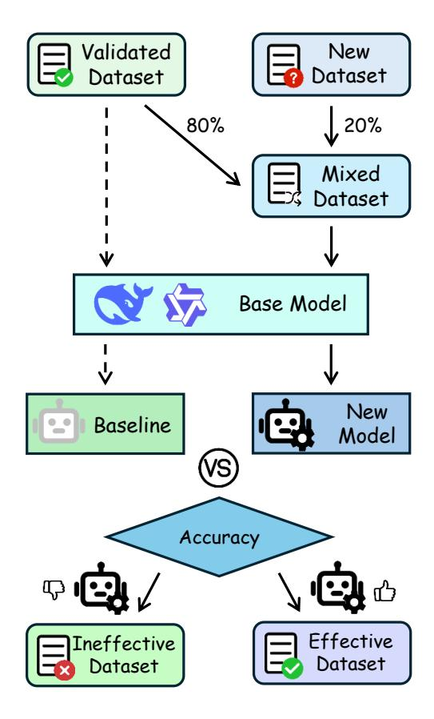

# More Data or Better Data? A Critical Analysis of Data Selection and Synthesis for Mathematical Reasoning

Yike Zhao1 , Simin Guo2 , Ziqing Yang3 , Shifan Han3 , Dahua Lin4 , Fei Tan1[\\*](#page-0-0)

1East China Normal University 2University of Chicago 3 Independent Researcher 4The Chinese University of Hong Kong

ykzhao@stu.ecnu.edu.cn, simin\_guo2885@163.com, ftan@mail.ecnu.edu.cn

### Abstract

The reasoning capabilities of Large Language Models (LLMs) play a critical role in many downstream tasks, yet depend strongly on the quality of training data. Despite various proposed data construction methods, their practical utility in real-world pipelines remains underexplored. In this work, we conduct a comprehensive analysis of open-source datasets and data synthesis techniques for mathematical reasoning, evaluating them under a unified pipeline designed to mirror training and deployment scenarios. We further distill effective data selection strategies and identify practical methods suitable for industrial applications. Our findings highlight that structuring data in more interpretable formats, or distilling from stronger models often outweighs simply scaling up data volume. This study provides actionable guidance for integrating training data to enhance LLM capabilities, supporting both cost-effective data curation and scalable model enhancement. We hope this work will inspire further research on how to balance "more data" versus "better data" for real-world reasoning tasks.

## 1 Introduction

High-quality training data is widely recognized as a key factor in improving model performance across various machine learning and NLP tasks. With the rapid development of advanced large language models (LLMs), a growing number of high-quality synthetic datasets and domain-specific data generation methods have been developed based on LLMs [\(Tan et al.,](#page-8-0) [2024;](#page-8-0) [Wang et al.,](#page-8-1) [2024a;](#page-8-1) [Zhou et al.,](#page-9-0) [2024;](#page-9-0) [Ding et al.,](#page-7-0) [2024;](#page-7-0) [Xu et al.,](#page-9-1) [2024;](#page-9-1) [Ziegler](#page-9-2) [et al.,](#page-9-2) [2024;](#page-9-2) [Riaz et al.,](#page-8-2) [2025;](#page-8-2) [Vanherle et al.,](#page-8-3) [2025;](#page-8-3) [Zhan et al.,](#page-9-3) [2025;](#page-9-3) [Wang et al.,](#page-8-4) [2024b\)](#page-8-4).

However, most of these methods focus on theoretical performance in academic research, rather

\*Corresponding Author.

than practical model development in industrial contexts. In industrial practice, models often need to handle diverse tasks simultaneously, and integrating heterogeneous datasets can lead to conflicting objectives and degraded performance [\(Li et al.,](#page-8-5) [2021;](#page-8-5) [Yang et al.,](#page-9-4) [2023;](#page-9-4) [Yu et al.,](#page-9-5) [2020;](#page-9-5) [Li et al.,](#page-8-6) [2025;](#page-8-6) [Zhang et al.,](#page-9-6) [2024\)](#page-9-6). This raises a new question: *Is simply adding more data always beneficial, or should we prioritize better and more targeted data?*

In this work, we investigate the effectiveness of data selection strategies and synthesis methods in the math domain, with a focus on model development in industrial contexts. First, we evaluate existing open-source datasets and distill data selection strategies based on the analysis. Then, we systematically analyze data synthesis methods within a unified framework, covering both *pretraining data refinement* and *supervised finetuning* (SFT) *data generation*. We report the implementation results of some methods, along with insights and observations from an industrial standpoint. Furthermore, we report several unsuccessful attempts, which may offer insights that are valuable as those from successful approaches. Finally, we propose some promising directions for future work, including RL-inspired data synthesis techniques, to enhance controllability and effectiveness in real-world settings.

Our main contributions are as follows:

- We adopt a unified evaluation pipeline that is designed to closely mirror both training and deployment scenarios, enabling realistic assessment of data effectiveness in practical applications.
- We conduct a systematic evaluation of several widely used open-source datasets and data construction methods with the unified pipeline. Based on the results, we further distill practical data selection strategies and extract actionable

insights into effective data construction, offering actionable guidance for cost-effective data curation and scalable model enhancement.

• We propose several promising directions for future works, including RL-based data synthesis techniques, with the goal of encouraging further exploration into more scalable and effective training paradigms.

## 2 Experimental Setup

Figure 1: Evaluation pipeline for verifying the effectiveness of new datasets.

To ensure a consistent evaluation across datasets, we adopt a unified evaluation methodology. As shown in Figure [1,](#page-1-0) we use DeepSeek-V2-Lite [\(DeepSeek-AI et al.,](#page-7-1) [2024\)](#page-7-1) or Qwen2.5-3B [\(Qwen](#page-8-7) [et al.,](#page-8-7) [2025\)](#page-8-7) as the base model and establish a baseline by training the base model on a large validated dataset consist of both code and mathematical data, covering both pretraining and SFT stages.

For evaluation, we follow the annealing method proposed in [Grattafiori et al.](#page-7-2) [\(2024\)](#page-7-2) and [Gu et al.](#page-7-3) [\(2024\)](#page-7-3), and train the base model on a mixture of the validated dataset and a new dataset under evaluation, where the new dataset is assigned a weight

of 0.2 in the mixture. That is, 20% of the training samples are drawn from the new dataset, while the remaining 80% are sampled from the validated dataset. If the integration of data achieves better results than the baseline, we consider the evaluated dataset to be effective.

This pipeline not only allows for a controlled assessment of the contribution brought by a specific dataset, but also aligns with evaluation practices commonly adopted in industrial scenarios. Such evaluation strategies are commonly adopted in production environments to ensure robustness and reproducibility. Therefore, our evaluation approach not only provides insights into the utility of different datasets, but also serves as a guideline for efficient data integration in real-world applications.

The benchmarks used for evaluation cover four types of tasks: common knowledge, logical reasoning, mathematical reasoning and coding ability. Accuracy is used as the metric for common knowledge, logical reasoning and mathematical reasoning tasks, while Pass@1 is used for coding tasks. Our primary focus is on improvements in mathematical reasoning, but we also pay attention to potential regressions in the model's performance on other capabilities. The benchmark used for evaluation are shown in Table [1.](#page-1-1)

| Domain    | Dataset                                                                                                       |
|-----------|---------------------------------------------------------------------------------------------------------------|
| Knowledge | MMLU (Hendrycks et al., 2021a) MMLU-Pro CMMLU (Li et al., 2024) GPQA-Diamond (Rein et al., 2023)     |
| Reasoning | HellaSwag (Zellers et al., 2019) BBH (Suzgun et al., 2022) DROP (Dua et al., 2019)                      |
| Math      | MATH (Hendrycks et al., 2021b) GSM8K (Cobbe et al., 2021) MathBench-a (Liu et al., 2024) MathBench-t |
| Coding    | OpenAI-HumanEval (Chen et al., 2021) Sanitized-MBPP (Austin et al., 2021)                                  |

Table 1: Benchmarks Used for Evaluation.

### 3 Data Selection

### 3.1 Evaluation of Open-Source Datasets

Despite the wide availability of open-source datasets for mathematical reasoning, their quality remains highly inconsistent [\(Shi et al.,](#page-8-12) [2024;](#page-8-12) [Huang et al.,](#page-7-10) [2025;](#page-7-10) [Ye et al.,](#page-9-8) [2025;](#page-9-8) [Muennighoff](#page-8-13) [et al.,](#page-8-13) [2025a\)](#page-8-13). In our practical experience, we find

that simply adding more datasets does not necessarily lead to better model performance. In some cases, it can even jeopardize the overall performance. To better guide future data selection, we conduct a comparative analysis of both effective and ineffective datasets, and summarize key characteristics that distinguish "better data" from "more data".

Many open-source datasets are constructed by scraping web pages and filtering for relevant content. For example, IndustryCorpus2 [\(Shi et al.,](#page-8-12) [2024\)](#page-8-12) aggregates and stratifies domain-specific data through rule-based and model-based filtering, and opc-fineweb-math-corpus [\(Huang et al.,](#page-7-10) [2025\)](#page-7-10) uses fastText to retrieve math-related pages from the Fineweb corpus. However, as our evaluation in Table [6](#page-9-9) shows, the diverse nature of source websites makes simple cleaning strategies insufficient to remove noise thoroughly. This can degrade the overall dataset quality and hinder training effectiveness, highlighting that merely adding more data without careful curation does not necessarily improve model performance.

To address this limitation, recent works have explored an alternative paradigm: instead of collecting more data, they focus on curating small yet high-quality datasets through rigorous filtering and model-based selection. Notable examples include the LIMO [\(Ye et al.,](#page-9-8) [2025\)](#page-9-8) and s1K [\(Muen](#page-8-13)[nighoff et al.,](#page-8-13) [2025a\)](#page-8-13) datasets, both of which are built through careful sampling from large candidate pools, followed by multi-stage filtering that emphasizes difficulty, diversity and reasoning depth. Furthermore, these datasets also leverage powerful reasoning models to generate detailed explanations, thereby enriching the data with high-quality reasoning trajectories. However, because of the limited data volume, the performance gains from these high-quality datasets remain modest. A promising direction is to scale up data construction by adopting similar methodologies. For example, OpenR1- Math-220K[1](#page-2-0) proposes a dataset of over 220,000 samples and provides the model with more substantial performance improvements (e.g., +8.96 accuracy on the MATH dataset), according to the results in Tables [7](#page-9-10) and [8.](#page-11-0)

#### 3.2 Data Selection Strategies

Based on our evaluation of various open-source datasets, we summarize the following practical strategies for selecting effective datasets for mathematical reasoning tasks:

- Be cautious with data aggregated from diverse web sources, as more data are not always better. Datasets collected through largescale web scraping (e.g., IndustryCorpus2, opcfineweb-math-corpus) often contain significant noise due to inconsistent formats. Without rigorous cleaning, such datasets may degrade the training performance.
- Prioritize datasets distilled by advanced reasoning models. Data enriched with detailed reasoning steps or explanations generated by reasoning models (e.g., DeepSeek-R1, QwQ-32B) tend to provide better supervision signals and improve the model's own reasoning capabilities.
- Scale generation while maintaining data quality. Instead of relying solely on manual curation, adopt scalable data generation methods that mimic the principles of highquality datasets. These principles typically include leveraging LLMs to perform quality filtering and difficulty calibration. The success of OpenR1-Math-220K illustrates that principled large-scale generation is feasible and effective.

## 4 Data Synthesis

### 4.1 Pretraining Data Refinement

In the pretraining stage, the model builds fundamental language abilities and accumulates essential knowledge from large-scale data. While broad content coverage is necessary, simply adding more data does not guarantee better performance. It is equally important that pretraining data is structured in ways that enhance concept connections and facilitate deeper understanding.

Cosmopedia [\(Ben Allal et al.,](#page-7-11) [2024\)](#page-7-11) serves as a representative example of pratraining data construction. They extract a wide range of valuable topics from educational sources such as Standford courses[2](#page-2-1) , Khan Academy[3](#page-2-2) , Open-Stax[4](#page-2-3) , WikiHow and other websites, and prompts an LLM to generate educational content tailored to different audiences and styles. By using Mixtral-8x7B-Instruct-v0.1 [\(Jiang et al.,](#page-7-12)

1 [https://huggingface.co/datasets/open-r1/](https://huggingface.co/datasets/open-r1/OpenR1-Math-220k) [OpenR1-Math-220k](https://huggingface.co/datasets/open-r1/OpenR1-Math-220k)

[https://explorecourses.stanford.edu/search?q=](https://explorecourses.stanford.edu/search?q=all%20courses) [all%20courses](https://explorecourses.stanford.edu/search?q=all%20courses)

3 <https://www.khanacademy.org/>

4 <https://openstax.org/>

| Characteristic                                | Example                                                                      |  |
|-----------------------------------------------|------------------------------------------------------------------------------|--|
| Provide clear definitions                     | To understand this concept more deeply, let's first define what it means  |  |
| Replace ambiguous expressions with terms      | The study of quadratic residues and nonresquares modulo a prime number is |  |
| Present formulas with LaTeX syntax            | We test \( xˆ2 \equiv 1 \pmod{83} \) and find that                           |  |
| Use examples instead of abstract explanations | Let's illustrate this process with a few examples. Consider the number 2  |  |

Table 2: Examples of Pretraining Data Refinement

[2024a\)](#page-7-12), they generate over 30 million files and 25 billion tokens of high-quality educational text covering diverse topics and styles. Many other studies employ prompt engineering to construct pretraining data, all following a consistent approach: curating raw educational corpora from various sources through prompt design and using LLMs to refine them into more educational and well-structured content.

We explore a similar approach in our experiments. We begin by collecting books on various mathematical topics and apply OCR techniques[5](#page-3-0) to extract text from PDFs. After performing data denoising, we use resulting text as pretraining data, allowing model to learn knowledge through a simple next-token prediction task. Specifically, we focus on books related to intermediate algebra, resulting in 192 samples containing approximately 0.13 billion tokens. However, the result shows little improvement on standard math benchmarks, which suggests that merely scaling up data quantity alone is insufficient to ensure consistent performance gains.

Then, we make an attempt to replicate the methodology proposed by Cosmopedia [\(Ben Al](#page-7-11)[lal et al.,](#page-7-11) [2024\)](#page-7-11). We use the math pretrain corpus previously collected and apply prompt engineering techniques to refine the corpus into a more educational format. Furthermore, we generate in-depth explanations based on the original content with Qwen2.5-72B. This process yields a dataset containing 760 million tokens, hereafter referred to as *Math-Cosmo*. As a result, the performance of the model on the MATH and MathBench benchmarks are improved (e.g., +1.72 accuracy on the MATH dataset). The results of the experiment are presented in Table [9.](#page-11-1)

Moreover, we extend the Cosmopedia approach to Chinese mathematical pretraining data and generate high-quality samples that has been manually evaluated. The prompt templates we used are shown in Appendix [A.](#page-9-11)

Insights: When constructing pretraining data, simply collecting large amounts of data does not necessarily lead to performance gains. Instead, attention should be paid to how the data is presented to the model[\(Lu et al.,](#page-8-14) [2023\)](#page-8-14). Structuring it in a more interpretable format is an effective way to improve the model's reasoning capability. Examples are shown in Table [2.](#page-3-1)

### 4.2 SFT Data Generation

In the SFT stage, the model learns to follow instructions to complete specific tasks, thereby acquiring task-solving strategies and gradually connecting knowledge concepts gained during pretraining. This process often results in substantial improvement in reasoning and generalization abilities compared to the pretraining stage. However, simply increasing data quantity does not guarantee better performance. It is important to ensure the training data remains high-quality, diversity and difficulty.

A variety of studies have proposed different approaches to generate high-quality SFT datasets. S1 [\(Muennighoff et al.,](#page-8-15) [2025b\)](#page-8-15) employs two pretrained models to evaluate data, filtering out samples that can be correctly answered by the models, thereby ensuring the difficulty of the dataset. In addition, they classify the problems based on the Math Subject Classification system, randomly selecting samples from each domain while giving priority to data with longer reasoning steps, in order to enhance the diversity of the dataset. SynthLLM [\(Qin et al.,](#page-8-16) [2025\)](#page-8-16) leverages LLMs to extract topics and key concepts from documents, and combines them to generate new questions. Furthermore, it constructs

5 [https://mathpix.com/](https://mathpix.com/ )

a global concept graph based on the topic and concepts, and uses random walk algorithm to expand related knowledge concepts, to generate more complex and diverse questions. Dolphin-R1[6](#page-4-0) directly employs larger models to generate data with reasoning steps. [Jiang et al.](#page-8-17) [\(2024b\)](#page-8-17) and [Luo et al.](#page-8-18) [\(2024\)](#page-8-18) propose well-designed tree search algorithms to generate reasoning steps progressively.

In our experiment, we follow the methodology of Dophin-R1 and prompt QwQ-32B [\(Qwen et al.,](#page-8-7) [2025\)](#page-8-7) to generate new answers for questions in NaturalReasoning [\(Yuan et al.,](#page-9-12) [2025\)](#page-9-12). We then filter out instances with inconsistent answers, resulting in a new dataset, referred to as *NaturalReasoning-QwQ*. As shown in table [3,](#page-4-1) the experimental results clearly demonstrate that data distilled by reasoning model is of significantly higher quality than the original data, leading to substantial improvements in model performance (e.g., +1.92 accuracy on the MATH dataset). This reinforces the central insight that better data is more valuable than just more data.

|                  |       | NaturalReasoning-QwQ |
|------------------|-------|----------------------|
| Benchmark        | Score | ∆                    |
| MMLU             | 64.95 | –0.46                |
| MMLU-Pro         | 14.58 | 1.39                 |
| CMMLU            | 78.06 | 0.15                 |
| GPQA-Diamond     | 32.32 | 0.5                  |
| HellaSwag        | 81.12 | –0.67                |
| BBH              | 63.87 | 1.16                 |
| DROP             | 63.48 | 0.64                 |
| MATH             | 49.68 | 1.92                 |
| GSM8K            | 81.50 | –0.99                |
| MathBench-a      | 38.07 | 1.47                 |
| MathBench-t      | 63.84 | 0.07                 |
| OpenAI-Humaneval | 57.93 | -0.61                |
| Sanitized-MBPP   | 53.7  | –0.77                |

Table 3: Performance of the model fine-tuned on the NaturalReasoning-QwQ dataset. "∆" denotes the difference in performance compared to the baseline model.

To further examine this idea from a different perspective, we also explore a series of weaknessguided generation methods to acquire samples tailored to the model's limitations. More specifically, we first analyze the model's failure cases on the MATH dataset [\(Hendrycks et al.,](#page-7-6) [2021b\)](#page-7-6) and define them as seed examples. Then, we use Math-BERT [\(Peng et al.,](#page-8-19) [2021\)](#page-8-19) for embedding and FAISS [\(Douze et al.,](#page-7-13) [2024\)](#page-7-13) to retrieve similar data from

other datasets, in order to amplify their proportion in the training set. For each sample, we select the top 20 most semantically similar examples as candidates. Through this method, we collect over 75,000 examples comprising more than 82 million tokens, which we refer to as the *math-retrieval dataset*. However, model gains little improvement from this dataset, especially on mathematical datasets.

We further prompt LLMs to generate data similar to these seed examples. Once new data is generated, we prompt the model to re-answer the same question. If the answers from both rounds are consistent, the data is considered valid. We directly apply this augmentation method to both seed examples and the *math-retrieval* dataset, resulting in the *math-weakness-augmented* dataset and *mathretrieval-augmented* dataset. The detailed results are shown in Table [4,](#page-5-0) confirming that simply retrieving more data is less effective than applying high-quality augmentation strategies.

Furthermore, following [Lu et al.](#page-8-20) [\(2025\)](#page-8-20), we extract question-answer pairs from textbooks. In particular, we segment the content of the textbook into chunks based on chapters and sections, and use LLMs to extract question-answer pairs from each chunk, with each question paired with a corresponding solution. The generated data is then evaluated by LLMs to filter out low-quality samples. To ensure diversity, we further apply MinHash-based deduplication, resulting in the final dataset. We apply this approach to construct two datasets on intermediate algebra and calculus. Then we finetune the model separately on each dataset. Interestingly, two datasets constructed with the same methodology exhibit significant differences in the performance. This phenomenon may be related to the data mixing strategy, which warrants further investigation. Detailed performance of the models are shown in Appendix [B.3.](#page-11-2)

Insights: When constructing SFT data, leveraging advanced models for data distillation or generating data tailored to the model's limitations can both effectively improve the model's performance, which highlights that better-curated data is more valuable than simply increasing data volume.

## 5 Unsuccessful Attempts

In our previous research, we also explored several approaches that did not yield satisfactory results. Here, we share these attempts in the hope of contributing to further exploration in this area.

6 [https://huggingface.co/datasets/](https://huggingface.co/datasets/cognitivecomputations/dolphin-r1) [cognitivecomputations/dolphin-r1](https://huggingface.co/datasets/cognitivecomputations/dolphin-r1)

| Benchmark        | Math-Retrieval Score ∆ |       | Math-Retrieval-Augmented Score ∆ |       | Math-Weakness-Retrieval Score ∆ |       |
|------------------|------------------------------|-------|----------------------------------------|-------|---------------------------------------|-------|
|                  |                              |       |                                        |       |                                       |       |
| MMLU             | 65.34                        | –0.07 | 65.47                                  | 0.06  | 65.32                                 | -0.09 |
| MMLU-Pro         | 14.18                        | 0.99  | 14.52                                  | 1.33  | 14.01                                 | 0.82  |
| CMMLU            | 77.57                        | -0.34 | 77.62                                  | -0.29 | 77.89                                 | -0.02 |
| GPQA-Diamond     | 31.82                        | 0     | 28.79                                  | -3.03 | 36.87                                 | 5.05  |
| HellaSwag        | 81.20                        | –0.59 | 81.88                                  | 0.09  | 81.74                                 | -0.05 |
| BBH              | 63.04                        | 0.33  | 62.75                                  | 0.04  | 63.60                                 | 0.89  |
| DROP             | 62.94                        | 0.1   | 62.67                                  | -0.17 | 63.45                                 | 0.61  |
| MATH             | 46.06                        | -1.7  | 51.48                                  | 3.72  | 48.24                                 | 0.48  |
| GSM8K            | 81.35                        | –1.14 | 82.64                                  | 0.15  | 83.55                                 | 0.16  |
| MathBench-a      | 37.4                         | 0.8   | 36.4                                   | -0.2  | 37.33                                 | 0.73  |
| MathBench-t      | 63.07                        | -0.7  | 63.83                                  | 0.16  | 63.88                                 | 0.11  |
| OpenAI-Humaneval | 63.41                        | 4.87  | 56.71                                  | -1.83 | 58.54                                 | 0     |
| Sanitized-MBPP   | 54.09                        | –0.38 | 56.03                                  | 1.56  | 54.46                                 | -0.01 |

Table 4: Performance of the model fine-tuned on datasets generated with weakness-guided methods. "∆" denotes the difference in performance compared to the baseline model.

There are some existing approaches constructing data through rule-based methods. [Morishita et al.](#page-8-21) [\(2023\)](#page-8-21) constructs multi-step reasoning data based on logical inference theorems (i.e., modus ponens), where the reasoning steps are logically valid but semantically meaningless. [Xie et al.](#page-9-13) [\(2025\)](#page-9-13) generates Knights and Knaves puzzles at different difficulty levels with detailed reasoning steps. [Ye et al.](#page-9-14) [\(2024\)](#page-9-14) proposes a graph-based approach that allows models to learn dependencies between different objects. We follow this methodology and construct math word problems with different reasoning complexities based on the dependency graph and train the model on the resulting dataset. However, the improvements in reasoning ability brought by these methods are quite limited, especially in mathematics. The experiment shows that purely rule-based generation, without deeper quality control or task alignment, yields little benefit.

In addition, motivated by advanced Reasoning Large Language Models (RLLMs), we further combine the reasoning chains generated by the RLLMs (known as *Long CoT* [\(Chen et al.,](#page-7-14) [2025\)](#page-7-14)) with the distilled data to construct the training dataset for our model. Still, the improvements in reasoning performance remain limited. We further categorize the data into different difficulty levels based on the length of reasoning steps, and evaluate the impact of difficulty on the model's reasoning ability. However, the results show no clear correlation between reasoning performance and data difficulty, again highlighting the difference between high-quality

distillation and naive complexity scaling.

Insights: Data constructed purely with rulebased methods generally provide limited benefit to the model, highlighting that lack of deeper structure may reduce its effectiveness. In addition, reasoning step length may not accurately reflect real difficulty, as no clear correlation is observed between longer reasoning chains and model performance. This further demonstrates that simply generating more data or increasing its apparent complexity does not guarantee better model reasoning.

### 6 Future Work

### 6.1 RL-like Data Synthesis Methods

Due to advanced development in reinforcement learning, we also propose several approaches for synthesizing pretraining and SFT data inspired by RL methods, such as [Zhang et al.](#page-9-15) [\(2025\)](#page-9-15) and [Du](#page-7-15) [et al.](#page-7-15) [\(2025\)](#page-7-15). Our motivation is to mimic the exploration process of RL in data generation to improve diversity, not merely to increase data quantity but to discover diverse, high-value examples that better improve the capabilities of models. Given the absence of experimental results, we present these ideas as exploratory directions. We believe such RL-like synthesis strategies hold promising potential for generating better-curated data, and suggest several venues that merit further investigation.

• multiple solution paths for the same problem Generated data may include both correct and incorrect solutions, with varying levels of detail and diverse solution strategies.

| Dimension "More Data"                           |                                                                                       | "Better Data"                                                   |  |
|----------------------------------------------------|---------------------------------------------------------------------------------------|-----------------------------------------------------------------|--|
| Data Source                                        | Noisy web-crawled                                                                     | Structured, interpretable                                       |  |
| Data Selection                                     | Multi-stage filtering Broad aggregation without filtering Model-based selection |                                                                 |  |
| Data Synthesis Solely rule-based or logic-based |                                                                                       | Distillation from advanced models Weakness-guided generation |  |
| Difficulty Control                                 | Partitioning by reasoning chain length                                                | Fine-grained hierarchy with curriculum learning                 |  |
| Data Mixing                                        | Direct integration                                                                    | Balanced, interference-aware                                    |  |
| Outcome                                            | Inconsistent outcomes and conflicts across tasks                                      | Consistent improvements and cost-efficiency                     |  |

Table 5: Summary of Key Findings: "More Data" vs. "Better Data" in Mathematical Reasoning.

- reward-like signals Labels such as qualityrelated metadata, annotations identifying reasoning flaws or suboptimal steps can be included to evaluate the generated data.
- synthetic data with limited noise Models should learn from both successes and failures. For instance, nearly correct solutions can be added to the training data along with explanations of their errors, enabling models to learn from mistakes.
- hierarchical data training strategy Gradually presenting the data to the model in order of increasing difficulty may lead to better performance improvements.
- integration data from diverse models The combination of synthesized data from models with different sizes or models possessing diverse domain knowledge may provide better diversity.

#### 6.2 Data Mixing Strategy

In real-world scenarios, the model is required to handle multiple tasks rather than being confined to mathematical reasoning alone. As a result, it is common practice to mix data from different tasks during training. However, our findings show that indiscriminate data mixing can reduce the benefits that each individual datasets brings to the model, suggesting potential interference effects [\(Li et al.,](#page-8-6) [2025\)](#page-8-6). This suggests that simply adding more heterogeneous task data does not guarantee better performance. Therefore, to ensure optimal training outcomes, it is crucial to identify an appropriate data mixing strategy, especially for solutions designed for industrial environments.

#### 6.3 Curriculum Learning

Some studies have proposed training strategies that progress from easy to hard, suggesting that such approaches can enhance the model's reasoning ability [\(Ji et al.,](#page-7-16) [2025\)](#page-7-16). However, our results show that simply partitioning data difficulty based on the number of reasoning steps is not effective, highlighting that more difficulty levels do not guarantee better outcomes if they are misaligned with actual complexity. Designing more fine-grained, task-relevant difficulty hierarchy and effectively incorporating the curriculum learning principles into the training process both warrant further investigation.

## 7 Conclusion

In this work, we systematically evaluate existing mathematical reasoning datasets and synthesis methods based on an industrial pipeline. Table [5](#page-6-0) summarizes our key findings in a direct comparison between "More Data" and "Better Data", which underscores that better-curated, high-quality data consistently outperforms simply increasing data volume. Overall, our study helps bridge the gap between theoretical research and real-world deployment, offering concrete guidance for cost-effective data curation and scalable model enhancement.

## Limitations

Although our work summarizes practical experiences in data selection and synthesis, there are still several limitations that should be acknowledged. Our evaluation and analysis mainly focus on the mathematical reasoning capabilities of models, and the insights are drawn from representative methods and datasets. However, the scope of our study is limited, which may not fully generalize to other settings and future research. Another limitation

is that the base models used in our experiments have relatively small parameter sizes. This choice helps ensure feasible training and reproducibility in industrial settings, but may underestimate the effectiveness of data synthesis methods for larger models. Besides, in industrial workflows, statistical validation (e.g., confidence intervals, p-values) is often challenging to implement due to scale and computational constraints. Therefore, we complement performance metrics with case studies to validate the approach's effectiveness instead. We leave more comprehensive study across boarder tasks and larger model scales for future work.

## References

- Jacob Austin, Augustus Odena, Maxwell Nye, Maarten Bosma, Henryk Michalewski, David Dohan, Ellen Jiang, Carrie Cai, Michael Terry, Quoc Le, and Charles Sutton. 2021. [Program synthesis with large](https://arxiv.org/abs/2108.07732) [language models.](https://arxiv.org/abs/2108.07732) *Preprint*, arXiv:2108.07732.
- Loubna Ben Allal, Anton Lozhkov, Guilherme Penedo, Thomas Wolf, and Leandro von Werra. 2024. [Cos](https://huggingface.co/datasets/HuggingFaceTB/cosmopedia)[mopedia.](https://huggingface.co/datasets/HuggingFaceTB/cosmopedia)
- Mark Chen, Jerry Tworek, Heewoo Jun, Qiming Yuan, Henrique Ponde de Oliveira Pinto, Jared Kaplan, Harri Edwards, Yuri Burda, Nicholas Joseph, Greg Brockman, Alex Ray, Raul Puri, Gretchen Krueger, Michael Petrov, Heidy Khlaaf, Girish Sastry, Pamela Mishkin, Brooke Chan, Scott Gray, and 39 others. 2021. [Evaluating large language models trained on](https://arxiv.org/abs/2107.03374) [code.](https://arxiv.org/abs/2107.03374) *Preprint*, arXiv:2107.03374.
- Qiguang Chen, Libo Qin, Jinhao Liu, Dengyun Peng, Jiannan Guan, Peng Wang, Mengkang Hu, Yuhang Zhou, Te Gao, and Wanxiang Che. 2025. [Towards](https://arxiv.org/abs/2503.09567) [reasoning era: A survey of long chain-of-thought](https://arxiv.org/abs/2503.09567) [for reasoning large language models.](https://arxiv.org/abs/2503.09567) *Preprint*, arXiv:2503.09567.
- Karl Cobbe, Vineet Kosaraju, Mohammad Bavarian, Mark Chen, Heewoo Jun, Lukasz Kaiser, Matthias Plappert, Jerry Tworek, Jacob Hilton, Reiichiro Nakano, Christopher Hesse, and John Schulman. 2021. [Training verifiers to solve math word prob](https://arxiv.org/abs/2110.14168)[lems.](https://arxiv.org/abs/2110.14168) *Preprint*, arXiv:2110.14168.
- DeepSeek-AI, Aixin Liu, Bei Feng, Bin Wang, Bingxuan Wang, Bo Liu, Chenggang Zhao, Chengqi Dengr, Chong Ruan, Damai Dai, Daya Guo, Dejian Yang, Deli Chen, Dongjie Ji, Erhang Li, Fangyun Lin, Fuli Luo, Guangbo Hao, Guanting Chen, and 138 others. 2024. [Deepseek-v2: A strong, economical, and effi](https://arxiv.org/abs/2405.04434)[cient mixture-of-experts language model.](https://arxiv.org/abs/2405.04434) *Preprint*, arXiv:2405.04434.
- Bosheng Ding, Chengwei Qin, Ruochen Zhao, Tianze Luo, Xinze Li, Guizhen Chen, Wenhan Xia, Junjie Hu, Anh Tuan Luu, and Shafiq Joty. 2024. [Data](https://arxiv.org/abs/2403.02990)

- [augmentation using large language models: Data](https://arxiv.org/abs/2403.02990) [perspectives, learning paradigms and challenges.](https://arxiv.org/abs/2403.02990) *Preprint*, arXiv:2403.02990.
- Matthijs Douze, Alexandr Guzhva, Chengqi Deng, Jeff Johnson, Gergely Szilvasy, Pierre-Emmanuel Mazaré, Maria Lomeli, Lucas Hosseini, and Hervé Jégou. 2024. [The faiss library.](https://arxiv.org/abs/2401.08281)
- Yiming Du, Yifan Xiang, Bin Liang, Dahua Lin, Kam-Fai Wong, and Fei Tan. 2025. [Resure: Regularizing](https://arxiv.org/abs/2508.19996) [supervision unreliability for multi-turn dialogue fine](https://arxiv.org/abs/2508.19996)[tuning.](https://arxiv.org/abs/2508.19996) *Preprint*, arXiv:2508.19996.
- Dheeru Dua, Yizhong Wang, Pradeep Dasigi, Gabriel Stanovsky, Sameer Singh, and Matt Gardner. 2019. [Drop: A reading comprehension benchmark requir](https://arxiv.org/abs/1903.00161)[ing discrete reasoning over paragraphs.](https://arxiv.org/abs/1903.00161) *Preprint*, arXiv:1903.00161.
- Aaron Grattafiori, Abhimanyu Dubey, Abhinav Jauhri, Abhinav Pandey, Abhishek Kadian, Ahmad Al-Dahle, Aiesha Letman, Akhil Mathur, Alan Schelten, Alex Vaughan, Amy Yang, Angela Fan, Anirudh Goyal, Anthony Hartshorn, Aobo Yang, Archi Mitra, Archie Sravankumar, Artem Korenev, Arthur Hinsvark, and 542 others. 2024. [The llama 3 herd of](https://arxiv.org/abs/2407.21783) [models.](https://arxiv.org/abs/2407.21783) *Preprint*, arXiv:2407.21783.
- Jiawei Gu, Zacc Yang, Chuanghao Ding, Rui Zhao, and Fei Tan. 2024. [Cmr scaling law: Predicting critical](https://arxiv.org/abs/2407.17467) [mixture ratios for continual pre-training of language](https://arxiv.org/abs/2407.17467) [models.](https://arxiv.org/abs/2407.17467) *Preprint*, arXiv:2407.17467.
- Dan Hendrycks, Collin Burns, Steven Basart, Andy Zou, Mantas Mazeika, Dawn Song, and Jacob Steinhardt. 2021a. [Measuring massive multitask language under](https://arxiv.org/abs/2009.03300)[standing.](https://arxiv.org/abs/2009.03300) *Preprint*, arXiv:2009.03300.
- Dan Hendrycks, Collin Burns, Saurav Kadavath, Akul Arora, Steven Basart, Eric Tang, Dawn Song, and Jacob Steinhardt. 2021b. [Measuring mathematical](https://arxiv.org/abs/2103.03874) [problem solving with the math dataset.](https://arxiv.org/abs/2103.03874) *Preprint*, arXiv:2103.03874.
- Siming Huang, Tianhao Cheng, J. K. Liu, Jiaran Hao, Liuyihan Song, Yang Xu, J. Yang, Jiaheng Liu, Chenchen Zhang, Linzheng Chai, Ruifeng Yuan, Zhaoxiang Zhang, Jie Fu, Qian Liu, Ge Zhang, Zili Wang, Yuan Qi, Yinghui Xu, and Wei Chu. 2025. [Opencoder: The open cookbook for top-tier code](https://arxiv.org/abs/2411.04905) [large language models.](https://arxiv.org/abs/2411.04905) *Preprint*, arXiv:2411.04905.
- Yunjie Ji, Sitong Zhao, Xiaoyu Tian, Haotian Wang, Shuaiting Chen, Yiping Peng, Han Zhao, and Xiangang Li. 2025. [How difficulty-aware staged rein](https://arxiv.org/abs/2504.00829)[forcement learning enhances llms' reasoning capa](https://arxiv.org/abs/2504.00829)[bilities: A preliminary experimental study.](https://arxiv.org/abs/2504.00829) *Preprint*, arXiv:2504.00829.
- Albert Q. Jiang, Alexandre Sablayrolles, Antoine Roux, Arthur Mensch, Blanche Savary, Chris Bamford, Devendra Singh Chaplot, Diego de las Casas, Emma Bou Hanna, Florian Bressand, Gianna Lengyel, Guillaume Bour, Guillaume Lample, Lélio Renard Lavaud, Lucile Saulnier, Marie-Anne Lachaux, Pierre Stock, Sandeep Subramanian,

- Sophia Yang, and 7 others. 2024a. [Mixtral of experts.](https://arxiv.org/abs/2401.04088) *Preprint*, arXiv:2401.04088.
- Jinhao Jiang, Zhipeng Chen, Yingqian Min, Jie Chen, Xiaoxue Cheng, Jiapeng Wang, Yiru Tang, Haoxiang Sun, Jia Deng, Wayne Xin Zhao, Zheng Liu, Dong Yan, Jian Xie, Zhongyuan Wang, and Ji-Rong Wen. 2024b. [Enhancing llm reasoning with reward-guided](https://arxiv.org/abs/2411.11694) [tree search.](https://arxiv.org/abs/2411.11694) *Preprint*, arXiv:2411.11694.
- Haonan Li, Yixuan Zhang, Fajri Koto, Yifei Yang, Hai Zhao, Yeyun Gong, Nan Duan, and Timothy Baldwin. 2024. [Cmmlu: Measuring massive mul](https://arxiv.org/abs/2306.09212)[titask language understanding in chinese.](https://arxiv.org/abs/2306.09212) *Preprint*, arXiv:2306.09212.
- Yunsheng Li, Lu Yuan, Yinpeng Chen, Pei Wang, and Nuno Vasconcelos. 2021. [Dynamic trans](https://arxiv.org/abs/2103.10583)[fer for multi-source domain adaptation.](https://arxiv.org/abs/2103.10583) *Preprint*, arXiv:2103.10583.
- Zeman Li, Yuan Deng, Peilin Zhong, Meisam Razaviyayn, and Vahab Mirrokni. 2025. [Pike: Adaptive](https://arxiv.org/abs/2502.06244) [data mixing for large-scale multi-task learning under](https://arxiv.org/abs/2502.06244) [low gradient conflicts.](https://arxiv.org/abs/2502.06244) *Preprint*, arXiv:2502.06244.
- Hongwei Liu, Zilong Zheng, Yuxuan Qiao, Haodong Duan, Zhiwei Fei, Fengzhe Zhou, Wenwei Zhang, Songyang Zhang, Dahua Lin, and Kai Chen. 2024. [Mathbench: Evaluating the theory and application](https://arxiv.org/abs/2405.12209) [proficiency of llms with a hierarchical mathematics](https://arxiv.org/abs/2405.12209) [benchmark.](https://arxiv.org/abs/2405.12209) *Preprint*, arXiv:2405.12209.
- Dakuan Lu, Xiaoyu Tan, Rui Xu, Tianchu Yao, Chao Qu, Wei Chu, Yinghui Xu, and Yuan Qi. 2025. [Scp-116k: A high-quality problem-solution dataset](https://arxiv.org/abs/2501.15587) [and a generalized pipeline for automated extraction](https://arxiv.org/abs/2501.15587) [in the higher education science domain.](https://arxiv.org/abs/2501.15587) *Preprint*, arXiv:2501.15587.
- Jinghui Lu, Dongsheng Zhu, Weidong Han, Rui Zhao, Brian Mac Namee, and Fei Tan. 2023. [What makes](https://arxiv.org/abs/2209.15206) [pre-trained language models better zero-shot learn](https://arxiv.org/abs/2209.15206)[ers?](https://arxiv.org/abs/2209.15206) *Preprint*, arXiv:2209.15206.
- Liangchen Luo, Yinxiao Liu, Rosanne Liu, Samrat Phatale, Meiqi Guo, Harsh Lara, Yunxuan Li, Lei Shu, Yun Zhu, Lei Meng, Jiao Sun, and Abhinav Rastogi. 2024. [Improve mathematical reasoning in](https://arxiv.org/abs/2406.06592) [language models by automated process supervision.](https://arxiv.org/abs/2406.06592) *Preprint*, arXiv:2406.06592.
- Terufumi Morishita, Gaku Morio, Atsuki Yamaguchi, and Yasuhiro Sogawa. 2023. [Learning deductive](https://arxiv.org/abs/2308.07336) [reasoning from synthetic corpus based on formal](https://arxiv.org/abs/2308.07336) [logic.](https://arxiv.org/abs/2308.07336) *Preprint*, arXiv:2308.07336.
- Niklas Muennighoff, Zitong Yang, Weijia Shi, Xiang Lisa Li, Li Fei-Fei, Hannaneh Hajishirzi, Luke Zettlemoyer, Percy Liang, Emmanuel Candès, and Tatsunori Hashimoto. 2025a. [s1: Simple test-time](https://arxiv.org/abs/2501.19393) [scaling.](https://arxiv.org/abs/2501.19393) *Preprint*, arXiv:2501.19393.
- Niklas Muennighoff, Zitong Yang, Weijia Shi, Xiang Lisa Li, Li Fei-Fei, Hannaneh Hajishirzi, Luke Zettlemoyer, Percy Liang, Emmanuel Candès, and

- Tatsunori Hashimoto. 2025b. [s1: Simple test-time](https://arxiv.org/abs/2501.19393) [scaling.](https://arxiv.org/abs/2501.19393) *Preprint*, arXiv:2501.19393.
- Shuai Peng, Ke Yuan, Liangcai Gao, and Zhi Tang. 2021. [Mathbert: A pre-trained model for mathematical for](https://arxiv.org/abs/2105.00377)[mula understanding.](https://arxiv.org/abs/2105.00377) *Preprint*, arXiv:2105.00377.
- Zeyu Qin, Qingxiu Dong, Xingxing Zhang, Li Dong, Xiaolong Huang, Ziyi Yang, Mahmoud Khademi, Dongdong Zhang, Hany Hassan Awadalla, Yi R. Fung, Weizhu Chen, Minhao Cheng, and Furu Wei. 2025. [Scaling laws of synthetic data for language models.](https://arxiv.org/abs/2503.19551) *Preprint*, arXiv:2503.19551.
- Qwen, :, An Yang, Baosong Yang, Beichen Zhang, Binyuan Hui, Bo Zheng, Bowen Yu, Chengyuan Li, Dayiheng Liu, Fei Huang, Haoran Wei, Huan Lin, Jian Yang, Jianhong Tu, Jianwei Zhang, Jianxin Yang, Jiaxi Yang, Jingren Zhou, and 25 others. 2025. [Qwen2.5 technical report.](https://arxiv.org/abs/2412.15115) *Preprint*, arXiv:2412.15115.
- David Rein, Betty Li Hou, Asa Cooper Stickland, Jackson Petty, Richard Yuanzhe Pang, Julien Dirani, Julian Michael, and Samuel R. Bowman. 2023. [Gpqa: A graduate-level google-proof qa benchmark.](https://arxiv.org/abs/2311.12022) *Preprint*, arXiv:2311.12022.
- Haris Riaz, Sourav Bhabesh, Vinayak Arannil, Miguel Ballesteros, and Graham Horwood. 2025. [Meta](https://arxiv.org/abs/2504.12563)[synth: Meta-prompting-driven agentic scaffolds](https://arxiv.org/abs/2504.12563) [for diverse synthetic data generation.](https://arxiv.org/abs/2504.12563) *Preprint*, arXiv:2504.12563.
- Xiaofeng Shi, Lulu Zhao, Hua Zhou, and Donglin Hao. 2024. [Industrycorpus2.](https://doi.org/10.57967/hf/3488)
- Mirac Suzgun, Nathan Scales, Nathanael Schärli, Sebastian Gehrmann, Yi Tay, Hyung Won Chung, Aakanksha Chowdhery, Quoc V Le, Ed H Chi, Denny Zhou, , and Jason Wei. 2022. Challenging big-bench tasks and whether chain-of-thought can solve them. *arXiv preprint arXiv:2210.09261*.
- Zhen Tan, Dawei Li, Song Wang, Alimohammad Beigi, Bohan Jiang, Amrita Bhattacharjee, Mansooreh Karami, Jundong Li, Lu Cheng, and Huan Liu. 2024. [Large language models for data annotation and](https://arxiv.org/abs/2402.13446) [synthesis: A survey.](https://arxiv.org/abs/2402.13446) *Preprint*, arXiv:2402.13446.
- Bram Vanherle, Brent Zoomers, Jeroen Put, Frank Van Reeth, and Nick Michiels. 2025. [Cut-and-splat:](https://arxiv.org/abs/2504.08473) [Leveraging gaussian splatting for synthetic data gen](https://arxiv.org/abs/2504.08473)[eration.](https://arxiv.org/abs/2504.08473) *Preprint*, arXiv:2504.08473.
- Ke Wang, Jiahui Zhu, Minjie Ren, Zeming Liu, Shiwei Li, Zongye Zhang, Chenkai Zhang, Xiaoyu Wu, Qiqi Zhan, Qingjie Liu, and Yunhong Wang. 2024a. [A](https://arxiv.org/abs/2410.12896) [survey on data synthesis and augmentation for large](https://arxiv.org/abs/2410.12896) [language models.](https://arxiv.org/abs/2410.12896) *Preprint*, arXiv:2410.12896.
- Shiqi Wang, Zhengze Zhang, Rui Zhao, Fei Tan, and Cam Tu Nguyen. 2024b. [Reward difference optimiza](https://arxiv.org/abs/2408.09385)[tion for sample reweighting in offline rlhf.](https://arxiv.org/abs/2408.09385) *Preprint*, arXiv:2408.09385.

Chulin Xie, Yangsibo Huang, Chiyuan Zhang, Da Yu, Xinyun Chen, Bill Yuchen Lin, Bo Li, Badih Ghazi, and Ravi Kumar. 2025. [On memorization of large](https://arxiv.org/abs/2410.23123) [language models in logical reasoning.](https://arxiv.org/abs/2410.23123) *Preprint*, arXiv:2410.23123.

Zhangchen Xu, Fengqing Jiang, Luyao Niu, Yuntian Deng, Radha Poovendran, Yejin Choi, and Bill Yuchen Lin. 2024. [Magpie: Alignment data](https://arxiv.org/abs/2406.08464) [synthesis from scratch by prompting aligned llms](https://arxiv.org/abs/2406.08464) [with nothing.](https://arxiv.org/abs/2406.08464) *Preprint*, arXiv:2406.08464.

Enneng Yang, Junwei Pan, Ximei Wang, Haibin Yu, Li Shen, Xihua Chen, Lei Xiao, Jie Jiang, and Guibing Guo. 2023. [Adatask: A task-aware adaptive](https://doi.org/10.1609/aaai.v37i9.26275) [learning rate approach to multi-task learning.](https://doi.org/10.1609/aaai.v37i9.26275) *Proceedings of the AAAI Conference on Artificial Intelligence*, 37(9):10745–10753.

Tian Ye, Zicheng Xu, Yuanzhi Li, and Zeyuan Allen-Zhu. 2024. [Physics of language models: Part 2.1,](https://arxiv.org/abs/2407.20311) [grade-school math and the hidden reasoning process.](https://arxiv.org/abs/2407.20311) *Preprint*, arXiv:2407.20311.

Yixin Ye, Zhen Huang, Yang Xiao, Ethan Chern, Shijie Xia, and Pengfei Liu. 2025. [Limo: Less is more for](https://arxiv.org/abs/2502.03387) [reasoning.](https://arxiv.org/abs/2502.03387) *Preprint*, arXiv:2502.03387.

Tianhe Yu, Saurabh Kumar, Abhishek Gupta, Sergey Levine, Karol Hausman, and Chelsea Finn. 2020. [Gradient surgery for multi-task learning.](https://arxiv.org/abs/2001.06782) *Preprint*, arXiv:2001.06782.

Weizhe Yuan, Jane Yu, Song Jiang, Karthik Padthe, Yang Li, Dong Wang, Ilia Kulikov, Kyunghyun Cho, Yuandong Tian, Jason E Weston, and Xian Li. 2025. [Naturalreasoning: Reasoning in the wild with 2.8m](https://arxiv.org/abs/2502.13124) [challenging questions.](https://arxiv.org/abs/2502.13124) *Preprint*, arXiv:2502.13124.

Rowan Zellers, Ari Holtzman, Yonatan Bisk, Ali Farhadi, and Yejin Choi. 2019. [Hellaswag: Can](https://arxiv.org/abs/1905.07830) [a machine really finish your sentence?](https://arxiv.org/abs/1905.07830) *Preprint*, arXiv:1905.07830.

Shaoxiong Zhan, Yanlin Lai, Ziyu Lu, Dahua Lin, Ziqing Yang, and Fei Tan. 2025. [Mathsmith: To](https://arxiv.org/abs/2508.05592)[wards extremely hard mathematical reasoning by](https://arxiv.org/abs/2508.05592) [forging synthetic problems with a reinforced policy.](https://arxiv.org/abs/2508.05592) *Preprint*, arXiv:2508.05592.

Hengyuan Zhang, Yanru Wu, Dawei Li, Sak Yang, Rui Zhao, Yong Jiang, and Fei Tan. 2024. [Balancing](https://doi.org/10.18653/v1/2024.findings-acl.445) [speciality and versatility: a coarse to fine framework](https://doi.org/10.18653/v1/2024.findings-acl.445) [for supervised fine-tuning large language model.](https://doi.org/10.18653/v1/2024.findings-acl.445) In *Findings of the Association for Computational Linguistics: ACL 2024*, pages 7467–7509, Bangkok, Thailand. Association for Computational Linguistics.

Zhengze Zhang, Shiqi Wang, Yiqun Shen, Simin Guo, Dahua Lin, Xiaoliang Wang, Nguyen Cam-Tu, and Fei Tan. 2025. [dadpo: Distribution-aware](https://arxiv.org/abs/2506.15717) [dpo for distilling conversational abilities.](https://arxiv.org/abs/2506.15717) *Preprint*, arXiv:2506.15717.

Yue Zhou, Chenlu Guo, Xu Wang, Yi Chang, and Yuan Wu. 2024. [A survey on data augmentation in large](https://arxiv.org/abs/2401.15422) [model era.](https://arxiv.org/abs/2401.15422) *Preprint*, arXiv:2401.15422.

Ingo Ziegler, Abdullatif Köksal, Desmond Elliott, and Hinrich Schütze. 2024. [Craft your dataset:](https://arxiv.org/abs/2409.02098) [Task-specific synthetic dataset generation through](https://arxiv.org/abs/2409.02098) [corpus retrieval and augmentation.](https://arxiv.org/abs/2409.02098) *Preprint*, arXiv:2409.02098.

## A Prompt for Chinese Mathematical Corpus

Figure [2](#page-10-0) and [3](#page-10-1) illustrates the prompt we use to construct Chinese mathematical pretraining data.

## B Detailed Experimental Results

### B.1 Open-source Datasets

|                  | IC2-Math |       | opc-fineweb-math |       |  |
|------------------|----------|-------|------------------|-------|--|
| Benchmark        | Score    | ∆     | Score            | ∆     |  |
| MMLU             | 63.28    | 1.29  | 60.95            | -1.04 |  |
| MMLU-Pro         | -        | -     | -                | -     |  |
| CMMLU            | 77.29    | 1.63  | 75.14            | -0.49 |  |
| GPQA-Diamond     | 33.84    | 8.59  | 26.26            | 1.01  |  |
| HellaSwag        | -        | -     | -                | -     |  |
| BBH              | 56.14    | -6.28 | 61.45            | -0.97 |  |
| DROP             | 64.03    | 0.74  | 62.85            | -0.44 |  |
| MATH             | 36.74    | -3.7  | 32.9             | -0.14 |  |
| GSM8K            | 72.86    | 2.81  | 70.89            | 0.84  |  |
| MathBench-a      | 32.27    | 1.94  | 29.33            | -1    |  |
| MathBench-t      | 51.12    | -3.46 | 52.41            | -2.17 |  |
| OpenAI-Humaneval | 47.56    | -0.61 | 45.12            | -3.05 |  |
| Sanitized-MBPP   | 59.53    | -1.17 | 56.81            | -3.89 |  |

Table 6: Performance of the model trained on datasets collected through web scraping. "∆" denotes the difference in performance compared to the baseline model.

|                  | LIMO  |       | s1K   |       |
|------------------|-------|-------|-------|-------|
| Benchmark        | Score | ∆     | Score | ∆     |
| MMLU             | 75.98 | -0.18 | 76.09 | -0.07 |
| MMLU-Pro         | 52.41 | 0.23  | 52.77 | 0.59  |
| CMMLU            | 84.65 | 0.08  | 84.54 | -0.03 |
| GPQA-Diamond     | 31.31 | 0     | 29.29 | -2.02 |
| HellaSwag        | 91.35 | 0.06  | 91.31 | 0.02  |
| BBH              | 74.07 | -0.25 | 73.87 | -0.45 |
| DROP             | 72.18 | -0.5  | 73.06 | 0.38  |
| MATH             | 54.9  | -0.28 | 54.52 | -0.66 |
| GSM8K            | 86.58 | -0.15 | 89.01 | 2.28  |
| MathBench-a      | 47.67 | -0.13 | 47.67 | -0.13 |
| MathBench-t      | 82.4  | 0.29  | 82.58 | 0.47  |
| OpenAI-Humaneval | 50.61 | 0     | 48.78 | -1.83 |
| Sanitized-MBPP   | 65.37 | -1.17 | 64.98 | -1.56 |

Table 7: Performance of the model trained on samll yet high-quality datasets. "∆" denotes the difference in performance compared to the baseline model.

Below is a passage related to mathematics. You need to write an educational, detailed, and thorough article for both undergraduate and graduate students based on this passage. "<EXTRACT>" First, read the entire passage carefully, and list one by one the knowledge points mentioned but not explained in the passagethat is, the background knowledge the reader should have. Then provide explanations for each knowledge point. After that, proceed to write the main body of the article. Before writing the main body, first consider the outline of the article. Then write the main body according to the outline. In the main body, you need to elaborate extensively on the original passage, ensuring that all content from the original paragraphs is covered without omissions. Do not simply list concepts; instead, explore each concept in depth before moving on to the next. Please pay special attention to the following points: - Rigor: Ensure an in-depth analysis of each concept or section. - Engagement: Use an academic, professional, and captivating writing style to stimulate the readers interest. - Format: Avoid using titles and introductory statements. Do not include images. After completing your reasoning, please output in the following format (do not add any other explanations): ==Background Knowledge== (1) {Knowledge Point 1 and its explanation} (2) {Knowledge Point 2 and its explanation} ... ==Main Body== {Main body content} ==End==

Figure 2: English version of the prompt for refining Chinese mathematical corpus.

下面是一段数学相关篇章,你需要基于这段篇章为本科生以及研究生撰写一篇具有教育 性的、详实且细致的文章。

#### "<EXTRACT>"

首先,通读全文,逐个列出篇章中涉及到但并未解释的知识点,即读者应具有的背景知 识。并对知识点展开解释说明。然后进入正文撰写部分。

在撰写正文之前,先思考文章的大纲。然后按大纲撰写正文。

在正文部分,需要对原篇章进行详尽的展开,并确保覆盖原段落的所有内容,不能有遗 漏。请勿简单罗列概念,而应在深入探讨每个概念后再转向下一个。

### 请重点关注以下几点:

严谨性:确保对每个概念或部分进行深入剖析。

吸引力:采用学术性、专业性且引人入胜的写作风格,以激发读者的兴趣。

格式:避免使用标题和介绍性语句。请勿使用图片。在结束思考后,请按如下格式输出 (不要添加其他说明):

# ==背景知识==

- (1) {知识点1及其解释}
- (2) {知识点2及其解释}

...

==正文==

{正文部分}

==结束==

Figure 3: Chinese version of the prompt for refining Chinese mathematical corpus.

|                  | OpenR1-Math |       |  |
|------------------|-------------|-------|--|
| Benchmark        | Score       | ∆     |  |
| MMLU             | 65.29       | –0.41 |  |
| MMLU-Pro         | 12.94       | -0.57 |  |
| CMMLU            | 78.32       | 0.29  |  |
| GPQA-Diamond     | 32.83       | -2.02 |  |
| HellaSwag        | 80.43       | 0.37  |  |
| BBH              | 63.19       | 0.26  |  |
| DROP             | 62.36       | 0.42  |  |
| MATH             | 52.2        | 8.96  |  |
| GSM8K            | 81.65       | 0.91  |  |
| MathBench-a      | 35.87       | 0.54  |  |
| MathBench-t      | 60.54       | -2.22 |  |
| OpenAI-Humaneval | 50.61       | -3.05 |  |
| Sanitized-MBPP   | 48.25       | -3.11 |  |

Table 8: Performance of the model pretrained on the OpenR1-Math. "∆" denotes the difference in performance compared to the baseline model.

### B.2 Pretraining Datasets

Table [9](#page-11-1) illustrates the detailed performance of models pretrained on the *Math-Cosmo* dataset. As shown in table, our synthesized dataset lead to improvements in the model's mathematical reasoning ability, thereby demonstrating the effectiveness of rewriting data into interpretable format.

|                  | Math-Cosmo |       |  |
|------------------|------------|-------|--|
| Benchmark        | Score      | ∆     |  |
| MMLU             | 65.02      | –0.39 |  |
| MMLU-Pro         | 14.33      | 1.14  |  |
| CMMLU            | 78.03      | 0.12  |  |
| GPQA-Diamond     | 26.77      | –5.05 |  |
| HellaSwag        | 80.53      | –1.26 |  |
| BBH              | 64.07      | 1.36  |  |
| DROP             | 63.26      | 0.42  |  |
| MATH             | 49.48      | 1.72  |  |
| GSM8K            | 82.41      | –0.08 |  |
| MathBench-a      | 37.93      | 1.33  |  |
| MathBench-t      | 63.80      | 0.03  |  |
| OpenAI-Humaneval | 59.76      | 1.22  |  |
| Sanitized-MBPP   | 53.70      | –0.77 |  |

Table 9: Performance of the model pretrained on the Math-Cosmo dataset. "∆" denotes the difference in performance compared to the baseline model.

## B.3 Textbook-based Datasets

Table [10](#page-11-3) illustrates the performance of models finetuned on the textbook-based datasets. Two datasets constructed with the same method result in significantly different performance gains for the model. We believe this is related to the data mixing strategy.

|                  |       | Intermediate Algebra-QA | Calculus-QA |       |  |
|------------------|-------|-------------------------|-------------|-------|--|
| Benchmark        | Score | ∆                       | Score       | ∆     |  |
| MMLU             | 65.30 | -0.11                   | 63.71       | -1.70 |  |
| MMLU-Pro         | 15.04 | 1.85                    | -           | -     |  |
| CMMLU            | 77.82 | -0.09                   | 78.39       | 0.48  |  |
| GPQA-Diamond     | 25.76 | -6.06                   | 36.87       | 5.05  |  |
| HellaSwag        | 81.67 | -0.12                   | 79.26       | -2.53 |  |
| BBH              | 60.08 | -2.63                   | 61.51       | -1.2  |  |
| DROP             | 62.91 | 0.07                    | 62.53       | -0.31 |  |
| MATH             | 47.52 | -0.24                   | 52.42       | 4.66  |  |
| GSM8K            | 82.18 | -0.31                   | 84.53       | 2.04  |  |
| MathBench-a      | 36.67 | 0.07                    | 33.67       | -2.93 |  |
| MathBench-t      | 63.18 | -0.59                   | 57.9        | -5.87 |  |
| OpenAI-Humaneval | 62.8  | 4.26                    | 59.15       | 0.61  |  |
| Sanitized-MBPP   | 55.64 | 1.17                    | 55.64       | 1.17  |  |

Table 10: Performance of the model fine-tuned on the textbook-based dataset. "∆" denotes the difference in performance compared to the baseline model.